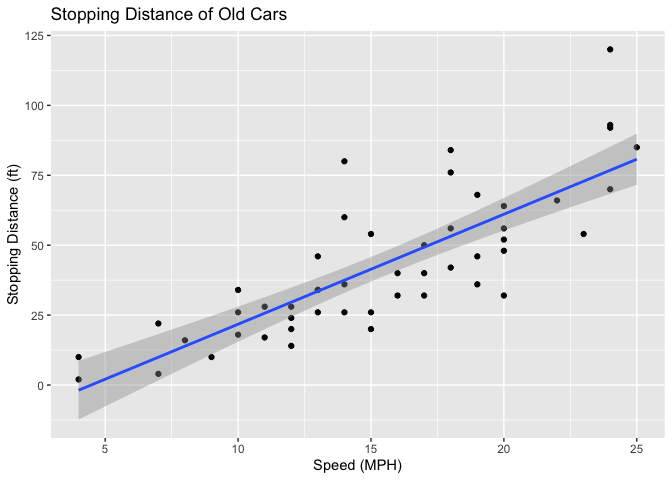
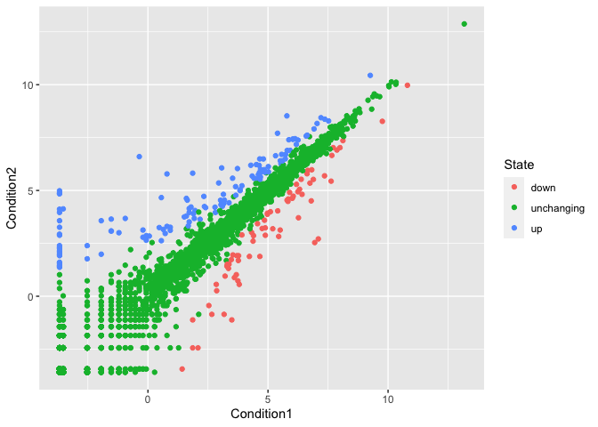
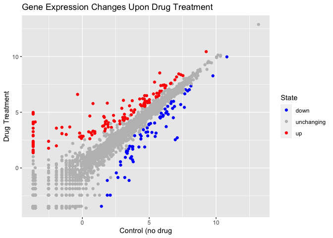
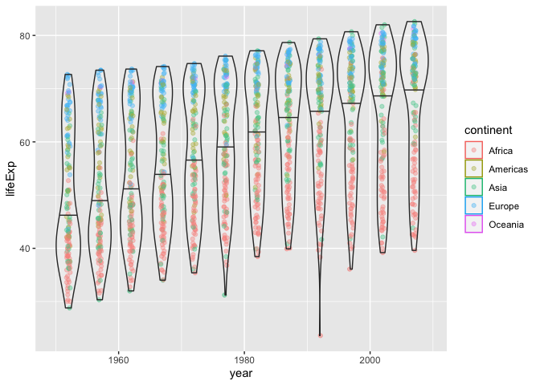

Class 05: Data Visualization
================
Yuhan Zhang
2021-12-03

``` r
# Class 05: Data Visualization
# install.packages("ggplot2")
library(ggplot2)

head(cars)
```

    ##   speed dist
    ## 1     4    2
    ## 2     4   10
    ## 3     7    4
    ## 4     7   22
    ## 5     8   16
    ## 6     9   10

``` r
# All ggplot have at lieast 3 layers,
# data + aes + geoms
p <- ggplot(data = cars) + 
  aes(x = speed, y = dist) +
  geom_point() +
  labs(title = "Stopping Distance of Old Cars", 
       x = "Speed (MPH)", 
       y = "Stopping Distance (ft)") + 
  geom_smooth(method = "lm", formula = 'y ~ x',  aes(x = speed, y = dist))

show(p)
```

<!-- -->

``` r
# Side-note: ggplot is not the only graphics systems
# a very popular one is good old "base" R graphics
plot(cars)
```

<!-- -->

``` r
# Plot some gene expression results.
# Dataset is online in tab separated format so we
# use the read.delim() function to import into R
url <- "https://bioboot.github.io/bimm143_S20/class-material/up_down_expression.txt"
genes <- read.delim(url)
head(genes)
```

    ##         Gene Condition1 Condition2      State
    ## 1      A4GNT -3.6808610 -3.4401355 unchanging
    ## 2       AAAS  4.5479580  4.3864126 unchanging
    ## 3      AASDH  3.7190695  3.4787276 unchanging
    ## 4       AATF  5.0784720  5.0151916 unchanging
    ## 5       AATK  0.4711421  0.5598642 unchanging
    ## 6 AB015752.4 -3.6808610 -3.5921390 unchanging

``` r
# Q. How many genes in this dataset
nrow(genes)
```

    ## [1] 5196

``` r
# Q. How many genes are "up"?
table(genes$State)
```

    ## 
    ##       down unchanging         up 
    ##         72       4997        127

``` r
# Q. What % are up?
round(table(genes$State)/nrow(genes) * 100, 2)
```

    ## 
    ##       down unchanging         up 
    ##       1.39      96.17       2.44

``` r
p <- ggplot(genes, aes(x = Condition1, y = Condition2, col = State)) + 
  geom_point()

show(p)
```

<!-- -->

``` r
p <- p + scale_color_manual(values = c("blue", "grey", "red")) + 
  labs(title = "Gene Expression Changes Upon Drug Treatment", 
       x = "Control (no drug", 
       y = "Drug Treatment")

show(p)
```

<!-- -->

``` r
# Let's explore the gapminder dataset
# install.packages("gapminder")
library(gapminder)
head(gapminder)
```

    ## # A tibble: 6 × 6
    ##   country     continent  year lifeExp      pop gdpPercap
    ##   <fct>       <fct>     <int>   <dbl>    <int>     <dbl>
    ## 1 Afghanistan Asia       1952    28.8  8425333      779.
    ## 2 Afghanistan Asia       1957    30.3  9240934      821.
    ## 3 Afghanistan Asia       1962    32.0 10267083      853.
    ## 4 Afghanistan Asia       1967    34.0 11537966      836.
    ## 5 Afghanistan Asia       1972    36.1 13079460      740.
    ## 6 Afghanistan Asia       1977    38.4 14880372      786.

``` r
# Let's make a new plot of year vs lifeExp
p <- ggplot(gapminder, aes(x = year, y = lifeExp, col = continent)) +
      geom_jitter(width = 0.3, alpha = 0.4) +
      geom_violin(aes(group = year), alpha = 0.2, 
                  draw_quantiles = 0.5) 

show(p)
```

<!-- -->

``` r
# Install the plotly
# install.packages("plotly")
library(plotly)
```

    ## 
    ## Attaching package: 'plotly'

    ## The following object is masked from 'package:ggplot2':
    ## 
    ##     last_plot

    ## The following object is masked from 'package:stats':
    ## 
    ##     filter

    ## The following object is masked from 'package:graphics':
    ## 
    ##     layout

``` r
ggplotly()
```

<div id="htmlwidget-da2f43e52d88ffbf74f8" style="width:672px;height:480px;" class="plotly html-widget"></div>
<script type="application/json" data-for="htmlwidget-da2f43e52d88ffbf74f8">{"x":{"data":[{"x":[1951.91108685657,1956.73596916958,1961.98405713653,1966.7582715671,1971.72597370856,1977.25487755327,1981.79361547981,1986.87849398451,1991.88132549464,1996.85376787111,2001.93138215067,2007.17443323182,1951.77185344975,1957.09497598913,1961.76786363577,1967.12713422347,1972.15620711488,1977.19025212624,1982.19295493099,1987.17023719479,1991.86232083677,1996.73543668292,2002.0720718788,2007.1361029251,1951.81728505781,1956.7607962518,1961.81512476518,1966.72096714876,1972.29577995217,1976.74190312689,1982.06016995418,1986.72920302562,1992.07260303958,1997.02456140816,2001.96981326346,2006.92879706305,1952.20490721799,1956.77719699391,1962.14433400375,1966.99388424479,1972.28059583632,1976.70844730521,1981.8063502341,1987.17696560132,1992.16070753708,1996.83729297891,2001.97759540235,2006.99830181524,1952.27894218559,1956.75735604032,1961.89356143838,1967.2867366544,1971.85997582264,1977.27171265078,1981.96695840317,1987.19627510495,1992.22351999017,1996.82081601764,2002.15573457978,2007.26365523399,1952.05580326244,1957.15847893418,1962.13981266296,1967.24219731572,1971.73833183963,1977.27243248639,1981.94181418843,1987.21849748869,1991.94253410436,1997.07956907293,2001.7945631607,2006.70099664251,1951.95971646341,1956.9835418297,1961.86218164926,1966.85883870209,1972.09532415997,1976.74568241653,1981.97814060757,1986.8352816985,1992.28131674943,1996.74959736895,2001.85894071865,2006.89567908053,1951.93668049946,1956.9057445528,1962.1594279883,1966.78570402116,1972.27820404489,1976.99742702395,1981.88591456776,1987.23067902368,1991.72820779029,1996.73840934108,2002.00431090891,2006.89454568587,1952.18463414893,1957.27875366053,1961.74802651522,1967.1742495216,1971.80765327974,1977.17816064055,1981.82881370094,1986.73270494775,1992.1640061806,1997.2908483942,2002.26621710765,2007.26634185635,1951.89315835531,1957.12879695809,1962.29440259174,1967.19373309417,1971.79485925296,1976.73174708202,1981.88020406151,1986.84095709939,1991.94793456877,1996.83505748357,2001.73517718771,2007.07150557339,1951.82721614568,1957.2227558956,1962.25879664649,1966.98633649074,1971.78625675612,1977.11258217185,1982.23157016123,1987.06271188422,1992.035135192,1996.9134076287,2002.10491713947,2006.93857770232,1952.10958527629,1957.10479826047,1962.19308370245,1966.71225395603,1971.70976060736,1976.89348369483,1982.22090938077,1987.10036230488,1992.23310197764,1996.83043567534,2001.97228295743,2006.95237456961,1952.2540862632,1956.75410727989,1962.29113157191,1967.06825203891,1971.71303021442,1976.99679115294,1982.25687980219,1987.19967103372,1991.85741583463,1997.2033351595,2001.89971027332,2007.14497016659,1952.24113693791,1956.90053043948,1961.90659689596,1967.23991127079,1972.09852220905,1977.27460896811,1982.02481688368,1987.14654810554,1992.06834357488,1996.90529184663,2001.76336445967,2007.07357812314,1951.80492662289,1956.88276573331,1961.9239737378,1966.93046019091,1971.8795303307,1976.91651878986,1982.16145724789,1986.74228536123,1991.98879313688,1997.29118281873,2001.7834538741,2006.99203135399,1951.78908717325,1956.80456136805,1962.02188442526,1967.10768128997,1971.84473592453,1976.96548249112,1982.17220763313,1987.0410938621,1991.84291785704,1996.9511950376,2002.05146892136,2006.79772294848,1952.08121172981,1957.28255350203,1962.08646817789,1966.76548490431,1972.04612871781,1977.05393378651,1981.81400893158,1986.83241447741,1991.83642386775,1997.24079193124,2002.21095989463,2007.08236242584,1952.24743219926,1956.89120838838,1961.70690627778,1967.19078455968,1972.04319941616,1977.10923024989,1981.84694147105,1987.19545627935,1991.73595712101,1996.80304982271,2002.29940122953,2006.89778927774,1951.85065899543,1956.79149543708,1962.21145830425,1966.70533472304,1972.02980053574,1976.94458782459,1981.80633326829,1987.16518793367,1992.10478338692,1997.00973196486,2002.02976063383,2006.78505794448,1951.7631182217,1956.96698245029,1961.93566198605,1967.18194316854,1971.99207623587,1976.81209597508,1981.70529114162,1986.98565337625,1992.08177002757,1997.06876727534,2001.85105277891,2007.14518397371,1951.74303888162,1957.13558316496,1962.29767175261,1967.17936354731,1971.94729819624,1977.18887354652,1982.13472389597,1986.81172052044,1991.75554557787,1996.91297206227,2001.78296666662,2007.19440285866,1951.98079111287,1957.10381725412,1962.21975374669,1967.27328610988,1972.16467873445,1976.77301722504,1982.02473246031,1986.84751071474,1992.16729793516,1997.1961566227,2002.14605318601,2007.21194031648,1952.27753177253,1956.94405464139,1962.01523456122,1967.20943846521,1972.25522041908,1976.85746553652,1982.16130118845,1986.83379664235,1992.10368721057,1997.00837411652,2002.09242284074,2006.85074229729,1952.21904334128,1956.83509031814,1962.14874870772,1966.95507009677,1972.05715521788,1976.87396616116,1981.70305645652,1987.01590203424,1992.00015659798,1996.76092899418,2002.15928206523,2007.12168092919,1952.18225290277,1957.23496371303,1961.86710708872,1967.2128277495,1971.99485850427,1977.15895348093,1981.83449841565,1987.18824925874,1991.79826385281,1996.88050433956,2001.96132807038,2006.7533355596,1952.23431733977,1956.72735126261,1961.93271648022,1967.25892615458,1971.7651642106,1977.13721102639,1982.10868320428,1986.76710598953,1992.03030643947,1996.73113552174,2002.24639467499,2006.86776952073,1952.22191234059,1957.21759742834,1961.84756853017,1967.05937318276,1971.81066499171,1976.81172176683,1981.75793214054,1986.85211918638,1992.08829914038,1996.73004357978,2002.16807545391,2007.17200445328,1952.15395500087,1957.14403143423,1961.73613545019,1966.97099725688,1971.96012390619,1976.7324556923,1982.22756028222,1987.04309882396,1991.78299586191,1997.10307675363,2001.79341768576,2007.24279015781,1952.29836109835,1956.83501096847,1962.25942226099,1966.78576164702,1971.90663853083,1977.19409331847,1981.93266139925,1987.28179872115,1992.05321477302,1996.90315574207,2001.90538171544,2007.00055200253,1952.23498971257,1956.75865325788,1961.92905294592,1966.89013013085,1971.84789035739,1976.82938203295,1981.79562048917,1986.8309160436,1992.0909573006,1997.13760202178,2001.83605393148,2006.98915902693,1952.10802476527,1957.08936939193,1961.94332072083,1967.00857874267,1972.13922971333,1977.02020703447,1981.99876402356,1986.82988588032,1991.87608951391,1997.16350438441,2002.18828718378,2006.70301900716,1951.78421155959,1956.72944331998,1961.84754269114,1967.19765274674,1972.27298867232,1976.73463639598,1982.21645650854,1986.92443423788,1991.76956303604,1997.16569496254,2002.19180318192,2007.23586418941,1951.80631833118,1957.28631842509,1962.2487401458,1966.80948728933,1971.75682664225,1977.23085986981,1981.81706418055,1986.97620546781,1991.86607154761,1996.70549984821,2002.13134137113,2006.71577187181,1952.24352945187,1956.99819444432,1961.81362976921,1967.16185559896,1972.15142813157,1976.9577818369,1981.97104726848,1986.89899901394,1991.74399414798,1996.87419969509,2002.19688068153,2007.25201797606,1951.83695843061,1956.72312942371,1962.24274428114,1967.08852811204,1972.13010840449,1977.12038411787,1981.72707870658,1987.1075724504,1992.15285107964,1997.09607476806,2002.16394838849,2006.811586397,1952.27252749442,1957.24693314871,1961.71920801359,1967.11128676701,1971.83314186665,1976.83607861269,1982.01786891697,1987.16750024189,1991.89479547371,1996.85195789146,2002.13979343879,2006.79224028946,1952.28432436739,1956.90940924366,1961.75538625326,1967.26505811689,1972.265417712,1977.01636471599,1982.24038436832,1987.19068382792,1991.84888328798,1997.26228121752,2001.77062693732,2006.97084960979,1951.77017718479,1956.97305633202,1961.87666001166,1966.84191404521,1972.29820962059,1977.02536881259,1982.22269587838,1986.90640914901,1991.87461013272,1997.0792515751,2002.14963019267,2006.89917321657,1952.25904093371,1957.03002653616,1961.78571492783,1967.25556337428,1972.05258100196,1976.76572805075,1982.00776745155,1986.81329471576,1992.24597393489,1997.0970815443,2002.23552772752,2007.08430530322,1952.22069852408,1957.18063690579,1961.9657124334,1967.29807970137,1972.16580025237,1977.14471781291,1982.27649793671,1986.77563518314,1991.92606919836,1997.03500539125,2001.83321375265,2006.96458151308,1951.76000286122,1957.08050888125,1962.26320014945,1967.10131714391,1971.91492956118,1977.16549448879,1982.07697197334,1986.93887361228,1991.76884606313,1997.1013248343,2001.95162078673,2006.97405989254,1952.21653297371,1956.74465445392,1962.14263469749,1966.85743549396,1972.07190370318,1976.71876705033,1981.82328708805,1986.84472891837,1992.09301639949,1997.19659579461,2001.83731172867,2007.29428293309,1952.02777384534,1956.79397709426,1961.74435813325,1966.70456451247,1972.27708578571,1977.02207705202,1981.98735037148,1986.8146512934,1991.93915565228,1996.95787600242,2002.12260693614,2006.86849454474,1951.91726564886,1957.10420149257,1962.23311184985,1967.23523284812,1972.22948809899,1976.96450774185,1981.70304785306,1986.8032179676,1992.07715266342,1996.87412065417,2001.87351024388,2006.78982451446,1951.70438696323,1957.06851684265,1962.26596277095,1967.01313786432,1972.11826392859,1977.07939972761,1981.98004578315,1986.98047151524,1992.29775697477,1996.71193379345,2001.78252953961,2007.04536275575,1951.87257710798,1957.25544578736,1962.02751185037,1966.74923821152,1971.72478000289,1977.18817653707,1981.74376878906,1986.84982436798,1991.91212132592,1997.1531234778,2001.86033321107,2007.08086501127,1951.77583220131,1956.84170439104,1962.00877253297,1967.02176547041,1972.04137183242,1976.80468794345,1982.22553157555,1987.10618268978,1992.12747894782,1997.1179790738,2002.23789926814,2006.94141358892,1952.04240182512,1956.75318299555,1962.28757116422,1967.16535468255,1972.21996362158,1977.03879414741,1982.25228070291,1986.92797172135,1992.2555942155,1996.8807617615,2002.24525564769,2007.29261332448,1951.81292267716,1957.29188897507,1961.80370149249,1967.20574199674,1971.86553778271,1976.92924199305,1982.01880917666,1987.10309460806,1991.90219272021,1997.13645643676,2001.85514890491,2007.12757003675,1952.10018380764,1956.9809028727,1962.14885052019,1966.98989182515,1971.76071424969,1976.91062527634,1981.97054476081,1987.19599689771,1992.11876295735,1996.81406409596,2002.20285415212,2006.71223072433,1952.20362270013,1957.0088940619,1961.95788611476,1966.77102387575,1971.86040031114,1976.884028765,1982.13421716494,1987.21083388347,1992.12666055486,1997.12300428697,2001.86131042209,2006.77035437613,1952.18548352937,1956.82837316096,1962.05044121621,1967.22749614571,1972.098736422,1977.13429677025,1982.21606812035,1987.25369500588,1991.91735150344,1996.89507905026,2001.96055865819,2006.91413076567],"y":[43.0769846211987,45.6848931361082,48.3031105553773,51.4069968225356,54.5180889266943,58.0139199470336,61.3678732978789,65.7989809037931,67.7440891659104,69.1519140333245,70.9938710075827,72.3010189995868,30.0149346560898,31.9991023891767,33.9999805896081,35.9850271699195,37.9281372305923,39.482892478452,39.9418723250139,39.9060190427635,40.6469231189868,40.9628890073243,41.0030850373258,42.7310538385515,38.2228899643848,40.357937981632,42.6179318392642,44.8849462850122,47.0141226764243,49.1900355964643,50.903929547189,52.337005533012,53.9190251906187,54.7770958265001,54.4060184848289,56.7281153441368,47.6219070546611,49.6180245364009,51.5199104352378,53.2979893029828,56.0238877501615,59.3188663686812,61.4839403574561,63.6221120651717,62.7451344503993,52.5560569244974,46.6338786087189,50.7279387077933,31.9750215904991,34.9060934212557,37.8141117363088,40.6968580661979,43.5909037017945,46.136984941487,48.1218638010762,49.5569915696404,50.2601148916507,50.3240290812394,50.6501123210335,52.2949322573687,39.0308827102713,40.5330195288275,42.045035918593,43.5481397536365,44.0571358377544,45.9100989975612,47.4709205447873,48.2111313203568,44.7361364972539,45.3260806344266,47.3599862537892,49.580095404567,38.5229000315453,40.4279520561127,42.6429787367601,44.7989451402703,47.0490738894817,49.3550512014967,52.9610651626622,54.9851280469947,54.3141165909597,52.1990773827792,49.8558943600809,50.429937179696,35.4630849423551,37.4638887304006,39.4749446706053,41.4779827765626,43.4569318912627,46.7749143609141,48.2949502461951,50.4850715896116,49.3961032031662,46.0659032688728,43.3079010212379,44.7410792656725,38.091913365859,39.8810922104908,41.715925834073,43.600943053496,45.5688758719544,47.3831076016857,49.5171122034327,51.0508800878319,51.7240971376303,51.573002745109,50.5250944322166,50.6508576487457,40.7149560498108,42.4600865832279,44.4668772271953,46.4720076213483,48.9440977373421,50.9390487922596,52.9329951918991,54.92606899719,57.939128521931,60.6599382620218,62.9741247963163,65.1520075212866,39.143104499005,40.6518799518095,42.1219211348852,44.0560126341088,45.9889076212701,47.8039979454428,47.7840363204438,47.4118677592966,45.5481361108942,42.5868628544197,44.9659317463013,46.4619033896794,42.1108618049886,45.0530018969962,48.435112818906,52.0401219405185,54.9071160050828,55.6251053461938,56.69512779702,57.4700583969196,56.4330490697467,52.9619142604568,52.97012192152,55.3219451401654,40.4770941815818,42.4688875619433,44.9300927851811,47.3499229310948,49.800946846412,52.3741051157264,53.9829104893841,54.6549884860812,52.0439027149796,47.9909146351786,46.8319024436258,48.3279258698005,34.8120764515304,37.328072193529,39.6928791502051,42.0739437780048,44.365900733089,46.5189033502472,48.8119040540586,50.0399787877136,51.6039578289063,53.1570876988764,53.3728673061504,54.7909886249793,41.892967791546,44.4441420695135,46.9921134722983,49.2929772306324,51.1368831999138,53.318864285648,56.0060839452077,59.7969390767503,63.674046216999,67.2171165950534,69.8060165388432,71.3379208824228,34.4818929314046,35.9831099858753,37.4851145173169,38.987033377304,40.5161107869462,42.02405255341,43.6619615353352,45.6639191085088,47.5450542117253,48.2450023176532,49.3480259490916,51.5788864150009,35.9278885464795,38.0471293701582,40.1581413717963,42.1888858198776,44.1419411530872,44.5349185741852,43.8900087486608,46.4530455836296,49.9909221373513,53.3781039272284,55.2399937717082,58.0400235393312,34.0779710708039,36.6669118183456,40.0588885099236,42.1149686559973,43.5150502003175,44.5100032254324,44.9158933674261,46.6839195490023,48.0909978748342,49.4021340635655,50.7250080008246,52.9469964470292,37.003053931284,38.9990790963268,40.4890023044206,44.5979870633603,48.6898614453927,52.789916809131,56.5641171203273,60.1899183547018,61.3659467783588,60.4610343879873,56.7609270769798,56.7348867864214,30.0000853895767,32.064886121007,33.8959675742122,35.8570710102986,38.308015269523,41.8419620174964,45.5799933021753,49.2650554600182,52.6439659502963,55.8611186179651,58.0409408926484,59.4480027186852,43.1488811026065,44.7789747698512,46.4520129452203,48.0720981795263,49.8749002414958,51.755909422469,53.743934477353,55.7290925953836,57.5011176718933,58.5559443394095,58.4529305560713,60.0221177301086,33.6088700664288,34.5580687460968,35.7531413257928,37.1970568217631,38.8418580654139,40.7618682993968,42.8911101284883,45.5518855785814,48.5760951275337,51.4549200568669,53.676137190203,56.0071312742192,32.4999635454799,33.4889259863197,34.4878821341656,35.4920286018965,36.4858916729323,37.46500333972,39.327140622995,41.2448973764477,43.2658816234021,44.8729533569956,45.5040568811748,46.3880534776117,42.2698918231952,44.6859067200691,47.9491135487065,50.6538986773434,53.5590223904367,56.1551207701418,58.7660136415203,59.3390883978627,59.2850037121444,54.406972887736,50.9920945222869,54.1100179727303,42.1380048622508,45.0469014717037,47.7470790093372,48.4919384004228,49.7668684760801,52.2081432241645,55.0779248072905,57.1800658147068,59.6849778612519,55.5579647951836,44.593137806303,42.5919946278323,38.4799128855975,39.4859087038275,40.5021123876526,41.5359641510401,42.6139438006741,43.7640657450809,44.85187177174,46.0270527727095,40.8018590197288,42.2209587033082,43.7530666330761,45.6781258491465,42.7230534813268,45.2890317021401,47.8080143326621,50.2271380925234,52.7731134814198,57.4420171573864,62.154998360942,66.234092119789,68.7550425525596,71.5550213523878,72.7370922483535,73.9520103369309,36.6808830707191,38.8650053574583,40.848106892874,42.8809351722564,44.8509656096355,46.8809441707987,48.9690148599736,49.3499727685407,52.2138930934019,54.9779007625727,57.2859789032321,59.4428820017175,36.2559777971485,37.2070936068142,38.4099143042303,39.4870527412315,41.7660496087716,43.7670878194908,45.6420602071814,47.4568927393016,49.4200067235751,47.4949720434355,45.008903291139,48.3031117881107,33.6850047953947,35.3070081865432,36.9360521990194,38.4869595970863,39.9770306020658,41.7139508281777,43.9159964411873,46.3640369438355,48.3880888450471,49.9031437268201,51.8181386483434,54.4669016132528,40.5429449093341,42.337880915602,44.2481154724493,46.2890810834267,48.437059792529,50.8521128618034,53.5989388631852,56.1449941031664,58.3329825720647,60.4300706667975,62.2471278197066,64.1639007757326,50.9861003013137,58.0889462328081,60.2459293822977,61.556862819854,62.9440210682141,64.9298620819225,66.7111350198964,68.7400112325458,69.7450610787403,70.7361262211117,71.9540827681397,72.8009415528466,42.8730818751852,45.4228916994394,47.9239528388594,50.3349162309594,52.8620691166027,55.7299080189779,59.6500996330748,62.6770717713194,65.3931016517185,67.6599755440852,69.6149578680565,71.1641148252081,31.2859001197662,33.779127745183,36.1610988337391,38.1130730812634,40.3278725915231,42.4949100085857,42.7949994881012,42.8608632836623,44.2840230013979,46.3439606078816,44.0258569991471,42.0820199400474,41.7249609097377,45.2261359302028,48.386128469414,51.1590675193804,53.8669218647871,56.4370427553382,58.968065079758,60.834908764246,61.9990013763851,58.9089321889851,51.478935188601,52.906060582827,37.4439331805733,38.5979688903207,39.4868718287114,40.1180247978964,40.5460515943955,41.2909124644984,42.5980061397852,44.55493635511,47.391075998312,51.3129315350847,54.496054698123,56.8668628111103,36.3239047217907,37.8020949220616,39.359995051188,41.0399232341007,42.8211419031514,44.5140304908641,45.8259449610587,46.8861269908383,47.472091770951,47.4639028069514,46.6078669007697,46.8589035321233,52.724141580456,55.089947200061,57.665869153122,60.5419981451424,64.2740686713173,67.0640751316499,69.8849065793838,71.9128671845803,73.6148941495223,74.7720997695128,75.7438594621353,76.4419619281736,39.9999078711316,41.5000639736714,42.9999309107324,44.1000305640708,44.6001139243586,44.9999722860641,46.2179406001635,44.0198943892792,23.5989150158428,36.0871400134604,43.4129635019033,46.2421000032071,46.4711305174379,48.9449180552585,51.8931212825081,54.4248948727813,56.4799085404654,58.5498595237682,60.3511128136937,61.7279085349156,62.7420998861766,63.3060895577662,64.336945832612,65.5281239919642,37.278076676338,39.328923554808,41.4540716951598,43.5630812368325,45.8149243147981,48.8791374747463,52.3788652424844,55.7690760420797,58.1960158634301,60.1869415430305,61.5999409934528,63.0618636726678,30.331045118286,31.5700311387073,32.7669012022488,34.1130856052981,35.3998852680675,36.787968501709,38.4451408690573,40.0061094374483,38.3328574543374,39.8969795903153,41.0120974809991,42.5680033112692,32.9780787891393,34.9771056924727,36.981125018558,38.9768864311593,40.9731155585199,41.9739193322688,42.9551254889717,44.5010152305403,39.6579182104438,43.7950888654313,45.9359980691727,48.1588632117797,45.0089049290971,47.9851099275268,49.9510505967109,51.9269940595337,53.6959658323357,55.5269780522737,58.1610058953478,60.8340208588845,61.8880099606407,60.2359292084151,53.3650664229697,49.3391248621009,38.634972791296,39.6241051342382,40.8699229850316,42.858039720396,45.0828926165373,47.7998684931235,50.3378644787464,51.7438886430308,53.555963157945,55.3729973909262,56.3690047843559,58.556134366969,41.407105640772,43.4241038168176,44.9919444687416,46.6329513053313,49.5519397519021,52.5371181438028,55.5609809735491,57.6779780816674,58.4740066951591,54.2889495106671,43.869104172016,39.6130983839921,41.2148610638309,42.9739978154889,44.2460534996434,45.7571275566401,47.6200254098069,49.919120854838,50.6079127722936,51.5351252986585,50.4400065348842,48.4658932484467,49.6509263882102,52.5169083969024,38.5959395155003,41.2078779502513,43.9219454972844,46.7690283303079,49.7589998772135,52.8870294641335,55.470959924229,56.9409094116092,58.0610567560805,58.3900694978381,57.561104629589,58.4199358604346,44.6000081950716,47.0999835039954,49.578869849271,52.0530112676849,55.6018606783133,59.836882051185,64.0480566261374,66.8939619608323,70.0009082890224,71.9730459508386,73.042137739613,73.9231001851772,39.9780251677335,42.5709357726275,45.3441262930802,48.0511068202504,51.0161318944372,50.3501188812052,49.8490032658307,51.509021882706,48.8251328306344,44.5780210820432,47.8130804439395,51.5419217040045,42.0379140155933,44.076866978179,46.0228995943562,47.768027133854,50.1070945823267,51.3861122404135,51.8208700199019,50.8208665960444,46.1000339727748,40.2379940829337,39.1928716622779,42.3841351509047,48.4510372438615,50.4690434173887,52.3581119255001,53.9948979702733,55.6349871738656,57.6740151202412,60.3628650794195,62.3510757178072,60.3771128187136,46.8090578045845,39.9888561682375,43.4870298574337],"text":["year: 1952<br />lifeExp: 43.07700<br />continent: Africa","year: 1957<br />lifeExp: 45.68500<br />continent: Africa","year: 1962<br />lifeExp: 48.30300<br />continent: Africa","year: 1967<br />lifeExp: 51.40700<br />continent: Africa","year: 1972<br />lifeExp: 54.51800<br />continent: Africa","year: 1977<br />lifeExp: 58.01400<br />continent: Africa","year: 1982<br />lifeExp: 61.36800<br />continent: Africa","year: 1987<br />lifeExp: 65.79900<br />continent: Africa","year: 1992<br />lifeExp: 67.74400<br />continent: Africa","year: 1997<br />lifeExp: 69.15200<br />continent: Africa","year: 2002<br />lifeExp: 70.99400<br />continent: Africa","year: 2007<br />lifeExp: 72.30100<br />continent: Africa","year: 1952<br />lifeExp: 30.01500<br />continent: Africa","year: 1957<br />lifeExp: 31.99900<br />continent: Africa","year: 1962<br />lifeExp: 34.00000<br />continent: Africa","year: 1967<br />lifeExp: 35.98500<br />continent: Africa","year: 1972<br />lifeExp: 37.92800<br />continent: Africa","year: 1977<br />lifeExp: 39.48300<br />continent: Africa","year: 1982<br />lifeExp: 39.94200<br />continent: Africa","year: 1987<br />lifeExp: 39.90600<br />continent: Africa","year: 1992<br />lifeExp: 40.64700<br />continent: Africa","year: 1997<br />lifeExp: 40.96300<br />continent: Africa","year: 2002<br />lifeExp: 41.00300<br />continent: Africa","year: 2007<br />lifeExp: 42.73100<br />continent: Africa","year: 1952<br />lifeExp: 38.22300<br />continent: Africa","year: 1957<br />lifeExp: 40.35800<br />continent: Africa","year: 1962<br />lifeExp: 42.61800<br />continent: Africa","year: 1967<br />lifeExp: 44.88500<br />continent: Africa","year: 1972<br />lifeExp: 47.01400<br />continent: Africa","year: 1977<br />lifeExp: 49.19000<br />continent: Africa","year: 1982<br />lifeExp: 50.90400<br />continent: Africa","year: 1987<br />lifeExp: 52.33700<br />continent: Africa","year: 1992<br />lifeExp: 53.91900<br />continent: Africa","year: 1997<br />lifeExp: 54.77700<br />continent: Africa","year: 2002<br />lifeExp: 54.40600<br />continent: Africa","year: 2007<br />lifeExp: 56.72800<br />continent: Africa","year: 1952<br />lifeExp: 47.62200<br />continent: Africa","year: 1957<br />lifeExp: 49.61800<br />continent: Africa","year: 1962<br />lifeExp: 51.52000<br />continent: Africa","year: 1967<br />lifeExp: 53.29800<br />continent: Africa","year: 1972<br />lifeExp: 56.02400<br />continent: Africa","year: 1977<br />lifeExp: 59.31900<br />continent: Africa","year: 1982<br />lifeExp: 61.48400<br />continent: Africa","year: 1987<br />lifeExp: 63.62200<br />continent: Africa","year: 1992<br />lifeExp: 62.74500<br />continent: Africa","year: 1997<br />lifeExp: 52.55600<br />continent: Africa","year: 2002<br />lifeExp: 46.63400<br />continent: Africa","year: 2007<br />lifeExp: 50.72800<br />continent: Africa","year: 1952<br />lifeExp: 31.97500<br />continent: Africa","year: 1957<br />lifeExp: 34.90600<br />continent: Africa","year: 1962<br />lifeExp: 37.81400<br />continent: Africa","year: 1967<br />lifeExp: 40.69700<br />continent: Africa","year: 1972<br />lifeExp: 43.59100<br />continent: Africa","year: 1977<br />lifeExp: 46.13700<br />continent: Africa","year: 1982<br />lifeExp: 48.12200<br />continent: Africa","year: 1987<br />lifeExp: 49.55700<br />continent: Africa","year: 1992<br />lifeExp: 50.26000<br />continent: Africa","year: 1997<br />lifeExp: 50.32400<br />continent: Africa","year: 2002<br />lifeExp: 50.65000<br />continent: Africa","year: 2007<br />lifeExp: 52.29500<br />continent: Africa","year: 1952<br />lifeExp: 39.03100<br />continent: Africa","year: 1957<br />lifeExp: 40.53300<br />continent: Africa","year: 1962<br />lifeExp: 42.04500<br />continent: Africa","year: 1967<br />lifeExp: 43.54800<br />continent: Africa","year: 1972<br />lifeExp: 44.05700<br />continent: Africa","year: 1977<br />lifeExp: 45.91000<br />continent: Africa","year: 1982<br />lifeExp: 47.47100<br />continent: Africa","year: 1987<br />lifeExp: 48.21100<br />continent: Africa","year: 1992<br />lifeExp: 44.73600<br />continent: Africa","year: 1997<br />lifeExp: 45.32600<br />continent: Africa","year: 2002<br />lifeExp: 47.36000<br />continent: Africa","year: 2007<br />lifeExp: 49.58000<br />continent: Africa","year: 1952<br />lifeExp: 38.52300<br />continent: Africa","year: 1957<br />lifeExp: 40.42800<br />continent: Africa","year: 1962<br />lifeExp: 42.64300<br />continent: Africa","year: 1967<br />lifeExp: 44.79900<br />continent: Africa","year: 1972<br />lifeExp: 47.04900<br />continent: Africa","year: 1977<br />lifeExp: 49.35500<br />continent: Africa","year: 1982<br />lifeExp: 52.96100<br />continent: Africa","year: 1987<br />lifeExp: 54.98500<br />continent: Africa","year: 1992<br />lifeExp: 54.31400<br />continent: Africa","year: 1997<br />lifeExp: 52.19900<br />continent: Africa","year: 2002<br />lifeExp: 49.85600<br />continent: Africa","year: 2007<br />lifeExp: 50.43000<br />continent: Africa","year: 1952<br />lifeExp: 35.46300<br />continent: Africa","year: 1957<br />lifeExp: 37.46400<br />continent: Africa","year: 1962<br />lifeExp: 39.47500<br />continent: Africa","year: 1967<br />lifeExp: 41.47800<br />continent: Africa","year: 1972<br />lifeExp: 43.45700<br />continent: Africa","year: 1977<br />lifeExp: 46.77500<br />continent: Africa","year: 1982<br />lifeExp: 48.29500<br />continent: Africa","year: 1987<br />lifeExp: 50.48500<br />continent: Africa","year: 1992<br />lifeExp: 49.39600<br />continent: Africa","year: 1997<br />lifeExp: 46.06600<br />continent: Africa","year: 2002<br />lifeExp: 43.30800<br />continent: Africa","year: 2007<br />lifeExp: 44.74100<br />continent: Africa","year: 1952<br />lifeExp: 38.09200<br />continent: Africa","year: 1957<br />lifeExp: 39.88100<br />continent: Africa","year: 1962<br />lifeExp: 41.71600<br />continent: Africa","year: 1967<br />lifeExp: 43.60100<br />continent: Africa","year: 1972<br />lifeExp: 45.56900<br />continent: Africa","year: 1977<br />lifeExp: 47.38300<br />continent: Africa","year: 1982<br />lifeExp: 49.51700<br />continent: Africa","year: 1987<br />lifeExp: 51.05100<br />continent: Africa","year: 1992<br />lifeExp: 51.72400<br />continent: Africa","year: 1997<br />lifeExp: 51.57300<br />continent: Africa","year: 2002<br />lifeExp: 50.52500<br />continent: Africa","year: 2007<br />lifeExp: 50.65100<br />continent: Africa","year: 1952<br />lifeExp: 40.71500<br />continent: Africa","year: 1957<br />lifeExp: 42.46000<br />continent: Africa","year: 1962<br />lifeExp: 44.46700<br />continent: Africa","year: 1967<br />lifeExp: 46.47200<br />continent: Africa","year: 1972<br />lifeExp: 48.94400<br />continent: Africa","year: 1977<br />lifeExp: 50.93900<br />continent: Africa","year: 1982<br />lifeExp: 52.93300<br />continent: Africa","year: 1987<br />lifeExp: 54.92600<br />continent: Africa","year: 1992<br />lifeExp: 57.93900<br />continent: Africa","year: 1997<br />lifeExp: 60.66000<br />continent: Africa","year: 2002<br />lifeExp: 62.97400<br />continent: Africa","year: 2007<br />lifeExp: 65.15200<br />continent: Africa","year: 1952<br />lifeExp: 39.14300<br />continent: Africa","year: 1957<br />lifeExp: 40.65200<br />continent: Africa","year: 1962<br />lifeExp: 42.12200<br />continent: Africa","year: 1967<br />lifeExp: 44.05600<br />continent: Africa","year: 1972<br />lifeExp: 45.98900<br />continent: Africa","year: 1977<br />lifeExp: 47.80400<br />continent: Africa","year: 1982<br />lifeExp: 47.78400<br />continent: Africa","year: 1987<br />lifeExp: 47.41200<br />continent: Africa","year: 1992<br />lifeExp: 45.54800<br />continent: Africa","year: 1997<br />lifeExp: 42.58700<br />continent: Africa","year: 2002<br />lifeExp: 44.96600<br />continent: Africa","year: 2007<br />lifeExp: 46.46200<br />continent: Africa","year: 1952<br />lifeExp: 42.11100<br />continent: Africa","year: 1957<br />lifeExp: 45.05300<br />continent: Africa","year: 1962<br />lifeExp: 48.43500<br />continent: Africa","year: 1967<br />lifeExp: 52.04000<br />continent: Africa","year: 1972<br />lifeExp: 54.90700<br />continent: Africa","year: 1977<br />lifeExp: 55.62500<br />continent: Africa","year: 1982<br />lifeExp: 56.69500<br />continent: Africa","year: 1987<br />lifeExp: 57.47000<br />continent: Africa","year: 1992<br />lifeExp: 56.43300<br />continent: Africa","year: 1997<br />lifeExp: 52.96200<br />continent: Africa","year: 2002<br />lifeExp: 52.97000<br />continent: Africa","year: 2007<br />lifeExp: 55.32200<br />continent: Africa","year: 1952<br />lifeExp: 40.47700<br />continent: Africa","year: 1957<br />lifeExp: 42.46900<br />continent: Africa","year: 1962<br />lifeExp: 44.93000<br />continent: Africa","year: 1967<br />lifeExp: 47.35000<br />continent: Africa","year: 1972<br />lifeExp: 49.80100<br />continent: Africa","year: 1977<br />lifeExp: 52.37400<br />continent: Africa","year: 1982<br />lifeExp: 53.98300<br />continent: Africa","year: 1987<br />lifeExp: 54.65500<br />continent: Africa","year: 1992<br />lifeExp: 52.04400<br />continent: Africa","year: 1997<br />lifeExp: 47.99100<br />continent: Africa","year: 2002<br />lifeExp: 46.83200<br />continent: Africa","year: 2007<br />lifeExp: 48.32800<br />continent: Africa","year: 1952<br />lifeExp: 34.81200<br />continent: Africa","year: 1957<br />lifeExp: 37.32800<br />continent: Africa","year: 1962<br />lifeExp: 39.69300<br />continent: Africa","year: 1967<br />lifeExp: 42.07400<br />continent: Africa","year: 1972<br />lifeExp: 44.36600<br />continent: Africa","year: 1977<br />lifeExp: 46.51900<br />continent: Africa","year: 1982<br />lifeExp: 48.81200<br />continent: Africa","year: 1987<br />lifeExp: 50.04000<br />continent: Africa","year: 1992<br />lifeExp: 51.60400<br />continent: Africa","year: 1997<br />lifeExp: 53.15700<br />continent: Africa","year: 2002<br />lifeExp: 53.37300<br />continent: Africa","year: 2007<br />lifeExp: 54.79100<br />continent: Africa","year: 1952<br />lifeExp: 41.89300<br />continent: Africa","year: 1957<br />lifeExp: 44.44400<br />continent: Africa","year: 1962<br />lifeExp: 46.99200<br />continent: Africa","year: 1967<br />lifeExp: 49.29300<br />continent: Africa","year: 1972<br />lifeExp: 51.13700<br />continent: Africa","year: 1977<br />lifeExp: 53.31900<br />continent: Africa","year: 1982<br />lifeExp: 56.00600<br />continent: Africa","year: 1987<br />lifeExp: 59.79700<br />continent: Africa","year: 1992<br />lifeExp: 63.67400<br />continent: Africa","year: 1997<br />lifeExp: 67.21700<br />continent: Africa","year: 2002<br />lifeExp: 69.80600<br />continent: Africa","year: 2007<br />lifeExp: 71.33800<br />continent: Africa","year: 1952<br />lifeExp: 34.48200<br />continent: Africa","year: 1957<br />lifeExp: 35.98300<br />continent: Africa","year: 1962<br />lifeExp: 37.48500<br />continent: Africa","year: 1967<br />lifeExp: 38.98700<br />continent: Africa","year: 1972<br />lifeExp: 40.51600<br />continent: Africa","year: 1977<br />lifeExp: 42.02400<br />continent: Africa","year: 1982<br />lifeExp: 43.66200<br />continent: Africa","year: 1987<br />lifeExp: 45.66400<br />continent: Africa","year: 1992<br />lifeExp: 47.54500<br />continent: Africa","year: 1997<br />lifeExp: 48.24500<br />continent: Africa","year: 2002<br />lifeExp: 49.34800<br />continent: Africa","year: 2007<br />lifeExp: 51.57900<br />continent: Africa","year: 1952<br />lifeExp: 35.92800<br />continent: Africa","year: 1957<br />lifeExp: 38.04700<br />continent: Africa","year: 1962<br />lifeExp: 40.15800<br />continent: Africa","year: 1967<br />lifeExp: 42.18900<br />continent: Africa","year: 1972<br />lifeExp: 44.14200<br />continent: Africa","year: 1977<br />lifeExp: 44.53500<br />continent: Africa","year: 1982<br />lifeExp: 43.89000<br />continent: Africa","year: 1987<br />lifeExp: 46.45300<br />continent: Africa","year: 1992<br />lifeExp: 49.99100<br />continent: Africa","year: 1997<br />lifeExp: 53.37800<br />continent: Africa","year: 2002<br />lifeExp: 55.24000<br />continent: Africa","year: 2007<br />lifeExp: 58.04000<br />continent: Africa","year: 1952<br />lifeExp: 34.07800<br />continent: Africa","year: 1957<br />lifeExp: 36.66700<br />continent: Africa","year: 1962<br />lifeExp: 40.05900<br />continent: Africa","year: 1967<br />lifeExp: 42.11500<br />continent: Africa","year: 1972<br />lifeExp: 43.51500<br />continent: Africa","year: 1977<br />lifeExp: 44.51000<br />continent: Africa","year: 1982<br />lifeExp: 44.91600<br />continent: Africa","year: 1987<br />lifeExp: 46.68400<br />continent: Africa","year: 1992<br />lifeExp: 48.09100<br />continent: Africa","year: 1997<br />lifeExp: 49.40200<br />continent: Africa","year: 2002<br />lifeExp: 50.72500<br />continent: Africa","year: 2007<br />lifeExp: 52.94700<br />continent: Africa","year: 1952<br />lifeExp: 37.00300<br />continent: Africa","year: 1957<br />lifeExp: 38.99900<br />continent: Africa","year: 1962<br />lifeExp: 40.48900<br />continent: Africa","year: 1967<br />lifeExp: 44.59800<br />continent: Africa","year: 1972<br />lifeExp: 48.69000<br />continent: Africa","year: 1977<br />lifeExp: 52.79000<br />continent: Africa","year: 1982<br />lifeExp: 56.56400<br />continent: Africa","year: 1987<br />lifeExp: 60.19000<br />continent: Africa","year: 1992<br />lifeExp: 61.36600<br />continent: Africa","year: 1997<br />lifeExp: 60.46100<br />continent: Africa","year: 2002<br />lifeExp: 56.76100<br />continent: Africa","year: 2007<br />lifeExp: 56.73500<br />continent: Africa","year: 1952<br />lifeExp: 30.00000<br />continent: Africa","year: 1957<br />lifeExp: 32.06500<br />continent: Africa","year: 1962<br />lifeExp: 33.89600<br />continent: Africa","year: 1967<br />lifeExp: 35.85700<br />continent: Africa","year: 1972<br />lifeExp: 38.30800<br />continent: Africa","year: 1977<br />lifeExp: 41.84200<br />continent: Africa","year: 1982<br />lifeExp: 45.58000<br />continent: Africa","year: 1987<br />lifeExp: 49.26500<br />continent: Africa","year: 1992<br />lifeExp: 52.64400<br />continent: Africa","year: 1997<br />lifeExp: 55.86100<br />continent: Africa","year: 2002<br />lifeExp: 58.04100<br />continent: Africa","year: 2007<br />lifeExp: 59.44800<br />continent: Africa","year: 1952<br />lifeExp: 43.14900<br />continent: Africa","year: 1957<br />lifeExp: 44.77900<br />continent: Africa","year: 1962<br />lifeExp: 46.45200<br />continent: Africa","year: 1967<br />lifeExp: 48.07200<br />continent: Africa","year: 1972<br />lifeExp: 49.87500<br />continent: Africa","year: 1977<br />lifeExp: 51.75600<br />continent: Africa","year: 1982<br />lifeExp: 53.74400<br />continent: Africa","year: 1987<br />lifeExp: 55.72900<br />continent: Africa","year: 1992<br />lifeExp: 57.50100<br />continent: Africa","year: 1997<br />lifeExp: 58.55600<br />continent: Africa","year: 2002<br />lifeExp: 58.45300<br />continent: Africa","year: 2007<br />lifeExp: 60.02200<br />continent: Africa","year: 1952<br />lifeExp: 33.60900<br />continent: Africa","year: 1957<br />lifeExp: 34.55800<br />continent: Africa","year: 1962<br />lifeExp: 35.75300<br />continent: Africa","year: 1967<br />lifeExp: 37.19700<br />continent: Africa","year: 1972<br />lifeExp: 38.84200<br />continent: Africa","year: 1977<br />lifeExp: 40.76200<br />continent: Africa","year: 1982<br />lifeExp: 42.89100<br />continent: Africa","year: 1987<br />lifeExp: 45.55200<br />continent: Africa","year: 1992<br />lifeExp: 48.57600<br />continent: Africa","year: 1997<br />lifeExp: 51.45500<br />continent: Africa","year: 2002<br />lifeExp: 53.67600<br />continent: Africa","year: 2007<br />lifeExp: 56.00700<br />continent: Africa","year: 1952<br />lifeExp: 32.50000<br />continent: Africa","year: 1957<br />lifeExp: 33.48900<br />continent: Africa","year: 1962<br />lifeExp: 34.48800<br />continent: Africa","year: 1967<br />lifeExp: 35.49200<br />continent: Africa","year: 1972<br />lifeExp: 36.48600<br />continent: Africa","year: 1977<br />lifeExp: 37.46500<br />continent: Africa","year: 1982<br />lifeExp: 39.32700<br />continent: Africa","year: 1987<br />lifeExp: 41.24500<br />continent: Africa","year: 1992<br />lifeExp: 43.26600<br />continent: Africa","year: 1997<br />lifeExp: 44.87300<br />continent: Africa","year: 2002<br />lifeExp: 45.50400<br />continent: Africa","year: 2007<br />lifeExp: 46.38800<br />continent: Africa","year: 1952<br />lifeExp: 42.27000<br />continent: Africa","year: 1957<br />lifeExp: 44.68600<br />continent: Africa","year: 1962<br />lifeExp: 47.94900<br />continent: Africa","year: 1967<br />lifeExp: 50.65400<br />continent: Africa","year: 1972<br />lifeExp: 53.55900<br />continent: Africa","year: 1977<br />lifeExp: 56.15500<br />continent: Africa","year: 1982<br />lifeExp: 58.76600<br />continent: Africa","year: 1987<br />lifeExp: 59.33900<br />continent: Africa","year: 1992<br />lifeExp: 59.28500<br />continent: Africa","year: 1997<br />lifeExp: 54.40700<br />continent: Africa","year: 2002<br />lifeExp: 50.99200<br />continent: Africa","year: 2007<br />lifeExp: 54.11000<br />continent: Africa","year: 1952<br />lifeExp: 42.13800<br />continent: Africa","year: 1957<br />lifeExp: 45.04700<br />continent: Africa","year: 1962<br />lifeExp: 47.74700<br />continent: Africa","year: 1967<br />lifeExp: 48.49200<br />continent: Africa","year: 1972<br />lifeExp: 49.76700<br />continent: Africa","year: 1977<br />lifeExp: 52.20800<br />continent: Africa","year: 1982<br />lifeExp: 55.07800<br />continent: Africa","year: 1987<br />lifeExp: 57.18000<br />continent: Africa","year: 1992<br />lifeExp: 59.68500<br />continent: Africa","year: 1997<br />lifeExp: 55.55800<br />continent: Africa","year: 2002<br />lifeExp: 44.59300<br />continent: Africa","year: 2007<br />lifeExp: 42.59200<br />continent: Africa","year: 1952<br />lifeExp: 38.48000<br />continent: Africa","year: 1957<br />lifeExp: 39.48600<br />continent: Africa","year: 1962<br />lifeExp: 40.50200<br />continent: Africa","year: 1967<br />lifeExp: 41.53600<br />continent: Africa","year: 1972<br />lifeExp: 42.61400<br />continent: Africa","year: 1977<br />lifeExp: 43.76400<br />continent: Africa","year: 1982<br />lifeExp: 44.85200<br />continent: Africa","year: 1987<br />lifeExp: 46.02700<br />continent: Africa","year: 1992<br />lifeExp: 40.80200<br />continent: Africa","year: 1997<br />lifeExp: 42.22100<br />continent: Africa","year: 2002<br />lifeExp: 43.75300<br />continent: Africa","year: 2007<br />lifeExp: 45.67800<br />continent: Africa","year: 1952<br />lifeExp: 42.72300<br />continent: Africa","year: 1957<br />lifeExp: 45.28900<br />continent: Africa","year: 1962<br />lifeExp: 47.80800<br />continent: Africa","year: 1967<br />lifeExp: 50.22700<br />continent: Africa","year: 1972<br />lifeExp: 52.77300<br />continent: Africa","year: 1977<br />lifeExp: 57.44200<br />continent: Africa","year: 1982<br />lifeExp: 62.15500<br />continent: Africa","year: 1987<br />lifeExp: 66.23400<br />continent: Africa","year: 1992<br />lifeExp: 68.75500<br />continent: Africa","year: 1997<br />lifeExp: 71.55500<br />continent: Africa","year: 2002<br />lifeExp: 72.73700<br />continent: Africa","year: 2007<br />lifeExp: 73.95200<br />continent: Africa","year: 1952<br />lifeExp: 36.68100<br />continent: Africa","year: 1957<br />lifeExp: 38.86500<br />continent: Africa","year: 1962<br />lifeExp: 40.84800<br />continent: Africa","year: 1967<br />lifeExp: 42.88100<br />continent: Africa","year: 1972<br />lifeExp: 44.85100<br />continent: Africa","year: 1977<br />lifeExp: 46.88100<br />continent: Africa","year: 1982<br />lifeExp: 48.96900<br />continent: Africa","year: 1987<br />lifeExp: 49.35000<br />continent: Africa","year: 1992<br />lifeExp: 52.21400<br />continent: Africa","year: 1997<br />lifeExp: 54.97800<br />continent: Africa","year: 2002<br />lifeExp: 57.28600<br />continent: Africa","year: 2007<br />lifeExp: 59.44300<br />continent: Africa","year: 1952<br />lifeExp: 36.25600<br />continent: Africa","year: 1957<br />lifeExp: 37.20700<br />continent: Africa","year: 1962<br />lifeExp: 38.41000<br />continent: Africa","year: 1967<br />lifeExp: 39.48700<br />continent: Africa","year: 1972<br />lifeExp: 41.76600<br />continent: Africa","year: 1977<br />lifeExp: 43.76700<br />continent: Africa","year: 1982<br />lifeExp: 45.64200<br />continent: Africa","year: 1987<br />lifeExp: 47.45700<br />continent: Africa","year: 1992<br />lifeExp: 49.42000<br />continent: Africa","year: 1997<br />lifeExp: 47.49500<br />continent: Africa","year: 2002<br />lifeExp: 45.00900<br />continent: Africa","year: 2007<br />lifeExp: 48.30300<br />continent: Africa","year: 1952<br />lifeExp: 33.68500<br />continent: Africa","year: 1957<br />lifeExp: 35.30700<br />continent: Africa","year: 1962<br />lifeExp: 36.93600<br />continent: Africa","year: 1967<br />lifeExp: 38.48700<br />continent: Africa","year: 1972<br />lifeExp: 39.97700<br />continent: Africa","year: 1977<br />lifeExp: 41.71400<br />continent: Africa","year: 1982<br />lifeExp: 43.91600<br />continent: Africa","year: 1987<br />lifeExp: 46.36400<br />continent: Africa","year: 1992<br />lifeExp: 48.38800<br />continent: Africa","year: 1997<br />lifeExp: 49.90300<br />continent: Africa","year: 2002<br />lifeExp: 51.81800<br />continent: Africa","year: 2007<br />lifeExp: 54.46700<br />continent: Africa","year: 1952<br />lifeExp: 40.54300<br />continent: Africa","year: 1957<br />lifeExp: 42.33800<br />continent: Africa","year: 1962<br />lifeExp: 44.24800<br />continent: Africa","year: 1967<br />lifeExp: 46.28900<br />continent: Africa","year: 1972<br />lifeExp: 48.43700<br />continent: Africa","year: 1977<br />lifeExp: 50.85200<br />continent: Africa","year: 1982<br />lifeExp: 53.59900<br />continent: Africa","year: 1987<br />lifeExp: 56.14500<br />continent: Africa","year: 1992<br />lifeExp: 58.33300<br />continent: Africa","year: 1997<br />lifeExp: 60.43000<br />continent: Africa","year: 2002<br />lifeExp: 62.24700<br />continent: Africa","year: 2007<br />lifeExp: 64.16400<br />continent: Africa","year: 1952<br />lifeExp: 50.98600<br />continent: Africa","year: 1957<br />lifeExp: 58.08900<br />continent: Africa","year: 1962<br />lifeExp: 60.24600<br />continent: Africa","year: 1967<br />lifeExp: 61.55700<br />continent: Africa","year: 1972<br />lifeExp: 62.94400<br />continent: Africa","year: 1977<br />lifeExp: 64.93000<br />continent: Africa","year: 1982<br />lifeExp: 66.71100<br />continent: Africa","year: 1987<br />lifeExp: 68.74000<br />continent: Africa","year: 1992<br />lifeExp: 69.74500<br />continent: Africa","year: 1997<br />lifeExp: 70.73600<br />continent: Africa","year: 2002<br />lifeExp: 71.95400<br />continent: Africa","year: 2007<br />lifeExp: 72.80100<br />continent: Africa","year: 1952<br />lifeExp: 42.87300<br />continent: Africa","year: 1957<br />lifeExp: 45.42300<br />continent: Africa","year: 1962<br />lifeExp: 47.92400<br />continent: Africa","year: 1967<br />lifeExp: 50.33500<br />continent: Africa","year: 1972<br />lifeExp: 52.86200<br />continent: Africa","year: 1977<br />lifeExp: 55.73000<br />continent: Africa","year: 1982<br />lifeExp: 59.65000<br />continent: Africa","year: 1987<br />lifeExp: 62.67700<br />continent: Africa","year: 1992<br />lifeExp: 65.39300<br />continent: Africa","year: 1997<br />lifeExp: 67.66000<br />continent: Africa","year: 2002<br />lifeExp: 69.61500<br />continent: Africa","year: 2007<br />lifeExp: 71.16400<br />continent: Africa","year: 1952<br />lifeExp: 31.28600<br />continent: Africa","year: 1957<br />lifeExp: 33.77900<br />continent: Africa","year: 1962<br />lifeExp: 36.16100<br />continent: Africa","year: 1967<br />lifeExp: 38.11300<br />continent: Africa","year: 1972<br />lifeExp: 40.32800<br />continent: Africa","year: 1977<br />lifeExp: 42.49500<br />continent: Africa","year: 1982<br />lifeExp: 42.79500<br />continent: Africa","year: 1987<br />lifeExp: 42.86100<br />continent: Africa","year: 1992<br />lifeExp: 44.28400<br />continent: Africa","year: 1997<br />lifeExp: 46.34400<br />continent: Africa","year: 2002<br />lifeExp: 44.02600<br />continent: Africa","year: 2007<br />lifeExp: 42.08200<br />continent: Africa","year: 1952<br />lifeExp: 41.72500<br />continent: Africa","year: 1957<br />lifeExp: 45.22600<br />continent: Africa","year: 1962<br />lifeExp: 48.38600<br />continent: Africa","year: 1967<br />lifeExp: 51.15900<br />continent: Africa","year: 1972<br />lifeExp: 53.86700<br />continent: Africa","year: 1977<br />lifeExp: 56.43700<br />continent: Africa","year: 1982<br />lifeExp: 58.96800<br />continent: Africa","year: 1987<br />lifeExp: 60.83500<br />continent: Africa","year: 1992<br />lifeExp: 61.99900<br />continent: Africa","year: 1997<br />lifeExp: 58.90900<br />continent: Africa","year: 2002<br />lifeExp: 51.47900<br />continent: Africa","year: 2007<br />lifeExp: 52.90600<br />continent: Africa","year: 1952<br />lifeExp: 37.44400<br />continent: Africa","year: 1957<br />lifeExp: 38.59800<br />continent: Africa","year: 1962<br />lifeExp: 39.48700<br />continent: Africa","year: 1967<br />lifeExp: 40.11800<br />continent: Africa","year: 1972<br />lifeExp: 40.54600<br />continent: Africa","year: 1977<br />lifeExp: 41.29100<br />continent: Africa","year: 1982<br />lifeExp: 42.59800<br />continent: Africa","year: 1987<br />lifeExp: 44.55500<br />continent: Africa","year: 1992<br />lifeExp: 47.39100<br />continent: Africa","year: 1997<br />lifeExp: 51.31300<br />continent: Africa","year: 2002<br />lifeExp: 54.49600<br />continent: Africa","year: 2007<br />lifeExp: 56.86700<br />continent: Africa","year: 1952<br />lifeExp: 36.32400<br />continent: Africa","year: 1957<br />lifeExp: 37.80200<br />continent: Africa","year: 1962<br />lifeExp: 39.36000<br />continent: Africa","year: 1967<br />lifeExp: 41.04000<br />continent: Africa","year: 1972<br />lifeExp: 42.82100<br />continent: Africa","year: 1977<br />lifeExp: 44.51400<br />continent: Africa","year: 1982<br />lifeExp: 45.82600<br />continent: Africa","year: 1987<br />lifeExp: 46.88600<br />continent: Africa","year: 1992<br />lifeExp: 47.47200<br />continent: Africa","year: 1997<br />lifeExp: 47.46400<br />continent: Africa","year: 2002<br />lifeExp: 46.60800<br />continent: Africa","year: 2007<br />lifeExp: 46.85900<br />continent: Africa","year: 1952<br />lifeExp: 52.72400<br />continent: Africa","year: 1957<br />lifeExp: 55.09000<br />continent: Africa","year: 1962<br />lifeExp: 57.66600<br />continent: Africa","year: 1967<br />lifeExp: 60.54200<br />continent: Africa","year: 1972<br />lifeExp: 64.27400<br />continent: Africa","year: 1977<br />lifeExp: 67.06400<br />continent: Africa","year: 1982<br />lifeExp: 69.88500<br />continent: Africa","year: 1987<br />lifeExp: 71.91300<br />continent: Africa","year: 1992<br />lifeExp: 73.61500<br />continent: Africa","year: 1997<br />lifeExp: 74.77200<br />continent: Africa","year: 2002<br />lifeExp: 75.74400<br />continent: Africa","year: 2007<br />lifeExp: 76.44200<br />continent: Africa","year: 1952<br />lifeExp: 40.00000<br />continent: Africa","year: 1957<br />lifeExp: 41.50000<br />continent: Africa","year: 1962<br />lifeExp: 43.00000<br />continent: Africa","year: 1967<br />lifeExp: 44.10000<br />continent: Africa","year: 1972<br />lifeExp: 44.60000<br />continent: Africa","year: 1977<br />lifeExp: 45.00000<br />continent: Africa","year: 1982<br />lifeExp: 46.21800<br />continent: Africa","year: 1987<br />lifeExp: 44.02000<br />continent: Africa","year: 1992<br />lifeExp: 23.59900<br />continent: Africa","year: 1997<br />lifeExp: 36.08700<br />continent: Africa","year: 2002<br />lifeExp: 43.41300<br />continent: Africa","year: 2007<br />lifeExp: 46.24200<br />continent: Africa","year: 1952<br />lifeExp: 46.47100<br />continent: Africa","year: 1957<br />lifeExp: 48.94500<br />continent: Africa","year: 1962<br />lifeExp: 51.89300<br />continent: Africa","year: 1967<br />lifeExp: 54.42500<br />continent: Africa","year: 1972<br />lifeExp: 56.48000<br />continent: Africa","year: 1977<br />lifeExp: 58.55000<br />continent: Africa","year: 1982<br />lifeExp: 60.35100<br />continent: Africa","year: 1987<br />lifeExp: 61.72800<br />continent: Africa","year: 1992<br />lifeExp: 62.74200<br />continent: Africa","year: 1997<br />lifeExp: 63.30600<br />continent: Africa","year: 2002<br />lifeExp: 64.33700<br />continent: Africa","year: 2007<br />lifeExp: 65.52800<br />continent: Africa","year: 1952<br />lifeExp: 37.27800<br />continent: Africa","year: 1957<br />lifeExp: 39.32900<br />continent: Africa","year: 1962<br />lifeExp: 41.45400<br />continent: Africa","year: 1967<br />lifeExp: 43.56300<br />continent: Africa","year: 1972<br />lifeExp: 45.81500<br />continent: Africa","year: 1977<br />lifeExp: 48.87900<br />continent: Africa","year: 1982<br />lifeExp: 52.37900<br />continent: Africa","year: 1987<br />lifeExp: 55.76900<br />continent: Africa","year: 1992<br />lifeExp: 58.19600<br />continent: Africa","year: 1997<br />lifeExp: 60.18700<br />continent: Africa","year: 2002<br />lifeExp: 61.60000<br />continent: Africa","year: 2007<br />lifeExp: 63.06200<br />continent: Africa","year: 1952<br />lifeExp: 30.33100<br />continent: Africa","year: 1957<br />lifeExp: 31.57000<br />continent: Africa","year: 1962<br />lifeExp: 32.76700<br />continent: Africa","year: 1967<br />lifeExp: 34.11300<br />continent: Africa","year: 1972<br />lifeExp: 35.40000<br />continent: Africa","year: 1977<br />lifeExp: 36.78800<br />continent: Africa","year: 1982<br />lifeExp: 38.44500<br />continent: Africa","year: 1987<br />lifeExp: 40.00600<br />continent: Africa","year: 1992<br />lifeExp: 38.33300<br />continent: Africa","year: 1997<br />lifeExp: 39.89700<br />continent: Africa","year: 2002<br />lifeExp: 41.01200<br />continent: Africa","year: 2007<br />lifeExp: 42.56800<br />continent: Africa","year: 1952<br />lifeExp: 32.97800<br />continent: Africa","year: 1957<br />lifeExp: 34.97700<br />continent: Africa","year: 1962<br />lifeExp: 36.98100<br />continent: Africa","year: 1967<br />lifeExp: 38.97700<br />continent: Africa","year: 1972<br />lifeExp: 40.97300<br />continent: Africa","year: 1977<br />lifeExp: 41.97400<br />continent: Africa","year: 1982<br />lifeExp: 42.95500<br />continent: Africa","year: 1987<br />lifeExp: 44.50100<br />continent: Africa","year: 1992<br />lifeExp: 39.65800<br />continent: Africa","year: 1997<br />lifeExp: 43.79500<br />continent: Africa","year: 2002<br />lifeExp: 45.93600<br />continent: Africa","year: 2007<br />lifeExp: 48.15900<br />continent: Africa","year: 1952<br />lifeExp: 45.00900<br />continent: Africa","year: 1957<br />lifeExp: 47.98500<br />continent: Africa","year: 1962<br />lifeExp: 49.95100<br />continent: Africa","year: 1967<br />lifeExp: 51.92700<br />continent: Africa","year: 1972<br />lifeExp: 53.69600<br />continent: Africa","year: 1977<br />lifeExp: 55.52700<br />continent: Africa","year: 1982<br />lifeExp: 58.16100<br />continent: Africa","year: 1987<br />lifeExp: 60.83400<br />continent: Africa","year: 1992<br />lifeExp: 61.88800<br />continent: Africa","year: 1997<br />lifeExp: 60.23600<br />continent: Africa","year: 2002<br />lifeExp: 53.36500<br />continent: Africa","year: 2007<br />lifeExp: 49.33900<br />continent: Africa","year: 1952<br />lifeExp: 38.63500<br />continent: Africa","year: 1957<br />lifeExp: 39.62400<br />continent: Africa","year: 1962<br />lifeExp: 40.87000<br />continent: Africa","year: 1967<br />lifeExp: 42.85800<br />continent: Africa","year: 1972<br />lifeExp: 45.08300<br />continent: Africa","year: 1977<br />lifeExp: 47.80000<br />continent: Africa","year: 1982<br />lifeExp: 50.33800<br />continent: Africa","year: 1987<br />lifeExp: 51.74400<br />continent: Africa","year: 1992<br />lifeExp: 53.55600<br />continent: Africa","year: 1997<br />lifeExp: 55.37300<br />continent: Africa","year: 2002<br />lifeExp: 56.36900<br />continent: Africa","year: 2007<br />lifeExp: 58.55600<br />continent: Africa","year: 1952<br />lifeExp: 41.40700<br />continent: Africa","year: 1957<br />lifeExp: 43.42400<br />continent: Africa","year: 1962<br />lifeExp: 44.99200<br />continent: Africa","year: 1967<br />lifeExp: 46.63300<br />continent: Africa","year: 1972<br />lifeExp: 49.55200<br />continent: Africa","year: 1977<br />lifeExp: 52.53700<br />continent: Africa","year: 1982<br />lifeExp: 55.56100<br />continent: Africa","year: 1987<br />lifeExp: 57.67800<br />continent: Africa","year: 1992<br />lifeExp: 58.47400<br />continent: Africa","year: 1997<br />lifeExp: 54.28900<br />continent: Africa","year: 2002<br />lifeExp: 43.86900<br />continent: Africa","year: 2007<br />lifeExp: 39.61300<br />continent: Africa","year: 1952<br />lifeExp: 41.21500<br />continent: Africa","year: 1957<br />lifeExp: 42.97400<br />continent: Africa","year: 1962<br />lifeExp: 44.24600<br />continent: Africa","year: 1967<br />lifeExp: 45.75700<br />continent: Africa","year: 1972<br />lifeExp: 47.62000<br />continent: Africa","year: 1977<br />lifeExp: 49.91900<br />continent: Africa","year: 1982<br />lifeExp: 50.60800<br />continent: Africa","year: 1987<br />lifeExp: 51.53500<br />continent: Africa","year: 1992<br />lifeExp: 50.44000<br />continent: Africa","year: 1997<br />lifeExp: 48.46600<br />continent: Africa","year: 2002<br />lifeExp: 49.65100<br />continent: Africa","year: 2007<br />lifeExp: 52.51700<br />continent: Africa","year: 1952<br />lifeExp: 38.59600<br />continent: Africa","year: 1957<br />lifeExp: 41.20800<br />continent: Africa","year: 1962<br />lifeExp: 43.92200<br />continent: Africa","year: 1967<br />lifeExp: 46.76900<br />continent: Africa","year: 1972<br />lifeExp: 49.75900<br />continent: Africa","year: 1977<br />lifeExp: 52.88700<br />continent: Africa","year: 1982<br />lifeExp: 55.47100<br />continent: Africa","year: 1987<br />lifeExp: 56.94100<br />continent: Africa","year: 1992<br />lifeExp: 58.06100<br />continent: Africa","year: 1997<br />lifeExp: 58.39000<br />continent: Africa","year: 2002<br />lifeExp: 57.56100<br />continent: Africa","year: 2007<br />lifeExp: 58.42000<br />continent: Africa","year: 1952<br />lifeExp: 44.60000<br />continent: Africa","year: 1957<br />lifeExp: 47.10000<br />continent: Africa","year: 1962<br />lifeExp: 49.57900<br />continent: Africa","year: 1967<br />lifeExp: 52.05300<br />continent: Africa","year: 1972<br />lifeExp: 55.60200<br />continent: Africa","year: 1977<br />lifeExp: 59.83700<br />continent: Africa","year: 1982<br />lifeExp: 64.04800<br />continent: Africa","year: 1987<br />lifeExp: 66.89400<br />continent: Africa","year: 1992<br />lifeExp: 70.00100<br />continent: Africa","year: 1997<br />lifeExp: 71.97300<br />continent: Africa","year: 2002<br />lifeExp: 73.04200<br />continent: Africa","year: 2007<br />lifeExp: 73.92300<br />continent: Africa","year: 1952<br />lifeExp: 39.97800<br />continent: Africa","year: 1957<br />lifeExp: 42.57100<br />continent: Africa","year: 1962<br />lifeExp: 45.34400<br />continent: Africa","year: 1967<br />lifeExp: 48.05100<br />continent: Africa","year: 1972<br />lifeExp: 51.01600<br />continent: Africa","year: 1977<br />lifeExp: 50.35000<br />continent: Africa","year: 1982<br />lifeExp: 49.84900<br />continent: Africa","year: 1987<br />lifeExp: 51.50900<br />continent: Africa","year: 1992<br />lifeExp: 48.82500<br />continent: Africa","year: 1997<br />lifeExp: 44.57800<br />continent: Africa","year: 2002<br />lifeExp: 47.81300<br />continent: Africa","year: 2007<br />lifeExp: 51.54200<br />continent: Africa","year: 1952<br />lifeExp: 42.03800<br />continent: Africa","year: 1957<br />lifeExp: 44.07700<br />continent: Africa","year: 1962<br />lifeExp: 46.02300<br />continent: Africa","year: 1967<br />lifeExp: 47.76800<br />continent: Africa","year: 1972<br />lifeExp: 50.10700<br />continent: Africa","year: 1977<br />lifeExp: 51.38600<br />continent: Africa","year: 1982<br />lifeExp: 51.82100<br />continent: Africa","year: 1987<br />lifeExp: 50.82100<br />continent: Africa","year: 1992<br />lifeExp: 46.10000<br />continent: Africa","year: 1997<br />lifeExp: 40.23800<br />continent: Africa","year: 2002<br />lifeExp: 39.19300<br />continent: Africa","year: 2007<br />lifeExp: 42.38400<br />continent: Africa","year: 1952<br />lifeExp: 48.45100<br />continent: Africa","year: 1957<br />lifeExp: 50.46900<br />continent: Africa","year: 1962<br />lifeExp: 52.35800<br />continent: Africa","year: 1967<br />lifeExp: 53.99500<br />continent: Africa","year: 1972<br />lifeExp: 55.63500<br />continent: Africa","year: 1977<br />lifeExp: 57.67400<br />continent: Africa","year: 1982<br />lifeExp: 60.36300<br />continent: Africa","year: 1987<br />lifeExp: 62.35100<br />continent: Africa","year: 1992<br />lifeExp: 60.37700<br />continent: Africa","year: 1997<br />lifeExp: 46.80900<br />continent: Africa","year: 2002<br />lifeExp: 39.98900<br />continent: Africa","year: 2007<br />lifeExp: 43.48700<br />continent: Africa"],"type":"scatter","mode":"markers","marker":{"autocolorscale":false,"color":"rgba(248,118,109,1)","opacity":0.4,"size":5.66929133858268,"symbol":"circle","line":{"width":1.88976377952756,"color":"rgba(248,118,109,1)"}},"hoveron":"points","name":"Africa","legendgroup":"Africa","showlegend":true,"xaxis":"x","yaxis":"y","hoverinfo":"text","frame":null},{"x":[1951.95281625791,1956.78184907311,1961.83231242271,1966.98418388851,1971.99423753615,1977.13317673146,1982.07825029683,1987.23471551915,1992.18027222902,1996.81388382874,2001.8674652881,2006.83919518813,1951.86720815408,1957.19165754635,1961.72855840991,1967.28429266131,1971.97569257678,1977.16692972737,1981.92070917105,1987.15546383145,1991.70439160457,1997.26146590784,2002.07562071024,2007.0999969644,1952.13725177264,1956.97283667251,1961.77586160544,1967.20626784493,1972.18052251195,1977.12336200271,1982.21647430975,1987.16266070087,1991.84228993906,1997.067738732,2002.12529322715,2006.94967038394,1952.0528242867,1956.75921919434,1961.72877329858,1967.28017165726,1971.92849649582,1977.26509406758,1982.03490958414,1987.23745746138,1992.23432223173,1997.16023076521,2001.9268506337,2007.12801212627,1951.87206821791,1957.13283970449,1961.88515158757,1966.89105599015,1972.29390235753,1977.22896744157,1981.92178725353,1987.24796327874,1992.03577903141,1996.97487071971,2002.0197234713,2007.28519451218,1951.79913901724,1956.93256806703,1962.05772024924,1967.26492107767,1972.03017078731,1976.93080909909,1981.84178746673,1986.84404637092,1992.2279625461,1997.14556741701,2001.89477089043,2006.82623190614,1951.95188935478,1957.03895172733,1961.73606029553,1966.72624260182,1971.97345044115,1976.97100379784,1981.98982750466,1986.95745609812,1992.17125743991,1997.19811006994,2002.12882021186,2006.96153292996,1951.84792799731,1956.83781501614,1961.90887736999,1967.22708562692,1971.79455833314,1976.79370863419,1982.20072589484,1986.78281444749,1992.23265565583,1996.9618061916,2001.77032334479,2007.05470728823,1951.98463699855,1957.16799925417,1961.79630508292,1966.76153943478,1972.19377798303,1977.17688054107,1981.82616657312,1987.11310989717,1991.75136342156,1997.22422863385,2001.7133226688,2007.29035836845,1952.18975194581,1956.96720036496,1961.72795371679,1967.2361848841,1971.86296280478,1977.28087854828,1981.78559199618,1987.26413783072,1991.97662743041,1997.06154536624,2002.1496601081,2007.12516220696,1952.25231944895,1956.974758222,1962.2767888892,1967.2512206119,1971.70280206604,1976.80586849484,1982.27061527148,1986.95252936003,1992.24849176095,1996.78578263433,2001.97364820014,2007.00383872194,1951.93777094888,1956.82792436271,1961.8210923356,1967.02097233799,1972.1682775226,1977.15578592494,1982.025162955,1986.81027356591,1991.84455189104,1997.18347740844,2002.04517829255,2006.75580561007,1952.19418866318,1956.95185851818,1962.0749617415,1966.96828473513,1972.28939826922,1977.05001354874,1981.78436126569,1986.98423347347,1992.13158978755,1996.81823715987,2001.92548278351,2007.14846420959,1952.02771927034,1956.86957382457,1962.18574744575,1967.1336430958,1972.19467422585,1976.81516743158,1982.06022287095,1986.82759294226,1991.95350954523,1997.15082386201,2002.27062985362,2006.80744133242,1952.06962217386,1957.2695967244,1962.11947479984,1967.0064850972,1972.14329099953,1977.2951705934,1982.15043271156,1986.9228309934,1991.74123288169,1997.16902457844,2001.70190971228,2006.89765242166,1951.95943023721,1957.18825760684,1961.74790950329,1967.06840366879,1971.80555095663,1977.05574500472,1981.99575972483,1986.87050034339,1992.03774357392,1996.81227738098,2002.19478551168,2006.98676735563,1951.82661015377,1957.0681933695,1962.09558474915,1967.21920690616,1971.99531477457,1976.72102151685,1982.19694842771,1987.1467929021,1991.78820449011,1997.25059842365,2001.91695952918,2006.91090358556,1951.82318943818,1957.2312593502,1962.21619467912,1967.12282026913,1972.01990609914,1976.75561780264,1982.22469297564,1987.26164851054,1991.85667603263,1996.809346729,2002.11973838289,2006.71196406372,1951.72194778211,1957.26135995402,1961.75532417311,1967.07498722682,1971.87279342827,1977.05733795678,1982.14581660009,1987.02867870182,1992.04319992075,1997.2485186473,2002.17332757581,2007.00311809941,1952.18839956583,1957.05013742684,1962.14372725594,1966.96008035047,1972.18050875571,1977.2559189958,1982.21161364648,1987.02140581873,1991.95370532051,1997.01135481182,2002.05664316728,2007.28070211075,1951.79541445933,1956.9702293315,1961.83412220553,1967.12353250515,1971.82156339437,1976.87300848835,1981.98905617651,1986.83064161506,1991.72464953787,1997.12054065019,2001.96900965925,2006.80537112136,1952.19199720789,1956.74474305566,1962.10714430418,1967.25184385683,1972.14526173612,1977.0173864264,1982.06046292712,1987.20573997754,1992.0006861039,1997.10838760166,2001.8798734196,2007.25987345995,1951.85305732782,1957.1618701125,1961.84875449752,1967.15968793794,1972.25177198858,1977.11726076845,1981.77192536104,1987.2163537249,1992.22568386537,1996.72222397043,2001.74765071231,2006.75254436005,1952.05254438492,1956.84553005006,1961.70010379115,1966.87049757792,1972.27491828757,1977.021652631,1981.90069748117,1986.8114368855,1991.84687590641,1997.24036218072,2002.00495078131,2007.25672272071,1952.12460878161,1957.2255821838,1961.77426201478,1967.24537334708,1972.27893447173,1977.1047368112,1982.29526018729,1987.08152538678,1991.90949255503,1996.91456556334,2002.23766030986,2007.07167265448],"y":[62.4849691488683,64.39899803576,65.1419608197083,65.633858327127,67.0649526176355,68.4809183513452,69.9419740285883,70.7740673472046,71.8679547125961,73.2748888883095,74.3399638297969,75.3199902128482,40.413877803622,41.8900234900029,43.4279335449655,45.0321062832159,46.7140104203401,50.0228622596464,53.8589617910534,57.2510971596177,59.9570570243151,62.0500787500044,63.8829293741202,65.5538861034279,50.9170304296273,53.2849566139945,55.6650705082515,57.6319356133714,59.5040697300778,61.4890027899989,63.3358982594227,65.2050227809869,67.0569900031062,69.3878777363471,71.0060911887388,72.3900650942092,68.7500956399912,69.960003927443,71.2999061854665,72.1299194157935,72.8800820720101,74.2099607088932,75.7599143161731,76.8599132457058,77.9500711608712,78.6100141322707,79.7700814501831,80.6530039255366,54.7450416081569,56.0739292923656,57.9241363902172,60.5228571331741,63.4408931121982,67.0520098399049,70.56486110098,72.4920928608955,74.1258894126107,75.8160336237442,77.8600014474518,78.5528675370743,50.6430585488473,55.1179199481605,57.862997844759,59.9629530080373,61.6230367583872,63.8368638243519,66.653011524463,67.7679980704039,68.4210843214185,70.3130481541639,71.6821313949237,72.8888796896391,57.2059640616897,60.0261097445897,62.8420909652211,65.4241378713953,67.8490654215287,70.7499396457017,73.4499975873658,74.7518688422393,75.712998350102,77.2600884288307,78.1230561196098,78.7819837532754,59.4210824301308,62.3249699939279,65.2460029223745,68.2901208510315,70.7230014528321,72.6489004150548,73.7170073454902,74.173997825305,74.4139997984221,76.1511385223405,77.1579818896865,78.2730104503756,45.9280317242975,49.8280697244766,53.459020412526,56.7510436639846,59.6310149945114,61.7880016045333,63.7269746407351,66.0460022167178,68.4569442455726,69.9570869612402,70.847094040046,72.2349632773579,48.3568784732434,51.3559690263678,54.6400773967104,56.6781438077161,58.7959358777703,61.309913718337,64.3420855451748,67.2309263298917,69.6128673190967,72.31212107101,74.1729676886994,74.993941965448,45.2620607227688,48.5698891774474,52.3069666958905,55.8549518989006,58.2070848528546,56.69589490749,56.6038602979108,63.154099438244,66.7981221869413,69.5348583642404,70.7341269638554,71.8779200979582,42.0230070550631,44.1419439966175,46.9541095148287,50.0160723150594,53.7380923525663,56.0289492914939,58.136924724753,60.7821256364535,63.3731163884671,66.3219700942961,68.9781266233947,70.2589311304096,37.5791398735433,40.6959565734792,43.5899847682955,46.2429541158832,48.0420103649192,49.9231223977657,51.4610757136054,53.6361007864767,55.0890665129387,56.6708894797435,58.1368643435983,60.9160408493168,41.9120653692789,44.6650075414009,48.041048349467,50.9241319829305,53.8840139958311,57.4020724772428,60.9090128076012,64.4921276215821,66.3989599857344,67.6588823026949,68.5649958823869,70.1978919678463,58.530044480832,62.6101057641064,65.6098642354053,67.5098864077443,68.9998863609741,70.1099559947302,71.2099242196865,71.7700409631689,71.7660630068006,72.262135881013,72.0470959993725,72.5668903732755,50.7889448765973,55.1900173139267,58.2990348603205,60.1101193363383,62.3609181725692,65.0321137583782,67.4049320861699,69.4980827046837,71.4549938486876,73.6701411910189,74.9020529533528,76.1950591716202,42.314108359588,45.4318917601277,48.6319125465246,51.8839500402314,55.151078602487,57.4699971506089,59.2979847619278,62.0079453073814,65.8429325620112,68.4259513293434,70.8359041428804,72.8989202636197,55.1911394498906,59.2009423420708,61.8170181990504,64.0709111281137,66.2161439314679,68.6811217930893,70.4721107109921,71.5229350272362,72.462078654459,73.737972572099,74.7120818975738,75.5370319102537,62.6488843863121,63.195977992243,64.3609019250753,64.9509341995529,65.8151377835344,66.3529264964704,66.8741437916035,67.3779097478029,68.2251372628811,69.3998690725311,70.7548815404007,71.751963492535,43.9018684715393,46.2630104103542,49.0961029048252,51.4450618858161,55.4481348540123,58.4469614705364,61.4060510308953,64.1340681305191,66.4579538017239,68.3861055082833,69.9059914329039,71.4210394624339,64.2798653204516,68.5400225674748,69.6200138115601,71.1000917810952,72.1598911133674,73.4400729185788,73.7498940776148,74.6298792871404,73.9110766467824,74.9169985352948,77.7781029678188,78.7459011338931,59.1000906289822,61.8001361541535,64.8999680731374,65.3998915755902,65.9000547583202,68.2999274564923,68.8321310956797,69.5820812310115,69.8621200685842,69.4650884231912,68.9758954908394,69.818945018781,68.4399002870072,69.4898648285628,70.2100177555065,70.7600518168556,71.3400719329206,73.3799658945273,74.6500868406707,75.0199803559642,76.0900782344407,76.8099960856072,77.3099948031937,78.2420594738742,66.0710148936008,67.043936813693,68.2529385674461,68.4678631073702,68.6729441856768,69.4810024836999,70.8048610683029,71.9181040317658,72.7519024001217,74.2230464420266,75.3069119704836,76.3841369692593,55.0880801938199,57.9070384832091,60.7699281962529,63.4791003362623,65.7121162027904,67.4560847524279,68.5569378467635,70.1899520627355,71.1498985191362,72.1461099823666,72.7659027116024,73.7469731557704],"text":["year: 1952<br />lifeExp: 62.48500<br />continent: Americas","year: 1957<br />lifeExp: 64.39900<br />continent: Americas","year: 1962<br />lifeExp: 65.14200<br />continent: Americas","year: 1967<br />lifeExp: 65.63400<br />continent: Americas","year: 1972<br />lifeExp: 67.06500<br />continent: Americas","year: 1977<br />lifeExp: 68.48100<br />continent: Americas","year: 1982<br />lifeExp: 69.94200<br />continent: Americas","year: 1987<br />lifeExp: 70.77400<br />continent: Americas","year: 1992<br />lifeExp: 71.86800<br />continent: Americas","year: 1997<br />lifeExp: 73.27500<br />continent: Americas","year: 2002<br />lifeExp: 74.34000<br />continent: Americas","year: 2007<br />lifeExp: 75.32000<br />continent: Americas","year: 1952<br />lifeExp: 40.41400<br />continent: Americas","year: 1957<br />lifeExp: 41.89000<br />continent: Americas","year: 1962<br />lifeExp: 43.42800<br />continent: Americas","year: 1967<br />lifeExp: 45.03200<br />continent: Americas","year: 1972<br />lifeExp: 46.71400<br />continent: Americas","year: 1977<br />lifeExp: 50.02300<br />continent: Americas","year: 1982<br />lifeExp: 53.85900<br />continent: Americas","year: 1987<br />lifeExp: 57.25100<br />continent: Americas","year: 1992<br />lifeExp: 59.95700<br />continent: Americas","year: 1997<br />lifeExp: 62.05000<br />continent: Americas","year: 2002<br />lifeExp: 63.88300<br />continent: Americas","year: 2007<br />lifeExp: 65.55400<br />continent: Americas","year: 1952<br />lifeExp: 50.91700<br />continent: Americas","year: 1957<br />lifeExp: 53.28500<br />continent: Americas","year: 1962<br />lifeExp: 55.66500<br />continent: Americas","year: 1967<br />lifeExp: 57.63200<br />continent: Americas","year: 1972<br />lifeExp: 59.50400<br />continent: Americas","year: 1977<br />lifeExp: 61.48900<br />continent: Americas","year: 1982<br />lifeExp: 63.33600<br />continent: Americas","year: 1987<br />lifeExp: 65.20500<br />continent: Americas","year: 1992<br />lifeExp: 67.05700<br />continent: Americas","year: 1997<br />lifeExp: 69.38800<br />continent: Americas","year: 2002<br />lifeExp: 71.00600<br />continent: Americas","year: 2007<br />lifeExp: 72.39000<br />continent: Americas","year: 1952<br />lifeExp: 68.75000<br />continent: Americas","year: 1957<br />lifeExp: 69.96000<br />continent: Americas","year: 1962<br />lifeExp: 71.30000<br />continent: Americas","year: 1967<br />lifeExp: 72.13000<br />continent: Americas","year: 1972<br />lifeExp: 72.88000<br />continent: Americas","year: 1977<br />lifeExp: 74.21000<br />continent: Americas","year: 1982<br />lifeExp: 75.76000<br />continent: Americas","year: 1987<br />lifeExp: 76.86000<br />continent: Americas","year: 1992<br />lifeExp: 77.95000<br />continent: Americas","year: 1997<br />lifeExp: 78.61000<br />continent: Americas","year: 2002<br />lifeExp: 79.77000<br />continent: Americas","year: 2007<br />lifeExp: 80.65300<br />continent: Americas","year: 1952<br />lifeExp: 54.74500<br />continent: Americas","year: 1957<br />lifeExp: 56.07400<br />continent: Americas","year: 1962<br />lifeExp: 57.92400<br />continent: Americas","year: 1967<br />lifeExp: 60.52300<br />continent: Americas","year: 1972<br />lifeExp: 63.44100<br />continent: Americas","year: 1977<br />lifeExp: 67.05200<br />continent: Americas","year: 1982<br />lifeExp: 70.56500<br />continent: Americas","year: 1987<br />lifeExp: 72.49200<br />continent: Americas","year: 1992<br />lifeExp: 74.12600<br />continent: Americas","year: 1997<br />lifeExp: 75.81600<br />continent: Americas","year: 2002<br />lifeExp: 77.86000<br />continent: Americas","year: 2007<br />lifeExp: 78.55300<br />continent: Americas","year: 1952<br />lifeExp: 50.64300<br />continent: Americas","year: 1957<br />lifeExp: 55.11800<br />continent: Americas","year: 1962<br />lifeExp: 57.86300<br />continent: Americas","year: 1967<br />lifeExp: 59.96300<br />continent: Americas","year: 1972<br />lifeExp: 61.62300<br />continent: Americas","year: 1977<br />lifeExp: 63.83700<br />continent: Americas","year: 1982<br />lifeExp: 66.65300<br />continent: Americas","year: 1987<br />lifeExp: 67.76800<br />continent: Americas","year: 1992<br />lifeExp: 68.42100<br />continent: Americas","year: 1997<br />lifeExp: 70.31300<br />continent: Americas","year: 2002<br />lifeExp: 71.68200<br />continent: Americas","year: 2007<br />lifeExp: 72.88900<br />continent: Americas","year: 1952<br />lifeExp: 57.20600<br />continent: Americas","year: 1957<br />lifeExp: 60.02600<br />continent: Americas","year: 1962<br />lifeExp: 62.84200<br />continent: Americas","year: 1967<br />lifeExp: 65.42400<br />continent: Americas","year: 1972<br />lifeExp: 67.84900<br />continent: Americas","year: 1977<br />lifeExp: 70.75000<br />continent: Americas","year: 1982<br />lifeExp: 73.45000<br />continent: Americas","year: 1987<br />lifeExp: 74.75200<br />continent: Americas","year: 1992<br />lifeExp: 75.71300<br />continent: Americas","year: 1997<br />lifeExp: 77.26000<br />continent: Americas","year: 2002<br />lifeExp: 78.12300<br />continent: Americas","year: 2007<br />lifeExp: 78.78200<br />continent: Americas","year: 1952<br />lifeExp: 59.42100<br />continent: Americas","year: 1957<br />lifeExp: 62.32500<br />continent: Americas","year: 1962<br />lifeExp: 65.24600<br />continent: Americas","year: 1967<br />lifeExp: 68.29000<br />continent: Americas","year: 1972<br />lifeExp: 70.72300<br />continent: Americas","year: 1977<br />lifeExp: 72.64900<br />continent: Americas","year: 1982<br />lifeExp: 73.71700<br />continent: Americas","year: 1987<br />lifeExp: 74.17400<br />continent: Americas","year: 1992<br />lifeExp: 74.41400<br />continent: Americas","year: 1997<br />lifeExp: 76.15100<br />continent: Americas","year: 2002<br />lifeExp: 77.15800<br />continent: Americas","year: 2007<br />lifeExp: 78.27300<br />continent: Americas","year: 1952<br />lifeExp: 45.92800<br />continent: Americas","year: 1957<br />lifeExp: 49.82800<br />continent: Americas","year: 1962<br />lifeExp: 53.45900<br />continent: Americas","year: 1967<br />lifeExp: 56.75100<br />continent: Americas","year: 1972<br />lifeExp: 59.63100<br />continent: Americas","year: 1977<br />lifeExp: 61.78800<br />continent: Americas","year: 1982<br />lifeExp: 63.72700<br />continent: Americas","year: 1987<br />lifeExp: 66.04600<br />continent: Americas","year: 1992<br />lifeExp: 68.45700<br />continent: Americas","year: 1997<br />lifeExp: 69.95700<br />continent: Americas","year: 2002<br />lifeExp: 70.84700<br />continent: Americas","year: 2007<br />lifeExp: 72.23500<br />continent: Americas","year: 1952<br />lifeExp: 48.35700<br />continent: Americas","year: 1957<br />lifeExp: 51.35600<br />continent: Americas","year: 1962<br />lifeExp: 54.64000<br />continent: Americas","year: 1967<br />lifeExp: 56.67800<br />continent: Americas","year: 1972<br />lifeExp: 58.79600<br />continent: Americas","year: 1977<br />lifeExp: 61.31000<br />continent: Americas","year: 1982<br />lifeExp: 64.34200<br />continent: Americas","year: 1987<br />lifeExp: 67.23100<br />continent: Americas","year: 1992<br />lifeExp: 69.61300<br />continent: Americas","year: 1997<br />lifeExp: 72.31200<br />continent: Americas","year: 2002<br />lifeExp: 74.17300<br />continent: Americas","year: 2007<br />lifeExp: 74.99400<br />continent: Americas","year: 1952<br />lifeExp: 45.26200<br />continent: Americas","year: 1957<br />lifeExp: 48.57000<br />continent: Americas","year: 1962<br />lifeExp: 52.30700<br />continent: Americas","year: 1967<br />lifeExp: 55.85500<br />continent: Americas","year: 1972<br />lifeExp: 58.20700<br />continent: Americas","year: 1977<br />lifeExp: 56.69600<br />continent: Americas","year: 1982<br />lifeExp: 56.60400<br />continent: Americas","year: 1987<br />lifeExp: 63.15400<br />continent: Americas","year: 1992<br />lifeExp: 66.79800<br />continent: Americas","year: 1997<br />lifeExp: 69.53500<br />continent: Americas","year: 2002<br />lifeExp: 70.73400<br />continent: Americas","year: 2007<br />lifeExp: 71.87800<br />continent: Americas","year: 1952<br />lifeExp: 42.02300<br />continent: Americas","year: 1957<br />lifeExp: 44.14200<br />continent: Americas","year: 1962<br />lifeExp: 46.95400<br />continent: Americas","year: 1967<br />lifeExp: 50.01600<br />continent: Americas","year: 1972<br />lifeExp: 53.73800<br />continent: Americas","year: 1977<br />lifeExp: 56.02900<br />continent: Americas","year: 1982<br />lifeExp: 58.13700<br />continent: Americas","year: 1987<br />lifeExp: 60.78200<br />continent: Americas","year: 1992<br />lifeExp: 63.37300<br />continent: Americas","year: 1997<br />lifeExp: 66.32200<br />continent: Americas","year: 2002<br />lifeExp: 68.97800<br />continent: Americas","year: 2007<br />lifeExp: 70.25900<br />continent: Americas","year: 1952<br />lifeExp: 37.57900<br />continent: Americas","year: 1957<br />lifeExp: 40.69600<br />continent: Americas","year: 1962<br />lifeExp: 43.59000<br />continent: Americas","year: 1967<br />lifeExp: 46.24300<br />continent: Americas","year: 1972<br />lifeExp: 48.04200<br />continent: Americas","year: 1977<br />lifeExp: 49.92300<br />continent: Americas","year: 1982<br />lifeExp: 51.46100<br />continent: Americas","year: 1987<br />lifeExp: 53.63600<br />continent: Americas","year: 1992<br />lifeExp: 55.08900<br />continent: Americas","year: 1997<br />lifeExp: 56.67100<br />continent: Americas","year: 2002<br />lifeExp: 58.13700<br />continent: Americas","year: 2007<br />lifeExp: 60.91600<br />continent: Americas","year: 1952<br />lifeExp: 41.91200<br />continent: Americas","year: 1957<br />lifeExp: 44.66500<br />continent: Americas","year: 1962<br />lifeExp: 48.04100<br />continent: Americas","year: 1967<br />lifeExp: 50.92400<br />continent: Americas","year: 1972<br />lifeExp: 53.88400<br />continent: Americas","year: 1977<br />lifeExp: 57.40200<br />continent: Americas","year: 1982<br />lifeExp: 60.90900<br />continent: Americas","year: 1987<br />lifeExp: 64.49200<br />continent: Americas","year: 1992<br />lifeExp: 66.39900<br />continent: Americas","year: 1997<br />lifeExp: 67.65900<br />continent: Americas","year: 2002<br />lifeExp: 68.56500<br />continent: Americas","year: 2007<br />lifeExp: 70.19800<br />continent: Americas","year: 1952<br />lifeExp: 58.53000<br />continent: Americas","year: 1957<br />lifeExp: 62.61000<br />continent: Americas","year: 1962<br />lifeExp: 65.61000<br />continent: Americas","year: 1967<br />lifeExp: 67.51000<br />continent: Americas","year: 1972<br />lifeExp: 69.00000<br />continent: Americas","year: 1977<br />lifeExp: 70.11000<br />continent: Americas","year: 1982<br />lifeExp: 71.21000<br />continent: Americas","year: 1987<br />lifeExp: 71.77000<br />continent: Americas","year: 1992<br />lifeExp: 71.76600<br />continent: Americas","year: 1997<br />lifeExp: 72.26200<br />continent: Americas","year: 2002<br />lifeExp: 72.04700<br />continent: Americas","year: 2007<br />lifeExp: 72.56700<br />continent: Americas","year: 1952<br />lifeExp: 50.78900<br />continent: Americas","year: 1957<br />lifeExp: 55.19000<br />continent: Americas","year: 1962<br />lifeExp: 58.29900<br />continent: Americas","year: 1967<br />lifeExp: 60.11000<br />continent: Americas","year: 1972<br />lifeExp: 62.36100<br />continent: Americas","year: 1977<br />lifeExp: 65.03200<br />continent: Americas","year: 1982<br />lifeExp: 67.40500<br />continent: Americas","year: 1987<br />lifeExp: 69.49800<br />continent: Americas","year: 1992<br />lifeExp: 71.45500<br />continent: Americas","year: 1997<br />lifeExp: 73.67000<br />continent: Americas","year: 2002<br />lifeExp: 74.90200<br />continent: Americas","year: 2007<br />lifeExp: 76.19500<br />continent: Americas","year: 1952<br />lifeExp: 42.31400<br />continent: Americas","year: 1957<br />lifeExp: 45.43200<br />continent: Americas","year: 1962<br />lifeExp: 48.63200<br />continent: Americas","year: 1967<br />lifeExp: 51.88400<br />continent: Americas","year: 1972<br />lifeExp: 55.15100<br />continent: Americas","year: 1977<br />lifeExp: 57.47000<br />continent: Americas","year: 1982<br />lifeExp: 59.29800<br />continent: Americas","year: 1987<br />lifeExp: 62.00800<br />continent: Americas","year: 1992<br />lifeExp: 65.84300<br />continent: Americas","year: 1997<br />lifeExp: 68.42600<br />continent: Americas","year: 2002<br />lifeExp: 70.83600<br />continent: Americas","year: 2007<br />lifeExp: 72.89900<br />continent: Americas","year: 1952<br />lifeExp: 55.19100<br />continent: Americas","year: 1957<br />lifeExp: 59.20100<br />continent: Americas","year: 1962<br />lifeExp: 61.81700<br />continent: Americas","year: 1967<br />lifeExp: 64.07100<br />continent: Americas","year: 1972<br />lifeExp: 66.21600<br />continent: Americas","year: 1977<br />lifeExp: 68.68100<br />continent: Americas","year: 1982<br />lifeExp: 70.47200<br />continent: Americas","year: 1987<br />lifeExp: 71.52300<br />continent: Americas","year: 1992<br />lifeExp: 72.46200<br />continent: Americas","year: 1997<br />lifeExp: 73.73800<br />continent: Americas","year: 2002<br />lifeExp: 74.71200<br />continent: Americas","year: 2007<br />lifeExp: 75.53700<br />continent: Americas","year: 1952<br />lifeExp: 62.64900<br />continent: Americas","year: 1957<br />lifeExp: 63.19600<br />continent: Americas","year: 1962<br />lifeExp: 64.36100<br />continent: Americas","year: 1967<br />lifeExp: 64.95100<br />continent: Americas","year: 1972<br />lifeExp: 65.81500<br />continent: Americas","year: 1977<br />lifeExp: 66.35300<br />continent: Americas","year: 1982<br />lifeExp: 66.87400<br />continent: Americas","year: 1987<br />lifeExp: 67.37800<br />continent: Americas","year: 1992<br />lifeExp: 68.22500<br />continent: Americas","year: 1997<br />lifeExp: 69.40000<br />continent: Americas","year: 2002<br />lifeExp: 70.75500<br />continent: Americas","year: 2007<br />lifeExp: 71.75200<br />continent: Americas","year: 1952<br />lifeExp: 43.90200<br />continent: Americas","year: 1957<br />lifeExp: 46.26300<br />continent: Americas","year: 1962<br />lifeExp: 49.09600<br />continent: Americas","year: 1967<br />lifeExp: 51.44500<br />continent: Americas","year: 1972<br />lifeExp: 55.44800<br />continent: Americas","year: 1977<br />lifeExp: 58.44700<br />continent: Americas","year: 1982<br />lifeExp: 61.40600<br />continent: Americas","year: 1987<br />lifeExp: 64.13400<br />continent: Americas","year: 1992<br />lifeExp: 66.45800<br />continent: Americas","year: 1997<br />lifeExp: 68.38600<br />continent: Americas","year: 2002<br />lifeExp: 69.90600<br />continent: Americas","year: 2007<br />lifeExp: 71.42100<br />continent: Americas","year: 1952<br />lifeExp: 64.28000<br />continent: Americas","year: 1957<br />lifeExp: 68.54000<br />continent: Americas","year: 1962<br />lifeExp: 69.62000<br />continent: Americas","year: 1967<br />lifeExp: 71.10000<br />continent: Americas","year: 1972<br />lifeExp: 72.16000<br />continent: Americas","year: 1977<br />lifeExp: 73.44000<br />continent: Americas","year: 1982<br />lifeExp: 73.75000<br />continent: Americas","year: 1987<br />lifeExp: 74.63000<br />continent: Americas","year: 1992<br />lifeExp: 73.91100<br />continent: Americas","year: 1997<br />lifeExp: 74.91700<br />continent: Americas","year: 2002<br />lifeExp: 77.77800<br />continent: Americas","year: 2007<br />lifeExp: 78.74600<br />continent: Americas","year: 1952<br />lifeExp: 59.10000<br />continent: Americas","year: 1957<br />lifeExp: 61.80000<br />continent: Americas","year: 1962<br />lifeExp: 64.90000<br />continent: Americas","year: 1967<br />lifeExp: 65.40000<br />continent: Americas","year: 1972<br />lifeExp: 65.90000<br />continent: Americas","year: 1977<br />lifeExp: 68.30000<br />continent: Americas","year: 1982<br />lifeExp: 68.83200<br />continent: Americas","year: 1987<br />lifeExp: 69.58200<br />continent: Americas","year: 1992<br />lifeExp: 69.86200<br />continent: Americas","year: 1997<br />lifeExp: 69.46500<br />continent: Americas","year: 2002<br />lifeExp: 68.97600<br />continent: Americas","year: 2007<br />lifeExp: 69.81900<br />continent: Americas","year: 1952<br />lifeExp: 68.44000<br />continent: Americas","year: 1957<br />lifeExp: 69.49000<br />continent: Americas","year: 1962<br />lifeExp: 70.21000<br />continent: Americas","year: 1967<br />lifeExp: 70.76000<br />continent: Americas","year: 1972<br />lifeExp: 71.34000<br />continent: Americas","year: 1977<br />lifeExp: 73.38000<br />continent: Americas","year: 1982<br />lifeExp: 74.65000<br />continent: Americas","year: 1987<br />lifeExp: 75.02000<br />continent: Americas","year: 1992<br />lifeExp: 76.09000<br />continent: Americas","year: 1997<br />lifeExp: 76.81000<br />continent: Americas","year: 2002<br />lifeExp: 77.31000<br />continent: Americas","year: 2007<br />lifeExp: 78.24200<br />continent: Americas","year: 1952<br />lifeExp: 66.07100<br />continent: Americas","year: 1957<br />lifeExp: 67.04400<br />continent: Americas","year: 1962<br />lifeExp: 68.25300<br />continent: Americas","year: 1967<br />lifeExp: 68.46800<br />continent: Americas","year: 1972<br />lifeExp: 68.67300<br />continent: Americas","year: 1977<br />lifeExp: 69.48100<br />continent: Americas","year: 1982<br />lifeExp: 70.80500<br />continent: Americas","year: 1987<br />lifeExp: 71.91800<br />continent: Americas","year: 1992<br />lifeExp: 72.75200<br />continent: Americas","year: 1997<br />lifeExp: 74.22300<br />continent: Americas","year: 2002<br />lifeExp: 75.30700<br />continent: Americas","year: 2007<br />lifeExp: 76.38400<br />continent: Americas","year: 1952<br />lifeExp: 55.08800<br />continent: Americas","year: 1957<br />lifeExp: 57.90700<br />continent: Americas","year: 1962<br />lifeExp: 60.77000<br />continent: Americas","year: 1967<br />lifeExp: 63.47900<br />continent: Americas","year: 1972<br />lifeExp: 65.71200<br />continent: Americas","year: 1977<br />lifeExp: 67.45600<br />continent: Americas","year: 1982<br />lifeExp: 68.55700<br />continent: Americas","year: 1987<br />lifeExp: 70.19000<br />continent: Americas","year: 1992<br />lifeExp: 71.15000<br />continent: Americas","year: 1997<br />lifeExp: 72.14600<br />continent: Americas","year: 2002<br />lifeExp: 72.76600<br />continent: Americas","year: 2007<br />lifeExp: 73.74700<br />continent: Americas"],"type":"scatter","mode":"markers","marker":{"autocolorscale":false,"color":"rgba(163,165,0,1)","opacity":0.4,"size":5.66929133858268,"symbol":"circle","line":{"width":1.88976377952756,"color":"rgba(163,165,0,1)"}},"hoveron":"points","name":"Americas","legendgroup":"Americas","showlegend":true,"xaxis":"x","yaxis":"y","hoverinfo":"text","frame":null},{"x":[1952.21455579256,1956.74578999938,1962.0189334501,1966.87139370311,1971.89348026398,1976.86764885611,1981.98007900538,1987.07253130474,1992.22603756953,1996.9473698481,2001.82278793943,2007.24613687894,1951.97829835876,1956.70496246051,1961.93553238171,1966.71841404075,1971.85806379765,1977.08044321951,1981.86642694324,1987.15529734772,1991.91259341273,1997.21281906711,2002.06733944314,2007.08057493344,1952.00812596567,1956.91042742669,1962.07572426992,1966.85480328146,1972.09555600258,1976.82586850803,1981.79959470737,1987.19539240883,1992.0287133628,1997.0399548091,2001.96548469779,2006.84906656346,1951.98333291369,1957.05130112572,1961.87663836372,1966.89621453774,1972.06971833259,1976.83306248263,1981.73267440032,1987.23247514819,1992.22885212949,1996.79909763187,2002.00797138927,2006.8570087858,1952.01260286868,1956.93761268947,1962.0063758648,1967.23857973493,1971.85123877809,1976.89741236786,1982.21946294284,1987.20120442566,1991.88402352673,1997.03171976316,2002.256591768,2006.89460207219,1952.21644600043,1957.02395026628,1962.12558159451,1967.13618338034,1971.98676997931,1977.20933723263,1981.7631302936,1987.19641139763,1992.29155992628,1997.05339409853,2001.87400252675,2006.91340942564,1952.17520539509,1957.20456112572,1962.21251154626,1967.16974589988,1971.8786444243,1976.95445466628,1982.28391558058,1986.71080639255,1992.15545834186,1997.06818598923,2001.81474444009,2006.750562644,1952.03253807146,1956.8512565529,1961.9519734581,1967.13331568413,1971.83170816936,1977.19307431318,1982.24611901795,1986.83840714758,1992.28785149963,1997.17629833869,2001.93329218482,2007.03753166739,1952.03222598513,1956.95867469148,1962.02508150791,1967.20640101521,1972.00095739956,1977.01700685262,1981.7898905911,1987.20319963489,1992.27174082305,1997.28692103364,2002.23683013264,2006.82767280098,1952.155725409,1957.1401800883,1962.09482122427,1967.13316447614,1971.94941965607,1977.0150542099,1981.98343479447,1986.85205572057,1992.10703530172,1997.18866273398,2002.26654066825,2007.12926271795,1952.10458673853,1957.08003898268,1961.73665037006,1966.72119982578,1971.90917149237,1976.77509468854,1981.99975276389,1986.83029909404,1992.18020579377,1997.12243587896,2001.92363823857,2006.72434947286,1952.23904917724,1957.28267354234,1962.25866063936,1967.07825008798,1972.11376832766,1977.13782963934,1982.1027228381,1987.27898197183,1991.98838832742,1997.21753800148,2002.17095797029,2006.77641924438,1952.29581131907,1956.79147568597,1962.05348136043,1967.2340039101,1971.9114301912,1977.08484323197,1981.7364943109,1987.04093863736,1992.0390916252,1996.97541446215,2001.78788232496,2006.74694223711,1952.27528182175,1956.71599753499,1961.99714053525,1966.73208523579,1972.14012148343,1977.05693180021,1981.94262779672,1986.97998234457,1991.93395385351,1997.28001032155,2001.89348780727,2006.80921200179,1951.91560554351,1956.93974964507,1961.88877135324,1967.26220755149,1971.79091464272,1977.0756528677,1982.18538532672,1986.96970225396,1992.10376839405,1997.12945176577,2002.16215919289,2007.2459602288,1952.04341764264,1956.84485763493,1961.80028560194,1967.28701944067,1971.90092846979,1977.14466556543,1981.819147004,1987.0184823784,1992.09705868866,1996.7697208114,2001.85923697143,2006.82366124573,1952.28820448658,1956.73291871045,1961.92270184462,1967.10001785909,1972.18823348526,1976.91685833894,1982.1797875871,1986.87673353101,1991.80168162817,1997.22642674143,2002.0092379021,2007.05468552057,1951.72499438585,1956.74541400215,1962.22625942244,1966.80604236485,1971.79475230714,1976.79036305272,1982.1947941618,1986.97475848407,1992.07318482623,1997.22953708298,2001.81208090372,2007.00097317793,1951.79248837996,1957.07988964384,1962.26036421047,1966.85112921069,1972.19491271125,1977.25781655293,1982.02318298714,1986.79454781567,1992.25459067887,1996.91529120412,2002.05197487245,2007.23934639632,1951.71400603224,1956.96767967474,1962.03970745662,1966.89779460137,1972.14542989093,1976.75991807994,1982.14071567641,1987.10503158444,1992.21294224015,1997.15575222983,2002.28191593424,2007.22726762081,1952.23684679698,1957.05726006851,1961.80764509719,1967.1429124665,1972.16886779633,1977.18993935958,1981.84513626085,1986.74126085574,1991.73691375027,1997.20032896814,2002.0924815747,2007.29772033608,1951.89008079176,1957.1476091472,1962.00135821938,1967.11505785761,1972.27570531783,1976.85725476029,1982.25805509058,1986.84493908412,1991.85068369186,1996.72940917308,2002.24888254791,2006.70377309234,1951.73692045258,1957.21952490746,1962.10406135651,1967.19731623037,1972.24614544022,1977.20412347121,1982.27501821453,1986.96215944341,1991.98143223054,1997.28193032793,2002.03366016005,2006.97435247265,1951.79798105438,1957.04927588594,1962.09314204659,1966.73439286901,1972.17570641902,1976.85284056873,1982.29549968312,1986.9343943615,1991.9381137162,1997.04378344831,2002.08482465865,2007.28535822444,1952.00634669829,1956.92685903138,1961.8073098476,1967.1353396419,1972.01735834172,1977.00130806738,1981.71724388446,1987.23519021147,1991.99937794334,1997.25851605642,2002.15328639238,2006.71674034623,1952.12427154845,1957.11243011742,1961.78674521167,1966.82357268645,1972.15969322817,1976.74810787444,1982.22155249026,1987.01978696017,1992.19522430403,1997.0653916717,2001.82831474748,2007.20071524745,1951.87367171594,1957.13457452934,1961.81674219281,1967.12698977506,1971.96558609675,1977.18639652454,1982.00859095287,1986.78327716417,1992.01304756706,1996.73327335226,2001.8804756905,2007.05687004486,1951.70933924741,1957.07785795406,1962.01953071924,1966.86810880466,1971.91586154792,1977.29799220311,1981.71636980507,1987.17069268739,1991.77694478831,1996.72300663847,2001.98319481122,2006.84563657874,1951.76859362214,1957.13828593311,1961.76432445874,1967.27157420674,1972.0314287601,1977.07963381489,1981.92177325757,1987.2998268187,1991.88529287321,1997.27352790404,2001.96233007982,2006.92749580429,1951.77954947632,1957.12548008044,1961.98286901712,1966.86626948752,1971.7455998003,1977.02782223211,1982.23974056398,1986.97463199501,1991.94652957264,1996.88163987356,2001.98544017305,2006.85451818164,1951.99252192904,1957.21495704516,1962.09888877692,1967.04795431769,1972.11215441707,1976.73263247879,1982.19095417908,1987.11898195357,1992.01357245329,1996.76558788144,2002.00145389014,2007.08239268982,1952.17621407388,1956.9796200016,1962.15873837741,1967.19326189179,1971.93845482362,1977.00821488118,1981.75017947969,1986.95956898886,1991.80224446626,1997.0500960975,2001.95063971151,2006.8166016906,1951.76944087972,1956.86391081451,1961.83774225088,1966.71930613997,1971.82983899363,1977.12033347581,1981.89970572097,1986.95336987255,1991.85840120306,1996.95910322159,2002.06062075933,2007.14080504635],"y":[28.8010226921693,30.3318678922193,31.9969704290581,34.0199022129144,36.0881376447416,38.4380184198021,39.8541073823019,40.8219499333528,41.6739413649476,41.7628654313026,42.1289463709734,43.8281399504629,50.9388607503981,53.8320299298126,56.922948506408,59.9231188076616,63.299944539758,65.5930071174604,69.0519115435678,70.7501375733746,72.6009683497723,73.9251158811017,74.7949938413608,75.6348589205057,37.4838589436498,39.348050162654,41.2158843624265,43.4531104379427,45.2520197937475,46.9228564668211,50.0089305089067,52.8190492005368,56.0178772936881,59.4120456347681,62.0130922849997,64.0620244903115,39.4171042202486,41.3658819593237,43.4149466117114,45.4149940572981,40.3170977067831,31.2201095367031,50.9569018677608,53.9140832899001,55.8031344331018,56.5339020104771,56.7518660064456,59.7228755611346,44.0000664116609,50.5490669003846,44.5014510254326,58.3811741137582,63.1188826906831,63.9673778514569,65.5248811023594,67.2738579755568,68.6898598497214,70.4260327227048,72.028111734625,72.960882726176,60.9600856855847,64.749860460744,67.6499269089676,69.9999848534228,71.9999055843014,73.600025398136,75.4499064520389,76.1999756525237,77.6010078291733,79.9998578123867,81.4951115742229,82.2079603478256,37.3729071642021,40.2488575317665,43.6051025173052,47.1929661481398,50.6508956671762,54.2080421433341,56.5960290122707,58.5530481134255,60.2229861138341,61.7649266569406,62.8789447721998,64.6980554334918,37.4681360416748,39.9180192349301,42.5180759943746,45.9640911612591,49.2029362505861,52.7019209062571,56.1590543784486,60.1369847161859,62.6810859482827,66.0408790702539,68.5879160644717,70.6500409405371,44.8689516861918,47.181106592332,49.3249812790789,52.4691078800794,55.2341067821228,57.7019651983879,59.6198858136558,63.0401319230233,65.7420427651861,68.0418703671501,69.4510620933902,70.9640090665119,45.3199312873438,48.4369363415831,51.4570517975851,54.4589691247095,56.9499861484558,60.4130225199553,62.0379357653693,65.0439114755272,59.4609913545733,58.8110834203559,57.0460735396278,59.5450393344866,65.3901186077204,67.8399497611251,69.3899549246143,70.7498750718724,71.6299832372709,73.0599195370936,74.44990526233,75.5999472515266,76.9301022514301,78.2689252570231,79.6958844236523,80.7450153237854,63.0299865824287,65.5001293823049,68.7300375509606,71.4298770681507,73.4199523421904,75.3801082709222,77.1100004377813,78.6698668748943,79.3599167043019,80.6901269282585,81.999866911021,82.6028956534867,43.1581292014797,45.669113106784,48.1260904771882,51.6289587945488,56.527901128505,61.133892503361,63.7389261831709,65.8690549291,68.0149317662889,69.771888479527,71.2629989334942,72.5349702096761,50.0559564799726,54.0811121661994,56.6559425485739,59.9419919452202,63.9831402001508,67.159010800148,69.1000470563228,70.6468745058332,69.9779663572709,67.7270670926607,66.6618840493386,67.2971007216264,47.4531428472197,52.6810674828081,55.2920766932886,57.7160302271454,62.6121301775989,64.7660185407766,67.1229079007867,69.8100903668838,72.2439418972639,74.6471054052914,77.0451394239008,78.6229555990574,55.5649732923779,58.0331431952048,60.469869901105,64.6241193346648,67.7119527291704,69.3430711674677,71.3090435954794,74.1739338058375,75.1900448917334,76.1561108619135,76.9039025976631,77.5878564205058,55.9280954046014,59.4890160438731,62.0940934415472,63.8701272699177,65.4209842632123,66.0989846119681,66.9830049475324,67.9259595045189,69.2919561197989,70.2649925031115,71.0280220152924,71.9930931136614,48.4630712554518,52.1018945168385,55.7368977902583,59.3710956921429,63.0100950704212,65.2560125615993,68.0000391220805,69.4999485120687,70.6929385404571,71.9381050673272,73.044127517408,74.2411020586322,42.2439456653639,45.2478610844126,48.2509670678682,51.2529100168417,53.7540715158605,55.4909693142863,57.4888907502026,60.2219415990071,61.2711058059212,63.6248883498939,65.0329167951562,66.8030930707943,36.3189937853691,41.9048656924226,45.1080613156813,49.3789470965923,53.0699990510141,56.0590980104343,58.0559451370595,58.3390728178488,59.3200342002648,60.3278731138794,59.907946224068,62.0689140571555,36.1569828006763,37.6860762366907,39.3929577075568,41.4720618094606,43.9710934762435,46.7480678545313,49.5938611749377,52.53706134293,55.7270978611366,59.4260190856059,61.3399673926446,63.7851305207075,37.5778879218051,40.0801064000877,43.1650461646449,46.9878822236793,52.1428963377793,57.3668628254902,62.7280512302204,67.7339207519567,71.196887281195,72.4990982032666,74.1931104698354,75.640073144742,43.43589945587,45.5569601344008,47.6699252927314,49.7998652208686,51.928975454803,54.0429414097377,56.1579942048297,58.2450621258652,60.837938240135,61.818081583381,63.6098591919405,65.4829574530224,47.7519748593925,51.3340505542958,54.7568810329337,56.3930341749582,58.0650717300225,60.0598948626607,62.0821226364524,64.1510903103117,66.4581242358392,68.563891209286,70.3030150919436,71.6879627802909,39.8751309315423,42.8678987133142,45.9140452011531,49.900944338612,53.885969983703,58.6898627842764,63.0119562817976,66.2951426890519,68.7680226853069,70.5329825338936,71.6260594767571,72.7771389225877,60.3960446867044,63.1789267042626,65.7981026361384,67.946075666414,69.5210842413719,70.7949268004676,71.7599078687385,73.5598976296956,75.787921760011,77.1578780999064,78.7699674231694,79.9720871744984,57.5931003546024,61.4560478079273,62.1920650401481,64.2658818583903,65.0419340647665,65.9489504095041,68.7569582881337,69.0109205506611,70.3790547395513,70.4569653525803,70.8150762076404,72.395904719903,45.8830772487154,48.2841189675368,50.305033458414,53.6549618889805,57.2960905773755,61.1948790714076,64.5898899759129,66.9739048767873,69.249125948028,71.5269684970404,73.0530697166686,74.1428655480208,58.4999386866871,62.4000527117845,65.1998818333015,67.5000980567574,69.3899241575703,70.5899682412447,72.159977565035,73.4001049095198,74.2601129259196,75.2500919336365,76.9899394881993,78.4000222636802,50.8479912718314,53.6299711084996,56.0609622922189,58.2851345811468,60.4048654499894,62.4941241111516,64.5970247393461,66.0839408348892,67.2979407441438,67.5209973197149,68.5638935056928,70.6160101356497,40.4119643393099,42.8870404919668,45.3629970507395,47.8380044466806,50.2539319558133,55.7640821887129,58.8159422010137,62.8200803769009,67.6619842928919,70.6720302871925,73.0168905653171,74.2489801222801,43.1599799107921,45.6709532494643,48.1271237856603,51.6308910077823,56.5320253149152,60.7650915165193,64.4059209509307,67.0459029017373,69.7179697769501,71.0959085457535,72.3700701773896,73.4219329080815,32.5478686038718,33.9699983766168,35.1800687527995,36.9840229064168,39.8480586479176,44.1750265156992,49.1129789612932,52.9221127312718,55.5988928231046,58.0200493020139,60.3079445968858,62.6980646537017],"text":["year: 1952<br />lifeExp: 28.80100<br />continent: Asia","year: 1957<br />lifeExp: 30.33200<br />continent: Asia","year: 1962<br />lifeExp: 31.99700<br />continent: Asia","year: 1967<br />lifeExp: 34.02000<br />continent: Asia","year: 1972<br />lifeExp: 36.08800<br />continent: Asia","year: 1977<br />lifeExp: 38.43800<br />continent: Asia","year: 1982<br />lifeExp: 39.85400<br />continent: Asia","year: 1987<br />lifeExp: 40.82200<br />continent: Asia","year: 1992<br />lifeExp: 41.67400<br />continent: Asia","year: 1997<br />lifeExp: 41.76300<br />continent: Asia","year: 2002<br />lifeExp: 42.12900<br />continent: Asia","year: 2007<br />lifeExp: 43.82800<br />continent: Asia","year: 1952<br />lifeExp: 50.93900<br />continent: Asia","year: 1957<br />lifeExp: 53.83200<br />continent: Asia","year: 1962<br />lifeExp: 56.92300<br />continent: Asia","year: 1967<br />lifeExp: 59.92300<br />continent: Asia","year: 1972<br />lifeExp: 63.30000<br />continent: Asia","year: 1977<br />lifeExp: 65.59300<br />continent: Asia","year: 1982<br />lifeExp: 69.05200<br />continent: Asia","year: 1987<br />lifeExp: 70.75000<br />continent: Asia","year: 1992<br />lifeExp: 72.60100<br />continent: Asia","year: 1997<br />lifeExp: 73.92500<br />continent: Asia","year: 2002<br />lifeExp: 74.79500<br />continent: Asia","year: 2007<br />lifeExp: 75.63500<br />continent: Asia","year: 1952<br />lifeExp: 37.48400<br />continent: Asia","year: 1957<br />lifeExp: 39.34800<br />continent: Asia","year: 1962<br />lifeExp: 41.21600<br />continent: Asia","year: 1967<br />lifeExp: 43.45300<br />continent: Asia","year: 1972<br />lifeExp: 45.25200<br />continent: Asia","year: 1977<br />lifeExp: 46.92300<br />continent: Asia","year: 1982<br />lifeExp: 50.00900<br />continent: Asia","year: 1987<br />lifeExp: 52.81900<br />continent: Asia","year: 1992<br />lifeExp: 56.01800<br />continent: Asia","year: 1997<br />lifeExp: 59.41200<br />continent: Asia","year: 2002<br />lifeExp: 62.01300<br />continent: Asia","year: 2007<br />lifeExp: 64.06200<br />continent: Asia","year: 1952<br />lifeExp: 39.41700<br />continent: Asia","year: 1957<br />lifeExp: 41.36600<br />continent: Asia","year: 1962<br />lifeExp: 43.41500<br />continent: Asia","year: 1967<br />lifeExp: 45.41500<br />continent: Asia","year: 1972<br />lifeExp: 40.31700<br />continent: Asia","year: 1977<br />lifeExp: 31.22000<br />continent: Asia","year: 1982<br />lifeExp: 50.95700<br />continent: Asia","year: 1987<br />lifeExp: 53.91400<br />continent: Asia","year: 1992<br />lifeExp: 55.80300<br />continent: Asia","year: 1997<br />lifeExp: 56.53400<br />continent: Asia","year: 2002<br />lifeExp: 56.75200<br />continent: Asia","year: 2007<br />lifeExp: 59.72300<br />continent: Asia","year: 1952<br />lifeExp: 44.00000<br />continent: Asia","year: 1957<br />lifeExp: 50.54896<br />continent: Asia","year: 1962<br />lifeExp: 44.50136<br />continent: Asia","year: 1967<br />lifeExp: 58.38112<br />continent: Asia","year: 1972<br />lifeExp: 63.11888<br />continent: Asia","year: 1977<br />lifeExp: 63.96736<br />continent: Asia","year: 1982<br />lifeExp: 65.52500<br />continent: Asia","year: 1987<br />lifeExp: 67.27400<br />continent: Asia","year: 1992<br />lifeExp: 68.69000<br />continent: Asia","year: 1997<br />lifeExp: 70.42600<br />continent: Asia","year: 2002<br />lifeExp: 72.02800<br />continent: Asia","year: 2007<br />lifeExp: 72.96100<br />continent: Asia","year: 1952<br />lifeExp: 60.96000<br />continent: Asia","year: 1957<br />lifeExp: 64.75000<br />continent: Asia","year: 1962<br />lifeExp: 67.65000<br />continent: Asia","year: 1967<br />lifeExp: 70.00000<br />continent: Asia","year: 1972<br />lifeExp: 72.00000<br />continent: Asia","year: 1977<br />lifeExp: 73.60000<br />continent: Asia","year: 1982<br />lifeExp: 75.45000<br />continent: Asia","year: 1987<br />lifeExp: 76.20000<br />continent: Asia","year: 1992<br />lifeExp: 77.60100<br />continent: Asia","year: 1997<br />lifeExp: 80.00000<br />continent: Asia","year: 2002<br />lifeExp: 81.49500<br />continent: Asia","year: 2007<br />lifeExp: 82.20800<br />continent: Asia","year: 1952<br />lifeExp: 37.37300<br />continent: Asia","year: 1957<br />lifeExp: 40.24900<br />continent: Asia","year: 1962<br />lifeExp: 43.60500<br />continent: Asia","year: 1967<br />lifeExp: 47.19300<br />continent: Asia","year: 1972<br />lifeExp: 50.65100<br />continent: Asia","year: 1977<br />lifeExp: 54.20800<br />continent: Asia","year: 1982<br />lifeExp: 56.59600<br />continent: Asia","year: 1987<br />lifeExp: 58.55300<br />continent: Asia","year: 1992<br />lifeExp: 60.22300<br />continent: Asia","year: 1997<br />lifeExp: 61.76500<br />continent: Asia","year: 2002<br />lifeExp: 62.87900<br />continent: Asia","year: 2007<br />lifeExp: 64.69800<br />continent: Asia","year: 1952<br />lifeExp: 37.46800<br />continent: Asia","year: 1957<br />lifeExp: 39.91800<br />continent: Asia","year: 1962<br />lifeExp: 42.51800<br />continent: Asia","year: 1967<br />lifeExp: 45.96400<br />continent: Asia","year: 1972<br />lifeExp: 49.20300<br />continent: Asia","year: 1977<br />lifeExp: 52.70200<br />continent: Asia","year: 1982<br />lifeExp: 56.15900<br />continent: Asia","year: 1987<br />lifeExp: 60.13700<br />continent: Asia","year: 1992<br />lifeExp: 62.68100<br />continent: Asia","year: 1997<br />lifeExp: 66.04100<br />continent: Asia","year: 2002<br />lifeExp: 68.58800<br />continent: Asia","year: 2007<br />lifeExp: 70.65000<br />continent: Asia","year: 1952<br />lifeExp: 44.86900<br />continent: Asia","year: 1957<br />lifeExp: 47.18100<br />continent: Asia","year: 1962<br />lifeExp: 49.32500<br />continent: Asia","year: 1967<br />lifeExp: 52.46900<br />continent: Asia","year: 1972<br />lifeExp: 55.23400<br />continent: Asia","year: 1977<br />lifeExp: 57.70200<br />continent: Asia","year: 1982<br />lifeExp: 59.62000<br />continent: Asia","year: 1987<br />lifeExp: 63.04000<br />continent: Asia","year: 1992<br />lifeExp: 65.74200<br />continent: Asia","year: 1997<br />lifeExp: 68.04200<br />continent: Asia","year: 2002<br />lifeExp: 69.45100<br />continent: Asia","year: 2007<br />lifeExp: 70.96400<br />continent: Asia","year: 1952<br />lifeExp: 45.32000<br />continent: Asia","year: 1957<br />lifeExp: 48.43700<br />continent: Asia","year: 1962<br />lifeExp: 51.45700<br />continent: Asia","year: 1967<br />lifeExp: 54.45900<br />continent: Asia","year: 1972<br />lifeExp: 56.95000<br />continent: Asia","year: 1977<br />lifeExp: 60.41300<br />continent: Asia","year: 1982<br />lifeExp: 62.03800<br />continent: Asia","year: 1987<br />lifeExp: 65.04400<br />continent: Asia","year: 1992<br />lifeExp: 59.46100<br />continent: Asia","year: 1997<br />lifeExp: 58.81100<br />continent: Asia","year: 2002<br />lifeExp: 57.04600<br />continent: Asia","year: 2007<br />lifeExp: 59.54500<br />continent: Asia","year: 1952<br />lifeExp: 65.39000<br />continent: Asia","year: 1957<br />lifeExp: 67.84000<br />continent: Asia","year: 1962<br />lifeExp: 69.39000<br />continent: Asia","year: 1967<br />lifeExp: 70.75000<br />continent: Asia","year: 1972<br />lifeExp: 71.63000<br />continent: Asia","year: 1977<br />lifeExp: 73.06000<br />continent: Asia","year: 1982<br />lifeExp: 74.45000<br />continent: Asia","year: 1987<br />lifeExp: 75.60000<br />continent: Asia","year: 1992<br />lifeExp: 76.93000<br />continent: Asia","year: 1997<br />lifeExp: 78.26900<br />continent: Asia","year: 2002<br />lifeExp: 79.69600<br />continent: Asia","year: 2007<br />lifeExp: 80.74500<br />continent: Asia","year: 1952<br />lifeExp: 63.03000<br />continent: Asia","year: 1957<br />lifeExp: 65.50000<br />continent: Asia","year: 1962<br />lifeExp: 68.73000<br />continent: Asia","year: 1967<br />lifeExp: 71.43000<br />continent: Asia","year: 1972<br />lifeExp: 73.42000<br />continent: Asia","year: 1977<br />lifeExp: 75.38000<br />continent: Asia","year: 1982<br />lifeExp: 77.11000<br />continent: Asia","year: 1987<br />lifeExp: 78.67000<br />continent: Asia","year: 1992<br />lifeExp: 79.36000<br />continent: Asia","year: 1997<br />lifeExp: 80.69000<br />continent: Asia","year: 2002<br />lifeExp: 82.00000<br />continent: Asia","year: 2007<br />lifeExp: 82.60300<br />continent: Asia","year: 1952<br />lifeExp: 43.15800<br />continent: Asia","year: 1957<br />lifeExp: 45.66900<br />continent: Asia","year: 1962<br />lifeExp: 48.12600<br />continent: Asia","year: 1967<br />lifeExp: 51.62900<br />continent: Asia","year: 1972<br />lifeExp: 56.52800<br />continent: Asia","year: 1977<br />lifeExp: 61.13400<br />continent: Asia","year: 1982<br />lifeExp: 63.73900<br />continent: Asia","year: 1987<br />lifeExp: 65.86900<br />continent: Asia","year: 1992<br />lifeExp: 68.01500<br />continent: Asia","year: 1997<br />lifeExp: 69.77200<br />continent: Asia","year: 2002<br />lifeExp: 71.26300<br />continent: Asia","year: 2007<br />lifeExp: 72.53500<br />continent: Asia","year: 1952<br />lifeExp: 50.05600<br />continent: Asia","year: 1957<br />lifeExp: 54.08100<br />continent: Asia","year: 1962<br />lifeExp: 56.65600<br />continent: Asia","year: 1967<br />lifeExp: 59.94200<br />continent: Asia","year: 1972<br />lifeExp: 63.98300<br />continent: Asia","year: 1977<br />lifeExp: 67.15900<br />continent: Asia","year: 1982<br />lifeExp: 69.10000<br />continent: Asia","year: 1987<br />lifeExp: 70.64700<br />continent: Asia","year: 1992<br />lifeExp: 69.97800<br />continent: Asia","year: 1997<br />lifeExp: 67.72700<br />continent: Asia","year: 2002<br />lifeExp: 66.66200<br />continent: Asia","year: 2007<br />lifeExp: 67.29700<br />continent: Asia","year: 1952<br />lifeExp: 47.45300<br />continent: Asia","year: 1957<br />lifeExp: 52.68100<br />continent: Asia","year: 1962<br />lifeExp: 55.29200<br />continent: Asia","year: 1967<br />lifeExp: 57.71600<br />continent: Asia","year: 1972<br />lifeExp: 62.61200<br />continent: Asia","year: 1977<br />lifeExp: 64.76600<br />continent: Asia","year: 1982<br />lifeExp: 67.12300<br />continent: Asia","year: 1987<br />lifeExp: 69.81000<br />continent: Asia","year: 1992<br />lifeExp: 72.24400<br />continent: Asia","year: 1997<br />lifeExp: 74.64700<br />continent: Asia","year: 2002<br />lifeExp: 77.04500<br />continent: Asia","year: 2007<br />lifeExp: 78.62300<br />continent: Asia","year: 1952<br />lifeExp: 55.56500<br />continent: Asia","year: 1957<br />lifeExp: 58.03300<br />continent: Asia","year: 1962<br />lifeExp: 60.47000<br />continent: Asia","year: 1967<br />lifeExp: 64.62400<br />continent: Asia","year: 1972<br />lifeExp: 67.71200<br />continent: Asia","year: 1977<br />lifeExp: 69.34300<br />continent: Asia","year: 1982<br />lifeExp: 71.30900<br />continent: Asia","year: 1987<br />lifeExp: 74.17400<br />continent: Asia","year: 1992<br />lifeExp: 75.19000<br />continent: Asia","year: 1997<br />lifeExp: 76.15600<br />continent: Asia","year: 2002<br />lifeExp: 76.90400<br />continent: Asia","year: 2007<br />lifeExp: 77.58800<br />continent: Asia","year: 1952<br />lifeExp: 55.92800<br />continent: Asia","year: 1957<br />lifeExp: 59.48900<br />continent: Asia","year: 1962<br />lifeExp: 62.09400<br />continent: Asia","year: 1967<br />lifeExp: 63.87000<br />continent: Asia","year: 1972<br />lifeExp: 65.42100<br />continent: Asia","year: 1977<br />lifeExp: 66.09900<br />continent: Asia","year: 1982<br />lifeExp: 66.98300<br />continent: Asia","year: 1987<br />lifeExp: 67.92600<br />continent: Asia","year: 1992<br />lifeExp: 69.29200<br />continent: Asia","year: 1997<br />lifeExp: 70.26500<br />continent: Asia","year: 2002<br />lifeExp: 71.02800<br />continent: Asia","year: 2007<br />lifeExp: 71.99300<br />continent: Asia","year: 1952<br />lifeExp: 48.46300<br />continent: Asia","year: 1957<br />lifeExp: 52.10200<br />continent: Asia","year: 1962<br />lifeExp: 55.73700<br />continent: Asia","year: 1967<br />lifeExp: 59.37100<br />continent: Asia","year: 1972<br />lifeExp: 63.01000<br />continent: Asia","year: 1977<br />lifeExp: 65.25600<br />continent: Asia","year: 1982<br />lifeExp: 68.00000<br />continent: Asia","year: 1987<br />lifeExp: 69.50000<br />continent: Asia","year: 1992<br />lifeExp: 70.69300<br />continent: Asia","year: 1997<br />lifeExp: 71.93800<br />continent: Asia","year: 2002<br />lifeExp: 73.04400<br />continent: Asia","year: 2007<br />lifeExp: 74.24100<br />continent: Asia","year: 1952<br />lifeExp: 42.24400<br />continent: Asia","year: 1957<br />lifeExp: 45.24800<br />continent: Asia","year: 1962<br />lifeExp: 48.25100<br />continent: Asia","year: 1967<br />lifeExp: 51.25300<br />continent: Asia","year: 1972<br />lifeExp: 53.75400<br />continent: Asia","year: 1977<br />lifeExp: 55.49100<br />continent: Asia","year: 1982<br />lifeExp: 57.48900<br />continent: Asia","year: 1987<br />lifeExp: 60.22200<br />continent: Asia","year: 1992<br />lifeExp: 61.27100<br />continent: Asia","year: 1997<br />lifeExp: 63.62500<br />continent: Asia","year: 2002<br />lifeExp: 65.03300<br />continent: Asia","year: 2007<br />lifeExp: 66.80300<br />continent: Asia","year: 1952<br />lifeExp: 36.31900<br />continent: Asia","year: 1957<br />lifeExp: 41.90500<br />continent: Asia","year: 1962<br />lifeExp: 45.10800<br />continent: Asia","year: 1967<br />lifeExp: 49.37900<br />continent: Asia","year: 1972<br />lifeExp: 53.07000<br />continent: Asia","year: 1977<br />lifeExp: 56.05900<br />continent: Asia","year: 1982<br />lifeExp: 58.05600<br />continent: Asia","year: 1987<br />lifeExp: 58.33900<br />continent: Asia","year: 1992<br />lifeExp: 59.32000<br />continent: Asia","year: 1997<br />lifeExp: 60.32800<br />continent: Asia","year: 2002<br />lifeExp: 59.90800<br />continent: Asia","year: 2007<br />lifeExp: 62.06900<br />continent: Asia","year: 1952<br />lifeExp: 36.15700<br />continent: Asia","year: 1957<br />lifeExp: 37.68600<br />continent: Asia","year: 1962<br />lifeExp: 39.39300<br />continent: Asia","year: 1967<br />lifeExp: 41.47200<br />continent: Asia","year: 1972<br />lifeExp: 43.97100<br />continent: Asia","year: 1977<br />lifeExp: 46.74800<br />continent: Asia","year: 1982<br />lifeExp: 49.59400<br />continent: Asia","year: 1987<br />lifeExp: 52.53700<br />continent: Asia","year: 1992<br />lifeExp: 55.72700<br />continent: Asia","year: 1997<br />lifeExp: 59.42600<br />continent: Asia","year: 2002<br />lifeExp: 61.34000<br />continent: Asia","year: 2007<br />lifeExp: 63.78500<br />continent: Asia","year: 1952<br />lifeExp: 37.57800<br />continent: Asia","year: 1957<br />lifeExp: 40.08000<br />continent: Asia","year: 1962<br />lifeExp: 43.16500<br />continent: Asia","year: 1967<br />lifeExp: 46.98800<br />continent: Asia","year: 1972<br />lifeExp: 52.14300<br />continent: Asia","year: 1977<br />lifeExp: 57.36700<br />continent: Asia","year: 1982<br />lifeExp: 62.72800<br />continent: Asia","year: 1987<br />lifeExp: 67.73400<br />continent: Asia","year: 1992<br />lifeExp: 71.19700<br />continent: Asia","year: 1997<br />lifeExp: 72.49900<br />continent: Asia","year: 2002<br />lifeExp: 74.19300<br />continent: Asia","year: 2007<br />lifeExp: 75.64000<br />continent: Asia","year: 1952<br />lifeExp: 43.43600<br />continent: Asia","year: 1957<br />lifeExp: 45.55700<br />continent: Asia","year: 1962<br />lifeExp: 47.67000<br />continent: Asia","year: 1967<br />lifeExp: 49.80000<br />continent: Asia","year: 1972<br />lifeExp: 51.92900<br />continent: Asia","year: 1977<br />lifeExp: 54.04300<br />continent: Asia","year: 1982<br />lifeExp: 56.15800<br />continent: Asia","year: 1987<br />lifeExp: 58.24500<br />continent: Asia","year: 1992<br />lifeExp: 60.83800<br />continent: Asia","year: 1997<br />lifeExp: 61.81800<br />continent: Asia","year: 2002<br />lifeExp: 63.61000<br />continent: Asia","year: 2007<br />lifeExp: 65.48300<br />continent: Asia","year: 1952<br />lifeExp: 47.75200<br />continent: Asia","year: 1957<br />lifeExp: 51.33400<br />continent: Asia","year: 1962<br />lifeExp: 54.75700<br />continent: Asia","year: 1967<br />lifeExp: 56.39300<br />continent: Asia","year: 1972<br />lifeExp: 58.06500<br />continent: Asia","year: 1977<br />lifeExp: 60.06000<br />continent: Asia","year: 1982<br />lifeExp: 62.08200<br />continent: Asia","year: 1987<br />lifeExp: 64.15100<br />continent: Asia","year: 1992<br />lifeExp: 66.45800<br />continent: Asia","year: 1997<br />lifeExp: 68.56400<br />continent: Asia","year: 2002<br />lifeExp: 70.30300<br />continent: Asia","year: 2007<br />lifeExp: 71.68800<br />continent: Asia","year: 1952<br />lifeExp: 39.87500<br />continent: Asia","year: 1957<br />lifeExp: 42.86800<br />continent: Asia","year: 1962<br />lifeExp: 45.91400<br />continent: Asia","year: 1967<br />lifeExp: 49.90100<br />continent: Asia","year: 1972<br />lifeExp: 53.88600<br />continent: Asia","year: 1977<br />lifeExp: 58.69000<br />continent: Asia","year: 1982<br />lifeExp: 63.01200<br />continent: Asia","year: 1987<br />lifeExp: 66.29500<br />continent: Asia","year: 1992<br />lifeExp: 68.76800<br />continent: Asia","year: 1997<br />lifeExp: 70.53300<br />continent: Asia","year: 2002<br />lifeExp: 71.62600<br />continent: Asia","year: 2007<br />lifeExp: 72.77700<br />continent: Asia","year: 1952<br />lifeExp: 60.39600<br />continent: Asia","year: 1957<br />lifeExp: 63.17900<br />continent: Asia","year: 1962<br />lifeExp: 65.79800<br />continent: Asia","year: 1967<br />lifeExp: 67.94600<br />continent: Asia","year: 1972<br />lifeExp: 69.52100<br />continent: Asia","year: 1977<br />lifeExp: 70.79500<br />continent: Asia","year: 1982<br />lifeExp: 71.76000<br />continent: Asia","year: 1987<br />lifeExp: 73.56000<br />continent: Asia","year: 1992<br />lifeExp: 75.78800<br />continent: Asia","year: 1997<br />lifeExp: 77.15800<br />continent: Asia","year: 2002<br />lifeExp: 78.77000<br />continent: Asia","year: 2007<br />lifeExp: 79.97200<br />continent: Asia","year: 1952<br />lifeExp: 57.59300<br />continent: Asia","year: 1957<br />lifeExp: 61.45600<br />continent: Asia","year: 1962<br />lifeExp: 62.19200<br />continent: Asia","year: 1967<br />lifeExp: 64.26600<br />continent: Asia","year: 1972<br />lifeExp: 65.04200<br />continent: Asia","year: 1977<br />lifeExp: 65.94900<br />continent: Asia","year: 1982<br />lifeExp: 68.75700<br />continent: Asia","year: 1987<br />lifeExp: 69.01100<br />continent: Asia","year: 1992<br />lifeExp: 70.37900<br />continent: Asia","year: 1997<br />lifeExp: 70.45700<br />continent: Asia","year: 2002<br />lifeExp: 70.81500<br />continent: Asia","year: 2007<br />lifeExp: 72.39600<br />continent: Asia","year: 1952<br />lifeExp: 45.88300<br />continent: Asia","year: 1957<br />lifeExp: 48.28400<br />continent: Asia","year: 1962<br />lifeExp: 50.30500<br />continent: Asia","year: 1967<br />lifeExp: 53.65500<br />continent: Asia","year: 1972<br />lifeExp: 57.29600<br />continent: Asia","year: 1977<br />lifeExp: 61.19500<br />continent: Asia","year: 1982<br />lifeExp: 64.59000<br />continent: Asia","year: 1987<br />lifeExp: 66.97400<br />continent: Asia","year: 1992<br />lifeExp: 69.24900<br />continent: Asia","year: 1997<br />lifeExp: 71.52700<br />continent: Asia","year: 2002<br />lifeExp: 73.05300<br />continent: Asia","year: 2007<br />lifeExp: 74.14300<br />continent: Asia","year: 1952<br />lifeExp: 58.50000<br />continent: Asia","year: 1957<br />lifeExp: 62.40000<br />continent: Asia","year: 1962<br />lifeExp: 65.20000<br />continent: Asia","year: 1967<br />lifeExp: 67.50000<br />continent: Asia","year: 1972<br />lifeExp: 69.39000<br />continent: Asia","year: 1977<br />lifeExp: 70.59000<br />continent: Asia","year: 1982<br />lifeExp: 72.16000<br />continent: Asia","year: 1987<br />lifeExp: 73.40000<br />continent: Asia","year: 1992<br />lifeExp: 74.26000<br />continent: Asia","year: 1997<br />lifeExp: 75.25000<br />continent: Asia","year: 2002<br />lifeExp: 76.99000<br />continent: Asia","year: 2007<br />lifeExp: 78.40000<br />continent: Asia","year: 1952<br />lifeExp: 50.84800<br />continent: Asia","year: 1957<br />lifeExp: 53.63000<br />continent: Asia","year: 1962<br />lifeExp: 56.06100<br />continent: Asia","year: 1967<br />lifeExp: 58.28500<br />continent: Asia","year: 1972<br />lifeExp: 60.40500<br />continent: Asia","year: 1977<br />lifeExp: 62.49400<br />continent: Asia","year: 1982<br />lifeExp: 64.59700<br />continent: Asia","year: 1987<br />lifeExp: 66.08400<br />continent: Asia","year: 1992<br />lifeExp: 67.29800<br />continent: Asia","year: 1997<br />lifeExp: 67.52100<br />continent: Asia","year: 2002<br />lifeExp: 68.56400<br />continent: Asia","year: 2007<br />lifeExp: 70.61600<br />continent: Asia","year: 1952<br />lifeExp: 40.41200<br />continent: Asia","year: 1957<br />lifeExp: 42.88700<br />continent: Asia","year: 1962<br />lifeExp: 45.36300<br />continent: Asia","year: 1967<br />lifeExp: 47.83800<br />continent: Asia","year: 1972<br />lifeExp: 50.25400<br />continent: Asia","year: 1977<br />lifeExp: 55.76400<br />continent: Asia","year: 1982<br />lifeExp: 58.81600<br />continent: Asia","year: 1987<br />lifeExp: 62.82000<br />continent: Asia","year: 1992<br />lifeExp: 67.66200<br />continent: Asia","year: 1997<br />lifeExp: 70.67200<br />continent: Asia","year: 2002<br />lifeExp: 73.01700<br />continent: Asia","year: 2007<br />lifeExp: 74.24900<br />continent: Asia","year: 1952<br />lifeExp: 43.16000<br />continent: Asia","year: 1957<br />lifeExp: 45.67100<br />continent: Asia","year: 1962<br />lifeExp: 48.12700<br />continent: Asia","year: 1967<br />lifeExp: 51.63100<br />continent: Asia","year: 1972<br />lifeExp: 56.53200<br />continent: Asia","year: 1977<br />lifeExp: 60.76500<br />continent: Asia","year: 1982<br />lifeExp: 64.40600<br />continent: Asia","year: 1987<br />lifeExp: 67.04600<br />continent: Asia","year: 1992<br />lifeExp: 69.71800<br />continent: Asia","year: 1997<br />lifeExp: 71.09600<br />continent: Asia","year: 2002<br />lifeExp: 72.37000<br />continent: Asia","year: 2007<br />lifeExp: 73.42200<br />continent: Asia","year: 1952<br />lifeExp: 32.54800<br />continent: Asia","year: 1957<br />lifeExp: 33.97000<br />continent: Asia","year: 1962<br />lifeExp: 35.18000<br />continent: Asia","year: 1967<br />lifeExp: 36.98400<br />continent: Asia","year: 1972<br />lifeExp: 39.84800<br />continent: Asia","year: 1977<br />lifeExp: 44.17500<br />continent: Asia","year: 1982<br />lifeExp: 49.11300<br />continent: Asia","year: 1987<br />lifeExp: 52.92200<br />continent: Asia","year: 1992<br />lifeExp: 55.59900<br />continent: Asia","year: 1997<br />lifeExp: 58.02000<br />continent: Asia","year: 2002<br />lifeExp: 60.30800<br />continent: Asia","year: 2007<br />lifeExp: 62.69800<br />continent: Asia"],"type":"scatter","mode":"markers","marker":{"autocolorscale":false,"color":"rgba(0,191,125,1)","opacity":0.4,"size":5.66929133858268,"symbol":"circle","line":{"width":1.88976377952756,"color":"rgba(0,191,125,1)"}},"hoveron":"points","name":"Asia","legendgroup":"Asia","showlegend":true,"xaxis":"x","yaxis":"y","hoverinfo":"text","frame":null},{"x":[1951.90397049044,1956.74496382452,1962.11117339074,1966.98206653288,1972.07239681431,1977.20945829302,1982.19650691585,1987.24383000471,1992.11594456392,1997.00635210266,2002.063311374,2006.78981348709,1951.87305060881,1957.25282084462,1962.29786159084,1967.05944116698,1972.07597957849,1976.94145319997,1981.71282523624,1987.19415856795,1992.21473191381,1997.24064623197,2002.131494385,2007.11120059979,1951.97582112039,1956.82150875721,1961.87966428469,1967.18573879311,1971.7260278963,1977.03136683502,1981.88198320959,1986.89756213319,1991.84039295302,1996.73924414092,2002.08627658938,2006.71420785729,1951.94557505478,1956.99650240699,1961.91267660311,1967.18366934494,1972.29251877172,1976.79627167978,1982.02335917712,1986.77336958796,1992.05289278445,1996.90737648141,2001.70202570274,2006.95472214706,1951.73867251887,1957.02181814034,1961.7318081819,1967.21779726562,1971.95383966677,1976.78562613889,1982.0799508601,1986.8963229117,1992.12729621632,1997.0886285014,2002.15741490871,2007.05712332097,1952.02776118657,1957.24965427797,1962.07610746133,1966.98092216393,1971.8088331202,1977.23544397512,1982.27347598765,1986.72057164796,1991.74599607978,1996.86014846303,2001.99848875445,2006.89422187521,1951.72028584727,1956.93680811729,1962.04292008881,1966.89725122857,1971.91317251869,1976.98610961875,1982.04132705014,1986.99374839636,1991.80451127863,1997.14294178053,2001.75490738996,2006.94136112756,1952.09306395659,1956.71663232837,1961.81295796232,1966.70675718398,1972.200232935,1976.94739330485,1981.91869448815,1987.26856353148,1992.05872372049,1996.83250831463,2001.82271915809,2007.13117253529,1951.81270222515,1957.15680021849,1962.08687571525,1967.20169625073,1972.04169028369,1976.93706740839,1982.1922219594,1987.13158459747,1992.17569446601,1997.14150390681,2002.07538785525,2007.12212584494,1952.28205745402,1956.85340772211,1961.96463300423,1966.94894189178,1972.20900765886,1977.04059902681,1982.06917577381,1987.2998623644,1991.76642263224,1997.0900824442,2002.08602770818,2007.14520484312,1952.22317495667,1957.20652045328,1962.28692967719,1966.87578541078,1972.08442870132,1977.04893819233,1982.11378788501,1986.83746870607,1991.85381297162,1997.10802711542,2002.27896311199,2006.77349018874,1951.78844040562,1957.17279229979,1961.85949769765,1967.0904320485,1972.0311557312,1976.71095162202,1982.02640030105,1986.89773211204,1991.91830013525,1996.83388530347,2001.81130243768,2006.98702534628,1952.23878607769,1957.25443453407,1962.27773241657,1967.04235495869,1972.14211720494,1976.8425608092,1982.03946258142,1986.71922565387,1991.92790317778,1997.24265447743,2001.86505636992,2006.84758322937,1952.01588521204,1957.02867836445,1962.28841897389,1966.70813951711,1972.04222934693,1976.8995227281,1982.06482802001,1986.75566223818,1992.17924136221,1996.74431492062,2001.76936030532,2007.1987014188,1951.77716413643,1956.7030505396,1962.13085425417,1967.12391251954,1971.76373606087,1977.10468792305,1982.29547123774,1986.75853118706,1992.15527055706,1996.94159269049,2002.27905705622,2007.20101717659,1951.87947898777,1957.22524721208,1961.80188251585,1966.89650488882,1972.13723472287,1977.05685015782,1982.2707978982,1986.77058242243,1991.89796200963,1996.90552721955,2002.156625049,2006.91730345823,1952.18054096415,1957.21313983947,1962.27741875513,1966.83859360581,1972.27638925877,1977.19610133497,1981.98305114191,1986.76667677267,1992.28258506213,1996.75543673397,2001.8245209876,2007.21873970474,1951.82091617328,1956.74912932557,1962.24826264288,1966.873618718,1972.10712487982,1977.03124347576,1981.78175071678,1987.01623376049,1991.79072149685,1996.8402142711,2001.70938796932,2007.16133463671,1951.98273484702,1956.90380845233,1961.78634036784,1966.77162616984,1971.97791872337,1977.13102144296,1982.13270702148,1987.05863630339,1992.02766610701,1996.88540229728,2001.96856266032,2007.25694331257,1951.75466767116,1957.03131634914,1961.73375290427,1966.77800468416,1971.76709563425,1976.95260675433,1982.23230501455,1986.86557052019,1992.21254465841,1996.71506483955,2002.21260725348,2007.24922228502,1951.95323522929,1957.12893047454,1962.27538042925,1967.27822266459,1972.03448708984,1976.73419761201,1981.88706423156,1986.82838094188,1991.84532894795,1997.28853146923,2001.76689971564,2007.12480854541,1952.05742807034,1956.96313402825,1961.79731747489,1967.00468370398,1971.71868630312,1977.08209213614,1981.86511096545,1986.77373357294,1991.85648586778,1997.29112971029,2002.28778751791,2007.01829926525,1952.1785594082,1956.92214650414,1962.00400016829,1967.17018071138,1971.93054606044,1977.21742626191,1981.91715156347,1986.86224292908,1992.2115146467,1997.26335337204,2001.94932280639,2006.81271741525,1951.7550898728,1956.98049396854,1961.79041701946,1966.99730293294,1971.87348376014,1977.1326871125,1981.75641576792,1986.74464530214,1991.70738011585,1996.70121515775,2002.23843766684,2006.98873766097,1951.79620310422,1957.22680852874,1962.14639967405,1966.88225240558,1971.73561205007,1976.86650457098,1982.28244537911,1986.89560954832,1991.86843715357,1997.11338168597,2001.90404146588,2006.89802038539,1951.77405082169,1957.0283489815,1962.21889692214,1967.16841506166,1971.70883138007,1976.83321960713,1982.13270964948,1986.84873072449,1992.26370364255,1997.11088666427,2002.27694529998,2007.16906628818,1952.08775237473,1956.71284609125,1962.0324449203,1967.08159239381,1971.77749562156,1977.11361518987,1981.95000778642,1986.74182780124,1992.22432515551,1997.05550617231,2002.27654501717,2007.14724747408,1952.22613674547,1957.25122309881,1961.93718809118,1966.75800424768,1972.20046548266,1977.2442095099,1981.9324656297,1987.22207350181,1992.08084897851,1997.17142644143,2002.22735988684,2007.20976294838,1952.17796847997,1957.07579743415,1961.73540218845,1967.1482376026,1972.18397713625,1977.27377967322,1982.03050854728,1986.82850517007,1992.18842314803,1996.97756758994,2001.77029650398,2006.99269754486,1951.95296099843,1957.27085522832,1961.92000344484,1967.19569063736,1972.09937474765,1977.17272512359,1981.78642496625,1987.28764750101,1991.94752305951,1996.89781287825,2002.27393412921,2007.00950010829],"y":[55.2301039778867,59.2799469938856,64.8199383876928,66.219992857362,67.6898739764251,68.9298972025489,70.4199310000653,71.999893036643,71.5809996012919,72.9500337582804,75.65096419183,76.4229833786952,66.7999803441293,67.4799682984035,69.5400175229578,70.1401107450014,70.6298859770984,72.170115259787,73.1798785145392,74.9399798125619,76.040102540385,77.5101177190274,78.9801301595799,79.8291352318207,67.9999085057812,69.2400231957738,70.2499881745027,70.9400816394581,71.4399145351324,72.8000404829523,73.9300138985609,75.3501097484202,76.4599760891201,77.5300627315128,78.3201082079293,79.4409321736789,53.82010083611,58.4499556030692,61.9298791428803,64.7900200908345,67.4500576638022,69.8600856944035,70.6898935440879,71.1398848658676,72.1779893540506,73.2440358007374,74.090115285819,74.8520291714684,59.6000371299231,66.610084303743,69.5100576891978,70.4198855564512,70.8999990745906,70.8100394818987,71.080108183459,71.3400792613367,71.1900416914218,70.3200765601453,72.1400872193168,73.004938511912,61.2099863358902,64.7701148982109,67.130078874905,68.500055451833,69.6100150851366,70.639942474558,70.4599664110748,71.5198851572019,72.5268580827953,73.6800594023392,74.8761167282366,75.7480907548606,66.8700629359703,69.0299205372504,69.8999315355043,70.3801146254701,70.2899784400863,70.7098803538863,70.9601031446748,71.579880394901,72.4001335418094,74.0099743001623,75.5101199097999,76.4859573898804,70.7799518664881,71.8099832909829,72.3499239568007,72.95990591216,73.4699628091316,74.6898970803018,74.6299620622508,74.7998604113315,75.3300087449486,76.1101100268242,77.1799213090242,78.331895038787,66.5501181873895,67.490081866082,68.7500822286642,69.8300342465698,70.8700550465469,72.5200130774619,74.5500240280777,74.8298676980242,75.6999260781495,77.1300236803318,78.3699940810923,79.3130824214705,67.4099855766842,68.930055675543,70.5098838166205,71.5500041934326,72.379904518855,73.8300365277005,74.889926459232,76.340029247773,77.4600019222091,78.6399457343433,79.5900472338396,80.6569718378753,67.4999475853671,69.0999808927115,70.3000667791191,70.7998927432963,71.0001286160599,72.5000364176083,73.7999187437733,74.8469495683136,76.0698776002687,77.3400006630705,78.670007289875,79.4059792154797,65.8601299910869,67.8598677794064,69.5101205983001,70.9999782145681,72.3401422954005,73.6799084205128,75.2400128653533,76.6700592134618,77.0299870771103,77.8690760933369,78.2559381195306,79.4830431577205,64.030048503281,66.4098618596307,67.9599132869478,69.5000945998947,69.7600003377651,69.9499623740289,69.3899393252301,69.5800212523206,69.1700830125455,71.0399737148052,72.5901168096534,73.337902912761,72.4901122161159,73.4699847301063,73.6801092183507,73.7301268665501,74.4600485132083,76.1101089443619,76.9899638526732,77.2299978441101,78.7699290530081,78.9499825884832,80.5000864519254,81.7569549296265,66.9101079186656,68.8999217637042,70.2898809563756,71.079969058528,71.2801318477249,72.0299563726582,73.0999601207885,74.3599411936629,75.4671296384002,76.1219063644236,77.7830200679338,78.8851252821256,65.9399863022103,67.809941521833,69.2398634739789,71.0598813930708,72.1900463233122,73.4799998567498,74.9799681897347,76.4199012468111,77.4400061424764,78.8199111239531,80.2401231691134,80.546066954011,59.1641400003238,61.4479894244636,63.7279577274019,67.177928404879,70.6359173322704,73.0660771141956,74.1009333097417,74.8649339182726,75.4348670042161,75.4448783529025,73.9810357844721,74.5429491600217,72.1298620584585,72.9901025447115,73.2298899971708,73.8199986443165,73.7498654692008,75.2399452189993,76.0500255770504,76.8301427282089,77.4200877692347,78.0301372126137,78.5300296150985,79.7621088257194,72.6701112195773,73.439892065745,73.4701198155493,74.0799490503084,74.3399708833895,75.3698932473028,75.9699549860848,75.8898785261481,77.3201042577566,78.3199532108744,79.049979861338,80.1961284856125,61.3099943945296,65.7700930536319,67.6400573236718,69.6098562958684,70.8500695450438,70.6699249942869,71.3199716028547,70.9800248124258,70.9900144678997,72.7499321618579,74.6701226973389,75.562894158636,59.8200053299873,61.5100350963976,64.3899896661625,66.5999019631335,69.2600532040613,70.4100349063364,72.7700834455548,74.0601203039774,74.8600427558864,75.9700672749369,77.2899352856723,78.0979485753766,61.0501391259568,64.0999822397152,66.7999680984484,66.8000393167982,69.2099997232577,69.4598695120096,69.6599533575534,69.5298624439816,69.3601104127796,69.7199785873933,71.3218619420638,72.4759997665877,57.9961205751618,61.6850754958695,64.5310906045652,66.9140028918882,68.7001275944002,70.2999893401738,70.1618933704712,71.2179523828142,71.6590997052589,72.2319026621246,73.2130806809814,74.0019185108761,64.3599439247309,67.450073474682,70.3300039101958,70.9799688440463,70.3499882429549,70.4500734618393,70.7999547891955,71.0799786057118,71.3801264611736,72.7099886120156,73.7999898605515,74.6629917257712,65.5701399602404,67.8499413722717,69.1500546231721,69.1799704038087,69.8200081946669,70.9700061986115,71.0629679423421,72.24990843682,73.6399433323763,75.1299486354661,76.660002596824,77.9258674058095,64.9400766374328,66.6601296864626,69.6901389653158,71.4399599476884,73.0600053482902,74.3900122942892,76.3000001232141,76.8999695026325,77.5701418124441,78.7701209461014,79.7800434674744,80.9411322759825,71.8599021457433,72.4898948488876,73.3698992028856,74.1600471640706,74.7199638088509,75.44007302068,76.4199808338637,77.1900448949603,78.1600283280719,79.3900508521885,80.039956386042,80.8839072600447,69.619985266077,70.5600969511421,71.3200267064522,72.7699397245285,73.7799079595725,75.3900212851544,76.2100638834803,77.4098574010492,78.0298720230795,79.3700710770359,80.6198653448697,81.7008949792552,43.5848707656671,48.0789166454286,52.098134692211,54.3360054908521,57.004861511534,59.5068560626104,61.0360582997465,63.1081030592577,66.1461022689176,68.8351077637039,70.845077030113,71.7769464253237,69.1799114061412,70.4201355564894,70.7599587543511,71.3601127180907,72.0098753071488,72.760005489022,74.0399632483276,75.0070043680349,76.4200015062196,77.218081409319,78.4709508365085,79.4249547342424],"text":["year: 1952<br />lifeExp: 55.23000<br />continent: Europe","year: 1957<br />lifeExp: 59.28000<br />continent: Europe","year: 1962<br />lifeExp: 64.82000<br />continent: Europe","year: 1967<br />lifeExp: 66.22000<br />continent: Europe","year: 1972<br />lifeExp: 67.69000<br />continent: Europe","year: 1977<br />lifeExp: 68.93000<br />continent: Europe","year: 1982<br />lifeExp: 70.42000<br />continent: Europe","year: 1987<br />lifeExp: 72.00000<br />continent: Europe","year: 1992<br />lifeExp: 71.58100<br />continent: Europe","year: 1997<br />lifeExp: 72.95000<br />continent: Europe","year: 2002<br />lifeExp: 75.65100<br />continent: Europe","year: 2007<br />lifeExp: 76.42300<br />continent: Europe","year: 1952<br />lifeExp: 66.80000<br />continent: Europe","year: 1957<br />lifeExp: 67.48000<br />continent: Europe","year: 1962<br />lifeExp: 69.54000<br />continent: Europe","year: 1967<br />lifeExp: 70.14000<br />continent: Europe","year: 1972<br />lifeExp: 70.63000<br />continent: Europe","year: 1977<br />lifeExp: 72.17000<br />continent: Europe","year: 1982<br />lifeExp: 73.18000<br />continent: Europe","year: 1987<br />lifeExp: 74.94000<br />continent: Europe","year: 1992<br />lifeExp: 76.04000<br />continent: Europe","year: 1997<br />lifeExp: 77.51000<br />continent: Europe","year: 2002<br />lifeExp: 78.98000<br />continent: Europe","year: 2007<br />lifeExp: 79.82900<br />continent: Europe","year: 1952<br />lifeExp: 68.00000<br />continent: Europe","year: 1957<br />lifeExp: 69.24000<br />continent: Europe","year: 1962<br />lifeExp: 70.25000<br />continent: Europe","year: 1967<br />lifeExp: 70.94000<br />continent: Europe","year: 1972<br />lifeExp: 71.44000<br />continent: Europe","year: 1977<br />lifeExp: 72.80000<br />continent: Europe","year: 1982<br />lifeExp: 73.93000<br />continent: Europe","year: 1987<br />lifeExp: 75.35000<br />continent: Europe","year: 1992<br />lifeExp: 76.46000<br />continent: Europe","year: 1997<br />lifeExp: 77.53000<br />continent: Europe","year: 2002<br />lifeExp: 78.32000<br />continent: Europe","year: 2007<br />lifeExp: 79.44100<br />continent: Europe","year: 1952<br />lifeExp: 53.82000<br />continent: Europe","year: 1957<br />lifeExp: 58.45000<br />continent: Europe","year: 1962<br />lifeExp: 61.93000<br />continent: Europe","year: 1967<br />lifeExp: 64.79000<br />continent: Europe","year: 1972<br />lifeExp: 67.45000<br />continent: Europe","year: 1977<br />lifeExp: 69.86000<br />continent: Europe","year: 1982<br />lifeExp: 70.69000<br />continent: Europe","year: 1987<br />lifeExp: 71.14000<br />continent: Europe","year: 1992<br />lifeExp: 72.17800<br />continent: Europe","year: 1997<br />lifeExp: 73.24400<br />continent: Europe","year: 2002<br />lifeExp: 74.09000<br />continent: Europe","year: 2007<br />lifeExp: 74.85200<br />continent: Europe","year: 1952<br />lifeExp: 59.60000<br />continent: Europe","year: 1957<br />lifeExp: 66.61000<br />continent: Europe","year: 1962<br />lifeExp: 69.51000<br />continent: Europe","year: 1967<br />lifeExp: 70.42000<br />continent: Europe","year: 1972<br />lifeExp: 70.90000<br />continent: Europe","year: 1977<br />lifeExp: 70.81000<br />continent: Europe","year: 1982<br />lifeExp: 71.08000<br />continent: Europe","year: 1987<br />lifeExp: 71.34000<br />continent: Europe","year: 1992<br />lifeExp: 71.19000<br />continent: Europe","year: 1997<br />lifeExp: 70.32000<br />continent: Europe","year: 2002<br />lifeExp: 72.14000<br />continent: Europe","year: 2007<br />lifeExp: 73.00500<br />continent: Europe","year: 1952<br />lifeExp: 61.21000<br />continent: Europe","year: 1957<br />lifeExp: 64.77000<br />continent: Europe","year: 1962<br />lifeExp: 67.13000<br />continent: Europe","year: 1967<br />lifeExp: 68.50000<br />continent: Europe","year: 1972<br />lifeExp: 69.61000<br />continent: Europe","year: 1977<br />lifeExp: 70.64000<br />continent: Europe","year: 1982<br />lifeExp: 70.46000<br />continent: Europe","year: 1987<br />lifeExp: 71.52000<br />continent: Europe","year: 1992<br />lifeExp: 72.52700<br />continent: Europe","year: 1997<br />lifeExp: 73.68000<br />continent: Europe","year: 2002<br />lifeExp: 74.87600<br />continent: Europe","year: 2007<br />lifeExp: 75.74800<br />continent: Europe","year: 1952<br />lifeExp: 66.87000<br />continent: Europe","year: 1957<br />lifeExp: 69.03000<br />continent: Europe","year: 1962<br />lifeExp: 69.90000<br />continent: Europe","year: 1967<br />lifeExp: 70.38000<br />continent: Europe","year: 1972<br />lifeExp: 70.29000<br />continent: Europe","year: 1977<br />lifeExp: 70.71000<br />continent: Europe","year: 1982<br />lifeExp: 70.96000<br />continent: Europe","year: 1987<br />lifeExp: 71.58000<br />continent: Europe","year: 1992<br />lifeExp: 72.40000<br />continent: Europe","year: 1997<br />lifeExp: 74.01000<br />continent: Europe","year: 2002<br />lifeExp: 75.51000<br />continent: Europe","year: 2007<br />lifeExp: 76.48600<br />continent: Europe","year: 1952<br />lifeExp: 70.78000<br />continent: Europe","year: 1957<br />lifeExp: 71.81000<br />continent: Europe","year: 1962<br />lifeExp: 72.35000<br />continent: Europe","year: 1967<br />lifeExp: 72.96000<br />continent: Europe","year: 1972<br />lifeExp: 73.47000<br />continent: Europe","year: 1977<br />lifeExp: 74.69000<br />continent: Europe","year: 1982<br />lifeExp: 74.63000<br />continent: Europe","year: 1987<br />lifeExp: 74.80000<br />continent: Europe","year: 1992<br />lifeExp: 75.33000<br />continent: Europe","year: 1997<br />lifeExp: 76.11000<br />continent: Europe","year: 2002<br />lifeExp: 77.18000<br />continent: Europe","year: 2007<br />lifeExp: 78.33200<br />continent: Europe","year: 1952<br />lifeExp: 66.55000<br />continent: Europe","year: 1957<br />lifeExp: 67.49000<br />continent: Europe","year: 1962<br />lifeExp: 68.75000<br />continent: Europe","year: 1967<br />lifeExp: 69.83000<br />continent: Europe","year: 1972<br />lifeExp: 70.87000<br />continent: Europe","year: 1977<br />lifeExp: 72.52000<br />continent: Europe","year: 1982<br />lifeExp: 74.55000<br />continent: Europe","year: 1987<br />lifeExp: 74.83000<br />continent: Europe","year: 1992<br />lifeExp: 75.70000<br />continent: Europe","year: 1997<br />lifeExp: 77.13000<br />continent: Europe","year: 2002<br />lifeExp: 78.37000<br />continent: Europe","year: 2007<br />lifeExp: 79.31300<br />continent: Europe","year: 1952<br />lifeExp: 67.41000<br />continent: Europe","year: 1957<br />lifeExp: 68.93000<br />continent: Europe","year: 1962<br />lifeExp: 70.51000<br />continent: Europe","year: 1967<br />lifeExp: 71.55000<br />continent: Europe","year: 1972<br />lifeExp: 72.38000<br />continent: Europe","year: 1977<br />lifeExp: 73.83000<br />continent: Europe","year: 1982<br />lifeExp: 74.89000<br />continent: Europe","year: 1987<br />lifeExp: 76.34000<br />continent: Europe","year: 1992<br />lifeExp: 77.46000<br />continent: Europe","year: 1997<br />lifeExp: 78.64000<br />continent: Europe","year: 2002<br />lifeExp: 79.59000<br />continent: Europe","year: 2007<br />lifeExp: 80.65700<br />continent: Europe","year: 1952<br />lifeExp: 67.50000<br />continent: Europe","year: 1957<br />lifeExp: 69.10000<br />continent: Europe","year: 1962<br />lifeExp: 70.30000<br />continent: Europe","year: 1967<br />lifeExp: 70.80000<br />continent: Europe","year: 1972<br />lifeExp: 71.00000<br />continent: Europe","year: 1977<br />lifeExp: 72.50000<br />continent: Europe","year: 1982<br />lifeExp: 73.80000<br />continent: Europe","year: 1987<br />lifeExp: 74.84700<br />continent: Europe","year: 1992<br />lifeExp: 76.07000<br />continent: Europe","year: 1997<br />lifeExp: 77.34000<br />continent: Europe","year: 2002<br />lifeExp: 78.67000<br />continent: Europe","year: 2007<br />lifeExp: 79.40600<br />continent: Europe","year: 1952<br />lifeExp: 65.86000<br />continent: Europe","year: 1957<br />lifeExp: 67.86000<br />continent: Europe","year: 1962<br />lifeExp: 69.51000<br />continent: Europe","year: 1967<br />lifeExp: 71.00000<br />continent: Europe","year: 1972<br />lifeExp: 72.34000<br />continent: Europe","year: 1977<br />lifeExp: 73.68000<br />continent: Europe","year: 1982<br />lifeExp: 75.24000<br />continent: Europe","year: 1987<br />lifeExp: 76.67000<br />continent: Europe","year: 1992<br />lifeExp: 77.03000<br />continent: Europe","year: 1997<br />lifeExp: 77.86900<br />continent: Europe","year: 2002<br />lifeExp: 78.25600<br />continent: Europe","year: 2007<br />lifeExp: 79.48300<br />continent: Europe","year: 1952<br />lifeExp: 64.03000<br />continent: Europe","year: 1957<br />lifeExp: 66.41000<br />continent: Europe","year: 1962<br />lifeExp: 67.96000<br />continent: Europe","year: 1967<br />lifeExp: 69.50000<br />continent: Europe","year: 1972<br />lifeExp: 69.76000<br />continent: Europe","year: 1977<br />lifeExp: 69.95000<br />continent: Europe","year: 1982<br />lifeExp: 69.39000<br />continent: Europe","year: 1987<br />lifeExp: 69.58000<br />continent: Europe","year: 1992<br />lifeExp: 69.17000<br />continent: Europe","year: 1997<br />lifeExp: 71.04000<br />continent: Europe","year: 2002<br />lifeExp: 72.59000<br />continent: Europe","year: 2007<br />lifeExp: 73.33800<br />continent: Europe","year: 1952<br />lifeExp: 72.49000<br />continent: Europe","year: 1957<br />lifeExp: 73.47000<br />continent: Europe","year: 1962<br />lifeExp: 73.68000<br />continent: Europe","year: 1967<br />lifeExp: 73.73000<br />continent: Europe","year: 1972<br />lifeExp: 74.46000<br />continent: Europe","year: 1977<br />lifeExp: 76.11000<br />continent: Europe","year: 1982<br />lifeExp: 76.99000<br />continent: Europe","year: 1987<br />lifeExp: 77.23000<br />continent: Europe","year: 1992<br />lifeExp: 78.77000<br />continent: Europe","year: 1997<br />lifeExp: 78.95000<br />continent: Europe","year: 2002<br />lifeExp: 80.50000<br />continent: Europe","year: 2007<br />lifeExp: 81.75700<br />continent: Europe","year: 1952<br />lifeExp: 66.91000<br />continent: Europe","year: 1957<br />lifeExp: 68.90000<br />continent: Europe","year: 1962<br />lifeExp: 70.29000<br />continent: Europe","year: 1967<br />lifeExp: 71.08000<br />continent: Europe","year: 1972<br />lifeExp: 71.28000<br />continent: Europe","year: 1977<br />lifeExp: 72.03000<br />continent: Europe","year: 1982<br />lifeExp: 73.10000<br />continent: Europe","year: 1987<br />lifeExp: 74.36000<br />continent: Europe","year: 1992<br />lifeExp: 75.46700<br />continent: Europe","year: 1997<br />lifeExp: 76.12200<br />continent: Europe","year: 2002<br />lifeExp: 77.78300<br />continent: Europe","year: 2007<br />lifeExp: 78.88500<br />continent: Europe","year: 1952<br />lifeExp: 65.94000<br />continent: Europe","year: 1957<br />lifeExp: 67.81000<br />continent: Europe","year: 1962<br />lifeExp: 69.24000<br />continent: Europe","year: 1967<br />lifeExp: 71.06000<br />continent: Europe","year: 1972<br />lifeExp: 72.19000<br />continent: Europe","year: 1977<br />lifeExp: 73.48000<br />continent: Europe","year: 1982<br />lifeExp: 74.98000<br />continent: Europe","year: 1987<br />lifeExp: 76.42000<br />continent: Europe","year: 1992<br />lifeExp: 77.44000<br />continent: Europe","year: 1997<br />lifeExp: 78.82000<br />continent: Europe","year: 2002<br />lifeExp: 80.24000<br />continent: Europe","year: 2007<br />lifeExp: 80.54600<br />continent: Europe","year: 1952<br />lifeExp: 59.16400<br />continent: Europe","year: 1957<br />lifeExp: 61.44800<br />continent: Europe","year: 1962<br />lifeExp: 63.72800<br />continent: Europe","year: 1967<br />lifeExp: 67.17800<br />continent: Europe","year: 1972<br />lifeExp: 70.63600<br />continent: Europe","year: 1977<br />lifeExp: 73.06600<br />continent: Europe","year: 1982<br />lifeExp: 74.10100<br />continent: Europe","year: 1987<br />lifeExp: 74.86500<br />continent: Europe","year: 1992<br />lifeExp: 75.43500<br />continent: Europe","year: 1997<br />lifeExp: 75.44500<br />continent: Europe","year: 2002<br />lifeExp: 73.98100<br />continent: Europe","year: 2007<br />lifeExp: 74.54300<br />continent: Europe","year: 1952<br />lifeExp: 72.13000<br />continent: Europe","year: 1957<br />lifeExp: 72.99000<br />continent: Europe","year: 1962<br />lifeExp: 73.23000<br />continent: Europe","year: 1967<br />lifeExp: 73.82000<br />continent: Europe","year: 1972<br />lifeExp: 73.75000<br />continent: Europe","year: 1977<br />lifeExp: 75.24000<br />continent: Europe","year: 1982<br />lifeExp: 76.05000<br />continent: Europe","year: 1987<br />lifeExp: 76.83000<br />continent: Europe","year: 1992<br />lifeExp: 77.42000<br />continent: Europe","year: 1997<br />lifeExp: 78.03000<br />continent: Europe","year: 2002<br />lifeExp: 78.53000<br />continent: Europe","year: 2007<br />lifeExp: 79.76200<br />continent: Europe","year: 1952<br />lifeExp: 72.67000<br />continent: Europe","year: 1957<br />lifeExp: 73.44000<br />continent: Europe","year: 1962<br />lifeExp: 73.47000<br />continent: Europe","year: 1967<br />lifeExp: 74.08000<br />continent: Europe","year: 1972<br />lifeExp: 74.34000<br />continent: Europe","year: 1977<br />lifeExp: 75.37000<br />continent: Europe","year: 1982<br />lifeExp: 75.97000<br />continent: Europe","year: 1987<br />lifeExp: 75.89000<br />continent: Europe","year: 1992<br />lifeExp: 77.32000<br />continent: Europe","year: 1997<br />lifeExp: 78.32000<br />continent: Europe","year: 2002<br />lifeExp: 79.05000<br />continent: Europe","year: 2007<br />lifeExp: 80.19600<br />continent: Europe","year: 1952<br />lifeExp: 61.31000<br />continent: Europe","year: 1957<br />lifeExp: 65.77000<br />continent: Europe","year: 1962<br />lifeExp: 67.64000<br />continent: Europe","year: 1967<br />lifeExp: 69.61000<br />continent: Europe","year: 1972<br />lifeExp: 70.85000<br />continent: Europe","year: 1977<br />lifeExp: 70.67000<br />continent: Europe","year: 1982<br />lifeExp: 71.32000<br />continent: Europe","year: 1987<br />lifeExp: 70.98000<br />continent: Europe","year: 1992<br />lifeExp: 70.99000<br />continent: Europe","year: 1997<br />lifeExp: 72.75000<br />continent: Europe","year: 2002<br />lifeExp: 74.67000<br />continent: Europe","year: 2007<br />lifeExp: 75.56300<br />continent: Europe","year: 1952<br />lifeExp: 59.82000<br />continent: Europe","year: 1957<br />lifeExp: 61.51000<br />continent: Europe","year: 1962<br />lifeExp: 64.39000<br />continent: Europe","year: 1967<br />lifeExp: 66.60000<br />continent: Europe","year: 1972<br />lifeExp: 69.26000<br />continent: Europe","year: 1977<br />lifeExp: 70.41000<br />continent: Europe","year: 1982<br />lifeExp: 72.77000<br />continent: Europe","year: 1987<br />lifeExp: 74.06000<br />continent: Europe","year: 1992<br />lifeExp: 74.86000<br />continent: Europe","year: 1997<br />lifeExp: 75.97000<br />continent: Europe","year: 2002<br />lifeExp: 77.29000<br />continent: Europe","year: 2007<br />lifeExp: 78.09800<br />continent: Europe","year: 1952<br />lifeExp: 61.05000<br />continent: Europe","year: 1957<br />lifeExp: 64.10000<br />continent: Europe","year: 1962<br />lifeExp: 66.80000<br />continent: Europe","year: 1967<br />lifeExp: 66.80000<br />continent: Europe","year: 1972<br />lifeExp: 69.21000<br />continent: Europe","year: 1977<br />lifeExp: 69.46000<br />continent: Europe","year: 1982<br />lifeExp: 69.66000<br />continent: Europe","year: 1987<br />lifeExp: 69.53000<br />continent: Europe","year: 1992<br />lifeExp: 69.36000<br />continent: Europe","year: 1997<br />lifeExp: 69.72000<br />continent: Europe","year: 2002<br />lifeExp: 71.32200<br />continent: Europe","year: 2007<br />lifeExp: 72.47600<br />continent: Europe","year: 1952<br />lifeExp: 57.99600<br />continent: Europe","year: 1957<br />lifeExp: 61.68500<br />continent: Europe","year: 1962<br />lifeExp: 64.53100<br />continent: Europe","year: 1967<br />lifeExp: 66.91400<br />continent: Europe","year: 1972<br />lifeExp: 68.70000<br />continent: Europe","year: 1977<br />lifeExp: 70.30000<br />continent: Europe","year: 1982<br />lifeExp: 70.16200<br />continent: Europe","year: 1987<br />lifeExp: 71.21800<br />continent: Europe","year: 1992<br />lifeExp: 71.65900<br />continent: Europe","year: 1997<br />lifeExp: 72.23200<br />continent: Europe","year: 2002<br />lifeExp: 73.21300<br />continent: Europe","year: 2007<br />lifeExp: 74.00200<br />continent: Europe","year: 1952<br />lifeExp: 64.36000<br />continent: Europe","year: 1957<br />lifeExp: 67.45000<br />continent: Europe","year: 1962<br />lifeExp: 70.33000<br />continent: Europe","year: 1967<br />lifeExp: 70.98000<br />continent: Europe","year: 1972<br />lifeExp: 70.35000<br />continent: Europe","year: 1977<br />lifeExp: 70.45000<br />continent: Europe","year: 1982<br />lifeExp: 70.80000<br />continent: Europe","year: 1987<br />lifeExp: 71.08000<br />continent: Europe","year: 1992<br />lifeExp: 71.38000<br />continent: Europe","year: 1997<br />lifeExp: 72.71000<br />continent: Europe","year: 2002<br />lifeExp: 73.80000<br />continent: Europe","year: 2007<br />lifeExp: 74.66300<br />continent: Europe","year: 1952<br />lifeExp: 65.57000<br />continent: Europe","year: 1957<br />lifeExp: 67.85000<br />continent: Europe","year: 1962<br />lifeExp: 69.15000<br />continent: Europe","year: 1967<br />lifeExp: 69.18000<br />continent: Europe","year: 1972<br />lifeExp: 69.82000<br />continent: Europe","year: 1977<br />lifeExp: 70.97000<br />continent: Europe","year: 1982<br />lifeExp: 71.06300<br />continent: Europe","year: 1987<br />lifeExp: 72.25000<br />continent: Europe","year: 1992<br />lifeExp: 73.64000<br />continent: Europe","year: 1997<br />lifeExp: 75.13000<br />continent: Europe","year: 2002<br />lifeExp: 76.66000<br />continent: Europe","year: 2007<br />lifeExp: 77.92600<br />continent: Europe","year: 1952<br />lifeExp: 64.94000<br />continent: Europe","year: 1957<br />lifeExp: 66.66000<br />continent: Europe","year: 1962<br />lifeExp: 69.69000<br />continent: Europe","year: 1967<br />lifeExp: 71.44000<br />continent: Europe","year: 1972<br />lifeExp: 73.06000<br />continent: Europe","year: 1977<br />lifeExp: 74.39000<br />continent: Europe","year: 1982<br />lifeExp: 76.30000<br />continent: Europe","year: 1987<br />lifeExp: 76.90000<br />continent: Europe","year: 1992<br />lifeExp: 77.57000<br />continent: Europe","year: 1997<br />lifeExp: 78.77000<br />continent: Europe","year: 2002<br />lifeExp: 79.78000<br />continent: Europe","year: 2007<br />lifeExp: 80.94100<br />continent: Europe","year: 1952<br />lifeExp: 71.86000<br />continent: Europe","year: 1957<br />lifeExp: 72.49000<br />continent: Europe","year: 1962<br />lifeExp: 73.37000<br />continent: Europe","year: 1967<br />lifeExp: 74.16000<br />continent: Europe","year: 1972<br />lifeExp: 74.72000<br />continent: Europe","year: 1977<br />lifeExp: 75.44000<br />continent: Europe","year: 1982<br />lifeExp: 76.42000<br />continent: Europe","year: 1987<br />lifeExp: 77.19000<br />continent: Europe","year: 1992<br />lifeExp: 78.16000<br />continent: Europe","year: 1997<br />lifeExp: 79.39000<br />continent: Europe","year: 2002<br />lifeExp: 80.04000<br />continent: Europe","year: 2007<br />lifeExp: 80.88400<br />continent: Europe","year: 1952<br />lifeExp: 69.62000<br />continent: Europe","year: 1957<br />lifeExp: 70.56000<br />continent: Europe","year: 1962<br />lifeExp: 71.32000<br />continent: Europe","year: 1967<br />lifeExp: 72.77000<br />continent: Europe","year: 1972<br />lifeExp: 73.78000<br />continent: Europe","year: 1977<br />lifeExp: 75.39000<br />continent: Europe","year: 1982<br />lifeExp: 76.21000<br />continent: Europe","year: 1987<br />lifeExp: 77.41000<br />continent: Europe","year: 1992<br />lifeExp: 78.03000<br />continent: Europe","year: 1997<br />lifeExp: 79.37000<br />continent: Europe","year: 2002<br />lifeExp: 80.62000<br />continent: Europe","year: 2007<br />lifeExp: 81.70100<br />continent: Europe","year: 1952<br />lifeExp: 43.58500<br />continent: Europe","year: 1957<br />lifeExp: 48.07900<br />continent: Europe","year: 1962<br />lifeExp: 52.09800<br />continent: Europe","year: 1967<br />lifeExp: 54.33600<br />continent: Europe","year: 1972<br />lifeExp: 57.00500<br />continent: Europe","year: 1977<br />lifeExp: 59.50700<br />continent: Europe","year: 1982<br />lifeExp: 61.03600<br />continent: Europe","year: 1987<br />lifeExp: 63.10800<br />continent: Europe","year: 1992<br />lifeExp: 66.14600<br />continent: Europe","year: 1997<br />lifeExp: 68.83500<br />continent: Europe","year: 2002<br />lifeExp: 70.84500<br />continent: Europe","year: 2007<br />lifeExp: 71.77700<br />continent: Europe","year: 1952<br />lifeExp: 69.18000<br />continent: Europe","year: 1957<br />lifeExp: 70.42000<br />continent: Europe","year: 1962<br />lifeExp: 70.76000<br />continent: Europe","year: 1967<br />lifeExp: 71.36000<br />continent: Europe","year: 1972<br />lifeExp: 72.01000<br />continent: Europe","year: 1977<br />lifeExp: 72.76000<br />continent: Europe","year: 1982<br />lifeExp: 74.04000<br />continent: Europe","year: 1987<br />lifeExp: 75.00700<br />continent: Europe","year: 1992<br />lifeExp: 76.42000<br />continent: Europe","year: 1997<br />lifeExp: 77.21800<br />continent: Europe","year: 2002<br />lifeExp: 78.47100<br />continent: Europe","year: 2007<br />lifeExp: 79.42500<br />continent: Europe"],"type":"scatter","mode":"markers","marker":{"autocolorscale":false,"color":"rgba(0,176,246,1)","opacity":0.4,"size":5.66929133858268,"symbol":"circle","line":{"width":1.88976377952756,"color":"rgba(0,176,246,1)"}},"hoveron":"points","name":"Europe","legendgroup":"Europe","showlegend":true,"xaxis":"x","yaxis":"y","hoverinfo":"text","frame":null},{"x":[1952.18691855394,1956.96557868267,1961.73306196304,1966.9042940238,1971.76807740182,1976.89026390687,1982.29624850028,1986.74622142906,1991.71550578787,1997.09587167944,2001.81898869681,2006.96818173928,1951.74690914955,1956.76387608782,1962.00733162123,1967.18414478367,1971.76286409693,1976.70173774427,1981.90060754153,1986.71569213923,1992.02575667985,1996.73673559194,2002.27141151847,2006.9361177614],"y":[69.1201169238412,70.3301148027934,70.9300076377284,71.1000675678262,71.930083038648,73.4899633939578,74.7400363223715,76.3198629334595,77.5599235454242,78.8300082496935,80.3700471373777,81.2350189544973,69.389858284008,70.2599724553356,71.2401057668712,71.5199341783559,71.8899943494237,72.2201034750754,73.8401239844422,74.3198708365072,76.3299732671941,77.5500099050059,79.109893399733,80.2040264926107],"text":["year: 1952<br />lifeExp: 69.12000<br />continent: Oceania","year: 1957<br />lifeExp: 70.33000<br />continent: Oceania","year: 1962<br />lifeExp: 70.93000<br />continent: Oceania","year: 1967<br />lifeExp: 71.10000<br />continent: Oceania","year: 1972<br />lifeExp: 71.93000<br />continent: Oceania","year: 1977<br />lifeExp: 73.49000<br />continent: Oceania","year: 1982<br />lifeExp: 74.74000<br />continent: Oceania","year: 1987<br />lifeExp: 76.32000<br />continent: Oceania","year: 1992<br />lifeExp: 77.56000<br />continent: Oceania","year: 1997<br />lifeExp: 78.83000<br />continent: Oceania","year: 2002<br />lifeExp: 80.37000<br />continent: Oceania","year: 2007<br />lifeExp: 81.23500<br />continent: Oceania","year: 1952<br />lifeExp: 69.39000<br />continent: Oceania","year: 1957<br />lifeExp: 70.26000<br />continent: Oceania","year: 1962<br />lifeExp: 71.24000<br />continent: Oceania","year: 1967<br />lifeExp: 71.52000<br />continent: Oceania","year: 1972<br />lifeExp: 71.89000<br />continent: Oceania","year: 1977<br />lifeExp: 72.22000<br />continent: Oceania","year: 1982<br />lifeExp: 73.84000<br />continent: Oceania","year: 1987<br />lifeExp: 74.32000<br />continent: Oceania","year: 1992<br />lifeExp: 76.33000<br />continent: Oceania","year: 1997<br />lifeExp: 77.55000<br />continent: Oceania","year: 2002<br />lifeExp: 79.11000<br />continent: Oceania","year: 2007<br />lifeExp: 80.20400<br />continent: Oceania"],"type":"scatter","mode":"markers","marker":{"autocolorscale":false,"color":"rgba(231,107,243,1)","opacity":0.4,"size":5.66929133858268,"symbol":"circle","line":{"width":1.88976377952756,"color":"rgba(231,107,243,1)"}},"hoveron":"points","name":"Oceania","legendgroup":"Oceania","showlegend":true,"xaxis":"x","yaxis":"y","hoverinfo":"text","frame":null},{"x":[1951.89823984591,1951.89602567736,1951.89379534063,1951.89153607015,1951.88924940567,1951.88694550131,1951.88460324755,1951.88224979612,1951.87985817325,1951.87745022538,1951.87501559139,1951.87255404384,1951.87007701435,1951.8675628317,1951.86503809493,1951.86247827853,1951.85990231331,1951.85730218793,1951.85467613642,1951.85203648312,1951.84936156731,1951.8466769183,1951.84396074002,1951.84122900248,1951.83847592756,1951.83569853983,1951.83290955058,1951.83008805032,1951.82725785423,1951.82440021758,1951.82152814328,1951.81863789916,1951.81572575497,1951.81280413715,1951.80985385504,1951.80689618546,1951.80391581192,1951.8009228089,1951.79791520752,1951.79488913513,1951.7918558479,1951.78879911892,1951.78573664289,1951.78265695606,1951.77956731245,1951.77646709264,1951.77335308323,1951.77023423348,1951.76709882938,1951.76395970641,1951.76080969563,1951.75765344521,1951.75449110286,1951.75132112483,1951.74814862609,1951.74496862676,1951.74178723578,1951.73860211621,1951.73541567295,1951.73222804194,1951.72904056653,1951.72585324756,1951.7226688248,1951.7194861352,1951.71630763036,1951.71313401601,1951.70996443323,1951.70680450616,1951.70364783391,1951.70050547322,1951.69736891188,1951.69424502403,1951.69113355706,1951.68803149056,1951.68495023681,1951.68187570524,1951.67882761588,1951.67579034221,1951.67277453733,1951.66977991723,1951.66680000171,1951.66385351963,1951.66091750295,1951.65802035792,1951.65513993075,1951.6522897348,1951.64947052773,1951.64667102081,1951.6439186932,1951.64118072003,1951.63849384761,1951.63583033614,1951.63320540321,1951.63062199972,1951.62806273371,1951.62556504335,1951.62308558312,1951.62066870879,1951.61828235325,1951.61594211496,1951.61365427794,1951.61139422541,1951.60921020398,1951.60704809638,1951.60495876796,1951.60290732894,1951.60090836334,1951.59897251163,1951.59706710755,1951.59525156807,1951.59346124666,1951.59175209148,1951.59008804213,1951.58848131276,1951.5869476967,1951.58544606899,1951.58404677943,1951.58267544726,1951.58139141479,1951.58015913445,1951.57898725352,1951.57789718147,1951.57683944453,1951.5758944022,1951.57497931925,1951.57415506468,1951.57338819468,1951.5726828667,1951.57206614458,1951.57148091306,1951.57101588364,1951.57058193032,1951.57023949973,1951.56995862792,1951.56973843632,1951.56961118953,1951.56951520774,1951.56953997054,1951.56959766013,1951.56974464644,1951.56995549611,1951.57022420425,1951.57058725992,1951.5709811596,1951.57149079913,1951.57203491904,1951.5726632637,1951.57335556701,1951.57410110807,1951.5749391165,1951.57580648008,1951.57678089565,1951.57778995201,1951.57887555841,1951.58002278264,1951.58121709855,1951.5824985532,1951.58380683873,1951.58521021554,1951.58664682505,1951.58815011488,1951.58971016902,1951.59131001578,1951.59298827973,1951.59468991701,1951.59647203586,1951.59828434434,1951.60015181963,1951.6020687937,1951.6040175535,1951.60603291466,1951.6080674278,1951.61016596366,1951.61229007261,1951.61445684676,1951.6166637292,1951.61889416428,1951.62117682715,1951.62347388324,1951.62581756791,1951.62818082983,1951.63057397267,1951.63299616784,1951.63543393088,1951.63790772873,1951.64039088787,1951.64290329359,1951.64542821516,1951.64797064159,1951.65052999251,1951.65309759765,1951.65568409926,1951.65827493385,1951.66087853763,1951.66348693299,1951.66610147695,1951.66872041437,1951.67134129583,1951.67396391193,1951.67658609772,1951.67920623429,1951.6818232224,1951.68443650037,1951.68704190976,1951.68964417227,1951.69223185726,1951.69481483345,1951.69738315331,1951.69994060917,1951.7024863016,1951.70501273643,1951.70753224205,1951.71002244329,1951.71250430069,1951.71496142122,1951.71740057132,1951.7198218369,1951.72221380473,1951.72459585443,1951.72693696278,1951.72926633699,1951.73156349764,1951.73383648191,1951.73608735166,1951.7383005431,1951.74050129923,1951.74265325819,1951.74479015786,1951.74688984125,1951.7489602213,1951.75100597315,1951.75300746248,1951.75499473184,1951.75692830075,1951.75884395784,1951.76071958744,1951.7625619324,1951.76437859017,1951.76614618014,1951.76789843283,1951.7695946136,1951.77127057239,1951.77290551537,1951.77450431276,1951.77607751999,1951.77759850356,1951.77910360554,1951.78055231609,1951.7819790563,1951.78336522555,1951.78471342423,1951.78603699377,1951.78730664535,1951.7885603418,1951.78975891515,1951.79093431995,1951.79207067346,1951.79316816116,1951.79424259036,1951.79526267556,1951.79626711024,1951.79721888247,1951.79814681648,1951.79903799932,1951.79989025546,1951.80072143169,1951.80149894811,1951.80226142462,1951.80297458938,1951.80366376053,1951.80431904118,1951.80493610473,1951.80553432615,1951.80608057962,1951.80661266101,1951.80709945985,1951.80756262553,1951.80799516812,1951.80839094567,1951.80877027134,1951.8091002786,1951.80941720897,1951.80969342009,1951.80994688986,1951.8101733013,1951.81036513847,1951.81054298541,1951.81067510036,1951.81079544042,1951.81088004702,1951.81094335271,1951.81098337151,1951.81099174179,1951.81098858375,1951.81094418913,1951.81088950557,1951.81080438331,1951.81069995008,1951.81057611313,1951.81042425574,1951.81026292766,1951.81006635811,1951.80986080191,1951.80963027011,1951.80938293173,1951.80912007179,1951.80883343417,1951.80853901686,1951.80821647415,1951.80788612398,1951.80753625179,1951.80717250671,1951.80679698898,1951.80640239351,1951.80600176824,1951.80558001076,1951.80515193211,1951.80470956788,1951.80425655443,1951.80379524209,1951.8033197838,1951.80284002445,1951.80234571102,1951.80184677329,1951.80133835386,1951.80082261479,1951.80030164223,1951.79977141518,1951.79923850805,1951.79869692934,1951.79815250955,1951.79760278781,1951.79704897616,1951.7964924849,1951.7959313095,1951.79536888758,1951.79480275787,1951.79423552354,1951.7936664081,1951.7930961392,1951.79252517893,1951.79195354343,1951.79138184989,1951.79081037019,1951.7902393589,1951.78966907705,1951.78910014272,1951.78853194581,1951.78796637226,1951.78740166137,1951.78684004828,1951.78628024039,1951.78572300764,1951.78516913286,1951.78461693165,1951.78406992625,1951.78352445668,1951.78298407088,1951.782446585,1951.78191289353,1951.78138413661,1951.78085761268,1951.78033826995,1951.77982095258,1951.77931006419,1951.77880300256,1951.77830053832,1951.77780432524,1951.7773106713,1951.77682588532,1951.77634353004,1951.77586864263,1951.77539849329,1951.77493357375,1951.77447623587,1951.77402169362,1951.77357780891,1951.77313679548,1951.77270433726,1951.77227772385,1951.77185703986,1951.77144561497,1951.77103733858,1951.77064188328,1951.770249983,1951.76986808554,1951.76949356939,1951.76912593591,1951.7687699193,1951.76841776361,1951.76808103225,1951.76774905258,1951.76742909487,1951.76711869604,1951.76681648756,1951.7665292002,1951.76624676597,1951.76598326997,1951.76572619776,1951.76548380793,1951.76525393455,1951.76503391054,1951.76483319309,1951.76463862099,1951.76446737085,1951.76430475434,1951.76416003423,1951.76403159213,1951.76391490387,1951.76382294442,1951.76373868114,1951.76368274503,1951.76363817205,1951.76361502982,1951.76361261346,1951.76362391277,1951.76366615555,1951.7637178024,1951.7638029822,1951.76390266,1951.76402728217,1951.76417750072,1951.76434321897,1951.7645464554,1951.76476081126,1951.76501357723,1951.76528417135,1951.76558280966,1951.76591194854,1951.76625795422,1951.76664783658,1951.7670503839,1951.7674953341,1951.7679613496,1951.76845771372,1951.76898904495,1951.76953799215,1951.77013630794,1951.77074848459,1951.77140567403,1951.77208673894,1951.77279935058,1951.77355046303,1951.77431919334,1951.7751412766,1951.77597790999,1951.77686041383,1951.77776883847,1951.77870870635,1951.77968922064,1951.78068656907,1951.78173919909,1951.78280644904,1951.78391848246,1951.78505741947,1951.78622633898,1951.78743630583,1951.7886615931,1951.78994164892,1951.79123572018,1951.79257154675,1951.793933978,1951.79532365905,1951.79675282986,1951.79819544833,1951.79968923485,1951.80119599991,1951.80273973945,1951.80430838975,1951.80590049187,1951.80752852033,1951.809168406,1951.81085192497,1951.81254746661,1951.81427378799,1951.81602193598,1951.8177889668,1951.81958647508,1951.82139370633,1951.82323545824,1951.82508742356,1951.82696299914,1951.82885604682,1951.83076297775,1951.83269332141,1951.83463084456,1951.83659280575,1951.83856237793,1951.8405479001,1951.84254548847,1951.84455187556,1951.84657338021,1951.84859926989,1951.85063917657,1951.85268342502,1951.85473594922,1951.85679437541,1951.85885674654,1951.86092516938,1951.86299509726,1951.86506887808,1951.86714324271,1951.86921862225,1951.87129331894,1951.87336759792,1951.87543858327,1951.87750826616,1951.87957240902,1951.88163310065,1951.88368830831,1951.88573618052,1951.88777995369,1952.11222004631,1952.11426381948,1952.11631169169,1952.11836689935,1952.12042759098,1952.12249173384,1952.12456141673,1952.12663240208,1952.12870668106,1952.13078137775,1952.13285675729,1952.13493112192,1952.13700490274,1952.13907483062,1952.14114325346,1952.14320562459,1952.14526405078,1952.14731657498,1952.14936082343,1952.15140073011,1952.15342661979,1952.15544812444,1952.15745451153,1952.1594520999,1952.16143762207,1952.16340719425,1952.16536915544,1952.16730667859,1952.16923702225,1952.17114395318,1952.17303700086,1952.17491257644,1952.17676454176,1952.17860629367,1952.18041352492,1952.1822110332,1952.18397806402,1952.18572621201,1952.18745253339,1952.18914807503,1952.190831594,1952.19247147967,1952.19409950813,1952.19569161025,1952.19726026055,1952.19880400009,1952.20031076515,1952.20180455167,1952.20324717014,1952.20467634095,1952.206066022,1952.20742845325,1952.20876427982,1952.21005835108,1952.2113384069,1952.21256369417,1952.21377366102,1952.21494258053,1952.21608151754,1952.21719355096,1952.21826080091,1952.21931343093,1952.22031077936,1952.22129129365,1952.22223116153,1952.22313958617,1952.22402209001,1952.2248587234,1952.22568080666,1952.22644953697,1952.22720064942,1952.22791326106,1952.22859432597,1952.22925151541,1952.22986369206,1952.23046200785,1952.23101095505,1952.23154228628,1952.2320386504,1952.2325046659,1952.2329496161,1952.23335216342,1952.23374204578,1952.23408805146,1952.23441719034,1952.23471582865,1952.23498642277,1952.23523918874,1952.2354535446,1952.23565678103,1952.23582249928,1952.23597271783,1952.23609734,1952.2361970178,1952.2362821976,1952.23633384445,1952.23637608723,1952.23638738654,1952.23638497018,1952.23636182795,1952.23631725497,1952.23626131886,1952.23617705558,1952.23608509613,1952.23596840787,1952.23583996577,1952.23569524566,1952.23553262915,1952.23536137901,1952.23516680691,1952.23496608946,1952.23474606545,1952.23451619207,1952.23427380224,1952.23401673003,1952.23375323403,1952.2334707998,1952.23318351244,1952.23288130396,1952.23257090513,1952.23225094742,1952.23191896775,1952.23158223639,1952.2312300807,1952.23087406409,1952.23050643061,1952.23013191446,1952.229750017,1952.22935811672,1952.22896266142,1952.22855438503,1952.22814296014,1952.22772227615,1952.22729566274,1952.22686320452,1952.22642219109,1952.22597830638,1952.22552376413,1952.22506642625,1952.22460150671,1952.22413135737,1952.22365646996,1952.22317411468,1952.2226893287,1952.22219567476,1952.22169946168,1952.22119699744,1952.22068993581,1952.22017904742,1952.21966173005,1952.21914238732,1952.21861586339,1952.21808710647,1952.217553415,1952.21701592912,1952.21647554332,1952.21593007375,1952.21538306835,1952.21483086714,1952.21427699236,1952.21371975961,1952.21315995172,1952.21259833863,1952.21203362774,1952.21146805419,1952.21089985728,1952.21033092295,1952.2097606411,1952.20918962981,1952.20861815011,1952.20804645657,1952.20747482107,1952.2069038608,1952.2063335919,1952.20576447646,1952.20519724213,1952.20463111242,1952.2040686905,1952.2035075151,1952.20295102384,1952.20239721219,1952.20184749045,1952.20130307066,1952.20076149195,1952.20022858482,1952.19969835777,1952.19917738521,1952.19866164614,1952.19815322671,1952.19765428898,1952.19715997555,1952.1966802162,1952.19620475791,1952.19574344557,1952.19529043212,1952.19484806789,1952.19441998924,1952.19399823176,1952.19359760649,1952.19320301102,1952.19282749329,1952.19246374821,1952.19211387602,1952.19178352585,1952.19146098314,1952.19116656583,1952.19087992821,1952.19061706827,1952.19036972989,1952.19013919809,1952.18993364189,1952.18973707234,1952.18957574426,1952.18942388687,1952.18930004992,1952.18919561669,1952.18911049443,1952.18905581087,1952.18901141625,1952.18900825821,1952.18901662849,1952.18905664729,1952.18911995298,1952.18920455958,1952.18932489964,1952.18945701459,1952.18963486153,1952.1898266987,1952.19005311014,1952.19030657991,1952.19058279103,1952.1908997214,1952.19122972866,1952.19160905433,1952.19200483188,1952.19243737447,1952.19290054015,1952.19338733899,1952.19391942038,1952.19446567385,1952.19506389527,1952.19568095882,1952.19633623947,1952.19702541062,1952.19773857538,1952.19850105189,1952.19927856831,1952.20010974454,1952.20096200068,1952.20185318352,1952.20278111753,1952.20373288976,1952.20473732444,1952.20575740964,1952.20683183884,1952.20792932654,1952.20906568005,1952.21024108485,1952.2114396582,1952.21269335465,1952.21396300623,1952.21528657577,1952.21663477445,1952.2180209437,1952.21944768391,1952.22089639446,1952.22240149644,1952.22392248001,1952.22549568724,1952.22709448463,1952.22872942761,1952.2304053864,1952.23210156717,1952.23385381986,1952.23562140983,1952.2374380676,1952.23928041256,1952.24115604216,1952.24307169925,1952.24500526816,1952.24699253752,1952.24899402685,1952.2510397787,1952.25311015875,1952.25520984214,1952.25734674181,1952.25949870077,1952.2616994569,1952.26391264834,1952.26616351809,1952.26843650236,1952.27073366301,1952.27306303722,1952.27540414557,1952.27778619527,1952.2801781631,1952.28259942868,1952.28503857878,1952.28749569931,1952.28997755671,1952.29246775795,1952.29498726357,1952.2975136984,1952.30005939083,1952.30261684669,1952.30518516655,1952.30776814274,1952.31035582773,1952.31295809024,1952.31556349963,1952.3181767776,1952.32079376571,1952.32341390228,1952.32603608807,1952.32865870417,1952.33127958563,1952.33389852305,1952.33651306701,1952.33912146237,1952.34172506615,1952.34431590074,1952.34690240235,1952.34947000749,1952.35202935841,1952.35457178484,1952.35709670641,1952.35960911213,1952.36209227127,1952.36456606912,1952.36700383216,1952.36942602733,1952.37181917017,1952.37418243209,1952.37652611676,1952.37882317285,1952.38110583572,1952.3833362708,1952.38554315324,1952.38770992739,1952.38983403634,1952.3919325722,1952.39396708534,1952.3959824465,1952.3979312063,1952.39984818037,1952.40171565566,1952.40352796414,1952.40531008299,1952.40701172027,1952.40868998422,1952.41028983098,1952.41184988512,1952.41335317495,1952.41478978446,1952.41619316127,1952.4175014468,1952.41878290145,1952.41997721736,1952.42112444159,1952.42221004799,1952.42321910435,1952.42419351992,1952.4250608835,1952.42589889193,1952.42664443299,1952.4273367363,1952.42796508096,1952.42850920087,1952.4290188404,1952.42941274008,1952.42977579575,1952.43004450389,1952.43025535356,1952.43040233987,1952.43046002946,1952.43048479226,1952.43038881047,1952.43026156368,1952.43004137208,1952.42976050027,1952.42941806968,1952.42898411636,1952.42851908694,1952.42793385542,1952.4273171333,1952.42661180532,1952.42584493532,1952.42502068075,1952.4241055978,1952.42316055547,1952.42210281853,1952.42101274648,1952.41984086555,1952.41860858521,1952.41732455274,1952.41595322057,1952.41455393101,1952.4130523033,1952.41151868724,1952.40991195787,1952.40824790852,1952.40653875334,1952.40474843193,1952.40293289245,1952.40102748837,1952.39909163666,1952.39709267106,1952.39504123204,1952.39295190362,1952.39078979602,1952.38860577459,1952.38634572206,1952.38405788504,1952.38171764675,1952.37933129121,1952.37691441688,1952.37443495665,1952.37193726629,1952.36937800028,1952.36679459679,1952.36416966386,1952.36150615239,1952.35881927997,1952.3560813068,1952.35332897919,1952.35052947227,1952.3477102652,1952.34486006925,1952.34197964208,1952.33908249705,1952.33614648037,1952.33319999829,1952.33022008277,1952.32722546267,1952.32420965779,1952.32117238412,1952.31812429476,1952.31504976319,1952.31196850944,1952.30886644294,1952.30575497597,1952.30263108812,1952.29949452678,1952.29635216609,1952.29319549384,1952.29003556677,1952.28686598399,1952.28369236964,1952.2805138648,1952.2773311752,1952.27414675244,1952.27095943347,1952.26777195806,1952.26458432705,1952.26139788379,1952.25821276422,1952.25503137324,1952.25185137391,1952.24867887517,1952.24550889714,1952.24234655479,1952.23919030437,1952.23604029359,1952.23290117062,1952.22976576652,1952.22664691677,1952.22353290736,1952.22043268755,1952.21734304394,1952.21426335711,1952.21120088108,1952.2081441521,1952.20511086487,1952.20208479248,1952.1990771911,1952.19608418808,1952.19310381454,1952.19014614496,1952.18719586285,1952.18427424503,1952.18136210084,1952.17847185672,1952.17559978242,1952.17274214577,1952.16991194968,1952.16709044942,1952.16430146017,1952.16152407244,1952.15877099752,1952.15603925998,1952.1533230817,1952.15063843269,1952.14796351688,1952.14532386358,1952.14269781207,1952.14009768669,1952.13752172147,1952.13496190507,1952.1324371683,1952.12992298565,1952.12744595616,1952.12498440861,1952.12254977462,1952.12014182675,1952.11775020388,1952.11539675245,1952.11305449869,1952.11075059433,1952.10846392985,1952.10620465937,1952.10397432264,1952.10176015409,1951.89823984591,null,1956.90768960491,1956.90571555153,1956.90372257583,1956.90170951084,1956.89966843177,1956.8976168521,1956.89552843455,1956.89343092843,1956.89130392126,1956.88916016836,1956.88699630191,1956.88480717916,1956.88260705791,1956.88037348696,1956.8781314025,1956.87586068841,1956.87357545126,1956.87127045132,1956.8689430926,1956.86660451617,1956.86423611433,1956.8618598703,1956.85945638161,1956.85704060577,1956.85460584094,1956.85215173689,1956.84968652513,1956.84719535415,1956.84469712248,1956.84217364444,1956.83964011963,1956.83708889817,1956.83452150046,1956.83194351705,1956.82934374155,1956.82673782554,1956.82410944506,1956.82147326457,1956.8188213478,1956.81615660435,1956.81348233061,1956.8107908219,1956.80809427108,1956.80537905412,1956.80265828606,1956.79992460708,1956.79718167855,1956.79443096522,1956.79166805037,1956.78890141394,1956.78612119568,1956.78333765061,1956.78054510851,1956.77774713472,1956.77494398939,1956.77213420053,1956.76932225098,1956.76650339749,1956.76368333462,1956.76085949386,1956.75803424461,1956.75520747887,1956.75238013203,1956.74955256349,1956.74672634783,1956.74390094743,1956.74107846225,1956.73825870194,1956.73544226113,1956.73263169937,1956.72982374046,1956.72702606496,1956.72423151221,1956.72144812104,1956.7186715449,1956.71590437677,1956.71314975045,1956.71040151618,1956.70767291641,1956.70494999026,1956.70224798143,1956.69955663723,1956.69688201891,1956.69422653914,1956.69158221902,1956.68896694999,1956.68636008072,1956.68378520777,1956.68122439117,1956.67868871309,1956.67617839112,1956.67368490677,1956.67122953475,1956.66878537117,1956.66638527732,1956.66400196519,1956.66165305082,1956.65933501,1956.6570402391,1956.6547918459,1956.65255744252,1956.65037972315,1956.648220673,1956.6461057767,1956.64402628019,1956.64197700107,1956.63998115677,1956.63800193852,1956.63609201389,1956.63420169575,1956.63236535702,1956.63056772366,1956.62880746253,1956.62710614185,1956.62542435499,1956.62382280351,1956.62224133878,1956.62072327424,1956.61924585346,1956.6178128117,1956.61644241868,1956.61509634655,1956.61383574819,1956.61259701017,1956.61143019929,1956.61030454893,1956.60922975677,1956.60821938966,1956.60723801805,1956.60634487716,1956.60547486937,1956.60468394693,1956.60393331601,1956.60323911375,1956.6026091578,1956.60201246149,1956.60150420095,1956.60101978485,1956.6006198067,1956.6002579818,1956.59995688463,1956.59971797932,1956.59951588724,1956.59939993822,1956.59930794459,1956.59930355614,1956.59933409663,1956.59942806562,1956.59958046439,1956.59977223352,1956.60004552011,1956.60034225546,1956.60072727233,1956.60114314228,1956.60162326884,1956.60215659698,1956.60273060104,1956.60337942484,1956.60405057835,1956.60480798506,1956.60559158804,1956.60643819882,1956.60733161746,1956.60826555882,1956.60926589355,1956.6102868545,1956.61138923379,1956.61251286307,1956.61369605958,1956.61491885024,1956.61618041112,1956.61749862304,1956.61883596366,1956.62024563521,1956.62167235578,1956.62315300584,1956.62466559097,1956.62621353946,1956.62780754686,1956.62941974742,1956.63109056133,1956.63277553174,1956.63450671749,1956.63626211876,1956.63804786838,1956.63986873337,1956.64170566267,1956.64358690904,1956.64547912434,1956.64740801966,1956.64935372272,1956.65132330753,1956.65331721517,1956.65532391191,1956.65736069107,1956.65940508401,1956.66147518511,1956.66355533185,1956.66565170666,1956.66776223554,1956.66988126905,1956.67201682626,1956.67415661105,1956.67631018735,1956.67846796308,1956.68063348256,1956.68280401835,1956.68497798371,1956.6871561311,1956.6893352244,1956.69151580744,1956.69369584548,1956.69587473013,1956.69805083426,1956.70022478199,1956.70239221172,1956.7045575341,1956.70671223445,1956.70886283673,1956.71100341373,1956.71313494452,1956.71525853272,1956.71736682081,1956.71947027847,1956.72155172509,1956.7236267049,1956.72568322493,1956.72772602659,1956.72975520568,1956.73176233416,1956.73376187813,1956.73573004759,1956.73769004079,1956.73962392034,1956.74154094509,1956.74343904139,1956.74531032561,1956.74717083537,1956.7489938186,1956.75080697767,1956.75258739189,1956.75434919509,1956.75608734006,1956.75779572712,1956.75949027809,1956.76114338747,1956.76278545576,1956.76438929643,1956.76597392886,1956.76753087088,1956.76905666006,1956.77056581337,1956.77203152654,1956.77348537297,1956.77489667103,1956.77628907205,1956.77765048894,1956.77898059896,1956.78029161513,1956.78155873311,1956.78281349371,1956.78402247092,1956.78521352414,1956.78637101238,1956.78749796948,1956.78860374783,1956.78966633389,1956.79071634428,1956.79171829075,1956.79270373103,1956.7936536707,1956.79457450754,1956.79547245032,1956.7963287373,1956.79717244324,1956.79796661264,1956.79874596503,1956.79948844555,1956.80020368213,1956.80089465946,1956.80154608473,1956.80218508741,1956.80277376274,1956.80334945475,1956.80388740005,1956.80440023055,1956.80488776959,1956.80533824204,1956.80577572934,1956.80616439925,1956.80654112685,1956.80687969226,1956.80719543667,1956.80748518919,1956.8077406257,1956.80798203477,1956.80817788668,1956.8083622466,1956.80850848771,1956.80863430033,1956.80873377205,1956.80880187598,1956.80885515814,1956.80886643975,1956.80886678004,1956.80882953347,1956.80877430498,1956.80869277495,1956.8085829805,1956.80845785825,1956.80829454904,1956.80812095034,1956.80791082942,1956.80768518814,1956.80743371666,1956.80715720069,1956.80686518146,1956.80653900624,1956.80620329442,1956.80583269726,1956.80544901297,1956.80504043902,1956.80461010927,1956.80416446799,1956.80368886381,1956.80320457264,1956.80268762476,1956.80215994485,1956.80160880552,1956.80103920791,1956.80045488208,1956.799844876,1956.79922711975,1956.79857952125,1956.79792341519,1956.79724577087,1956.79655290887,1956.79584630445,1956.79511831218,1956.79438358112,1956.79362238474,1956.79285472677,1956.79206793234,1956.79126904419,1956.7904578053,1956.7896294113,1956.78879489738,1956.78793874908,1956.78707751426,1956.78620002153,1956.78531340082,1956.78441623634,1956.78350604866,1956.78259044641,1956.78165854054,1956.78072271278,1956.77977400878,1956.77881896799,1956.77785563908,1956.77688331635,1956.77590667518,1956.77491904123,1956.7739287237,1956.77292949372,1956.77192655134,1956.77091809936,1956.7699046175,1956.76888836575,1956.76786648597,1956.76684326236,1956.76581581632,1956.76478713659,1956.76375637268,1956.76272453884,1956.7616920328,1956.76065942359,1956.75962695023,1956.75859587391,1956.75756591391,1956.75653811024,1956.75551325264,1956.75449049862,1956.75347342868,1956.75245815562,1956.751451062,1956.75044729898,1956.74945093621,1956.74846161874,1956.74747800319,1956.74650617509,1956.74553801979,1956.74458620085,1956.74363974447,1956.74270710167,1956.74178565231,1956.74087445428,1956.73998142642,1956.73909417522,1956.7382329131,1956.73737877128,1956.73654611391,1956.73572873357,1956.73492717522,1956.73415029366,1956.73338237525,1956.7326498049,1956.73192658273,1956.73123372494,1956.73055997052,1956.72990859576,1956.72928824878,1956.72868102104,1956.7281180469,1956.72756692031,1956.72705601294,1956.72656752573,1956.72610878465,1956.72568688468,1956.72528295847,1956.72493154995,1956.72459446215,1956.72430797736,1956.72404644534,1956.72382249026,1956.72364021408,1956.72348124289,1956.72338179571,1956.72329895823,1956.72327698582,1956.72328146553,1956.72333131009,1956.72342626627,1956.72354998619,1956.72373836326,1956.72394527879,1956.72422238917,1956.72452624312,1956.72488257043,1956.72528568536,1956.72572269252,1956.72622709456,1956.72675142918,1956.72735346533,1956.72798126785,1956.72866726876,1956.72939976435,1956.73017042585,1956.73100847904,1956.73186717295,1956.73280838485,1956.73377319195,1956.73479984929,1956.7358707079,1956.73698261995,1956.73815907014,1956.73935607454,1956.74063699245,1956.74193834904,1956.74330254887,1956.74470681858,1956.74615317365,1956.74765851399,1956.74918566508,1956.750789835,1956.7524128089,1956.75409656093,1956.75581475302,1956.75757386528,1956.75938410788,1956.76121633412,1956.76311509929,1956.76503050026,1956.76700140434,1956.7690000938,1956.77103617926,1956.77311383275,1956.77521209032,1956.77736409095,1956.7795298787,1956.78174280995,1956.78397639364,1956.78624153687,1956.78853769634,1956.79085146442,1956.79320477702,1956.7955685117,1956.79796834168,1956.8003817652,1956.8028188559,1956.80527617742,1956.8077465896,1956.81024191807,1956.81274398484,1956.81526903646,1956.81780119198,1956.82034750678,1956.82290374406,1956.82546727305,1956.82804158903,1956.83061885254,1956.83320471767,1956.83579215579,1956.83838320602,1956.84097494464,1956.84356725639,1956.84615752182,1956.84874704335,1956.8513303807,1956.8539109729,1956.85648424144,1956.85905047588,1956.86161008483,1957.13838991517,1957.14094952412,1957.14351575856,1957.1460890271,1957.1486696193,1957.15125295665,1957.15384247818,1957.15643274361,1957.15902505536,1957.16161679398,1957.16420784421,1957.16679528233,1957.16938114746,1957.17195841097,1957.17453272695,1957.17709625594,1957.17965249322,1957.18219880802,1957.18473096354,1957.18725601516,1957.18975808193,1957.1922534104,1957.19472382258,1957.1971811441,1957.1996182348,1957.20203165832,1957.2044314883,1957.20679522298,1957.20914853558,1957.21146230366,1957.21375846313,1957.21602360636,1957.21825719005,1957.2204701213,1957.22263590905,1957.22478790968,1957.22688616725,1957.22896382074,1957.2309999062,1957.23299859566,1957.23496949974,1957.23688490071,1957.23878366588,1957.24061589212,1957.24242613472,1957.24418524698,1957.24590343907,1957.2475871911,1957.249210165,1957.25081433492,1957.25234148601,1957.25384682635,1957.25529318142,1957.25669745113,1957.25806165096,1957.25936300755,1957.26064392546,1957.26184092986,1957.26301738005,1957.2641292921,1957.26520015071,1957.26622680805,1957.26719161515,1957.26813282705,1957.26899152096,1957.26982957415,1957.27060023565,1957.27133273124,1957.27201873215,1957.27264653467,1957.27324857082,1957.27377290544,1957.27427730748,1957.27471431464,1957.27511742957,1957.27547375688,1957.27577761083,1957.27605472121,1957.27626163674,1957.27645001381,1957.27657373373,1957.27666868991,1957.27671853447,1957.27672301418,1957.27670104177,1957.27661820429,1957.27651875711,1957.27635978592,1957.27617750974,1957.27595355466,1957.27569202264,1957.27540553785,1957.27506845005,1957.27471704153,1957.27431311532,1957.27389121535,1957.27343247427,1957.27294398706,1957.27243307969,1957.2718819531,1957.27131897896,1957.27071175122,1957.27009140424,1957.26944002948,1957.26876627506,1957.26807341727,1957.2673501951,1957.26661762475,1957.26584970634,1957.26507282478,1957.26427126643,1957.26345388609,1957.26262122872,1957.2617670869,1957.26090582478,1957.26001857358,1957.25912554572,1957.25821434769,1957.25729289833,1957.25636025553,1957.25541379915,1957.25446198021,1957.25349382491,1957.25252199681,1957.25153838126,1957.25054906379,1957.24955270102,1957.248548938,1957.24754184438,1957.24652657132,1957.24550950138,1957.24448674736,1957.24346188976,1957.24243408609,1957.24140412609,1957.24037304977,1957.23934057641,1957.2383079672,1957.23727546116,1957.23624362732,1957.23521286341,1957.23418418368,1957.23315673764,1957.23213351403,1957.23111163425,1957.2300953825,1957.22908190064,1957.22807344866,1957.22707050628,1957.2260712763,1957.22508095877,1957.22409332482,1957.22311668365,1957.22214436092,1957.22118103201,1957.22022599122,1957.21927728722,1957.21834145946,1957.21740955359,1957.21649395134,1957.21558376366,1957.21468659918,1957.21379997847,1957.21292248574,1957.21206125092,1957.21120510262,1957.2103705887,1957.2095421947,1957.20873095581,1957.20793206766,1957.20714527323,1957.20637761526,1957.20561641888,1957.20488168782,1957.20415369555,1957.20344709113,1957.20275422913,1957.20207658481,1957.20142047875,1957.20077288025,1957.200155124,1957.19954511792,1957.19896079209,1957.19839119448,1957.19784005515,1957.19731237524,1957.19679542736,1957.19631113619,1957.19583553201,1957.19538989073,1957.19495956098,1957.19455098703,1957.19416730274,1957.19379670558,1957.19346099376,1957.19313481854,1957.19284279931,1957.19256628334,1957.19231481186,1957.19208917058,1957.19187904966,1957.19170545096,1957.19154214175,1957.1914170195,1957.19130722505,1957.19122569502,1957.19117046653,1957.19113321996,1957.19113356025,1957.19114484186,1957.19119812402,1957.19126622795,1957.19136569967,1957.19149151229,1957.1916377534,1957.19182211332,1957.19201796523,1957.1922593743,1957.19251481081,1957.19280456333,1957.19312030774,1957.19345887315,1957.19383560075,1957.19422427066,1957.19466175796,1957.19511223041,1957.19559976945,1957.19611259995,1957.19665054525,1957.19722623726,1957.19781491259,1957.19845391527,1957.19910534054,1957.19979631787,1957.20051155445,1957.20125403497,1957.20203338736,1957.20282755676,1957.2036712627,1957.20452754968,1957.20542549246,1957.2063463293,1957.20729626897,1957.20828170925,1957.20928365572,1957.21033366611,1957.21139625217,1957.21250203052,1957.21362898762,1957.21478647586,1957.21597752908,1957.21718650629,1957.21844126689,1957.21970838487,1957.22101940104,1957.22234951106,1957.22371092795,1957.22510332897,1957.22651462703,1957.22796847346,1957.22943418663,1957.23094333994,1957.23246912912,1957.23402607114,1957.23561070357,1957.23721454424,1957.23885661253,1957.24050972191,1957.24220427288,1957.24391265994,1957.24565080491,1957.24741260811,1957.24919302233,1957.2510061814,1957.25282916463,1957.25468967439,1957.25656095861,1957.25845905491,1957.26037607966,1957.26230995921,1957.26426995241,1957.26623812187,1957.26823766584,1957.27024479432,1957.27227397341,1957.27431677507,1957.2763732951,1957.27844827491,1957.28052972153,1957.28263317919,1957.28474146728,1957.28686505548,1957.28899658627,1957.29113716327,1957.29328776555,1957.2954424659,1957.29760778828,1957.29977521801,1957.30194916574,1957.30412526987,1957.30630415452,1957.30848419256,1957.3106647756,1957.3128438689,1957.31502201629,1957.31719598165,1957.31936651744,1957.32153203692,1957.32368981265,1957.32584338895,1957.32798317374,1957.33011873095,1957.33223776446,1957.33434829334,1957.33644466815,1957.33852481489,1957.34059491599,1957.34263930893,1957.34467608809,1957.34668278483,1957.34867669247,1957.35064627728,1957.35259198034,1957.35452087566,1957.35641309096,1957.35829433733,1957.36013126663,1957.36195213162,1957.36373788124,1957.36549328251,1957.36722446826,1957.36890943867,1957.37058025258,1957.37219245314,1957.37378646054,1957.37533440903,1957.37684699416,1957.37832764422,1957.37975436479,1957.38116403634,1957.38250137696,1957.38381958888,1957.38508114976,1957.38630394042,1957.38748713693,1957.38861076621,1957.3897131455,1957.39073410645,1957.39173444118,1957.39266838254,1957.39356180118,1957.39440841196,1957.39519201494,1957.39594942165,1957.39662057516,1957.39726939896,1957.39784340302,1957.39837673116,1957.39885685772,1957.39927272767,1957.39965774454,1957.39995447989,1957.40022776648,1957.40041953561,1957.40057193438,1957.40066590337,1957.40069644386,1957.40069205541,1957.40060006178,1957.40048411276,1957.40028202068,1957.40004311537,1957.3997420182,1957.3993801933,1957.39898021515,1957.39849579905,1957.39798753851,1957.3973908422,1957.39676088625,1957.39606668399,1957.39531605307,1957.39452513063,1957.39365512284,1957.39276198195,1957.39178061034,1957.39077024323,1957.38969545107,1957.38856980071,1957.38740298983,1957.38616425181,1957.38490365345,1957.38355758132,1957.3821871883,1957.38075414654,1957.37927672576,1957.37775866122,1957.37617719649,1957.37457564501,1957.37289385815,1957.37119253747,1957.36943227634,1957.36763464298,1957.36579830425,1957.36390798611,1957.36199806148,1957.36001884323,1957.35802299893,1957.35597371981,1957.3538942233,1957.351779327,1957.34962027685,1957.34744255748,1957.3452081541,1957.3429597609,1957.34066499,1957.33834694918,1957.33599803481,1957.33361472268,1957.33121462883,1957.32877046525,1957.32631509323,1957.32382160888,1957.32131128691,1957.31877560883,1957.31621479223,1957.31363991928,1957.31103305001,1957.30841778098,1957.30577346086,1957.30311798109,1957.30044336277,1957.29775201857,1957.29505000974,1957.29232708359,1957.28959848382,1957.28685024955,1957.28409562323,1957.2813284551,1957.27855187896,1957.27576848779,1957.27297393504,1957.27017625954,1957.26736830063,1957.26455773887,1957.26174129806,1957.25892153775,1957.25609905257,1957.25327365217,1957.25044743651,1957.24761986797,1957.24479252113,1957.24196575539,1957.23914050614,1957.23631666538,1957.23349660251,1957.23067774902,1957.22786579947,1957.22505601061,1957.22225286528,1957.21945489149,1957.21666234939,1957.21387880432,1957.21109858606,1957.20833194963,1957.20556903478,1957.20281832145,1957.20007539292,1957.19734171394,1957.19462094588,1957.19190572892,1957.1892091781,1957.18651766939,1957.18384339565,1957.1811786522,1957.17852673543,1957.17589055494,1957.17326217446,1957.17065625845,1957.16805648295,1957.16547849954,1957.16291110183,1957.16035988037,1957.15782635556,1957.15530287752,1957.15280464585,1957.15031347487,1957.14784826311,1957.14539415906,1957.14295939423,1957.14054361839,1957.1381401297,1957.13576388567,1957.13339548383,1957.1310569074,1957.12872954868,1957.12642454874,1957.12413931159,1957.1218685975,1957.11962651304,1957.11739294209,1957.11519282084,1957.11300369809,1957.11083983164,1957.10869607874,1957.10656907157,1957.10447156545,1957.1023831479,1957.10033156823,1957.09829048916,1957.09627742417,1957.09428444847,1957.09231039509,1956.90768960491,null,1961.91190194486,1961.91013416876,1961.90834355849,1961.90653665371,1961.90471434049,1961.90286894861,1961.90101538205,1961.89913216694,1961.89724212934,1961.89532745575,1961.89340049735,1961.89145599384,1961.88949282644,1961.88751899065,1961.88552034505,1961.88351527403,1961.88148431221,1961.87944475052,1961.8773860187,1961.87531274514,1961.87322678898,1961.87112060481,1961.86900798402,1961.86686971532,1961.86472571332,1961.86256150543,1961.86038654653,1961.85819745196,1961.85599243495,1961.85377908545,1961.85154494608,1961.8493055811,1961.84704571206,1961.84477851677,1961.84249643699,1961.84020245552,1961.83789890475,1961.83557923526,1961.83325492259,1961.83091078721,1961.82856231696,1961.82619914432,1961.82382776718,1961.82144644974,1961.81905348954,1961.81665496516,1961.81424182423,1961.8118251725,1961.80939524327,1961.80696038094,1961.80451635799,1961.80206489671,1961.79960792594,1961.79714157211,1961.7946726117,1961.7921934155,1961.78971194948,1961.78722359617,1961.78473157238,1961.7822354482,1961.77973491907,1961.77723247322,1961.77472559698,1961.77221787098,1961.76970738322,1961.76719630549,1961.76468422409,1961.7621722069,1961.75966023348,1961.75714979245,1961.75463985077,1961.75213344128,1961.74962852561,1961.74712768913,1961.74463055039,1961.74213722187,1961.73965070106,1961.73716686764,1961.73469389011,1961.73222384621,1961.72976515665,1961.72731260961,1961.72486965552,1961.72243770396,1961.72001264525,1961.717604446,1961.71520089726,1961.71281823425,1961.7104426471,1961.70808453469,1961.70574016754,1961.70340886581,1961.70109900216,1961.69879678313,1961.69652472117,1961.69426012276,1961.69202290543,1961.68980043237,1961.6875991301,1961.68542207148,1961.68325894847,1961.68113057119,1961.67901145526,1961.67693141393,1961.67486520493,1961.67283001769,1961.67081988598,1961.6688317206,1961.66688077894,1961.664941766,1961.66305306011,1961.66117627701,1961.65934178762,1961.65753110448,1961.65575188825,1961.6540101529,1961.65228814497,1961.6506181091,1961.64896152415,1961.64735949726,1961.64577805217,1961.64423866866,1961.64273485545,1961.64125979224,1961.63983598436,1961.63842697717,1961.63708529311,1961.63575921005,1961.63448643245,1961.63324534167,1961.63204284309,1961.6308886783,1961.6297577498,1961.62869230671,1961.62764333912,1961.62665908927,1961.62570097196,1961.62479165948,1961.62392584412,1961.62309241789,1961.62232020842,1961.62156524269,1961.62088607876,1961.62022619593,1961.61962522665,1961.61906136645,1961.61853917804,1961.61807212483,1961.61762921004,1961.61725959073,1961.61690789847,1961.61662462954,1961.61637093844,1961.61616784904,1961.61601239846,1961.61588959583,1961.61583245979,1961.61579334299,1961.61583103631,1961.61589007113,1961.61600777058,1961.61616462314,1961.6163620298,1961.61661619174,1961.61689290154,1961.61724368724,1961.61761205714,1961.61804573341,1961.61850954115,1961.61902066328,1961.619578786,1961.62016651516,1961.62081764358,1961.62148568758,1961.62222366514,1961.62298270656,1961.62379409827,1961.62464237149,1961.6255258845,1961.62646143144,1961.62741565763,1961.62843632714,1961.62947222436,1961.63056319079,1961.63168108363,1961.632837847,1961.6340351223,1961.63525581503,1961.63652967022,1961.63781725801,1961.63915975847,1961.64051996548,1961.64192012537,1961.64334970928,1961.64480522412,1961.64630076882,1961.64780923215,1961.64936715479,1961.65093586787,1961.6525426215,1961.65416876712,1961.6558206809,1961.65750031319,1961.65919461854,1961.66092365905,1961.6626612768,1961.66443176144,1961.66621326038,1961.66801740132,1961.66983843919,1961.67167320596,1961.67352935622,1961.67539168831,1961.67727844045,1961.67916998615,1961.68107803245,1961.68299423117,1961.68492041109,1961.68685667721,1961.68879782097,1961.69074956221,1961.6927035625,1961.69466513669,1961.69662862081,1961.69859569231,1961.70056413005,1961.70253359054,1961.70450250994,1961.70647121399,1961.70843629662,1961.71039974601,1961.71235817,1961.71431210737,1961.71626098016,1961.71820126727,1961.72013777249,1961.72206040602,1961.72397927228,1961.72588293763,1961.72777914737,1961.72966253075,1961.73153246309,1961.73339312749,1961.73523334147,1961.73706784296,1961.7388762044,1961.74067677488,1961.74245578647,1961.74421945382,1961.74596714519,1961.74769114345,1961.74940566876,1961.75108744171,1961.75276112387,1961.75440428413,1961.75603273014,1961.75763794446,1961.75921910582,1961.76078503281,1961.76231706932,1961.76383994682,1961.76532376662,1961.76679542429,1961.76823666284,1961.76965573983,1961.77105353156,1961.77241885373,1961.77377244203,1961.77508301263,1961.77638341285,1961.77764673377,1961.77889134089,1961.78010878774,1961.7812969849,1961.78246817999,1961.78359948716,1961.78472032681,1961.78579819204,1961.78686170262,1961.78789262527,1961.7888985997,1961.78988247289,1961.79083079374,1961.79176756018,1961.79265818594,1961.79353823876,1961.79438078226,1961.79520318225,1961.79599867338,1961.79676350575,1961.79751201541,1961.7982193967,1961.79891626165,1961.79957107843,1961.80021067387,1961.80081879396,1961.80140126678,1961.80196279146,1961.80248828501,1961.8030033112,1961.8034719578,1961.8039302045,1961.80435248894,1961.80475403236,1961.80513004865,1961.80547497093,1961.80580476739,1961.80609312346,1961.80637111367,1961.80660854756,1961.80682999789,1961.80702125411,1961.80718615001,1961.80733120827,1961.80743950781,1961.80753742855,1961.80758996882,1961.80763120141,1961.80763739587,1961.80762184652,1961.8075816243,1961.80750918624,1961.80742247058,1961.80729303043,1961.80715312547,1961.80697318725,1961.8067761348,1961.80654947491,1961.8062951773,1961.80602173448,1961.80571011528,1961.80538798364,1961.80502085661,1961.80464135231,1961.80422736918,1961.80379050563,1961.80332969573,1961.80283554075,1961.80232796891,1961.80177665463,1961.80121489226,1961.8006141592,1961.79999553164,1961.79934849635,1961.79867333151,1961.79798025277,1961.79724897668,1961.79650746044,1961.79572332057,1961.79492641988,1961.79409739892,1961.79324581351,1961.79237244317,1961.79146700171,1961.79054989315,1961.78959156125,1961.7886237102,1961.78762129709,1961.78660205408,1961.78555825342,1961.784488944,1961.78340472414,1961.78228683525,1961.78116020655,1961.77999844859,1961.77882545057,1961.77762677884,1961.77640931023,1961.77517510284,1961.77391524259,1961.77264698671,1961.77134699832,1961.77004007238,1961.76870862771,1961.76736484294,1961.76600448597,1961.76462656436,1961.76323923777,1961.76183009699,1961.76041558325,1961.7589806163,1961.75753901538,1961.75608361516,1961.75461832169,1961.75314490518,1961.7516595135,1961.75017061701,1961.74866892074,1961.74716496292,1961.74565319036,1961.74413821697,1961.74261928342,1961.74109755976,1961.73957447083,1961.73805045319,1961.73652659157,1961.7350046586,1961.7334846322,1961.73196822818,1961.73045693001,1961.72894949466,1961.72745198707,1961.72595735311,1961.7244785645,1961.72300459558,1961.72154566655,1961.72009779076,1961.71866252263,1961.71724629888,1961.71583856686,1961.71445967029,1961.71308840102,1961.71174762092,1961.71042126576,1961.70912000548,1961.70784444685,1961.70658678797,1961.70536796042,1961.70415999984,1961.70300187785,1961.70185846258,1961.70075628982,1961.69968338406,1961.69864126815,1961.69764480415,1961.69666682545,1961.69575267593,1961.69485446908,1961.69401682217,1961.69320847313,1961.69244689001,1961.69173400581,1961.69105230435,1961.69044032823,1961.68984732591,1961.68933639975,1961.68885112462,1961.68843082908,1961.68805819834,1961.68773182514,1961.68747648106,1961.68724714814,1961.68711342624,1961.68700263559,1961.68697595903,1961.68699191944,1961.68707042974,1961.68721661129,1961.68740256897,1961.68768203151,1961.68798620003,1961.68839281142,1961.68883358171,1961.68935285498,1961.68993219489,1961.69056530369,1961.69128468769,1961.69203250508,1961.69289289576,1961.69377921023,1961.69475781762,1961.69578554662,1961.69687959438,1961.69804841204,1961.69925749424,1961.70056652264,1961.70190110073,1961.70333770719,1961.70481047418,1961.70635890525,1961.70796764804,1961.70962617082,1961.71136812634,1961.71313468134,1961.71500654551,1961.71690152854,1961.71887669247,1961.72089640618,1961.72297152812,1961.72511142959,1961.72728321601,1961.72953828076,1961.73181378281,1961.7341679028,1961.73655127417,1961.73899054153,1961.74147571089,1961.7439957914,1961.74657630508,1961.7491738558,1961.75184170197,1961.75452561793,1961.75726003558,1961.76002309259,1961.76281898724,1961.76565370805,1961.76850584656,1961.77140454187,1961.77431390289,1961.77726238479,1961.78022539074,1961.78321380585,1961.78622243513,1961.78924521803,1961.79229138528,1961.79534380408,1961.79841854315,1961.80149788645,1961.80459022837,1961.80768843447,1961.81079284201,1961.8139019315,1962.1860980685,1962.18920715799,1962.19231156553,1962.19540977163,1962.19850211355,1962.20158145685,1962.20465619592,1962.20770861472,1962.21075478197,1962.21377756487,1962.21678619415,1962.21977460926,1962.22273761521,1962.22568609711,1962.22859545813,1962.23149415344,1962.23434629195,1962.23718101276,1962.23997690741,1962.24273996442,1962.24547438207,1962.24815829803,1962.2508261442,1962.25342369492,1962.2560042086,1962.25852428911,1962.26100945847,1962.26344872583,1962.2658320972,1962.26818621719,1962.27046171924,1962.27271678399,1962.27488857041,1962.27702847188,1962.27910359382,1962.28112330753,1962.28309847146,1962.28499345449,1962.28686531866,1962.28863187366,1962.29037382918,1962.29203235196,1962.29364109475,1962.29518952582,1962.29666229281,1962.29809889927,1962.29943347736,1962.30074250576,1962.30195158796,1962.30312040562,1962.30421445338,1962.30524218238,1962.30622078977,1962.30710710424,1962.30796749492,1962.30871531231,1962.30943469631,1962.31006780511,1962.31064714502,1962.31116641829,1962.31160718858,1962.31201379997,1962.31231796849,1962.31259743103,1962.31278338871,1962.31292957026,1962.31300808056,1962.31302404097,1962.31299736441,1962.31288657376,1962.31275285186,1962.31252351894,1962.31226817486,1962.31194180166,1962.31156917092,1962.31114887538,1962.31066360025,1962.31015267409,1962.30955967177,1962.30894769565,1962.30826599419,1962.30755310999,1962.30679152687,1962.30598317783,1962.30514553092,1962.30424732407,1962.30333317455,1962.30235519585,1962.30135873185,1962.30031661594,1962.29924371018,1962.29814153742,1962.29699812215,1962.29584000016,1962.29463203958,1962.29341321203,1962.29215555315,1962.29087999452,1962.28957873424,1962.28825237908,1962.28691159898,1962.28554032971,1962.28416143314,1962.28275370112,1962.28133747737,1962.27990220924,1962.27845433345,1962.27699540442,1962.2755214355,1962.27404264689,1962.27254801293,1962.27105050534,1962.26954306999,1962.26803177182,1962.2665153678,1962.2649953414,1962.26347340843,1962.26194954681,1962.26042552917,1962.25890244024,1962.25738071658,1962.25586178303,1962.25434680964,1962.25283503708,1962.25133107926,1962.24982938299,1962.2483404865,1962.24685509482,1962.24538167831,1962.24391638484,1962.24246098462,1962.2410193837,1962.23958441675,1962.23816990301,1962.23676076223,1962.23537343564,1962.23399551403,1962.23263515706,1962.23129137229,1962.22995992762,1962.22865300168,1962.22735301329,1962.22608475741,1962.22482489716,1962.22359068977,1962.22237322116,1962.22117454943,1962.22000155141,1962.21883979345,1962.21771316475,1962.21659527586,1962.215511056,1962.21444174658,1962.21339794592,1962.21237870291,1962.2113762898,1962.21040843875,1962.20945010685,1962.20853299829,1962.20762755683,1962.20675418649,1962.20590260108,1962.20507358012,1962.20427667943,1962.20349253956,1962.20275102332,1962.20201974723,1962.20132666849,1962.20065150365,1962.20000446836,1962.1993858408,1962.19878510774,1962.19822334537,1962.19767203109,1962.19716445925,1962.19667030427,1962.19620949437,1962.19577263082,1962.19535864769,1962.19497914339,1962.19461201636,1962.19428988472,1962.19397826552,1962.1937048227,1962.19345052509,1962.1932238652,1962.19302681275,1962.19284687453,1962.19270696957,1962.19257752942,1962.19249081376,1962.1924183757,1962.19237815348,1962.19236260413,1962.19236879859,1962.19241003118,1962.19246257145,1962.19256049219,1962.19266879173,1962.19281384999,1962.19297874589,1962.19317000211,1962.19339145244,1962.19362888633,1962.19390687654,1962.19419523261,1962.19452502907,1962.19486995135,1962.19524596764,1962.19564751106,1962.1960697955,1962.1965280422,1962.1969966888,1962.19751171499,1962.19803720854,1962.19859873322,1962.19918120604,1962.19978932613,1962.20042892157,1962.20108373835,1962.2017806033,1962.20248798459,1962.20323649425,1962.20400132662,1962.20479681775,1962.20561921774,1962.20646176124,1962.20734181406,1962.20823243982,1962.20916920626,1962.21011752711,1962.2111014003,1962.21210737473,1962.21313829738,1962.21420180796,1962.21527967319,1962.21640051284,1962.21753182001,1962.2187030151,1962.21989121226,1962.22110865911,1962.22235326623,1962.22361658715,1962.22491698737,1962.22622755797,1962.22758114627,1962.22894646844,1962.23034426017,1962.23176333716,1962.23320457571,1962.23467623338,1962.23616005318,1962.23768293068,1962.23921496719,1962.24078089418,1962.24236205554,1962.24396726986,1962.24559571587,1962.24723887613,1962.24891255829,1962.25059433124,1962.25230885655,1962.25403285481,1962.25578054618,1962.25754421353,1962.25932322512,1962.2611237956,1962.26293215704,1962.26476665853,1962.26660687251,1962.26846753691,1962.27033746925,1962.27222085263,1962.27411706237,1962.27602072772,1962.27793959398,1962.27986222751,1962.28179873273,1962.28373901984,1962.28568789263,1962.28764183,1962.28960025399,1962.29156370338,1962.29352878601,1962.29549749006,1962.29746640946,1962.29943586995,1962.30140430769,1962.30337137919,1962.30533486331,1962.3072964375,1962.30925043779,1962.31120217903,1962.31314332279,1962.31507958891,1962.31700576883,1962.31892196755,1962.32083001385,1962.32272155955,1962.32460831169,1962.32647064378,1962.32832679404,1962.33016156081,1962.33198259868,1962.33378673962,1962.33556823856,1962.3373387232,1962.33907634095,1962.34080538146,1962.34249968681,1962.3441793191,1962.34583123288,1962.3474573785,1962.34906413213,1962.35063284521,1962.35219076785,1962.35369923118,1962.35519477588,1962.35665029072,1962.35807987463,1962.35948003452,1962.36084024153,1962.36218274199,1962.36347032978,1962.36474418497,1962.3659648777,1962.367162153,1962.36831891637,1962.36943680921,1962.37052777564,1962.37156367286,1962.37258434237,1962.37353856856,1962.3744741155,1962.37535762851,1962.37620590173,1962.37701729344,1962.37777633486,1962.37851431242,1962.37918235642,1962.37983348484,1962.380421214,1962.38097933672,1962.38149045885,1962.38195426659,1962.38238794286,1962.38275631276,1962.38310709846,1962.38338380826,1962.3836379702,1962.38383537686,1962.38399222942,1962.38410992887,1962.38416896369,1962.38420665701,1962.38416754021,1962.38411040417,1962.38398760154,1962.38383215096,1962.38362906156,1962.38337537046,1962.38309210153,1962.38274040927,1962.38237078996,1962.38192787517,1962.38146082196,1962.38093863355,1962.38037477335,1962.37977380407,1962.37911392124,1962.37843475731,1962.37767979158,1962.37690758211,1962.37607415588,1962.37520834052,1962.37429902804,1962.37334091073,1962.37235666088,1962.37130769329,1962.3702422502,1962.3691113217,1962.36795715691,1962.36675465833,1962.36551356755,1962.36424078995,1962.36291470689,1962.36157302283,1962.36016401564,1962.35874020776,1962.35726514455,1962.35576133134,1962.35422194783,1962.35264050274,1962.35103847585,1962.3493818909,1962.34771185503,1962.3459898471,1962.34424811175,1962.34246889552,1962.34065821238,1962.33882372299,1962.33694693989,1962.335058234,1962.33311922106,1962.3311682794,1962.32918011402,1962.32716998231,1962.32513479507,1962.32306858607,1962.32098854474,1962.31886942881,1962.31674105153,1962.31457792852,1962.3124008699,1962.31019956763,1962.30797709457,1962.30573987724,1962.30347527883,1962.30120321687,1962.29890099784,1962.29659113419,1962.29425983246,1962.29191546531,1962.2895573529,1962.28718176575,1962.28479910274,1962.282395554,1962.27998735475,1962.27756229604,1962.27513034448,1962.27268739039,1962.27023484335,1962.26777615379,1962.26530610989,1962.26283313236,1962.26034929894,1962.25786277813,1962.25536944961,1962.25287231087,1962.25037147439,1962.24786655872,1962.24536014923,1962.24285020755,1962.24033976652,1962.2378277931,1962.23531577591,1962.23280369451,1962.23029261678,1962.22778212902,1962.22527440302,1962.22276752678,1962.22026508093,1962.2177645518,1962.21526842762,1962.21277640383,1962.21028805052,1962.2078065845,1962.2053273883,1962.20285842789,1962.20039207406,1962.19793510329,1962.19548364201,1962.19303961906,1962.19060475673,1962.1881748275,1962.18575817577,1962.18334503484,1962.18094651046,1962.17855355026,1962.17617223282,1962.17380085568,1962.17143768304,1962.16908921279,1962.16674507741,1962.16442076474,1962.16210109525,1962.15979754448,1962.15750356301,1962.15522148323,1962.15295428794,1962.1506944189,1962.14845505392,1962.14622091455,1962.14400756505,1962.14180254804,1962.13961345347,1962.13743849457,1962.13527428668,1962.13313028468,1962.13099201598,1962.12887939519,1962.12677321102,1962.12468725486,1962.1226139813,1962.12055524948,1962.11851568779,1962.11648472597,1962.11447965495,1962.11248100935,1962.11050717356,1962.10854400616,1962.10659950265,1962.10467254425,1962.10275787066,1962.10086783306,1962.09898461795,1962.09713105139,1962.09528565951,1962.09346334629,1962.09165644151,1962.08986583124,1962.08809805514,1961.91190194486,null,1966.90869117656,1966.90702626727,1966.90535662888,1966.90366931043,1966.90197386977,1966.90026585258,1966.89854556944,1966.8968175178,1966.89507334357,1966.89332494346,1966.89155879032,1966.88978772265,1966.88800348603,1966.88621067009,1966.88440898201,1966.88259532014,1966.88077680198,1966.87894317849,1966.8771060798,1966.87525572137,1966.8733997863,1966.87153439553,1966.8696604647,1966.8677806193,1966.86588951655,1966.86399537801,1966.86208831871,1966.86017806123,1966.85825822677,1966.85633264252,1966.85440057931,1966.85246045235,1966.850516703,1966.84856281292,1966.84660654286,1966.84464104434,1966.84267202947,1966.84069647137,1966.83871549846,1966.83673043059,1966.83473829767,1966.83274420194,1966.83074179942,1966.82873761128,1966.82672740848,1966.82471397405,1966.82269657001,1966.82067476457,1966.81865077755,1966.81662151065,1966.81459100923,1966.81255580113,1966.810519088,1966.80847929315,1966.80643737981,1966.80439371888,1966.80234766684,1966.8003008917,1966.79825181607,1966.79620239843,1966.79415178436,1966.79210089075,1966.79004962251,1966.78799850848,1966.78594747851,1966.78389746147,1966.78184778535,1966.7798000599,1966.77775329812,1966.77570871473,1966.77366633516,1966.77162593719,1966.76958946938,1966.767554337,1966.76552537053,1966.76349802095,1966.7614768015,1966.75945911918,1966.75744661378,1966.75544032014,1966.75343774162,1966.75144460634,1966.74945400898,1966.74747503139,1966.74549996816,1966.74353471178,1966.74157704625,1966.73962681771,1966.73768844207,1966.73575456324,1966.73383739152,1966.73192432811,1966.73002715678,1966.72813781712,1966.72626101499,1966.72439733508,1966.72254224669,1966.72070615855,1966.71887519721,1966.71706754798,1966.71526668087,1966.71348473583,1966.71171585364,1966.70996091499,1966.70822587798,1966.70649922734,1966.70479985818,1966.7031071604,1966.7014408298,1966.69978610732,1966.69815174962,1966.69653670742,1966.69493548646,1966.69336177027,1966.69179561117,1966.69026400406,1966.68874122026,1966.68724600873,1966.68576808473,1966.68431027025,1966.68287861701,1966.68145915586,1966.68007510837,1966.6786997977,1966.67735972615,1966.67603364184,1966.67473451217,1966.67345880182,1966.67220138226,1966.67097711516,1966.66976217703,1966.66859029521,1966.66742807921,1966.66629993357,1966.66519132714,1966.6641075037,1966.66305332267,1966.66201436532,1966.6610153573,1966.66002637017,1966.65907861788,1966.65814568021,1966.65724419306,1966.65636790567,1966.65551308017,1966.65469399058,1966.65388619253,1966.65312479981,1966.65237388223,1966.65166112661,1966.65096848915,1966.65030370014,1966.64966974625,1966.64905319276,1966.6484782941,1966.64791407332,1966.64739472768,1966.64689000544,1966.64641960242,1966.64597469084,1966.64555343946,1966.64516863149,1966.64479672999,1966.64447230172,1966.64415879603,1966.64388615081,1966.64363336099,1966.64341060435,1966.64321877068,1966.64304606442,1966.64291541185,1966.64279580407,1966.64272364488,1966.64266548528,1966.64264380019,1966.6426472685,1966.64267617318,1966.64274142418,1966.64282101788,1966.6429481764,1966.64308650506,1966.64326769422,1966.64346803488,1966.64370008175,1966.64396246139,1966.64424536702,1966.64456975898,1966.64490532183,1966.64528980543,1966.64568724868,1966.6461223684,1966.64658150094,1966.64706709124,1966.64758763716,1966.64812347847,1966.64870506744,1966.64929759594,1966.64993303851,1966.65058596007,1966.65127061911,1966.65198329703,1966.65271668564,1966.65348835611,1966.65427060544,1966.65509967202,1966.65593970848,1966.65681555253,1966.65771227391,1966.65863406746,1966.65958621815,1966.6605530389,1966.6615592044,1966.66257491733,1966.6636286357,1966.66469626049,1966.66579164975,1966.6669093757,1966.6680451158,1966.66921096407,1966.67038563361,1966.67159745779,1966.67281716014,1966.67406502281,1966.67532763408,1966.67660956381,1966.67791254793,1966.67922673155,1966.68056739888,1966.68191455436,1966.68328744734,1966.68466854976,1966.68606773017,1966.68747975615,1966.68890307614,1966.69034288114,1966.69178812329,1966.69325245393,1966.69472065507,1966.69620284568,1966.6976911773,1966.69918829126,1966.70069329757,1966.70220291238,1966.70372107947,1966.70524127956,1966.70676851373,1966.70829722641,1966.70982954361,1966.71136318345,1966.71289809046,1966.71443307137,1966.71596807953,1966.71750083134,1966.7190326436,1966.72056045032,1966.72208542892,1966.72360598552,1966.72512066586,1966.72663158802,1966.72813257571,1966.72963081797,1966.73111550986,1966.73259576057,1966.7340639698,1966.7355230578,1966.73697262517,1966.73840749246,1966.73983633006,1966.74124404123,1966.74264646528,1966.74402788724,1966.74539953143,1966.7467544305,1966.74809268315,1966.74941929585,1966.7507216886,1966.75201744957,1966.75328254881,1966.75453945078,1966.75577149934,1966.756987424,1966.75818500968,1966.75935798337,1966.76051978042,1966.76164797109,1966.76276787335,1966.76385445113,1966.76492739321,1966.765974701,1966.76699916971,1966.76800620197,1966.76898080553,1966.76994634353,1966.7708700877,1966.77178411445,1966.77266497432,1966.7735263544,1966.77436358046,1966.77517126918,1966.77596416348,1966.77671719704,1966.77746027669,1966.77816259368,1966.77884986874,1966.77950601717,1966.78013667722,1966.78074611339,1966.78131939568,1966.78188160201,1966.78239678274,1966.78290137321,1966.78336764966,1966.78381324129,1966.78423084907,1966.78461677992,1966.78498526513,1966.78531088857,1966.78562557757,1966.78589448546,1966.78614803901,1966.78636650223,1966.7865582945,1966.78672588046,1966.786855291,1966.78697157025,1966.78703798412,1966.78709294756,1966.78710534002,1966.78709651616,1966.78705633937,1966.78698313592,1966.78688998339,1966.78675182494,1966.78660190945,1966.78640163611,1966.78618605197,1966.78593166826,1966.78564990912,1966.78534107907,1966.78499268249,1966.78462909955,1966.78421365729,1966.78378608104,1966.78331221929,1966.78281717158,1966.78228787288,1966.78172512386,1966.78114026028,1966.78050967635,1966.77986686246,1966.77917073882,1966.77846008714,1966.7777084133,1966.77693007728,1966.77612301551,1966.77527729268,1966.77441509639,1966.77350244238,1966.7725778094,1966.77160650602,1966.77061581171,1966.7695907549,1966.76853489131,1966.76745677244,1966.76633683655,1966.76520543462,1966.76402378017,1966.76283007235,1966.76159821752,1966.7603438421,1966.75906302379,1966.75774986398,1966.75642146984,1966.75505166341,1966.7536719406,1966.7522531846,1966.7508200206,1966.74935880241,1966.7478749787,1966.74637333252,1966.74484190995,1966.74330203976,1966.74172636296,1966.74014336261,1966.73853434486,1966.73691191862,1966.73527232432,1966.73361450656,1966.73194723232,1966.73025834519,1966.72856436547,1966.7268511118,1966.72513214925,1966.72340093681,1966.72166199058,1966.71991639584,1966.71816273773,1966.71640649929,1966.71464366552,1966.71288014675,1966.71111446054,1966.709349397,1966.70758520366,1966.7058247196,1966.70406634986,1966.70231679114,1966.70056984421,1966.6988366228,1966.69710919885,1966.69539553279,1966.69369443645,1966.6920051159,1966.69033730784,1966.68867721038,1966.68704978415,1966.68543075257,1966.68384401906,1966.68227479347,1966.68073230849,1966.67922019286,1966.67772704769,1966.67627938464,1966.67484397298,1966.67346482584,1966.67210345666,1966.67078894751,1966.66950892536,1966.66826410372,1966.66707265868,1966.66590251864,1966.66480677105,1966.66372926824,1966.6627231564,1966.66175040463,1966.66083343187,1966.65997213578,1966.65914888071,1966.65840550706,1966.65768385286,1966.65706113488,1966.65646541476,1966.65594914932,1966.65548510503,1966.65507913742,1966.65475214401,1966.65446008739,1966.65427511767,1966.6541163409,1966.65406192452,1966.65405096683,1966.65411972478,1966.65426045479,1966.65445489207,1966.65475066437,1966.65507456998,1966.65552659575,1966.65600909229,1966.65659235053,1966.65723545168,1966.65795109668,1966.65875621817,1966.65960503797,1966.6605729803,1966.66157029448,1966.66268632286,1966.66384651536,1966.66509580999,1966.66641815643,1966.66779997392,1966.66928310293,1966.67079630937,1966.67243820228,1966.67410824228,1966.6758792686,1966.6777044055,1966.67960109328,1966.68157778131,1966.68359746166,1966.68572153887,1966.68787168171,1966.69012788221,1966.69241905585,1966.69478808284,1966.69721473196,1966.69969251802,1966.70224855117,1966.70483071454,1966.70750953553,1966.71020933599,1966.71298594015,1966.71579917756,1966.71866530991,1966.72158432955,1966.72453454037,1966.72755131563,1966.73058492791,1966.73368611868,1966.73680651171,1966.73997425038,1966.74317269203,1966.74640082331,1966.74966836938,1966.75295062466,1966.75627816781,1966.75961513502,1966.76298651056,1966.76637141923,1966.76977769591,1966.77320125403,1966.77663597294,1966.78008889637,1966.78354635404,1967.21645364596,1967.21991110363,1967.22336402706,1967.22679874597,1967.23022230409,1967.23362858077,1967.23701348944,1967.24038486498,1967.24372183219,1967.24704937534,1967.25033163062,1967.25359917669,1967.25682730797,1967.26002574962,1967.26319348829,1967.26631388132,1967.26941507209,1967.27244868437,1967.27546545963,1967.27841567045,1967.28133469009,1967.28420082244,1967.28701405985,1967.28979066401,1967.29249046447,1967.29516928546,1967.29775144883,1967.30030748198,1967.30278526804,1967.30521191716,1967.30758094415,1967.30987211779,1967.31212831829,1967.31427846113,1967.31640253834,1967.31842221869,1967.32039890672,1967.3222955945,1967.3241207314,1967.32589175772,1967.32756179772,1967.32920369063,1967.33071689707,1967.33220002608,1967.33358184357,1967.33490419001,1967.33615348464,1967.33731367714,1967.33842970552,1967.3394270197,1967.34039496203,1967.34124378183,1967.34204890332,1967.34276454832,1967.34340764947,1967.34399090771,1967.34447340425,1967.34492543002,1967.34524933563,1967.34554510793,1967.34573954521,1967.34588027522,1967.34594903317,1967.34593807548,1967.3458836591,1967.34572488233,1967.34553991261,1967.34524785599,1967.34492086258,1967.34451489497,1967.34405085068,1967.34353458524,1967.34293886512,1967.34231614714,1967.34159449294,1967.34085111929,1967.34002786422,1967.33916656813,1967.33824959537,1967.3372768436,1967.33627073176,1967.33519322895,1967.33409748136,1967.33292734132,1967.33173589628,1967.33049107464,1967.32921105249,1967.32789654334,1967.32653517416,1967.32515602702,1967.32372061536,1967.32227295231,1967.32077980714,1967.31926769151,1967.31772520653,1967.31615598094,1967.31456924743,1967.31295021585,1967.31132278962,1967.30966269216,1967.3079948841,1967.30630556355,1967.30460446721,1967.30289080115,1967.3011633772,1967.29943015579,1967.29768320886,1967.29593365014,1967.2941752804,1967.29241479634,1967.290650603,1967.28888553946,1967.28711985325,1967.28535633448,1967.28359350071,1967.28183726227,1967.28008360416,1967.27833800942,1967.27659906319,1967.27486785075,1967.2731488882,1967.27143563453,1967.26974165481,1967.26805276768,1967.26638549344,1967.26472767568,1967.26308808138,1967.26146565514,1967.25985663739,1967.25827363704,1967.25669796024,1967.25515809005,1967.25362666748,1967.2521250213,1967.25064119759,1967.2491799794,1967.2477468154,1967.2463280594,1967.24494833659,1967.24357853016,1967.24225013602,1967.24093697621,1967.2396561579,1967.23840178248,1967.23716992765,1967.23597621983,1967.23479456538,1967.23366316345,1967.23254322756,1967.23146510869,1967.2304092451,1967.22938418829,1967.22839349398,1967.2274221906,1967.22649755762,1967.22558490361,1967.22472270732,1967.22387698449,1967.22306992272,1967.2222915867,1967.22153991286,1967.22082926118,1967.22013313754,1967.21949032365,1967.21885973972,1967.21827487614,1967.21771212712,1967.21718282842,1967.21668778071,1967.21621391896,1967.21578634271,1967.21537090045,1967.21500731751,1967.21465892093,1967.21435009088,1967.21406833174,1967.21381394803,1967.21359836389,1967.21339809055,1967.21324817506,1967.21311001661,1967.21301686408,1967.21294366063,1967.21290348384,1967.21289465998,1967.21290705244,1967.21296201588,1967.21302842975,1967.213144709,1967.21327411954,1967.2134417055,1967.21363349777,1967.21385196099,1967.21410551454,1967.21437442243,1967.21468911143,1967.21501473487,1967.21538322008,1967.21576915093,1967.21618675871,1967.21663235034,1967.21709862679,1967.21760321726,1967.21811839799,1967.21868060432,1967.21925388661,1967.21986332278,1967.22049398283,1967.22115013126,1967.22183740632,1967.22253972331,1967.22328280296,1967.22403583652,1967.22482873082,1967.22563641954,1967.2264736456,1967.22733502568,1967.22821588555,1967.2291299123,1967.23005365647,1967.23101919447,1967.23199379803,1967.23300083029,1967.234025299,1967.23507260679,1967.23614554887,1967.23723212665,1967.23835202891,1967.23948021958,1967.24064201663,1967.24181499032,1967.243012576,1967.24422850066,1967.24546054922,1967.24671745119,1967.24798255043,1967.2492783114,1967.25058070415,1967.25190731685,1967.2532455695,1967.25460046857,1967.25597211276,1967.25735353472,1967.25875595877,1967.26016366994,1967.26159250754,1967.26302737483,1967.2644769422,1967.2659360302,1967.26740423943,1967.26888449014,1967.27036918203,1967.27186742429,1967.27336841198,1967.27487933414,1967.27639401448,1967.27791457108,1967.27943954968,1967.2809673564,1967.28249916866,1967.28403192047,1967.28556692863,1967.28710190954,1967.28863681655,1967.29017045639,1967.29170277359,1967.29323148627,1967.29475872044,1967.29627892053,1967.29779708762,1967.29930670243,1967.30081170874,1967.3023088227,1967.30379715432,1967.30527934493,1967.30674754607,1967.30821187671,1967.30965711886,1967.31109692386,1967.31252024385,1967.31393226983,1967.31533145024,1967.31671255266,1967.31808544564,1967.31943260112,1967.32077326845,1967.32208745207,1967.32339043619,1967.32467236592,1967.32593497719,1967.32718283986,1967.32840254221,1967.32961436639,1967.33078903593,1967.3319548842,1967.3330906243,1967.33420835025,1967.33530373951,1967.3363713643,1967.33742508267,1967.3384407956,1967.3394469611,1967.34041378185,1967.34136593254,1967.34228772609,1967.34318444747,1967.34406029152,1967.34490032798,1967.34572939456,1967.34651164389,1967.34728331436,1967.34801670297,1967.34872938089,1967.34941403993,1967.35006696149,1967.35070240406,1967.35129493256,1967.35187652153,1967.35241236284,1967.35293290876,1967.35341849906,1967.3538776316,1967.35431275132,1967.35471019457,1967.35509467817,1967.35543024102,1967.35575463298,1967.35603753861,1967.35629991825,1967.35653196512,1967.35673230578,1967.35691349494,1967.3570518236,1967.35717898212,1967.35725857582,1967.35732382682,1967.3573527315,1967.35735619981,1967.35733451472,1967.35727635512,1967.35720419593,1967.35708458815,1967.35695393558,1967.35678122932,1967.35658939565,1967.35636663901,1967.35611384919,1967.35584120397,1967.35552769828,1967.35520327001,1967.35483136851,1967.35444656054,1967.35402530916,1967.35358039758,1967.35310999456,1967.35260527232,1967.35208592668,1967.3515217059,1967.35094680724,1967.35033025375,1967.34969629986,1967.34903151085,1967.34833887339,1967.34762611777,1967.34687520019,1967.34611380747,1967.34530600942,1967.34448691983,1967.34363209433,1967.34275580694,1967.34185431979,1967.34092138212,1967.33997362983,1967.3389846427,1967.33798563468,1967.33694667733,1967.3358924963,1967.33480867286,1967.33370006643,1967.33257192079,1967.33140970479,1967.33023782297,1967.32902288484,1967.32779861774,1967.32654119818,1967.32526548783,1967.32396635816,1967.32264027385,1967.3213002023,1967.31992489163,1967.31854084414,1967.31712138299,1967.31568972975,1967.31423191527,1967.31275399127,1967.31125877974,1967.30973599594,1967.30820438883,1967.30663822973,1967.30506451354,1967.30346329258,1967.30184825038,1967.30021389268,1967.2985591702,1967.2968928396,1967.29520014182,1967.29350077266,1967.29177412202,1967.29003908501,1967.28828414636,1967.28651526417,1967.28473331913,1967.28293245202,1967.28112480279,1967.27929384145,1967.27745775331,1967.27560266492,1967.27373898501,1967.27186218288,1967.26997284322,1967.26807567189,1967.26616260848,1967.26424543676,1967.26231155793,1967.26037318229,1967.25842295375,1967.25646528822,1967.25450003184,1967.25252496861,1967.25054599102,1967.24855539366,1967.24656225838,1967.24455967986,1967.24255338622,1967.24054088082,1967.2385231985,1967.23650197905,1967.23447462947,1967.232445663,1967.23041053062,1967.22837406281,1967.22633366484,1967.22429128527,1967.22224670188,1967.2201999401,1967.21815221465,1967.21610253853,1967.21405252149,1967.21200149152,1967.20995037749,1967.20789910925,1967.20584821564,1967.20379760157,1967.20174818393,1967.1996991083,1967.19765233316,1967.19560628112,1967.19356262019,1967.19152070685,1967.189480912,1967.18744419887,1967.18540899077,1967.18337848935,1967.18134922245,1967.17932523543,1967.17730342999,1967.17528602595,1967.17327259152,1967.17126238872,1967.16925820058,1967.16725579806,1967.16526170233,1967.16326956941,1967.16128450154,1967.15930352863,1967.15732797053,1967.15535895566,1967.15339345714,1967.15143718708,1967.149483297,1967.14753954765,1967.14559942069,1967.14366735748,1967.14174177323,1967.13982193877,1967.13791168129,1967.13600462199,1967.13411048345,1967.1322193807,1967.1303395353,1967.12846560447,1967.1266002137,1967.12474427863,1967.1228939202,1967.12105682151,1967.11922319802,1967.11740467986,1967.11559101799,1967.11378932991,1967.11199651397,1967.11021227735,1967.10844120968,1967.10667505654,1967.10492665643,1967.1031824822,1967.10145443056,1967.09973414742,1967.09802613023,1967.09633068957,1967.09464337112,1967.09297373273,1967.09130882344,1966.90869117656,null,1971.91583370126,1971.9142078849,1971.91255828685,1971.91090346413,1971.90923097755,1971.90754852443,1971.90585412057,1971.90414547096,1971.90243015446,1971.90069679646,1971.89895907993,1971.89720507537,1971.89544468128,1971.89367295793,1971.89189148856,1971.89010316424,1971.88830226257,1971.8864979062,1971.8846798241,1971.88285824667,1971.88102704797,1971.87918997414,1971.87734685713,1971.87549603878,1971.87364221682,1971.87177942927,1971.86991470845,1971.86804316707,1971.86616883629,1971.86429030082,1971.86240817621,1971.8605239008,1971.85863580925,1971.85674680187,1971.85485482913,1971.85296226166,1971.85106833702,1971.84917404765,1971.84727943633,1971.84538526205,1971.84349122758,1971.84159900085,1971.83970745439,1971.83781834878,1971.83593113992,1971.83404637432,1971.83216531078,1971.83028612472,1971.82841299827,1971.82654155551,1971.82467720414,1971.8228160176,1971.82096089557,1971.81911170486,1971.81726700002,1971.81543151721,1971.81359868435,1971.81177830625,1971.80996137861,1971.80815486986,1971.80635547882,1971.80456394679,1971.80278368386,1971.80100821108,1971.79924862417,1971.79749307206,1971.79575285595,1971.79401993368,1971.79229885524,1971.79058998979,1971.78888901195,1971.78720557313,1971.78552695049,1971.78386892014,1971.78221742482,1971.78058216475,1971.77895901222,1971.77734733215,1971.77575366658,1971.77416633257,1971.77260322277,1971.77104591941,1971.76950939059,1971.76798391616,1971.76647374877,1971.76498097443,1971.76349773927,1971.76203844756,1971.76058541786,1971.7591575432,1971.75773887723,1971.75633931842,1971.75495557194,1971.75358467521,1971.75223630477,1971.7508944913,1971.74958171721,1971.7482757227,1971.7469922865,1971.74572232036,1971.7444683234,1971.74323448988,1971.74200997065,1971.7408122683,1971.73962122419,1971.73845552396,1971.73730044162,1971.73616395733,1971.73504458261,1971.73393710269,1971.73285307865,1971.73177554732,1971.73072520006,1971.72968239631,1971.72866006044,1971.72765139126,1971.72665662202,1971.72568140279,1971.7247137022,1971.72377116144,1971.72283452223,1971.72191926586,1971.72101416455,1971.72012419197,1971.71924967274,1971.71838430304,1971.71753934519,1971.71669973578,1971.71588138638,1971.71506991202,1971.71427391931,1971.71348943654,1971.71271499866,1971.71195632822,1971.71120262462,1971.71046856081,1971.70973882391,1971.70902407775,1971.70831734203,1971.70762080734,1971.70693584523,1971.70625667829,1971.70559227074,1971.70493150895,1971.70428458244,1971.70364280884,1971.70301078673,1971.70238684645,1971.7017689485,1971.70116173144,1971.70055752503,1971.69996565789,1971.69937680533,1971.69879691964,1971.69822246034,1971.69765392521,1971.69709297768,1971.69653521212,1971.6959869831,1971.69544100025,1971.69490325385,1971.69436910575,1971.69384073124,1971.69331787184,1971.69279853236,1971.69228653146,1971.69177650429,1971.69127451072,1971.69077496959,1971.690281438,1971.68979225696,1971.68930715198,1971.68882834038,1971.68835170842,1971.68788341473,1971.68741711141,1971.68695790049,1971.68650253918,1971.68605244712,1971.68560852098,1971.68516793501,1971.68473608228,1971.68430654647,1971.68388647955,1971.68347008131,1971.68306119826,1971.68265892042,1971.68226194935,1971.68187491353,1971.68149076537,1971.68112012644,1971.6807528968,1971.68039683325,1971.68004795748,1971.67970750681,1971.67937853941,1971.67905480764,1971.67874741399,1971.67844424338,1971.67815751819,1971.67787826437,1971.67761193893,1971.67735849253,1971.67711389594,1971.67688822122,1971.6766678416,1971.67647084472,1971.67628090391,1971.67610983693,1971.67595241946,1971.67580872871,1971.67568594271,1971.6755710838,1971.6754850446,1971.67540612226,1971.67535328644,1971.67531386438,1971.67529419292,1971.67529632998,1971.6753112241,1971.67535692369,1971.67541087036,1971.67549893773,1971.67559895352,1971.67572552238,1971.67587339715,1971.67603965625,1971.67623705711,1971.6764441165,1971.67669256841,1971.67695069101,1971.67724231593,1971.67755322296,1971.67788840575,1971.67825320074,1971.67863263724,1971.67905221738,1971.67948200125,1971.67995151568,1971.68043690472,1971.68095196375,1971.68149329103,1971.68205403243,1971.68265137127,1971.68325904591,1971.68391092621,1971.68457428676,1971.6852712895,1971.68598973697,1971.68673133332,1971.68750397361,1971.68828945694,1971.68911509484,1971.68995029945,1971.69082071336,1971.69170686042,1971.69261795306,1971.69355311173,1971.6945034488,1971.69548538331,1971.69647572099,1971.69749952329,1971.69853323666,1971.69959090683,1971.70066504822,1971.7017544483,1971.70286578903,1971.70398461689,1971.70512965914,1971.70628029091,1971.7074504463,1971.70862978521,1971.70982154988,1971.71102551492,1971.71223600766,1971.71346030656,1971.71468784211,1971.71592667532,1971.71716862021,1971.71841685847,1971.7196685022,1971.7209228509,1971.72217934997,1971.72343643523,1971.72469284534,1971.72594827233,1971.72720052947,1971.72844924086,1971.72969384302,1971.73093073885,1971.73216416696,1971.73338413144,1971.73460026703,1971.73580079168,1971.73699330991,1971.73817214093,1971.73933599916,1971.74048968851,1971.74161991923,1971.74274352539,1971.7438368056,1971.74492042788,1971.74597858089,1971.74701753193,1971.748037389,1971.74902713644,1971.75000562721,1971.75094181338,1971.75186744626,1971.75275443582,1971.75362110532,1971.75445820317,1971.75526204336,1971.75604666378,1971.75678403776,1971.75750877377,1971.75818124556,1971.75883512314,1971.75944821819,1971.76002819348,1971.76057991301,1971.76108320119,1971.76157170212,1971.76199578152,1971.7624048276,1971.76276199248,1971.7630889522,1971.76337831623,1971.76362130627,1971.76384165795,1971.76399905842,1971.76414047825,1971.76421979354,1971.76427390909,1971.76428150613,1971.76424731428,1971.76418259215,1971.76405933656,1971.76391959009,1971.76370900384,1971.76347957035,1971.76319571824,1971.76287640567,1971.76251924467,1971.76211008258,1971.76167969931,1971.76118093134,1971.7606656835,1971.76008961487,1971.75948540937,1971.7588371183,1971.75814468452,1971.75742473953,1971.75664499849,1971.75584923903,1971.75498814063,1971.75410657276,1971.75317619424,1971.75221018281,1971.75121153254,1971.75016262286,1971.74909681642,1971.74796673391,1971.74682198754,1971.74562564528,1971.74440228219,1971.74314277776,1971.74184296353,1971.74052184867,1971.73914793836,1971.73776064365,1971.7363214227,1971.73486343012,1971.73336795179,1971.731842098,1971.73029239158,1971.7287017271,1971.72709930065,1971.72544774991,1971.72378485856,1971.72208596601,1971.72036621304,1971.71862255715,1971.71684979294,1971.71506410241,1971.71324243436,1971.71141234266,1971.70955139532,1971.70767821395,1971.7057843696,1971.70387286246,1971.7019494993,1971.70000471697,1971.69805424481,1971.69608267144,1971.69410600425,1971.6921160921,1971.69011899107,1971.68811482179,1971.68610334758,1971.68408918112,1971.68206969266,1971.68004979188,1971.6780291168,1971.67601001408,1971.67399317304,1971.67198192247,1971.66997386357,1971.66797779155,1971.66598533558,1971.66401031257,1971.66204304529,1971.66009256749,1971.6581584027,1971.65623799801,1971.65434505693,1971.65246036966,1971.65061695458,1971.64878422353,1971.6469882956,1971.64521621638,1971.64347348434,1971.64177066276,1971.640087076,1971.63846218208,1971.63685280103,1971.63530544651,1971.63378539254,1971.63231511651,1971.63089304035,1971.62950577308,1971.62819023933,1971.62689502701,1971.62569128637,1971.62451363361,1971.62341020586,1971.62235826906,1971.62136067362,1971.62044235209,1971.61955593999,1971.61877882527,1971.61802887659,1971.617380078,1971.61678070747,1971.61625787023,1971.61581571923,1971.6154232577,1971.6151444884,1971.61489644992,1971.61477676852,1971.61469936499,1971.61472142259,1971.6148194768,1971.61498635936,1971.61526406569,1971.61557847402,1971.61603936236,1971.61653456433,1971.61715049738,1971.61783237814,1971.61860145667,1971.61947182125,1971.62039504321,1971.62145493849,1971.62254987362,1971.62378254376,1971.62506715904,1971.62645420063,1971.62792766135,1971.62946821062,1971.63112888858,1971.63282399975,1971.63466708425,1971.63654606118,1971.63853723643,1971.64059656095,1971.6427330946,1971.64496848416,1971.64724719426,1971.64965362221,1971.65209082951,1971.65464260999,1971.65724312643,1971.65992497028,1971.66268209638,1971.66548916487,1971.66839556574,1971.67132884643,1971.6743703987,1971.67744242007,1971.68059256464,1971.68379464294,1971.68704721064,1971.69037018546,1971.69371873854,1971.69715302557,1971.70060625337,1971.70412653209,1971.70767792394,1971.71127355096,1971.71491273857,1971.71857649369,1971.72229288344,1971.7260223542,1971.72980025987,1971.73359279141,1971.73741657538,1971.74126128098,1971.74512343458,1971.74900940892,1971.75290242903,1971.75681880633,1972.24318119367,1972.24709757097,1972.25099059108,1972.25487656542,1972.25873871902,1972.26258342462,1972.26640720859,1972.27019974013,1972.2739776458,1972.27770711656,1972.28142350631,1972.28508726143,1972.28872644904,1972.29232207606,1972.29587346791,1972.29939374663,1972.30284697443,1972.30628126146,1972.30962981454,1972.31295278936,1972.31620535706,1972.31940743536,1972.32255757993,1972.3256296013,1972.32867115357,1972.33160443426,1972.33451083513,1972.33731790362,1972.34007502972,1972.34275687357,1972.34535739001,1972.34790917049,1972.35034637779,1972.35275280574,1972.35503151584,1972.3572669054,1972.35940343905,1972.36146276357,1972.36345393882,1972.36533291575,1972.36717600025,1972.36887111142,1972.37053178938,1972.37207233865,1972.37354579937,1972.37493284096,1972.37621745624,1972.37745012638,1972.37854506151,1972.37960495679,1972.38052817875,1972.38139854333,1972.38216762186,1972.38284950262,1972.38346543567,1972.38396063764,1972.38442152598,1972.38473593431,1972.38501364064,1972.3851805232,1972.38527857741,1972.38530063501,1972.38522323148,1972.38510355008,1972.3848555116,1972.3845767423,1972.38418428077,1972.38374212977,1972.38321929253,1972.382619922,1972.38197112341,1972.38122117473,1972.38044406001,1972.37955764791,1972.37863932638,1972.37764173094,1972.37658979414,1972.37548636639,1972.37430871363,1972.37310497299,1972.37180976067,1972.37049422692,1972.36910695965,1972.36768488349,1972.36621460746,1972.36469455349,1972.36314719897,1972.36153781792,1972.359912924,1972.35822933724,1972.35652651566,1972.35478378362,1972.3530117044,1972.35121577647,1972.34938304542,1972.34753963034,1972.34565494307,1972.34376200199,1972.3418415973,1972.33990743251,1972.33795695471,1972.33598968743,1972.33401466442,1972.33202220845,1972.33002613643,1972.32801807753,1972.32600682696,1972.32398998592,1972.3219708832,1972.31995020812,1972.31793030734,1972.31591081888,1972.31389665242,1972.31188517821,1972.30988100893,1972.3078839079,1972.30589399575,1972.30391732856,1972.30194575519,1972.29999528303,1972.2980505007,1972.29612713754,1972.2942156304,1972.29232178605,1972.29044860468,1972.28858765734,1972.28675756564,1972.28493589759,1972.28315020706,1972.28137744285,1972.27963378696,1972.27791403399,1972.27621514144,1972.27455225009,1972.27290069935,1972.2712982729,1972.26970760842,1972.268157902,1972.26663204821,1972.26513656988,1972.2636785773,1972.26223935635,1972.26085206164,1972.25947815133,1972.25815703647,1972.25685722224,1972.25559771781,1972.25437435472,1972.25317801246,1972.25203326609,1972.25090318358,1972.24983737714,1972.24878846746,1972.24778981719,1972.24682380576,1972.24589342724,1972.24501185937,1972.24415076097,1972.24335500151,1972.24257526047,1972.24185531548,1972.2411628817,1972.24051459063,1972.23991038513,1972.2393343165,1972.23881906866,1972.23832030069,1972.23788991742,1972.23748075533,1972.23712359433,1972.23680428176,1972.23652042965,1972.23629099616,1972.23608040991,1972.23594066344,1972.23581740785,1972.23575268572,1972.23571849387,1972.23572609091,1972.23578020646,1972.23585952175,1972.23600094158,1972.23615834205,1972.23637869373,1972.23662168377,1972.2369110478,1972.23723800752,1972.2375951724,1972.23800421848,1972.23842829788,1972.23891679881,1972.23942008699,1972.23997180652,1972.24055178181,1972.24116487686,1972.24181875444,1972.24249122623,1972.24321596224,1972.24395333622,1972.24473795664,1972.24554179683,1972.24637889468,1972.24724556418,1972.24813255374,1972.24905818662,1972.24999437279,1972.25097286356,1972.251962611,1972.25298246807,1972.25402141911,1972.25507957212,1972.2561631944,1972.25725647461,1972.25838008077,1972.25951031149,1972.26066400084,1972.26182785907,1972.26300669009,1972.26419920832,1972.26539973297,1972.26661586856,1972.26783583304,1972.26906926115,1972.27030615698,1972.27155075914,1972.27279947053,1972.27405172767,1972.27530715466,1972.27656356477,1972.27782065003,1972.2790771491,1972.2803314978,1972.28158314153,1972.28283137979,1972.28407332468,1972.28531215789,1972.28653969344,1972.28776399234,1972.28897448508,1972.29017845012,1972.29137021479,1972.2925495537,1972.29371970909,1972.29487034086,1972.29601538311,1972.29713421097,1972.2982455517,1972.29933495178,1972.30040909317,1972.30146676334,1972.30250047671,1972.30352427901,1972.30451461669,1972.3054965512,1972.30644688827,1972.30738204694,1972.30829313958,1972.30917928664,1972.31004970055,1972.31088490516,1972.31171054306,1972.31249602639,1972.31326866668,1972.31401026303,1972.3147287105,1972.31542571324,1972.31608907379,1972.31674095409,1972.31734862873,1972.31794596757,1972.31850670897,1972.31904803625,1972.31956309528,1972.32004848432,1972.32051799875,1972.32094778262,1972.32136736276,1972.32174679926,1972.32211159425,1972.32244677704,1972.32275768407,1972.32304930899,1972.32330743159,1972.3235558835,1972.32376294289,1972.32396034375,1972.32412660285,1972.32427447762,1972.32440104648,1972.32450106227,1972.32458912964,1972.32464307631,1972.3246887759,1972.32470367002,1972.32470580708,1972.32468613562,1972.32464671356,1972.32459387774,1972.3245149554,1972.3244289162,1972.32431405729,1972.32419127129,1972.32404758054,1972.32389016307,1972.32371909609,1972.32352915528,1972.3233321584,1972.32311177878,1972.32288610406,1972.32264150747,1972.32238806107,1972.32212173563,1972.32184248181,1972.32155575662,1972.32125258601,1972.32094519236,1972.32062146059,1972.32029249319,1972.31995204252,1972.31960316675,1972.3192471032,1972.31887987356,1972.31850923463,1972.31812508647,1972.31773805065,1972.31734107958,1972.31693880174,1972.31652991869,1972.31611352045,1972.31569345353,1972.31526391772,1972.31483206499,1972.31439147902,1972.31394755288,1972.31349746082,1972.31304209951,1972.31258288859,1972.31211658527,1972.31164829158,1972.31117165962,1972.31069284802,1972.31020774304,1972.309718562,1972.30922503041,1972.30872548928,1972.30822349571,1972.30771346854,1972.30720146764,1972.30668212816,1972.30615926876,1972.30563089425,1972.30509674615,1972.30455899975,1972.3040130169,1972.30346478788,1972.30290702232,1972.30234607479,1972.30177753966,1972.30120308036,1972.30062319467,1972.30003434211,1972.29944247497,1972.29883826856,1972.2982310515,1972.29761315355,1972.29698921327,1972.29635719116,1972.29571541756,1972.29506849105,1972.29440772926,1972.29374332171,1972.29306415477,1972.29237919266,1972.29168265797,1972.29097592225,1972.29026117609,1972.28953143919,1972.28879737538,1972.28804367178,1972.28728500134,1972.28651056346,1972.28572608069,1972.28493008798,1972.28411861362,1972.28330026422,1972.28246065481,1972.28161569696,1972.28075032726,1972.27987580803,1972.27898583545,1972.27808073414,1972.27716547777,1972.27622883856,1972.2752862978,1972.27431859721,1972.27334337798,1972.27234860874,1972.27133993956,1972.27031760369,1972.26927479994,1972.26822445268,1972.26714692135,1972.26606289731,1972.26495541739,1972.26383604267,1972.26269955838,1972.26154447604,1972.26037877581,1972.2591877317,1972.25799002935,1972.25676551012,1972.2555316766,1972.25427767964,1972.2530077135,1972.2517242773,1972.25041828279,1972.2491055087,1972.24776369523,1972.24641532479,1972.24504442806,1972.24366068158,1972.24226112277,1972.2408424568,1972.23941458214,1972.23796155244,1972.23650226073,1972.23501902557,1972.23352625123,1972.23201608384,1972.23049060941,1972.22895408059,1972.22739677723,1972.22583366743,1972.22424633342,1972.22265266785,1972.22104098778,1972.21941783525,1972.21778257518,1972.21613107986,1972.21447304951,1972.21279442687,1972.21111098805,1972.20941001021,1972.20770114476,1972.20598006632,1972.20424714405,1972.20250692794,1972.20075137583,1972.19899178892,1972.19721631614,1972.19543605321,1972.19364452118,1972.19184513014,1972.19003862139,1972.18822169375,1972.18640131565,1972.18456848279,1972.18273299998,1972.18088829514,1972.17903910443,1972.1771839824,1972.17532279586,1972.17345844449,1972.17158700173,1972.16971387528,1972.16783468922,1972.16595362568,1972.16406886008,1972.16218165122,1972.16029254561,1972.15840099915,1972.15650877242,1972.15461473795,1972.15272056367,1972.15082595235,1972.14893166298,1972.14703773834,1972.14514517087,1972.14325319813,1972.14136419075,1972.1394760992,1972.13759182379,1972.13570969918,1972.13383116371,1972.13195683293,1972.13008529155,1972.12822057073,1972.12635778318,1972.12450396122,1972.12265314287,1972.12081002586,1972.11897295203,1972.11714175333,1972.1153201759,1972.1135020938,1972.11169773743,1972.10989683576,1972.10810851144,1972.10632704207,1972.10455531872,1972.10279492463,1972.10104092007,1972.09930320354,1972.09756984554,1972.09585452904,1972.09414587943,1972.09245147557,1972.09076902245,1972.08909653587,1972.08744171315,1972.0857921151,1972.08416629874,1971.91583370126,null,1976.98228520578,1976.98189217395,1976.98148520857,1976.98107301443,1976.98064890308,1976.98021493278,1976.97977397584,1976.97931674508,1976.97885339846,1976.97837602167,1976.97788726622,1976.97739027891,1976.97687454127,1976.97635175032,1976.97581267931,1976.97526067452,1976.97469911822,1976.97411629729,1976.97352547094,1976.97291605981,1976.97229219156,1976.97165742549,1976.97099895052,1976.97033154272,1976.96964328275,1976.96893914339,1976.96822278664,1976.96748045692,1976.96672833195,1976.96595322141,1976.96516097707,1976.96435527843,1976.96352162832,1976.96267742457,1976.96180833112,1976.96092107769,1976.96001927089,1976.95908791448,1976.95814538559,1976.95717638106,1976.95618846953,1976.95518509503,1976.95415103281,1976.95310534933,1976.95203200105,1976.95093931741,1976.94983049664,1976.94869037201,1976.94753837192,1976.94635798018,1976.9451581708,1976.9439418244,1976.94269412319,1976.94143450498,1976.94014628187,1976.93883892041,1976.93751492721,1976.93616011849,1976.93479357564,1976.93339876494,1976.93198546124,1976.93055575912,1976.92909637907,1976.92762567793,1976.92612761904,1976.92461207305,1976.92308070503,1976.92152138777,1976.91995139287,1976.91835553265,1976.91674353761,1976.91511664725,1976.91346410651,1976.911801757,1976.9101156133,1976.90841501136,1976.90670079071,1976.9049637549,1976.90321799467,1976.9014510735,1976.89967166544,1976.89788025677,1976.89606935824,1976.89425102006,1976.89241468604,1976.89056809455,1976.88871144497,1976.88683906192,1976.88496070411,1976.8830680025,1976.88116748678,1976.87925915337,1976.877339202,1976.8754148949,1976.87348032217,1976.87154054127,1976.86959544407,1976.86764311832,1976.86568817822,1976.86372739931,1976.86176412231,1976.85979824364,1976.8578297018,1976.85586037191,1976.85388988425,1976.85191964826,1976.84994967971,1976.84798168028,1976.84601476122,1976.84405150962,1976.84209122994,1976.84013417245,1976.83818366564,1976.83623610282,1976.83429705344,1976.8323635952,1976.83043632215,1976.8285200084,1976.82660844766,1976.82471013437,1976.82281985918,1976.82093865713,1976.819072528,1976.81721285578,1976.81537091596,1976.81353922132,1976.81171932675,1976.8099182074,1976.80812509451,1976.80635381468,1976.80459468634,1976.80284983931,1976.80112695346,1976.79941342376,1976.79772531653,1976.79605091528,1976.79439295158,1976.79275953028,1976.79113657544,1976.78954200894,1976.78796231251,1976.78640081494,1976.78486576898,1976.78334202886,1976.78184892756,1976.78037144581,1976.77891347244,1976.77748314505,1976.77606466992,1976.77467830209,1976.77330787983,1976.77195778282,1976.77063579489,1976.76932590131,1976.76804876327,1976.76678748027,1976.76554682383,1976.76433401865,1976.76313324523,1976.76196504739,1976.76081221923,1976.75967979957,1976.75857428858,1976.75748045259,1976.75641820632,1976.75537048469,1976.75434244944,1976.75333975494,1976.75234810527,1976.75138630459,1976.75043787047,1976.74950792994,1976.74860121641,1976.74770467399,1976.74683556207,1976.7459784011,1976.74513812019,1976.74431850233,1976.74350797569,1976.74272188307,1976.74194613015,1976.74118528736,1976.7404422009,1976.73970696321,1976.73899270347,1976.73828704237,1976.73759404146,1976.73691566294,1976.73624377632,1976.73558908533,1976.7349411898,1976.73430351076,1976.73367721317,1976.73305598766,1976.73244799429,1976.73184499888,1976.73124967685,1976.7306625106,1976.73007898746,1976.72950470606,1976.7289336975,1976.72836782075,1976.72780701197,1976.72724846344,1976.72669530093,1976.72614382331,1976.72559504409,1976.72504850416,1976.72450294402,1976.72395921629,1976.72341578464,1976.72287283738,1976.72232967859,1976.72178637818,1976.72124182999,1976.72069644665,1976.72014966749,1976.71960071808,1976.71905072081,1976.71849704122,1976.7179417062,1976.71738354426,1976.71682185213,1976.71625847518,1976.71568979514,1976.71511899666,1976.71454450154,1976.7139658096,1976.7133851151,1976.71279846669,1976.71220963051,1976.71161689278,1976.71102006094,1976.71042127059,1976.70981697912,1976.70921084713,1976.70860136023,1976.70798870099,1976.70737452031,1976.70675649267,1976.70613739375,1976.70551629857,1976.70489378664,1976.70427059873,1976.7036464661,1976.70302243746,1976.70239860694,1976.70177592038,1976.7011538066,1976.70053487885,1976.69991759609,1976.69930351809,1976.69869387087,1976.69808641884,1976.69748741312,1976.6968918927,1976.69630331668,1976.69572305119,1976.69514695661,1976.69458543735,1976.69402948763,1976.69348481467,1976.6929527377,1976.69242712625,1976.69192270795,1976.6914261234,1976.69094553847,1976.69048200512,1976.69002742191,1976.6896008087,1976.68918432448,1976.68878869435,1976.68841446805,1976.68805172819,1976.68772346797,1976.68740751745,1976.68711710253,1976.68685204483,1976.6866008982,1976.68639001885,1976.68619336038,1976.68602641276,1976.6858880788,1976.68576578969,1976.68568838051,1976.68562667981,1976.68559801851,1976.68560025117,1976.68562018825,1976.68568802502,1976.68577249244,1976.68589215773,1976.68604378268,1976.68621412306,1976.68643343991,1976.68666962537,1976.68694171612,1976.68724543911,1976.68756808836,1976.68793859452,1976.68832543727,1976.68874722605,1976.68919882357,1976.6896686418,1976.69018286654,1976.69071208068,1976.69127348391,1976.69186135846,1976.69246576163,1976.69310878786,1976.69376464101,1976.69444809548,1976.69515324038,1976.6958722185,1976.69662183637,1976.69738134973,1976.69816211643,1976.69895850427,1976.69976506676,1976.70059234742,1976.70142591374,1976.70227279794,1976.70312817544,1976.70398920223,1976.70485946089,1976.70573184651,1976.70660829295,1976.70748533584,1976.70836278384,1976.70923687449,1976.71010854521,1976.71097404183,1976.71183179983,1976.71268419137,1976.71352005475,1976.71434874536,1976.71516045096,1976.71595599652,1976.7167401009,1976.71749447474,1976.71823691059,1976.7189514121,1976.71964159872,1976.72031421132,1976.72094440803,1976.72155808389,1976.72213318798,1976.72267642492,1976.7231961502,1976.72366181153,1976.72410673816,1976.72450320938,1976.7248611678,1976.72519012219,1976.72545487174,1976.72569521282,1976.72587838366,1976.72601756383,1976.72612292961,1976.72615586055,1976.72616139911,1976.72610259547,1976.72599570252,1976.72585108249,1976.72562803632,1976.72537542883,1976.72505317332,1976.72468026805,1976.72426680967,1976.72377142082,1976.72324521524,1976.72264618906,1976.72199559754,1976.7213028726,1976.72052736916,1976.71972077907,1976.71884053754,1976.71790951705,1976.71693615599,1976.71588191859,1976.71479735612,1976.71364080294,1976.71243597005,1976.71119005762,1976.70986794436,1976.70851732014,1976.70709894899,1976.7056364785,1976.70413571966,1976.70256616533,1976.70097096335,1976.6993148741,1976.69762047519,1976.69589213686,1976.69410503028,1976.69229616099,1976.6904358519,1976.6885445214,1976.68662514896,1976.68465948514,1976.68267691238,1976.6806548418,1976.67861038695,1976.67654528633,1976.67444858211,1976.6723407119,1976.6702076155,1976.66806193106,1976.66590440036,1976.6637318563,1976.66155466985,1976.6593686146,1976.6571806956,1976.65499098708,1976.65280437667,1976.65062028872,1976.64844544522,1976.64628011796,1976.64412411342,1976.64199038481,1976.63986681345,1976.63777193523,1976.63569829695,1976.63364588889,1976.63163547525,1976.62964312104,1976.62769973269,1976.62578930505,1976.62391249153,1976.6220973437,1976.62030819364,1976.61858850985,1976.61691313174,1976.6152838546,1976.61373523184,1976.61222032703,1976.61079494838,1976.60942445777,1976.60811223887,1976.60689831909,1976.60572534999,1976.60466080769,1976.60366058822,1976.6027300441,1976.60191344021,1976.6011442589,1976.60050050533,1976.59992899693,1976.59943733659,1976.59907262788,1976.59876078828,1976.59858875067,1976.5984950434,1976.59848967171,1976.59862107557,1976.59880952832,1976.59914885662,1976.59957049822,1976.60008685865,1976.60074617588,1976.60146525129,1976.60234239529,1976.60330354596,1976.60436333665,1976.60556830136,1976.60683411075,1976.60826085499,1976.60977091442,1976.61138080152,1976.61313395384,1976.61494732523,1976.6169198928,1976.61897270575,1976.62112363702,1976.62341181291,1976.62575785243,1976.62825666089,1976.63083037843,1976.6334975689,1976.63629206869,1976.63914040529,1976.64213052128,1976.64518815776,1976.64833178033,1976.65158923749,1976.65489496763,1976.65832726418,1976.66181794719,1976.66538451721,1976.66904844447,1976.67275374927,1976.67656672424,1976.6804275896,1976.68435198663,1976.68835493185,1976.69239129407,1976.69651346345,1976.70067210395,1976.70488013037,1976.70914633255,1976.71343723975,1976.7177899796,1976.72216731733,1976.72657865602,1976.73102705688,1976.73549104293,1976.73999172208,1976.74450514465,1976.74903654965,1976.75358399137,1976.75813784458,1976.76270306989,1977.23729693011,1977.24186215542,1977.24641600863,1977.25096345035,1977.25549485535,1977.26000827792,1977.26450895707,1977.26897294312,1977.27342134398,1977.27783268267,1977.2822100204,1977.28656276025,1977.29085366745,1977.29511986963,1977.29932789605,1977.30348653655,1977.30760870593,1977.31164506815,1977.31564801337,1977.3195724104,1977.32343327576,1977.32724625073,1977.33095155553,1977.33461548279,1977.33818205281,1977.34167273582,1977.34510503237,1977.34841076251,1977.35166821967,1977.35481184224,1977.35786947872,1977.36085959471,1977.36370793131,1977.3665024311,1977.36916962157,1977.37174333911,1977.37424214757,1977.37658818709,1977.37887636298,1977.38102729425,1977.3830801072,1977.38505267477,1977.38686604616,1977.38861919848,1977.39022908558,1977.39173914501,1977.39316588925,1977.39443169864,1977.39563666335,1977.39669645404,1977.39765760471,1977.39853474871,1977.39925382412,1977.39991314135,1977.40042950178,1977.40085114338,1977.40119047168,1977.40137892443,1977.40151032829,1977.4015049566,1977.40141124933,1977.40123921172,1977.40092737212,1977.40056266341,1977.40007100307,1977.39949949467,1977.3988557411,1977.39808655979,1977.3972699559,1977.39633941178,1977.39533919231,1977.39427465001,1977.39310168091,1977.39188776113,1977.39057554223,1977.38920505162,1977.38777967297,1977.38626476816,1977.3847161454,1977.38308686826,1977.38141149015,1977.37969180636,1977.3779026563,1977.37608750847,1977.37421069495,1977.37230026731,1977.37035687896,1977.36836452475,1977.36635411111,1977.36430170305,1977.36222806477,1977.36013318655,1977.35800961519,1977.35587588658,1977.35371988204,1977.35155455478,1977.34937971128,1977.34719562333,1977.34500901292,1977.3428193044,1977.3406313854,1977.33844533015,1977.3362681437,1977.33409559964,1977.33193806894,1977.3297923845,1977.3276592881,1977.32555141789,1977.32345471367,1977.32138961305,1977.3193451582,1977.31732308762,1977.31534051486,1977.31337485104,1977.3114554786,1977.3095641481,1977.30770383901,1977.30589496972,1977.30410786314,1977.30237952481,1977.3006851259,1977.29902903665,1977.29743383467,1977.29586428034,1977.2943635215,1977.29290105101,1977.29148267986,1977.29013205564,1977.28880994238,1977.28756402995,1977.28635919706,1977.28520264388,1977.28411808141,1977.28306384401,1977.28209048295,1977.28115946246,1977.28027922093,1977.27947263084,1977.2786971274,1977.27800440246,1977.27735381094,1977.27675478476,1977.27622857918,1977.27573319033,1977.27531973195,1977.27494682668,1977.27462457117,1977.27437196368,1977.27414891751,1977.27400429748,1977.27389740453,1977.27383860089,1977.27384413945,1977.27387707039,1977.27398243617,1977.27412161634,1977.27430478718,1977.27454512826,1977.27480987781,1977.2751388322,1977.27549679062,1977.27589326184,1977.27633818847,1977.2768038498,1977.27732357508,1977.27786681202,1977.27844191611,1977.27905559197,1977.27968578868,1977.28035840128,1977.2810485879,1977.28176308941,1977.28250552526,1977.2832598991,1977.28404400348,1977.28483954904,1977.28565125464,1977.28647994525,1977.28731580863,1977.28816820017,1977.28902595817,1977.28989145479,1977.29076312551,1977.29163721616,1977.29251466416,1977.29339170705,1977.29426815349,1977.29514053911,1977.29601079777,1977.29687182456,1977.29772720206,1977.29857408626,1977.29940765258,1977.30023493324,1977.30104149573,1977.30183788357,1977.30261865027,1977.30337816363,1977.3041277815,1977.30484675962,1977.30555190452,1977.30623535899,1977.30689121214,1977.30753423837,1977.30813864154,1977.30872651609,1977.30928791932,1977.30981713346,1977.3103313582,1977.31080117643,1977.31125277395,1977.31167456273,1977.31206140548,1977.31243191164,1977.31275456089,1977.31305828388,1977.31333037463,1977.31356656009,1977.31378587694,1977.31395621732,1977.31410784227,1977.31422750756,1977.31431197498,1977.31437981175,1977.31439974883,1977.31440198149,1977.31437332019,1977.31431161949,1977.31423421031,1977.3141119212,1977.31397358724,1977.31380663962,1977.31360998115,1977.3133991018,1977.31314795517,1977.31288289747,1977.31259248255,1977.31227653203,1977.31194827181,1977.31158553195,1977.31121130565,1977.31081567552,1977.3103991913,1977.30997257809,1977.30951799488,1977.30905446153,1977.3085738766,1977.30807729205,1977.30757287375,1977.3070472623,1977.30651518533,1977.30597051237,1977.30541456265,1977.30485304339,1977.30427694881,1977.30369668332,1977.3031081073,1977.30251258688,1977.30191358116,1977.30130612913,1977.30069648191,1977.30008240391,1977.29946512115,1977.2988461934,1977.29822407962,1977.29760139306,1977.29697756254,1977.2963535339,1977.29572940127,1977.29510621336,1977.29448370143,1977.29386260625,1977.29324350733,1977.29262547969,1977.29201129901,1977.29139863977,1977.29078915287,1977.29018302088,1977.28957872941,1977.28897993906,1977.28838310722,1977.28779036949,1977.28720153331,1977.2866148849,1977.2860341904,1977.28545549846,1977.28488100334,1977.28431020486,1977.28374152482,1977.28317814787,1977.28261645574,1977.2820582938,1977.28150295878,1977.28094927919,1977.28039928192,1977.27985033251,1977.27930355335,1977.27875817001,1977.27821362182,1977.27767032141,1977.27712716262,1977.27658421536,1977.27604078371,1977.27549705598,1977.27495149584,1977.27440495591,1977.27385617669,1977.27330469907,1977.27275153656,1977.27219298803,1977.27163217925,1977.2710663025,1977.27049529394,1977.26992101254,1977.2693374894,1977.26875032315,1977.26815500112,1977.26755200571,1977.26694401234,1977.26632278683,1977.26569648924,1977.2650588102,1977.26441091467,1977.26375622368,1977.26308433706,1977.26240595854,1977.26171295763,1977.26100729653,1977.26029303679,1977.2595577991,1977.25881471264,1977.25805386985,1977.25727811693,1977.25649202431,1977.25568149767,1977.25486187981,1977.2540215989,1977.25316443793,1977.25229532601,1977.25139878359,1977.25049207006,1977.24956212953,1977.24861369541,1977.24765189473,1977.24666024506,1977.24565755056,1977.24462951531,1977.24358179368,1977.24251954741,1977.24142571142,1977.24032020043,1977.23918778077,1977.23803495261,1977.23686675477,1977.23566598135,1977.23445317617,1977.23321251973,1977.23195123673,1977.23067409869,1977.22936420511,1977.22804221718,1977.22669212017,1977.22532169791,1977.22393533008,1977.22251685495,1977.22108652756,1977.21962855419,1977.21815107244,1977.21665797114,1977.21513423102,1977.21359918506,1977.21203768749,1977.21045799106,1977.20886342456,1977.20724046972,1977.20560704842,1977.20394908472,1977.20227468347,1977.20058657624,1977.19887304654,1977.19715016069,1977.19540531366,1977.19364618532,1977.19187490549,1977.1900817926,1977.18828067325,1977.18646077868,1977.18462908404,1977.18278714422,1977.180927472,1977.17906134287,1977.17718014082,1977.17528986563,1977.17339155234,1977.1714799916,1977.16956367785,1977.1676364048,1977.16570294656,1977.16376389718,1977.16181633436,1977.15986582755,1977.15790877006,1977.15594849038,1977.15398523878,1977.15201831972,1977.15005032029,1977.14808035174,1977.14611011575,1977.14413962809,1977.1421702982,1977.14020175636,1977.13823587769,1977.13627260069,1977.13431182178,1977.13235688168,1977.13040455593,1977.12845945873,1977.12651967783,1977.1245851051,1977.122660798,1977.12074084663,1977.11883251322,1977.1169319975,1977.11503929589,1977.11316093808,1977.11128855503,1977.10943190545,1977.10758531396,1977.10574897994,1977.10393064176,1977.10211974323,1977.10032833456,1977.0985489265,1977.09678200533,1977.0950362451,1977.09329920929,1977.09158498864,1977.0898843867,1977.088198243,1977.08653589349,1977.08488335275,1977.08325646239,1977.08164446735,1977.08004860713,1977.07847861223,1977.07691929497,1977.07538792695,1977.07387238096,1977.07237432207,1977.07090362093,1977.06944424088,1977.06801453876,1977.06660123506,1977.06520642436,1977.06383988151,1977.06248507279,1977.06116107959,1977.05985371813,1977.05856549502,1977.05730587681,1977.0560581756,1977.0548418292,1977.05364201982,1977.05246162808,1977.05130962799,1977.05016950336,1977.04906068259,1977.04796799895,1977.04689465067,1977.04584896719,1977.04481490497,1977.04381153047,1977.04282361894,1977.04185461441,1977.04091208552,1977.03998072911,1977.03907892231,1977.03819166888,1977.03732257543,1977.03647837168,1977.03564472157,1977.03483902293,1977.03404677859,1977.03327166805,1977.03251954308,1977.03177721336,1977.03106085661,1977.03035671725,1977.02966845728,1977.02900104948,1977.02834257451,1977.02770780844,1977.02708394019,1977.02647452906,1977.02588370271,1977.02530088178,1977.02473932548,1977.02418732069,1977.02364824968,1977.02312545873,1977.02260972109,1977.02211273378,1977.02162397833,1977.02114660154,1977.02068325492,1977.02022602416,1977.01978506722,1977.01935109692,1977.01892698557,1977.01851479143,1977.01810782605,1977.01771479422,1976.98228520578,null,1981.92756948347,1981.92617875251,1981.92478253018,1981.92337396845,1981.92195582538,1981.920530263,1981.91909147415,1981.917648624,1981.91619164923,1981.91472992744,1981.91325858663,1981.91177936662,1981.91029458119,1981.90879927143,1981.90730085859,1981.90579202259,1981.90427945545,1981.9027600465,1981.90123480458,1981.89970580997,1981.89816939563,1981.89663090732,1981.89508574911,1981.89353812857,1981.89198641035,1981.89043119841,1981.88887394314,1981.88731268893,1981.88575042792,1981.88418517948,1981.88261895404,1981.88105124968,1981.87948260915,1981.87791347209,1981.87634395736,1981.87477450253,1981.87320554328,1981.87163725265,1981.87006988432,1981.86850425641,1981.86693946307,1981.86537797,1981.8638175602,1981.86226080203,1981.86070644373,1981.85915510606,1981.85760818572,1981.85606317339,1981.85452503397,1981.85298891457,1981.85145916272,1981.84993354075,1981.84841266653,1981.84689876101,1981.8453875546,1981.84388652738,1981.8423883326,1981.84089869862,1981.83941483592,1981.83793703655,1981.8364685172,1981.83500320311,1981.83355097347,1981.83210223882,1981.83066369903,1981.82923241032,1981.82780808493,1981.82639502847,1981.82498574371,1981.82359131677,1981.82220121387,1981.82082239892,1981.81945210931,1981.81808930186,1981.81673939714,1981.81539369132,1981.81406395459,1981.81273930881,1981.81142657422,1981.81012342853,1981.80882796981,1981.80754671725,1981.80626995907,1981.80500977392,1981.80375536798,1981.80251313673,1981.80128138154,1981.80005729044,1981.79884845428,1981.79764431251,1981.79645699955,1981.79527609618,1981.79410739669,1981.79294994687,1981.79179999784,1981.79066620274,1981.7895372477,1981.78842518493,1981.7873201383,1981.78622720278,1981.78514624696,1981.78407255812,1981.78301587254,1981.78196415266,1981.78092931135,1981.77990209986,1981.77888685863,1981.77788433288,1981.7768888089,1981.77591114523,1981.77493856928,1981.77398282739,1981.77303534512,1981.77209966365,1981.77117744132,1981.77026192783,1981.7693651221,1981.768473514,1981.76759863133,1981.76673262494,1981.76587818521,1981.76503789362,1981.76420396399,1981.7633894724,1981.7625802422,1981.76178746209,1981.7610040869,1981.76023190184,1981.75947437051,1981.75872275861,1981.75799100815,1981.7572644835,1981.75655382507,1981.7558528966,1981.75516254617,1981.75448699463,1981.75381678599,1981.75316631645,1981.75252087839,1981.75189027526,1981.75126938644,1981.75065815066,1981.75006130852,1981.74946932013,1981.74889569116,1981.7483269293,1981.74777143225,1981.74722516415,1981.74668727816,1981.74616267363,1981.74564240125,1981.74513795431,1981.74463807994,1981.74414935229,1981.74366881251,1981.74319506712,1981.74273270787,1981.74227392891,1981.74182773912,1981.74138546054,1981.74095175267,1981.74052462384,1981.74010247914,1981.7396890821,1981.73927831777,1981.73887640494,1981.73847738422,1981.73808408372,1981.73769526722,1981.7373095484,1981.73692936702,1981.73655074874,1981.73617705313,1981.73580494598,1981.73543568404,1981.73506850176,1981.73470262751,1981.73433880076,1981.73397544921,1981.73361327167,1981.73325122964,1981.73288940802,1981.73252720691,1981.73216478892,1981.7318010255,1981.7314367488,1981.73107044867,1981.7307028638,1981.73033337726,1981.72996129459,1981.72958786741,1981.72921020533,1981.72883125367,1981.72844794202,1981.72806216047,1981.72767304628,1981.72727965693,1981.72688426747,1981.72648263057,1981.72607922934,1981.72567019252,1981.72525792673,1981.72484168426,1981.72442027164,1981.72399668241,1981.72356599232,1981.72313341693,1981.72269505533,1981.72225328015,1981.72180766456,1981.72135692703,1981.72090425831,1981.72044494288,1981.71998398321,1981.71951813801,1981.71904935115,1981.71857753959,1981.71810164592,1981.71762436098,1981.71714222765,1981.71665899744,1981.71617264352,1981.71568447942,1981.71519461399,1981.71470263028,1981.71420996615,1981.71371542107,1981.7132205728,1981.71272495391,1981.71222924006,1981.71173344467,1981.71123824709,1981.71074328912,1981.71024995664,1981.70975744291,1981.70926679654,1981.70877821067,1981.70829124098,1981.70780808638,1981.70732619848,1981.70684957921,1981.70637514318,1981.70590519499,1981.70543970968,1981.70497741803,1981.70452235911,1981.70406959424,1981.7036255015,1981.70318507848,1981.70275147871,1981.70232476774,1981.7019025479,1981.70149085659,1981.70108238508,1981.70068542858,1981.70029360547,1981.69991044127,1981.69953637867,1981.69916771191,1981.698812425,1981.69846109106,1981.69812330187,1981.69779192708,1981.69747039115,1981.69715971797,1981.69685488705,1981.69656553189,1981.6962805923,1981.69601023042,1981.69574721275,1981.69549445803,1981.69525364124,1981.69501863201,1981.6948001449,1981.69458620018,1981.69438674824,1981.6941950462,1981.69401322466,1981.69384350381,1981.69367908854,1981.69353091803,1981.69338702805,1981.69325636315,1981.69313315743,1981.69301863663,1981.69291525414,1981.6928162538,1981.69273165089,1981.69265063869,1981.69258039146,1981.69251645327,1981.69245922785,1981.69241086693,1981.69236561872,1981.69233115071,1981.69229913429,1981.69227428244,1981.69225359199,1981.69223694868,1981.69222544792,1981.69221564246,1981.69221092006,1981.69220715918,1981.69220594848,1981.69220566436,1981.69220620383,1981.69220666187,1981.69220701447,1981.69220540468,1981.69220258898,1981.69219690886,1981.69218782235,1981.69217596992,1981.69215737888,1981.69213651358,1981.69210573468,1981.69207085264,1981.69202720025,1981.69197481053,1981.69191594543,1981.69184248156,1981.69176431569,1981.69166786623,1981.69156376845,1981.69144490235,1981.6913112089,1981.69116749824,1981.69100054508,1981.69082636252,1981.69062571535,1981.69041341597,1981.69018072653,1981.68992675294,1981.68965969356,1981.68936057908,1981.68905181228,1981.6887092769,1981.68835093115,1981.68796744813,1981.68755639765,1981.68712995642,1981.68666326564,1981.68618483916,1981.68566692244,1981.68512929372,1981.68456313109,1981.68396394882,1981.68334807194,1981.68268527297,1981.68200923835,1981.68129021842,1981.68054833103,1981.67977625864,1981.67896726549,1981.67814142371,1981.6772644451,1981.67637353985,1981.6754388831,1981.67447947229,1981.67349023057,1981.67246242546,1981.67141880105,1981.67032314752,1981.66921386376,1981.66806308203,1981.66688742598,1981.66568438255,1981.66444400251,1981.66318992298,1981.66188693082,1981.66057169897,1981.65922027654,1981.65784603593,1981.65644883232,1981.65501882292,1981.65357771686,1981.65209602944,1981.65060421015,1981.64908432739,1981.64754612576,1981.64599107392,1981.6444112476,1981.64282337788,1981.64120800717,1981.63958552894,1981.63794545581,1981.63629409012,1981.63463323341,1981.63295905916,1981.6312808587,1981.62959096282,1981.62789861567,1981.62620081724,1981.62450116346,1981.62280008588,1981.62110022797,1981.61940112622,1981.61770790738,1981.6160184715,1981.61433662491,1981.61266446325,1981.61099908025,1981.60935195158,1981.60771087237,1981.60609398002,1981.60448849735,1981.60290373504,1981.60134183051,1981.5997944955,1981.59828418289,1981.59678544018,1981.5953288738,1981.59389243622,1981.59248918119,1981.59112299861,1981.58977829266,1981.58849023161,1981.58721919966,1981.58600706954,1981.58482449009,1981.58368623074,1981.58259963467,1981.58154017268,1981.58055690092,1981.57959578268,1981.57870822369,1981.57785988725,1981.57706516417,1981.57633636941,1981.57563887019,1981.57503609248,1981.57446001098,1981.57396944367,1981.57352752706,1981.57314629837,1981.57284422608,1981.57257598598,1981.57241907088,1981.57229259702,1981.57226042425,1981.57228556763,1981.57237601837,1981.57255711107,1981.57277292566,1981.57311386321,1981.57348800424,1981.57396175447,1981.57450019002,1981.57510598428,1981.57581147299,1981.57655114661,1981.5774258028,1981.57833543615,1981.57934633713,1981.58042745971,1981.58157542171,1981.58282903499,1981.58411781945,1981.58554113841,1981.58700289454,1981.58856389023,1981.59019829026,1981.59189654177,1981.59370269754,1981.59554370005,1981.59751392249,1981.59952458687,1981.60162888046,1981.60380693537,1981.60604359305,1981.60838619629,1981.61076195391,1981.61325692872,1981.61579251826,1981.6184128059,1981.62110400957,1981.62384662484,1981.62668867217,1981.62956081858,1981.63253789881,1981.63555363405,1981.63864225088,1981.64179551359,1981.64499148292,1981.64827571153,1981.65158570421,1981.65498272574,1981.65841413308,1981.66190433371,1981.66544947578,1981.66902763274,1981.67267841882,1981.67634952685,1981.68008704513,1981.68385236141,1981.68766088525,1981.69151146211,1981.69538497225,1981.69931157545,1981.70325221441,1981.70723704969,1981.71124096665,1981.71527189832,1981.71932934067,1981.72339986609,1981.72750094613,1981.73160927282,1981.73573923866,1981.73987783913,1981.74402759042,1981.74818644945,1981.75234936166,1982.24765063834,1982.25181355055,1982.25597240958,1982.26012216087,1982.26426076134,1982.26839072718,1982.27249905387,1982.27660013391,1982.28067065933,1982.28472810168,1982.28875903335,1982.29276295031,1982.29674778559,1982.30068842455,1982.30461502775,1982.30848853789,1982.31233911475,1982.31614763859,1982.31991295487,1982.32365047315,1982.32732158118,1982.33097236726,1982.33455052422,1982.33809566629,1982.34158586692,1982.34501727426,1982.34841429579,1982.35172428847,1982.35500851708,1982.35820448641,1982.36135774912,1982.36444636595,1982.36746210119,1982.37043918142,1982.37331132783,1982.37615337516,1982.37889599043,1982.3815871941,1982.38420748174,1982.38674307128,1982.38923804609,1982.39161380371,1982.39395640695,1982.39619306463,1982.39837111954,1982.40047541313,1982.40248607751,1982.40445629995,1982.40629730246,1982.40810345823,1982.40980170974,1982.41143610977,1982.41299710546,1982.41445886159,1982.41588218055,1982.41717096501,1982.41842457829,1982.41957254029,1982.42065366287,1982.42166456385,1982.4225741972,1982.42344885339,1982.42418852701,1982.42489401572,1982.42549980998,1982.42603824553,1982.42651199576,1982.42688613679,1982.42722707434,1982.42744288893,1982.42762398163,1982.42771443237,1982.42773957575,1982.42770740298,1982.42758092912,1982.42742401402,1982.42715577392,1982.42685370163,1982.42647247294,1982.42603055633,1982.42553998902,1982.42496390752,1982.42436112981,1982.42366363059,1982.42293483583,1982.42214011275,1982.42129177631,1982.42040421732,1982.41944309908,1982.41845982732,1982.41740036533,1982.41631376926,1982.41517550991,1982.41399293046,1982.41278080034,1982.41150976839,1982.41022170734,1982.40887700139,1982.40751081881,1982.40610756378,1982.4046711262,1982.40321455982,1982.40171581711,1982.4002055045,1982.39865816949,1982.39709626496,1982.39551150265,1982.39390601998,1982.39228912763,1982.39064804842,1982.38900091975,1982.38733553675,1982.38566337509,1982.3839815285,1982.38229209262,1982.38059887378,1982.37889977203,1982.37719991412,1982.37549883654,1982.37379918276,1982.37210138433,1982.37040903718,1982.3687191413,1982.36704094084,1982.36536676659,1982.36370590988,1982.36205454419,1982.36041447106,1982.35879199283,1982.35717662212,1982.3555887524,1982.35400892608,1982.35245387424,1982.35091567261,1982.34939578985,1982.34790397056,1982.34642228314,1982.34498117708,1982.34355116768,1982.34215396407,1982.34077972346,1982.33942830103,1982.33811306918,1982.33681007702,1982.33555599749,1982.33431561745,1982.33311257402,1982.33193691797,1982.33078613624,1982.32967685248,1982.32858119895,1982.32753757454,1982.32650976943,1982.32552052771,1982.3245611169,1982.32362646015,1982.3227355549,1982.32185857629,1982.32103273451,1982.32022374136,1982.31945166897,1982.31870978158,1982.31799076165,1982.31731472703,1982.31665192806,1982.31603605118,1982.31543686891,1982.31487070628,1982.31433307756,1982.31381516084,1982.31333673436,1982.31287004358,1982.31244360235,1982.31203255187,1982.31164906885,1982.3112907231,1982.31094818772,1982.31063942092,1982.31034030644,1982.31007324706,1982.30981927347,1982.30958658403,1982.30937428465,1982.30917363748,1982.30899945492,1982.30883250176,1982.3086887911,1982.30855509765,1982.30843623155,1982.30833213377,1982.30823568431,1982.30815751844,1982.30808405457,1982.30802518947,1982.30797279975,1982.30792914736,1982.30789426532,1982.30786348642,1982.30784262112,1982.30782403008,1982.30781217765,1982.30780309114,1982.30779741102,1982.30779459532,1982.30779298553,1982.30779333813,1982.30779379617,1982.30779433564,1982.30779405152,1982.30779284082,1982.30778907994,1982.30778435754,1982.30777455208,1982.30776305132,1982.30774640801,1982.30772571756,1982.30770086571,1982.30766884929,1982.30763438128,1982.30758913307,1982.30754077215,1982.30748354673,1982.30741960854,1982.30734936131,1982.30726834911,1982.3071837462,1982.30708474586,1982.30698136337,1982.30686684257,1982.30674363685,1982.30661297195,1982.30646908197,1982.30632091146,1982.30615649619,1982.30598677534,1982.3058049538,1982.30561325176,1982.30541379982,1982.3051998551,1982.30498136799,1982.30474635876,1982.30450554197,1982.30425278725,1982.30398976958,1982.3037194077,1982.30343446811,1982.30314511295,1982.30284028203,1982.30252960885,1982.30220807292,1982.30187669813,1982.30153890894,1982.301187575,1982.30083228809,1982.30046362133,1982.30008955873,1982.29970639453,1982.29931457142,1982.29891761492,1982.29850914341,1982.2980974521,1982.29767523226,1982.29724852129,1982.29681492152,1982.2963744985,1982.29593040576,1982.29547764089,1982.29502258197,1982.29456029032,1982.29409480501,1982.29362485682,1982.29315042079,1982.29267380152,1982.29219191362,1982.29170875902,1982.29122178933,1982.29073320346,1982.29024255709,1982.28975004336,1982.28925671088,1982.28876175291,1982.28826655533,1982.28777075994,1982.28727504609,1982.2867794272,1982.28628457893,1982.28579003385,1982.28529736972,1982.28480538601,1982.28431552058,1982.28382735648,1982.28334100256,1982.28285777235,1982.28237563902,1982.28189835408,1982.28142246041,1982.28095064885,1982.28048186199,1982.28001601679,1982.27955505712,1982.27909574169,1982.27864307297,1982.27819233544,1982.27774671985,1982.27730494467,1982.27686658307,1982.27643400768,1982.27600331759,1982.27557972836,1982.27515831574,1982.27474207327,1982.27432980748,1982.27392077066,1982.27351736943,1982.27311573253,1982.27272034307,1982.27232695372,1982.27193783953,1982.27155205798,1982.27116874633,1982.27078979467,1982.27041213259,1982.27003870541,1982.26966662274,1982.2692971362,1982.26892955133,1982.2685632512,1982.2681989745,1982.26783521108,1982.26747279309,1982.26711059198,1982.26674877036,1982.26638672833,1982.26602455079,1982.26566119924,1982.26529737249,1982.26493149824,1982.26456431596,1982.26419505402,1982.26382294687,1982.26344925126,1982.26307063298,1982.2626904516,1982.26230473278,1982.26191591628,1982.26152261578,1982.26112359506,1982.26072168223,1982.2603109179,1982.25989752086,1982.25947537616,1982.25904824733,1982.25861453946,1982.25817226088,1982.25772607109,1982.25726729213,1982.25680493288,1982.25633118749,1982.25585064771,1982.25536192006,1982.25486204569,1982.25435759875,1982.25383732637,1982.25331272184,1982.25277483585,1982.25222856775,1982.2516730707,1982.25110430884,1982.25053067987,1982.24993869148,1982.24934184934,1982.24873061356,1982.24810972474,1982.24747912161,1982.24683368355,1982.24618321401,1982.24551300537,1982.24483745383,1982.2441471034,1982.24344617493,1982.2427355165,1982.24200899185,1982.24127724139,1982.24052562949,1982.23976809816,1982.2389959131,1982.23821253791,1982.2374197578,1982.2366105276,1982.23579603601,1982.23496210638,1982.23412181479,1982.23326737506,1982.23240136867,1982.231526486,1982.2306348779,1982.22973807217,1982.22882255868,1982.22790033635,1982.22696465488,1982.22601717261,1982.22506143072,1982.22408885477,1982.2231111911,1982.22211566712,1982.22111314137,1982.22009790014,1982.21907068865,1982.21803584734,1982.21698412746,1982.21592744188,1982.21485375304,1982.21377279722,1982.2126798617,1982.21157481507,1982.2104627523,1982.20933379726,1982.20820000216,1982.20705005313,1982.20589260331,1982.20472390382,1982.20354300045,1982.20235568749,1982.20115154572,1982.19994270956,1982.19871861846,1982.19748686327,1982.19624463202,1982.19499022608,1982.19373004093,1982.19245328275,1982.19117203019,1982.18987657147,1982.18857342578,1982.18726069119,1982.18593604541,1982.18460630868,1982.18326060286,1982.18191069814,1982.18054789069,1982.17917760108,1982.17779878613,1982.17640868323,1982.17501425629,1982.17360497153,1982.17219191507,1982.17076758968,1982.16933630097,1982.16789776118,1982.16644902653,1982.16499679689,1982.1635314828,1982.16206296345,1982.16058516408,1982.15910130138,1982.1576116674,1982.15611347262,1982.1546124454,1982.15310123899,1982.15158733347,1982.15006645925,1982.14854083728,1982.14701108543,1982.14547496603,1982.14393682661,1982.14239181428,1982.14084489394,1982.13929355627,1982.13773919797,1982.1361824398,1982.13462203,1982.13306053693,1982.13149574359,1982.12993011568,1982.12836274735,1982.12679445672,1982.12522549747,1982.12365604264,1982.12208652791,1982.12051739085,1982.11894875032,1982.11738104596,1982.11581482052,1982.11424957208,1982.11268731107,1982.11112605686,1982.10956880159,1982.10801358965,1982.10646187143,1982.10491425089,1982.10336909268,1982.10183060437,1982.10029419003,1982.09876519542,1982.0972399535,1982.09572054455,1982.09420797741,1982.09269914141,1982.09120072857,1982.08970541881,1982.08822063338,1982.08674141337,1982.08527007256,1982.08380835077,1982.082351376,1982.08090852585,1982.079469737,1982.07804417462,1982.07662603155,1982.07521746982,1982.07382124749,1982.07243051653,1981.92756948347,null,1986.92643092969,1986.92512120246,1986.92380166221,1986.92247341925,1986.92113959521,1986.919793641,1986.91844402205,1986.91708321094,1986.91571699438,1986.91434349883,1986.91296153146,1986.91157590627,1986.91017905852,1986.9087792049,1986.90737104247,1986.90595753432,1986.90453899818,1986.90311278207,1986.90168394945,1986.90024655602,1986.89880635979,1986.897360529,1986.89591001801,1986.89445644472,1986.8929967165,1986.89153518885,1986.89006832727,1986.88859915403,1986.88712680622,1986.88565121711,1986.88417419648,1986.88269347879,1986.881211928,1986.87972813014,1986.8782432908,1986.87675745291,1986.87527075498,1986.87378381145,1986.8722967483,1986.87080997154,1986.86932378315,1986.86783873634,1986.86635445157,1986.86487274593,1986.86339200102,1986.86191470858,1986.86043955351,1986.85896739198,1986.85749953125,1986.85603361312,1986.85457477693,1986.85311821154,1986.85166816288,1986.85022298854,1986.84878257804,1986.84735055016,1986.84592151289,1986.84450378137,1986.84309025169,1986.84168554483,1986.84028924326,1986.83889866536,1986.83752127968,1986.83614818382,1986.83478908907,1986.83343711708,1986.83209532014,1986.83076603446,1986.82944252713,1986.82813742134,1986.82683776223,1986.82555364477,1986.82428005066,1986.82301694045,1986.82177069725,1986.82053042791,1986.81931169583,1986.81810035505,1986.81690487962,1986.81572350046,1986.81455191274,1986.81340141548,1986.81225764504,1986.81113547173,1986.81002363414,1986.80892685695,1986.80784758257,1986.80677657238,1986.80573037075,1986.80469132142,1986.80367269203,1986.80266720167,1986.80167505442,1986.80070334042,1986.7997388687,1986.7987999486,1986.79786936174,1986.79695706352,1986.79606030477,1986.79517455551,1986.79431146452,1986.79345554403,1986.79262245419,1986.79179982443,1986.79099274248,1986.79020301506,1986.78942166332,1986.78866436834,1986.78791391302,1986.78718301888,1986.78646423707,1986.78575799379,1986.78507024615,1986.78438907688,1986.78373081308,1986.78307972231,1986.78244473014,1986.78182295063,1986.78121071841,1986.78061744173,1986.78003014829,1986.77946181866,1986.77890187715,1986.7783546552,1986.77782117903,1986.7772944827,1986.77678656113,1986.77628393696,1986.77579649767,1986.77531816251,1986.77484943429,1986.77439443211,1986.77394433544,1986.77351115197,1986.77308307201,1986.77266670749,1986.77225965503,1986.77185946485,1986.77147243872,1986.77108956032,1986.77071975907,1986.77035553345,1986.76999993383,1986.76965333081,1986.76931126203,1986.76898123899,1986.76865457223,1986.76833752454,1986.76802600538,1986.76772043311,1986.76742298583,1986.76712845381,1986.76684372292,1986.76656178428,1986.76628640309,1986.7660159461,1986.76574918967,1986.76548908773,1986.76523104905,1986.76497933505,1986.76473010397,1986.76448479235,1986.76424320844,1986.76400354396,1986.76376843504,1986.76353449962,1986.76330384046,1986.76307477876,1986.7628474687,1986.76262208888,1986.76239739383,1986.762174462,1986.7619518324,1986.76172992912,1986.76150817156,1986.76128652567,1986.76106445263,1986.76084215666,1986.76061873132,1986.7603945315,1986.76016908412,1986.75994182577,1986.75971361489,1986.75948216468,1986.75924962094,1986.75901371216,1986.75877548861,1986.75853467762,1986.75828971289,1986.75804321793,1986.75779059229,1986.75753598137,1986.75727648778,1986.75701279769,1986.75674582844,1986.75647214267,1986.7561962045,1986.75591256851,1986.75562547783,1986.75533270798,1986.75503367521,1986.75473127781,1986.75441956903,1986.75410502864,1986.75378201967,1986.75345390643,1986.75311997682,1986.7527776976,1986.75243234073,1986.7520754994,1986.75171526724,1986.75134649778,1986.75097093715,1986.75058996572,1986.75019867824,1986.74980397997,1986.74939790063,1986.74898702256,1986.74856809308,1986.74814076085,1986.74770881857,1986.74726480303,1986.74681718433,1986.74635882292,1986.74589427935,1986.74542255415,1986.74494095082,1986.74445568701,1986.74395701712,1986.74345456008,1986.74294233945,1986.74242262218,1986.74189681504,1986.74135979021,1986.74081905696,1986.74026600579,1986.73970792454,1986.73914122864,1986.73856578083,1986.73798543009,1986.73739260128,1986.73679605022,1986.73618836271,1986.73557441012,1986.73495303778,1986.73432166259,1986.73368655681,1986.73303776221,1986.73238519077,1986.7317226466,1986.73105256217,1986.73037623273,1986.72968857295,1986.72899714248,1986.7282930994,1986.72758398128,1986.72686599017,1986.72613907857,1986.72540706475,1986.72466223462,1986.72391354564,1986.72315321967,1986.72238641071,1986.72161177418,1986.72082667347,1986.72003760982,1986.71923402786,1986.71842644679,1986.71760814193,1986.71678179601,1986.71594866038,1986.71510332355,1986.71425389423,1986.71339064261,1986.71252189904,1986.71164335217,1986.71075504594,1986.70986104124,1986.70895291993,1986.7080405161,1986.70711510388,1986.70618254346,1986.70524118358,1986.70428821895,1986.70333075301,1986.70235714482,1986.70137907074,1986.7003889407,1986.69938992112,1986.69838324921,1986.69736308148,1986.69633836591,1986.6952982447,1986.69425214328,1986.69319514173,1986.69212751174,1986.69105354708,1986.68996427679,1986.6888703622,1986.68776229647,1986.68664664924,1986.68552148641,1986.68438408588,1986.68324182481,1986.68208269323,1986.68091892498,1986.67974256268,1986.67855717265,1986.67736386016,1986.67615698854,1986.67494554027,1986.67371867001,1986.6724860168,1986.67124259918,1986.66998901498,1986.66872924633,1986.66745506363,1986.66617653474,1986.6648847848,1986.6635862086,1986.66227889654,1986.66096075716,1986.65963821545,1986.65830106189,1986.65695996534,1986.65560810676,1986.65424885195,1986.65288298036,1986.65150628167,1986.65012593592,1986.64873351972,1986.64733681096,1986.64593194126,1986.64451975759,1986.64310303339,1986.64167633609,1986.64024669507,1986.63880822188,1986.63736549199,1986.63591720744,1986.63446253504,1986.6330052044,1986.63153981382,1986.63007239396,1986.62859944064,1986.62712309402,1986.6256436528,1986.6241598014,1986.62267450694,1986.6211849643,1986.61969422523,1986.61820116259,1986.61670660885,1986.61521111051,1986.61371446026,1986.61221764088,1986.61072072112,1986.60922427987,1986.60772847538,1986.60623435527,1986.6047409524,1986.60325119201,1986.60176279303,1986.60027826595,1986.59879715068,1986.59731920721,1986.59584765817,1986.59437840982,1986.59291820688,1986.59146178156,1986.5900128516,1986.58857178983,1986.58713581385,1986.58571276548,1986.58429399271,1986.58288921157,1986.58149222228,1986.58010580643,1986.57873352734,1986.57736740655,1986.57602288074,1986.57468492069,1986.57336543766,1986.57205954715,1986.57076653773,1986.56949605111,1986.56823350071,1986.56700007885,1986.56577763888,1986.56457746411,1986.56339876491,1986.56223422816,1986.56110302063,1986.55998255738,1986.55889673353,1986.55782903323,1986.55678641441,1986.5557755171,1986.55477875388,1986.55382881304,1986.55289275194,1986.55199589619,1986.55112659292,1986.55028390559,1986.54948577159,1986.54870332828,1986.54797767639,1986.54727252036,1986.54660983199,1986.54598658969,1986.54538988548,1986.54485325377,1986.54433586074,1986.54388032422,1986.54345598711,1986.54307568679,1986.54274921854,1986.54244727892,1986.5422235122,1986.54202265971,1986.54188683349,1986.54179521447,1986.54174712656,1986.54176953772,1986.54181682999,1986.5419534666,1986.54212118339,1986.54235472517,1986.54264748502,1986.54298088537,1986.5434031866,1986.54385384695,1986.54439551699,1986.54498154618,1986.54563143712,1986.54635690934,1986.54711759303,1986.54798635296,1986.54888646351,1986.54987589666,1986.55092403944,1986.55203111278,1986.55323042338,1986.55446237012,1986.55581033947,1986.55719711844,1986.55866792795,1986.56021175456,1986.56180669477,1986.56350934893,1986.56524619021,1986.56709225608,1986.56898954877,1986.57096206859,1986.57302038984,1986.57511957361,1986.57733895892,1986.57959271715,1986.58194463063,1986.58435853735,1986.58683587488,1986.58940853684,1986.59201500429,1986.59473963575,1986.59750197167,1986.60034778314,1986.60326306307,1986.60622794241,1986.60929260141,1986.61238864928,1986.61558391363,1986.61882345713,1986.62212933343,1986.6255072411,1986.62892021094,1986.6324307257,1986.63596843951,1986.63958368386,1986.64324519611,1986.64695496556,1986.65073306498,1986.65453541426,1986.65841945991,1986.66232776122,1986.66629098257,1986.67029674181,1986.6743334762,1986.67842774167,1986.68253966198,1986.68670549136,1986.69089313996,1986.6951141354,1986.69936763618,1986.70363730612,1986.70794649495,1986.71226569489,1986.71661268135,1986.72097344779,1986.72534886501,1986.72974057092,1986.73413793266,1986.73854943819,1986.7429632404,1986.74738236195,1986.75180187614,1986.75622168191,1986.76063624448,1986.76504831422,1986.7694489252,1986.77384184156,1986.77822275945,1986.78258627012,1987.21741372988,1987.22177724055,1987.22615815844,1987.2305510748,1987.23495168578,1987.23936375552,1987.24377831809,1987.24819812386,1987.25261763805,1987.2570367596,1987.26145056181,1987.26586206734,1987.27025942908,1987.27465113499,1987.27902655221,1987.28338731865,1987.28773430511,1987.29205350505,1987.29636269388,1987.30063236382,1987.3048858646,1987.30910686004,1987.31329450864,1987.31746033802,1987.32157225833,1987.3256665238,1987.32970325819,1987.33370901743,1987.33767223878,1987.34158054009,1987.34546458574,1987.34926693502,1987.35304503444,1987.35675480389,1987.36041631614,1987.36403156049,1987.3675692743,1987.37107978906,1987.3744927589,1987.37787066657,1987.38117654287,1987.38441608637,1987.38761135072,1987.39070739859,1987.39377205759,1987.39673693693,1987.39965221686,1987.40249802833,1987.40526036425,1987.40798499571,1987.41059146316,1987.41316412512,1987.41564146265,1987.41805536937,1987.42040728285,1987.42266104108,1987.42488042639,1987.42697961016,1987.42903793141,1987.43101045123,1987.43290774392,1987.43475380979,1987.43649065107,1987.43819330523,1987.43978824544,1987.44133207205,1987.44280288156,1987.44418966053,1987.44553762988,1987.44676957662,1987.44796888722,1987.44907596056,1987.45012410334,1987.45111353649,1987.45201364704,1987.45288240697,1987.45364309066,1987.45436856288,1987.45501845382,1987.45560448301,1987.45614615305,1987.4565968134,1987.45701911463,1987.45735251498,1987.45764527483,1987.45787881661,1987.4580465334,1987.45818317001,1987.45823046228,1987.45825287344,1987.45820478553,1987.45811316651,1987.45797734029,1987.4577764878,1987.45755272108,1987.45725078146,1987.45692431321,1987.45654401289,1987.45611967578,1987.45566413926,1987.45514674623,1987.45461011452,1987.45401341031,1987.45339016801,1987.45272747964,1987.45202232361,1987.45129667172,1987.45051422841,1987.44971609441,1987.44887340708,1987.44800410381,1987.44710724806,1987.44617118696,1987.44522124612,1987.4442244829,1987.44321358559,1987.44217096677,1987.44110326647,1987.44001744262,1987.43889697937,1987.43776577184,1987.43660123509,1987.43542253589,1987.43422236112,1987.43299992115,1987.43176649929,1987.43050394889,1987.42923346227,1987.42794045285,1987.42663456234,1987.42531507931,1987.42397711926,1987.42263259345,1987.42126647266,1987.41989419357,1987.41850777772,1987.41711078843,1987.41570600729,1987.41428723452,1987.41286418615,1987.41142821017,1987.4099871484,1987.40853821844,1987.40708179312,1987.40562159018,1987.40415234183,1987.40268079279,1987.40120284932,1987.39972173405,1987.39823720697,1987.39674880799,1987.3952590476,1987.39376564473,1987.39227152462,1987.39077572013,1987.38927927888,1987.38778235912,1987.38628553974,1987.38478888949,1987.38329339115,1987.38179883741,1987.38030577477,1987.3788150357,1987.37732549306,1987.3758401986,1987.3743563472,1987.37287690598,1987.37140055936,1987.36992760604,1987.36846018618,1987.3669947956,1987.36553746496,1987.36408279256,1987.36263450801,1987.36119177812,1987.35975330493,1987.35832366391,1987.35689696661,1987.35548024241,1987.35406805874,1987.35266318904,1987.35126648028,1987.34987406408,1987.34849371833,1987.34711701964,1987.34575114805,1987.34439189324,1987.34304003466,1987.34169893811,1987.34036178455,1987.33903924284,1987.33772110346,1987.3364137914,1987.3351152152,1987.33382346526,1987.33254493637,1987.33127075367,1987.33001098502,1987.32875740082,1987.3275139832,1987.32628132999,1987.32505445973,1987.32384301146,1987.32263613984,1987.32144282735,1987.32025743732,1987.31908107502,1987.31791730677,1987.31675817519,1987.31561591412,1987.31447851359,1987.31335335076,1987.31223770353,1987.3111296378,1987.31003572321,1987.30894645292,1987.30787248826,1987.30680485827,1987.30574785672,1987.3047017553,1987.30366163409,1987.30263691852,1987.30161675079,1987.30061007888,1987.2996110593,1987.29862092926,1987.29764285518,1987.29666924699,1987.29571178105,1987.29475881642,1987.29381745654,1987.29288489612,1987.2919594839,1987.29104708007,1987.29013895876,1987.28924495406,1987.28835664783,1987.28747810096,1987.28660935739,1987.28574610577,1987.28489667645,1987.28405133962,1987.28321820399,1987.28239185807,1987.28157355321,1987.28076597214,1987.27996239018,1987.27917332653,1987.27838822582,1987.27761358929,1987.27684678033,1987.27608645436,1987.27533776538,1987.27459293525,1987.27386092143,1987.27313400983,1987.27241601872,1987.2717069006,1987.27100285752,1987.27031142705,1987.26962376727,1987.26894743783,1987.2682773534,1987.26761480923,1987.26696223779,1987.26631344319,1987.26567833741,1987.26504696222,1987.26442558988,1987.26381163729,1987.26320394978,1987.26260739872,1987.26201456991,1987.26143421917,1987.26085877136,1987.26029207546,1987.25973399421,1987.25918094304,1987.25864020979,1987.25810318496,1987.25757737782,1987.25705766055,1987.25654543992,1987.25604298288,1987.25554431299,1987.25505904918,1987.25457744585,1987.25410572065,1987.25364117708,1987.25318281567,1987.25273519697,1987.25229118143,1987.25185923915,1987.25143190692,1987.25101297744,1987.25060209937,1987.25019602003,1987.24980132176,1987.24941003428,1987.24902906285,1987.24865350222,1987.24828473276,1987.2479245006,1987.24756765927,1987.2472223024,1987.24688002318,1987.24654609357,1987.24621798033,1987.24589497136,1987.24558043097,1987.24526872219,1987.24496632479,1987.24466729202,1987.24437452217,1987.24408743149,1987.2438037955,1987.24352785733,1987.24325417156,1987.24298720231,1987.24272351222,1987.24246401863,1987.24220940771,1987.24195678207,1987.24171028711,1987.24146532238,1987.24122451139,1987.24098628784,1987.24075037906,1987.24051783532,1987.24028638511,1987.24005817423,1987.23983091588,1987.2396054685,1987.23938126868,1987.23915784334,1987.23893554737,1987.23871347433,1987.23849182844,1987.23827007088,1987.2380481676,1987.237825538,1987.23760260617,1987.23737791112,1987.2371525313,1987.23692522124,1987.23669615954,1987.23646550038,1987.23623156496,1987.23599645604,1987.23575679156,1987.23551520765,1987.23526989603,1987.23502066495,1987.23476895095,1987.23451091227,1987.23425081033,1987.2339840539,1987.23371359691,1987.23343821572,1987.23315627708,1987.23287154619,1987.23257701417,1987.23227956689,1987.23197399462,1987.23166247546,1987.23134542777,1987.23101876101,1987.23068873797,1987.23034666919,1987.23000006617,1987.22964446655,1987.22928024093,1987.22891043968,1987.22852756128,1987.22814053515,1987.22774034497,1987.22733329251,1987.22691692799,1987.22648884803,1987.22605566456,1987.22560556789,1987.22515056571,1987.22468183749,1987.22420350233,1987.22371606304,1987.22321343887,1987.2227055173,1987.22217882097,1987.2216453448,1987.22109812285,1987.22053818134,1987.21996985171,1987.21938255827,1987.21878928159,1987.21817704937,1987.21755526986,1987.21692027769,1987.21626918692,1987.21561092312,1987.21492975385,1987.21424200621,1987.21353576293,1987.21281698112,1987.21208608698,1987.21133563166,1987.21057833668,1987.20979698494,1987.20900725752,1987.20820017557,1987.20737754581,1987.20654445597,1987.20568853548,1987.20482544449,1987.20393969523,1987.20304293648,1987.20213063826,1987.2012000514,1987.2002611313,1987.19929665958,1987.19832494558,1987.19733279833,1987.19632730797,1987.19530867858,1987.19426962925,1987.19322342762,1987.19215241743,1987.19107314305,1987.18997636586,1987.18886452827,1987.18774235496,1987.18659858452,1987.18544808726,1987.18427649954,1987.18309512038,1987.18189964495,1987.18068830417,1987.17946957209,1987.17822930275,1987.17698305955,1987.17571994934,1987.17444635523,1987.17316223777,1987.17186257866,1987.17055747287,1987.16923396554,1987.16790467986,1987.16656288292,1987.16521091093,1987.16385181618,1987.16247872032,1987.16110133464,1987.15971075674,1987.15831445517,1987.15690974831,1987.15549621863,1987.15407848711,1987.15264944984,1987.15121742196,1987.14977701146,1987.14833183712,1987.14688178846,1987.14542522307,1987.14396638688,1987.14250046875,1987.14103260802,1987.13956044649,1987.13808529142,1987.13660799898,1987.13512725407,1987.13364554843,1987.13216126366,1987.13067621685,1987.12919002846,1987.1277032517,1987.12621618855,1987.12472924502,1987.12324254709,1987.1217567092,1987.12027186986,1987.118788072,1987.11730652121,1987.11582580352,1987.11434878289,1987.11287319378,1987.11140084597,1987.10993167273,1987.10846481115,1987.1070032835,1987.10554355528,1987.10408998199,1987.102639471,1987.10119364021,1987.09975344398,1987.09831605055,1987.09688721793,1987.09546100182,1987.09404246568,1987.09262895753,1987.0912207951,1987.08982094148,1987.08842409373,1987.08703846854,1987.08565650117,1987.08428300562,1987.08291678906,1987.08155597795,1987.080206359,1987.07886040479,1987.07752658075,1987.07619833779,1987.07487879754,1987.07356907031,1986.92643092969,null,1991.99113129998,1991.99113253888,1991.99114461201,1991.99116242607,1991.99118577284,1991.99121990373,1991.99125906027,1991.9913043754,1991.99135913884,1991.99141864467,1991.99148469646,1991.99155872695,1991.99163711762,1991.99172215465,1991.99181364509,1991.99190902376,1991.99201082585,1991.99211757587,1991.99222766356,1991.99234360544,1991.99246307869,1991.99258527289,1991.9927123965,1991.99284178348,1991.99297330553,1991.99310831258,1991.99324459554,1991.99338240516,1991.99352188342,1991.99366189984,1991.99380253855,1991.99394325235,1991.99408375377,1991.99422368581,1991.99436235524,1991.99450005855,1991.99463572788,1991.9947690725,1991.99490070172,1991.9950285763,1991.99515334812,1991.99527566524,1991.99539226737,1991.99550527231,1991.99561495586,1991.99571701897,1991.99581512702,1991.99590845515,1991.99599325167,1991.99607339664,1991.99614706973,1991.99621157798,1991.99627074875,1991.99632152466,1991.9963627665,1991.99639799191,1991.99642266645,1991.99643768923,1991.99644601973,1991.99644140435,1991.99642726211,1991.99640575115,1991.99636865209,1991.99632238923,1991.99626784467,1991.99619528086,1991.99611392151,1991.9960220622,1991.99591209371,1991.99579263963,1991.99566021425,1991.99550983045,1991.99534926998,1991.99517301768,1991.99497921034,1991.99477453996,1991.9945512213,1991.99431101714,1991.99405927678,1991.99378572161,1991.99349622872,1991.99319455066,1991.99286772261,1991.99252618972,1991.99217164968,1991.99178893583,1991.99139282276,1991.9909808824,1991.9905418138,1991.99008887025,1991.98961719776,1991.98911980676,1991.98860815575,1991.9880748704,1991.98751762957,1991.98694585129,1991.98634962119,1991.98573152386,1991.98509873479,1991.98443886665,1991.9837594986,1991.9830654209,1991.98234193498,1991.98160153194,1991.98084648307,1991.98006023146,1991.97925971762,1991.97844252908,1991.97759733761,1991.97673834069,1991.9758609897,1991.97495903061,1991.9740438701,1991.973109105,1991.97215321293,1991.97118485929,1991.97019613964,1991.96918974668,1991.96817175063,1991.96713315059,1991.966080192,1991.96501658488,1991.96393266185,1991.96283745481,1991.96173262251,1991.96060825535,1991.95947535483,1991.9583326454,1991.95717409326,1991.95600813064,1991.95483248806,1991.95364439194,1991.95244990358,1991.9512461691,1991.95003287261,1991.94881412665,1991.94758677164,1991.94635221705,1991.94511304747,1991.9438659836,1991.94261355859,1991.94135721584,1991.94009363044,1991.9388260389,1991.9375550662,1991.93627729411,1991.93499645953,1991.9337121795,1991.93242204504,1991.93112905356,1991.9298323268,1991.92853030901,1991.92722539779,1991.92591619097,1991.92460188474,1991.92328447876,1991.92196186799,1991.9206341201,1991.91930291836,1991.91796521229,1991.91662224633,1991.91527535563,1991.91392027552,1991.91255986088,1991.91119497264,1991.9098198819,1991.90843954013,1991.90705341614,1991.9056563158,1991.90425355512,1991.90284338915,1991.90142208914,1991.89999465625,1991.89855814225,1991.89711075055,1991.89565688705,1991.89419237568,1991.89271769368,1991.89123638371,1991.88974316678,1991.88824091993,1991.88673211555,1991.88521067628,1991.88368171167,1991.88214652276,1991.88059873553,1991.87904517423,1991.87748538961,1991.87591527675,1991.87434061082,1991.87276017334,1991.87117257512,1991.86958170139,1991.86798638666,1991.86638728016,1991.86478646605,1991.86318356751,1991.86158022432,1991.859977004,1991.8583751805,1991.85677600773,1991.85517901039,1991.85358805213,1991.85200236955,1991.8504210852,1991.84885160646,1991.847289368,1991.84573476777,1991.84419693078,1991.84266840108,1991.84115193082,1991.83965570991,1991.83817110952,1991.83670374584,1991.83525907559,1991.83382820985,1991.83242031871,1991.83103642259,1991.82966831069,1991.82832921441,1991.82701424603,1991.8257167668,1991.82445433986,1991.82321505425,1991.82199462484,1991.82081493869,1991.8196564089,1991.81851972558,1991.81742474634,1991.81635013856,1991.81530131461,1991.81429134643,1991.81330176425,1991.81234128629,1991.81141576052,1991.81051016608,1991.80963609194,1991.80879229247,1991.80796750889,1991.80717550543,1991.80640863757,1991.80565943331,1991.80494291477,1991.8042462541,1991.80356550667,1991.80291586812,1991.80228098386,1991.80166101258,1991.80106685296,1991.80048389716,1991.79991483005,1991.79936427693,1991.79882232833,1991.79829205984,1991.79777361085,1991.79726105991,1991.79675685789,1991.79625864776,1991.79576360799,1991.79527260574,1991.79478282752,1991.7942935573,1991.79380325089,1991.79331057433,1991.79281589307,1991.79231462307,1991.79180859433,1991.79129785749,1991.79077567483,1991.79024708238,1991.78971043779,1991.78915959775,1991.78860079061,1991.78803051888,1991.7874447704,1991.78684991648,1991.78624043206,1991.78561550005,1991.7849807745,1991.78432881626,1991.78366252744,1991.78298622297,1991.78229094557,1991.78158327164,1991.78086582545,1991.78012878575,1991.77938180062,1991.77862518422,1991.7778507716,1991.77706852221,1991.77627669028,1991.77547130628,1991.7746595992,1991.77383935783,1991.773009993,1991.77217610171,1991.77133578989,1991.77049061869,1991.76964291944,1991.76879195244,1991.7679399186,1991.76708746514,1991.76623580823,1991.76538615956,1991.76453820985,1991.76369580036,1991.76285758795,1991.76202335394,1991.7611992369,1991.76038079568,1991.75956932925,1991.75877063459,1991.75797906407,1991.75719756275,1991.7564300847,1991.75567074978,1991.75492427958,1991.75419170786,1991.75346778018,1991.75275875659,1991.75206226533,1991.75137432572,1991.7507020794,1991.75003999344,1991.74938571506,1991.74874616689,1991.74811372359,1991.74748787228,1991.7468731207,1991.746262343,1991.74565629397,1991.74505494867,1991.74445464182,1991.74385527213,1991.74325369855,1991.74264957886,1991.74204035317,1991.74142202422,1991.74079698325,1991.74015832037,1991.73950418916,1991.7388386916,1991.73814849353,1991.73743749414,1991.73671010179,1991.73594443253,1991.73515409624,1991.73434135897,1991.73347599859,1991.732583168,1991.73165740563,1991.7306717092,1991.72965332697,1991.72858975697,1991.72746130562,1991.72629525058,1991.72507044939,1991.72377843872,1991.72244437859,1991.72103728599,1991.71956336862,1991.71804359644,1991.71643648441,1991.71476556855,1991.71304578908,1991.71122515168,1991.70934612254,1991.7074151916,1991.70537347864,1991.70327981153,1991.7011246536,1991.69886655478,1991.69655679276,1991.69417746943,1991.69170571858,1991.68918379192,1991.68658652373,1991.68390937599,1991.6811847475,1991.67838201316,1991.67551324244,1991.6726008694,1991.66961127679,1991.66656998809,1991.66349009955,1991.66033803084,1991.65714829285,1991.65392578407,1991.65064103303,1991.64733134436,1991.64399246565,1991.64061222817,1991.63721483784,1991.63379551991,1991.63035445064,1991.62690456024,1991.62344377002,1991.61997878038,1991.61651366059,1991.61305233406,1991.60960166559,1991.60615972373,1991.60273965553,1991.59934193622,1991.59596177385,1991.59262451457,1991.58931783767,1991.58603733739,1991.582823149,1991.57964421237,1991.57650599435,1991.57344660827,1991.57042994933,1991.56747076305,1991.5645984507,1991.56177580704,1991.55902891216,1991.55637287632,1991.55377269571,1991.55126748417,1991.54885336402,1991.54650047953,1991.54426216876,1991.54211185423,1991.54002733165,1991.53807687093,1991.53620848834,1991.53440964395,1991.5327638261,1991.5311918853,1991.52970346394,1991.52836422067,1991.52709990507,1991.52593421438,1991.52490924822,1991.52396082124,1991.5231258857,1991.52242150615,1991.52179480119,1991.52129610746,1991.52091661802,1991.52061557426,1991.52045671206,1991.52040495396,1991.52043215792,1991.52061544748,1991.52089331587,1991.52125050835,1991.52177756346,1991.5223864575,1991.52308590726,1991.52394714798,1991.52488832086,1991.52593358091,1991.52712810833,1991.52840288972,1991.52979545015,1991.53132471559,1991.53293458754,1991.53467610321,1991.53654166155,1991.53848817885,1991.54058030697,1991.54278361181,1991.54506816837,1991.54751222055,1991.55005427499,1991.55267772881,1991.55547415964,1991.55835504385,1991.56132739439,1991.56446499087,1991.56768329682,1991.57100567831,1991.57447826462,1991.57803047561,1991.58169823824,1991.58550021695,1991.58938007489,1991.59338523578,1991.59750778532,1991.60170569069,1991.60603625295,1991.6104667865,1991.61496927553,1991.61960866365,1991.6243303994,1991.6291197395,1991.63404640111,1991.63903807981,1991.64409868204,1991.64927923214,1991.65451500972,1991.65982086907,1991.66522261929,1991.67067215234,1991.67618894978,1991.68177821726,1991.68740694775,1991.69309576053,1991.69883501114,1991.70460464566,1991.71042259248,1991.71627106607,1991.72214023328,1991.72804132816,1991.7339558211,1991.73988088111,1991.745817057,1991.75175282834,1991.75768817992,1991.76361105214,1992.23638894786,1992.24231182008,1992.24824717166,1992.254182943,1992.26011911889,1992.2660441789,1992.27195867184,1992.27785976672,1992.28372893393,1992.28957740752,1992.29539535434,1992.30116498886,1992.30690423947,1992.31259305225,1992.31822178274,1992.32381105022,1992.32932784766,1992.33477738071,1992.34017913093,1992.34548499028,1992.35072076786,1992.35590131796,1992.36096192019,1992.36595359889,1992.3708802605,1992.3756696006,1992.38039133635,1992.38503072447,1992.3895332135,1992.39396374705,1992.39829430931,1992.40249221468,1992.40661476422,1992.41061992511,1992.41449978305,1992.41830176176,1992.42196952439,1992.42552173538,1992.42899432169,1992.43231670318,1992.43553500913,1992.43867260561,1992.44164495615,1992.44452584036,1992.44732227119,1992.44994572501,1992.45248777945,1992.45493183163,1992.45721638819,1992.45941969303,1992.46151182115,1992.46345833845,1992.46532389679,1992.46706541246,1992.46867528441,1992.47020454985,1992.47159711028,1992.47287189167,1992.47406641909,1992.47511167914,1992.47605285202,1992.47691409274,1992.4776135425,1992.47822243654,1992.47874949165,1992.47910668413,1992.47938455252,1992.47956784208,1992.47959504604,1992.47954328794,1992.47938442574,1992.47908338198,1992.47870389254,1992.47820519881,1992.47757849385,1992.4768741143,1992.47603917876,1992.47509075178,1992.47406578562,1992.47290009493,1992.47163577933,1992.47029653606,1992.4688081147,1992.4672361739,1992.46559035605,1992.46379151166,1992.46192312907,1992.45997266835,1992.45788814577,1992.45573783124,1992.45349952047,1992.45114663598,1992.44873251583,1992.44622730429,1992.44362712368,1992.44097108784,1992.43822419296,1992.4354015493,1992.43252923695,1992.42957005067,1992.42655339173,1992.42349400565,1992.42035578763,1992.417176851,1992.41396266261,1992.41068216233,1992.40737548543,1992.40403822615,1992.40065806378,1992.39726034447,1992.39384027627,1992.39039833441,1992.38694766594,1992.38348633941,1992.38002121962,1992.37655622998,1992.37309543976,1992.36964554936,1992.36620448009,1992.36278516216,1992.35938777183,1992.35600753435,1992.35266865564,1992.34935896697,1992.34607421593,1992.34285170715,1992.33966196916,1992.33650990045,1992.33343001191,1992.33038872321,1992.3273991306,1992.32448675756,1992.32161798684,1992.3188152525,1992.31609062401,1992.31341347627,1992.31081620808,1992.30829428142,1992.30582253057,1992.30344320724,1992.30113344522,1992.2988753464,1992.29672018847,1992.29462652136,1992.2925848084,1992.29065387746,1992.28877484832,1992.28695421092,1992.28523443145,1992.28356351559,1992.28195640356,1992.28043663138,1992.27896271401,1992.27755562141,1992.27622156128,1992.27492955061,1992.27370474942,1992.27253869438,1992.27141024303,1992.27034667303,1992.2693282908,1992.26834259437,1992.267416832,1992.26652400141,1992.26565864103,1992.26484590376,1992.26405556747,1992.26328989821,1992.26256250586,1992.26185150647,1992.2611613084,1992.26049581084,1992.25984167963,1992.25920301675,1992.25857797578,1992.25795964683,1992.25735042114,1992.25674630145,1992.25614472787,1992.25554535818,1992.25494505133,1992.25434370603,1992.253737657,1992.2531268793,1992.25251212772,1992.25188627641,1992.25125383311,1992.25061428494,1992.24996000656,1992.2492979206,1992.24862567428,1992.24793773467,1992.24724124341,1992.24653221982,1992.24580829214,1992.24507572042,1992.24432925022,1992.2435699153,1992.24280243725,1992.24202093593,1992.24122936541,1992.24043067075,1992.23961920432,1992.2388007631,1992.23797664606,1992.23714241205,1992.23630419964,1992.23546179015,1992.23461384044,1992.23376419177,1992.23291253486,1992.2320600814,1992.23120804756,1992.23035708056,1992.22950938131,1992.22866421011,1992.22782389829,1992.226990007,1992.22616064217,1992.2253404008,1992.22452869372,1992.22372330972,1992.22293147779,1992.2221492284,1992.22137481578,1992.22061819938,1992.21987121425,1992.21913417455,1992.21841672836,1992.21770905443,1992.21701377703,1992.21633747256,1992.21567118374,1992.2150192255,1992.21438449995,1992.21375956794,1992.21315008352,1992.2125552296,1992.21196948112,1992.21139920939,1992.21084040225,1992.21028956221,1992.20975291762,1992.20922432517,1992.20870214251,1992.20819140567,1992.20768537693,1992.20718410693,1992.20668942567,1992.20619674911,1992.2057064427,1992.20521717248,1992.20472739426,1992.20423639201,1992.20374135224,1992.20324314211,1992.20273894009,1992.20222638915,1992.20170794016,1992.20117767167,1992.20063572307,1992.20008516995,1992.19951610284,1992.19893314704,1992.19833898742,1992.19771901614,1992.19708413188,1992.19643449333,1992.1957537459,1992.19505708523,1992.19434056669,1992.19359136243,1992.19282449457,1992.19203249111,1992.19120770753,1992.19036390806,1992.18948983392,1992.18858423948,1992.18765871371,1992.18669823575,1992.18570865357,1992.18469868539,1992.18364986144,1992.18257525366,1992.18148027442,1992.1803435911,1992.17918506131,1992.17800537516,1992.17678494575,1992.17554566014,1992.1742832332,1992.17298575397,1992.17167078559,1992.17033168931,1992.16896357741,1992.16757968129,1992.16617179015,1992.16474092441,1992.16329625416,1992.16182889048,1992.16034429009,1992.15884806918,1992.15733159892,1992.15580306922,1992.15426523223,1992.152710632,1992.15114839354,1992.1495789148,1992.14799763045,1992.14641194787,1992.14482098961,1992.14322399227,1992.1416248195,1992.140022996,1992.13841977568,1992.13681643249,1992.13521353395,1992.13361271984,1992.13201361334,1992.13041829861,1992.12882742488,1992.12723982666,1992.12565938918,1992.12408472325,1992.12251461039,1992.12095482577,1992.11940126447,1992.11785347724,1992.11631828833,1992.11478932372,1992.11326788445,1992.11175908007,1992.11025683322,1992.10876361629,1992.10728230632,1992.10580762432,1992.10434311295,1992.10288924945,1992.10144185775,1992.10000534375,1992.09857791086,1992.09715661085,1992.09574644488,1992.0943436842,1992.09294658386,1992.09156045987,1992.0901801181,1992.08880502736,1992.08744013912,1992.08607972448,1992.08472464437,1992.08337775367,1992.08203478771,1992.08069708164,1992.0793658799,1992.07803813201,1992.07671552124,1992.07539811526,1992.07408380903,1992.07277460221,1992.07146969099,1992.0701676732,1992.06887094644,1992.06757795496,1992.0662878205,1992.06500354047,1992.06372270589,1992.0624449338,1992.0611739611,1992.05990636956,1992.05864278416,1992.05738644141,1992.0561340164,1992.05488695253,1992.05364778295,1992.05241322836,1992.05118587335,1992.04996712739,1992.0487538309,1992.04755009642,1992.04635560806,1992.04516751194,1992.04399186936,1992.04282590674,1992.0416673546,1992.04052464517,1992.03939174465,1992.03826737749,1992.03716254519,1992.03606733815,1992.03498341512,1992.033919808,1992.03286684941,1992.03182824937,1992.03081025332,1992.02980386036,1992.02881514071,1992.02784678707,1992.026890895,1992.0259561299,1992.02504096939,1992.0241390103,1992.02326165931,1992.02240266239,1992.02155747092,1992.02074028238,1992.01993976854,1992.01915351693,1992.01839846806,1992.01765806502,1992.0169345791,1992.0162405014,1992.01556113335,1992.01490126521,1992.01426847614,1992.01365037881,1992.01305414871,1992.01248237043,1992.0119251296,1992.01139184425,1992.01088019324,1992.01038280224,1992.00991112975,1992.0094581862,1992.0090191176,1992.00860717724,1992.00821106417,1992.00782835032,1992.00747381028,1992.00713227739,1992.00680544934,1992.00650377128,1992.00621427839,1992.00594072322,1992.00568898286,1992.0054487787,1992.00522546004,1992.00502078966,1992.00482698232,1992.00465073002,1992.00449016955,1992.00433978575,1992.00420736037,1992.00408790629,1992.0039779378,1992.00388607849,1992.00380471914,1992.00373215533,1992.00367761077,1992.00363134791,1992.00359424885,1992.00357273789,1992.00355859565,1992.00355398027,1992.00356231077,1992.00357733355,1992.00360200809,1992.0036372335,1992.00367847534,1992.00372925125,1992.00378842202,1992.00385293027,1992.00392660336,1992.00400674833,1992.00409154485,1992.00418487298,1992.00428298103,1992.00438504414,1992.00449472769,1992.00460773263,1992.00472433476,1992.00484665188,1992.0049714237,1992.00509929828,1992.0052309275,1992.00536427212,1992.00549994145,1992.00563764476,1992.00577631419,1992.00591624623,1992.00605674765,1992.00619746145,1992.00633810016,1992.00647811658,1992.00661759484,1992.00675540446,1992.00689168742,1992.00702669447,1992.00715821652,1992.0072876035,1992.00741472711,1992.00753692131,1992.00765639456,1992.00777233644,1992.00788242413,1992.00798917415,1992.00809097624,1992.00818635491,1992.00827784535,1992.00836288238,1992.00844127305,1992.00851530354,1992.00858135533,1992.00864086116,1992.0086956246,1992.00874093973,1992.00878009627,1992.00881422716,1992.00883757393,1992.00885538799,1992.00886746112,1992.00886870002,1991.99113129998,null,1996.96557932562,1996.96473575009,1996.96387532134,1996.96300328611,1996.9621211777,1996.96122096028,1996.96031417276,1996.95938933124,1996.95845489529,1996.9575090929,1996.95654750633,1996.9555796052,1996.9545929271,1996.9535987152,1996.9525922164,1996.95157241553,1996.95054656976,1996.94950199072,1996.94845179396,1996.94738885852,1996.94631515573,1996.94523456658,1996.94413837975,1996.94303712098,1996.94192321884,1996.94080102386,1996.9396715421,1996.93852962204,1996.93738326599,1996.93622496216,1996.93506066767,1996.93388918756,1996.93270832326,1996.93152373497,1996.93032851709,1996.92912933591,1996.92792360595,1996.92671131889,1996.92549600923,1996.92427213881,1996.92304590325,1996.92181429587,1996.92057862636,1996.91934032514,1996.91809680042,1996.91685173756,1996.91560299489,1996.91435227153,1996.91309978614,1996.91184499214,1996.91058949077,1996.90933246501,1996.90807507306,1996.90681723639,1996.90555951239,1996.90430189693,1996.9030453031,1996.90178946635,1996.90053489706,1996.89928232874,1996.89803069599,1996.89678284893,1996.89553643661,1996.89429333018,1996.89305357086,1996.89181600811,1996.89058424427,1996.88935461049,1996.88813056865,1996.88691069487,1996.88569457503,1996.88448567207,1996.88327953039,1996.88208143081,1996.8808878327,1996.87969976971,1996.8785197792,1996.87734311047,1996.87617701349,1996.87501531632,1996.87386108276,1996.87271526418,1996.87157343611,1996.87044433778,1996.8693193485,1996.86820382031,1996.86709659664,1996.86599489329,1996.86490611102,1996.86382178244,1996.86274890239,1996.86168383021,1996.86062587737,1996.85958056753,1996.85853997393,1996.85751272684,1996.85649247574,1996.85548093481,1996.85448135964,1996.85348668001,1996.85250707611,1996.85153341508,1996.8505699692,1996.84961748662,1996.84867027658,1996.84773906254,1996.84681285473,1996.84589820522,1996.84499326886,1996.8440948724,1996.84321112715,1996.84233233774,1996.84146621711,1996.84060839253,1996.83975822622,1996.83892112327,1996.83808884753,1996.83727005783,1996.83645806253,1996.83565463245,1996.8348625252,1996.83407504441,1996.83330152971,1996.83253330421,1996.83177429149,1996.83102480047,1996.83027995319,1996.82954863163,1996.8288214465,1996.82810383482,1996.82739397195,1996.82668939344,1996.8259962008,1996.8253068007,1996.8246270457,1996.82395337424,1996.82328538824,1996.82262674313,1996.82197152358,1996.82132575795,1996.82068458156,1996.82004926315,1996.81942141761,1996.81879662533,1996.81818088706,1996.81756845649,1996.81696186443,1996.81636111399,1996.81576325245,1996.81517352399,1996.81458624643,1996.81400465531,1996.81342754419,1996.8128535274,1996.81228600724,1996.81172064211,1996.81116075492,1996.81060426021,1996.81005097526,1996.80950288744,1996.80895671338,1996.80841583742,1996.80787751871,1996.80734250526,1996.80681171088,1996.80628265269,1996.80575882695,1996.80523693241,1996.80471849247,1996.80420357457,1996.80369042275,1996.80318235388,1996.80267588028,1996.80217313542,1996.80167343872,1996.80117587432,1996.80068297351,1996.8001916845,1996.79970458697,1996.79922021999,1996.79873846848,1996.79826118446,1996.79778559707,1996.79731490816,1996.79684671982,1996.79638180414,1996.79592131084,1996.79546266434,1996.79500991701,1996.79455946232,1996.7941131641,1996.79367132609,1996.79323175568,1996.79279900995,1996.79236851849,1996.79194334475,1996.79152269026,1996.79110523749,1996.79069501979,1996.79028737562,1996.78988653987,1996.78949024686,1996.78909835901,1996.78871414057,1996.78833287454,1996.78796029059,1996.78759218235,1996.78723000571,1996.78687590082,1996.78652518618,1996.78618546062,1996.7858499966,1996.78552236318,1996.78520311049,1996.78488817749,1996.78458613882,1996.78428837666,1996.78400075167,1996.7837216527,1996.78344867108,1996.78318932156,1996.78293481872,1996.78269317015,1996.78245995138,1996.78223500831,1996.78202419597,1996.78181881618,1996.7816293655,1996.78144792958,1996.7812772497,1996.78112084118,1996.78097043363,1996.78083925176,1996.78071528943,1996.78060477336,1996.78050819523,1996.78041890004,1996.78035054986,1996.78028899626,1996.7802435789,1996.78021120148,1996.78018829899,1996.78018559797,1996.78018993498,1996.78021277063,1996.78024714604,1996.78029299046,1996.78035739126,1996.78042881985,1996.780520329,1996.78062131849,1996.78073519196,1996.78086503586,1996.78100156619,1996.78115840783,1996.78132225713,1996.78149933618,1996.78168892951,1996.78188515151,1996.78209851896,1996.78231696109,1996.78254733378,1996.78278609428,1996.78303102671,1996.78328706696,1996.78354654687,1996.78381439471,1996.78408616625,1996.78436188571,1996.78464175876,1996.78492288042,1996.78520594413,1996.78548857996,1996.7857706269,1996.78604942312,1996.78632671548,1996.78659615541,1996.78686146045,1996.78711885224,1996.78736572518,1996.78760695036,1996.78782854793,1996.78804265081,1996.78823839998,1996.78841715206,1996.78858323894,1996.78871896515,1996.78884316022,1996.7889353373,1996.78900548198,1996.78905318396,1996.78906106616,1996.78905312859,1996.78899646193,1996.78891474621,1996.78879811839,1996.78863424972,1996.78845018531,1996.78819813891,1996.78792046803,1996.78759308258,1996.78721370201,1996.78680602486,1996.78631707247,1996.7858007386,1996.78521822343,1996.7845820421,1996.7839053667,1996.78314240662,1996.78234848907,1996.78147122605,1996.78054185467,1996.77955874756,1996.77848838263,1996.77738416289,1996.77617995504,1996.77492826807,1996.77360956435,1996.77220667709,1996.77076789945,1996.76921440608,1996.76762067283,1996.76594778995,1996.76419751182,1996.76240454375,1996.76049706839,1996.75855268976,1996.75651945559,1996.75441867386,1996.75226628088,1996.75001087773,1996.74771959021,1996.74533342898,1996.74289170763,1996.74039198166,1996.73780409299,1996.73518253649,1996.732464902,1996.72970473356,1996.7268837622,1996.72399164499,1996.72106923612,1996.71805523879,1996.71501159181,1996.71190881563,1996.7087527667,1996.70556693714,1996.70230810707,1996.69902728619,1996.69569407689,1996.69232499599,1996.68892816145,1996.6854820997,1996.68201998694,1996.67851753965,1996.67499492191,1996.67145098552,1996.66788032528,1996.66430011763,1996.66069680559,1996.65708629767,1996.65346537152,1996.64983768063,1996.6462072772,1996.64257565977,1996.63894634618,1996.63532169118,1996.63170669494,1996.62809717071,1996.62450961304,1996.62093121838,1996.61737612943,1996.61384293756,1996.61032690032,1996.60685142238,1996.60339161842,1996.59997647747,1996.59659100085,1996.59323726563,1996.58993758327,1996.58665957832,1996.58344927891,1996.58027200264,1996.57714315041,1996.57407668801,1996.57103724915,1996.56808915965,1996.56517340604,1996.56232395508,1996.55954036731,1996.55679459254,1996.55415096868,1996.55154174028,1996.54901699742,1996.54655729597,1996.54414918898,1996.54184510122,1996.53957854306,1996.53741416778,1996.53531046737,1996.53327249482,1996.53133609093,1996.52943955755,1996.52766180693,1996.52593765132,1996.52429309584,1996.52274426947,1996.52123693099,1996.51986349204,1996.51853467246,1996.51729863088,1996.51615002662,1996.51505229087,1996.51408516842,1996.51316090653,1996.51234167408,1996.51159998771,1996.51092058625,1996.51036187376,1996.50984621397,1996.50944686617,1996.50911427682,1996.50885490223,1996.50870518655,1996.50859843015,1996.50861840343,1996.5086939702,1996.50885316924,1996.50911050239,1996.50941052002,1996.50984700236,1996.51032786941,1996.51090233308,1996.51156330421,1996.51227527169,1996.51311555604,1996.51399783739,1996.51498329883,1996.5160437387,1996.51716515501,1996.51840287533,1996.51968213028,1996.52107377684,1996.52252902785,1996.52405489999,1996.52568514694,1996.5273564058,1996.52914877222,1996.53099350777,1996.53291804284,1996.53493501622,1996.53699236807,1996.53917874209,1996.54140637182,1996.54372223768,1996.54611848591,1996.54856274729,1996.55112572344,1996.55372746871,1996.55642470089,1996.55919008411,1996.56201158427,1996.56493797814,1996.56790174171,1996.57096645081,1996.57408696534,1996.57727021083,1996.58054388553,1996.5838530647,1996.58726612614,1996.59072274624,1996.59424660038,1996.59784591492,1996.60147831744,1996.60521423119,1996.60898192598,1996.61281856506,1996.61671552066,1996.62064897946,1996.62466862834,1996.62871569611,1996.63282995903,1996.63698971959,1996.64118741162,1996.64545197843,1996.6497398101,1996.65408906399,1996.65846994373,1996.66288681579,1996.66735163451,1996.67183497556,1996.67636956538,1996.68092353027,1996.68550778961,1996.69012224383,1996.6947499745,1996.69941426315,1996.70408794182,1996.70878228366,1996.71349103722,1996.71820862744,1996.72294138303,1996.72767753273,1996.73242087167,1996.73716551378,1996.74191125588,1996.74665309393,1996.75139242326,1996.75612200282,1996.76084299218,1996.76555408375,1996.77024562223,1997.22975437777,1997.23444591625,1997.23915700782,1997.24387799718,1997.24860757674,1997.25334690607,1997.25808874412,1997.26283448622,1997.26757912833,1997.27232246727,1997.27705861697,1997.28179137256,1997.28650896278,1997.29121771634,1997.29591205818,1997.30058573685,1997.3052500255,1997.30987775617,1997.31449221039,1997.31907646973,1997.32363043462,1997.32816502444,1997.33264836549,1997.33711318421,1997.34153005627,1997.34591093601,1997.3502601899,1997.35454802157,1997.35881258838,1997.36301028041,1997.36717004097,1997.37128430389,1997.37533137166,1997.37935102054,1997.38328447934,1997.38718143494,1997.39101807402,1997.39478576881,1997.39852168256,1997.40215408508,1997.40575339962,1997.40927725376,1997.41273387386,1997.4161469353,1997.41945611447,1997.42272978917,1997.42591303466,1997.42903354919,1997.43209825829,1997.43506202186,1997.43798841573,1997.44080991589,1997.44357529911,1997.44627253129,1997.44887427656,1997.45143725271,1997.45388151409,1997.45627776232,1997.45859362818,1997.46082125791,1997.46300763193,1997.46506498378,1997.46708195716,1997.46900649223,1997.47085122778,1997.4726435942,1997.47431485306,1997.47594510001,1997.47747097215,1997.47892622316,1997.48031786972,1997.48159712467,1997.48283484499,1997.4839562613,1997.48501670117,1997.48600216261,1997.48688444396,1997.48772472831,1997.48843669579,1997.48909766692,1997.48967213059,1997.49015299764,1997.49058947998,1997.49088949761,1997.49114683076,1997.4913060298,1997.49138159657,1997.49140156985,1997.49129481345,1997.49114509777,1997.49088572318,1997.49055313383,1997.49015378603,1997.48963812624,1997.48907941375,1997.48840001229,1997.48765832592,1997.48683909347,1997.48591483158,1997.48494770913,1997.48384997338,1997.48270136912,1997.48146532754,1997.48013650796,1997.47876306901,1997.47725573053,1997.47570690416,1997.47406234868,1997.47233819307,1997.47056044245,1997.46866390907,1997.46672750518,1997.46468953263,1997.46258583222,1997.46042145694,1997.45815489878,1997.45585081102,1997.45344270403,1997.45098300258,1997.44845825972,1997.44584903132,1997.44320540746,1997.44045963269,1997.43767604492,1997.43482659396,1997.43191084035,1997.42896275085,1997.42592331199,1997.42285684959,1997.41972799736,1997.41655072109,1997.41334042168,1997.41006241673,1997.40676273437,1997.40340899915,1997.40002352253,1997.39660838158,1997.39314857762,1997.38967309968,1997.38615706244,1997.38262387057,1997.37906878162,1997.37549038696,1997.37190282929,1997.36829330506,1997.36467830882,1997.36105365382,1997.35742434023,1997.3537927228,1997.35016231937,1997.34653462848,1997.34291370233,1997.33930319441,1997.33569988237,1997.33211967472,1997.32854901448,1997.32500507809,1997.32148246035,1997.31798001306,1997.3145179003,1997.31107183855,1997.30767500401,1997.30430592311,1997.30097271381,1997.29769189293,1997.29443306286,1997.2912472333,1997.28809118437,1997.28498840819,1997.28194476121,1997.27893076388,1997.27600835501,1997.2731162378,1997.27029526644,1997.267535098,1997.26481746351,1997.26219590701,1997.25960801834,1997.25710829237,1997.25466657102,1997.25228040979,1997.24998912227,1997.24773371912,1997.24558132614,1997.24348054441,1997.24144731024,1997.23950293161,1997.23759545625,1997.23580248818,1997.23405221005,1997.23237932717,1997.23078559392,1997.22923210055,1997.22779332291,1997.22639043565,1997.22507173193,1997.22382004496,1997.22261583711,1997.22151161737,1997.22044125244,1997.21945814533,1997.21852877395,1997.21765151093,1997.21685759338,1997.2160946333,1997.2154179579,1997.21478177657,1997.2141992614,1997.21368292753,1997.21319397514,1997.21278629799,1997.21240691742,1997.21207953197,1997.21180186109,1997.21154981469,1997.21136575028,1997.21120188161,1997.21108525379,1997.21100353807,1997.21094687141,1997.21093893384,1997.21094681604,1997.21099451802,1997.2110646627,1997.21115683978,1997.21128103485,1997.21141676106,1997.21158284794,1997.21176160002,1997.21195734919,1997.21217145207,1997.21239304964,1997.21263427482,1997.21288114776,1997.21313853955,1997.21340384459,1997.21367328452,1997.21395057688,1997.2142293731,1997.21451142004,1997.21479405587,1997.21507711958,1997.21535824124,1997.21563811429,1997.21591383375,1997.21618560529,1997.21645345313,1997.21671293304,1997.21696897329,1997.21721390572,1997.21745266622,1997.21768303891,1997.21790148104,1997.21811484849,1997.21831107049,1997.21850066382,1997.21867774287,1997.21884159217,1997.21899843381,1997.21913496414,1997.21926480804,1997.21937868151,1997.219479671,1997.21957118015,1997.21964260874,1997.21970700954,1997.21975285396,1997.21978722937,1997.21981006502,1997.21981440203,1997.21981170101,1997.21978879852,1997.2197564211,1997.21971100374,1997.21964945014,1997.21958109996,1997.21949180477,1997.21939522664,1997.21928471057,1997.21916074824,1997.21902956637,1997.21887915882,1997.2187227503,1997.21855207042,1997.2183706345,1997.21818118382,1997.21797580403,1997.21776499169,1997.21754004862,1997.21730682985,1997.21706518128,1997.21681067844,1997.21655132892,1997.2162783473,1997.21599924833,1997.21571162334,1997.21541386118,1997.21511182251,1997.21479688951,1997.21447763682,1997.2141500034,1997.21381453938,1997.21347481382,1997.21312409918,1997.21276999429,1997.21240781765,1997.21203970941,1997.21166712546,1997.21128585943,1997.21090164099,1997.21050975314,1997.21011346013,1997.20971262438,1997.20930498021,1997.20889476251,1997.20847730974,1997.20805665525,1997.20763148151,1997.20720099005,1997.20676824432,1997.20632867391,1997.2058868359,1997.20544053768,1997.20499008299,1997.20453733566,1997.20407868916,1997.20361819586,1997.20315328018,1997.20268509184,1997.20221440293,1997.20173881554,1997.20126153152,1997.20077978001,1997.20029541303,1997.1998083155,1997.19931702649,1997.19882412568,1997.19832656128,1997.19782686458,1997.19732411972,1997.19681764612,1997.19630957725,1997.19579642543,1997.19528150753,1997.19476306759,1997.19424117305,1997.19371734731,1997.19318828912,1997.19265749474,1997.19212248129,1997.19158416258,1997.19104328662,1997.19049711256,1997.18994902474,1997.18939573979,1997.18883924508,1997.18827935789,1997.18771399276,1997.1871464726,1997.18657245581,1997.18599534469,1997.18541375357,1997.18482647601,1997.18423674755,1997.18363888601,1997.18303813557,1997.18243154351,1997.18181911294,1997.18120337467,1997.18057858239,1997.17995073685,1997.17931541844,1997.17867424205,1997.17802847642,1997.17737325687,1997.17671461176,1997.17604662576,1997.1753729543,1997.1746931993,1997.1740037992,1997.17331060656,1997.17260602805,1997.17189616518,1997.1711785535,1997.17045136837,1997.16972004681,1997.16897519953,1997.16822570851,1997.16746669579,1997.16669847029,1997.16592495559,1997.1651374748,1997.16434536755,1997.16354193747,1997.16272994217,1997.16191115247,1997.16107887673,1997.16024177378,1997.15939160747,1997.15853378289,1997.15766766226,1997.15678887285,1997.1559051276,1997.15500673114,1997.15410179478,1997.15318714527,1997.15226093746,1997.15132972342,1997.15038251338,1997.1494300308,1997.14846658492,1997.14749292389,1997.14651331999,1997.14551864036,1997.14451906519,1997.14350752426,1997.14248727316,1997.14146002607,1997.14041943247,1997.13937412263,1997.13831616979,1997.13725109761,1997.13617821756,1997.13509388898,1997.13400510671,1997.13290340336,1997.13179617969,1997.1306806515,1997.12955566222,1997.12842656389,1997.12728473582,1997.12613891724,1997.12498468368,1997.12382298651,1997.12265688953,1997.1214802208,1997.12030023029,1997.1191121673,1997.11791856919,1997.11672046961,1997.11551432793,1997.11430542497,1997.11308930513,1997.11186943135,1997.11064538951,1997.10941575573,1997.10818399189,1997.10694642914,1997.10570666982,1997.10446356339,1997.10321715107,1997.10196930401,1997.10071767126,1997.09946510294,1997.09821053365,1997.0969546969,1997.09569810307,1997.09444048761,1997.09318276361,1997.09192492694,1997.09066753499,1997.08941050923,1997.08815500786,1997.08690021386,1997.08564772847,1997.08439700511,1997.08314826244,1997.08190319958,1997.08065967486,1997.07942137364,1997.07818570413,1997.07695409675,1997.07572786119,1997.07450399077,1997.07328868111,1997.07207639405,1997.07087066409,1997.06967148291,1997.06847626503,1997.06729167674,1997.06611081244,1997.06493933233,1997.06377503784,1997.06261673401,1997.06147037796,1997.0603284579,1997.05919897614,1997.05807678116,1997.05696287902,1997.05586162025,1997.05476543342,1997.05368484427,1997.05261114148,1997.05154820604,1997.05049800928,1997.04945343024,1997.04842758447,1997.0474077836,1997.0464012848,1997.0454070729,1997.0444203948,1997.04345249367,1997.0424909071,1997.04154510471,1997.04061066876,1997.03968582724,1997.03877903972,1997.0378788223,1997.03699671389,1997.03612467866,1997.03526424991,1997.03442067438,1996.96557932562,null,2001.91810260275,2001.91657423887,2001.91504281183,2001.91350000519,2001.91195492325,2001.91040248788,2001.9088463896,2001.90728615637,2001.90572175671,2001.90415559821,2001.90258567773,2001.90101514924,2001.89944289597,2001.89787059594,2001.89629822678,2001.89472704446,2001.89315653882,2001.89158938682,2001.8900233411,2001.88846253565,2001.88690437253,2001.88535140389,2001.88380403641,2001.88226088405,2001.88072720157,2001.87919634097,2001.87767868155,2001.87616525328,2001.87466321354,2001.8731699919,2001.87168543743,2001.8702151249,2001.8687498751,2001.86730508893,2001.86586557053,2001.86444416932,2001.863033464,2001.86163648074,2001.86025694609,2001.85888594879,2001.85753981403,2001.85620028738,2001.85488564743,2001.85358223391,2001.8522977927,2001.85103236764,2001.84977934868,2001.84855362473,2001.84733557221,2001.84614867317,2001.84497231017,2001.84381990245,2001.84268651956,2001.841569415,2001.84048011842,2001.83939922996,2001.83835472731,2001.83731909265,2001.83631166555,2001.83532193426,2001.83435194937,2001.83340858008,2001.83247629188,2001.83157955336,2001.83069165355,2001.82983507857,2001.82899386259,2001.82817508654,2001.82738037801,2001.82659922135,2001.82585066785,2001.82511078961,2001.82440392881,2001.82370947449,2001.82303909772,2001.82238932074,2001.82175486454,2001.82114887024,2001.82055108029,2001.81998644252,2001.81943104331,2001.81890015122,2001.81838593509,2001.81788792149,2001.81741357134,2001.81694750823,2001.81651160996,2001.81608272691,2001.81567757038,2001.8152851421,2001.81490885323,2001.81455128623,2001.81420276034,2001.81387840949,2001.81356011241,2001.81326369631,2001.81297638855,2001.81270428505,2001.81244625166,2001.81219728735,2001.81196680631,2001.81174136492,2001.81153516108,2001.81133501249,2001.81114844605,2001.81097190023,2001.81080382945,2001.81064922847,2001.81049867403,2001.81036426103,2001.81023353226,2001.81011433891,2001.81000189398,2001.80989689289,2001.8098012522,2001.80970945468,2001.80962920756,2001.80955166301,2001.80948347739,2001.80941958869,2001.80936190338,2001.8093104484,2001.80926245788,2001.80922229947,2001.80918415094,2001.80915333746,2001.80912512574,2001.80910189901,2001.80908270076,2001.8090664635,2001.8090554455,2001.80904591075,2001.80904207227,2001.80903975928,2001.80904143487,2001.80904572497,2001.80905252622,2001.80906288674,2001.8090744751,2001.80909045676,2001.80910743696,2001.80912777595,2001.80914991458,2001.80917430865,2001.80920134346,2001.80922963686,2001.8092613763,2001.80929398798,2001.80932977263,2001.80936694122,2001.80940639176,2001.80944807707,2001.80949118548,2001.80953740157,2001.80958448072,2001.80963500053,2001.80968670514,2001.80974103168,2001.80979748514,2001.8098557167,2001.80991707862,2001.80997938122,2001.8100457942,2001.81011326242,2001.81018398328,2001.81025684213,2001.81033203216,2001.81041052464,2001.81049035417,2001.81057473622,2001.81066027479,2001.81074991742,2001.81084169422,2001.81093651561,2001.8110347967,2001.81113497757,2001.81124002483,2001.8113463837,2001.81145780866,2001.81157126361,2001.81168855869,2001.81180934197,2001.811932659,2001.81206098271,2001.81219075022,2001.81232651219,2001.81246406047,2001.81260621267,2001.8127516871,2001.81290031581,2001.8130538267,2001.81320899641,2001.81337061485,2001.81353377268,2001.81370211985,2001.8138734072,2001.81404833661,2001.81422771281,2001.81440918053,2001.81459655163,2001.81478541492,2001.81497969622,2001.81517633773,2001.81537682355,2001.81558100408,2001.81578750898,2001.81599892216,2001.81621166596,2001.8164294885,2001.81664894801,2001.81687198182,2001.81709767189,2001.81732555689,2001.81755691115,2001.81778929572,2001.81802560504,2001.81826277407,2001.81850255223,2001.81874372612,2001.81898640439,2001.81923070772,2001.81947565977,2001.81972211706,2001.81996880909,2001.82021618806,2001.82046357815,2001.82071098391,2001.82095783701,2001.82120439046,2001.82144935647,2001.82169378485,2001.8219357193,2001.82217629011,2001.82241431393,2001.82264938199,2001.82288232833,2001.82311011919,2001.82333636964,2001.82355535039,2001.82377177592,2001.82398170907,2001.82418620872,2001.82438560877,2001.82457594101,2001.82476323903,2001.82493701948,2001.82510721323,2001.8252652618,2001.82541552465,2001.82555625495,2001.82568385245,2001.82580535455,2001.82590740693,2001.82600419349,2001.82608116906,2001.82614838395,2001.82619989369,2001.82623431448,2001.82625811456,2001.82625638307,2001.82624744083,2001.82620877911,2001.82615905435,2001.82608549377,2001.82599132792,2001.82588033265,2001.82573795796,2001.8255861928,2001.82539248173,2001.82518739192,2001.82494829676,2001.82468590226,2001.82439868289,2001.82407494193,2001.82373682703,2001.82334765398,2001.82294543133,2001.82249713577,2001.82202406239,2001.82151647105,2001.8209684428,2001.82039876476,2001.81977171037,2001.81912919551,2001.81842708738,2001.81770028023,2001.8169279218,2001.81611294283,2001.81526773068,2001.81436083019,2001.81343621006,2001.81243783427,2001.81141660785,2001.81033813973,2001.8092170007,2001.80805627272,2001.80683215496,2001.80558715028,2001.80425726058,2001.80290690195,2001.80148798071,2001.8000286763,2001.7985205008,2001.79695025281,2001.79535157683,2001.79366877154,2001.79196448748,2001.79018201959,2001.78836372276,2001.78648847434,2001.78455559914,2001.78258734402,2001.78053980471,2001.77847060068,2001.77631681834,2001.77413363469,2001.77188794064,2001.76959193745,2001.76725532041,2001.76484820328,2001.76242020172,2001.75990600787,2001.75737000625,2001.75476982113,2001.75212888053,2001.74944501439,2001.74670276437,2001.74393786164,2001.74109849776,2001.7382415312,2001.73532381177,2001.73237616381,2001.72938731326,2001.72635450657,2001.72329846338,2001.72018654409,2001.71706047876,2001.71388306572,2001.71068664988,2001.70745562768,2001.70419606989,2001.70091650942,2001.69760144844,2001.69427660123,2001.69091613427,2001.68754646312,2001.68415405791,2001.68074808539,2001.67732967006,2001.67389621306,2001.67045787621,2001.66700600103,2001.66355233511,2001.66009294354,2001.6566331268,2001.65317280146,2001.64971630064,2001.64626152802,2001.64281789104,2001.63937808941,2001.63595399987,2001.63253968544,2001.62914072134,2001.62576142926,2001.62239406774,2001.61905924358,2001.61573385815,2001.61244885002,2001.60918015813,2001.60594570068,2001.60274274066,2001.59956491295,2001.59643648065,2001.59332278324,2001.59027581892,2001.58724780165,2001.58427470846,2001.58134043059,2001.57844656572,2001.57561372648,2001.57280422729,2001.57008014048,2001.56737777907,2001.56475148487,2001.56216685353,2001.55963890545,2001.55717830709,2001.55475285994,2001.55242215581,2001.55011673674,2001.54790770534,2001.54573919222,2001.54364354535,2001.5416167142,2001.5396375497,2001.53775672846,2001.53590390812,2001.53416595701,2001.53246416277,2001.53085043194,2001.5293029451,2001.52781551359,2001.52642520361,2001.5250659127,2001.52383525367,2001.52263519608,2001.52153680488,2001.52049905042,2001.51953299093,2001.51865914139,2001.51782640124,2001.51711773312,2001.51644047207,2001.51587660024,2001.51536572236,2001.51493706142,2001.51459315123,2001.51430001236,2001.5141234049,2001.51397847549,2001.513956759,2001.51397921663,2001.5140931478,2001.51428280788,2001.5145321911,2001.51488868359,2001.5152767141,2001.51579600197,2001.51635011364,2001.5170036639,2001.51772309374,2001.51851032805,2001.51939416659,2001.52031442242,2001.52136161909,2001.52243953368,2001.52362351779,2001.52486318149,2001.52617770997,2001.52757773775,2001.52902182085,2001.53058068462,2001.53216939169,2001.53386926969,2001.53561455822,2001.53744049387,2001.53934046009,2001.54129109653,2001.54334366295,2001.54542490159,2001.5476204406,2001.54985124523,2001.55216675411,2001.55454457249,2001.55697822973,2001.55950028698,2001.56205013575,2001.56471341907,2001.56740282218,2001.57017860269,2001.57300484174,2001.57589005274,2001.57884947778,2001.58184154372,2001.58493021692,2001.58804271959,2001.59124007394,2001.59447614918,2001.59777157604,2001.60112654638,2001.6045167502,2001.60798561819,2001.61147544675,2001.61504455809,2001.61864118384,2001.62229404346,2001.62599168664,2001.62972423709,2001.63351679699,2001.63732684056,2001.64120585503,2001.64510228648,2001.64904771341,2001.65302369263,2001.65703075618,2001.66107915987,2001.6651429226,2001.66925636253,2001.67338082519,2001.67754258011,2001.6817219519,2001.68592473335,2001.6901510843,2001.69438942457,2001.69865464744,2001.70292613973,2001.70721882335,2001.71151827602,2001.71582960103,2001.72014861507,2001.72447282925,2001.72880294595,2001.73313435602,2001.73746701027,2001.74179834643,2001.74612656021,2001.75044937865,2001.75476741766,2001.75907334896,2001.76337553387,2001.76765632223,2001.77193083151,2002.22806916849,2002.23234367777,2002.23662446613,2002.24092665104,2002.24523258234,2002.24955062135,2002.25387343979,2002.25820165357,2002.26253298973,2002.26686564398,2002.27119705405,2002.27552717075,2002.27985138493,2002.28417039897,2002.28848172398,2002.29278117665,2002.29707386027,2002.30134535256,2002.30561057543,2002.3098489157,2002.31407526665,2002.3182780481,2002.32245741989,2002.32661917481,2002.33074363747,2002.3348570774,2002.33892084013,2002.34296924382,2002.34697630737,2002.35095228659,2002.35489771352,2002.35879414497,2002.36267315944,2002.36648320301,2002.37027576291,2002.37400831336,2002.37770595654,2002.38135881616,2002.38495544191,2002.38852455325,2002.39201438181,2002.3954832498,2002.39887345362,2002.40222842396,2002.40552385082,2002.40875992606,2002.41195728041,2002.41506978308,2002.41815845628,2002.42115052222,2002.42410994726,2002.42699515826,2002.42982139731,2002.43259717782,2002.43528658093,2002.43794986425,2002.44049971302,2002.44302177027,2002.44545542751,2002.44783324589,2002.45014875477,2002.4523795594,2002.45457509841,2002.45665633705,2002.45870890347,2002.46065953991,2002.46255950613,2002.46438544178,2002.46613073031,2002.46783060831,2002.46941931538,2002.47097817915,2002.47242226225,2002.47382229003,2002.47513681851,2002.47637648221,2002.47756046632,2002.47863838091,2002.47968557758,2002.48060583341,2002.48148967195,2002.48227690626,2002.4829963361,2002.48364988636,2002.48420399803,2002.4847232859,2002.48511131641,2002.4854678089,2002.48571719212,2002.4859068522,2002.48602078337,2002.486043241,2002.48602152451,2002.4858765951,2002.48569998764,2002.48540684877,2002.48506293858,2002.48463427764,2002.48412339976,2002.48355952793,2002.48288226688,2002.48217359876,2002.48134085861,2002.48046700907,2002.47950094958,2002.47846319512,2002.47736480392,2002.47616474633,2002.4749340873,2002.47357479639,2002.47218448641,2002.4706970549,2002.46914956806,2002.46753583723,2002.46583404299,2002.46409609188,2002.46224327154,2002.4603624503,2002.4583832858,2002.45635645465,2002.45426080778,2002.45209229466,2002.44988326326,2002.44757784419,2002.44524714006,2002.44282169291,2002.44036109455,2002.43783314647,2002.43524851513,2002.43262222093,2002.42991985952,2002.42719577271,2002.42438627352,2002.42155343428,2002.41865956941,2002.41572529154,2002.41275219835,2002.40972418108,2002.40667721676,2002.40356351935,2002.40043508705,2002.39725725934,2002.39405429932,2002.39081984187,2002.38755114998,2002.38426614185,2002.38094075642,2002.37760593226,2002.37423857074,2002.37085927866,2002.36746031456,2002.36404600013,2002.36062191059,2002.35718210896,2002.35373847198,2002.35028369936,2002.34682719854,2002.3433668732,2002.33990705646,2002.33644766489,2002.33299399897,2002.32954212379,2002.32610378694,2002.32267032994,2002.31925191461,2002.31584594209,2002.31245353688,2002.30908386573,2002.30572339877,2002.30239855156,2002.29908349058,2002.29580393011,2002.29254437232,2002.28931335012,2002.28611693428,2002.28293952124,2002.27981345591,2002.27670153662,2002.27364549343,2002.27061268674,2002.26762383619,2002.26467618823,2002.2617584688,2002.25890150224,2002.25606213836,2002.25329723563,2002.25055498561,2002.24787111947,2002.24523017887,2002.24262999375,2002.24009399213,2002.23757979828,2002.23515179672,2002.23274467959,2002.23040806255,2002.22811205936,2002.22586636531,2002.22368318166,2002.22152939932,2002.21946019529,2002.21741265598,2002.21544440086,2002.21351152566,2002.21163627724,2002.20981798041,2002.20803551252,2002.20633122846,2002.20464842317,2002.20304974719,2002.2014794992,2002.1999713237,2002.19851201929,2002.19709309805,2002.19574273942,2002.19441284972,2002.19316784504,2002.19194372728,2002.1907829993,2002.18966186027,2002.18858339215,2002.18756216573,2002.18656378994,2002.18563916981,2002.18473226932,2002.18388705717,2002.1830720782,2002.18229971977,2002.18157291262,2002.18087080449,2002.18022828963,2002.17960123524,2002.1790315572,2002.17848352895,2002.17797593761,2002.17750286423,2002.17705456867,2002.17665234602,2002.17626317297,2002.17592505807,2002.17560131711,2002.17531409774,2002.17505170324,2002.17481260808,2002.17460751827,2002.1744138072,2002.17426204204,2002.17411966735,2002.17400867208,2002.17391450623,2002.17384094565,2002.17379122089,2002.17375255917,2002.17374361693,2002.17374188544,2002.17376568552,2002.17380010631,2002.17385161605,2002.17391883094,2002.17399580651,2002.17409259307,2002.17419464545,2002.17431614755,2002.17444374505,2002.17458447535,2002.1747347382,2002.17489278677,2002.17506298052,2002.17523676097,2002.17542405899,2002.17561439123,2002.17581379128,2002.17601829093,2002.17622822408,2002.17644464961,2002.17666363036,2002.17688988081,2002.17711767167,2002.17735061801,2002.17758568607,2002.17782370989,2002.1780642807,2002.17830621515,2002.17855064353,2002.17879560954,2002.17904216299,2002.17928901609,2002.17953642185,2002.17978381194,2002.18003119091,2002.18027788294,2002.18052434023,2002.18076929228,2002.18101359561,2002.18125627388,2002.18149744777,2002.18173722593,2002.18197439496,2002.18221070428,2002.18244308885,2002.18267444311,2002.18290232811,2002.18312801818,2002.18335105199,2002.1835705115,2002.18378833404,2002.18400107784,2002.18421249102,2002.18441899592,2002.18462317645,2002.18482366227,2002.18502030378,2002.18521458508,2002.18540344837,2002.18559081947,2002.18577228719,2002.18595166339,2002.1861265928,2002.18629788015,2002.18646622732,2002.18662938515,2002.18679100359,2002.1869461733,2002.18709968419,2002.1872483129,2002.18739378733,2002.18753593953,2002.18767348781,2002.18780924978,2002.18793901729,2002.188067341,2002.18819065803,2002.18831144131,2002.18842873639,2002.18854219134,2002.1886536163,2002.18875997517,2002.18886502243,2002.1889652033,2002.18906348439,2002.18915830578,2002.18925008258,2002.18933972521,2002.18942526378,2002.18950964583,2002.18958947536,2002.18966796784,2002.18974315787,2002.18981601672,2002.18988673758,2002.1899542058,2002.19002061878,2002.19008292138,2002.1901442833,2002.19020251486,2002.19025896832,2002.19031329486,2002.19036499947,2002.19041551928,2002.19046259843,2002.19050881452,2002.19055192293,2002.19059360824,2002.19063305878,2002.19067022737,2002.19070601202,2002.1907386237,2002.19077036314,2002.19079865654,2002.19082569135,2002.19085008542,2002.19087222405,2002.19089256304,2002.19090954324,2002.1909255249,2002.19093711326,2002.19094747378,2002.19095427503,2002.19095856513,2002.19096024072,2002.19095792773,2002.19095408925,2002.1909445545,2002.1909335365,2002.19091729924,2002.19089810099,2002.19087487426,2002.19084666254,2002.19081584906,2002.19077770053,2002.19073754212,2002.1906895516,2002.19063809662,2002.19058041131,2002.19051652261,2002.19044833699,2002.19037079244,2002.19029054532,2002.1901987478,2002.19010310711,2002.18999810602,2002.18988566109,2002.18976646774,2002.18963573897,2002.18950132597,2002.18935077153,2002.18919617055,2002.18902809977,2002.18885155395,2002.18866498751,2002.18846483892,2002.18825863508,2002.18803319369,2002.18780271265,2002.18755374834,2002.18729571495,2002.18702361145,2002.18673630369,2002.18643988759,2002.18612159051,2002.18579723966,2002.18544871377,2002.18509114677,2002.1847148579,2002.18432242962,2002.18391727309,2002.18348839004,2002.18305249177,2002.18258642866,2002.18211207851,2002.18161406491,2002.18109984878,2002.18056895669,2002.18001355748,2002.17944891971,2002.17885112976,2002.17824513546,2002.17761067926,2002.17696090228,2002.17629052551,2002.17559607119,2002.17488921039,2002.17414933215,2002.17340077865,2002.17261962199,2002.17182491346,2002.17100613741,2002.17016492143,2002.16930834645,2002.16842044664,2002.16752370812,2002.16659141992,2002.16564805063,2002.16467806574,2002.16368833445,2002.16268090735,2002.16164527269,2002.16060077004,2002.15951988158,2002.158430585,2002.15731348044,2002.15618009755,2002.15502768983,2002.15385132683,2002.15266442779,2002.15144637527,2002.15022065132,2002.14896763236,2002.1477022073,2002.14641776609,2002.14511435257,2002.14379971262,2002.14246018597,2002.14111405121,2002.13974305391,2002.13836351926,2002.136966536,2002.13555583068,2002.13413442947,2002.13269491107,2002.1312501249,2002.1297848751,2002.12831456257,2002.1268300081,2002.12533678646,2002.12383474672,2002.12232131845,2002.12080365903,2002.11927279843,2002.11773911595,2002.11619596359,2002.11464859611,2002.11309562747,2002.11153746435,2002.1099766589,2002.10841061318,2002.10684346118,2002.10527295554,2002.10370177322,2002.10212940406,2002.10055710403,2002.09898485076,2002.09741432227,2002.09584440179,2002.09427824329,2002.09271384363,2002.0911536104,2002.08959751212,2002.08804507675,2002.08649999481,2002.08495718817,2002.08342576113,2002.08189739725,2001.91810260275,null,2006.93122519393,2006.92987162936,2006.92850827587,2006.92714029283,2006.92576642753,2006.92438642694,2006.92300366941,2006.9216141044,2006.92022304632,2006.91882746389,2006.91743017133,2006.91603068987,2006.91462968597,2006.91322799214,2006.91182580498,2006.91042380092,2006.90902273385,2006.90762289752,2006.90622464812,2006.90482946087,2006.90343567304,2006.90204757348,2006.90066128409,2006.89928123461,2006.8979051882,2006.89653434155,2006.89517081891,2006.89381067161,2006.89246186816,2006.8911163503,2006.88978188048,2006.88845384774,2006.88713423827,2006.88582563567,2006.88452214832,2006.88323480273,2006.88195198153,2006.88068424305,2006.87942490689,2006.87817664704,2006.87694230849,2006.87571449384,2006.87450652792,2006.87330403056,2006.87211968685,2006.87094516423,2006.86978368419,2006.8686381678,2006.86750019493,2006.86638457408,2006.86527504561,2006.86418569385,2006.8631070162,2006.86204261918,2006.86099534449,2006.85995622825,2006.85894077587,2006.85793172649,2006.85694385307,2006.85596697734,2006.85500492446,2006.85406034227,2006.85312415367,2006.85221187291,2006.85130602842,2006.85042145411,2006.84954775291,2006.84868881566,2006.84784702671,2006.84701354472,2006.84620335307,2006.84539941034,2006.84461611405,2006.84384322831,2006.84308458369,2006.8423422734,2006.84160794112,2006.84089567136,2006.84018930987,2006.83950247459,2006.83882536965,2006.83816167456,2006.83751319727,2006.83687221386,2006.83625171029,2006.83563668817,2006.8350397959,2006.83445184869,2006.83387632107,2006.83331476349,2006.83276014184,2006.83222428619,2006.8316934567,2006.83117927293,2006.83067323432,2006.83017858919,2006.82969666788,2006.82922111552,2006.82876265017,2006.82830876897,2006.82787009648,2006.8274388145,2006.82701794777,2006.82660864298,2006.82620517283,2006.82581724164,2006.82543348882,2006.82506362721,2006.82470047409,2006.82434684586,2006.82400373399,2006.82366597233,2006.82334236069,2006.82302256303,2006.82271547219,2006.82241447946,2006.82212220998,2006.82183951725,2006.82156173629,2006.8212968502,2006.82103544666,2006.82078566769,2006.82054142792,2006.82030517136,2006.82007762086,2006.81985457174,2006.81964323991,2006.81943507631,2006.819237503,2006.81904493315,2006.81885962861,2006.81868218277,2006.81850883302,2006.81834603879,2006.81818609921,2006.81803570894,2006.81788978448,2006.81775039346,2006.81761800028,2006.8174892839,2006.81736993229,2006.81725311139,2006.81714475678,2006.81704031501,2006.81694164087,2006.8168490746,2006.81675974333,2006.8166785443,2006.81659953968,2006.81652787241,2006.81645955238,2006.81639620354,2006.81633805433,2006.81628268117,2006.81623418986,2006.81618755229,2006.81614710736,2006.81610944963,2006.81607596268,2006.8160467836,2006.81601992288,2006.81599873038,2006.81597906255,2006.81596448373,2006.81595216642,2006.81594325886,2006.81593783313,2006.81593429616,2006.81593532105,2006.81593757288,2006.81594391966,2006.81595206784,2006.81596295267,2006.81597660903,2006.81599178082,2006.81601058201,2006.81603036174,2006.816053413,2006.81607789594,2006.81610457035,2006.81613345797,2006.81616356537,2006.8161965867,2006.81623039835,2006.81626686399,2006.81630449231,2006.81634391391,2006.81638515276,2006.81642740109,2006.81647206899,2006.81651739886,2006.81656496674,2006.81661352003,2006.81666360475,2006.81671525067,2006.81676777069,2006.81682239435,2006.81687759809,2006.8169347753,2006.81699282266,2006.81705223266,2006.81711303156,2006.81717461422,2006.81723807445,2006.81730205317,2006.81736779805,2006.81743431174,2006.81750203858,2006.81757098064,2006.81764061386,2006.81771186163,2006.81778355005,2006.8178567242,2006.81793051796,2006.81800529691,2006.81808100996,2006.81815725847,2006.8182346683,2006.81831238087,2006.81839107026,2006.81847011218,2006.81854971892,2006.81862975293,2006.81871003379,2006.81879066454,2006.81887135212,2006.81895210914,2006.81903276019,2006.81911324017,2006.81919329136,2006.81927309288,2006.81935190059,2006.81943036148,2006.8195074088,2006.81958362621,2006.81965849333,2006.81973160182,2006.81980367838,2006.81987271008,2006.81994078321,2006.82000520391,2006.82006773225,2006.82012715792,2006.82018289823,2006.82023645919,2006.82028404401,2006.82032980043,2006.8203687297,2006.82040429548,2006.82043430388,2006.8204579849,2006.8204778951,2006.820487853,2006.82049480686,2006.82049065087,2006.82048118811,2006.82046288927,2006.82043480056,2006.82040083226,2006.82035174835,2006.82029813803,2006.82022788029,2006.82014985239,2006.82005878628,2006.8199535721,2006.81983979504,2006.8197044593,2006.81956270212,2006.81939741486,2006.81922135567,2006.81902708084,2006.81881338541,2006.81858784513,2006.81833302115,2006.81806950937,2006.81777425168,2006.81746471294,2006.8171308363,2006.81677142484,2006.81639631922,2006.81598306166,2006.81555852193,2006.81509285599,2006.8146089939,2006.81409387968,2006.81354647472,2006.8129790704,2006.81236383255,2006.81173448998,2006.81105385381,2006.81035089036,2006.80960927942,2006.80882833599,2006.80802284457,2006.80715958123,2006.80627932862,2006.80533744878,2006.80436918094,2006.80335487854,2006.80229443739,2006.8012049793,2006.80004834293,2006.79887200439,2006.79762440352,2006.79634679987,2006.79501644433,2006.79363404698,2006.79221866946,2006.79072822312,2006.78921582279,2006.7876242866,2006.78600001623,2006.78431773834,2006.78257918023,2006.78080468314,2006.7789498357,2006.7770715632,2006.77510920702,2006.77311272158,2006.77105527914,2006.76893975261,2006.76678685198,2006.76455200167,2006.7622933477,2006.75994971152,2006.75757229459,2006.75513406587,2006.7526390544,2006.75010722763,2006.74749643042,2006.74486280149,2006.74214825562,2006.73940231613,2006.73659941414,2006.73374459366,2006.73085585544,2006.72789626512,2006.72491632385,2006.7218650334,2006.71878689797,2006.71565966636,2006.71248908994,2006.70928998168,2006.70603337323,2006.70276042457,2006.69943122715,2006.69608180488,2006.69269509926,2006.68927710539,2006.68583835969,2006.68236025525,2006.67887121499,2006.67534601267,2006.671808963,2006.66824989903,2006.66467447812,2006.66108812633,2006.65748437053,2006.65387618594,2006.65025580697,2006.64663320096,2006.64300642365,2006.63938015731,2006.63575423502,2006.63213526053,2006.62851904893,2006.62491693598,2006.62132280161,2006.61774373126,2006.61418281626,2006.61063421808,2006.60711762839,2006.60361118249,2006.60014563531,2006.59669813986,2006.5932850011,2006.5899072042,2006.58655356447,2006.5832559606,2006.57997556173,2006.5767615242,2006.57357479532,2006.57044046027,2006.56735704991,2006.5643087102,2006.56133783424,2006.55839044941,2006.55553192499,2006.55270858933,2006.54995331178,2006.54726202934,2006.54461515028,2006.54206337379,2006.53954025574,2006.53712433333,2006.53474973292,2006.53245570041,2006.53023565571,2006.52806733347,2006.52600728402,2006.52397974778,2006.52207293583,2006.52021168607,2006.5184399933,2006.51674902672,2006.51511491647,2006.5135976537,2006.5121154142,2006.51076256704,2006.50945770084,2006.50824791417,2006.50712252618,2006.5060570264,2006.50511272383,2006.5042047223,2006.50343038206,2006.50270486603,2006.50207689074,2006.50153438851,2006.50105299058,2006.50069364399,2006.50037085947,2006.50018242233,2006.50004242674,2006.5,2006.50004214078,2006.50014519025,2006.50036854565,2006.50062796947,2006.5010198016,2006.50145883725,2006.50199372897,2006.50261092737,2006.50328784855,2006.50408158924,2006.50491039838,2006.50586793052,2006.50687088677,2006.50796684533,2006.50914199583,2006.51037503735,2006.51172031754,2006.51309934361,2006.51460227963,2006.51614851976,2006.51778415396,2006.51949530054,2006.52126205932,2006.52313570627,2006.52504154131,2006.5270655972,2006.52913055876,2006.53128066263,2006.53350207923,2006.53577640571,2006.53815147747,2006.5405569285,2006.54307390807,2006.54562904923,2006.54826428086,2006.55096593391,2006.55371723391,2006.55656203284,2006.55943505073,2006.56241147637,2006.56542281706,2006.56850804511,2006.5716538032,2006.57484514044,2006.57812115432,2006.5814227286,2006.58481758988,2006.58824343071,2006.59173537846,2006.5952806295,2006.5988663155,2006.6025258094,2006.60620756312,2006.60996995264,2006.61375854684,2006.61760352757,2006.62149300318,2006.62541648179,2006.62940054736,2006.63340283819,2006.63747027426,2006.6415582433,2006.64569076612,2006.64985733205,2006.65405010622,2006.65828788015,2006.66253910855,2006.66683719999,2006.6711493279,2006.67549216989,2006.67985713909,2006.68423926892,2006.68864878798,2006.69306636154,2006.69751019098,2006.70196094599,2006.70642698349,2006.71090219452,2006.71538457259,2006.71987539838,2006.72436846327,2006.72886571655,2006.7333624999,2006.73785823747,2006.7423497879,2006.7468380429,2006.75131543892,2007.24868456108,2007.2531619571,2007.2576502121,2007.26214176253,2007.2666375001,2007.27113428345,2007.27563153673,2007.28012460162,2007.28461542741,2007.28909780548,2007.29357301651,2007.29803905401,2007.30248980902,2007.30693363846,2007.31135121202,2007.31576073108,2007.32014286091,2007.32450783011,2007.3288506721,2007.33316280001,2007.33746089145,2007.34171211985,2007.34594989378,2007.35014266795,2007.35430923388,2007.3584417567,2007.36252972574,2007.36659716181,2007.37059945264,2007.37458351821,2007.37850699682,2007.38239647243,2007.38624145316,2007.39003004736,2007.39379243688,2007.3974741906,2007.4011336845,2007.4047193705,2007.40826462154,2007.41175656929,2007.41518241012,2007.4185772714,2007.42187884568,2007.42515485956,2007.4283461968,2007.43149195489,2007.43457718294,2007.43758852363,2007.44056494927,2007.44343796716,2007.44628276609,2007.44903406609,2007.45173571914,2007.45437095077,2007.45692609193,2007.4594430715,2007.46184852253,2007.46422359429,2007.46649792077,2007.46871933737,2007.47086944124,2007.4729344028,2007.47495845869,2007.47686429373,2007.47873794068,2007.48050469946,2007.48221584604,2007.48385148024,2007.48539772037,2007.48690065639,2007.48827968246,2007.48962496265,2007.49085800417,2007.49203315467,2007.49312911323,2007.49413206948,2007.49508960162,2007.49591841076,2007.49671215145,2007.49738907263,2007.49800627103,2007.49854116275,2007.4989801984,2007.49937203053,2007.49963145435,2007.49985480975,2007.49995785922,2007.5,2007.49995757326,2007.49981757767,2007.49962914053,2007.49930635601,2007.49894700942,2007.49846561149,2007.49792310926,2007.49729513397,2007.49656961794,2007.4957952777,2007.49488727617,2007.4939429736,2007.49287747382,2007.49175208583,2007.49054229916,2007.48923743296,2007.4878845858,2007.4864023463,2007.48488508353,2007.48325097328,2007.4815600067,2007.47978831393,2007.47792706417,2007.47602025222,2007.47399271598,2007.47193266653,2007.46976434429,2007.46754429959,2007.46525026708,2007.46287566667,2007.46045974426,2007.45793662621,2007.45538484972,2007.45273797066,2007.45004668822,2007.44729141067,2007.44446807501,2007.44160955059,2007.43866216576,2007.4356912898,2007.43264295009,2007.42955953973,2007.42642520468,2007.4232384758,2007.42002443827,2007.4167440394,2007.41344643553,2007.4100927958,2007.4067149989,2007.40330186014,2007.39985436469,2007.39638881751,2007.39288237161,2007.38936578192,2007.38581718374,2007.38225626874,2007.37867719839,2007.37508306402,2007.37148095107,2007.36786473947,2007.36424576498,2007.36061984269,2007.35699357635,2007.35336679904,2007.34974419303,2007.34612381406,2007.34251562947,2007.33891187367,2007.33532552188,2007.33175010097,2007.328191037,2007.32465398733,2007.32112878501,2007.31763974475,2007.31416164031,2007.31072289461,2007.30730490074,2007.30391819512,2007.30056877285,2007.29723957543,2007.29396662677,2007.29071001832,2007.28751091006,2007.28434033364,2007.28121310203,2007.2781349666,2007.27508367615,2007.27210373488,2007.26914414456,2007.26625540634,2007.26340058586,2007.26059768387,2007.25785174438,2007.25513719851,2007.25250356958,2007.24989277237,2007.2473609456,2007.24486593413,2007.24242770541,2007.24005028848,2007.2377066523,2007.23544799833,2007.23321314802,2007.23106024739,2007.22894472086,2007.22688727842,2007.22489079298,2007.2229284368,2007.2210501643,2007.21919531686,2007.21742081977,2007.21568226166,2007.21399998377,2007.2123757134,2007.21078417721,2007.20927177688,2007.20778133054,2007.20636595302,2007.20498355567,2007.20365320013,2007.20237559648,2007.20112799561,2007.19995165707,2007.1987950207,2007.19770556261,2007.19664512146,2007.19563081906,2007.19466255122,2007.19372067138,2007.19284041877,2007.19197715543,2007.19117166401,2007.19039072058,2007.18964910964,2007.18894614619,2007.18826551002,2007.18763616745,2007.1870209296,2007.18645352528,2007.18590612032,2007.1853910061,2007.18490714401,2007.18444147807,2007.18401693834,2007.18360368078,2007.18322857516,2007.1828691637,2007.18253528706,2007.18222574832,2007.18193049063,2007.18166697885,2007.18141215487,2007.18118661459,2007.18097291916,2007.18077864433,2007.18060258514,2007.18043729788,2007.1802955407,2007.18016020496,2007.1800464279,2007.17994121372,2007.17985014761,2007.17977211971,2007.17970186197,2007.17964825165,2007.17959916774,2007.17956519944,2007.17953711073,2007.17951881189,2007.17950934913,2007.17950519314,2007.179512147,2007.1795221049,2007.1795420151,2007.17956569612,2007.17959570452,2007.1796312703,2007.17967019957,2007.17971595599,2007.17976354081,2007.17981710177,2007.17987284208,2007.17993226775,2007.17999479609,2007.18005921679,2007.18012728992,2007.18019632162,2007.18026839818,2007.18034150667,2007.18041637379,2007.1804925912,2007.18056963852,2007.18064809941,2007.18072690712,2007.18080670864,2007.18088675983,2007.18096723981,2007.18104789086,2007.18112864788,2007.18120933546,2007.18128996621,2007.18137024707,2007.18145028108,2007.18152988782,2007.18160892974,2007.18168761913,2007.1817653317,2007.18184274153,2007.18191899004,2007.18199470309,2007.18206948204,2007.1821432758,2007.18221644995,2007.18228813837,2007.18235938614,2007.18242901936,2007.18249796142,2007.18256568826,2007.18263220195,2007.18269794683,2007.18276192555,2007.18282538578,2007.18288696844,2007.18294776734,2007.18300717734,2007.1830652247,2007.18312240191,2007.18317760565,2007.18323222931,2007.18328474933,2007.18333639525,2007.18338647997,2007.18343503326,2007.18348260114,2007.18352793101,2007.18357259891,2007.18361484724,2007.18365608609,2007.18369550769,2007.18373313601,2007.18376960165,2007.1838034133,2007.18383643463,2007.18386654203,2007.18389542965,2007.18392210406,2007.183946587,2007.18396963826,2007.18398941799,2007.18400821918,2007.18402339097,2007.18403704733,2007.18404793216,2007.18405608034,2007.18406242712,2007.18406467895,2007.18406570384,2007.18406216687,2007.18405674114,2007.18404783358,2007.18403551627,2007.18402093745,2007.18400126962,2007.18398007712,2007.1839532164,2007.18392403732,2007.18389055037,2007.18385289264,2007.18381244771,2007.18376581014,2007.18371731883,2007.18366194567,2007.18360379646,2007.18354044762,2007.18347212759,2007.18340046032,2007.1833214557,2007.18324025667,2007.1831509254,2007.18305835913,2007.18295968499,2007.18285524322,2007.18274688861,2007.18263006771,2007.1825107161,2007.18238199972,2007.18224960654,2007.18211021552,2007.18196429106,2007.18181390079,2007.18165396121,2007.18149116698,2007.18131781723,2007.18114037139,2007.18095506685,2007.180762497,2007.18056492369,2007.18035676009,2007.18014542826,2007.17992237914,2007.17969482864,2007.17945857208,2007.17921433231,2007.17896455334,2007.1787031498,2007.17843826371,2007.17816048275,2007.17787779002,2007.17758552054,2007.17728452781,2007.17697743697,2007.17665763931,2007.17633402767,2007.17599626601,2007.17565315414,2007.17529952591,2007.17493637279,2007.17456651118,2007.17418275836,2007.17379482717,2007.17339135702,2007.17298205223,2007.1725611855,2007.17212990352,2007.17169123103,2007.17123734983,2007.17077888448,2007.17030333212,2007.16982141081,2007.16932676568,2007.16882072707,2007.1683065433,2007.16777571381,2007.16723985816,2007.16668523651,2007.16612367893,2007.16554815131,2007.1649602041,2007.16436331183,2007.16374828971,2007.16312778614,2007.16248680273,2007.16183832544,2007.16117463035,2007.16049752541,2007.15981069013,2007.15910432864,2007.15839205888,2007.1576577266,2007.15691541631,2007.15615677169,2007.15538388595,2007.15460058966,2007.15379664693,2007.15298645528,2007.15215297329,2007.15131118434,2007.15045224709,2007.14957854589,2007.14869397158,2007.14778812709,2007.14687584633,2007.14593965773,2007.14499507554,2007.14403302266,2007.14305614693,2007.14206827351,2007.14105922413,2007.14004377175,2007.13900465551,2007.13795738082,2007.1368929838,2007.13581430615,2007.13472495439,2007.13361542592,2007.13249980507,2007.1313618322,2007.13021631581,2007.12905483577,2007.12788031315,2007.12669596944,2007.12549347208,2007.12428550616,2007.12305769151,2007.12182335296,2007.12057509311,2007.11931575695,2007.11804801847,2007.11676519727,2007.11547785168,2007.11417436433,2007.11286576173,2007.11154615226,2007.11021811952,2007.1088836497,2007.10753813184,2007.10618932839,2007.10482918109,2007.10346565845,2007.1020948118,2007.10071876539,2007.09933871591,2007.09795242652,2007.09656432696,2007.09517053913,2007.09377535188,2007.09237710248,2007.09097726615,2007.08957619908,2007.08817419502,2007.08677200786,2007.08537031403,2007.08396931013,2007.08256982867,2007.08117253611,2007.07977695368,2007.0783858956,2007.07699633059,2007.07561357306,2007.07423357247,2007.07285970717,2007.07149172413,2007.07012837064,2007.06877480607,2006.93122519393],"y":[28.801,28.8868493150685,28.972698630137,29.0585479452055,29.144397260274,29.2302465753425,29.316095890411,29.4019452054794,29.4877945205479,29.5736438356164,29.6594931506849,29.7453424657534,29.8311917808219,29.9170410958904,30.0028904109589,30.0887397260274,30.1745890410959,30.2604383561644,30.3462876712329,30.4321369863014,30.5179863013699,30.6038356164384,30.6896849315068,30.7755342465753,30.8613835616438,30.9472328767123,31.0330821917808,31.1189315068493,31.2047808219178,31.2906301369863,31.3764794520548,31.4623287671233,31.5481780821918,31.6340273972603,31.7198767123288,31.8057260273973,31.8915753424658,31.9774246575342,32.0632739726027,32.1491232876712,32.2349726027397,32.3208219178082,32.4066712328767,32.4925205479452,32.5783698630137,32.6642191780822,32.7500684931507,32.8359178082192,32.9217671232877,33.0076164383562,33.0934657534247,33.1793150684931,33.2651643835616,33.3510136986301,33.4368630136986,33.5227123287671,33.6085616438356,33.6944109589041,33.7802602739726,33.8661095890411,33.9519589041096,34.0378082191781,34.1236575342466,34.2095068493151,34.2953561643836,34.3812054794521,34.4670547945205,34.552904109589,34.6387534246575,34.724602739726,34.8104520547945,34.896301369863,34.9821506849315,35.068,35.1538493150685,35.239698630137,35.3255479452055,35.411397260274,35.4972465753425,35.583095890411,35.6689452054795,35.7547945205479,35.8406438356164,35.9264931506849,36.0123424657534,36.0981917808219,36.1840410958904,36.2698904109589,36.3557397260274,36.4415890410959,36.5274383561644,36.6132876712329,36.6991369863014,36.7849863013699,36.8708356164384,36.9566849315068,37.0425342465753,37.1283835616438,37.2142328767123,37.3000821917808,37.3859315068493,37.4717808219178,37.5576301369863,37.6434794520548,37.7293287671233,37.8151780821918,37.9010273972603,37.9868767123288,38.0727260273973,38.1585753424658,38.2444246575342,38.3302739726027,38.4161232876712,38.5019726027397,38.5878219178082,38.6736712328767,38.7595205479452,38.8453698630137,38.9312191780822,39.0170684931507,39.1029178082192,39.1887671232877,39.2746164383562,39.3604657534247,39.4463150684931,39.5321643835616,39.6180136986301,39.7038630136986,39.7897123287671,39.8755616438356,39.9614109589041,40.0472602739726,40.1331095890411,40.2189589041096,40.3048082191781,40.3906575342466,40.4765068493151,40.5623561643836,40.6482054794521,40.7340547945205,40.819904109589,40.9057534246575,40.991602739726,41.0774520547945,41.163301369863,41.2491506849315,41.335,41.4208493150685,41.506698630137,41.5925479452055,41.678397260274,41.7642465753425,41.850095890411,41.9359452054794,42.0217945205479,42.1076438356164,42.1934931506849,42.2793424657534,42.3651917808219,42.4510410958904,42.5368904109589,42.6227397260274,42.7085890410959,42.7944383561644,42.8802876712329,42.9661369863014,43.0519863013699,43.1378356164384,43.2236849315068,43.3095342465753,43.3953835616438,43.4812328767123,43.5670821917808,43.6529315068493,43.7387808219178,43.8246301369863,43.9104794520548,43.9963287671233,44.0821780821918,44.1680273972603,44.2538767123288,44.3397260273973,44.4255753424657,44.5114246575342,44.5972739726027,44.6831232876712,44.7689726027397,44.8548219178082,44.9406712328767,45.0265205479452,45.1123698630137,45.1982191780822,45.2840684931507,45.3699178082192,45.4557671232877,45.5416164383562,45.6274657534247,45.7133150684931,45.7991643835616,45.8850136986301,45.9708630136986,46.0567123287671,46.1425616438356,46.2284109589041,46.3142602739726,46.4001095890411,46.4859589041096,46.5718082191781,46.6576575342466,46.7435068493151,46.8293561643836,46.9152054794521,47.0010547945205,47.086904109589,47.1727534246575,47.258602739726,47.3444520547945,47.430301369863,47.5161506849315,47.602,47.6878493150685,47.773698630137,47.8595479452055,47.945397260274,48.0312465753425,48.117095890411,48.2029452054795,48.2887945205479,48.3746438356164,48.4604931506849,48.5463424657534,48.6321917808219,48.7180410958904,48.8038904109589,48.8897397260274,48.9755890410959,49.0614383561644,49.1472876712329,49.2331369863014,49.3189863013699,49.4048356164384,49.4906849315068,49.5765342465753,49.6623835616438,49.7482328767123,49.8340821917808,49.9199315068493,50.0057808219178,50.0916301369863,50.1774794520548,50.2633287671233,50.3491780821918,50.4350273972603,50.5208767123288,50.6067260273973,50.6925753424658,50.7784246575342,50.8642739726027,50.9501232876712,51.0359726027397,51.1218219178082,51.2076712328767,51.2935205479452,51.3793698630137,51.4652191780822,51.5510684931507,51.6369178082192,51.7227671232877,51.8086164383562,51.8944657534247,51.9803150684931,52.0661643835616,52.1520136986301,52.2378630136986,52.3237123287671,52.4095616438356,52.4954109589041,52.5812602739726,52.6671095890411,52.7529589041096,52.8388082191781,52.9246575342466,53.0105068493151,53.0963561643836,53.1822054794521,53.2680547945205,53.353904109589,53.4397534246575,53.525602739726,53.6114520547945,53.697301369863,53.7831506849315,53.869,53.9548493150685,54.040698630137,54.1265479452055,54.212397260274,54.2982465753425,54.384095890411,54.4699452054794,54.5557945205479,54.6416438356164,54.7274931506849,54.8133424657534,54.8991917808219,54.9850410958904,55.0708904109589,55.1567397260274,55.2425890410959,55.3284383561644,55.4142876712329,55.5001369863014,55.5859863013699,55.6718356164384,55.7576849315068,55.8435342465753,55.9293835616438,56.0152328767123,56.1010821917808,56.1869315068493,56.2727808219178,56.3586301369863,56.4444794520548,56.5303287671233,56.6161780821918,56.7020273972603,56.7878767123288,56.8737260273973,56.9595753424658,57.0454246575342,57.1312739726027,57.2171232876712,57.3029726027397,57.3888219178082,57.4746712328767,57.5605205479452,57.6463698630137,57.7322191780822,57.8180684931507,57.9039178082192,57.9897671232877,58.0756164383562,58.1614657534247,58.2473150684932,58.3331643835616,58.4190136986301,58.5048630136986,58.5907123287671,58.6765616438356,58.7624109589041,58.8482602739726,58.9341095890411,59.0199589041096,59.1058082191781,59.1916575342466,59.2775068493151,59.3633561643836,59.4492054794521,59.5350547945205,59.620904109589,59.7067534246575,59.792602739726,59.8784520547945,59.964301369863,60.0501506849315,60.136,60.2218493150685,60.307698630137,60.3935479452055,60.479397260274,60.5652465753425,60.651095890411,60.7369452054795,60.8227945205479,60.9086438356164,60.9944931506849,61.0803424657534,61.1661917808219,61.2520410958904,61.3378904109589,61.4237397260274,61.5095890410959,61.5954383561644,61.6812876712329,61.7671369863014,61.8529863013699,61.9388356164384,62.0246849315069,62.1105342465753,62.1963835616438,62.2822328767123,62.3680821917808,62.4539315068493,62.5397808219178,62.6256301369863,62.7114794520548,62.7973287671233,62.8831780821918,62.9690273972603,63.0548767123288,63.1407260273973,63.2265753424658,63.3124246575343,63.3982739726027,63.4841232876712,63.5699726027397,63.6558219178082,63.7416712328767,63.8275205479452,63.9133698630137,63.9992191780822,64.0850684931507,64.1709178082192,64.2567671232877,64.3426164383562,64.4284657534247,64.5143150684931,64.6001643835616,64.6860136986301,64.7718630136986,64.8577123287671,64.9435616438356,65.0294109589041,65.1152602739726,65.2011095890411,65.2869589041096,65.3728082191781,65.4586575342466,65.5445068493151,65.6303561643836,65.7162054794521,65.8020547945205,65.887904109589,65.9737534246575,66.059602739726,66.1454520547945,66.231301369863,66.3171506849315,66.403,66.4888493150685,66.574698630137,66.6605479452055,66.746397260274,66.8322465753425,66.918095890411,67.0039452054795,67.0897945205479,67.1756438356164,67.2614931506849,67.3473424657534,67.4331917808219,67.5190410958904,67.6048904109589,67.6907397260274,67.7765890410959,67.8624383561644,67.9482876712329,68.0341369863014,68.1199863013699,68.2058356164383,68.2916849315069,68.3775342465753,68.4633835616438,68.5492328767123,68.6350821917808,68.7209315068493,68.8067808219178,68.8926301369863,68.9784794520548,69.0643287671233,69.1501780821918,69.2360273972603,69.3218767123288,69.4077260273973,69.4935753424657,69.5794246575342,69.6652739726027,69.7511232876712,69.8369726027397,69.9228219178082,70.0086712328767,70.0945205479452,70.1803698630137,70.2662191780822,70.3520684931507,70.4379178082192,70.5237671232877,70.6096164383562,70.6954657534247,70.7813150684931,70.8671643835616,70.9530136986301,71.0388630136986,71.1247123287671,71.2105616438356,71.2964109589041,71.3822602739726,71.4681095890411,71.5539589041096,71.6398082191781,71.7256575342466,71.8115068493151,71.8973561643836,71.9832054794521,72.0690547945205,72.154904109589,72.2407534246575,72.326602739726,72.4124520547945,72.498301369863,72.5841506849315,72.67,72.67,72.5841506849315,72.498301369863,72.4124520547945,72.326602739726,72.2407534246575,72.154904109589,72.0690547945205,71.9832054794521,71.8973561643836,71.8115068493151,71.7256575342466,71.6398082191781,71.5539589041096,71.4681095890411,71.3822602739726,71.2964109589041,71.2105616438356,71.1247123287671,71.0388630136986,70.9530136986301,70.8671643835616,70.7813150684931,70.6954657534247,70.6096164383562,70.5237671232877,70.4379178082192,70.3520684931507,70.2662191780822,70.1803698630137,70.0945205479452,70.0086712328767,69.9228219178082,69.8369726027397,69.7511232876712,69.6652739726027,69.5794246575342,69.4935753424657,69.4077260273973,69.3218767123288,69.2360273972603,69.1501780821918,69.0643287671233,68.9784794520548,68.8926301369863,68.8067808219178,68.7209315068493,68.6350821917808,68.5492328767123,68.4633835616438,68.3775342465753,68.2916849315069,68.2058356164383,68.1199863013699,68.0341369863014,67.9482876712329,67.8624383561644,67.7765890410959,67.6907397260274,67.6048904109589,67.5190410958904,67.4331917808219,67.3473424657534,67.2614931506849,67.1756438356164,67.0897945205479,67.0039452054795,66.918095890411,66.8322465753425,66.746397260274,66.6605479452055,66.574698630137,66.4888493150685,66.403,66.3171506849315,66.231301369863,66.1454520547945,66.059602739726,65.9737534246575,65.887904109589,65.8020547945205,65.7162054794521,65.6303561643836,65.5445068493151,65.4586575342466,65.3728082191781,65.2869589041096,65.2011095890411,65.1152602739726,65.0294109589041,64.9435616438356,64.8577123287671,64.7718630136986,64.6860136986301,64.6001643835616,64.5143150684931,64.4284657534247,64.3426164383562,64.2567671232877,64.1709178082192,64.0850684931507,63.9992191780822,63.9133698630137,63.8275205479452,63.7416712328767,63.6558219178082,63.5699726027397,63.4841232876712,63.3982739726027,63.3124246575343,63.2265753424658,63.1407260273973,63.0548767123288,62.9690273972603,62.8831780821918,62.7973287671233,62.7114794520548,62.6256301369863,62.5397808219178,62.4539315068493,62.3680821917808,62.2822328767123,62.1963835616438,62.1105342465753,62.0246849315069,61.9388356164384,61.8529863013699,61.7671369863014,61.6812876712329,61.5954383561644,61.5095890410959,61.4237397260274,61.3378904109589,61.2520410958904,61.1661917808219,61.0803424657534,60.9944931506849,60.9086438356164,60.8227945205479,60.7369452054795,60.651095890411,60.5652465753425,60.479397260274,60.3935479452055,60.307698630137,60.2218493150685,60.136,60.0501506849315,59.964301369863,59.8784520547945,59.792602739726,59.7067534246575,59.620904109589,59.5350547945205,59.4492054794521,59.3633561643836,59.2775068493151,59.1916575342466,59.1058082191781,59.0199589041096,58.9341095890411,58.8482602739726,58.7624109589041,58.6765616438356,58.5907123287671,58.5048630136986,58.4190136986301,58.3331643835616,58.2473150684932,58.1614657534247,58.0756164383562,57.9897671232877,57.9039178082192,57.8180684931507,57.7322191780822,57.6463698630137,57.5605205479452,57.4746712328767,57.3888219178082,57.3029726027397,57.2171232876712,57.1312739726027,57.0454246575342,56.9595753424658,56.8737260273973,56.7878767123288,56.7020273972603,56.6161780821918,56.5303287671233,56.4444794520548,56.3586301369863,56.2727808219178,56.1869315068493,56.1010821917808,56.0152328767123,55.9293835616438,55.8435342465753,55.7576849315068,55.6718356164384,55.5859863013699,55.5001369863014,55.4142876712329,55.3284383561644,55.2425890410959,55.1567397260274,55.0708904109589,54.9850410958904,54.8991917808219,54.8133424657534,54.7274931506849,54.6416438356164,54.5557945205479,54.4699452054794,54.384095890411,54.2982465753425,54.212397260274,54.1265479452055,54.040698630137,53.9548493150685,53.869,53.7831506849315,53.697301369863,53.6114520547945,53.525602739726,53.4397534246575,53.353904109589,53.2680547945205,53.1822054794521,53.0963561643836,53.0105068493151,52.9246575342466,52.8388082191781,52.7529589041096,52.6671095890411,52.5812602739726,52.4954109589041,52.4095616438356,52.3237123287671,52.2378630136986,52.1520136986301,52.0661643835616,51.9803150684931,51.8944657534247,51.8086164383562,51.7227671232877,51.6369178082192,51.5510684931507,51.4652191780822,51.3793698630137,51.2935205479452,51.2076712328767,51.1218219178082,51.0359726027397,50.9501232876712,50.8642739726027,50.7784246575342,50.6925753424658,50.6067260273973,50.5208767123288,50.4350273972603,50.3491780821918,50.2633287671233,50.1774794520548,50.0916301369863,50.0057808219178,49.9199315068493,49.8340821917808,49.7482328767123,49.6623835616438,49.5765342465753,49.4906849315068,49.4048356164384,49.3189863013699,49.2331369863014,49.1472876712329,49.0614383561644,48.9755890410959,48.8897397260274,48.8038904109589,48.7180410958904,48.6321917808219,48.5463424657534,48.4604931506849,48.3746438356164,48.2887945205479,48.2029452054795,48.117095890411,48.0312465753425,47.945397260274,47.8595479452055,47.773698630137,47.6878493150685,47.602,47.5161506849315,47.430301369863,47.3444520547945,47.258602739726,47.1727534246575,47.086904109589,47.0010547945205,46.9152054794521,46.8293561643836,46.7435068493151,46.6576575342466,46.5718082191781,46.4859589041096,46.4001095890411,46.3142602739726,46.2284109589041,46.1425616438356,46.0567123287671,45.9708630136986,45.8850136986301,45.7991643835616,45.7133150684931,45.6274657534247,45.5416164383562,45.4557671232877,45.3699178082192,45.2840684931507,45.1982191780822,45.1123698630137,45.0265205479452,44.9406712328767,44.8548219178082,44.7689726027397,44.6831232876712,44.5972739726027,44.5114246575342,44.4255753424657,44.3397260273973,44.2538767123288,44.1680273972603,44.0821780821918,43.9963287671233,43.9104794520548,43.8246301369863,43.7387808219178,43.6529315068493,43.5670821917808,43.4812328767123,43.3953835616438,43.3095342465753,43.2236849315068,43.1378356164384,43.0519863013699,42.9661369863014,42.8802876712329,42.7944383561644,42.7085890410959,42.6227397260274,42.5368904109589,42.4510410958904,42.3651917808219,42.2793424657534,42.1934931506849,42.1076438356164,42.0217945205479,41.9359452054794,41.850095890411,41.7642465753425,41.678397260274,41.5925479452055,41.506698630137,41.4208493150685,41.335,41.2491506849315,41.163301369863,41.0774520547945,40.991602739726,40.9057534246575,40.819904109589,40.7340547945205,40.6482054794521,40.5623561643836,40.4765068493151,40.3906575342466,40.3048082191781,40.2189589041096,40.1331095890411,40.0472602739726,39.9614109589041,39.8755616438356,39.7897123287671,39.7038630136986,39.6180136986301,39.5321643835616,39.4463150684931,39.3604657534247,39.2746164383562,39.1887671232877,39.1029178082192,39.0170684931507,38.9312191780822,38.8453698630137,38.7595205479452,38.6736712328767,38.5878219178082,38.5019726027397,38.4161232876712,38.3302739726027,38.2444246575342,38.1585753424658,38.0727260273973,37.9868767123288,37.9010273972603,37.8151780821918,37.7293287671233,37.6434794520548,37.5576301369863,37.4717808219178,37.3859315068493,37.3000821917808,37.2142328767123,37.1283835616438,37.0425342465753,36.9566849315068,36.8708356164384,36.7849863013699,36.6991369863014,36.6132876712329,36.5274383561644,36.4415890410959,36.3557397260274,36.2698904109589,36.1840410958904,36.0981917808219,36.0123424657534,35.9264931506849,35.8406438356164,35.7547945205479,35.6689452054795,35.583095890411,35.4972465753425,35.411397260274,35.3255479452055,35.239698630137,35.1538493150685,35.068,34.9821506849315,34.896301369863,34.8104520547945,34.724602739726,34.6387534246575,34.552904109589,34.4670547945205,34.3812054794521,34.2953561643836,34.2095068493151,34.1236575342466,34.0378082191781,33.9519589041096,33.8661095890411,33.7802602739726,33.6944109589041,33.6085616438356,33.5227123287671,33.4368630136986,33.3510136986301,33.2651643835616,33.1793150684931,33.0934657534247,33.0076164383562,32.9217671232877,32.8359178082192,32.7500684931507,32.6642191780822,32.5783698630137,32.4925205479452,32.4066712328767,32.3208219178082,32.2349726027397,32.1491232876712,32.0632739726027,31.9774246575342,31.8915753424658,31.8057260273973,31.7198767123288,31.6340273972603,31.5481780821918,31.4623287671233,31.3764794520548,31.2906301369863,31.2047808219178,31.1189315068493,31.0330821917808,30.9472328767123,30.8613835616438,30.7755342465753,30.6896849315068,30.6038356164384,30.5179863013699,30.4321369863014,30.3462876712329,30.2604383561644,30.1745890410959,30.0887397260274,30.0028904109589,29.9170410958904,29.8311917808219,29.7453424657534,29.6594931506849,29.5736438356164,29.4877945205479,29.4019452054794,29.316095890411,29.2302465753425,29.144397260274,29.0585479452055,28.972698630137,28.8868493150685,28.801,28.801,null,30.332,30.4164187866928,30.5008375733855,30.5852563600783,30.669675146771,30.7540939334638,30.8385127201566,30.9229315068493,31.0073502935421,31.0917690802348,31.1761878669276,31.2606066536204,31.3450254403131,31.4294442270059,31.5138630136986,31.5982818003914,31.6827005870841,31.7671193737769,31.8515381604697,31.9359569471624,32.0203757338552,32.1047945205479,32.1892133072407,32.2736320939335,32.3580508806262,32.442469667319,32.5268884540117,32.6113072407045,32.6957260273973,32.78014481409,32.8645636007828,32.9489823874755,33.0334011741683,33.1178199608611,33.2022387475538,33.2866575342466,33.3710763209393,33.4554951076321,33.5399138943249,33.6243326810176,33.7087514677104,33.7931702544031,33.8775890410959,33.9620078277887,34.0464266144814,34.1308454011742,34.2152641878669,34.2996829745597,34.3841017612524,34.4685205479452,34.552939334638,34.6373581213307,34.7217769080235,34.8061956947162,34.890614481409,34.9750332681018,35.0594520547945,35.1438708414873,35.22828962818,35.3127084148728,35.3971272015656,35.4815459882583,35.5659647749511,35.6503835616438,35.7348023483366,35.8192211350294,35.9036399217221,35.9880587084149,36.0724774951076,36.1568962818004,36.2413150684932,36.3257338551859,36.4101526418787,36.4945714285714,36.5789902152642,36.6634090019569,36.7478277886497,36.8322465753425,36.9166653620352,37.001084148728,37.0855029354207,37.1699217221135,37.2543405088063,37.338759295499,37.4231780821918,37.5075968688845,37.5920156555773,37.6764344422701,37.7608532289628,37.8452720156556,37.9296908023483,38.0141095890411,38.0985283757339,38.1829471624266,38.2673659491194,38.3517847358121,38.4362035225049,38.5206223091976,38.6050410958904,38.6894598825832,38.7738786692759,38.8582974559687,38.9427162426614,39.0271350293542,39.111553816047,39.1959726027397,39.2803913894325,39.3648101761252,39.449228962818,39.5336477495108,39.6180665362035,39.7024853228963,39.786904109589,39.8713228962818,39.9557416829746,40.0401604696673,40.1245792563601,40.2089980430528,40.2934168297456,40.3778356164384,40.4622544031311,40.5466731898239,40.6310919765166,40.7155107632094,40.7999295499022,40.8843483365949,40.9687671232877,41.0531859099804,41.1376046966732,41.222023483366,41.3064422700587,41.3908610567515,41.4752798434442,41.559698630137,41.6441174168297,41.7285362035225,41.8129549902153,41.897373776908,41.9817925636008,42.0662113502935,42.1506301369863,42.2350489236791,42.3194677103718,42.4038864970646,42.4883052837573,42.5727240704501,42.6571428571429,42.7415616438356,42.8259804305284,42.9103992172211,42.9948180039139,43.0792367906067,43.1636555772994,43.2480743639922,43.3324931506849,43.4169119373777,43.5013307240704,43.5857495107632,43.670168297456,43.7545870841487,43.8390058708415,43.9234246575342,44.007843444227,44.0922622309198,44.1766810176125,44.2610998043053,44.345518590998,44.4299373776908,44.5143561643836,44.5987749510763,44.6831937377691,44.7676125244618,44.8520313111546,44.9364500978474,45.0208688845401,45.1052876712329,45.1897064579256,45.2741252446184,45.3585440313112,45.4429628180039,45.5273816046967,45.6118003913894,45.6962191780822,45.780637964775,45.8650567514677,45.9494755381605,46.0338943248532,46.118313111546,46.2027318982387,46.2871506849315,46.3715694716243,46.455988258317,46.5404070450098,46.6248258317025,46.7092446183953,46.7936634050881,46.8780821917808,46.9625009784736,47.0469197651663,47.1313385518591,47.2157573385519,47.3001761252446,47.3845949119374,47.4690136986301,47.5534324853229,47.6378512720157,47.7222700587084,47.8066888454012,47.8911076320939,47.9755264187867,48.0599452054795,48.1443639921722,48.228782778865,48.3132015655577,48.3976203522505,48.4820391389433,48.566457925636,48.6508767123288,48.7352954990215,48.8197142857143,48.904133072407,48.9885518590998,49.0729706457926,49.1573894324853,49.2418082191781,49.3262270058708,49.4106457925636,49.4950645792564,49.5794833659491,49.6639021526419,49.7483209393346,49.8327397260274,49.9171585127202,50.0015772994129,50.0859960861057,50.1704148727984,50.2548336594912,50.3392524461839,50.4236712328767,50.5080900195695,50.5925088062622,50.676927592955,50.7613463796477,50.8457651663405,50.9301839530333,51.014602739726,51.0990215264188,51.1834403131115,51.2678590998043,51.3522778864971,51.4366966731898,51.5211154598826,51.6055342465753,51.6899530332681,51.7743718199609,51.8587906066536,51.9432093933464,52.0276281800391,52.1120469667319,52.1964657534247,52.2808845401174,52.3653033268102,52.4497221135029,52.5341409001957,52.6185596868885,52.7029784735812,52.787397260274,52.8718160469667,52.9562348336595,53.0406536203522,53.125072407045,53.2094911937378,53.2939099804305,53.3783287671233,53.462747553816,53.5471663405088,53.6315851272016,53.7160039138943,53.8004227005871,53.8848414872798,53.9692602739726,54.0536790606654,54.1380978473581,54.2225166340509,54.3069354207436,54.3913542074364,54.4757729941292,54.5601917808219,54.6446105675147,54.7290293542074,54.8134481409002,54.897866927593,54.9822857142857,55.0667045009785,55.1511232876712,55.235542074364,55.3199608610567,55.4043796477495,55.4887984344423,55.573217221135,55.6576360078278,55.7420547945205,55.8264735812133,55.9108923679061,55.9953111545988,56.0797299412916,56.1641487279843,56.2485675146771,56.3329863013699,56.4174050880626,56.5018238747554,56.5862426614481,56.6706614481409,56.7550802348337,56.8394990215264,56.9239178082192,57.0083365949119,57.0927553816047,57.1771741682975,57.2615929549902,57.346011741683,57.4304305283757,57.5148493150685,57.5992681017613,57.683686888454,57.7681056751468,57.8525244618395,57.9369432485323,58.0213620352251,58.1057808219178,58.1901996086106,58.2746183953033,58.3590371819961,58.4434559686888,58.5278747553816,58.6122935420744,58.6967123287671,58.7811311154599,58.8655499021526,58.9499686888454,59.0343874755382,59.1188062622309,59.2032250489237,59.2876438356164,59.3720626223092,59.456481409002,59.5409001956947,59.6253189823875,59.7097377690802,59.794156555773,59.8785753424658,59.9629941291585,60.0474129158513,60.131831702544,60.2162504892368,60.3006692759296,60.3850880626223,60.4695068493151,60.5539256360078,60.6383444227006,60.7227632093933,60.8071819960861,60.8916007827789,60.9760195694716,61.0604383561644,61.1448571428571,61.2292759295499,61.3136947162427,61.3981135029354,61.4825322896282,61.5669510763209,61.6513698630137,61.7357886497065,61.8202074363992,61.904626223092,61.9890450097847,62.0734637964775,62.1578825831702,62.242301369863,62.3267201565558,62.4111389432485,62.4955577299413,62.579976516634,62.6643953033268,62.7488140900196,62.8332328767123,62.9176516634051,63.0020704500978,63.0864892367906,63.1709080234834,63.2553268101761,63.3397455968689,63.4241643835616,63.5085831702544,63.5930019569472,63.6774207436399,63.7618395303327,63.8462583170254,63.9306771037182,64.0150958904109,64.0995146771037,64.1839334637965,64.2683522504892,64.352771037182,64.4371898238747,64.5216086105675,64.6060273972603,64.690446183953,64.7748649706458,64.8592837573385,64.9437025440313,65.0281213307241,65.1125401174168,65.1969589041096,65.2813776908023,65.3657964774951,65.4502152641879,65.5346340508806,65.6190528375734,65.7034716242661,65.7878904109589,65.8723091976517,65.9567279843444,66.0411467710372,66.1255655577299,66.2099843444227,66.2944031311155,66.3788219178082,66.463240704501,66.5476594911937,66.6320782778865,66.7164970645793,66.800915851272,66.8853346379648,66.9697534246575,67.0541722113503,67.138590998043,67.2230097847358,67.3074285714286,67.3918473581213,67.4762661448141,67.5606849315068,67.6451037181996,67.7295225048924,67.8139412915851,67.8983600782779,67.9827788649706,68.0671976516634,68.1516164383562,68.2360352250489,68.3204540117417,68.4048727984344,68.4892915851272,68.57371037182,68.6581291585127,68.7425479452055,68.8269667318982,68.911385518591,68.9958043052838,69.0802230919765,69.1646418786693,69.249060665362,69.3334794520548,69.4178982387476,69.5023170254403,69.5867358121331,69.6711545988258,69.7555733855186,69.8399921722113,69.9244109589041,70.0088297455969,70.0932485322896,70.1776673189824,70.2620861056751,70.3465048923679,70.4309236790607,70.5153424657534,70.5997612524462,70.6841800391389,70.7685988258317,70.8530176125245,70.9374363992172,71.02185518591,71.1062739726027,71.1906927592955,71.2751115459883,71.359530332681,71.4439491193738,71.5283679060665,71.6127866927593,71.6972054794521,71.7816242661448,71.8660430528376,71.9504618395303,72.0348806262231,72.1192994129159,72.2037181996086,72.2881369863014,72.3725557729941,72.4569745596869,72.5413933463796,72.6258121330724,72.7102309197652,72.7946497064579,72.8790684931507,72.9634872798434,73.0479060665362,73.132324853229,73.2167436399217,73.3011624266145,73.3855812133072,73.47,73.47,73.3855812133072,73.3011624266145,73.2167436399217,73.132324853229,73.0479060665362,72.9634872798434,72.8790684931507,72.7946497064579,72.7102309197652,72.6258121330724,72.5413933463796,72.4569745596869,72.3725557729941,72.2881369863014,72.2037181996086,72.1192994129159,72.0348806262231,71.9504618395303,71.8660430528376,71.7816242661448,71.6972054794521,71.6127866927593,71.5283679060665,71.4439491193738,71.359530332681,71.2751115459883,71.1906927592955,71.1062739726027,71.02185518591,70.9374363992172,70.8530176125245,70.7685988258317,70.6841800391389,70.5997612524462,70.5153424657534,70.4309236790607,70.3465048923679,70.2620861056751,70.1776673189824,70.0932485322896,70.0088297455969,69.9244109589041,69.8399921722113,69.7555733855186,69.6711545988258,69.5867358121331,69.5023170254403,69.4178982387476,69.3334794520548,69.249060665362,69.1646418786693,69.0802230919765,68.9958043052838,68.911385518591,68.8269667318982,68.7425479452055,68.6581291585127,68.57371037182,68.4892915851272,68.4048727984344,68.3204540117417,68.2360352250489,68.1516164383562,68.0671976516634,67.9827788649706,67.8983600782779,67.8139412915851,67.7295225048924,67.6451037181996,67.5606849315068,67.4762661448141,67.3918473581213,67.3074285714286,67.2230097847358,67.138590998043,67.0541722113503,66.9697534246575,66.8853346379648,66.800915851272,66.7164970645793,66.6320782778865,66.5476594911937,66.463240704501,66.3788219178082,66.2944031311155,66.2099843444227,66.1255655577299,66.0411467710372,65.9567279843444,65.8723091976517,65.7878904109589,65.7034716242661,65.6190528375734,65.5346340508806,65.4502152641879,65.3657964774951,65.2813776908023,65.1969589041096,65.1125401174168,65.0281213307241,64.9437025440313,64.8592837573385,64.7748649706458,64.690446183953,64.6060273972603,64.5216086105675,64.4371898238747,64.352771037182,64.2683522504892,64.1839334637965,64.0995146771037,64.0150958904109,63.9306771037182,63.8462583170254,63.7618395303327,63.6774207436399,63.5930019569472,63.5085831702544,63.4241643835616,63.3397455968689,63.2553268101761,63.1709080234834,63.0864892367906,63.0020704500978,62.9176516634051,62.8332328767123,62.7488140900196,62.6643953033268,62.579976516634,62.4955577299413,62.4111389432485,62.3267201565558,62.242301369863,62.1578825831702,62.0734637964775,61.9890450097847,61.904626223092,61.8202074363992,61.7357886497065,61.6513698630137,61.5669510763209,61.4825322896282,61.3981135029354,61.3136947162427,61.2292759295499,61.1448571428571,61.0604383561644,60.9760195694716,60.8916007827789,60.8071819960861,60.7227632093933,60.6383444227006,60.5539256360078,60.4695068493151,60.3850880626223,60.3006692759296,60.2162504892368,60.131831702544,60.0474129158513,59.9629941291585,59.8785753424658,59.794156555773,59.7097377690802,59.6253189823875,59.5409001956947,59.456481409002,59.3720626223092,59.2876438356164,59.2032250489237,59.1188062622309,59.0343874755382,58.9499686888454,58.8655499021526,58.7811311154599,58.6967123287671,58.6122935420744,58.5278747553816,58.4434559686888,58.3590371819961,58.2746183953033,58.1901996086106,58.1057808219178,58.0213620352251,57.9369432485323,57.8525244618395,57.7681056751468,57.683686888454,57.5992681017613,57.5148493150685,57.4304305283757,57.346011741683,57.2615929549902,57.1771741682975,57.0927553816047,57.0083365949119,56.9239178082192,56.8394990215264,56.7550802348337,56.6706614481409,56.5862426614481,56.5018238747554,56.4174050880626,56.3329863013699,56.2485675146771,56.1641487279843,56.0797299412916,55.9953111545988,55.9108923679061,55.8264735812133,55.7420547945205,55.6576360078278,55.573217221135,55.4887984344423,55.4043796477495,55.3199608610567,55.235542074364,55.1511232876712,55.0667045009785,54.9822857142857,54.897866927593,54.8134481409002,54.7290293542074,54.6446105675147,54.5601917808219,54.4757729941292,54.3913542074364,54.3069354207436,54.2225166340509,54.1380978473581,54.0536790606654,53.9692602739726,53.8848414872798,53.8004227005871,53.7160039138943,53.6315851272016,53.5471663405088,53.462747553816,53.3783287671233,53.2939099804305,53.2094911937378,53.125072407045,53.0406536203522,52.9562348336595,52.8718160469667,52.787397260274,52.7029784735812,52.6185596868885,52.5341409001957,52.4497221135029,52.3653033268102,52.2808845401174,52.1964657534247,52.1120469667319,52.0276281800391,51.9432093933464,51.8587906066536,51.7743718199609,51.6899530332681,51.6055342465753,51.5211154598826,51.4366966731898,51.3522778864971,51.2678590998043,51.1834403131115,51.0990215264188,51.014602739726,50.9301839530333,50.8457651663405,50.7613463796477,50.676927592955,50.5925088062622,50.5080900195695,50.4236712328767,50.3392524461839,50.2548336594912,50.1704148727984,50.0859960861057,50.0015772994129,49.9171585127202,49.8327397260274,49.7483209393346,49.6639021526419,49.5794833659491,49.4950645792564,49.4106457925636,49.3262270058708,49.2418082191781,49.1573894324853,49.0729706457926,48.9885518590998,48.904133072407,48.8197142857143,48.7352954990215,48.6508767123288,48.566457925636,48.4820391389433,48.3976203522505,48.3132015655577,48.228782778865,48.1443639921722,48.0599452054795,47.9755264187867,47.8911076320939,47.8066888454012,47.7222700587084,47.6378512720157,47.5534324853229,47.4690136986301,47.3845949119374,47.3001761252446,47.2157573385519,47.1313385518591,47.0469197651663,46.9625009784736,46.8780821917808,46.7936634050881,46.7092446183953,46.6248258317025,46.5404070450098,46.455988258317,46.3715694716243,46.2871506849315,46.2027318982387,46.118313111546,46.0338943248532,45.9494755381605,45.8650567514677,45.780637964775,45.6962191780822,45.6118003913894,45.5273816046967,45.4429628180039,45.3585440313112,45.2741252446184,45.1897064579256,45.1052876712329,45.0208688845401,44.9364500978474,44.8520313111546,44.7676125244618,44.6831937377691,44.5987749510763,44.5143561643836,44.4299373776908,44.345518590998,44.2610998043053,44.1766810176125,44.0922622309198,44.007843444227,43.9234246575342,43.8390058708415,43.7545870841487,43.670168297456,43.5857495107632,43.5013307240704,43.4169119373777,43.3324931506849,43.2480743639922,43.1636555772994,43.0792367906067,42.9948180039139,42.9103992172211,42.8259804305284,42.7415616438356,42.6571428571429,42.5727240704501,42.4883052837573,42.4038864970646,42.3194677103718,42.2350489236791,42.1506301369863,42.0662113502935,41.9817925636008,41.897373776908,41.8129549902153,41.7285362035225,41.6441174168297,41.559698630137,41.4752798434442,41.3908610567515,41.3064422700587,41.222023483366,41.1376046966732,41.0531859099804,40.9687671232877,40.8843483365949,40.7999295499022,40.7155107632094,40.6310919765166,40.5466731898239,40.4622544031311,40.3778356164384,40.2934168297456,40.2089980430528,40.1245792563601,40.0401604696673,39.9557416829746,39.8713228962818,39.786904109589,39.7024853228963,39.6180665362035,39.5336477495108,39.449228962818,39.3648101761252,39.2803913894325,39.1959726027397,39.111553816047,39.0271350293542,38.9427162426614,38.8582974559687,38.7738786692759,38.6894598825832,38.6050410958904,38.5206223091976,38.4362035225049,38.3517847358121,38.2673659491194,38.1829471624266,38.0985283757339,38.0141095890411,37.9296908023483,37.8452720156556,37.7608532289628,37.6764344422701,37.5920156555773,37.5075968688845,37.4231780821918,37.338759295499,37.2543405088063,37.1699217221135,37.0855029354207,37.001084148728,36.9166653620352,36.8322465753425,36.7478277886497,36.6634090019569,36.5789902152642,36.4945714285714,36.4101526418787,36.3257338551859,36.2413150684932,36.1568962818004,36.0724774951076,35.9880587084149,35.9036399217221,35.8192211350294,35.7348023483366,35.6503835616438,35.5659647749511,35.4815459882583,35.3971272015656,35.3127084148728,35.22828962818,35.1438708414873,35.0594520547945,34.9750332681018,34.890614481409,34.8061956947162,34.7217769080235,34.6373581213307,34.552939334638,34.4685205479452,34.3841017612524,34.2996829745597,34.2152641878669,34.1308454011742,34.0464266144814,33.9620078277887,33.8775890410959,33.7931702544031,33.7087514677104,33.6243326810176,33.5399138943249,33.4554951076321,33.3710763209393,33.2866575342466,33.2022387475538,33.1178199608611,33.0334011741683,32.9489823874755,32.8645636007828,32.78014481409,32.6957260273973,32.6113072407045,32.5268884540117,32.442469667319,32.3580508806262,32.2736320939335,32.1892133072407,32.1047945205479,32.0203757338552,31.9359569471624,31.8515381604697,31.7671193737769,31.6827005870841,31.5982818003914,31.5138630136986,31.4294442270059,31.3450254403131,31.2606066536204,31.1761878669276,31.0917690802348,31.0073502935421,30.9229315068493,30.8385127201566,30.7540939334638,30.669675146771,30.5852563600783,30.5008375733855,30.4164187866928,30.332,30.332,null,31.997,32.0785714285714,32.1601428571429,32.2417142857143,32.3232857142857,32.4048571428571,32.4864285714286,32.568,32.6495714285714,32.7311428571429,32.8127142857143,32.8942857142857,32.9758571428571,33.0574285714286,33.139,33.2205714285714,33.3021428571429,33.3837142857143,33.4652857142857,33.5468571428571,33.6284285714286,33.71,33.7915714285714,33.8731428571429,33.9547142857143,34.0362857142857,34.1178571428571,34.1994285714286,34.281,34.3625714285714,34.4441428571429,34.5257142857143,34.6072857142857,34.6888571428571,34.7704285714286,34.852,34.9335714285714,35.0151428571429,35.0967142857143,35.1782857142857,35.2598571428571,35.3414285714286,35.423,35.5045714285714,35.5861428571429,35.6677142857143,35.7492857142857,35.8308571428571,35.9124285714286,35.994,36.0755714285714,36.1571428571429,36.2387142857143,36.3202857142857,36.4018571428571,36.4834285714286,36.565,36.6465714285714,36.7281428571429,36.8097142857143,36.8912857142857,36.9728571428571,37.0544285714286,37.136,37.2175714285714,37.2991428571429,37.3807142857143,37.4622857142857,37.5438571428571,37.6254285714286,37.707,37.7885714285714,37.8701428571429,37.9517142857143,38.0332857142857,38.1148571428571,38.1964285714286,38.278,38.3595714285714,38.4411428571429,38.5227142857143,38.6042857142857,38.6858571428571,38.7674285714286,38.849,38.9305714285714,39.0121428571429,39.0937142857143,39.1752857142857,39.2568571428571,39.3384285714286,39.42,39.5015714285714,39.5831428571429,39.6647142857143,39.7462857142857,39.8278571428571,39.9094285714286,39.991,40.0725714285714,40.1541428571429,40.2357142857143,40.3172857142857,40.3988571428571,40.4804285714286,40.562,40.6435714285714,40.7251428571429,40.8067142857143,40.8882857142857,40.9698571428571,41.0514285714286,41.133,41.2145714285714,41.2961428571429,41.3777142857143,41.4592857142857,41.5408571428571,41.6224285714286,41.704,41.7855714285714,41.8671428571429,41.9487142857143,42.0302857142857,42.1118571428571,42.1934285714286,42.275,42.3565714285714,42.4381428571429,42.5197142857143,42.6012857142857,42.6828571428571,42.7644285714286,42.846,42.9275714285714,43.0091428571429,43.0907142857143,43.1722857142857,43.2538571428571,43.3354285714286,43.417,43.4985714285714,43.5801428571429,43.6617142857143,43.7432857142857,43.8248571428571,43.9064285714286,43.988,44.0695714285714,44.1511428571429,44.2327142857143,44.3142857142857,44.3958571428571,44.4774285714286,44.559,44.6405714285714,44.7221428571429,44.8037142857143,44.8852857142857,44.9668571428571,45.0484285714286,45.13,45.2115714285714,45.2931428571429,45.3747142857143,45.4562857142857,45.5378571428571,45.6194285714286,45.701,45.7825714285714,45.8641428571429,45.9457142857143,46.0272857142857,46.1088571428571,46.1904285714286,46.272,46.3535714285714,46.4351428571429,46.5167142857143,46.5982857142857,46.6798571428571,46.7614285714286,46.843,46.9245714285714,47.0061428571429,47.0877142857143,47.1692857142857,47.2508571428571,47.3324285714286,47.414,47.4955714285714,47.5771428571429,47.6587142857143,47.7402857142857,47.8218571428571,47.9034285714286,47.985,48.0665714285714,48.1481428571429,48.2297142857143,48.3112857142857,48.3928571428571,48.4744285714286,48.556,48.6375714285714,48.7191428571429,48.8007142857143,48.8822857142857,48.9638571428572,49.0454285714286,49.127,49.2085714285714,49.2901428571429,49.3717142857143,49.4532857142857,49.5348571428571,49.6164285714286,49.698,49.7795714285714,49.8611428571429,49.9427142857143,50.0242857142857,50.1058571428571,50.1874285714286,50.269,50.3505714285714,50.4321428571429,50.5137142857143,50.5952857142857,50.6768571428571,50.7584285714286,50.84,50.9215714285714,51.0031428571429,51.0847142857143,51.1662857142857,51.2478571428571,51.3294285714286,51.411,51.4925714285714,51.5741428571429,51.6557142857143,51.7372857142857,51.8188571428571,51.9004285714286,51.982,52.0635714285714,52.1451428571429,52.2267142857143,52.3082857142857,52.3898571428571,52.4714285714286,52.553,52.6345714285714,52.7161428571429,52.7977142857143,52.8792857142857,52.9608571428572,53.0424285714286,53.124,53.2055714285714,53.2871428571429,53.3687142857143,53.4502857142857,53.5318571428571,53.6134285714286,53.695,53.7765714285714,53.8581428571429,53.9397142857143,54.0212857142857,54.1028571428571,54.1844285714286,54.266,54.3475714285714,54.4291428571429,54.5107142857143,54.5922857142857,54.6738571428571,54.7554285714286,54.837,54.9185714285714,55.0001428571429,55.0817142857143,55.1632857142857,55.2448571428571,55.3264285714286,55.408,55.4895714285714,55.5711428571429,55.6527142857143,55.7342857142857,55.8158571428571,55.8974285714286,55.979,56.0605714285714,56.1421428571429,56.2237142857143,56.3052857142857,56.3868571428571,56.4684285714286,56.55,56.6315714285714,56.7131428571429,56.7947142857143,56.8762857142857,56.9578571428572,57.0394285714286,57.121,57.2025714285714,57.2841428571429,57.3657142857143,57.4472857142857,57.5288571428571,57.6104285714286,57.692,57.7735714285714,57.8551428571429,57.9367142857143,58.0182857142857,58.0998571428571,58.1814285714286,58.263,58.3445714285714,58.4261428571429,58.5077142857143,58.5892857142857,58.6708571428571,58.7524285714286,58.834,58.9155714285714,58.9971428571429,59.0787142857143,59.1602857142857,59.2418571428571,59.3234285714286,59.405,59.4865714285714,59.5681428571429,59.6497142857143,59.7312857142857,59.8128571428571,59.8944285714286,59.976,60.0575714285714,60.1391428571429,60.2207142857143,60.3022857142857,60.3838571428572,60.4654285714286,60.547,60.6285714285714,60.7101428571429,60.7917142857143,60.8732857142857,60.9548571428572,61.0364285714286,61.118,61.1995714285714,61.2811428571429,61.3627142857143,61.4442857142857,61.5258571428571,61.6074285714286,61.689,61.7705714285714,61.8521428571429,61.9337142857143,62.0152857142857,62.0968571428571,62.1784285714286,62.26,62.3415714285714,62.4231428571429,62.5047142857143,62.5862857142857,62.6678571428571,62.7494285714286,62.831,62.9125714285714,62.9941428571429,63.0757142857143,63.1572857142857,63.2388571428571,63.3204285714286,63.402,63.4835714285714,63.5651428571429,63.6467142857143,63.7282857142857,63.8098571428571,63.8914285714286,63.973,64.0545714285714,64.1361428571429,64.2177142857143,64.2992857142857,64.3808571428571,64.4624285714286,64.544,64.6255714285714,64.7071428571429,64.7887142857143,64.8702857142857,64.9518571428572,65.0334285714286,65.115,65.1965714285714,65.2781428571429,65.3597142857143,65.4412857142857,65.5228571428571,65.6044285714286,65.686,65.7675714285714,65.8491428571429,65.9307142857143,66.0122857142857,66.0938571428571,66.1754285714286,66.257,66.3385714285714,66.4201428571429,66.5017142857143,66.5832857142857,66.6648571428572,66.7464285714286,66.828,66.9095714285714,66.9911428571429,67.0727142857143,67.1542857142857,67.2358571428572,67.3174285714286,67.399,67.4805714285714,67.5621428571429,67.6437142857143,67.7252857142857,67.8068571428572,67.8884285714286,67.97,68.0515714285714,68.1331428571429,68.2147142857143,68.2962857142857,68.3778571428572,68.4594285714286,68.541,68.6225714285714,68.7041428571429,68.7857142857143,68.8672857142857,68.9488571428572,69.0304285714286,69.112,69.1935714285714,69.2751428571429,69.3567142857143,69.4382857142857,69.5198571428571,69.6014285714286,69.683,69.7645714285714,69.8461428571429,69.9277142857143,70.0092857142857,70.0908571428571,70.1724285714286,70.254,70.3355714285714,70.4171428571429,70.4987142857143,70.5802857142857,70.6618571428571,70.7434285714286,70.825,70.9065714285714,70.9881428571429,71.0697142857143,71.1512857142857,71.2328571428571,71.3144285714286,71.396,71.4775714285714,71.5591428571429,71.6407142857143,71.7222857142857,71.8038571428571,71.8854285714286,71.967,72.0485714285714,72.1301428571429,72.2117142857143,72.2932857142857,72.3748571428572,72.4564285714286,72.538,72.6195714285714,72.7011428571429,72.7827142857143,72.8642857142857,72.9458571428572,73.0274285714286,73.109,73.1905714285714,73.2721428571429,73.3537142857143,73.4352857142857,73.5168571428571,73.5984285714286,73.68,73.68,73.5984285714286,73.5168571428571,73.4352857142857,73.3537142857143,73.2721428571429,73.1905714285714,73.109,73.0274285714286,72.9458571428572,72.8642857142857,72.7827142857143,72.7011428571429,72.6195714285714,72.538,72.4564285714286,72.3748571428572,72.2932857142857,72.2117142857143,72.1301428571429,72.0485714285714,71.967,71.8854285714286,71.8038571428571,71.7222857142857,71.6407142857143,71.5591428571429,71.4775714285714,71.396,71.3144285714286,71.2328571428571,71.1512857142857,71.0697142857143,70.9881428571429,70.9065714285714,70.825,70.7434285714286,70.6618571428571,70.5802857142857,70.4987142857143,70.4171428571429,70.3355714285714,70.254,70.1724285714286,70.0908571428571,70.0092857142857,69.9277142857143,69.8461428571429,69.7645714285714,69.683,69.6014285714286,69.5198571428571,69.4382857142857,69.3567142857143,69.2751428571429,69.1935714285714,69.112,69.0304285714286,68.9488571428572,68.8672857142857,68.7857142857143,68.7041428571429,68.6225714285714,68.541,68.4594285714286,68.3778571428572,68.2962857142857,68.2147142857143,68.1331428571429,68.0515714285714,67.97,67.8884285714286,67.8068571428572,67.7252857142857,67.6437142857143,67.5621428571429,67.4805714285714,67.399,67.3174285714286,67.2358571428572,67.1542857142857,67.0727142857143,66.9911428571429,66.9095714285714,66.828,66.7464285714286,66.6648571428572,66.5832857142857,66.5017142857143,66.4201428571429,66.3385714285714,66.257,66.1754285714286,66.0938571428571,66.0122857142857,65.9307142857143,65.8491428571429,65.7675714285714,65.686,65.6044285714286,65.5228571428571,65.4412857142857,65.3597142857143,65.2781428571429,65.1965714285714,65.115,65.0334285714286,64.9518571428572,64.8702857142857,64.7887142857143,64.7071428571429,64.6255714285714,64.544,64.4624285714286,64.3808571428571,64.2992857142857,64.2177142857143,64.1361428571429,64.0545714285714,63.973,63.8914285714286,63.8098571428571,63.7282857142857,63.6467142857143,63.5651428571429,63.4835714285714,63.402,63.3204285714286,63.2388571428571,63.1572857142857,63.0757142857143,62.9941428571429,62.9125714285714,62.831,62.7494285714286,62.6678571428571,62.5862857142857,62.5047142857143,62.4231428571429,62.3415714285714,62.26,62.1784285714286,62.0968571428571,62.0152857142857,61.9337142857143,61.8521428571429,61.7705714285714,61.689,61.6074285714286,61.5258571428571,61.4442857142857,61.3627142857143,61.2811428571429,61.1995714285714,61.118,61.0364285714286,60.9548571428572,60.8732857142857,60.7917142857143,60.7101428571429,60.6285714285714,60.547,60.4654285714286,60.3838571428572,60.3022857142857,60.2207142857143,60.1391428571429,60.0575714285714,59.976,59.8944285714286,59.8128571428571,59.7312857142857,59.6497142857143,59.5681428571429,59.4865714285714,59.405,59.3234285714286,59.2418571428571,59.1602857142857,59.0787142857143,58.9971428571429,58.9155714285714,58.834,58.7524285714286,58.6708571428571,58.5892857142857,58.5077142857143,58.4261428571429,58.3445714285714,58.263,58.1814285714286,58.0998571428571,58.0182857142857,57.9367142857143,57.8551428571429,57.7735714285714,57.692,57.6104285714286,57.5288571428571,57.4472857142857,57.3657142857143,57.2841428571429,57.2025714285714,57.121,57.0394285714286,56.9578571428572,56.8762857142857,56.7947142857143,56.7131428571429,56.6315714285714,56.55,56.4684285714286,56.3868571428571,56.3052857142857,56.2237142857143,56.1421428571429,56.0605714285714,55.979,55.8974285714286,55.8158571428571,55.7342857142857,55.6527142857143,55.5711428571429,55.4895714285714,55.408,55.3264285714286,55.2448571428571,55.1632857142857,55.0817142857143,55.0001428571429,54.9185714285714,54.837,54.7554285714286,54.6738571428571,54.5922857142857,54.5107142857143,54.4291428571429,54.3475714285714,54.266,54.1844285714286,54.1028571428571,54.0212857142857,53.9397142857143,53.8581428571429,53.7765714285714,53.695,53.6134285714286,53.5318571428571,53.4502857142857,53.3687142857143,53.2871428571429,53.2055714285714,53.124,53.0424285714286,52.9608571428572,52.8792857142857,52.7977142857143,52.7161428571429,52.6345714285714,52.553,52.4714285714286,52.3898571428571,52.3082857142857,52.2267142857143,52.1451428571429,52.0635714285714,51.982,51.9004285714286,51.8188571428571,51.7372857142857,51.6557142857143,51.5741428571429,51.4925714285714,51.411,51.3294285714286,51.2478571428571,51.1662857142857,51.0847142857143,51.0031428571429,50.9215714285714,50.84,50.7584285714286,50.6768571428571,50.5952857142857,50.5137142857143,50.4321428571429,50.3505714285714,50.269,50.1874285714286,50.1058571428571,50.0242857142857,49.9427142857143,49.8611428571429,49.7795714285714,49.698,49.6164285714286,49.5348571428571,49.4532857142857,49.3717142857143,49.2901428571429,49.2085714285714,49.127,49.0454285714286,48.9638571428572,48.8822857142857,48.8007142857143,48.7191428571429,48.6375714285714,48.556,48.4744285714286,48.3928571428571,48.3112857142857,48.2297142857143,48.1481428571429,48.0665714285714,47.985,47.9034285714286,47.8218571428571,47.7402857142857,47.6587142857143,47.5771428571429,47.4955714285714,47.414,47.3324285714286,47.2508571428571,47.1692857142857,47.0877142857143,47.0061428571429,46.9245714285714,46.843,46.7614285714286,46.6798571428571,46.5982857142857,46.5167142857143,46.4351428571429,46.3535714285714,46.272,46.1904285714286,46.1088571428571,46.0272857142857,45.9457142857143,45.8641428571429,45.7825714285714,45.701,45.6194285714286,45.5378571428571,45.4562857142857,45.3747142857143,45.2931428571429,45.2115714285714,45.13,45.0484285714286,44.9668571428571,44.8852857142857,44.8037142857143,44.7221428571429,44.6405714285714,44.559,44.4774285714286,44.3958571428571,44.3142857142857,44.2327142857143,44.1511428571429,44.0695714285714,43.988,43.9064285714286,43.8248571428571,43.7432857142857,43.6617142857143,43.5801428571429,43.4985714285714,43.417,43.3354285714286,43.2538571428571,43.1722857142857,43.0907142857143,43.0091428571429,42.9275714285714,42.846,42.7644285714286,42.6828571428571,42.6012857142857,42.5197142857143,42.4381428571429,42.3565714285714,42.275,42.1934285714286,42.1118571428571,42.0302857142857,41.9487142857143,41.8671428571429,41.7855714285714,41.704,41.6224285714286,41.5408571428571,41.4592857142857,41.3777142857143,41.2961428571429,41.2145714285714,41.133,41.0514285714286,40.9698571428571,40.8882857142857,40.8067142857143,40.7251428571429,40.6435714285714,40.562,40.4804285714286,40.3988571428571,40.3172857142857,40.2357142857143,40.1541428571429,40.0725714285714,39.991,39.9094285714286,39.8278571428571,39.7462857142857,39.6647142857143,39.5831428571429,39.5015714285714,39.42,39.3384285714286,39.2568571428571,39.1752857142857,39.0937142857143,39.0121428571429,38.9305714285714,38.849,38.7674285714286,38.6858571428571,38.6042857142857,38.5227142857143,38.4411428571429,38.3595714285714,38.278,38.1964285714286,38.1148571428571,38.0332857142857,37.9517142857143,37.8701428571429,37.7885714285714,37.707,37.6254285714286,37.5438571428571,37.4622857142857,37.3807142857143,37.2991428571429,37.2175714285714,37.136,37.0544285714286,36.9728571428571,36.8912857142857,36.8097142857143,36.7281428571429,36.6465714285714,36.565,36.4834285714286,36.4018571428571,36.3202857142857,36.2387142857143,36.1571428571429,36.0755714285714,35.994,35.9124285714286,35.8308571428571,35.7492857142857,35.6677142857143,35.5861428571429,35.5045714285714,35.423,35.3414285714286,35.2598571428571,35.1782857142857,35.0967142857143,35.0151428571429,34.9335714285714,34.852,34.7704285714286,34.6888571428571,34.6072857142857,34.5257142857143,34.4441428571429,34.3625714285714,34.281,34.1994285714286,34.1178571428571,34.0362857142857,33.9547142857143,33.8731428571429,33.7915714285714,33.71,33.6284285714286,33.5468571428571,33.4652857142857,33.3837142857143,33.3021428571429,33.2205714285714,33.139,33.0574285714286,32.9758571428571,32.8942857142857,32.8127142857143,32.7311428571429,32.6495714285714,32.568,32.4864285714286,32.4048571428571,32.3232857142857,32.2417142857143,32.1601428571429,32.0785714285714,31.997,31.997,null,34.02,34.0985518590998,34.1771037181996,34.2556555772994,34.3342074363992,34.412759295499,34.4913111545988,34.5698630136986,34.6484148727984,34.7269667318982,34.805518590998,34.8840704500979,34.9626223091977,35.0411741682975,35.1197260273973,35.1982778864971,35.2768297455969,35.3553816046967,35.4339334637965,35.5124853228963,35.5910371819961,35.6695890410959,35.7481409001957,35.8266927592955,35.9052446183953,35.9837964774951,36.0623483365949,36.1409001956947,36.2194520547945,36.2980039138943,36.3765557729941,36.4551076320939,36.5336594911937,36.6122113502935,36.6907632093933,36.7693150684932,36.847866927593,36.9264187866928,37.0049706457926,37.0835225048924,37.1620743639922,37.240626223092,37.3191780821918,37.3977299412916,37.4762818003914,37.5548336594912,37.633385518591,37.7119373776908,37.7904892367906,37.8690410958904,37.9475929549902,38.02614481409,38.1046966731898,38.1832485322896,38.2618003913894,38.3403522504892,38.418904109589,38.4974559686888,38.5760078277887,38.6545596868885,38.7331115459883,38.8116634050881,38.8902152641879,38.9687671232877,39.0473189823875,39.1258708414873,39.2044227005871,39.2829745596869,39.3615264187867,39.4400782778865,39.5186301369863,39.5971819960861,39.6757338551859,39.7542857142857,39.8328375733855,39.9113894324853,39.9899412915851,40.0684931506849,40.1470450097847,40.2255968688845,40.3041487279843,40.3827005870842,40.461252446184,40.5398043052838,40.6183561643836,40.6969080234834,40.7754598825832,40.854011741683,40.9325636007828,41.0111154598826,41.0896673189824,41.1682191780822,41.246771037182,41.3253228962818,41.4038747553816,41.4824266144814,41.5609784735812,41.639530332681,41.7180821917808,41.7966340508806,41.8751859099804,41.9537377690802,42.03228962818,42.1108414872798,42.1893933463796,42.2679452054794,42.3464970645793,42.4250489236791,42.5036007827789,42.5821526418787,42.6607045009785,42.7392563600783,42.8178082191781,42.8963600782779,42.9749119373777,43.0534637964775,43.1320156555773,43.2105675146771,43.2891193737769,43.3676712328767,43.4462230919765,43.5247749510763,43.6033268101761,43.6818786692759,43.7604305283757,43.8389823874755,43.9175342465753,43.9960861056751,44.074637964775,44.1531898238748,44.2317416829746,44.3102935420744,44.3888454011742,44.467397260274,44.5459491193738,44.6245009784736,44.7030528375734,44.7816046966732,44.860156555773,44.9387084148728,45.0172602739726,45.0958121330724,45.1743639921722,45.252915851272,45.3314677103718,45.4100195694716,45.4885714285714,45.5671232876712,45.645675146771,45.7242270058708,45.8027788649706,45.8813307240705,45.9598825831703,46.0384344422701,46.1169863013699,46.1955381604697,46.2740900195695,46.3526418786693,46.4311937377691,46.5097455968689,46.5882974559687,46.6668493150685,46.7454011741683,46.8239530332681,46.9025048923679,46.9810567514677,47.0596086105675,47.1381604696673,47.2167123287671,47.2952641878669,47.3738160469667,47.4523679060665,47.5309197651663,47.6094716242661,47.688023483366,47.7665753424658,47.8451272015656,47.9236790606654,48.0022309197652,48.080782778865,48.1593346379648,48.2378864970646,48.3164383561644,48.3949902152642,48.473542074364,48.5520939334638,48.6306457925636,48.7091976516634,48.7877495107632,48.866301369863,48.9448532289628,49.0234050880626,49.1019569471624,49.1805088062622,49.259060665362,49.3376125244618,49.4161643835616,49.4947162426614,49.5732681017613,49.6518199608611,49.7303718199609,49.8089236790607,49.8874755381605,49.9660273972603,50.0445792563601,50.1231311154599,50.2016829745597,50.2802348336595,50.3587866927593,50.4373385518591,50.5158904109589,50.5944422700587,50.6729941291585,50.7515459882583,50.8300978473581,50.9086497064579,50.9872015655577,51.0657534246575,51.1443052837573,51.2228571428571,51.3014090019569,51.3799608610568,51.4585127201566,51.5370645792564,51.6156164383562,51.694168297456,51.7727201565558,51.8512720156556,51.9298238747554,52.0083757338552,52.086927592955,52.1654794520548,52.2440313111546,52.3225831702544,52.4011350293542,52.479686888454,52.5582387475538,52.6367906066536,52.7153424657534,52.7938943248532,52.872446183953,52.9509980430528,53.0295499021526,53.1081017612524,53.1866536203522,53.265205479452,53.3437573385519,53.4223091976517,53.5008610567515,53.5794129158513,53.6579647749511,53.7365166340509,53.8150684931507,53.8936203522505,53.9721722113503,54.0507240704501,54.1292759295499,54.2078277886497,54.2863796477495,54.3649315068493,54.4434833659491,54.5220352250489,54.6005870841487,54.6791389432485,54.7576908023483,54.8362426614481,54.9147945205479,54.9933463796477,55.0718982387476,55.1504500978474,55.2290019569472,55.307553816047,55.3861056751468,55.4646575342466,55.5432093933464,55.6217612524462,55.700313111546,55.7788649706458,55.8574168297456,55.9359686888454,56.0145205479452,56.093072407045,56.1716242661448,56.2501761252446,56.3287279843444,56.4072798434442,56.485831702544,56.5643835616438,56.6429354207436,56.7214872798434,56.8000391389432,56.8785909980431,56.9571428571429,57.0356947162427,57.1142465753425,57.1927984344423,57.2713502935421,57.3499021526419,57.4284540117417,57.5070058708415,57.5855577299413,57.6641095890411,57.7426614481409,57.8212133072407,57.8997651663405,57.9783170254403,58.0568688845401,58.1354207436399,58.2139726027397,58.2925244618395,58.3710763209393,58.4496281800391,58.5281800391389,58.6067318982387,58.6852837573386,58.7638356164384,58.8423874755382,58.920939334638,58.9994911937378,59.0780430528376,59.1565949119374,59.2351467710372,59.313698630137,59.3922504892368,59.4708023483366,59.5493542074364,59.6279060665362,59.706457925636,59.7850097847358,59.8635616438356,59.9421135029354,60.0206653620352,60.099217221135,60.1777690802348,60.2563209393346,60.3348727984344,60.4134246575343,60.4919765166341,60.5705283757339,60.6490802348337,60.7276320939335,60.8061839530333,60.8847358121331,60.9632876712329,61.0418395303327,61.1203913894325,61.1989432485323,61.2774951076321,61.3560469667319,61.4345988258317,61.5131506849315,61.5917025440313,61.6702544031311,61.7488062622309,61.8273581213307,61.9059099804305,61.9844618395303,62.0630136986301,62.1415655577299,62.2201174168297,62.2986692759295,62.3772211350294,62.4557729941292,62.534324853229,62.6128767123288,62.6914285714286,62.7699804305284,62.8485322896282,62.927084148728,63.0056360078278,63.0841878669276,63.1627397260274,63.2412915851272,63.319843444227,63.3983953033268,63.4769471624266,63.5554990215264,63.6340508806262,63.712602739726,63.7911545988258,63.8697064579256,63.9482583170254,64.0268101761252,64.105362035225,64.1839138943249,64.2624657534247,64.3410176125245,64.4195694716243,64.4981213307241,64.5766731898239,64.6552250489237,64.7337769080235,64.8123287671233,64.8908806262231,64.9694324853229,65.0479843444227,65.1265362035225,65.2050880626223,65.2836399217221,65.3621917808219,65.4407436399217,65.5192954990215,65.5978473581213,65.6763992172211,65.7549510763209,65.8335029354207,65.9120547945205,65.9906066536203,66.0691585127202,66.14771037182,66.2262622309198,66.3048140900196,66.3833659491194,66.4619178082192,66.540469667319,66.6190215264188,66.6975733855186,66.7761252446184,66.8546771037182,66.933228962818,67.0117808219178,67.0903326810176,67.1688845401174,67.2474363992172,67.325988258317,67.4045401174168,67.4830919765166,67.5616438356164,67.6401956947162,67.718747553816,67.7972994129158,67.8758512720157,67.9544031311155,68.0329549902153,68.1115068493151,68.1900587084149,68.2686105675147,68.3471624266145,68.4257142857143,68.5042661448141,68.5828180039139,68.6613698630137,68.7399217221135,68.8184735812133,68.8970254403131,68.9755772994129,69.0541291585127,69.1326810176125,69.2112328767123,69.2897847358121,69.3683365949119,69.4468884540117,69.5254403131115,69.6039921722113,69.6825440313112,69.761095890411,69.8396477495108,69.9181996086106,69.9967514677104,70.0753033268102,70.15385518591,70.2324070450098,70.3109589041096,70.3895107632094,70.4680626223092,70.546614481409,70.6251663405088,70.7037181996086,70.7822700587084,70.8608219178082,70.939373776908,71.0179256360078,71.0964774951076,71.1750293542074,71.2535812133072,71.332133072407,71.4106849315068,71.4892367906066,71.5677886497065,71.6463405088063,71.7248923679061,71.8034442270059,71.8819960861057,71.9605479452055,72.0390998043053,72.1176516634051,72.1962035225049,72.2747553816047,72.3533072407045,72.4318590998043,72.5104109589041,72.5889628180039,72.6675146771037,72.7460665362035,72.8246183953033,72.9031702544031,72.9817221135029,73.0602739726027,73.1388258317025,73.2173776908024,73.2959295499022,73.374481409002,73.4530332681018,73.5315851272016,73.6101369863014,73.6886888454012,73.767240704501,73.8457925636008,73.9243444227006,74.0028962818004,74.0814481409002,74.16,74.16,74.0814481409002,74.0028962818004,73.9243444227006,73.8457925636008,73.767240704501,73.6886888454012,73.6101369863014,73.5315851272016,73.4530332681018,73.374481409002,73.2959295499022,73.2173776908024,73.1388258317025,73.0602739726027,72.9817221135029,72.9031702544031,72.8246183953033,72.7460665362035,72.6675146771037,72.5889628180039,72.5104109589041,72.4318590998043,72.3533072407045,72.2747553816047,72.1962035225049,72.1176516634051,72.0390998043053,71.9605479452055,71.8819960861057,71.8034442270059,71.7248923679061,71.6463405088063,71.5677886497065,71.4892367906066,71.4106849315068,71.332133072407,71.2535812133072,71.1750293542074,71.0964774951076,71.0179256360078,70.939373776908,70.8608219178082,70.7822700587084,70.7037181996086,70.6251663405088,70.546614481409,70.4680626223092,70.3895107632094,70.3109589041096,70.2324070450098,70.15385518591,70.0753033268102,69.9967514677104,69.9181996086106,69.8396477495108,69.761095890411,69.6825440313112,69.6039921722113,69.5254403131115,69.4468884540117,69.3683365949119,69.2897847358121,69.2112328767123,69.1326810176125,69.0541291585127,68.9755772994129,68.8970254403131,68.8184735812133,68.7399217221135,68.6613698630137,68.5828180039139,68.5042661448141,68.4257142857143,68.3471624266145,68.2686105675147,68.1900587084149,68.1115068493151,68.0329549902153,67.9544031311155,67.8758512720157,67.7972994129158,67.718747553816,67.6401956947162,67.5616438356164,67.4830919765166,67.4045401174168,67.325988258317,67.2474363992172,67.1688845401174,67.0903326810176,67.0117808219178,66.933228962818,66.8546771037182,66.7761252446184,66.6975733855186,66.6190215264188,66.540469667319,66.4619178082192,66.3833659491194,66.3048140900196,66.2262622309198,66.14771037182,66.0691585127202,65.9906066536203,65.9120547945205,65.8335029354207,65.7549510763209,65.6763992172211,65.5978473581213,65.5192954990215,65.4407436399217,65.3621917808219,65.2836399217221,65.2050880626223,65.1265362035225,65.0479843444227,64.9694324853229,64.8908806262231,64.8123287671233,64.7337769080235,64.6552250489237,64.5766731898239,64.4981213307241,64.4195694716243,64.3410176125245,64.2624657534247,64.1839138943249,64.105362035225,64.0268101761252,63.9482583170254,63.8697064579256,63.7911545988258,63.712602739726,63.6340508806262,63.5554990215264,63.4769471624266,63.3983953033268,63.319843444227,63.2412915851272,63.1627397260274,63.0841878669276,63.0056360078278,62.927084148728,62.8485322896282,62.7699804305284,62.6914285714286,62.6128767123288,62.534324853229,62.4557729941292,62.3772211350294,62.2986692759295,62.2201174168297,62.1415655577299,62.0630136986301,61.9844618395303,61.9059099804305,61.8273581213307,61.7488062622309,61.6702544031311,61.5917025440313,61.5131506849315,61.4345988258317,61.3560469667319,61.2774951076321,61.1989432485323,61.1203913894325,61.0418395303327,60.9632876712329,60.8847358121331,60.8061839530333,60.7276320939335,60.6490802348337,60.5705283757339,60.4919765166341,60.4134246575343,60.3348727984344,60.2563209393346,60.1777690802348,60.099217221135,60.0206653620352,59.9421135029354,59.8635616438356,59.7850097847358,59.706457925636,59.6279060665362,59.5493542074364,59.4708023483366,59.3922504892368,59.313698630137,59.2351467710372,59.1565949119374,59.0780430528376,58.9994911937378,58.920939334638,58.8423874755382,58.7638356164384,58.6852837573386,58.6067318982387,58.5281800391389,58.4496281800391,58.3710763209393,58.2925244618395,58.2139726027397,58.1354207436399,58.0568688845401,57.9783170254403,57.8997651663405,57.8212133072407,57.7426614481409,57.6641095890411,57.5855577299413,57.5070058708415,57.4284540117417,57.3499021526419,57.2713502935421,57.1927984344423,57.1142465753425,57.0356947162427,56.9571428571429,56.8785909980431,56.8000391389432,56.7214872798434,56.6429354207436,56.5643835616438,56.485831702544,56.4072798434442,56.3287279843444,56.2501761252446,56.1716242661448,56.093072407045,56.0145205479452,55.9359686888454,55.8574168297456,55.7788649706458,55.700313111546,55.6217612524462,55.5432093933464,55.4646575342466,55.3861056751468,55.307553816047,55.2290019569472,55.1504500978474,55.0718982387476,54.9933463796477,54.9147945205479,54.8362426614481,54.7576908023483,54.6791389432485,54.6005870841487,54.5220352250489,54.4434833659491,54.3649315068493,54.2863796477495,54.2078277886497,54.1292759295499,54.0507240704501,53.9721722113503,53.8936203522505,53.8150684931507,53.7365166340509,53.6579647749511,53.5794129158513,53.5008610567515,53.4223091976517,53.3437573385519,53.265205479452,53.1866536203522,53.1081017612524,53.0295499021526,52.9509980430528,52.872446183953,52.7938943248532,52.7153424657534,52.6367906066536,52.5582387475538,52.479686888454,52.4011350293542,52.3225831702544,52.2440313111546,52.1654794520548,52.086927592955,52.0083757338552,51.9298238747554,51.8512720156556,51.7727201565558,51.694168297456,51.6156164383562,51.5370645792564,51.4585127201566,51.3799608610568,51.3014090019569,51.2228571428571,51.1443052837573,51.0657534246575,50.9872015655577,50.9086497064579,50.8300978473581,50.7515459882583,50.6729941291585,50.5944422700587,50.5158904109589,50.4373385518591,50.3587866927593,50.2802348336595,50.2016829745597,50.1231311154599,50.0445792563601,49.9660273972603,49.8874755381605,49.8089236790607,49.7303718199609,49.6518199608611,49.5732681017613,49.4947162426614,49.4161643835616,49.3376125244618,49.259060665362,49.1805088062622,49.1019569471624,49.0234050880626,48.9448532289628,48.866301369863,48.7877495107632,48.7091976516634,48.6306457925636,48.5520939334638,48.473542074364,48.3949902152642,48.3164383561644,48.2378864970646,48.1593346379648,48.080782778865,48.0022309197652,47.9236790606654,47.8451272015656,47.7665753424658,47.688023483366,47.6094716242661,47.5309197651663,47.4523679060665,47.3738160469667,47.2952641878669,47.2167123287671,47.1381604696673,47.0596086105675,46.9810567514677,46.9025048923679,46.8239530332681,46.7454011741683,46.6668493150685,46.5882974559687,46.5097455968689,46.4311937377691,46.3526418786693,46.2740900195695,46.1955381604697,46.1169863013699,46.0384344422701,45.9598825831703,45.8813307240705,45.8027788649706,45.7242270058708,45.645675146771,45.5671232876712,45.4885714285714,45.4100195694716,45.3314677103718,45.252915851272,45.1743639921722,45.0958121330724,45.0172602739726,44.9387084148728,44.860156555773,44.7816046966732,44.7030528375734,44.6245009784736,44.5459491193738,44.467397260274,44.3888454011742,44.3102935420744,44.2317416829746,44.1531898238748,44.074637964775,43.9960861056751,43.9175342465753,43.8389823874755,43.7604305283757,43.6818786692759,43.6033268101761,43.5247749510763,43.4462230919765,43.3676712328767,43.2891193737769,43.2105675146771,43.1320156555773,43.0534637964775,42.9749119373777,42.8963600782779,42.8178082191781,42.7392563600783,42.6607045009785,42.5821526418787,42.5036007827789,42.4250489236791,42.3464970645793,42.2679452054794,42.1893933463796,42.1108414872798,42.03228962818,41.9537377690802,41.8751859099804,41.7966340508806,41.7180821917808,41.639530332681,41.5609784735812,41.4824266144814,41.4038747553816,41.3253228962818,41.246771037182,41.1682191780822,41.0896673189824,41.0111154598826,40.9325636007828,40.854011741683,40.7754598825832,40.6969080234834,40.6183561643836,40.5398043052838,40.461252446184,40.3827005870842,40.3041487279843,40.2255968688845,40.1470450097847,40.0684931506849,39.9899412915851,39.9113894324853,39.8328375733855,39.7542857142857,39.6757338551859,39.5971819960861,39.5186301369863,39.4400782778865,39.3615264187867,39.2829745596869,39.2044227005871,39.1258708414873,39.0473189823875,38.9687671232877,38.8902152641879,38.8116634050881,38.7331115459883,38.6545596868885,38.5760078277887,38.4974559686888,38.418904109589,38.3403522504892,38.2618003913894,38.1832485322896,38.1046966731898,38.02614481409,37.9475929549902,37.8690410958904,37.7904892367906,37.7119373776908,37.633385518591,37.5548336594912,37.4762818003914,37.3977299412916,37.3191780821918,37.240626223092,37.1620743639922,37.0835225048924,37.0049706457926,36.9264187866928,36.847866927593,36.7693150684932,36.6907632093933,36.6122113502935,36.5336594911937,36.4551076320939,36.3765557729941,36.2980039138943,36.2194520547945,36.1409001956947,36.0623483365949,35.9837964774951,35.9052446183953,35.8266927592955,35.7481409001957,35.6695890410959,35.5910371819961,35.5124853228963,35.4339334637965,35.3553816046967,35.2768297455969,35.1982778864971,35.1197260273973,35.0411741682975,34.9626223091977,34.8840704500979,34.805518590998,34.7269667318982,34.6484148727984,34.5698630136986,34.4913111545988,34.412759295499,34.3342074363992,34.2556555772994,34.1771037181996,34.0985518590998,34.02,34.02,null,35.4,35.4769471624266,35.5538943248532,35.6308414872798,35.7077886497065,35.7847358121331,35.8616829745597,35.9386301369863,36.0155772994129,36.0925244618395,36.1694716242661,36.2464187866928,36.3233659491194,36.400313111546,36.4772602739726,36.5542074363992,36.6311545988258,36.7081017612524,36.7850489236791,36.8619960861057,36.9389432485323,37.0158904109589,37.0928375733855,37.1697847358121,37.2467318982387,37.3236790606654,37.400626223092,37.4775733855186,37.5545205479452,37.6314677103718,37.7084148727984,37.785362035225,37.8623091976517,37.9392563600783,38.0162035225049,38.0931506849315,38.1700978473581,38.2470450097847,38.3239921722113,38.400939334638,38.4778864970646,38.5548336594912,38.6317808219178,38.7087279843444,38.785675146771,38.8626223091976,38.9395694716243,39.0165166340509,39.0934637964775,39.1704109589041,39.2473581213307,39.3243052837573,39.401252446184,39.4781996086106,39.5551467710372,39.6320939334638,39.7090410958904,39.785988258317,39.8629354207436,39.9398825831703,40.0168297455969,40.0937769080235,40.1707240704501,40.2476712328767,40.3246183953033,40.4015655577299,40.4785127201566,40.5554598825832,40.6324070450098,40.7093542074364,40.786301369863,40.8632485322896,40.9401956947162,41.0171428571429,41.0940900195695,41.1710371819961,41.2479843444227,41.3249315068493,41.4018786692759,41.4788258317025,41.5557729941292,41.6327201565558,41.7096673189824,41.786614481409,41.8635616438356,41.9405088062622,42.0174559686888,42.0944031311155,42.1713502935421,42.2482974559687,42.3252446183953,42.4021917808219,42.4791389432485,42.5560861056751,42.6330332681018,42.7099804305284,42.786927592955,42.8638747553816,42.9408219178082,43.0177690802348,43.0947162426614,43.1716634050881,43.2486105675147,43.3255577299413,43.4025048923679,43.4794520547945,43.5563992172211,43.6333463796477,43.7102935420744,43.787240704501,43.8641878669276,43.9411350293542,44.0180821917808,44.0950293542074,44.171976516634,44.2489236790607,44.3258708414873,44.4028180039139,44.4797651663405,44.5567123287671,44.6336594911937,44.7106066536204,44.787553816047,44.8645009784736,44.9414481409002,45.0183953033268,45.0953424657534,45.17228962818,45.2492367906067,45.3261839530333,45.4031311154599,45.4800782778865,45.5570254403131,45.6339726027397,45.7109197651663,45.787866927593,45.8648140900196,45.9417612524462,46.0187084148728,46.0956555772994,46.172602739726,46.2495499021526,46.3264970645793,46.4034442270059,46.4803913894325,46.5573385518591,46.6342857142857,46.7112328767123,46.7881800391389,46.8651272015656,46.9420743639922,47.0190215264188,47.0959686888454,47.172915851272,47.2498630136986,47.3268101761252,47.4037573385519,47.4807045009785,47.5576516634051,47.6345988258317,47.7115459882583,47.7884931506849,47.8654403131115,47.9423874755382,48.0193346379648,48.0962818003914,48.173228962818,48.2501761252446,48.3271232876712,48.4040704500978,48.4810176125245,48.5579647749511,48.6349119373777,48.7118590998043,48.7888062622309,48.8657534246575,48.9427005870841,49.0196477495108,49.0965949119374,49.173542074364,49.2504892367906,49.3274363992172,49.4043835616438,49.4813307240704,49.5582778864971,49.6352250489237,49.7121722113503,49.7891193737769,49.8660665362035,49.9430136986301,50.0199608610567,50.0969080234834,50.17385518591,50.2508023483366,50.3277495107632,50.4046966731898,50.4816438356164,50.5585909980431,50.6355381604697,50.7124853228963,50.7894324853229,50.8663796477495,50.9433268101761,51.0202739726027,51.0972211350294,51.174168297456,51.2511154598826,51.3280626223092,51.4050097847358,51.4819569471624,51.558904109589,51.6358512720157,51.7127984344423,51.7897455968689,51.8666927592955,51.9436399217221,52.0205870841487,52.0975342465753,52.174481409002,52.2514285714286,52.3283757338552,52.4053228962818,52.4822700587084,52.559217221135,52.6361643835616,52.7131115459883,52.7900587084149,52.8670058708415,52.9439530332681,53.0209001956947,53.0978473581213,53.1747945205479,53.2517416829746,53.3286888454012,53.4056360078278,53.4825831702544,53.559530332681,53.6364774951076,53.7134246575342,53.7903718199609,53.8673189823875,53.9442661448141,54.0212133072407,54.0981604696673,54.1751076320939,54.2520547945205,54.3290019569472,54.4059491193738,54.4828962818004,54.559843444227,54.6367906066536,54.7137377690802,54.7906849315068,54.8676320939335,54.9445792563601,55.0215264187867,55.0984735812133,55.1754207436399,55.2523679060665,55.3293150684931,55.4062622309198,55.4832093933464,55.560156555773,55.6371037181996,55.7140508806262,55.7909980430528,55.8679452054795,55.9448923679061,56.0218395303327,56.0987866927593,56.1757338551859,56.2526810176125,56.3296281800391,56.4065753424658,56.4835225048924,56.560469667319,56.6374168297456,56.7143639921722,56.7913111545988,56.8682583170254,56.9452054794521,57.0221526418787,57.0990998043053,57.1760469667319,57.2529941291585,57.3299412915851,57.4068884540117,57.4838356164384,57.560782778865,57.6377299412916,57.7146771037182,57.7916242661448,57.8685714285714,57.945518590998,58.0224657534247,58.0994129158513,58.1763600782779,58.2533072407045,58.3302544031311,58.4072015655577,58.4841487279843,58.561095890411,58.6380430528376,58.7149902152642,58.7919373776908,58.8688845401174,58.945831702544,59.0227788649706,59.0997260273973,59.1766731898239,59.2536203522505,59.3305675146771,59.4075146771037,59.4844618395303,59.5614090019569,59.6383561643836,59.7153033268102,59.7922504892368,59.8691976516634,59.94614481409,60.0230919765166,60.1000391389432,60.1769863013699,60.2539334637965,60.3308806262231,60.4078277886497,60.4847749510763,60.5617221135029,60.6386692759295,60.7156164383562,60.7925636007828,60.8695107632094,60.946457925636,61.0234050880626,61.1003522504892,61.1772994129159,61.2542465753425,61.3311937377691,61.4081409001957,61.4850880626223,61.5620352250489,61.6389823874755,61.7159295499021,61.7928767123288,61.8698238747554,61.946771037182,62.0237181996086,62.1006653620352,62.1776125244618,62.2545596868885,62.3315068493151,62.4084540117417,62.4854011741683,62.5623483365949,62.6392954990215,62.7162426614481,62.7931898238748,62.8701369863014,62.947084148728,63.0240313111546,63.1009784735812,63.1779256360078,63.2548727984344,63.3318199608611,63.4087671232877,63.4857142857143,63.5626614481409,63.6396086105675,63.7165557729941,63.7935029354207,63.8704500978474,63.947397260274,64.0243444227006,64.1012915851272,64.1782387475538,64.2551859099804,64.332133072407,64.4090802348337,64.4860273972603,64.5629745596869,64.6399217221135,64.7168688845401,64.7938160469667,64.8707632093933,64.94771037182,65.0246575342466,65.1016046966732,65.1785518590998,65.2554990215264,65.332446183953,65.4093933463796,65.4863405088063,65.5632876712329,65.6402348336595,65.7171819960861,65.7941291585127,65.8710763209393,65.9480234833659,66.0249706457926,66.1019178082192,66.1788649706458,66.2558121330724,66.332759295499,66.4097064579256,66.4866536203523,66.5636007827789,66.6405479452055,66.7174951076321,66.7944422700587,66.8713894324853,66.9483365949119,67.0252837573385,67.1022309197652,67.1791780821918,67.2561252446184,67.333072407045,67.4100195694716,67.4869667318982,67.5639138943249,67.6408610567515,67.7178082191781,67.7947553816047,67.8717025440313,67.9486497064579,68.0255968688845,68.1025440313112,68.1794911937378,68.2564383561644,68.333385518591,68.4103326810176,68.4872798434442,68.5642270058708,68.6411741682975,68.7181213307241,68.7950684931507,68.8720156555773,68.9489628180039,69.0259099804305,69.1028571428571,69.1798043052838,69.2567514677104,69.333698630137,69.4106457925636,69.4875929549902,69.5645401174168,69.6414872798434,69.7184344422701,69.7953816046967,69.8723287671233,69.9492759295499,70.0262230919765,70.1031702544031,70.1801174168297,70.2570645792564,70.334011741683,70.4109589041096,70.4879060665362,70.5648532289628,70.6418003913894,70.718747553816,70.7956947162427,70.8726418786693,70.9495890410959,71.0265362035225,71.1034833659491,71.1804305283757,71.2573776908023,71.334324853229,71.4112720156556,71.4882191780822,71.5651663405088,71.6421135029354,71.719060665362,71.7960078277887,71.8729549902153,71.9499021526419,72.0268493150685,72.1037964774951,72.1807436399217,72.2576908023483,72.3346379647749,72.4115851272016,72.4885322896282,72.5654794520548,72.6424266144814,72.719373776908,72.7963209393346,72.8732681017613,72.9502152641879,73.0271624266145,73.1041095890411,73.1810567514677,73.2580039138943,73.3349510763209,73.4118982387476,73.4888454011742,73.5657925636008,73.6427397260274,73.719686888454,73.7966340508806,73.8735812133072,73.9505283757339,74.0274755381605,74.1044227005871,74.1813698630137,74.2583170254403,74.3352641878669,74.4122113502935,74.4891585127202,74.5661056751468,74.6430528375734,74.72,74.72,74.6430528375734,74.5661056751468,74.4891585127202,74.4122113502935,74.3352641878669,74.2583170254403,74.1813698630137,74.1044227005871,74.0274755381605,73.9505283757339,73.8735812133072,73.7966340508806,73.719686888454,73.6427397260274,73.5657925636008,73.4888454011742,73.4118982387476,73.3349510763209,73.2580039138943,73.1810567514677,73.1041095890411,73.0271624266145,72.9502152641879,72.8732681017613,72.7963209393346,72.719373776908,72.6424266144814,72.5654794520548,72.4885322896282,72.4115851272016,72.3346379647749,72.2576908023483,72.1807436399217,72.1037964774951,72.0268493150685,71.9499021526419,71.8729549902153,71.7960078277887,71.719060665362,71.6421135029354,71.5651663405088,71.4882191780822,71.4112720156556,71.334324853229,71.2573776908023,71.1804305283757,71.1034833659491,71.0265362035225,70.9495890410959,70.8726418786693,70.7956947162427,70.718747553816,70.6418003913894,70.5648532289628,70.4879060665362,70.4109589041096,70.334011741683,70.2570645792564,70.1801174168297,70.1031702544031,70.0262230919765,69.9492759295499,69.8723287671233,69.7953816046967,69.7184344422701,69.6414872798434,69.5645401174168,69.4875929549902,69.4106457925636,69.333698630137,69.2567514677104,69.1798043052838,69.1028571428571,69.0259099804305,68.9489628180039,68.8720156555773,68.7950684931507,68.7181213307241,68.6411741682975,68.5642270058708,68.4872798434442,68.4103326810176,68.333385518591,68.2564383561644,68.1794911937378,68.1025440313112,68.0255968688845,67.9486497064579,67.8717025440313,67.7947553816047,67.7178082191781,67.6408610567515,67.5639138943249,67.4869667318982,67.4100195694716,67.333072407045,67.2561252446184,67.1791780821918,67.1022309197652,67.0252837573385,66.9483365949119,66.8713894324853,66.7944422700587,66.7174951076321,66.6405479452055,66.5636007827789,66.4866536203523,66.4097064579256,66.332759295499,66.2558121330724,66.1788649706458,66.1019178082192,66.0249706457926,65.9480234833659,65.8710763209393,65.7941291585127,65.7171819960861,65.6402348336595,65.5632876712329,65.4863405088063,65.4093933463796,65.332446183953,65.2554990215264,65.1785518590998,65.1016046966732,65.0246575342466,64.94771037182,64.8707632093933,64.7938160469667,64.7168688845401,64.6399217221135,64.5629745596869,64.4860273972603,64.4090802348337,64.332133072407,64.2551859099804,64.1782387475538,64.1012915851272,64.0243444227006,63.947397260274,63.8704500978474,63.7935029354207,63.7165557729941,63.6396086105675,63.5626614481409,63.4857142857143,63.4087671232877,63.3318199608611,63.2548727984344,63.1779256360078,63.1009784735812,63.0240313111546,62.947084148728,62.8701369863014,62.7931898238748,62.7162426614481,62.6392954990215,62.5623483365949,62.4854011741683,62.4084540117417,62.3315068493151,62.2545596868885,62.1776125244618,62.1006653620352,62.0237181996086,61.946771037182,61.8698238747554,61.7928767123288,61.7159295499021,61.6389823874755,61.5620352250489,61.4850880626223,61.4081409001957,61.3311937377691,61.2542465753425,61.1772994129159,61.1003522504892,61.0234050880626,60.946457925636,60.8695107632094,60.7925636007828,60.7156164383562,60.6386692759295,60.5617221135029,60.4847749510763,60.4078277886497,60.3308806262231,60.2539334637965,60.1769863013699,60.1000391389432,60.0230919765166,59.94614481409,59.8691976516634,59.7922504892368,59.7153033268102,59.6383561643836,59.5614090019569,59.4844618395303,59.4075146771037,59.3305675146771,59.2536203522505,59.1766731898239,59.0997260273973,59.0227788649706,58.945831702544,58.8688845401174,58.7919373776908,58.7149902152642,58.6380430528376,58.561095890411,58.4841487279843,58.4072015655577,58.3302544031311,58.2533072407045,58.1763600782779,58.0994129158513,58.0224657534247,57.945518590998,57.8685714285714,57.7916242661448,57.7146771037182,57.6377299412916,57.560782778865,57.4838356164384,57.4068884540117,57.3299412915851,57.2529941291585,57.1760469667319,57.0990998043053,57.0221526418787,56.9452054794521,56.8682583170254,56.7913111545988,56.7143639921722,56.6374168297456,56.560469667319,56.4835225048924,56.4065753424658,56.3296281800391,56.2526810176125,56.1757338551859,56.0987866927593,56.0218395303327,55.9448923679061,55.8679452054795,55.7909980430528,55.7140508806262,55.6371037181996,55.560156555773,55.4832093933464,55.4062622309198,55.3293150684931,55.2523679060665,55.1754207436399,55.0984735812133,55.0215264187867,54.9445792563601,54.8676320939335,54.7906849315068,54.7137377690802,54.6367906066536,54.559843444227,54.4828962818004,54.4059491193738,54.3290019569472,54.2520547945205,54.1751076320939,54.0981604696673,54.0212133072407,53.9442661448141,53.8673189823875,53.7903718199609,53.7134246575342,53.6364774951076,53.559530332681,53.4825831702544,53.4056360078278,53.3286888454012,53.2517416829746,53.1747945205479,53.0978473581213,53.0209001956947,52.9439530332681,52.8670058708415,52.7900587084149,52.7131115459883,52.6361643835616,52.559217221135,52.4822700587084,52.4053228962818,52.3283757338552,52.2514285714286,52.174481409002,52.0975342465753,52.0205870841487,51.9436399217221,51.8666927592955,51.7897455968689,51.7127984344423,51.6358512720157,51.558904109589,51.4819569471624,51.4050097847358,51.3280626223092,51.2511154598826,51.174168297456,51.0972211350294,51.0202739726027,50.9433268101761,50.8663796477495,50.7894324853229,50.7124853228963,50.6355381604697,50.5585909980431,50.4816438356164,50.4046966731898,50.3277495107632,50.2508023483366,50.17385518591,50.0969080234834,50.0199608610567,49.9430136986301,49.8660665362035,49.7891193737769,49.7121722113503,49.6352250489237,49.5582778864971,49.4813307240704,49.4043835616438,49.3274363992172,49.2504892367906,49.173542074364,49.0965949119374,49.0196477495108,48.9427005870841,48.8657534246575,48.7888062622309,48.7118590998043,48.6349119373777,48.5579647749511,48.4810176125245,48.4040704500978,48.3271232876712,48.2501761252446,48.173228962818,48.0962818003914,48.0193346379648,47.9423874755382,47.8654403131115,47.7884931506849,47.7115459882583,47.6345988258317,47.5576516634051,47.4807045009785,47.4037573385519,47.3268101761252,47.2498630136986,47.172915851272,47.0959686888454,47.0190215264188,46.9420743639922,46.8651272015656,46.7881800391389,46.7112328767123,46.6342857142857,46.5573385518591,46.4803913894325,46.4034442270059,46.3264970645793,46.2495499021526,46.172602739726,46.0956555772994,46.0187084148728,45.9417612524462,45.8648140900196,45.787866927593,45.7109197651663,45.6339726027397,45.5570254403131,45.4800782778865,45.4031311154599,45.3261839530333,45.2492367906067,45.17228962818,45.0953424657534,45.0183953033268,44.9414481409002,44.8645009784736,44.787553816047,44.7106066536204,44.6336594911937,44.5567123287671,44.4797651663405,44.4028180039139,44.3258708414873,44.2489236790607,44.171976516634,44.0950293542074,44.0180821917808,43.9411350293542,43.8641878669276,43.787240704501,43.7102935420744,43.6333463796477,43.5563992172211,43.4794520547945,43.4025048923679,43.3255577299413,43.2486105675147,43.1716634050881,43.0947162426614,43.0177690802348,42.9408219178082,42.8638747553816,42.786927592955,42.7099804305284,42.6330332681018,42.5560861056751,42.4791389432485,42.4021917808219,42.3252446183953,42.2482974559687,42.1713502935421,42.0944031311155,42.0174559686888,41.9405088062622,41.8635616438356,41.786614481409,41.7096673189824,41.6327201565558,41.5557729941292,41.4788258317025,41.4018786692759,41.3249315068493,41.2479843444227,41.1710371819961,41.0940900195695,41.0171428571429,40.9401956947162,40.8632485322896,40.786301369863,40.7093542074364,40.6324070450098,40.5554598825832,40.4785127201566,40.4015655577299,40.3246183953033,40.2476712328767,40.1707240704501,40.0937769080235,40.0168297455969,39.9398825831703,39.8629354207436,39.785988258317,39.7090410958904,39.6320939334638,39.5551467710372,39.4781996086106,39.401252446184,39.3243052837573,39.2473581213307,39.1704109589041,39.0934637964775,39.0165166340509,38.9395694716243,38.8626223091976,38.785675146771,38.7087279843444,38.6317808219178,38.5548336594912,38.4778864970646,38.400939334638,38.3239921722113,38.2470450097847,38.1700978473581,38.0931506849315,38.0162035225049,37.9392563600783,37.8623091976517,37.785362035225,37.7084148727984,37.6314677103718,37.5545205479452,37.4775733855186,37.400626223092,37.3236790606654,37.2467318982387,37.1697847358121,37.0928375733855,37.0158904109589,36.9389432485323,36.8619960861057,36.7850489236791,36.7081017612524,36.6311545988258,36.5542074363992,36.4772602739726,36.400313111546,36.3233659491194,36.2464187866928,36.1694716242661,36.0925244618395,36.0155772994129,35.9386301369863,35.8616829745597,35.7847358121331,35.7077886497065,35.6308414872798,35.5538943248532,35.4769471624266,35.4,35.4,null,31.22,31.3078473581213,31.3956947162427,31.483542074364,31.5713894324853,31.6592367906067,31.747084148728,31.8349315068493,31.9227788649706,32.010626223092,32.0984735812133,32.1863209393346,32.274168297456,32.3620156555773,32.4498630136986,32.53771037182,32.6255577299413,32.7134050880626,32.801252446184,32.8890998043053,32.9769471624266,33.0647945205479,33.1526418786693,33.2404892367906,33.3283365949119,33.4161839530333,33.5040313111546,33.5918786692759,33.6797260273973,33.7675733855186,33.8554207436399,33.9432681017612,34.0311154598826,34.1189628180039,34.2068101761252,34.2946575342466,34.3825048923679,34.4703522504892,34.5581996086106,34.6460469667319,34.7338943248532,34.8217416829746,34.9095890410959,34.9974363992172,35.0852837573386,35.1731311154599,35.2609784735812,35.3488258317025,35.4366731898239,35.5245205479452,35.6123679060665,35.7002152641879,35.7880626223092,35.8759099804305,35.9637573385519,36.0516046966732,36.1394520547945,36.2272994129158,36.3151467710372,36.4029941291585,36.4908414872798,36.5786888454012,36.6665362035225,36.7543835616438,36.8422309197652,36.9300782778865,37.0179256360078,37.1057729941292,37.1936203522505,37.2814677103718,37.3693150684932,37.4571624266145,37.5450097847358,37.6328571428571,37.7207045009785,37.8085518590998,37.8963992172211,37.9842465753425,38.0720939334638,38.1599412915851,38.2477886497065,38.3356360078278,38.4234833659491,38.5113307240704,38.5991780821918,38.6870254403131,38.7748727984344,38.8627201565558,38.9505675146771,39.0384148727984,39.1262622309198,39.2141095890411,39.3019569471624,39.3898043052838,39.4776516634051,39.5654990215264,39.6533463796478,39.7411937377691,39.8290410958904,39.9168884540117,40.0047358121331,40.0925831702544,40.1804305283757,40.2682778864971,40.3561252446184,40.4439726027397,40.5318199608611,40.6196673189824,40.7075146771037,40.795362035225,40.8832093933464,40.9710567514677,41.058904109589,41.1467514677104,41.2345988258317,41.322446183953,41.4102935420744,41.4981409001957,41.585988258317,41.6738356164384,41.7616829745597,41.849530332681,41.9373776908024,42.0252250489237,42.113072407045,42.2009197651663,42.2887671232877,42.376614481409,42.4644618395303,42.5523091976517,42.640156555773,42.7280039138943,42.8158512720157,42.903698630137,42.9915459882583,43.0793933463796,43.167240704501,43.2550880626223,43.3429354207436,43.430782778865,43.5186301369863,43.6064774951076,43.694324853229,43.7821722113503,43.8700195694716,43.957866927593,44.0457142857143,44.1335616438356,44.2214090019569,44.3092563600783,44.3971037181996,44.4849510763209,44.5727984344423,44.6606457925636,44.7484931506849,44.8363405088063,44.9241878669276,45.0120352250489,45.0998825831703,45.1877299412916,45.2755772994129,45.3634246575342,45.4512720156556,45.5391193737769,45.6269667318982,45.7148140900196,45.8026614481409,45.8905088062622,45.9783561643836,46.0662035225049,46.1540508806262,46.2418982387476,46.3297455968689,46.4175929549902,46.5054403131115,46.5932876712329,46.6811350293542,46.7689823874755,46.8568297455969,46.9446771037182,47.0325244618395,47.1203718199609,47.2082191780822,47.2960665362035,47.3839138943248,47.4717612524462,47.5596086105675,47.6474559686888,47.7353033268102,47.8231506849315,47.9109980430528,47.9988454011742,48.0866927592955,48.1745401174168,48.2623874755382,48.3502348336595,48.4380821917808,48.5259295499022,48.6137769080235,48.7016242661448,48.7894716242661,48.8773189823875,48.9651663405088,49.0530136986301,49.1408610567515,49.2287084148728,49.3165557729941,49.4044031311155,49.4922504892368,49.5800978473581,49.6679452054795,49.7557925636008,49.8436399217221,49.9314872798434,50.0193346379648,50.1071819960861,50.1950293542074,50.2828767123288,50.3707240704501,50.4585714285714,50.5464187866928,50.6342661448141,50.7221135029354,50.8099608610568,50.8978082191781,50.9856555772994,51.0735029354207,51.1613502935421,51.2491976516634,51.3370450097847,51.4248923679061,51.5127397260274,51.6005870841487,51.6884344422701,51.7762818003914,51.8641291585127,51.951976516634,52.0398238747554,52.1276712328767,52.215518590998,52.3033659491194,52.3912133072407,52.479060665362,52.5669080234834,52.6547553816047,52.742602739726,52.8304500978474,52.9182974559687,53.00614481409,53.0939921722113,53.1818395303327,53.269686888454,53.3575342465753,53.4453816046967,53.533228962818,53.6210763209393,53.7089236790607,53.796771037182,53.8846183953033,53.9724657534247,54.060313111546,54.1481604696673,54.2360078277886,54.32385518591,54.4117025440313,54.4995499021526,54.587397260274,54.6752446183953,54.7630919765166,54.850939334638,54.9387866927593,55.0266340508806,55.114481409002,55.2023287671233,55.2901761252446,55.378023483366,55.4658708414873,55.5537181996086,55.6415655577299,55.7294129158513,55.8172602739726,55.9051076320939,55.9929549902153,56.0808023483366,56.1686497064579,56.2564970645792,56.3443444227006,56.4321917808219,56.5200391389432,56.6078864970646,56.6957338551859,56.7835812133072,56.8714285714286,56.9592759295499,57.0471232876712,57.1349706457926,57.2228180039139,57.3106653620352,57.3985127201566,57.4863600782779,57.5742074363992,57.6620547945205,57.7499021526419,57.8377495107632,57.9255968688845,58.0134442270059,58.1012915851272,58.1891389432485,58.2769863013699,58.3648336594912,58.4526810176125,58.5405283757339,58.6283757338552,58.7162230919765,58.8040704500978,58.8919178082192,58.9797651663405,59.0676125244618,59.1554598825832,59.2433072407045,59.3311545988258,59.4190019569472,59.5068493150685,59.5946966731898,59.6825440313112,59.7703913894325,59.8582387475538,59.9460861056751,60.0339334637965,60.1217808219178,60.2096281800391,60.2974755381605,60.3853228962818,60.4731702544031,60.5610176125245,60.6488649706458,60.7367123287671,60.8245596868884,60.9124070450098,61.0002544031311,61.0881017612524,61.1759491193738,61.2637964774951,61.3516438356164,61.4394911937378,61.5273385518591,61.6151859099804,61.7030332681018,61.7908806262231,61.8787279843444,61.9665753424658,62.0544227005871,62.1422700587084,62.2301174168297,62.3179647749511,62.4058121330724,62.4936594911937,62.5815068493151,62.6693542074364,62.7572015655577,62.8450489236791,62.9328962818004,63.0207436399217,63.1085909980431,63.1964383561644,63.2842857142857,63.372133072407,63.4599804305284,63.5478277886497,63.635675146771,63.7235225048924,63.8113698630137,63.899217221135,63.9870645792564,64.0749119373777,64.162759295499,64.2506066536204,64.3384540117417,64.426301369863,64.5141487279843,64.6019960861057,64.689843444227,64.7776908023483,64.8655381604697,64.953385518591,65.0412328767123,65.1290802348337,65.216927592955,65.3047749510763,65.3926223091976,65.480469667319,65.5683170254403,65.6561643835616,65.744011741683,65.8318590998043,65.9197064579256,66.007553816047,66.0954011741683,66.1832485322896,66.2710958904109,66.3589432485323,66.4467906066536,66.534637964775,66.6224853228963,66.7103326810176,66.7981800391389,66.8860273972603,66.9738747553816,67.0617221135029,67.1495694716243,67.2374168297456,67.3252641878669,67.4131115459883,67.5009589041096,67.5888062622309,67.6766536203523,67.7645009784736,67.8523483365949,67.9401956947162,68.0280430528376,68.1158904109589,68.2037377690802,68.2915851272016,68.3794324853229,68.4672798434442,68.5551272015656,68.6429745596869,68.7308219178082,68.8186692759296,68.9065166340509,68.9943639921722,69.0822113502935,69.1700587084149,69.2579060665362,69.3457534246575,69.4336007827789,69.5214481409002,69.6092954990215,69.6971428571429,69.7849902152642,69.8728375733855,69.9606849315068,70.0485322896282,70.1363796477495,70.2242270058708,70.3120743639922,70.3999217221135,70.4877690802348,70.5756164383562,70.6634637964775,70.7513111545988,70.8391585127202,70.9270058708415,71.0148532289628,71.1027005870841,71.1905479452055,71.2783953033268,71.3662426614481,71.4540900195695,71.5419373776908,71.6297847358121,71.7176320939335,71.8054794520548,71.8933268101761,71.9811741682975,72.0690215264188,72.1568688845401,72.2447162426614,72.3325636007828,72.4204109589041,72.5082583170254,72.5961056751468,72.6839530332681,72.7718003913894,72.8596477495108,72.9474951076321,73.0353424657534,73.1231898238748,73.2110371819961,73.2988845401174,73.3867318982387,73.4745792563601,73.5624266144814,73.6502739726027,73.7381213307241,73.8259686888454,73.9138160469667,74.0016634050881,74.0895107632094,74.1773581213307,74.265205479452,74.3530528375734,74.4409001956947,74.528747553816,74.6165949119374,74.7044422700587,74.79228962818,74.8801369863014,74.9679843444227,75.055831702544,75.1436790606654,75.2315264187867,75.319373776908,75.4072211350293,75.4950684931507,75.582915851272,75.6707632093933,75.7586105675147,75.846457925636,75.9343052837573,76.0221526418787,76.11,76.11,76.0221526418787,75.9343052837573,75.846457925636,75.7586105675147,75.6707632093933,75.582915851272,75.4950684931507,75.4072211350293,75.319373776908,75.2315264187867,75.1436790606654,75.055831702544,74.9679843444227,74.8801369863014,74.79228962818,74.7044422700587,74.6165949119374,74.528747553816,74.4409001956947,74.3530528375734,74.265205479452,74.1773581213307,74.0895107632094,74.0016634050881,73.9138160469667,73.8259686888454,73.7381213307241,73.6502739726027,73.5624266144814,73.4745792563601,73.3867318982387,73.2988845401174,73.2110371819961,73.1231898238748,73.0353424657534,72.9474951076321,72.8596477495108,72.7718003913894,72.6839530332681,72.5961056751468,72.5082583170254,72.4204109589041,72.3325636007828,72.2447162426614,72.1568688845401,72.0690215264188,71.9811741682975,71.8933268101761,71.8054794520548,71.7176320939335,71.6297847358121,71.5419373776908,71.4540900195695,71.3662426614481,71.2783953033268,71.1905479452055,71.1027005870841,71.0148532289628,70.9270058708415,70.8391585127202,70.7513111545988,70.6634637964775,70.5756164383562,70.4877690802348,70.3999217221135,70.3120743639922,70.2242270058708,70.1363796477495,70.0485322896282,69.9606849315068,69.8728375733855,69.7849902152642,69.6971428571429,69.6092954990215,69.5214481409002,69.4336007827789,69.3457534246575,69.2579060665362,69.1700587084149,69.0822113502935,68.9943639921722,68.9065166340509,68.8186692759296,68.7308219178082,68.6429745596869,68.5551272015656,68.4672798434442,68.3794324853229,68.2915851272016,68.2037377690802,68.1158904109589,68.0280430528376,67.9401956947162,67.8523483365949,67.7645009784736,67.6766536203523,67.5888062622309,67.5009589041096,67.4131115459883,67.3252641878669,67.2374168297456,67.1495694716243,67.0617221135029,66.9738747553816,66.8860273972603,66.7981800391389,66.7103326810176,66.6224853228963,66.534637964775,66.4467906066536,66.3589432485323,66.2710958904109,66.1832485322896,66.0954011741683,66.007553816047,65.9197064579256,65.8318590998043,65.744011741683,65.6561643835616,65.5683170254403,65.480469667319,65.3926223091976,65.3047749510763,65.216927592955,65.1290802348337,65.0412328767123,64.953385518591,64.8655381604697,64.7776908023483,64.689843444227,64.6019960861057,64.5141487279843,64.426301369863,64.3384540117417,64.2506066536204,64.162759295499,64.0749119373777,63.9870645792564,63.899217221135,63.8113698630137,63.7235225048924,63.635675146771,63.5478277886497,63.4599804305284,63.372133072407,63.2842857142857,63.1964383561644,63.1085909980431,63.0207436399217,62.9328962818004,62.8450489236791,62.7572015655577,62.6693542074364,62.5815068493151,62.4936594911937,62.4058121330724,62.3179647749511,62.2301174168297,62.1422700587084,62.0544227005871,61.9665753424658,61.8787279843444,61.7908806262231,61.7030332681018,61.6151859099804,61.5273385518591,61.4394911937378,61.3516438356164,61.2637964774951,61.1759491193738,61.0881017612524,61.0002544031311,60.9124070450098,60.8245596868884,60.7367123287671,60.6488649706458,60.5610176125245,60.4731702544031,60.3853228962818,60.2974755381605,60.2096281800391,60.1217808219178,60.0339334637965,59.9460861056751,59.8582387475538,59.7703913894325,59.6825440313112,59.5946966731898,59.5068493150685,59.4190019569472,59.3311545988258,59.2433072407045,59.1554598825832,59.0676125244618,58.9797651663405,58.8919178082192,58.8040704500978,58.7162230919765,58.6283757338552,58.5405283757339,58.4526810176125,58.3648336594912,58.2769863013699,58.1891389432485,58.1012915851272,58.0134442270059,57.9255968688845,57.8377495107632,57.7499021526419,57.6620547945205,57.5742074363992,57.4863600782779,57.3985127201566,57.3106653620352,57.2228180039139,57.1349706457926,57.0471232876712,56.9592759295499,56.8714285714286,56.7835812133072,56.6957338551859,56.6078864970646,56.5200391389432,56.4321917808219,56.3443444227006,56.2564970645792,56.1686497064579,56.0808023483366,55.9929549902153,55.9051076320939,55.8172602739726,55.7294129158513,55.6415655577299,55.5537181996086,55.4658708414873,55.378023483366,55.2901761252446,55.2023287671233,55.114481409002,55.0266340508806,54.9387866927593,54.850939334638,54.7630919765166,54.6752446183953,54.587397260274,54.4995499021526,54.4117025440313,54.32385518591,54.2360078277886,54.1481604696673,54.060313111546,53.9724657534247,53.8846183953033,53.796771037182,53.7089236790607,53.6210763209393,53.533228962818,53.4453816046967,53.3575342465753,53.269686888454,53.1818395303327,53.0939921722113,53.00614481409,52.9182974559687,52.8304500978474,52.742602739726,52.6547553816047,52.5669080234834,52.479060665362,52.3912133072407,52.3033659491194,52.215518590998,52.1276712328767,52.0398238747554,51.951976516634,51.8641291585127,51.7762818003914,51.6884344422701,51.6005870841487,51.5127397260274,51.4248923679061,51.3370450097847,51.2491976516634,51.1613502935421,51.0735029354207,50.9856555772994,50.8978082191781,50.8099608610568,50.7221135029354,50.6342661448141,50.5464187866928,50.4585714285714,50.3707240704501,50.2828767123288,50.1950293542074,50.1071819960861,50.0193346379648,49.9314872798434,49.8436399217221,49.7557925636008,49.6679452054795,49.5800978473581,49.4922504892368,49.4044031311155,49.3165557729941,49.2287084148728,49.1408610567515,49.0530136986301,48.9651663405088,48.8773189823875,48.7894716242661,48.7016242661448,48.6137769080235,48.5259295499022,48.4380821917808,48.3502348336595,48.2623874755382,48.1745401174168,48.0866927592955,47.9988454011742,47.9109980430528,47.8231506849315,47.7353033268102,47.6474559686888,47.5596086105675,47.4717612524462,47.3839138943248,47.2960665362035,47.2082191780822,47.1203718199609,47.0325244618395,46.9446771037182,46.8568297455969,46.7689823874755,46.6811350293542,46.5932876712329,46.5054403131115,46.4175929549902,46.3297455968689,46.2418982387476,46.1540508806262,46.0662035225049,45.9783561643836,45.8905088062622,45.8026614481409,45.7148140900196,45.6269667318982,45.5391193737769,45.4512720156556,45.3634246575342,45.2755772994129,45.1877299412916,45.0998825831703,45.0120352250489,44.9241878669276,44.8363405088063,44.7484931506849,44.6606457925636,44.5727984344423,44.4849510763209,44.3971037181996,44.3092563600783,44.2214090019569,44.1335616438356,44.0457142857143,43.957866927593,43.8700195694716,43.7821722113503,43.694324853229,43.6064774951076,43.5186301369863,43.430782778865,43.3429354207436,43.2550880626223,43.167240704501,43.0793933463796,42.9915459882583,42.903698630137,42.8158512720157,42.7280039138943,42.640156555773,42.5523091976517,42.4644618395303,42.376614481409,42.2887671232877,42.2009197651663,42.113072407045,42.0252250489237,41.9373776908024,41.849530332681,41.7616829745597,41.6738356164384,41.585988258317,41.4981409001957,41.4102935420744,41.322446183953,41.2345988258317,41.1467514677104,41.058904109589,40.9710567514677,40.8832093933464,40.795362035225,40.7075146771037,40.6196673189824,40.5318199608611,40.4439726027397,40.3561252446184,40.2682778864971,40.1804305283757,40.0925831702544,40.0047358121331,39.9168884540117,39.8290410958904,39.7411937377691,39.6533463796478,39.5654990215264,39.4776516634051,39.3898043052838,39.3019569471624,39.2141095890411,39.1262622309198,39.0384148727984,38.9505675146771,38.8627201565558,38.7748727984344,38.6870254403131,38.5991780821918,38.5113307240704,38.4234833659491,38.3356360078278,38.2477886497065,38.1599412915851,38.0720939334638,37.9842465753425,37.8963992172211,37.8085518590998,37.7207045009785,37.6328571428571,37.5450097847358,37.4571624266145,37.3693150684932,37.2814677103718,37.1936203522505,37.1057729941292,37.0179256360078,36.9300782778865,36.8422309197652,36.7543835616438,36.6665362035225,36.5786888454012,36.4908414872798,36.4029941291585,36.3151467710372,36.2272994129158,36.1394520547945,36.0516046966732,35.9637573385519,35.8759099804305,35.7880626223092,35.7002152641879,35.6123679060665,35.5245205479452,35.4366731898239,35.3488258317025,35.2609784735812,35.1731311154599,35.0852837573386,34.9974363992172,34.9095890410959,34.8217416829746,34.7338943248532,34.6460469667319,34.5581996086106,34.4703522504892,34.3825048923679,34.2946575342466,34.2068101761252,34.1189628180039,34.0311154598826,33.9432681017612,33.8554207436399,33.7675733855186,33.6797260273973,33.5918786692759,33.5040313111546,33.4161839530333,33.3283365949119,33.2404892367906,33.1526418786693,33.0647945205479,32.9769471624266,32.8890998043053,32.801252446184,32.7134050880626,32.6255577299413,32.53771037182,32.4498630136986,32.3620156555773,32.274168297456,32.1863209393346,32.0984735812133,32.010626223092,31.9227788649706,31.8349315068493,31.747084148728,31.6592367906067,31.5713894324853,31.483542074364,31.3956947162427,31.3078473581213,31.22,31.22,null,38.445,38.5206653620352,38.5963307240704,38.6719960861057,38.7476614481409,38.8233268101761,38.8989921722114,38.9746575342466,39.0503228962818,39.125988258317,39.2016536203523,39.2773189823875,39.3529843444227,39.4286497064579,39.5043150684931,39.5799804305284,39.6556457925636,39.7313111545988,39.8069765166341,39.8826418786693,39.9583072407045,40.0339726027397,40.109637964775,40.1853033268102,40.2609686888454,40.3366340508806,40.4122994129158,40.4879647749511,40.5636301369863,40.6392954990215,40.7149608610568,40.790626223092,40.8662915851272,40.9419569471624,41.0176223091976,41.0932876712329,41.1689530332681,41.2446183953033,41.3202837573386,41.3959491193738,41.471614481409,41.5472798434442,41.6229452054795,41.6986105675147,41.7742759295499,41.8499412915851,41.9256066536203,42.0012720156556,42.0769373776908,42.152602739726,42.2282681017613,42.3039334637965,42.3795988258317,42.4552641878669,42.5309295499022,42.6065949119374,42.6822602739726,42.7579256360078,42.8335909980431,42.9092563600783,42.9849217221135,43.0605870841487,43.136252446184,43.2119178082192,43.2875831702544,43.3632485322896,43.4389138943249,43.5145792563601,43.5902446183953,43.6659099804305,43.7415753424658,43.817240704501,43.8929060665362,43.9685714285714,44.0442367906067,44.1199021526419,44.1955675146771,44.2712328767123,44.3468982387476,44.4225636007828,44.498228962818,44.5738943248532,44.6495596868885,44.7252250489237,44.8008904109589,44.8765557729941,44.9522211350294,45.0278864970646,45.1035518590998,45.179217221135,45.2548825831703,45.3305479452055,45.4062133072407,45.4818786692759,45.5575440313112,45.6332093933464,45.7088747553816,45.7845401174168,45.8602054794521,45.9358708414873,46.0115362035225,46.0872015655577,46.162866927593,46.2385322896282,46.3141976516634,46.3898630136986,46.4655283757339,46.5411937377691,46.6168590998043,46.6925244618395,46.7681898238748,46.84385518591,46.9195205479452,46.9951859099804,47.0708512720157,47.1465166340509,47.2221819960861,47.2978473581213,47.3735127201566,47.4491780821918,47.524843444227,47.6005088062622,47.6761741682975,47.7518395303327,47.8275048923679,47.9031702544031,47.9788356164384,48.0545009784736,48.1301663405088,48.205831702544,48.2814970645793,48.3571624266145,48.4328277886497,48.5084931506849,48.5841585127202,48.6598238747554,48.7354892367906,48.8111545988258,48.8868199608611,48.9624853228963,49.0381506849315,49.1138160469667,49.189481409002,49.2651467710372,49.3408121330724,49.4164774951076,49.4921428571429,49.5678082191781,49.6434735812133,49.7191389432485,49.7948043052838,49.870469667319,49.9461350293542,50.0218003913894,50.0974657534247,50.1731311154599,50.2487964774951,50.3244618395303,50.4001272015656,50.4757925636008,50.551457925636,50.6271232876712,50.7027886497065,50.7784540117417,50.8541193737769,50.9297847358121,51.0054500978474,51.0811154598826,51.1567808219178,51.232446183953,51.3081115459883,51.3837769080235,51.4594422700587,51.5351076320939,51.6107729941292,51.6864383561644,51.7621037181996,51.8377690802348,51.9134344422701,51.9890998043053,52.0647651663405,52.1404305283757,52.216095890411,52.2917612524462,52.3674266144814,52.4430919765166,52.5187573385519,52.5944227005871,52.6700880626223,52.7457534246575,52.8214187866928,52.897084148728,52.9727495107632,53.0484148727984,53.1240802348337,53.1997455968689,53.2754109589041,53.3510763209393,53.4267416829746,53.5024070450098,53.578072407045,53.6537377690802,53.7294031311155,53.8050684931507,53.8807338551859,53.9563992172211,54.0320645792564,54.1077299412916,54.1833953033268,54.259060665362,54.3347260273973,54.4103913894325,54.4860567514677,54.5617221135029,54.6373874755382,54.7130528375734,54.7887181996086,54.8643835616438,54.9400489236791,55.0157142857143,55.0913796477495,55.1670450097847,55.24271037182,55.3183757338552,55.3940410958904,55.4697064579256,55.5453718199609,55.6210371819961,55.6967025440313,55.7723679060665,55.8480332681018,55.923698630137,55.9993639921722,56.0750293542074,56.1506947162427,56.2263600782779,56.3020254403131,56.3776908023483,56.4533561643836,56.5290215264188,56.604686888454,56.6803522504892,56.7560176125245,56.8316829745597,56.9073483365949,56.9830136986301,57.0586790606654,57.1343444227006,57.2100097847358,57.285675146771,57.3613405088063,57.4370058708415,57.5126712328767,57.5883365949119,57.6640019569472,57.7396673189824,57.8153326810176,57.8909980430528,57.9666634050881,58.0423287671233,58.1179941291585,58.1936594911937,58.269324853229,58.3449902152642,58.4206555772994,58.4963209393346,58.5719863013699,58.6476516634051,58.7233170254403,58.7989823874755,58.8746477495108,58.950313111546,59.0259784735812,59.1016438356164,59.1773091976517,59.2529745596869,59.3286399217221,59.4043052837573,59.4799706457926,59.5556360078278,59.631301369863,59.7069667318982,59.7826320939335,59.8582974559687,59.9339628180039,60.0096281800391,60.0852935420744,60.1609589041096,60.2366242661448,60.31228962818,60.3879549902153,60.4636203522505,60.5392857142857,60.6149510763209,60.6906164383562,60.7662818003914,60.8419471624266,60.9176125244618,60.9932778864971,61.0689432485323,61.1446086105675,61.2202739726027,61.295939334638,61.3716046966732,61.4472700587084,61.5229354207436,61.5986007827789,61.6742661448141,61.7499315068493,61.8255968688845,61.9012622309198,61.976927592955,62.0525929549902,62.1282583170254,62.2039236790607,62.2795890410959,62.3552544031311,62.4309197651663,62.5065851272016,62.5822504892368,62.657915851272,62.7335812133072,62.8092465753425,62.8849119373777,62.9605772994129,63.0362426614481,63.1119080234834,63.1875733855186,63.2632387475538,63.338904109589,63.4145694716243,63.4902348336595,63.5659001956947,63.6415655577299,63.7172309197652,63.7928962818004,63.8685616438356,63.9442270058708,64.0198923679061,64.0955577299413,64.1712230919765,64.2468884540117,64.322553816047,64.3982191780822,64.4738845401174,64.5495499021526,64.6252152641879,64.7008806262231,64.7765459882583,64.8522113502935,64.9278767123288,65.003542074364,65.0792074363992,65.1548727984344,65.2305381604697,65.3062035225049,65.3818688845401,65.4575342465753,65.5331996086106,65.6088649706458,65.684530332681,65.7601956947162,65.8358610567515,65.9115264187867,65.9871917808219,66.0628571428571,66.1385225048924,66.2141878669276,66.2898532289628,66.3655185909981,66.4411839530333,66.5168493150685,66.5925146771037,66.6681800391389,66.7438454011742,66.8195107632094,66.8951761252446,66.9708414872798,67.0465068493151,67.1221722113503,67.1978375733855,67.2735029354207,67.349168297456,67.4248336594912,67.5004990215264,67.5761643835616,67.6518297455969,67.7274951076321,67.8031604696673,67.8788258317025,67.9544911937378,68.030156555773,68.1058219178082,68.1814872798434,68.2571526418787,68.3328180039139,68.4084833659491,68.4841487279843,68.5598140900196,68.6354794520548,68.71114481409,68.7868101761252,68.8624755381605,68.9381409001957,69.0138062622309,69.0894716242661,69.1651369863014,69.2408023483366,69.3164677103718,69.392133072407,69.4677984344423,69.5434637964775,69.6191291585127,69.6947945205479,69.7704598825832,69.8461252446184,69.9217906066536,69.9974559686888,70.0731213307241,70.1487866927593,70.2244520547945,70.3001174168297,70.375782778865,70.4514481409002,70.5271135029354,70.6027788649706,70.6784442270059,70.7541095890411,70.8297749510763,70.9054403131115,70.9811056751468,71.056771037182,71.1324363992172,71.2081017612524,71.2837671232877,71.3594324853229,71.4350978473581,71.5107632093933,71.5864285714286,71.6620939334638,71.737759295499,71.8134246575342,71.8890900195695,71.9647553816047,72.0404207436399,72.1160861056752,72.1917514677104,72.2674168297456,72.3430821917808,72.418747553816,72.4944129158513,72.5700782778865,72.6457436399217,72.7214090019569,72.7970743639922,72.8727397260274,72.9484050880626,73.0240704500978,73.0997358121331,73.1754011741683,73.2510665362035,73.3267318982387,73.402397260274,73.4780626223092,73.5537279843444,73.6293933463796,73.7050587084149,73.7807240704501,73.8563894324853,73.9320547945206,74.0077201565558,74.083385518591,74.1590508806262,74.2347162426614,74.3103816046967,74.3860469667319,74.4617123287671,74.5373776908023,74.6130430528376,74.6887084148728,74.764373776908,74.8400391389432,74.9157045009785,74.9913698630137,75.0670352250489,75.1427005870841,75.2183659491194,75.2940313111546,75.3696966731898,75.445362035225,75.5210273972603,75.5966927592955,75.6723581213307,75.748023483366,75.8236888454012,75.8993542074364,75.9750195694716,76.0506849315069,76.1263502935421,76.2020156555773,76.2776810176125,76.3533463796477,76.429011741683,76.5046771037182,76.5803424657534,76.6560078277886,76.7316731898239,76.8073385518591,76.8830039138943,76.9586692759296,77.0343346379648,77.11,77.11,77.0343346379648,76.9586692759296,76.8830039138943,76.8073385518591,76.7316731898239,76.6560078277886,76.5803424657534,76.5046771037182,76.429011741683,76.3533463796477,76.2776810176125,76.2020156555773,76.1263502935421,76.0506849315069,75.9750195694716,75.8993542074364,75.8236888454012,75.748023483366,75.6723581213307,75.5966927592955,75.5210273972603,75.445362035225,75.3696966731898,75.2940313111546,75.2183659491194,75.1427005870841,75.0670352250489,74.9913698630137,74.9157045009785,74.8400391389432,74.764373776908,74.6887084148728,74.6130430528376,74.5373776908023,74.4617123287671,74.3860469667319,74.3103816046967,74.2347162426614,74.1590508806262,74.083385518591,74.0077201565558,73.9320547945206,73.8563894324853,73.7807240704501,73.7050587084149,73.6293933463796,73.5537279843444,73.4780626223092,73.402397260274,73.3267318982387,73.2510665362035,73.1754011741683,73.0997358121331,73.0240704500978,72.9484050880626,72.8727397260274,72.7970743639922,72.7214090019569,72.6457436399217,72.5700782778865,72.4944129158513,72.418747553816,72.3430821917808,72.2674168297456,72.1917514677104,72.1160861056752,72.0404207436399,71.9647553816047,71.8890900195695,71.8134246575342,71.737759295499,71.6620939334638,71.5864285714286,71.5107632093933,71.4350978473581,71.3594324853229,71.2837671232877,71.2081017612524,71.1324363992172,71.056771037182,70.9811056751468,70.9054403131115,70.8297749510763,70.7541095890411,70.6784442270059,70.6027788649706,70.5271135029354,70.4514481409002,70.375782778865,70.3001174168297,70.2244520547945,70.1487866927593,70.0731213307241,69.9974559686888,69.9217906066536,69.8461252446184,69.7704598825832,69.6947945205479,69.6191291585127,69.5434637964775,69.4677984344423,69.392133072407,69.3164677103718,69.2408023483366,69.1651369863014,69.0894716242661,69.0138062622309,68.9381409001957,68.8624755381605,68.7868101761252,68.71114481409,68.6354794520548,68.5598140900196,68.4841487279843,68.4084833659491,68.3328180039139,68.2571526418787,68.1814872798434,68.1058219178082,68.030156555773,67.9544911937378,67.8788258317025,67.8031604696673,67.7274951076321,67.6518297455969,67.5761643835616,67.5004990215264,67.4248336594912,67.349168297456,67.2735029354207,67.1978375733855,67.1221722113503,67.0465068493151,66.9708414872798,66.8951761252446,66.8195107632094,66.7438454011742,66.6681800391389,66.5925146771037,66.5168493150685,66.4411839530333,66.3655185909981,66.2898532289628,66.2141878669276,66.1385225048924,66.0628571428571,65.9871917808219,65.9115264187867,65.8358610567515,65.7601956947162,65.684530332681,65.6088649706458,65.5331996086106,65.4575342465753,65.3818688845401,65.3062035225049,65.2305381604697,65.1548727984344,65.0792074363992,65.003542074364,64.9278767123288,64.8522113502935,64.7765459882583,64.7008806262231,64.6252152641879,64.5495499021526,64.4738845401174,64.3982191780822,64.322553816047,64.2468884540117,64.1712230919765,64.0955577299413,64.0198923679061,63.9442270058708,63.8685616438356,63.7928962818004,63.7172309197652,63.6415655577299,63.5659001956947,63.4902348336595,63.4145694716243,63.338904109589,63.2632387475538,63.1875733855186,63.1119080234834,63.0362426614481,62.9605772994129,62.8849119373777,62.8092465753425,62.7335812133072,62.657915851272,62.5822504892368,62.5065851272016,62.4309197651663,62.3552544031311,62.2795890410959,62.2039236790607,62.1282583170254,62.0525929549902,61.976927592955,61.9012622309198,61.8255968688845,61.7499315068493,61.6742661448141,61.5986007827789,61.5229354207436,61.4472700587084,61.3716046966732,61.295939334638,61.2202739726027,61.1446086105675,61.0689432485323,60.9932778864971,60.9176125244618,60.8419471624266,60.7662818003914,60.6906164383562,60.6149510763209,60.5392857142857,60.4636203522505,60.3879549902153,60.31228962818,60.2366242661448,60.1609589041096,60.0852935420744,60.0096281800391,59.9339628180039,59.8582974559687,59.7826320939335,59.7069667318982,59.631301369863,59.5556360078278,59.4799706457926,59.4043052837573,59.3286399217221,59.2529745596869,59.1773091976517,59.1016438356164,59.0259784735812,58.950313111546,58.8746477495108,58.7989823874755,58.7233170254403,58.6476516634051,58.5719863013699,58.4963209393346,58.4206555772994,58.3449902152642,58.269324853229,58.1936594911937,58.1179941291585,58.0423287671233,57.9666634050881,57.8909980430528,57.8153326810176,57.7396673189824,57.6640019569472,57.5883365949119,57.5126712328767,57.4370058708415,57.3613405088063,57.285675146771,57.2100097847358,57.1343444227006,57.0586790606654,56.9830136986301,56.9073483365949,56.8316829745597,56.7560176125245,56.6803522504892,56.604686888454,56.5290215264188,56.4533561643836,56.3776908023483,56.3020254403131,56.2263600782779,56.1506947162427,56.0750293542074,55.9993639921722,55.923698630137,55.8480332681018,55.7723679060665,55.6967025440313,55.6210371819961,55.5453718199609,55.4697064579256,55.3940410958904,55.3183757338552,55.24271037182,55.1670450097847,55.0913796477495,55.0157142857143,54.9400489236791,54.8643835616438,54.7887181996086,54.7130528375734,54.6373874755382,54.5617221135029,54.4860567514677,54.4103913894325,54.3347260273973,54.259060665362,54.1833953033268,54.1077299412916,54.0320645792564,53.9563992172211,53.8807338551859,53.8050684931507,53.7294031311155,53.6537377690802,53.578072407045,53.5024070450098,53.4267416829746,53.3510763209393,53.2754109589041,53.1997455968689,53.1240802348337,53.0484148727984,52.9727495107632,52.897084148728,52.8214187866928,52.7457534246575,52.6700880626223,52.5944227005871,52.5187573385519,52.4430919765166,52.3674266144814,52.2917612524462,52.216095890411,52.1404305283757,52.0647651663405,51.9890998043053,51.9134344422701,51.8377690802348,51.7621037181996,51.6864383561644,51.6107729941292,51.5351076320939,51.4594422700587,51.3837769080235,51.3081115459883,51.232446183953,51.1567808219178,51.0811154598826,51.0054500978474,50.9297847358121,50.8541193737769,50.7784540117417,50.7027886497065,50.6271232876712,50.551457925636,50.4757925636008,50.4001272015656,50.3244618395303,50.2487964774951,50.1731311154599,50.0974657534247,50.0218003913894,49.9461350293542,49.870469667319,49.7948043052838,49.7191389432485,49.6434735812133,49.5678082191781,49.4921428571429,49.4164774951076,49.3408121330724,49.2651467710372,49.189481409002,49.1138160469667,49.0381506849315,48.9624853228963,48.8868199608611,48.8111545988258,48.7354892367906,48.6598238747554,48.5841585127202,48.5084931506849,48.4328277886497,48.3571624266145,48.2814970645793,48.205831702544,48.1301663405088,48.0545009784736,47.9788356164384,47.9031702544031,47.8275048923679,47.7518395303327,47.6761741682975,47.6005088062622,47.524843444227,47.4491780821918,47.3735127201566,47.2978473581213,47.2221819960861,47.1465166340509,47.0708512720157,46.9951859099804,46.9195205479452,46.84385518591,46.7681898238748,46.6925244618395,46.6168590998043,46.5411937377691,46.4655283757339,46.3898630136986,46.3141976516634,46.2385322896282,46.162866927593,46.0872015655577,46.0115362035225,45.9358708414873,45.8602054794521,45.7845401174168,45.7088747553816,45.6332093933464,45.5575440313112,45.4818786692759,45.4062133072407,45.3305479452055,45.2548825831703,45.179217221135,45.1035518590998,45.0278864970646,44.9522211350294,44.8765557729941,44.8008904109589,44.7252250489237,44.6495596868885,44.5738943248532,44.498228962818,44.4225636007828,44.3468982387476,44.2712328767123,44.1955675146771,44.1199021526419,44.0442367906067,43.9685714285714,43.8929060665362,43.817240704501,43.7415753424658,43.6659099804305,43.5902446183953,43.5145792563601,43.4389138943249,43.3632485322896,43.2875831702544,43.2119178082192,43.136252446184,43.0605870841487,42.9849217221135,42.9092563600783,42.8335909980431,42.7579256360078,42.6822602739726,42.6065949119374,42.5309295499022,42.4552641878669,42.3795988258317,42.3039334637965,42.2282681017613,42.152602739726,42.0769373776908,42.0012720156556,41.9256066536203,41.8499412915851,41.7742759295499,41.6986105675147,41.6229452054795,41.5472798434442,41.471614481409,41.3959491193738,41.3202837573386,41.2446183953033,41.1689530332681,41.0932876712329,41.0176223091976,40.9419569471624,40.8662915851272,40.790626223092,40.7149608610568,40.6392954990215,40.5636301369863,40.4879647749511,40.4122994129158,40.3366340508806,40.2609686888454,40.1853033268102,40.109637964775,40.0339726027397,39.9583072407045,39.8826418786693,39.8069765166341,39.7313111545988,39.6556457925636,39.5799804305284,39.5043150684931,39.4286497064579,39.3529843444227,39.2773189823875,39.2016536203523,39.125988258317,39.0503228962818,38.9746575342466,38.8989921722114,38.8233268101761,38.7476614481409,38.6719960861057,38.5963307240704,38.5206653620352,38.445,38.445,null,39.906,39.9818590998043,40.0577181996086,40.1335772994129,40.2094363992172,40.2852954990215,40.3611545988258,40.4370136986301,40.5128727984344,40.5887318982387,40.6645909980431,40.7404500978474,40.8163091976517,40.892168297456,40.9680273972603,41.0438864970646,41.1197455968689,41.1956046966732,41.2714637964775,41.3473228962818,41.4231819960861,41.4990410958904,41.5749001956947,41.650759295499,41.7266183953033,41.8024774951076,41.8783365949119,41.9541956947162,42.0300547945205,42.1059138943248,42.1817729941292,42.2576320939335,42.3334911937378,42.4093502935421,42.4852093933464,42.5610684931507,42.636927592955,42.7127866927593,42.7886457925636,42.8645048923679,42.9403639921722,43.0162230919765,43.0920821917808,43.1679412915851,43.2438003913894,43.3196594911937,43.395518590998,43.4713776908023,43.5472367906067,43.623095890411,43.6989549902153,43.7748140900196,43.8506731898239,43.9265322896282,44.0023913894325,44.0782504892368,44.1541095890411,44.2299686888454,44.3058277886497,44.381686888454,44.4575459882583,44.5334050880626,44.6092641878669,44.6851232876712,44.7609823874755,44.8368414872798,44.9127005870841,44.9885596868885,45.0644187866928,45.1402778864971,45.2161369863014,45.2919960861057,45.36785518591,45.4437142857143,45.5195733855186,45.5954324853229,45.6712915851272,45.7471506849315,45.8230097847358,45.8988688845401,45.9747279843444,46.0505870841487,46.126446183953,46.2023052837573,46.2781643835616,46.3540234833659,46.4298825831703,46.5057416829746,46.5816007827789,46.6574598825832,46.7333189823875,46.8091780821918,46.8850371819961,46.9608962818004,47.0367553816047,47.112614481409,47.1884735812133,47.2643326810176,47.3401917808219,47.4160508806262,47.4919099804305,47.5677690802348,47.6436281800391,47.7194872798434,47.7953463796477,47.8712054794521,47.9470645792564,48.0229236790607,48.098782778865,48.1746418786693,48.2505009784736,48.3263600782779,48.4022191780822,48.4780782778865,48.5539373776908,48.6297964774951,48.7056555772994,48.7815146771037,48.857373776908,48.9332328767123,49.0090919765166,49.0849510763209,49.1608101761252,49.2366692759296,49.3125283757339,49.3883874755382,49.4642465753425,49.5401056751468,49.6159647749511,49.6918238747554,49.7676829745597,49.843542074364,49.9194011741683,49.9952602739726,50.0711193737769,50.1469784735812,50.2228375733855,50.2986966731898,50.3745557729941,50.4504148727984,50.5262739726027,50.602133072407,50.6779921722113,50.7538512720157,50.82971037182,50.9055694716243,50.9814285714286,51.0572876712329,51.1331467710372,51.2090058708415,51.2848649706458,51.3607240704501,51.4365831702544,51.5124422700587,51.588301369863,51.6641604696673,51.7400195694716,51.8158786692759,51.8917377690802,51.9675968688845,52.0434559686888,52.1193150684932,52.1951741682975,52.2710332681018,52.3468923679061,52.4227514677104,52.4986105675147,52.574469667319,52.6503287671233,52.7261878669276,52.8020469667319,52.8779060665362,52.9537651663405,53.0296242661448,53.1054833659491,53.1813424657534,53.2572015655577,53.333060665362,53.4089197651663,53.4847788649706,53.560637964775,53.6364970645793,53.7123561643836,53.7882152641879,53.8640743639922,53.9399334637965,54.0157925636008,54.0916516634051,54.1675107632094,54.2433698630137,54.319228962818,54.3950880626223,54.4709471624266,54.5468062622309,54.6226653620352,54.6985244618395,54.7743835616438,54.8502426614481,54.9261017612524,55.0019608610568,55.0778199608611,55.1536790606654,55.2295381604697,55.305397260274,55.3812563600783,55.4571154598826,55.5329745596869,55.6088336594912,55.6846927592955,55.7605518590998,55.8364109589041,55.9122700587084,55.9881291585127,56.063988258317,56.1398473581213,56.2157064579256,56.2915655577299,56.3674246575342,56.4432837573385,56.5191428571429,56.5950019569472,56.6708610567515,56.7467201565558,56.8225792563601,56.8984383561644,56.9742974559687,57.050156555773,57.1260156555773,57.2018747553816,57.2777338551859,57.3535929549902,57.4294520547945,57.5053111545988,57.5811702544031,57.6570293542074,57.7328884540117,57.808747553816,57.8846066536204,57.9604657534247,58.036324853229,58.1121839530333,58.1880430528376,58.2639021526419,58.3397612524462,58.4156203522505,58.4914794520548,58.5673385518591,58.6431976516634,58.7190567514677,58.794915851272,58.8707749510763,58.9466340508806,59.0224931506849,59.0983522504892,59.1742113502935,59.2500704500979,59.3259295499022,59.4017886497065,59.4776477495108,59.5535068493151,59.6293659491194,59.7052250489237,59.781084148728,59.8569432485323,59.9328023483366,60.0086614481409,60.0845205479452,60.1603796477495,60.2362387475538,60.3120978473581,60.3879569471624,60.4638160469667,60.539675146771,60.6155342465753,60.6913933463796,60.767252446184,60.8431115459883,60.9189706457926,60.9948297455969,61.0706888454012,61.1465479452055,61.2224070450098,61.2982661448141,61.3741252446184,61.4499843444227,61.525843444227,61.6017025440313,61.6775616438356,61.7534207436399,61.8292798434442,61.9051389432485,61.9809980430528,62.0568571428571,62.1327162426614,62.2085753424657,62.2844344422701,62.3602935420744,62.4361526418787,62.512011741683,62.5878708414873,62.6637299412916,62.7395890410959,62.8154481409002,62.8913072407045,62.9671663405088,63.0430254403131,63.1188845401174,63.1947436399217,63.270602739726,63.3464618395303,63.4223209393346,63.4981800391389,63.5740391389432,63.6498982387476,63.7257573385519,63.8016164383562,63.8774755381605,63.9533346379648,64.0291937377691,64.1050528375734,64.1809119373777,64.256771037182,64.3326301369863,64.4084892367906,64.4843483365949,64.5602074363992,64.6360665362035,64.7119256360078,64.7877847358121,64.8636438356164,64.9395029354207,65.0153620352251,65.0912211350294,65.1670802348337,65.242939334638,65.3187984344423,65.3946575342466,65.4705166340509,65.5463757338552,65.6222348336595,65.6980939334638,65.7739530332681,65.8498121330724,65.9256712328767,66.001530332681,66.0773894324853,66.1532485322896,66.2291076320939,66.3049667318982,66.3808258317025,66.4566849315069,66.5325440313111,66.6084031311155,66.6842622309198,66.7601213307241,66.8359804305284,66.9118395303327,66.987698630137,67.0635577299413,67.1394168297456,67.2152759295499,67.2911350293542,67.3669941291585,67.4428532289628,67.5187123287671,67.5945714285714,67.6704305283757,67.74628962818,67.8221487279843,67.8980078277886,67.973866927593,68.0497260273973,68.1255851272016,68.2014442270059,68.2773033268102,68.3531624266145,68.4290215264188,68.5048806262231,68.5807397260274,68.6565988258317,68.732457925636,68.8083170254403,68.8841761252446,68.9600352250489,69.0358943248532,69.1117534246575,69.1876125244618,69.2634716242661,69.3393307240705,69.4151898238748,69.4910489236791,69.5669080234834,69.6427671232877,69.718626223092,69.7944853228963,69.8703444227006,69.9462035225049,70.0220626223092,70.0979217221135,70.1737808219178,70.2496399217221,70.3254990215264,70.4013581213307,70.477217221135,70.5530763209393,70.6289354207436,70.7047945205479,70.7806536203523,70.8565127201566,70.9323718199609,71.0082309197652,71.0840900195695,71.1599491193738,71.2358082191781,71.3116673189824,71.3875264187867,71.463385518591,71.5392446183953,71.6151037181996,71.6909628180039,71.7668219178082,71.8426810176125,71.9185401174168,71.9943992172211,72.0702583170254,72.1461174168298,72.221976516634,72.2978356164384,72.3736947162427,72.449553816047,72.5254129158513,72.6012720156556,72.6771311154599,72.7529902152642,72.8288493150685,72.9047084148728,72.9805675146771,73.0564266144814,73.1322857142857,73.20814481409,73.2840039138943,73.3598630136986,73.4357221135029,73.5115812133072,73.5874403131116,73.6632994129158,73.7391585127202,73.8150176125245,73.8908767123288,73.9667358121331,74.0425949119374,74.1184540117417,74.194313111546,74.2701722113503,74.3460313111546,74.4218904109589,74.4977495107632,74.5736086105675,74.6494677103718,74.7253268101761,74.8011859099804,74.8770450097847,74.952904109589,75.0287632093933,75.1046223091977,75.180481409002,75.2563405088063,75.3321996086106,75.4080587084149,75.4839178082192,75.5597769080235,75.6356360078278,75.7114951076321,75.7873542074364,75.8632133072407,75.939072407045,76.0149315068493,76.0907906066536,76.1666497064579,76.2425088062622,76.3183679060665,76.3942270058708,76.4700861056752,76.5459452054795,76.6218043052838,76.6976634050881,76.7735225048924,76.8493816046967,76.925240704501,77.0010998043053,77.0769589041096,77.1528180039139,77.2286771037182,77.3045362035225,77.3803953033268,77.4562544031311,77.5321135029354,77.6079726027397,77.683831702544,77.7596908023483,77.8355499021526,77.9114090019569,77.9872681017613,78.0631272015655,78.1389863013699,78.2148454011742,78.2907045009785,78.3665636007828,78.4424227005871,78.5182818003914,78.5941409001957,78.67,78.67,78.5941409001957,78.5182818003914,78.4424227005871,78.3665636007828,78.2907045009785,78.2148454011742,78.1389863013699,78.0631272015655,77.9872681017613,77.9114090019569,77.8355499021526,77.7596908023483,77.683831702544,77.6079726027397,77.5321135029354,77.4562544031311,77.3803953033268,77.3045362035225,77.2286771037182,77.1528180039139,77.0769589041096,77.0010998043053,76.925240704501,76.8493816046967,76.7735225048924,76.6976634050881,76.6218043052838,76.5459452054795,76.4700861056752,76.3942270058708,76.3183679060665,76.2425088062622,76.1666497064579,76.0907906066536,76.0149315068493,75.939072407045,75.8632133072407,75.7873542074364,75.7114951076321,75.6356360078278,75.5597769080235,75.4839178082192,75.4080587084149,75.3321996086106,75.2563405088063,75.180481409002,75.1046223091977,75.0287632093933,74.952904109589,74.8770450097847,74.8011859099804,74.7253268101761,74.6494677103718,74.5736086105675,74.4977495107632,74.4218904109589,74.3460313111546,74.2701722113503,74.194313111546,74.1184540117417,74.0425949119374,73.9667358121331,73.8908767123288,73.8150176125245,73.7391585127202,73.6632994129158,73.5874403131116,73.5115812133072,73.4357221135029,73.3598630136986,73.2840039138943,73.20814481409,73.1322857142857,73.0564266144814,72.9805675146771,72.9047084148728,72.8288493150685,72.7529902152642,72.6771311154599,72.6012720156556,72.5254129158513,72.449553816047,72.3736947162427,72.2978356164384,72.221976516634,72.1461174168298,72.0702583170254,71.9943992172211,71.9185401174168,71.8426810176125,71.7668219178082,71.6909628180039,71.6151037181996,71.5392446183953,71.463385518591,71.3875264187867,71.3116673189824,71.2358082191781,71.1599491193738,71.0840900195695,71.0082309197652,70.9323718199609,70.8565127201566,70.7806536203523,70.7047945205479,70.6289354207436,70.5530763209393,70.477217221135,70.4013581213307,70.3254990215264,70.2496399217221,70.1737808219178,70.0979217221135,70.0220626223092,69.9462035225049,69.8703444227006,69.7944853228963,69.718626223092,69.6427671232877,69.5669080234834,69.4910489236791,69.4151898238748,69.3393307240705,69.2634716242661,69.1876125244618,69.1117534246575,69.0358943248532,68.9600352250489,68.8841761252446,68.8083170254403,68.732457925636,68.6565988258317,68.5807397260274,68.5048806262231,68.4290215264188,68.3531624266145,68.2773033268102,68.2014442270059,68.1255851272016,68.0497260273973,67.973866927593,67.8980078277886,67.8221487279843,67.74628962818,67.6704305283757,67.5945714285714,67.5187123287671,67.4428532289628,67.3669941291585,67.2911350293542,67.2152759295499,67.1394168297456,67.0635577299413,66.987698630137,66.9118395303327,66.8359804305284,66.7601213307241,66.6842622309198,66.6084031311155,66.5325440313111,66.4566849315069,66.3808258317025,66.3049667318982,66.2291076320939,66.1532485322896,66.0773894324853,66.001530332681,65.9256712328767,65.8498121330724,65.7739530332681,65.6980939334638,65.6222348336595,65.5463757338552,65.4705166340509,65.3946575342466,65.3187984344423,65.242939334638,65.1670802348337,65.0912211350294,65.0153620352251,64.9395029354207,64.8636438356164,64.7877847358121,64.7119256360078,64.6360665362035,64.5602074363992,64.4843483365949,64.4084892367906,64.3326301369863,64.256771037182,64.1809119373777,64.1050528375734,64.0291937377691,63.9533346379648,63.8774755381605,63.8016164383562,63.7257573385519,63.6498982387476,63.5740391389432,63.4981800391389,63.4223209393346,63.3464618395303,63.270602739726,63.1947436399217,63.1188845401174,63.0430254403131,62.9671663405088,62.8913072407045,62.8154481409002,62.7395890410959,62.6637299412916,62.5878708414873,62.512011741683,62.4361526418787,62.3602935420744,62.2844344422701,62.2085753424657,62.1327162426614,62.0568571428571,61.9809980430528,61.9051389432485,61.8292798434442,61.7534207436399,61.6775616438356,61.6017025440313,61.525843444227,61.4499843444227,61.3741252446184,61.2982661448141,61.2224070450098,61.1465479452055,61.0706888454012,60.9948297455969,60.9189706457926,60.8431115459883,60.767252446184,60.6913933463796,60.6155342465753,60.539675146771,60.4638160469667,60.3879569471624,60.3120978473581,60.2362387475538,60.1603796477495,60.0845205479452,60.0086614481409,59.9328023483366,59.8569432485323,59.781084148728,59.7052250489237,59.6293659491194,59.5535068493151,59.4776477495108,59.4017886497065,59.3259295499022,59.2500704500979,59.1742113502935,59.0983522504892,59.0224931506849,58.9466340508806,58.8707749510763,58.794915851272,58.7190567514677,58.6431976516634,58.5673385518591,58.4914794520548,58.4156203522505,58.3397612524462,58.2639021526419,58.1880430528376,58.1121839530333,58.036324853229,57.9604657534247,57.8846066536204,57.808747553816,57.7328884540117,57.6570293542074,57.5811702544031,57.5053111545988,57.4294520547945,57.3535929549902,57.2777338551859,57.2018747553816,57.1260156555773,57.050156555773,56.9742974559687,56.8984383561644,56.8225792563601,56.7467201565558,56.6708610567515,56.5950019569472,56.5191428571429,56.4432837573385,56.3674246575342,56.2915655577299,56.2157064579256,56.1398473581213,56.063988258317,55.9881291585127,55.9122700587084,55.8364109589041,55.7605518590998,55.6846927592955,55.6088336594912,55.5329745596869,55.4571154598826,55.3812563600783,55.305397260274,55.2295381604697,55.1536790606654,55.0778199608611,55.0019608610568,54.9261017612524,54.8502426614481,54.7743835616438,54.6985244618395,54.6226653620352,54.5468062622309,54.4709471624266,54.3950880626223,54.319228962818,54.2433698630137,54.1675107632094,54.0916516634051,54.0157925636008,53.9399334637965,53.8640743639922,53.7882152641879,53.7123561643836,53.6364970645793,53.560637964775,53.4847788649706,53.4089197651663,53.333060665362,53.2572015655577,53.1813424657534,53.1054833659491,53.0296242661448,52.9537651663405,52.8779060665362,52.8020469667319,52.7261878669276,52.6503287671233,52.574469667319,52.4986105675147,52.4227514677104,52.3468923679061,52.2710332681018,52.1951741682975,52.1193150684932,52.0434559686888,51.9675968688845,51.8917377690802,51.8158786692759,51.7400195694716,51.6641604696673,51.588301369863,51.5124422700587,51.4365831702544,51.3607240704501,51.2848649706458,51.2090058708415,51.1331467710372,51.0572876712329,50.9814285714286,50.9055694716243,50.82971037182,50.7538512720157,50.6779921722113,50.602133072407,50.5262739726027,50.4504148727984,50.3745557729941,50.2986966731898,50.2228375733855,50.1469784735812,50.0711193737769,49.9952602739726,49.9194011741683,49.843542074364,49.7676829745597,49.6918238747554,49.6159647749511,49.5401056751468,49.4642465753425,49.3883874755382,49.3125283757339,49.2366692759296,49.1608101761252,49.0849510763209,49.0090919765166,48.9332328767123,48.857373776908,48.7815146771037,48.7056555772994,48.6297964774951,48.5539373776908,48.4780782778865,48.4022191780822,48.3263600782779,48.2505009784736,48.1746418786693,48.098782778865,48.0229236790607,47.9470645792564,47.8712054794521,47.7953463796477,47.7194872798434,47.6436281800391,47.5677690802348,47.4919099804305,47.4160508806262,47.3401917808219,47.2643326810176,47.1884735812133,47.112614481409,47.0367553816047,46.9608962818004,46.8850371819961,46.8091780821918,46.7333189823875,46.6574598825832,46.5816007827789,46.5057416829746,46.4298825831703,46.3540234833659,46.2781643835616,46.2023052837573,46.126446183953,46.0505870841487,45.9747279843444,45.8988688845401,45.8230097847358,45.7471506849315,45.6712915851272,45.5954324853229,45.5195733855186,45.4437142857143,45.36785518591,45.2919960861057,45.2161369863014,45.1402778864971,45.0644187866928,44.9885596868885,44.9127005870841,44.8368414872798,44.7609823874755,44.6851232876712,44.6092641878669,44.5334050880626,44.4575459882583,44.381686888454,44.3058277886497,44.2299686888454,44.1541095890411,44.0782504892368,44.0023913894325,43.9265322896282,43.8506731898239,43.7748140900196,43.6989549902153,43.623095890411,43.5472367906067,43.4713776908023,43.395518590998,43.3196594911937,43.2438003913894,43.1679412915851,43.0920821917808,43.0162230919765,42.9403639921722,42.8645048923679,42.7886457925636,42.7127866927593,42.636927592955,42.5610684931507,42.4852093933464,42.4093502935421,42.3334911937378,42.2576320939335,42.1817729941292,42.1059138943248,42.0300547945205,41.9541956947162,41.8783365949119,41.8024774951076,41.7266183953033,41.650759295499,41.5749001956947,41.4990410958904,41.4231819960861,41.3473228962818,41.2714637964775,41.1956046966732,41.1197455968689,41.0438864970646,40.9680273972603,40.892168297456,40.8163091976517,40.7404500978474,40.6645909980431,40.5887318982387,40.5128727984344,40.4370136986301,40.3611545988258,40.2852954990215,40.2094363992172,40.1335772994129,40.0577181996086,39.9818590998043,39.906,39.906,null,23.599,23.7081213307241,23.8172426614481,23.9263639921722,24.0354853228963,24.1446066536204,24.2537279843444,24.3628493150685,24.4719706457926,24.5810919765166,24.6902133072407,24.7993346379648,24.9084559686888,25.0175772994129,25.126698630137,25.2358199608611,25.3449412915851,25.4540626223092,25.5631839530333,25.6723052837573,25.7814266144814,25.8905479452055,25.9996692759295,26.1087906066536,26.2179119373777,26.3270332681018,26.4361545988258,26.5452759295499,26.654397260274,26.763518590998,26.8726399217221,26.9817612524462,27.0908825831703,27.2000039138943,27.3091252446184,27.4182465753425,27.5273679060665,27.6364892367906,27.7456105675147,27.8547318982387,27.9638532289628,28.0729745596869,28.182095890411,28.291217221135,28.4003385518591,28.5094598825832,28.6185812133072,28.7277025440313,28.8368238747554,28.9459452054795,29.0550665362035,29.1641878669276,29.2733091976517,29.3824305283757,29.4915518590998,29.6006731898239,29.7097945205479,29.818915851272,29.9280371819961,30.0371585127202,30.1462798434442,30.2554011741683,30.3645225048924,30.4736438356164,30.5827651663405,30.6918864970646,30.8010078277886,30.9101291585127,31.0192504892368,31.1283718199609,31.2374931506849,31.346614481409,31.4557358121331,31.5648571428571,31.6739784735812,31.7830998043053,31.8922211350294,32.0013424657534,32.1104637964775,32.2195851272016,32.3287064579256,32.4378277886497,32.5469491193738,32.6560704500978,32.7651917808219,32.874313111546,32.9834344422701,33.0925557729941,33.2016771037182,33.3107984344423,33.4199197651663,33.5290410958904,33.6381624266145,33.7472837573386,33.8564050880626,33.9655264187867,34.0746477495108,34.1837690802348,34.2928904109589,34.402011741683,34.511133072407,34.6202544031311,34.7293757338552,34.8384970645793,34.9476183953033,35.0567397260274,35.1658610567515,35.2749823874755,35.3841037181996,35.4932250489237,35.6023463796477,35.7114677103718,35.8205890410959,35.92971037182,36.038831702544,36.1479530332681,36.2570743639922,36.3661956947162,36.4753170254403,36.5844383561644,36.6935596868885,36.8026810176125,36.9118023483366,37.0209236790607,37.1300450097847,37.2391663405088,37.3482876712329,37.4574090019569,37.566530332681,37.6756516634051,37.7847729941292,37.8938943248532,38.0030156555773,38.1121369863014,38.2212583170254,38.3303796477495,38.4395009784736,38.5486223091977,38.6577436399217,38.7668649706458,38.8759863013699,38.9851076320939,39.094228962818,39.2033502935421,39.3124716242661,39.4215929549902,39.5307142857143,39.6398356164384,39.7489569471624,39.8580782778865,39.9671996086106,40.0763209393346,40.1854422700587,40.2945636007828,40.4036849315068,40.5128062622309,40.621927592955,40.7310489236791,40.8401702544031,40.9492915851272,41.0584129158513,41.1675342465753,41.2766555772994,41.3857769080235,41.4948982387476,41.6040195694716,41.7131409001957,41.8222622309198,41.9313835616438,42.0405048923679,42.149626223092,42.2587475538161,42.3678688845401,42.4769902152642,42.5861115459883,42.6952328767123,42.8043542074364,42.9134755381605,43.0225968688845,43.1317181996086,43.2408395303327,43.3499608610568,43.4590821917808,43.5682035225049,43.677324853229,43.786446183953,43.8955675146771,44.0046888454012,44.1138101761252,44.2229315068493,44.3320528375734,44.4411741682975,44.5502954990215,44.6594168297456,44.7685381604697,44.8776594911937,44.9867808219178,45.0959021526419,45.2050234833659,45.31414481409,45.4232661448141,45.5323874755382,45.6415088062622,45.7506301369863,45.8597514677104,45.9688727984344,46.0779941291585,46.1871154598826,46.2962367906067,46.4053581213307,46.5144794520548,46.6236007827789,46.7327221135029,46.841843444227,46.9509647749511,47.0600861056751,47.1692074363992,47.2783287671233,47.3874500978474,47.4965714285714,47.6056927592955,47.7148140900196,47.8239354207436,47.9330567514677,48.0421780821918,48.1512994129158,48.2604207436399,48.369542074364,48.4786634050881,48.5877847358121,48.6969060665362,48.8060273972603,48.9151487279843,49.0242700587084,49.1333913894325,49.2425127201566,49.3516340508806,49.4607553816047,49.5698767123288,49.6789980430528,49.7881193737769,49.897240704501,50.0063620352251,50.1154833659491,50.2246046966732,50.3337260273973,50.4428473581213,50.5519686888454,50.6610900195695,50.7702113502935,50.8793326810176,50.9884540117417,51.0975753424658,51.2066966731898,51.3158180039139,51.424939334638,51.534060665362,51.6431819960861,51.7523033268102,51.8614246575342,51.9705459882583,52.0796673189824,52.1887886497065,52.2979099804305,52.4070313111546,52.5161526418787,52.6252739726027,52.7343953033268,52.8435166340509,52.952637964775,53.061759295499,53.1708806262231,53.2800019569472,53.3891232876712,53.4982446183953,53.6073659491194,53.7164872798434,53.8256086105675,53.9347299412916,54.0438512720157,54.1529726027397,54.2620939334638,54.3712152641879,54.4803365949119,54.589457925636,54.6985792563601,54.8077005870841,54.9168219178082,55.0259432485323,55.1350645792564,55.2441859099804,55.3533072407045,55.4624285714286,55.5715499021526,55.6806712328767,55.7897925636008,55.8989138943248,56.0080352250489,56.117156555773,56.2262778864971,56.3353992172211,56.4445205479452,56.5536418786693,56.6627632093933,56.7718845401174,56.8810058708415,56.9901272015656,57.0992485322896,57.2083698630137,57.3174911937378,57.4266125244618,57.5357338551859,57.64485518591,57.7539765166341,57.8630978473581,57.9722191780822,58.0813405088063,58.1904618395303,58.2995831702544,58.4087045009785,58.5178258317025,58.6269471624266,58.7360684931507,58.8451898238747,58.9543111545988,59.0634324853229,59.172553816047,59.281675146771,59.3907964774951,59.4999178082192,59.6090391389432,59.7181604696673,59.8272818003914,59.9364031311155,60.0455244618395,60.1546457925636,60.2637671232877,60.3728884540117,60.4820097847358,60.5911311154599,60.700252446184,60.809373776908,60.9184951076321,61.0276164383562,61.1367377690802,61.2458590998043,61.3549804305284,61.4641017612525,61.5732230919765,61.6823444227006,61.7914657534247,61.9005870841487,62.0097084148728,62.1188297455969,62.2279510763209,62.337072407045,62.4461937377691,62.5553150684931,62.6644363992172,62.7735577299413,62.8826790606654,62.9918003913894,63.1009217221135,63.2100430528376,63.3191643835616,63.4282857142857,63.5374070450098,63.6465283757339,63.7556497064579,63.864771037182,63.9738923679061,64.0830136986301,64.1921350293542,64.3012563600783,64.4103776908023,64.5194990215264,64.6286203522505,64.7377416829746,64.8468630136986,64.9559843444227,65.0651056751468,65.1742270058708,65.2833483365949,65.392469667319,65.5015909980431,65.6107123287671,65.7198336594912,65.8289549902153,65.9380763209393,66.0471976516634,66.1563189823875,66.2654403131115,66.3745616438356,66.4836829745597,66.5928043052837,66.7019256360078,66.8110469667319,66.920168297456,67.02928962818,67.1384109589041,67.2475322896282,67.3566536203522,67.4657749510763,67.5748962818004,67.6840176125245,67.7931389432485,67.9022602739726,68.0113816046967,68.1205029354207,68.2296242661448,68.3387455968689,68.447866927593,68.556988258317,68.6661095890411,68.7752309197652,68.8843522504892,68.9934735812133,69.1025949119374,69.2117162426615,69.3208375733855,69.4299589041096,69.5390802348337,69.6482015655577,69.7573228962818,69.8664442270059,69.9755655577299,70.084686888454,70.1938082191781,70.3029295499021,70.4120508806262,70.5211722113503,70.6302935420744,70.7394148727984,70.8485362035225,70.9576575342466,71.0667788649706,71.1759001956947,71.2850215264188,71.3941428571429,71.5032641878669,71.612385518591,71.7215068493151,71.8306281800391,71.9397495107632,72.0488708414873,72.1579921722114,72.2671135029354,72.3762348336595,72.4853561643836,72.5944774951076,72.7035988258317,72.8127201565558,72.9218414872798,73.0309628180039,73.140084148728,73.2492054794521,73.3583268101761,73.4674481409002,73.5765694716243,73.6856908023483,73.7948121330724,73.9039334637965,74.0130547945205,74.1221761252446,74.2312974559687,74.3404187866928,74.4495401174168,74.5586614481409,74.667782778865,74.776904109589,74.8860254403131,74.9951467710372,75.1042681017612,75.2133894324853,75.3225107632094,75.4316320939335,75.5407534246575,75.6498747553816,75.7589960861057,75.8681174168297,75.9772387475538,76.0863600782779,76.195481409002,76.304602739726,76.4137240704501,76.5228454011742,76.6319667318982,76.7410880626223,76.8502093933464,76.9593307240705,77.0684520547945,77.1775733855186,77.2866947162427,77.3958160469667,77.5049373776908,77.6140587084149,77.7231800391389,77.832301369863,77.9414227005871,78.0505440313111,78.1596653620352,78.2687866927593,78.3779080234834,78.4870293542074,78.5961506849315,78.7052720156556,78.8143933463796,78.9235146771037,79.0326360078278,79.1417573385519,79.2508786692759,79.36,79.36,79.2508786692759,79.1417573385519,79.0326360078278,78.9235146771037,78.8143933463796,78.7052720156556,78.5961506849315,78.4870293542074,78.3779080234834,78.2687866927593,78.1596653620352,78.0505440313111,77.9414227005871,77.832301369863,77.7231800391389,77.6140587084149,77.5049373776908,77.3958160469667,77.2866947162427,77.1775733855186,77.0684520547945,76.9593307240705,76.8502093933464,76.7410880626223,76.6319667318982,76.5228454011742,76.4137240704501,76.304602739726,76.195481409002,76.0863600782779,75.9772387475538,75.8681174168297,75.7589960861057,75.6498747553816,75.5407534246575,75.4316320939335,75.3225107632094,75.2133894324853,75.1042681017612,74.9951467710372,74.8860254403131,74.776904109589,74.667782778865,74.5586614481409,74.4495401174168,74.3404187866928,74.2312974559687,74.1221761252446,74.0130547945205,73.9039334637965,73.7948121330724,73.6856908023483,73.5765694716243,73.4674481409002,73.3583268101761,73.2492054794521,73.140084148728,73.0309628180039,72.9218414872798,72.8127201565558,72.7035988258317,72.5944774951076,72.4853561643836,72.3762348336595,72.2671135029354,72.1579921722114,72.0488708414873,71.9397495107632,71.8306281800391,71.7215068493151,71.612385518591,71.5032641878669,71.3941428571429,71.2850215264188,71.1759001956947,71.0667788649706,70.9576575342466,70.8485362035225,70.7394148727984,70.6302935420744,70.5211722113503,70.4120508806262,70.3029295499021,70.1938082191781,70.084686888454,69.9755655577299,69.8664442270059,69.7573228962818,69.6482015655577,69.5390802348337,69.4299589041096,69.3208375733855,69.2117162426615,69.1025949119374,68.9934735812133,68.8843522504892,68.7752309197652,68.6661095890411,68.556988258317,68.447866927593,68.3387455968689,68.2296242661448,68.1205029354207,68.0113816046967,67.9022602739726,67.7931389432485,67.6840176125245,67.5748962818004,67.4657749510763,67.3566536203522,67.2475322896282,67.1384109589041,67.02928962818,66.920168297456,66.8110469667319,66.7019256360078,66.5928043052837,66.4836829745597,66.3745616438356,66.2654403131115,66.1563189823875,66.0471976516634,65.9380763209393,65.8289549902153,65.7198336594912,65.6107123287671,65.5015909980431,65.392469667319,65.2833483365949,65.1742270058708,65.0651056751468,64.9559843444227,64.8468630136986,64.7377416829746,64.6286203522505,64.5194990215264,64.4103776908023,64.3012563600783,64.1921350293542,64.0830136986301,63.9738923679061,63.864771037182,63.7556497064579,63.6465283757339,63.5374070450098,63.4282857142857,63.3191643835616,63.2100430528376,63.1009217221135,62.9918003913894,62.8826790606654,62.7735577299413,62.6644363992172,62.5553150684931,62.4461937377691,62.337072407045,62.2279510763209,62.1188297455969,62.0097084148728,61.9005870841487,61.7914657534247,61.6823444227006,61.5732230919765,61.4641017612525,61.3549804305284,61.2458590998043,61.1367377690802,61.0276164383562,60.9184951076321,60.809373776908,60.700252446184,60.5911311154599,60.4820097847358,60.3728884540117,60.2637671232877,60.1546457925636,60.0455244618395,59.9364031311155,59.8272818003914,59.7181604696673,59.6090391389432,59.4999178082192,59.3907964774951,59.281675146771,59.172553816047,59.0634324853229,58.9543111545988,58.8451898238747,58.7360684931507,58.6269471624266,58.5178258317025,58.4087045009785,58.2995831702544,58.1904618395303,58.0813405088063,57.9722191780822,57.8630978473581,57.7539765166341,57.64485518591,57.5357338551859,57.4266125244618,57.3174911937378,57.2083698630137,57.0992485322896,56.9901272015656,56.8810058708415,56.7718845401174,56.6627632093933,56.5536418786693,56.4445205479452,56.3353992172211,56.2262778864971,56.117156555773,56.0080352250489,55.8989138943248,55.7897925636008,55.6806712328767,55.5715499021526,55.4624285714286,55.3533072407045,55.2441859099804,55.1350645792564,55.0259432485323,54.9168219178082,54.8077005870841,54.6985792563601,54.589457925636,54.4803365949119,54.3712152641879,54.2620939334638,54.1529726027397,54.0438512720157,53.9347299412916,53.8256086105675,53.7164872798434,53.6073659491194,53.4982446183953,53.3891232876712,53.2800019569472,53.1708806262231,53.061759295499,52.952637964775,52.8435166340509,52.7343953033268,52.6252739726027,52.5161526418787,52.4070313111546,52.2979099804305,52.1887886497065,52.0796673189824,51.9705459882583,51.8614246575342,51.7523033268102,51.6431819960861,51.534060665362,51.424939334638,51.3158180039139,51.2066966731898,51.0975753424658,50.9884540117417,50.8793326810176,50.7702113502935,50.6610900195695,50.5519686888454,50.4428473581213,50.3337260273973,50.2246046966732,50.1154833659491,50.0063620352251,49.897240704501,49.7881193737769,49.6789980430528,49.5698767123288,49.4607553816047,49.3516340508806,49.2425127201566,49.1333913894325,49.0242700587084,48.9151487279843,48.8060273972603,48.6969060665362,48.5877847358121,48.4786634050881,48.369542074364,48.2604207436399,48.1512994129158,48.0421780821918,47.9330567514677,47.8239354207436,47.7148140900196,47.6056927592955,47.4965714285714,47.3874500978474,47.2783287671233,47.1692074363992,47.0600861056751,46.9509647749511,46.841843444227,46.7327221135029,46.6236007827789,46.5144794520548,46.4053581213307,46.2962367906067,46.1871154598826,46.0779941291585,45.9688727984344,45.8597514677104,45.7506301369863,45.6415088062622,45.5323874755382,45.4232661448141,45.31414481409,45.2050234833659,45.0959021526419,44.9867808219178,44.8776594911937,44.7685381604697,44.6594168297456,44.5502954990215,44.4411741682975,44.3320528375734,44.2229315068493,44.1138101761252,44.0046888454012,43.8955675146771,43.786446183953,43.677324853229,43.5682035225049,43.4590821917808,43.3499608610568,43.2408395303327,43.1317181996086,43.0225968688845,42.9134755381605,42.8043542074364,42.6952328767123,42.5861115459883,42.4769902152642,42.3678688845401,42.2587475538161,42.149626223092,42.0405048923679,41.9313835616438,41.8222622309198,41.7131409001957,41.6040195694716,41.4948982387476,41.3857769080235,41.2766555772994,41.1675342465753,41.0584129158513,40.9492915851272,40.8401702544031,40.7310489236791,40.621927592955,40.5128062622309,40.4036849315068,40.2945636007828,40.1854422700587,40.0763209393346,39.9671996086106,39.8580782778865,39.7489569471624,39.6398356164384,39.5307142857143,39.4215929549902,39.3124716242661,39.2033502935421,39.094228962818,38.9851076320939,38.8759863013699,38.7668649706458,38.6577436399217,38.5486223091977,38.4395009784736,38.3303796477495,38.2212583170254,38.1121369863014,38.0030156555773,37.8938943248532,37.7847729941292,37.6756516634051,37.566530332681,37.4574090019569,37.3482876712329,37.2391663405088,37.1300450097847,37.0209236790607,36.9118023483366,36.8026810176125,36.6935596868885,36.5844383561644,36.4753170254403,36.3661956947162,36.2570743639922,36.1479530332681,36.038831702544,35.92971037182,35.8205890410959,35.7114677103718,35.6023463796477,35.4932250489237,35.3841037181996,35.2749823874755,35.1658610567515,35.0567397260274,34.9476183953033,34.8384970645793,34.7293757338552,34.6202544031311,34.511133072407,34.402011741683,34.2928904109589,34.1837690802348,34.0746477495108,33.9655264187867,33.8564050880626,33.7472837573386,33.6381624266145,33.5290410958904,33.4199197651663,33.3107984344423,33.2016771037182,33.0925557729941,32.9834344422701,32.874313111546,32.7651917808219,32.6560704500978,32.5469491193738,32.4378277886497,32.3287064579256,32.2195851272016,32.1104637964775,32.0013424657534,31.8922211350294,31.7830998043053,31.6739784735812,31.5648571428571,31.4557358121331,31.346614481409,31.2374931506849,31.1283718199609,31.0192504892368,30.9101291585127,30.8010078277886,30.6918864970646,30.5827651663405,30.4736438356164,30.3645225048924,30.2554011741683,30.1462798434442,30.0371585127202,29.9280371819961,29.818915851272,29.7097945205479,29.6006731898239,29.4915518590998,29.3824305283757,29.2733091976517,29.1641878669276,29.0550665362035,28.9459452054795,28.8368238747554,28.7277025440313,28.6185812133072,28.5094598825832,28.4003385518591,28.291217221135,28.182095890411,28.0729745596869,27.9638532289628,27.8547318982387,27.7456105675147,27.6364892367906,27.5273679060665,27.4182465753425,27.3091252446184,27.2000039138943,27.0908825831703,26.9817612524462,26.8726399217221,26.763518590998,26.654397260274,26.5452759295499,26.4361545988258,26.3270332681018,26.2179119373777,26.1087906066536,25.9996692759295,25.8905479452055,25.7814266144814,25.6723052837573,25.5631839530333,25.4540626223092,25.3449412915851,25.2358199608611,25.126698630137,25.0175772994129,24.9084559686888,24.7993346379648,24.6902133072407,24.5810919765166,24.4719706457926,24.3628493150685,24.2537279843444,24.1446066536204,24.0354853228963,23.9263639921722,23.8172426614481,23.7081213307241,23.599,23.599,null,36.087,36.1742857142857,36.2615714285714,36.3488571428571,36.4361428571429,36.5234285714286,36.6107142857143,36.698,36.7852857142857,36.8725714285714,36.9598571428571,37.0471428571429,37.1344285714286,37.2217142857143,37.309,37.3962857142857,37.4835714285714,37.5708571428571,37.6581428571429,37.7454285714286,37.8327142857143,37.92,38.0072857142857,38.0945714285714,38.1818571428571,38.2691428571429,38.3564285714286,38.4437142857143,38.531,38.6182857142857,38.7055714285714,38.7928571428571,38.8801428571429,38.9674285714286,39.0547142857143,39.142,39.2292857142857,39.3165714285714,39.4038571428571,39.4911428571429,39.5784285714286,39.6657142857143,39.753,39.8402857142857,39.9275714285714,40.0148571428571,40.1021428571429,40.1894285714286,40.2767142857143,40.364,40.4512857142857,40.5385714285714,40.6258571428571,40.7131428571429,40.8004285714286,40.8877142857143,40.975,41.0622857142857,41.1495714285714,41.2368571428571,41.3241428571429,41.4114285714286,41.4987142857143,41.586,41.6732857142857,41.7605714285714,41.8478571428571,41.9351428571429,42.0224285714286,42.1097142857143,42.197,42.2842857142857,42.3715714285714,42.4588571428571,42.5461428571429,42.6334285714286,42.7207142857143,42.808,42.8952857142857,42.9825714285714,43.0698571428571,43.1571428571429,43.2444285714286,43.3317142857143,43.419,43.5062857142857,43.5935714285714,43.6808571428571,43.7681428571429,43.8554285714286,43.9427142857143,44.03,44.1172857142857,44.2045714285714,44.2918571428571,44.3791428571429,44.4664285714286,44.5537142857143,44.641,44.7282857142857,44.8155714285714,44.9028571428571,44.9901428571429,45.0774285714286,45.1647142857143,45.252,45.3392857142857,45.4265714285714,45.5138571428571,45.6011428571429,45.6884285714286,45.7757142857143,45.863,45.9502857142857,46.0375714285714,46.1248571428571,46.2121428571429,46.2994285714286,46.3867142857143,46.474,46.5612857142857,46.6485714285714,46.7358571428571,46.8231428571429,46.9104285714286,46.9977142857143,47.085,47.1722857142857,47.2595714285714,47.3468571428571,47.4341428571429,47.5214285714286,47.6087142857143,47.696,47.7832857142857,47.8705714285714,47.9578571428571,48.0451428571429,48.1324285714286,48.2197142857143,48.307,48.3942857142857,48.4815714285714,48.5688571428571,48.6561428571429,48.7434285714286,48.8307142857143,48.918,49.0052857142857,49.0925714285714,49.1798571428571,49.2671428571429,49.3544285714286,49.4417142857143,49.529,49.6162857142857,49.7035714285714,49.7908571428571,49.8781428571429,49.9654285714286,50.0527142857143,50.14,50.2272857142857,50.3145714285714,50.4018571428571,50.4891428571429,50.5764285714286,50.6637142857143,50.751,50.8382857142857,50.9255714285714,51.0128571428571,51.1001428571429,51.1874285714286,51.2747142857143,51.362,51.4492857142857,51.5365714285714,51.6238571428571,51.7111428571429,51.7984285714286,51.8857142857143,51.973,52.0602857142857,52.1475714285714,52.2348571428571,52.3221428571429,52.4094285714286,52.4967142857143,52.584,52.6712857142857,52.7585714285714,52.8458571428571,52.9331428571429,53.0204285714286,53.1077142857143,53.195,53.2822857142857,53.3695714285714,53.4568571428571,53.5441428571429,53.6314285714286,53.7187142857143,53.806,53.8932857142857,53.9805714285714,54.0678571428571,54.1551428571429,54.2424285714286,54.3297142857143,54.417,54.5042857142857,54.5915714285714,54.6788571428571,54.7661428571429,54.8534285714286,54.9407142857143,55.028,55.1152857142857,55.2025714285714,55.2898571428571,55.3771428571429,55.4644285714286,55.5517142857143,55.639,55.7262857142857,55.8135714285714,55.9008571428571,55.9881428571429,56.0754285714286,56.1627142857143,56.25,56.3372857142857,56.4245714285714,56.5118571428571,56.5991428571429,56.6864285714286,56.7737142857143,56.861,56.9482857142857,57.0355714285714,57.1228571428571,57.2101428571429,57.2974285714286,57.3847142857143,57.472,57.5592857142857,57.6465714285714,57.7338571428571,57.8211428571429,57.9084285714286,57.9957142857143,58.083,58.1702857142857,58.2575714285714,58.3448571428571,58.4321428571429,58.5194285714286,58.6067142857143,58.694,58.7812857142857,58.8685714285714,58.9558571428571,59.0431428571429,59.1304285714286,59.2177142857143,59.305,59.3922857142857,59.4795714285714,59.5668571428571,59.6541428571429,59.7414285714286,59.8287142857143,59.916,60.0032857142857,60.0905714285714,60.1778571428571,60.2651428571429,60.3524285714286,60.4397142857143,60.527,60.6142857142857,60.7015714285714,60.7888571428571,60.8761428571429,60.9634285714286,61.0507142857143,61.138,61.2252857142857,61.3125714285714,61.3998571428571,61.4871428571429,61.5744285714286,61.6617142857143,61.749,61.8362857142857,61.9235714285714,62.0108571428571,62.0981428571429,62.1854285714286,62.2727142857143,62.36,62.4472857142857,62.5345714285714,62.6218571428571,62.7091428571429,62.7964285714286,62.8837142857143,62.971,63.0582857142857,63.1455714285714,63.2328571428571,63.3201428571429,63.4074285714286,63.4947142857143,63.582,63.6692857142857,63.7565714285714,63.8438571428571,63.9311428571429,64.0184285714286,64.1057142857143,64.193,64.2802857142857,64.3675714285714,64.4548571428571,64.5421428571429,64.6294285714286,64.7167142857143,64.804,64.8912857142857,64.9785714285714,65.0658571428571,65.1531428571429,65.2404285714286,65.3277142857143,65.415,65.5022857142857,65.5895714285714,65.6768571428571,65.7641428571429,65.8514285714286,65.9387142857143,66.026,66.1132857142857,66.2005714285714,66.2878571428571,66.3751428571429,66.4624285714286,66.5497142857143,66.637,66.7242857142857,66.8115714285714,66.8988571428571,66.9861428571429,67.0734285714286,67.1607142857143,67.248,67.3352857142857,67.4225714285714,67.5098571428571,67.5971428571429,67.6844285714286,67.7717142857143,67.859,67.9462857142857,68.0335714285714,68.1208571428571,68.2081428571429,68.2954285714286,68.3827142857143,68.47,68.5572857142857,68.6445714285714,68.7318571428571,68.8191428571429,68.9064285714286,68.9937142857143,69.081,69.1682857142857,69.2555714285714,69.3428571428571,69.4301428571429,69.5174285714286,69.6047142857143,69.692,69.7792857142857,69.8665714285714,69.9538571428571,70.0411428571429,70.1284285714286,70.2157142857143,70.303,70.3902857142857,70.4775714285714,70.5648571428571,70.6521428571428,70.7394285714286,70.8267142857143,70.914,71.0012857142857,71.0885714285714,71.1758571428571,71.2631428571429,71.3504285714286,71.4377142857143,71.525,71.6122857142857,71.6995714285714,71.7868571428571,71.8741428571429,71.9614285714286,72.0487142857143,72.136,72.2232857142857,72.3105714285714,72.3978571428571,72.4851428571428,72.5724285714286,72.6597142857143,72.747,72.8342857142857,72.9215714285714,73.0088571428571,73.0961428571429,73.1834285714286,73.2707142857143,73.358,73.4452857142857,73.5325714285714,73.6198571428571,73.7071428571429,73.7944285714286,73.8817142857143,73.969,74.0562857142857,74.1435714285714,74.2308571428571,74.3181428571428,74.4054285714286,74.4927142857143,74.58,74.6672857142857,74.7545714285714,74.8418571428571,74.9291428571429,75.0164285714286,75.1037142857143,75.191,75.2782857142857,75.3655714285714,75.4528571428571,75.5401428571429,75.6274285714286,75.7147142857143,75.802,75.8892857142857,75.9765714285714,76.0638571428571,76.1511428571428,76.2384285714286,76.3257142857143,76.413,76.5002857142857,76.5875714285714,76.6748571428571,76.7621428571429,76.8494285714286,76.9367142857143,77.024,77.1112857142857,77.1985714285714,77.2858571428571,77.3731428571429,77.4604285714286,77.5477142857143,77.635,77.7222857142857,77.8095714285714,77.8968571428571,77.9841428571429,78.0714285714286,78.1587142857143,78.246,78.3332857142857,78.4205714285714,78.5078571428571,78.5951428571429,78.6824285714286,78.7697142857143,78.857,78.9442857142857,79.0315714285714,79.1188571428571,79.2061428571429,79.2934285714286,79.3807142857143,79.468,79.5552857142857,79.6425714285714,79.7298571428571,79.8171428571429,79.9044285714286,79.9917142857143,80.079,80.1662857142857,80.2535714285714,80.3408571428571,80.4281428571429,80.5154285714286,80.6027142857143,80.69,80.69,80.6027142857143,80.5154285714286,80.4281428571429,80.3408571428571,80.2535714285714,80.1662857142857,80.079,79.9917142857143,79.9044285714286,79.8171428571429,79.7298571428571,79.6425714285714,79.5552857142857,79.468,79.3807142857143,79.2934285714286,79.2061428571429,79.1188571428571,79.0315714285714,78.9442857142857,78.857,78.7697142857143,78.6824285714286,78.5951428571429,78.5078571428571,78.4205714285714,78.3332857142857,78.246,78.1587142857143,78.0714285714286,77.9841428571429,77.8968571428571,77.8095714285714,77.7222857142857,77.635,77.5477142857143,77.4604285714286,77.3731428571429,77.2858571428571,77.1985714285714,77.1112857142857,77.024,76.9367142857143,76.8494285714286,76.7621428571429,76.6748571428571,76.5875714285714,76.5002857142857,76.413,76.3257142857143,76.2384285714286,76.1511428571428,76.0638571428571,75.9765714285714,75.8892857142857,75.802,75.7147142857143,75.6274285714286,75.5401428571429,75.4528571428571,75.3655714285714,75.2782857142857,75.191,75.1037142857143,75.0164285714286,74.9291428571429,74.8418571428571,74.7545714285714,74.6672857142857,74.58,74.4927142857143,74.4054285714286,74.3181428571428,74.2308571428571,74.1435714285714,74.0562857142857,73.969,73.8817142857143,73.7944285714286,73.7071428571429,73.6198571428571,73.5325714285714,73.4452857142857,73.358,73.2707142857143,73.1834285714286,73.0961428571429,73.0088571428571,72.9215714285714,72.8342857142857,72.747,72.6597142857143,72.5724285714286,72.4851428571428,72.3978571428571,72.3105714285714,72.2232857142857,72.136,72.0487142857143,71.9614285714286,71.8741428571429,71.7868571428571,71.6995714285714,71.6122857142857,71.525,71.4377142857143,71.3504285714286,71.2631428571429,71.1758571428571,71.0885714285714,71.0012857142857,70.914,70.8267142857143,70.7394285714286,70.6521428571428,70.5648571428571,70.4775714285714,70.3902857142857,70.303,70.2157142857143,70.1284285714286,70.0411428571429,69.9538571428571,69.8665714285714,69.7792857142857,69.692,69.6047142857143,69.5174285714286,69.4301428571429,69.3428571428571,69.2555714285714,69.1682857142857,69.081,68.9937142857143,68.9064285714286,68.8191428571429,68.7318571428571,68.6445714285714,68.5572857142857,68.47,68.3827142857143,68.2954285714286,68.2081428571429,68.1208571428571,68.0335714285714,67.9462857142857,67.859,67.7717142857143,67.6844285714286,67.5971428571429,67.5098571428571,67.4225714285714,67.3352857142857,67.248,67.1607142857143,67.0734285714286,66.9861428571429,66.8988571428571,66.8115714285714,66.7242857142857,66.637,66.5497142857143,66.4624285714286,66.3751428571429,66.2878571428571,66.2005714285714,66.1132857142857,66.026,65.9387142857143,65.8514285714286,65.7641428571429,65.6768571428571,65.5895714285714,65.5022857142857,65.415,65.3277142857143,65.2404285714286,65.1531428571429,65.0658571428571,64.9785714285714,64.8912857142857,64.804,64.7167142857143,64.6294285714286,64.5421428571429,64.4548571428571,64.3675714285714,64.2802857142857,64.193,64.1057142857143,64.0184285714286,63.9311428571429,63.8438571428571,63.7565714285714,63.6692857142857,63.582,63.4947142857143,63.4074285714286,63.3201428571429,63.2328571428571,63.1455714285714,63.0582857142857,62.971,62.8837142857143,62.7964285714286,62.7091428571429,62.6218571428571,62.5345714285714,62.4472857142857,62.36,62.2727142857143,62.1854285714286,62.0981428571429,62.0108571428571,61.9235714285714,61.8362857142857,61.749,61.6617142857143,61.5744285714286,61.4871428571429,61.3998571428571,61.3125714285714,61.2252857142857,61.138,61.0507142857143,60.9634285714286,60.8761428571429,60.7888571428571,60.7015714285714,60.6142857142857,60.527,60.4397142857143,60.3524285714286,60.2651428571429,60.1778571428571,60.0905714285714,60.0032857142857,59.916,59.8287142857143,59.7414285714286,59.6541428571429,59.5668571428571,59.4795714285714,59.3922857142857,59.305,59.2177142857143,59.1304285714286,59.0431428571429,58.9558571428571,58.8685714285714,58.7812857142857,58.694,58.6067142857143,58.5194285714286,58.4321428571429,58.3448571428571,58.2575714285714,58.1702857142857,58.083,57.9957142857143,57.9084285714286,57.8211428571429,57.7338571428571,57.6465714285714,57.5592857142857,57.472,57.3847142857143,57.2974285714286,57.2101428571429,57.1228571428571,57.0355714285714,56.9482857142857,56.861,56.7737142857143,56.6864285714286,56.5991428571429,56.5118571428571,56.4245714285714,56.3372857142857,56.25,56.1627142857143,56.0754285714286,55.9881428571429,55.9008571428571,55.8135714285714,55.7262857142857,55.639,55.5517142857143,55.4644285714286,55.3771428571429,55.2898571428571,55.2025714285714,55.1152857142857,55.028,54.9407142857143,54.8534285714286,54.7661428571429,54.6788571428571,54.5915714285714,54.5042857142857,54.417,54.3297142857143,54.2424285714286,54.1551428571429,54.0678571428571,53.9805714285714,53.8932857142857,53.806,53.7187142857143,53.6314285714286,53.5441428571429,53.4568571428571,53.3695714285714,53.2822857142857,53.195,53.1077142857143,53.0204285714286,52.9331428571429,52.8458571428571,52.7585714285714,52.6712857142857,52.584,52.4967142857143,52.4094285714286,52.3221428571429,52.2348571428571,52.1475714285714,52.0602857142857,51.973,51.8857142857143,51.7984285714286,51.7111428571429,51.6238571428571,51.5365714285714,51.4492857142857,51.362,51.2747142857143,51.1874285714286,51.1001428571429,51.0128571428571,50.9255714285714,50.8382857142857,50.751,50.6637142857143,50.5764285714286,50.4891428571429,50.4018571428571,50.3145714285714,50.2272857142857,50.14,50.0527142857143,49.9654285714286,49.8781428571429,49.7908571428571,49.7035714285714,49.6162857142857,49.529,49.4417142857143,49.3544285714286,49.2671428571429,49.1798571428571,49.0925714285714,49.0052857142857,48.918,48.8307142857143,48.7434285714286,48.6561428571429,48.5688571428571,48.4815714285714,48.3942857142857,48.307,48.2197142857143,48.1324285714286,48.0451428571429,47.9578571428571,47.8705714285714,47.7832857142857,47.696,47.6087142857143,47.5214285714286,47.4341428571429,47.3468571428571,47.2595714285714,47.1722857142857,47.085,46.9977142857143,46.9104285714286,46.8231428571429,46.7358571428571,46.6485714285714,46.5612857142857,46.474,46.3867142857143,46.2994285714286,46.2121428571429,46.1248571428571,46.0375714285714,45.9502857142857,45.863,45.7757142857143,45.6884285714286,45.6011428571429,45.5138571428571,45.4265714285714,45.3392857142857,45.252,45.1647142857143,45.0774285714286,44.9901428571429,44.9028571428571,44.8155714285714,44.7282857142857,44.641,44.5537142857143,44.4664285714286,44.3791428571429,44.2918571428571,44.2045714285714,44.1172857142857,44.03,43.9427142857143,43.8554285714286,43.7681428571429,43.6808571428571,43.5935714285714,43.5062857142857,43.419,43.3317142857143,43.2444285714286,43.1571428571429,43.0698571428571,42.9825714285714,42.8952857142857,42.808,42.7207142857143,42.6334285714286,42.5461428571429,42.4588571428571,42.3715714285714,42.2842857142857,42.197,42.1097142857143,42.0224285714286,41.9351428571429,41.8478571428571,41.7605714285714,41.6732857142857,41.586,41.4987142857143,41.4114285714286,41.3241428571429,41.2368571428571,41.1495714285714,41.0622857142857,40.975,40.8877142857143,40.8004285714286,40.7131428571429,40.6258571428571,40.5385714285714,40.4512857142857,40.364,40.2767142857143,40.1894285714286,40.1021428571429,40.0148571428571,39.9275714285714,39.8402857142857,39.753,39.6657142857143,39.5784285714286,39.4911428571429,39.4038571428571,39.3165714285714,39.2292857142857,39.142,39.0547142857143,38.9674285714286,38.8801428571429,38.7928571428571,38.7055714285714,38.6182857142857,38.531,38.4437142857143,38.3564285714286,38.2691428571429,38.1818571428571,38.0945714285714,38.0072857142857,37.92,37.8327142857143,37.7454285714286,37.6581428571429,37.5708571428571,37.4835714285714,37.3962857142857,37.309,37.2217142857143,37.1344285714286,37.0471428571429,36.9598571428571,36.8725714285714,36.7852857142857,36.698,36.6107142857143,36.5234285714286,36.4361428571429,36.3488571428571,36.2615714285714,36.1742857142857,36.087,36.087,null,39.193,39.276771037182,39.360542074364,39.444313111546,39.528084148728,39.61185518591,39.695626223092,39.779397260274,39.863168297456,39.946939334638,40.03071037182,40.114481409002,40.198252446184,40.2820234833659,40.3657945205479,40.4495655577299,40.5333365949119,40.6171076320939,40.7008786692759,40.7846497064579,40.8684207436399,40.9521917808219,41.0359628180039,41.1197338551859,41.2035048923679,41.2872759295499,41.3710469667319,41.4548180039139,41.5385890410959,41.6223600782779,41.7061311154599,41.7899021526419,41.8736731898239,41.9574442270059,42.0412152641879,42.1249863013699,42.2087573385519,42.2925283757339,42.3762994129158,42.4600704500978,42.5438414872798,42.6276125244618,42.7113835616438,42.7951545988258,42.8789256360078,42.9626966731898,43.0464677103718,43.1302387475538,43.2140097847358,43.2977808219178,43.3815518590998,43.4653228962818,43.5490939334638,43.6328649706458,43.7166360078278,43.8004070450098,43.8841780821918,43.9679491193738,44.0517201565558,44.1354911937378,44.2192622309198,44.3030332681018,44.3868043052838,44.4705753424658,44.5543463796477,44.6381174168297,44.7218884540117,44.8056594911937,44.8894305283757,44.9732015655577,45.0569726027397,45.1407436399217,45.2245146771037,45.3082857142857,45.3920567514677,45.4758277886497,45.5595988258317,45.6433698630137,45.7271409001957,45.8109119373777,45.8946829745597,45.9784540117417,46.0622250489237,46.1459960861057,46.2297671232877,46.3135381604697,46.3973091976517,46.4810802348337,46.5648512720157,46.6486223091976,46.7323933463796,46.8161643835616,46.8999354207436,46.9837064579256,47.0674774951076,47.1512485322896,47.2350195694716,47.3187906066536,47.4025616438356,47.4863326810176,47.5701037181996,47.6538747553816,47.7376457925636,47.8214168297456,47.9051878669276,47.9889589041096,48.0727299412916,48.1565009784736,48.2402720156556,48.3240430528376,48.4078140900196,48.4915851272016,48.5753561643836,48.6591272015656,48.7428982387476,48.8266692759295,48.9104403131115,48.9942113502935,49.0779823874755,49.1617534246575,49.2455244618395,49.3292954990215,49.4130665362035,49.4968375733855,49.5806086105675,49.6643796477495,49.7481506849315,49.8319217221135,49.9156927592955,49.9994637964775,50.0832348336595,50.1670058708415,50.2507769080235,50.3345479452055,50.4183189823875,50.5020900195695,50.5858610567515,50.6696320939335,50.7534031311155,50.8371741682975,50.9209452054794,51.0047162426614,51.0884872798434,51.1722583170254,51.2560293542074,51.3398003913894,51.4235714285714,51.5073424657534,51.5911135029354,51.6748845401174,51.7586555772994,51.8424266144814,51.9261976516634,52.0099686888454,52.0937397260274,52.1775107632094,52.2612818003914,52.3450528375734,52.4288238747554,52.5125949119374,52.5963659491194,52.6801369863014,52.7639080234834,52.8476790606654,52.9314500978474,53.0152211350293,53.0989921722113,53.1827632093933,53.2665342465753,53.3503052837573,53.4340763209393,53.5178473581213,53.6016183953033,53.6853894324853,53.7691604696673,53.8529315068493,53.9367025440313,54.0204735812133,54.1042446183953,54.1880156555773,54.2717866927593,54.3555577299413,54.4393287671233,54.5230998043053,54.6068708414873,54.6906418786693,54.7744129158513,54.8581839530333,54.9419549902153,55.0257260273973,55.1094970645793,55.1932681017612,55.2770391389433,55.3608101761252,55.4445812133072,55.5283522504892,55.6121232876712,55.6958943248532,55.7796653620352,55.8634363992172,55.9472074363992,56.0309784735812,56.1147495107632,56.1985205479452,56.2822915851272,56.3660626223092,56.4498336594912,56.5336046966732,56.6173757338552,56.7011467710372,56.7849178082192,56.8686888454012,56.9524598825832,57.0362309197652,57.1200019569472,57.2037729941292,57.2875440313112,57.3713150684931,57.4550861056752,57.5388571428571,57.6226281800391,57.7063992172211,57.7901702544031,57.8739412915851,57.9577123287671,58.0414833659491,58.1252544031311,58.2090254403131,58.2927964774951,58.3765675146771,58.4603385518591,58.5441095890411,58.6278806262231,58.7116516634051,58.7954227005871,58.8791937377691,58.9629647749511,59.0467358121331,59.1305068493151,59.2142778864971,59.2980489236791,59.3818199608611,59.4655909980431,59.549362035225,59.633133072407,59.716904109589,59.800675146771,59.884446183953,59.968217221135,60.051988258317,60.135759295499,60.219530332681,60.303301369863,60.387072407045,60.470843444227,60.554614481409,60.638385518591,60.722156555773,60.805927592955,60.889698630137,60.973469667319,61.057240704501,61.141011741683,61.224782778865,61.308553816047,61.392324853229,61.476095890411,61.5598669275929,61.643637964775,61.7274090019569,61.8111800391389,61.8949510763209,61.9787221135029,62.0624931506849,62.1462641878669,62.2300352250489,62.3138062622309,62.3975772994129,62.4813483365949,62.5651193737769,62.6488904109589,62.7326614481409,62.8164324853229,62.9002035225049,62.9839745596869,63.0677455968689,63.1515166340509,63.2352876712329,63.3190587084149,63.4028297455969,63.4866007827789,63.5703718199609,63.6541428571429,63.7379138943248,63.8216849315069,63.9054559686888,63.9892270058708,64.0729980430528,64.1567690802348,64.2405401174168,64.3243111545988,64.4080821917808,64.4918532289628,64.5756242661448,64.6593953033268,64.7431663405088,64.8269373776908,64.9107084148728,64.9944794520548,65.0782504892368,65.1620215264188,65.2457925636008,65.3295636007828,65.4133346379648,65.4971056751468,65.5808767123288,65.6646477495108,65.7484187866928,65.8321898238748,65.9159608610567,65.9997318982387,66.0835029354207,66.1672739726027,66.2510450097847,66.3348160469667,66.4185870841487,66.5023581213307,66.5861291585127,66.6699001956947,66.7536712328767,66.8374422700587,66.9212133072407,67.0049843444227,67.0887553816047,67.1725264187867,67.2562974559687,67.3400684931507,67.4238395303327,67.5076105675147,67.5913816046967,67.6751526418787,67.7589236790607,67.8426947162427,67.9264657534247,68.0102367906067,68.0940078277886,68.1777788649706,68.2615499021526,68.3453209393346,68.4290919765166,68.5128630136986,68.5966340508806,68.6804050880626,68.7641761252446,68.8479471624266,68.9317181996086,69.0154892367906,69.0992602739726,69.1830313111546,69.2668023483366,69.3505733855186,69.4343444227006,69.5181154598826,69.6018864970646,69.6856575342466,69.7694285714286,69.8531996086106,69.9369706457926,70.0207416829746,70.1045127201565,70.1882837573386,70.2720547945205,70.3558258317025,70.4395968688845,70.5233679060665,70.6071389432485,70.6909099804305,70.7746810176125,70.8584520547945,70.9422230919765,71.0259941291585,71.1097651663405,71.1935362035225,71.2773072407045,71.3610782778865,71.4448493150685,71.5286203522505,71.6123913894325,71.6961624266145,71.7799334637965,71.8637045009785,71.9474755381605,72.0312465753425,72.1150176125245,72.1987886497065,72.2825596868884,72.3663307240705,72.4501017612525,72.5338727984344,72.6176438356164,72.7014148727984,72.7851859099804,72.8689569471624,72.9527279843444,73.0364990215264,73.1202700587084,73.2040410958904,73.2878121330724,73.3715831702544,73.4553542074364,73.5391252446184,73.6228962818004,73.7066673189824,73.7904383561644,73.8742093933464,73.9579804305284,74.0417514677104,74.1255225048924,74.2092935420744,74.2930645792564,74.3768356164384,74.4606066536203,74.5443776908023,74.6281487279844,74.7119197651663,74.7956908023483,74.8794618395303,74.9632328767123,75.0470039138943,75.1307749510763,75.2145459882583,75.2983170254403,75.3820880626223,75.4658590998043,75.5496301369863,75.6334011741683,75.7171722113503,75.8009432485323,75.8847142857143,75.9684853228963,76.0522563600783,76.1360273972603,76.2197984344423,76.3035694716243,76.3873405088063,76.4711115459883,76.5548825831703,76.6386536203522,76.7224246575342,76.8061956947163,76.8899667318982,76.9737377690802,77.0575088062622,77.1412798434442,77.2250508806262,77.3088219178082,77.3925929549902,77.4763639921722,77.5601350293542,77.6439060665362,77.7276771037182,77.8114481409002,77.8952191780822,77.9789902152642,78.0627612524462,78.1465322896282,78.2303033268102,78.3140743639922,78.3978454011742,78.4816164383562,78.5653874755382,78.6491585127202,78.7329295499022,78.8167005870841,78.9004716242661,78.9842426614481,79.0680136986301,79.1517847358121,79.2355557729941,79.3193268101761,79.4030978473581,79.4868688845401,79.5706399217221,79.6544109589041,79.7381819960861,79.8219530332681,79.9057240704501,79.9894951076321,80.0732661448141,80.1570371819961,80.2408082191781,80.3245792563601,80.4083502935421,80.4921213307241,80.5758923679061,80.6596634050881,80.7434344422701,80.8272054794521,80.9109765166341,80.994747553816,81.078518590998,81.16228962818,81.246060665362,81.329831702544,81.413602739726,81.497373776908,81.58114481409,81.664915851272,81.748686888454,81.832457925636,81.916228962818,82,82,81.916228962818,81.832457925636,81.748686888454,81.664915851272,81.58114481409,81.497373776908,81.413602739726,81.329831702544,81.246060665362,81.16228962818,81.078518590998,80.994747553816,80.9109765166341,80.8272054794521,80.7434344422701,80.6596634050881,80.5758923679061,80.4921213307241,80.4083502935421,80.3245792563601,80.2408082191781,80.1570371819961,80.0732661448141,79.9894951076321,79.9057240704501,79.8219530332681,79.7381819960861,79.6544109589041,79.5706399217221,79.4868688845401,79.4030978473581,79.3193268101761,79.2355557729941,79.1517847358121,79.0680136986301,78.9842426614481,78.9004716242661,78.8167005870841,78.7329295499022,78.6491585127202,78.5653874755382,78.4816164383562,78.3978454011742,78.3140743639922,78.2303033268102,78.1465322896282,78.0627612524462,77.9789902152642,77.8952191780822,77.8114481409002,77.7276771037182,77.6439060665362,77.5601350293542,77.4763639921722,77.3925929549902,77.3088219178082,77.2250508806262,77.1412798434442,77.0575088062622,76.9737377690802,76.8899667318982,76.8061956947163,76.7224246575342,76.6386536203522,76.5548825831703,76.4711115459883,76.3873405088063,76.3035694716243,76.2197984344423,76.1360273972603,76.0522563600783,75.9684853228963,75.8847142857143,75.8009432485323,75.7171722113503,75.6334011741683,75.5496301369863,75.4658590998043,75.3820880626223,75.2983170254403,75.2145459882583,75.1307749510763,75.0470039138943,74.9632328767123,74.8794618395303,74.7956908023483,74.7119197651663,74.6281487279844,74.5443776908023,74.4606066536203,74.3768356164384,74.2930645792564,74.2092935420744,74.1255225048924,74.0417514677104,73.9579804305284,73.8742093933464,73.7904383561644,73.7066673189824,73.6228962818004,73.5391252446184,73.4553542074364,73.3715831702544,73.2878121330724,73.2040410958904,73.1202700587084,73.0364990215264,72.9527279843444,72.8689569471624,72.7851859099804,72.7014148727984,72.6176438356164,72.5338727984344,72.4501017612525,72.3663307240705,72.2825596868884,72.1987886497065,72.1150176125245,72.0312465753425,71.9474755381605,71.8637045009785,71.7799334637965,71.6961624266145,71.6123913894325,71.5286203522505,71.4448493150685,71.3610782778865,71.2773072407045,71.1935362035225,71.1097651663405,71.0259941291585,70.9422230919765,70.8584520547945,70.7746810176125,70.6909099804305,70.6071389432485,70.5233679060665,70.4395968688845,70.3558258317025,70.2720547945205,70.1882837573386,70.1045127201565,70.0207416829746,69.9369706457926,69.8531996086106,69.7694285714286,69.6856575342466,69.6018864970646,69.5181154598826,69.4343444227006,69.3505733855186,69.2668023483366,69.1830313111546,69.0992602739726,69.0154892367906,68.9317181996086,68.8479471624266,68.7641761252446,68.6804050880626,68.5966340508806,68.5128630136986,68.4290919765166,68.3453209393346,68.2615499021526,68.1777788649706,68.0940078277886,68.0102367906067,67.9264657534247,67.8426947162427,67.7589236790607,67.6751526418787,67.5913816046967,67.5076105675147,67.4238395303327,67.3400684931507,67.2562974559687,67.1725264187867,67.0887553816047,67.0049843444227,66.9212133072407,66.8374422700587,66.7536712328767,66.6699001956947,66.5861291585127,66.5023581213307,66.4185870841487,66.3348160469667,66.2510450097847,66.1672739726027,66.0835029354207,65.9997318982387,65.9159608610567,65.8321898238748,65.7484187866928,65.6646477495108,65.5808767123288,65.4971056751468,65.4133346379648,65.3295636007828,65.2457925636008,65.1620215264188,65.0782504892368,64.9944794520548,64.9107084148728,64.8269373776908,64.7431663405088,64.6593953033268,64.5756242661448,64.4918532289628,64.4080821917808,64.3243111545988,64.2405401174168,64.1567690802348,64.0729980430528,63.9892270058708,63.9054559686888,63.8216849315069,63.7379138943248,63.6541428571429,63.5703718199609,63.4866007827789,63.4028297455969,63.3190587084149,63.2352876712329,63.1515166340509,63.0677455968689,62.9839745596869,62.9002035225049,62.8164324853229,62.7326614481409,62.6488904109589,62.5651193737769,62.4813483365949,62.3975772994129,62.3138062622309,62.2300352250489,62.1462641878669,62.0624931506849,61.9787221135029,61.8949510763209,61.8111800391389,61.7274090019569,61.643637964775,61.5598669275929,61.476095890411,61.392324853229,61.308553816047,61.224782778865,61.141011741683,61.057240704501,60.973469667319,60.889698630137,60.805927592955,60.722156555773,60.638385518591,60.554614481409,60.470843444227,60.387072407045,60.303301369863,60.219530332681,60.135759295499,60.051988258317,59.968217221135,59.884446183953,59.800675146771,59.716904109589,59.633133072407,59.549362035225,59.4655909980431,59.3818199608611,59.2980489236791,59.2142778864971,59.1305068493151,59.0467358121331,58.9629647749511,58.8791937377691,58.7954227005871,58.7116516634051,58.6278806262231,58.5441095890411,58.4603385518591,58.3765675146771,58.2927964774951,58.2090254403131,58.1252544031311,58.0414833659491,57.9577123287671,57.8739412915851,57.7901702544031,57.7063992172211,57.6226281800391,57.5388571428571,57.4550861056752,57.3713150684931,57.2875440313112,57.2037729941292,57.1200019569472,57.0362309197652,56.9524598825832,56.8686888454012,56.7849178082192,56.7011467710372,56.6173757338552,56.5336046966732,56.4498336594912,56.3660626223092,56.2822915851272,56.1985205479452,56.1147495107632,56.0309784735812,55.9472074363992,55.8634363992172,55.7796653620352,55.6958943248532,55.6121232876712,55.5283522504892,55.4445812133072,55.3608101761252,55.2770391389433,55.1932681017612,55.1094970645793,55.0257260273973,54.9419549902153,54.8581839530333,54.7744129158513,54.6906418786693,54.6068708414873,54.5230998043053,54.4393287671233,54.3555577299413,54.2717866927593,54.1880156555773,54.1042446183953,54.0204735812133,53.9367025440313,53.8529315068493,53.7691604696673,53.6853894324853,53.6016183953033,53.5178473581213,53.4340763209393,53.3503052837573,53.2665342465753,53.1827632093933,53.0989921722113,53.0152211350293,52.9314500978474,52.8476790606654,52.7639080234834,52.6801369863014,52.5963659491194,52.5125949119374,52.4288238747554,52.3450528375734,52.2612818003914,52.1775107632094,52.0937397260274,52.0099686888454,51.9261976516634,51.8424266144814,51.7586555772994,51.6748845401174,51.5911135029354,51.5073424657534,51.4235714285714,51.3398003913894,51.2560293542074,51.1722583170254,51.0884872798434,51.0047162426614,50.9209452054794,50.8371741682975,50.7534031311155,50.6696320939335,50.5858610567515,50.5020900195695,50.4183189823875,50.3345479452055,50.2507769080235,50.1670058708415,50.0832348336595,49.9994637964775,49.9156927592955,49.8319217221135,49.7481506849315,49.6643796477495,49.5806086105675,49.4968375733855,49.4130665362035,49.3292954990215,49.2455244618395,49.1617534246575,49.0779823874755,48.9942113502935,48.9104403131115,48.8266692759295,48.7428982387476,48.6591272015656,48.5753561643836,48.4915851272016,48.4078140900196,48.3240430528376,48.2402720156556,48.1565009784736,48.0727299412916,47.9889589041096,47.9051878669276,47.8214168297456,47.7376457925636,47.6538747553816,47.5701037181996,47.4863326810176,47.4025616438356,47.3187906066536,47.2350195694716,47.1512485322896,47.0674774951076,46.9837064579256,46.8999354207436,46.8161643835616,46.7323933463796,46.6486223091976,46.5648512720157,46.4810802348337,46.3973091976517,46.3135381604697,46.2297671232877,46.1459960861057,46.0622250489237,45.9784540117417,45.8946829745597,45.8109119373777,45.7271409001957,45.6433698630137,45.5595988258317,45.4758277886497,45.3920567514677,45.3082857142857,45.2245146771037,45.1407436399217,45.0569726027397,44.9732015655577,44.8894305283757,44.8056594911937,44.7218884540117,44.6381174168297,44.5543463796477,44.4705753424658,44.3868043052838,44.3030332681018,44.2192622309198,44.1354911937378,44.0517201565558,43.9679491193738,43.8841780821918,43.8004070450098,43.7166360078278,43.6328649706458,43.5490939334638,43.4653228962818,43.3815518590998,43.2977808219178,43.2140097847358,43.1302387475538,43.0464677103718,42.9626966731898,42.8789256360078,42.7951545988258,42.7113835616438,42.6276125244618,42.5438414872798,42.4600704500978,42.3762994129158,42.2925283757339,42.2087573385519,42.1249863013699,42.0412152641879,41.9574442270059,41.8736731898239,41.7899021526419,41.7061311154599,41.6223600782779,41.5385890410959,41.4548180039139,41.3710469667319,41.2872759295499,41.2035048923679,41.1197338551859,41.0359628180039,40.9521917808219,40.8684207436399,40.7846497064579,40.7008786692759,40.6171076320939,40.5333365949119,40.4495655577299,40.3657945205479,40.2820234833659,40.198252446184,40.114481409002,40.03071037182,39.946939334638,39.863168297456,39.779397260274,39.695626223092,39.61185518591,39.528084148728,39.444313111546,39.360542074364,39.276771037182,39.193,39.193,null,39.613,39.6971291585127,39.7812583170254,39.8653874755382,39.9495166340509,40.0336457925636,40.1177749510763,40.201904109589,40.2860332681018,40.3701624266145,40.4542915851272,40.5384207436399,40.6225499021526,40.7066790606654,40.7908082191781,40.8749373776908,40.9590665362035,41.0431956947162,41.127324853229,41.2114540117417,41.2955831702544,41.3797123287671,41.4638414872798,41.5479706457926,41.6320998043053,41.716228962818,41.8003581213307,41.8844872798434,41.9686164383562,42.0527455968689,42.1368747553816,42.2210039138943,42.305133072407,42.3892622309198,42.4733913894325,42.5575205479452,42.6416497064579,42.7257788649706,42.8099080234834,42.8940371819961,42.9781663405088,43.0622954990215,43.1464246575342,43.230553816047,43.3146829745597,43.3988121330724,43.4829412915851,43.5670704500978,43.6511996086106,43.7353287671233,43.819457925636,43.9035870841487,43.9877162426614,44.0718454011742,44.1559745596869,44.2401037181996,44.3242328767123,44.408362035225,44.4924911937378,44.5766203522505,44.6607495107632,44.7448786692759,44.8290078277887,44.9131369863014,44.9972661448141,45.0813953033268,45.1655244618395,45.2496536203522,45.333782778865,45.4179119373777,45.5020410958904,45.5861702544031,45.6702994129159,45.7544285714286,45.8385577299413,45.922686888454,46.0068160469667,46.0909452054794,46.1750743639922,46.2592035225049,46.3433326810176,46.4274618395303,46.511590998043,46.5957201565558,46.6798493150685,46.7639784735812,46.8481076320939,46.9322367906067,47.0163659491194,47.1004951076321,47.1846242661448,47.2687534246575,47.3528825831703,47.437011741683,47.5211409001957,47.6052700587084,47.6893992172211,47.7735283757339,47.8576575342466,47.9417866927593,48.025915851272,48.1100450097847,48.1941741682975,48.2783033268102,48.3624324853229,48.4465616438356,48.5306908023483,48.6148199608611,48.6989491193738,48.7830782778865,48.8672074363992,48.9513365949119,49.0354657534247,49.1195949119374,49.2037240704501,49.2878532289628,49.3719823874755,49.4561115459883,49.540240704501,49.6243698630137,49.7084990215264,49.7926281800391,49.8767573385519,49.9608864970646,50.0450156555773,50.12914481409,50.2132739726027,50.2974031311155,50.3815322896282,50.4656614481409,50.5497906066536,50.6339197651663,50.7180489236791,50.8021780821918,50.8863072407045,50.9704363992172,51.0545655577299,51.1386947162427,51.2228238747554,51.3069530332681,51.3910821917808,51.4752113502935,51.5593405088063,51.643469667319,51.7275988258317,51.8117279843444,51.8958571428571,51.9799863013699,52.0641154598826,52.1482446183953,52.232373776908,52.3165029354207,52.4006320939335,52.4847612524462,52.5688904109589,52.6530195694716,52.7371487279843,52.8212778864971,52.9054070450098,52.9895362035225,53.0736653620352,53.1577945205479,53.2419236790607,53.3260528375734,53.4101819960861,53.4943111545988,53.5784403131115,53.6625694716243,53.746698630137,53.8308277886497,53.9149569471624,53.9990861056751,54.0832152641879,54.1673444227006,54.2514735812133,54.335602739726,54.4197318982387,54.5038610567515,54.5879902152642,54.6721193737769,54.7562485322896,54.8403776908023,54.9245068493151,55.0086360078278,55.0927651663405,55.1768943248532,55.2610234833659,55.3451526418787,55.4292818003914,55.5134109589041,55.5975401174168,55.6816692759296,55.7657984344423,55.849927592955,55.9340567514677,56.0181859099804,56.1023150684931,56.1864442270059,56.2705733855186,56.3547025440313,56.438831702544,56.5229608610567,56.6070900195695,56.6912191780822,56.7753483365949,56.8594774951076,56.9436066536203,57.0277358121331,57.1118649706458,57.1959941291585,57.2801232876712,57.364252446184,57.4483816046967,57.5325107632094,57.6166399217221,57.7007690802348,57.7848982387475,57.8690273972603,57.953156555773,58.0372857142857,58.1214148727984,58.2055440313111,58.2896731898239,58.3738023483366,58.4579315068493,58.542060665362,58.6261898238748,58.7103189823875,58.7944481409002,58.8785772994129,58.9627064579256,59.0468356164384,59.1309647749511,59.2150939334638,59.2992230919765,59.3833522504892,59.4674814090019,59.5516105675147,59.6357397260274,59.7198688845401,59.8039980430528,59.8881272015656,59.9722563600783,60.056385518591,60.1405146771037,60.2246438356164,60.3087729941292,60.3929021526419,60.4770313111546,60.5611604696673,60.64528962818,60.7294187866928,60.8135479452055,60.8976771037182,60.9818062622309,61.0659354207436,61.1500645792564,61.2341937377691,61.3183228962818,61.4024520547945,61.4865812133072,61.57071037182,61.6548395303327,61.7389686888454,61.8230978473581,61.9072270058708,61.9913561643836,62.0754853228963,62.159614481409,62.2437436399217,62.3278727984344,62.4120019569472,62.4961311154599,62.5802602739726,62.6643894324853,62.748518590998,62.8326477495108,62.9167769080235,63.0009060665362,63.0850352250489,63.1691643835616,63.2532935420744,63.3374227005871,63.4215518590998,63.5056810176125,63.5898101761252,63.673939334638,63.7580684931507,63.8421976516634,63.9263268101761,64.0104559686888,64.0945851272016,64.1787142857143,64.262843444227,64.3469726027397,64.4311017612524,64.5152309197652,64.5993600782779,64.6834892367906,64.7676183953033,64.851747553816,64.9358767123288,65.0200058708415,65.1041350293542,65.1882641878669,65.2723933463796,65.3565225048924,65.4406516634051,65.5247808219178,65.6089099804305,65.6930391389432,65.777168297456,65.8612974559687,65.9454266144814,66.0295557729941,66.1136849315068,66.1978140900196,66.2819432485323,66.366072407045,66.4502015655577,66.5343307240704,66.6184598825832,66.7025890410959,66.7867181996086,66.8708473581213,66.954976516634,67.0391056751468,67.1232348336595,67.2073639921722,67.2914931506849,67.3756223091976,67.4597514677104,67.5438806262231,67.6280097847358,67.7121389432485,67.7962681017612,67.880397260274,67.9645264187867,68.0486555772994,68.1327847358121,68.2169138943248,68.3010430528376,68.3851722113503,68.469301369863,68.5534305283757,68.6375596868885,68.7216888454012,68.8058180039139,68.8899471624266,68.9740763209393,69.0582054794521,69.1423346379648,69.2264637964775,69.3105929549902,69.3947221135029,69.4788512720156,69.5629804305284,69.6471095890411,69.7312387475538,69.8153679060665,69.8994970645793,69.983626223092,70.0677553816047,70.1518845401174,70.2360136986301,70.3201428571429,70.4042720156556,70.4884011741683,70.572530332681,70.6566594911937,70.7407886497064,70.8249178082192,70.9090469667319,70.9931761252446,71.0773052837573,71.16143444227,71.2455636007828,71.3296927592955,71.4138219178082,71.4979510763209,71.5820802348337,71.6662093933464,71.7503385518591,71.8344677103718,71.9185968688845,72.0027260273972,72.08685518591,72.1709843444227,72.2551135029354,72.3392426614481,72.4233718199609,72.5075009784736,72.5916301369863,72.675759295499,72.7598884540117,72.8440176125245,72.9281467710372,73.0122759295499,73.0964050880626,73.1805342465753,73.2646634050881,73.3487925636008,73.4329217221135,73.5170508806262,73.6011800391389,73.6853091976517,73.7694383561644,73.8535675146771,73.9376966731898,74.0218258317025,74.1059549902153,74.190084148728,74.2742133072407,74.3583424657534,74.4424716242661,74.5266007827789,74.6107299412916,74.6948590998043,74.778988258317,74.8631174168297,74.9472465753425,75.0313757338552,75.1155048923679,75.1996340508806,75.2837632093933,75.3678923679061,75.4520215264188,75.5361506849315,75.6202798434442,75.7044090019569,75.7885381604697,75.8726673189824,75.9567964774951,76.0409256360078,76.1250547945205,76.2091839530333,76.293313111546,76.3774422700587,76.4615714285714,76.5457005870841,76.6298297455969,76.7139589041096,76.7980880626223,76.882217221135,76.9663463796477,77.0504755381605,77.1346046966732,77.2187338551859,77.3028630136986,77.3869921722113,77.4711213307241,77.5552504892368,77.6393796477495,77.7235088062622,77.8076379647749,77.8917671232877,77.9758962818004,78.0600254403131,78.1441545988258,78.2282837573385,78.3124129158513,78.396542074364,78.4806712328767,78.5648003913894,78.6489295499021,78.7330587084149,78.8171878669276,78.9013170254403,78.985446183953,79.0695753424658,79.1537045009785,79.2378336594912,79.3219628180039,79.4060919765166,79.4902211350293,79.5743502935421,79.6584794520548,79.7426086105675,79.8267377690802,79.9108669275929,79.9949960861057,80.0791252446184,80.1632544031311,80.2473835616438,80.3315127201566,80.4156418786693,80.499771037182,80.5839001956947,80.6680293542074,80.7521585127201,80.8362876712329,80.9204168297456,81.0045459882583,81.088675146771,81.1728043052837,81.2569334637965,81.3410626223092,81.4251917808219,81.5093209393346,81.5934500978474,81.6775792563601,81.7617084148728,81.8458375733855,81.9299667318982,82.0140958904109,82.0982250489237,82.1823542074364,82.2664833659491,82.3506125244618,82.4347416829746,82.5188708414873,82.603,82.603,82.5188708414873,82.4347416829746,82.3506125244618,82.2664833659491,82.1823542074364,82.0982250489237,82.0140958904109,81.9299667318982,81.8458375733855,81.7617084148728,81.6775792563601,81.5934500978474,81.5093209393346,81.4251917808219,81.3410626223092,81.2569334637965,81.1728043052837,81.088675146771,81.0045459882583,80.9204168297456,80.8362876712329,80.7521585127201,80.6680293542074,80.5839001956947,80.499771037182,80.4156418786693,80.3315127201566,80.2473835616438,80.1632544031311,80.0791252446184,79.9949960861057,79.9108669275929,79.8267377690802,79.7426086105675,79.6584794520548,79.5743502935421,79.4902211350293,79.4060919765166,79.3219628180039,79.2378336594912,79.1537045009785,79.0695753424658,78.985446183953,78.9013170254403,78.8171878669276,78.7330587084149,78.6489295499021,78.5648003913894,78.4806712328767,78.396542074364,78.3124129158513,78.2282837573385,78.1441545988258,78.0600254403131,77.9758962818004,77.8917671232877,77.8076379647749,77.7235088062622,77.6393796477495,77.5552504892368,77.4711213307241,77.3869921722113,77.3028630136986,77.2187338551859,77.1346046966732,77.0504755381605,76.9663463796477,76.882217221135,76.7980880626223,76.7139589041096,76.6298297455969,76.5457005870841,76.4615714285714,76.3774422700587,76.293313111546,76.2091839530333,76.1250547945205,76.0409256360078,75.9567964774951,75.8726673189824,75.7885381604697,75.7044090019569,75.6202798434442,75.5361506849315,75.4520215264188,75.3678923679061,75.2837632093933,75.1996340508806,75.1155048923679,75.0313757338552,74.9472465753425,74.8631174168297,74.778988258317,74.6948590998043,74.6107299412916,74.5266007827789,74.4424716242661,74.3583424657534,74.2742133072407,74.190084148728,74.1059549902153,74.0218258317025,73.9376966731898,73.8535675146771,73.7694383561644,73.6853091976517,73.6011800391389,73.5170508806262,73.4329217221135,73.3487925636008,73.2646634050881,73.1805342465753,73.0964050880626,73.0122759295499,72.9281467710372,72.8440176125245,72.7598884540117,72.675759295499,72.5916301369863,72.5075009784736,72.4233718199609,72.3392426614481,72.2551135029354,72.1709843444227,72.08685518591,72.0027260273972,71.9185968688845,71.8344677103718,71.7503385518591,71.6662093933464,71.5820802348337,71.4979510763209,71.4138219178082,71.3296927592955,71.2455636007828,71.16143444227,71.0773052837573,70.9931761252446,70.9090469667319,70.8249178082192,70.7407886497064,70.6566594911937,70.572530332681,70.4884011741683,70.4042720156556,70.3201428571429,70.2360136986301,70.1518845401174,70.0677553816047,69.983626223092,69.8994970645793,69.8153679060665,69.7312387475538,69.6471095890411,69.5629804305284,69.4788512720156,69.3947221135029,69.3105929549902,69.2264637964775,69.1423346379648,69.0582054794521,68.9740763209393,68.8899471624266,68.8058180039139,68.7216888454012,68.6375596868885,68.5534305283757,68.469301369863,68.3851722113503,68.3010430528376,68.2169138943248,68.1327847358121,68.0486555772994,67.9645264187867,67.880397260274,67.7962681017612,67.7121389432485,67.6280097847358,67.5438806262231,67.4597514677104,67.3756223091976,67.2914931506849,67.2073639921722,67.1232348336595,67.0391056751468,66.954976516634,66.8708473581213,66.7867181996086,66.7025890410959,66.6184598825832,66.5343307240704,66.4502015655577,66.366072407045,66.2819432485323,66.1978140900196,66.1136849315068,66.0295557729941,65.9454266144814,65.8612974559687,65.777168297456,65.6930391389432,65.6089099804305,65.5247808219178,65.4406516634051,65.3565225048924,65.2723933463796,65.1882641878669,65.1041350293542,65.0200058708415,64.9358767123288,64.851747553816,64.7676183953033,64.6834892367906,64.5993600782779,64.5152309197652,64.4311017612524,64.3469726027397,64.262843444227,64.1787142857143,64.0945851272016,64.0104559686888,63.9263268101761,63.8421976516634,63.7580684931507,63.673939334638,63.5898101761252,63.5056810176125,63.4215518590998,63.3374227005871,63.2532935420744,63.1691643835616,63.0850352250489,63.0009060665362,62.9167769080235,62.8326477495108,62.748518590998,62.6643894324853,62.5802602739726,62.4961311154599,62.4120019569472,62.3278727984344,62.2437436399217,62.159614481409,62.0754853228963,61.9913561643836,61.9072270058708,61.8230978473581,61.7389686888454,61.6548395303327,61.57071037182,61.4865812133072,61.4024520547945,61.3183228962818,61.2341937377691,61.1500645792564,61.0659354207436,60.9818062622309,60.8976771037182,60.8135479452055,60.7294187866928,60.64528962818,60.5611604696673,60.4770313111546,60.3929021526419,60.3087729941292,60.2246438356164,60.1405146771037,60.056385518591,59.9722563600783,59.8881272015656,59.8039980430528,59.7198688845401,59.6357397260274,59.5516105675147,59.4674814090019,59.3833522504892,59.2992230919765,59.2150939334638,59.1309647749511,59.0468356164384,58.9627064579256,58.8785772994129,58.7944481409002,58.7103189823875,58.6261898238748,58.542060665362,58.4579315068493,58.3738023483366,58.2896731898239,58.2055440313111,58.1214148727984,58.0372857142857,57.953156555773,57.8690273972603,57.7848982387475,57.7007690802348,57.6166399217221,57.5325107632094,57.4483816046967,57.364252446184,57.2801232876712,57.1959941291585,57.1118649706458,57.0277358121331,56.9436066536203,56.8594774951076,56.7753483365949,56.6912191780822,56.6070900195695,56.5229608610567,56.438831702544,56.3547025440313,56.2705733855186,56.1864442270059,56.1023150684931,56.0181859099804,55.9340567514677,55.849927592955,55.7657984344423,55.6816692759296,55.5975401174168,55.5134109589041,55.4292818003914,55.3451526418787,55.2610234833659,55.1768943248532,55.0927651663405,55.0086360078278,54.9245068493151,54.8403776908023,54.7562485322896,54.6721193737769,54.5879902152642,54.5038610567515,54.4197318982387,54.335602739726,54.2514735812133,54.1673444227006,54.0832152641879,53.9990861056751,53.9149569471624,53.8308277886497,53.746698630137,53.6625694716243,53.5784403131115,53.4943111545988,53.4101819960861,53.3260528375734,53.2419236790607,53.1577945205479,53.0736653620352,52.9895362035225,52.9054070450098,52.8212778864971,52.7371487279843,52.6530195694716,52.5688904109589,52.4847612524462,52.4006320939335,52.3165029354207,52.232373776908,52.1482446183953,52.0641154598826,51.9799863013699,51.8958571428571,51.8117279843444,51.7275988258317,51.643469667319,51.5593405088063,51.4752113502935,51.3910821917808,51.3069530332681,51.2228238747554,51.1386947162427,51.0545655577299,50.9704363992172,50.8863072407045,50.8021780821918,50.7180489236791,50.6339197651663,50.5497906066536,50.4656614481409,50.3815322896282,50.2974031311155,50.2132739726027,50.12914481409,50.0450156555773,49.9608864970646,49.8767573385519,49.7926281800391,49.7084990215264,49.6243698630137,49.540240704501,49.4561115459883,49.3719823874755,49.2878532289628,49.2037240704501,49.1195949119374,49.0354657534247,48.9513365949119,48.8672074363992,48.7830782778865,48.6989491193738,48.6148199608611,48.5306908023483,48.4465616438356,48.3624324853229,48.2783033268102,48.1941741682975,48.1100450097847,48.025915851272,47.9417866927593,47.8576575342466,47.7735283757339,47.6893992172211,47.6052700587084,47.5211409001957,47.437011741683,47.3528825831703,47.2687534246575,47.1846242661448,47.1004951076321,47.0163659491194,46.9322367906067,46.8481076320939,46.7639784735812,46.6798493150685,46.5957201565558,46.511590998043,46.4274618395303,46.3433326810176,46.2592035225049,46.1750743639922,46.0909452054794,46.0068160469667,45.922686888454,45.8385577299413,45.7544285714286,45.6702994129159,45.5861702544031,45.5020410958904,45.4179119373777,45.333782778865,45.2496536203522,45.1655244618395,45.0813953033268,44.9972661448141,44.9131369863014,44.8290078277887,44.7448786692759,44.6607495107632,44.5766203522505,44.4924911937378,44.408362035225,44.3242328767123,44.2401037181996,44.1559745596869,44.0718454011742,43.9877162426614,43.9035870841487,43.819457925636,43.7353287671233,43.6511996086106,43.5670704500978,43.4829412915851,43.3988121330724,43.3146829745597,43.230553816047,43.1464246575342,43.0622954990215,42.9781663405088,42.8940371819961,42.8099080234834,42.7257788649706,42.6416497064579,42.5575205479452,42.4733913894325,42.3892622309198,42.305133072407,42.2210039138943,42.1368747553816,42.0527455968689,41.9686164383562,41.8844872798434,41.8003581213307,41.716228962818,41.6320998043053,41.5479706457926,41.4638414872798,41.3797123287671,41.2955831702544,41.2114540117417,41.127324853229,41.0431956947162,40.9590665362035,40.8749373776908,40.7908082191781,40.7066790606654,40.6225499021526,40.5384207436399,40.4542915851272,40.3701624266145,40.2860332681018,40.201904109589,40.1177749510763,40.0336457925636,39.9495166340509,39.8653874755382,39.7812583170254,39.6971291585127,39.613,39.613],"text":["year: 1952<br />lifeExp: 28.80100<br />continent: grey20<br />year: 1952<br />density: 0.0085969929","year: 1952<br />lifeExp: 28.88685<br />continent: grey20<br />year: 1952<br />density: 0.0087840523","year: 1952<br />lifeExp: 28.97270<br />continent: grey20<br />year: 1952<br />density: 0.0089724776","year: 1952<br />lifeExp: 29.05855<br />continent: grey20<br />year: 1952<br />density: 0.0091633473","year: 1952<br />lifeExp: 29.14440<br />continent: grey20<br />year: 1952<br />density: 0.0093565314","year: 1952<br />lifeExp: 29.23025<br />continent: grey20<br />year: 1952<br />density: 0.0095511719","year: 1952<br />lifeExp: 29.31610<br />continent: grey20<br />year: 1952<br />density: 0.0097490523","year: 1952<br />lifeExp: 29.40195<br />continent: grey20<br />year: 1952<br />density: 0.0099478787","year: 1952<br />lifeExp: 29.48779<br />continent: grey20<br />year: 1952<br />density: 0.0101499299","year: 1952<br />lifeExp: 29.57364<br />continent: grey20<br />year: 1952<br />density: 0.0103533603","year: 1952<br />lifeExp: 29.65949<br />continent: grey20<br />year: 1952<br />density: 0.0105590453","year: 1952<br />lifeExp: 29.74534<br />continent: grey20<br />year: 1952<br />density: 0.0107670039","year: 1952<br />lifeExp: 29.83119<br />continent: grey20<br />year: 1952<br />density: 0.0109762706","year: 1952<br />lifeExp: 29.91704<br />continent: grey20<br />year: 1952<br />density: 0.0111886760","year: 1952<br />lifeExp: 30.00289<br />continent: grey20<br />year: 1952<br />density: 0.0114019731","year: 1952<br />lifeExp: 30.08874<br />continent: grey20<br />year: 1952<br />density: 0.0116182338","year: 1952<br />lifeExp: 30.17459<br />continent: grey20<br />year: 1952<br />density: 0.0118358588","year: 1952<br />lifeExp: 30.26044<br />continent: grey20<br />year: 1952<br />density: 0.0120555250","year: 1952<br />lifeExp: 30.34629<br />continent: grey20<br />year: 1952<br />density: 0.0122773814","year: 1952<br />lifeExp: 30.43214<br />continent: grey20<br />year: 1952<br />density: 0.0125003870","year: 1952<br />lifeExp: 30.51799<br />continent: grey20<br />year: 1952<br />density: 0.0127263716","year: 1952<br />lifeExp: 30.60384<br />continent: grey20<br />year: 1952<br />density: 0.0129531785","year: 1952<br />lifeExp: 30.68968<br />continent: grey20<br />year: 1952<br />density: 0.0131826492","year: 1952<br />lifeExp: 30.77553<br />continent: grey20<br />year: 1952<br />density: 0.0134134343","year: 1952<br />lifeExp: 30.86138<br />continent: grey20<br />year: 1952<br />density: 0.0136460220","year: 1952<br />lifeExp: 30.94723<br />continent: grey20<br />year: 1952<br />density: 0.0138806638","year: 1952<br />lifeExp: 31.03308<br />continent: grey20<br />year: 1952<br />density: 0.0141162857","year: 1952<br />lifeExp: 31.11893<br />continent: grey20<br />year: 1952<br />density: 0.0143546542","year: 1952<br />lifeExp: 31.20478<br />continent: grey20<br />year: 1952<br />density: 0.0145937574","year: 1952<br />lifeExp: 31.29063<br />continent: grey20<br />year: 1952<br />density: 0.0148351788","year: 1952<br />lifeExp: 31.37648<br />continent: grey20<br />year: 1952<br />density: 0.0150778200","year: 1952<br />lifeExp: 31.46233<br />continent: grey20<br />year: 1952<br />density: 0.0153219962","year: 1952<br />lifeExp: 31.54818<br />continent: grey20<br />year: 1952<br />density: 0.0155680226","year: 1952<br />lifeExp: 31.63403<br />continent: grey20<br />year: 1952<br />density: 0.0158148493","year: 1952<br />lifeExp: 31.71988<br />continent: grey20<br />year: 1952<br />density: 0.0160640977","year: 1952<br />lifeExp: 31.80573<br />continent: grey20<br />year: 1952<br />density: 0.0163139702","year: 1952<br />lifeExp: 31.89158<br />continent: grey20<br />year: 1952<br />density: 0.0165657608","year: 1952<br />lifeExp: 31.97742<br />continent: grey20<br />year: 1952<br />density: 0.0168186184","year: 1952<br />lifeExp: 32.06327<br />continent: grey20<br />year: 1952<br />density: 0.0170727093","year: 1952<br />lifeExp: 32.14912<br />continent: grey20<br />year: 1952<br />density: 0.0173283606","year: 1952<br />lifeExp: 32.23497<br />continent: grey20<br />year: 1952<br />density: 0.0175846215","year: 1952<br />lifeExp: 32.32082<br />continent: grey20<br />year: 1952<br />density: 0.0178428629","year: 1952<br />lifeExp: 32.40667<br />continent: grey20<br />year: 1952<br />density: 0.0181015897","year: 1952<br />lifeExp: 32.49252<br />continent: grey20<br />year: 1952<br />density: 0.0183617706","year: 1952<br />lifeExp: 32.57837<br />continent: grey20<br />year: 1952<br />density: 0.0186227927","year: 1952<br />lifeExp: 32.66422<br />continent: grey20<br />year: 1952<br />density: 0.0188847082","year: 1952<br />lifeExp: 32.75007<br />continent: grey20<br />year: 1952<br />density: 0.0191477888","year: 1952<br />lifeExp: 32.83592<br />continent: grey20<br />year: 1952<br />density: 0.0194112782","year: 1952<br />lifeExp: 32.92177<br />continent: grey20<br />year: 1952<br />density: 0.0196761663","year: 1952<br />lifeExp: 33.00762<br />continent: grey20<br />year: 1952<br />density: 0.0199413685","year: 1952<br />lifeExp: 33.09347<br />continent: grey20<br />year: 1952<br />density: 0.0202074905","year: 1952<br />lifeExp: 33.17932<br />continent: grey20<br />year: 1952<br />density: 0.0204741397","year: 1952<br />lifeExp: 33.26516<br />continent: grey20<br />year: 1952<br />density: 0.0207413036","year: 1952<br />lifeExp: 33.35101<br />continent: grey20<br />year: 1952<br />density: 0.0210091125","year: 1952<br />lifeExp: 33.43686<br />continent: grey20<br />year: 1952<br />density: 0.0212771344","year: 1952<br />lifeExp: 33.52271<br />continent: grey20<br />year: 1952<br />density: 0.0215457899","year: 1952<br />lifeExp: 33.60856<br />continent: grey20<br />year: 1952<br />density: 0.0218145631","year: 1952<br />lifeExp: 33.69441<br />continent: grey20<br />year: 1952<br />density: 0.0220836512","year: 1952<br />lifeExp: 33.78026<br />continent: grey20<br />year: 1952<br />density: 0.0223528512","year: 1952<br />lifeExp: 33.86611<br />continent: grey20<br />year: 1952<br />density: 0.0226221515","year: 1952<br />lifeExp: 33.95196<br />continent: grey20<br />year: 1952<br />density: 0.0228914387","year: 1952<br />lifeExp: 34.03781<br />continent: grey20<br />year: 1952<br />density: 0.0231607126","year: 1952<br />lifeExp: 34.12366<br />continent: grey20<br />year: 1952<br />density: 0.0234297419","year: 1952<br />lifeExp: 34.20951<br />continent: grey20<br />year: 1952<br />density: 0.0236986247","year: 1952<br />lifeExp: 34.29536<br />continent: grey20<br />year: 1952<br />density: 0.0239671540","year: 1952<br />lifeExp: 34.38121<br />continent: grey20<br />year: 1952<br />density: 0.0242352702","year: 1952<br />lifeExp: 34.46705<br />continent: grey20<br />year: 1952<br />density: 0.0245030457","year: 1952<br />lifeExp: 34.55290<br />continent: grey20<br />year: 1952<br />density: 0.0247700055","year: 1952<br />lifeExp: 34.63875<br />continent: grey20<br />year: 1952<br />density: 0.0250366904","year: 1952<br />lifeExp: 34.72460<br />continent: grey20<br />year: 1952<br />density: 0.0253021661","year: 1952<br />lifeExp: 34.81045<br />continent: grey20<br />year: 1952<br />density: 0.0255671519","year: 1952<br />lifeExp: 34.89630<br />continent: grey20<br />year: 1952<br />density: 0.0258310670","year: 1952<br />lifeExp: 34.98215<br />continent: grey20<br />year: 1952<br />density: 0.0260939327","year: 1952<br />lifeExp: 35.06800<br />continent: grey20<br />year: 1952<br />density: 0.0263560043","year: 1952<br />lifeExp: 35.15385<br />continent: grey20<br />year: 1952<br />density: 0.0266163176","year: 1952<br />lifeExp: 35.23970<br />continent: grey20<br />year: 1952<br />density: 0.0268760629","year: 1952<br />lifeExp: 35.32555<br />continent: grey20<br />year: 1952<br />density: 0.0271335743","year: 1952<br />lifeExp: 35.41140<br />continent: grey20<br />year: 1952<br />density: 0.0273901720","year: 1952<br />lifeExp: 35.49725<br />continent: grey20<br />year: 1952<br />density: 0.0276449560","year: 1952<br />lifeExp: 35.58310<br />continent: grey20<br />year: 1952<br />density: 0.0278979502","year: 1952<br />lifeExp: 35.66895<br />continent: grey20<br />year: 1952<br />density: 0.0281497021","year: 1952<br />lifeExp: 35.75479<br />continent: grey20<br />year: 1952<br />density: 0.0283986294","year: 1952<br />lifeExp: 35.84064<br />continent: grey20<br />year: 1952<br />density: 0.0286466726","year: 1952<br />lifeExp: 35.92649<br />continent: grey20<br />year: 1952<br />density: 0.0288914318","year: 1952<br />lifeExp: 36.01234<br />continent: grey20<br />year: 1952<br />density: 0.0291347787","year: 1952<br />lifeExp: 36.09819<br />continent: grey20<br />year: 1952<br />density: 0.0293755715","year: 1952<br />lifeExp: 36.18404<br />continent: grey20<br />year: 1952<br />density: 0.0296137463","year: 1952<br />lifeExp: 36.26989<br />continent: grey20<br />year: 1952<br />density: 0.0298502567","year: 1952<br />lifeExp: 36.35574<br />continent: grey20<br />year: 1952<br />density: 0.0300827814","year: 1952<br />lifeExp: 36.44159<br />continent: grey20<br />year: 1952<br />density: 0.0303140933","year: 1952<br />lifeExp: 36.52744<br />continent: grey20<br />year: 1952<br />density: 0.0305410880","year: 1952<br />lifeExp: 36.61329<br />continent: grey20<br />year: 1952<br />density: 0.0307661092","year: 1952<br />lifeExp: 36.69914<br />continent: grey20<br />year: 1952<br />density: 0.0309878712","year: 1952<br />lifeExp: 36.78499<br />continent: grey20<br />year: 1952<br />density: 0.0312061246","year: 1952<br />lifeExp: 36.87084<br />continent: grey20<br />year: 1952<br />density: 0.0314223388","year: 1952<br />lifeExp: 36.95668<br />continent: grey20<br />year: 1952<br />density: 0.0316333509","year: 1952<br />lifeExp: 37.04253<br />continent: grey20<br />year: 1952<br />density: 0.0318428229","year: 1952<br />lifeExp: 37.12838<br />continent: grey20<br />year: 1952<br />density: 0.0320470075","year: 1952<br />lifeExp: 37.21423<br />continent: grey20<br />year: 1952<br />density: 0.0322486137","year: 1952<br />lifeExp: 37.30008<br />continent: grey20<br />year: 1952<br />density: 0.0324463238","year: 1952<br />lifeExp: 37.38593<br />continent: grey20<br />year: 1952<br />density: 0.0326396069","year: 1952<br />lifeExp: 37.47178<br />continent: grey20<br />year: 1952<br />density: 0.0328305427","year: 1952<br />lifeExp: 37.55763<br />continent: grey20<br />year: 1952<br />density: 0.0330150552","year: 1952<br />lifeExp: 37.64348<br />continent: grey20<br />year: 1952<br />density: 0.0331977163","year: 1952<br />lifeExp: 37.72933<br />continent: grey20<br />year: 1952<br />density: 0.0333742288","year: 1952<br />lifeExp: 37.81518<br />continent: grey20<br />year: 1952<br />density: 0.0335475403","year: 1952<br />lifeExp: 37.90103<br />continent: grey20<br />year: 1952<br />density: 0.0337164187","year: 1952<br />lifeExp: 37.98688<br />continent: grey20<br />year: 1952<br />density: 0.0338799651","year: 1952<br />lifeExp: 38.07273<br />continent: grey20<br />year: 1952<br />density: 0.0340409392","year: 1952<br />lifeExp: 38.15858<br />continent: grey20<br />year: 1952<br />density: 0.0341943212","year: 1952<br />lifeExp: 38.24442<br />continent: grey20<br />year: 1952<br />density: 0.0343455728","year: 1952<br />lifeExp: 38.33027<br />continent: grey20<br />year: 1952<br />density: 0.0344899671","year: 1952<br />lifeExp: 38.41612<br />continent: grey20<br />year: 1952<br />density: 0.0346305509","year: 1952<br />lifeExp: 38.50197<br />continent: grey20<br />year: 1952<br />density: 0.0347662920","year: 1952<br />lifeExp: 38.58782<br />continent: grey20<br />year: 1952<br />density: 0.0348958563","year: 1952<br />lifeExp: 38.67367<br />continent: grey20<br />year: 1952<br />density: 0.0350227182","year: 1952<br />lifeExp: 38.75952<br />continent: grey20<br />year: 1952<br />density: 0.0351409343","year: 1952<br />lifeExp: 38.84537<br />continent: grey20<br />year: 1952<br />density: 0.0352567884","year: 1952<br />lifeExp: 38.93122<br />continent: grey20<br />year: 1952<br />density: 0.0353652672","year: 1952<br />lifeExp: 39.01707<br />continent: grey20<br />year: 1952<br />density: 0.0354693738","year: 1952<br />lifeExp: 39.10292<br />continent: grey20<br />year: 1952<br />density: 0.0355683777","year: 1952<br />lifeExp: 39.18877<br />continent: grey20<br />year: 1952<br />density: 0.0356604701","year: 1952<br />lifeExp: 39.27462<br />continent: grey20<br />year: 1952<br />density: 0.0357498308","year: 1952<br />lifeExp: 39.36047<br />continent: grey20<br />year: 1952<br />density: 0.0358296707","year: 1952<br />lifeExp: 39.44632<br />continent: grey20<br />year: 1952<br />density: 0.0359069796","year: 1952<br />lifeExp: 39.53216<br />continent: grey20<br />year: 1952<br />density: 0.0359766150","year: 1952<br />lifeExp: 39.61801<br />continent: grey20<br />year: 1952<br />density: 0.0360414024","year: 1952<br />lifeExp: 39.70386<br />continent: grey20<br />year: 1952<br />density: 0.0361009906","year: 1952<br />lifeExp: 39.78971<br />continent: grey20<br />year: 1952<br />density: 0.0361530930","year: 1952<br />lifeExp: 39.87556<br />continent: grey20<br />year: 1952<br />density: 0.0362025351","year: 1952<br />lifeExp: 39.96141<br />continent: grey20<br />year: 1952<br />density: 0.0362418221","year: 1952<br />lifeExp: 40.04726<br />continent: grey20<br />year: 1952<br />density: 0.0362784837","year: 1952<br />lifeExp: 40.13311<br />continent: grey20<br />year: 1952<br />density: 0.0363074133","year: 1952<br />lifeExp: 40.21896<br />continent: grey20<br />year: 1952<br />density: 0.0363311421","year: 1952<br />lifeExp: 40.30481<br />continent: grey20<br />year: 1952<br />density: 0.0363497446","year: 1952<br />lifeExp: 40.39066<br />continent: grey20<br />year: 1952<br />density: 0.0363604947","year: 1952<br />lifeExp: 40.47651<br />continent: grey20<br />year: 1952<br />density: 0.0363686036","year: 1952<br />lifeExp: 40.56236<br />continent: grey20<br />year: 1952<br />density: 0.0363665115","year: 1952<br />lifeExp: 40.64821<br />continent: grey20<br />year: 1952<br />density: 0.0363616377","year: 1952<br />lifeExp: 40.73405<br />continent: grey20<br />year: 1952<br />density: 0.0363492199","year: 1952<br />lifeExp: 40.81990<br />continent: grey20<br />year: 1952<br />density: 0.0363314067","year: 1952<br />lifeExp: 40.90575<br />continent: grey20<br />year: 1952<br />density: 0.0363087055","year: 1952<br />lifeExp: 40.99160<br />continent: grey20<br />year: 1952<br />density: 0.0362780335","year: 1952<br />lifeExp: 41.07745<br />continent: grey20<br />year: 1952<br />density: 0.0362447557","year: 1952<br />lifeExp: 41.16330<br />continent: grey20<br />year: 1952<br />density: 0.0362016999","year: 1952<br />lifeExp: 41.24915<br />continent: grey20<br />year: 1952<br />density: 0.0361557310","year: 1952<br />lifeExp: 41.33500<br />continent: grey20<br />year: 1952<br />density: 0.0361026467","year: 1952<br />lifeExp: 41.42085<br />continent: grey20<br />year: 1952<br />density: 0.0360441589","year: 1952<br />lifeExp: 41.50670<br />continent: grey20<br />year: 1952<br />density: 0.0359811734","year: 1952<br />lifeExp: 41.59255<br />continent: grey20<br />year: 1952<br />density: 0.0359103760","year: 1952<br />lifeExp: 41.67840<br />continent: grey20<br />year: 1952<br />density: 0.0358370986","year: 1952<br />lifeExp: 41.76425<br />continent: grey20<br />year: 1952<br />density: 0.0357547772","year: 1952<br />lifeExp: 41.85010<br />continent: grey20<br />year: 1952<br />density: 0.0356695292","year: 1952<br />lifeExp: 41.93595<br />continent: grey20<br />year: 1952<br />density: 0.0355778140","year: 1952<br />lifeExp: 42.02179<br />continent: grey20<br />year: 1952<br />density: 0.0354808932","year: 1952<br />lifeExp: 42.10764<br />continent: grey20<br />year: 1952<br />density: 0.0353799939","year: 1952<br />lifeExp: 42.19349<br />continent: grey20<br />year: 1952<br />density: 0.0352717329","year: 1952<br />lifeExp: 42.27934<br />continent: grey20<br />year: 1952<br />density: 0.0351612051","year: 1952<br />lifeExp: 42.36519<br />continent: grey20<br />year: 1952<br />density: 0.0350426438","year: 1952<br />lifeExp: 42.45104<br />continent: grey20<br />year: 1952<br />density: 0.0349212749","year: 1952<br />lifeExp: 42.53689<br />continent: grey20<br />year: 1952<br />density: 0.0347942726","year: 1952<br />lifeExp: 42.62274<br />continent: grey20<br />year: 1952<br />density: 0.0346624747","year: 1952<br />lifeExp: 42.70859<br />continent: grey20<br />year: 1952<br />density: 0.0345273150","year: 1952<br />lifeExp: 42.79444<br />continent: grey20<br />year: 1952<br />density: 0.0343855304","year: 1952<br />lifeExp: 42.88029<br />continent: grey20<br />year: 1952<br />density: 0.0342417711","year: 1952<br />lifeExp: 42.96614<br />continent: grey20<br />year: 1952<br />density: 0.0340912126","year: 1952<br />lifeExp: 43.05199<br />continent: grey20<br />year: 1952<br />density: 0.0339381035","year: 1952<br />lifeExp: 43.13784<br />continent: grey20<br />year: 1952<br />density: 0.0337803338","year: 1952<br />lifeExp: 43.22368<br />continent: grey20<br />year: 1952<br />density: 0.0336183822","year: 1952<br />lifeExp: 43.30953<br />continent: grey20<br />year: 1952<br />density: 0.0334537453","year: 1952<br />lifeExp: 43.39538<br />continent: grey20<br />year: 1952<br />density: 0.0332834818","year: 1952<br />lifeExp: 43.48123<br />continent: grey20<br />year: 1952<br />density: 0.0331116002","year: 1952<br />lifeExp: 43.56708<br />continent: grey20<br />year: 1952<br />density: 0.0329343098","year: 1952<br />lifeExp: 43.65293<br />continent: grey20<br />year: 1952<br />density: 0.0327548589","year: 1952<br />lifeExp: 43.73878<br />continent: grey20<br />year: 1952<br />density: 0.0325718036","year: 1952<br />lifeExp: 43.82463<br />continent: grey20<br />year: 1952<br />density: 0.0323853598","year: 1952<br />lifeExp: 43.91048<br />continent: grey20<br />year: 1952<br />density: 0.0321969261","year: 1952<br />lifeExp: 43.99633<br />continent: grey20<br />year: 1952<br />density: 0.0320040801","year: 1952<br />lifeExp: 44.08218<br />continent: grey20<br />year: 1952<br />density: 0.0318100182","year: 1952<br />lifeExp: 44.16803<br />continent: grey20<br />year: 1952<br />density: 0.0316120169","year: 1952<br />lifeExp: 44.25388<br />continent: grey20<br />year: 1952<br />density: 0.0314123617","year: 1952<br />lifeExp: 44.33973<br />continent: grey20<br />year: 1952<br />density: 0.0312101820","year: 1952<br />lifeExp: 44.42558<br />continent: grey20<br />year: 1952<br />density: 0.0310055480","year: 1952<br />lifeExp: 44.51142<br />continent: grey20<br />year: 1952<br />density: 0.0307995987","year: 1952<br />lifeExp: 44.59727<br />continent: grey20<br />year: 1952<br />density: 0.0305906051","year: 1952<br />lifeExp: 44.68312<br />continent: grey20<br />year: 1952<br />density: 0.0303808206","year: 1952<br />lifeExp: 44.76897<br />continent: grey20<br />year: 1952<br />density: 0.0301685653","year: 1952<br />lifeExp: 44.85482<br />continent: grey20<br />year: 1952<br />density: 0.0299552526","year: 1952<br />lifeExp: 44.94067<br />continent: grey20<br />year: 1952<br />density: 0.0297404610","year: 1952<br />lifeExp: 45.02652<br />continent: grey20<br />year: 1952<br />density: 0.0295242396","year: 1952<br />lifeExp: 45.11237<br />continent: grey20<br />year: 1952<br />density: 0.0293073209","year: 1952<br />lifeExp: 45.19822<br />continent: grey20<br />year: 1952<br />density: 0.0290888057","year: 1952<br />lifeExp: 45.28407<br />continent: grey20<br />year: 1952<br />density: 0.0288699245","year: 1952<br />lifeExp: 45.36992<br />continent: grey20<br />year: 1952<br />density: 0.0286499645","year: 1952<br />lifeExp: 45.45577<br />continent: grey20<br />year: 1952<br />density: 0.0284295997","year: 1952<br />lifeExp: 45.54162<br />continent: grey20<br />year: 1952<br />density: 0.0282087155","year: 1952<br />lifeExp: 45.62747<br />continent: grey20<br />year: 1952<br />density: 0.0279874600","year: 1952<br />lifeExp: 45.71332<br />continent: grey20<br />year: 1952<br />density: 0.0277660404","year: 1952<br />lifeExp: 45.79916<br />continent: grey20<br />year: 1952<br />density: 0.0275444742","year: 1952<br />lifeExp: 45.88501<br />continent: grey20<br />year: 1952<br />density: 0.0273229443","year: 1952<br />lifeExp: 45.97086<br />continent: grey20<br />year: 1952<br />density: 0.0271015876","year: 1952<br />lifeExp: 46.05671<br />continent: grey20<br />year: 1952<br />density: 0.0268804968","year: 1952<br />lifeExp: 46.14256<br />continent: grey20<br />year: 1952<br />density: 0.0266597195","year: 1952<br />lifeExp: 46.22841<br />continent: grey20<br />year: 1952<br />density: 0.0264396070","year: 1952<br />lifeExp: 46.31426<br />continent: grey20<br />year: 1952<br />density: 0.0262197603","year: 1952<br />lifeExp: 46.40011<br />continent: grey20<br />year: 1952<br />density: 0.0260011452","year: 1952<br />lifeExp: 46.48596<br />continent: grey20<br />year: 1952<br />density: 0.0257829278","year: 1952<br />lifeExp: 46.57181<br />continent: grey20<br />year: 1952<br />density: 0.0255659487","year: 1952<br />lifeExp: 46.65766<br />continent: grey20<br />year: 1952<br />density: 0.0253498874","year: 1952<br />lifeExp: 46.74351<br />continent: grey20<br />year: 1952<br />density: 0.0251348200","year: 1952<br />lifeExp: 46.82936<br />continent: grey20<br />year: 1952<br />density: 0.0249213794","year: 1952<br />lifeExp: 46.91521<br />continent: grey20<br />year: 1952<br />density: 0.0247085243","year: 1952<br />lifeExp: 47.00105<br />continent: grey20<br />year: 1952<br />density: 0.0244981449","year: 1952<br />lifeExp: 47.08690<br />continent: grey20<br />year: 1952<br />density: 0.0242884704","year: 1952<br />lifeExp: 47.17275<br />continent: grey20<br />year: 1952<br />density: 0.0240808857","year: 1952<br />lifeExp: 47.25860<br />continent: grey20<br />year: 1952<br />density: 0.0238748192","year: 1952<br />lifeExp: 47.34445<br />continent: grey20<br />year: 1952<br />density: 0.0236702637","year: 1952<br />lifeExp: 47.43030<br />continent: grey20<br />year: 1952<br />density: 0.0234681833","year: 1952<br />lifeExp: 47.51615<br />continent: grey20<br />year: 1952<br />density: 0.0232669408","year: 1952<br />lifeExp: 47.60200<br />continent: grey20<br />year: 1952<br />density: 0.0230691572","year: 1952<br />lifeExp: 47.68785<br />continent: grey20<br />year: 1952<br />density: 0.0228723649","year: 1952<br />lifeExp: 47.77370<br />continent: grey20<br />year: 1952<br />density: 0.0226782941","year: 1952<br />lifeExp: 47.85955<br />continent: grey20<br />year: 1952<br />density: 0.0224862658","year: 1952<br />lifeExp: 47.94540<br />continent: grey20<br />year: 1952<br />density: 0.0222961058","year: 1952<br />lifeExp: 48.03125<br />continent: grey20<br />year: 1952<br />density: 0.0221091290","year: 1952<br />lifeExp: 48.11710<br />continent: grey20<br />year: 1952<br />density: 0.0219232027","year: 1952<br />lifeExp: 48.20295<br />continent: grey20<br />year: 1952<br />density: 0.0217413990","year: 1952<br />lifeExp: 48.28879<br />continent: grey20<br />year: 1952<br />density: 0.0215608675","year: 1952<br />lifeExp: 48.37464<br />continent: grey20<br />year: 1952<br />density: 0.0213834802","year: 1952<br />lifeExp: 48.46049<br />continent: grey20<br />year: 1952<br />density: 0.0212085685","year: 1952<br />lifeExp: 48.54634<br />continent: grey20<br />year: 1952<br />density: 0.0210357374","year: 1952<br />lifeExp: 48.63219<br />continent: grey20<br />year: 1952<br />density: 0.0208666458","year: 1952<br />lifeExp: 48.71804<br />continent: grey20<br />year: 1952<br />density: 0.0206987555","year: 1952<br />lifeExp: 48.80389<br />continent: grey20<br />year: 1952<br />density: 0.0205354020","year: 1952<br />lifeExp: 48.88974<br />continent: grey20<br />year: 1952<br />density: 0.0203735617","year: 1952<br />lifeExp: 48.97559<br />continent: grey20<br />year: 1952<br />density: 0.0202151031","year: 1952<br />lifeExp: 49.06144<br />continent: grey20<br />year: 1952<br />density: 0.0200594565","year: 1952<br />lifeExp: 49.14729<br />continent: grey20<br />year: 1952<br />density: 0.0199059800","year: 1952<br />lifeExp: 49.23314<br />continent: grey20<br />year: 1952<br />density: 0.0197566488","year: 1952<br />lifeExp: 49.31899<br />continent: grey20<br />year: 1952<br />density: 0.0196086134","year: 1952<br />lifeExp: 49.40484<br />continent: grey20<br />year: 1952<br />density: 0.0194653152","year: 1952<br />lifeExp: 49.49068<br />continent: grey20<br />year: 1952<br />density: 0.0193237253","year: 1952<br />lifeExp: 49.57653<br />continent: grey20<br />year: 1952<br />density: 0.0191856006","year: 1952<br />lifeExp: 49.66238<br />continent: grey20<br />year: 1952<br />density: 0.0190505295","year: 1952<br />lifeExp: 49.74823<br />continent: grey20<br />year: 1952<br />density: 0.0189176204","year: 1952<br />lifeExp: 49.83408<br />continent: grey20<br />year: 1952<br />density: 0.0187891233","year: 1952<br />lifeExp: 49.91993<br />continent: grey20<br />year: 1952<br />density: 0.0186619680","year: 1952<br />lifeExp: 50.00578<br />continent: grey20<br />year: 1952<br />density: 0.0185395767","year: 1952<br />lifeExp: 50.09163<br />continent: grey20<br />year: 1952<br />density: 0.0184190415","year: 1952<br />lifeExp: 50.17748<br />continent: grey20<br />year: 1952<br />density: 0.0183019339","year: 1952<br />lifeExp: 50.26333<br />continent: grey20<br />year: 1952<br />density: 0.0181880342","year: 1952<br />lifeExp: 50.34918<br />continent: grey20<br />year: 1952<br />density: 0.0180762152","year: 1952<br />lifeExp: 50.43503<br />continent: grey20<br />year: 1952<br />density: 0.0179689514","year: 1952<br />lifeExp: 50.52088<br />continent: grey20<br />year: 1952<br />density: 0.0178630355","year: 1952<br />lifeExp: 50.60673<br />continent: grey20<br />year: 1952<br />density: 0.0177617765","year: 1952<br />lifeExp: 50.69258<br />continent: grey20<br />year: 1952<br />density: 0.0176624749","year: 1952<br />lifeExp: 50.77842<br />continent: grey20<br />year: 1952<br />density: 0.0175664725","year: 1952<br />lifeExp: 50.86427<br />continent: grey20<br />year: 1952<br />density: 0.0174737535","year: 1952<br />lifeExp: 50.95012<br />continent: grey20<br />year: 1952<br />density: 0.0173829826","year: 1952<br />lifeExp: 51.03597<br />continent: grey20<br />year: 1952<br />density: 0.0172968029","year: 1952<br />lifeExp: 51.12182<br />continent: grey20<br />year: 1952<br />density: 0.0172119453","year: 1952<br />lifeExp: 51.20767<br />continent: grey20<br />year: 1952<br />density: 0.0171315368","year: 1952<br />lifeExp: 51.29352<br />continent: grey20<br />year: 1952<br />density: 0.0170531423","year: 1952<br />lifeExp: 51.37937<br />continent: grey20<br />year: 1952<br />density: 0.0169778526","year: 1952<br />lifeExp: 51.46522<br />continent: grey20<br />year: 1952<br />density: 0.0169058515","year: 1952<br />lifeExp: 51.55107<br />continent: grey20<br />year: 1952<br />density: 0.0168356313","year: 1952<br />lifeExp: 51.63692<br />continent: grey20<br />year: 1952<br />density: 0.0167699445","year: 1952<br />lifeExp: 51.72277<br />continent: grey20<br />year: 1952<br />density: 0.0167055282","year: 1952<br />lifeExp: 51.80862<br />continent: grey20<br />year: 1952<br />density: 0.0166452780","year: 1952<br />lifeExp: 51.89447<br />continent: grey20<br />year: 1952<br />density: 0.0165870548","year: 1952<br />lifeExp: 51.98032<br />continent: grey20<br />year: 1952<br />density: 0.0165316948","year: 1952<br />lifeExp: 52.06616<br />continent: grey20<br />year: 1952<br />density: 0.0164795635","year: 1952<br />lifeExp: 52.15201<br />continent: grey20<br />year: 1952<br />density: 0.0164290240","year: 1952<br />lifeExp: 52.23786<br />continent: grey20<br />year: 1952<br />density: 0.0163828750","year: 1952<br />lifeExp: 52.32371<br />continent: grey20<br />year: 1952<br />density: 0.0163379232","year: 1952<br />lifeExp: 52.40956<br />continent: grey20<br />year: 1952<br />density: 0.0162967970","year: 1952<br />lifeExp: 52.49541<br />continent: grey20<br />year: 1952<br />density: 0.0162576674","year: 1952<br />lifeExp: 52.58126<br />continent: grey20<br />year: 1952<br />density: 0.0162211250","year: 1952<br />lifeExp: 52.66711<br />continent: grey20<br />year: 1952<br />density: 0.0161876885","year: 1952<br />lifeExp: 52.75296<br />continent: grey20<br />year: 1952<br />density: 0.0161556420","year: 1952<br />lifeExp: 52.83881<br />continent: grey20<br />year: 1952<br />density: 0.0161277620","year: 1952<br />lifeExp: 52.92466<br />continent: grey20<br />year: 1952<br />density: 0.0161009868","year: 1952<br />lifeExp: 53.01051<br />continent: grey20<br />year: 1952<br />density: 0.0160776517","year: 1952<br />lifeExp: 53.09636<br />continent: grey20<br />year: 1952<br />density: 0.0160562379","year: 1952<br />lifeExp: 53.18221<br />continent: grey20<br />year: 1952<br />density: 0.0160371100","year: 1952<br />lifeExp: 53.26805<br />continent: grey20<br />year: 1952<br />density: 0.0160209030","year: 1952<br />lifeExp: 53.35390<br />continent: grey20<br />year: 1952<br />density: 0.0160058780","year: 1952<br />lifeExp: 53.43975<br />continent: grey20<br />year: 1952<br />density: 0.0159947165","year: 1952<br />lifeExp: 53.52560<br />continent: grey20<br />year: 1952<br />density: 0.0159845498","year: 1952<br />lifeExp: 53.61145<br />continent: grey20<br />year: 1952<br />density: 0.0159774020","year: 1952<br />lifeExp: 53.69730<br />continent: grey20<br />year: 1952<br />density: 0.0159720538","year: 1952<br />lifeExp: 53.78315<br />continent: grey20<br />year: 1952<br />density: 0.0159686729","year: 1952<br />lifeExp: 53.86900<br />continent: grey20<br />year: 1952<br />density: 0.0159679657","year: 1952<br />lifeExp: 53.95485<br />continent: grey20<br />year: 1952<br />density: 0.0159682325","year: 1952<br />lifeExp: 54.04070<br />continent: grey20<br />year: 1952<br />density: 0.0159719831","year: 1952<br />lifeExp: 54.12655<br />continent: grey20<br />year: 1952<br />density: 0.0159766030","year: 1952<br />lifeExp: 54.21240<br />continent: grey20<br />year: 1952<br />density: 0.0159837943","year: 1952<br />lifeExp: 54.29825<br />continent: grey20<br />year: 1952<br />density: 0.0159926171","year: 1952<br />lifeExp: 54.38410<br />continent: grey20<br />year: 1952<br />density: 0.0160030793","year: 1952<br />lifeExp: 54.46995<br />continent: grey20<br />year: 1952<br />density: 0.0160159086","year: 1952<br />lifeExp: 54.55579<br />continent: grey20<br />year: 1952<br />density: 0.0160295381","year: 1952<br />lifeExp: 54.64164<br />continent: grey20<br />year: 1952<br />density: 0.0160461448","year: 1952<br />lifeExp: 54.72749<br />continent: grey20<br />year: 1952<br />density: 0.0160635108","year: 1952<br />lifeExp: 54.81334<br />continent: grey20<br />year: 1952<br />density: 0.0160829868","year: 1952<br />lifeExp: 54.89919<br />continent: grey20<br />year: 1952<br />density: 0.0161038827","year: 1952<br />lifeExp: 54.98504<br />continent: grey20<br />year: 1952<br />density: 0.0161260898","year: 1952<br />lifeExp: 55.07089<br />continent: grey20<br />year: 1952<br />density: 0.0161503058","year: 1952<br />lifeExp: 55.15674<br />continent: grey20<br />year: 1952<br />density: 0.0161751791","year: 1952<br />lifeExp: 55.24259<br />continent: grey20<br />year: 1952<br />density: 0.0162024284","year: 1952<br />lifeExp: 55.32844<br />continent: grey20<br />year: 1952<br />density: 0.0162303373","year: 1952<br />lifeExp: 55.41429<br />continent: grey20<br />year: 1952<br />density: 0.0162598956","year: 1952<br />lifeExp: 55.50014<br />continent: grey20<br />year: 1952<br />density: 0.0162906258","year: 1952<br />lifeExp: 55.58599<br />continent: grey20<br />year: 1952<br />density: 0.0163223506","year: 1952<br />lifeExp: 55.67184<br />continent: grey20<br />year: 1952<br />density: 0.0163556872","year: 1952<br />lifeExp: 55.75768<br />continent: grey20<br />year: 1952<br />density: 0.0163895332","year: 1952<br />lifeExp: 55.84353<br />continent: grey20<br />year: 1952<br />density: 0.0164251645","year: 1952<br />lifeExp: 55.92938<br />continent: grey20<br />year: 1952<br />density: 0.0164613298","year: 1952<br />lifeExp: 56.01523<br />continent: grey20<br />year: 1952<br />density: 0.0164987020","year: 1952<br />lifeExp: 56.10108<br />continent: grey20<br />year: 1952<br />density: 0.0165369739","year: 1952<br />lifeExp: 56.18693<br />continent: grey20<br />year: 1952<br />density: 0.0165759469","year: 1952<br />lifeExp: 56.27278<br />continent: grey20<br />year: 1952<br />density: 0.0166161150","year: 1952<br />lifeExp: 56.35863<br />continent: grey20<br />year: 1952<br />density: 0.0166566465","year: 1952<br />lifeExp: 56.44448<br />continent: grey20<br />year: 1952<br />density: 0.0166984075","year: 1952<br />lifeExp: 56.53033<br />continent: grey20<br />year: 1952<br />density: 0.0167405592","year: 1952<br />lifeExp: 56.61618<br />continent: grey20<br />year: 1952<br />density: 0.0167835119","year: 1952<br />lifeExp: 56.70203<br />continent: grey20<br />year: 1952<br />density: 0.0168270831","year: 1952<br />lifeExp: 56.78788<br />continent: grey20<br />year: 1952<br />density: 0.0168710963","year: 1952<br />lifeExp: 56.87373<br />continent: grey20<br />year: 1952<br />density: 0.0169158915","year: 1952<br />lifeExp: 56.95958<br />continent: grey20<br />year: 1952<br />density: 0.0169609130","year: 1952<br />lifeExp: 57.04542<br />continent: grey20<br />year: 1952<br />density: 0.0170066671","year: 1952<br />lifeExp: 57.13127<br />continent: grey20<br />year: 1952<br />density: 0.0170526613","year: 1952<br />lifeExp: 57.21712<br />continent: grey20<br />year: 1952<br />density: 0.0170991034","year: 1952<br />lifeExp: 57.30297<br />continent: grey20<br />year: 1952<br />density: 0.0171458910","year: 1952<br />lifeExp: 57.38882<br />continent: grey20<br />year: 1952<br />density: 0.0171929050","year: 1952<br />lifeExp: 57.47467<br />continent: grey20<br />year: 1952<br />density: 0.0172403147","year: 1952<br />lifeExp: 57.56052<br />continent: grey20<br />year: 1952<br />density: 0.0172878298","year: 1952<br />lifeExp: 57.64637<br />continent: grey20<br />year: 1952<br />density: 0.0173356580","year: 1952<br />lifeExp: 57.73222<br />continent: grey20<br />year: 1952<br />density: 0.0173835796","year: 1952<br />lifeExp: 57.81807<br />continent: grey20<br />year: 1952<br />density: 0.0174316602","year: 1952<br />lifeExp: 57.90392<br />continent: grey20<br />year: 1952<br />density: 0.0174798381","year: 1952<br />lifeExp: 57.98977<br />continent: grey20<br />year: 1952<br />density: 0.0175280745","year: 1952<br />lifeExp: 58.07562<br />continent: grey20<br />year: 1952<br />density: 0.0175763679","year: 1952<br />lifeExp: 58.16147<br />continent: grey20<br />year: 1952<br />density: 0.0176246663","year: 1952<br />lifeExp: 58.24732<br />continent: grey20<br />year: 1952<br />density: 0.0176729465","year: 1952<br />lifeExp: 58.33316<br />continent: grey20<br />year: 1952<br />density: 0.0177211872","year: 1952<br />lifeExp: 58.41901<br />continent: grey20<br />year: 1952<br />density: 0.0177693663","year: 1952<br />lifeExp: 58.50486<br />continent: grey20<br />year: 1952<br />density: 0.0178174315","year: 1952<br />lifeExp: 58.59071<br />continent: grey20<br />year: 1952<br />density: 0.0178654344","year: 1952<br />lifeExp: 58.67656<br />continent: grey20<br />year: 1952<br />density: 0.0179132157","year: 1952<br />lifeExp: 58.76241<br />continent: grey20<br />year: 1952<br />density: 0.0179609241","year: 1952<br />lifeExp: 58.84826<br />continent: grey20<br />year: 1952<br />density: 0.0180083708","year: 1952<br />lifeExp: 58.93411<br />continent: grey20<br />year: 1952<br />density: 0.0180556650","year: 1952<br />lifeExp: 59.01996<br />continent: grey20<br />year: 1952<br />density: 0.0181027417","year: 1952<br />lifeExp: 59.10581<br />continent: grey20<br />year: 1952<br />density: 0.0181495346","year: 1952<br />lifeExp: 59.19166<br />continent: grey20<br />year: 1952<br />density: 0.0181961862","year: 1952<br />lifeExp: 59.27751<br />continent: grey20<br />year: 1952<br />density: 0.0182423988","year: 1952<br />lifeExp: 59.36336<br />continent: grey20<br />year: 1952<br />density: 0.0182884816","year: 1952<br />lifeExp: 59.44921<br />continent: grey20<br />year: 1952<br />density: 0.0183341350","year: 1952<br />lifeExp: 59.53505<br />continent: grey20<br />year: 1952<br />density: 0.0183795434","year: 1952<br />lifeExp: 59.62090<br />continent: grey20<br />year: 1952<br />density: 0.0184246312","year: 1952<br />lifeExp: 59.70675<br />continent: grey20<br />year: 1952<br />density: 0.0184693021","year: 1952<br />lifeExp: 59.79260<br />continent: grey20<br />year: 1952<br />density: 0.0185137843","year: 1952<br />lifeExp: 59.87845<br />continent: grey20<br />year: 1952<br />density: 0.0185576599","year: 1952<br />lifeExp: 59.96430<br />continent: grey20<br />year: 1952<br />density: 0.0186013644","year: 1952<br />lifeExp: 60.05015<br />continent: grey20<br />year: 1952<br />density: 0.0186445257","year: 1952<br />lifeExp: 60.13600<br />continent: grey20<br />year: 1952<br />density: 0.0186873638","year: 1952<br />lifeExp: 60.22185<br />continent: grey20<br />year: 1952<br />density: 0.0187298134","year: 1952<br />lifeExp: 60.30770<br />continent: grey20<br />year: 1952<br />density: 0.0187717349","year: 1952<br />lifeExp: 60.39355<br />continent: grey20<br />year: 1952<br />density: 0.0188134402","year: 1952<br />lifeExp: 60.47940<br />continent: grey20<br />year: 1952<br />density: 0.0188543964","year: 1952<br />lifeExp: 60.56525<br />continent: grey20<br />year: 1952<br />density: 0.0188951471","year: 1952<br />lifeExp: 60.65110<br />continent: grey20<br />year: 1952<br />density: 0.0189352670","year: 1952<br />lifeExp: 60.73695<br />continent: grey20<br />year: 1952<br />density: 0.0189749866","year: 1952<br />lifeExp: 60.82279<br />continent: grey20<br />year: 1952<br />density: 0.0190142643","year: 1952<br />lifeExp: 60.90864<br />continent: grey20<br />year: 1952<br />density: 0.0190529016","year: 1952<br />lifeExp: 60.99449<br />continent: grey20<br />year: 1952<br />density: 0.0190913026","year: 1952<br />lifeExp: 61.08034<br />continent: grey20<br />year: 1952<br />density: 0.0191288033","year: 1952<br />lifeExp: 61.16619<br />continent: grey20<br />year: 1952<br />density: 0.0191660614","year: 1952<br />lifeExp: 61.25204<br />continent: grey20<br />year: 1952<br />density: 0.0192025967","year: 1952<br />lifeExp: 61.33789<br />continent: grey20<br />year: 1952<br />density: 0.0192386382","year: 1952<br />lifeExp: 61.42374<br />continent: grey20<br />year: 1952<br />density: 0.0192741788","year: 1952<br />lifeExp: 61.50959<br />continent: grey20<br />year: 1952<br />density: 0.0193089372","year: 1952<br />lifeExp: 61.59544<br />continent: grey20<br />year: 1952<br />density: 0.0193434296","year: 1952<br />lifeExp: 61.68129<br />continent: grey20<br />year: 1952<br />density: 0.0193768388","year: 1952<br />lifeExp: 61.76714<br />continent: grey20<br />year: 1952<br />density: 0.0194099477","year: 1952<br />lifeExp: 61.85299<br />continent: grey20<br />year: 1952<br />density: 0.0194422115","year: 1952<br />lifeExp: 61.93884<br />continent: grey20<br />year: 1952<br />density: 0.0194738517","year: 1952<br />lifeExp: 62.02468<br />continent: grey20<br />year: 1952<br />density: 0.0195049104","year: 1952<br />lifeExp: 62.11053<br />continent: grey20<br />year: 1952<br />density: 0.0195349877","year: 1952<br />lifeExp: 62.19638<br />continent: grey20<br />year: 1952<br />density: 0.0195647389","year: 1952<br />lifeExp: 62.28223<br />continent: grey20<br />year: 1952<br />density: 0.0195931869","year: 1952<br />lifeExp: 62.36808<br />continent: grey20<br />year: 1952<br />density: 0.0196212335","year: 1952<br />lifeExp: 62.45393<br />continent: grey20<br />year: 1952<br />density: 0.0196482645","year: 1952<br />lifeExp: 62.53978<br />continent: grey20<br />year: 1952<br />density: 0.0196744879","year: 1952<br />lifeExp: 62.62563<br />continent: grey20<br />year: 1952<br />density: 0.0197000193","year: 1952<br />lifeExp: 62.71148<br />continent: grey20<br />year: 1952<br />density: 0.0197242902","year: 1952<br />lifeExp: 62.79733<br />continent: grey20<br />year: 1952<br />density: 0.0197481510","year: 1952<br />lifeExp: 62.88318<br />continent: grey20<br />year: 1952<br />density: 0.0197704120","year: 1952<br />lifeExp: 62.96903<br />continent: grey20<br />year: 1952<br />density: 0.0197921302","year: 1952<br />lifeExp: 63.05488<br />continent: grey20<br />year: 1952<br />density: 0.0198126080","year: 1952<br />lifeExp: 63.14073<br />continent: grey20<br />year: 1952<br />density: 0.0198320283","year: 1952<br />lifeExp: 63.22658<br />continent: grey20<br />year: 1952<br />density: 0.0198506166","year: 1952<br />lifeExp: 63.31242<br />continent: grey20<br />year: 1952<br />density: 0.0198675738","year: 1952<br />lifeExp: 63.39827<br />continent: grey20<br />year: 1952<br />density: 0.0198840118","year: 1952<br />lifeExp: 63.48412<br />continent: grey20<br />year: 1952<br />density: 0.0198984795","year: 1952<br />lifeExp: 63.56997<br />continent: grey20<br />year: 1952<br />density: 0.0199122178","year: 1952<br />lifeExp: 63.65582<br />continent: grey20<br />year: 1952<br />density: 0.0199244442","year: 1952<br />lifeExp: 63.74167<br />continent: grey20<br />year: 1952<br />density: 0.0199352954","year: 1952<br />lifeExp: 63.82752<br />continent: grey20<br />year: 1952<br />density: 0.0199451535","year: 1952<br />lifeExp: 63.91337<br />continent: grey20<br />year: 1952<br />density: 0.0199529225","year: 1952<br />lifeExp: 63.99922<br />continent: grey20<br />year: 1952<br />density: 0.0199600413","year: 1952<br />lifeExp: 64.08507<br />continent: grey20<br />year: 1952<br />density: 0.0199647670","year: 1952<br />lifeExp: 64.17092<br />continent: grey20<br />year: 1952<br />density: 0.0199685326","year: 1952<br />lifeExp: 64.25677<br />continent: grey20<br />year: 1952<br />density: 0.0199704877","year: 1952<br />lifeExp: 64.34262<br />continent: grey20<br />year: 1952<br />density: 0.0199706919","year: 1952<br />lifeExp: 64.42847<br />continent: grey20<br />year: 1952<br />density: 0.0199697373","year: 1952<br />lifeExp: 64.51432<br />continent: grey20<br />year: 1952<br />density: 0.0199661685","year: 1952<br />lifeExp: 64.60016<br />continent: grey20<br />year: 1952<br />density: 0.0199618052","year: 1952<br />lifeExp: 64.68601<br />continent: grey20<br />year: 1952<br />density: 0.0199546090","year: 1952<br />lifeExp: 64.77186<br />continent: grey20<br />year: 1952<br />density: 0.0199461879","year: 1952<br />lifeExp: 64.85771<br />continent: grey20<br />year: 1952<br />density: 0.0199356595","year: 1952<br />lifeExp: 64.94356<br />continent: grey20<br />year: 1952<br />density: 0.0199229686","year: 1952<br />lifeExp: 65.02941<br />continent: grey20<br />year: 1952<br />density: 0.0199089682","year: 1952<br />lifeExp: 65.11526<br />continent: grey20<br />year: 1952<br />density: 0.0198917982","year: 1952<br />lifeExp: 65.20111<br />continent: grey20<br />year: 1952<br />density: 0.0198736888","year: 1952<br />lifeExp: 65.28696<br />continent: grey20<br />year: 1952<br />density: 0.0198523344","year: 1952<br />lifeExp: 65.37281<br />continent: grey20<br />year: 1952<br />density: 0.0198294738","year: 1952<br />lifeExp: 65.45866<br />continent: grey20<br />year: 1952<br />density: 0.0198042440","year: 1952<br />lifeExp: 65.54451<br />continent: grey20<br />year: 1952<br />density: 0.0197764374","year: 1952<br />lifeExp: 65.63036<br />continent: grey20<br />year: 1952<br />density: 0.0197472058","year: 1952<br />lifeExp: 65.71621<br />continent: grey20<br />year: 1952<br />density: 0.0197142674","year: 1952<br />lifeExp: 65.80205<br />continent: grey20<br />year: 1952<br />density: 0.0196802591","year: 1952<br />lifeExp: 65.88790<br />continent: grey20<br />year: 1952<br />density: 0.0196426684","year: 1952<br />lifeExp: 65.97375<br />continent: grey20<br />year: 1952<br />density: 0.0196032980","year: 1952<br />lifeExp: 66.05960<br />continent: grey20<br />year: 1952<br />density: 0.0195613638","year: 1952<br />lifeExp: 66.14545<br />continent: grey20<br />year: 1952<br />density: 0.0195164754","year: 1952<br />lifeExp: 66.23130<br />continent: grey20<br />year: 1952<br />density: 0.0194700987","year: 1952<br />lifeExp: 66.31715<br />continent: grey20<br />year: 1952<br />density: 0.0194195513","year: 1952<br />lifeExp: 66.40300<br />continent: grey20<br />year: 1952<br />density: 0.0193678328","year: 1952<br />lifeExp: 66.48885<br />continent: grey20<br />year: 1952<br />density: 0.0193123115","year: 1952<br />lifeExp: 66.57470<br />continent: grey20<br />year: 1952<br />density: 0.0192547732","year: 1952<br />lifeExp: 66.66055<br />continent: grey20<br />year: 1952<br />density: 0.0191945697","year: 1952<br />lifeExp: 66.74640<br />continent: grey20<br />year: 1952<br />density: 0.0191311135","year: 1952<br />lifeExp: 66.83225<br />continent: grey20<br />year: 1952<br />density: 0.0190661690","year: 1952<br />lifeExp: 66.91810<br />continent: grey20<br />year: 1952<br />density: 0.0189967170","year: 1952<br />lifeExp: 67.00395<br />continent: grey20<br />year: 1952<br />density: 0.0189260358","year: 1952<br />lifeExp: 67.08979<br />continent: grey20<br />year: 1952<br />density: 0.0188514793","year: 1952<br />lifeExp: 67.17564<br />continent: grey20<br />year: 1952<br />density: 0.0187747329","year: 1952<br />lifeExp: 67.26149<br />continent: grey20<br />year: 1952<br />density: 0.0186953302","year: 1952<br />lifeExp: 67.34734<br />continent: grey20<br />year: 1952<br />density: 0.0186124935","year: 1952<br />lifeExp: 67.43319<br />continent: grey20<br />year: 1952<br />density: 0.0185282346","year: 1952<br />lifeExp: 67.51904<br />continent: grey20<br />year: 1952<br />density: 0.0184393054","year: 1952<br />lifeExp: 67.60489<br />continent: grey20<br />year: 1952<br />density: 0.0183491410","year: 1952<br />lifeExp: 67.69074<br />continent: grey20<br />year: 1952<br />density: 0.0182551932","year: 1952<br />lifeExp: 67.77659<br />continent: grey20<br />year: 1952<br />density: 0.0181589725","year: 1952<br />lifeExp: 67.86244<br />continent: grey20<br />year: 1952<br />density: 0.0180602188","year: 1952<br />lifeExp: 67.94829<br />continent: grey20<br />year: 1952<br />density: 0.0179579973","year: 1952<br />lifeExp: 68.03414<br />continent: grey20<br />year: 1952<br />density: 0.0178544815","year: 1952<br />lifeExp: 68.11999<br />continent: grey20<br />year: 1952<br />density: 0.0177463386","year: 1952<br />lifeExp: 68.20584<br />continent: grey20<br />year: 1952<br />density: 0.0176370117","year: 1952<br />lifeExp: 68.29168<br />continent: grey20<br />year: 1952<br />density: 0.0175241572","year: 1952<br />lifeExp: 68.37753<br />continent: grey20<br />year: 1952<br />density: 0.0174090551","year: 1952<br />lifeExp: 68.46338<br />continent: grey20<br />year: 1952<br />density: 0.0172916508","year: 1952<br />lifeExp: 68.54923<br />continent: grey20<br />year: 1952<br />density: 0.0171709103","year: 1952<br />lifeExp: 68.63508<br />continent: grey20<br />year: 1952<br />density: 0.0170490337","year: 1952<br />lifeExp: 68.72093<br />continent: grey20<br />year: 1952<br />density: 0.0169228343","year: 1952<br />lifeExp: 68.80678<br />continent: grey20<br />year: 1952<br />density: 0.0167955384","year: 1952<br />lifeExp: 68.89263<br />continent: grey20<br />year: 1952<br />density: 0.0166651188","year: 1952<br />lifeExp: 68.97848<br />continent: grey20<br />year: 1952<br />density: 0.0165325947","year: 1952<br />lifeExp: 69.06433<br />continent: grey20<br />year: 1952<br />density: 0.0163980893","year: 1952<br />lifeExp: 69.15018<br />continent: grey20<br />year: 1952<br />density: 0.0162605487","year: 1952<br />lifeExp: 69.23603<br />continent: grey20<br />year: 1952<br />density: 0.0161220064","year: 1952<br />lifeExp: 69.32188<br />continent: grey20<br />year: 1952<br />density: 0.0159797779","year: 1952<br />lifeExp: 69.40773<br />continent: grey20<br />year: 1952<br />density: 0.0158365336","year: 1952<br />lifeExp: 69.49358<br />continent: grey20<br />year: 1952<br />density: 0.0156906890","year: 1952<br />lifeExp: 69.57942<br />continent: grey20<br />year: 1952<br />density: 0.0155430003","year: 1952<br />lifeExp: 69.66527<br />continent: grey20<br />year: 1952<br />density: 0.0153937165","year: 1952<br />lifeExp: 69.75112<br />continent: grey20<br />year: 1952<br />density: 0.0152418577","year: 1952<br />lifeExp: 69.83697<br />continent: grey20<br />year: 1952<br />density: 0.0150891776","year: 1952<br />lifeExp: 69.92282<br />continent: grey20<br />year: 1952<br />density: 0.0149335811","year: 1952<br />lifeExp: 70.00867<br />continent: grey20<br />year: 1952<br />density: 0.0147771217","year: 1952<br />lifeExp: 70.09452<br />continent: grey20<br />year: 1952<br />density: 0.0146186676","year: 1952<br />lifeExp: 70.18037<br />continent: grey20<br />year: 1952<br />density: 0.0144587374","year: 1952<br />lifeExp: 70.26622<br />continent: grey20<br />year: 1952<br />density: 0.0142976344","year: 1952<br />lifeExp: 70.35207<br />continent: grey20<br />year: 1952<br />density: 0.0141345534","year: 1952<br />lifeExp: 70.43792<br />continent: grey20<br />year: 1952<br />density: 0.0139708658","year: 1952<br />lifeExp: 70.52377<br />continent: grey20<br />year: 1952<br />density: 0.0138051136","year: 1952<br />lifeExp: 70.60962<br />continent: grey20<br />year: 1952<br />density: 0.0136387184","year: 1952<br />lifeExp: 70.69547<br />continent: grey20<br />year: 1952<br />density: 0.0134709758","year: 1952<br />lifeExp: 70.78132<br />continent: grey20<br />year: 1952<br />density: 0.0133022137","year: 1952<br />lifeExp: 70.86716<br />continent: grey20<br />year: 1952<br />density: 0.0131327083","year: 1952<br />lifeExp: 70.95301<br />continent: grey20<br />year: 1952<br />density: 0.0129619257","year: 1952<br />lifeExp: 71.03886<br />continent: grey20<br />year: 1952<br />density: 0.0127907727","year: 1952<br />lifeExp: 71.12471<br />continent: grey20<br />year: 1952<br />density: 0.0126184355","year: 1952<br />lifeExp: 71.21056<br />continent: grey20<br />year: 1952<br />density: 0.0124457314","year: 1952<br />lifeExp: 71.29641<br />continent: grey20<br />year: 1952<br />density: 0.0122723282","year: 1952<br />lifeExp: 71.38226<br />continent: grey20<br />year: 1952<br />density: 0.0120984264","year: 1952<br />lifeExp: 71.46811<br />continent: grey20<br />year: 1952<br />density: 0.0119241913","year: 1952<br />lifeExp: 71.55396<br />continent: grey20<br />year: 1952<br />density: 0.0117494450","year: 1952<br />lifeExp: 71.63981<br />continent: grey20<br />year: 1952<br />density: 0.0115745715","year: 1952<br />lifeExp: 71.72566<br />continent: grey20<br />year: 1952<br />density: 0.0113993725","year: 1952<br />lifeExp: 71.81151<br />continent: grey20<br />year: 1952<br />density: 0.0112241241","year: 1952<br />lifeExp: 71.89736<br />continent: grey20<br />year: 1952<br />density: 0.0110487900","year: 1952<br />lifeExp: 71.98321<br />continent: grey20<br />year: 1952<br />density: 0.0108735136","year: 1952<br />lifeExp: 72.06905<br />continent: grey20<br />year: 1952<br />density: 0.0106982725","year: 1952<br />lifeExp: 72.15490<br />continent: grey20<br />year: 1952<br />density: 0.0105233097","year: 1952<br />lifeExp: 72.24075<br />continent: grey20<br />year: 1952<br />density: 0.0103484569","year: 1952<br />lifeExp: 72.32660<br />continent: grey20<br />year: 1952<br />density: 0.0101740721","year: 1952<br />lifeExp: 72.41245<br />continent: grey20<br />year: 1952<br />density: 0.0099999789","year: 1952<br />lifeExp: 72.49830<br />continent: grey20<br />year: 1952<br />density: 0.0098263490","year: 1952<br />lifeExp: 72.58415<br />continent: grey20<br />year: 1952<br />density: 0.0096533388","year: 1952<br />lifeExp: 72.67000<br />continent: grey20<br />year: 1952<br />density: 0.0094806749","year: 1952<br />lifeExp: 72.67000<br />continent: grey20<br />year: 1952<br />density: 0.0094806749","year: 1952<br />lifeExp: 72.58415<br />continent: grey20<br />year: 1952<br />density: 0.0096533388","year: 1952<br />lifeExp: 72.49830<br />continent: grey20<br />year: 1952<br />density: 0.0098263490","year: 1952<br />lifeExp: 72.41245<br />continent: grey20<br />year: 1952<br />density: 0.0099999789","year: 1952<br />lifeExp: 72.32660<br />continent: grey20<br />year: 1952<br />density: 0.0101740721","year: 1952<br />lifeExp: 72.24075<br />continent: grey20<br />year: 1952<br />density: 0.0103484569","year: 1952<br />lifeExp: 72.15490<br />continent: grey20<br />year: 1952<br />density: 0.0105233097","year: 1952<br />lifeExp: 72.06905<br />continent: grey20<br />year: 1952<br />density: 0.0106982725","year: 1952<br />lifeExp: 71.98321<br />continent: grey20<br />year: 1952<br />density: 0.0108735136","year: 1952<br />lifeExp: 71.89736<br />continent: grey20<br />year: 1952<br />density: 0.0110487900","year: 1952<br />lifeExp: 71.81151<br />continent: grey20<br />year: 1952<br />density: 0.0112241241","year: 1952<br />lifeExp: 71.72566<br />continent: grey20<br />year: 1952<br />density: 0.0113993725","year: 1952<br />lifeExp: 71.63981<br />continent: grey20<br />year: 1952<br />density: 0.0115745715","year: 1952<br />lifeExp: 71.55396<br />continent: grey20<br />year: 1952<br />density: 0.0117494450","year: 1952<br />lifeExp: 71.46811<br />continent: grey20<br />year: 1952<br />density: 0.0119241913","year: 1952<br />lifeExp: 71.38226<br />continent: grey20<br />year: 1952<br />density: 0.0120984264","year: 1952<br />lifeExp: 71.29641<br />continent: grey20<br />year: 1952<br />density: 0.0122723282","year: 1952<br />lifeExp: 71.21056<br />continent: grey20<br />year: 1952<br />density: 0.0124457314","year: 1952<br />lifeExp: 71.12471<br />continent: grey20<br />year: 1952<br />density: 0.0126184355","year: 1952<br />lifeExp: 71.03886<br />continent: grey20<br />year: 1952<br />density: 0.0127907727","year: 1952<br />lifeExp: 70.95301<br />continent: grey20<br />year: 1952<br />density: 0.0129619257","year: 1952<br />lifeExp: 70.86716<br />continent: grey20<br />year: 1952<br />density: 0.0131327083","year: 1952<br />lifeExp: 70.78132<br />continent: grey20<br />year: 1952<br />density: 0.0133022137","year: 1952<br />lifeExp: 70.69547<br />continent: grey20<br />year: 1952<br />density: 0.0134709758","year: 1952<br />lifeExp: 70.60962<br />continent: grey20<br />year: 1952<br />density: 0.0136387184","year: 1952<br />lifeExp: 70.52377<br />continent: grey20<br />year: 1952<br />density: 0.0138051136","year: 1952<br />lifeExp: 70.43792<br />continent: grey20<br />year: 1952<br />density: 0.0139708658","year: 1952<br />lifeExp: 70.35207<br />continent: grey20<br />year: 1952<br />density: 0.0141345534","year: 1952<br />lifeExp: 70.26622<br />continent: grey20<br />year: 1952<br />density: 0.0142976344","year: 1952<br />lifeExp: 70.18037<br />continent: grey20<br />year: 1952<br />density: 0.0144587374","year: 1952<br />lifeExp: 70.09452<br />continent: grey20<br />year: 1952<br />density: 0.0146186676","year: 1952<br />lifeExp: 70.00867<br />continent: grey20<br />year: 1952<br />density: 0.0147771217","year: 1952<br />lifeExp: 69.92282<br />continent: grey20<br />year: 1952<br />density: 0.0149335811","year: 1952<br />lifeExp: 69.83697<br />continent: grey20<br />year: 1952<br />density: 0.0150891776","year: 1952<br />lifeExp: 69.75112<br />continent: grey20<br />year: 1952<br />density: 0.0152418577","year: 1952<br />lifeExp: 69.66527<br />continent: grey20<br />year: 1952<br />density: 0.0153937165","year: 1952<br />lifeExp: 69.57942<br />continent: grey20<br />year: 1952<br />density: 0.0155430003","year: 1952<br />lifeExp: 69.49358<br />continent: grey20<br />year: 1952<br />density: 0.0156906890","year: 1952<br />lifeExp: 69.40773<br />continent: grey20<br />year: 1952<br />density: 0.0158365336","year: 1952<br />lifeExp: 69.32188<br />continent: grey20<br />year: 1952<br />density: 0.0159797779","year: 1952<br />lifeExp: 69.23603<br />continent: grey20<br />year: 1952<br />density: 0.0161220064","year: 1952<br />lifeExp: 69.15018<br />continent: grey20<br />year: 1952<br />density: 0.0162605487","year: 1952<br />lifeExp: 69.06433<br />continent: grey20<br />year: 1952<br />density: 0.0163980893","year: 1952<br />lifeExp: 68.97848<br />continent: grey20<br />year: 1952<br />density: 0.0165325947","year: 1952<br />lifeExp: 68.89263<br />continent: grey20<br />year: 1952<br />density: 0.0166651188","year: 1952<br />lifeExp: 68.80678<br />continent: grey20<br />year: 1952<br />density: 0.0167955384","year: 1952<br />lifeExp: 68.72093<br />continent: grey20<br />year: 1952<br />density: 0.0169228343","year: 1952<br />lifeExp: 68.63508<br />continent: grey20<br />year: 1952<br />density: 0.0170490337","year: 1952<br />lifeExp: 68.54923<br />continent: grey20<br />year: 1952<br />density: 0.0171709103","year: 1952<br />lifeExp: 68.46338<br />continent: grey20<br />year: 1952<br />density: 0.0172916508","year: 1952<br />lifeExp: 68.37753<br />continent: grey20<br />year: 1952<br />density: 0.0174090551","year: 1952<br />lifeExp: 68.29168<br />continent: grey20<br />year: 1952<br />density: 0.0175241572","year: 1952<br />lifeExp: 68.20584<br />continent: grey20<br />year: 1952<br />density: 0.0176370117","year: 1952<br />lifeExp: 68.11999<br />continent: grey20<br />year: 1952<br />density: 0.0177463386","year: 1952<br />lifeExp: 68.03414<br />continent: grey20<br />year: 1952<br />density: 0.0178544815","year: 1952<br />lifeExp: 67.94829<br />continent: grey20<br />year: 1952<br />density: 0.0179579973","year: 1952<br />lifeExp: 67.86244<br />continent: grey20<br />year: 1952<br />density: 0.0180602188","year: 1952<br />lifeExp: 67.77659<br />continent: grey20<br />year: 1952<br />density: 0.0181589725","year: 1952<br />lifeExp: 67.69074<br />continent: grey20<br />year: 1952<br />density: 0.0182551932","year: 1952<br />lifeExp: 67.60489<br />continent: grey20<br />year: 1952<br />density: 0.0183491410","year: 1952<br />lifeExp: 67.51904<br />continent: grey20<br />year: 1952<br />density: 0.0184393054","year: 1952<br />lifeExp: 67.43319<br />continent: grey20<br />year: 1952<br />density: 0.0185282346","year: 1952<br />lifeExp: 67.34734<br />continent: grey20<br />year: 1952<br />density: 0.0186124935","year: 1952<br />lifeExp: 67.26149<br />continent: grey20<br />year: 1952<br />density: 0.0186953302","year: 1952<br />lifeExp: 67.17564<br />continent: grey20<br />year: 1952<br />density: 0.0187747329","year: 1952<br />lifeExp: 67.08979<br />continent: grey20<br />year: 1952<br />density: 0.0188514793","year: 1952<br />lifeExp: 67.00395<br />continent: grey20<br />year: 1952<br />density: 0.0189260358","year: 1952<br />lifeExp: 66.91810<br />continent: grey20<br />year: 1952<br />density: 0.0189967170","year: 1952<br />lifeExp: 66.83225<br />continent: grey20<br />year: 1952<br />density: 0.0190661690","year: 1952<br />lifeExp: 66.74640<br />continent: grey20<br />year: 1952<br />density: 0.0191311135","year: 1952<br />lifeExp: 66.66055<br />continent: grey20<br />year: 1952<br />density: 0.0191945697","year: 1952<br />lifeExp: 66.57470<br />continent: grey20<br />year: 1952<br />density: 0.0192547732","year: 1952<br />lifeExp: 66.48885<br />continent: grey20<br />year: 1952<br />density: 0.0193123115","year: 1952<br />lifeExp: 66.40300<br />continent: grey20<br />year: 1952<br />density: 0.0193678328","year: 1952<br />lifeExp: 66.31715<br />continent: grey20<br />year: 1952<br />density: 0.0194195513","year: 1952<br />lifeExp: 66.23130<br />continent: grey20<br />year: 1952<br />density: 0.0194700987","year: 1952<br />lifeExp: 66.14545<br />continent: grey20<br />year: 1952<br />density: 0.0195164754","year: 1952<br />lifeExp: 66.05960<br />continent: grey20<br />year: 1952<br />density: 0.0195613638","year: 1952<br />lifeExp: 65.97375<br />continent: grey20<br />year: 1952<br />density: 0.0196032980","year: 1952<br />lifeExp: 65.88790<br />continent: grey20<br />year: 1952<br />density: 0.0196426684","year: 1952<br />lifeExp: 65.80205<br />continent: grey20<br />year: 1952<br />density: 0.0196802591","year: 1952<br />lifeExp: 65.71621<br />continent: grey20<br />year: 1952<br />density: 0.0197142674","year: 1952<br />lifeExp: 65.63036<br />continent: grey20<br />year: 1952<br />density: 0.0197472058","year: 1952<br />lifeExp: 65.54451<br />continent: grey20<br />year: 1952<br />density: 0.0197764374","year: 1952<br />lifeExp: 65.45866<br />continent: grey20<br />year: 1952<br />density: 0.0198042440","year: 1952<br />lifeExp: 65.37281<br />continent: grey20<br />year: 1952<br />density: 0.0198294738","year: 1952<br />lifeExp: 65.28696<br />continent: grey20<br />year: 1952<br />density: 0.0198523344","year: 1952<br />lifeExp: 65.20111<br />continent: grey20<br />year: 1952<br />density: 0.0198736888","year: 1952<br />lifeExp: 65.11526<br />continent: grey20<br />year: 1952<br />density: 0.0198917982","year: 1952<br />lifeExp: 65.02941<br />continent: grey20<br />year: 1952<br />density: 0.0199089682","year: 1952<br />lifeExp: 64.94356<br />continent: grey20<br />year: 1952<br />density: 0.0199229686","year: 1952<br />lifeExp: 64.85771<br />continent: grey20<br />year: 1952<br />density: 0.0199356595","year: 1952<br />lifeExp: 64.77186<br />continent: grey20<br />year: 1952<br />density: 0.0199461879","year: 1952<br />lifeExp: 64.68601<br />continent: grey20<br />year: 1952<br />density: 0.0199546090","year: 1952<br />lifeExp: 64.60016<br />continent: grey20<br />year: 1952<br />density: 0.0199618052","year: 1952<br />lifeExp: 64.51432<br />continent: grey20<br />year: 1952<br />density: 0.0199661685","year: 1952<br />lifeExp: 64.42847<br />continent: grey20<br />year: 1952<br />density: 0.0199697373","year: 1952<br />lifeExp: 64.34262<br />continent: grey20<br />year: 1952<br />density: 0.0199706919","year: 1952<br />lifeExp: 64.25677<br />continent: grey20<br />year: 1952<br />density: 0.0199704877","year: 1952<br />lifeExp: 64.17092<br />continent: grey20<br />year: 1952<br />density: 0.0199685326","year: 1952<br />lifeExp: 64.08507<br />continent: grey20<br />year: 1952<br />density: 0.0199647670","year: 1952<br />lifeExp: 63.99922<br />continent: grey20<br />year: 1952<br />density: 0.0199600413","year: 1952<br />lifeExp: 63.91337<br />continent: grey20<br />year: 1952<br />density: 0.0199529225","year: 1952<br />lifeExp: 63.82752<br />continent: grey20<br />year: 1952<br />density: 0.0199451535","year: 1952<br />lifeExp: 63.74167<br />continent: grey20<br />year: 1952<br />density: 0.0199352954","year: 1952<br />lifeExp: 63.65582<br />continent: grey20<br />year: 1952<br />density: 0.0199244442","year: 1952<br />lifeExp: 63.56997<br />continent: grey20<br />year: 1952<br />density: 0.0199122178","year: 1952<br />lifeExp: 63.48412<br />continent: grey20<br />year: 1952<br />density: 0.0198984795","year: 1952<br />lifeExp: 63.39827<br />continent: grey20<br />year: 1952<br />density: 0.0198840118","year: 1952<br />lifeExp: 63.31242<br />continent: grey20<br />year: 1952<br />density: 0.0198675738","year: 1952<br />lifeExp: 63.22658<br />continent: grey20<br />year: 1952<br />density: 0.0198506166","year: 1952<br />lifeExp: 63.14073<br />continent: grey20<br />year: 1952<br />density: 0.0198320283","year: 1952<br />lifeExp: 63.05488<br />continent: grey20<br />year: 1952<br />density: 0.0198126080","year: 1952<br />lifeExp: 62.96903<br />continent: grey20<br />year: 1952<br />density: 0.0197921302","year: 1952<br />lifeExp: 62.88318<br />continent: grey20<br />year: 1952<br />density: 0.0197704120","year: 1952<br />lifeExp: 62.79733<br />continent: grey20<br />year: 1952<br />density: 0.0197481510","year: 1952<br />lifeExp: 62.71148<br />continent: grey20<br />year: 1952<br />density: 0.0197242902","year: 1952<br />lifeExp: 62.62563<br />continent: grey20<br />year: 1952<br />density: 0.0197000193","year: 1952<br />lifeExp: 62.53978<br />continent: grey20<br />year: 1952<br />density: 0.0196744879","year: 1952<br />lifeExp: 62.45393<br />continent: grey20<br />year: 1952<br />density: 0.0196482645","year: 1952<br />lifeExp: 62.36808<br />continent: grey20<br />year: 1952<br />density: 0.0196212335","year: 1952<br />lifeExp: 62.28223<br />continent: grey20<br />year: 1952<br />density: 0.0195931869","year: 1952<br />lifeExp: 62.19638<br />continent: grey20<br />year: 1952<br />density: 0.0195647389","year: 1952<br />lifeExp: 62.11053<br />continent: grey20<br />year: 1952<br />density: 0.0195349877","year: 1952<br />lifeExp: 62.02468<br />continent: grey20<br />year: 1952<br />density: 0.0195049104","year: 1952<br />lifeExp: 61.93884<br />continent: grey20<br />year: 1952<br />density: 0.0194738517","year: 1952<br />lifeExp: 61.85299<br />continent: grey20<br />year: 1952<br />density: 0.0194422115","year: 1952<br />lifeExp: 61.76714<br />continent: grey20<br />year: 1952<br />density: 0.0194099477","year: 1952<br />lifeExp: 61.68129<br />continent: grey20<br />year: 1952<br />density: 0.0193768388","year: 1952<br />lifeExp: 61.59544<br />continent: grey20<br />year: 1952<br />density: 0.0193434296","year: 1952<br />lifeExp: 61.50959<br />continent: grey20<br />year: 1952<br />density: 0.0193089372","year: 1952<br />lifeExp: 61.42374<br />continent: grey20<br />year: 1952<br />density: 0.0192741788","year: 1952<br />lifeExp: 61.33789<br />continent: grey20<br />year: 1952<br />density: 0.0192386382","year: 1952<br />lifeExp: 61.25204<br />continent: grey20<br />year: 1952<br />density: 0.0192025967","year: 1952<br />lifeExp: 61.16619<br />continent: grey20<br />year: 1952<br />density: 0.0191660614","year: 1952<br />lifeExp: 61.08034<br />continent: grey20<br />year: 1952<br />density: 0.0191288033","year: 1952<br />lifeExp: 60.99449<br />continent: grey20<br />year: 1952<br />density: 0.0190913026","year: 1952<br />lifeExp: 60.90864<br />continent: grey20<br />year: 1952<br />density: 0.0190529016","year: 1952<br />lifeExp: 60.82279<br />continent: grey20<br />year: 1952<br />density: 0.0190142643","year: 1952<br />lifeExp: 60.73695<br />continent: grey20<br />year: 1952<br />density: 0.0189749866","year: 1952<br />lifeExp: 60.65110<br />continent: grey20<br />year: 1952<br />density: 0.0189352670","year: 1952<br />lifeExp: 60.56525<br />continent: grey20<br />year: 1952<br />density: 0.0188951471","year: 1952<br />lifeExp: 60.47940<br />continent: grey20<br />year: 1952<br />density: 0.0188543964","year: 1952<br />lifeExp: 60.39355<br />continent: grey20<br />year: 1952<br />density: 0.0188134402","year: 1952<br />lifeExp: 60.30770<br />continent: grey20<br />year: 1952<br />density: 0.0187717349","year: 1952<br />lifeExp: 60.22185<br />continent: grey20<br />year: 1952<br />density: 0.0187298134","year: 1952<br />lifeExp: 60.13600<br />continent: grey20<br />year: 1952<br />density: 0.0186873638","year: 1952<br />lifeExp: 60.05015<br />continent: grey20<br />year: 1952<br />density: 0.0186445257","year: 1952<br />lifeExp: 59.96430<br />continent: grey20<br />year: 1952<br />density: 0.0186013644","year: 1952<br />lifeExp: 59.87845<br />continent: grey20<br />year: 1952<br />density: 0.0185576599","year: 1952<br />lifeExp: 59.79260<br />continent: grey20<br />year: 1952<br />density: 0.0185137843","year: 1952<br />lifeExp: 59.70675<br />continent: grey20<br />year: 1952<br />density: 0.0184693021","year: 1952<br />lifeExp: 59.62090<br />continent: grey20<br />year: 1952<br />density: 0.0184246312","year: 1952<br />lifeExp: 59.53505<br />continent: grey20<br />year: 1952<br />density: 0.0183795434","year: 1952<br />lifeExp: 59.44921<br />continent: grey20<br />year: 1952<br />density: 0.0183341350","year: 1952<br />lifeExp: 59.36336<br />continent: grey20<br />year: 1952<br />density: 0.0182884816","year: 1952<br />lifeExp: 59.27751<br />continent: grey20<br />year: 1952<br />density: 0.0182423988","year: 1952<br />lifeExp: 59.19166<br />continent: grey20<br />year: 1952<br />density: 0.0181961862","year: 1952<br />lifeExp: 59.10581<br />continent: grey20<br />year: 1952<br />density: 0.0181495346","year: 1952<br />lifeExp: 59.01996<br />continent: grey20<br />year: 1952<br />density: 0.0181027417","year: 1952<br />lifeExp: 58.93411<br />continent: grey20<br />year: 1952<br />density: 0.0180556650","year: 1952<br />lifeExp: 58.84826<br />continent: grey20<br />year: 1952<br />density: 0.0180083708","year: 1952<br />lifeExp: 58.76241<br />continent: grey20<br />year: 1952<br />density: 0.0179609241","year: 1952<br />lifeExp: 58.67656<br />continent: grey20<br />year: 1952<br />density: 0.0179132157","year: 1952<br />lifeExp: 58.59071<br />continent: grey20<br />year: 1952<br />density: 0.0178654344","year: 1952<br />lifeExp: 58.50486<br />continent: grey20<br />year: 1952<br />density: 0.0178174315","year: 1952<br />lifeExp: 58.41901<br />continent: grey20<br />year: 1952<br />density: 0.0177693663","year: 1952<br />lifeExp: 58.33316<br />continent: grey20<br />year: 1952<br />density: 0.0177211872","year: 1952<br />lifeExp: 58.24732<br />continent: grey20<br />year: 1952<br />density: 0.0176729465","year: 1952<br />lifeExp: 58.16147<br />continent: grey20<br />year: 1952<br />density: 0.0176246663","year: 1952<br />lifeExp: 58.07562<br />continent: grey20<br />year: 1952<br />density: 0.0175763679","year: 1952<br />lifeExp: 57.98977<br />continent: grey20<br />year: 1952<br />density: 0.0175280745","year: 1952<br />lifeExp: 57.90392<br />continent: grey20<br />year: 1952<br />density: 0.0174798381","year: 1952<br />lifeExp: 57.81807<br />continent: grey20<br />year: 1952<br />density: 0.0174316602","year: 1952<br />lifeExp: 57.73222<br />continent: grey20<br />year: 1952<br />density: 0.0173835796","year: 1952<br />lifeExp: 57.64637<br />continent: grey20<br />year: 1952<br />density: 0.0173356580","year: 1952<br />lifeExp: 57.56052<br />continent: grey20<br />year: 1952<br />density: 0.0172878298","year: 1952<br />lifeExp: 57.47467<br />continent: grey20<br />year: 1952<br />density: 0.0172403147","year: 1952<br />lifeExp: 57.38882<br />continent: grey20<br />year: 1952<br />density: 0.0171929050","year: 1952<br />lifeExp: 57.30297<br />continent: grey20<br />year: 1952<br />density: 0.0171458910","year: 1952<br />lifeExp: 57.21712<br />continent: grey20<br />year: 1952<br />density: 0.0170991034","year: 1952<br />lifeExp: 57.13127<br />continent: grey20<br />year: 1952<br />density: 0.0170526613","year: 1952<br />lifeExp: 57.04542<br />continent: grey20<br />year: 1952<br />density: 0.0170066671","year: 1952<br />lifeExp: 56.95958<br />continent: grey20<br />year: 1952<br />density: 0.0169609130","year: 1952<br />lifeExp: 56.87373<br />continent: grey20<br />year: 1952<br />density: 0.0169158915","year: 1952<br />lifeExp: 56.78788<br />continent: grey20<br />year: 1952<br />density: 0.0168710963","year: 1952<br />lifeExp: 56.70203<br />continent: grey20<br />year: 1952<br />density: 0.0168270831","year: 1952<br />lifeExp: 56.61618<br />continent: grey20<br />year: 1952<br />density: 0.0167835119","year: 1952<br />lifeExp: 56.53033<br />continent: grey20<br />year: 1952<br />density: 0.0167405592","year: 1952<br />lifeExp: 56.44448<br />continent: grey20<br />year: 1952<br />density: 0.0166984075","year: 1952<br />lifeExp: 56.35863<br />continent: grey20<br />year: 1952<br />density: 0.0166566465","year: 1952<br />lifeExp: 56.27278<br />continent: grey20<br />year: 1952<br />density: 0.0166161150","year: 1952<br />lifeExp: 56.18693<br />continent: grey20<br />year: 1952<br />density: 0.0165759469","year: 1952<br />lifeExp: 56.10108<br />continent: grey20<br />year: 1952<br />density: 0.0165369739","year: 1952<br />lifeExp: 56.01523<br />continent: grey20<br />year: 1952<br />density: 0.0164987020","year: 1952<br />lifeExp: 55.92938<br />continent: grey20<br />year: 1952<br />density: 0.0164613298","year: 1952<br />lifeExp: 55.84353<br />continent: grey20<br />year: 1952<br />density: 0.0164251645","year: 1952<br />lifeExp: 55.75768<br />continent: grey20<br />year: 1952<br />density: 0.0163895332","year: 1952<br />lifeExp: 55.67184<br />continent: grey20<br />year: 1952<br />density: 0.0163556872","year: 1952<br />lifeExp: 55.58599<br />continent: grey20<br />year: 1952<br />density: 0.0163223506","year: 1952<br />lifeExp: 55.50014<br />continent: grey20<br />year: 1952<br />density: 0.0162906258","year: 1952<br />lifeExp: 55.41429<br />continent: grey20<br />year: 1952<br />density: 0.0162598956","year: 1952<br />lifeExp: 55.32844<br />continent: grey20<br />year: 1952<br />density: 0.0162303373","year: 1952<br />lifeExp: 55.24259<br />continent: grey20<br />year: 1952<br />density: 0.0162024284","year: 1952<br />lifeExp: 55.15674<br />continent: grey20<br />year: 1952<br />density: 0.0161751791","year: 1952<br />lifeExp: 55.07089<br />continent: grey20<br />year: 1952<br />density: 0.0161503058","year: 1952<br />lifeExp: 54.98504<br />continent: grey20<br />year: 1952<br />density: 0.0161260898","year: 1952<br />lifeExp: 54.89919<br />continent: grey20<br />year: 1952<br />density: 0.0161038827","year: 1952<br />lifeExp: 54.81334<br />continent: grey20<br />year: 1952<br />density: 0.0160829868","year: 1952<br />lifeExp: 54.72749<br />continent: grey20<br />year: 1952<br />density: 0.0160635108","year: 1952<br />lifeExp: 54.64164<br />continent: grey20<br />year: 1952<br />density: 0.0160461448","year: 1952<br />lifeExp: 54.55579<br />continent: grey20<br />year: 1952<br />density: 0.0160295381","year: 1952<br />lifeExp: 54.46995<br />continent: grey20<br />year: 1952<br />density: 0.0160159086","year: 1952<br />lifeExp: 54.38410<br />continent: grey20<br />year: 1952<br />density: 0.0160030793","year: 1952<br />lifeExp: 54.29825<br />continent: grey20<br />year: 1952<br />density: 0.0159926171","year: 1952<br />lifeExp: 54.21240<br />continent: grey20<br />year: 1952<br />density: 0.0159837943","year: 1952<br />lifeExp: 54.12655<br />continent: grey20<br />year: 1952<br />density: 0.0159766030","year: 1952<br />lifeExp: 54.04070<br />continent: grey20<br />year: 1952<br />density: 0.0159719831","year: 1952<br />lifeExp: 53.95485<br />continent: grey20<br />year: 1952<br />density: 0.0159682325","year: 1952<br />lifeExp: 53.86900<br />continent: grey20<br />year: 1952<br />density: 0.0159679657","year: 1952<br />lifeExp: 53.78315<br />continent: grey20<br />year: 1952<br />density: 0.0159686729","year: 1952<br />lifeExp: 53.69730<br />continent: grey20<br />year: 1952<br />density: 0.0159720538","year: 1952<br />lifeExp: 53.61145<br />continent: grey20<br />year: 1952<br />density: 0.0159774020","year: 1952<br />lifeExp: 53.52560<br />continent: grey20<br />year: 1952<br />density: 0.0159845498","year: 1952<br />lifeExp: 53.43975<br />continent: grey20<br />year: 1952<br />density: 0.0159947165","year: 1952<br />lifeExp: 53.35390<br />continent: grey20<br />year: 1952<br />density: 0.0160058780","year: 1952<br />lifeExp: 53.26805<br />continent: grey20<br />year: 1952<br />density: 0.0160209030","year: 1952<br />lifeExp: 53.18221<br />continent: grey20<br />year: 1952<br />density: 0.0160371100","year: 1952<br />lifeExp: 53.09636<br />continent: grey20<br />year: 1952<br />density: 0.0160562379","year: 1952<br />lifeExp: 53.01051<br />continent: grey20<br />year: 1952<br />density: 0.0160776517","year: 1952<br />lifeExp: 52.92466<br />continent: grey20<br />year: 1952<br />density: 0.0161009868","year: 1952<br />lifeExp: 52.83881<br />continent: grey20<br />year: 1952<br />density: 0.0161277620","year: 1952<br />lifeExp: 52.75296<br />continent: grey20<br />year: 1952<br />density: 0.0161556420","year: 1952<br />lifeExp: 52.66711<br />continent: grey20<br />year: 1952<br />density: 0.0161876885","year: 1952<br />lifeExp: 52.58126<br />continent: grey20<br />year: 1952<br />density: 0.0162211250","year: 1952<br />lifeExp: 52.49541<br />continent: grey20<br />year: 1952<br />density: 0.0162576674","year: 1952<br />lifeExp: 52.40956<br />continent: grey20<br />year: 1952<br />density: 0.0162967970","year: 1952<br />lifeExp: 52.32371<br />continent: grey20<br />year: 1952<br />density: 0.0163379232","year: 1952<br />lifeExp: 52.23786<br />continent: grey20<br />year: 1952<br />density: 0.0163828750","year: 1952<br />lifeExp: 52.15201<br />continent: grey20<br />year: 1952<br />density: 0.0164290240","year: 1952<br />lifeExp: 52.06616<br />continent: grey20<br />year: 1952<br />density: 0.0164795635","year: 1952<br />lifeExp: 51.98032<br />continent: grey20<br />year: 1952<br />density: 0.0165316948","year: 1952<br />lifeExp: 51.89447<br />continent: grey20<br />year: 1952<br />density: 0.0165870548","year: 1952<br />lifeExp: 51.80862<br />continent: grey20<br />year: 1952<br />density: 0.0166452780","year: 1952<br />lifeExp: 51.72277<br />continent: grey20<br />year: 1952<br />density: 0.0167055282","year: 1952<br />lifeExp: 51.63692<br />continent: grey20<br />year: 1952<br />density: 0.0167699445","year: 1952<br />lifeExp: 51.55107<br />continent: grey20<br />year: 1952<br />density: 0.0168356313","year: 1952<br />lifeExp: 51.46522<br />continent: grey20<br />year: 1952<br />density: 0.0169058515","year: 1952<br />lifeExp: 51.37937<br />continent: grey20<br />year: 1952<br />density: 0.0169778526","year: 1952<br />lifeExp: 51.29352<br />continent: grey20<br />year: 1952<br />density: 0.0170531423","year: 1952<br />lifeExp: 51.20767<br />continent: grey20<br />year: 1952<br />density: 0.0171315368","year: 1952<br />lifeExp: 51.12182<br />continent: grey20<br />year: 1952<br />density: 0.0172119453","year: 1952<br />lifeExp: 51.03597<br />continent: grey20<br />year: 1952<br />density: 0.0172968029","year: 1952<br />lifeExp: 50.95012<br />continent: grey20<br />year: 1952<br />density: 0.0173829826","year: 1952<br />lifeExp: 50.86427<br />continent: grey20<br />year: 1952<br />density: 0.0174737535","year: 1952<br />lifeExp: 50.77842<br />continent: grey20<br />year: 1952<br />density: 0.0175664725","year: 1952<br />lifeExp: 50.69258<br />continent: grey20<br />year: 1952<br />density: 0.0176624749","year: 1952<br />lifeExp: 50.60673<br />continent: grey20<br />year: 1952<br />density: 0.0177617765","year: 1952<br />lifeExp: 50.52088<br />continent: grey20<br />year: 1952<br />density: 0.0178630355","year: 1952<br />lifeExp: 50.43503<br />continent: grey20<br />year: 1952<br />density: 0.0179689514","year: 1952<br />lifeExp: 50.34918<br />continent: grey20<br />year: 1952<br />density: 0.0180762152","year: 1952<br />lifeExp: 50.26333<br />continent: grey20<br />year: 1952<br />density: 0.0181880342","year: 1952<br />lifeExp: 50.17748<br />continent: grey20<br />year: 1952<br />density: 0.0183019339","year: 1952<br />lifeExp: 50.09163<br />continent: grey20<br />year: 1952<br />density: 0.0184190415","year: 1952<br />lifeExp: 50.00578<br />continent: grey20<br />year: 1952<br />density: 0.0185395767","year: 1952<br />lifeExp: 49.91993<br />continent: grey20<br />year: 1952<br />density: 0.0186619680","year: 1952<br />lifeExp: 49.83408<br />continent: grey20<br />year: 1952<br />density: 0.0187891233","year: 1952<br />lifeExp: 49.74823<br />continent: grey20<br />year: 1952<br />density: 0.0189176204","year: 1952<br />lifeExp: 49.66238<br />continent: grey20<br />year: 1952<br />density: 0.0190505295","year: 1952<br />lifeExp: 49.57653<br />continent: grey20<br />year: 1952<br />density: 0.0191856006","year: 1952<br />lifeExp: 49.49068<br />continent: grey20<br />year: 1952<br />density: 0.0193237253","year: 1952<br />lifeExp: 49.40484<br />continent: grey20<br />year: 1952<br />density: 0.0194653152","year: 1952<br />lifeExp: 49.31899<br />continent: grey20<br />year: 1952<br />density: 0.0196086134","year: 1952<br />lifeExp: 49.23314<br />continent: grey20<br />year: 1952<br />density: 0.0197566488","year: 1952<br />lifeExp: 49.14729<br />continent: grey20<br />year: 1952<br />density: 0.0199059800","year: 1952<br />lifeExp: 49.06144<br />continent: grey20<br />year: 1952<br />density: 0.0200594565","year: 1952<br />lifeExp: 48.97559<br />continent: grey20<br />year: 1952<br />density: 0.0202151031","year: 1952<br />lifeExp: 48.88974<br />continent: grey20<br />year: 1952<br />density: 0.0203735617","year: 1952<br />lifeExp: 48.80389<br />continent: grey20<br />year: 1952<br />density: 0.0205354020","year: 1952<br />lifeExp: 48.71804<br />continent: grey20<br />year: 1952<br />density: 0.0206987555","year: 1952<br />lifeExp: 48.63219<br />continent: grey20<br />year: 1952<br />density: 0.0208666458","year: 1952<br />lifeExp: 48.54634<br />continent: grey20<br />year: 1952<br />density: 0.0210357374","year: 1952<br />lifeExp: 48.46049<br />continent: grey20<br />year: 1952<br />density: 0.0212085685","year: 1952<br />lifeExp: 48.37464<br />continent: grey20<br />year: 1952<br />density: 0.0213834802","year: 1952<br />lifeExp: 48.28879<br />continent: grey20<br />year: 1952<br />density: 0.0215608675","year: 1952<br />lifeExp: 48.20295<br />continent: grey20<br />year: 1952<br />density: 0.0217413990","year: 1952<br />lifeExp: 48.11710<br />continent: grey20<br />year: 1952<br />density: 0.0219232027","year: 1952<br />lifeExp: 48.03125<br />continent: grey20<br />year: 1952<br />density: 0.0221091290","year: 1952<br />lifeExp: 47.94540<br />continent: grey20<br />year: 1952<br />density: 0.0222961058","year: 1952<br />lifeExp: 47.85955<br />continent: grey20<br />year: 1952<br />density: 0.0224862658","year: 1952<br />lifeExp: 47.77370<br />continent: grey20<br />year: 1952<br />density: 0.0226782941","year: 1952<br />lifeExp: 47.68785<br />continent: grey20<br />year: 1952<br />density: 0.0228723649","year: 1952<br />lifeExp: 47.60200<br />continent: grey20<br />year: 1952<br />density: 0.0230691572","year: 1952<br />lifeExp: 47.51615<br />continent: grey20<br />year: 1952<br />density: 0.0232669408","year: 1952<br />lifeExp: 47.43030<br />continent: grey20<br />year: 1952<br />density: 0.0234681833","year: 1952<br />lifeExp: 47.34445<br />continent: grey20<br />year: 1952<br />density: 0.0236702637","year: 1952<br />lifeExp: 47.25860<br />continent: grey20<br />year: 1952<br />density: 0.0238748192","year: 1952<br />lifeExp: 47.17275<br />continent: grey20<br />year: 1952<br />density: 0.0240808857","year: 1952<br />lifeExp: 47.08690<br />continent: grey20<br />year: 1952<br />density: 0.0242884704","year: 1952<br />lifeExp: 47.00105<br />continent: grey20<br />year: 1952<br />density: 0.0244981449","year: 1952<br />lifeExp: 46.91521<br />continent: grey20<br />year: 1952<br />density: 0.0247085243","year: 1952<br />lifeExp: 46.82936<br />continent: grey20<br />year: 1952<br />density: 0.0249213794","year: 1952<br />lifeExp: 46.74351<br />continent: grey20<br />year: 1952<br />density: 0.0251348200","year: 1952<br />lifeExp: 46.65766<br />continent: grey20<br />year: 1952<br />density: 0.0253498874","year: 1952<br />lifeExp: 46.57181<br />continent: grey20<br />year: 1952<br />density: 0.0255659487","year: 1952<br />lifeExp: 46.48596<br />continent: grey20<br />year: 1952<br />density: 0.0257829278","year: 1952<br />lifeExp: 46.40011<br />continent: grey20<br />year: 1952<br />density: 0.0260011452","year: 1952<br />lifeExp: 46.31426<br />continent: grey20<br />year: 1952<br />density: 0.0262197603","year: 1952<br />lifeExp: 46.22841<br />continent: grey20<br />year: 1952<br />density: 0.0264396070","year: 1952<br />lifeExp: 46.14256<br />continent: grey20<br />year: 1952<br />density: 0.0266597195","year: 1952<br />lifeExp: 46.05671<br />continent: grey20<br />year: 1952<br />density: 0.0268804968","year: 1952<br />lifeExp: 45.97086<br />continent: grey20<br />year: 1952<br />density: 0.0271015876","year: 1952<br />lifeExp: 45.88501<br />continent: grey20<br />year: 1952<br />density: 0.0273229443","year: 1952<br />lifeExp: 45.79916<br />continent: grey20<br />year: 1952<br />density: 0.0275444742","year: 1952<br />lifeExp: 45.71332<br />continent: grey20<br />year: 1952<br />density: 0.0277660404","year: 1952<br />lifeExp: 45.62747<br />continent: grey20<br />year: 1952<br />density: 0.0279874600","year: 1952<br />lifeExp: 45.54162<br />continent: grey20<br />year: 1952<br />density: 0.0282087155","year: 1952<br />lifeExp: 45.45577<br />continent: grey20<br />year: 1952<br />density: 0.0284295997","year: 1952<br />lifeExp: 45.36992<br />continent: grey20<br />year: 1952<br />density: 0.0286499645","year: 1952<br />lifeExp: 45.28407<br />continent: grey20<br />year: 1952<br />density: 0.0288699245","year: 1952<br />lifeExp: 45.19822<br />continent: grey20<br />year: 1952<br />density: 0.0290888057","year: 1952<br />lifeExp: 45.11237<br />continent: grey20<br />year: 1952<br />density: 0.0293073209","year: 1952<br />lifeExp: 45.02652<br />continent: grey20<br />year: 1952<br />density: 0.0295242396","year: 1952<br />lifeExp: 44.94067<br />continent: grey20<br />year: 1952<br />density: 0.0297404610","year: 1952<br />lifeExp: 44.85482<br />continent: grey20<br />year: 1952<br />density: 0.0299552526","year: 1952<br />lifeExp: 44.76897<br />continent: grey20<br />year: 1952<br />density: 0.0301685653","year: 1952<br />lifeExp: 44.68312<br />continent: grey20<br />year: 1952<br />density: 0.0303808206","year: 1952<br />lifeExp: 44.59727<br />continent: grey20<br />year: 1952<br />density: 0.0305906051","year: 1952<br />lifeExp: 44.51142<br />continent: grey20<br />year: 1952<br />density: 0.0307995987","year: 1952<br />lifeExp: 44.42558<br />continent: grey20<br />year: 1952<br />density: 0.0310055480","year: 1952<br />lifeExp: 44.33973<br />continent: grey20<br />year: 1952<br />density: 0.0312101820","year: 1952<br />lifeExp: 44.25388<br />continent: grey20<br />year: 1952<br />density: 0.0314123617","year: 1952<br />lifeExp: 44.16803<br />continent: grey20<br />year: 1952<br />density: 0.0316120169","year: 1952<br />lifeExp: 44.08218<br />continent: grey20<br />year: 1952<br />density: 0.0318100182","year: 1952<br />lifeExp: 43.99633<br />continent: grey20<br />year: 1952<br />density: 0.0320040801","year: 1952<br />lifeExp: 43.91048<br />continent: grey20<br />year: 1952<br />density: 0.0321969261","year: 1952<br />lifeExp: 43.82463<br />continent: grey20<br />year: 1952<br />density: 0.0323853598","year: 1952<br />lifeExp: 43.73878<br />continent: grey20<br />year: 1952<br />density: 0.0325718036","year: 1952<br />lifeExp: 43.65293<br />continent: grey20<br />year: 1952<br />density: 0.0327548589","year: 1952<br />lifeExp: 43.56708<br />continent: grey20<br />year: 1952<br />density: 0.0329343098","year: 1952<br />lifeExp: 43.48123<br />continent: grey20<br />year: 1952<br />density: 0.0331116002","year: 1952<br />lifeExp: 43.39538<br />continent: grey20<br />year: 1952<br />density: 0.0332834818","year: 1952<br />lifeExp: 43.30953<br />continent: grey20<br />year: 1952<br />density: 0.0334537453","year: 1952<br />lifeExp: 43.22368<br />continent: grey20<br />year: 1952<br />density: 0.0336183822","year: 1952<br />lifeExp: 43.13784<br />continent: grey20<br />year: 1952<br />density: 0.0337803338","year: 1952<br />lifeExp: 43.05199<br />continent: grey20<br />year: 1952<br />density: 0.0339381035","year: 1952<br />lifeExp: 42.96614<br />continent: grey20<br />year: 1952<br />density: 0.0340912126","year: 1952<br />lifeExp: 42.88029<br />continent: grey20<br />year: 1952<br />density: 0.0342417711","year: 1952<br />lifeExp: 42.79444<br />continent: grey20<br />year: 1952<br />density: 0.0343855304","year: 1952<br />lifeExp: 42.70859<br />continent: grey20<br />year: 1952<br />density: 0.0345273150","year: 1952<br />lifeExp: 42.62274<br />continent: grey20<br />year: 1952<br />density: 0.0346624747","year: 1952<br />lifeExp: 42.53689<br />continent: grey20<br />year: 1952<br />density: 0.0347942726","year: 1952<br />lifeExp: 42.45104<br />continent: grey20<br />year: 1952<br />density: 0.0349212749","year: 1952<br />lifeExp: 42.36519<br />continent: grey20<br />year: 1952<br />density: 0.0350426438","year: 1952<br />lifeExp: 42.27934<br />continent: grey20<br />year: 1952<br />density: 0.0351612051","year: 1952<br />lifeExp: 42.19349<br />continent: grey20<br />year: 1952<br />density: 0.0352717329","year: 1952<br />lifeExp: 42.10764<br />continent: grey20<br />year: 1952<br />density: 0.0353799939","year: 1952<br />lifeExp: 42.02179<br />continent: grey20<br />year: 1952<br />density: 0.0354808932","year: 1952<br />lifeExp: 41.93595<br />continent: grey20<br />year: 1952<br />density: 0.0355778140","year: 1952<br />lifeExp: 41.85010<br />continent: grey20<br />year: 1952<br />density: 0.0356695292","year: 1952<br />lifeExp: 41.76425<br />continent: grey20<br />year: 1952<br />density: 0.0357547772","year: 1952<br />lifeExp: 41.67840<br />continent: grey20<br />year: 1952<br />density: 0.0358370986","year: 1952<br />lifeExp: 41.59255<br />continent: grey20<br />year: 1952<br />density: 0.0359103760","year: 1952<br />lifeExp: 41.50670<br />continent: grey20<br />year: 1952<br />density: 0.0359811734","year: 1952<br />lifeExp: 41.42085<br />continent: grey20<br />year: 1952<br />density: 0.0360441589","year: 1952<br />lifeExp: 41.33500<br />continent: grey20<br />year: 1952<br />density: 0.0361026467","year: 1952<br />lifeExp: 41.24915<br />continent: grey20<br />year: 1952<br />density: 0.0361557310","year: 1952<br />lifeExp: 41.16330<br />continent: grey20<br />year: 1952<br />density: 0.0362016999","year: 1952<br />lifeExp: 41.07745<br />continent: grey20<br />year: 1952<br />density: 0.0362447557","year: 1952<br />lifeExp: 40.99160<br />continent: grey20<br />year: 1952<br />density: 0.0362780335","year: 1952<br />lifeExp: 40.90575<br />continent: grey20<br />year: 1952<br />density: 0.0363087055","year: 1952<br />lifeExp: 40.81990<br />continent: grey20<br />year: 1952<br />density: 0.0363314067","year: 1952<br />lifeExp: 40.73405<br />continent: grey20<br />year: 1952<br />density: 0.0363492199","year: 1952<br />lifeExp: 40.64821<br />continent: grey20<br />year: 1952<br />density: 0.0363616377","year: 1952<br />lifeExp: 40.56236<br />continent: grey20<br />year: 1952<br />density: 0.0363665115","year: 1952<br />lifeExp: 40.47651<br />continent: grey20<br />year: 1952<br />density: 0.0363686036","year: 1952<br />lifeExp: 40.39066<br />continent: grey20<br />year: 1952<br />density: 0.0363604947","year: 1952<br />lifeExp: 40.30481<br />continent: grey20<br />year: 1952<br />density: 0.0363497446","year: 1952<br />lifeExp: 40.21896<br />continent: grey20<br />year: 1952<br />density: 0.0363311421","year: 1952<br />lifeExp: 40.13311<br />continent: grey20<br />year: 1952<br />density: 0.0363074133","year: 1952<br />lifeExp: 40.04726<br />continent: grey20<br />year: 1952<br />density: 0.0362784837","year: 1952<br />lifeExp: 39.96141<br />continent: grey20<br />year: 1952<br />density: 0.0362418221","year: 1952<br />lifeExp: 39.87556<br />continent: grey20<br />year: 1952<br />density: 0.0362025351","year: 1952<br />lifeExp: 39.78971<br />continent: grey20<br />year: 1952<br />density: 0.0361530930","year: 1952<br />lifeExp: 39.70386<br />continent: grey20<br />year: 1952<br />density: 0.0361009906","year: 1952<br />lifeExp: 39.61801<br />continent: grey20<br />year: 1952<br />density: 0.0360414024","year: 1952<br />lifeExp: 39.53216<br />continent: grey20<br />year: 1952<br />density: 0.0359766150","year: 1952<br />lifeExp: 39.44632<br />continent: grey20<br />year: 1952<br />density: 0.0359069796","year: 1952<br />lifeExp: 39.36047<br />continent: grey20<br />year: 1952<br />density: 0.0358296707","year: 1952<br />lifeExp: 39.27462<br />continent: grey20<br />year: 1952<br />density: 0.0357498308","year: 1952<br />lifeExp: 39.18877<br />continent: grey20<br />year: 1952<br />density: 0.0356604701","year: 1952<br />lifeExp: 39.10292<br />continent: grey20<br />year: 1952<br />density: 0.0355683777","year: 1952<br />lifeExp: 39.01707<br />continent: grey20<br />year: 1952<br />density: 0.0354693738","year: 1952<br />lifeExp: 38.93122<br />continent: grey20<br />year: 1952<br />density: 0.0353652672","year: 1952<br />lifeExp: 38.84537<br />continent: grey20<br />year: 1952<br />density: 0.0352567884","year: 1952<br />lifeExp: 38.75952<br />continent: grey20<br />year: 1952<br />density: 0.0351409343","year: 1952<br />lifeExp: 38.67367<br />continent: grey20<br />year: 1952<br />density: 0.0350227182","year: 1952<br />lifeExp: 38.58782<br />continent: grey20<br />year: 1952<br />density: 0.0348958563","year: 1952<br />lifeExp: 38.50197<br />continent: grey20<br />year: 1952<br />density: 0.0347662920","year: 1952<br />lifeExp: 38.41612<br />continent: grey20<br />year: 1952<br />density: 0.0346305509","year: 1952<br />lifeExp: 38.33027<br />continent: grey20<br />year: 1952<br />density: 0.0344899671","year: 1952<br />lifeExp: 38.24442<br />continent: grey20<br />year: 1952<br />density: 0.0343455728","year: 1952<br />lifeExp: 38.15858<br />continent: grey20<br />year: 1952<br />density: 0.0341943212","year: 1952<br />lifeExp: 38.07273<br />continent: grey20<br />year: 1952<br />density: 0.0340409392","year: 1952<br />lifeExp: 37.98688<br />continent: grey20<br />year: 1952<br />density: 0.0338799651","year: 1952<br />lifeExp: 37.90103<br />continent: grey20<br />year: 1952<br />density: 0.0337164187","year: 1952<br />lifeExp: 37.81518<br />continent: grey20<br />year: 1952<br />density: 0.0335475403","year: 1952<br />lifeExp: 37.72933<br />continent: grey20<br />year: 1952<br />density: 0.0333742288","year: 1952<br />lifeExp: 37.64348<br />continent: grey20<br />year: 1952<br />density: 0.0331977163","year: 1952<br />lifeExp: 37.55763<br />continent: grey20<br />year: 1952<br />density: 0.0330150552","year: 1952<br />lifeExp: 37.47178<br />continent: grey20<br />year: 1952<br />density: 0.0328305427","year: 1952<br />lifeExp: 37.38593<br />continent: grey20<br />year: 1952<br />density: 0.0326396069","year: 1952<br />lifeExp: 37.30008<br />continent: grey20<br />year: 1952<br />density: 0.0324463238","year: 1952<br />lifeExp: 37.21423<br />continent: grey20<br />year: 1952<br />density: 0.0322486137","year: 1952<br />lifeExp: 37.12838<br />continent: grey20<br />year: 1952<br />density: 0.0320470075","year: 1952<br />lifeExp: 37.04253<br />continent: grey20<br />year: 1952<br />density: 0.0318428229","year: 1952<br />lifeExp: 36.95668<br />continent: grey20<br />year: 1952<br />density: 0.0316333509","year: 1952<br />lifeExp: 36.87084<br />continent: grey20<br />year: 1952<br />density: 0.0314223388","year: 1952<br />lifeExp: 36.78499<br />continent: grey20<br />year: 1952<br />density: 0.0312061246","year: 1952<br />lifeExp: 36.69914<br />continent: grey20<br />year: 1952<br />density: 0.0309878712","year: 1952<br />lifeExp: 36.61329<br />continent: grey20<br />year: 1952<br />density: 0.0307661092","year: 1952<br />lifeExp: 36.52744<br />continent: grey20<br />year: 1952<br />density: 0.0305410880","year: 1952<br />lifeExp: 36.44159<br />continent: grey20<br />year: 1952<br />density: 0.0303140933","year: 1952<br />lifeExp: 36.35574<br />continent: grey20<br />year: 1952<br />density: 0.0300827814","year: 1952<br />lifeExp: 36.26989<br />continent: grey20<br />year: 1952<br />density: 0.0298502567","year: 1952<br />lifeExp: 36.18404<br />continent: grey20<br />year: 1952<br />density: 0.0296137463","year: 1952<br />lifeExp: 36.09819<br />continent: grey20<br />year: 1952<br />density: 0.0293755715","year: 1952<br />lifeExp: 36.01234<br />continent: grey20<br />year: 1952<br />density: 0.0291347787","year: 1952<br />lifeExp: 35.92649<br />continent: grey20<br />year: 1952<br />density: 0.0288914318","year: 1952<br />lifeExp: 35.84064<br />continent: grey20<br />year: 1952<br />density: 0.0286466726","year: 1952<br />lifeExp: 35.75479<br />continent: grey20<br />year: 1952<br />density: 0.0283986294","year: 1952<br />lifeExp: 35.66895<br />continent: grey20<br />year: 1952<br />density: 0.0281497021","year: 1952<br />lifeExp: 35.58310<br />continent: grey20<br />year: 1952<br />density: 0.0278979502","year: 1952<br />lifeExp: 35.49725<br />continent: grey20<br />year: 1952<br />density: 0.0276449560","year: 1952<br />lifeExp: 35.41140<br />continent: grey20<br />year: 1952<br />density: 0.0273901720","year: 1952<br />lifeExp: 35.32555<br />continent: grey20<br />year: 1952<br />density: 0.0271335743","year: 1952<br />lifeExp: 35.23970<br />continent: grey20<br />year: 1952<br />density: 0.0268760629","year: 1952<br />lifeExp: 35.15385<br />continent: grey20<br />year: 1952<br />density: 0.0266163176","year: 1952<br />lifeExp: 35.06800<br />continent: grey20<br />year: 1952<br />density: 0.0263560043","year: 1952<br />lifeExp: 34.98215<br />continent: grey20<br />year: 1952<br />density: 0.0260939327","year: 1952<br />lifeExp: 34.89630<br />continent: grey20<br />year: 1952<br />density: 0.0258310670","year: 1952<br />lifeExp: 34.81045<br />continent: grey20<br />year: 1952<br />density: 0.0255671519","year: 1952<br />lifeExp: 34.72460<br />continent: grey20<br />year: 1952<br />density: 0.0253021661","year: 1952<br />lifeExp: 34.63875<br />continent: grey20<br />year: 1952<br />density: 0.0250366904","year: 1952<br />lifeExp: 34.55290<br />continent: grey20<br />year: 1952<br />density: 0.0247700055","year: 1952<br />lifeExp: 34.46705<br />continent: grey20<br />year: 1952<br />density: 0.0245030457","year: 1952<br />lifeExp: 34.38121<br />continent: grey20<br />year: 1952<br />density: 0.0242352702","year: 1952<br />lifeExp: 34.29536<br />continent: grey20<br />year: 1952<br />density: 0.0239671540","year: 1952<br />lifeExp: 34.20951<br />continent: grey20<br />year: 1952<br />density: 0.0236986247","year: 1952<br />lifeExp: 34.12366<br />continent: grey20<br />year: 1952<br />density: 0.0234297419","year: 1952<br />lifeExp: 34.03781<br />continent: grey20<br />year: 1952<br />density: 0.0231607126","year: 1952<br />lifeExp: 33.95196<br />continent: grey20<br />year: 1952<br />density: 0.0228914387","year: 1952<br />lifeExp: 33.86611<br />continent: grey20<br />year: 1952<br />density: 0.0226221515","year: 1952<br />lifeExp: 33.78026<br />continent: grey20<br />year: 1952<br />density: 0.0223528512","year: 1952<br />lifeExp: 33.69441<br />continent: grey20<br />year: 1952<br />density: 0.0220836512","year: 1952<br />lifeExp: 33.60856<br />continent: grey20<br />year: 1952<br />density: 0.0218145631","year: 1952<br />lifeExp: 33.52271<br />continent: grey20<br />year: 1952<br />density: 0.0215457899","year: 1952<br />lifeExp: 33.43686<br />continent: grey20<br />year: 1952<br />density: 0.0212771344","year: 1952<br />lifeExp: 33.35101<br />continent: grey20<br />year: 1952<br />density: 0.0210091125","year: 1952<br />lifeExp: 33.26516<br />continent: grey20<br />year: 1952<br />density: 0.0207413036","year: 1952<br />lifeExp: 33.17932<br />continent: grey20<br />year: 1952<br />density: 0.0204741397","year: 1952<br />lifeExp: 33.09347<br />continent: grey20<br />year: 1952<br />density: 0.0202074905","year: 1952<br />lifeExp: 33.00762<br />continent: grey20<br />year: 1952<br />density: 0.0199413685","year: 1952<br />lifeExp: 32.92177<br />continent: grey20<br />year: 1952<br />density: 0.0196761663","year: 1952<br />lifeExp: 32.83592<br />continent: grey20<br />year: 1952<br />density: 0.0194112782","year: 1952<br />lifeExp: 32.75007<br />continent: grey20<br />year: 1952<br />density: 0.0191477888","year: 1952<br />lifeExp: 32.66422<br />continent: grey20<br />year: 1952<br />density: 0.0188847082","year: 1952<br />lifeExp: 32.57837<br />continent: grey20<br />year: 1952<br />density: 0.0186227927","year: 1952<br />lifeExp: 32.49252<br />continent: grey20<br />year: 1952<br />density: 0.0183617706","year: 1952<br />lifeExp: 32.40667<br />continent: grey20<br />year: 1952<br />density: 0.0181015897","year: 1952<br />lifeExp: 32.32082<br />continent: grey20<br />year: 1952<br />density: 0.0178428629","year: 1952<br />lifeExp: 32.23497<br />continent: grey20<br />year: 1952<br />density: 0.0175846215","year: 1952<br />lifeExp: 32.14912<br />continent: grey20<br />year: 1952<br />density: 0.0173283606","year: 1952<br />lifeExp: 32.06327<br />continent: grey20<br />year: 1952<br />density: 0.0170727093","year: 1952<br />lifeExp: 31.97742<br />continent: grey20<br />year: 1952<br />density: 0.0168186184","year: 1952<br />lifeExp: 31.89158<br />continent: grey20<br />year: 1952<br />density: 0.0165657608","year: 1952<br />lifeExp: 31.80573<br />continent: grey20<br />year: 1952<br />density: 0.0163139702","year: 1952<br />lifeExp: 31.71988<br />continent: grey20<br />year: 1952<br />density: 0.0160640977","year: 1952<br />lifeExp: 31.63403<br />continent: grey20<br />year: 1952<br />density: 0.0158148493","year: 1952<br />lifeExp: 31.54818<br />continent: grey20<br />year: 1952<br />density: 0.0155680226","year: 1952<br />lifeExp: 31.46233<br />continent: grey20<br />year: 1952<br />density: 0.0153219962","year: 1952<br />lifeExp: 31.37648<br />continent: grey20<br />year: 1952<br />density: 0.0150778200","year: 1952<br />lifeExp: 31.29063<br />continent: grey20<br />year: 1952<br />density: 0.0148351788","year: 1952<br />lifeExp: 31.20478<br />continent: grey20<br />year: 1952<br />density: 0.0145937574","year: 1952<br />lifeExp: 31.11893<br />continent: grey20<br />year: 1952<br />density: 0.0143546542","year: 1952<br />lifeExp: 31.03308<br />continent: grey20<br />year: 1952<br />density: 0.0141162857","year: 1952<br />lifeExp: 30.94723<br />continent: grey20<br />year: 1952<br />density: 0.0138806638","year: 1952<br />lifeExp: 30.86138<br />continent: grey20<br />year: 1952<br />density: 0.0136460220","year: 1952<br />lifeExp: 30.77553<br />continent: grey20<br />year: 1952<br />density: 0.0134134343","year: 1952<br />lifeExp: 30.68968<br />continent: grey20<br />year: 1952<br />density: 0.0131826492","year: 1952<br />lifeExp: 30.60384<br />continent: grey20<br />year: 1952<br />density: 0.0129531785","year: 1952<br />lifeExp: 30.51799<br />continent: grey20<br />year: 1952<br />density: 0.0127263716","year: 1952<br />lifeExp: 30.43214<br />continent: grey20<br />year: 1952<br />density: 0.0125003870","year: 1952<br />lifeExp: 30.34629<br />continent: grey20<br />year: 1952<br />density: 0.0122773814","year: 1952<br />lifeExp: 30.26044<br />continent: grey20<br />year: 1952<br />density: 0.0120555250","year: 1952<br />lifeExp: 30.17459<br />continent: grey20<br />year: 1952<br />density: 0.0118358588","year: 1952<br />lifeExp: 30.08874<br />continent: grey20<br />year: 1952<br />density: 0.0116182338","year: 1952<br />lifeExp: 30.00289<br />continent: grey20<br />year: 1952<br />density: 0.0114019731","year: 1952<br />lifeExp: 29.91704<br />continent: grey20<br />year: 1952<br />density: 0.0111886760","year: 1952<br />lifeExp: 29.83119<br />continent: grey20<br />year: 1952<br />density: 0.0109762706","year: 1952<br />lifeExp: 29.74534<br />continent: grey20<br />year: 1952<br />density: 0.0107670039","year: 1952<br />lifeExp: 29.65949<br />continent: grey20<br />year: 1952<br />density: 0.0105590453","year: 1952<br />lifeExp: 29.57364<br />continent: grey20<br />year: 1952<br />density: 0.0103533603","year: 1952<br />lifeExp: 29.48779<br />continent: grey20<br />year: 1952<br />density: 0.0101499299","year: 1952<br />lifeExp: 29.40195<br />continent: grey20<br />year: 1952<br />density: 0.0099478787","year: 1952<br />lifeExp: 29.31610<br />continent: grey20<br />year: 1952<br />density: 0.0097490523","year: 1952<br />lifeExp: 29.23025<br />continent: grey20<br />year: 1952<br />density: 0.0095511719","year: 1952<br />lifeExp: 29.14440<br />continent: grey20<br />year: 1952<br />density: 0.0093565314","year: 1952<br />lifeExp: 29.05855<br />continent: grey20<br />year: 1952<br />density: 0.0091633473","year: 1952<br />lifeExp: 28.97270<br />continent: grey20<br />year: 1952<br />density: 0.0089724776","year: 1952<br />lifeExp: 28.88685<br />continent: grey20<br />year: 1952<br />density: 0.0087840523","year: 1952<br />lifeExp: 28.80100<br />continent: grey20<br />year: 1952<br />density: 0.0085969929","year: 1952<br />lifeExp: 28.80100<br />continent: grey20<br />year: 1952<br />density: 0.0085969929",null,"year: 1957<br />lifeExp: 30.33200<br />continent: grey20<br />year: 1957<br />density: 0.0077986499","year: 1957<br />lifeExp: 30.41642<br />continent: grey20<br />year: 1957<br />density: 0.0079654236","year: 1957<br />lifeExp: 30.50084<br />continent: grey20<br />year: 1957<br />density: 0.0081337960","year: 1957<br />lifeExp: 30.58526<br />continent: grey20<br />year: 1957<br />density: 0.0083038655","year: 1957<br />lifeExp: 30.66968<br />continent: grey20<br />year: 1957<br />density: 0.0084763018","year: 1957<br />lifeExp: 30.75409<br />continent: grey20<br />year: 1957<br />density: 0.0086496252","year: 1957<br />lifeExp: 30.83851<br />continent: grey20<br />year: 1957<br />density: 0.0088260608","year: 1957<br />lifeExp: 30.92293<br />continent: grey20<br />year: 1957<br />density: 0.0090032642","year: 1957<br />lifeExp: 31.00735<br />continent: grey20<br />year: 1957<br />density: 0.0091829599","year: 1957<br />lifeExp: 31.09177<br />continent: grey20<br />year: 1957<br />density: 0.0093640704","year: 1957<br />lifeExp: 31.17619<br />continent: grey20<br />year: 1957<br />density: 0.0095468801","year: 1957<br />lifeExp: 31.26061<br />continent: grey20<br />year: 1957<br />density: 0.0097318235","year: 1957<br />lifeExp: 31.34503<br />continent: grey20<br />year: 1957<br />density: 0.0099176962","year: 1957<br />lifeExp: 31.42944<br />continent: grey20<br />year: 1957<br />density: 0.0101063947","year: 1957<br />lifeExp: 31.51386<br />continent: grey20<br />year: 1957<br />density: 0.0102958125","year: 1957<br />lifeExp: 31.59828<br />continent: grey20<br />year: 1957<br />density: 0.0104876490","year: 1957<br />lifeExp: 31.68270<br />continent: grey20<br />year: 1957<br />density: 0.0106807125","year: 1957<br />lifeExp: 31.76712<br />continent: grey20<br />year: 1957<br />density: 0.0108754456","year: 1957<br />lifeExp: 31.85154<br />continent: grey20<br />year: 1957<br />density: 0.0110720676","year: 1957<br />lifeExp: 31.93596<br />continent: grey20<br />year: 1957<br />density: 0.0112696373","year: 1957<br />lifeExp: 32.02038<br />continent: grey20<br />year: 1957<br />density: 0.0114697267","year: 1957<br />lifeExp: 32.10479<br />continent: grey20<br />year: 1957<br />density: 0.0116704787","year: 1957<br />lifeExp: 32.18921<br />continent: grey20<br />year: 1957<br />density: 0.0118735324","year: 1957<br />lifeExp: 32.27363<br />continent: grey20<br />year: 1957<br />density: 0.0120776242","year: 1957<br />lifeExp: 32.35805<br />continent: grey20<br />year: 1957<br />density: 0.0122833202","year: 1957<br />lifeExp: 32.44247<br />continent: grey20<br />year: 1957<br />density: 0.0124906500","year: 1957<br />lifeExp: 32.52689<br />continent: grey20<br />year: 1957<br />density: 0.0126989182","year: 1957<br />lifeExp: 32.61131<br />continent: grey20<br />year: 1957<br />density: 0.0129093796","year: 1957<br />lifeExp: 32.69573<br />continent: grey20<br />year: 1957<br />density: 0.0131204374","year: 1957<br />lifeExp: 32.78014<br />continent: grey20<br />year: 1957<br />density: 0.0133336282","year: 1957<br />lifeExp: 32.86456<br />continent: grey20<br />year: 1957<br />density: 0.0135476677","year: 1957<br />lifeExp: 32.94898<br />continent: grey20<br />year: 1957<br />density: 0.0137632023","year: 1957<br />lifeExp: 33.03340<br />continent: grey20<br />year: 1957<br />density: 0.0139801035","year: 1957<br />lifeExp: 33.11782<br />continent: grey20<br />year: 1957<br />density: 0.0141978990","year: 1957<br />lifeExp: 33.20224<br />continent: grey20<br />year: 1957<br />density: 0.0144175356","year: 1957<br />lifeExp: 33.28666<br />continent: grey20<br />year: 1957<br />density: 0.0146376909","year: 1957<br />lifeExp: 33.37108<br />continent: grey20<br />year: 1957<br />density: 0.0148597441","year: 1957<br />lifeExp: 33.45550<br />continent: grey20<br />year: 1957<br />density: 0.0150824563","year: 1957<br />lifeExp: 33.53991<br />continent: grey20<br />year: 1957<br />density: 0.0153064979","year: 1957<br />lifeExp: 33.62433<br />continent: grey20<br />year: 1957<br />density: 0.0155316232","year: 1957<br />lifeExp: 33.70875<br />continent: grey20<br />year: 1957<br />density: 0.0157575536","year: 1957<br />lifeExp: 33.79317<br />continent: grey20<br />year: 1957<br />density: 0.0159849400","year: 1957<br />lifeExp: 33.87759<br />continent: grey20<br />year: 1957<br />density: 0.0162127525","year: 1957<br />lifeExp: 33.96201<br />continent: grey20<br />year: 1957<br />density: 0.0164421419","year: 1957<br />lifeExp: 34.04643<br />continent: grey20<br />year: 1957<br />density: 0.0166720002","year: 1957<br />lifeExp: 34.13085<br />continent: grey20<br />year: 1957<br />density: 0.0169029494","year: 1957<br />lifeExp: 34.21526<br />continent: grey20<br />year: 1957<br />density: 0.0171346799","year: 1957<br />lifeExp: 34.29968<br />continent: grey20<br />year: 1957<br />density: 0.0173670682","year: 1957<br />lifeExp: 34.38410<br />continent: grey20<br />year: 1957<br />density: 0.0176004872","year: 1957<br />lifeExp: 34.46852<br />continent: grey20<br />year: 1957<br />density: 0.0178342207","year: 1957<br />lifeExp: 34.55294<br />continent: grey20<br />year: 1957<br />density: 0.0180691016","year: 1957<br />lifeExp: 34.63736<br />continent: grey20<br />year: 1957<br />density: 0.0183042636","year: 1957<br />lifeExp: 34.72178<br />continent: grey20<br />year: 1957<br />density: 0.0185401856","year: 1957<br />lifeExp: 34.80620<br />continent: grey20<br />year: 1957<br />density: 0.0187765665","year: 1957<br />lifeExp: 34.89061<br />continent: grey20<br />year: 1957<br />density: 0.0190133844","year: 1957<br />lifeExp: 34.97503<br />continent: grey20<br />year: 1957<br />density: 0.0192507635","year: 1957<br />lifeExp: 35.05945<br />continent: grey20<br />year: 1957<br />density: 0.0194883252","year: 1957<br />lifeExp: 35.14387<br />continent: grey20<br />year: 1957<br />density: 0.0197264701","year: 1957<br />lifeExp: 35.22829<br />continent: grey20<br />year: 1957<br />density: 0.0199647172","year: 1957<br />lifeExp: 35.31271<br />continent: grey20<br />year: 1957<br />density: 0.0202032834","year: 1957<br />lifeExp: 35.39713<br />continent: grey20<br />year: 1957<br />density: 0.0204419687","year: 1957<br />lifeExp: 35.48155<br />continent: grey20<br />year: 1957<br />density: 0.0206807820","year: 1957<br />lifeExp: 35.56596<br />continent: grey20<br />year: 1957<br />density: 0.0209196445","year: 1957<br />lifeExp: 35.65038<br />continent: grey20<br />year: 1957<br />density: 0.0211585257","year: 1957<br />lifeExp: 35.73480<br />continent: grey20<br />year: 1957<br />density: 0.0213972926","year: 1957<br />lifeExp: 35.81922<br />continent: grey20<br />year: 1957<br />density: 0.0216359906","year: 1957<br />lifeExp: 35.90364<br />continent: grey20<br />year: 1957<br />density: 0.0218744423","year: 1957<br />lifeExp: 35.98806<br />continent: grey20<br />year: 1957<br />density: 0.0221126639","year: 1957<br />lifeExp: 36.07248<br />continent: grey20<br />year: 1957<br />density: 0.0223506049","year: 1957<br />lifeExp: 36.15690<br />continent: grey20<br />year: 1957<br />density: 0.0225880493","year: 1957<br />lifeExp: 36.24132<br />continent: grey20<br />year: 1957<br />density: 0.0228252739","year: 1957<br />lifeExp: 36.32573<br />continent: grey20<br />year: 1957<br />density: 0.0230616296","year: 1957<br />lifeExp: 36.41015<br />continent: grey20<br />year: 1957<br />density: 0.0232977215","year: 1957<br />lifeExp: 36.49457<br />continent: grey20<br />year: 1957<br />density: 0.0235328705","year: 1957<br />lifeExp: 36.57899<br />continent: grey20<br />year: 1957<br />density: 0.0237674437","year: 1957<br />lifeExp: 36.66341<br />continent: grey20<br />year: 1957<br />density: 0.0240012221","year: 1957<br />lifeExp: 36.74783<br />continent: grey20<br />year: 1957<br />density: 0.0242339409","year: 1957<br />lifeExp: 36.83225<br />continent: grey20<br />year: 1957<br />density: 0.0244661197","year: 1957<br />lifeExp: 36.91667<br />continent: grey20<br />year: 1957<br />density: 0.0246966397","year: 1957<br />lifeExp: 37.00108<br />continent: grey20<br />year: 1957<br />density: 0.0249266804","year: 1957<br />lifeExp: 37.08550<br />continent: grey20<br />year: 1957<br />density: 0.0251549539","year: 1957<br />lifeExp: 37.16992<br />continent: grey20<br />year: 1957<br />density: 0.0253823265","year: 1957<br />lifeExp: 37.25434<br />continent: grey20<br />year: 1957<br />density: 0.0256082860","year: 1957<br />lifeExp: 37.33876<br />continent: grey20<br />year: 1957<br />density: 0.0258326287","year: 1957<br />lifeExp: 37.42318<br />continent: grey20<br />year: 1957<br />density: 0.0260560285","year: 1957<br />lifeExp: 37.50760<br />continent: grey20<br />year: 1957<br />density: 0.0262769740","year: 1957<br />lifeExp: 37.59202<br />continent: grey20<br />year: 1957<br />density: 0.0264972099","year: 1957<br />lifeExp: 37.67643<br />continent: grey20<br />year: 1957<br />density: 0.0267147426","year: 1957<br />lifeExp: 37.76085<br />continent: grey20<br />year: 1957<br />density: 0.0269310878","year: 1957<br />lifeExp: 37.84527<br />continent: grey20<br />year: 1957<br />density: 0.0271453093","year: 1957<br />lifeExp: 37.92969<br />continent: grey20<br />year: 1957<br />density: 0.0273573885","year: 1957<br />lifeExp: 38.01411<br />continent: grey20<br />year: 1957<br />density: 0.0275680453","year: 1957<br />lifeExp: 38.09853<br />continent: grey20<br />year: 1957<br />density: 0.0277754823","year: 1957<br />lifeExp: 38.18295<br />continent: grey20<br />year: 1957<br />density: 0.0279819723","year: 1957<br />lifeExp: 38.26737<br />continent: grey20<br />year: 1957<br />density: 0.0281847392","year: 1957<br />lifeExp: 38.35178<br />continent: grey20<br />year: 1957<br />density: 0.0283860883","year: 1957<br />lifeExp: 38.43620<br />continent: grey20<br />year: 1957<br />density: 0.0285845314","year: 1957<br />lifeExp: 38.52062<br />continent: grey20<br />year: 1957<br />density: 0.0287803662","year: 1957<br />lifeExp: 38.60504<br />continent: grey20<br />year: 1957<br />density: 0.0289742351","year: 1957<br />lifeExp: 38.68946<br />continent: grey20<br />year: 1957<br />density: 0.0291641859","year: 1957<br />lifeExp: 38.77388<br />continent: grey20<br />year: 1957<br />density: 0.0293529548","year: 1957<br />lifeExp: 38.85830<br />continent: grey20<br />year: 1957<br />density: 0.0295369348","year: 1957<br />lifeExp: 38.94272<br />continent: grey20<br />year: 1957<br />density: 0.0297193376","year: 1957<br />lifeExp: 39.02714<br />continent: grey20<br />year: 1957<br />density: 0.0298980102","year: 1957<br />lifeExp: 39.11155<br />continent: grey20<br />year: 1957<br />density: 0.0300736921","year: 1957<br />lifeExp: 39.19597<br />continent: grey20<br />year: 1957<br />density: 0.0302468211","year: 1957<br />lifeExp: 39.28039<br />continent: grey20<br />year: 1957<br />density: 0.0304154359","year: 1957<br />lifeExp: 39.36481<br />continent: grey20<br />year: 1957<br />density: 0.0305826460","year: 1957<br />lifeExp: 39.44923<br />continent: grey20<br />year: 1957<br />density: 0.0307440019","year: 1957<br />lifeExp: 39.53365<br />continent: grey20<br />year: 1957<br />density: 0.0309037015","year: 1957<br />lifeExp: 39.61807<br />continent: grey20<br />year: 1957<br />density: 0.0310588407","year: 1957<br />lifeExp: 39.70249<br />continent: grey20<br />year: 1957<br />density: 0.0312107100","year: 1957<br />lifeExp: 39.78690<br />continent: grey20<br />year: 1957<br />density: 0.0313594219","year: 1957<br />lifeExp: 39.87132<br />continent: grey20<br />year: 1957<br />density: 0.0315031545","year: 1957<br />lifeExp: 39.95574<br />continent: grey20<br />year: 1957<br />density: 0.0316452367","year: 1957<br />lifeExp: 40.04016<br />continent: grey20<br />year: 1957<br />density: 0.0317805404","year: 1957<br />lifeExp: 40.12458<br />continent: grey20<br />year: 1957<br />density: 0.0319141471","year: 1957<br />lifeExp: 40.20900<br />continent: grey20<br />year: 1957<br />density: 0.0320423976","year: 1957<br />lifeExp: 40.29342<br />continent: grey20<br />year: 1957<br />density: 0.0321672144","year: 1957<br />lifeExp: 40.37784<br />continent: grey20<br />year: 1957<br />density: 0.0322882819","year: 1957<br />lifeExp: 40.46225<br />continent: grey20<br />year: 1957<br />density: 0.0324040567","year: 1957<br />lifeExp: 40.54667<br />continent: grey20<br />year: 1957<br />density: 0.0325177768","year: 1957<br />lifeExp: 40.63109<br />continent: grey20<br />year: 1957<br />density: 0.0326242758","year: 1957<br />lifeExp: 40.71551<br />continent: grey20<br />year: 1957<br />density: 0.0327289280","year: 1957<br />lifeExp: 40.79993<br />continent: grey20<br />year: 1957<br />density: 0.0328275035","year: 1957<br />lifeExp: 40.88435<br />continent: grey20<br />year: 1957<br />density: 0.0329226017","year: 1957<br />lifeExp: 40.96877<br />continent: grey20<br />year: 1957<br />density: 0.0330134033","year: 1957<br />lifeExp: 41.05319<br />continent: grey20<br />year: 1957<br />density: 0.0330987620","year: 1957<br />lifeExp: 41.13760<br />continent: grey20<br />year: 1957<br />density: 0.0331816712","year: 1957<br />lifeExp: 41.22202<br />continent: grey20<br />year: 1957<br />density: 0.0332571263","year: 1957<br />lifeExp: 41.30644<br />continent: grey20<br />year: 1957<br />density: 0.0333306271","year: 1957<br />lifeExp: 41.39086<br />continent: grey20<br />year: 1957<br />density: 0.0333974465","year: 1957<br />lifeExp: 41.47528<br />continent: grey20<br />year: 1957<br />density: 0.0334608620","year: 1957<br />lifeExp: 41.55970<br />continent: grey20<br />year: 1957<br />density: 0.0335195102","year: 1957<br />lifeExp: 41.64412<br />continent: grey20<br />year: 1957<br />density: 0.0335727307","year: 1957<br />lifeExp: 41.72854<br />continent: grey20<br />year: 1957<br />density: 0.0336231413","year: 1957<br />lifeExp: 41.81295<br />continent: grey20<br />year: 1957<br />density: 0.0336660807","year: 1957<br />lifeExp: 41.89737<br />continent: grey20<br />year: 1957<br />density: 0.0337070055","year: 1957<br />lifeExp: 41.98179<br />continent: grey20<br />year: 1957<br />density: 0.0337407968","year: 1957<br />lifeExp: 42.06621<br />continent: grey20<br />year: 1957<br />density: 0.0337713649","year: 1957<br />lifeExp: 42.15063<br />continent: grey20<br />year: 1957<br />density: 0.0337968024","year: 1957<br />lifeExp: 42.23505<br />continent: grey20<br />year: 1957<br />density: 0.0338169858","year: 1957<br />lifeExp: 42.31947<br />continent: grey20<br />year: 1957<br />density: 0.0338340592","year: 1957<br />lifeExp: 42.40389<br />continent: grey20<br />year: 1957<br />density: 0.0338438549","year: 1957<br />lifeExp: 42.48831<br />continent: grey20<br />year: 1957<br />density: 0.0338516268","year: 1957<br />lifeExp: 42.57272<br />continent: grey20<br />year: 1957<br />density: 0.0338519975","year: 1957<br />lifeExp: 42.65714<br />continent: grey20<br />year: 1957<br />density: 0.0338494174","year: 1957<br />lifeExp: 42.74156<br />continent: grey20<br />year: 1957<br />density: 0.0338414786","year: 1957<br />lifeExp: 42.82598<br />continent: grey20<br />year: 1957<br />density: 0.0338286035","year: 1957<br />lifeExp: 42.91040<br />continent: grey20<br />year: 1957<br />density: 0.0338124023","year: 1957<br />lifeExp: 42.99482<br />continent: grey20<br />year: 1957<br />density: 0.0337893142","year: 1957<br />lifeExp: 43.07924<br />continent: grey20<br />year: 1957<br />density: 0.0337642452","year: 1957<br />lifeExp: 43.16366<br />continent: grey20<br />year: 1957<br />density: 0.0337317178","year: 1957<br />lifeExp: 43.24807<br />continent: grey20<br />year: 1957<br />density: 0.0336965839","year: 1957<br />lifeExp: 43.33249<br />continent: grey20<br />year: 1957<br />density: 0.0336560215","year: 1957<br />lifeExp: 43.41691<br />continent: grey20<br />year: 1957<br />density: 0.0336109643","year: 1957<br />lifeExp: 43.50133<br />continent: grey20<br />year: 1957<br />density: 0.0335624708","year: 1957<br />lifeExp: 43.58575<br />continent: grey20<br />year: 1957<br />density: 0.0335076563","year: 1957<br />lifeExp: 43.67017<br />continent: grey20<br />year: 1957<br />density: 0.0334509553","year: 1957<br />lifeExp: 43.75459<br />continent: grey20<br />year: 1957<br />density: 0.0333869674","year: 1957<br />lifeExp: 43.83901<br />continent: grey20<br />year: 1957<br />density: 0.0333207663","year: 1957<br />lifeExp: 43.92342<br />continent: grey20<br />year: 1957<br />density: 0.0332492422","year: 1957<br />lifeExp: 44.00784<br />continent: grey20<br />year: 1957<br />density: 0.0331737636","year: 1957<br />lifeExp: 44.09226<br />continent: grey20<br />year: 1957<br />density: 0.0330948615","year: 1957<br />lifeExp: 44.17668<br />continent: grey20<br />year: 1957<br />density: 0.0330103504","year: 1957<br />lifeExp: 44.26110<br />continent: grey20<br />year: 1957<br />density: 0.0329240966","year: 1957<br />lifeExp: 44.34552<br />continent: grey20<br />year: 1957<br />density: 0.0328309644","year: 1957<br />lifeExp: 44.42994<br />continent: grey20<br />year: 1957<br />density: 0.0327360370","year: 1957<br />lifeExp: 44.51436<br />continent: grey20<br />year: 1957<br />density: 0.0326360771","year: 1957<br />lifeExp: 44.59877<br />continent: grey20<br />year: 1957<br />density: 0.0325327722","year: 1957<br />lifeExp: 44.68319<br />continent: grey20<br />year: 1957<br />density: 0.0324261919","year: 1957<br />lifeExp: 44.76761<br />continent: grey20<br />year: 1957<br />density: 0.0323148255","year: 1957<br />lifeExp: 44.85203<br />continent: grey20<br />year: 1957<br />density: 0.0322018431","year: 1957<br />lifeExp: 44.93645<br />continent: grey20<br />year: 1957<br />density: 0.0320827499","year: 1957<br />lifeExp: 45.02087<br />continent: grey20<br />year: 1957<br />density: 0.0319622165","year: 1957<br />lifeExp: 45.10529<br />continent: grey20<br />year: 1957<br />density: 0.0318371268","year: 1957<br />lifeExp: 45.18971<br />continent: grey20<br />year: 1957<br />density: 0.0317093393","year: 1957<br />lifeExp: 45.27413<br />continent: grey20<br />year: 1957<br />density: 0.0315785641","year: 1957<br />lifeExp: 45.35854<br />continent: grey20<br />year: 1957<br />density: 0.0314438977","year: 1957<br />lifeExp: 45.44296<br />continent: grey20<br />year: 1957<br />density: 0.0313076943","year: 1957<br />lifeExp: 45.52738<br />continent: grey20<br />year: 1957<br />density: 0.0311665391","year: 1957<br />lifeExp: 45.61180<br />continent: grey20<br />year: 1957<br />density: 0.0310241880","year: 1957<br />lifeExp: 45.69622<br />continent: grey20<br />year: 1957<br />density: 0.0308779324","year: 1957<br />lifeExp: 45.78064<br />continent: grey20<br />year: 1957<br />density: 0.0307296310","year: 1957<br />lifeExp: 45.86506<br />continent: grey20<br />year: 1957<br />density: 0.0305787657","year: 1957<br />lifeExp: 45.94948<br />continent: grey20<br />year: 1957<br />density: 0.0304249337","year: 1957<br />lifeExp: 46.03389<br />continent: grey20<br />year: 1957<br />density: 0.0302697446","year: 1957<br />lifeExp: 46.11831<br />continent: grey20<br />year: 1957<br />density: 0.0301108114","year: 1957<br />lifeExp: 46.20273<br />continent: grey20<br />year: 1957<br />density: 0.0299509516","year: 1957<br />lifeExp: 46.28715<br />continent: grey20<br />year: 1957<br />density: 0.0297879929","year: 1957<br />lifeExp: 46.37157<br />continent: grey20<br />year: 1957<br />density: 0.0296236143","year: 1957<br />lifeExp: 46.45599<br />continent: grey20<br />year: 1957<br />density: 0.0294572181","year: 1957<br />lifeExp: 46.54041<br />continent: grey20<br />year: 1957<br />density: 0.0292887670","year: 1957<br />lifeExp: 46.62483<br />continent: grey20<br />year: 1957<br />density: 0.0291192354","year: 1957<br />lifeExp: 46.70924<br />continent: grey20<br />year: 1957<br />density: 0.0289471624","year: 1957<br />lifeExp: 46.79366<br />continent: grey20<br />year: 1957<br />density: 0.0287744462","year: 1957<br />lifeExp: 46.87808<br />continent: grey20<br />year: 1957<br />density: 0.0285995580","year: 1957<br />lifeExp: 46.96250<br />continent: grey20<br />year: 1957<br />density: 0.0284238212","year: 1957<br />lifeExp: 47.04692<br />continent: grey20<br />year: 1957<br />density: 0.0282467134","year: 1957<br />lifeExp: 47.13134<br />continent: grey20<br />year: 1957<br />density: 0.0280684098","year: 1957<br />lifeExp: 47.21576<br />continent: grey20<br />year: 1957<br />density: 0.0278893877","year: 1957<br />lifeExp: 47.30018<br />continent: grey20<br />year: 1957<br />density: 0.0277089696","year: 1957<br />lifeExp: 47.38459<br />continent: grey20<br />year: 1957<br />density: 0.0275281944","year: 1957<br />lifeExp: 47.46901<br />continent: grey20<br />year: 1957<br />density: 0.0273462540","year: 1957<br />lifeExp: 47.55343<br />continent: grey20<br />year: 1957<br />density: 0.0271639589","year: 1957<br />lifeExp: 47.63785<br />continent: grey20<br />year: 1957<br />density: 0.0269810095","year: 1957<br />lifeExp: 47.72227<br />continent: grey20<br />year: 1957<br />density: 0.0267976363","year: 1957<br />lifeExp: 47.80669<br />continent: grey20<br />year: 1957<br />density: 0.0266139734","year: 1957<br />lifeExp: 47.89111<br />continent: grey20<br />year: 1957<br />density: 0.0264299572","year: 1957<br />lifeExp: 47.97553<br />continent: grey20<br />year: 1957<br />density: 0.0262458611","year: 1957<br />lifeExp: 48.05995<br />continent: grey20<br />year: 1957<br />density: 0.0260616391","year: 1957<br />lifeExp: 48.14436<br />continent: grey20<br />year: 1957<br />density: 0.0258774632","year: 1957<br />lifeExp: 48.22878<br />continent: grey20<br />year: 1957<br />density: 0.0256933847","year: 1957<br />lifeExp: 48.31320<br />continent: grey20<br />year: 1957<br />density: 0.0255095411","year: 1957<br />lifeExp: 48.39762<br />continent: grey20<br />year: 1957<br />density: 0.0253258797","year: 1957<br />lifeExp: 48.48204<br />continent: grey20<br />year: 1957<br />density: 0.0251427690","year: 1957<br />lifeExp: 48.56646<br />continent: grey20<br />year: 1957<br />density: 0.0249598362","year: 1957<br />lifeExp: 48.65088<br />continent: grey20<br />year: 1957<br />density: 0.0247778009","year: 1957<br />lifeExp: 48.73530<br />continent: grey20<br />year: 1957<br />density: 0.0245961118","year: 1957<br />lifeExp: 48.81971<br />continent: grey20<br />year: 1957<br />density: 0.0244152696","year: 1957<br />lifeExp: 48.90413<br />continent: grey20<br />year: 1957<br />density: 0.0242351917","year: 1957<br />lifeExp: 48.98855<br />continent: grey20<br />year: 1957<br />density: 0.0240557848","year: 1957<br />lifeExp: 49.07297<br />continent: grey20<br />year: 1957<br />density: 0.0238776706","year: 1957<br />lifeExp: 49.15739<br />continent: grey20<br />year: 1957<br />density: 0.0236999644","year: 1957<br />lifeExp: 49.24181<br />continent: grey20<br />year: 1957<br />density: 0.0235241177","year: 1957<br />lifeExp: 49.32623<br />continent: grey20<br />year: 1957<br />density: 0.0233488174","year: 1957<br />lifeExp: 49.41065<br />continent: grey20<br />year: 1957<br />density: 0.0231750766","year: 1957<br />lifeExp: 49.49506<br />continent: grey20<br />year: 1957<br />density: 0.0230024948","year: 1957<br />lifeExp: 49.57948<br />continent: grey20<br />year: 1957<br />density: 0.0228310639","year: 1957<br />lifeExp: 49.66390<br />continent: grey20<br />year: 1957<br />density: 0.0226614958","year: 1957<br />lifeExp: 49.74832<br />continent: grey20<br />year: 1957<br />density: 0.0224925686","year: 1957<br />lifeExp: 49.83274<br />continent: grey20<br />year: 1957<br />density: 0.0223262919","year: 1957<br />lifeExp: 49.91716<br />continent: grey20<br />year: 1957<br />density: 0.0221607060","year: 1957<br />lifeExp: 50.00158<br />continent: grey20<br />year: 1957<br />density: 0.0219973262","year: 1957<br />lifeExp: 50.08600<br />continent: grey20<br />year: 1957<br />density: 0.0218353704","year: 1957<br />lifeExp: 50.17041<br />continent: grey20<br />year: 1957<br />density: 0.0216750138","year: 1957<br />lifeExp: 50.25483<br />continent: grey20<br />year: 1957<br />density: 0.0215169222","year: 1957<br />lifeExp: 50.33925<br />continent: grey20<br />year: 1957<br />density: 0.0213597410","year: 1957<br />lifeExp: 50.42367<br />continent: grey20<br />year: 1957<br />density: 0.0212057301","year: 1957<br />lifeExp: 50.50809<br />continent: grey20<br />year: 1957<br />density: 0.0210525491","year: 1957<br />lifeExp: 50.59251<br />continent: grey20<br />year: 1957<br />density: 0.0209021346","year: 1957<br />lifeExp: 50.67693<br />continent: grey20<br />year: 1957<br />density: 0.0207532923","year: 1957<br />lifeExp: 50.76135<br />continent: grey20<br />year: 1957<br />density: 0.0206064488","year: 1957<br />lifeExp: 50.84577<br />continent: grey20<br />year: 1957<br />density: 0.0204621193","year: 1957<br />lifeExp: 50.93018<br />continent: grey20<br />year: 1957<br />density: 0.0203189587","year: 1957<br />lifeExp: 51.01460<br />continent: grey20<br />year: 1957<br />density: 0.0201792993","year: 1957<br />lifeExp: 51.09902<br />continent: grey20<br />year: 1957<br />density: 0.0200405726","year: 1957<br />lifeExp: 51.18344<br />continent: grey20<br />year: 1957<br />density: 0.0199050755","year: 1957<br />lifeExp: 51.26786<br />continent: grey20<br />year: 1957<br />density: 0.0197712011","year: 1957<br />lifeExp: 51.35228<br />continent: grey20<br />year: 1957<br />density: 0.0196396661","year: 1957<br />lifeExp: 51.43670<br />continent: grey20<br />year: 1957<br />density: 0.0195107630","year: 1957<br />lifeExp: 51.52112<br />continent: grey20<br />year: 1957<br />density: 0.0193832654","year: 1957<br />lifeExp: 51.60553<br />continent: grey20<br />year: 1957<br />density: 0.0192594377","year: 1957<br />lifeExp: 51.68995<br />continent: grey20<br />year: 1957<br />density: 0.0191366125","year: 1957<br />lifeExp: 51.77437<br />continent: grey20<br />year: 1957<br />density: 0.0190173820","year: 1957<br />lifeExp: 51.85879<br />continent: grey20<br />year: 1957<br />density: 0.0188997479","year: 1957<br />lifeExp: 51.94321<br />continent: grey20<br />year: 1957<br />density: 0.0187847315","year: 1957<br />lifeExp: 52.02763<br />continent: grey20<br />year: 1957<br />density: 0.0186723599","year: 1957<br />lifeExp: 52.11205<br />continent: grey20<br />year: 1957<br />density: 0.0185616015","year: 1957<br />lifeExp: 52.19647<br />continent: grey20<br />year: 1957<br />density: 0.0184545517","year: 1957<br />lifeExp: 52.28088<br />continent: grey20<br />year: 1957<br />density: 0.0183485458","year: 1957<br />lifeExp: 52.36530<br />continent: grey20<br />year: 1957<br />density: 0.0182464079","year: 1957<br />lifeExp: 52.44972<br />continent: grey20<br />year: 1957<br />density: 0.0181457843","year: 1957<br />lifeExp: 52.53414<br />continent: grey20<br />year: 1957<br />density: 0.0180479964","year: 1957<br />lifeExp: 52.61856<br />continent: grey20<br />year: 1957<br />density: 0.0179527877","year: 1957<br />lifeExp: 52.70298<br />continent: grey20<br />year: 1957<br />density: 0.0178593684","year: 1957<br />lifeExp: 52.78740<br />continent: grey20<br />year: 1957<br />density: 0.0177695980","year: 1957<br />lifeExp: 52.87182<br />continent: grey20<br />year: 1957<br />density: 0.0176808901","year: 1957<br />lifeExp: 52.95623<br />continent: grey20<br />year: 1957<br />density: 0.0175962428","year: 1957<br />lifeExp: 53.04065<br />continent: grey20<br />year: 1957<br />density: 0.0175129899","year: 1957<br />lifeExp: 53.12507<br />continent: grey20<br />year: 1957<br />density: 0.0174327363","year: 1957<br />lifeExp: 53.20949<br />continent: grey20<br />year: 1957<br />density: 0.0173549413","year: 1957<br />lifeExp: 53.29391<br />continent: grey20<br />year: 1957<br />density: 0.0172790805","year: 1957<br />lifeExp: 53.37833<br />continent: grey20<br />year: 1957<br />density: 0.0172067389","year: 1957<br />lifeExp: 53.46275<br />continent: grey20<br />year: 1957<br />density: 0.0171354602","year: 1957<br />lifeExp: 53.54717<br />continent: grey20<br />year: 1957<br />density: 0.0170683664","year: 1957<br />lifeExp: 53.63159<br />continent: grey20<br />year: 1957<br />density: 0.0170025245","year: 1957<br />lifeExp: 53.71600<br />continent: grey20<br />year: 1957<br />density: 0.0169397976","year: 1957<br />lifeExp: 53.80042<br />continent: grey20<br />year: 1957<br />density: 0.0168793723","year: 1957<br />lifeExp: 53.88484<br />continent: grey20<br />year: 1957<br />density: 0.0168209965","year: 1957<br />lifeExp: 53.96926<br />continent: grey20<br />year: 1957<br />density: 0.0167659622","year: 1957<br />lifeExp: 54.05368<br />continent: grey20<br />year: 1957<br />density: 0.0167119774","year: 1957<br />lifeExp: 54.13810<br />continent: grey20<br />year: 1957<br />density: 0.0166622444","year: 1957<br />lifeExp: 54.22252<br />continent: grey20<br />year: 1957<br />density: 0.0166136083","year: 1957<br />lifeExp: 54.30694<br />continent: grey20<br />year: 1957<br />density: 0.0165681611","year: 1957<br />lifeExp: 54.39135<br />continent: grey20<br />year: 1957<br />density: 0.0165248357","year: 1957<br />lifeExp: 54.47577<br />continent: grey20<br />year: 1957<br />density: 0.0164836470","year: 1957<br />lifeExp: 54.56019<br />continent: grey20<br />year: 1957<br />density: 0.0164455898","year: 1957<br />lifeExp: 54.64461<br />continent: grey20<br />year: 1957<br />density: 0.0164086296","year: 1957<br />lifeExp: 54.72903<br />continent: grey20<br />year: 1957<br />density: 0.0163757936","year: 1957<br />lifeExp: 54.81345<br />continent: grey20<br />year: 1957<br />density: 0.0163439666","year: 1957<br />lifeExp: 54.89787<br />continent: grey20<br />year: 1957<br />density: 0.0163153636","year: 1957<br />lifeExp: 54.98229<br />continent: grey20<br />year: 1957<br />density: 0.0162886886","year: 1957<br />lifeExp: 55.06670<br />continent: grey20<br />year: 1957<br />density: 0.0162642095","year: 1957<br />lifeExp: 55.15112<br />continent: grey20<br />year: 1957<br />density: 0.0162426295","year: 1957<br />lifeExp: 55.23554<br />continent: grey20<br />year: 1957<br />density: 0.0162222345","year: 1957<br />lifeExp: 55.31996<br />continent: grey20<br />year: 1957<br />density: 0.0162056884","year: 1957<br />lifeExp: 55.40438<br />continent: grey20<br />year: 1957<br />density: 0.0161901131","year: 1957<br />lifeExp: 55.48880<br />continent: grey20<br />year: 1957<br />density: 0.0161777582","year: 1957<br />lifeExp: 55.57322<br />continent: grey20<br />year: 1957<br />density: 0.0161671292","year: 1957<br />lifeExp: 55.65764<br />continent: grey20<br />year: 1957<br />density: 0.0161587256","year: 1957<br />lifeExp: 55.74205<br />continent: grey20<br />year: 1957<br />density: 0.0161529720","year: 1957<br />lifeExp: 55.82647<br />continent: grey20<br />year: 1957<br />density: 0.0161484705","year: 1957<br />lifeExp: 55.91089<br />continent: grey20<br />year: 1957<br />density: 0.0161475174","year: 1957<br />lifeExp: 55.99531<br />continent: grey20<br />year: 1957<br />density: 0.0161474887","year: 1957<br />lifeExp: 56.07973<br />continent: grey20<br />year: 1957<br />density: 0.0161506354","year: 1957<br />lifeExp: 56.16415<br />continent: grey20<br />year: 1957<br />density: 0.0161553012","year: 1957<br />lifeExp: 56.24857<br />continent: grey20<br />year: 1957<br />density: 0.0161621891","year: 1957<br />lifeExp: 56.33299<br />continent: grey20<br />year: 1957<br />density: 0.0161714649","year: 1957<br />lifeExp: 56.41741<br />continent: grey20<br />year: 1957<br />density: 0.0161820356","year: 1957<br />lifeExp: 56.50182<br />continent: grey20<br />year: 1957<br />density: 0.0161958324","year: 1957<br />lifeExp: 56.58624<br />continent: grey20<br />year: 1957<br />density: 0.0162104985","year: 1957<br />lifeExp: 56.67066<br />continent: grey20<br />year: 1957<br />density: 0.0162282501","year: 1957<br />lifeExp: 56.75508<br />continent: grey20<br />year: 1957<br />density: 0.0162473130","year: 1957<br />lifeExp: 56.83950<br />continent: grey20<br />year: 1957<br />density: 0.0162685580","year: 1957<br />lifeExp: 56.92392<br />continent: grey20<br />year: 1957<br />density: 0.0162919189","year: 1957<br />lifeExp: 57.00834<br />continent: grey20<br />year: 1957<br />density: 0.0163165895","year: 1957<br />lifeExp: 57.09276<br />continent: grey20<br />year: 1957<br />density: 0.0163441457","year: 1957<br />lifeExp: 57.17717<br />continent: grey20<br />year: 1957<br />density: 0.0163725077","year: 1957<br />lifeExp: 57.26159<br />continent: grey20<br />year: 1957<br />density: 0.0164038168","year: 1957<br />lifeExp: 57.34601<br />continent: grey20<br />year: 1957<br />density: 0.0164362315","year: 1957<br />lifeExp: 57.43043<br />continent: grey20<br />year: 1957<br />density: 0.0164707491","year: 1957<br />lifeExp: 57.51485<br />continent: grey20<br />year: 1957<br />density: 0.0165071046","year: 1957<br />lifeExp: 57.59927<br />continent: grey20<br />year: 1957<br />density: 0.0165447536","year: 1957<br />lifeExp: 57.68369<br />continent: grey20<br />year: 1957<br />density: 0.0165849340","year: 1957<br />lifeExp: 57.76811<br />continent: grey20<br />year: 1957<br />density: 0.0166258484","year: 1957<br />lifeExp: 57.85252<br />continent: grey20<br />year: 1957<br />density: 0.0166695216","year: 1957<br />lifeExp: 57.93694<br />continent: grey20<br />year: 1957<br />density: 0.0167141016","year: 1957<br />lifeExp: 58.02136<br />continent: grey20<br />year: 1957<br />density: 0.0167606634","year: 1957<br />lifeExp: 58.10578<br />continent: grey20<br />year: 1957<br />density: 0.0168087847","year: 1957<br />lifeExp: 58.19020<br />continent: grey20<br />year: 1957<br />density: 0.0168581502","year: 1957<br />lifeExp: 58.27462<br />continent: grey20<br />year: 1957<br />density: 0.0169096853","year: 1957<br />lifeExp: 58.35904<br />continent: grey20<br />year: 1957<br />density: 0.0169618751","year: 1957<br />lifeExp: 58.44346<br />continent: grey20<br />year: 1957<br />density: 0.0170165861","year: 1957<br />lifeExp: 58.52787<br />continent: grey20<br />year: 1957<br />density: 0.0170720159","year: 1957<br />lifeExp: 58.61229<br />continent: grey20<br />year: 1957<br />density: 0.0171292652","year: 1957<br />lifeExp: 58.69671<br />continent: grey20<br />year: 1957<br />density: 0.0171878002","year: 1957<br />lifeExp: 58.78113<br />continent: grey20<br />year: 1957<br />density: 0.0172474962","year: 1957<br />lifeExp: 58.86555<br />continent: grey20<br />year: 1957<br />density: 0.0173089991","year: 1957<br />lifeExp: 58.94997<br />continent: grey20<br />year: 1957<br />density: 0.0173710713","year: 1957<br />lifeExp: 59.03439<br />continent: grey20<br />year: 1957<br />density: 0.0174353794","year: 1957<br />lifeExp: 59.11881<br />continent: grey20<br />year: 1957<br />density: 0.0175002334","year: 1957<br />lifeExp: 59.20323<br />continent: grey20<br />year: 1957<br />density: 0.0175667040","year: 1957<br />lifeExp: 59.28764<br />continent: grey20<br />year: 1957<br />density: 0.0176341964","year: 1957<br />lifeExp: 59.37206<br />continent: grey20<br />year: 1957<br />density: 0.0177027322","year: 1957<br />lifeExp: 59.45648<br />continent: grey20<br />year: 1957<br />density: 0.0177727174","year: 1957<br />lifeExp: 59.54090<br />continent: grey20<br />year: 1957<br />density: 0.0178432195","year: 1957<br />lifeExp: 59.62532<br />continent: grey20<br />year: 1957<br />density: 0.0179155494","year: 1957<br />lifeExp: 59.70974<br />continent: grey20<br />year: 1957<br />density: 0.0179883090","year: 1957<br />lifeExp: 59.79416<br />continent: grey20<br />year: 1957<br />density: 0.0180624422","year: 1957<br />lifeExp: 59.87858<br />continent: grey20<br />year: 1957<br />density: 0.0181373464","year: 1957<br />lifeExp: 59.96299<br />continent: grey20<br />year: 1957<br />density: 0.0182131415","year: 1957<br />lifeExp: 60.04741<br />continent: grey20<br />year: 1957<br />density: 0.0182900368","year: 1957<br />lifeExp: 60.13183<br />continent: grey20<br />year: 1957<br />density: 0.0183673895","year: 1957<br />lifeExp: 60.21625<br />continent: grey20<br />year: 1957<br />density: 0.0184461196","year: 1957<br />lifeExp: 60.30067<br />continent: grey20<br />year: 1957<br />density: 0.0185251811","year: 1957<br />lifeExp: 60.38509<br />continent: grey20<br />year: 1957<br />density: 0.0186053303","year: 1957<br />lifeExp: 60.46951<br />continent: grey20<br />year: 1957<br />density: 0.0186860150","year: 1957<br />lifeExp: 60.55393<br />continent: grey20<br />year: 1957<br />density: 0.0187673998","year: 1957<br />lifeExp: 60.63834<br />continent: grey20<br />year: 1957<br />density: 0.0188495444","year: 1957<br />lifeExp: 60.72276<br />continent: grey20<br />year: 1957<br />density: 0.0189320539","year: 1957<br />lifeExp: 60.80718<br />continent: grey20<br />year: 1957<br />density: 0.0190154921","year: 1957<br />lifeExp: 60.89160<br />continent: grey20<br />year: 1957<br />density: 0.0190991570","year: 1957<br />lifeExp: 60.97602<br />continent: grey20<br />year: 1957<br />density: 0.0191835748","year: 1957<br />lifeExp: 61.06044<br />continent: grey20<br />year: 1957<br />density: 0.0192683063","year: 1957<br />lifeExp: 61.14486<br />continent: grey20<br />year: 1957<br />density: 0.0193535033","year: 1957<br />lifeExp: 61.22928<br />continent: grey20<br />year: 1957<br />density: 0.0194391251","year: 1957<br />lifeExp: 61.31369<br />continent: grey20<br />year: 1957<br />density: 0.0195249810","year: 1957<br />lifeExp: 61.39811<br />continent: grey20<br />year: 1957<br />density: 0.0196113124","year: 1957<br />lifeExp: 61.48253<br />continent: grey20<br />year: 1957<br />density: 0.0196977573","year: 1957<br />lifeExp: 61.56695<br />continent: grey20<br />year: 1957<br />density: 0.0197845589","year: 1957<br />lifeExp: 61.65137<br />continent: grey20<br />year: 1957<br />density: 0.0198714648","year: 1957<br />lifeExp: 61.73579<br />continent: grey20<br />year: 1957<br />density: 0.0199585467","year: 1957<br />lifeExp: 61.82021<br />continent: grey20<br />year: 1957<br />density: 0.0200457190","year: 1957<br />lifeExp: 61.90463<br />continent: grey20<br />year: 1957<br />density: 0.0201329481","year: 1957<br />lifeExp: 61.98905<br />continent: grey20<br />year: 1957<br />density: 0.0202201859","year: 1957<br />lifeExp: 62.07346<br />continent: grey20<br />year: 1957<br />density: 0.0203074123","year: 1957<br />lifeExp: 62.15788<br />continent: grey20<br />year: 1957<br />density: 0.0203945206","year: 1957<br />lifeExp: 62.24230<br />continent: grey20<br />year: 1957<br />density: 0.0204815346","year: 1957<br />lifeExp: 62.32672<br />continent: grey20<br />year: 1957<br />density: 0.0205683664","year: 1957<br />lifeExp: 62.41114<br />continent: grey20<br />year: 1957<br />density: 0.0206549494","year: 1957<br />lifeExp: 62.49556<br />continent: grey20<br />year: 1957<br />density: 0.0207413546","year: 1957<br />lifeExp: 62.57998<br />continent: grey20<br />year: 1957<br />density: 0.0208272796","year: 1957<br />lifeExp: 62.66440<br />continent: grey20<br />year: 1957<br />density: 0.0209130528","year: 1957<br />lifeExp: 62.74881<br />continent: grey20<br />year: 1957<br />density: 0.0209981350","year: 1957<br />lifeExp: 62.83323<br />continent: grey20<br />year: 1957<br />density: 0.0210829358","year: 1957<br />lifeExp: 62.91765<br />continent: grey20<br />year: 1957<br />density: 0.0211671114","year: 1957<br />lifeExp: 63.00207<br />continent: grey20<br />year: 1957<br />density: 0.0212506919","year: 1957<br />lifeExp: 63.08649<br />continent: grey20<br />year: 1957<br />density: 0.0213337906","year: 1957<br />lifeExp: 63.17091<br />continent: grey20<br />year: 1957<br />density: 0.0214158934","year: 1957<br />lifeExp: 63.25533<br />continent: grey20<br />year: 1957<br />density: 0.0214976860","year: 1957<br />lifeExp: 63.33975<br />continent: grey20<br />year: 1957<br />density: 0.0215780984","year: 1957<br />lifeExp: 63.42416<br />continent: grey20<br />year: 1957<br />density: 0.0216580578","year: 1957<br />lifeExp: 63.50858<br />continent: grey20<br />year: 1957<br />density: 0.0217368501","year: 1957<br />lifeExp: 63.59300<br />continent: grey20<br />year: 1957<br />density: 0.0218146969","year: 1957<br />lifeExp: 63.67742<br />continent: grey20<br />year: 1957<br />density: 0.0218916775","year: 1957<br />lifeExp: 63.76184<br />continent: grey20<br />year: 1957<br />density: 0.0219671231","year: 1957<br />lifeExp: 63.84626<br />continent: grey20<br />year: 1957<br />density: 0.0220420806","year: 1957<br />lifeExp: 63.93068<br />continent: grey20<br />year: 1957<br />density: 0.0221148426","year: 1957<br />lifeExp: 64.01510<br />continent: grey20<br />year: 1957<br />density: 0.0221870029","year: 1957<br />lifeExp: 64.09951<br />continent: grey20<br />year: 1957<br />density: 0.0222573483","year: 1957<br />lifeExp: 64.18393<br />continent: grey20<br />year: 1957<br />density: 0.0223264029","year: 1957<br />lifeExp: 64.26835<br />continent: grey20<br />year: 1957<br />density: 0.0223941209","year: 1957<br />lifeExp: 64.35277<br />continent: grey20<br />year: 1957<br />density: 0.0224597541","year: 1957<br />lifeExp: 64.43719<br />continent: grey20<br />year: 1957<br />density: 0.0225246301","year: 1957<br />lifeExp: 64.52161<br />continent: grey20<br />year: 1957<br />density: 0.0225865197","year: 1957<br />lifeExp: 64.60603<br />continent: grey20<br />year: 1957<br />density: 0.0226476196","year: 1957<br />lifeExp: 64.69045<br />continent: grey20<br />year: 1957<br />density: 0.0227061543","year: 1957<br />lifeExp: 64.77486<br />continent: grey20<br />year: 1957<br />density: 0.0227630750","year: 1957<br />lifeExp: 64.85928<br />continent: grey20<br />year: 1957<br />density: 0.0228181050","year: 1957<br />lifeExp: 64.94370<br />continent: grey20<br />year: 1957<br />density: 0.0228705138","year: 1957<br />lifeExp: 65.02812<br />continent: grey20<br />year: 1957<br />density: 0.0229218141","year: 1957<br />lifeExp: 65.11254<br />continent: grey20<br />year: 1957<br />density: 0.0229693758","year: 1957<br />lifeExp: 65.19696<br />continent: grey20<br />year: 1957<br />density: 0.0230159366","year: 1957<br />lifeExp: 65.28138<br />continent: grey20<br />year: 1957<br />density: 0.0230590995","year: 1957<br />lifeExp: 65.36580<br />continent: grey20<br />year: 1957<br />density: 0.0231003683","year: 1957<br />lifeExp: 65.45022<br />continent: grey20<br />year: 1957<br />density: 0.0231391241","year: 1957<br />lifeExp: 65.53463<br />continent: grey20<br />year: 1957<br />density: 0.0231747674","year: 1957<br />lifeExp: 65.61905<br />continent: grey20<br />year: 1957<br />density: 0.0232088923","year: 1957<br />lifeExp: 65.70347<br />continent: grey20<br />year: 1957<br />density: 0.0232385803","year: 1957<br />lifeExp: 65.78789<br />continent: grey20<br />year: 1957<br />density: 0.0232670585","year: 1957<br />lifeExp: 65.87231<br />continent: grey20<br />year: 1957<br />density: 0.0232912615","year: 1957<br />lifeExp: 65.95673<br />continent: grey20<br />year: 1957<br />density: 0.0233133565","year: 1957<br />lifeExp: 66.04115<br />continent: grey20<br />year: 1957<br />density: 0.0233322769","year: 1957<br />lifeExp: 66.12557<br />continent: grey20<br />year: 1957<br />density: 0.0233476761","year: 1957<br />lifeExp: 66.20998<br />continent: grey20<br />year: 1957<br />density: 0.0233611064","year: 1957<br />lifeExp: 66.29440<br />continent: grey20<br />year: 1957<br />density: 0.0233695080","year: 1957<br />lifeExp: 66.37882<br />continent: grey20<br />year: 1957<br />density: 0.0233765064","year: 1957<br />lifeExp: 66.46324<br />continent: grey20<br />year: 1957<br />density: 0.0233783627","year: 1957<br />lifeExp: 66.54766<br />continent: grey20<br />year: 1957<br />density: 0.0233779842","year: 1957<br />lifeExp: 66.63208<br />continent: grey20<br />year: 1957<br />density: 0.0233737732","year: 1957<br />lifeExp: 66.71650<br />continent: grey20<br />year: 1957<br />density: 0.0233657510","year: 1957<br />lifeExp: 66.80092<br />continent: grey20<br />year: 1957<br />density: 0.0233552988","year: 1957<br />lifeExp: 66.88533<br />continent: grey20<br />year: 1957<br />density: 0.0233393842","year: 1957<br />lifeExp: 66.96975<br />continent: grey20<br />year: 1957<br />density: 0.0233219033","year: 1957<br />lifeExp: 67.05417<br />continent: grey20<br />year: 1957<br />density: 0.0232984923","year: 1957<br />lifeExp: 67.13859<br />continent: grey20<br />year: 1957<br />density: 0.0232728218","year: 1957<br />lifeExp: 67.22301<br />continent: grey20<br />year: 1957<br />density: 0.0232427182","year: 1957<br />lifeExp: 67.30743<br />continent: grey20<br />year: 1957<br />density: 0.0232086619","year: 1957<br />lifeExp: 67.39185<br />continent: grey20<br />year: 1957<br />density: 0.0231717423","year: 1957<br />lifeExp: 67.47627<br />continent: grey20<br />year: 1957<br />density: 0.0231291289","year: 1957<br />lifeExp: 67.56068<br />continent: grey20<br />year: 1957<br />density: 0.0230848316","year: 1957<br />lifeExp: 67.64510<br />continent: grey20<br />year: 1957<br />density: 0.0230339699","year: 1957<br />lifeExp: 67.72952<br />continent: grey20<br />year: 1957<br />density: 0.0229809313","year: 1957<br />lifeExp: 67.81394<br />continent: grey20<br />year: 1957<br />density: 0.0229229759","year: 1957<br />lifeExp: 67.89836<br />continent: grey20<br />year: 1957<br />density: 0.0228610926","year: 1957<br />lifeExp: 67.98278<br />continent: grey20<br />year: 1957<br />density: 0.0227959849","year: 1957<br />lifeExp: 68.06720<br />continent: grey20<br />year: 1957<br />density: 0.0227251837","year: 1957<br />lifeExp: 68.15162<br />continent: grey20<br />year: 1957<br />density: 0.0226526388","year: 1957<br />lifeExp: 68.23604<br />continent: grey20<br />year: 1957<br />density: 0.0225731224","year: 1957<br />lifeExp: 68.32045<br />continent: grey20<br />year: 1957<br />density: 0.0224916127","year: 1957<br />lifeExp: 68.40487<br />continent: grey20<br />year: 1957<br />density: 0.0224048778","year: 1957<br />lifeExp: 68.48929<br />continent: grey20<br />year: 1957<br />density: 0.0223144085","year: 1957<br />lifeExp: 68.57371<br />continent: grey20<br />year: 1957<br />density: 0.0222204710","year: 1957<br />lifeExp: 68.65813<br />continent: grey20<br />year: 1957<br />density: 0.0221210810","year: 1957<br />lifeExp: 68.74255<br />continent: grey20<br />year: 1957<br />density: 0.0220199546","year: 1957<br />lifeExp: 68.82697<br />continent: grey20<br />year: 1957<br />density: 0.0219117390","year: 1957<br />lifeExp: 68.91139<br />continent: grey20<br />year: 1957<br />density: 0.0218017966","year: 1957<br />lifeExp: 68.99580<br />continent: grey20<br />year: 1957<br />density: 0.0216865450","year: 1957<br />lifeExp: 69.08022<br />continent: grey20<br />year: 1957<br />density: 0.0215679083","year: 1957<br />lifeExp: 69.16464<br />continent: grey20<br />year: 1957<br />density: 0.0214457160","year: 1957<br />lifeExp: 69.24906<br />continent: grey20<br />year: 1957<br />density: 0.0213185405","year: 1957<br />lifeExp: 69.33348<br />continent: grey20<br />year: 1957<br />density: 0.0211895223","year: 1957<br />lifeExp: 69.41790<br />continent: grey20<br />year: 1957<br />density: 0.0210539974","year: 1957<br />lifeExp: 69.50232<br />continent: grey20<br />year: 1957<br />density: 0.0209168839","year: 1957<br />lifeExp: 69.58674<br />continent: grey20<br />year: 1957<br />density: 0.0207746356","year: 1957<br />lifeExp: 69.67115<br />continent: grey20<br />year: 1957<br />density: 0.0206294778","year: 1957<br />lifeExp: 69.75557<br />continent: grey20<br />year: 1957<br />density: 0.0204808628","year: 1957<br />lifeExp: 69.83999<br />continent: grey20<br />year: 1957<br />density: 0.0203279283","year: 1957<br />lifeExp: 69.92441<br />continent: grey20<br />year: 1957<br />density: 0.0201731365","year: 1957<br />lifeExp: 70.00883<br />continent: grey20<br />year: 1957<br />density: 0.0200127233","year: 1957<br />lifeExp: 70.09325<br />continent: grey20<br />year: 1957<br />density: 0.0198509047","year: 1957<br />lifeExp: 70.17767<br />continent: grey20<br />year: 1957<br />density: 0.0196843970","year: 1957<br />lifeExp: 70.26209<br />continent: grey20<br />year: 1957<br />density: 0.0195155419","year: 1957<br />lifeExp: 70.34650<br />continent: grey20<br />year: 1957<br />density: 0.0193435275","year: 1957<br />lifeExp: 70.43092<br />continent: grey20<br />year: 1957<br />density: 0.0191680013","year: 1957<br />lifeExp: 70.51534<br />continent: grey20<br />year: 1957<br />density: 0.0189907344","year: 1957<br />lifeExp: 70.59976<br />continent: grey20<br />year: 1957<br />density: 0.0188089272","year: 1957<br />lifeExp: 70.68418<br />continent: grey20<br />year: 1957<br />density: 0.0186259552","year: 1957<br />lifeExp: 70.76860<br />continent: grey20<br />year: 1957<br />density: 0.0184390003","year: 1957<br />lifeExp: 70.85302<br />continent: grey20<br />year: 1957<br />density: 0.0182503007","year: 1957<br />lifeExp: 70.93744<br />continent: grey20<br />year: 1957<br />density: 0.0180589348","year: 1957<br />lifeExp: 71.02186<br />continent: grey20<br />year: 1957<br />density: 0.0178649486","year: 1957<br />lifeExp: 71.10627<br />continent: grey20<br />year: 1957<br />density: 0.0176694748","year: 1957<br />lifeExp: 71.19069<br />continent: grey20<br />year: 1957<br />density: 0.0174706601","year: 1957<br />lifeExp: 71.27511<br />continent: grey20<br />year: 1957<br />density: 0.0172709649","year: 1957<br />lifeExp: 71.35953<br />continent: grey20<br />year: 1957<br />density: 0.0170682203","year: 1957<br />lifeExp: 71.44395<br />continent: grey20<br />year: 1957<br />density: 0.0168643273","year: 1957<br />lifeExp: 71.52837<br />continent: grey20<br />year: 1957<br />density: 0.0166584348","year: 1957<br />lifeExp: 71.61279<br />continent: grey20<br />year: 1957<br />density: 0.0164508332","year: 1957<br />lifeExp: 71.69721<br />continent: grey20<br />year: 1957<br />density: 0.0162421256","year: 1957<br />lifeExp: 71.78162<br />continent: grey20<br />year: 1957<br />density: 0.0160313130","year: 1957<br />lifeExp: 71.86604<br />continent: grey20<br />year: 1957<br />density: 0.0158199312","year: 1957<br />lifeExp: 71.95046<br />continent: grey20<br />year: 1957<br />density: 0.0156066075","year: 1957<br />lifeExp: 72.03488<br />continent: grey20<br />year: 1957<br />density: 0.0153926836","year: 1957<br />lifeExp: 72.11930<br />continent: grey20<br />year: 1957<br />density: 0.0151775636","year: 1957<br />lifeExp: 72.20372<br />continent: grey20<br />year: 1957<br />density: 0.0149616052","year: 1957<br />lifeExp: 72.28814<br />continent: grey20<br />year: 1957<br />density: 0.0147450309","year: 1957<br />lifeExp: 72.37256<br />continent: grey20<br />year: 1957<br />density: 0.0145275452","year: 1957<br />lifeExp: 72.45697<br />continent: grey20<br />year: 1957<br />density: 0.0143098105","year: 1957<br />lifeExp: 72.54139<br />continent: grey20<br />year: 1957<br />density: 0.0140913491","year: 1957<br />lifeExp: 72.62581<br />continent: grey20<br />year: 1957<br />density: 0.0138727548","year: 1957<br />lifeExp: 72.71023<br />continent: grey20<br />year: 1957<br />density: 0.0136538554","year: 1957<br />lifeExp: 72.79465<br />continent: grey20<br />year: 1957<br />density: 0.0134348978","year: 1957<br />lifeExp: 72.87907<br />continent: grey20<br />year: 1957<br />density: 0.0132158918","year: 1957<br />lifeExp: 72.96349<br />continent: grey20<br />year: 1957<br />density: 0.0129970587","year: 1957<br />lifeExp: 73.04791<br />continent: grey20<br />year: 1957<br />density: 0.0127782884","year: 1957<br />lifeExp: 73.13232<br />continent: grey20<br />year: 1957<br />density: 0.0125600405","year: 1957<br />lifeExp: 73.21674<br />continent: grey20<br />year: 1957<br />density: 0.0123420246","year: 1957<br />lifeExp: 73.30116<br />continent: grey20<br />year: 1957<br />density: 0.0121246274","year: 1957<br />lifeExp: 73.38558<br />continent: grey20<br />year: 1957<br />density: 0.0119078245","year: 1957<br />lifeExp: 73.47000<br />continent: grey20<br />year: 1957<br />density: 0.0116915813","year: 1957<br />lifeExp: 73.47000<br />continent: grey20<br />year: 1957<br />density: 0.0116915813","year: 1957<br />lifeExp: 73.38558<br />continent: grey20<br />year: 1957<br />density: 0.0119078245","year: 1957<br />lifeExp: 73.30116<br />continent: grey20<br />year: 1957<br />density: 0.0121246274","year: 1957<br />lifeExp: 73.21674<br />continent: grey20<br />year: 1957<br />density: 0.0123420246","year: 1957<br />lifeExp: 73.13232<br />continent: grey20<br />year: 1957<br />density: 0.0125600405","year: 1957<br />lifeExp: 73.04791<br />continent: grey20<br />year: 1957<br />density: 0.0127782884","year: 1957<br />lifeExp: 72.96349<br />continent: grey20<br />year: 1957<br />density: 0.0129970587","year: 1957<br />lifeExp: 72.87907<br />continent: grey20<br />year: 1957<br />density: 0.0132158918","year: 1957<br />lifeExp: 72.79465<br />continent: grey20<br />year: 1957<br />density: 0.0134348978","year: 1957<br />lifeExp: 72.71023<br />continent: grey20<br />year: 1957<br />density: 0.0136538554","year: 1957<br />lifeExp: 72.62581<br />continent: grey20<br />year: 1957<br />density: 0.0138727548","year: 1957<br />lifeExp: 72.54139<br />continent: grey20<br />year: 1957<br />density: 0.0140913491","year: 1957<br />lifeExp: 72.45697<br />continent: grey20<br />year: 1957<br />density: 0.0143098105","year: 1957<br />lifeExp: 72.37256<br />continent: grey20<br />year: 1957<br />density: 0.0145275452","year: 1957<br />lifeExp: 72.28814<br />continent: grey20<br />year: 1957<br />density: 0.0147450309","year: 1957<br />lifeExp: 72.20372<br />continent: grey20<br />year: 1957<br />density: 0.0149616052","year: 1957<br />lifeExp: 72.11930<br />continent: grey20<br />year: 1957<br />density: 0.0151775636","year: 1957<br />lifeExp: 72.03488<br />continent: grey20<br />year: 1957<br />density: 0.0153926836","year: 1957<br />lifeExp: 71.95046<br />continent: grey20<br />year: 1957<br />density: 0.0156066075","year: 1957<br />lifeExp: 71.86604<br />continent: grey20<br />year: 1957<br />density: 0.0158199312","year: 1957<br />lifeExp: 71.78162<br />continent: grey20<br />year: 1957<br />density: 0.0160313130","year: 1957<br />lifeExp: 71.69721<br />continent: grey20<br />year: 1957<br />density: 0.0162421256","year: 1957<br />lifeExp: 71.61279<br />continent: grey20<br />year: 1957<br />density: 0.0164508332","year: 1957<br />lifeExp: 71.52837<br />continent: grey20<br />year: 1957<br />density: 0.0166584348","year: 1957<br />lifeExp: 71.44395<br />continent: grey20<br />year: 1957<br />density: 0.0168643273","year: 1957<br />lifeExp: 71.35953<br />continent: grey20<br />year: 1957<br />density: 0.0170682203","year: 1957<br />lifeExp: 71.27511<br />continent: grey20<br />year: 1957<br />density: 0.0172709649","year: 1957<br />lifeExp: 71.19069<br />continent: grey20<br />year: 1957<br />density: 0.0174706601","year: 1957<br />lifeExp: 71.10627<br />continent: grey20<br />year: 1957<br />density: 0.0176694748","year: 1957<br />lifeExp: 71.02186<br />continent: grey20<br />year: 1957<br />density: 0.0178649486","year: 1957<br />lifeExp: 70.93744<br />continent: grey20<br />year: 1957<br />density: 0.0180589348","year: 1957<br />lifeExp: 70.85302<br />continent: grey20<br />year: 1957<br />density: 0.0182503007","year: 1957<br />lifeExp: 70.76860<br />continent: grey20<br />year: 1957<br />density: 0.0184390003","year: 1957<br />lifeExp: 70.68418<br />continent: grey20<br />year: 1957<br />density: 0.0186259552","year: 1957<br />lifeExp: 70.59976<br />continent: grey20<br />year: 1957<br />density: 0.0188089272","year: 1957<br />lifeExp: 70.51534<br />continent: grey20<br />year: 1957<br />density: 0.0189907344","year: 1957<br />lifeExp: 70.43092<br />continent: grey20<br />year: 1957<br />density: 0.0191680013","year: 1957<br />lifeExp: 70.34650<br />continent: grey20<br />year: 1957<br />density: 0.0193435275","year: 1957<br />lifeExp: 70.26209<br />continent: grey20<br />year: 1957<br />density: 0.0195155419","year: 1957<br />lifeExp: 70.17767<br />continent: grey20<br />year: 1957<br />density: 0.0196843970","year: 1957<br />lifeExp: 70.09325<br />continent: grey20<br />year: 1957<br />density: 0.0198509047","year: 1957<br />lifeExp: 70.00883<br />continent: grey20<br />year: 1957<br />density: 0.0200127233","year: 1957<br />lifeExp: 69.92441<br />continent: grey20<br />year: 1957<br />density: 0.0201731365","year: 1957<br />lifeExp: 69.83999<br />continent: grey20<br />year: 1957<br />density: 0.0203279283","year: 1957<br />lifeExp: 69.75557<br />continent: grey20<br />year: 1957<br />density: 0.0204808628","year: 1957<br />lifeExp: 69.67115<br />continent: grey20<br />year: 1957<br />density: 0.0206294778","year: 1957<br />lifeExp: 69.58674<br />continent: grey20<br />year: 1957<br />density: 0.0207746356","year: 1957<br />lifeExp: 69.50232<br />continent: grey20<br />year: 1957<br />density: 0.0209168839","year: 1957<br />lifeExp: 69.41790<br />continent: grey20<br />year: 1957<br />density: 0.0210539974","year: 1957<br />lifeExp: 69.33348<br />continent: grey20<br />year: 1957<br />density: 0.0211895223","year: 1957<br />lifeExp: 69.24906<br />continent: grey20<br />year: 1957<br />density: 0.0213185405","year: 1957<br />lifeExp: 69.16464<br />continent: grey20<br />year: 1957<br />density: 0.0214457160","year: 1957<br />lifeExp: 69.08022<br />continent: grey20<br />year: 1957<br />density: 0.0215679083","year: 1957<br />lifeExp: 68.99580<br />continent: grey20<br />year: 1957<br />density: 0.0216865450","year: 1957<br />lifeExp: 68.91139<br />continent: grey20<br />year: 1957<br />density: 0.0218017966","year: 1957<br />lifeExp: 68.82697<br />continent: grey20<br />year: 1957<br />density: 0.0219117390","year: 1957<br />lifeExp: 68.74255<br />continent: grey20<br />year: 1957<br />density: 0.0220199546","year: 1957<br />lifeExp: 68.65813<br />continent: grey20<br />year: 1957<br />density: 0.0221210810","year: 1957<br />lifeExp: 68.57371<br />continent: grey20<br />year: 1957<br />density: 0.0222204710","year: 1957<br />lifeExp: 68.48929<br />continent: grey20<br />year: 1957<br />density: 0.0223144085","year: 1957<br />lifeExp: 68.40487<br />continent: grey20<br />year: 1957<br />density: 0.0224048778","year: 1957<br />lifeExp: 68.32045<br />continent: grey20<br />year: 1957<br />density: 0.0224916127","year: 1957<br />lifeExp: 68.23604<br />continent: grey20<br />year: 1957<br />density: 0.0225731224","year: 1957<br />lifeExp: 68.15162<br />continent: grey20<br />year: 1957<br />density: 0.0226526388","year: 1957<br />lifeExp: 68.06720<br />continent: grey20<br />year: 1957<br />density: 0.0227251837","year: 1957<br />lifeExp: 67.98278<br />continent: grey20<br />year: 1957<br />density: 0.0227959849","year: 1957<br />lifeExp: 67.89836<br />continent: grey20<br />year: 1957<br />density: 0.0228610926","year: 1957<br />lifeExp: 67.81394<br />continent: grey20<br />year: 1957<br />density: 0.0229229759","year: 1957<br />lifeExp: 67.72952<br />continent: grey20<br />year: 1957<br />density: 0.0229809313","year: 1957<br />lifeExp: 67.64510<br />continent: grey20<br />year: 1957<br />density: 0.0230339699","year: 1957<br />lifeExp: 67.56068<br />continent: grey20<br />year: 1957<br />density: 0.0230848316","year: 1957<br />lifeExp: 67.47627<br />continent: grey20<br />year: 1957<br />density: 0.0231291289","year: 1957<br />lifeExp: 67.39185<br />continent: grey20<br />year: 1957<br />density: 0.0231717423","year: 1957<br />lifeExp: 67.30743<br />continent: grey20<br />year: 1957<br />density: 0.0232086619","year: 1957<br />lifeExp: 67.22301<br />continent: grey20<br />year: 1957<br />density: 0.0232427182","year: 1957<br />lifeExp: 67.13859<br />continent: grey20<br />year: 1957<br />density: 0.0232728218","year: 1957<br />lifeExp: 67.05417<br />continent: grey20<br />year: 1957<br />density: 0.0232984923","year: 1957<br />lifeExp: 66.96975<br />continent: grey20<br />year: 1957<br />density: 0.0233219033","year: 1957<br />lifeExp: 66.88533<br />continent: grey20<br />year: 1957<br />density: 0.0233393842","year: 1957<br />lifeExp: 66.80092<br />continent: grey20<br />year: 1957<br />density: 0.0233552988","year: 1957<br />lifeExp: 66.71650<br />continent: grey20<br />year: 1957<br />density: 0.0233657510","year: 1957<br />lifeExp: 66.63208<br />continent: grey20<br />year: 1957<br />density: 0.0233737732","year: 1957<br />lifeExp: 66.54766<br />continent: grey20<br />year: 1957<br />density: 0.0233779842","year: 1957<br />lifeExp: 66.46324<br />continent: grey20<br />year: 1957<br />density: 0.0233783627","year: 1957<br />lifeExp: 66.37882<br />continent: grey20<br />year: 1957<br />density: 0.0233765064","year: 1957<br />lifeExp: 66.29440<br />continent: grey20<br />year: 1957<br />density: 0.0233695080","year: 1957<br />lifeExp: 66.20998<br />continent: grey20<br />year: 1957<br />density: 0.0233611064","year: 1957<br />lifeExp: 66.12557<br />continent: grey20<br />year: 1957<br />density: 0.0233476761","year: 1957<br />lifeExp: 66.04115<br />continent: grey20<br />year: 1957<br />density: 0.0233322769","year: 1957<br />lifeExp: 65.95673<br />continent: grey20<br />year: 1957<br />density: 0.0233133565","year: 1957<br />lifeExp: 65.87231<br />continent: grey20<br />year: 1957<br />density: 0.0232912615","year: 1957<br />lifeExp: 65.78789<br />continent: grey20<br />year: 1957<br />density: 0.0232670585","year: 1957<br />lifeExp: 65.70347<br />continent: grey20<br />year: 1957<br />density: 0.0232385803","year: 1957<br />lifeExp: 65.61905<br />continent: grey20<br />year: 1957<br />density: 0.0232088923","year: 1957<br />lifeExp: 65.53463<br />continent: grey20<br />year: 1957<br />density: 0.0231747674","year: 1957<br />lifeExp: 65.45022<br />continent: grey20<br />year: 1957<br />density: 0.0231391241","year: 1957<br />lifeExp: 65.36580<br />continent: grey20<br />year: 1957<br />density: 0.0231003683","year: 1957<br />lifeExp: 65.28138<br />continent: grey20<br />year: 1957<br />density: 0.0230590995","year: 1957<br />lifeExp: 65.19696<br />continent: grey20<br />year: 1957<br />density: 0.0230159366","year: 1957<br />lifeExp: 65.11254<br />continent: grey20<br />year: 1957<br />density: 0.0229693758","year: 1957<br />lifeExp: 65.02812<br />continent: grey20<br />year: 1957<br />density: 0.0229218141","year: 1957<br />lifeExp: 64.94370<br />continent: grey20<br />year: 1957<br />density: 0.0228705138","year: 1957<br />lifeExp: 64.85928<br />continent: grey20<br />year: 1957<br />density: 0.0228181050","year: 1957<br />lifeExp: 64.77486<br />continent: grey20<br />year: 1957<br />density: 0.0227630750","year: 1957<br />lifeExp: 64.69045<br />continent: grey20<br />year: 1957<br />density: 0.0227061543","year: 1957<br />lifeExp: 64.60603<br />continent: grey20<br />year: 1957<br />density: 0.0226476196","year: 1957<br />lifeExp: 64.52161<br />continent: grey20<br />year: 1957<br />density: 0.0225865197","year: 1957<br />lifeExp: 64.43719<br />continent: grey20<br />year: 1957<br />density: 0.0225246301","year: 1957<br />lifeExp: 64.35277<br />continent: grey20<br />year: 1957<br />density: 0.0224597541","year: 1957<br />lifeExp: 64.26835<br />continent: grey20<br />year: 1957<br />density: 0.0223941209","year: 1957<br />lifeExp: 64.18393<br />continent: grey20<br />year: 1957<br />density: 0.0223264029","year: 1957<br />lifeExp: 64.09951<br />continent: grey20<br />year: 1957<br />density: 0.0222573483","year: 1957<br />lifeExp: 64.01510<br />continent: grey20<br />year: 1957<br />density: 0.0221870029","year: 1957<br />lifeExp: 63.93068<br />continent: grey20<br />year: 1957<br />density: 0.0221148426","year: 1957<br />lifeExp: 63.84626<br />continent: grey20<br />year: 1957<br />density: 0.0220420806","year: 1957<br />lifeExp: 63.76184<br />continent: grey20<br />year: 1957<br />density: 0.0219671231","year: 1957<br />lifeExp: 63.67742<br />continent: grey20<br />year: 1957<br />density: 0.0218916775","year: 1957<br />lifeExp: 63.59300<br />continent: grey20<br />year: 1957<br />density: 0.0218146969","year: 1957<br />lifeExp: 63.50858<br />continent: grey20<br />year: 1957<br />density: 0.0217368501","year: 1957<br />lifeExp: 63.42416<br />continent: grey20<br />year: 1957<br />density: 0.0216580578","year: 1957<br />lifeExp: 63.33975<br />continent: grey20<br />year: 1957<br />density: 0.0215780984","year: 1957<br />lifeExp: 63.25533<br />continent: grey20<br />year: 1957<br />density: 0.0214976860","year: 1957<br />lifeExp: 63.17091<br />continent: grey20<br />year: 1957<br />density: 0.0214158934","year: 1957<br />lifeExp: 63.08649<br />continent: grey20<br />year: 1957<br />density: 0.0213337906","year: 1957<br />lifeExp: 63.00207<br />continent: grey20<br />year: 1957<br />density: 0.0212506919","year: 1957<br />lifeExp: 62.91765<br />continent: grey20<br />year: 1957<br />density: 0.0211671114","year: 1957<br />lifeExp: 62.83323<br />continent: grey20<br />year: 1957<br />density: 0.0210829358","year: 1957<br />lifeExp: 62.74881<br />continent: grey20<br />year: 1957<br />density: 0.0209981350","year: 1957<br />lifeExp: 62.66440<br />continent: grey20<br />year: 1957<br />density: 0.0209130528","year: 1957<br />lifeExp: 62.57998<br />continent: grey20<br />year: 1957<br />density: 0.0208272796","year: 1957<br />lifeExp: 62.49556<br />continent: grey20<br />year: 1957<br />density: 0.0207413546","year: 1957<br />lifeExp: 62.41114<br />continent: grey20<br />year: 1957<br />density: 0.0206549494","year: 1957<br />lifeExp: 62.32672<br />continent: grey20<br />year: 1957<br />density: 0.0205683664","year: 1957<br />lifeExp: 62.24230<br />continent: grey20<br />year: 1957<br />density: 0.0204815346","year: 1957<br />lifeExp: 62.15788<br />continent: grey20<br />year: 1957<br />density: 0.0203945206","year: 1957<br />lifeExp: 62.07346<br />continent: grey20<br />year: 1957<br />density: 0.0203074123","year: 1957<br />lifeExp: 61.98905<br />continent: grey20<br />year: 1957<br />density: 0.0202201859","year: 1957<br />lifeExp: 61.90463<br />continent: grey20<br />year: 1957<br />density: 0.0201329481","year: 1957<br />lifeExp: 61.82021<br />continent: grey20<br />year: 1957<br />density: 0.0200457190","year: 1957<br />lifeExp: 61.73579<br />continent: grey20<br />year: 1957<br />density: 0.0199585467","year: 1957<br />lifeExp: 61.65137<br />continent: grey20<br />year: 1957<br />density: 0.0198714648","year: 1957<br />lifeExp: 61.56695<br />continent: grey20<br />year: 1957<br />density: 0.0197845589","year: 1957<br />lifeExp: 61.48253<br />continent: grey20<br />year: 1957<br />density: 0.0196977573","year: 1957<br />lifeExp: 61.39811<br />continent: grey20<br />year: 1957<br />density: 0.0196113124","year: 1957<br />lifeExp: 61.31369<br />continent: grey20<br />year: 1957<br />density: 0.0195249810","year: 1957<br />lifeExp: 61.22928<br />continent: grey20<br />year: 1957<br />density: 0.0194391251","year: 1957<br />lifeExp: 61.14486<br />continent: grey20<br />year: 1957<br />density: 0.0193535033","year: 1957<br />lifeExp: 61.06044<br />continent: grey20<br />year: 1957<br />density: 0.0192683063","year: 1957<br />lifeExp: 60.97602<br />continent: grey20<br />year: 1957<br />density: 0.0191835748","year: 1957<br />lifeExp: 60.89160<br />continent: grey20<br />year: 1957<br />density: 0.0190991570","year: 1957<br />lifeExp: 60.80718<br />continent: grey20<br />year: 1957<br />density: 0.0190154921","year: 1957<br />lifeExp: 60.72276<br />continent: grey20<br />year: 1957<br />density: 0.0189320539","year: 1957<br />lifeExp: 60.63834<br />continent: grey20<br />year: 1957<br />density: 0.0188495444","year: 1957<br />lifeExp: 60.55393<br />continent: grey20<br />year: 1957<br />density: 0.0187673998","year: 1957<br />lifeExp: 60.46951<br />continent: grey20<br />year: 1957<br />density: 0.0186860150","year: 1957<br />lifeExp: 60.38509<br />continent: grey20<br />year: 1957<br />density: 0.0186053303","year: 1957<br />lifeExp: 60.30067<br />continent: grey20<br />year: 1957<br />density: 0.0185251811","year: 1957<br />lifeExp: 60.21625<br />continent: grey20<br />year: 1957<br />density: 0.0184461196","year: 1957<br />lifeExp: 60.13183<br />continent: grey20<br />year: 1957<br />density: 0.0183673895","year: 1957<br />lifeExp: 60.04741<br />continent: grey20<br />year: 1957<br />density: 0.0182900368","year: 1957<br />lifeExp: 59.96299<br />continent: grey20<br />year: 1957<br />density: 0.0182131415","year: 1957<br />lifeExp: 59.87858<br />continent: grey20<br />year: 1957<br />density: 0.0181373464","year: 1957<br />lifeExp: 59.79416<br />continent: grey20<br />year: 1957<br />density: 0.0180624422","year: 1957<br />lifeExp: 59.70974<br />continent: grey20<br />year: 1957<br />density: 0.0179883090","year: 1957<br />lifeExp: 59.62532<br />continent: grey20<br />year: 1957<br />density: 0.0179155494","year: 1957<br />lifeExp: 59.54090<br />continent: grey20<br />year: 1957<br />density: 0.0178432195","year: 1957<br />lifeExp: 59.45648<br />continent: grey20<br />year: 1957<br />density: 0.0177727174","year: 1957<br />lifeExp: 59.37206<br />continent: grey20<br />year: 1957<br />density: 0.0177027322","year: 1957<br />lifeExp: 59.28764<br />continent: grey20<br />year: 1957<br />density: 0.0176341964","year: 1957<br />lifeExp: 59.20323<br />continent: grey20<br />year: 1957<br />density: 0.0175667040","year: 1957<br />lifeExp: 59.11881<br />continent: grey20<br />year: 1957<br />density: 0.0175002334","year: 1957<br />lifeExp: 59.03439<br />continent: grey20<br />year: 1957<br />density: 0.0174353794","year: 1957<br />lifeExp: 58.94997<br />continent: grey20<br />year: 1957<br />density: 0.0173710713","year: 1957<br />lifeExp: 58.86555<br />continent: grey20<br />year: 1957<br />density: 0.0173089991","year: 1957<br />lifeExp: 58.78113<br />continent: grey20<br />year: 1957<br />density: 0.0172474962","year: 1957<br />lifeExp: 58.69671<br />continent: grey20<br />year: 1957<br />density: 0.0171878002","year: 1957<br />lifeExp: 58.61229<br />continent: grey20<br />year: 1957<br />density: 0.0171292652","year: 1957<br />lifeExp: 58.52787<br />continent: grey20<br />year: 1957<br />density: 0.0170720159","year: 1957<br />lifeExp: 58.44346<br />continent: grey20<br />year: 1957<br />density: 0.0170165861","year: 1957<br />lifeExp: 58.35904<br />continent: grey20<br />year: 1957<br />density: 0.0169618751","year: 1957<br />lifeExp: 58.27462<br />continent: grey20<br />year: 1957<br />density: 0.0169096853","year: 1957<br />lifeExp: 58.19020<br />continent: grey20<br />year: 1957<br />density: 0.0168581502","year: 1957<br />lifeExp: 58.10578<br />continent: grey20<br />year: 1957<br />density: 0.0168087847","year: 1957<br />lifeExp: 58.02136<br />continent: grey20<br />year: 1957<br />density: 0.0167606634","year: 1957<br />lifeExp: 57.93694<br />continent: grey20<br />year: 1957<br />density: 0.0167141016","year: 1957<br />lifeExp: 57.85252<br />continent: grey20<br />year: 1957<br />density: 0.0166695216","year: 1957<br />lifeExp: 57.76811<br />continent: grey20<br />year: 1957<br />density: 0.0166258484","year: 1957<br />lifeExp: 57.68369<br />continent: grey20<br />year: 1957<br />density: 0.0165849340","year: 1957<br />lifeExp: 57.59927<br />continent: grey20<br />year: 1957<br />density: 0.0165447536","year: 1957<br />lifeExp: 57.51485<br />continent: grey20<br />year: 1957<br />density: 0.0165071046","year: 1957<br />lifeExp: 57.43043<br />continent: grey20<br />year: 1957<br />density: 0.0164707491","year: 1957<br />lifeExp: 57.34601<br />continent: grey20<br />year: 1957<br />density: 0.0164362315","year: 1957<br />lifeExp: 57.26159<br />continent: grey20<br />year: 1957<br />density: 0.0164038168","year: 1957<br />lifeExp: 57.17717<br />continent: grey20<br />year: 1957<br />density: 0.0163725077","year: 1957<br />lifeExp: 57.09276<br />continent: grey20<br />year: 1957<br />density: 0.0163441457","year: 1957<br />lifeExp: 57.00834<br />continent: grey20<br />year: 1957<br />density: 0.0163165895","year: 1957<br />lifeExp: 56.92392<br />continent: grey20<br />year: 1957<br />density: 0.0162919189","year: 1957<br />lifeExp: 56.83950<br />continent: grey20<br />year: 1957<br />density: 0.0162685580","year: 1957<br />lifeExp: 56.75508<br />continent: grey20<br />year: 1957<br />density: 0.0162473130","year: 1957<br />lifeExp: 56.67066<br />continent: grey20<br />year: 1957<br />density: 0.0162282501","year: 1957<br />lifeExp: 56.58624<br />continent: grey20<br />year: 1957<br />density: 0.0162104985","year: 1957<br />lifeExp: 56.50182<br />continent: grey20<br />year: 1957<br />density: 0.0161958324","year: 1957<br />lifeExp: 56.41741<br />continent: grey20<br />year: 1957<br />density: 0.0161820356","year: 1957<br />lifeExp: 56.33299<br />continent: grey20<br />year: 1957<br />density: 0.0161714649","year: 1957<br />lifeExp: 56.24857<br />continent: grey20<br />year: 1957<br />density: 0.0161621891","year: 1957<br />lifeExp: 56.16415<br />continent: grey20<br />year: 1957<br />density: 0.0161553012","year: 1957<br />lifeExp: 56.07973<br />continent: grey20<br />year: 1957<br />density: 0.0161506354","year: 1957<br />lifeExp: 55.99531<br />continent: grey20<br />year: 1957<br />density: 0.0161474887","year: 1957<br />lifeExp: 55.91089<br />continent: grey20<br />year: 1957<br />density: 0.0161475174","year: 1957<br />lifeExp: 55.82647<br />continent: grey20<br />year: 1957<br />density: 0.0161484705","year: 1957<br />lifeExp: 55.74205<br />continent: grey20<br />year: 1957<br />density: 0.0161529720","year: 1957<br />lifeExp: 55.65764<br />continent: grey20<br />year: 1957<br />density: 0.0161587256","year: 1957<br />lifeExp: 55.57322<br />continent: grey20<br />year: 1957<br />density: 0.0161671292","year: 1957<br />lifeExp: 55.48880<br />continent: grey20<br />year: 1957<br />density: 0.0161777582","year: 1957<br />lifeExp: 55.40438<br />continent: grey20<br />year: 1957<br />density: 0.0161901131","year: 1957<br />lifeExp: 55.31996<br />continent: grey20<br />year: 1957<br />density: 0.0162056884","year: 1957<br />lifeExp: 55.23554<br />continent: grey20<br />year: 1957<br />density: 0.0162222345","year: 1957<br />lifeExp: 55.15112<br />continent: grey20<br />year: 1957<br />density: 0.0162426295","year: 1957<br />lifeExp: 55.06670<br />continent: grey20<br />year: 1957<br />density: 0.0162642095","year: 1957<br />lifeExp: 54.98229<br />continent: grey20<br />year: 1957<br />density: 0.0162886886","year: 1957<br />lifeExp: 54.89787<br />continent: grey20<br />year: 1957<br />density: 0.0163153636","year: 1957<br />lifeExp: 54.81345<br />continent: grey20<br />year: 1957<br />density: 0.0163439666","year: 1957<br />lifeExp: 54.72903<br />continent: grey20<br />year: 1957<br />density: 0.0163757936","year: 1957<br />lifeExp: 54.64461<br />continent: grey20<br />year: 1957<br />density: 0.0164086296","year: 1957<br />lifeExp: 54.56019<br />continent: grey20<br />year: 1957<br />density: 0.0164455898","year: 1957<br />lifeExp: 54.47577<br />continent: grey20<br />year: 1957<br />density: 0.0164836470","year: 1957<br />lifeExp: 54.39135<br />continent: grey20<br />year: 1957<br />density: 0.0165248357","year: 1957<br />lifeExp: 54.30694<br />continent: grey20<br />year: 1957<br />density: 0.0165681611","year: 1957<br />lifeExp: 54.22252<br />continent: grey20<br />year: 1957<br />density: 0.0166136083","year: 1957<br />lifeExp: 54.13810<br />continent: grey20<br />year: 1957<br />density: 0.0166622444","year: 1957<br />lifeExp: 54.05368<br />continent: grey20<br />year: 1957<br />density: 0.0167119774","year: 1957<br />lifeExp: 53.96926<br />continent: grey20<br />year: 1957<br />density: 0.0167659622","year: 1957<br />lifeExp: 53.88484<br />continent: grey20<br />year: 1957<br />density: 0.0168209965","year: 1957<br />lifeExp: 53.80042<br />continent: grey20<br />year: 1957<br />density: 0.0168793723","year: 1957<br />lifeExp: 53.71600<br />continent: grey20<br />year: 1957<br />density: 0.0169397976","year: 1957<br />lifeExp: 53.63159<br />continent: grey20<br />year: 1957<br />density: 0.0170025245","year: 1957<br />lifeExp: 53.54717<br />continent: grey20<br />year: 1957<br />density: 0.0170683664","year: 1957<br />lifeExp: 53.46275<br />continent: grey20<br />year: 1957<br />density: 0.0171354602","year: 1957<br />lifeExp: 53.37833<br />continent: grey20<br />year: 1957<br />density: 0.0172067389","year: 1957<br />lifeExp: 53.29391<br />continent: grey20<br />year: 1957<br />density: 0.0172790805","year: 1957<br />lifeExp: 53.20949<br />continent: grey20<br />year: 1957<br />density: 0.0173549413","year: 1957<br />lifeExp: 53.12507<br />continent: grey20<br />year: 1957<br />density: 0.0174327363","year: 1957<br />lifeExp: 53.04065<br />continent: grey20<br />year: 1957<br />density: 0.0175129899","year: 1957<br />lifeExp: 52.95623<br />continent: grey20<br />year: 1957<br />density: 0.0175962428","year: 1957<br />lifeExp: 52.87182<br />continent: grey20<br />year: 1957<br />density: 0.0176808901","year: 1957<br />lifeExp: 52.78740<br />continent: grey20<br />year: 1957<br />density: 0.0177695980","year: 1957<br />lifeExp: 52.70298<br />continent: grey20<br />year: 1957<br />density: 0.0178593684","year: 1957<br />lifeExp: 52.61856<br />continent: grey20<br />year: 1957<br />density: 0.0179527877","year: 1957<br />lifeExp: 52.53414<br />continent: grey20<br />year: 1957<br />density: 0.0180479964","year: 1957<br />lifeExp: 52.44972<br />continent: grey20<br />year: 1957<br />density: 0.0181457843","year: 1957<br />lifeExp: 52.36530<br />continent: grey20<br />year: 1957<br />density: 0.0182464079","year: 1957<br />lifeExp: 52.28088<br />continent: grey20<br />year: 1957<br />density: 0.0183485458","year: 1957<br />lifeExp: 52.19647<br />continent: grey20<br />year: 1957<br />density: 0.0184545517","year: 1957<br />lifeExp: 52.11205<br />continent: grey20<br />year: 1957<br />density: 0.0185616015","year: 1957<br />lifeExp: 52.02763<br />continent: grey20<br />year: 1957<br />density: 0.0186723599","year: 1957<br />lifeExp: 51.94321<br />continent: grey20<br />year: 1957<br />density: 0.0187847315","year: 1957<br />lifeExp: 51.85879<br />continent: grey20<br />year: 1957<br />density: 0.0188997479","year: 1957<br />lifeExp: 51.77437<br />continent: grey20<br />year: 1957<br />density: 0.0190173820","year: 1957<br />lifeExp: 51.68995<br />continent: grey20<br />year: 1957<br />density: 0.0191366125","year: 1957<br />lifeExp: 51.60553<br />continent: grey20<br />year: 1957<br />density: 0.0192594377","year: 1957<br />lifeExp: 51.52112<br />continent: grey20<br />year: 1957<br />density: 0.0193832654","year: 1957<br />lifeExp: 51.43670<br />continent: grey20<br />year: 1957<br />density: 0.0195107630","year: 1957<br />lifeExp: 51.35228<br />continent: grey20<br />year: 1957<br />density: 0.0196396661","year: 1957<br />lifeExp: 51.26786<br />continent: grey20<br />year: 1957<br />density: 0.0197712011","year: 1957<br />lifeExp: 51.18344<br />continent: grey20<br />year: 1957<br />density: 0.0199050755","year: 1957<br />lifeExp: 51.09902<br />continent: grey20<br />year: 1957<br />density: 0.0200405726","year: 1957<br />lifeExp: 51.01460<br />continent: grey20<br />year: 1957<br />density: 0.0201792993","year: 1957<br />lifeExp: 50.93018<br />continent: grey20<br />year: 1957<br />density: 0.0203189587","year: 1957<br />lifeExp: 50.84577<br />continent: grey20<br />year: 1957<br />density: 0.0204621193","year: 1957<br />lifeExp: 50.76135<br />continent: grey20<br />year: 1957<br />density: 0.0206064488","year: 1957<br />lifeExp: 50.67693<br />continent: grey20<br />year: 1957<br />density: 0.0207532923","year: 1957<br />lifeExp: 50.59251<br />continent: grey20<br />year: 1957<br />density: 0.0209021346","year: 1957<br />lifeExp: 50.50809<br />continent: grey20<br />year: 1957<br />density: 0.0210525491","year: 1957<br />lifeExp: 50.42367<br />continent: grey20<br />year: 1957<br />density: 0.0212057301","year: 1957<br />lifeExp: 50.33925<br />continent: grey20<br />year: 1957<br />density: 0.0213597410","year: 1957<br />lifeExp: 50.25483<br />continent: grey20<br />year: 1957<br />density: 0.0215169222","year: 1957<br />lifeExp: 50.17041<br />continent: grey20<br />year: 1957<br />density: 0.0216750138","year: 1957<br />lifeExp: 50.08600<br />continent: grey20<br />year: 1957<br />density: 0.0218353704","year: 1957<br />lifeExp: 50.00158<br />continent: grey20<br />year: 1957<br />density: 0.0219973262","year: 1957<br />lifeExp: 49.91716<br />continent: grey20<br />year: 1957<br />density: 0.0221607060","year: 1957<br />lifeExp: 49.83274<br />continent: grey20<br />year: 1957<br />density: 0.0223262919","year: 1957<br />lifeExp: 49.74832<br />continent: grey20<br />year: 1957<br />density: 0.0224925686","year: 1957<br />lifeExp: 49.66390<br />continent: grey20<br />year: 1957<br />density: 0.0226614958","year: 1957<br />lifeExp: 49.57948<br />continent: grey20<br />year: 1957<br />density: 0.0228310639","year: 1957<br />lifeExp: 49.49506<br />continent: grey20<br />year: 1957<br />density: 0.0230024948","year: 1957<br />lifeExp: 49.41065<br />continent: grey20<br />year: 1957<br />density: 0.0231750766","year: 1957<br />lifeExp: 49.32623<br />continent: grey20<br />year: 1957<br />density: 0.0233488174","year: 1957<br />lifeExp: 49.24181<br />continent: grey20<br />year: 1957<br />density: 0.0235241177","year: 1957<br />lifeExp: 49.15739<br />continent: grey20<br />year: 1957<br />density: 0.0236999644","year: 1957<br />lifeExp: 49.07297<br />continent: grey20<br />year: 1957<br />density: 0.0238776706","year: 1957<br />lifeExp: 48.98855<br />continent: grey20<br />year: 1957<br />density: 0.0240557848","year: 1957<br />lifeExp: 48.90413<br />continent: grey20<br />year: 1957<br />density: 0.0242351917","year: 1957<br />lifeExp: 48.81971<br />continent: grey20<br />year: 1957<br />density: 0.0244152696","year: 1957<br />lifeExp: 48.73530<br />continent: grey20<br />year: 1957<br />density: 0.0245961118","year: 1957<br />lifeExp: 48.65088<br />continent: grey20<br />year: 1957<br />density: 0.0247778009","year: 1957<br />lifeExp: 48.56646<br />continent: grey20<br />year: 1957<br />density: 0.0249598362","year: 1957<br />lifeExp: 48.48204<br />continent: grey20<br />year: 1957<br />density: 0.0251427690","year: 1957<br />lifeExp: 48.39762<br />continent: grey20<br />year: 1957<br />density: 0.0253258797","year: 1957<br />lifeExp: 48.31320<br />continent: grey20<br />year: 1957<br />density: 0.0255095411","year: 1957<br />lifeExp: 48.22878<br />continent: grey20<br />year: 1957<br />density: 0.0256933847","year: 1957<br />lifeExp: 48.14436<br />continent: grey20<br />year: 1957<br />density: 0.0258774632","year: 1957<br />lifeExp: 48.05995<br />continent: grey20<br />year: 1957<br />density: 0.0260616391","year: 1957<br />lifeExp: 47.97553<br />continent: grey20<br />year: 1957<br />density: 0.0262458611","year: 1957<br />lifeExp: 47.89111<br />continent: grey20<br />year: 1957<br />density: 0.0264299572","year: 1957<br />lifeExp: 47.80669<br />continent: grey20<br />year: 1957<br />density: 0.0266139734","year: 1957<br />lifeExp: 47.72227<br />continent: grey20<br />year: 1957<br />density: 0.0267976363","year: 1957<br />lifeExp: 47.63785<br />continent: grey20<br />year: 1957<br />density: 0.0269810095","year: 1957<br />lifeExp: 47.55343<br />continent: grey20<br />year: 1957<br />density: 0.0271639589","year: 1957<br />lifeExp: 47.46901<br />continent: grey20<br />year: 1957<br />density: 0.0273462540","year: 1957<br />lifeExp: 47.38459<br />continent: grey20<br />year: 1957<br />density: 0.0275281944","year: 1957<br />lifeExp: 47.30018<br />continent: grey20<br />year: 1957<br />density: 0.0277089696","year: 1957<br />lifeExp: 47.21576<br />continent: grey20<br />year: 1957<br />density: 0.0278893877","year: 1957<br />lifeExp: 47.13134<br />continent: grey20<br />year: 1957<br />density: 0.0280684098","year: 1957<br />lifeExp: 47.04692<br />continent: grey20<br />year: 1957<br />density: 0.0282467134","year: 1957<br />lifeExp: 46.96250<br />continent: grey20<br />year: 1957<br />density: 0.0284238212","year: 1957<br />lifeExp: 46.87808<br />continent: grey20<br />year: 1957<br />density: 0.0285995580","year: 1957<br />lifeExp: 46.79366<br />continent: grey20<br />year: 1957<br />density: 0.0287744462","year: 1957<br />lifeExp: 46.70924<br />continent: grey20<br />year: 1957<br />density: 0.0289471624","year: 1957<br />lifeExp: 46.62483<br />continent: grey20<br />year: 1957<br />density: 0.0291192354","year: 1957<br />lifeExp: 46.54041<br />continent: grey20<br />year: 1957<br />density: 0.0292887670","year: 1957<br />lifeExp: 46.45599<br />continent: grey20<br />year: 1957<br />density: 0.0294572181","year: 1957<br />lifeExp: 46.37157<br />continent: grey20<br />year: 1957<br />density: 0.0296236143","year: 1957<br />lifeExp: 46.28715<br />continent: grey20<br />year: 1957<br />density: 0.0297879929","year: 1957<br />lifeExp: 46.20273<br />continent: grey20<br />year: 1957<br />density: 0.0299509516","year: 1957<br />lifeExp: 46.11831<br />continent: grey20<br />year: 1957<br />density: 0.0301108114","year: 1957<br />lifeExp: 46.03389<br />continent: grey20<br />year: 1957<br />density: 0.0302697446","year: 1957<br />lifeExp: 45.94948<br />continent: grey20<br />year: 1957<br />density: 0.0304249337","year: 1957<br />lifeExp: 45.86506<br />continent: grey20<br />year: 1957<br />density: 0.0305787657","year: 1957<br />lifeExp: 45.78064<br />continent: grey20<br />year: 1957<br />density: 0.0307296310","year: 1957<br />lifeExp: 45.69622<br />continent: grey20<br />year: 1957<br />density: 0.0308779324","year: 1957<br />lifeExp: 45.61180<br />continent: grey20<br />year: 1957<br />density: 0.0310241880","year: 1957<br />lifeExp: 45.52738<br />continent: grey20<br />year: 1957<br />density: 0.0311665391","year: 1957<br />lifeExp: 45.44296<br />continent: grey20<br />year: 1957<br />density: 0.0313076943","year: 1957<br />lifeExp: 45.35854<br />continent: grey20<br />year: 1957<br />density: 0.0314438977","year: 1957<br />lifeExp: 45.27413<br />continent: grey20<br />year: 1957<br />density: 0.0315785641","year: 1957<br />lifeExp: 45.18971<br />continent: grey20<br />year: 1957<br />density: 0.0317093393","year: 1957<br />lifeExp: 45.10529<br />continent: grey20<br />year: 1957<br />density: 0.0318371268","year: 1957<br />lifeExp: 45.02087<br />continent: grey20<br />year: 1957<br />density: 0.0319622165","year: 1957<br />lifeExp: 44.93645<br />continent: grey20<br />year: 1957<br />density: 0.0320827499","year: 1957<br />lifeExp: 44.85203<br />continent: grey20<br />year: 1957<br />density: 0.0322018431","year: 1957<br />lifeExp: 44.76761<br />continent: grey20<br />year: 1957<br />density: 0.0323148255","year: 1957<br />lifeExp: 44.68319<br />continent: grey20<br />year: 1957<br />density: 0.0324261919","year: 1957<br />lifeExp: 44.59877<br />continent: grey20<br />year: 1957<br />density: 0.0325327722","year: 1957<br />lifeExp: 44.51436<br />continent: grey20<br />year: 1957<br />density: 0.0326360771","year: 1957<br />lifeExp: 44.42994<br />continent: grey20<br />year: 1957<br />density: 0.0327360370","year: 1957<br />lifeExp: 44.34552<br />continent: grey20<br />year: 1957<br />density: 0.0328309644","year: 1957<br />lifeExp: 44.26110<br />continent: grey20<br />year: 1957<br />density: 0.0329240966","year: 1957<br />lifeExp: 44.17668<br />continent: grey20<br />year: 1957<br />density: 0.0330103504","year: 1957<br />lifeExp: 44.09226<br />continent: grey20<br />year: 1957<br />density: 0.0330948615","year: 1957<br />lifeExp: 44.00784<br />continent: grey20<br />year: 1957<br />density: 0.0331737636","year: 1957<br />lifeExp: 43.92342<br />continent: grey20<br />year: 1957<br />density: 0.0332492422","year: 1957<br />lifeExp: 43.83901<br />continent: grey20<br />year: 1957<br />density: 0.0333207663","year: 1957<br />lifeExp: 43.75459<br />continent: grey20<br />year: 1957<br />density: 0.0333869674","year: 1957<br />lifeExp: 43.67017<br />continent: grey20<br />year: 1957<br />density: 0.0334509553","year: 1957<br />lifeExp: 43.58575<br />continent: grey20<br />year: 1957<br />density: 0.0335076563","year: 1957<br />lifeExp: 43.50133<br />continent: grey20<br />year: 1957<br />density: 0.0335624708","year: 1957<br />lifeExp: 43.41691<br />continent: grey20<br />year: 1957<br />density: 0.0336109643","year: 1957<br />lifeExp: 43.33249<br />continent: grey20<br />year: 1957<br />density: 0.0336560215","year: 1957<br />lifeExp: 43.24807<br />continent: grey20<br />year: 1957<br />density: 0.0336965839","year: 1957<br />lifeExp: 43.16366<br />continent: grey20<br />year: 1957<br />density: 0.0337317178","year: 1957<br />lifeExp: 43.07924<br />continent: grey20<br />year: 1957<br />density: 0.0337642452","year: 1957<br />lifeExp: 42.99482<br />continent: grey20<br />year: 1957<br />density: 0.0337893142","year: 1957<br />lifeExp: 42.91040<br />continent: grey20<br />year: 1957<br />density: 0.0338124023","year: 1957<br />lifeExp: 42.82598<br />continent: grey20<br />year: 1957<br />density: 0.0338286035","year: 1957<br />lifeExp: 42.74156<br />continent: grey20<br />year: 1957<br />density: 0.0338414786","year: 1957<br />lifeExp: 42.65714<br />continent: grey20<br />year: 1957<br />density: 0.0338494174","year: 1957<br />lifeExp: 42.57272<br />continent: grey20<br />year: 1957<br />density: 0.0338519975","year: 1957<br />lifeExp: 42.48831<br />continent: grey20<br />year: 1957<br />density: 0.0338516268","year: 1957<br />lifeExp: 42.40389<br />continent: grey20<br />year: 1957<br />density: 0.0338438549","year: 1957<br />lifeExp: 42.31947<br />continent: grey20<br />year: 1957<br />density: 0.0338340592","year: 1957<br />lifeExp: 42.23505<br />continent: grey20<br />year: 1957<br />density: 0.0338169858","year: 1957<br />lifeExp: 42.15063<br />continent: grey20<br />year: 1957<br />density: 0.0337968024","year: 1957<br />lifeExp: 42.06621<br />continent: grey20<br />year: 1957<br />density: 0.0337713649","year: 1957<br />lifeExp: 41.98179<br />continent: grey20<br />year: 1957<br />density: 0.0337407968","year: 1957<br />lifeExp: 41.89737<br />continent: grey20<br />year: 1957<br />density: 0.0337070055","year: 1957<br />lifeExp: 41.81295<br />continent: grey20<br />year: 1957<br />density: 0.0336660807","year: 1957<br />lifeExp: 41.72854<br />continent: grey20<br />year: 1957<br />density: 0.0336231413","year: 1957<br />lifeExp: 41.64412<br />continent: grey20<br />year: 1957<br />density: 0.0335727307","year: 1957<br />lifeExp: 41.55970<br />continent: grey20<br />year: 1957<br />density: 0.0335195102","year: 1957<br />lifeExp: 41.47528<br />continent: grey20<br />year: 1957<br />density: 0.0334608620","year: 1957<br />lifeExp: 41.39086<br />continent: grey20<br />year: 1957<br />density: 0.0333974465","year: 1957<br />lifeExp: 41.30644<br />continent: grey20<br />year: 1957<br />density: 0.0333306271","year: 1957<br />lifeExp: 41.22202<br />continent: grey20<br />year: 1957<br />density: 0.0332571263","year: 1957<br />lifeExp: 41.13760<br />continent: grey20<br />year: 1957<br />density: 0.0331816712","year: 1957<br />lifeExp: 41.05319<br />continent: grey20<br />year: 1957<br />density: 0.0330987620","year: 1957<br />lifeExp: 40.96877<br />continent: grey20<br />year: 1957<br />density: 0.0330134033","year: 1957<br />lifeExp: 40.88435<br />continent: grey20<br />year: 1957<br />density: 0.0329226017","year: 1957<br />lifeExp: 40.79993<br />continent: grey20<br />year: 1957<br />density: 0.0328275035","year: 1957<br />lifeExp: 40.71551<br />continent: grey20<br />year: 1957<br />density: 0.0327289280","year: 1957<br />lifeExp: 40.63109<br />continent: grey20<br />year: 1957<br />density: 0.0326242758","year: 1957<br />lifeExp: 40.54667<br />continent: grey20<br />year: 1957<br />density: 0.0325177768","year: 1957<br />lifeExp: 40.46225<br />continent: grey20<br />year: 1957<br />density: 0.0324040567","year: 1957<br />lifeExp: 40.37784<br />continent: grey20<br />year: 1957<br />density: 0.0322882819","year: 1957<br />lifeExp: 40.29342<br />continent: grey20<br />year: 1957<br />density: 0.0321672144","year: 1957<br />lifeExp: 40.20900<br />continent: grey20<br />year: 1957<br />density: 0.0320423976","year: 1957<br />lifeExp: 40.12458<br />continent: grey20<br />year: 1957<br />density: 0.0319141471","year: 1957<br />lifeExp: 40.04016<br />continent: grey20<br />year: 1957<br />density: 0.0317805404","year: 1957<br />lifeExp: 39.95574<br />continent: grey20<br />year: 1957<br />density: 0.0316452367","year: 1957<br />lifeExp: 39.87132<br />continent: grey20<br />year: 1957<br />density: 0.0315031545","year: 1957<br />lifeExp: 39.78690<br />continent: grey20<br />year: 1957<br />density: 0.0313594219","year: 1957<br />lifeExp: 39.70249<br />continent: grey20<br />year: 1957<br />density: 0.0312107100","year: 1957<br />lifeExp: 39.61807<br />continent: grey20<br />year: 1957<br />density: 0.0310588407","year: 1957<br />lifeExp: 39.53365<br />continent: grey20<br />year: 1957<br />density: 0.0309037015","year: 1957<br />lifeExp: 39.44923<br />continent: grey20<br />year: 1957<br />density: 0.0307440019","year: 1957<br />lifeExp: 39.36481<br />continent: grey20<br />year: 1957<br />density: 0.0305826460","year: 1957<br />lifeExp: 39.28039<br />continent: grey20<br />year: 1957<br />density: 0.0304154359","year: 1957<br />lifeExp: 39.19597<br />continent: grey20<br />year: 1957<br />density: 0.0302468211","year: 1957<br />lifeExp: 39.11155<br />continent: grey20<br />year: 1957<br />density: 0.0300736921","year: 1957<br />lifeExp: 39.02714<br />continent: grey20<br />year: 1957<br />density: 0.0298980102","year: 1957<br />lifeExp: 38.94272<br />continent: grey20<br />year: 1957<br />density: 0.0297193376","year: 1957<br />lifeExp: 38.85830<br />continent: grey20<br />year: 1957<br />density: 0.0295369348","year: 1957<br />lifeExp: 38.77388<br />continent: grey20<br />year: 1957<br />density: 0.0293529548","year: 1957<br />lifeExp: 38.68946<br />continent: grey20<br />year: 1957<br />density: 0.0291641859","year: 1957<br />lifeExp: 38.60504<br />continent: grey20<br />year: 1957<br />density: 0.0289742351","year: 1957<br />lifeExp: 38.52062<br />continent: grey20<br />year: 1957<br />density: 0.0287803662","year: 1957<br />lifeExp: 38.43620<br />continent: grey20<br />year: 1957<br />density: 0.0285845314","year: 1957<br />lifeExp: 38.35178<br />continent: grey20<br />year: 1957<br />density: 0.0283860883","year: 1957<br />lifeExp: 38.26737<br />continent: grey20<br />year: 1957<br />density: 0.0281847392","year: 1957<br />lifeExp: 38.18295<br />continent: grey20<br />year: 1957<br />density: 0.0279819723","year: 1957<br />lifeExp: 38.09853<br />continent: grey20<br />year: 1957<br />density: 0.0277754823","year: 1957<br />lifeExp: 38.01411<br />continent: grey20<br />year: 1957<br />density: 0.0275680453","year: 1957<br />lifeExp: 37.92969<br />continent: grey20<br />year: 1957<br />density: 0.0273573885","year: 1957<br />lifeExp: 37.84527<br />continent: grey20<br />year: 1957<br />density: 0.0271453093","year: 1957<br />lifeExp: 37.76085<br />continent: grey20<br />year: 1957<br />density: 0.0269310878","year: 1957<br />lifeExp: 37.67643<br />continent: grey20<br />year: 1957<br />density: 0.0267147426","year: 1957<br />lifeExp: 37.59202<br />continent: grey20<br />year: 1957<br />density: 0.0264972099","year: 1957<br />lifeExp: 37.50760<br />continent: grey20<br />year: 1957<br />density: 0.0262769740","year: 1957<br />lifeExp: 37.42318<br />continent: grey20<br />year: 1957<br />density: 0.0260560285","year: 1957<br />lifeExp: 37.33876<br />continent: grey20<br />year: 1957<br />density: 0.0258326287","year: 1957<br />lifeExp: 37.25434<br />continent: grey20<br />year: 1957<br />density: 0.0256082860","year: 1957<br />lifeExp: 37.16992<br />continent: grey20<br />year: 1957<br />density: 0.0253823265","year: 1957<br />lifeExp: 37.08550<br />continent: grey20<br />year: 1957<br />density: 0.0251549539","year: 1957<br />lifeExp: 37.00108<br />continent: grey20<br />year: 1957<br />density: 0.0249266804","year: 1957<br />lifeExp: 36.91667<br />continent: grey20<br />year: 1957<br />density: 0.0246966397","year: 1957<br />lifeExp: 36.83225<br />continent: grey20<br />year: 1957<br />density: 0.0244661197","year: 1957<br />lifeExp: 36.74783<br />continent: grey20<br />year: 1957<br />density: 0.0242339409","year: 1957<br />lifeExp: 36.66341<br />continent: grey20<br />year: 1957<br />density: 0.0240012221","year: 1957<br />lifeExp: 36.57899<br />continent: grey20<br />year: 1957<br />density: 0.0237674437","year: 1957<br />lifeExp: 36.49457<br />continent: grey20<br />year: 1957<br />density: 0.0235328705","year: 1957<br />lifeExp: 36.41015<br />continent: grey20<br />year: 1957<br />density: 0.0232977215","year: 1957<br />lifeExp: 36.32573<br />continent: grey20<br />year: 1957<br />density: 0.0230616296","year: 1957<br />lifeExp: 36.24132<br />continent: grey20<br />year: 1957<br />density: 0.0228252739","year: 1957<br />lifeExp: 36.15690<br />continent: grey20<br />year: 1957<br />density: 0.0225880493","year: 1957<br />lifeExp: 36.07248<br />continent: grey20<br />year: 1957<br />density: 0.0223506049","year: 1957<br />lifeExp: 35.98806<br />continent: grey20<br />year: 1957<br />density: 0.0221126639","year: 1957<br />lifeExp: 35.90364<br />continent: grey20<br />year: 1957<br />density: 0.0218744423","year: 1957<br />lifeExp: 35.81922<br />continent: grey20<br />year: 1957<br />density: 0.0216359906","year: 1957<br />lifeExp: 35.73480<br />continent: grey20<br />year: 1957<br />density: 0.0213972926","year: 1957<br />lifeExp: 35.65038<br />continent: grey20<br />year: 1957<br />density: 0.0211585257","year: 1957<br />lifeExp: 35.56596<br />continent: grey20<br />year: 1957<br />density: 0.0209196445","year: 1957<br />lifeExp: 35.48155<br />continent: grey20<br />year: 1957<br />density: 0.0206807820","year: 1957<br />lifeExp: 35.39713<br />continent: grey20<br />year: 1957<br />density: 0.0204419687","year: 1957<br />lifeExp: 35.31271<br />continent: grey20<br />year: 1957<br />density: 0.0202032834","year: 1957<br />lifeExp: 35.22829<br />continent: grey20<br />year: 1957<br />density: 0.0199647172","year: 1957<br />lifeExp: 35.14387<br />continent: grey20<br />year: 1957<br />density: 0.0197264701","year: 1957<br />lifeExp: 35.05945<br />continent: grey20<br />year: 1957<br />density: 0.0194883252","year: 1957<br />lifeExp: 34.97503<br />continent: grey20<br />year: 1957<br />density: 0.0192507635","year: 1957<br />lifeExp: 34.89061<br />continent: grey20<br />year: 1957<br />density: 0.0190133844","year: 1957<br />lifeExp: 34.80620<br />continent: grey20<br />year: 1957<br />density: 0.0187765665","year: 1957<br />lifeExp: 34.72178<br />continent: grey20<br />year: 1957<br />density: 0.0185401856","year: 1957<br />lifeExp: 34.63736<br />continent: grey20<br />year: 1957<br />density: 0.0183042636","year: 1957<br />lifeExp: 34.55294<br />continent: grey20<br />year: 1957<br />density: 0.0180691016","year: 1957<br />lifeExp: 34.46852<br />continent: grey20<br />year: 1957<br />density: 0.0178342207","year: 1957<br />lifeExp: 34.38410<br />continent: grey20<br />year: 1957<br />density: 0.0176004872","year: 1957<br />lifeExp: 34.29968<br />continent: grey20<br />year: 1957<br />density: 0.0173670682","year: 1957<br />lifeExp: 34.21526<br />continent: grey20<br />year: 1957<br />density: 0.0171346799","year: 1957<br />lifeExp: 34.13085<br />continent: grey20<br />year: 1957<br />density: 0.0169029494","year: 1957<br />lifeExp: 34.04643<br />continent: grey20<br />year: 1957<br />density: 0.0166720002","year: 1957<br />lifeExp: 33.96201<br />continent: grey20<br />year: 1957<br />density: 0.0164421419","year: 1957<br />lifeExp: 33.87759<br />continent: grey20<br />year: 1957<br />density: 0.0162127525","year: 1957<br />lifeExp: 33.79317<br />continent: grey20<br />year: 1957<br />density: 0.0159849400","year: 1957<br />lifeExp: 33.70875<br />continent: grey20<br />year: 1957<br />density: 0.0157575536","year: 1957<br />lifeExp: 33.62433<br />continent: grey20<br />year: 1957<br />density: 0.0155316232","year: 1957<br />lifeExp: 33.53991<br />continent: grey20<br />year: 1957<br />density: 0.0153064979","year: 1957<br />lifeExp: 33.45550<br />continent: grey20<br />year: 1957<br />density: 0.0150824563","year: 1957<br />lifeExp: 33.37108<br />continent: grey20<br />year: 1957<br />density: 0.0148597441","year: 1957<br />lifeExp: 33.28666<br />continent: grey20<br />year: 1957<br />density: 0.0146376909","year: 1957<br />lifeExp: 33.20224<br />continent: grey20<br />year: 1957<br />density: 0.0144175356","year: 1957<br />lifeExp: 33.11782<br />continent: grey20<br />year: 1957<br />density: 0.0141978990","year: 1957<br />lifeExp: 33.03340<br />continent: grey20<br />year: 1957<br />density: 0.0139801035","year: 1957<br />lifeExp: 32.94898<br />continent: grey20<br />year: 1957<br />density: 0.0137632023","year: 1957<br />lifeExp: 32.86456<br />continent: grey20<br />year: 1957<br />density: 0.0135476677","year: 1957<br />lifeExp: 32.78014<br />continent: grey20<br />year: 1957<br />density: 0.0133336282","year: 1957<br />lifeExp: 32.69573<br />continent: grey20<br />year: 1957<br />density: 0.0131204374","year: 1957<br />lifeExp: 32.61131<br />continent: grey20<br />year: 1957<br />density: 0.0129093796","year: 1957<br />lifeExp: 32.52689<br />continent: grey20<br />year: 1957<br />density: 0.0126989182","year: 1957<br />lifeExp: 32.44247<br />continent: grey20<br />year: 1957<br />density: 0.0124906500","year: 1957<br />lifeExp: 32.35805<br />continent: grey20<br />year: 1957<br />density: 0.0122833202","year: 1957<br />lifeExp: 32.27363<br />continent: grey20<br />year: 1957<br />density: 0.0120776242","year: 1957<br />lifeExp: 32.18921<br />continent: grey20<br />year: 1957<br />density: 0.0118735324","year: 1957<br />lifeExp: 32.10479<br />continent: grey20<br />year: 1957<br />density: 0.0116704787","year: 1957<br />lifeExp: 32.02038<br />continent: grey20<br />year: 1957<br />density: 0.0114697267","year: 1957<br />lifeExp: 31.93596<br />continent: grey20<br />year: 1957<br />density: 0.0112696373","year: 1957<br />lifeExp: 31.85154<br />continent: grey20<br />year: 1957<br />density: 0.0110720676","year: 1957<br />lifeExp: 31.76712<br />continent: grey20<br />year: 1957<br />density: 0.0108754456","year: 1957<br />lifeExp: 31.68270<br />continent: grey20<br />year: 1957<br />density: 0.0106807125","year: 1957<br />lifeExp: 31.59828<br />continent: grey20<br />year: 1957<br />density: 0.0104876490","year: 1957<br />lifeExp: 31.51386<br />continent: grey20<br />year: 1957<br />density: 0.0102958125","year: 1957<br />lifeExp: 31.42944<br />continent: grey20<br />year: 1957<br />density: 0.0101063947","year: 1957<br />lifeExp: 31.34503<br />continent: grey20<br />year: 1957<br />density: 0.0099176962","year: 1957<br />lifeExp: 31.26061<br />continent: grey20<br />year: 1957<br />density: 0.0097318235","year: 1957<br />lifeExp: 31.17619<br />continent: grey20<br />year: 1957<br />density: 0.0095468801","year: 1957<br />lifeExp: 31.09177<br />continent: grey20<br />year: 1957<br />density: 0.0093640704","year: 1957<br />lifeExp: 31.00735<br />continent: grey20<br />year: 1957<br />density: 0.0091829599","year: 1957<br />lifeExp: 30.92293<br />continent: grey20<br />year: 1957<br />density: 0.0090032642","year: 1957<br />lifeExp: 30.83851<br />continent: grey20<br />year: 1957<br />density: 0.0088260608","year: 1957<br />lifeExp: 30.75409<br />continent: grey20<br />year: 1957<br />density: 0.0086496252","year: 1957<br />lifeExp: 30.66968<br />continent: grey20<br />year: 1957<br />density: 0.0084763018","year: 1957<br />lifeExp: 30.58526<br />continent: grey20<br />year: 1957<br />density: 0.0083038655","year: 1957<br />lifeExp: 30.50084<br />continent: grey20<br />year: 1957<br />density: 0.0081337960","year: 1957<br />lifeExp: 30.41642<br />continent: grey20<br />year: 1957<br />density: 0.0079654236","year: 1957<br />lifeExp: 30.33200<br />continent: grey20<br />year: 1957<br />density: 0.0077986499","year: 1957<br />lifeExp: 30.33200<br />continent: grey20<br />year: 1957<br />density: 0.0077986499",null,"year: 1962<br />lifeExp: 31.99700<br />continent: grey20<br />year: 1962<br />density: 0.0074427792","year: 1962<br />lifeExp: 32.07857<br />continent: grey20<br />year: 1962<br />density: 0.0075921260","year: 1962<br />lifeExp: 32.16014<br />continent: grey20<br />year: 1962<br />density: 0.0077434020","year: 1962<br />lifeExp: 32.24171<br />continent: grey20<br />year: 1962<br />density: 0.0078960545","year: 1962<br />lifeExp: 32.32329<br />continent: grey20<br />year: 1962<br />density: 0.0080500088","year: 1962<br />lifeExp: 32.40486<br />continent: grey20<br />year: 1962<br />density: 0.0082059129","year: 1962<br />lifeExp: 32.48643<br />continent: grey20<br />year: 1962<br />density: 0.0083625076","year: 1962<br />lifeExp: 32.56800<br />continent: grey20<br />year: 1962<br />density: 0.0085216070","year: 1962<br />lifeExp: 32.64957<br />continent: grey20<br />year: 1962<br />density: 0.0086812829","year: 1962<br />lifeExp: 32.73114<br />continent: grey20<br />year: 1962<br />density: 0.0088430401","year: 1962<br />lifeExp: 32.81271<br />continent: grey20<br />year: 1962<br />density: 0.0090058351","year: 1962<br />lifeExp: 32.89429<br />continent: grey20<br />year: 1962<br />density: 0.0091701124","year: 1962<br />lifeExp: 32.97586<br />continent: grey20<br />year: 1962<br />density: 0.0093359665","year: 1962<br />lifeExp: 33.05743<br />continent: grey20<br />year: 1962<br />density: 0.0095027218","year: 1962<br />lifeExp: 33.13900<br />continent: grey20<br />year: 1962<br />density: 0.0096715732","year: 1962<br />lifeExp: 33.22057<br />continent: grey20<br />year: 1962<br />density: 0.0098409674","year: 1962<br />lifeExp: 33.30214<br />continent: grey20<br />year: 1962<br />density: 0.0100125490","year: 1962<br />lifeExp: 33.38371<br />continent: grey20<br />year: 1962<br />density: 0.0101848571","year: 1962<br />lifeExp: 33.46529<br />continent: grey20<br />year: 1962<br />density: 0.0103587847","year: 1962<br />lifeExp: 33.54686<br />continent: grey20<br />year: 1962<br />density: 0.0105339409","year: 1962<br />lifeExp: 33.62843<br />continent: grey20<br />year: 1962<br />density: 0.0107101685","year: 1962<br />lifeExp: 33.71000<br />continent: grey20<br />year: 1962<br />density: 0.0108881050","year: 1962<br />lifeExp: 33.79157<br />continent: grey20<br />year: 1962<br />density: 0.0110665854","year: 1962<br />lifeExp: 33.87314<br />continent: grey20<br />year: 1962<br />density: 0.0112472325","year: 1962<br />lifeExp: 33.95471<br />continent: grey20<br />year: 1962<br />density: 0.0114283640","year: 1962<br />lifeExp: 34.03629<br />continent: grey20<br />year: 1962<br />density: 0.0116112026","year: 1962<br />lifeExp: 34.11786<br />continent: grey20<br />year: 1962<br />density: 0.0117949494","year: 1962<br />lifeExp: 34.19943<br />continent: grey20<br />year: 1962<br />density: 0.0119798905","year: 1962<br />lifeExp: 34.28100<br />continent: grey20<br />year: 1962<br />density: 0.0121661767","year: 1962<br />lifeExp: 34.36257<br />continent: grey20<br />year: 1962<br />density: 0.0123531669","year: 1962<br />lifeExp: 34.44414<br />continent: grey20<br />year: 1962<br />density: 0.0125419134","year: 1962<br />lifeExp: 34.52571<br />continent: grey20<br />year: 1962<br />density: 0.0127311015","year: 1962<br />lifeExp: 34.60729<br />continent: grey20<br />year: 1962<br />density: 0.0129220218","year: 1962<br />lifeExp: 34.68886<br />continent: grey20<br />year: 1962<br />density: 0.0131135610","year: 1962<br />lifeExp: 34.77043<br />continent: grey20<br />year: 1962<br />density: 0.0133063577","year: 1962<br />lifeExp: 34.85200<br />continent: grey20<br />year: 1962<br />density: 0.0135001599","year: 1962<br />lifeExp: 34.93357<br />continent: grey20<br />year: 1962<br />density: 0.0136947706","year: 1962<br />lifeExp: 35.01514<br />continent: grey20<br />year: 1962<br />density: 0.0138907430","year: 1962<br />lifeExp: 35.09671<br />continent: grey20<br />year: 1962<br />density: 0.0140871077","year: 1962<br />lifeExp: 35.17829<br />continent: grey20<br />year: 1962<br />density: 0.0142851470","year: 1962<br />lifeExp: 35.25986<br />continent: grey20<br />year: 1962<br />density: 0.0144835526","year: 1962<br />lifeExp: 35.34143<br />continent: grey20<br />year: 1962<br />density: 0.0146832003","year: 1962<br />lifeExp: 35.42300<br />continent: grey20<br />year: 1962<br />density: 0.0148835411","year: 1962<br />lifeExp: 35.50457<br />continent: grey20<br />year: 1962<br />density: 0.0150847217","year: 1962<br />lifeExp: 35.58614<br />continent: grey20<br />year: 1962<br />density: 0.0152868859","year: 1962<br />lifeExp: 35.66771<br />continent: grey20<br />year: 1962<br />density: 0.0154895202","year: 1962<br />lifeExp: 35.74929<br />continent: grey20<br />year: 1962<br />density: 0.0156933893","year: 1962<br />lifeExp: 35.83086<br />continent: grey20<br />year: 1962<br />density: 0.0158975551","year: 1962<br />lifeExp: 35.91243<br />continent: grey20<br />year: 1962<br />density: 0.0161028426","year: 1962<br />lifeExp: 35.99400<br />continent: grey20<br />year: 1962<br />density: 0.0163085468","year: 1962<br />lifeExp: 36.07557<br />continent: grey20<br />year: 1962<br />density: 0.0165150249","year: 1962<br />lifeExp: 36.15714<br />continent: grey20<br />year: 1962<br />density: 0.0167221315","year: 1962<br />lifeExp: 36.23871<br />continent: grey20<br />year: 1962<br />density: 0.0169297035","year: 1962<br />lifeExp: 36.32029<br />continent: grey20<br />year: 1962<br />density: 0.0171380682","year: 1962<br />lifeExp: 36.40186<br />continent: grey20<br />year: 1962<br />density: 0.0173466532","year: 1962<br />lifeExp: 36.48343<br />continent: grey20<br />year: 1962<br />density: 0.0175561029","year: 1962<br />lifeExp: 36.56500<br />continent: grey20<br />year: 1962<br />density: 0.0177657443","year: 1962<br />lifeExp: 36.64657<br />continent: grey20<br />year: 1962<br />density: 0.0179759676","year: 1962<br />lifeExp: 36.72814<br />continent: grey20<br />year: 1962<br />density: 0.0181865010","year: 1962<br />lifeExp: 36.80971<br />continent: grey20<br />year: 1962<br />density: 0.0183973808","year: 1962<br />lifeExp: 36.89129<br />continent: grey20<br />year: 1962<br />density: 0.0186086328","year: 1962<br />lifeExp: 36.97286<br />continent: grey20<br />year: 1962<br />density: 0.0188200466","year: 1962<br />lifeExp: 37.05443<br />continent: grey20<br />year: 1962<br />density: 0.0190318348","year: 1962<br />lifeExp: 37.13600<br />continent: grey20<br />year: 1962<br />density: 0.0192436948","year: 1962<br />lifeExp: 37.21757<br />continent: grey20<br />year: 1962<br />density: 0.0194557881","year: 1962<br />lifeExp: 37.29914<br />continent: grey20<br />year: 1962<br />density: 0.0196679312","year: 1962<br />lifeExp: 37.38071<br />continent: grey20<br />year: 1962<br />density: 0.0198801591","year: 1962<br />lifeExp: 37.46229<br />continent: grey20<br />year: 1962<br />density: 0.0200923816","year: 1962<br />lifeExp: 37.54386<br />continent: grey20<br />year: 1962<br />density: 0.0203046004","year: 1962<br />lifeExp: 37.62543<br />continent: grey20<br />year: 1962<br />density: 0.0205166897","year: 1962<br />lifeExp: 37.70700<br />continent: grey20<br />year: 1962<br />density: 0.0207287369","year: 1962<br />lifeExp: 37.78857<br />continent: grey20<br />year: 1962<br />density: 0.0209404856","year: 1962<br />lifeExp: 37.87014<br />continent: grey20<br />year: 1962<br />density: 0.0211521082","year: 1962<br />lifeExp: 37.95171<br />continent: grey20<br />year: 1962<br />density: 0.0213633861","year: 1962<br />lifeExp: 38.03329<br />continent: grey20<br />year: 1962<br />density: 0.0215743516","year: 1962<br />lifeExp: 38.11486<br />continent: grey20<br />year: 1962<br />density: 0.0217849952","year: 1962<br />lifeExp: 38.19643<br />continent: grey20<br />year: 1962<br />density: 0.0219950637","year: 1962<br />lifeExp: 38.27800<br />continent: grey20<br />year: 1962<br />density: 0.0222049052","year: 1962<br />lifeExp: 38.35957<br />continent: grey20<br />year: 1962<br />density: 0.0224138295","year: 1962<br />lifeExp: 38.44114<br />continent: grey20<br />year: 1962<br />density: 0.0226225060","year: 1962<br />lifeExp: 38.52271<br />continent: grey20<br />year: 1962<br />density: 0.0228302232","year: 1962<br />lifeExp: 38.60429<br />continent: grey20<br />year: 1962<br />density: 0.0230374215","year: 1962<br />lifeExp: 38.68586<br />continent: grey20<br />year: 1962<br />density: 0.0232438093","year: 1962<br />lifeExp: 38.76743<br />continent: grey20<br />year: 1962<br />density: 0.0234492676","year: 1962<br />lifeExp: 38.84900<br />continent: grey20<br />year: 1962<br />density: 0.0236541436","year: 1962<br />lifeExp: 38.93057<br />continent: grey20<br />year: 1962<br />density: 0.0238575953","year: 1962<br />lifeExp: 39.01214<br />continent: grey20<br />year: 1962<br />density: 0.0240606541","year: 1962<br />lifeExp: 39.09371<br />continent: grey20<br />year: 1962<br />density: 0.0242619483","year: 1962<br />lifeExp: 39.17529<br />continent: grey20<br />year: 1962<br />density: 0.0244626448","year: 1962<br />lifeExp: 39.25686<br />continent: grey20<br />year: 1962<br />density: 0.0246618650","year: 1962<br />lifeExp: 39.33843<br />continent: grey20<br />year: 1962<br />density: 0.0248599239","year: 1962<br />lifeExp: 39.42000<br />continent: grey20<br />year: 1962<br />density: 0.0250568791","year: 1962<br />lifeExp: 39.50157<br />continent: grey20<br />year: 1962<br />density: 0.0252520230","year: 1962<br />lifeExp: 39.58314<br />continent: grey20<br />year: 1962<br />density: 0.0254465212","year: 1962<br />lifeExp: 39.66471<br />continent: grey20<br />year: 1962<br />density: 0.0256384716","year: 1962<br />lifeExp: 39.74629<br />continent: grey20<br />year: 1962<br />density: 0.0258297914","year: 1962<br />lifeExp: 39.82786<br />continent: grey20<br />year: 1962<br />density: 0.0260187980","year: 1962<br />lifeExp: 39.90943<br />continent: grey20<br />year: 1962<br />density: 0.0262065590","year: 1962<br />lifeExp: 39.99100<br />continent: grey20<br />year: 1962<br />density: 0.0263925314","year: 1962<br />lifeExp: 40.07257<br />continent: grey20<br />year: 1962<br />density: 0.0265764556","year: 1962<br />lifeExp: 40.15414<br />continent: grey20<br />year: 1962<br />density: 0.0267592025","year: 1962<br />lifeExp: 40.23571<br />continent: grey20<br />year: 1962<br />density: 0.0269390140","year: 1962<br />lifeExp: 40.31729<br />continent: grey20<br />year: 1962<br />density: 0.0271180431","year: 1962<br />lifeExp: 40.39886<br />continent: grey20<br />year: 1962<br />density: 0.0272937710","year: 1962<br />lifeExp: 40.48043<br />continent: grey20<br />year: 1962<br />density: 0.0274683303","year: 1962<br />lifeExp: 40.56200<br />continent: grey20<br />year: 1962<br />density: 0.0276402688","year: 1962<br />lifeExp: 40.64357<br />continent: grey20<br />year: 1962<br />density: 0.0278100906","year: 1962<br />lifeExp: 40.72514<br />continent: grey20<br />year: 1962<br />density: 0.0279780566","year: 1962<br />lifeExp: 40.80671<br />continent: grey20<br />year: 1962<br />density: 0.0281428778","year: 1962<br />lifeExp: 40.88829<br />continent: grey20<br />year: 1962<br />density: 0.0283066912","year: 1962<br />lifeExp: 40.96986<br />continent: grey20<br />year: 1962<br />density: 0.0284662546","year: 1962<br />lifeExp: 41.05143<br />continent: grey20<br />year: 1962<br />density: 0.0286248106","year: 1962<br />lifeExp: 41.13300<br />continent: grey20<br />year: 1962<br />density: 0.0287797936","year: 1962<br />lifeExp: 41.21457<br />continent: grey20<br />year: 1962<br />density: 0.0289327654","year: 1962<br />lifeExp: 41.29614<br />continent: grey20<br />year: 1962<br />density: 0.0290830787","year: 1962<br />lifeExp: 41.37771<br />continent: grey20<br />year: 1962<br />density: 0.0292302256","year: 1962<br />lifeExp: 41.45929<br />continent: grey20<br />year: 1962<br />density: 0.0293757058","year: 1962<br />lifeExp: 41.54086<br />continent: grey20<br />year: 1962<br />density: 0.0295167953","year: 1962<br />lifeExp: 41.62243<br />continent: grey20<br />year: 1962<br />density: 0.0296567484","year: 1962<br />lifeExp: 41.70400<br />continent: grey20<br />year: 1962<br />density: 0.0297920923","year: 1962<br />lifeExp: 41.78557<br />continent: grey20<br />year: 1962<br />density: 0.0299256973","year: 1962<br />lifeExp: 41.86714<br />continent: grey20<br />year: 1962<br />density: 0.0300557489","year: 1962<br />lifeExp: 41.94871<br />continent: grey20<br />year: 1962<br />density: 0.0301827954","year: 1962<br />lifeExp: 42.03029<br />continent: grey20<br />year: 1962<br />density: 0.0303074130","year: 1962<br />lifeExp: 42.11186<br />continent: grey20<br />year: 1962<br />density: 0.0304277004","year: 1962<br />lifeExp: 42.19343<br />continent: grey20<br />year: 1962<br />density: 0.0305467375","year: 1962<br />lifeExp: 42.27500<br />continent: grey20<br />year: 1962<br />density: 0.0306600868","year: 1962<br />lifeExp: 42.35657<br />continent: grey20<br />year: 1962<br />density: 0.0307721182","year: 1962<br />lifeExp: 42.43814<br />continent: grey20<br />year: 1962<br />density: 0.0308796461","year: 1962<br />lifeExp: 42.51971<br />continent: grey20<br />year: 1962<br />density: 0.0309844970","year: 1962<br />lifeExp: 42.60129<br />continent: grey20<br />year: 1962<br />density: 0.0310860876","year: 1962<br />lifeExp: 42.68286<br />continent: grey20<br />year: 1962<br />density: 0.0311835948","year: 1962<br />lifeExp: 42.76443<br />continent: grey20<br />year: 1962<br />density: 0.0312791389","year: 1962<br />lifeExp: 42.84600<br />continent: grey20<br />year: 1962<br />density: 0.0313691506","year: 1962<br />lifeExp: 42.92757<br />continent: grey20<br />year: 1962<br />density: 0.0314577705","year: 1962<br />lifeExp: 43.00914<br />continent: grey20<br />year: 1962<br />density: 0.0315409227","year: 1962<br />lifeExp: 43.09071<br />continent: grey20<br />year: 1962<br />density: 0.0316218673","year: 1962<br />lifeExp: 43.17229<br />continent: grey20<br />year: 1962<br />density: 0.0316986886","year: 1962<br />lifeExp: 43.25386<br />continent: grey20<br />year: 1962<br />density: 0.0317718352","year: 1962<br />lifeExp: 43.33543<br />continent: grey20<br />year: 1962<br />density: 0.0318422455","year: 1962<br />lifeExp: 43.41700<br />continent: grey20<br />year: 1962<br />density: 0.0319074840","year: 1962<br />lifeExp: 43.49857<br />continent: grey20<br />year: 1962<br />density: 0.0319712657","year: 1962<br />lifeExp: 43.58014<br />continent: grey20<br />year: 1962<br />density: 0.0320286434","year: 1962<br />lifeExp: 43.66171<br />continent: grey20<br />year: 1962<br />density: 0.0320843922","year: 1962<br />lifeExp: 43.74329<br />continent: grey20<br />year: 1962<br />density: 0.0321351639","year: 1962<br />lifeExp: 43.82486<br />continent: grey20<br />year: 1962<br />density: 0.0321828004","year: 1962<br />lifeExp: 43.90643<br />continent: grey20<br />year: 1962<br />density: 0.0322269164","year: 1962<br />lifeExp: 43.98800<br />continent: grey20<br />year: 1962<br />density: 0.0322663744","year: 1962<br />lifeExp: 44.06957<br />continent: grey20<br />year: 1962<br />density: 0.0323037931","year: 1962<br />lifeExp: 44.15114<br />continent: grey20<br />year: 1962<br />density: 0.0323350196","year: 1962<br />lifeExp: 44.23271<br />continent: grey20<br />year: 1962<br />density: 0.0323647316","year: 1962<br />lifeExp: 44.31429<br />continent: grey20<br />year: 1962<br />density: 0.0323886630","year: 1962<br />lifeExp: 44.39586<br />continent: grey20<br />year: 1962<br />density: 0.0324100956","year: 1962<br />lifeExp: 44.47743<br />continent: grey20<br />year: 1962<br />density: 0.0324272531","year: 1962<br />lifeExp: 44.55900<br />continent: grey20<br />year: 1962<br />density: 0.0324403861","year: 1962<br />lifeExp: 44.64057<br />continent: grey20<br />year: 1962<br />density: 0.0324507608","year: 1962<br />lifeExp: 44.72214<br />continent: grey20<br />year: 1962<br />density: 0.0324555878","year: 1962<br />lifeExp: 44.80371<br />continent: grey20<br />year: 1962<br />density: 0.0324588925","year: 1962<br />lifeExp: 44.88529<br />continent: grey20<br />year: 1962<br />density: 0.0324557081","year: 1962<br />lifeExp: 44.96686<br />continent: grey20<br />year: 1962<br />density: 0.0324507206","year: 1962<br />lifeExp: 45.04843<br />continent: grey20<br />year: 1962<br />density: 0.0324407770","year: 1962<br />lifeExp: 45.13000<br />continent: grey20<br />year: 1962<br />density: 0.0324275257","year: 1962<br />lifeExp: 45.21157<br />continent: grey20<br />year: 1962<br />density: 0.0324108482","year: 1962<br />lifeExp: 45.29314<br />continent: grey20<br />year: 1962<br />density: 0.0323893759","year: 1962<br />lifeExp: 45.37471<br />continent: grey20<br />year: 1962<br />density: 0.0323659986","year: 1962<br />lifeExp: 45.45629<br />continent: grey20<br />year: 1962<br />density: 0.0323363632","year: 1962<br />lifeExp: 45.53786<br />continent: grey20<br />year: 1962<br />density: 0.0323052423","year: 1962<br />lifeExp: 45.61943<br />continent: grey20<br />year: 1962<br />density: 0.0322686040","year: 1962<br />lifeExp: 45.70100<br />continent: grey20<br />year: 1962<br />density: 0.0322294202","year: 1962<br />lifeExp: 45.78257<br />continent: grey20<br />year: 1962<br />density: 0.0321862391","year: 1962<br />lifeExp: 45.86414<br />continent: grey20<br />year: 1962<br />density: 0.0321390873","year: 1962<br />lifeExp: 45.94571<br />continent: grey20<br />year: 1962<br />density: 0.0320894342","year: 1962<br />lifeExp: 46.02729<br />continent: grey20<br />year: 1962<br />density: 0.0320344250","year: 1962<br />lifeExp: 46.10886<br />continent: grey20<br />year: 1962<br />density: 0.0319779867","year: 1962<br />lifeExp: 46.19043<br />continent: grey20<br />year: 1962<br />density: 0.0319156402","year: 1962<br />lifeExp: 46.27200<br />continent: grey20<br />year: 1962<br />density: 0.0318515142","year: 1962<br />lifeExp: 46.35357<br />continent: grey20<br />year: 1962<br />density: 0.0317829655","year: 1962<br />lifeExp: 46.43514<br />continent: grey20<br />year: 1962<br />density: 0.0317113009","year: 1962<br />lifeExp: 46.51671<br />continent: grey20<br />year: 1962<br />density: 0.0316366592","year: 1962<br />lifeExp: 46.59829<br />continent: grey20<br />year: 1962<br />density: 0.0315576215","year: 1962<br />lifeExp: 46.67986<br />continent: grey20<br />year: 1962<br />density: 0.0314770057","year: 1962<br />lifeExp: 46.76143<br />continent: grey20<br />year: 1962<br />density: 0.0313907765","year: 1962<br />lifeExp: 46.84300<br />continent: grey20<br />year: 1962<br />density: 0.0313032609","year: 1962<br />lifeExp: 46.92457<br />continent: grey20<br />year: 1962<br />density: 0.0312110929","year: 1962<br />lifeExp: 47.00614<br />continent: grey20<br />year: 1962<br />density: 0.0311166501","year: 1962<br />lifeExp: 47.08771<br />continent: grey20<br />year: 1962<br />density: 0.0310189234","year: 1962<br />lifeExp: 47.16929<br />continent: grey20<br />year: 1962<br />density: 0.0309177741","year: 1962<br />lifeExp: 47.25086<br />continent: grey20<br />year: 1962<br />density: 0.0308146464","year: 1962<br />lifeExp: 47.33243<br />continent: grey20<br />year: 1962<br />density: 0.0307070274","year: 1962<br />lifeExp: 47.41400<br />continent: grey20<br />year: 1962<br />density: 0.0305982483","year: 1962<br />lifeExp: 47.49557<br />continent: grey20<br />year: 1962<br />density: 0.0304848300","year: 1962<br />lifeExp: 47.57714<br />continent: grey20<br />year: 1962<br />density: 0.0303699157","year: 1962<br />lifeExp: 47.65871<br />continent: grey20<br />year: 1962<br />density: 0.0302516262","year: 1962<br />lifeExp: 47.74029<br />continent: grey20<br />year: 1962<br />density: 0.0301308508","year: 1962<br />lifeExp: 47.82186<br />continent: grey20<br />year: 1962<br />density: 0.0300078847","year: 1962<br />lifeExp: 47.90343<br />continent: grey20<br />year: 1962<br />density: 0.0298815367","year: 1962<br />lifeExp: 47.98500<br />continent: grey20<br />year: 1962<br />density: 0.0297540973","year: 1962<br />lifeExp: 48.06657<br />continent: grey20<br />year: 1962<br />density: 0.0296224795","year: 1962<br />lifeExp: 48.14814<br />continent: grey20<br />year: 1962<br />density: 0.0294899501","year: 1962<br />lifeExp: 48.22971<br />continent: grey20<br />year: 1962<br />density: 0.0293542069","year: 1962<br />lifeExp: 48.31129<br />continent: grey20<br />year: 1962<br />density: 0.0292168254","year: 1962<br />lifeExp: 48.39286<br />continent: grey20<br />year: 1962<br />density: 0.0290772669","year: 1962<br />lifeExp: 48.47443<br />continent: grey20<br />year: 1962<br />density: 0.0289353667","year: 1962<br />lifeExp: 48.55600<br />continent: grey20<br />year: 1962<br />density: 0.0287922269","year: 1962<br />lifeExp: 48.63757<br />continent: grey20<br />year: 1962<br />density: 0.0286461525","year: 1962<br />lifeExp: 48.71914<br />continent: grey20<br />year: 1962<br />density: 0.0284993535","year: 1962<br />lifeExp: 48.80071<br />continent: grey20<br />year: 1962<br />density: 0.0283497779","year: 1962<br />lifeExp: 48.88229<br />continent: grey20<br />year: 1962<br />density: 0.0281992717","year: 1962<br />lifeExp: 48.96386<br />continent: grey20<br />year: 1962<br />density: 0.0280468526","year: 1962<br />lifeExp: 49.04543<br />continent: grey20<br />year: 1962<br />density: 0.0278930061","year: 1962<br />lifeExp: 49.12700<br />continent: grey20<br />year: 1962<br />density: 0.0277379996","year: 1962<br />lifeExp: 49.20857<br />continent: grey20<br />year: 1962<br />density: 0.0275811867","year: 1962<br />lifeExp: 49.29014<br />continent: grey20<br />year: 1962<br />density: 0.0274238515","year: 1962<br />lifeExp: 49.37171<br />continent: grey20<br />year: 1962<br />density: 0.0272644532","year: 1962<br />lifeExp: 49.45329<br />continent: grey20<br />year: 1962<br />density: 0.0271046499","year: 1962<br />lifeExp: 49.53486<br />continent: grey20<br />year: 1962<br />density: 0.0269434526","year: 1962<br />lifeExp: 49.61643<br />continent: grey20<br />year: 1962<br />density: 0.0267815666","year: 1962<br />lifeExp: 49.69800<br />continent: grey20<br />year: 1962<br />density: 0.0266188373","year: 1962<br />lifeExp: 49.77957<br />continent: grey20<br />year: 1962<br />density: 0.0264552560","year: 1962<br />lifeExp: 49.86114<br />continent: grey20<br />year: 1962<br />density: 0.0262912625","year: 1962<br />lifeExp: 49.94271<br />continent: grey20<br />year: 1962<br />density: 0.0261263737","year: 1962<br />lifeExp: 50.02429<br />continent: grey20<br />year: 1962<br />density: 0.0259612941","year: 1962<br />lifeExp: 50.10586<br />continent: grey20<br />year: 1962<br />density: 0.0257955747","year: 1962<br />lifeExp: 50.18743<br />continent: grey20<br />year: 1962<br />density: 0.0256296938","year: 1962<br />lifeExp: 50.26900<br />continent: grey20<br />year: 1962<br />density: 0.0254635099","year: 1962<br />lifeExp: 50.35057<br />continent: grey20<br />year: 1962<br />density: 0.0252972106","year: 1962<br />lifeExp: 50.43214<br />continent: grey20<br />year: 1962<br />density: 0.0251308249","year: 1962<br />lifeExp: 50.51371<br />continent: grey20<br />year: 1962<br />density: 0.0249644848","year: 1962<br />lifeExp: 50.59529<br />continent: grey20<br />year: 1962<br />density: 0.0247981630","year: 1962<br />lifeExp: 50.67686<br />continent: grey20<br />year: 1962<br />density: 0.0246321471","year: 1962<br />lifeExp: 50.75843<br />continent: grey20<br />year: 1962<br />density: 0.0244662692","year: 1962<br />lifeExp: 50.84000<br />continent: grey20<br />year: 1962<br />density: 0.0243008159","year: 1962<br />lifeExp: 50.92157<br />continent: grey20<br />year: 1962<br />density: 0.0241357416","year: 1962<br />lifeExp: 51.00314<br />continent: grey20<br />year: 1962<br />density: 0.0239710952","year: 1962<br />lifeExp: 51.08471<br />continent: grey20<br />year: 1962<br />density: 0.0238071741","year: 1962<br />lifeExp: 51.16629<br />continent: grey20<br />year: 1962<br />density: 0.0236435725","year: 1962<br />lifeExp: 51.24786<br />continent: grey20<br />year: 1962<br />density: 0.0234811429","year: 1962<br />lifeExp: 51.32943<br />continent: grey20<br />year: 1962<br />density: 0.0233190315","year: 1962<br />lifeExp: 51.41100<br />continent: grey20<br />year: 1962<br />density: 0.0231582043","year: 1962<br />lifeExp: 51.49257<br />continent: grey20<br />year: 1962<br />density: 0.0229980070","year: 1962<br />lifeExp: 51.57414<br />continent: grey20<br />year: 1962<br />density: 0.0228388933","year: 1962<br />lifeExp: 51.65571<br />continent: grey20<br />year: 1962<br />density: 0.0226809160","year: 1962<br />lifeExp: 51.73729<br />continent: grey20<br />year: 1962<br />density: 0.0225237217","year: 1962<br />lifeExp: 51.81886<br />continent: grey20<br />year: 1962<br />density: 0.0223682551","year: 1962<br />lifeExp: 51.90043<br />continent: grey20<br />year: 1962<br />density: 0.0222132711","year: 1962<br />lifeExp: 51.98200<br />continent: grey20<br />year: 1962<br />density: 0.0220604955","year: 1962<br />lifeExp: 52.06357<br />continent: grey20<br />year: 1962<br />density: 0.0219083780","year: 1962<br />lifeExp: 52.14514<br />continent: grey20<br />year: 1962<br />density: 0.0217580820","year: 1962<br />lifeExp: 52.22671<br />continent: grey20<br />year: 1962<br />density: 0.0216090823","year: 1962<br />lifeExp: 52.30829<br />continent: grey20<br />year: 1962<br />density: 0.0214614322","year: 1962<br />lifeExp: 52.38986<br />continent: grey20<br />year: 1962<br />density: 0.0213157838","year: 1962<br />lifeExp: 52.47143<br />continent: grey20<br />year: 1962<br />density: 0.0211709358","year: 1962<br />lifeExp: 52.55300<br />continent: grey20<br />year: 1962<br />density: 0.0210288547","year: 1962<br />lifeExp: 52.63457<br />continent: grey20<br />year: 1962<br />density: 0.0208874572","year: 1962<br />lifeExp: 52.71614<br />continent: grey20<br />year: 1962<br />density: 0.0207486383","year: 1962<br />lifeExp: 52.79771<br />continent: grey20<br />year: 1962<br />density: 0.0206110624","year: 1962<br />lifeExp: 52.87929<br />continent: grey20<br />year: 1962<br />density: 0.0204754493","year: 1962<br />lifeExp: 52.96086<br />continent: grey20<br />year: 1962<br />density: 0.0203418682","year: 1962<br />lifeExp: 53.04243<br />continent: grey20<br />year: 1962<br />density: 0.0202095741","year: 1962<br />lifeExp: 53.12400<br />continent: grey20<br />year: 1962<br />density: 0.0200801432","year: 1962<br />lifeExp: 53.20557<br />continent: grey20<br />year: 1962<br />density: 0.0199514861","year: 1962<br />lifeExp: 53.28714<br />continent: grey20<br />year: 1962<br />density: 0.0198261287","year: 1962<br />lifeExp: 53.36871<br />continent: grey20<br />year: 1962<br />density: 0.0197017988","year: 1962<br />lifeExp: 53.45029<br />continent: grey20<br />year: 1962<br />density: 0.0195800388","year: 1962<br />lifeExp: 53.53186<br />continent: grey20<br />year: 1962<br />density: 0.0194601510","year: 1962<br />lifeExp: 53.61343<br />continent: grey20<br />year: 1962<br />density: 0.0193420616","year: 1962<br />lifeExp: 53.69500<br />continent: grey20<br />year: 1962<br />density: 0.0192267152","year: 1962<br />lifeExp: 53.77657<br />continent: grey20<br />year: 1962<br />density: 0.0191123601","year: 1962<br />lifeExp: 53.85814<br />continent: grey20<br />year: 1962<br />density: 0.0190016393","year: 1962<br />lifeExp: 53.93971<br />continent: grey20<br />year: 1962<br />density: 0.0188917777","year: 1962<br />lifeExp: 54.02129<br />continent: grey20<br />year: 1962<br />density: 0.0187850487","year: 1962<br />lifeExp: 54.10286<br />continent: grey20<br />year: 1962<br />density: 0.0186799007","year: 1962<br />lifeExp: 54.18443<br />continent: grey20<br />year: 1962<br />density: 0.0185770472","year: 1962<br />lifeExp: 54.26600<br />continent: grey20<br />year: 1962<br />density: 0.0184766649","year: 1962<br />lifeExp: 54.34757<br />continent: grey20<br />year: 1962<br />density: 0.0183777190","year: 1962<br />lifeExp: 54.42914<br />continent: grey20<br />year: 1962<br />density: 0.0182821428","year: 1962<br />lifeExp: 54.51071<br />continent: grey20<br />year: 1962<br />density: 0.0181874511","year: 1962<br />lifeExp: 54.59229<br />continent: grey20<br />year: 1962<br />density: 0.0180963899","year: 1962<br />lifeExp: 54.67386<br />continent: grey20<br />year: 1962<br />density: 0.0180065414","year: 1962<br />lifeExp: 54.75543<br />continent: grey20<br />year: 1962<br />density: 0.0179194461","year: 1962<br />lifeExp: 54.83700<br />continent: grey20<br />year: 1962<br />density: 0.0178344584","year: 1962<br />lifeExp: 54.91857<br />continent: grey20<br />year: 1962<br />density: 0.0177513380","year: 1962<br />lifeExp: 55.00014<br />continent: grey20<br />year: 1962<br />density: 0.0176712211","year: 1962<br />lifeExp: 55.08171<br />continent: grey20<br />year: 1962<br />density: 0.0175920803","year: 1962<br />lifeExp: 55.16329<br />continent: grey20<br />year: 1962<br />density: 0.0175168377","year: 1962<br />lifeExp: 55.24486<br />continent: grey20<br />year: 1962<br />density: 0.0174424883","year: 1962<br />lifeExp: 55.32643<br />continent: grey20<br />year: 1962<br />density: 0.0173713078","year: 1962<br />lifeExp: 55.40800<br />continent: grey20<br />year: 1962<br />density: 0.0173018290","year: 1962<br />lifeExp: 55.48957<br />continent: grey20<br />year: 1962<br />density: 0.0172346236","year: 1962<br />lifeExp: 55.57114<br />continent: grey20<br />year: 1962<br />density: 0.0171700084","year: 1962<br />lifeExp: 55.65271<br />continent: grey20<br />year: 1962<br />density: 0.0171067721","year: 1962<br />lifeExp: 55.73429<br />continent: grey20<br />year: 1962<br />density: 0.0170470105","year: 1962<br />lifeExp: 55.81586<br />continent: grey20<br />year: 1962<br />density: 0.0169881373","year: 1962<br />lifeExp: 55.89743<br />continent: grey20<br />year: 1962<br />density: 0.0169328165","year: 1962<br />lifeExp: 55.97900<br />continent: grey20<br />year: 1962<br />density: 0.0168787816","year: 1962<br />lifeExp: 56.06057<br />continent: grey20<br />year: 1962<br />density: 0.0168274059","year: 1962<br />lifeExp: 56.14214<br />continent: grey20<br />year: 1962<br />density: 0.0167781969","year: 1962<br />lifeExp: 56.22371<br />continent: grey20<br />year: 1962<br />density: 0.0167307576","year: 1962<br />lifeExp: 56.30529<br />continent: grey20<br />year: 1962<br />density: 0.0166863624","year: 1962<br />lifeExp: 56.38686<br />continent: grey20<br />year: 1962<br />density: 0.0166428515","year: 1962<br />lifeExp: 56.46843<br />continent: grey20<br />year: 1962<br />density: 0.0166032589","year: 1962<br />lifeExp: 56.55000<br />continent: grey20<br />year: 1962<br />density: 0.0165645449","year: 1962<br />lifeExp: 56.63157<br />continent: grey20<br />year: 1962<br />density: 0.0165288691","year: 1962<br />lifeExp: 56.71314<br />continent: grey20<br />year: 1962<br />density: 0.0164949455","year: 1962<br />lifeExp: 56.79471<br />continent: grey20<br />year: 1962<br />density: 0.0164631786","year: 1962<br />lifeExp: 56.87629<br />continent: grey20<br />year: 1962<br />density: 0.0164340385","year: 1962<br />lifeExp: 56.95786<br />continent: grey20<br />year: 1962<br />density: 0.0164061764","year: 1962<br />lifeExp: 57.03943<br />continent: grey20<br />year: 1962<br />density: 0.0163818152","year: 1962<br />lifeExp: 57.12100<br />continent: grey20<br />year: 1962<br />density: 0.0163583298","year: 1962<br />lifeExp: 57.20257<br />continent: grey20<br />year: 1962<br />density: 0.0163382707","year: 1962<br />lifeExp: 57.28414<br />continent: grey20<br />year: 1962<br />density: 0.0163195619","year: 1962<br />lifeExp: 57.36571<br />continent: grey20<br />year: 1962<br />density: 0.0163034041","year: 1962<br />lifeExp: 57.44729<br />continent: grey20<br />year: 1962<br />density: 0.0162894732","year: 1962<br />lifeExp: 57.52886<br />continent: grey20<br />year: 1962<br />density: 0.0162772182","year: 1962<br />lifeExp: 57.61043<br />continent: grey20<br />year: 1962<br />density: 0.0162680688","year: 1962<br />lifeExp: 57.69200<br />continent: grey20<br />year: 1962<br />density: 0.0162597961","year: 1962<br />lifeExp: 57.77357<br />continent: grey20<br />year: 1962<br />density: 0.0162553574","year: 1962<br />lifeExp: 57.85514<br />continent: grey20<br />year: 1962<br />density: 0.0162518739","year: 1962<br />lifeExp: 57.93671<br />continent: grey20<br />year: 1962<br />density: 0.0162513506","year: 1962<br />lifeExp: 58.01829<br />continent: grey20<br />year: 1962<br />density: 0.0162526643","year: 1962<br />lifeExp: 58.09986<br />continent: grey20<br />year: 1962<br />density: 0.0162560624","year: 1962<br />lifeExp: 58.18143<br />continent: grey20<br />year: 1962<br />density: 0.0162621821","year: 1962<br />lifeExp: 58.26300<br />continent: grey20<br />year: 1962<br />density: 0.0162695081","year: 1962<br />lifeExp: 58.34457<br />continent: grey20<br />year: 1962<br />density: 0.0162804436","year: 1962<br />lifeExp: 58.42614<br />continent: grey20<br />year: 1962<br />density: 0.0162922632","year: 1962<br />lifeExp: 58.50771<br />continent: grey20<br />year: 1962<br />density: 0.0163074649","year: 1962<br />lifeExp: 58.58929<br />continent: grey20<br />year: 1962<br />density: 0.0163241124","year: 1962<br />lifeExp: 58.67086<br />continent: grey20<br />year: 1962<br />density: 0.0163432613","year: 1962<br />lifeExp: 58.75243<br />continent: grey20<br />year: 1962<br />density: 0.0163647451","year: 1962<br />lifeExp: 58.83400<br />continent: grey20<br />year: 1962<br />density: 0.0163878464","year: 1962<br />lifeExp: 58.91557<br />continent: grey20<br />year: 1962<br />density: 0.0164141729","year: 1962<br />lifeExp: 58.99714<br />continent: grey20<br />year: 1962<br />density: 0.0164413875","year: 1962<br />lifeExp: 59.07871<br />continent: grey20<br />year: 1962<br />density: 0.0164724034","year: 1962<br />lifeExp: 59.16029<br />continent: grey20<br />year: 1962<br />density: 0.0165044651","year: 1962<br />lifeExp: 59.24186<br />continent: grey20<br />year: 1962<br />density: 0.0165394396","year: 1962<br />lifeExp: 59.32343<br />continent: grey20<br />year: 1962<br />density: 0.0165763471","year: 1962<br />lifeExp: 59.40500<br />continent: grey20<br />year: 1962<br />density: 0.0166152776","year: 1962<br />lifeExp: 59.48657<br />continent: grey20<br />year: 1962<br />density: 0.0166570253","year: 1962<br />lifeExp: 59.56814<br />continent: grey20<br />year: 1962<br />density: 0.0166999064","year: 1962<br />lifeExp: 59.64971<br />continent: grey20<br />year: 1962<br />density: 0.0167464830","year: 1962<br />lifeExp: 59.73129<br />continent: grey20<br />year: 1962<br />density: 0.0167939423","year: 1962<br />lifeExp: 59.81286<br />continent: grey20<br />year: 1962<br />density: 0.0168446940","year: 1962<br />lifeExp: 59.89443<br />continent: grey20<br />year: 1962<br />density: 0.0168969575","year: 1962<br />lifeExp: 59.97600<br />continent: grey20<br />year: 1962<br />density: 0.0169516209","year: 1962<br />lifeExp: 60.05757<br />continent: grey20<br />year: 1962<br />density: 0.0170086608","year: 1962<br />lifeExp: 60.13914<br />continent: grey20<br />year: 1962<br />density: 0.0170672141","year: 1962<br />lifeExp: 60.22071<br />continent: grey20<br />year: 1962<br />density: 0.0171289944","year: 1962<br />lifeExp: 60.30229<br />continent: grey20<br />year: 1962<br />density: 0.0171916398","year: 1962<br />lifeExp: 60.38386<br />continent: grey20<br />year: 1962<br />density: 0.0172578862","year: 1962<br />lifeExp: 60.46543<br />continent: grey20<br />year: 1962<br />density: 0.0173252107","year: 1962<br />lifeExp: 60.54700<br />continent: grey20<br />year: 1962<br />density: 0.0173952488","year: 1962<br />lifeExp: 60.62857<br />continent: grey20<br />year: 1962<br />density: 0.0174671932","year: 1962<br />lifeExp: 60.71014<br />continent: grey20<br />year: 1962<br />density: 0.0175409781","year: 1962<br />lifeExp: 60.79171<br />continent: grey20<br />year: 1962<br />density: 0.0176174724","year: 1962<br />lifeExp: 60.87329<br />continent: grey20<br />year: 1962<br />density: 0.0176949524","year: 1962<br />lifeExp: 60.95486<br />continent: grey20<br />year: 1962<br />density: 0.0177759150","year: 1962<br />lifeExp: 61.03643<br />continent: grey20<br />year: 1962<br />density: 0.0178576819","year: 1962<br />lifeExp: 61.11800<br />continent: grey20<br />year: 1962<br />density: 0.0179423687","year: 1962<br />lifeExp: 61.19957<br />continent: grey20<br />year: 1962<br />density: 0.0180284773","year: 1962<br />lifeExp: 61.28114<br />continent: grey20<br />year: 1962<br />density: 0.0181166606","year: 1962<br />lifeExp: 61.36271<br />continent: grey20<br />year: 1962<br />density: 0.0182069989","year: 1962<br />lifeExp: 61.44429<br />continent: grey20<br />year: 1962<br />density: 0.0182985970","year: 1962<br />lifeExp: 61.52586<br />continent: grey20<br />year: 1962<br />density: 0.0183930395","year: 1962<br />lifeExp: 61.60743<br />continent: grey20<br />year: 1962<br />density: 0.0184882203","year: 1962<br />lifeExp: 61.68900<br />continent: grey20<br />year: 1962<br />density: 0.0185863690","year: 1962<br />lifeExp: 61.77057<br />continent: grey20<br />year: 1962<br />density: 0.0186854673","year: 1962<br />lifeExp: 61.85214<br />continent: grey20<br />year: 1962<br />density: 0.0187867346","year: 1962<br />lifeExp: 61.93371<br />continent: grey20<br />year: 1962<br />density: 0.0188895898","year: 1962<br />lifeExp: 62.01529<br />continent: grey20<br />year: 1962<br />density: 0.0189938593","year: 1962<br />lifeExp: 62.09686<br />continent: grey20<br />year: 1962<br />density: 0.0191002959","year: 1962<br />lifeExp: 62.17843<br />continent: grey20<br />year: 1962<br />density: 0.0192074418","year: 1962<br />lifeExp: 62.26000<br />continent: grey20<br />year: 1962<br />density: 0.0193172686","year: 1962<br />lifeExp: 62.34157<br />continent: grey20<br />year: 1962<br />density: 0.0194276815","year: 1962<br />lifeExp: 62.42314<br />continent: grey20<br />year: 1962<br />density: 0.0195401658","year: 1962<br />lifeExp: 62.50471<br />continent: grey20<br />year: 1962<br />density: 0.0196536927","year: 1962<br />lifeExp: 62.58629<br />continent: grey20<br />year: 1962<br />density: 0.0197686196","year: 1962<br />lifeExp: 62.66786<br />continent: grey20<br />year: 1962<br />density: 0.0198850304","year: 1962<br />lifeExp: 62.74943<br />continent: grey20<br />year: 1962<br />density: 0.0200022357","year: 1962<br />lifeExp: 62.83100<br />continent: grey20<br />year: 1962<br />density: 0.0201212840","year: 1962<br />lifeExp: 62.91257<br />continent: grey20<br />year: 1962<br />density: 0.0202407863","year: 1962<br />lifeExp: 62.99414<br />continent: grey20<br />year: 1962<br />density: 0.0203620164","year: 1962<br />lifeExp: 63.07571<br />continent: grey20<br />year: 1962<br />density: 0.0204838071","year: 1962<br />lifeExp: 63.15729<br />continent: grey20<br />year: 1962<br />density: 0.0206067635","year: 1962<br />lifeExp: 63.23886<br />continent: grey20<br />year: 1962<br />density: 0.0207305557","year: 1962<br />lifeExp: 63.32043<br />continent: grey20<br />year: 1962<br />density: 0.0208550342","year: 1962<br />lifeExp: 63.40200<br />continent: grey20<br />year: 1962<br />density: 0.0209805244","year: 1962<br />lifeExp: 63.48357<br />continent: grey20<br />year: 1962<br />density: 0.0211063107","year: 1962<br />lifeExp: 63.56514<br />continent: grey20<br />year: 1962<br />density: 0.0212331784","year: 1962<br />lifeExp: 63.64671<br />continent: grey20<br />year: 1962<br />density: 0.0213602371","year: 1962<br />lifeExp: 63.72829<br />continent: grey20<br />year: 1962<br />density: 0.0214879560","year: 1962<br />lifeExp: 63.80986<br />continent: grey20<br />year: 1962<br />density: 0.0216159454","year: 1962<br />lifeExp: 63.89143<br />continent: grey20<br />year: 1962<br />density: 0.0217442693","year: 1962<br />lifeExp: 63.97300<br />continent: grey20<br />year: 1962<br />density: 0.0218728289","year: 1962<br />lifeExp: 64.05457<br />continent: grey20<br />year: 1962<br />density: 0.0220015039","year: 1962<br />lifeExp: 64.13614<br />continent: grey20<br />year: 1962<br />density: 0.0221302573","year: 1962<br />lifeExp: 64.21771<br />continent: grey20<br />year: 1962<br />density: 0.0222589976","year: 1962<br />lifeExp: 64.29929<br />continent: grey20<br />year: 1962<br />density: 0.0223875749","year: 1962<br />lifeExp: 64.38086<br />continent: grey20<br />year: 1962<br />density: 0.0225159911","year: 1962<br />lifeExp: 64.46243<br />continent: grey20<br />year: 1962<br />density: 0.0226441013","year: 1962<br />lifeExp: 64.54400<br />continent: grey20<br />year: 1962<br />density: 0.0227717802","year: 1962<br />lifeExp: 64.62557<br />continent: grey20<br />year: 1962<br />density: 0.0228991327","year: 1962<br />lifeExp: 64.70714<br />continent: grey20<br />year: 1962<br />density: 0.0230256465","year: 1962<br />lifeExp: 64.78871<br />continent: grey20<br />year: 1962<br />density: 0.0231519175","year: 1962<br />lifeExp: 64.87029<br />continent: grey20<br />year: 1962<br />density: 0.0232768498","year: 1962<br />lifeExp: 64.95186<br />continent: grey20<br />year: 1962<br />density: 0.0234013750","year: 1962<br />lifeExp: 65.03343<br />continent: grey20<br />year: 1962<br />density: 0.0235246295","year: 1962<br />lifeExp: 65.11500<br />continent: grey20<br />year: 1962<br />density: 0.0236469503","year: 1962<br />lifeExp: 65.19657<br />continent: grey20<br />year: 1962<br />density: 0.0237682059","year: 1962<br />lifeExp: 65.27814<br />continent: grey20<br />year: 1962<br />density: 0.0238878526","year: 1962<br />lifeExp: 65.35971<br />continent: grey20<br />year: 1962<br />density: 0.0240067819","year: 1962<br />lifeExp: 65.44129<br />continent: grey20<br />year: 1962<br />density: 0.0241232751","year: 1962<br />lifeExp: 65.52286<br />continent: grey20<br />year: 1962<br />density: 0.0242391239","year: 1962<br />lifeExp: 65.60443<br />continent: grey20<br />year: 1962<br />density: 0.0243523969","year: 1962<br />lifeExp: 65.68600<br />continent: grey20<br />year: 1962<br />density: 0.0244644512","year: 1962<br />lifeExp: 65.76757<br />continent: grey20<br />year: 1962<br />density: 0.0245743854","year: 1962<br />lifeExp: 65.84914<br />continent: grey20<br />year: 1962<br />density: 0.0246821483","year: 1962<br />lifeExp: 65.93071<br />continent: grey20<br />year: 1962<br />density: 0.0247883990","year: 1962<br />lifeExp: 66.01229<br />continent: grey20<br />year: 1962<br />density: 0.0248913691","year: 1962<br />lifeExp: 66.09386<br />continent: grey20<br />year: 1962<br />density: 0.0249934211","year: 1962<br />lifeExp: 66.17543<br />continent: grey20<br />year: 1962<br />density: 0.0250912626","year: 1962<br />lifeExp: 66.25700<br />continent: grey20<br />year: 1962<br />density: 0.0251878616","year: 1962<br />lifeExp: 66.33857<br />continent: grey20<br />year: 1962<br />density: 0.0252809764","year: 1962<br />lifeExp: 66.42014<br />continent: grey20<br />year: 1962<br />density: 0.0253716186","year: 1962<br />lifeExp: 66.50171<br />continent: grey20<br />year: 1962<br />density: 0.0254596595","year: 1962<br />lifeExp: 66.58329<br />continent: grey20<br />year: 1962<br />density: 0.0255438437","year: 1962<br />lifeExp: 66.66486<br />continent: grey20<br />year: 1962<br />density: 0.0256264662","year: 1962<br />lifeExp: 66.74643<br />continent: grey20<br />year: 1962<br />density: 0.0257036962","year: 1962<br />lifeExp: 66.82800<br />continent: grey20<br />year: 1962<br />density: 0.0257795793","year: 1962<br />lifeExp: 66.90957<br />continent: grey20<br />year: 1962<br />density: 0.0258503461","year: 1962<br />lifeExp: 66.99114<br />continent: grey20<br />year: 1962<br />density: 0.0259186378","year: 1962<br />lifeExp: 67.07271<br />continent: grey20<br />year: 1962<br />density: 0.0259829786","year: 1962<br />lifeExp: 67.15429<br />continent: grey20<br />year: 1962<br />density: 0.0260432051","year: 1962<br />lifeExp: 67.23586<br />continent: grey20<br />year: 1962<br />density: 0.0261007972","year: 1962<br />lifeExp: 67.31743<br />continent: grey20<br />year: 1962<br />density: 0.0261524987","year: 1962<br />lifeExp: 67.39900<br />continent: grey20<br />year: 1962<br />density: 0.0262025973","year: 1962<br />lifeExp: 67.48057<br />continent: grey20<br />year: 1962<br />density: 0.0262457618","year: 1962<br />lifeExp: 67.56214<br />continent: grey20<br />year: 1962<br />density: 0.0262867593","year: 1962<br />lifeExp: 67.64371<br />continent: grey20<br />year: 1962<br />density: 0.0263222670","year: 1962<br />lifeExp: 67.72529<br />continent: grey20<br />year: 1962<br />density: 0.0263537480","year: 1962<br />lifeExp: 67.80686<br />continent: grey20<br />year: 1962<br />density: 0.0263813209","year: 1962<br />lifeExp: 67.88843<br />continent: grey20<br />year: 1962<br />density: 0.0264028931","year: 1962<br />lifeExp: 67.97000<br />continent: grey20<br />year: 1962<br />density: 0.0264222678","year: 1962<br />lifeExp: 68.05157<br />continent: grey20<br />year: 1962<br />density: 0.0264335651","year: 1962<br />lifeExp: 68.13314<br />continent: grey20<br />year: 1962<br />density: 0.0264429250","year: 1962<br />lifeExp: 68.21471<br />continent: grey20<br />year: 1962<br />density: 0.0264451787","year: 1962<br />lifeExp: 68.29629<br />continent: grey20<br />year: 1962<br />density: 0.0264438303","year: 1962<br />lifeExp: 68.37786<br />continent: grey20<br />year: 1962<br />density: 0.0264371975","year: 1962<br />lifeExp: 68.45943<br />continent: grey20<br />year: 1962<br />density: 0.0264248477","year: 1962<br />lifeExp: 68.54100<br />continent: grey20<br />year: 1962<br />density: 0.0264091374","year: 1962<br />lifeExp: 68.62257<br />continent: grey20<br />year: 1962<br />density: 0.0263855276","year: 1962<br />lifeExp: 68.70414<br />continent: grey20<br />year: 1962<br />density: 0.0263598306","year: 1962<br />lifeExp: 68.78571<br />continent: grey20<br />year: 1962<br />density: 0.0263254789","year: 1962<br />lifeExp: 68.86729<br />continent: grey20<br />year: 1962<br />density: 0.0262882413","year: 1962<br />lifeExp: 68.94886<br />continent: grey20<br />year: 1962<br />density: 0.0262443716","year: 1962<br />lifeExp: 69.03043<br />continent: grey20<br />year: 1962<br />density: 0.0261954273","year: 1962<br />lifeExp: 69.11200<br />continent: grey20<br />year: 1962<br />density: 0.0261419404","year: 1962<br />lifeExp: 69.19357<br />continent: grey20<br />year: 1962<br />density: 0.0260811648","year: 1962<br />lifeExp: 69.27514<br />continent: grey20<br />year: 1962<br />density: 0.0260179870","year: 1962<br />lifeExp: 69.35671<br />continent: grey20<br />year: 1962<br />density: 0.0259452987","year: 1962<br />lifeExp: 69.43829<br />continent: grey20<br />year: 1962<br />density: 0.0258704203","year: 1962<br />lifeExp: 69.51986<br />continent: grey20<br />year: 1962<br />density: 0.0257877447","year: 1962<br />lifeExp: 69.60143<br />continent: grey20<br />year: 1962<br />density: 0.0257009192","year: 1962<br />lifeExp: 69.68300<br />continent: grey20<br />year: 1962<br />density: 0.0256084909","year: 1962<br />lifeExp: 69.76457<br />continent: grey20<br />year: 1962<br />density: 0.0255097457","year: 1962<br />lifeExp: 69.84614<br />continent: grey20<br />year: 1962<br />density: 0.0254075990","year: 1962<br />lifeExp: 69.92771<br />continent: grey20<br />year: 1962<br />density: 0.0252970085","year: 1962<br />lifeExp: 70.00929<br />continent: grey20<br />year: 1962<br />density: 0.0251842594","year: 1962<br />lifeExp: 70.09086<br />continent: grey20<br />year: 1962<br />density: 0.0250628908","year: 1962<br />lifeExp: 70.17243<br />continent: grey20<br />year: 1962<br />density: 0.0249384671","year: 1962<br />lifeExp: 70.25400<br />continent: grey20<br />year: 1962<br />density: 0.0248076512","year: 1962<br />lifeExp: 70.33557<br />continent: grey20<br />year: 1962<br />density: 0.0246717399","year: 1962<br />lifeExp: 70.41714<br />continent: grey20<br />year: 1962<br />density: 0.0245316231","year: 1962<br />lifeExp: 70.49871<br />continent: grey20<br />year: 1962<br />density: 0.0243844577","year: 1962<br />lifeExp: 70.58029<br />continent: grey20<br />year: 1962<br />density: 0.0242352140","year: 1962<br />lifeExp: 70.66186<br />continent: grey20<br />year: 1962<br />density: 0.0240770735","year: 1962<br />lifeExp: 70.74343<br />continent: grey20<br />year: 1962<br />density: 0.0239169798","year: 1962<br />lifeExp: 70.82500<br />continent: grey20<br />year: 1962<br />density: 0.0237501122","year: 1962<br />lifeExp: 70.90657<br />continent: grey20<br />year: 1962<br />density: 0.0235794809","year: 1962<br />lifeExp: 70.98814<br />continent: grey20<br />year: 1962<br />density: 0.0234041686","year: 1962<br />lifeExp: 71.06971<br />continent: grey20<br />year: 1962<br />density: 0.0232233835","year: 1962<br />lifeExp: 71.15129<br />continent: grey20<br />year: 1962<br />density: 0.0230399047","year: 1962<br />lifeExp: 71.23286<br />continent: grey20<br />year: 1962<br />density: 0.0228493903","year: 1962<br />lifeExp: 71.31443<br />continent: grey20<br />year: 1962<br />density: 0.0226571493","year: 1962<br />lifeExp: 71.39600<br />continent: grey20<br />year: 1962<br />density: 0.0224582664","year: 1962<br />lifeExp: 71.47757<br />continent: grey20<br />year: 1962<br />density: 0.0222569123","year: 1962<br />lifeExp: 71.55914<br />continent: grey20<br />year: 1962<br />density: 0.0220508359","year: 1962<br />lifeExp: 71.64071<br />continent: grey20<br />year: 1962<br />density: 0.0218408816","year: 1962<br />lifeExp: 71.72229<br />continent: grey20<br />year: 1962<br />density: 0.0216279779","year: 1962<br />lifeExp: 71.80386<br />continent: grey20<br />year: 1962<br />density: 0.0214099686","year: 1962<br />lifeExp: 71.88543<br />continent: grey20<br />year: 1962<br />density: 0.0211905200","year: 1962<br />lifeExp: 71.96700<br />continent: grey20<br />year: 1962<br />density: 0.0209651326","year: 1962<br />lifeExp: 72.04857<br />continent: grey20<br />year: 1962<br />density: 0.0207383876","year: 1962<br />lifeExp: 72.13014<br />continent: grey20<br />year: 1962<br />density: 0.0205073761","year: 1962<br />lifeExp: 72.21171<br />continent: grey20<br />year: 1962<br />density: 0.0202739450","year: 1962<br />lifeExp: 72.29329<br />continent: grey20<br />year: 1962<br />density: 0.0200377397","year: 1962<br />lifeExp: 72.37486<br />continent: grey20<br />year: 1962<br />density: 0.0197982543","year: 1962<br />lifeExp: 72.45643<br />continent: grey20<br />year: 1962<br />density: 0.0195572974","year: 1962<br />lifeExp: 72.53800<br />continent: grey20<br />year: 1962<br />density: 0.0193124072","year: 1962<br />lifeExp: 72.61957<br />continent: grey20<br />year: 1962<br />density: 0.0190666159","year: 1962<br />lifeExp: 72.70114<br />continent: grey20<br />year: 1962<br />density: 0.0188175196","year: 1962<br />lifeExp: 72.78271<br />continent: grey20<br />year: 1962<br />density: 0.0185671963","year: 1962<br />lifeExp: 72.86429<br />continent: grey20<br />year: 1962<br />density: 0.0183147263","year: 1962<br />lifeExp: 72.94586<br />continent: grey20<br />year: 1962<br />density: 0.0180605486","year: 1962<br />lifeExp: 73.02743<br />continent: grey20<br />year: 1962<br />density: 0.0178051751","year: 1962<br />lifeExp: 73.10900<br />continent: grey20<br />year: 1962<br />density: 0.0175478261","year: 1962<br />lifeExp: 73.19057<br />continent: grey20<br />year: 1962<br />density: 0.0172899489","year: 1962<br />lifeExp: 73.27214<br />continent: grey20<br />year: 1962<br />density: 0.0170301860","year: 1962<br />lifeExp: 73.35371<br />continent: grey20<br />year: 1962<br />density: 0.0167700342","year: 1962<br />lifeExp: 73.43529<br />continent: grey20<br />year: 1962<br />density: 0.0165087842","year: 1962<br />lifeExp: 73.51686<br />continent: grey20<br />year: 1962<br />density: 0.0162470387","year: 1962<br />lifeExp: 73.59843<br />continent: grey20<br />year: 1962<br />density: 0.0159847694","year: 1962<br />lifeExp: 73.68000<br />continent: grey20<br />year: 1962<br />density: 0.0157221045","year: 1962<br />lifeExp: 73.68000<br />continent: grey20<br />year: 1962<br />density: 0.0157221045","year: 1962<br />lifeExp: 73.59843<br />continent: grey20<br />year: 1962<br />density: 0.0159847694","year: 1962<br />lifeExp: 73.51686<br />continent: grey20<br />year: 1962<br />density: 0.0162470387","year: 1962<br />lifeExp: 73.43529<br />continent: grey20<br />year: 1962<br />density: 0.0165087842","year: 1962<br />lifeExp: 73.35371<br />continent: grey20<br />year: 1962<br />density: 0.0167700342","year: 1962<br />lifeExp: 73.27214<br />continent: grey20<br />year: 1962<br />density: 0.0170301860","year: 1962<br />lifeExp: 73.19057<br />continent: grey20<br />year: 1962<br />density: 0.0172899489","year: 1962<br />lifeExp: 73.10900<br />continent: grey20<br />year: 1962<br />density: 0.0175478261","year: 1962<br />lifeExp: 73.02743<br />continent: grey20<br />year: 1962<br />density: 0.0178051751","year: 1962<br />lifeExp: 72.94586<br />continent: grey20<br />year: 1962<br />density: 0.0180605486","year: 1962<br />lifeExp: 72.86429<br />continent: grey20<br />year: 1962<br />density: 0.0183147263","year: 1962<br />lifeExp: 72.78271<br />continent: grey20<br />year: 1962<br />density: 0.0185671963","year: 1962<br />lifeExp: 72.70114<br />continent: grey20<br />year: 1962<br />density: 0.0188175196","year: 1962<br />lifeExp: 72.61957<br />continent: grey20<br />year: 1962<br />density: 0.0190666159","year: 1962<br />lifeExp: 72.53800<br />continent: grey20<br />year: 1962<br />density: 0.0193124072","year: 1962<br />lifeExp: 72.45643<br />continent: grey20<br />year: 1962<br />density: 0.0195572974","year: 1962<br />lifeExp: 72.37486<br />continent: grey20<br />year: 1962<br />density: 0.0197982543","year: 1962<br />lifeExp: 72.29329<br />continent: grey20<br />year: 1962<br />density: 0.0200377397","year: 1962<br />lifeExp: 72.21171<br />continent: grey20<br />year: 1962<br />density: 0.0202739450","year: 1962<br />lifeExp: 72.13014<br />continent: grey20<br />year: 1962<br />density: 0.0205073761","year: 1962<br />lifeExp: 72.04857<br />continent: grey20<br />year: 1962<br />density: 0.0207383876","year: 1962<br />lifeExp: 71.96700<br />continent: grey20<br />year: 1962<br />density: 0.0209651326","year: 1962<br />lifeExp: 71.88543<br />continent: grey20<br />year: 1962<br />density: 0.0211905200","year: 1962<br />lifeExp: 71.80386<br />continent: grey20<br />year: 1962<br />density: 0.0214099686","year: 1962<br />lifeExp: 71.72229<br />continent: grey20<br />year: 1962<br />density: 0.0216279779","year: 1962<br />lifeExp: 71.64071<br />continent: grey20<br />year: 1962<br />density: 0.0218408816","year: 1962<br />lifeExp: 71.55914<br />continent: grey20<br />year: 1962<br />density: 0.0220508359","year: 1962<br />lifeExp: 71.47757<br />continent: grey20<br />year: 1962<br />density: 0.0222569123","year: 1962<br />lifeExp: 71.39600<br />continent: grey20<br />year: 1962<br />density: 0.0224582664","year: 1962<br />lifeExp: 71.31443<br />continent: grey20<br />year: 1962<br />density: 0.0226571493","year: 1962<br />lifeExp: 71.23286<br />continent: grey20<br />year: 1962<br />density: 0.0228493903","year: 1962<br />lifeExp: 71.15129<br />continent: grey20<br />year: 1962<br />density: 0.0230399047","year: 1962<br />lifeExp: 71.06971<br />continent: grey20<br />year: 1962<br />density: 0.0232233835","year: 1962<br />lifeExp: 70.98814<br />continent: grey20<br />year: 1962<br />density: 0.0234041686","year: 1962<br />lifeExp: 70.90657<br />continent: grey20<br />year: 1962<br />density: 0.0235794809","year: 1962<br />lifeExp: 70.82500<br />continent: grey20<br />year: 1962<br />density: 0.0237501122","year: 1962<br />lifeExp: 70.74343<br />continent: grey20<br />year: 1962<br />density: 0.0239169798","year: 1962<br />lifeExp: 70.66186<br />continent: grey20<br />year: 1962<br />density: 0.0240770735","year: 1962<br />lifeExp: 70.58029<br />continent: grey20<br />year: 1962<br />density: 0.0242352140","year: 1962<br />lifeExp: 70.49871<br />continent: grey20<br />year: 1962<br />density: 0.0243844577","year: 1962<br />lifeExp: 70.41714<br />continent: grey20<br />year: 1962<br />density: 0.0245316231","year: 1962<br />lifeExp: 70.33557<br />continent: grey20<br />year: 1962<br />density: 0.0246717399","year: 1962<br />lifeExp: 70.25400<br />continent: grey20<br />year: 1962<br />density: 0.0248076512","year: 1962<br />lifeExp: 70.17243<br />continent: grey20<br />year: 1962<br />density: 0.0249384671","year: 1962<br />lifeExp: 70.09086<br />continent: grey20<br />year: 1962<br />density: 0.0250628908","year: 1962<br />lifeExp: 70.00929<br />continent: grey20<br />year: 1962<br />density: 0.0251842594","year: 1962<br />lifeExp: 69.92771<br />continent: grey20<br />year: 1962<br />density: 0.0252970085","year: 1962<br />lifeExp: 69.84614<br />continent: grey20<br />year: 1962<br />density: 0.0254075990","year: 1962<br />lifeExp: 69.76457<br />continent: grey20<br />year: 1962<br />density: 0.0255097457","year: 1962<br />lifeExp: 69.68300<br />continent: grey20<br />year: 1962<br />density: 0.0256084909","year: 1962<br />lifeExp: 69.60143<br />continent: grey20<br />year: 1962<br />density: 0.0257009192","year: 1962<br />lifeExp: 69.51986<br />continent: grey20<br />year: 1962<br />density: 0.0257877447","year: 1962<br />lifeExp: 69.43829<br />continent: grey20<br />year: 1962<br />density: 0.0258704203","year: 1962<br />lifeExp: 69.35671<br />continent: grey20<br />year: 1962<br />density: 0.0259452987","year: 1962<br />lifeExp: 69.27514<br />continent: grey20<br />year: 1962<br />density: 0.0260179870","year: 1962<br />lifeExp: 69.19357<br />continent: grey20<br />year: 1962<br />density: 0.0260811648","year: 1962<br />lifeExp: 69.11200<br />continent: grey20<br />year: 1962<br />density: 0.0261419404","year: 1962<br />lifeExp: 69.03043<br />continent: grey20<br />year: 1962<br />density: 0.0261954273","year: 1962<br />lifeExp: 68.94886<br />continent: grey20<br />year: 1962<br />density: 0.0262443716","year: 1962<br />lifeExp: 68.86729<br />continent: grey20<br />year: 1962<br />density: 0.0262882413","year: 1962<br />lifeExp: 68.78571<br />continent: grey20<br />year: 1962<br />density: 0.0263254789","year: 1962<br />lifeExp: 68.70414<br />continent: grey20<br />year: 1962<br />density: 0.0263598306","year: 1962<br />lifeExp: 68.62257<br />continent: grey20<br />year: 1962<br />density: 0.0263855276","year: 1962<br />lifeExp: 68.54100<br />continent: grey20<br />year: 1962<br />density: 0.0264091374","year: 1962<br />lifeExp: 68.45943<br />continent: grey20<br />year: 1962<br />density: 0.0264248477","year: 1962<br />lifeExp: 68.37786<br />continent: grey20<br />year: 1962<br />density: 0.0264371975","year: 1962<br />lifeExp: 68.29629<br />continent: grey20<br />year: 1962<br />density: 0.0264438303","year: 1962<br />lifeExp: 68.21471<br />continent: grey20<br />year: 1962<br />density: 0.0264451787","year: 1962<br />lifeExp: 68.13314<br />continent: grey20<br />year: 1962<br />density: 0.0264429250","year: 1962<br />lifeExp: 68.05157<br />continent: grey20<br />year: 1962<br />density: 0.0264335651","year: 1962<br />lifeExp: 67.97000<br />continent: grey20<br />year: 1962<br />density: 0.0264222678","year: 1962<br />lifeExp: 67.88843<br />continent: grey20<br />year: 1962<br />density: 0.0264028931","year: 1962<br />lifeExp: 67.80686<br />continent: grey20<br />year: 1962<br />density: 0.0263813209","year: 1962<br />lifeExp: 67.72529<br />continent: grey20<br />year: 1962<br />density: 0.0263537480","year: 1962<br />lifeExp: 67.64371<br />continent: grey20<br />year: 1962<br />density: 0.0263222670","year: 1962<br />lifeExp: 67.56214<br />continent: grey20<br />year: 1962<br />density: 0.0262867593","year: 1962<br />lifeExp: 67.48057<br />continent: grey20<br />year: 1962<br />density: 0.0262457618","year: 1962<br />lifeExp: 67.39900<br />continent: grey20<br />year: 1962<br />density: 0.0262025973","year: 1962<br />lifeExp: 67.31743<br />continent: grey20<br />year: 1962<br />density: 0.0261524987","year: 1962<br />lifeExp: 67.23586<br />continent: grey20<br />year: 1962<br />density: 0.0261007972","year: 1962<br />lifeExp: 67.15429<br />continent: grey20<br />year: 1962<br />density: 0.0260432051","year: 1962<br />lifeExp: 67.07271<br />continent: grey20<br />year: 1962<br />density: 0.0259829786","year: 1962<br />lifeExp: 66.99114<br />continent: grey20<br />year: 1962<br />density: 0.0259186378","year: 1962<br />lifeExp: 66.90957<br />continent: grey20<br />year: 1962<br />density: 0.0258503461","year: 1962<br />lifeExp: 66.82800<br />continent: grey20<br />year: 1962<br />density: 0.0257795793","year: 1962<br />lifeExp: 66.74643<br />continent: grey20<br />year: 1962<br />density: 0.0257036962","year: 1962<br />lifeExp: 66.66486<br />continent: grey20<br />year: 1962<br />density: 0.0256264662","year: 1962<br />lifeExp: 66.58329<br />continent: grey20<br />year: 1962<br />density: 0.0255438437","year: 1962<br />lifeExp: 66.50171<br />continent: grey20<br />year: 1962<br />density: 0.0254596595","year: 1962<br />lifeExp: 66.42014<br />continent: grey20<br />year: 1962<br />density: 0.0253716186","year: 1962<br />lifeExp: 66.33857<br />continent: grey20<br />year: 1962<br />density: 0.0252809764","year: 1962<br />lifeExp: 66.25700<br />continent: grey20<br />year: 1962<br />density: 0.0251878616","year: 1962<br />lifeExp: 66.17543<br />continent: grey20<br />year: 1962<br />density: 0.0250912626","year: 1962<br />lifeExp: 66.09386<br />continent: grey20<br />year: 1962<br />density: 0.0249934211","year: 1962<br />lifeExp: 66.01229<br />continent: grey20<br />year: 1962<br />density: 0.0248913691","year: 1962<br />lifeExp: 65.93071<br />continent: grey20<br />year: 1962<br />density: 0.0247883990","year: 1962<br />lifeExp: 65.84914<br />continent: grey20<br />year: 1962<br />density: 0.0246821483","year: 1962<br />lifeExp: 65.76757<br />continent: grey20<br />year: 1962<br />density: 0.0245743854","year: 1962<br />lifeExp: 65.68600<br />continent: grey20<br />year: 1962<br />density: 0.0244644512","year: 1962<br />lifeExp: 65.60443<br />continent: grey20<br />year: 1962<br />density: 0.0243523969","year: 1962<br />lifeExp: 65.52286<br />continent: grey20<br />year: 1962<br />density: 0.0242391239","year: 1962<br />lifeExp: 65.44129<br />continent: grey20<br />year: 1962<br />density: 0.0241232751","year: 1962<br />lifeExp: 65.35971<br />continent: grey20<br />year: 1962<br />density: 0.0240067819","year: 1962<br />lifeExp: 65.27814<br />continent: grey20<br />year: 1962<br />density: 0.0238878526","year: 1962<br />lifeExp: 65.19657<br />continent: grey20<br />year: 1962<br />density: 0.0237682059","year: 1962<br />lifeExp: 65.11500<br />continent: grey20<br />year: 1962<br />density: 0.0236469503","year: 1962<br />lifeExp: 65.03343<br />continent: grey20<br />year: 1962<br />density: 0.0235246295","year: 1962<br />lifeExp: 64.95186<br />continent: grey20<br />year: 1962<br />density: 0.0234013750","year: 1962<br />lifeExp: 64.87029<br />continent: grey20<br />year: 1962<br />density: 0.0232768498","year: 1962<br />lifeExp: 64.78871<br />continent: grey20<br />year: 1962<br />density: 0.0231519175","year: 1962<br />lifeExp: 64.70714<br />continent: grey20<br />year: 1962<br />density: 0.0230256465","year: 1962<br />lifeExp: 64.62557<br />continent: grey20<br />year: 1962<br />density: 0.0228991327","year: 1962<br />lifeExp: 64.54400<br />continent: grey20<br />year: 1962<br />density: 0.0227717802","year: 1962<br />lifeExp: 64.46243<br />continent: grey20<br />year: 1962<br />density: 0.0226441013","year: 1962<br />lifeExp: 64.38086<br />continent: grey20<br />year: 1962<br />density: 0.0225159911","year: 1962<br />lifeExp: 64.29929<br />continent: grey20<br />year: 1962<br />density: 0.0223875749","year: 1962<br />lifeExp: 64.21771<br />continent: grey20<br />year: 1962<br />density: 0.0222589976","year: 1962<br />lifeExp: 64.13614<br />continent: grey20<br />year: 1962<br />density: 0.0221302573","year: 1962<br />lifeExp: 64.05457<br />continent: grey20<br />year: 1962<br />density: 0.0220015039","year: 1962<br />lifeExp: 63.97300<br />continent: grey20<br />year: 1962<br />density: 0.0218728289","year: 1962<br />lifeExp: 63.89143<br />continent: grey20<br />year: 1962<br />density: 0.0217442693","year: 1962<br />lifeExp: 63.80986<br />continent: grey20<br />year: 1962<br />density: 0.0216159454","year: 1962<br />lifeExp: 63.72829<br />continent: grey20<br />year: 1962<br />density: 0.0214879560","year: 1962<br />lifeExp: 63.64671<br />continent: grey20<br />year: 1962<br />density: 0.0213602371","year: 1962<br />lifeExp: 63.56514<br />continent: grey20<br />year: 1962<br />density: 0.0212331784","year: 1962<br />lifeExp: 63.48357<br />continent: grey20<br />year: 1962<br />density: 0.0211063107","year: 1962<br />lifeExp: 63.40200<br />continent: grey20<br />year: 1962<br />density: 0.0209805244","year: 1962<br />lifeExp: 63.32043<br />continent: grey20<br />year: 1962<br />density: 0.0208550342","year: 1962<br />lifeExp: 63.23886<br />continent: grey20<br />year: 1962<br />density: 0.0207305557","year: 1962<br />lifeExp: 63.15729<br />continent: grey20<br />year: 1962<br />density: 0.0206067635","year: 1962<br />lifeExp: 63.07571<br />continent: grey20<br />year: 1962<br />density: 0.0204838071","year: 1962<br />lifeExp: 62.99414<br />continent: grey20<br />year: 1962<br />density: 0.0203620164","year: 1962<br />lifeExp: 62.91257<br />continent: grey20<br />year: 1962<br />density: 0.0202407863","year: 1962<br />lifeExp: 62.83100<br />continent: grey20<br />year: 1962<br />density: 0.0201212840","year: 1962<br />lifeExp: 62.74943<br />continent: grey20<br />year: 1962<br />density: 0.0200022357","year: 1962<br />lifeExp: 62.66786<br />continent: grey20<br />year: 1962<br />density: 0.0198850304","year: 1962<br />lifeExp: 62.58629<br />continent: grey20<br />year: 1962<br />density: 0.0197686196","year: 1962<br />lifeExp: 62.50471<br />continent: grey20<br />year: 1962<br />density: 0.0196536927","year: 1962<br />lifeExp: 62.42314<br />continent: grey20<br />year: 1962<br />density: 0.0195401658","year: 1962<br />lifeExp: 62.34157<br />continent: grey20<br />year: 1962<br />density: 0.0194276815","year: 1962<br />lifeExp: 62.26000<br />continent: grey20<br />year: 1962<br />density: 0.0193172686","year: 1962<br />lifeExp: 62.17843<br />continent: grey20<br />year: 1962<br />density: 0.0192074418","year: 1962<br />lifeExp: 62.09686<br />continent: grey20<br />year: 1962<br />density: 0.0191002959","year: 1962<br />lifeExp: 62.01529<br />continent: grey20<br />year: 1962<br />density: 0.0189938593","year: 1962<br />lifeExp: 61.93371<br />continent: grey20<br />year: 1962<br />density: 0.0188895898","year: 1962<br />lifeExp: 61.85214<br />continent: grey20<br />year: 1962<br />density: 0.0187867346","year: 1962<br />lifeExp: 61.77057<br />continent: grey20<br />year: 1962<br />density: 0.0186854673","year: 1962<br />lifeExp: 61.68900<br />continent: grey20<br />year: 1962<br />density: 0.0185863690","year: 1962<br />lifeExp: 61.60743<br />continent: grey20<br />year: 1962<br />density: 0.0184882203","year: 1962<br />lifeExp: 61.52586<br />continent: grey20<br />year: 1962<br />density: 0.0183930395","year: 1962<br />lifeExp: 61.44429<br />continent: grey20<br />year: 1962<br />density: 0.0182985970","year: 1962<br />lifeExp: 61.36271<br />continent: grey20<br />year: 1962<br />density: 0.0182069989","year: 1962<br />lifeExp: 61.28114<br />continent: grey20<br />year: 1962<br />density: 0.0181166606","year: 1962<br />lifeExp: 61.19957<br />continent: grey20<br />year: 1962<br />density: 0.0180284773","year: 1962<br />lifeExp: 61.11800<br />continent: grey20<br />year: 1962<br />density: 0.0179423687","year: 1962<br />lifeExp: 61.03643<br />continent: grey20<br />year: 1962<br />density: 0.0178576819","year: 1962<br />lifeExp: 60.95486<br />continent: grey20<br />year: 1962<br />density: 0.0177759150","year: 1962<br />lifeExp: 60.87329<br />continent: grey20<br />year: 1962<br />density: 0.0176949524","year: 1962<br />lifeExp: 60.79171<br />continent: grey20<br />year: 1962<br />density: 0.0176174724","year: 1962<br />lifeExp: 60.71014<br />continent: grey20<br />year: 1962<br />density: 0.0175409781","year: 1962<br />lifeExp: 60.62857<br />continent: grey20<br />year: 1962<br />density: 0.0174671932","year: 1962<br />lifeExp: 60.54700<br />continent: grey20<br />year: 1962<br />density: 0.0173952488","year: 1962<br />lifeExp: 60.46543<br />continent: grey20<br />year: 1962<br />density: 0.0173252107","year: 1962<br />lifeExp: 60.38386<br />continent: grey20<br />year: 1962<br />density: 0.0172578862","year: 1962<br />lifeExp: 60.30229<br />continent: grey20<br />year: 1962<br />density: 0.0171916398","year: 1962<br />lifeExp: 60.22071<br />continent: grey20<br />year: 1962<br />density: 0.0171289944","year: 1962<br />lifeExp: 60.13914<br />continent: grey20<br />year: 1962<br />density: 0.0170672141","year: 1962<br />lifeExp: 60.05757<br />continent: grey20<br />year: 1962<br />density: 0.0170086608","year: 1962<br />lifeExp: 59.97600<br />continent: grey20<br />year: 1962<br />density: 0.0169516209","year: 1962<br />lifeExp: 59.89443<br />continent: grey20<br />year: 1962<br />density: 0.0168969575","year: 1962<br />lifeExp: 59.81286<br />continent: grey20<br />year: 1962<br />density: 0.0168446940","year: 1962<br />lifeExp: 59.73129<br />continent: grey20<br />year: 1962<br />density: 0.0167939423","year: 1962<br />lifeExp: 59.64971<br />continent: grey20<br />year: 1962<br />density: 0.0167464830","year: 1962<br />lifeExp: 59.56814<br />continent: grey20<br />year: 1962<br />density: 0.0166999064","year: 1962<br />lifeExp: 59.48657<br />continent: grey20<br />year: 1962<br />density: 0.0166570253","year: 1962<br />lifeExp: 59.40500<br />continent: grey20<br />year: 1962<br />density: 0.0166152776","year: 1962<br />lifeExp: 59.32343<br />continent: grey20<br />year: 1962<br />density: 0.0165763471","year: 1962<br />lifeExp: 59.24186<br />continent: grey20<br />year: 1962<br />density: 0.0165394396","year: 1962<br />lifeExp: 59.16029<br />continent: grey20<br />year: 1962<br />density: 0.0165044651","year: 1962<br />lifeExp: 59.07871<br />continent: grey20<br />year: 1962<br />density: 0.0164724034","year: 1962<br />lifeExp: 58.99714<br />continent: grey20<br />year: 1962<br />density: 0.0164413875","year: 1962<br />lifeExp: 58.91557<br />continent: grey20<br />year: 1962<br />density: 0.0164141729","year: 1962<br />lifeExp: 58.83400<br />continent: grey20<br />year: 1962<br />density: 0.0163878464","year: 1962<br />lifeExp: 58.75243<br />continent: grey20<br />year: 1962<br />density: 0.0163647451","year: 1962<br />lifeExp: 58.67086<br />continent: grey20<br />year: 1962<br />density: 0.0163432613","year: 1962<br />lifeExp: 58.58929<br />continent: grey20<br />year: 1962<br />density: 0.0163241124","year: 1962<br />lifeExp: 58.50771<br />continent: grey20<br />year: 1962<br />density: 0.0163074649","year: 1962<br />lifeExp: 58.42614<br />continent: grey20<br />year: 1962<br />density: 0.0162922632","year: 1962<br />lifeExp: 58.34457<br />continent: grey20<br />year: 1962<br />density: 0.0162804436","year: 1962<br />lifeExp: 58.26300<br />continent: grey20<br />year: 1962<br />density: 0.0162695081","year: 1962<br />lifeExp: 58.18143<br />continent: grey20<br />year: 1962<br />density: 0.0162621821","year: 1962<br />lifeExp: 58.09986<br />continent: grey20<br />year: 1962<br />density: 0.0162560624","year: 1962<br />lifeExp: 58.01829<br />continent: grey20<br />year: 1962<br />density: 0.0162526643","year: 1962<br />lifeExp: 57.93671<br />continent: grey20<br />year: 1962<br />density: 0.0162513506","year: 1962<br />lifeExp: 57.85514<br />continent: grey20<br />year: 1962<br />density: 0.0162518739","year: 1962<br />lifeExp: 57.77357<br />continent: grey20<br />year: 1962<br />density: 0.0162553574","year: 1962<br />lifeExp: 57.69200<br />continent: grey20<br />year: 1962<br />density: 0.0162597961","year: 1962<br />lifeExp: 57.61043<br />continent: grey20<br />year: 1962<br />density: 0.0162680688","year: 1962<br />lifeExp: 57.52886<br />continent: grey20<br />year: 1962<br />density: 0.0162772182","year: 1962<br />lifeExp: 57.44729<br />continent: grey20<br />year: 1962<br />density: 0.0162894732","year: 1962<br />lifeExp: 57.36571<br />continent: grey20<br />year: 1962<br />density: 0.0163034041","year: 1962<br />lifeExp: 57.28414<br />continent: grey20<br />year: 1962<br />density: 0.0163195619","year: 1962<br />lifeExp: 57.20257<br />continent: grey20<br />year: 1962<br />density: 0.0163382707","year: 1962<br />lifeExp: 57.12100<br />continent: grey20<br />year: 1962<br />density: 0.0163583298","year: 1962<br />lifeExp: 57.03943<br />continent: grey20<br />year: 1962<br />density: 0.0163818152","year: 1962<br />lifeExp: 56.95786<br />continent: grey20<br />year: 1962<br />density: 0.0164061764","year: 1962<br />lifeExp: 56.87629<br />continent: grey20<br />year: 1962<br />density: 0.0164340385","year: 1962<br />lifeExp: 56.79471<br />continent: grey20<br />year: 1962<br />density: 0.0164631786","year: 1962<br />lifeExp: 56.71314<br />continent: grey20<br />year: 1962<br />density: 0.0164949455","year: 1962<br />lifeExp: 56.63157<br />continent: grey20<br />year: 1962<br />density: 0.0165288691","year: 1962<br />lifeExp: 56.55000<br />continent: grey20<br />year: 1962<br />density: 0.0165645449","year: 1962<br />lifeExp: 56.46843<br />continent: grey20<br />year: 1962<br />density: 0.0166032589","year: 1962<br />lifeExp: 56.38686<br />continent: grey20<br />year: 1962<br />density: 0.0166428515","year: 1962<br />lifeExp: 56.30529<br />continent: grey20<br />year: 1962<br />density: 0.0166863624","year: 1962<br />lifeExp: 56.22371<br />continent: grey20<br />year: 1962<br />density: 0.0167307576","year: 1962<br />lifeExp: 56.14214<br />continent: grey20<br />year: 1962<br />density: 0.0167781969","year: 1962<br />lifeExp: 56.06057<br />continent: grey20<br />year: 1962<br />density: 0.0168274059","year: 1962<br />lifeExp: 55.97900<br />continent: grey20<br />year: 1962<br />density: 0.0168787816","year: 1962<br />lifeExp: 55.89743<br />continent: grey20<br />year: 1962<br />density: 0.0169328165","year: 1962<br />lifeExp: 55.81586<br />continent: grey20<br />year: 1962<br />density: 0.0169881373","year: 1962<br />lifeExp: 55.73429<br />continent: grey20<br />year: 1962<br />density: 0.0170470105","year: 1962<br />lifeExp: 55.65271<br />continent: grey20<br />year: 1962<br />density: 0.0171067721","year: 1962<br />lifeExp: 55.57114<br />continent: grey20<br />year: 1962<br />density: 0.0171700084","year: 1962<br />lifeExp: 55.48957<br />continent: grey20<br />year: 1962<br />density: 0.0172346236","year: 1962<br />lifeExp: 55.40800<br />continent: grey20<br />year: 1962<br />density: 0.0173018290","year: 1962<br />lifeExp: 55.32643<br />continent: grey20<br />year: 1962<br />density: 0.0173713078","year: 1962<br />lifeExp: 55.24486<br />continent: grey20<br />year: 1962<br />density: 0.0174424883","year: 1962<br />lifeExp: 55.16329<br />continent: grey20<br />year: 1962<br />density: 0.0175168377","year: 1962<br />lifeExp: 55.08171<br />continent: grey20<br />year: 1962<br />density: 0.0175920803","year: 1962<br />lifeExp: 55.00014<br />continent: grey20<br />year: 1962<br />density: 0.0176712211","year: 1962<br />lifeExp: 54.91857<br />continent: grey20<br />year: 1962<br />density: 0.0177513380","year: 1962<br />lifeExp: 54.83700<br />continent: grey20<br />year: 1962<br />density: 0.0178344584","year: 1962<br />lifeExp: 54.75543<br />continent: grey20<br />year: 1962<br />density: 0.0179194461","year: 1962<br />lifeExp: 54.67386<br />continent: grey20<br />year: 1962<br />density: 0.0180065414","year: 1962<br />lifeExp: 54.59229<br />continent: grey20<br />year: 1962<br />density: 0.0180963899","year: 1962<br />lifeExp: 54.51071<br />continent: grey20<br />year: 1962<br />density: 0.0181874511","year: 1962<br />lifeExp: 54.42914<br />continent: grey20<br />year: 1962<br />density: 0.0182821428","year: 1962<br />lifeExp: 54.34757<br />continent: grey20<br />year: 1962<br />density: 0.0183777190","year: 1962<br />lifeExp: 54.26600<br />continent: grey20<br />year: 1962<br />density: 0.0184766649","year: 1962<br />lifeExp: 54.18443<br />continent: grey20<br />year: 1962<br />density: 0.0185770472","year: 1962<br />lifeExp: 54.10286<br />continent: grey20<br />year: 1962<br />density: 0.0186799007","year: 1962<br />lifeExp: 54.02129<br />continent: grey20<br />year: 1962<br />density: 0.0187850487","year: 1962<br />lifeExp: 53.93971<br />continent: grey20<br />year: 1962<br />density: 0.0188917777","year: 1962<br />lifeExp: 53.85814<br />continent: grey20<br />year: 1962<br />density: 0.0190016393","year: 1962<br />lifeExp: 53.77657<br />continent: grey20<br />year: 1962<br />density: 0.0191123601","year: 1962<br />lifeExp: 53.69500<br />continent: grey20<br />year: 1962<br />density: 0.0192267152","year: 1962<br />lifeExp: 53.61343<br />continent: grey20<br />year: 1962<br />density: 0.0193420616","year: 1962<br />lifeExp: 53.53186<br />continent: grey20<br />year: 1962<br />density: 0.0194601510","year: 1962<br />lifeExp: 53.45029<br />continent: grey20<br />year: 1962<br />density: 0.0195800388","year: 1962<br />lifeExp: 53.36871<br />continent: grey20<br />year: 1962<br />density: 0.0197017988","year: 1962<br />lifeExp: 53.28714<br />continent: grey20<br />year: 1962<br />density: 0.0198261287","year: 1962<br />lifeExp: 53.20557<br />continent: grey20<br />year: 1962<br />density: 0.0199514861","year: 1962<br />lifeExp: 53.12400<br />continent: grey20<br />year: 1962<br />density: 0.0200801432","year: 1962<br />lifeExp: 53.04243<br />continent: grey20<br />year: 1962<br />density: 0.0202095741","year: 1962<br />lifeExp: 52.96086<br />continent: grey20<br />year: 1962<br />density: 0.0203418682","year: 1962<br />lifeExp: 52.87929<br />continent: grey20<br />year: 1962<br />density: 0.0204754493","year: 1962<br />lifeExp: 52.79771<br />continent: grey20<br />year: 1962<br />density: 0.0206110624","year: 1962<br />lifeExp: 52.71614<br />continent: grey20<br />year: 1962<br />density: 0.0207486383","year: 1962<br />lifeExp: 52.63457<br />continent: grey20<br />year: 1962<br />density: 0.0208874572","year: 1962<br />lifeExp: 52.55300<br />continent: grey20<br />year: 1962<br />density: 0.0210288547","year: 1962<br />lifeExp: 52.47143<br />continent: grey20<br />year: 1962<br />density: 0.0211709358","year: 1962<br />lifeExp: 52.38986<br />continent: grey20<br />year: 1962<br />density: 0.0213157838","year: 1962<br />lifeExp: 52.30829<br />continent: grey20<br />year: 1962<br />density: 0.0214614322","year: 1962<br />lifeExp: 52.22671<br />continent: grey20<br />year: 1962<br />density: 0.0216090823","year: 1962<br />lifeExp: 52.14514<br />continent: grey20<br />year: 1962<br />density: 0.0217580820","year: 1962<br />lifeExp: 52.06357<br />continent: grey20<br />year: 1962<br />density: 0.0219083780","year: 1962<br />lifeExp: 51.98200<br />continent: grey20<br />year: 1962<br />density: 0.0220604955","year: 1962<br />lifeExp: 51.90043<br />continent: grey20<br />year: 1962<br />density: 0.0222132711","year: 1962<br />lifeExp: 51.81886<br />continent: grey20<br />year: 1962<br />density: 0.0223682551","year: 1962<br />lifeExp: 51.73729<br />continent: grey20<br />year: 1962<br />density: 0.0225237217","year: 1962<br />lifeExp: 51.65571<br />continent: grey20<br />year: 1962<br />density: 0.0226809160","year: 1962<br />lifeExp: 51.57414<br />continent: grey20<br />year: 1962<br />density: 0.0228388933","year: 1962<br />lifeExp: 51.49257<br />continent: grey20<br />year: 1962<br />density: 0.0229980070","year: 1962<br />lifeExp: 51.41100<br />continent: grey20<br />year: 1962<br />density: 0.0231582043","year: 1962<br />lifeExp: 51.32943<br />continent: grey20<br />year: 1962<br />density: 0.0233190315","year: 1962<br />lifeExp: 51.24786<br />continent: grey20<br />year: 1962<br />density: 0.0234811429","year: 1962<br />lifeExp: 51.16629<br />continent: grey20<br />year: 1962<br />density: 0.0236435725","year: 1962<br />lifeExp: 51.08471<br />continent: grey20<br />year: 1962<br />density: 0.0238071741","year: 1962<br />lifeExp: 51.00314<br />continent: grey20<br />year: 1962<br />density: 0.0239710952","year: 1962<br />lifeExp: 50.92157<br />continent: grey20<br />year: 1962<br />density: 0.0241357416","year: 1962<br />lifeExp: 50.84000<br />continent: grey20<br />year: 1962<br />density: 0.0243008159","year: 1962<br />lifeExp: 50.75843<br />continent: grey20<br />year: 1962<br />density: 0.0244662692","year: 1962<br />lifeExp: 50.67686<br />continent: grey20<br />year: 1962<br />density: 0.0246321471","year: 1962<br />lifeExp: 50.59529<br />continent: grey20<br />year: 1962<br />density: 0.0247981630","year: 1962<br />lifeExp: 50.51371<br />continent: grey20<br />year: 1962<br />density: 0.0249644848","year: 1962<br />lifeExp: 50.43214<br />continent: grey20<br />year: 1962<br />density: 0.0251308249","year: 1962<br />lifeExp: 50.35057<br />continent: grey20<br />year: 1962<br />density: 0.0252972106","year: 1962<br />lifeExp: 50.26900<br />continent: grey20<br />year: 1962<br />density: 0.0254635099","year: 1962<br />lifeExp: 50.18743<br />continent: grey20<br />year: 1962<br />density: 0.0256296938","year: 1962<br />lifeExp: 50.10586<br />continent: grey20<br />year: 1962<br />density: 0.0257955747","year: 1962<br />lifeExp: 50.02429<br />continent: grey20<br />year: 1962<br />density: 0.0259612941","year: 1962<br />lifeExp: 49.94271<br />continent: grey20<br />year: 1962<br />density: 0.0261263737","year: 1962<br />lifeExp: 49.86114<br />continent: grey20<br />year: 1962<br />density: 0.0262912625","year: 1962<br />lifeExp: 49.77957<br />continent: grey20<br />year: 1962<br />density: 0.0264552560","year: 1962<br />lifeExp: 49.69800<br />continent: grey20<br />year: 1962<br />density: 0.0266188373","year: 1962<br />lifeExp: 49.61643<br />continent: grey20<br />year: 1962<br />density: 0.0267815666","year: 1962<br />lifeExp: 49.53486<br />continent: grey20<br />year: 1962<br />density: 0.0269434526","year: 1962<br />lifeExp: 49.45329<br />continent: grey20<br />year: 1962<br />density: 0.0271046499","year: 1962<br />lifeExp: 49.37171<br />continent: grey20<br />year: 1962<br />density: 0.0272644532","year: 1962<br />lifeExp: 49.29014<br />continent: grey20<br />year: 1962<br />density: 0.0274238515","year: 1962<br />lifeExp: 49.20857<br />continent: grey20<br />year: 1962<br />density: 0.0275811867","year: 1962<br />lifeExp: 49.12700<br />continent: grey20<br />year: 1962<br />density: 0.0277379996","year: 1962<br />lifeExp: 49.04543<br />continent: grey20<br />year: 1962<br />density: 0.0278930061","year: 1962<br />lifeExp: 48.96386<br />continent: grey20<br />year: 1962<br />density: 0.0280468526","year: 1962<br />lifeExp: 48.88229<br />continent: grey20<br />year: 1962<br />density: 0.0281992717","year: 1962<br />lifeExp: 48.80071<br />continent: grey20<br />year: 1962<br />density: 0.0283497779","year: 1962<br />lifeExp: 48.71914<br />continent: grey20<br />year: 1962<br />density: 0.0284993535","year: 1962<br />lifeExp: 48.63757<br />continent: grey20<br />year: 1962<br />density: 0.0286461525","year: 1962<br />lifeExp: 48.55600<br />continent: grey20<br />year: 1962<br />density: 0.0287922269","year: 1962<br />lifeExp: 48.47443<br />continent: grey20<br />year: 1962<br />density: 0.0289353667","year: 1962<br />lifeExp: 48.39286<br />continent: grey20<br />year: 1962<br />density: 0.0290772669","year: 1962<br />lifeExp: 48.31129<br />continent: grey20<br />year: 1962<br />density: 0.0292168254","year: 1962<br />lifeExp: 48.22971<br />continent: grey20<br />year: 1962<br />density: 0.0293542069","year: 1962<br />lifeExp: 48.14814<br />continent: grey20<br />year: 1962<br />density: 0.0294899501","year: 1962<br />lifeExp: 48.06657<br />continent: grey20<br />year: 1962<br />density: 0.0296224795","year: 1962<br />lifeExp: 47.98500<br />continent: grey20<br />year: 1962<br />density: 0.0297540973","year: 1962<br />lifeExp: 47.90343<br />continent: grey20<br />year: 1962<br />density: 0.0298815367","year: 1962<br />lifeExp: 47.82186<br />continent: grey20<br />year: 1962<br />density: 0.0300078847","year: 1962<br />lifeExp: 47.74029<br />continent: grey20<br />year: 1962<br />density: 0.0301308508","year: 1962<br />lifeExp: 47.65871<br />continent: grey20<br />year: 1962<br />density: 0.0302516262","year: 1962<br />lifeExp: 47.57714<br />continent: grey20<br />year: 1962<br />density: 0.0303699157","year: 1962<br />lifeExp: 47.49557<br />continent: grey20<br />year: 1962<br />density: 0.0304848300","year: 1962<br />lifeExp: 47.41400<br />continent: grey20<br />year: 1962<br />density: 0.0305982483","year: 1962<br />lifeExp: 47.33243<br />continent: grey20<br />year: 1962<br />density: 0.0307070274","year: 1962<br />lifeExp: 47.25086<br />continent: grey20<br />year: 1962<br />density: 0.0308146464","year: 1962<br />lifeExp: 47.16929<br />continent: grey20<br />year: 1962<br />density: 0.0309177741","year: 1962<br />lifeExp: 47.08771<br />continent: grey20<br />year: 1962<br />density: 0.0310189234","year: 1962<br />lifeExp: 47.00614<br />continent: grey20<br />year: 1962<br />density: 0.0311166501","year: 1962<br />lifeExp: 46.92457<br />continent: grey20<br />year: 1962<br />density: 0.0312110929","year: 1962<br />lifeExp: 46.84300<br />continent: grey20<br />year: 1962<br />density: 0.0313032609","year: 1962<br />lifeExp: 46.76143<br />continent: grey20<br />year: 1962<br />density: 0.0313907765","year: 1962<br />lifeExp: 46.67986<br />continent: grey20<br />year: 1962<br />density: 0.0314770057","year: 1962<br />lifeExp: 46.59829<br />continent: grey20<br />year: 1962<br />density: 0.0315576215","year: 1962<br />lifeExp: 46.51671<br />continent: grey20<br />year: 1962<br />density: 0.0316366592","year: 1962<br />lifeExp: 46.43514<br />continent: grey20<br />year: 1962<br />density: 0.0317113009","year: 1962<br />lifeExp: 46.35357<br />continent: grey20<br />year: 1962<br />density: 0.0317829655","year: 1962<br />lifeExp: 46.27200<br />continent: grey20<br />year: 1962<br />density: 0.0318515142","year: 1962<br />lifeExp: 46.19043<br />continent: grey20<br />year: 1962<br />density: 0.0319156402","year: 1962<br />lifeExp: 46.10886<br />continent: grey20<br />year: 1962<br />density: 0.0319779867","year: 1962<br />lifeExp: 46.02729<br />continent: grey20<br />year: 1962<br />density: 0.0320344250","year: 1962<br />lifeExp: 45.94571<br />continent: grey20<br />year: 1962<br />density: 0.0320894342","year: 1962<br />lifeExp: 45.86414<br />continent: grey20<br />year: 1962<br />density: 0.0321390873","year: 1962<br />lifeExp: 45.78257<br />continent: grey20<br />year: 1962<br />density: 0.0321862391","year: 1962<br />lifeExp: 45.70100<br />continent: grey20<br />year: 1962<br />density: 0.0322294202","year: 1962<br />lifeExp: 45.61943<br />continent: grey20<br />year: 1962<br />density: 0.0322686040","year: 1962<br />lifeExp: 45.53786<br />continent: grey20<br />year: 1962<br />density: 0.0323052423","year: 1962<br />lifeExp: 45.45629<br />continent: grey20<br />year: 1962<br />density: 0.0323363632","year: 1962<br />lifeExp: 45.37471<br />continent: grey20<br />year: 1962<br />density: 0.0323659986","year: 1962<br />lifeExp: 45.29314<br />continent: grey20<br />year: 1962<br />density: 0.0323893759","year: 1962<br />lifeExp: 45.21157<br />continent: grey20<br />year: 1962<br />density: 0.0324108482","year: 1962<br />lifeExp: 45.13000<br />continent: grey20<br />year: 1962<br />density: 0.0324275257","year: 1962<br />lifeExp: 45.04843<br />continent: grey20<br />year: 1962<br />density: 0.0324407770","year: 1962<br />lifeExp: 44.96686<br />continent: grey20<br />year: 1962<br />density: 0.0324507206","year: 1962<br />lifeExp: 44.88529<br />continent: grey20<br />year: 1962<br />density: 0.0324557081","year: 1962<br />lifeExp: 44.80371<br />continent: grey20<br />year: 1962<br />density: 0.0324588925","year: 1962<br />lifeExp: 44.72214<br />continent: grey20<br />year: 1962<br />density: 0.0324555878","year: 1962<br />lifeExp: 44.64057<br />continent: grey20<br />year: 1962<br />density: 0.0324507608","year: 1962<br />lifeExp: 44.55900<br />continent: grey20<br />year: 1962<br />density: 0.0324403861","year: 1962<br />lifeExp: 44.47743<br />continent: grey20<br />year: 1962<br />density: 0.0324272531","year: 1962<br />lifeExp: 44.39586<br />continent: grey20<br />year: 1962<br />density: 0.0324100956","year: 1962<br />lifeExp: 44.31429<br />continent: grey20<br />year: 1962<br />density: 0.0323886630","year: 1962<br />lifeExp: 44.23271<br />continent: grey20<br />year: 1962<br />density: 0.0323647316","year: 1962<br />lifeExp: 44.15114<br />continent: grey20<br />year: 1962<br />density: 0.0323350196","year: 1962<br />lifeExp: 44.06957<br />continent: grey20<br />year: 1962<br />density: 0.0323037931","year: 1962<br />lifeExp: 43.98800<br />continent: grey20<br />year: 1962<br />density: 0.0322663744","year: 1962<br />lifeExp: 43.90643<br />continent: grey20<br />year: 1962<br />density: 0.0322269164","year: 1962<br />lifeExp: 43.82486<br />continent: grey20<br />year: 1962<br />density: 0.0321828004","year: 1962<br />lifeExp: 43.74329<br />continent: grey20<br />year: 1962<br />density: 0.0321351639","year: 1962<br />lifeExp: 43.66171<br />continent: grey20<br />year: 1962<br />density: 0.0320843922","year: 1962<br />lifeExp: 43.58014<br />continent: grey20<br />year: 1962<br />density: 0.0320286434","year: 1962<br />lifeExp: 43.49857<br />continent: grey20<br />year: 1962<br />density: 0.0319712657","year: 1962<br />lifeExp: 43.41700<br />continent: grey20<br />year: 1962<br />density: 0.0319074840","year: 1962<br />lifeExp: 43.33543<br />continent: grey20<br />year: 1962<br />density: 0.0318422455","year: 1962<br />lifeExp: 43.25386<br />continent: grey20<br />year: 1962<br />density: 0.0317718352","year: 1962<br />lifeExp: 43.17229<br />continent: grey20<br />year: 1962<br />density: 0.0316986886","year: 1962<br />lifeExp: 43.09071<br />continent: grey20<br />year: 1962<br />density: 0.0316218673","year: 1962<br />lifeExp: 43.00914<br />continent: grey20<br />year: 1962<br />density: 0.0315409227","year: 1962<br />lifeExp: 42.92757<br />continent: grey20<br />year: 1962<br />density: 0.0314577705","year: 1962<br />lifeExp: 42.84600<br />continent: grey20<br />year: 1962<br />density: 0.0313691506","year: 1962<br />lifeExp: 42.76443<br />continent: grey20<br />year: 1962<br />density: 0.0312791389","year: 1962<br />lifeExp: 42.68286<br />continent: grey20<br />year: 1962<br />density: 0.0311835948","year: 1962<br />lifeExp: 42.60129<br />continent: grey20<br />year: 1962<br />density: 0.0310860876","year: 1962<br />lifeExp: 42.51971<br />continent: grey20<br />year: 1962<br />density: 0.0309844970","year: 1962<br />lifeExp: 42.43814<br />continent: grey20<br />year: 1962<br />density: 0.0308796461","year: 1962<br />lifeExp: 42.35657<br />continent: grey20<br />year: 1962<br />density: 0.0307721182","year: 1962<br />lifeExp: 42.27500<br />continent: grey20<br />year: 1962<br />density: 0.0306600868","year: 1962<br />lifeExp: 42.19343<br />continent: grey20<br />year: 1962<br />density: 0.0305467375","year: 1962<br />lifeExp: 42.11186<br />continent: grey20<br />year: 1962<br />density: 0.0304277004","year: 1962<br />lifeExp: 42.03029<br />continent: grey20<br />year: 1962<br />density: 0.0303074130","year: 1962<br />lifeExp: 41.94871<br />continent: grey20<br />year: 1962<br />density: 0.0301827954","year: 1962<br />lifeExp: 41.86714<br />continent: grey20<br />year: 1962<br />density: 0.0300557489","year: 1962<br />lifeExp: 41.78557<br />continent: grey20<br />year: 1962<br />density: 0.0299256973","year: 1962<br />lifeExp: 41.70400<br />continent: grey20<br />year: 1962<br />density: 0.0297920923","year: 1962<br />lifeExp: 41.62243<br />continent: grey20<br />year: 1962<br />density: 0.0296567484","year: 1962<br />lifeExp: 41.54086<br />continent: grey20<br />year: 1962<br />density: 0.0295167953","year: 1962<br />lifeExp: 41.45929<br />continent: grey20<br />year: 1962<br />density: 0.0293757058","year: 1962<br />lifeExp: 41.37771<br />continent: grey20<br />year: 1962<br />density: 0.0292302256","year: 1962<br />lifeExp: 41.29614<br />continent: grey20<br />year: 1962<br />density: 0.0290830787","year: 1962<br />lifeExp: 41.21457<br />continent: grey20<br />year: 1962<br />density: 0.0289327654","year: 1962<br />lifeExp: 41.13300<br />continent: grey20<br />year: 1962<br />density: 0.0287797936","year: 1962<br />lifeExp: 41.05143<br />continent: grey20<br />year: 1962<br />density: 0.0286248106","year: 1962<br />lifeExp: 40.96986<br />continent: grey20<br />year: 1962<br />density: 0.0284662546","year: 1962<br />lifeExp: 40.88829<br />continent: grey20<br />year: 1962<br />density: 0.0283066912","year: 1962<br />lifeExp: 40.80671<br />continent: grey20<br />year: 1962<br />density: 0.0281428778","year: 1962<br />lifeExp: 40.72514<br />continent: grey20<br />year: 1962<br />density: 0.0279780566","year: 1962<br />lifeExp: 40.64357<br />continent: grey20<br />year: 1962<br />density: 0.0278100906","year: 1962<br />lifeExp: 40.56200<br />continent: grey20<br />year: 1962<br />density: 0.0276402688","year: 1962<br />lifeExp: 40.48043<br />continent: grey20<br />year: 1962<br />density: 0.0274683303","year: 1962<br />lifeExp: 40.39886<br />continent: grey20<br />year: 1962<br />density: 0.0272937710","year: 1962<br />lifeExp: 40.31729<br />continent: grey20<br />year: 1962<br />density: 0.0271180431","year: 1962<br />lifeExp: 40.23571<br />continent: grey20<br />year: 1962<br />density: 0.0269390140","year: 1962<br />lifeExp: 40.15414<br />continent: grey20<br />year: 1962<br />density: 0.0267592025","year: 1962<br />lifeExp: 40.07257<br />continent: grey20<br />year: 1962<br />density: 0.0265764556","year: 1962<br />lifeExp: 39.99100<br />continent: grey20<br />year: 1962<br />density: 0.0263925314","year: 1962<br />lifeExp: 39.90943<br />continent: grey20<br />year: 1962<br />density: 0.0262065590","year: 1962<br />lifeExp: 39.82786<br />continent: grey20<br />year: 1962<br />density: 0.0260187980","year: 1962<br />lifeExp: 39.74629<br />continent: grey20<br />year: 1962<br />density: 0.0258297914","year: 1962<br />lifeExp: 39.66471<br />continent: grey20<br />year: 1962<br />density: 0.0256384716","year: 1962<br />lifeExp: 39.58314<br />continent: grey20<br />year: 1962<br />density: 0.0254465212","year: 1962<br />lifeExp: 39.50157<br />continent: grey20<br />year: 1962<br />density: 0.0252520230","year: 1962<br />lifeExp: 39.42000<br />continent: grey20<br />year: 1962<br />density: 0.0250568791","year: 1962<br />lifeExp: 39.33843<br />continent: grey20<br />year: 1962<br />density: 0.0248599239","year: 1962<br />lifeExp: 39.25686<br />continent: grey20<br />year: 1962<br />density: 0.0246618650","year: 1962<br />lifeExp: 39.17529<br />continent: grey20<br />year: 1962<br />density: 0.0244626448","year: 1962<br />lifeExp: 39.09371<br />continent: grey20<br />year: 1962<br />density: 0.0242619483","year: 1962<br />lifeExp: 39.01214<br />continent: grey20<br />year: 1962<br />density: 0.0240606541","year: 1962<br />lifeExp: 38.93057<br />continent: grey20<br />year: 1962<br />density: 0.0238575953","year: 1962<br />lifeExp: 38.84900<br />continent: grey20<br />year: 1962<br />density: 0.0236541436","year: 1962<br />lifeExp: 38.76743<br />continent: grey20<br />year: 1962<br />density: 0.0234492676","year: 1962<br />lifeExp: 38.68586<br />continent: grey20<br />year: 1962<br />density: 0.0232438093","year: 1962<br />lifeExp: 38.60429<br />continent: grey20<br />year: 1962<br />density: 0.0230374215","year: 1962<br />lifeExp: 38.52271<br />continent: grey20<br />year: 1962<br />density: 0.0228302232","year: 1962<br />lifeExp: 38.44114<br />continent: grey20<br />year: 1962<br />density: 0.0226225060","year: 1962<br />lifeExp: 38.35957<br />continent: grey20<br />year: 1962<br />density: 0.0224138295","year: 1962<br />lifeExp: 38.27800<br />continent: grey20<br />year: 1962<br />density: 0.0222049052","year: 1962<br />lifeExp: 38.19643<br />continent: grey20<br />year: 1962<br />density: 0.0219950637","year: 1962<br />lifeExp: 38.11486<br />continent: grey20<br />year: 1962<br />density: 0.0217849952","year: 1962<br />lifeExp: 38.03329<br />continent: grey20<br />year: 1962<br />density: 0.0215743516","year: 1962<br />lifeExp: 37.95171<br />continent: grey20<br />year: 1962<br />density: 0.0213633861","year: 1962<br />lifeExp: 37.87014<br />continent: grey20<br />year: 1962<br />density: 0.0211521082","year: 1962<br />lifeExp: 37.78857<br />continent: grey20<br />year: 1962<br />density: 0.0209404856","year: 1962<br />lifeExp: 37.70700<br />continent: grey20<br />year: 1962<br />density: 0.0207287369","year: 1962<br />lifeExp: 37.62543<br />continent: grey20<br />year: 1962<br />density: 0.0205166897","year: 1962<br />lifeExp: 37.54386<br />continent: grey20<br />year: 1962<br />density: 0.0203046004","year: 1962<br />lifeExp: 37.46229<br />continent: grey20<br />year: 1962<br />density: 0.0200923816","year: 1962<br />lifeExp: 37.38071<br />continent: grey20<br />year: 1962<br />density: 0.0198801591","year: 1962<br />lifeExp: 37.29914<br />continent: grey20<br />year: 1962<br />density: 0.0196679312","year: 1962<br />lifeExp: 37.21757<br />continent: grey20<br />year: 1962<br />density: 0.0194557881","year: 1962<br />lifeExp: 37.13600<br />continent: grey20<br />year: 1962<br />density: 0.0192436948","year: 1962<br />lifeExp: 37.05443<br />continent: grey20<br />year: 1962<br />density: 0.0190318348","year: 1962<br />lifeExp: 36.97286<br />continent: grey20<br />year: 1962<br />density: 0.0188200466","year: 1962<br />lifeExp: 36.89129<br />continent: grey20<br />year: 1962<br />density: 0.0186086328","year: 1962<br />lifeExp: 36.80971<br />continent: grey20<br />year: 1962<br />density: 0.0183973808","year: 1962<br />lifeExp: 36.72814<br />continent: grey20<br />year: 1962<br />density: 0.0181865010","year: 1962<br />lifeExp: 36.64657<br />continent: grey20<br />year: 1962<br />density: 0.0179759676","year: 1962<br />lifeExp: 36.56500<br />continent: grey20<br />year: 1962<br />density: 0.0177657443","year: 1962<br />lifeExp: 36.48343<br />continent: grey20<br />year: 1962<br />density: 0.0175561029","year: 1962<br />lifeExp: 36.40186<br />continent: grey20<br />year: 1962<br />density: 0.0173466532","year: 1962<br />lifeExp: 36.32029<br />continent: grey20<br />year: 1962<br />density: 0.0171380682","year: 1962<br />lifeExp: 36.23871<br />continent: grey20<br />year: 1962<br />density: 0.0169297035","year: 1962<br />lifeExp: 36.15714<br />continent: grey20<br />year: 1962<br />density: 0.0167221315","year: 1962<br />lifeExp: 36.07557<br />continent: grey20<br />year: 1962<br />density: 0.0165150249","year: 1962<br />lifeExp: 35.99400<br />continent: grey20<br />year: 1962<br />density: 0.0163085468","year: 1962<br />lifeExp: 35.91243<br />continent: grey20<br />year: 1962<br />density: 0.0161028426","year: 1962<br />lifeExp: 35.83086<br />continent: grey20<br />year: 1962<br />density: 0.0158975551","year: 1962<br />lifeExp: 35.74929<br />continent: grey20<br />year: 1962<br />density: 0.0156933893","year: 1962<br />lifeExp: 35.66771<br />continent: grey20<br />year: 1962<br />density: 0.0154895202","year: 1962<br />lifeExp: 35.58614<br />continent: grey20<br />year: 1962<br />density: 0.0152868859","year: 1962<br />lifeExp: 35.50457<br />continent: grey20<br />year: 1962<br />density: 0.0150847217","year: 1962<br />lifeExp: 35.42300<br />continent: grey20<br />year: 1962<br />density: 0.0148835411","year: 1962<br />lifeExp: 35.34143<br />continent: grey20<br />year: 1962<br />density: 0.0146832003","year: 1962<br />lifeExp: 35.25986<br />continent: grey20<br />year: 1962<br />density: 0.0144835526","year: 1962<br />lifeExp: 35.17829<br />continent: grey20<br />year: 1962<br />density: 0.0142851470","year: 1962<br />lifeExp: 35.09671<br />continent: grey20<br />year: 1962<br />density: 0.0140871077","year: 1962<br />lifeExp: 35.01514<br />continent: grey20<br />year: 1962<br />density: 0.0138907430","year: 1962<br />lifeExp: 34.93357<br />continent: grey20<br />year: 1962<br />density: 0.0136947706","year: 1962<br />lifeExp: 34.85200<br />continent: grey20<br />year: 1962<br />density: 0.0135001599","year: 1962<br />lifeExp: 34.77043<br />continent: grey20<br />year: 1962<br />density: 0.0133063577","year: 1962<br />lifeExp: 34.68886<br />continent: grey20<br />year: 1962<br />density: 0.0131135610","year: 1962<br />lifeExp: 34.60729<br />continent: grey20<br />year: 1962<br />density: 0.0129220218","year: 1962<br />lifeExp: 34.52571<br />continent: grey20<br />year: 1962<br />density: 0.0127311015","year: 1962<br />lifeExp: 34.44414<br />continent: grey20<br />year: 1962<br />density: 0.0125419134","year: 1962<br />lifeExp: 34.36257<br />continent: grey20<br />year: 1962<br />density: 0.0123531669","year: 1962<br />lifeExp: 34.28100<br />continent: grey20<br />year: 1962<br />density: 0.0121661767","year: 1962<br />lifeExp: 34.19943<br />continent: grey20<br />year: 1962<br />density: 0.0119798905","year: 1962<br />lifeExp: 34.11786<br />continent: grey20<br />year: 1962<br />density: 0.0117949494","year: 1962<br />lifeExp: 34.03629<br />continent: grey20<br />year: 1962<br />density: 0.0116112026","year: 1962<br />lifeExp: 33.95471<br />continent: grey20<br />year: 1962<br />density: 0.0114283640","year: 1962<br />lifeExp: 33.87314<br />continent: grey20<br />year: 1962<br />density: 0.0112472325","year: 1962<br />lifeExp: 33.79157<br />continent: grey20<br />year: 1962<br />density: 0.0110665854","year: 1962<br />lifeExp: 33.71000<br />continent: grey20<br />year: 1962<br />density: 0.0108881050","year: 1962<br />lifeExp: 33.62843<br />continent: grey20<br />year: 1962<br />density: 0.0107101685","year: 1962<br />lifeExp: 33.54686<br />continent: grey20<br />year: 1962<br />density: 0.0105339409","year: 1962<br />lifeExp: 33.46529<br />continent: grey20<br />year: 1962<br />density: 0.0103587847","year: 1962<br />lifeExp: 33.38371<br />continent: grey20<br />year: 1962<br />density: 0.0101848571","year: 1962<br />lifeExp: 33.30214<br />continent: grey20<br />year: 1962<br />density: 0.0100125490","year: 1962<br />lifeExp: 33.22057<br />continent: grey20<br />year: 1962<br />density: 0.0098409674","year: 1962<br />lifeExp: 33.13900<br />continent: grey20<br />year: 1962<br />density: 0.0096715732","year: 1962<br />lifeExp: 33.05743<br />continent: grey20<br />year: 1962<br />density: 0.0095027218","year: 1962<br />lifeExp: 32.97586<br />continent: grey20<br />year: 1962<br />density: 0.0093359665","year: 1962<br />lifeExp: 32.89429<br />continent: grey20<br />year: 1962<br />density: 0.0091701124","year: 1962<br />lifeExp: 32.81271<br />continent: grey20<br />year: 1962<br />density: 0.0090058351","year: 1962<br />lifeExp: 32.73114<br />continent: grey20<br />year: 1962<br />density: 0.0088430401","year: 1962<br />lifeExp: 32.64957<br />continent: grey20<br />year: 1962<br />density: 0.0086812829","year: 1962<br />lifeExp: 32.56800<br />continent: grey20<br />year: 1962<br />density: 0.0085216070","year: 1962<br />lifeExp: 32.48643<br />continent: grey20<br />year: 1962<br />density: 0.0083625076","year: 1962<br />lifeExp: 32.40486<br />continent: grey20<br />year: 1962<br />density: 0.0082059129","year: 1962<br />lifeExp: 32.32329<br />continent: grey20<br />year: 1962<br />density: 0.0080500088","year: 1962<br />lifeExp: 32.24171<br />continent: grey20<br />year: 1962<br />density: 0.0078960545","year: 1962<br />lifeExp: 32.16014<br />continent: grey20<br />year: 1962<br />density: 0.0077434020","year: 1962<br />lifeExp: 32.07857<br />continent: grey20<br />year: 1962<br />density: 0.0075921260","year: 1962<br />lifeExp: 31.99700<br />continent: grey20<br />year: 1962<br />density: 0.0074427792","year: 1962<br />lifeExp: 31.99700<br />continent: grey20<br />year: 1962<br />density: 0.0074427792",null,"year: 1967<br />lifeExp: 34.02000<br />continent: grey20<br />year: 1967<br />density: 0.0077140342","year: 1967<br />lifeExp: 34.09855<br />continent: grey20<br />year: 1967<br />density: 0.0078546905","year: 1967<br />lifeExp: 34.17710<br />continent: grey20<br />year: 1967<br />density: 0.0079957464","year: 1967<br />lifeExp: 34.25566<br />continent: grey20<br />year: 1967<br />density: 0.0081382960","year: 1967<br />lifeExp: 34.33421<br />continent: grey20<br />year: 1967<br />density: 0.0082815317","year: 1967<br />lifeExp: 34.41276<br />continent: grey20<br />year: 1967<br />density: 0.0084258300","year: 1967<br />lifeExp: 34.49131<br />continent: grey20<br />year: 1967<br />density: 0.0085711645","year: 1967<br />lifeExp: 34.56986<br />continent: grey20<br />year: 1967<br />density: 0.0087171553","year: 1967<br />lifeExp: 34.64841<br />continent: grey20<br />year: 1967<br />density: 0.0088645082","year: 1967<br />lifeExp: 34.72697<br />continent: grey20<br />year: 1967<br />density: 0.0090122181","year: 1967<br />lifeExp: 34.80552<br />continent: grey20<br />year: 1967<br />density: 0.0091614279","year: 1967<br />lifeExp: 34.88407<br />continent: grey20<br />year: 1967<br />density: 0.0093110528","year: 1967<br />lifeExp: 34.96262<br />continent: grey20<br />year: 1967<br />density: 0.0094617903","year: 1967<br />lifeExp: 35.04117<br />continent: grey20<br />year: 1967<br />density: 0.0096132526","year: 1967<br />lifeExp: 35.11973<br />continent: grey20<br />year: 1967<br />density: 0.0097654644","year: 1967<br />lifeExp: 35.19828<br />continent: grey20<br />year: 1967<br />density: 0.0099186878","year: 1967<br />lifeExp: 35.27683<br />continent: grey20<br />year: 1967<br />density: 0.0100723215","year: 1967<br />lifeExp: 35.35538<br />continent: grey20<br />year: 1967<br />density: 0.0102272313","year: 1967<br />lifeExp: 35.43393<br />continent: grey20<br />year: 1967<br />density: 0.0103824347","year: 1967<br />lifeExp: 35.51249<br />continent: grey20<br />year: 1967<br />density: 0.0105387584","year: 1967<br />lifeExp: 35.59104<br />continent: grey20<br />year: 1967<br />density: 0.0106955532","year: 1967<br />lifeExp: 35.66959<br />continent: grey20<br />year: 1967<br />density: 0.0108531468","year: 1967<br />lifeExp: 35.74814<br />continent: grey20<br />year: 1967<br />density: 0.0110114619","year: 1967<br />lifeExp: 35.82669<br />continent: grey20<br />year: 1967<br />density: 0.0111702767","year: 1967<br />lifeExp: 35.90524<br />continent: grey20<br />year: 1967<br />density: 0.0113300425","year: 1967<br />lifeExp: 35.98380<br />continent: grey20<br />year: 1967<br />density: 0.0114900649","year: 1967<br />lifeExp: 36.06235<br />continent: grey20<br />year: 1967<br />density: 0.0116511787","year: 1967<br />lifeExp: 36.14090<br />continent: grey20<br />year: 1967<br />density: 0.0118125628","year: 1967<br />lifeExp: 36.21945<br />continent: grey20<br />year: 1967<br />density: 0.0119747560","year: 1967<br />lifeExp: 36.29800<br />continent: grey20<br />year: 1967<br />density: 0.0121374350","year: 1967<br />lifeExp: 36.37656<br />continent: grey20<br />year: 1967<br />density: 0.0123006613","year: 1967<br />lifeExp: 36.45511<br />continent: grey20<br />year: 1967<br />density: 0.0124645688","year: 1967<br />lifeExp: 36.53366<br />continent: grey20<br />year: 1967<br />density: 0.0126287824","year: 1967<br />lifeExp: 36.61221<br />continent: grey20<br />year: 1967<br />density: 0.0127938527","year: 1967<br />lifeExp: 36.69076<br />continent: grey20<br />year: 1967<br />density: 0.0129591241","year: 1967<br />lifeExp: 36.76932<br />continent: grey20<br />year: 1967<br />density: 0.0131251751","year: 1967<br />lifeExp: 36.84787<br />continent: grey20<br />year: 1967<br />density: 0.0132915232","year: 1967<br />lifeExp: 36.92642<br />continent: grey20<br />year: 1967<br />density: 0.0134584240","year: 1967<br />lifeExp: 37.00497<br />continent: grey20<br />year: 1967<br />density: 0.0136257824","year: 1967<br />lifeExp: 37.08352<br />continent: grey20<br />year: 1967<br />density: 0.0137934867","year: 1967<br />lifeExp: 37.16207<br />continent: grey20<br />year: 1967<br />density: 0.0139617878","year: 1967<br />lifeExp: 37.24063<br />continent: grey20<br />year: 1967<br />density: 0.0141302548","year: 1967<br />lifeExp: 37.31918<br />continent: grey20<br />year: 1967<br />density: 0.0142994236","year: 1967<br />lifeExp: 37.39773<br />continent: grey20<br />year: 1967<br />density: 0.0144687432","year: 1967<br />lifeExp: 37.47628<br />continent: grey20<br />year: 1967<br />density: 0.0146385710","year: 1967<br />lifeExp: 37.55483<br />continent: grey20<br />year: 1967<br />density: 0.0148086718","year: 1967<br />lifeExp: 37.63339<br />continent: grey20<br />year: 1967<br />density: 0.0149791079","year: 1967<br />lifeExp: 37.71194<br />continent: grey20<br />year: 1967<br />density: 0.0151499159","year: 1967<br />lifeExp: 37.79049<br />continent: grey20<br />year: 1967<br />density: 0.0153209082","year: 1967<br />lifeExp: 37.86904<br />continent: grey20<br />year: 1967<br />density: 0.0154923465","year: 1967<br />lifeExp: 37.94759<br />continent: grey20<br />year: 1967<br />density: 0.0156638892","year: 1967<br />lifeExp: 38.02614<br />continent: grey20<br />year: 1967<br />density: 0.0158358295","year: 1967<br />lifeExp: 38.10470<br />continent: grey20<br />year: 1967<br />density: 0.0160078969","year: 1967<br />lifeExp: 38.18325<br />continent: grey20<br />year: 1967<br />density: 0.0161802247","year: 1967<br />lifeExp: 38.26180<br />continent: grey20<br />year: 1967<br />density: 0.0163527314","year: 1967<br />lifeExp: 38.34035<br />continent: grey20<br />year: 1967<br />density: 0.0165253858","year: 1967<br />lifeExp: 38.41890<br />continent: grey20<br />year: 1967<br />density: 0.0166982423","year: 1967<br />lifeExp: 38.49746<br />continent: grey20<br />year: 1967<br />density: 0.0168711598","year: 1967<br />lifeExp: 38.57601<br />continent: grey20<br />year: 1967<br />density: 0.0170442716","year: 1967<br />lifeExp: 38.65456<br />continent: grey20<br />year: 1967<br />density: 0.0172174124","year: 1967<br />lifeExp: 38.73311<br />continent: grey20<br />year: 1967<br />density: 0.0173906542","year: 1967<br />lifeExp: 38.81166<br />continent: grey20<br />year: 1967<br />density: 0.0175639196","year: 1967<br />lifeExp: 38.89022<br />continent: grey20<br />year: 1967<br />density: 0.0177372167","year: 1967<br />lifeExp: 38.96877<br />continent: grey20<br />year: 1967<br />density: 0.0179105008","year: 1967<br />lifeExp: 39.04732<br />continent: grey20<br />year: 1967<br />density: 0.0180837777","year: 1967<br />lifeExp: 39.12587<br />continent: grey20<br />year: 1967<br />density: 0.0182569691","year: 1967<br />lifeExp: 39.20442<br />continent: grey20<br />year: 1967<br />density: 0.0184301317","year: 1967<br />lifeExp: 39.28297<br />continent: grey20<br />year: 1967<br />density: 0.0186031295","year: 1967<br />lifeExp: 39.36153<br />continent: grey20<br />year: 1967<br />density: 0.0187760458","year: 1967<br />lifeExp: 39.44008<br />continent: grey20<br />year: 1967<br />density: 0.0189487782","year: 1967<br />lifeExp: 39.51863<br />continent: grey20<br />year: 1967<br />density: 0.0191213243","year: 1967<br />lifeExp: 39.59718<br />continent: grey20<br />year: 1967<br />density: 0.0192937031","year: 1967<br />lifeExp: 39.67573<br />continent: grey20<br />year: 1967<br />density: 0.0194657498","year: 1967<br />lifeExp: 39.75429<br />continent: grey20<br />year: 1967<br />density: 0.0196376837","year: 1967<br />lifeExp: 39.83284<br />continent: grey20<br />year: 1967<br />density: 0.0198090966","year: 1967<br />lifeExp: 39.91139<br />continent: grey20<br />year: 1967<br />density: 0.0199803730","year: 1967<br />lifeExp: 39.98994<br />continent: grey20<br />year: 1967<br />density: 0.0201511315","year: 1967<br />lifeExp: 40.06849<br />continent: grey20<br />year: 1967<br />density: 0.0203215911","year: 1967<br />lifeExp: 40.14705<br />continent: grey20<br />year: 1967<br />density: 0.0204916134","year: 1967<br />lifeExp: 40.22560<br />continent: grey20<br />year: 1967<br />density: 0.0206611109","year: 1967<br />lifeExp: 40.30415<br />continent: grey20<br />year: 1967<br />density: 0.0208302946","year: 1967<br />lifeExp: 40.38270<br />continent: grey20<br />year: 1967<br />density: 0.0209986804","year: 1967<br />lifeExp: 40.46125<br />continent: grey20<br />year: 1967<br />density: 0.0211668519","year: 1967<br />lifeExp: 40.53980<br />continent: grey20<br />year: 1967<br />density: 0.0213340416","year: 1967<br />lifeExp: 40.61836<br />continent: grey20<br />year: 1967<br />density: 0.0215009007","year: 1967<br />lifeExp: 40.69691<br />continent: grey20<br />year: 1967<br />density: 0.0216669312","year: 1967<br />lifeExp: 40.77546<br />continent: grey20<br />year: 1967<br />density: 0.0218323205","year: 1967<br />lifeExp: 40.85401<br />continent: grey20<br />year: 1967<br />density: 0.0219970815","year: 1967<br />lifeExp: 40.93256<br />continent: grey20<br />year: 1967<br />density: 0.0221608411","year: 1967<br />lifeExp: 41.01112<br />continent: grey20<br />year: 1967<br />density: 0.0223242208","year: 1967<br />lifeExp: 41.08967<br />continent: grey20<br />year: 1967<br />density: 0.0224861890","year: 1967<br />lifeExp: 41.16822<br />continent: grey20<br />year: 1967<br />density: 0.0226478101","year: 1967<br />lifeExp: 41.24677<br />continent: grey20<br />year: 1967<br />density: 0.0228080887","year: 1967<br />lifeExp: 41.32532<br />continent: grey20<br />year: 1967<br />density: 0.0229677056","year: 1967<br />lifeExp: 41.40387<br />continent: grey20<br />year: 1967<br />density: 0.0231262632","year: 1967<br />lifeExp: 41.48243<br />continent: grey20<br />year: 1967<br />density: 0.0232837123","year: 1967<br />lifeExp: 41.56098<br />continent: grey20<br />year: 1967<br />density: 0.0234404356","year: 1967<br />lifeExp: 41.63953<br />continent: grey20<br />year: 1967<br />density: 0.0235955536","year: 1967<br />lifeExp: 41.71808<br />continent: grey20<br />year: 1967<br />density: 0.0237502385","year: 1967<br />lifeExp: 41.79663<br />continent: grey20<br />year: 1967<br />density: 0.0239029540","year: 1967<br />lifeExp: 41.87519<br />continent: grey20<br />year: 1967<br />density: 0.0240550965","year: 1967<br />lifeExp: 41.95374<br />continent: grey20<br />year: 1967<br />density: 0.0242056404","year: 1967<br />lifeExp: 42.03229<br />continent: grey20<br />year: 1967<br />density: 0.0243550806","year: 1967<br />lifeExp: 42.11084<br />continent: grey20<br />year: 1967<br />density: 0.0245033430","year: 1967<br />lifeExp: 42.18939<br />continent: grey20<br />year: 1967<br />density: 0.0246499239","year: 1967<br />lifeExp: 42.26795<br />continent: grey20<br />year: 1967<br />density: 0.0247957964","year: 1967<br />lifeExp: 42.34650<br />continent: grey20<br />year: 1967<br />density: 0.0249393640","year: 1967<br />lifeExp: 42.42505<br />continent: grey20<br />year: 1967<br />density: 0.0250823680","year: 1967<br />lifeExp: 42.50360<br />continent: grey20<br />year: 1967<br />density: 0.0252231445","year: 1967<br />lifeExp: 42.58215<br />continent: grey20<br />year: 1967<br />density: 0.0253629402","year: 1967<br />lifeExp: 42.66070<br />continent: grey20<br />year: 1967<br />density: 0.0255010155","year: 1967<br />lifeExp: 42.73926<br />continent: grey20<br />year: 1967<br />density: 0.0256374589","year: 1967<br />lifeExp: 42.81781<br />continent: grey20<br />year: 1967<br />density: 0.0257727347","year: 1967<br />lifeExp: 42.89636<br />continent: grey20<br />year: 1967<br />density: 0.0259056868","year: 1967<br />lifeExp: 42.97491<br />continent: grey20<br />year: 1967<br />density: 0.0260380005","year: 1967<br />lifeExp: 43.05346<br />continent: grey20<br />year: 1967<br />density: 0.0261673951","year: 1967<br />lifeExp: 43.13202<br />continent: grey20<br />year: 1967<br />density: 0.0262960443","year: 1967<br />lifeExp: 43.21057<br />continent: grey20<br />year: 1967<br />density: 0.0264223641","year: 1967<br />lifeExp: 43.28912<br />continent: grey20<br />year: 1967<br />density: 0.0265472234","year: 1967<br />lifeExp: 43.36767<br />continent: grey20<br />year: 1967<br />density: 0.0266703838","year: 1967<br />lifeExp: 43.44622<br />continent: grey20<br />year: 1967<br />density: 0.0267913340","year: 1967<br />lifeExp: 43.52477<br />continent: grey20<br />year: 1967<br />density: 0.0269112542","year: 1967<br />lifeExp: 43.60333<br />continent: grey20<br />year: 1967<br />density: 0.0270281826","year: 1967<br />lifeExp: 43.68188<br />continent: grey20<br />year: 1967<br />density: 0.0271443728","year: 1967<br />lifeExp: 43.76043<br />continent: grey20<br />year: 1967<br />density: 0.0272575859","year: 1967<br />lifeExp: 43.83898<br />continent: grey20<br />year: 1967<br />density: 0.0273696174","year: 1967<br />lifeExp: 43.91753<br />continent: grey20<br />year: 1967<br />density: 0.0274793716","year: 1967<br />lifeExp: 43.99609<br />continent: grey20<br />year: 1967<br />density: 0.0275871473","year: 1967<br />lifeExp: 44.07464<br />continent: grey20<br />year: 1967<br />density: 0.0276933778","year: 1967<br />lifeExp: 44.15319<br />continent: grey20<br />year: 1967<br />density: 0.0277968074","year: 1967<br />lifeExp: 44.23174<br />continent: grey20<br />year: 1967<br />density: 0.0278994489","year: 1967<br />lifeExp: 44.31029<br />continent: grey20<br />year: 1967<br />density: 0.0279984529","year: 1967<br />lifeExp: 44.38885<br />continent: grey20<br />year: 1967<br />density: 0.0280966403","year: 1967<br />lifeExp: 44.46740<br />continent: grey20<br />year: 1967<br />density: 0.0281919493","year: 1967<br />lifeExp: 44.54595<br />continent: grey20<br />year: 1967<br />density: 0.0282856076","year: 1967<br />lifeExp: 44.62450<br />continent: grey20<br />year: 1967<br />density: 0.0283771721","year: 1967<br />lifeExp: 44.70305<br />continent: grey20<br />year: 1967<br />density: 0.0284662324","year: 1967<br />lifeExp: 44.78160<br />continent: grey20<br />year: 1967<br />density: 0.0285540065","year: 1967<br />lifeExp: 44.86016<br />continent: grey20<br />year: 1967<br />density: 0.0286384056","year: 1967<br />lifeExp: 44.93871<br />continent: grey20<br />year: 1967<br />density: 0.0287219581","year: 1967<br />lifeExp: 45.01726<br />continent: grey20<br />year: 1967<br />density: 0.0288020270","year: 1967<br />lifeExp: 45.09581<br />continent: grey20<br />year: 1967<br />density: 0.0288808442","year: 1967<br />lifeExp: 45.17436<br />continent: grey20<br />year: 1967<br />density: 0.0289570045","year: 1967<br />lifeExp: 45.25292<br />continent: grey20<br />year: 1967<br />density: 0.0290310358","year: 1967<br />lifeExp: 45.33147<br />continent: grey20<br />year: 1967<br />density: 0.0291032539","year: 1967<br />lifeExp: 45.41002<br />continent: grey20<br />year: 1967<br />density: 0.0291724530","year: 1967<br />lifeExp: 45.48857<br />continent: grey20<br />year: 1967<br />density: 0.0292406981","year: 1967<br />lifeExp: 45.56712<br />continent: grey20<br />year: 1967<br />density: 0.0293050228","year: 1967<br />lifeExp: 45.64568<br />continent: grey20<br />year: 1967<br />density: 0.0293684625","year: 1967<br />lifeExp: 45.72423<br />continent: grey20<br />year: 1967<br />density: 0.0294286781","year: 1967<br />lifeExp: 45.80278<br />continent: grey20<br />year: 1967<br />density: 0.0294871942","year: 1967<br />lifeExp: 45.88133<br />continent: grey20<br />year: 1967<br />density: 0.0295433575","year: 1967<br />lifeExp: 45.95988<br />continent: grey20<br />year: 1967<br />density: 0.0295969157","year: 1967<br />lifeExp: 46.03843<br />continent: grey20<br />year: 1967<br />density: 0.0296490039","year: 1967<br />lifeExp: 46.11699<br />continent: grey20<br />year: 1967<br />density: 0.0296975731","year: 1967<br />lifeExp: 46.19554<br />continent: grey20<br />year: 1967<br />density: 0.0297452401","year: 1967<br />lifeExp: 46.27409<br />continent: grey20<br />year: 1967<br />density: 0.0297891159","year: 1967<br />lifeExp: 46.35264<br />continent: grey20<br />year: 1967<br />density: 0.0298317563","year: 1967<br />lifeExp: 46.43119<br />continent: grey20<br />year: 1967<br />density: 0.0298714973","year: 1967<br />lifeExp: 46.50975<br />continent: grey20<br />year: 1967<br />density: 0.0299090847","year: 1967<br />lifeExp: 46.58830<br />continent: grey20<br />year: 1967<br />density: 0.0299446733","year: 1967<br />lifeExp: 46.66685<br />continent: grey20<br />year: 1967<br />density: 0.0299771829","year: 1967<br />lifeExp: 46.74540<br />continent: grey20<br />year: 1967<br />density: 0.0300086023","year: 1967<br />lifeExp: 46.82395<br />continent: grey20<br />year: 1967<br />density: 0.0300360109","year: 1967<br />lifeExp: 46.90250<br />continent: grey20<br />year: 1967<br />density: 0.0300624968","year: 1967<br />lifeExp: 46.98106<br />continent: grey20<br />year: 1967<br />density: 0.0300855306","year: 1967<br />lifeExp: 47.05961<br />continent: grey20<br />year: 1967<br />density: 0.0301068871","year: 1967<br />lifeExp: 47.13816<br />continent: grey20<br />year: 1967<br />density: 0.0301257062","year: 1967<br />lifeExp: 47.21671<br />continent: grey20<br />year: 1967<br />density: 0.0301419128","year: 1967<br />lifeExp: 47.29526<br />continent: grey20<br />year: 1967<br />density: 0.0301565036","year: 1967<br />lifeExp: 47.37382<br />continent: grey20<br />year: 1967<br />density: 0.0301675415","year: 1967<br />lifeExp: 47.45237<br />continent: grey20<br />year: 1967<br />density: 0.0301776463","year: 1967<br />lifeExp: 47.53092<br />continent: grey20<br />year: 1967<br />density: 0.0301837425","year: 1967<br />lifeExp: 47.60947<br />continent: grey20<br />year: 1967<br />density: 0.0301886560","year: 1967<br />lifeExp: 47.68802<br />continent: grey20<br />year: 1967<br />density: 0.0301904880","year: 1967<br />lifeExp: 47.76658<br />continent: grey20<br />year: 1967<br />density: 0.0301901950","year: 1967<br />lifeExp: 47.84513<br />continent: grey20<br />year: 1967<br />density: 0.0301877531","year: 1967<br />lifeExp: 47.92368<br />continent: grey20<br />year: 1967<br />density: 0.0301822405","year: 1967<br />lifeExp: 48.00223<br />continent: grey20<br />year: 1967<br />density: 0.0301755162","year: 1967<br />lifeExp: 48.08078<br />continent: grey20<br />year: 1967<br />density: 0.0301647734","year: 1967<br />lifeExp: 48.15933<br />continent: grey20<br />year: 1967<br />density: 0.0301530870","year: 1967<br />lifeExp: 48.23789<br />continent: grey20<br />year: 1967<br />density: 0.0301377796","year: 1967<br />lifeExp: 48.31644<br />continent: grey20<br />year: 1967<br />density: 0.0301208543","year: 1967<br />lifeExp: 48.39499<br />continent: grey20<br />year: 1967<br />density: 0.0301012503","year: 1967<br />lifeExp: 48.47354<br />continent: grey20<br />year: 1967<br />density: 0.0300790837","year: 1967<br />lifeExp: 48.55209<br />continent: grey20<br />year: 1967<br />density: 0.0300551830","year: 1967<br />lifeExp: 48.63065<br />continent: grey20<br />year: 1967<br />density: 0.0300277774","year: 1967<br />lifeExp: 48.70920<br />continent: grey20<br />year: 1967<br />density: 0.0299994281","year: 1967<br />lifeExp: 48.78775<br />continent: grey20<br />year: 1967<br />density: 0.0299669458","year: 1967<br />lifeExp: 48.86630<br />continent: grey20<br />year: 1967<br />density: 0.0299333687","year: 1967<br />lifeExp: 48.94485<br />continent: grey20<br />year: 1967<br />density: 0.0298966085","year: 1967<br />lifeExp: 49.02341<br />continent: grey20<br />year: 1967<br />density: 0.0298578196","year: 1967<br />lifeExp: 49.10196<br />continent: grey20<br />year: 1967<br />density: 0.0298167956","year: 1967<br />lifeExp: 49.18051<br />continent: grey20<br />year: 1967<br />density: 0.0297728183","year: 1967<br />lifeExp: 49.25906<br />continent: grey20<br />year: 1967<br />density: 0.0297275489","year: 1967<br />lifeExp: 49.33761<br />continent: grey20<br />year: 1967<br />density: 0.0296784146","year: 1967<br />lifeExp: 49.41616<br />continent: grey20<br />year: 1967<br />density: 0.0296283561","year: 1967<br />lifeExp: 49.49472<br />continent: grey20<br />year: 1967<br />density: 0.0295746720","year: 1967<br />lifeExp: 49.57327<br />continent: grey20<br />year: 1967<br />density: 0.0295195113","year: 1967<br />lifeExp: 49.65182<br />continent: grey20<br />year: 1967<br />density: 0.0294616693","year: 1967<br />lifeExp: 49.73037<br />continent: grey20<br />year: 1967<br />density: 0.0294014602","year: 1967<br />lifeExp: 49.80892<br />continent: grey20<br />year: 1967<br />density: 0.0293395014","year: 1967<br />lifeExp: 49.88748<br />continent: grey20<br />year: 1967<br />density: 0.0292743085","year: 1967<br />lifeExp: 49.96603<br />continent: grey20<br />year: 1967<br />density: 0.0292082218","year: 1967<br />lifeExp: 50.04458<br />continent: grey20<br />year: 1967<br />density: 0.0291381798","year: 1967<br />lifeExp: 50.12313<br />continent: grey20<br />year: 1967<br />density: 0.0290672111","year: 1967<br />lifeExp: 50.20168<br />continent: grey20<br />year: 1967<br />density: 0.0289932173","year: 1967<br />lifeExp: 50.28023<br />continent: grey20<br />year: 1967<br />density: 0.0289174597","year: 1967<br />lifeExp: 50.35879<br />continent: grey20<br />year: 1967<br />density: 0.0288395839","year: 1967<br />lifeExp: 50.43734<br />continent: grey20<br />year: 1967<br />density: 0.0287591434","year: 1967<br />lifeExp: 50.51589<br />continent: grey20<br />year: 1967<br />density: 0.0286774636","year: 1967<br />lifeExp: 50.59444<br />continent: grey20<br />year: 1967<br />density: 0.0285924598","year: 1967<br />lifeExp: 50.67299<br />continent: grey20<br />year: 1967<br />density: 0.0285066494","year: 1967<br />lifeExp: 50.75155<br />continent: grey20<br />year: 1967<br />density: 0.0284176283","year: 1967<br />lifeExp: 50.83010<br />continent: grey20<br />year: 1967<br />density: 0.0283274322","year: 1967<br />lifeExp: 50.90865<br />continent: grey20<br />year: 1967<br />density: 0.0282348906","year: 1967<br />lifeExp: 50.98720<br />continent: grey20<br />year: 1967<br />density: 0.0281404618","year: 1967<br />lifeExp: 51.06575<br />continent: grey20<br />year: 1967<br />density: 0.0280445112","year: 1967<br />lifeExp: 51.14431<br />continent: grey20<br />year: 1967<br />density: 0.0279460170","year: 1967<br />lifeExp: 51.22286<br />continent: grey20<br />year: 1967<br />density: 0.0278467775","year: 1967<br />lifeExp: 51.30141<br />continent: grey20<br />year: 1967<br />density: 0.0277443991","year: 1967<br />lifeExp: 51.37996<br />continent: grey20<br />year: 1967<br />density: 0.0276413551","year: 1967<br />lifeExp: 51.45851<br />continent: grey20<br />year: 1967<br />density: 0.0275359320","year: 1967<br />lifeExp: 51.53706<br />continent: grey20<br />year: 1967<br />density: 0.0274292630","year: 1967<br />lifeExp: 51.61562<br />continent: grey20<br />year: 1967<br />density: 0.0273209618","year: 1967<br />lifeExp: 51.69417<br />continent: grey20<br />year: 1967<br />density: 0.0272108819","year: 1967<br />lifeExp: 51.77272<br />continent: grey20<br />year: 1967<br />density: 0.0270998559","year: 1967<br />lifeExp: 51.85127<br />continent: grey20<br />year: 1967<br />density: 0.0269865924","year: 1967<br />lifeExp: 51.92982<br />continent: grey20<br />year: 1967<br />density: 0.0268727808","year: 1967<br />lifeExp: 52.00838<br />continent: grey20<br />year: 1967<br />density: 0.0267567948","year: 1967<br />lifeExp: 52.08693<br />continent: grey20<br />year: 1967<br />density: 0.0266401153","year: 1967<br />lifeExp: 52.16548<br />continent: grey20<br />year: 1967<br />density: 0.0265219085","year: 1967<br />lifeExp: 52.24403<br />continent: grey20<br />year: 1967<br />density: 0.0264026164","year: 1967<br />lifeExp: 52.32258<br />continent: grey20<br />year: 1967<br />density: 0.0262823702","year: 1967<br />lifeExp: 52.40114<br />continent: grey20<br />year: 1967<br />density: 0.0261607313","year: 1967<br />lifeExp: 52.47969<br />continent: grey20<br />year: 1967<br />density: 0.0260386331","year: 1967<br />lifeExp: 52.55824<br />continent: grey20<br />year: 1967<br />density: 0.0259149222","year: 1967<br />lifeExp: 52.63679<br />continent: grey20<br />year: 1967<br />density: 0.0257908843","year: 1967<br />lifeExp: 52.71534<br />continent: grey20<br />year: 1967<br />density: 0.0256656645","year: 1967<br />lifeExp: 52.79389<br />continent: grey20<br />year: 1967<br />density: 0.0255399260","year: 1967<br />lifeExp: 52.87245<br />continent: grey20<br />year: 1967<br />density: 0.0254134454","year: 1967<br />lifeExp: 52.95100<br />continent: grey20<br />year: 1967<br />density: 0.0252862981","year: 1967<br />lifeExp: 53.02955<br />continent: grey20<br />year: 1967<br />density: 0.0251587615","year: 1967<br />lifeExp: 53.10810<br />continent: grey20<br />year: 1967<br />density: 0.0250305024","year: 1967<br />lifeExp: 53.18665<br />continent: grey20<br />year: 1967<br />density: 0.0249020714","year: 1967<br />lifeExp: 53.26521<br />continent: grey20<br />year: 1967<br />density: 0.0247730463","year: 1967<br />lifeExp: 53.34376<br />continent: grey20<br />year: 1967<br />density: 0.0246438962","year: 1967<br />lifeExp: 53.42231<br />continent: grey20<br />year: 1967<br />density: 0.0245144416","year: 1967<br />lifeExp: 53.50086<br />continent: grey20<br />year: 1967<br />density: 0.0243848752","year: 1967<br />lifeExp: 53.57941<br />continent: grey20<br />year: 1967<br />density: 0.0242552019","year: 1967<br />lifeExp: 53.65796<br />continent: grey20<br />year: 1967<br />density: 0.0241255222","year: 1967<br />lifeExp: 53.73652<br />continent: grey20<br />year: 1967<br />density: 0.0239958403","year: 1967<br />lifeExp: 53.81507<br />continent: grey20<br />year: 1967<br />density: 0.0238663490","year: 1967<br />lifeExp: 53.89362<br />continent: grey20<br />year: 1967<br />density: 0.0237369370","year: 1967<br />lifeExp: 53.97217<br />continent: grey20<br />year: 1967<br />density: 0.0236078635","year: 1967<br />lifeExp: 54.05072<br />continent: grey20<br />year: 1967<br />density: 0.0234790289","year: 1967<br />lifeExp: 54.12928<br />continent: grey20<br />year: 1967<br />density: 0.0233505678","year: 1967<br />lifeExp: 54.20783<br />continent: grey20<br />year: 1967<br />density: 0.0232226032","year: 1967<br />lifeExp: 54.28638<br />continent: grey20<br />year: 1967<br />density: 0.0230949562","year: 1967<br />lifeExp: 54.36493<br />continent: grey20<br />year: 1967<br />density: 0.0229681484","year: 1967<br />lifeExp: 54.44348<br />continent: grey20<br />year: 1967<br />density: 0.0228415725","year: 1967<br />lifeExp: 54.52204<br />continent: grey20<br />year: 1967<br />density: 0.0227161414","year: 1967<br />lifeExp: 54.60059<br />continent: grey20<br />year: 1967<br />density: 0.0225910856","year: 1967<br />lifeExp: 54.67914<br />continent: grey20<br />year: 1967<br />density: 0.0224670470","year: 1967<br />lifeExp: 54.75769<br />continent: grey20<br />year: 1967<br />density: 0.0223437790","year: 1967<br />lifeExp: 54.83624<br />continent: grey20<br />year: 1967<br />density: 0.0222213153","year: 1967<br />lifeExp: 54.91479<br />continent: grey20<br />year: 1967<br />density: 0.0221000936","year: 1967<br />lifeExp: 54.99335<br />continent: grey20<br />year: 1967<br />density: 0.0219793813","year: 1967<br />lifeExp: 55.07190<br />continent: grey20<br />year: 1967<br />density: 0.0218604537","year: 1967<br />lifeExp: 55.15045<br />continent: grey20<br />year: 1967<br />density: 0.0217419729","year: 1967<br />lifeExp: 55.22900<br />continent: grey20<br />year: 1967<br />density: 0.0216252664","year: 1967<br />lifeExp: 55.30755<br />continent: grey20<br />year: 1967<br />density: 0.0215093859","year: 1967<br />lifeExp: 55.38611<br />continent: grey20<br />year: 1967<br />density: 0.0213949201","year: 1967<br />lifeExp: 55.46466<br />continent: grey20<br />year: 1967<br />density: 0.0212818606","year: 1967<br />lifeExp: 55.54321<br />continent: grey20<br />year: 1967<br />density: 0.0211697845","year: 1967<br />lifeExp: 55.62176<br />continent: grey20<br />year: 1967<br />density: 0.0210597546","year: 1967<br />lifeExp: 55.70031<br />continent: grey20<br />year: 1967<br />density: 0.0209502850","year: 1967<br />lifeExp: 55.77886<br />continent: grey20<br />year: 1967<br />density: 0.0208434057","year: 1967<br />lifeExp: 55.85742<br />continent: grey20<br />year: 1967<br />density: 0.0207372190","year: 1967<br />lifeExp: 55.93597<br />continent: grey20<br />year: 1967<br />density: 0.0206331319","year: 1967<br />lifeExp: 56.01452<br />continent: grey20<br />year: 1967<br />density: 0.0205304071","year: 1967<br />lifeExp: 56.09307<br />continent: grey20<br />year: 1967<br />density: 0.0204292316","year: 1967<br />lifeExp: 56.17162<br />continent: grey20<br />year: 1967<br />density: 0.0203301354","year: 1967<br />lifeExp: 56.25018<br />continent: grey20<br />year: 1967<br />density: 0.0202319834","year: 1967<br />lifeExp: 56.32873<br />continent: grey20<br />year: 1967<br />density: 0.0201366706","year: 1967<br />lifeExp: 56.40728<br />continent: grey20<br />year: 1967<br />density: 0.0200420580","year: 1967<br />lifeExp: 56.48583<br />continent: grey20<br />year: 1967<br />density: 0.0199502607","year: 1967<br />lifeExp: 56.56438<br />continent: grey20<br />year: 1967<br />density: 0.0198596155","year: 1967<br />lifeExp: 56.64294<br />continent: grey20<br />year: 1967<br />density: 0.0197711359","year: 1967<br />lifeExp: 56.72149<br />continent: grey20<br />year: 1967<br />density: 0.0196845858","year: 1967<br />lifeExp: 56.80004<br />continent: grey20<br />year: 1967<br />density: 0.0195995088","year: 1967<br />lifeExp: 56.87859<br />continent: grey20<br />year: 1967<br />density: 0.0195171715","year: 1967<br />lifeExp: 56.95714<br />continent: grey20<br />year: 1967<br />density: 0.0194356000","year: 1967<br />lifeExp: 57.03569<br />continent: grey20<br />year: 1967<br />density: 0.0193575594","year: 1967<br />lifeExp: 57.11425<br />continent: grey20<br />year: 1967<br />density: 0.0192803398","year: 1967<br />lifeExp: 57.19280<br />continent: grey20<br />year: 1967<br />density: 0.0192059222","year: 1967<br />lifeExp: 57.27135<br />continent: grey20<br />year: 1967<br />density: 0.0191331503","year: 1967<br />lifeExp: 57.34990<br />continent: grey20<br />year: 1967<br />density: 0.0190624190","year: 1967<br />lifeExp: 57.42845<br />continent: grey20<br />year: 1967<br />density: 0.0189941831","year: 1967<br />lifeExp: 57.50701<br />continent: grey20<br />year: 1967<br />density: 0.0189271971","year: 1967<br />lifeExp: 57.58556<br />continent: grey20<br />year: 1967<br />density: 0.0188635787","year: 1967<br />lifeExp: 57.66411<br />continent: grey20<br />year: 1967<br />density: 0.0188008011","year: 1967<br />lifeExp: 57.74266<br />continent: grey20<br />year: 1967<br />density: 0.0187414674","year: 1967<br />lifeExp: 57.82121<br />continent: grey20<br />year: 1967<br />density: 0.0186834044","year: 1967<br />lifeExp: 57.89977<br />continent: grey20<br />year: 1967<br />density: 0.0186279711","year: 1967<br />lifeExp: 57.97832<br />continent: grey20<br />year: 1967<br />density: 0.0185746911","year: 1967<br />lifeExp: 58.05687<br />continent: grey20<br />year: 1967<br />density: 0.0185232041","year: 1967<br />lifeExp: 58.13542<br />continent: grey20<br />year: 1967<br />density: 0.0184747716","year: 1967<br />lifeExp: 58.21397<br />continent: grey20<br />year: 1967<br />density: 0.0184272748","year: 1967<br />lifeExp: 58.29252<br />continent: grey20<br />year: 1967<br />density: 0.0183837508","year: 1967<br />lifeExp: 58.37108<br />continent: grey20<br />year: 1967<br />density: 0.0183411215","year: 1967<br />lifeExp: 58.44963<br />continent: grey20<br />year: 1967<br />density: 0.0183017291","year: 1967<br />lifeExp: 58.52818<br />continent: grey20<br />year: 1967<br />density: 0.0182640843","year: 1967<br />lifeExp: 58.60673<br />continent: grey20<br />year: 1967<br />density: 0.0182288036","year: 1967<br />lifeExp: 58.68528<br />continent: grey20<br />year: 1967<br />density: 0.0181961990","year: 1967<br />lifeExp: 58.76384<br />continent: grey20<br />year: 1967<br />density: 0.0181650683","year: 1967<br />lifeExp: 58.84239<br />continent: grey20<br />year: 1967<br />density: 0.0181375587","year: 1967<br />lifeExp: 58.92094<br />continent: grey20<br />year: 1967<br />density: 0.0181109728","year: 1967<br />lifeExp: 58.99949<br />continent: grey20<br />year: 1967<br />density: 0.0180882547","year: 1967<br />lifeExp: 59.07804<br />continent: grey20<br />year: 1967<br />density: 0.0180668338","year: 1967<br />lifeExp: 59.15659<br />continent: grey20<br />year: 1967<br />density: 0.0180483774","year: 1967<br />lifeExp: 59.23515<br />continent: grey20<br />year: 1967<br />density: 0.0180321742","year: 1967<br />lifeExp: 59.31370<br />continent: grey20<br />year: 1967<br />density: 0.0180180161","year: 1967<br />lifeExp: 59.39225<br />continent: grey20<br />year: 1967<br />density: 0.0180070831","year: 1967<br />lifeExp: 59.47080<br />continent: grey20<br />year: 1967<br />density: 0.0179972595","year: 1967<br />lifeExp: 59.54935<br />continent: grey20<br />year: 1967<br />density: 0.0179916486","year: 1967<br />lifeExp: 59.62791<br />continent: grey20<br />year: 1967<br />density: 0.0179870052","year: 1967<br />lifeExp: 59.70646<br />continent: grey20<br />year: 1967<br />density: 0.0179859582","year: 1967<br />lifeExp: 59.78501<br />continent: grey20<br />year: 1967<br />density: 0.0179867037","year: 1967<br />lifeExp: 59.86356<br />continent: grey20<br />year: 1967<br />density: 0.0179900979","year: 1967<br />lifeExp: 59.94211<br />continent: grey20<br />year: 1967<br />density: 0.0179962824","year: 1967<br />lifeExp: 60.02067<br />continent: grey20<br />year: 1967<br />density: 0.0180041522","year: 1967<br />lifeExp: 60.09922<br />continent: grey20<br />year: 1967<br />density: 0.0180158242","year: 1967<br />lifeExp: 60.17777<br />continent: grey20<br />year: 1967<br />density: 0.0180284895","year: 1967<br />lifeExp: 60.25632<br />continent: grey20<br />year: 1967<br />density: 0.0180454092","year: 1967<br />lifeExp: 60.33487<br />continent: grey20<br />year: 1967<br />density: 0.0180636223","year: 1967<br />lifeExp: 60.41342<br />continent: grey20<br />year: 1967<br />density: 0.0180851134","year: 1967<br />lifeExp: 60.49198<br />continent: grey20<br />year: 1967<br />density: 0.0181089172","year: 1967<br />lifeExp: 60.57053<br />continent: grey20<br />year: 1967<br />density: 0.0181350081","year: 1967<br />lifeExp: 60.64908<br />continent: grey20<br />year: 1967<br />density: 0.0181644417","year: 1967<br />lifeExp: 60.72763<br />continent: grey20<br />year: 1967<br />density: 0.0181951582","year: 1967<br />lifeExp: 60.80618<br />continent: grey20<br />year: 1967<br />density: 0.0182302560","year: 1967<br />lifeExp: 60.88474<br />continent: grey20<br />year: 1967<br />density: 0.0182663788","year: 1967<br />lifeExp: 60.96329<br />continent: grey20<br />year: 1967<br />density: 0.0183064121","year: 1967<br />lifeExp: 61.04184<br />continent: grey20<br />year: 1967<br />density: 0.0183482351","year: 1967<br />lifeExp: 61.12039<br />continent: grey20<br />year: 1967<br />density: 0.0183929518","year: 1967<br />lifeExp: 61.19894<br />continent: grey20<br />year: 1967<br />density: 0.0184404945","year: 1967<br />lifeExp: 61.27750<br />continent: grey20<br />year: 1967<br />density: 0.0184899055","year: 1967<br />lifeExp: 61.35605<br />continent: grey20<br />year: 1967<br />density: 0.0185431790","year: 1967<br />lifeExp: 61.43460<br />continent: grey20<br />year: 1967<br />density: 0.0185974858","year: 1967<br />lifeExp: 61.51315<br />continent: grey20<br />year: 1967<br />density: 0.0186562963","year: 1967<br />lifeExp: 61.59170<br />continent: grey20<br />year: 1967<br />density: 0.0187163343","year: 1967<br />lifeExp: 61.67025<br />continent: grey20<br />year: 1967<br />density: 0.0187798378","year: 1967<br />lifeExp: 61.74881<br />continent: grey20<br />year: 1967<br />density: 0.0188455939","year: 1967<br />lifeExp: 61.82736<br />continent: grey20<br />year: 1967<br />density: 0.0189137768","year: 1967<br />lifeExp: 61.90591<br />continent: grey20<br />year: 1967<br />density: 0.0189852260","year: 1967<br />lifeExp: 61.98446<br />continent: grey20<br />year: 1967<br />density: 0.0190580668","year: 1967<br />lifeExp: 62.06301<br />continent: grey20<br />year: 1967<br />density: 0.0191351705","year: 1967<br />lifeExp: 62.14157<br />continent: grey20<br />year: 1967<br />density: 0.0192132861","year: 1967<br />lifeExp: 62.22012<br />continent: grey20<br />year: 1967<br />density: 0.0192953447","year: 1967<br />lifeExp: 62.29867<br />continent: grey20<br />year: 1967<br />density: 0.0193790414","year: 1967<br />lifeExp: 62.37722<br />continent: grey20<br />year: 1967<br />density: 0.0194656412","year: 1967<br />lifeExp: 62.45577<br />continent: grey20<br />year: 1967<br />density: 0.0195548436","year: 1967<br />lifeExp: 62.53432<br />continent: grey20<br />year: 1967<br />density: 0.0196459262","year: 1967<br />lifeExp: 62.61288<br />continent: grey20<br />year: 1967<br />density: 0.0197405416","year: 1967<br />lifeExp: 62.69143<br />continent: grey20<br />year: 1967<br />density: 0.0198361257","year: 1967<br />lifeExp: 62.76998<br />continent: grey20<br />year: 1967<br />density: 0.0199359553","year: 1967<br />lifeExp: 62.84853<br />continent: grey20<br />year: 1967<br />density: 0.0200368032","year: 1967<br />lifeExp: 62.92708<br />continent: grey20<br />year: 1967<br />density: 0.0201408739","year: 1967<br />lifeExp: 63.00564<br />continent: grey20<br />year: 1967<br />density: 0.0202468472","year: 1967<br />lifeExp: 63.08419<br />continent: grey20<br />year: 1967<br />density: 0.0203550544","year: 1967<br />lifeExp: 63.16274<br />continent: grey20<br />year: 1967<br />density: 0.0204659940","year: 1967<br />lifeExp: 63.24129<br />continent: grey20<br />year: 1967<br />density: 0.0205782206","year: 1967<br />lifeExp: 63.31984<br />continent: grey20<br />year: 1967<br />density: 0.0206939458","year: 1967<br />lifeExp: 63.39840<br />continent: grey20<br />year: 1967<br />density: 0.0208105088","year: 1967<br />lifeExp: 63.47695<br />continent: grey20<br />year: 1967<br />density: 0.0209303694","year: 1967<br />lifeExp: 63.55550<br />continent: grey20<br />year: 1967<br />density: 0.0210514472","year: 1967<br />lifeExp: 63.63405<br />continent: grey20<br />year: 1967<br />density: 0.0211748952","year: 1967<br />lifeExp: 63.71260<br />continent: grey20<br />year: 1967<br />density: 0.0213002529","year: 1967<br />lifeExp: 63.79115<br />continent: grey20<br />year: 1967<br />density: 0.0214271163","year: 1967<br />lifeExp: 63.86971<br />continent: grey20<br />year: 1967<br />density: 0.0215564954","year: 1967<br />lifeExp: 63.94826<br />continent: grey20<br />year: 1967<br />density: 0.0216865881","year: 1967<br />lifeExp: 64.02681<br />continent: grey20<br />year: 1967<br />density: 0.0218197058","year: 1967<br />lifeExp: 64.10536<br />continent: grey20<br />year: 1967<br />density: 0.0219534423","year: 1967<br />lifeExp: 64.18391<br />continent: grey20<br />year: 1967<br />density: 0.0220893767","year: 1967<br />lifeExp: 64.26247<br />continent: grey20<br />year: 1967<br />density: 0.0222264440","year: 1967<br />lifeExp: 64.34102<br />continent: grey20<br />year: 1967<br />density: 0.0223649617","year: 1967<br />lifeExp: 64.41957<br />continent: grey20<br />year: 1967<br />density: 0.0225050189","year: 1967<br />lifeExp: 64.49812<br />continent: grey20<br />year: 1967<br />density: 0.0226458751","year: 1967<br />lifeExp: 64.57667<br />continent: grey20<br />year: 1967<br />density: 0.0227885572","year: 1967<br />lifeExp: 64.65523<br />continent: grey20<br />year: 1967<br />density: 0.0229316695","year: 1967<br />lifeExp: 64.73378<br />continent: grey20<br />year: 1967<br />density: 0.0230764101","year: 1967<br />lifeExp: 64.81233<br />continent: grey20<br />year: 1967<br />density: 0.0232216331","year: 1967<br />lifeExp: 64.89088<br />continent: grey20<br />year: 1967<br />density: 0.0233678909","year: 1967<br />lifeExp: 64.96943<br />continent: grey20<br />year: 1967<br />density: 0.0235148022","year: 1967<br />lifeExp: 65.04798<br />continent: grey20<br />year: 1967<br />density: 0.0236622751","year: 1967<br />lifeExp: 65.12654<br />continent: grey20<br />year: 1967<br />density: 0.0238104292","year: 1967<br />lifeExp: 65.20509<br />continent: grey20<br />year: 1967<br />density: 0.0239588013","year: 1967<br />lifeExp: 65.28364<br />continent: grey20<br />year: 1967<br />density: 0.0241077306","year: 1967<br />lifeExp: 65.36219<br />continent: grey20<br />year: 1967<br />density: 0.0242567178","year: 1967<br />lifeExp: 65.44074<br />continent: grey20<br />year: 1967<br />density: 0.0244058881","year: 1967<br />lifeExp: 65.51930<br />continent: grey20<br />year: 1967<br />density: 0.0245550058","year: 1967<br />lifeExp: 65.59785<br />continent: grey20<br />year: 1967<br />density: 0.0247040499","year: 1967<br />lifeExp: 65.67640<br />continent: grey20<br />year: 1967<br />density: 0.0248527807","year: 1967<br />lifeExp: 65.75495<br />continent: grey20<br />year: 1967<br />density: 0.0250013329","year: 1967<br />lifeExp: 65.83350<br />continent: grey20<br />year: 1967<br />density: 0.0251491407","year: 1967<br />lifeExp: 65.91205<br />continent: grey20<br />year: 1967<br />density: 0.0252967278","year: 1967<br />lifeExp: 65.99061<br />continent: grey20<br />year: 1967<br />density: 0.0254431554","year: 1967<br />lifeExp: 66.06916<br />continent: grey20<br />year: 1967<br />density: 0.0255890932","year: 1967<br />lifeExp: 66.14771<br />continent: grey20<br />year: 1967<br />density: 0.0257338687","year: 1967<br />lifeExp: 66.22626<br />continent: grey20<br />year: 1967<br />density: 0.0258775822","year: 1967<br />lifeExp: 66.30481<br />continent: grey20<br />year: 1967<br />density: 0.0260203009","year: 1967<br />lifeExp: 66.38337<br />continent: grey20<br />year: 1967<br />density: 0.0261612022","year: 1967<br />lifeExp: 66.46192<br />continent: grey20<br />year: 1967<br />density: 0.0263014520","year: 1967<br />lifeExp: 66.54047<br />continent: grey20<br />year: 1967<br />density: 0.0264389417","year: 1967<br />lifeExp: 66.61902<br />continent: grey20<br />year: 1967<br />density: 0.0265757222","year: 1967<br />lifeExp: 66.69757<br />continent: grey20<br />year: 1967<br />density: 0.0267097741","year: 1967<br />lifeExp: 66.77613<br />continent: grey20<br />year: 1967<br />density: 0.0268423468","year: 1967<br />lifeExp: 66.85468<br />continent: grey20<br />year: 1967<br />density: 0.0269726604","year: 1967<br />lifeExp: 66.93323<br />continent: grey20<br />year: 1967<br />density: 0.0271004083","year: 1967<br />lifeExp: 67.01178<br />continent: grey20<br />year: 1967<br />density: 0.0272265535","year: 1967<br />lifeExp: 67.09033<br />continent: grey20<br />year: 1967<br />density: 0.0273488563","year: 1967<br />lifeExp: 67.16888<br />continent: grey20<br />year: 1967<br />density: 0.0274701240","year: 1967<br />lifeExp: 67.24744<br />continent: grey20<br />year: 1967<br />density: 0.0275866384","year: 1967<br />lifeExp: 67.32599<br />continent: grey20<br />year: 1967<br />density: 0.0277016508","year: 1967<br />lifeExp: 67.40454<br />continent: grey20<br />year: 1967<br />density: 0.0278127044","year: 1967<br />lifeExp: 67.48309<br />continent: grey20<br />year: 1967<br />density: 0.0279208443","year: 1967<br />lifeExp: 67.56164<br />continent: grey20<br />year: 1967<br />density: 0.0280260105","year: 1967<br />lifeExp: 67.64020<br />continent: grey20<br />year: 1967<br />density: 0.0281266672","year: 1967<br />lifeExp: 67.71875<br />continent: grey20<br />year: 1967<br />density: 0.0282255240","year: 1967<br />lifeExp: 67.79730<br />continent: grey20<br />year: 1967<br />density: 0.0283180960","year: 1967<br />lifeExp: 67.87585<br />continent: grey20<br />year: 1967<br />density: 0.0284091265","year: 1967<br />lifeExp: 67.95440<br />continent: grey20<br />year: 1967<br />density: 0.0284941258","year: 1967<br />lifeExp: 68.03295<br />continent: grey20<br />year: 1967<br />density: 0.0285763067","year: 1967<br />lifeExp: 68.11151<br />continent: grey20<br />year: 1967<br />density: 0.0286537752","year: 1967<br />lifeExp: 68.19006<br />continent: grey20<br />year: 1967<br />density: 0.0287265400","year: 1967<br />lifeExp: 68.26861<br />continent: grey20<br />year: 1967<br />density: 0.0287960910","year: 1967<br />lifeExp: 68.34716<br />continent: grey20<br />year: 1967<br />density: 0.0288588933","year: 1967<br />lifeExp: 68.42571<br />continent: grey20<br />year: 1967<br />density: 0.0289198608","year: 1967<br />lifeExp: 68.50427<br />continent: grey20<br />year: 1967<br />density: 0.0289724698","year: 1967<br />lifeExp: 68.58282<br />continent: grey20<br />year: 1967<br />density: 0.0290227979","year: 1967<br />lifeExp: 68.66137<br />continent: grey20<br />year: 1967<br />density: 0.0290664135","year: 1967<br />lifeExp: 68.73992<br />continent: grey20<br />year: 1967<br />density: 0.0291056173","year: 1967<br />lifeExp: 68.81847<br />continent: grey20<br />year: 1967<br />density: 0.0291399147","year: 1967<br />lifeExp: 68.89703<br />continent: grey20<br />year: 1967<br />density: 0.0291675400","year: 1967<br />lifeExp: 68.97558<br />continent: grey20<br />year: 1967<br />density: 0.0291922138","year: 1967<br />lifeExp: 69.05413<br />continent: grey20<br />year: 1967<br />density: 0.0292078406","year: 1967<br />lifeExp: 69.13268<br />continent: grey20<br />year: 1967<br />density: 0.0292212545","year: 1967<br />lifeExp: 69.21123<br />continent: grey20<br />year: 1967<br />density: 0.0292258518","year: 1967<br />lifeExp: 69.28978<br />continent: grey20<br />year: 1967<br />density: 0.0292267775","year: 1967<br />lifeExp: 69.36834<br />continent: grey20<br />year: 1967<br />density: 0.0292209686","year: 1967<br />lifeExp: 69.44689<br />continent: grey20<br />year: 1967<br />density: 0.0292090794","year: 1967<br />lifeExp: 69.52544<br />continent: grey20<br />year: 1967<br />density: 0.0291926527","year: 1967<br />lifeExp: 69.60399<br />continent: grey20<br />year: 1967<br />density: 0.0291676650","year: 1967<br />lifeExp: 69.68254<br />continent: grey20<br />year: 1967<br />density: 0.0291403005","year: 1967<br />lifeExp: 69.76110<br />continent: grey20<br />year: 1967<br />density: 0.0291021121","year: 1967<br />lifeExp: 69.83965<br />continent: grey20<br />year: 1967<br />density: 0.0290613494","year: 1967<br />lifeExp: 69.91820<br />continent: grey20<br />year: 1967<br />density: 0.0290120740","year: 1967<br />lifeExp: 69.99675<br />continent: grey20<br />year: 1967<br />density: 0.0289577430","year: 1967<br />lifeExp: 70.07530<br />continent: grey20<br />year: 1967<br />density: 0.0288972832","year: 1967<br />lifeExp: 70.15386<br />continent: grey20<br />year: 1967<br />density: 0.0288292642","year: 1967<br />lifeExp: 70.23241<br />continent: grey20<br />year: 1967<br />density: 0.0287575535","year: 1967<br />lifeExp: 70.31096<br />continent: grey20<br />year: 1967<br />density: 0.0286757789","year: 1967<br />lifeExp: 70.38951<br />continent: grey20<br />year: 1967<br />density: 0.0285915229","year: 1967<br />lifeExp: 70.46806<br />continent: grey20<br />year: 1967<br />density: 0.0284972376","year: 1967<br />lifeExp: 70.54661<br />continent: grey20<br />year: 1967<br />density: 0.0283992212","year: 1967<br />lifeExp: 70.62517<br />continent: grey20<br />year: 1967<br />density: 0.0282936771","year: 1967<br />lifeExp: 70.70372<br />continent: grey20<br />year: 1967<br />density: 0.0281819615","year: 1967<br />lifeExp: 70.78227<br />continent: grey20<br />year: 1967<br />density: 0.0280652215","year: 1967<br />lifeExp: 70.86082<br />continent: grey20<br />year: 1967<br />density: 0.0279399225","year: 1967<br />lifeExp: 70.93937<br />continent: grey20<br />year: 1967<br />density: 0.0278120824","year: 1967<br />lifeExp: 71.01793<br />continent: grey20<br />year: 1967<br />density: 0.0276733705","year: 1967<br />lifeExp: 71.09648<br />continent: grey20<br />year: 1967<br />density: 0.0275322807","year: 1967<br />lifeExp: 71.17503<br />continent: grey20<br />year: 1967<br />density: 0.0273826593","year: 1967<br />lifeExp: 71.25358<br />continent: grey20<br />year: 1967<br />density: 0.0272284664","year: 1967<br />lifeExp: 71.33213<br />continent: grey20<br />year: 1967<br />density: 0.0270682287","year: 1967<br />lifeExp: 71.41068<br />continent: grey20<br />year: 1967<br />density: 0.0269012324","year: 1967<br />lifeExp: 71.48924<br />continent: grey20<br />year: 1967<br />density: 0.0267306039","year: 1967<br />lifeExp: 71.56779<br />continent: grey20<br />year: 1967<br />density: 0.0265511557","year: 1967<br />lifeExp: 71.64634<br />continent: grey20<br />year: 1967<br />density: 0.0263695054","year: 1967<br />lifeExp: 71.72489<br />continent: grey20<br />year: 1967<br />density: 0.0261788951","year: 1967<br />lifeExp: 71.80344<br />continent: grey20<br />year: 1967<br />density: 0.0259853301","year: 1967<br />lifeExp: 71.88200<br />continent: grey20<br />year: 1967<br />density: 0.0257851878","year: 1967<br />lifeExp: 71.96055<br />continent: grey20<br />year: 1967<br />density: 0.0255801775","year: 1967<br />lifeExp: 72.03910<br />continent: grey20<br />year: 1967<br />density: 0.0253708469","year: 1967<br />lifeExp: 72.11765<br />continent: grey20<br />year: 1967<br />density: 0.0251549058","year: 1967<br />lifeExp: 72.19620<br />continent: grey20<br />year: 1967<br />density: 0.0249367572","year: 1967<br />lifeExp: 72.27476<br />continent: grey20<br />year: 1967<br />density: 0.0247104426","year: 1967<br />lifeExp: 72.35331<br />continent: grey20<br />year: 1967<br />density: 0.0244823556","year: 1967<br />lifeExp: 72.43186<br />continent: grey20<br />year: 1967<br />density: 0.0242477801","year: 1967<br />lifeExp: 72.51041<br />continent: grey20<br />year: 1967<br />density: 0.0240101096","year: 1967<br />lifeExp: 72.58896<br />continent: grey20<br />year: 1967<br />density: 0.0237679704","year: 1967<br />lifeExp: 72.66751<br />continent: grey20<br />year: 1967<br />density: 0.0235213632","year: 1967<br />lifeExp: 72.74607<br />continent: grey20<br />year: 1967<br />density: 0.0232721208","year: 1967<br />lifeExp: 72.82462<br />continent: grey20<br />year: 1967<br />density: 0.0230172549","year: 1967<br />lifeExp: 72.90317<br />continent: grey20<br />year: 1967<br />density: 0.0227609665","year: 1967<br />lifeExp: 72.98172<br />continent: grey20<br />year: 1967<br />density: 0.0224989689","year: 1967<br />lifeExp: 73.06027<br />continent: grey20<br />year: 1967<br />density: 0.0222353491","year: 1967<br />lifeExp: 73.13883<br />continent: grey20<br />year: 1967<br />density: 0.0219677293","year: 1967<br />lifeExp: 73.21738<br />continent: grey20<br />year: 1967<br />density: 0.0216975157","year: 1967<br />lifeExp: 73.29593<br />continent: grey20<br />year: 1967<br />density: 0.0214247938","year: 1967<br />lifeExp: 73.37448<br />continent: grey20<br />year: 1967<br />density: 0.0211487421","year: 1967<br />lifeExp: 73.45303<br />continent: grey20<br />year: 1967<br />density: 0.0208714476","year: 1967<br />lifeExp: 73.53159<br />continent: grey20<br />year: 1967<br />density: 0.0205903271","year: 1967<br />lifeExp: 73.61014<br />continent: grey20<br />year: 1967<br />density: 0.0203084105","year: 1967<br />lifeExp: 73.68869<br />continent: grey20<br />year: 1967<br />density: 0.0200235869","year: 1967<br />lifeExp: 73.76724<br />continent: grey20<br />year: 1967<br />density: 0.0197376200","year: 1967<br />lifeExp: 73.84579<br />continent: grey20<br />year: 1967<br />density: 0.0194498478","year: 1967<br />lifeExp: 73.92434<br />continent: grey20<br />year: 1967<br />density: 0.0191606157","year: 1967<br />lifeExp: 74.00290<br />continent: grey20<br />year: 1967<br />density: 0.0188704407","year: 1967<br />lifeExp: 74.08145<br />continent: grey20<br />year: 1967<br />density: 0.0185787277","year: 1967<br />lifeExp: 74.16000<br />continent: grey20<br />year: 1967<br />density: 0.0182866317","year: 1967<br />lifeExp: 74.16000<br />continent: grey20<br />year: 1967<br />density: 0.0182866317","year: 1967<br />lifeExp: 74.08145<br />continent: grey20<br />year: 1967<br />density: 0.0185787277","year: 1967<br />lifeExp: 74.00290<br />continent: grey20<br />year: 1967<br />density: 0.0188704407","year: 1967<br />lifeExp: 73.92434<br />continent: grey20<br />year: 1967<br />density: 0.0191606157","year: 1967<br />lifeExp: 73.84579<br />continent: grey20<br />year: 1967<br />density: 0.0194498478","year: 1967<br />lifeExp: 73.76724<br />continent: grey20<br />year: 1967<br />density: 0.0197376200","year: 1967<br />lifeExp: 73.68869<br />continent: grey20<br />year: 1967<br />density: 0.0200235869","year: 1967<br />lifeExp: 73.61014<br />continent: grey20<br />year: 1967<br />density: 0.0203084105","year: 1967<br />lifeExp: 73.53159<br />continent: grey20<br />year: 1967<br />density: 0.0205903271","year: 1967<br />lifeExp: 73.45303<br />continent: grey20<br />year: 1967<br />density: 0.0208714476","year: 1967<br />lifeExp: 73.37448<br />continent: grey20<br />year: 1967<br />density: 0.0211487421","year: 1967<br />lifeExp: 73.29593<br />continent: grey20<br />year: 1967<br />density: 0.0214247938","year: 1967<br />lifeExp: 73.21738<br />continent: grey20<br />year: 1967<br />density: 0.0216975157","year: 1967<br />lifeExp: 73.13883<br />continent: grey20<br />year: 1967<br />density: 0.0219677293","year: 1967<br />lifeExp: 73.06027<br />continent: grey20<br />year: 1967<br />density: 0.0222353491","year: 1967<br />lifeExp: 72.98172<br />continent: grey20<br />year: 1967<br />density: 0.0224989689","year: 1967<br />lifeExp: 72.90317<br />continent: grey20<br />year: 1967<br />density: 0.0227609665","year: 1967<br />lifeExp: 72.82462<br />continent: grey20<br />year: 1967<br />density: 0.0230172549","year: 1967<br />lifeExp: 72.74607<br />continent: grey20<br />year: 1967<br />density: 0.0232721208","year: 1967<br />lifeExp: 72.66751<br />continent: grey20<br />year: 1967<br />density: 0.0235213632","year: 1967<br />lifeExp: 72.58896<br />continent: grey20<br />year: 1967<br />density: 0.0237679704","year: 1967<br />lifeExp: 72.51041<br />continent: grey20<br />year: 1967<br />density: 0.0240101096","year: 1967<br />lifeExp: 72.43186<br />continent: grey20<br />year: 1967<br />density: 0.0242477801","year: 1967<br />lifeExp: 72.35331<br />continent: grey20<br />year: 1967<br />density: 0.0244823556","year: 1967<br />lifeExp: 72.27476<br />continent: grey20<br />year: 1967<br />density: 0.0247104426","year: 1967<br />lifeExp: 72.19620<br />continent: grey20<br />year: 1967<br />density: 0.0249367572","year: 1967<br />lifeExp: 72.11765<br />continent: grey20<br />year: 1967<br />density: 0.0251549058","year: 1967<br />lifeExp: 72.03910<br />continent: grey20<br />year: 1967<br />density: 0.0253708469","year: 1967<br />lifeExp: 71.96055<br />continent: grey20<br />year: 1967<br />density: 0.0255801775","year: 1967<br />lifeExp: 71.88200<br />continent: grey20<br />year: 1967<br />density: 0.0257851878","year: 1967<br />lifeExp: 71.80344<br />continent: grey20<br />year: 1967<br />density: 0.0259853301","year: 1967<br />lifeExp: 71.72489<br />continent: grey20<br />year: 1967<br />density: 0.0261788951","year: 1967<br />lifeExp: 71.64634<br />continent: grey20<br />year: 1967<br />density: 0.0263695054","year: 1967<br />lifeExp: 71.56779<br />continent: grey20<br />year: 1967<br />density: 0.0265511557","year: 1967<br />lifeExp: 71.48924<br />continent: grey20<br />year: 1967<br />density: 0.0267306039","year: 1967<br />lifeExp: 71.41068<br />continent: grey20<br />year: 1967<br />density: 0.0269012324","year: 1967<br />lifeExp: 71.33213<br />continent: grey20<br />year: 1967<br />density: 0.0270682287","year: 1967<br />lifeExp: 71.25358<br />continent: grey20<br />year: 1967<br />density: 0.0272284664","year: 1967<br />lifeExp: 71.17503<br />continent: grey20<br />year: 1967<br />density: 0.0273826593","year: 1967<br />lifeExp: 71.09648<br />continent: grey20<br />year: 1967<br />density: 0.0275322807","year: 1967<br />lifeExp: 71.01793<br />continent: grey20<br />year: 1967<br />density: 0.0276733705","year: 1967<br />lifeExp: 70.93937<br />continent: grey20<br />year: 1967<br />density: 0.0278120824","year: 1967<br />lifeExp: 70.86082<br />continent: grey20<br />year: 1967<br />density: 0.0279399225","year: 1967<br />lifeExp: 70.78227<br />continent: grey20<br />year: 1967<br />density: 0.0280652215","year: 1967<br />lifeExp: 70.70372<br />continent: grey20<br />year: 1967<br />density: 0.0281819615","year: 1967<br />lifeExp: 70.62517<br />continent: grey20<br />year: 1967<br />density: 0.0282936771","year: 1967<br />lifeExp: 70.54661<br />continent: grey20<br />year: 1967<br />density: 0.0283992212","year: 1967<br />lifeExp: 70.46806<br />continent: grey20<br />year: 1967<br />density: 0.0284972376","year: 1967<br />lifeExp: 70.38951<br />continent: grey20<br />year: 1967<br />density: 0.0285915229","year: 1967<br />lifeExp: 70.31096<br />continent: grey20<br />year: 1967<br />density: 0.0286757789","year: 1967<br />lifeExp: 70.23241<br />continent: grey20<br />year: 1967<br />density: 0.0287575535","year: 1967<br />lifeExp: 70.15386<br />continent: grey20<br />year: 1967<br />density: 0.0288292642","year: 1967<br />lifeExp: 70.07530<br />continent: grey20<br />year: 1967<br />density: 0.0288972832","year: 1967<br />lifeExp: 69.99675<br />continent: grey20<br />year: 1967<br />density: 0.0289577430","year: 1967<br />lifeExp: 69.91820<br />continent: grey20<br />year: 1967<br />density: 0.0290120740","year: 1967<br />lifeExp: 69.83965<br />continent: grey20<br />year: 1967<br />density: 0.0290613494","year: 1967<br />lifeExp: 69.76110<br />continent: grey20<br />year: 1967<br />density: 0.0291021121","year: 1967<br />lifeExp: 69.68254<br />continent: grey20<br />year: 1967<br />density: 0.0291403005","year: 1967<br />lifeExp: 69.60399<br />continent: grey20<br />year: 1967<br />density: 0.0291676650","year: 1967<br />lifeExp: 69.52544<br />continent: grey20<br />year: 1967<br />density: 0.0291926527","year: 1967<br />lifeExp: 69.44689<br />continent: grey20<br />year: 1967<br />density: 0.0292090794","year: 1967<br />lifeExp: 69.36834<br />continent: grey20<br />year: 1967<br />density: 0.0292209686","year: 1967<br />lifeExp: 69.28978<br />continent: grey20<br />year: 1967<br />density: 0.0292267775","year: 1967<br />lifeExp: 69.21123<br />continent: grey20<br />year: 1967<br />density: 0.0292258518","year: 1967<br />lifeExp: 69.13268<br />continent: grey20<br />year: 1967<br />density: 0.0292212545","year: 1967<br />lifeExp: 69.05413<br />continent: grey20<br />year: 1967<br />density: 0.0292078406","year: 1967<br />lifeExp: 68.97558<br />continent: grey20<br />year: 1967<br />density: 0.0291922138","year: 1967<br />lifeExp: 68.89703<br />continent: grey20<br />year: 1967<br />density: 0.0291675400","year: 1967<br />lifeExp: 68.81847<br />continent: grey20<br />year: 1967<br />density: 0.0291399147","year: 1967<br />lifeExp: 68.73992<br />continent: grey20<br />year: 1967<br />density: 0.0291056173","year: 1967<br />lifeExp: 68.66137<br />continent: grey20<br />year: 1967<br />density: 0.0290664135","year: 1967<br />lifeExp: 68.58282<br />continent: grey20<br />year: 1967<br />density: 0.0290227979","year: 1967<br />lifeExp: 68.50427<br />continent: grey20<br />year: 1967<br />density: 0.0289724698","year: 1967<br />lifeExp: 68.42571<br />continent: grey20<br />year: 1967<br />density: 0.0289198608","year: 1967<br />lifeExp: 68.34716<br />continent: grey20<br />year: 1967<br />density: 0.0288588933","year: 1967<br />lifeExp: 68.26861<br />continent: grey20<br />year: 1967<br />density: 0.0287960910","year: 1967<br />lifeExp: 68.19006<br />continent: grey20<br />year: 1967<br />density: 0.0287265400","year: 1967<br />lifeExp: 68.11151<br />continent: grey20<br />year: 1967<br />density: 0.0286537752","year: 1967<br />lifeExp: 68.03295<br />continent: grey20<br />year: 1967<br />density: 0.0285763067","year: 1967<br />lifeExp: 67.95440<br />continent: grey20<br />year: 1967<br />density: 0.0284941258","year: 1967<br />lifeExp: 67.87585<br />continent: grey20<br />year: 1967<br />density: 0.0284091265","year: 1967<br />lifeExp: 67.79730<br />continent: grey20<br />year: 1967<br />density: 0.0283180960","year: 1967<br />lifeExp: 67.71875<br />continent: grey20<br />year: 1967<br />density: 0.0282255240","year: 1967<br />lifeExp: 67.64020<br />continent: grey20<br />year: 1967<br />density: 0.0281266672","year: 1967<br />lifeExp: 67.56164<br />continent: grey20<br />year: 1967<br />density: 0.0280260105","year: 1967<br />lifeExp: 67.48309<br />continent: grey20<br />year: 1967<br />density: 0.0279208443","year: 1967<br />lifeExp: 67.40454<br />continent: grey20<br />year: 1967<br />density: 0.0278127044","year: 1967<br />lifeExp: 67.32599<br />continent: grey20<br />year: 1967<br />density: 0.0277016508","year: 1967<br />lifeExp: 67.24744<br />continent: grey20<br />year: 1967<br />density: 0.0275866384","year: 1967<br />lifeExp: 67.16888<br />continent: grey20<br />year: 1967<br />density: 0.0274701240","year: 1967<br />lifeExp: 67.09033<br />continent: grey20<br />year: 1967<br />density: 0.0273488563","year: 1967<br />lifeExp: 67.01178<br />continent: grey20<br />year: 1967<br />density: 0.0272265535","year: 1967<br />lifeExp: 66.93323<br />continent: grey20<br />year: 1967<br />density: 0.0271004083","year: 1967<br />lifeExp: 66.85468<br />continent: grey20<br />year: 1967<br />density: 0.0269726604","year: 1967<br />lifeExp: 66.77613<br />continent: grey20<br />year: 1967<br />density: 0.0268423468","year: 1967<br />lifeExp: 66.69757<br />continent: grey20<br />year: 1967<br />density: 0.0267097741","year: 1967<br />lifeExp: 66.61902<br />continent: grey20<br />year: 1967<br />density: 0.0265757222","year: 1967<br />lifeExp: 66.54047<br />continent: grey20<br />year: 1967<br />density: 0.0264389417","year: 1967<br />lifeExp: 66.46192<br />continent: grey20<br />year: 1967<br />density: 0.0263014520","year: 1967<br />lifeExp: 66.38337<br />continent: grey20<br />year: 1967<br />density: 0.0261612022","year: 1967<br />lifeExp: 66.30481<br />continent: grey20<br />year: 1967<br />density: 0.0260203009","year: 1967<br />lifeExp: 66.22626<br />continent: grey20<br />year: 1967<br />density: 0.0258775822","year: 1967<br />lifeExp: 66.14771<br />continent: grey20<br />year: 1967<br />density: 0.0257338687","year: 1967<br />lifeExp: 66.06916<br />continent: grey20<br />year: 1967<br />density: 0.0255890932","year: 1967<br />lifeExp: 65.99061<br />continent: grey20<br />year: 1967<br />density: 0.0254431554","year: 1967<br />lifeExp: 65.91205<br />continent: grey20<br />year: 1967<br />density: 0.0252967278","year: 1967<br />lifeExp: 65.83350<br />continent: grey20<br />year: 1967<br />density: 0.0251491407","year: 1967<br />lifeExp: 65.75495<br />continent: grey20<br />year: 1967<br />density: 0.0250013329","year: 1967<br />lifeExp: 65.67640<br />continent: grey20<br />year: 1967<br />density: 0.0248527807","year: 1967<br />lifeExp: 65.59785<br />continent: grey20<br />year: 1967<br />density: 0.0247040499","year: 1967<br />lifeExp: 65.51930<br />continent: grey20<br />year: 1967<br />density: 0.0245550058","year: 1967<br />lifeExp: 65.44074<br />continent: grey20<br />year: 1967<br />density: 0.0244058881","year: 1967<br />lifeExp: 65.36219<br />continent: grey20<br />year: 1967<br />density: 0.0242567178","year: 1967<br />lifeExp: 65.28364<br />continent: grey20<br />year: 1967<br />density: 0.0241077306","year: 1967<br />lifeExp: 65.20509<br />continent: grey20<br />year: 1967<br />density: 0.0239588013","year: 1967<br />lifeExp: 65.12654<br />continent: grey20<br />year: 1967<br />density: 0.0238104292","year: 1967<br />lifeExp: 65.04798<br />continent: grey20<br />year: 1967<br />density: 0.0236622751","year: 1967<br />lifeExp: 64.96943<br />continent: grey20<br />year: 1967<br />density: 0.0235148022","year: 1967<br />lifeExp: 64.89088<br />continent: grey20<br />year: 1967<br />density: 0.0233678909","year: 1967<br />lifeExp: 64.81233<br />continent: grey20<br />year: 1967<br />density: 0.0232216331","year: 1967<br />lifeExp: 64.73378<br />continent: grey20<br />year: 1967<br />density: 0.0230764101","year: 1967<br />lifeExp: 64.65523<br />continent: grey20<br />year: 1967<br />density: 0.0229316695","year: 1967<br />lifeExp: 64.57667<br />continent: grey20<br />year: 1967<br />density: 0.0227885572","year: 1967<br />lifeExp: 64.49812<br />continent: grey20<br />year: 1967<br />density: 0.0226458751","year: 1967<br />lifeExp: 64.41957<br />continent: grey20<br />year: 1967<br />density: 0.0225050189","year: 1967<br />lifeExp: 64.34102<br />continent: grey20<br />year: 1967<br />density: 0.0223649617","year: 1967<br />lifeExp: 64.26247<br />continent: grey20<br />year: 1967<br />density: 0.0222264440","year: 1967<br />lifeExp: 64.18391<br />continent: grey20<br />year: 1967<br />density: 0.0220893767","year: 1967<br />lifeExp: 64.10536<br />continent: grey20<br />year: 1967<br />density: 0.0219534423","year: 1967<br />lifeExp: 64.02681<br />continent: grey20<br />year: 1967<br />density: 0.0218197058","year: 1967<br />lifeExp: 63.94826<br />continent: grey20<br />year: 1967<br />density: 0.0216865881","year: 1967<br />lifeExp: 63.86971<br />continent: grey20<br />year: 1967<br />density: 0.0215564954","year: 1967<br />lifeExp: 63.79115<br />continent: grey20<br />year: 1967<br />density: 0.0214271163","year: 1967<br />lifeExp: 63.71260<br />continent: grey20<br />year: 1967<br />density: 0.0213002529","year: 1967<br />lifeExp: 63.63405<br />continent: grey20<br />year: 1967<br />density: 0.0211748952","year: 1967<br />lifeExp: 63.55550<br />continent: grey20<br />year: 1967<br />density: 0.0210514472","year: 1967<br />lifeExp: 63.47695<br />continent: grey20<br />year: 1967<br />density: 0.0209303694","year: 1967<br />lifeExp: 63.39840<br />continent: grey20<br />year: 1967<br />density: 0.0208105088","year: 1967<br />lifeExp: 63.31984<br />continent: grey20<br />year: 1967<br />density: 0.0206939458","year: 1967<br />lifeExp: 63.24129<br />continent: grey20<br />year: 1967<br />density: 0.0205782206","year: 1967<br />lifeExp: 63.16274<br />continent: grey20<br />year: 1967<br />density: 0.0204659940","year: 1967<br />lifeExp: 63.08419<br />continent: grey20<br />year: 1967<br />density: 0.0203550544","year: 1967<br />lifeExp: 63.00564<br />continent: grey20<br />year: 1967<br />density: 0.0202468472","year: 1967<br />lifeExp: 62.92708<br />continent: grey20<br />year: 1967<br />density: 0.0201408739","year: 1967<br />lifeExp: 62.84853<br />continent: grey20<br />year: 1967<br />density: 0.0200368032","year: 1967<br />lifeExp: 62.76998<br />continent: grey20<br />year: 1967<br />density: 0.0199359553","year: 1967<br />lifeExp: 62.69143<br />continent: grey20<br />year: 1967<br />density: 0.0198361257","year: 1967<br />lifeExp: 62.61288<br />continent: grey20<br />year: 1967<br />density: 0.0197405416","year: 1967<br />lifeExp: 62.53432<br />continent: grey20<br />year: 1967<br />density: 0.0196459262","year: 1967<br />lifeExp: 62.45577<br />continent: grey20<br />year: 1967<br />density: 0.0195548436","year: 1967<br />lifeExp: 62.37722<br />continent: grey20<br />year: 1967<br />density: 0.0194656412","year: 1967<br />lifeExp: 62.29867<br />continent: grey20<br />year: 1967<br />density: 0.0193790414","year: 1967<br />lifeExp: 62.22012<br />continent: grey20<br />year: 1967<br />density: 0.0192953447","year: 1967<br />lifeExp: 62.14157<br />continent: grey20<br />year: 1967<br />density: 0.0192132861","year: 1967<br />lifeExp: 62.06301<br />continent: grey20<br />year: 1967<br />density: 0.0191351705","year: 1967<br />lifeExp: 61.98446<br />continent: grey20<br />year: 1967<br />density: 0.0190580668","year: 1967<br />lifeExp: 61.90591<br />continent: grey20<br />year: 1967<br />density: 0.0189852260","year: 1967<br />lifeExp: 61.82736<br />continent: grey20<br />year: 1967<br />density: 0.0189137768","year: 1967<br />lifeExp: 61.74881<br />continent: grey20<br />year: 1967<br />density: 0.0188455939","year: 1967<br />lifeExp: 61.67025<br />continent: grey20<br />year: 1967<br />density: 0.0187798378","year: 1967<br />lifeExp: 61.59170<br />continent: grey20<br />year: 1967<br />density: 0.0187163343","year: 1967<br />lifeExp: 61.51315<br />continent: grey20<br />year: 1967<br />density: 0.0186562963","year: 1967<br />lifeExp: 61.43460<br />continent: grey20<br />year: 1967<br />density: 0.0185974858","year: 1967<br />lifeExp: 61.35605<br />continent: grey20<br />year: 1967<br />density: 0.0185431790","year: 1967<br />lifeExp: 61.27750<br />continent: grey20<br />year: 1967<br />density: 0.0184899055","year: 1967<br />lifeExp: 61.19894<br />continent: grey20<br />year: 1967<br />density: 0.0184404945","year: 1967<br />lifeExp: 61.12039<br />continent: grey20<br />year: 1967<br />density: 0.0183929518","year: 1967<br />lifeExp: 61.04184<br />continent: grey20<br />year: 1967<br />density: 0.0183482351","year: 1967<br />lifeExp: 60.96329<br />continent: grey20<br />year: 1967<br />density: 0.0183064121","year: 1967<br />lifeExp: 60.88474<br />continent: grey20<br />year: 1967<br />density: 0.0182663788","year: 1967<br />lifeExp: 60.80618<br />continent: grey20<br />year: 1967<br />density: 0.0182302560","year: 1967<br />lifeExp: 60.72763<br />continent: grey20<br />year: 1967<br />density: 0.0181951582","year: 1967<br />lifeExp: 60.64908<br />continent: grey20<br />year: 1967<br />density: 0.0181644417","year: 1967<br />lifeExp: 60.57053<br />continent: grey20<br />year: 1967<br />density: 0.0181350081","year: 1967<br />lifeExp: 60.49198<br />continent: grey20<br />year: 1967<br />density: 0.0181089172","year: 1967<br />lifeExp: 60.41342<br />continent: grey20<br />year: 1967<br />density: 0.0180851134","year: 1967<br />lifeExp: 60.33487<br />continent: grey20<br />year: 1967<br />density: 0.0180636223","year: 1967<br />lifeExp: 60.25632<br />continent: grey20<br />year: 1967<br />density: 0.0180454092","year: 1967<br />lifeExp: 60.17777<br />continent: grey20<br />year: 1967<br />density: 0.0180284895","year: 1967<br />lifeExp: 60.09922<br />continent: grey20<br />year: 1967<br />density: 0.0180158242","year: 1967<br />lifeExp: 60.02067<br />continent: grey20<br />year: 1967<br />density: 0.0180041522","year: 1967<br />lifeExp: 59.94211<br />continent: grey20<br />year: 1967<br />density: 0.0179962824","year: 1967<br />lifeExp: 59.86356<br />continent: grey20<br />year: 1967<br />density: 0.0179900979","year: 1967<br />lifeExp: 59.78501<br />continent: grey20<br />year: 1967<br />density: 0.0179867037","year: 1967<br />lifeExp: 59.70646<br />continent: grey20<br />year: 1967<br />density: 0.0179859582","year: 1967<br />lifeExp: 59.62791<br />continent: grey20<br />year: 1967<br />density: 0.0179870052","year: 1967<br />lifeExp: 59.54935<br />continent: grey20<br />year: 1967<br />density: 0.0179916486","year: 1967<br />lifeExp: 59.47080<br />continent: grey20<br />year: 1967<br />density: 0.0179972595","year: 1967<br />lifeExp: 59.39225<br />continent: grey20<br />year: 1967<br />density: 0.0180070831","year: 1967<br />lifeExp: 59.31370<br />continent: grey20<br />year: 1967<br />density: 0.0180180161","year: 1967<br />lifeExp: 59.23515<br />continent: grey20<br />year: 1967<br />density: 0.0180321742","year: 1967<br />lifeExp: 59.15659<br />continent: grey20<br />year: 1967<br />density: 0.0180483774","year: 1967<br />lifeExp: 59.07804<br />continent: grey20<br />year: 1967<br />density: 0.0180668338","year: 1967<br />lifeExp: 58.99949<br />continent: grey20<br />year: 1967<br />density: 0.0180882547","year: 1967<br />lifeExp: 58.92094<br />continent: grey20<br />year: 1967<br />density: 0.0181109728","year: 1967<br />lifeExp: 58.84239<br />continent: grey20<br />year: 1967<br />density: 0.0181375587","year: 1967<br />lifeExp: 58.76384<br />continent: grey20<br />year: 1967<br />density: 0.0181650683","year: 1967<br />lifeExp: 58.68528<br />continent: grey20<br />year: 1967<br />density: 0.0181961990","year: 1967<br />lifeExp: 58.60673<br />continent: grey20<br />year: 1967<br />density: 0.0182288036","year: 1967<br />lifeExp: 58.52818<br />continent: grey20<br />year: 1967<br />density: 0.0182640843","year: 1967<br />lifeExp: 58.44963<br />continent: grey20<br />year: 1967<br />density: 0.0183017291","year: 1967<br />lifeExp: 58.37108<br />continent: grey20<br />year: 1967<br />density: 0.0183411215","year: 1967<br />lifeExp: 58.29252<br />continent: grey20<br />year: 1967<br />density: 0.0183837508","year: 1967<br />lifeExp: 58.21397<br />continent: grey20<br />year: 1967<br />density: 0.0184272748","year: 1967<br />lifeExp: 58.13542<br />continent: grey20<br />year: 1967<br />density: 0.0184747716","year: 1967<br />lifeExp: 58.05687<br />continent: grey20<br />year: 1967<br />density: 0.0185232041","year: 1967<br />lifeExp: 57.97832<br />continent: grey20<br />year: 1967<br />density: 0.0185746911","year: 1967<br />lifeExp: 57.89977<br />continent: grey20<br />year: 1967<br />density: 0.0186279711","year: 1967<br />lifeExp: 57.82121<br />continent: grey20<br />year: 1967<br />density: 0.0186834044","year: 1967<br />lifeExp: 57.74266<br />continent: grey20<br />year: 1967<br />density: 0.0187414674","year: 1967<br />lifeExp: 57.66411<br />continent: grey20<br />year: 1967<br />density: 0.0188008011","year: 1967<br />lifeExp: 57.58556<br />continent: grey20<br />year: 1967<br />density: 0.0188635787","year: 1967<br />lifeExp: 57.50701<br />continent: grey20<br />year: 1967<br />density: 0.0189271971","year: 1967<br />lifeExp: 57.42845<br />continent: grey20<br />year: 1967<br />density: 0.0189941831","year: 1967<br />lifeExp: 57.34990<br />continent: grey20<br />year: 1967<br />density: 0.0190624190","year: 1967<br />lifeExp: 57.27135<br />continent: grey20<br />year: 1967<br />density: 0.0191331503","year: 1967<br />lifeExp: 57.19280<br />continent: grey20<br />year: 1967<br />density: 0.0192059222","year: 1967<br />lifeExp: 57.11425<br />continent: grey20<br />year: 1967<br />density: 0.0192803398","year: 1967<br />lifeExp: 57.03569<br />continent: grey20<br />year: 1967<br />density: 0.0193575594","year: 1967<br />lifeExp: 56.95714<br />continent: grey20<br />year: 1967<br />density: 0.0194356000","year: 1967<br />lifeExp: 56.87859<br />continent: grey20<br />year: 1967<br />density: 0.0195171715","year: 1967<br />lifeExp: 56.80004<br />continent: grey20<br />year: 1967<br />density: 0.0195995088","year: 1967<br />lifeExp: 56.72149<br />continent: grey20<br />year: 1967<br />density: 0.0196845858","year: 1967<br />lifeExp: 56.64294<br />continent: grey20<br />year: 1967<br />density: 0.0197711359","year: 1967<br />lifeExp: 56.56438<br />continent: grey20<br />year: 1967<br />density: 0.0198596155","year: 1967<br />lifeExp: 56.48583<br />continent: grey20<br />year: 1967<br />density: 0.0199502607","year: 1967<br />lifeExp: 56.40728<br />continent: grey20<br />year: 1967<br />density: 0.0200420580","year: 1967<br />lifeExp: 56.32873<br />continent: grey20<br />year: 1967<br />density: 0.0201366706","year: 1967<br />lifeExp: 56.25018<br />continent: grey20<br />year: 1967<br />density: 0.0202319834","year: 1967<br />lifeExp: 56.17162<br />continent: grey20<br />year: 1967<br />density: 0.0203301354","year: 1967<br />lifeExp: 56.09307<br />continent: grey20<br />year: 1967<br />density: 0.0204292316","year: 1967<br />lifeExp: 56.01452<br />continent: grey20<br />year: 1967<br />density: 0.0205304071","year: 1967<br />lifeExp: 55.93597<br />continent: grey20<br />year: 1967<br />density: 0.0206331319","year: 1967<br />lifeExp: 55.85742<br />continent: grey20<br />year: 1967<br />density: 0.0207372190","year: 1967<br />lifeExp: 55.77886<br />continent: grey20<br />year: 1967<br />density: 0.0208434057","year: 1967<br />lifeExp: 55.70031<br />continent: grey20<br />year: 1967<br />density: 0.0209502850","year: 1967<br />lifeExp: 55.62176<br />continent: grey20<br />year: 1967<br />density: 0.0210597546","year: 1967<br />lifeExp: 55.54321<br />continent: grey20<br />year: 1967<br />density: 0.0211697845","year: 1967<br />lifeExp: 55.46466<br />continent: grey20<br />year: 1967<br />density: 0.0212818606","year: 1967<br />lifeExp: 55.38611<br />continent: grey20<br />year: 1967<br />density: 0.0213949201","year: 1967<br />lifeExp: 55.30755<br />continent: grey20<br />year: 1967<br />density: 0.0215093859","year: 1967<br />lifeExp: 55.22900<br />continent: grey20<br />year: 1967<br />density: 0.0216252664","year: 1967<br />lifeExp: 55.15045<br />continent: grey20<br />year: 1967<br />density: 0.0217419729","year: 1967<br />lifeExp: 55.07190<br />continent: grey20<br />year: 1967<br />density: 0.0218604537","year: 1967<br />lifeExp: 54.99335<br />continent: grey20<br />year: 1967<br />density: 0.0219793813","year: 1967<br />lifeExp: 54.91479<br />continent: grey20<br />year: 1967<br />density: 0.0221000936","year: 1967<br />lifeExp: 54.83624<br />continent: grey20<br />year: 1967<br />density: 0.0222213153","year: 1967<br />lifeExp: 54.75769<br />continent: grey20<br />year: 1967<br />density: 0.0223437790","year: 1967<br />lifeExp: 54.67914<br />continent: grey20<br />year: 1967<br />density: 0.0224670470","year: 1967<br />lifeExp: 54.60059<br />continent: grey20<br />year: 1967<br />density: 0.0225910856","year: 1967<br />lifeExp: 54.52204<br />continent: grey20<br />year: 1967<br />density: 0.0227161414","year: 1967<br />lifeExp: 54.44348<br />continent: grey20<br />year: 1967<br />density: 0.0228415725","year: 1967<br />lifeExp: 54.36493<br />continent: grey20<br />year: 1967<br />density: 0.0229681484","year: 1967<br />lifeExp: 54.28638<br />continent: grey20<br />year: 1967<br />density: 0.0230949562","year: 1967<br />lifeExp: 54.20783<br />continent: grey20<br />year: 1967<br />density: 0.0232226032","year: 1967<br />lifeExp: 54.12928<br />continent: grey20<br />year: 1967<br />density: 0.0233505678","year: 1967<br />lifeExp: 54.05072<br />continent: grey20<br />year: 1967<br />density: 0.0234790289","year: 1967<br />lifeExp: 53.97217<br />continent: grey20<br />year: 1967<br />density: 0.0236078635","year: 1967<br />lifeExp: 53.89362<br />continent: grey20<br />year: 1967<br />density: 0.0237369370","year: 1967<br />lifeExp: 53.81507<br />continent: grey20<br />year: 1967<br />density: 0.0238663490","year: 1967<br />lifeExp: 53.73652<br />continent: grey20<br />year: 1967<br />density: 0.0239958403","year: 1967<br />lifeExp: 53.65796<br />continent: grey20<br />year: 1967<br />density: 0.0241255222","year: 1967<br />lifeExp: 53.57941<br />continent: grey20<br />year: 1967<br />density: 0.0242552019","year: 1967<br />lifeExp: 53.50086<br />continent: grey20<br />year: 1967<br />density: 0.0243848752","year: 1967<br />lifeExp: 53.42231<br />continent: grey20<br />year: 1967<br />density: 0.0245144416","year: 1967<br />lifeExp: 53.34376<br />continent: grey20<br />year: 1967<br />density: 0.0246438962","year: 1967<br />lifeExp: 53.26521<br />continent: grey20<br />year: 1967<br />density: 0.0247730463","year: 1967<br />lifeExp: 53.18665<br />continent: grey20<br />year: 1967<br />density: 0.0249020714","year: 1967<br />lifeExp: 53.10810<br />continent: grey20<br />year: 1967<br />density: 0.0250305024","year: 1967<br />lifeExp: 53.02955<br />continent: grey20<br />year: 1967<br />density: 0.0251587615","year: 1967<br />lifeExp: 52.95100<br />continent: grey20<br />year: 1967<br />density: 0.0252862981","year: 1967<br />lifeExp: 52.87245<br />continent: grey20<br />year: 1967<br />density: 0.0254134454","year: 1967<br />lifeExp: 52.79389<br />continent: grey20<br />year: 1967<br />density: 0.0255399260","year: 1967<br />lifeExp: 52.71534<br />continent: grey20<br />year: 1967<br />density: 0.0256656645","year: 1967<br />lifeExp: 52.63679<br />continent: grey20<br />year: 1967<br />density: 0.0257908843","year: 1967<br />lifeExp: 52.55824<br />continent: grey20<br />year: 1967<br />density: 0.0259149222","year: 1967<br />lifeExp: 52.47969<br />continent: grey20<br />year: 1967<br />density: 0.0260386331","year: 1967<br />lifeExp: 52.40114<br />continent: grey20<br />year: 1967<br />density: 0.0261607313","year: 1967<br />lifeExp: 52.32258<br />continent: grey20<br />year: 1967<br />density: 0.0262823702","year: 1967<br />lifeExp: 52.24403<br />continent: grey20<br />year: 1967<br />density: 0.0264026164","year: 1967<br />lifeExp: 52.16548<br />continent: grey20<br />year: 1967<br />density: 0.0265219085","year: 1967<br />lifeExp: 52.08693<br />continent: grey20<br />year: 1967<br />density: 0.0266401153","year: 1967<br />lifeExp: 52.00838<br />continent: grey20<br />year: 1967<br />density: 0.0267567948","year: 1967<br />lifeExp: 51.92982<br />continent: grey20<br />year: 1967<br />density: 0.0268727808","year: 1967<br />lifeExp: 51.85127<br />continent: grey20<br />year: 1967<br />density: 0.0269865924","year: 1967<br />lifeExp: 51.77272<br />continent: grey20<br />year: 1967<br />density: 0.0270998559","year: 1967<br />lifeExp: 51.69417<br />continent: grey20<br />year: 1967<br />density: 0.0272108819","year: 1967<br />lifeExp: 51.61562<br />continent: grey20<br />year: 1967<br />density: 0.0273209618","year: 1967<br />lifeExp: 51.53706<br />continent: grey20<br />year: 1967<br />density: 0.0274292630","year: 1967<br />lifeExp: 51.45851<br />continent: grey20<br />year: 1967<br />density: 0.0275359320","year: 1967<br />lifeExp: 51.37996<br />continent: grey20<br />year: 1967<br />density: 0.0276413551","year: 1967<br />lifeExp: 51.30141<br />continent: grey20<br />year: 1967<br />density: 0.0277443991","year: 1967<br />lifeExp: 51.22286<br />continent: grey20<br />year: 1967<br />density: 0.0278467775","year: 1967<br />lifeExp: 51.14431<br />continent: grey20<br />year: 1967<br />density: 0.0279460170","year: 1967<br />lifeExp: 51.06575<br />continent: grey20<br />year: 1967<br />density: 0.0280445112","year: 1967<br />lifeExp: 50.98720<br />continent: grey20<br />year: 1967<br />density: 0.0281404618","year: 1967<br />lifeExp: 50.90865<br />continent: grey20<br />year: 1967<br />density: 0.0282348906","year: 1967<br />lifeExp: 50.83010<br />continent: grey20<br />year: 1967<br />density: 0.0283274322","year: 1967<br />lifeExp: 50.75155<br />continent: grey20<br />year: 1967<br />density: 0.0284176283","year: 1967<br />lifeExp: 50.67299<br />continent: grey20<br />year: 1967<br />density: 0.0285066494","year: 1967<br />lifeExp: 50.59444<br />continent: grey20<br />year: 1967<br />density: 0.0285924598","year: 1967<br />lifeExp: 50.51589<br />continent: grey20<br />year: 1967<br />density: 0.0286774636","year: 1967<br />lifeExp: 50.43734<br />continent: grey20<br />year: 1967<br />density: 0.0287591434","year: 1967<br />lifeExp: 50.35879<br />continent: grey20<br />year: 1967<br />density: 0.0288395839","year: 1967<br />lifeExp: 50.28023<br />continent: grey20<br />year: 1967<br />density: 0.0289174597","year: 1967<br />lifeExp: 50.20168<br />continent: grey20<br />year: 1967<br />density: 0.0289932173","year: 1967<br />lifeExp: 50.12313<br />continent: grey20<br />year: 1967<br />density: 0.0290672111","year: 1967<br />lifeExp: 50.04458<br />continent: grey20<br />year: 1967<br />density: 0.0291381798","year: 1967<br />lifeExp: 49.96603<br />continent: grey20<br />year: 1967<br />density: 0.0292082218","year: 1967<br />lifeExp: 49.88748<br />continent: grey20<br />year: 1967<br />density: 0.0292743085","year: 1967<br />lifeExp: 49.80892<br />continent: grey20<br />year: 1967<br />density: 0.0293395014","year: 1967<br />lifeExp: 49.73037<br />continent: grey20<br />year: 1967<br />density: 0.0294014602","year: 1967<br />lifeExp: 49.65182<br />continent: grey20<br />year: 1967<br />density: 0.0294616693","year: 1967<br />lifeExp: 49.57327<br />continent: grey20<br />year: 1967<br />density: 0.0295195113","year: 1967<br />lifeExp: 49.49472<br />continent: grey20<br />year: 1967<br />density: 0.0295746720","year: 1967<br />lifeExp: 49.41616<br />continent: grey20<br />year: 1967<br />density: 0.0296283561","year: 1967<br />lifeExp: 49.33761<br />continent: grey20<br />year: 1967<br />density: 0.0296784146","year: 1967<br />lifeExp: 49.25906<br />continent: grey20<br />year: 1967<br />density: 0.0297275489","year: 1967<br />lifeExp: 49.18051<br />continent: grey20<br />year: 1967<br />density: 0.0297728183","year: 1967<br />lifeExp: 49.10196<br />continent: grey20<br />year: 1967<br />density: 0.0298167956","year: 1967<br />lifeExp: 49.02341<br />continent: grey20<br />year: 1967<br />density: 0.0298578196","year: 1967<br />lifeExp: 48.94485<br />continent: grey20<br />year: 1967<br />density: 0.0298966085","year: 1967<br />lifeExp: 48.86630<br />continent: grey20<br />year: 1967<br />density: 0.0299333687","year: 1967<br />lifeExp: 48.78775<br />continent: grey20<br />year: 1967<br />density: 0.0299669458","year: 1967<br />lifeExp: 48.70920<br />continent: grey20<br />year: 1967<br />density: 0.0299994281","year: 1967<br />lifeExp: 48.63065<br />continent: grey20<br />year: 1967<br />density: 0.0300277774","year: 1967<br />lifeExp: 48.55209<br />continent: grey20<br />year: 1967<br />density: 0.0300551830","year: 1967<br />lifeExp: 48.47354<br />continent: grey20<br />year: 1967<br />density: 0.0300790837","year: 1967<br />lifeExp: 48.39499<br />continent: grey20<br />year: 1967<br />density: 0.0301012503","year: 1967<br />lifeExp: 48.31644<br />continent: grey20<br />year: 1967<br />density: 0.0301208543","year: 1967<br />lifeExp: 48.23789<br />continent: grey20<br />year: 1967<br />density: 0.0301377796","year: 1967<br />lifeExp: 48.15933<br />continent: grey20<br />year: 1967<br />density: 0.0301530870","year: 1967<br />lifeExp: 48.08078<br />continent: grey20<br />year: 1967<br />density: 0.0301647734","year: 1967<br />lifeExp: 48.00223<br />continent: grey20<br />year: 1967<br />density: 0.0301755162","year: 1967<br />lifeExp: 47.92368<br />continent: grey20<br />year: 1967<br />density: 0.0301822405","year: 1967<br />lifeExp: 47.84513<br />continent: grey20<br />year: 1967<br />density: 0.0301877531","year: 1967<br />lifeExp: 47.76658<br />continent: grey20<br />year: 1967<br />density: 0.0301901950","year: 1967<br />lifeExp: 47.68802<br />continent: grey20<br />year: 1967<br />density: 0.0301904880","year: 1967<br />lifeExp: 47.60947<br />continent: grey20<br />year: 1967<br />density: 0.0301886560","year: 1967<br />lifeExp: 47.53092<br />continent: grey20<br />year: 1967<br />density: 0.0301837425","year: 1967<br />lifeExp: 47.45237<br />continent: grey20<br />year: 1967<br />density: 0.0301776463","year: 1967<br />lifeExp: 47.37382<br />continent: grey20<br />year: 1967<br />density: 0.0301675415","year: 1967<br />lifeExp: 47.29526<br />continent: grey20<br />year: 1967<br />density: 0.0301565036","year: 1967<br />lifeExp: 47.21671<br />continent: grey20<br />year: 1967<br />density: 0.0301419128","year: 1967<br />lifeExp: 47.13816<br />continent: grey20<br />year: 1967<br />density: 0.0301257062","year: 1967<br />lifeExp: 47.05961<br />continent: grey20<br />year: 1967<br />density: 0.0301068871","year: 1967<br />lifeExp: 46.98106<br />continent: grey20<br />year: 1967<br />density: 0.0300855306","year: 1967<br />lifeExp: 46.90250<br />continent: grey20<br />year: 1967<br />density: 0.0300624968","year: 1967<br />lifeExp: 46.82395<br />continent: grey20<br />year: 1967<br />density: 0.0300360109","year: 1967<br />lifeExp: 46.74540<br />continent: grey20<br />year: 1967<br />density: 0.0300086023","year: 1967<br />lifeExp: 46.66685<br />continent: grey20<br />year: 1967<br />density: 0.0299771829","year: 1967<br />lifeExp: 46.58830<br />continent: grey20<br />year: 1967<br />density: 0.0299446733","year: 1967<br />lifeExp: 46.50975<br />continent: grey20<br />year: 1967<br />density: 0.0299090847","year: 1967<br />lifeExp: 46.43119<br />continent: grey20<br />year: 1967<br />density: 0.0298714973","year: 1967<br />lifeExp: 46.35264<br />continent: grey20<br />year: 1967<br />density: 0.0298317563","year: 1967<br />lifeExp: 46.27409<br />continent: grey20<br />year: 1967<br />density: 0.0297891159","year: 1967<br />lifeExp: 46.19554<br />continent: grey20<br />year: 1967<br />density: 0.0297452401","year: 1967<br />lifeExp: 46.11699<br />continent: grey20<br />year: 1967<br />density: 0.0296975731","year: 1967<br />lifeExp: 46.03843<br />continent: grey20<br />year: 1967<br />density: 0.0296490039","year: 1967<br />lifeExp: 45.95988<br />continent: grey20<br />year: 1967<br />density: 0.0295969157","year: 1967<br />lifeExp: 45.88133<br />continent: grey20<br />year: 1967<br />density: 0.0295433575","year: 1967<br />lifeExp: 45.80278<br />continent: grey20<br />year: 1967<br />density: 0.0294871942","year: 1967<br />lifeExp: 45.72423<br />continent: grey20<br />year: 1967<br />density: 0.0294286781","year: 1967<br />lifeExp: 45.64568<br />continent: grey20<br />year: 1967<br />density: 0.0293684625","year: 1967<br />lifeExp: 45.56712<br />continent: grey20<br />year: 1967<br />density: 0.0293050228","year: 1967<br />lifeExp: 45.48857<br />continent: grey20<br />year: 1967<br />density: 0.0292406981","year: 1967<br />lifeExp: 45.41002<br />continent: grey20<br />year: 1967<br />density: 0.0291724530","year: 1967<br />lifeExp: 45.33147<br />continent: grey20<br />year: 1967<br />density: 0.0291032539","year: 1967<br />lifeExp: 45.25292<br />continent: grey20<br />year: 1967<br />density: 0.0290310358","year: 1967<br />lifeExp: 45.17436<br />continent: grey20<br />year: 1967<br />density: 0.0289570045","year: 1967<br />lifeExp: 45.09581<br />continent: grey20<br />year: 1967<br />density: 0.0288808442","year: 1967<br />lifeExp: 45.01726<br />continent: grey20<br />year: 1967<br />density: 0.0288020270","year: 1967<br />lifeExp: 44.93871<br />continent: grey20<br />year: 1967<br />density: 0.0287219581","year: 1967<br />lifeExp: 44.86016<br />continent: grey20<br />year: 1967<br />density: 0.0286384056","year: 1967<br />lifeExp: 44.78160<br />continent: grey20<br />year: 1967<br />density: 0.0285540065","year: 1967<br />lifeExp: 44.70305<br />continent: grey20<br />year: 1967<br />density: 0.0284662324","year: 1967<br />lifeExp: 44.62450<br />continent: grey20<br />year: 1967<br />density: 0.0283771721","year: 1967<br />lifeExp: 44.54595<br />continent: grey20<br />year: 1967<br />density: 0.0282856076","year: 1967<br />lifeExp: 44.46740<br />continent: grey20<br />year: 1967<br />density: 0.0281919493","year: 1967<br />lifeExp: 44.38885<br />continent: grey20<br />year: 1967<br />density: 0.0280966403","year: 1967<br />lifeExp: 44.31029<br />continent: grey20<br />year: 1967<br />density: 0.0279984529","year: 1967<br />lifeExp: 44.23174<br />continent: grey20<br />year: 1967<br />density: 0.0278994489","year: 1967<br />lifeExp: 44.15319<br />continent: grey20<br />year: 1967<br />density: 0.0277968074","year: 1967<br />lifeExp: 44.07464<br />continent: grey20<br />year: 1967<br />density: 0.0276933778","year: 1967<br />lifeExp: 43.99609<br />continent: grey20<br />year: 1967<br />density: 0.0275871473","year: 1967<br />lifeExp: 43.91753<br />continent: grey20<br />year: 1967<br />density: 0.0274793716","year: 1967<br />lifeExp: 43.83898<br />continent: grey20<br />year: 1967<br />density: 0.0273696174","year: 1967<br />lifeExp: 43.76043<br />continent: grey20<br />year: 1967<br />density: 0.0272575859","year: 1967<br />lifeExp: 43.68188<br />continent: grey20<br />year: 1967<br />density: 0.0271443728","year: 1967<br />lifeExp: 43.60333<br />continent: grey20<br />year: 1967<br />density: 0.0270281826","year: 1967<br />lifeExp: 43.52477<br />continent: grey20<br />year: 1967<br />density: 0.0269112542","year: 1967<br />lifeExp: 43.44622<br />continent: grey20<br />year: 1967<br />density: 0.0267913340","year: 1967<br />lifeExp: 43.36767<br />continent: grey20<br />year: 1967<br />density: 0.0266703838","year: 1967<br />lifeExp: 43.28912<br />continent: grey20<br />year: 1967<br />density: 0.0265472234","year: 1967<br />lifeExp: 43.21057<br />continent: grey20<br />year: 1967<br />density: 0.0264223641","year: 1967<br />lifeExp: 43.13202<br />continent: grey20<br />year: 1967<br />density: 0.0262960443","year: 1967<br />lifeExp: 43.05346<br />continent: grey20<br />year: 1967<br />density: 0.0261673951","year: 1967<br />lifeExp: 42.97491<br />continent: grey20<br />year: 1967<br />density: 0.0260380005","year: 1967<br />lifeExp: 42.89636<br />continent: grey20<br />year: 1967<br />density: 0.0259056868","year: 1967<br />lifeExp: 42.81781<br />continent: grey20<br />year: 1967<br />density: 0.0257727347","year: 1967<br />lifeExp: 42.73926<br />continent: grey20<br />year: 1967<br />density: 0.0256374589","year: 1967<br />lifeExp: 42.66070<br />continent: grey20<br />year: 1967<br />density: 0.0255010155","year: 1967<br />lifeExp: 42.58215<br />continent: grey20<br />year: 1967<br />density: 0.0253629402","year: 1967<br />lifeExp: 42.50360<br />continent: grey20<br />year: 1967<br />density: 0.0252231445","year: 1967<br />lifeExp: 42.42505<br />continent: grey20<br />year: 1967<br />density: 0.0250823680","year: 1967<br />lifeExp: 42.34650<br />continent: grey20<br />year: 1967<br />density: 0.0249393640","year: 1967<br />lifeExp: 42.26795<br />continent: grey20<br />year: 1967<br />density: 0.0247957964","year: 1967<br />lifeExp: 42.18939<br />continent: grey20<br />year: 1967<br />density: 0.0246499239","year: 1967<br />lifeExp: 42.11084<br />continent: grey20<br />year: 1967<br />density: 0.0245033430","year: 1967<br />lifeExp: 42.03229<br />continent: grey20<br />year: 1967<br />density: 0.0243550806","year: 1967<br />lifeExp: 41.95374<br />continent: grey20<br />year: 1967<br />density: 0.0242056404","year: 1967<br />lifeExp: 41.87519<br />continent: grey20<br />year: 1967<br />density: 0.0240550965","year: 1967<br />lifeExp: 41.79663<br />continent: grey20<br />year: 1967<br />density: 0.0239029540","year: 1967<br />lifeExp: 41.71808<br />continent: grey20<br />year: 1967<br />density: 0.0237502385","year: 1967<br />lifeExp: 41.63953<br />continent: grey20<br />year: 1967<br />density: 0.0235955536","year: 1967<br />lifeExp: 41.56098<br />continent: grey20<br />year: 1967<br />density: 0.0234404356","year: 1967<br />lifeExp: 41.48243<br />continent: grey20<br />year: 1967<br />density: 0.0232837123","year: 1967<br />lifeExp: 41.40387<br />continent: grey20<br />year: 1967<br />density: 0.0231262632","year: 1967<br />lifeExp: 41.32532<br />continent: grey20<br />year: 1967<br />density: 0.0229677056","year: 1967<br />lifeExp: 41.24677<br />continent: grey20<br />year: 1967<br />density: 0.0228080887","year: 1967<br />lifeExp: 41.16822<br />continent: grey20<br />year: 1967<br />density: 0.0226478101","year: 1967<br />lifeExp: 41.08967<br />continent: grey20<br />year: 1967<br />density: 0.0224861890","year: 1967<br />lifeExp: 41.01112<br />continent: grey20<br />year: 1967<br />density: 0.0223242208","year: 1967<br />lifeExp: 40.93256<br />continent: grey20<br />year: 1967<br />density: 0.0221608411","year: 1967<br />lifeExp: 40.85401<br />continent: grey20<br />year: 1967<br />density: 0.0219970815","year: 1967<br />lifeExp: 40.77546<br />continent: grey20<br />year: 1967<br />density: 0.0218323205","year: 1967<br />lifeExp: 40.69691<br />continent: grey20<br />year: 1967<br />density: 0.0216669312","year: 1967<br />lifeExp: 40.61836<br />continent: grey20<br />year: 1967<br />density: 0.0215009007","year: 1967<br />lifeExp: 40.53980<br />continent: grey20<br />year: 1967<br />density: 0.0213340416","year: 1967<br />lifeExp: 40.46125<br />continent: grey20<br />year: 1967<br />density: 0.0211668519","year: 1967<br />lifeExp: 40.38270<br />continent: grey20<br />year: 1967<br />density: 0.0209986804","year: 1967<br />lifeExp: 40.30415<br />continent: grey20<br />year: 1967<br />density: 0.0208302946","year: 1967<br />lifeExp: 40.22560<br />continent: grey20<br />year: 1967<br />density: 0.0206611109","year: 1967<br />lifeExp: 40.14705<br />continent: grey20<br />year: 1967<br />density: 0.0204916134","year: 1967<br />lifeExp: 40.06849<br />continent: grey20<br />year: 1967<br />density: 0.0203215911","year: 1967<br />lifeExp: 39.98994<br />continent: grey20<br />year: 1967<br />density: 0.0201511315","year: 1967<br />lifeExp: 39.91139<br />continent: grey20<br />year: 1967<br />density: 0.0199803730","year: 1967<br />lifeExp: 39.83284<br />continent: grey20<br />year: 1967<br />density: 0.0198090966","year: 1967<br />lifeExp: 39.75429<br />continent: grey20<br />year: 1967<br />density: 0.0196376837","year: 1967<br />lifeExp: 39.67573<br />continent: grey20<br />year: 1967<br />density: 0.0194657498","year: 1967<br />lifeExp: 39.59718<br />continent: grey20<br />year: 1967<br />density: 0.0192937031","year: 1967<br />lifeExp: 39.51863<br />continent: grey20<br />year: 1967<br />density: 0.0191213243","year: 1967<br />lifeExp: 39.44008<br />continent: grey20<br />year: 1967<br />density: 0.0189487782","year: 1967<br />lifeExp: 39.36153<br />continent: grey20<br />year: 1967<br />density: 0.0187760458","year: 1967<br />lifeExp: 39.28297<br />continent: grey20<br />year: 1967<br />density: 0.0186031295","year: 1967<br />lifeExp: 39.20442<br />continent: grey20<br />year: 1967<br />density: 0.0184301317","year: 1967<br />lifeExp: 39.12587<br />continent: grey20<br />year: 1967<br />density: 0.0182569691","year: 1967<br />lifeExp: 39.04732<br />continent: grey20<br />year: 1967<br />density: 0.0180837777","year: 1967<br />lifeExp: 38.96877<br />continent: grey20<br />year: 1967<br />density: 0.0179105008","year: 1967<br />lifeExp: 38.89022<br />continent: grey20<br />year: 1967<br />density: 0.0177372167","year: 1967<br />lifeExp: 38.81166<br />continent: grey20<br />year: 1967<br />density: 0.0175639196","year: 1967<br />lifeExp: 38.73311<br />continent: grey20<br />year: 1967<br />density: 0.0173906542","year: 1967<br />lifeExp: 38.65456<br />continent: grey20<br />year: 1967<br />density: 0.0172174124","year: 1967<br />lifeExp: 38.57601<br />continent: grey20<br />year: 1967<br />density: 0.0170442716","year: 1967<br />lifeExp: 38.49746<br />continent: grey20<br />year: 1967<br />density: 0.0168711598","year: 1967<br />lifeExp: 38.41890<br />continent: grey20<br />year: 1967<br />density: 0.0166982423","year: 1967<br />lifeExp: 38.34035<br />continent: grey20<br />year: 1967<br />density: 0.0165253858","year: 1967<br />lifeExp: 38.26180<br />continent: grey20<br />year: 1967<br />density: 0.0163527314","year: 1967<br />lifeExp: 38.18325<br />continent: grey20<br />year: 1967<br />density: 0.0161802247","year: 1967<br />lifeExp: 38.10470<br />continent: grey20<br />year: 1967<br />density: 0.0160078969","year: 1967<br />lifeExp: 38.02614<br />continent: grey20<br />year: 1967<br />density: 0.0158358295","year: 1967<br />lifeExp: 37.94759<br />continent: grey20<br />year: 1967<br />density: 0.0156638892","year: 1967<br />lifeExp: 37.86904<br />continent: grey20<br />year: 1967<br />density: 0.0154923465","year: 1967<br />lifeExp: 37.79049<br />continent: grey20<br />year: 1967<br />density: 0.0153209082","year: 1967<br />lifeExp: 37.71194<br />continent: grey20<br />year: 1967<br />density: 0.0151499159","year: 1967<br />lifeExp: 37.63339<br />continent: grey20<br />year: 1967<br />density: 0.0149791079","year: 1967<br />lifeExp: 37.55483<br />continent: grey20<br />year: 1967<br />density: 0.0148086718","year: 1967<br />lifeExp: 37.47628<br />continent: grey20<br />year: 1967<br />density: 0.0146385710","year: 1967<br />lifeExp: 37.39773<br />continent: grey20<br />year: 1967<br />density: 0.0144687432","year: 1967<br />lifeExp: 37.31918<br />continent: grey20<br />year: 1967<br />density: 0.0142994236","year: 1967<br />lifeExp: 37.24063<br />continent: grey20<br />year: 1967<br />density: 0.0141302548","year: 1967<br />lifeExp: 37.16207<br />continent: grey20<br />year: 1967<br />density: 0.0139617878","year: 1967<br />lifeExp: 37.08352<br />continent: grey20<br />year: 1967<br />density: 0.0137934867","year: 1967<br />lifeExp: 37.00497<br />continent: grey20<br />year: 1967<br />density: 0.0136257824","year: 1967<br />lifeExp: 36.92642<br />continent: grey20<br />year: 1967<br />density: 0.0134584240","year: 1967<br />lifeExp: 36.84787<br />continent: grey20<br />year: 1967<br />density: 0.0132915232","year: 1967<br />lifeExp: 36.76932<br />continent: grey20<br />year: 1967<br />density: 0.0131251751","year: 1967<br />lifeExp: 36.69076<br />continent: grey20<br />year: 1967<br />density: 0.0129591241","year: 1967<br />lifeExp: 36.61221<br />continent: grey20<br />year: 1967<br />density: 0.0127938527","year: 1967<br />lifeExp: 36.53366<br />continent: grey20<br />year: 1967<br />density: 0.0126287824","year: 1967<br />lifeExp: 36.45511<br />continent: grey20<br />year: 1967<br />density: 0.0124645688","year: 1967<br />lifeExp: 36.37656<br />continent: grey20<br />year: 1967<br />density: 0.0123006613","year: 1967<br />lifeExp: 36.29800<br />continent: grey20<br />year: 1967<br />density: 0.0121374350","year: 1967<br />lifeExp: 36.21945<br />continent: grey20<br />year: 1967<br />density: 0.0119747560","year: 1967<br />lifeExp: 36.14090<br />continent: grey20<br />year: 1967<br />density: 0.0118125628","year: 1967<br />lifeExp: 36.06235<br />continent: grey20<br />year: 1967<br />density: 0.0116511787","year: 1967<br />lifeExp: 35.98380<br />continent: grey20<br />year: 1967<br />density: 0.0114900649","year: 1967<br />lifeExp: 35.90524<br />continent: grey20<br />year: 1967<br />density: 0.0113300425","year: 1967<br />lifeExp: 35.82669<br />continent: grey20<br />year: 1967<br />density: 0.0111702767","year: 1967<br />lifeExp: 35.74814<br />continent: grey20<br />year: 1967<br />density: 0.0110114619","year: 1967<br />lifeExp: 35.66959<br />continent: grey20<br />year: 1967<br />density: 0.0108531468","year: 1967<br />lifeExp: 35.59104<br />continent: grey20<br />year: 1967<br />density: 0.0106955532","year: 1967<br />lifeExp: 35.51249<br />continent: grey20<br />year: 1967<br />density: 0.0105387584","year: 1967<br />lifeExp: 35.43393<br />continent: grey20<br />year: 1967<br />density: 0.0103824347","year: 1967<br />lifeExp: 35.35538<br />continent: grey20<br />year: 1967<br />density: 0.0102272313","year: 1967<br />lifeExp: 35.27683<br />continent: grey20<br />year: 1967<br />density: 0.0100723215","year: 1967<br />lifeExp: 35.19828<br />continent: grey20<br />year: 1967<br />density: 0.0099186878","year: 1967<br />lifeExp: 35.11973<br />continent: grey20<br />year: 1967<br />density: 0.0097654644","year: 1967<br />lifeExp: 35.04117<br />continent: grey20<br />year: 1967<br />density: 0.0096132526","year: 1967<br />lifeExp: 34.96262<br />continent: grey20<br />year: 1967<br />density: 0.0094617903","year: 1967<br />lifeExp: 34.88407<br />continent: grey20<br />year: 1967<br />density: 0.0093110528","year: 1967<br />lifeExp: 34.80552<br />continent: grey20<br />year: 1967<br />density: 0.0091614279","year: 1967<br />lifeExp: 34.72697<br />continent: grey20<br />year: 1967<br />density: 0.0090122181","year: 1967<br />lifeExp: 34.64841<br />continent: grey20<br />year: 1967<br />density: 0.0088645082","year: 1967<br />lifeExp: 34.56986<br />continent: grey20<br />year: 1967<br />density: 0.0087171553","year: 1967<br />lifeExp: 34.49131<br />continent: grey20<br />year: 1967<br />density: 0.0085711645","year: 1967<br />lifeExp: 34.41276<br />continent: grey20<br />year: 1967<br />density: 0.0084258300","year: 1967<br />lifeExp: 34.33421<br />continent: grey20<br />year: 1967<br />density: 0.0082815317","year: 1967<br />lifeExp: 34.25566<br />continent: grey20<br />year: 1967<br />density: 0.0081382960","year: 1967<br />lifeExp: 34.17710<br />continent: grey20<br />year: 1967<br />density: 0.0079957464","year: 1967<br />lifeExp: 34.09855<br />continent: grey20<br />year: 1967<br />density: 0.0078546905","year: 1967<br />lifeExp: 34.02000<br />continent: grey20<br />year: 1967<br />density: 0.0077140342","year: 1967<br />lifeExp: 34.02000<br />continent: grey20<br />year: 1967<br />density: 0.0077140342",null,"year: 1972<br />lifeExp: 35.40000<br />continent: grey20<br />year: 1972<br />density: 0.0071106130","year: 1972<br />lifeExp: 35.47695<br />continent: grey20<br />year: 1972<br />density: 0.0072479667","year: 1972<br />lifeExp: 35.55389<br />continent: grey20<br />year: 1972<br />density: 0.0073873295","year: 1972<br />lifeExp: 35.63084<br />continent: grey20<br />year: 1972<br />density: 0.0075271337","year: 1972<br />lifeExp: 35.70779<br />continent: grey20<br />year: 1972<br />density: 0.0076684302","year: 1972<br />lifeExp: 35.78474<br />continent: grey20<br />year: 1972<br />density: 0.0078105687","year: 1972<br />lifeExp: 35.86168<br />continent: grey20<br />year: 1972<br />density: 0.0079537169","year: 1972<br />lifeExp: 35.93863<br />continent: grey20<br />year: 1972<br />density: 0.0080980686","year: 1972<br />lifeExp: 36.01558<br />continent: grey20<br />year: 1972<br />density: 0.0082429835","year: 1972<br />lifeExp: 36.09252<br />continent: grey20<br />year: 1972<br />density: 0.0083894226","year: 1972<br />lifeExp: 36.16947<br />continent: grey20<br />year: 1972<br />density: 0.0085362299","year: 1972<br />lifeExp: 36.24642<br />continent: grey20<br />year: 1972<br />density: 0.0086844133","year: 1972<br />lifeExp: 36.32337<br />continent: grey20<br />year: 1972<br />density: 0.0088331365","year: 1972<br />lifeExp: 36.40031<br />continent: grey20<br />year: 1972<br />density: 0.0089828168","year: 1972<br />lifeExp: 36.47726<br />continent: grey20<br />year: 1972<br />density: 0.0091333205","year: 1972<br />lifeExp: 36.55421<br />continent: grey20<br />year: 1972<br />density: 0.0092844034","year: 1972<br />lifeExp: 36.63115<br />continent: grey20<br />year: 1972<br />density: 0.0094365488","year: 1972<br />lifeExp: 36.70810<br />continent: grey20<br />year: 1972<br />density: 0.0095889860","year: 1972<br />lifeExp: 36.78505<br />continent: grey20<br />year: 1972<br />density: 0.0097425829","year: 1972<br />lifeExp: 36.86200<br />continent: grey20<br />year: 1972<br />density: 0.0098964750","year: 1972<br />lifeExp: 36.93894<br />continent: grey20<br />year: 1972<br />density: 0.0100511800","year: 1972<br />lifeExp: 37.01589<br />continent: grey20<br />year: 1972<br />density: 0.0102063813","year: 1972<br />lifeExp: 37.09284<br />continent: grey20<br />year: 1972<br />density: 0.0103620932","year: 1972<br />lifeExp: 37.16978<br />continent: grey20<br />year: 1972<br />density: 0.0105184557","year: 1972<br />lifeExp: 37.24673<br />continent: grey20<br />year: 1972<br />density: 0.0106750719","year: 1972<br />lifeExp: 37.32368<br />continent: grey20<br />year: 1972<br />density: 0.0108324456","year: 1972<br />lifeExp: 37.40063<br />continent: grey20<br />year: 1972<br />density: 0.0109899827","year: 1972<br />lifeExp: 37.47757<br />continent: grey20<br />year: 1972<br />density: 0.0111480959","year: 1972<br />lifeExp: 37.55452<br />continent: grey20<br />year: 1972<br />density: 0.0113064448","year: 1972<br />lifeExp: 37.63147<br />continent: grey20<br />year: 1972<br />density: 0.0114651489","year: 1972<br />lifeExp: 37.70841<br />continent: grey20<br />year: 1972<br />density: 0.0116241563","year: 1972<br />lifeExp: 37.78536<br />continent: grey20<br />year: 1972<br />density: 0.0117833453","year: 1972<br />lifeExp: 37.86231<br />continent: grey20<br />year: 1972<br />density: 0.0119428568","year: 1972<br />lifeExp: 37.93926<br />continent: grey20<br />year: 1972<br />density: 0.0121024456","year: 1972<br />lifeExp: 38.01620<br />continent: grey20<br />year: 1972<br />density: 0.0122622849","year: 1972<br />lifeExp: 38.09315<br />continent: grey20<br />year: 1972<br />density: 0.0124221745","year: 1972<br />lifeExp: 38.17010<br />continent: grey20<br />year: 1972<br />density: 0.0125821788","year: 1972<br />lifeExp: 38.24705<br />continent: grey20<br />year: 1972<br />density: 0.0127422138","year: 1972<br />lifeExp: 38.32399<br />continent: grey20<br />year: 1972<br />density: 0.0129022761","year: 1972<br />lifeExp: 38.40094<br />continent: grey20<br />year: 1972<br />density: 0.0130623014","year: 1972<br />lifeExp: 38.47789<br />continent: grey20<br />year: 1972<br />density: 0.0132223149","year: 1972<br />lifeExp: 38.55483<br />continent: grey20<br />year: 1972<br />density: 0.0133821757","year: 1972<br />lifeExp: 38.63178<br />continent: grey20<br />year: 1972<br />density: 0.0135419791","year: 1972<br />lifeExp: 38.70873<br />continent: grey20<br />year: 1972<br />density: 0.0137015762","year: 1972<br />lifeExp: 38.78568<br />continent: grey20<br />year: 1972<br />density: 0.0138610131","year: 1972<br />lifeExp: 38.86262<br />continent: grey20<br />year: 1972<br />density: 0.0140202435","year: 1972<br />lifeExp: 38.93957<br />continent: grey20<br />year: 1972<br />density: 0.0141791612","year: 1972<br />lifeExp: 39.01652<br />continent: grey20<br />year: 1972<br />density: 0.0143379203","year: 1972<br />lifeExp: 39.09346<br />continent: grey20<br />year: 1972<br />density: 0.0144961675","year: 1972<br />lifeExp: 39.17041<br />continent: grey20<br />year: 1972<br />density: 0.0146542724","year: 1972<br />lifeExp: 39.24736<br />continent: grey20<br />year: 1972<br />density: 0.0148117782","year: 1972<br />lifeExp: 39.32431<br />continent: grey20<br />year: 1972<br />density: 0.0149690166","year: 1972<br />lifeExp: 39.40125<br />continent: grey20<br />year: 1972<br />density: 0.0151257427","year: 1972<br />lifeExp: 39.47820<br />continent: grey20<br />year: 1972<br />density: 0.0152819677","year: 1972<br />lifeExp: 39.55515<br />continent: grey20<br />year: 1972<br />density: 0.0154378137","year: 1972<br />lifeExp: 39.63209<br />continent: grey20<br />year: 1972<br />density: 0.0155928806","year: 1972<br />lifeExp: 39.70904<br />continent: grey20<br />year: 1972<br />density: 0.0157477237","year: 1972<br />lifeExp: 39.78599<br />continent: grey20<br />year: 1972<br />density: 0.0159015145","year: 1972<br />lifeExp: 39.86294<br />continent: grey20<br />year: 1972<br />density: 0.0160550138","year: 1972<br />lifeExp: 39.93988<br />continent: grey20<br />year: 1972<br />density: 0.0162076329","year: 1972<br />lifeExp: 40.01683<br />continent: grey20<br />year: 1972<br />density: 0.0163596507","year: 1972<br />lifeExp: 40.09378<br />continent: grey20<br />year: 1972<br />density: 0.0165110045","year: 1972<br />lifeExp: 40.17072<br />continent: grey20<br />year: 1972<br />density: 0.0166614063","year: 1972<br />lifeExp: 40.24767<br />continent: grey20<br />year: 1972<br />density: 0.0168114034","year: 1972<br />lifeExp: 40.32462<br />continent: grey20<br />year: 1972<br />density: 0.0169600584","year: 1972<br />lifeExp: 40.40157<br />continent: grey20<br />year: 1972<br />density: 0.0171083725","year: 1972<br />lifeExp: 40.47851<br />continent: grey20<br />year: 1972<br />density: 0.0172553910","year: 1972<br />lifeExp: 40.55546<br />continent: grey20<br />year: 1972<br />density: 0.0174017933","year: 1972<br />lifeExp: 40.63241<br />continent: grey20<br />year: 1972<br />density: 0.0175471950","year: 1972<br />lifeExp: 40.70935<br />continent: grey20<br />year: 1972<br />density: 0.0176915649","year: 1972<br />lifeExp: 40.78630<br />continent: grey20<br />year: 1972<br />density: 0.0178352684","year: 1972<br />lifeExp: 40.86325<br />continent: grey20<br />year: 1972<br />density: 0.0179774902","year: 1972<br />lifeExp: 40.94020<br />continent: grey20<br />year: 1972<br />density: 0.0181193051","year: 1972<br />lifeExp: 41.01714<br />continent: grey20<br />year: 1972<br />density: 0.0182593804","year: 1972<br />lifeExp: 41.09409<br />continent: grey20<br />year: 1972<br />density: 0.0183989035","year: 1972<br />lifeExp: 41.17104<br />continent: grey20<br />year: 1972<br />density: 0.0185370550","year: 1972<br />lifeExp: 41.24798<br />continent: grey20<br />year: 1972<br />density: 0.0186741836","year: 1972<br />lifeExp: 41.32493<br />continent: grey20<br />year: 1972<br />density: 0.0188103430","year: 1972<br />lifeExp: 41.40188<br />continent: grey20<br />year: 1972<br />density: 0.0189449805","year: 1972<br />lifeExp: 41.47883<br />continent: grey20<br />year: 1972<br />density: 0.0190790831","year: 1972<br />lifeExp: 41.55577<br />continent: grey20<br />year: 1972<br />density: 0.0192111391","year: 1972<br />lifeExp: 41.63272<br />continent: grey20<br />year: 1972<br />density: 0.0193427046","year: 1972<br />lifeExp: 41.70967<br />continent: grey20<br />year: 1972<br />density: 0.0194725151","year: 1972<br />lifeExp: 41.78661<br />continent: grey20<br />year: 1972<br />density: 0.0196013916","year: 1972<br />lifeExp: 41.86356<br />continent: grey20<br />year: 1972<br />density: 0.0197289749","year: 1972<br />lifeExp: 41.94051<br />continent: grey20<br />year: 1972<br />density: 0.0198550888","year: 1972<br />lifeExp: 42.01746<br />continent: grey20<br />year: 1972<br />density: 0.0199803968","year: 1972<br />lifeExp: 42.09440<br />continent: grey20<br />year: 1972<br />density: 0.0201036820","year: 1972<br />lifeExp: 42.17135<br />continent: grey20<br />year: 1972<br />density: 0.0202264382","year: 1972<br />lifeExp: 42.24830<br />continent: grey20<br />year: 1972<br />density: 0.0203470691","year: 1972<br />lifeExp: 42.32524<br />continent: grey20<br />year: 1972<br />density: 0.0204669222","year: 1972<br />lifeExp: 42.40219<br />continent: grey20<br />year: 1972<br />density: 0.0205851609","year: 1972<br />lifeExp: 42.47914<br />continent: grey20<br />year: 1972<br />density: 0.0207020639","year: 1972<br />lifeExp: 42.55609<br />continent: grey20<br />year: 1972<br />density: 0.0208178812","year: 1972<br />lifeExp: 42.63303<br />continent: grey20<br />year: 1972<br />density: 0.0209317954","year: 1972<br />lifeExp: 42.70998<br />continent: grey20<br />year: 1972<br />density: 0.0210451557","year: 1972<br />lifeExp: 42.78693<br />continent: grey20<br />year: 1972<br />density: 0.0211560627","year: 1972<br />lifeExp: 42.86387<br />continent: grey20<br />year: 1972<br />density: 0.0212663969","year: 1972<br />lifeExp: 42.94082<br />continent: grey20<br />year: 1972<br />density: 0.0213748253","year: 1972<br />lifeExp: 43.01777<br />continent: grey20<br />year: 1972<br />density: 0.0214821157","year: 1972<br />lifeExp: 43.09472<br />continent: grey20<br />year: 1972<br />density: 0.0215880570","year: 1972<br />lifeExp: 43.17166<br />continent: grey20<br />year: 1972<br />density: 0.0216922949","year: 1972<br />lifeExp: 43.24861<br />continent: grey20<br />year: 1972<br />density: 0.0217957458","year: 1972<br />lifeExp: 43.32556<br />continent: grey20<br />year: 1972<br />density: 0.0218969312","year: 1972<br />lifeExp: 43.40250<br />continent: grey20<br />year: 1972<br />density: 0.0219975540","year: 1972<br />lifeExp: 43.47945<br />continent: grey20<br />year: 1972<br />density: 0.0220960358","year: 1972<br />lifeExp: 43.55640<br />continent: grey20<br />year: 1972<br />density: 0.0221936205","year: 1972<br />lifeExp: 43.63335<br />continent: grey20<br />year: 1972<br />density: 0.0222896340","year: 1972<br />lifeExp: 43.71029<br />continent: grey20<br />year: 1972<br />density: 0.0223842020","year: 1972<br />lifeExp: 43.78724<br />continent: grey20<br />year: 1972<br />density: 0.0224777651","year: 1972<br />lifeExp: 43.86419<br />continent: grey20<br />year: 1972<br />density: 0.0225693466","year: 1972<br />lifeExp: 43.94114<br />continent: grey20<br />year: 1972<br />density: 0.0226603796","year: 1972<br />lifeExp: 44.01808<br />continent: grey20<br />year: 1972<br />density: 0.0227491159","year: 1972<br />lifeExp: 44.09503<br />continent: grey20<br />year: 1972<br />density: 0.0228372150","year: 1972<br />lifeExp: 44.17198<br />continent: grey20<br />year: 1972<br />density: 0.0229235849","year: 1972<br />lifeExp: 44.24892<br />continent: grey20<br />year: 1972<br />density: 0.0230088002","year: 1972<br />lifeExp: 44.32587<br />continent: grey20<br />year: 1972<br />density: 0.0230928412","year: 1972<br />lifeExp: 44.40282<br />continent: grey20<br />year: 1972<br />density: 0.0231752306","year: 1972<br />lifeExp: 44.47977<br />continent: grey20<br />year: 1972<br />density: 0.0232569847","year: 1972<br />lifeExp: 44.55671<br />continent: grey20<br />year: 1972<br />density: 0.0233366133","year: 1972<br />lifeExp: 44.63366<br />continent: grey20<br />year: 1972<br />density: 0.0234157433","year: 1972<br />lifeExp: 44.71061<br />continent: grey20<br />year: 1972<br />density: 0.0234930668","year: 1972<br />lifeExp: 44.78755<br />continent: grey20<br />year: 1972<br />density: 0.0235695324","year: 1972<br />lifeExp: 44.86450<br />continent: grey20<br />year: 1972<br />density: 0.0236447198","year: 1972<br />lifeExp: 44.94145<br />continent: grey20<br />year: 1972<br />density: 0.0237186018","year: 1972<br />lifeExp: 45.01840<br />continent: grey20<br />year: 1972<br />density: 0.0237917107","year: 1972<br />lifeExp: 45.09534<br />continent: grey20<br />year: 1972<br />density: 0.0238630952","year: 1972<br />lifeExp: 45.17229<br />continent: grey20<br />year: 1972<br />density: 0.0239340278","year: 1972<br />lifeExp: 45.24924<br />continent: grey20<br />year: 1972<br />density: 0.0240031644","year: 1972<br />lifeExp: 45.32618<br />continent: grey20<br />year: 1972<br />density: 0.0240717201","year: 1972<br />lifeExp: 45.40313<br />continent: grey20<br />year: 1972<br />density: 0.0241389678","year: 1972<br />lifeExp: 45.48008<br />continent: grey20<br />year: 1972<br />density: 0.0242052432","year: 1972<br />lifeExp: 45.55703<br />continent: grey20<br />year: 1972<br />density: 0.0242706700","year: 1972<br />lifeExp: 45.63397<br />continent: grey20<br />year: 1972<br />density: 0.0243347647","year: 1972<br />lifeExp: 45.71092<br />continent: grey20<br />year: 1972<br />density: 0.0243984397","year: 1972<br />lifeExp: 45.78787<br />continent: grey20<br />year: 1972<br />density: 0.0244604556","year: 1972<br />lifeExp: 45.86481<br />continent: grey20<br />year: 1972<br />density: 0.0245221059","year: 1972<br />lifeExp: 45.94176<br />continent: grey20<br />year: 1972<br />density: 0.0245824897","year: 1972<br />lifeExp: 46.01871<br />continent: grey20<br />year: 1972<br />density: 0.0246421968","year: 1972<br />lifeExp: 46.09566<br />continent: grey20<br />year: 1972<br />density: 0.0247010420","year: 1972<br />lifeExp: 46.17260<br />continent: grey20<br />year: 1972<br />density: 0.0247589096","year: 1972<br />lifeExp: 46.24955<br />continent: grey20<br />year: 1972<br />density: 0.0248162876","year: 1972<br />lifeExp: 46.32650<br />continent: grey20<br />year: 1972<br />density: 0.0248724187","year: 1972<br />lifeExp: 46.40344<br />continent: grey20<br />year: 1972<br />density: 0.0249282418","year: 1972<br />lifeExp: 46.48039<br />continent: grey20<br />year: 1972<br />density: 0.0249828960","year: 1972<br />lifeExp: 46.55734<br />continent: grey20<br />year: 1972<br />density: 0.0250371149","year: 1972<br />lifeExp: 46.63429<br />continent: grey20<br />year: 1972<br />density: 0.0250905099","year: 1972<br />lifeExp: 46.71123<br />continent: grey20<br />year: 1972<br />density: 0.0251432222","year: 1972<br />lifeExp: 46.78818<br />continent: grey20<br />year: 1972<br />density: 0.0251954240","year: 1972<br />lifeExp: 46.86513<br />continent: grey20<br />year: 1972<br />density: 0.0252467235","year: 1972<br />lifeExp: 46.94207<br />continent: grey20<br />year: 1972<br />density: 0.0252977686","year: 1972<br />lifeExp: 47.01902<br />continent: grey20<br />year: 1972<br />density: 0.0253477713","year: 1972<br />lifeExp: 47.09597<br />continent: grey20<br />year: 1972<br />density: 0.0253975192","year: 1972<br />lifeExp: 47.17292<br />continent: grey20<br />year: 1972<br />density: 0.0254465097","year: 1972<br />lifeExp: 47.24986<br />continent: grey20<br />year: 1972<br />density: 0.0254950416","year: 1972<br />lifeExp: 47.32681<br />continent: grey20<br />year: 1972<br />density: 0.0255430731","year: 1972<br />lifeExp: 47.40376<br />continent: grey20<br />year: 1972<br />density: 0.0255904636","year: 1972<br />lifeExp: 47.48070<br />continent: grey20<br />year: 1972<br />density: 0.0256375853","year: 1972<br />lifeExp: 47.55765<br />continent: grey20<br />year: 1972<br />density: 0.0256839012","year: 1972<br />lifeExp: 47.63460<br />continent: grey20<br />year: 1972<br />density: 0.0257300275","year: 1972<br />lifeExp: 47.71155<br />continent: grey20<br />year: 1972<br />density: 0.0257754578","year: 1972<br />lifeExp: 47.78849<br />continent: grey20<br />year: 1972<br />density: 0.0258205842","year: 1972<br />lifeExp: 47.86544<br />continent: grey20<br />year: 1972<br />density: 0.0258652228","year: 1972<br />lifeExp: 47.94239<br />continent: grey20<br />year: 1972<br />density: 0.0259093955","year: 1972<br />lifeExp: 48.01933<br />continent: grey20<br />year: 1972<br />density: 0.0259532708","year: 1972<br />lifeExp: 48.09628<br />continent: grey20<br />year: 1972<br />density: 0.0259965261","year: 1972<br />lifeExp: 48.17323<br />continent: grey20<br />year: 1972<br />density: 0.0260396147","year: 1972<br />lifeExp: 48.25018<br />continent: grey20<br />year: 1972<br />density: 0.0260820246","year: 1972<br />lifeExp: 48.32712<br />continent: grey20<br />year: 1972<br />density: 0.0261242273","year: 1972<br />lifeExp: 48.40407<br />continent: grey20<br />year: 1972<br />density: 0.0261659222","year: 1972<br />lifeExp: 48.48102<br />continent: grey20<br />year: 1972<br />density: 0.0262072497","year: 1972<br />lifeExp: 48.55796<br />continent: grey20<br />year: 1972<br />density: 0.0262482327","year: 1972<br />lifeExp: 48.63491<br />continent: grey20<br />year: 1972<br />density: 0.0262886841","year: 1972<br />lifeExp: 48.71186<br />continent: grey20<br />year: 1972<br />density: 0.0263289514","year: 1972<br />lifeExp: 48.78881<br />continent: grey20<br />year: 1972<br />density: 0.0263685142","year: 1972<br />lifeExp: 48.86575<br />continent: grey20<br />year: 1972<br />density: 0.0264079089","year: 1972<br />lifeExp: 48.94270<br />continent: grey20<br />year: 1972<br />density: 0.0264467043","year: 1972<br />lifeExp: 49.01965<br />continent: grey20<br />year: 1972<br />density: 0.0264851746","year: 1972<br />lifeExp: 49.09659<br />continent: grey20<br />year: 1972<br />density: 0.0265231996","year: 1972<br />lifeExp: 49.17354<br />continent: grey20<br />year: 1972<br />density: 0.0265607038","year: 1972<br />lifeExp: 49.25049<br />continent: grey20<br />year: 1972<br />density: 0.0265979258","year: 1972<br />lifeExp: 49.32744<br />continent: grey20<br />year: 1972<br />density: 0.0266344100","year: 1972<br />lifeExp: 49.40438<br />continent: grey20<br />year: 1972<br />density: 0.0266706984","year: 1972<br />lifeExp: 49.48133<br />continent: grey20<br />year: 1972<br />density: 0.0267061869","year: 1972<br />lifeExp: 49.55828<br />continent: grey20<br />year: 1972<br />density: 0.0267413654","year: 1972<br />lifeExp: 49.63523<br />continent: grey20<br />year: 1972<br />density: 0.0267759090","year: 1972<br />lifeExp: 49.71217<br />continent: grey20<br />year: 1972<br />density: 0.0268098946","year: 1972<br />lifeExp: 49.78912<br />continent: grey20<br />year: 1972<br />density: 0.0268434319","year: 1972<br />lifeExp: 49.86607<br />continent: grey20<br />year: 1972<br />density: 0.0268761298","year: 1972<br />lifeExp: 49.94301<br />continent: grey20<br />year: 1972<br />density: 0.0269085838","year: 1972<br />lifeExp: 50.01996<br />continent: grey20<br />year: 1972<br />density: 0.0269398964","year: 1972<br />lifeExp: 50.09691<br />continent: grey20<br />year: 1972<br />density: 0.0269709210","year: 1972<br />lifeExp: 50.17386<br />continent: grey20<br />year: 1972<br />density: 0.0270010023","year: 1972<br />lifeExp: 50.25080<br />continent: grey20<br />year: 1972<br />density: 0.0270304763","year: 1972<br />lifeExp: 50.32775<br />continent: grey20<br />year: 1972<br />density: 0.0270592386","year: 1972<br />lifeExp: 50.40470<br />continent: grey20<br />year: 1972<br />density: 0.0270870307","year: 1972<br />lifeExp: 50.48164<br />continent: grey20<br />year: 1972<br />density: 0.0271143805","year: 1972<br />lifeExp: 50.55859<br />continent: grey20<br />year: 1972<br />density: 0.0271403500","year: 1972<br />lifeExp: 50.63554<br />continent: grey20<br />year: 1972<br />density: 0.0271659628","year: 1972<br />lifeExp: 50.71249<br />continent: grey20<br />year: 1972<br />density: 0.0271901861","year: 1972<br />lifeExp: 50.78943<br />continent: grey20<br />year: 1972<br />density: 0.0272137783","year: 1972<br />lifeExp: 50.86638<br />continent: grey20<br />year: 1972<br />density: 0.0272362783","year: 1972<br />lifeExp: 50.94333<br />continent: grey20<br />year: 1972<br />density: 0.0272576901","year: 1972<br />lifeExp: 51.02027<br />continent: grey20<br />year: 1972<br />density: 0.0272783544","year: 1972<br />lifeExp: 51.09722<br />continent: grey20<br />year: 1972<br />density: 0.0272974200","year: 1972<br />lifeExp: 51.17417<br />continent: grey20<br />year: 1972<br />density: 0.0273160383","year: 1972<br />lifeExp: 51.25112<br />continent: grey20<br />year: 1972<br />density: 0.0273326812","year: 1972<br />lifeExp: 51.32806<br />continent: grey20<br />year: 1972<br />density: 0.0273487280","year: 1972<br />lifeExp: 51.40501<br />continent: grey20<br />year: 1972<br />density: 0.0273631802","year: 1972<br />lifeExp: 51.48196<br />continent: grey20<br />year: 1972<br />density: 0.0273764793","year: 1972<br />lifeExp: 51.55890<br />continent: grey20<br />year: 1972<br />density: 0.0273886187","year: 1972<br />lifeExp: 51.63585<br />continent: grey20<br />year: 1972<br />density: 0.0273989920","year: 1972<br />lifeExp: 51.71280<br />continent: grey20<br />year: 1972<br />density: 0.0274086956","year: 1972<br />lifeExp: 51.78975<br />continent: grey20<br />year: 1972<br />density: 0.0274159645","year: 1972<br />lifeExp: 51.86669<br />continent: grey20<br />year: 1972<br />density: 0.0274226320","year: 1972<br />lifeExp: 51.94364<br />continent: grey20<br />year: 1972<br />density: 0.0274270958","year: 1972<br />lifeExp: 52.02059<br />continent: grey20<br />year: 1972<br />density: 0.0274304263","year: 1972<br />lifeExp: 52.09753<br />continent: grey20<br />year: 1972<br />density: 0.0274320882","year: 1972<br />lifeExp: 52.17448<br />continent: grey20<br />year: 1972<br />density: 0.0274319076","year: 1972<br />lifeExp: 52.25143<br />continent: grey20<br />year: 1972<br />density: 0.0274306493","year: 1972<br />lifeExp: 52.32838<br />continent: grey20<br />year: 1972<br />density: 0.0274267885","year: 1972<br />lifeExp: 52.40532<br />continent: grey20<br />year: 1972<br />density: 0.0274222309","year: 1972<br />lifeExp: 52.48227<br />continent: grey20<br />year: 1972<br />density: 0.0274147907","year: 1972<br />lifeExp: 52.55922<br />continent: grey20<br />year: 1972<br />density: 0.0274063411","year: 1972<br />lifeExp: 52.63616<br />continent: grey20<br />year: 1972<br />density: 0.0273956482","year: 1972<br />lifeExp: 52.71311<br />continent: grey20<br />year: 1972<br />density: 0.0273831553","year: 1972<br />lifeExp: 52.79006<br />continent: grey20<br />year: 1972<br />density: 0.0273691093","year: 1972<br />lifeExp: 52.86701<br />continent: grey20<br />year: 1972<br />density: 0.0273524323","year: 1972<br />lifeExp: 52.94395<br />continent: grey20<br />year: 1972<br />density: 0.0273349393","year: 1972<br />lifeExp: 53.02090<br />continent: grey20<br />year: 1972<br />density: 0.0273139493","year: 1972<br />lifeExp: 53.09785<br />continent: grey20<br />year: 1972<br />density: 0.0272921424","year: 1972<br />lifeExp: 53.17479<br />continent: grey20<br />year: 1972<br />density: 0.0272675051","year: 1972<br />lifeExp: 53.25174<br />continent: grey20<br />year: 1972<br />density: 0.0272412388","year: 1972<br />lifeExp: 53.32869<br />continent: grey20<br />year: 1972<br />density: 0.0272129215","year: 1972<br />lifeExp: 53.40564<br />continent: grey20<br />year: 1972<br />density: 0.0271821026","year: 1972<br />lifeExp: 53.48258<br />continent: grey20<br />year: 1972<br />density: 0.0271500467","year: 1972<br />lifeExp: 53.55953<br />continent: grey20<br />year: 1972<br />density: 0.0271145994","year: 1972<br />lifeExp: 53.63648<br />continent: grey20<br />year: 1972<br />density: 0.0270782900","year: 1972<br />lifeExp: 53.71342<br />continent: grey20<br />year: 1972<br />density: 0.0270386240","year: 1972<br />lifeExp: 53.79037<br />continent: grey20<br />year: 1972<br />density: 0.0269976170","year: 1972<br />lifeExp: 53.86732<br />continent: grey20<br />year: 1972<br />density: 0.0269541033","year: 1972<br />lifeExp: 53.94427<br />continent: grey20<br />year: 1972<br />density: 0.0269083704","year: 1972<br />lifeExp: 54.02121<br />continent: grey20<br />year: 1972<br />density: 0.0268609973","year: 1972<br />lifeExp: 54.09816<br />continent: grey20<br />year: 1972<br />density: 0.0268105324","year: 1972<br />lifeExp: 54.17511<br />continent: grey20<br />year: 1972<br />density: 0.0267591943","year: 1972<br />lifeExp: 54.25205<br />continent: grey20<br />year: 1972<br />density: 0.0267041215","year: 1972<br />lifeExp: 54.32900<br />continent: grey20<br />year: 1972<br />density: 0.0266480789","year: 1972<br />lifeExp: 54.40595<br />continent: grey20<br />year: 1972<br />density: 0.0265891941","year: 1972<br />lifeExp: 54.48290<br />continent: grey20<br />year: 1972<br />density: 0.0265284976","year: 1972<br />lifeExp: 54.55984<br />continent: grey20<br />year: 1972<br />density: 0.0264658454","year: 1972<br />lifeExp: 54.63679<br />continent: grey20<br />year: 1972<br />density: 0.0264005705","year: 1972<br />lifeExp: 54.71374<br />continent: grey20<br />year: 1972<br />density: 0.0263342106","year: 1972<br />lifeExp: 54.79068<br />continent: grey20<br />year: 1972<br />density: 0.0262644583","year: 1972<br />lifeExp: 54.86763<br />continent: grey20<br />year: 1972<br />density: 0.0261938978","year: 1972<br />lifeExp: 54.94458<br />continent: grey20<br />year: 1972<br />density: 0.0261203627","year: 1972<br />lifeExp: 55.02153<br />continent: grey20<br />year: 1972<br />density: 0.0260454984","year: 1972<br />lifeExp: 55.09847<br />continent: grey20<br />year: 1972<br />density: 0.0259685267","year: 1972<br />lifeExp: 55.17542<br />continent: grey20<br />year: 1972<br />density: 0.0258895218","year: 1972<br />lifeExp: 55.25237<br />continent: grey20<br />year: 1972<br />density: 0.0258092345","year: 1972<br />lifeExp: 55.32932<br />continent: grey20<br />year: 1972<br />density: 0.0257262778","year: 1972<br />lifeExp: 55.40626<br />continent: grey20<br />year: 1972<br />density: 0.0256426112","year: 1972<br />lifeExp: 55.48321<br />continent: grey20<br />year: 1972<br />density: 0.0255561175","year: 1972<br />lifeExp: 55.56016<br />continent: grey20<br />year: 1972<br />density: 0.0254687864","year: 1972<br />lifeExp: 55.63710<br />continent: grey20<br />year: 1972<br />density: 0.0253794313","year: 1972<br />lifeExp: 55.71405<br />continent: grey20<br />year: 1972<br />density: 0.0252886847","year: 1972<br />lifeExp: 55.79100<br />continent: grey20<br />year: 1972<br />density: 0.0251966491","year: 1972<br />lifeExp: 55.86795<br />continent: grey20<br />year: 1972<br />density: 0.0251027598","year: 1972<br />lifeExp: 55.94489<br />continent: grey20<br />year: 1972<br />density: 0.0250082379","year: 1972<br />lifeExp: 56.02184<br />continent: grey20<br />year: 1972<br />density: 0.0249115015","year: 1972<br />lifeExp: 56.09879<br />continent: grey20<br />year: 1972<br />density: 0.0248142927","year: 1972<br />lifeExp: 56.17573<br />continent: grey20<br />year: 1972<br />density: 0.0247154346","year: 1972<br />lifeExp: 56.25268<br />continent: grey20<br />year: 1972<br />density: 0.0246158007","year: 1972<br />lifeExp: 56.32963<br />continent: grey20<br />year: 1972<br />density: 0.0245151169","year: 1972<br />lifeExp: 56.40658<br />continent: grey20<br />year: 1972<br />density: 0.0244134025","year: 1972<br />lifeExp: 56.48352<br />continent: grey20<br />year: 1972<br />density: 0.0243111365","year: 1972<br />lifeExp: 56.56047<br />continent: grey20<br />year: 1972<br />density: 0.0242077042","year: 1972<br />lifeExp: 56.63742<br />continent: grey20<br />year: 1972<br />density: 0.0241039984","year: 1972<br />lifeExp: 56.71436<br />continent: grey20<br />year: 1972<br />density: 0.0239993382","year: 1972<br />lifeExp: 56.79131<br />continent: grey20<br />year: 1972<br />density: 0.0238944151","year: 1972<br />lifeExp: 56.86826<br />continent: grey20<br />year: 1972<br />density: 0.0237889603","year: 1972<br />lifeExp: 56.94521<br />continent: grey20<br />year: 1972<br />density: 0.0236832178","year: 1972<br />lifeExp: 57.02215<br />continent: grey20<br />year: 1972<br />density: 0.0235772468","year: 1972<br />lifeExp: 57.09910<br />continent: grey20<br />year: 1972<br />density: 0.0234710941","year: 1972<br />lifeExp: 57.17605<br />continent: grey20<br />year: 1972<br />density: 0.0233648919","year: 1972<br />lifeExp: 57.25299<br />continent: grey20<br />year: 1972<br />density: 0.0232587468","year: 1972<br />lifeExp: 57.32994<br />continent: grey20<br />year: 1972<br />density: 0.0231526846","year: 1972<br />lifeExp: 57.40689<br />continent: grey20<br />year: 1972<br />density: 0.0230468903","year: 1972<br />lifeExp: 57.48384<br />continent: grey20<br />year: 1972<br />density: 0.0229413956","year: 1972<br />lifeExp: 57.56078<br />continent: grey20<br />year: 1972<br />density: 0.0228362480","year: 1972<br />lifeExp: 57.63773<br />continent: grey20<br />year: 1972<br />density: 0.0227317514","year: 1972<br />lifeExp: 57.71468<br />continent: grey20<br />year: 1972<br />density: 0.0226275478","year: 1972<br />lifeExp: 57.79162<br />continent: grey20<br />year: 1972<br />density: 0.0225244817","year: 1972<br />lifeExp: 57.86857<br />continent: grey20<br />year: 1972<br />density: 0.0224217390","year: 1972<br />lifeExp: 57.94552<br />continent: grey20<br />year: 1972<br />density: 0.0223203152","year: 1972<br />lifeExp: 58.02247<br />continent: grey20<br />year: 1972<br />density: 0.0222195678","year: 1972<br />lifeExp: 58.09941<br />continent: grey20<br />year: 1972<br />density: 0.0221199768","year: 1972<br />lifeExp: 58.17636<br />continent: grey20<br />year: 1972<br />density: 0.0220216507","year: 1972<br />lifeExp: 58.25331<br />continent: grey20<br />year: 1972<br />density: 0.0219241836","year: 1972<br />lifeExp: 58.33025<br />continent: grey20<br />year: 1972<br />density: 0.0218286985","year: 1972<br />lifeExp: 58.40720<br />continent: grey20<br />year: 1972<br />density: 0.0217337730","year: 1972<br />lifeExp: 58.48415<br />continent: grey20<br />year: 1972<br />density: 0.0216414095","year: 1972<br />lifeExp: 58.56110<br />continent: grey20<br />year: 1972<br />density: 0.0215498619","year: 1972<br />lifeExp: 58.63804<br />continent: grey20<br />year: 1972<br />density: 0.0214604661","year: 1972<br />lifeExp: 58.71499<br />continent: grey20<br />year: 1972<br />density: 0.0213726925","year: 1972<br />lifeExp: 58.79194<br />continent: grey20<br />year: 1972<br />density: 0.0212865320","year: 1972<br />lifeExp: 58.86888<br />continent: grey20<br />year: 1972<br />density: 0.0212029153","year: 1972<br />lifeExp: 58.94583<br />continent: grey20<br />year: 1972<br />density: 0.0211202495","year: 1972<br />lifeExp: 59.02278<br />continent: grey20<br />year: 1972<br />density: 0.0210411578","year: 1972<br />lifeExp: 59.09973<br />continent: grey20<br />year: 1972<br />density: 0.0209629577","year: 1972<br />lifeExp: 59.17667<br />continent: grey20<br />year: 1972<br />density: 0.0208880222","year: 1972<br />lifeExp: 59.25362<br />continent: grey20<br />year: 1972<br />density: 0.0208148035","year: 1972<br />lifeExp: 59.33057<br />continent: grey20<br />year: 1972<br />density: 0.0207440830","year: 1972<br />lifeExp: 59.40751<br />continent: grey20<br />year: 1972<br />density: 0.0206761723","year: 1972<br />lifeExp: 59.48446<br />continent: grey20<br />year: 1972<br />density: 0.0206098853","year: 1972<br />lifeExp: 59.56141<br />continent: grey20<br />year: 1972<br />density: 0.0205475898","year: 1972<br />lifeExp: 59.63836<br />continent: grey20<br />year: 1972<br />density: 0.0204863620","year: 1972<br />lifeExp: 59.71530<br />continent: grey20<br />year: 1972<br />density: 0.0204295496","year: 1972<br />lifeExp: 59.79225<br />continent: grey20<br />year: 1972<br />density: 0.0203743081","year: 1972<br />lifeExp: 59.86920<br />continent: grey20<br />year: 1972<br />density: 0.0203225121","year: 1972<br />lifeExp: 59.94614<br />continent: grey20<br />year: 1972<br />density: 0.0202735141","year: 1972<br />lifeExp: 60.02309<br />continent: grey20<br />year: 1972<br />density: 0.0202269032","year: 1972<br />lifeExp: 60.10004<br />continent: grey20<br />year: 1972<br />density: 0.0201843840","year: 1972<br />lifeExp: 60.17699<br />continent: grey20<br />year: 1972<br />density: 0.0201431140","year: 1972<br />lifeExp: 60.25393<br />continent: grey20<br />year: 1972<br />density: 0.0201072865","year: 1972<br />lifeExp: 60.33088<br />continent: grey20<br />year: 1972<br />density: 0.0200727291","year: 1972<br />lifeExp: 60.40783<br />continent: grey20<br />year: 1972<br />density: 0.0200425548","year: 1972<br />lifeExp: 60.48477<br />continent: grey20<br />year: 1972<br />density: 0.0200149323","year: 1972<br />lifeExp: 60.56172<br />continent: grey20<br />year: 1972<br />density: 0.0199904860","year: 1972<br />lifeExp: 60.63867<br />continent: grey20<br />year: 1972<br />density: 0.0199699575","year: 1972<br />lifeExp: 60.71562<br />continent: grey20<br />year: 1972<br />density: 0.0199513415","year: 1972<br />lifeExp: 60.79256<br />continent: grey20<br />year: 1972<br />density: 0.0199380439","year: 1972<br />lifeExp: 60.86951<br />continent: grey20<br />year: 1972<br />density: 0.0199260963","year: 1972<br />lifeExp: 60.94646<br />continent: grey20<br />year: 1972<br />density: 0.0199193956","year: 1972<br />lifeExp: 61.02341<br />continent: grey20<br />year: 1972<br />density: 0.0199148237","year: 1972<br />lifeExp: 61.10035<br />continent: grey20<br />year: 1972<br />density: 0.0199141819","year: 1972<br />lifeExp: 61.17730<br />continent: grey20<br />year: 1972<br />density: 0.0199170705","year: 1972<br />lifeExp: 61.25425<br />continent: grey20<br />year: 1972<br />density: 0.0199225384","year: 1972<br />lifeExp: 61.33119<br />continent: grey20<br />year: 1972<br />density: 0.0199329514","year: 1972<br />lifeExp: 61.40814<br />continent: grey20<br />year: 1972<br />density: 0.0199447576","year: 1972<br />lifeExp: 61.48509<br />continent: grey20<br />year: 1972<br />density: 0.0199625485","year: 1972<br />lifeExp: 61.56204<br />continent: grey20<br />year: 1972<br />density: 0.0199819318","year: 1972<br />lifeExp: 61.63898<br />continent: grey20<br />year: 1972<br />density: 0.0200059124","year: 1972<br />lifeExp: 61.71593<br />continent: grey20<br />year: 1972<br />density: 0.0200328889","year: 1972<br />lifeExp: 61.79288<br />continent: grey20<br />year: 1972<br />density: 0.0200630629","year: 1972<br />lifeExp: 61.86982<br />continent: grey20<br />year: 1972<br />density: 0.0200976301","year: 1972<br />lifeExp: 61.94677<br />continent: grey20<br />year: 1972<br />density: 0.0201339901","year: 1972<br />lifeExp: 62.02372<br />continent: grey20<br />year: 1972<br />density: 0.0201761274","year: 1972<br />lifeExp: 62.10067<br />continent: grey20<br />year: 1972<br />density: 0.0202196571","year: 1972<br />lifeExp: 62.17761<br />continent: grey20<br />year: 1972<br />density: 0.0202683250","year: 1972<br />lifeExp: 62.25456<br />continent: grey20<br />year: 1972<br />density: 0.0203193701","year: 1972<br />lifeExp: 62.33151<br />continent: grey20<br />year: 1972<br />density: 0.0203741396","year: 1972<br />lifeExp: 62.40845<br />continent: grey20<br />year: 1972<br />density: 0.0204326384","year: 1972<br />lifeExp: 62.48540<br />continent: grey20<br />year: 1972<br />density: 0.0204934614","year: 1972<br />lifeExp: 62.56235<br />continent: grey20<br />year: 1972<br />density: 0.0205593362","year: 1972<br />lifeExp: 62.63930<br />continent: grey20<br />year: 1972<br />density: 0.0206265643","year: 1972<br />lifeExp: 62.71624<br />continent: grey20<br />year: 1972<br />density: 0.0206993124","year: 1972<br />lifeExp: 62.79319<br />continent: grey20<br />year: 1972<br />density: 0.0207737898","year: 1972<br />lifeExp: 62.87014<br />continent: grey20<br />year: 1972<br />density: 0.0208523908","year: 1972<br />lifeExp: 62.94708<br />continent: grey20<br />year: 1972<br />density: 0.0209340023","year: 1972<br />lifeExp: 63.02403<br />continent: grey20<br />year: 1972<br />density: 0.0210183712","year: 1972<br />lifeExp: 63.10098<br />continent: grey20<br />year: 1972<br />density: 0.0211069861","year: 1972<br />lifeExp: 63.17793<br />continent: grey20<br />year: 1972<br />density: 0.0211970285","year: 1972<br />lifeExp: 63.25487<br />continent: grey20<br />year: 1972<br />density: 0.0212925012","year: 1972<br />lifeExp: 63.33182<br />continent: grey20<br />year: 1972<br />density: 0.0213892127","year: 1972<br />lifeExp: 63.40877<br />continent: grey20<br />year: 1972<br />density: 0.0214902831","year: 1972<br />lifeExp: 63.48571<br />continent: grey20<br />year: 1972<br />density: 0.0215936364","year: 1972<br />lifeExp: 63.56266<br />continent: grey20<br />year: 1972<br />density: 0.0217000430","year: 1972<br />lifeExp: 63.63961<br />continent: grey20<br />year: 1972<br />density: 0.0218098550","year: 1972<br />lifeExp: 63.71656<br />continent: grey20<br />year: 1972<br />density: 0.0219214667","year: 1972<br />lifeExp: 63.79350<br />continent: grey20<br />year: 1972<br />density: 0.0220375386","year: 1972<br />lifeExp: 63.87045<br />continent: grey20<br />year: 1972<br />density: 0.0221547413","year: 1972<br />lifeExp: 63.94740<br />continent: grey20<br />year: 1972<br />density: 0.0222763308","year: 1972<br />lifeExp: 64.02434<br />continent: grey20<br />year: 1972<br />density: 0.0223995063","year: 1972<br />lifeExp: 64.10129<br />continent: grey20<br />year: 1972<br />density: 0.0225258486","year: 1972<br />lifeExp: 64.17824<br />continent: grey20<br />year: 1972<br />density: 0.0226547572","year: 1972<br />lifeExp: 64.25519<br />continent: grey20<br />year: 1972<br />density: 0.0227856809","year: 1972<br />lifeExp: 64.33213<br />continent: grey20<br />year: 1972<br />density: 0.0229200648","year: 1972<br />lifeExp: 64.40908<br />continent: grey20<br />year: 1972<br />density: 0.0230554424","year: 1972<br />lifeExp: 64.48603<br />continent: grey20<br />year: 1972<br />density: 0.0231949702","year: 1972<br />lifeExp: 64.56297<br />continent: grey20<br />year: 1972<br />density: 0.0233354561","year: 1972<br />lifeExp: 64.63992<br />continent: grey20<br />year: 1972<br />density: 0.0234789835","year: 1972<br />lifeExp: 64.71687<br />continent: grey20<br />year: 1972<br />density: 0.0236242732","year: 1972<br />lifeExp: 64.79382<br />continent: grey20<br />year: 1972<br />density: 0.0237715823","year: 1972<br />lifeExp: 64.87076<br />continent: grey20<br />year: 1972<br />density: 0.0239213506","year: 1972<br />lifeExp: 64.94771<br />continent: grey20<br />year: 1972<br />density: 0.0240722109","year: 1972<br />lifeExp: 65.02466<br />continent: grey20<br />year: 1972<br />density: 0.0242261107","year: 1972<br />lifeExp: 65.10160<br />continent: grey20<br />year: 1972<br />density: 0.0243807221","year: 1972<br />lifeExp: 65.17855<br />continent: grey20<br />year: 1972<br />density: 0.0245379404","year: 1972<br />lifeExp: 65.25550<br />continent: grey20<br />year: 1972<br />density: 0.0246961922","year: 1972<br />lifeExp: 65.33245<br />continent: grey20<br />year: 1972<br />density: 0.0248561896","year: 1972<br />lifeExp: 65.40939<br />continent: grey20<br />year: 1972<br />density: 0.0250176793","year: 1972<br />lifeExp: 65.48634<br />continent: grey20<br />year: 1972<br />density: 0.0251801706","year: 1972<br />lifeExp: 65.56329<br />continent: grey20<br />year: 1972<br />density: 0.0253444714","year: 1972<br />lifeExp: 65.64023<br />continent: grey20<br />year: 1972<br />density: 0.0255092530","year: 1972<br />lifeExp: 65.71718<br />continent: grey20<br />year: 1972<br />density: 0.0256758172","year: 1972<br />lifeExp: 65.79413<br />continent: grey20<br />year: 1972<br />density: 0.0258428118","year: 1972<br />lifeExp: 65.87108<br />continent: grey20<br />year: 1972<br />density: 0.0260109253","year: 1972<br />lifeExp: 65.94802<br />continent: grey20<br />year: 1972<br />density: 0.0261796462","year: 1972<br />lifeExp: 66.02497<br />continent: grey20<br />year: 1972<br />density: 0.0263489643","year: 1972<br />lifeExp: 66.10192<br />continent: grey20<br />year: 1972<br />density: 0.0265188994","year: 1972<br />lifeExp: 66.17886<br />continent: grey20<br />year: 1972<br />density: 0.0266890621","year: 1972<br />lifeExp: 66.25581<br />continent: grey20<br />year: 1972<br />density: 0.0268596743","year: 1972<br />lifeExp: 66.33276<br />continent: grey20<br />year: 1972<br />density: 0.0270303214","year: 1972<br />lifeExp: 66.40971<br />continent: grey20<br />year: 1972<br />density: 0.0272010339","year: 1972<br />lifeExp: 66.48665<br />continent: grey20<br />year: 1972<br />density: 0.0273716135","year: 1972<br />lifeExp: 66.56360<br />continent: grey20<br />year: 1972<br />density: 0.0275420021","year: 1972<br />lifeExp: 66.64055<br />continent: grey20<br />year: 1972<br />density: 0.0277119184","year: 1972<br />lifeExp: 66.71750<br />continent: grey20<br />year: 1972<br />density: 0.0278815650","year: 1972<br />lifeExp: 66.79444<br />continent: grey20<br />year: 1972<br />density: 0.0280501990","year: 1972<br />lifeExp: 66.87139<br />continent: grey20<br />year: 1972<br />density: 0.0282185274","year: 1972<br />lifeExp: 66.94834<br />continent: grey20<br />year: 1972<br />density: 0.0283853831","year: 1972<br />lifeExp: 67.02528<br />continent: grey20<br />year: 1972<br />density: 0.0285515835","year: 1972<br />lifeExp: 67.10223<br />continent: grey20<br />year: 1972<br />density: 0.0287163656","year: 1972<br />lifeExp: 67.17918<br />continent: grey20<br />year: 1972<br />density: 0.0288797694","year: 1972<br />lifeExp: 67.25613<br />continent: grey20<br />year: 1972<br />density: 0.0290420108","year: 1972<br />lifeExp: 67.33307<br />continent: grey20<br />year: 1972<br />density: 0.0292019319","year: 1972<br />lifeExp: 67.41002<br />continent: grey20<br />year: 1972<br />density: 0.0293611558","year: 1972<br />lifeExp: 67.48697<br />continent: grey20<br />year: 1972<br />density: 0.0295168928","year: 1972<br />lifeExp: 67.56391<br />continent: grey20<br />year: 1972<br />density: 0.0296717272","year: 1972<br />lifeExp: 67.64086<br />continent: grey20<br />year: 1972<br />density: 0.0298234524","year: 1972<br />lifeExp: 67.71781<br />continent: grey20<br />year: 1972<br />density: 0.0299731628","year: 1972<br />lifeExp: 67.79476<br />continent: grey20<br />year: 1972<br />density: 0.0301203939","year: 1972<br />lifeExp: 67.87170<br />continent: grey20<br />year: 1972<br />density: 0.0302642532","year: 1972<br />lifeExp: 67.94865<br />continent: grey20<br />year: 1972<br />density: 0.0304064875","year: 1972<br />lifeExp: 68.02560<br />continent: grey20<br />year: 1972<br />density: 0.0305437632","year: 1972<br />lifeExp: 68.10254<br />continent: grey20<br />year: 1972<br />density: 0.0306797284","year: 1972<br />lifeExp: 68.17949<br />continent: grey20<br />year: 1972<br />density: 0.0308104534","year: 1972<br />lifeExp: 68.25644<br />continent: grey20<br />year: 1972<br />density: 0.0309388720","year: 1972<br />lifeExp: 68.33339<br />continent: grey20<br />year: 1972<br />density: 0.0310630852","year: 1972<br />lifeExp: 68.41033<br />continent: grey20<br />year: 1972<br />density: 0.0311832263","year: 1972<br />lifeExp: 68.48728<br />continent: grey20<br />year: 1972<br />density: 0.0313004266","year: 1972<br />lifeExp: 68.56423<br />continent: grey20<br />year: 1972<br />density: 0.0314115668","year: 1972<br />lifeExp: 68.64117<br />continent: grey20<br />year: 1972<br />density: 0.0315209900","year: 1972<br />lifeExp: 68.71812<br />continent: grey20<br />year: 1972<br />density: 0.0316226855","year: 1972<br />lifeExp: 68.79507<br />continent: grey20<br />year: 1972<br />density: 0.0317221771","year: 1972<br />lifeExp: 68.87202<br />continent: grey20<br />year: 1972<br />density: 0.0318153978","year: 1972<br />lifeExp: 68.94896<br />continent: grey20<br />year: 1972<br />density: 0.0319042685","year: 1972<br />lifeExp: 69.02591<br />continent: grey20<br />year: 1972<br />density: 0.0319885483","year: 1972<br />lifeExp: 69.10286<br />continent: grey20<br />year: 1972<br />density: 0.0320661307","year: 1972<br />lifeExp: 69.17980<br />continent: grey20<br />year: 1972<br />density: 0.0321410174","year: 1972<br />lifeExp: 69.25675<br />continent: grey20<br />year: 1972<br />density: 0.0322066703","year: 1972<br />lifeExp: 69.33370<br />continent: grey20<br />year: 1972<br />density: 0.0322700281","year: 1972<br />lifeExp: 69.41065<br />continent: grey20<br />year: 1972<br />density: 0.0323248405","year: 1972<br />lifeExp: 69.48759<br />continent: grey20<br />year: 1972<br />density: 0.0323754771","year: 1972<br />lifeExp: 69.56454<br />continent: grey20<br />year: 1972<br />density: 0.0324196479","year: 1972<br />lifeExp: 69.64149<br />continent: grey20<br />year: 1972<br />density: 0.0324570021","year: 1972<br />lifeExp: 69.71843<br />continent: grey20<br />year: 1972<br />density: 0.0324901584","year: 1972<br />lifeExp: 69.79538<br />continent: grey20<br />year: 1972<br />density: 0.0325137096","year: 1972<br />lifeExp: 69.87233<br />continent: grey20<br />year: 1972<br />density: 0.0325346646","year: 1972<br />lifeExp: 69.94928<br />continent: grey20<br />year: 1972<br />density: 0.0325447757","year: 1972<br />lifeExp: 70.02622<br />continent: grey20<br />year: 1972<br />density: 0.0325513149","year: 1972<br />lifeExp: 70.10317<br />continent: grey20<br />year: 1972<br />density: 0.0325494514","year: 1972<br />lifeExp: 70.18012<br />continent: grey20<br />year: 1972<br />density: 0.0325411675","year: 1972<br />lifeExp: 70.25706<br />continent: grey20<br />year: 1972<br />density: 0.0325270688","year: 1972<br />lifeExp: 70.33401<br />continent: grey20<br />year: 1972<br />density: 0.0325036074","year: 1972<br />lifeExp: 70.41096<br />continent: grey20<br />year: 1972<br />density: 0.0324770453","year: 1972<br />lifeExp: 70.48791<br />continent: grey20<br />year: 1972<br />density: 0.0324381081","year: 1972<br />lifeExp: 70.56485<br />continent: grey20<br />year: 1972<br />density: 0.0323962720","year: 1972<br />lifeExp: 70.64180<br />continent: grey20<br />year: 1972<br />density: 0.0323442362","year: 1972<br />lifeExp: 70.71875<br />continent: grey20<br />year: 1972<br />density: 0.0322866289","year: 1972<br />lifeExp: 70.79569<br />continent: grey20<br />year: 1972<br />density: 0.0322216549","year: 1972<br />lifeExp: 70.87264<br />continent: grey20<br />year: 1972<br />density: 0.0321481240","year: 1972<br />lifeExp: 70.94959<br />continent: grey20<br />year: 1972<br />density: 0.0320701275","year: 1972<br />lifeExp: 71.02654<br />continent: grey20<br />year: 1972<br />density: 0.0319805845","year: 1972<br />lifeExp: 71.10348<br />continent: grey20<br />year: 1972<br />density: 0.0318880812","year: 1972<br />lifeExp: 71.18043<br />continent: grey20<br />year: 1972<br />density: 0.0317839417","year: 1972<br />lifeExp: 71.25738<br />continent: grey20<br />year: 1972<br />density: 0.0316754136","year: 1972<br />lifeExp: 71.33432<br />continent: grey20<br />year: 1972<br />density: 0.0315582323","year: 1972<br />lifeExp: 71.41127<br />continent: grey20<br />year: 1972<br />density: 0.0314337501","year: 1972<br />lifeExp: 71.48822<br />continent: grey20<br />year: 1972<br />density: 0.0313036000","year: 1972<br />lifeExp: 71.56517<br />continent: grey20<br />year: 1972<br />density: 0.0311633011","year: 1972<br />lifeExp: 71.64211<br />continent: grey20<br />year: 1972<br />density: 0.0310200932","year: 1972<br />lifeExp: 71.71906<br />continent: grey20<br />year: 1972<br />density: 0.0308643841","year: 1972<br />lifeExp: 71.79601<br />continent: grey20<br />year: 1972<br />density: 0.0307056427","year: 1972<br />lifeExp: 71.87295<br />continent: grey20<br />year: 1972<br />density: 0.0305374224","year: 1972<br />lifeExp: 71.94990<br />continent: grey20<br />year: 1972<br />density: 0.0303634447","year: 1972<br />lifeExp: 72.02685<br />continent: grey20<br />year: 1972<br />density: 0.0301829442","year: 1972<br />lifeExp: 72.10380<br />continent: grey20<br />year: 1972<br />density: 0.0299940920","year: 1972<br />lifeExp: 72.18074<br />continent: grey20<br />year: 1972<br />density: 0.0298015799","year: 1972<br />lifeExp: 72.25769<br />continent: grey20<br />year: 1972<br />density: 0.0295982779","year: 1972<br />lifeExp: 72.33464<br />continent: grey20<br />year: 1972<br />density: 0.0293923756","year: 1972<br />lifeExp: 72.41159<br />continent: grey20<br />year: 1972<br />density: 0.0291767938","year: 1972<br />lifeExp: 72.48853<br />continent: grey20<br />year: 1972<br />density: 0.0289570946","year: 1972<br />lifeExp: 72.56548<br />continent: grey20<br />year: 1972<br />density: 0.0287305247","year: 1972<br />lifeExp: 72.64243<br />continent: grey20<br />year: 1972<br />density: 0.0284975946","year: 1972<br />lifeExp: 72.71937<br />continent: grey20<br />year: 1972<br />density: 0.0282604454","year: 1972<br />lifeExp: 72.79632<br />continent: grey20<br />year: 1972<br />density: 0.0280149042","year: 1972<br />lifeExp: 72.87327<br />continent: grey20<br />year: 1972<br />density: 0.0277670921","year: 1972<br />lifeExp: 72.95022<br />continent: grey20<br />year: 1972<br />density: 0.0275101330","year: 1972<br />lifeExp: 73.02716<br />continent: grey20<br />year: 1972<br />density: 0.0272505997","year: 1972<br />lifeExp: 73.10411<br />continent: grey20<br />year: 1972<br />density: 0.0269844664","year: 1972<br />lifeExp: 73.18106<br />continent: grey20<br />year: 1972<br />density: 0.0267139455","year: 1972<br />lifeExp: 73.25800<br />continent: grey20<br />year: 1972<br />density: 0.0264391591","year: 1972<br />lifeExp: 73.33495<br />continent: grey20<br />year: 1972<br />density: 0.0261584246","year: 1972<br />lifeExp: 73.41190<br />continent: grey20<br />year: 1972<br />density: 0.0258755291","year: 1972<br />lifeExp: 73.48885<br />continent: grey20<br />year: 1972<br />density: 0.0255853906","year: 1972<br />lifeExp: 73.56579<br />continent: grey20<br />year: 1972<br />density: 0.0252936519","year: 1972<br />lifeExp: 73.64274<br />continent: grey20<br />year: 1972<br />density: 0.0249962485","year: 1972<br />lifeExp: 73.71969<br />continent: grey20<br />year: 1972<br />density: 0.0246962167","year: 1972<br />lifeExp: 73.79663<br />continent: grey20<br />year: 1972<br />density: 0.0243924477","year: 1972<br />lifeExp: 73.87358<br />continent: grey20<br />year: 1972<br />density: 0.0240849985","year: 1972<br />lifeExp: 73.95053<br />continent: grey20<br />year: 1972<br />density: 0.0237754739","year: 1972<br />lifeExp: 74.02748<br />continent: grey20<br />year: 1972<br />density: 0.0234615025","year: 1972<br />lifeExp: 74.10442<br />continent: grey20<br />year: 1972<br />density: 0.0231464260","year: 1972<br />lifeExp: 74.18137<br />continent: grey20<br />year: 1972<br />density: 0.0228272576","year: 1972<br />lifeExp: 74.25832<br />continent: grey20<br />year: 1972<br />density: 0.0225068535","year: 1972<br />lifeExp: 74.33526<br />continent: grey20<br />year: 1972<br />density: 0.0221838091","year: 1972<br />lifeExp: 74.41221<br />continent: grey20<br />year: 1972<br />density: 0.0218589973","year: 1972<br />lifeExp: 74.48916<br />continent: grey20<br />year: 1972<br />density: 0.0215327113","year: 1972<br />lifeExp: 74.56611<br />continent: grey20<br />year: 1972<br />density: 0.0212044130","year: 1972<br />lifeExp: 74.64305<br />continent: grey20<br />year: 1972<br />density: 0.0208755193","year: 1972<br />lifeExp: 74.72000<br />continent: grey20<br />year: 1972<br />density: 0.0205446524","year: 1972<br />lifeExp: 74.72000<br />continent: grey20<br />year: 1972<br />density: 0.0205446524","year: 1972<br />lifeExp: 74.64305<br />continent: grey20<br />year: 1972<br />density: 0.0208755193","year: 1972<br />lifeExp: 74.56611<br />continent: grey20<br />year: 1972<br />density: 0.0212044130","year: 1972<br />lifeExp: 74.48916<br />continent: grey20<br />year: 1972<br />density: 0.0215327113","year: 1972<br />lifeExp: 74.41221<br />continent: grey20<br />year: 1972<br />density: 0.0218589973","year: 1972<br />lifeExp: 74.33526<br />continent: grey20<br />year: 1972<br />density: 0.0221838091","year: 1972<br />lifeExp: 74.25832<br />continent: grey20<br />year: 1972<br />density: 0.0225068535","year: 1972<br />lifeExp: 74.18137<br />continent: grey20<br />year: 1972<br />density: 0.0228272576","year: 1972<br />lifeExp: 74.10442<br />continent: grey20<br />year: 1972<br />density: 0.0231464260","year: 1972<br />lifeExp: 74.02748<br />continent: grey20<br />year: 1972<br />density: 0.0234615025","year: 1972<br />lifeExp: 73.95053<br />continent: grey20<br />year: 1972<br />density: 0.0237754739","year: 1972<br />lifeExp: 73.87358<br />continent: grey20<br />year: 1972<br />density: 0.0240849985","year: 1972<br />lifeExp: 73.79663<br />continent: grey20<br />year: 1972<br />density: 0.0243924477","year: 1972<br />lifeExp: 73.71969<br />continent: grey20<br />year: 1972<br />density: 0.0246962167","year: 1972<br />lifeExp: 73.64274<br />continent: grey20<br />year: 1972<br />density: 0.0249962485","year: 1972<br />lifeExp: 73.56579<br />continent: grey20<br />year: 1972<br />density: 0.0252936519","year: 1972<br />lifeExp: 73.48885<br />continent: grey20<br />year: 1972<br />density: 0.0255853906","year: 1972<br />lifeExp: 73.41190<br />continent: grey20<br />year: 1972<br />density: 0.0258755291","year: 1972<br />lifeExp: 73.33495<br />continent: grey20<br />year: 1972<br />density: 0.0261584246","year: 1972<br />lifeExp: 73.25800<br />continent: grey20<br />year: 1972<br />density: 0.0264391591","year: 1972<br />lifeExp: 73.18106<br />continent: grey20<br />year: 1972<br />density: 0.0267139455","year: 1972<br />lifeExp: 73.10411<br />continent: grey20<br />year: 1972<br />density: 0.0269844664","year: 1972<br />lifeExp: 73.02716<br />continent: grey20<br />year: 1972<br />density: 0.0272505997","year: 1972<br />lifeExp: 72.95022<br />continent: grey20<br />year: 1972<br />density: 0.0275101330","year: 1972<br />lifeExp: 72.87327<br />continent: grey20<br />year: 1972<br />density: 0.0277670921","year: 1972<br />lifeExp: 72.79632<br />continent: grey20<br />year: 1972<br />density: 0.0280149042","year: 1972<br />lifeExp: 72.71937<br />continent: grey20<br />year: 1972<br />density: 0.0282604454","year: 1972<br />lifeExp: 72.64243<br />continent: grey20<br />year: 1972<br />density: 0.0284975946","year: 1972<br />lifeExp: 72.56548<br />continent: grey20<br />year: 1972<br />density: 0.0287305247","year: 1972<br />lifeExp: 72.48853<br />continent: grey20<br />year: 1972<br />density: 0.0289570946","year: 1972<br />lifeExp: 72.41159<br />continent: grey20<br />year: 1972<br />density: 0.0291767938","year: 1972<br />lifeExp: 72.33464<br />continent: grey20<br />year: 1972<br />density: 0.0293923756","year: 1972<br />lifeExp: 72.25769<br />continent: grey20<br />year: 1972<br />density: 0.0295982779","year: 1972<br />lifeExp: 72.18074<br />continent: grey20<br />year: 1972<br />density: 0.0298015799","year: 1972<br />lifeExp: 72.10380<br />continent: grey20<br />year: 1972<br />density: 0.0299940920","year: 1972<br />lifeExp: 72.02685<br />continent: grey20<br />year: 1972<br />density: 0.0301829442","year: 1972<br />lifeExp: 71.94990<br />continent: grey20<br />year: 1972<br />density: 0.0303634447","year: 1972<br />lifeExp: 71.87295<br />continent: grey20<br />year: 1972<br />density: 0.0305374224","year: 1972<br />lifeExp: 71.79601<br />continent: grey20<br />year: 1972<br />density: 0.0307056427","year: 1972<br />lifeExp: 71.71906<br />continent: grey20<br />year: 1972<br />density: 0.0308643841","year: 1972<br />lifeExp: 71.64211<br />continent: grey20<br />year: 1972<br />density: 0.0310200932","year: 1972<br />lifeExp: 71.56517<br />continent: grey20<br />year: 1972<br />density: 0.0311633011","year: 1972<br />lifeExp: 71.48822<br />continent: grey20<br />year: 1972<br />density: 0.0313036000","year: 1972<br />lifeExp: 71.41127<br />continent: grey20<br />year: 1972<br />density: 0.0314337501","year: 1972<br />lifeExp: 71.33432<br />continent: grey20<br />year: 1972<br />density: 0.0315582323","year: 1972<br />lifeExp: 71.25738<br />continent: grey20<br />year: 1972<br />density: 0.0316754136","year: 1972<br />lifeExp: 71.18043<br />continent: grey20<br />year: 1972<br />density: 0.0317839417","year: 1972<br />lifeExp: 71.10348<br />continent: grey20<br />year: 1972<br />density: 0.0318880812","year: 1972<br />lifeExp: 71.02654<br />continent: grey20<br />year: 1972<br />density: 0.0319805845","year: 1972<br />lifeExp: 70.94959<br />continent: grey20<br />year: 1972<br />density: 0.0320701275","year: 1972<br />lifeExp: 70.87264<br />continent: grey20<br />year: 1972<br />density: 0.0321481240","year: 1972<br />lifeExp: 70.79569<br />continent: grey20<br />year: 1972<br />density: 0.0322216549","year: 1972<br />lifeExp: 70.71875<br />continent: grey20<br />year: 1972<br />density: 0.0322866289","year: 1972<br />lifeExp: 70.64180<br />continent: grey20<br />year: 1972<br />density: 0.0323442362","year: 1972<br />lifeExp: 70.56485<br />continent: grey20<br />year: 1972<br />density: 0.0323962720","year: 1972<br />lifeExp: 70.48791<br />continent: grey20<br />year: 1972<br />density: 0.0324381081","year: 1972<br />lifeExp: 70.41096<br />continent: grey20<br />year: 1972<br />density: 0.0324770453","year: 1972<br />lifeExp: 70.33401<br />continent: grey20<br />year: 1972<br />density: 0.0325036074","year: 1972<br />lifeExp: 70.25706<br />continent: grey20<br />year: 1972<br />density: 0.0325270688","year: 1972<br />lifeExp: 70.18012<br />continent: grey20<br />year: 1972<br />density: 0.0325411675","year: 1972<br />lifeExp: 70.10317<br />continent: grey20<br />year: 1972<br />density: 0.0325494514","year: 1972<br />lifeExp: 70.02622<br />continent: grey20<br />year: 1972<br />density: 0.0325513149","year: 1972<br />lifeExp: 69.94928<br />continent: grey20<br />year: 1972<br />density: 0.0325447757","year: 1972<br />lifeExp: 69.87233<br />continent: grey20<br />year: 1972<br />density: 0.0325346646","year: 1972<br />lifeExp: 69.79538<br />continent: grey20<br />year: 1972<br />density: 0.0325137096","year: 1972<br />lifeExp: 69.71843<br />continent: grey20<br />year: 1972<br />density: 0.0324901584","year: 1972<br />lifeExp: 69.64149<br />continent: grey20<br />year: 1972<br />density: 0.0324570021","year: 1972<br />lifeExp: 69.56454<br />continent: grey20<br />year: 1972<br />density: 0.0324196479","year: 1972<br />lifeExp: 69.48759<br />continent: grey20<br />year: 1972<br />density: 0.0323754771","year: 1972<br />lifeExp: 69.41065<br />continent: grey20<br />year: 1972<br />density: 0.0323248405","year: 1972<br />lifeExp: 69.33370<br />continent: grey20<br />year: 1972<br />density: 0.0322700281","year: 1972<br />lifeExp: 69.25675<br />continent: grey20<br />year: 1972<br />density: 0.0322066703","year: 1972<br />lifeExp: 69.17980<br />continent: grey20<br />year: 1972<br />density: 0.0321410174","year: 1972<br />lifeExp: 69.10286<br />continent: grey20<br />year: 1972<br />density: 0.0320661307","year: 1972<br />lifeExp: 69.02591<br />continent: grey20<br />year: 1972<br />density: 0.0319885483","year: 1972<br />lifeExp: 68.94896<br />continent: grey20<br />year: 1972<br />density: 0.0319042685","year: 1972<br />lifeExp: 68.87202<br />continent: grey20<br />year: 1972<br />density: 0.0318153978","year: 1972<br />lifeExp: 68.79507<br />continent: grey20<br />year: 1972<br />density: 0.0317221771","year: 1972<br />lifeExp: 68.71812<br />continent: grey20<br />year: 1972<br />density: 0.0316226855","year: 1972<br />lifeExp: 68.64117<br />continent: grey20<br />year: 1972<br />density: 0.0315209900","year: 1972<br />lifeExp: 68.56423<br />continent: grey20<br />year: 1972<br />density: 0.0314115668","year: 1972<br />lifeExp: 68.48728<br />continent: grey20<br />year: 1972<br />density: 0.0313004266","year: 1972<br />lifeExp: 68.41033<br />continent: grey20<br />year: 1972<br />density: 0.0311832263","year: 1972<br />lifeExp: 68.33339<br />continent: grey20<br />year: 1972<br />density: 0.0310630852","year: 1972<br />lifeExp: 68.25644<br />continent: grey20<br />year: 1972<br />density: 0.0309388720","year: 1972<br />lifeExp: 68.17949<br />continent: grey20<br />year: 1972<br />density: 0.0308104534","year: 1972<br />lifeExp: 68.10254<br />continent: grey20<br />year: 1972<br />density: 0.0306797284","year: 1972<br />lifeExp: 68.02560<br />continent: grey20<br />year: 1972<br />density: 0.0305437632","year: 1972<br />lifeExp: 67.94865<br />continent: grey20<br />year: 1972<br />density: 0.0304064875","year: 1972<br />lifeExp: 67.87170<br />continent: grey20<br />year: 1972<br />density: 0.0302642532","year: 1972<br />lifeExp: 67.79476<br />continent: grey20<br />year: 1972<br />density: 0.0301203939","year: 1972<br />lifeExp: 67.71781<br />continent: grey20<br />year: 1972<br />density: 0.0299731628","year: 1972<br />lifeExp: 67.64086<br />continent: grey20<br />year: 1972<br />density: 0.0298234524","year: 1972<br />lifeExp: 67.56391<br />continent: grey20<br />year: 1972<br />density: 0.0296717272","year: 1972<br />lifeExp: 67.48697<br />continent: grey20<br />year: 1972<br />density: 0.0295168928","year: 1972<br />lifeExp: 67.41002<br />continent: grey20<br />year: 1972<br />density: 0.0293611558","year: 1972<br />lifeExp: 67.33307<br />continent: grey20<br />year: 1972<br />density: 0.0292019319","year: 1972<br />lifeExp: 67.25613<br />continent: grey20<br />year: 1972<br />density: 0.0290420108","year: 1972<br />lifeExp: 67.17918<br />continent: grey20<br />year: 1972<br />density: 0.0288797694","year: 1972<br />lifeExp: 67.10223<br />continent: grey20<br />year: 1972<br />density: 0.0287163656","year: 1972<br />lifeExp: 67.02528<br />continent: grey20<br />year: 1972<br />density: 0.0285515835","year: 1972<br />lifeExp: 66.94834<br />continent: grey20<br />year: 1972<br />density: 0.0283853831","year: 1972<br />lifeExp: 66.87139<br />continent: grey20<br />year: 1972<br />density: 0.0282185274","year: 1972<br />lifeExp: 66.79444<br />continent: grey20<br />year: 1972<br />density: 0.0280501990","year: 1972<br />lifeExp: 66.71750<br />continent: grey20<br />year: 1972<br />density: 0.0278815650","year: 1972<br />lifeExp: 66.64055<br />continent: grey20<br />year: 1972<br />density: 0.0277119184","year: 1972<br />lifeExp: 66.56360<br />continent: grey20<br />year: 1972<br />density: 0.0275420021","year: 1972<br />lifeExp: 66.48665<br />continent: grey20<br />year: 1972<br />density: 0.0273716135","year: 1972<br />lifeExp: 66.40971<br />continent: grey20<br />year: 1972<br />density: 0.0272010339","year: 1972<br />lifeExp: 66.33276<br />continent: grey20<br />year: 1972<br />density: 0.0270303214","year: 1972<br />lifeExp: 66.25581<br />continent: grey20<br />year: 1972<br />density: 0.0268596743","year: 1972<br />lifeExp: 66.17886<br />continent: grey20<br />year: 1972<br />density: 0.0266890621","year: 1972<br />lifeExp: 66.10192<br />continent: grey20<br />year: 1972<br />density: 0.0265188994","year: 1972<br />lifeExp: 66.02497<br />continent: grey20<br />year: 1972<br />density: 0.0263489643","year: 1972<br />lifeExp: 65.94802<br />continent: grey20<br />year: 1972<br />density: 0.0261796462","year: 1972<br />lifeExp: 65.87108<br />continent: grey20<br />year: 1972<br />density: 0.0260109253","year: 1972<br />lifeExp: 65.79413<br />continent: grey20<br />year: 1972<br />density: 0.0258428118","year: 1972<br />lifeExp: 65.71718<br />continent: grey20<br />year: 1972<br />density: 0.0256758172","year: 1972<br />lifeExp: 65.64023<br />continent: grey20<br />year: 1972<br />density: 0.0255092530","year: 1972<br />lifeExp: 65.56329<br />continent: grey20<br />year: 1972<br />density: 0.0253444714","year: 1972<br />lifeExp: 65.48634<br />continent: grey20<br />year: 1972<br />density: 0.0251801706","year: 1972<br />lifeExp: 65.40939<br />continent: grey20<br />year: 1972<br />density: 0.0250176793","year: 1972<br />lifeExp: 65.33245<br />continent: grey20<br />year: 1972<br />density: 0.0248561896","year: 1972<br />lifeExp: 65.25550<br />continent: grey20<br />year: 1972<br />density: 0.0246961922","year: 1972<br />lifeExp: 65.17855<br />continent: grey20<br />year: 1972<br />density: 0.0245379404","year: 1972<br />lifeExp: 65.10160<br />continent: grey20<br />year: 1972<br />density: 0.0243807221","year: 1972<br />lifeExp: 65.02466<br />continent: grey20<br />year: 1972<br />density: 0.0242261107","year: 1972<br />lifeExp: 64.94771<br />continent: grey20<br />year: 1972<br />density: 0.0240722109","year: 1972<br />lifeExp: 64.87076<br />continent: grey20<br />year: 1972<br />density: 0.0239213506","year: 1972<br />lifeExp: 64.79382<br />continent: grey20<br />year: 1972<br />density: 0.0237715823","year: 1972<br />lifeExp: 64.71687<br />continent: grey20<br />year: 1972<br />density: 0.0236242732","year: 1972<br />lifeExp: 64.63992<br />continent: grey20<br />year: 1972<br />density: 0.0234789835","year: 1972<br />lifeExp: 64.56297<br />continent: grey20<br />year: 1972<br />density: 0.0233354561","year: 1972<br />lifeExp: 64.48603<br />continent: grey20<br />year: 1972<br />density: 0.0231949702","year: 1972<br />lifeExp: 64.40908<br />continent: grey20<br />year: 1972<br />density: 0.0230554424","year: 1972<br />lifeExp: 64.33213<br />continent: grey20<br />year: 1972<br />density: 0.0229200648","year: 1972<br />lifeExp: 64.25519<br />continent: grey20<br />year: 1972<br />density: 0.0227856809","year: 1972<br />lifeExp: 64.17824<br />continent: grey20<br />year: 1972<br />density: 0.0226547572","year: 1972<br />lifeExp: 64.10129<br />continent: grey20<br />year: 1972<br />density: 0.0225258486","year: 1972<br />lifeExp: 64.02434<br />continent: grey20<br />year: 1972<br />density: 0.0223995063","year: 1972<br />lifeExp: 63.94740<br />continent: grey20<br />year: 1972<br />density: 0.0222763308","year: 1972<br />lifeExp: 63.87045<br />continent: grey20<br />year: 1972<br />density: 0.0221547413","year: 1972<br />lifeExp: 63.79350<br />continent: grey20<br />year: 1972<br />density: 0.0220375386","year: 1972<br />lifeExp: 63.71656<br />continent: grey20<br />year: 1972<br />density: 0.0219214667","year: 1972<br />lifeExp: 63.63961<br />continent: grey20<br />year: 1972<br />density: 0.0218098550","year: 1972<br />lifeExp: 63.56266<br />continent: grey20<br />year: 1972<br />density: 0.0217000430","year: 1972<br />lifeExp: 63.48571<br />continent: grey20<br />year: 1972<br />density: 0.0215936364","year: 1972<br />lifeExp: 63.40877<br />continent: grey20<br />year: 1972<br />density: 0.0214902831","year: 1972<br />lifeExp: 63.33182<br />continent: grey20<br />year: 1972<br />density: 0.0213892127","year: 1972<br />lifeExp: 63.25487<br />continent: grey20<br />year: 1972<br />density: 0.0212925012","year: 1972<br />lifeExp: 63.17793<br />continent: grey20<br />year: 1972<br />density: 0.0211970285","year: 1972<br />lifeExp: 63.10098<br />continent: grey20<br />year: 1972<br />density: 0.0211069861","year: 1972<br />lifeExp: 63.02403<br />continent: grey20<br />year: 1972<br />density: 0.0210183712","year: 1972<br />lifeExp: 62.94708<br />continent: grey20<br />year: 1972<br />density: 0.0209340023","year: 1972<br />lifeExp: 62.87014<br />continent: grey20<br />year: 1972<br />density: 0.0208523908","year: 1972<br />lifeExp: 62.79319<br />continent: grey20<br />year: 1972<br />density: 0.0207737898","year: 1972<br />lifeExp: 62.71624<br />continent: grey20<br />year: 1972<br />density: 0.0206993124","year: 1972<br />lifeExp: 62.63930<br />continent: grey20<br />year: 1972<br />density: 0.0206265643","year: 1972<br />lifeExp: 62.56235<br />continent: grey20<br />year: 1972<br />density: 0.0205593362","year: 1972<br />lifeExp: 62.48540<br />continent: grey20<br />year: 1972<br />density: 0.0204934614","year: 1972<br />lifeExp: 62.40845<br />continent: grey20<br />year: 1972<br />density: 0.0204326384","year: 1972<br />lifeExp: 62.33151<br />continent: grey20<br />year: 1972<br />density: 0.0203741396","year: 1972<br />lifeExp: 62.25456<br />continent: grey20<br />year: 1972<br />density: 0.0203193701","year: 1972<br />lifeExp: 62.17761<br />continent: grey20<br />year: 1972<br />density: 0.0202683250","year: 1972<br />lifeExp: 62.10067<br />continent: grey20<br />year: 1972<br />density: 0.0202196571","year: 1972<br />lifeExp: 62.02372<br />continent: grey20<br />year: 1972<br />density: 0.0201761274","year: 1972<br />lifeExp: 61.94677<br />continent: grey20<br />year: 1972<br />density: 0.0201339901","year: 1972<br />lifeExp: 61.86982<br />continent: grey20<br />year: 1972<br />density: 0.0200976301","year: 1972<br />lifeExp: 61.79288<br />continent: grey20<br />year: 1972<br />density: 0.0200630629","year: 1972<br />lifeExp: 61.71593<br />continent: grey20<br />year: 1972<br />density: 0.0200328889","year: 1972<br />lifeExp: 61.63898<br />continent: grey20<br />year: 1972<br />density: 0.0200059124","year: 1972<br />lifeExp: 61.56204<br />continent: grey20<br />year: 1972<br />density: 0.0199819318","year: 1972<br />lifeExp: 61.48509<br />continent: grey20<br />year: 1972<br />density: 0.0199625485","year: 1972<br />lifeExp: 61.40814<br />continent: grey20<br />year: 1972<br />density: 0.0199447576","year: 1972<br />lifeExp: 61.33119<br />continent: grey20<br />year: 1972<br />density: 0.0199329514","year: 1972<br />lifeExp: 61.25425<br />continent: grey20<br />year: 1972<br />density: 0.0199225384","year: 1972<br />lifeExp: 61.17730<br />continent: grey20<br />year: 1972<br />density: 0.0199170705","year: 1972<br />lifeExp: 61.10035<br />continent: grey20<br />year: 1972<br />density: 0.0199141819","year: 1972<br />lifeExp: 61.02341<br />continent: grey20<br />year: 1972<br />density: 0.0199148237","year: 1972<br />lifeExp: 60.94646<br />continent: grey20<br />year: 1972<br />density: 0.0199193956","year: 1972<br />lifeExp: 60.86951<br />continent: grey20<br />year: 1972<br />density: 0.0199260963","year: 1972<br />lifeExp: 60.79256<br />continent: grey20<br />year: 1972<br />density: 0.0199380439","year: 1972<br />lifeExp: 60.71562<br />continent: grey20<br />year: 1972<br />density: 0.0199513415","year: 1972<br />lifeExp: 60.63867<br />continent: grey20<br />year: 1972<br />density: 0.0199699575","year: 1972<br />lifeExp: 60.56172<br />continent: grey20<br />year: 1972<br />density: 0.0199904860","year: 1972<br />lifeExp: 60.48477<br />continent: grey20<br />year: 1972<br />density: 0.0200149323","year: 1972<br />lifeExp: 60.40783<br />continent: grey20<br />year: 1972<br />density: 0.0200425548","year: 1972<br />lifeExp: 60.33088<br />continent: grey20<br />year: 1972<br />density: 0.0200727291","year: 1972<br />lifeExp: 60.25393<br />continent: grey20<br />year: 1972<br />density: 0.0201072865","year: 1972<br />lifeExp: 60.17699<br />continent: grey20<br />year: 1972<br />density: 0.0201431140","year: 1972<br />lifeExp: 60.10004<br />continent: grey20<br />year: 1972<br />density: 0.0201843840","year: 1972<br />lifeExp: 60.02309<br />continent: grey20<br />year: 1972<br />density: 0.0202269032","year: 1972<br />lifeExp: 59.94614<br />continent: grey20<br />year: 1972<br />density: 0.0202735141","year: 1972<br />lifeExp: 59.86920<br />continent: grey20<br />year: 1972<br />density: 0.0203225121","year: 1972<br />lifeExp: 59.79225<br />continent: grey20<br />year: 1972<br />density: 0.0203743081","year: 1972<br />lifeExp: 59.71530<br />continent: grey20<br />year: 1972<br />density: 0.0204295496","year: 1972<br />lifeExp: 59.63836<br />continent: grey20<br />year: 1972<br />density: 0.0204863620","year: 1972<br />lifeExp: 59.56141<br />continent: grey20<br />year: 1972<br />density: 0.0205475898","year: 1972<br />lifeExp: 59.48446<br />continent: grey20<br />year: 1972<br />density: 0.0206098853","year: 1972<br />lifeExp: 59.40751<br />continent: grey20<br />year: 1972<br />density: 0.0206761723","year: 1972<br />lifeExp: 59.33057<br />continent: grey20<br />year: 1972<br />density: 0.0207440830","year: 1972<br />lifeExp: 59.25362<br />continent: grey20<br />year: 1972<br />density: 0.0208148035","year: 1972<br />lifeExp: 59.17667<br />continent: grey20<br />year: 1972<br />density: 0.0208880222","year: 1972<br />lifeExp: 59.09973<br />continent: grey20<br />year: 1972<br />density: 0.0209629577","year: 1972<br />lifeExp: 59.02278<br />continent: grey20<br />year: 1972<br />density: 0.0210411578","year: 1972<br />lifeExp: 58.94583<br />continent: grey20<br />year: 1972<br />density: 0.0211202495","year: 1972<br />lifeExp: 58.86888<br />continent: grey20<br />year: 1972<br />density: 0.0212029153","year: 1972<br />lifeExp: 58.79194<br />continent: grey20<br />year: 1972<br />density: 0.0212865320","year: 1972<br />lifeExp: 58.71499<br />continent: grey20<br />year: 1972<br />density: 0.0213726925","year: 1972<br />lifeExp: 58.63804<br />continent: grey20<br />year: 1972<br />density: 0.0214604661","year: 1972<br />lifeExp: 58.56110<br />continent: grey20<br />year: 1972<br />density: 0.0215498619","year: 1972<br />lifeExp: 58.48415<br />continent: grey20<br />year: 1972<br />density: 0.0216414095","year: 1972<br />lifeExp: 58.40720<br />continent: grey20<br />year: 1972<br />density: 0.0217337730","year: 1972<br />lifeExp: 58.33025<br />continent: grey20<br />year: 1972<br />density: 0.0218286985","year: 1972<br />lifeExp: 58.25331<br />continent: grey20<br />year: 1972<br />density: 0.0219241836","year: 1972<br />lifeExp: 58.17636<br />continent: grey20<br />year: 1972<br />density: 0.0220216507","year: 1972<br />lifeExp: 58.09941<br />continent: grey20<br />year: 1972<br />density: 0.0221199768","year: 1972<br />lifeExp: 58.02247<br />continent: grey20<br />year: 1972<br />density: 0.0222195678","year: 1972<br />lifeExp: 57.94552<br />continent: grey20<br />year: 1972<br />density: 0.0223203152","year: 1972<br />lifeExp: 57.86857<br />continent: grey20<br />year: 1972<br />density: 0.0224217390","year: 1972<br />lifeExp: 57.79162<br />continent: grey20<br />year: 1972<br />density: 0.0225244817","year: 1972<br />lifeExp: 57.71468<br />continent: grey20<br />year: 1972<br />density: 0.0226275478","year: 1972<br />lifeExp: 57.63773<br />continent: grey20<br />year: 1972<br />density: 0.0227317514","year: 1972<br />lifeExp: 57.56078<br />continent: grey20<br />year: 1972<br />density: 0.0228362480","year: 1972<br />lifeExp: 57.48384<br />continent: grey20<br />year: 1972<br />density: 0.0229413956","year: 1972<br />lifeExp: 57.40689<br />continent: grey20<br />year: 1972<br />density: 0.0230468903","year: 1972<br />lifeExp: 57.32994<br />continent: grey20<br />year: 1972<br />density: 0.0231526846","year: 1972<br />lifeExp: 57.25299<br />continent: grey20<br />year: 1972<br />density: 0.0232587468","year: 1972<br />lifeExp: 57.17605<br />continent: grey20<br />year: 1972<br />density: 0.0233648919","year: 1972<br />lifeExp: 57.09910<br />continent: grey20<br />year: 1972<br />density: 0.0234710941","year: 1972<br />lifeExp: 57.02215<br />continent: grey20<br />year: 1972<br />density: 0.0235772468","year: 1972<br />lifeExp: 56.94521<br />continent: grey20<br />year: 1972<br />density: 0.0236832178","year: 1972<br />lifeExp: 56.86826<br />continent: grey20<br />year: 1972<br />density: 0.0237889603","year: 1972<br />lifeExp: 56.79131<br />continent: grey20<br />year: 1972<br />density: 0.0238944151","year: 1972<br />lifeExp: 56.71436<br />continent: grey20<br />year: 1972<br />density: 0.0239993382","year: 1972<br />lifeExp: 56.63742<br />continent: grey20<br />year: 1972<br />density: 0.0241039984","year: 1972<br />lifeExp: 56.56047<br />continent: grey20<br />year: 1972<br />density: 0.0242077042","year: 1972<br />lifeExp: 56.48352<br />continent: grey20<br />year: 1972<br />density: 0.0243111365","year: 1972<br />lifeExp: 56.40658<br />continent: grey20<br />year: 1972<br />density: 0.0244134025","year: 1972<br />lifeExp: 56.32963<br />continent: grey20<br />year: 1972<br />density: 0.0245151169","year: 1972<br />lifeExp: 56.25268<br />continent: grey20<br />year: 1972<br />density: 0.0246158007","year: 1972<br />lifeExp: 56.17573<br />continent: grey20<br />year: 1972<br />density: 0.0247154346","year: 1972<br />lifeExp: 56.09879<br />continent: grey20<br />year: 1972<br />density: 0.0248142927","year: 1972<br />lifeExp: 56.02184<br />continent: grey20<br />year: 1972<br />density: 0.0249115015","year: 1972<br />lifeExp: 55.94489<br />continent: grey20<br />year: 1972<br />density: 0.0250082379","year: 1972<br />lifeExp: 55.86795<br />continent: grey20<br />year: 1972<br />density: 0.0251027598","year: 1972<br />lifeExp: 55.79100<br />continent: grey20<br />year: 1972<br />density: 0.0251966491","year: 1972<br />lifeExp: 55.71405<br />continent: grey20<br />year: 1972<br />density: 0.0252886847","year: 1972<br />lifeExp: 55.63710<br />continent: grey20<br />year: 1972<br />density: 0.0253794313","year: 1972<br />lifeExp: 55.56016<br />continent: grey20<br />year: 1972<br />density: 0.0254687864","year: 1972<br />lifeExp: 55.48321<br />continent: grey20<br />year: 1972<br />density: 0.0255561175","year: 1972<br />lifeExp: 55.40626<br />continent: grey20<br />year: 1972<br />density: 0.0256426112","year: 1972<br />lifeExp: 55.32932<br />continent: grey20<br />year: 1972<br />density: 0.0257262778","year: 1972<br />lifeExp: 55.25237<br />continent: grey20<br />year: 1972<br />density: 0.0258092345","year: 1972<br />lifeExp: 55.17542<br />continent: grey20<br />year: 1972<br />density: 0.0258895218","year: 1972<br />lifeExp: 55.09847<br />continent: grey20<br />year: 1972<br />density: 0.0259685267","year: 1972<br />lifeExp: 55.02153<br />continent: grey20<br />year: 1972<br />density: 0.0260454984","year: 1972<br />lifeExp: 54.94458<br />continent: grey20<br />year: 1972<br />density: 0.0261203627","year: 1972<br />lifeExp: 54.86763<br />continent: grey20<br />year: 1972<br />density: 0.0261938978","year: 1972<br />lifeExp: 54.79068<br />continent: grey20<br />year: 1972<br />density: 0.0262644583","year: 1972<br />lifeExp: 54.71374<br />continent: grey20<br />year: 1972<br />density: 0.0263342106","year: 1972<br />lifeExp: 54.63679<br />continent: grey20<br />year: 1972<br />density: 0.0264005705","year: 1972<br />lifeExp: 54.55984<br />continent: grey20<br />year: 1972<br />density: 0.0264658454","year: 1972<br />lifeExp: 54.48290<br />continent: grey20<br />year: 1972<br />density: 0.0265284976","year: 1972<br />lifeExp: 54.40595<br />continent: grey20<br />year: 1972<br />density: 0.0265891941","year: 1972<br />lifeExp: 54.32900<br />continent: grey20<br />year: 1972<br />density: 0.0266480789","year: 1972<br />lifeExp: 54.25205<br />continent: grey20<br />year: 1972<br />density: 0.0267041215","year: 1972<br />lifeExp: 54.17511<br />continent: grey20<br />year: 1972<br />density: 0.0267591943","year: 1972<br />lifeExp: 54.09816<br />continent: grey20<br />year: 1972<br />density: 0.0268105324","year: 1972<br />lifeExp: 54.02121<br />continent: grey20<br />year: 1972<br />density: 0.0268609973","year: 1972<br />lifeExp: 53.94427<br />continent: grey20<br />year: 1972<br />density: 0.0269083704","year: 1972<br />lifeExp: 53.86732<br />continent: grey20<br />year: 1972<br />density: 0.0269541033","year: 1972<br />lifeExp: 53.79037<br />continent: grey20<br />year: 1972<br />density: 0.0269976170","year: 1972<br />lifeExp: 53.71342<br />continent: grey20<br />year: 1972<br />density: 0.0270386240","year: 1972<br />lifeExp: 53.63648<br />continent: grey20<br />year: 1972<br />density: 0.0270782900","year: 1972<br />lifeExp: 53.55953<br />continent: grey20<br />year: 1972<br />density: 0.0271145994","year: 1972<br />lifeExp: 53.48258<br />continent: grey20<br />year: 1972<br />density: 0.0271500467","year: 1972<br />lifeExp: 53.40564<br />continent: grey20<br />year: 1972<br />density: 0.0271821026","year: 1972<br />lifeExp: 53.32869<br />continent: grey20<br />year: 1972<br />density: 0.0272129215","year: 1972<br />lifeExp: 53.25174<br />continent: grey20<br />year: 1972<br />density: 0.0272412388","year: 1972<br />lifeExp: 53.17479<br />continent: grey20<br />year: 1972<br />density: 0.0272675051","year: 1972<br />lifeExp: 53.09785<br />continent: grey20<br />year: 1972<br />density: 0.0272921424","year: 1972<br />lifeExp: 53.02090<br />continent: grey20<br />year: 1972<br />density: 0.0273139493","year: 1972<br />lifeExp: 52.94395<br />continent: grey20<br />year: 1972<br />density: 0.0273349393","year: 1972<br />lifeExp: 52.86701<br />continent: grey20<br />year: 1972<br />density: 0.0273524323","year: 1972<br />lifeExp: 52.79006<br />continent: grey20<br />year: 1972<br />density: 0.0273691093","year: 1972<br />lifeExp: 52.71311<br />continent: grey20<br />year: 1972<br />density: 0.0273831553","year: 1972<br />lifeExp: 52.63616<br />continent: grey20<br />year: 1972<br />density: 0.0273956482","year: 1972<br />lifeExp: 52.55922<br />continent: grey20<br />year: 1972<br />density: 0.0274063411","year: 1972<br />lifeExp: 52.48227<br />continent: grey20<br />year: 1972<br />density: 0.0274147907","year: 1972<br />lifeExp: 52.40532<br />continent: grey20<br />year: 1972<br />density: 0.0274222309","year: 1972<br />lifeExp: 52.32838<br />continent: grey20<br />year: 1972<br />density: 0.0274267885","year: 1972<br />lifeExp: 52.25143<br />continent: grey20<br />year: 1972<br />density: 0.0274306493","year: 1972<br />lifeExp: 52.17448<br />continent: grey20<br />year: 1972<br />density: 0.0274319076","year: 1972<br />lifeExp: 52.09753<br />continent: grey20<br />year: 1972<br />density: 0.0274320882","year: 1972<br />lifeExp: 52.02059<br />continent: grey20<br />year: 1972<br />density: 0.0274304263","year: 1972<br />lifeExp: 51.94364<br />continent: grey20<br />year: 1972<br />density: 0.0274270958","year: 1972<br />lifeExp: 51.86669<br />continent: grey20<br />year: 1972<br />density: 0.0274226320","year: 1972<br />lifeExp: 51.78975<br />continent: grey20<br />year: 1972<br />density: 0.0274159645","year: 1972<br />lifeExp: 51.71280<br />continent: grey20<br />year: 1972<br />density: 0.0274086956","year: 1972<br />lifeExp: 51.63585<br />continent: grey20<br />year: 1972<br />density: 0.0273989920","year: 1972<br />lifeExp: 51.55890<br />continent: grey20<br />year: 1972<br />density: 0.0273886187","year: 1972<br />lifeExp: 51.48196<br />continent: grey20<br />year: 1972<br />density: 0.0273764793","year: 1972<br />lifeExp: 51.40501<br />continent: grey20<br />year: 1972<br />density: 0.0273631802","year: 1972<br />lifeExp: 51.32806<br />continent: grey20<br />year: 1972<br />density: 0.0273487280","year: 1972<br />lifeExp: 51.25112<br />continent: grey20<br />year: 1972<br />density: 0.0273326812","year: 1972<br />lifeExp: 51.17417<br />continent: grey20<br />year: 1972<br />density: 0.0273160383","year: 1972<br />lifeExp: 51.09722<br />continent: grey20<br />year: 1972<br />density: 0.0272974200","year: 1972<br />lifeExp: 51.02027<br />continent: grey20<br />year: 1972<br />density: 0.0272783544","year: 1972<br />lifeExp: 50.94333<br />continent: grey20<br />year: 1972<br />density: 0.0272576901","year: 1972<br />lifeExp: 50.86638<br />continent: grey20<br />year: 1972<br />density: 0.0272362783","year: 1972<br />lifeExp: 50.78943<br />continent: grey20<br />year: 1972<br />density: 0.0272137783","year: 1972<br />lifeExp: 50.71249<br />continent: grey20<br />year: 1972<br />density: 0.0271901861","year: 1972<br />lifeExp: 50.63554<br />continent: grey20<br />year: 1972<br />density: 0.0271659628","year: 1972<br />lifeExp: 50.55859<br />continent: grey20<br />year: 1972<br />density: 0.0271403500","year: 1972<br />lifeExp: 50.48164<br />continent: grey20<br />year: 1972<br />density: 0.0271143805","year: 1972<br />lifeExp: 50.40470<br />continent: grey20<br />year: 1972<br />density: 0.0270870307","year: 1972<br />lifeExp: 50.32775<br />continent: grey20<br />year: 1972<br />density: 0.0270592386","year: 1972<br />lifeExp: 50.25080<br />continent: grey20<br />year: 1972<br />density: 0.0270304763","year: 1972<br />lifeExp: 50.17386<br />continent: grey20<br />year: 1972<br />density: 0.0270010023","year: 1972<br />lifeExp: 50.09691<br />continent: grey20<br />year: 1972<br />density: 0.0269709210","year: 1972<br />lifeExp: 50.01996<br />continent: grey20<br />year: 1972<br />density: 0.0269398964","year: 1972<br />lifeExp: 49.94301<br />continent: grey20<br />year: 1972<br />density: 0.0269085838","year: 1972<br />lifeExp: 49.86607<br />continent: grey20<br />year: 1972<br />density: 0.0268761298","year: 1972<br />lifeExp: 49.78912<br />continent: grey20<br />year: 1972<br />density: 0.0268434319","year: 1972<br />lifeExp: 49.71217<br />continent: grey20<br />year: 1972<br />density: 0.0268098946","year: 1972<br />lifeExp: 49.63523<br />continent: grey20<br />year: 1972<br />density: 0.0267759090","year: 1972<br />lifeExp: 49.55828<br />continent: grey20<br />year: 1972<br />density: 0.0267413654","year: 1972<br />lifeExp: 49.48133<br />continent: grey20<br />year: 1972<br />density: 0.0267061869","year: 1972<br />lifeExp: 49.40438<br />continent: grey20<br />year: 1972<br />density: 0.0266706984","year: 1972<br />lifeExp: 49.32744<br />continent: grey20<br />year: 1972<br />density: 0.0266344100","year: 1972<br />lifeExp: 49.25049<br />continent: grey20<br />year: 1972<br />density: 0.0265979258","year: 1972<br />lifeExp: 49.17354<br />continent: grey20<br />year: 1972<br />density: 0.0265607038","year: 1972<br />lifeExp: 49.09659<br />continent: grey20<br />year: 1972<br />density: 0.0265231996","year: 1972<br />lifeExp: 49.01965<br />continent: grey20<br />year: 1972<br />density: 0.0264851746","year: 1972<br />lifeExp: 48.94270<br />continent: grey20<br />year: 1972<br />density: 0.0264467043","year: 1972<br />lifeExp: 48.86575<br />continent: grey20<br />year: 1972<br />density: 0.0264079089","year: 1972<br />lifeExp: 48.78881<br />continent: grey20<br />year: 1972<br />density: 0.0263685142","year: 1972<br />lifeExp: 48.71186<br />continent: grey20<br />year: 1972<br />density: 0.0263289514","year: 1972<br />lifeExp: 48.63491<br />continent: grey20<br />year: 1972<br />density: 0.0262886841","year: 1972<br />lifeExp: 48.55796<br />continent: grey20<br />year: 1972<br />density: 0.0262482327","year: 1972<br />lifeExp: 48.48102<br />continent: grey20<br />year: 1972<br />density: 0.0262072497","year: 1972<br />lifeExp: 48.40407<br />continent: grey20<br />year: 1972<br />density: 0.0261659222","year: 1972<br />lifeExp: 48.32712<br />continent: grey20<br />year: 1972<br />density: 0.0261242273","year: 1972<br />lifeExp: 48.25018<br />continent: grey20<br />year: 1972<br />density: 0.0260820246","year: 1972<br />lifeExp: 48.17323<br />continent: grey20<br />year: 1972<br />density: 0.0260396147","year: 1972<br />lifeExp: 48.09628<br />continent: grey20<br />year: 1972<br />density: 0.0259965261","year: 1972<br />lifeExp: 48.01933<br />continent: grey20<br />year: 1972<br />density: 0.0259532708","year: 1972<br />lifeExp: 47.94239<br />continent: grey20<br />year: 1972<br />density: 0.0259093955","year: 1972<br />lifeExp: 47.86544<br />continent: grey20<br />year: 1972<br />density: 0.0258652228","year: 1972<br />lifeExp: 47.78849<br />continent: grey20<br />year: 1972<br />density: 0.0258205842","year: 1972<br />lifeExp: 47.71155<br />continent: grey20<br />year: 1972<br />density: 0.0257754578","year: 1972<br />lifeExp: 47.63460<br />continent: grey20<br />year: 1972<br />density: 0.0257300275","year: 1972<br />lifeExp: 47.55765<br />continent: grey20<br />year: 1972<br />density: 0.0256839012","year: 1972<br />lifeExp: 47.48070<br />continent: grey20<br />year: 1972<br />density: 0.0256375853","year: 1972<br />lifeExp: 47.40376<br />continent: grey20<br />year: 1972<br />density: 0.0255904636","year: 1972<br />lifeExp: 47.32681<br />continent: grey20<br />year: 1972<br />density: 0.0255430731","year: 1972<br />lifeExp: 47.24986<br />continent: grey20<br />year: 1972<br />density: 0.0254950416","year: 1972<br />lifeExp: 47.17292<br />continent: grey20<br />year: 1972<br />density: 0.0254465097","year: 1972<br />lifeExp: 47.09597<br />continent: grey20<br />year: 1972<br />density: 0.0253975192","year: 1972<br />lifeExp: 47.01902<br />continent: grey20<br />year: 1972<br />density: 0.0253477713","year: 1972<br />lifeExp: 46.94207<br />continent: grey20<br />year: 1972<br />density: 0.0252977686","year: 1972<br />lifeExp: 46.86513<br />continent: grey20<br />year: 1972<br />density: 0.0252467235","year: 1972<br />lifeExp: 46.78818<br />continent: grey20<br />year: 1972<br />density: 0.0251954240","year: 1972<br />lifeExp: 46.71123<br />continent: grey20<br />year: 1972<br />density: 0.0251432222","year: 1972<br />lifeExp: 46.63429<br />continent: grey20<br />year: 1972<br />density: 0.0250905099","year: 1972<br />lifeExp: 46.55734<br />continent: grey20<br />year: 1972<br />density: 0.0250371149","year: 1972<br />lifeExp: 46.48039<br />continent: grey20<br />year: 1972<br />density: 0.0249828960","year: 1972<br />lifeExp: 46.40344<br />continent: grey20<br />year: 1972<br />density: 0.0249282418","year: 1972<br />lifeExp: 46.32650<br />continent: grey20<br />year: 1972<br />density: 0.0248724187","year: 1972<br />lifeExp: 46.24955<br />continent: grey20<br />year: 1972<br />density: 0.0248162876","year: 1972<br />lifeExp: 46.17260<br />continent: grey20<br />year: 1972<br />density: 0.0247589096","year: 1972<br />lifeExp: 46.09566<br />continent: grey20<br />year: 1972<br />density: 0.0247010420","year: 1972<br />lifeExp: 46.01871<br />continent: grey20<br />year: 1972<br />density: 0.0246421968","year: 1972<br />lifeExp: 45.94176<br />continent: grey20<br />year: 1972<br />density: 0.0245824897","year: 1972<br />lifeExp: 45.86481<br />continent: grey20<br />year: 1972<br />density: 0.0245221059","year: 1972<br />lifeExp: 45.78787<br />continent: grey20<br />year: 1972<br />density: 0.0244604556","year: 1972<br />lifeExp: 45.71092<br />continent: grey20<br />year: 1972<br />density: 0.0243984397","year: 1972<br />lifeExp: 45.63397<br />continent: grey20<br />year: 1972<br />density: 0.0243347647","year: 1972<br />lifeExp: 45.55703<br />continent: grey20<br />year: 1972<br />density: 0.0242706700","year: 1972<br />lifeExp: 45.48008<br />continent: grey20<br />year: 1972<br />density: 0.0242052432","year: 1972<br />lifeExp: 45.40313<br />continent: grey20<br />year: 1972<br />density: 0.0241389678","year: 1972<br />lifeExp: 45.32618<br />continent: grey20<br />year: 1972<br />density: 0.0240717201","year: 1972<br />lifeExp: 45.24924<br />continent: grey20<br />year: 1972<br />density: 0.0240031644","year: 1972<br />lifeExp: 45.17229<br />continent: grey20<br />year: 1972<br />density: 0.0239340278","year: 1972<br />lifeExp: 45.09534<br />continent: grey20<br />year: 1972<br />density: 0.0238630952","year: 1972<br />lifeExp: 45.01840<br />continent: grey20<br />year: 1972<br />density: 0.0237917107","year: 1972<br />lifeExp: 44.94145<br />continent: grey20<br />year: 1972<br />density: 0.0237186018","year: 1972<br />lifeExp: 44.86450<br />continent: grey20<br />year: 1972<br />density: 0.0236447198","year: 1972<br />lifeExp: 44.78755<br />continent: grey20<br />year: 1972<br />density: 0.0235695324","year: 1972<br />lifeExp: 44.71061<br />continent: grey20<br />year: 1972<br />density: 0.0234930668","year: 1972<br />lifeExp: 44.63366<br />continent: grey20<br />year: 1972<br />density: 0.0234157433","year: 1972<br />lifeExp: 44.55671<br />continent: grey20<br />year: 1972<br />density: 0.0233366133","year: 1972<br />lifeExp: 44.47977<br />continent: grey20<br />year: 1972<br />density: 0.0232569847","year: 1972<br />lifeExp: 44.40282<br />continent: grey20<br />year: 1972<br />density: 0.0231752306","year: 1972<br />lifeExp: 44.32587<br />continent: grey20<br />year: 1972<br />density: 0.0230928412","year: 1972<br />lifeExp: 44.24892<br />continent: grey20<br />year: 1972<br />density: 0.0230088002","year: 1972<br />lifeExp: 44.17198<br />continent: grey20<br />year: 1972<br />density: 0.0229235849","year: 1972<br />lifeExp: 44.09503<br />continent: grey20<br />year: 1972<br />density: 0.0228372150","year: 1972<br />lifeExp: 44.01808<br />continent: grey20<br />year: 1972<br />density: 0.0227491159","year: 1972<br />lifeExp: 43.94114<br />continent: grey20<br />year: 1972<br />density: 0.0226603796","year: 1972<br />lifeExp: 43.86419<br />continent: grey20<br />year: 1972<br />density: 0.0225693466","year: 1972<br />lifeExp: 43.78724<br />continent: grey20<br />year: 1972<br />density: 0.0224777651","year: 1972<br />lifeExp: 43.71029<br />continent: grey20<br />year: 1972<br />density: 0.0223842020","year: 1972<br />lifeExp: 43.63335<br />continent: grey20<br />year: 1972<br />density: 0.0222896340","year: 1972<br />lifeExp: 43.55640<br />continent: grey20<br />year: 1972<br />density: 0.0221936205","year: 1972<br />lifeExp: 43.47945<br />continent: grey20<br />year: 1972<br />density: 0.0220960358","year: 1972<br />lifeExp: 43.40250<br />continent: grey20<br />year: 1972<br />density: 0.0219975540","year: 1972<br />lifeExp: 43.32556<br />continent: grey20<br />year: 1972<br />density: 0.0218969312","year: 1972<br />lifeExp: 43.24861<br />continent: grey20<br />year: 1972<br />density: 0.0217957458","year: 1972<br />lifeExp: 43.17166<br />continent: grey20<br />year: 1972<br />density: 0.0216922949","year: 1972<br />lifeExp: 43.09472<br />continent: grey20<br />year: 1972<br />density: 0.0215880570","year: 1972<br />lifeExp: 43.01777<br />continent: grey20<br />year: 1972<br />density: 0.0214821157","year: 1972<br />lifeExp: 42.94082<br />continent: grey20<br />year: 1972<br />density: 0.0213748253","year: 1972<br />lifeExp: 42.86387<br />continent: grey20<br />year: 1972<br />density: 0.0212663969","year: 1972<br />lifeExp: 42.78693<br />continent: grey20<br />year: 1972<br />density: 0.0211560627","year: 1972<br />lifeExp: 42.70998<br />continent: grey20<br />year: 1972<br />density: 0.0210451557","year: 1972<br />lifeExp: 42.63303<br />continent: grey20<br />year: 1972<br />density: 0.0209317954","year: 1972<br />lifeExp: 42.55609<br />continent: grey20<br />year: 1972<br />density: 0.0208178812","year: 1972<br />lifeExp: 42.47914<br />continent: grey20<br />year: 1972<br />density: 0.0207020639","year: 1972<br />lifeExp: 42.40219<br />continent: grey20<br />year: 1972<br />density: 0.0205851609","year: 1972<br />lifeExp: 42.32524<br />continent: grey20<br />year: 1972<br />density: 0.0204669222","year: 1972<br />lifeExp: 42.24830<br />continent: grey20<br />year: 1972<br />density: 0.0203470691","year: 1972<br />lifeExp: 42.17135<br />continent: grey20<br />year: 1972<br />density: 0.0202264382","year: 1972<br />lifeExp: 42.09440<br />continent: grey20<br />year: 1972<br />density: 0.0201036820","year: 1972<br />lifeExp: 42.01746<br />continent: grey20<br />year: 1972<br />density: 0.0199803968","year: 1972<br />lifeExp: 41.94051<br />continent: grey20<br />year: 1972<br />density: 0.0198550888","year: 1972<br />lifeExp: 41.86356<br />continent: grey20<br />year: 1972<br />density: 0.0197289749","year: 1972<br />lifeExp: 41.78661<br />continent: grey20<br />year: 1972<br />density: 0.0196013916","year: 1972<br />lifeExp: 41.70967<br />continent: grey20<br />year: 1972<br />density: 0.0194725151","year: 1972<br />lifeExp: 41.63272<br />continent: grey20<br />year: 1972<br />density: 0.0193427046","year: 1972<br />lifeExp: 41.55577<br />continent: grey20<br />year: 1972<br />density: 0.0192111391","year: 1972<br />lifeExp: 41.47883<br />continent: grey20<br />year: 1972<br />density: 0.0190790831","year: 1972<br />lifeExp: 41.40188<br />continent: grey20<br />year: 1972<br />density: 0.0189449805","year: 1972<br />lifeExp: 41.32493<br />continent: grey20<br />year: 1972<br />density: 0.0188103430","year: 1972<br />lifeExp: 41.24798<br />continent: grey20<br />year: 1972<br />density: 0.0186741836","year: 1972<br />lifeExp: 41.17104<br />continent: grey20<br />year: 1972<br />density: 0.0185370550","year: 1972<br />lifeExp: 41.09409<br />continent: grey20<br />year: 1972<br />density: 0.0183989035","year: 1972<br />lifeExp: 41.01714<br />continent: grey20<br />year: 1972<br />density: 0.0182593804","year: 1972<br />lifeExp: 40.94020<br />continent: grey20<br />year: 1972<br />density: 0.0181193051","year: 1972<br />lifeExp: 40.86325<br />continent: grey20<br />year: 1972<br />density: 0.0179774902","year: 1972<br />lifeExp: 40.78630<br />continent: grey20<br />year: 1972<br />density: 0.0178352684","year: 1972<br />lifeExp: 40.70935<br />continent: grey20<br />year: 1972<br />density: 0.0176915649","year: 1972<br />lifeExp: 40.63241<br />continent: grey20<br />year: 1972<br />density: 0.0175471950","year: 1972<br />lifeExp: 40.55546<br />continent: grey20<br />year: 1972<br />density: 0.0174017933","year: 1972<br />lifeExp: 40.47851<br />continent: grey20<br />year: 1972<br />density: 0.0172553910","year: 1972<br />lifeExp: 40.40157<br />continent: grey20<br />year: 1972<br />density: 0.0171083725","year: 1972<br />lifeExp: 40.32462<br />continent: grey20<br />year: 1972<br />density: 0.0169600584","year: 1972<br />lifeExp: 40.24767<br />continent: grey20<br />year: 1972<br />density: 0.0168114034","year: 1972<br />lifeExp: 40.17072<br />continent: grey20<br />year: 1972<br />density: 0.0166614063","year: 1972<br />lifeExp: 40.09378<br />continent: grey20<br />year: 1972<br />density: 0.0165110045","year: 1972<br />lifeExp: 40.01683<br />continent: grey20<br />year: 1972<br />density: 0.0163596507","year: 1972<br />lifeExp: 39.93988<br />continent: grey20<br />year: 1972<br />density: 0.0162076329","year: 1972<br />lifeExp: 39.86294<br />continent: grey20<br />year: 1972<br />density: 0.0160550138","year: 1972<br />lifeExp: 39.78599<br />continent: grey20<br />year: 1972<br />density: 0.0159015145","year: 1972<br />lifeExp: 39.70904<br />continent: grey20<br />year: 1972<br />density: 0.0157477237","year: 1972<br />lifeExp: 39.63209<br />continent: grey20<br />year: 1972<br />density: 0.0155928806","year: 1972<br />lifeExp: 39.55515<br />continent: grey20<br />year: 1972<br />density: 0.0154378137","year: 1972<br />lifeExp: 39.47820<br />continent: grey20<br />year: 1972<br />density: 0.0152819677","year: 1972<br />lifeExp: 39.40125<br />continent: grey20<br />year: 1972<br />density: 0.0151257427","year: 1972<br />lifeExp: 39.32431<br />continent: grey20<br />year: 1972<br />density: 0.0149690166","year: 1972<br />lifeExp: 39.24736<br />continent: grey20<br />year: 1972<br />density: 0.0148117782","year: 1972<br />lifeExp: 39.17041<br />continent: grey20<br />year: 1972<br />density: 0.0146542724","year: 1972<br />lifeExp: 39.09346<br />continent: grey20<br />year: 1972<br />density: 0.0144961675","year: 1972<br />lifeExp: 39.01652<br />continent: grey20<br />year: 1972<br />density: 0.0143379203","year: 1972<br />lifeExp: 38.93957<br />continent: grey20<br />year: 1972<br />density: 0.0141791612","year: 1972<br />lifeExp: 38.86262<br />continent: grey20<br />year: 1972<br />density: 0.0140202435","year: 1972<br />lifeExp: 38.78568<br />continent: grey20<br />year: 1972<br />density: 0.0138610131","year: 1972<br />lifeExp: 38.70873<br />continent: grey20<br />year: 1972<br />density: 0.0137015762","year: 1972<br />lifeExp: 38.63178<br />continent: grey20<br />year: 1972<br />density: 0.0135419791","year: 1972<br />lifeExp: 38.55483<br />continent: grey20<br />year: 1972<br />density: 0.0133821757","year: 1972<br />lifeExp: 38.47789<br />continent: grey20<br />year: 1972<br />density: 0.0132223149","year: 1972<br />lifeExp: 38.40094<br />continent: grey20<br />year: 1972<br />density: 0.0130623014","year: 1972<br />lifeExp: 38.32399<br />continent: grey20<br />year: 1972<br />density: 0.0129022761","year: 1972<br />lifeExp: 38.24705<br />continent: grey20<br />year: 1972<br />density: 0.0127422138","year: 1972<br />lifeExp: 38.17010<br />continent: grey20<br />year: 1972<br />density: 0.0125821788","year: 1972<br />lifeExp: 38.09315<br />continent: grey20<br />year: 1972<br />density: 0.0124221745","year: 1972<br />lifeExp: 38.01620<br />continent: grey20<br />year: 1972<br />density: 0.0122622849","year: 1972<br />lifeExp: 37.93926<br />continent: grey20<br />year: 1972<br />density: 0.0121024456","year: 1972<br />lifeExp: 37.86231<br />continent: grey20<br />year: 1972<br />density: 0.0119428568","year: 1972<br />lifeExp: 37.78536<br />continent: grey20<br />year: 1972<br />density: 0.0117833453","year: 1972<br />lifeExp: 37.70841<br />continent: grey20<br />year: 1972<br />density: 0.0116241563","year: 1972<br />lifeExp: 37.63147<br />continent: grey20<br />year: 1972<br />density: 0.0114651489","year: 1972<br />lifeExp: 37.55452<br />continent: grey20<br />year: 1972<br />density: 0.0113064448","year: 1972<br />lifeExp: 37.47757<br />continent: grey20<br />year: 1972<br />density: 0.0111480959","year: 1972<br />lifeExp: 37.40063<br />continent: grey20<br />year: 1972<br />density: 0.0109899827","year: 1972<br />lifeExp: 37.32368<br />continent: grey20<br />year: 1972<br />density: 0.0108324456","year: 1972<br />lifeExp: 37.24673<br />continent: grey20<br />year: 1972<br />density: 0.0106750719","year: 1972<br />lifeExp: 37.16978<br />continent: grey20<br />year: 1972<br />density: 0.0105184557","year: 1972<br />lifeExp: 37.09284<br />continent: grey20<br />year: 1972<br />density: 0.0103620932","year: 1972<br />lifeExp: 37.01589<br />continent: grey20<br />year: 1972<br />density: 0.0102063813","year: 1972<br />lifeExp: 36.93894<br />continent: grey20<br />year: 1972<br />density: 0.0100511800","year: 1972<br />lifeExp: 36.86200<br />continent: grey20<br />year: 1972<br />density: 0.0098964750","year: 1972<br />lifeExp: 36.78505<br />continent: grey20<br />year: 1972<br />density: 0.0097425829","year: 1972<br />lifeExp: 36.70810<br />continent: grey20<br />year: 1972<br />density: 0.0095889860","year: 1972<br />lifeExp: 36.63115<br />continent: grey20<br />year: 1972<br />density: 0.0094365488","year: 1972<br />lifeExp: 36.55421<br />continent: grey20<br />year: 1972<br />density: 0.0092844034","year: 1972<br />lifeExp: 36.47726<br />continent: grey20<br />year: 1972<br />density: 0.0091333205","year: 1972<br />lifeExp: 36.40031<br />continent: grey20<br />year: 1972<br />density: 0.0089828168","year: 1972<br />lifeExp: 36.32337<br />continent: grey20<br />year: 1972<br />density: 0.0088331365","year: 1972<br />lifeExp: 36.24642<br />continent: grey20<br />year: 1972<br />density: 0.0086844133","year: 1972<br />lifeExp: 36.16947<br />continent: grey20<br />year: 1972<br />density: 0.0085362299","year: 1972<br />lifeExp: 36.09252<br />continent: grey20<br />year: 1972<br />density: 0.0083894226","year: 1972<br />lifeExp: 36.01558<br />continent: grey20<br />year: 1972<br />density: 0.0082429835","year: 1972<br />lifeExp: 35.93863<br />continent: grey20<br />year: 1972<br />density: 0.0080980686","year: 1972<br />lifeExp: 35.86168<br />continent: grey20<br />year: 1972<br />density: 0.0079537169","year: 1972<br />lifeExp: 35.78474<br />continent: grey20<br />year: 1972<br />density: 0.0078105687","year: 1972<br />lifeExp: 35.70779<br />continent: grey20<br />year: 1972<br />density: 0.0076684302","year: 1972<br />lifeExp: 35.63084<br />continent: grey20<br />year: 1972<br />density: 0.0075271337","year: 1972<br />lifeExp: 35.55389<br />continent: grey20<br />year: 1972<br />density: 0.0073873295","year: 1972<br />lifeExp: 35.47695<br />continent: grey20<br />year: 1972<br />density: 0.0072479667","year: 1972<br />lifeExp: 35.40000<br />continent: grey20<br />year: 1972<br />density: 0.0071106130","year: 1972<br />lifeExp: 35.40000<br />continent: grey20<br />year: 1972<br />density: 0.0071106130",null,"year: 1977<br />lifeExp: 31.22000<br />continent: grey20<br />year: 1977<br />density: 0.0014965972","year: 1977<br />lifeExp: 31.30785<br />continent: grey20<br />year: 1977<br />density: 0.0015298017","year: 1977<br />lifeExp: 31.39569<br />continent: grey20<br />year: 1977<br />density: 0.0015641833","year: 1977<br />lifeExp: 31.48354<br />continent: grey20<br />year: 1977<br />density: 0.0015990066","year: 1977<br />lifeExp: 31.57139<br />continent: grey20<br />year: 1977<br />density: 0.0016348368","year: 1977<br />lifeExp: 31.65924<br />continent: grey20<br />year: 1977<br />density: 0.0016714999","year: 1977<br />lifeExp: 31.74708<br />continent: grey20<br />year: 1977<br />density: 0.0017087532","year: 1977<br />lifeExp: 31.83493<br />continent: grey20<br />year: 1977<br />density: 0.0017473814","year: 1977<br />lifeExp: 31.92278<br />continent: grey20<br />year: 1977<br />density: 0.0017865262","year: 1977<br />lifeExp: 32.01063<br />continent: grey20<br />year: 1977<br />density: 0.0018268564","year: 1977<br />lifeExp: 32.09847<br />continent: grey20<br />year: 1977<br />density: 0.0018681479","year: 1977<br />lifeExp: 32.18632<br />continent: grey20<br />year: 1977<br />density: 0.0019101348","year: 1977<br />lifeExp: 32.27417<br />continent: grey20<br />year: 1977<br />density: 0.0019537058","year: 1977<br />lifeExp: 32.36202<br />continent: grey20<br />year: 1977<br />density: 0.0019978727","year: 1977<br />lifeExp: 32.44986<br />continent: grey20<br />year: 1977<br />density: 0.0020434150","year: 1977<br />lifeExp: 32.53771<br />continent: grey20<br />year: 1977<br />density: 0.0020900500","year: 1977<br />lifeExp: 32.62556<br />continent: grey20<br />year: 1977<br />density: 0.0021374919","year: 1977<br />lifeExp: 32.71341<br />continent: grey20<br />year: 1977<br />density: 0.0021867303","year: 1977<br />lifeExp: 32.80125<br />continent: grey20<br />year: 1977<br />density: 0.0022366450","year: 1977<br />lifeExp: 32.88910<br />continent: grey20<br />year: 1977<br />density: 0.0022881298","year: 1977<br />lifeExp: 32.97695<br />continent: grey20<br />year: 1977<br />density: 0.0023408360","year: 1977<br />lifeExp: 33.06479<br />continent: grey20<br />year: 1977<br />density: 0.0023944629","year: 1977<br />lifeExp: 33.15264<br />continent: grey20<br />year: 1977<br />density: 0.0024500928","year: 1977<br />lifeExp: 33.24049<br />continent: grey20<br />year: 1977<br />density: 0.0025064773","year: 1977<br />lifeExp: 33.32834<br />continent: grey20<br />year: 1977<br />density: 0.0025646235","year: 1977<br />lifeExp: 33.41618<br />continent: grey20<br />year: 1977<br />density: 0.0026241112","year: 1977<br />lifeExp: 33.50403<br />continent: grey20<br />year: 1977<br />density: 0.0026846311","year: 1977<br />lifeExp: 33.59188<br />continent: grey20<br />year: 1977<br />density: 0.0027473453","year: 1977<br />lifeExp: 33.67973<br />continent: grey20<br />year: 1977<br />density: 0.0028108870","year: 1977<br />lifeExp: 33.76757<br />continent: grey20<br />year: 1977<br />density: 0.0028763706","year: 1977<br />lifeExp: 33.85542<br />continent: grey20<br />year: 1977<br />density: 0.0029433017","year: 1977<br />lifeExp: 33.94327<br />continent: grey20<br />year: 1977<br />density: 0.0030113694","year: 1977<br />lifeExp: 34.03112<br />continent: grey20<br />year: 1977<br />density: 0.0030817986","year: 1977<br />lifeExp: 34.11896<br />continent: grey20<br />year: 1977<br />density: 0.0031531194","year: 1977<br />lifeExp: 34.20681<br />continent: grey20<br />year: 1977<br />density: 0.0032265429","year: 1977<br />lifeExp: 34.29466<br />continent: grey20<br />year: 1977<br />density: 0.0033015007","year: 1977<br />lifeExp: 34.38250<br />continent: grey20<br />year: 1977<br />density: 0.0033776879","year: 1977<br />lifeExp: 34.47035<br />continent: grey20<br />year: 1977<br />density: 0.0034563716","year: 1977<br />lifeExp: 34.55820<br />continent: grey20<br />year: 1977<br />density: 0.0035359992","year: 1977<br />lifeExp: 34.64605<br />continent: grey20<br />year: 1977<br />density: 0.0036178635","year: 1977<br />lifeExp: 34.73389<br />continent: grey20<br />year: 1977<br />density: 0.0037013251","year: 1977<br />lifeExp: 34.82174<br />continent: grey20<br />year: 1977<br />density: 0.0037860931","year: 1977<br />lifeExp: 34.90959<br />continent: grey20<br />year: 1977<br />density: 0.0038734537","year: 1977<br />lifeExp: 34.99744<br />continent: grey20<br />year: 1977<br />density: 0.0039617961","year: 1977<br />lifeExp: 35.08528<br />continent: grey20<br />year: 1977<br />density: 0.0040524756","year: 1977<br />lifeExp: 35.17313<br />continent: grey20<br />year: 1977<br />density: 0.0041447887","year: 1977<br />lifeExp: 35.26098<br />continent: grey20<br />year: 1977<br />density: 0.0042384651","year: 1977<br />lifeExp: 35.34883<br />continent: grey20<br />year: 1977<br />density: 0.0043347862","year: 1977<br />lifeExp: 35.43667<br />continent: grey20<br />year: 1977<br />density: 0.0044321105","year: 1977<br />lifeExp: 35.52452<br />continent: grey20<br />year: 1977<br />density: 0.0045318334","year: 1977<br />lifeExp: 35.61237<br />continent: grey20<br />year: 1977<br />density: 0.0046331968","year: 1977<br />lifeExp: 35.70022<br />continent: grey20<br />year: 1977<br />density: 0.0047359572","year: 1977<br />lifeExp: 35.78806<br />continent: grey20<br />year: 1977<br />density: 0.0048413666","year: 1977<br />lifeExp: 35.87591<br />continent: grey20<br />year: 1977<br />density: 0.0049477828","year: 1977<br />lifeExp: 35.96376<br />continent: grey20<br />year: 1977<br />density: 0.0050566157","year: 1977<br />lifeExp: 36.05160<br />continent: grey20<br />year: 1977<br />density: 0.0051670654","year: 1977<br />lifeExp: 36.13945<br />continent: grey20<br />year: 1977<br />density: 0.0052789201","year: 1977<br />lifeExp: 36.22730<br />continent: grey20<br />year: 1977<br />density: 0.0053933783","year: 1977<br />lifeExp: 36.31515<br />continent: grey20<br />year: 1977<br />density: 0.0055088278","year: 1977<br />lifeExp: 36.40299<br />continent: grey20<br />year: 1977<br />density: 0.0056266655","year: 1977<br />lifeExp: 36.49084<br />continent: grey20<br />year: 1977<br />density: 0.0057460655","year: 1977<br />lifeExp: 36.57869<br />continent: grey20<br />year: 1977<br />density: 0.0058668508","year: 1977<br />lifeExp: 36.66654<br />continent: grey20<br />year: 1977<br />density: 0.0059901435","year: 1977<br />lifeExp: 36.75438<br />continent: grey20<br />year: 1977<br />density: 0.0061143926","year: 1977<br />lifeExp: 36.84223<br />continent: grey20<br />year: 1977<br />density: 0.0062409530","year: 1977<br />lifeExp: 36.93008<br />continent: grey20<br />year: 1977<br />density: 0.0063689907","year: 1977<br />lifeExp: 37.01793<br />continent: grey20<br />year: 1977<br />density: 0.0064983651","year: 1977<br />lifeExp: 37.10577<br />continent: grey20<br />year: 1977<br />density: 0.0066301007","year: 1977<br />lifeExp: 37.19362<br />continent: grey20<br />year: 1977<br />density: 0.0067627385","year: 1977<br />lifeExp: 37.28147<br />continent: grey20<br />year: 1977<br />density: 0.0068975614","year: 1977<br />lifeExp: 37.36932<br />continent: grey20<br />year: 1977<br />density: 0.0070337474","year: 1977<br />lifeExp: 37.45716<br />continent: grey20<br />year: 1977<br />density: 0.0071711918","year: 1977<br />lifeExp: 37.54501<br />continent: grey20<br />year: 1977<br />density: 0.0073108032","year: 1977<br />lifeExp: 37.63286<br />continent: grey20<br />year: 1977<br />density: 0.0074512433","year: 1977<br />lifeExp: 37.72070<br />continent: grey20<br />year: 1977<br />density: 0.0075936936","year: 1977<br />lifeExp: 37.80855<br />continent: grey20<br />year: 1977<br />density: 0.0077373654","year: 1977<br />lifeExp: 37.89640<br />continent: grey20<br />year: 1977<br />density: 0.0078821877","year: 1977<br />lifeExp: 37.98425<br />continent: grey20<br />year: 1977<br />density: 0.0080289376","year: 1977<br />lifeExp: 38.07209<br />continent: grey20<br />year: 1977<br />density: 0.0081764245","year: 1977<br />lifeExp: 38.15994<br />continent: grey20<br />year: 1977<br />density: 0.0083256991","year: 1977<br />lifeExp: 38.24779<br />continent: grey20<br />year: 1977<br />density: 0.0084760286","year: 1977<br />lifeExp: 38.33564<br />continent: grey20<br />year: 1977<br />density: 0.0086273720","year: 1977<br />lifeExp: 38.42348<br />continent: grey20<br />year: 1977<br />density: 0.0087803620","year: 1977<br />lifeExp: 38.51133<br />continent: grey20<br />year: 1977<br />density: 0.0089339805","year: 1977<br />lifeExp: 38.59918<br />continent: grey20<br />year: 1977<br />density: 0.0090891193","year: 1977<br />lifeExp: 38.68703<br />continent: grey20<br />year: 1977<br />density: 0.0092451247","year: 1977<br />lifeExp: 38.77487<br />continent: grey20<br />year: 1977<br />density: 0.0094019798","year: 1977<br />lifeExp: 38.86272<br />continent: grey20<br />year: 1977<br />density: 0.0095601642","year: 1977<br />lifeExp: 38.95057<br />continent: grey20<br />year: 1977<br />density: 0.0097188533","year: 1977<br />lifeExp: 39.03841<br />continent: grey20<br />year: 1977<br />density: 0.0098787542","year: 1977<br />lifeExp: 39.12626<br />continent: grey20<br />year: 1977<br />density: 0.0100393153","year: 1977<br />lifeExp: 39.21411<br />continent: grey20<br />year: 1977<br />density: 0.0102005368","year: 1977<br />lifeExp: 39.30196<br />continent: grey20<br />year: 1977<br />density: 0.0103627399","year: 1977<br />lifeExp: 39.38980<br />continent: grey20<br />year: 1977<br />density: 0.0105253109","year: 1977<br />lifeExp: 39.47765<br />continent: grey20<br />year: 1977<br />density: 0.0106887493","year: 1977<br />lifeExp: 39.56550<br />continent: grey20<br />year: 1977<br />density: 0.0108526276","year: 1977<br />lifeExp: 39.65335<br />continent: grey20<br />year: 1977<br />density: 0.0110169550","year: 1977<br />lifeExp: 39.74119<br />continent: grey20<br />year: 1977<br />density: 0.0111818932","year: 1977<br />lifeExp: 39.82904<br />continent: grey20<br />year: 1977<br />density: 0.0113470522","year: 1977<br />lifeExp: 39.91689<br />continent: grey20<br />year: 1977<br />density: 0.0115127045","year: 1977<br />lifeExp: 40.00474<br />continent: grey20<br />year: 1977<br />density: 0.0116785678","year: 1977<br />lifeExp: 40.09258<br />continent: grey20<br />year: 1977<br />density: 0.0118446509","year: 1977<br />lifeExp: 40.18043<br />continent: grey20<br />year: 1977<br />density: 0.0120109591","year: 1977<br />lifeExp: 40.26828<br />continent: grey20<br />year: 1977<br />density: 0.0121773338","year: 1977<br />lifeExp: 40.35613<br />continent: grey20<br />year: 1977<br />density: 0.0123438063","year: 1977<br />lifeExp: 40.44397<br />continent: grey20<br />year: 1977<br />density: 0.0125102575","year: 1977<br />lifeExp: 40.53182<br />continent: grey20<br />year: 1977<br />density: 0.0126766862","year: 1977<br />lifeExp: 40.61967<br />continent: grey20<br />year: 1977<br />density: 0.0128429485","year: 1977<br />lifeExp: 40.70751<br />continent: grey20<br />year: 1977<br />density: 0.0130091195","year: 1977<br />lifeExp: 40.79536<br />continent: grey20<br />year: 1977<br />density: 0.0131749807","year: 1977<br />lifeExp: 40.88321<br />continent: grey20<br />year: 1977<br />density: 0.0133405908","year: 1977<br />lifeExp: 40.97106<br />continent: grey20<br />year: 1977<br />density: 0.0135059287","year: 1977<br />lifeExp: 41.05890<br />continent: grey20<br />year: 1977<br />density: 0.0136707132","year: 1977<br />lifeExp: 41.14675<br />continent: grey20<br />year: 1977<br />density: 0.0138352489","year: 1977<br />lifeExp: 41.23460<br />continent: grey20<br />year: 1977<br />density: 0.0139990654","year: 1977<br />lifeExp: 41.32245<br />continent: grey20<br />year: 1977<br />density: 0.0141624096","year: 1977<br />lifeExp: 41.41029<br />continent: grey20<br />year: 1977<br />density: 0.0143252312","year: 1977<br />lifeExp: 41.49814<br />continent: grey20<br />year: 1977<br />density: 0.0144871269","year: 1977<br />lifeExp: 41.58599<br />continent: grey20<br />year: 1977<br />density: 0.0146486211","year: 1977<br />lifeExp: 41.67384<br />continent: grey20<br />year: 1977<br />density: 0.0148089962","year: 1977<br />lifeExp: 41.76168<br />continent: grey20<br />year: 1977<br />density: 0.0149686921","year: 1977<br />lifeExp: 41.84953<br />continent: grey20<br />year: 1977<br />density: 0.0151276215","year: 1977<br />lifeExp: 41.93738<br />continent: grey20<br />year: 1977<br />density: 0.0152852775","year: 1977<br />lifeExp: 42.02523<br />continent: grey20<br />year: 1977<br />density: 0.0154423880","year: 1977<br />lifeExp: 42.11307<br />continent: grey20<br />year: 1977<br />density: 0.0155980004","year: 1977<br />lifeExp: 42.20092<br />continent: grey20<br />year: 1977<br />density: 0.0157527473","year: 1977<br />lifeExp: 42.28877<br />continent: grey20<br />year: 1977<br />density: 0.0159064973","year: 1977<br />lifeExp: 42.37661<br />continent: grey20<br />year: 1977<br />density: 0.0160586610","year: 1977<br />lifeExp: 42.46446<br />continent: grey20<br />year: 1977<br />density: 0.0162101484","year: 1977<br />lifeExp: 42.55231<br />continent: grey20<br />year: 1977<br />density: 0.0163597913","year: 1977<br />lifeExp: 42.64016<br />continent: grey20<br />year: 1977<br />density: 0.0165084075","year: 1977<br />lifeExp: 42.72800<br />continent: grey20<br />year: 1977<br />density: 0.0166558173","year: 1977<br />lifeExp: 42.81585<br />continent: grey20<br />year: 1977<br />density: 0.0168013717","year: 1977<br />lifeExp: 42.90370<br />continent: grey20<br />year: 1977<br />density: 0.0169461356","year: 1977<br />lifeExp: 42.99155<br />continent: grey20<br />year: 1977<br />density: 0.0170887518","year: 1977<br />lifeExp: 43.07939<br />continent: grey20<br />year: 1977<br />density: 0.0172302101","year: 1977<br />lifeExp: 43.16724<br />continent: grey20<br />year: 1977<br />density: 0.0173702797","year: 1977<br />lifeExp: 43.25509<br />continent: grey20<br />year: 1977<br />density: 0.0175082758","year: 1977<br />lifeExp: 43.34294<br />continent: grey20<br />year: 1977<br />density: 0.0176453878","year: 1977<br />lifeExp: 43.43078<br />continent: grey20<br />year: 1977<br />density: 0.0177801014","year: 1977<br />lifeExp: 43.51863<br />continent: grey20<br />year: 1977<br />density: 0.0179135587","year: 1977<br />lifeExp: 43.60648<br />continent: grey20<br />year: 1977<br />density: 0.0180454785","year: 1977<br />lifeExp: 43.69432<br />continent: grey20<br />year: 1977<br />density: 0.0181751637","year: 1977<br />lifeExp: 43.78217<br />continent: grey20<br />year: 1977<br />density: 0.0183038937","year: 1977<br />lifeExp: 43.87002<br />continent: grey20<br />year: 1977<br />density: 0.0184300352","year: 1977<br />lifeExp: 43.95787<br />continent: grey20<br />year: 1977<br />density: 0.0185548571","year: 1977<br />lifeExp: 44.04571<br />continent: grey20<br />year: 1977<br />density: 0.0186780310","year: 1977<br />lifeExp: 44.13356<br />continent: grey20<br />year: 1977<br />density: 0.0187988692","year: 1977<br />lifeExp: 44.22141<br />continent: grey20<br />year: 1977<br />density: 0.0189187061","year: 1977<br />lifeExp: 44.30926<br />continent: grey20<br />year: 1977<br />density: 0.0190358304","year: 1977<br />lifeExp: 44.39710<br />continent: grey20<br />year: 1977<br />density: 0.0191516077","year: 1977<br />lifeExp: 44.48495<br />continent: grey20<br />year: 1977<br />density: 0.0192656678","year: 1977<br />lifeExp: 44.57280<br />continent: grey20<br />year: 1977<br />density: 0.0193773532","year: 1977<br />lifeExp: 44.66065<br />continent: grey20<br />year: 1977<br />density: 0.0194880168","year: 1977<br />lifeExp: 44.74849<br />continent: grey20<br />year: 1977<br />density: 0.0195959131","year: 1977<br />lifeExp: 44.83634<br />continent: grey20<br />year: 1977<br />density: 0.0197024699","year: 1977<br />lifeExp: 44.92419<br />continent: grey20<br />year: 1977<br />density: 0.0198072842","year: 1977<br />lifeExp: 45.01204<br />continent: grey20<br />year: 1977<br />density: 0.0199097455","year: 1977<br />lifeExp: 45.09988<br />continent: grey20<br />year: 1977<br />density: 0.0200111903","year: 1977<br />lifeExp: 45.18773<br />continent: grey20<br />year: 1977<br />density: 0.0201098830","year: 1977<br />lifeExp: 45.27558<br />continent: grey20<br />year: 1977<br />density: 0.0202072773","year: 1977<br />lifeExp: 45.36342<br />continent: grey20<br />year: 1977<br />density: 0.0203029474","year: 1977<br />lifeExp: 45.45127<br />continent: grey20<br />year: 1977<br />density: 0.0203963442","year: 1977<br />lifeExp: 45.53912<br />continent: grey20<br />year: 1977<br />density: 0.0204887546","year: 1977<br />lifeExp: 45.62697<br />continent: grey20<br />year: 1977<br />density: 0.0205784963","year: 1977<br />lifeExp: 45.71481<br />continent: grey20<br />year: 1977<br />density: 0.0206670108","year: 1977<br />lifeExp: 45.80266<br />continent: grey20<br />year: 1977<br />density: 0.0207538622","year: 1977<br />lifeExp: 45.89051<br />continent: grey20<br />year: 1977<br />density: 0.0208385728","year: 1977<br />lifeExp: 45.97836<br />continent: grey20<br />year: 1977<br />density: 0.0209223502","year: 1977<br />lifeExp: 46.06620<br />continent: grey20<br />year: 1977<br />density: 0.0210036059","year: 1977<br />lifeExp: 46.15405<br />continent: grey20<br />year: 1977<br />density: 0.0210837324","year: 1977<br />lifeExp: 46.24190<br />continent: grey20<br />year: 1977<br />density: 0.0211622965","year: 1977<br />lifeExp: 46.32975<br />continent: grey20<br />year: 1977<br />density: 0.0212388982","year: 1977<br />lifeExp: 46.41759<br />continent: grey20<br />year: 1977<br />density: 0.0213146407","year: 1977<br />lifeExp: 46.50544<br />continent: grey20<br />year: 1977<br />density: 0.0213880658","year: 1977<br />lifeExp: 46.59329<br />continent: grey20<br />year: 1977<br />density: 0.0214604813","year: 1977<br />lifeExp: 46.68114<br />continent: grey20<br />year: 1977<br />density: 0.0215314707","year: 1977<br />lifeExp: 46.76898<br />continent: grey20<br />year: 1977<br />density: 0.0216007143","year: 1977<br />lifeExp: 46.85683<br />continent: grey20<br />year: 1977<br />density: 0.0216691900","year: 1977<br />lifeExp: 46.94468<br />continent: grey20<br />year: 1977<br />density: 0.0217356014","year: 1977<br />lifeExp: 47.03252<br />continent: grey20<br />year: 1977<br />density: 0.0218011392","year: 1977<br />lifeExp: 47.12037<br />continent: grey20<br />year: 1977<br />density: 0.0218654174","year: 1977<br />lifeExp: 47.20822<br />continent: grey20<br />year: 1977<br />density: 0.0219281955","year: 1977<br />lifeExp: 47.29607<br />continent: grey20<br />year: 1977<br />density: 0.0219903105","year: 1977<br />lifeExp: 47.38391<br />continent: grey20<br />year: 1977<br />density: 0.0220506533","year: 1977<br />lifeExp: 47.47176<br />continent: grey20<br />year: 1977<br />density: 0.0221102696","year: 1977<br />lifeExp: 47.55961<br />continent: grey20<br />year: 1977<br />density: 0.0221688163","year: 1977<br />lifeExp: 47.64746<br />continent: grey20<br />year: 1977<br />density: 0.0222261277","year: 1977<br />lifeExp: 47.73530<br />continent: grey20<br />year: 1977<br />density: 0.0222828906","year: 1977<br />lifeExp: 47.82315<br />continent: grey20<br />year: 1977<br />density: 0.0223382008","year: 1977<br />lifeExp: 47.91100<br />continent: grey20<br />year: 1977<br />density: 0.0223929369","year: 1977<br />lifeExp: 47.99885<br />continent: grey20<br />year: 1977<br />density: 0.0224468099","year: 1977<br />lifeExp: 48.08669<br />continent: grey20<br />year: 1977<br />density: 0.0224997213","year: 1977<br />lifeExp: 48.17454<br />continent: grey20<br />year: 1977<br />density: 0.0225522042","year: 1977<br />lifeExp: 48.26239<br />continent: grey20<br />year: 1977<br />density: 0.0226035693","year: 1977<br />lifeExp: 48.35023<br />continent: grey20<br />year: 1977<br />density: 0.0226545121","year: 1977<br />lifeExp: 48.43808<br />continent: grey20<br />year: 1977<br />density: 0.0227048066","year: 1977<br />lifeExp: 48.52593<br />continent: grey20<br />year: 1977<br />density: 0.0227544121","year: 1977<br />lifeExp: 48.61378<br />continent: grey20<br />year: 1977<br />density: 0.0228037099","year: 1977<br />lifeExp: 48.70162<br />continent: grey20<br />year: 1977<br />density: 0.0228522268","year: 1977<br />lifeExp: 48.78947<br />continent: grey20<br />year: 1977<br />density: 0.0229004673","year: 1977<br />lifeExp: 48.87732<br />continent: grey20<br />year: 1977<br />density: 0.0229482742","year: 1977<br />lifeExp: 48.96517<br />continent: grey20<br />year: 1977<br />density: 0.0229956529","year: 1977<br />lifeExp: 49.05301<br />continent: grey20<br />year: 1977<br />density: 0.0230428407","year: 1977<br />lifeExp: 49.14086<br />continent: grey20<br />year: 1977<br />density: 0.0230895735","year: 1977<br />lifeExp: 49.22871<br />continent: grey20<br />year: 1977<br />density: 0.0231361639","year: 1977<br />lifeExp: 49.31656<br />continent: grey20<br />year: 1977<br />density: 0.0231825264","year: 1977<br />lifeExp: 49.40440<br />continent: grey20<br />year: 1977<br />density: 0.0232286997","year: 1977<br />lifeExp: 49.49225<br />continent: grey20<br />year: 1977<br />density: 0.0232747902","year: 1977<br />lifeExp: 49.58010<br />continent: grey20<br />year: 1977<br />density: 0.0233207259","year: 1977<br />lifeExp: 49.66795<br />continent: grey20<br />year: 1977<br />density: 0.0233666365","year: 1977<br />lifeExp: 49.75579<br />continent: grey20<br />year: 1977<br />density: 0.0234125063","year: 1977<br />lifeExp: 49.84364<br />continent: grey20<br />year: 1977<br />density: 0.0234583939","year: 1977<br />lifeExp: 49.93149<br />continent: grey20<br />year: 1977<br />density: 0.0235042935","year: 1977<br />lifeExp: 50.01933<br />continent: grey20<br />year: 1977<br />density: 0.0235502985","year: 1977<br />lifeExp: 50.10718<br />continent: grey20<br />year: 1977<br />density: 0.0235963741","year: 1977<br />lifeExp: 50.19503<br />continent: grey20<br />year: 1977<br />density: 0.0236425676","year: 1977<br />lifeExp: 50.28288<br />continent: grey20<br />year: 1977<br />density: 0.0236889444","year: 1977<br />lifeExp: 50.37072<br />continent: grey20<br />year: 1977<br />density: 0.0237354098","year: 1977<br />lifeExp: 50.45857<br />continent: grey20<br />year: 1977<br />density: 0.0237821863","year: 1977<br />lifeExp: 50.54642<br />continent: grey20<br />year: 1977<br />density: 0.0238291026","year: 1977<br />lifeExp: 50.63427<br />continent: grey20<br />year: 1977<br />density: 0.0238762577","year: 1977<br />lifeExp: 50.72211<br />continent: grey20<br />year: 1977<br />density: 0.0239237111","year: 1977<br />lifeExp: 50.80996<br />continent: grey20<br />year: 1977<br />density: 0.0239713068","year: 1977<br />lifeExp: 50.89781<br />continent: grey20<br />year: 1977<br />density: 0.0240193505","year: 1977<br />lifeExp: 50.98566<br />continent: grey20<br />year: 1977<br />density: 0.0240675733","year: 1977<br />lifeExp: 51.07350<br />continent: grey20<br />year: 1977<br />density: 0.0241161083","year: 1977<br />lifeExp: 51.16135<br />continent: grey20<br />year: 1977<br />density: 0.0241649978","year: 1977<br />lifeExp: 51.24920<br />continent: grey20<br />year: 1977<br />density: 0.0242140566","year: 1977<br />lifeExp: 51.33705<br />continent: grey20<br />year: 1977<br />density: 0.0242636184","year: 1977<br />lifeExp: 51.42489<br />continent: grey20<br />year: 1977<br />density: 0.0243133649","year: 1977<br />lifeExp: 51.51274<br />continent: grey20<br />year: 1977<br />density: 0.0243634411","year: 1977<br />lifeExp: 51.60059<br />continent: grey20<br />year: 1977<br />density: 0.0244138632","year: 1977<br />lifeExp: 51.68843<br />continent: grey20<br />year: 1977<br />density: 0.0244644508","year: 1977<br />lifeExp: 51.77628<br />continent: grey20<br />year: 1977<br />density: 0.0245155031","year: 1977<br />lifeExp: 51.86413<br />continent: grey20<br />year: 1977<br />density: 0.0245667109","year: 1977<br />lifeExp: 51.95198<br />continent: grey20<br />year: 1977<br />density: 0.0246182021","year: 1977<br />lifeExp: 52.03982<br />continent: grey20<br />year: 1977<br />density: 0.0246699613","year: 1977<br />lifeExp: 52.12767<br />continent: grey20<br />year: 1977<br />density: 0.0247218491","year: 1977<br />lifeExp: 52.21552<br />continent: grey20<br />year: 1977<br />density: 0.0247740618","year: 1977<br />lifeExp: 52.30337<br />continent: grey20<br />year: 1977<br />density: 0.0248263651","year: 1977<br />lifeExp: 52.39121<br />continent: grey20<br />year: 1977<br />density: 0.0248788370","year: 1977<br />lifeExp: 52.47906<br />continent: grey20<br />year: 1977<br />density: 0.0249314287","year: 1977<br />lifeExp: 52.56691<br />continent: grey20<br />year: 1977<br />density: 0.0249840774","year: 1977<br />lifeExp: 52.65476<br />continent: grey20<br />year: 1977<br />density: 0.0250368059","year: 1977<br />lifeExp: 52.74260<br />continent: grey20<br />year: 1977<br />density: 0.0250895257","year: 1977<br />lifeExp: 52.83045<br />continent: grey20<br />year: 1977<br />density: 0.0251422287","year: 1977<br />lifeExp: 52.91830<br />continent: grey20<br />year: 1977<br />density: 0.0251948350","year: 1977<br />lifeExp: 53.00614<br />continent: grey20<br />year: 1977<br />density: 0.0252473930","year: 1977<br />lifeExp: 53.09399<br />continent: grey20<br />year: 1977<br />density: 0.0252996818","year: 1977<br />lifeExp: 53.18184<br />continent: grey20<br />year: 1977<br />density: 0.0253518317","year: 1977<br />lifeExp: 53.26969<br />continent: grey20<br />year: 1977<br />density: 0.0254037107","year: 1977<br />lifeExp: 53.35753<br />continent: grey20<br />year: 1977<br />density: 0.0254552155","year: 1977<br />lifeExp: 53.44538<br />continent: grey20<br />year: 1977<br />density: 0.0255065348","year: 1977<br />lifeExp: 53.53323<br />continent: grey20<br />year: 1977<br />density: 0.0255571406","year: 1977<br />lifeExp: 53.62108<br />continent: grey20<br />year: 1977<br />density: 0.0256074519","year: 1977<br />lifeExp: 53.70892<br />continent: grey20<br />year: 1977<br />density: 0.0256571765","year: 1977<br />lifeExp: 53.79677<br />continent: grey20<br />year: 1977<br />density: 0.0257061990","year: 1977<br />lifeExp: 53.88462<br />continent: grey20<br />year: 1977<br />density: 0.0257548691","year: 1977<br />lifeExp: 53.97247<br />continent: grey20<br />year: 1977<br />density: 0.0258023079","year: 1977<br />lifeExp: 54.06031<br />continent: grey20<br />year: 1977<br />density: 0.0258492761","year: 1977<br />lifeExp: 54.14816<br />continent: grey20<br />year: 1977<br />density: 0.0258952917","year: 1977<br />lifeExp: 54.23601<br />continent: grey20<br />year: 1977<br />density: 0.0259402431","year: 1977<br />lifeExp: 54.32386<br />continent: grey20<br />year: 1977<br />density: 0.0259846483","year: 1977<br />lifeExp: 54.41170<br />continent: grey20<br />year: 1977<br />density: 0.0260272630","year: 1977<br />lifeExp: 54.49955<br />continent: grey20<br />year: 1977<br />density: 0.0260692159","year: 1977<br />lifeExp: 54.58740<br />continent: grey20<br />year: 1977<br />density: 0.0261098171","year: 1977<br />lifeExp: 54.67524<br />continent: grey20<br />year: 1977<br />density: 0.0261489777","year: 1977<br />lifeExp: 54.76309<br />continent: grey20<br />year: 1977<br />density: 0.0261873823","year: 1977<br />lifeExp: 54.85094<br />continent: grey20<br />year: 1977<br />density: 0.0262234238","year: 1977<br />lifeExp: 54.93879<br />continent: grey20<br />year: 1977<br />density: 0.0262586096","year: 1977<br />lifeExp: 55.02663<br />continent: grey20<br />year: 1977<br />density: 0.0262920335","year: 1977<br />lifeExp: 55.11448<br />continent: grey20<br />year: 1977<br />density: 0.0263236493","year: 1977<br />lifeExp: 55.20233<br />continent: grey20<br />year: 1977<br />density: 0.0263542946","year: 1977<br />lifeExp: 55.29018<br />continent: grey20<br />year: 1977<br />density: 0.0263820270","year: 1977<br />lifeExp: 55.37802<br />continent: grey20<br />year: 1977<br />density: 0.0264087194","year: 1977<br />lifeExp: 55.46587<br />continent: grey20<br />year: 1977<br />density: 0.0264332545","year: 1977<br />lifeExp: 55.55372<br />continent: grey20<br />year: 1977<br />density: 0.0264556473","year: 1977<br />lifeExp: 55.64157<br />continent: grey20<br />year: 1977<br />density: 0.0264768649","year: 1977<br />lifeExp: 55.72941<br />continent: grey20<br />year: 1977<br />density: 0.0264946806","year: 1977<br />lifeExp: 55.81726<br />continent: grey20<br />year: 1977<br />density: 0.0265112949","year: 1977<br />lifeExp: 55.90511<br />continent: grey20<br />year: 1977<br />density: 0.0265253991","year: 1977<br />lifeExp: 55.99295<br />continent: grey20<br />year: 1977<br />density: 0.0265370860","year: 1977<br />lifeExp: 56.08080<br />continent: grey20<br />year: 1977<br />density: 0.0265474173","year: 1977<br />lifeExp: 56.16865<br />continent: grey20<br />year: 1977<br />density: 0.0265539571","year: 1977<br />lifeExp: 56.25650<br />continent: grey20<br />year: 1977<br />density: 0.0265591697","year: 1977<br />lifeExp: 56.34434<br />continent: grey20<br />year: 1977<br />density: 0.0265615911","year: 1977<br />lifeExp: 56.43219<br />continent: grey20<br />year: 1977<br />density: 0.0265614025","year: 1977<br />lifeExp: 56.52004<br />continent: grey20<br />year: 1977<br />density: 0.0265597181","year: 1977<br />lifeExp: 56.60789<br />continent: grey20<br />year: 1977<br />density: 0.0265539871","year: 1977<br />lifeExp: 56.69573<br />continent: grey20<br />year: 1977<br />density: 0.0265468510","year: 1977<br />lifeExp: 56.78358<br />continent: grey20<br />year: 1977<br />density: 0.0265367414","year: 1977<br />lifeExp: 56.87143<br />continent: grey20<br />year: 1977<br />density: 0.0265239316","year: 1977<br />lifeExp: 56.95928<br />continent: grey20<br />year: 1977<br />density: 0.0265095408","year: 1977<br />lifeExp: 57.04712<br />continent: grey20<br />year: 1977<br />density: 0.0264910123","year: 1977<br />lifeExp: 57.13497<br />continent: grey20<br />year: 1977<br />density: 0.0264710586","year: 1977<br />lifeExp: 57.22282<br />continent: grey20<br />year: 1977<br />density: 0.0264480716","year: 1977<br />lifeExp: 57.31067<br />continent: grey20<br />year: 1977<br />density: 0.0264224122","year: 1977<br />lifeExp: 57.39851<br />continent: grey20<br />year: 1977<br />density: 0.0263951539","year: 1977<br />lifeExp: 57.48636<br />continent: grey20<br />year: 1977<br />density: 0.0263638524","year: 1977<br />lifeExp: 57.57421<br />continent: grey20<br />year: 1977<br />density: 0.0263311708","year: 1977<br />lifeExp: 57.66205<br />continent: grey20<br />year: 1977<br />density: 0.0262955369","year: 1977<br />lifeExp: 57.74990<br />continent: grey20<br />year: 1977<br />density: 0.0262573846","year: 1977<br />lifeExp: 57.83775<br />continent: grey20<br />year: 1977<br />density: 0.0262176930","year: 1977<br />lifeExp: 57.92560<br />continent: grey20<br />year: 1977<br />density: 0.0261742498","year: 1977<br />lifeExp: 58.01344<br />continent: grey20<br />year: 1977<br />density: 0.0261295403","year: 1977<br />lifeExp: 58.10129<br />continent: grey20<br />year: 1977<br />density: 0.0260821113","year: 1977<br />lifeExp: 58.18914<br />continent: grey20<br />year: 1977<br />density: 0.0260324460","year: 1977<br />lifeExp: 58.27699<br />continent: grey20<br />year: 1977<br />density: 0.0259813842","year: 1977<br />lifeExp: 58.36483<br />continent: grey20<br />year: 1977<br />density: 0.0259270595","year: 1977<br />lifeExp: 58.45268<br />continent: grey20<br />year: 1977<br />density: 0.0258716511","year: 1977<br />lifeExp: 58.54053<br />continent: grey20<br />year: 1977<br />density: 0.0258139109","year: 1977<br />lifeExp: 58.62838<br />continent: grey20<br />year: 1977<br />density: 0.0257543382","year: 1977<br />lifeExp: 58.71622<br />continent: grey20<br />year: 1977<br />density: 0.0256935969","year: 1977<br />lifeExp: 58.80407<br />continent: grey20<br />year: 1977<br />density: 0.0256302670","year: 1977<br />lifeExp: 58.89192<br />continent: grey20<br />year: 1977<br />density: 0.0255661011","year: 1977<br />lifeExp: 58.97977<br />continent: grey20<br />year: 1977<br />density: 0.0255001397","year: 1977<br />lifeExp: 59.06761<br />continent: grey20<br />year: 1977<br />density: 0.0254328585","year: 1977<br />lifeExp: 59.15546<br />continent: grey20<br />year: 1977<br />density: 0.0253647178","year: 1977<br />lifeExp: 59.24331<br />continent: grey20<br />year: 1977<br />density: 0.0252948267","year: 1977<br />lifeExp: 59.33115<br />continent: grey20<br />year: 1977<br />density: 0.0252244046","year: 1977<br />lifeExp: 59.41900<br />continent: grey20<br />year: 1977<br />density: 0.0251528574","year: 1977<br />lifeExp: 59.50685<br />continent: grey20<br />year: 1977<br />density: 0.0250805926","year: 1977<br />lifeExp: 59.59470<br />continent: grey20<br />year: 1977<br />density: 0.0250078506","year: 1977<br />lifeExp: 59.68254<br />continent: grey20<br />year: 1977<br />density: 0.0249343286","year: 1977<br />lifeExp: 59.77039<br />continent: grey20<br />year: 1977<br />density: 0.0248606269","year: 1977<br />lifeExp: 59.85824<br />continent: grey20<br />year: 1977<br />density: 0.0247865822","year: 1977<br />lifeExp: 59.94609<br />continent: grey20<br />year: 1977<br />density: 0.0247124871","year: 1977<br />lifeExp: 60.03393<br />continent: grey20<br />year: 1977<br />density: 0.0246383577","year: 1977<br />lifeExp: 60.12178<br />continent: grey20<br />year: 1977<br />density: 0.0245645120","year: 1977<br />lifeExp: 60.20963<br />continent: grey20<br />year: 1977<br />density: 0.0244908707","year: 1977<br />lifeExp: 60.29748<br />continent: grey20<br />year: 1977<br />density: 0.0244177511","year: 1977<br />lifeExp: 60.38532<br />continent: grey20<br />year: 1977<br />density: 0.0243452852","year: 1977<br />lifeExp: 60.47317<br />continent: grey20<br />year: 1977<br />density: 0.0242732727","year: 1977<br />lifeExp: 60.56102<br />continent: grey20<br />year: 1977<br />density: 0.0242026565","year: 1977<br />lifeExp: 60.64886<br />continent: grey20<br />year: 1977<br />density: 0.0241326463","year: 1977<br />lifeExp: 60.73671<br />continent: grey20<br />year: 1977<br />density: 0.0240640711","year: 1977<br />lifeExp: 60.82456<br />continent: grey20<br />year: 1977<br />density: 0.0239968611","year: 1977<br />lifeExp: 60.91241<br />continent: grey20<br />year: 1977<br />density: 0.0239306177","year: 1977<br />lifeExp: 61.00025<br />continent: grey20<br />year: 1977<br />density: 0.0238668860","year: 1977<br />lifeExp: 61.08810<br />continent: grey20<br />year: 1977<br />density: 0.0238041628","year: 1977<br />lifeExp: 61.17595<br />continent: grey20<br />year: 1977<br />density: 0.0237437997","year: 1977<br />lifeExp: 61.26380<br />continent: grey20<br />year: 1977<br />density: 0.0236854907","year: 1977<br />lifeExp: 61.35164<br />continent: grey20<br />year: 1977<br />density: 0.0236286665","year: 1977<br />lifeExp: 61.43949<br />continent: grey20<br />year: 1977<br />density: 0.0235754256","year: 1977<br />lifeExp: 61.52734<br />continent: grey20<br />year: 1977<br />density: 0.0235235805","year: 1977<br />lifeExp: 61.61519<br />continent: grey20<br />year: 1977<br />density: 0.0234749940","year: 1977<br />lifeExp: 61.70303<br />continent: grey20<br />year: 1977<br />density: 0.0234290998","year: 1977<br />lifeExp: 61.79088<br />continent: grey20<br />year: 1977<br />density: 0.0233851919","year: 1977<br />lifeExp: 61.87873<br />continent: grey20<br />year: 1977<br />density: 0.0233458515","year: 1977<br />lifeExp: 61.96658<br />continent: grey20<br />year: 1977<br />density: 0.0233082628","year: 1977<br />lifeExp: 62.05442<br />continent: grey20<br />year: 1977<br />density: 0.0232747678","year: 1977<br />lifeExp: 62.14227<br />continent: grey20<br />year: 1977<br />density: 0.0232445264","year: 1977<br />lifeExp: 62.23012<br />continent: grey20<br />year: 1977<br />density: 0.0232167354","year: 1977<br />lifeExp: 62.31796<br />continent: grey20<br />year: 1977<br />density: 0.0231943686","year: 1977<br />lifeExp: 62.40581<br />continent: grey20<br />year: 1977<br />density: 0.0231740638","year: 1977<br />lifeExp: 62.49366<br />continent: grey20<br />year: 1977<br />density: 0.0231585890","year: 1977<br />lifeExp: 62.58151<br />continent: grey20<br />year: 1977<br />density: 0.0231468307","year: 1977<br />lifeExp: 62.66935<br />continent: grey20<br />year: 1977<br />density: 0.0231379291","year: 1977<br />lifeExp: 62.75720<br />continent: grey20<br />year: 1977<br />density: 0.0231351470","year: 1977<br />lifeExp: 62.84505<br />continent: grey20<br />year: 1977<br />density: 0.0231346791","year: 1977<br />lifeExp: 62.93290<br />continent: grey20<br />year: 1977<br />density: 0.0231396470","year: 1977<br />lifeExp: 63.02074<br />continent: grey20<br />year: 1977<br />density: 0.0231486776","year: 1977<br />lifeExp: 63.10859<br />continent: grey20<br />year: 1977<br />density: 0.0231608955","year: 1977<br />lifeExp: 63.19644<br />continent: grey20<br />year: 1977<br />density: 0.0231797391","year: 1977<br />lifeExp: 63.28429<br />continent: grey20<br />year: 1977<br />density: 0.0232010801","year: 1977<br />lifeExp: 63.37213<br />continent: grey20<br />year: 1977<br />density: 0.0232283052","year: 1977<br />lifeExp: 63.45998<br />continent: grey20<br />year: 1977<br />density: 0.0232598093","year: 1977<br />lifeExp: 63.54783<br />continent: grey20<br />year: 1977<br />density: 0.0232947395","year: 1977<br />lifeExp: 63.63568<br />continent: grey20<br />year: 1977<br />density: 0.0233365914","year: 1977<br />lifeExp: 63.72352<br />continent: grey20<br />year: 1977<br />density: 0.0233810467","year: 1977<br />lifeExp: 63.81137<br />continent: grey20<br />year: 1977<br />density: 0.0234316542","year: 1977<br />lifeExp: 63.89922<br />continent: grey20<br />year: 1977<br />density: 0.0234866181","year: 1977<br />lifeExp: 63.98706<br />continent: grey20<br />year: 1977<br />density: 0.0235451415","year: 1977<br />lifeExp: 64.07491<br />continent: grey20<br />year: 1977<br />density: 0.0236106583","year: 1977<br />lifeExp: 64.16276<br />continent: grey20<br />year: 1977<br />density: 0.0236788013","year: 1977<br />lifeExp: 64.25061<br />continent: grey20<br />year: 1977<br />density: 0.0237531667","year: 1977<br />lifeExp: 64.33845<br />continent: grey20<br />year: 1977<br />density: 0.0238318220","year: 1977<br />lifeExp: 64.42630<br />continent: grey20<br />year: 1977<br />density: 0.0239140544","year: 1977<br />lifeExp: 64.51415<br />continent: grey20<br />year: 1977<br />density: 0.0240031194","year: 1977<br />lifeExp: 64.60200<br />continent: grey20<br />year: 1977<br />density: 0.0240947464","year: 1977<br />lifeExp: 64.68984<br />continent: grey20<br />year: 1977<br />density: 0.0241924553","year: 1977<br />lifeExp: 64.77769<br />continent: grey20<br />year: 1977<br />density: 0.0242942431","year: 1977<br />lifeExp: 64.86554<br />continent: grey20<br />year: 1977<br />density: 0.0243995014","year: 1977<br />lifeExp: 64.95339<br />continent: grey20<br />year: 1977<br />density: 0.0245111974","year: 1977<br />lifeExp: 65.04123<br />continent: grey20<br />year: 1977<br />density: 0.0246253020","year: 1977<br />lifeExp: 65.12908<br />continent: grey20<br />year: 1977<br />density: 0.0247451301","year: 1977<br />lifeExp: 65.21693<br />continent: grey20<br />year: 1977<br />density: 0.0248686839","year: 1977<br />lifeExp: 65.30477<br />continent: grey20<br />year: 1977<br />density: 0.0249954723","year: 1977<br />lifeExp: 65.39262<br />continent: grey20<br />year: 1977<br />density: 0.0251280728","year: 1977<br />lifeExp: 65.48047<br />continent: grey20<br />year: 1977<br />density: 0.0252628401","year: 1977<br />lifeExp: 65.56832<br />continent: grey20<br />year: 1977<br />density: 0.0254027514","year: 1977<br />lifeExp: 65.65616<br />continent: grey20<br />year: 1977<br />density: 0.0255458991","year: 1977<br />lifeExp: 65.74401<br />continent: grey20<br />year: 1977<br />density: 0.0256919141","year: 1977<br />lifeExp: 65.83186<br />continent: grey20<br />year: 1977<br />density: 0.0258428941","year: 1977<br />lifeExp: 65.91971<br />continent: grey20<br />year: 1977<br />density: 0.0259957126","year: 1977<br />lifeExp: 66.00755<br />continent: grey20<br />year: 1977<br />density: 0.0261528769","year: 1977<br />lifeExp: 66.09540<br />continent: grey20<br />year: 1977<br />density: 0.0263126620","year: 1977<br />lifeExp: 66.18325<br />continent: grey20<br />year: 1977<br />density: 0.0264748161","year: 1977<br />lifeExp: 66.27110<br />continent: grey20<br />year: 1977<br />density: 0.0266408811","year: 1977<br />lifeExp: 66.35894<br />continent: grey20<br />year: 1977<br />density: 0.0268083746","year: 1977<br />lifeExp: 66.44679<br />continent: grey20<br />year: 1977<br />density: 0.0269792050","year: 1977<br />lifeExp: 66.53464<br />continent: grey20<br />year: 1977<br />density: 0.0271519265","year: 1977<br />lifeExp: 66.62249<br />continent: grey20<br />year: 1977<br />density: 0.0273263922","year: 1977<br />lifeExp: 66.71033<br />continent: grey20<br />year: 1977<br />density: 0.0275035278","year: 1977<br />lifeExp: 66.79818<br />continent: grey20<br />year: 1977<br />density: 0.0276816068","year: 1977<br />lifeExp: 66.88603<br />continent: grey20<br />year: 1977<br />density: 0.0278618170","year: 1977<br />lifeExp: 66.97387<br />continent: grey20<br />year: 1977<br />density: 0.0280430906","year: 1977<br />lifeExp: 67.06172<br />continent: grey20<br />year: 1977<br />density: 0.0282253651","year: 1977<br />lifeExp: 67.14957<br />continent: grey20<br />year: 1977<br />density: 0.0284089079","year: 1977<br />lifeExp: 67.23742<br />continent: grey20<br />year: 1977<br />density: 0.0285928429","year: 1977<br />lifeExp: 67.32526<br />continent: grey20<br />year: 1977<br />density: 0.0287775272","year: 1977<br />lifeExp: 67.41311<br />continent: grey20<br />year: 1977<br />density: 0.0289623689","year: 1977<br />lifeExp: 67.50096<br />continent: grey20<br />year: 1977<br />density: 0.0291473619","year: 1977<br />lifeExp: 67.58881<br />continent: grey20<br />year: 1977<br />density: 0.0293320931","year: 1977<br />lifeExp: 67.67665<br />continent: grey20<br />year: 1977<br />density: 0.0295166111","year: 1977<br />lifeExp: 67.76450<br />continent: grey20<br />year: 1977<br />density: 0.0297003482","year: 1977<br />lifeExp: 67.85235<br />continent: grey20<br />year: 1977<br />density: 0.0298832813","year: 1977<br />lifeExp: 67.94020<br />continent: grey20<br />year: 1977<br />density: 0.0300654269","year: 1977<br />lifeExp: 68.02804<br />continent: grey20<br />year: 1977<br />density: 0.0302456904","year: 1977<br />lifeExp: 68.11589<br />continent: grey20<br />year: 1977<br />density: 0.0304250959","year: 1977<br />lifeExp: 68.20374<br />continent: grey20<br />year: 1977<br />density: 0.0306020773","year: 1977<br />lifeExp: 68.29159<br />continent: grey20<br />year: 1977<br />density: 0.0307772643","year: 1977<br />lifeExp: 68.37943<br />continent: grey20<br />year: 1977<br />density: 0.0309506577","year: 1977<br />lifeExp: 68.46728<br />continent: grey20<br />year: 1977<br />density: 0.0311205032","year: 1977<br />lifeExp: 68.55513<br />continent: grey20<br />year: 1977<br />density: 0.0312888231","year: 1977<br />lifeExp: 68.64297<br />continent: grey20<br />year: 1977<br />density: 0.0314530062","year: 1977<br />lifeExp: 68.73082<br />continent: grey20<br />year: 1977<br />density: 0.0316144046","year: 1977<br />lifeExp: 68.81867<br />continent: grey20<br />year: 1977<br />density: 0.0317729633","year: 1977<br />lifeExp: 68.90652<br />continent: grey20<br />year: 1977<br />density: 0.0319263122","year: 1977<br />lifeExp: 68.99436<br />continent: grey20<br />year: 1977<br />density: 0.0320774648","year: 1977<br />lifeExp: 69.08221<br />continent: grey20<br />year: 1977<br />density: 0.0322227487","year: 1977<br />lifeExp: 69.17006<br />continent: grey20<br />year: 1977<br />density: 0.0323642895","year: 1977<br />lifeExp: 69.25791<br />continent: grey20<br />year: 1977<br />density: 0.0325019356","year: 1977<br />lifeExp: 69.34575<br />continent: grey20<br />year: 1977<br />density: 0.0326327677","year: 1977<br />lifeExp: 69.43360<br />continent: grey20<br />year: 1977<br />density: 0.0327607513","year: 1977<br />lifeExp: 69.52145<br />continent: grey20<br />year: 1977<br />density: 0.0328811714","year: 1977<br />lifeExp: 69.60930<br />continent: grey20<br />year: 1977<br />density: 0.0329969544","year: 1977<br />lifeExp: 69.69714<br />continent: grey20<br />year: 1977<br />density: 0.0331078145","year: 1977<br />lifeExp: 69.78499<br />continent: grey20<br />year: 1977<br />density: 0.0332103699","year: 1977<br />lifeExp: 69.87284<br />continent: grey20<br />year: 1977<br />density: 0.0333094657","year: 1977<br />lifeExp: 69.96068<br />continent: grey20<br />year: 1977<br />density: 0.0333994014","year: 1977<br />lifeExp: 70.04853<br />continent: grey20<br />year: 1977<br />density: 0.0334839028","year: 1977<br />lifeExp: 70.13638<br />continent: grey20<br />year: 1977<br />density: 0.0335625179","year: 1977<br />lifeExp: 70.22423<br />continent: grey20<br />year: 1977<br />density: 0.0336315069","year: 1977<br />lifeExp: 70.31207<br />continent: grey20<br />year: 1977<br />density: 0.0336964896","year: 1977<br />lifeExp: 70.39992<br />continent: grey20<br />year: 1977<br />density: 0.0337508758","year: 1977<br />lifeExp: 70.48777<br />continent: grey20<br />year: 1977<br />density: 0.0337991585","year: 1977<br />lifeExp: 70.57562<br />continent: grey20<br />year: 1977<br />density: 0.0338406954","year: 1977<br />lifeExp: 70.66346<br />continent: grey20<br />year: 1977<br />density: 0.0338715070","year: 1977<br />lifeExp: 70.75131<br />continent: grey20<br />year: 1977<br />density: 0.0338978521","year: 1977<br />lifeExp: 70.83916<br />continent: grey20<br />year: 1977<br />density: 0.0339123864","year: 1977<br />lifeExp: 70.92701<br />continent: grey20<br />year: 1977<br />density: 0.0339203030","year: 1977<br />lifeExp: 71.01485<br />continent: grey20<br />year: 1977<br />density: 0.0339207568","year: 1977<br />lifeExp: 71.10270<br />continent: grey20<br />year: 1977<br />density: 0.0339096555","year: 1977<br />lifeExp: 71.19055<br />continent: grey20<br />year: 1977<br />density: 0.0338937344","year: 1977<br />lifeExp: 71.27840<br />continent: grey20<br />year: 1977<br />density: 0.0338650670","year: 1977<br />lifeExp: 71.36624<br />continent: grey20<br />year: 1977<br />density: 0.0338294455","year: 1977<br />lifeExp: 71.45409<br />continent: grey20<br />year: 1977<br />density: 0.0337858218","year: 1977<br />lifeExp: 71.54194<br />continent: grey20<br />year: 1977<br />density: 0.0337301208","year: 1977<br />lifeExp: 71.62978<br />continent: grey20<br />year: 1977<br />density: 0.0336693712","year: 1977<br />lifeExp: 71.71763<br />continent: grey20<br />year: 1977<br />density: 0.0335952676","year: 1977<br />lifeExp: 71.80548<br />continent: grey20<br />year: 1977<br />density: 0.0335140668","year: 1977<br />lifeExp: 71.89333<br />continent: grey20<br />year: 1977<br />density: 0.0334245326","year: 1977<br />lifeExp: 71.98117<br />continent: grey20<br />year: 1977<br />density: 0.0333227337","year: 1977<br />lifeExp: 72.06902<br />continent: grey20<br />year: 1977<br />density: 0.0332157944","year: 1977<br />lifeExp: 72.15687<br />continent: grey20<br />year: 1977<br />density: 0.0330952589","year: 1977<br />lifeExp: 72.24472<br />continent: grey20<br />year: 1977<br />density: 0.0329676847","year: 1977<br />lifeExp: 72.33256<br />continent: grey20<br />year: 1977<br />density: 0.0328316768","year: 1977<br />lifeExp: 72.42041<br />continent: grey20<br />year: 1977<br />density: 0.0326835654","year: 1977<br />lifeExp: 72.50826<br />continent: grey20<br />year: 1977<br />density: 0.0325303665","year: 1977<br />lifeExp: 72.59611<br />continent: grey20<br />year: 1977<br />density: 0.0323637183","year: 1977<br />lifeExp: 72.68395<br />continent: grey20<br />year: 1977<br />density: 0.0321902907","year: 1977<br />lifeExp: 72.77180<br />continent: grey20<br />year: 1977<br />density: 0.0320085738","year: 1977<br />lifeExp: 72.85965<br />continent: grey20<br />year: 1977<br />density: 0.0318152621","year: 1977<br />lifeExp: 72.94750<br />continent: grey20<br />year: 1977<br />density: 0.0316170618","year: 1977<br />lifeExp: 73.03534<br />continent: grey20<br />year: 1977<br />density: 0.0314059553","year: 1977<br />lifeExp: 73.12319<br />continent: grey20<br />year: 1977<br />density: 0.0311885201","year: 1977<br />lifeExp: 73.21104<br />continent: grey20<br />year: 1977<br />density: 0.0309631882","year: 1977<br />lifeExp: 73.29888<br />continent: grey20<br />year: 1977<br />density: 0.0307271007","year: 1977<br />lifeExp: 73.38673<br />continent: grey20<br />year: 1977<br />density: 0.0304864650","year: 1977<br />lifeExp: 73.47458<br />continent: grey20<br />year: 1977<br />density: 0.0302338513","year: 1977<br />lifeExp: 73.56243<br />continent: grey20<br />year: 1977<br />density: 0.0299755333","year: 1977<br />lifeExp: 73.65027<br />continent: grey20<br />year: 1977<br />density: 0.0297099510","year: 1977<br />lifeExp: 73.73812<br />continent: grey20<br />year: 1977<br />density: 0.0294347515","year: 1977<br />lifeExp: 73.82597<br />continent: grey20<br />year: 1977<br />density: 0.0291554739","year: 1977<br />lifeExp: 73.91382<br />continent: grey20<br />year: 1977<br />density: 0.0288655035","year: 1977<br />lifeExp: 74.00166<br />continent: grey20<br />year: 1977<br />density: 0.0285706005","year: 1977<br />lifeExp: 74.08951<br />continent: grey20<br />year: 1977<br />density: 0.0282692863","year: 1977<br />lifeExp: 74.17736<br />continent: grey20<br />year: 1977<br />density: 0.0279597471","year: 1977<br />lifeExp: 74.26521<br />continent: grey20<br />year: 1977<br />density: 0.0276467122","year: 1977<br />lifeExp: 74.35305<br />continent: grey20<br />year: 1977<br />density: 0.0273245810","year: 1977<br />lifeExp: 74.44090<br />continent: grey20<br />year: 1977<br />density: 0.0269984039","year: 1977<br />lifeExp: 74.52875<br />continent: grey20<br />year: 1977<br />density: 0.0266668595","year: 1977<br />lifeExp: 74.61659<br />continent: grey20<br />year: 1977<br />density: 0.0263286791","year: 1977<br />lifeExp: 74.70444<br />continent: grey20<br />year: 1977<br />density: 0.0259876755","year: 1977<br />lifeExp: 74.79229<br />continent: grey20<br />year: 1977<br />density: 0.0256394227","year: 1977<br />lifeExp: 74.88014<br />continent: grey20<br />year: 1977<br />density: 0.0252880886","year: 1977<br />lifeExp: 74.96798<br />continent: grey20<br />year: 1977<br />density: 0.0249325824","year: 1977<br />lifeExp: 75.05583<br />continent: grey20<br />year: 1977<br />density: 0.0245721612","year: 1977<br />lifeExp: 75.14368<br />continent: grey20<br />year: 1977<br />density: 0.0242096530","year: 1977<br />lifeExp: 75.23153<br />continent: grey20<br />year: 1977<br />density: 0.0238419209","year: 1977<br />lifeExp: 75.31937<br />continent: grey20<br />year: 1977<br />density: 0.0234721107","year: 1977<br />lifeExp: 75.40722<br />continent: grey20<br />year: 1977<br />density: 0.0230994280","year: 1977<br />lifeExp: 75.49507<br />continent: grey20<br />year: 1977<br />density: 0.0227236142","year: 1977<br />lifeExp: 75.58292<br />continent: grey20<br />year: 1977<br />density: 0.0223464837","year: 1977<br />lifeExp: 75.67076<br />continent: grey20<br />year: 1977<br />density: 0.0219662533","year: 1977<br />lifeExp: 75.75861<br />continent: grey20<br />year: 1977<br />density: 0.0215849463","year: 1977<br />lifeExp: 75.84646<br />continent: grey20<br />year: 1977<br />density: 0.0212021200","year: 1977<br />lifeExp: 75.93431<br />continent: grey20<br />year: 1977<br />density: 0.0208179390","year: 1977<br />lifeExp: 76.02215<br />continent: grey20<br />year: 1977<br />density: 0.0204332162","year: 1977<br />lifeExp: 76.11000<br />continent: grey20<br />year: 1977<br />density: 0.0200475328","year: 1977<br />lifeExp: 76.11000<br />continent: grey20<br />year: 1977<br />density: 0.0200475328","year: 1977<br />lifeExp: 76.02215<br />continent: grey20<br />year: 1977<br />density: 0.0204332162","year: 1977<br />lifeExp: 75.93431<br />continent: grey20<br />year: 1977<br />density: 0.0208179390","year: 1977<br />lifeExp: 75.84646<br />continent: grey20<br />year: 1977<br />density: 0.0212021200","year: 1977<br />lifeExp: 75.75861<br />continent: grey20<br />year: 1977<br />density: 0.0215849463","year: 1977<br />lifeExp: 75.67076<br />continent: grey20<br />year: 1977<br />density: 0.0219662533","year: 1977<br />lifeExp: 75.58292<br />continent: grey20<br />year: 1977<br />density: 0.0223464837","year: 1977<br />lifeExp: 75.49507<br />continent: grey20<br />year: 1977<br />density: 0.0227236142","year: 1977<br />lifeExp: 75.40722<br />continent: grey20<br />year: 1977<br />density: 0.0230994280","year: 1977<br />lifeExp: 75.31937<br />continent: grey20<br />year: 1977<br />density: 0.0234721107","year: 1977<br />lifeExp: 75.23153<br />continent: grey20<br />year: 1977<br />density: 0.0238419209","year: 1977<br />lifeExp: 75.14368<br />continent: grey20<br />year: 1977<br />density: 0.0242096530","year: 1977<br />lifeExp: 75.05583<br />continent: grey20<br />year: 1977<br />density: 0.0245721612","year: 1977<br />lifeExp: 74.96798<br />continent: grey20<br />year: 1977<br />density: 0.0249325824","year: 1977<br />lifeExp: 74.88014<br />continent: grey20<br />year: 1977<br />density: 0.0252880886","year: 1977<br />lifeExp: 74.79229<br />continent: grey20<br />year: 1977<br />density: 0.0256394227","year: 1977<br />lifeExp: 74.70444<br />continent: grey20<br />year: 1977<br />density: 0.0259876755","year: 1977<br />lifeExp: 74.61659<br />continent: grey20<br />year: 1977<br />density: 0.0263286791","year: 1977<br />lifeExp: 74.52875<br />continent: grey20<br />year: 1977<br />density: 0.0266668595","year: 1977<br />lifeExp: 74.44090<br />continent: grey20<br />year: 1977<br />density: 0.0269984039","year: 1977<br />lifeExp: 74.35305<br />continent: grey20<br />year: 1977<br />density: 0.0273245810","year: 1977<br />lifeExp: 74.26521<br />continent: grey20<br />year: 1977<br />density: 0.0276467122","year: 1977<br />lifeExp: 74.17736<br />continent: grey20<br />year: 1977<br />density: 0.0279597471","year: 1977<br />lifeExp: 74.08951<br />continent: grey20<br />year: 1977<br />density: 0.0282692863","year: 1977<br />lifeExp: 74.00166<br />continent: grey20<br />year: 1977<br />density: 0.0285706005","year: 1977<br />lifeExp: 73.91382<br />continent: grey20<br />year: 1977<br />density: 0.0288655035","year: 1977<br />lifeExp: 73.82597<br />continent: grey20<br />year: 1977<br />density: 0.0291554739","year: 1977<br />lifeExp: 73.73812<br />continent: grey20<br />year: 1977<br />density: 0.0294347515","year: 1977<br />lifeExp: 73.65027<br />continent: grey20<br />year: 1977<br />density: 0.0297099510","year: 1977<br />lifeExp: 73.56243<br />continent: grey20<br />year: 1977<br />density: 0.0299755333","year: 1977<br />lifeExp: 73.47458<br />continent: grey20<br />year: 1977<br />density: 0.0302338513","year: 1977<br />lifeExp: 73.38673<br />continent: grey20<br />year: 1977<br />density: 0.0304864650","year: 1977<br />lifeExp: 73.29888<br />continent: grey20<br />year: 1977<br />density: 0.0307271007","year: 1977<br />lifeExp: 73.21104<br />continent: grey20<br />year: 1977<br />density: 0.0309631882","year: 1977<br />lifeExp: 73.12319<br />continent: grey20<br />year: 1977<br />density: 0.0311885201","year: 1977<br />lifeExp: 73.03534<br />continent: grey20<br />year: 1977<br />density: 0.0314059553","year: 1977<br />lifeExp: 72.94750<br />continent: grey20<br />year: 1977<br />density: 0.0316170618","year: 1977<br />lifeExp: 72.85965<br />continent: grey20<br />year: 1977<br />density: 0.0318152621","year: 1977<br />lifeExp: 72.77180<br />continent: grey20<br />year: 1977<br />density: 0.0320085738","year: 1977<br />lifeExp: 72.68395<br />continent: grey20<br />year: 1977<br />density: 0.0321902907","year: 1977<br />lifeExp: 72.59611<br />continent: grey20<br />year: 1977<br />density: 0.0323637183","year: 1977<br />lifeExp: 72.50826<br />continent: grey20<br />year: 1977<br />density: 0.0325303665","year: 1977<br />lifeExp: 72.42041<br />continent: grey20<br />year: 1977<br />density: 0.0326835654","year: 1977<br />lifeExp: 72.33256<br />continent: grey20<br />year: 1977<br />density: 0.0328316768","year: 1977<br />lifeExp: 72.24472<br />continent: grey20<br />year: 1977<br />density: 0.0329676847","year: 1977<br />lifeExp: 72.15687<br />continent: grey20<br />year: 1977<br />density: 0.0330952589","year: 1977<br />lifeExp: 72.06902<br />continent: grey20<br />year: 1977<br />density: 0.0332157944","year: 1977<br />lifeExp: 71.98117<br />continent: grey20<br />year: 1977<br />density: 0.0333227337","year: 1977<br />lifeExp: 71.89333<br />continent: grey20<br />year: 1977<br />density: 0.0334245326","year: 1977<br />lifeExp: 71.80548<br />continent: grey20<br />year: 1977<br />density: 0.0335140668","year: 1977<br />lifeExp: 71.71763<br />continent: grey20<br />year: 1977<br />density: 0.0335952676","year: 1977<br />lifeExp: 71.62978<br />continent: grey20<br />year: 1977<br />density: 0.0336693712","year: 1977<br />lifeExp: 71.54194<br />continent: grey20<br />year: 1977<br />density: 0.0337301208","year: 1977<br />lifeExp: 71.45409<br />continent: grey20<br />year: 1977<br />density: 0.0337858218","year: 1977<br />lifeExp: 71.36624<br />continent: grey20<br />year: 1977<br />density: 0.0338294455","year: 1977<br />lifeExp: 71.27840<br />continent: grey20<br />year: 1977<br />density: 0.0338650670","year: 1977<br />lifeExp: 71.19055<br />continent: grey20<br />year: 1977<br />density: 0.0338937344","year: 1977<br />lifeExp: 71.10270<br />continent: grey20<br />year: 1977<br />density: 0.0339096555","year: 1977<br />lifeExp: 71.01485<br />continent: grey20<br />year: 1977<br />density: 0.0339207568","year: 1977<br />lifeExp: 70.92701<br />continent: grey20<br />year: 1977<br />density: 0.0339203030","year: 1977<br />lifeExp: 70.83916<br />continent: grey20<br />year: 1977<br />density: 0.0339123864","year: 1977<br />lifeExp: 70.75131<br />continent: grey20<br />year: 1977<br />density: 0.0338978521","year: 1977<br />lifeExp: 70.66346<br />continent: grey20<br />year: 1977<br />density: 0.0338715070","year: 1977<br />lifeExp: 70.57562<br />continent: grey20<br />year: 1977<br />density: 0.0338406954","year: 1977<br />lifeExp: 70.48777<br />continent: grey20<br />year: 1977<br />density: 0.0337991585","year: 1977<br />lifeExp: 70.39992<br />continent: grey20<br />year: 1977<br />density: 0.0337508758","year: 1977<br />lifeExp: 70.31207<br />continent: grey20<br />year: 1977<br />density: 0.0336964896","year: 1977<br />lifeExp: 70.22423<br />continent: grey20<br />year: 1977<br />density: 0.0336315069","year: 1977<br />lifeExp: 70.13638<br />continent: grey20<br />year: 1977<br />density: 0.0335625179","year: 1977<br />lifeExp: 70.04853<br />continent: grey20<br />year: 1977<br />density: 0.0334839028","year: 1977<br />lifeExp: 69.96068<br />continent: grey20<br />year: 1977<br />density: 0.0333994014","year: 1977<br />lifeExp: 69.87284<br />continent: grey20<br />year: 1977<br />density: 0.0333094657","year: 1977<br />lifeExp: 69.78499<br />continent: grey20<br />year: 1977<br />density: 0.0332103699","year: 1977<br />lifeExp: 69.69714<br />continent: grey20<br />year: 1977<br />density: 0.0331078145","year: 1977<br />lifeExp: 69.60930<br />continent: grey20<br />year: 1977<br />density: 0.0329969544","year: 1977<br />lifeExp: 69.52145<br />continent: grey20<br />year: 1977<br />density: 0.0328811714","year: 1977<br />lifeExp: 69.43360<br />continent: grey20<br />year: 1977<br />density: 0.0327607513","year: 1977<br />lifeExp: 69.34575<br />continent: grey20<br />year: 1977<br />density: 0.0326327677","year: 1977<br />lifeExp: 69.25791<br />continent: grey20<br />year: 1977<br />density: 0.0325019356","year: 1977<br />lifeExp: 69.17006<br />continent: grey20<br />year: 1977<br />density: 0.0323642895","year: 1977<br />lifeExp: 69.08221<br />continent: grey20<br />year: 1977<br />density: 0.0322227487","year: 1977<br />lifeExp: 68.99436<br />continent: grey20<br />year: 1977<br />density: 0.0320774648","year: 1977<br />lifeExp: 68.90652<br />continent: grey20<br />year: 1977<br />density: 0.0319263122","year: 1977<br />lifeExp: 68.81867<br />continent: grey20<br />year: 1977<br />density: 0.0317729633","year: 1977<br />lifeExp: 68.73082<br />continent: grey20<br />year: 1977<br />density: 0.0316144046","year: 1977<br />lifeExp: 68.64297<br />continent: grey20<br />year: 1977<br />density: 0.0314530062","year: 1977<br />lifeExp: 68.55513<br />continent: grey20<br />year: 1977<br />density: 0.0312888231","year: 1977<br />lifeExp: 68.46728<br />continent: grey20<br />year: 1977<br />density: 0.0311205032","year: 1977<br />lifeExp: 68.37943<br />continent: grey20<br />year: 1977<br />density: 0.0309506577","year: 1977<br />lifeExp: 68.29159<br />continent: grey20<br />year: 1977<br />density: 0.0307772643","year: 1977<br />lifeExp: 68.20374<br />continent: grey20<br />year: 1977<br />density: 0.0306020773","year: 1977<br />lifeExp: 68.11589<br />continent: grey20<br />year: 1977<br />density: 0.0304250959","year: 1977<br />lifeExp: 68.02804<br />continent: grey20<br />year: 1977<br />density: 0.0302456904","year: 1977<br />lifeExp: 67.94020<br />continent: grey20<br />year: 1977<br />density: 0.0300654269","year: 1977<br />lifeExp: 67.85235<br />continent: grey20<br />year: 1977<br />density: 0.0298832813","year: 1977<br />lifeExp: 67.76450<br />continent: grey20<br />year: 1977<br />density: 0.0297003482","year: 1977<br />lifeExp: 67.67665<br />continent: grey20<br />year: 1977<br />density: 0.0295166111","year: 1977<br />lifeExp: 67.58881<br />continent: grey20<br />year: 1977<br />density: 0.0293320931","year: 1977<br />lifeExp: 67.50096<br />continent: grey20<br />year: 1977<br />density: 0.0291473619","year: 1977<br />lifeExp: 67.41311<br />continent: grey20<br />year: 1977<br />density: 0.0289623689","year: 1977<br />lifeExp: 67.32526<br />continent: grey20<br />year: 1977<br />density: 0.0287775272","year: 1977<br />lifeExp: 67.23742<br />continent: grey20<br />year: 1977<br />density: 0.0285928429","year: 1977<br />lifeExp: 67.14957<br />continent: grey20<br />year: 1977<br />density: 0.0284089079","year: 1977<br />lifeExp: 67.06172<br />continent: grey20<br />year: 1977<br />density: 0.0282253651","year: 1977<br />lifeExp: 66.97387<br />continent: grey20<br />year: 1977<br />density: 0.0280430906","year: 1977<br />lifeExp: 66.88603<br />continent: grey20<br />year: 1977<br />density: 0.0278618170","year: 1977<br />lifeExp: 66.79818<br />continent: grey20<br />year: 1977<br />density: 0.0276816068","year: 1977<br />lifeExp: 66.71033<br />continent: grey20<br />year: 1977<br />density: 0.0275035278","year: 1977<br />lifeExp: 66.62249<br />continent: grey20<br />year: 1977<br />density: 0.0273263922","year: 1977<br />lifeExp: 66.53464<br />continent: grey20<br />year: 1977<br />density: 0.0271519265","year: 1977<br />lifeExp: 66.44679<br />continent: grey20<br />year: 1977<br />density: 0.0269792050","year: 1977<br />lifeExp: 66.35894<br />continent: grey20<br />year: 1977<br />density: 0.0268083746","year: 1977<br />lifeExp: 66.27110<br />continent: grey20<br />year: 1977<br />density: 0.0266408811","year: 1977<br />lifeExp: 66.18325<br />continent: grey20<br />year: 1977<br />density: 0.0264748161","year: 1977<br />lifeExp: 66.09540<br />continent: grey20<br />year: 1977<br />density: 0.0263126620","year: 1977<br />lifeExp: 66.00755<br />continent: grey20<br />year: 1977<br />density: 0.0261528769","year: 1977<br />lifeExp: 65.91971<br />continent: grey20<br />year: 1977<br />density: 0.0259957126","year: 1977<br />lifeExp: 65.83186<br />continent: grey20<br />year: 1977<br />density: 0.0258428941","year: 1977<br />lifeExp: 65.74401<br />continent: grey20<br />year: 1977<br />density: 0.0256919141","year: 1977<br />lifeExp: 65.65616<br />continent: grey20<br />year: 1977<br />density: 0.0255458991","year: 1977<br />lifeExp: 65.56832<br />continent: grey20<br />year: 1977<br />density: 0.0254027514","year: 1977<br />lifeExp: 65.48047<br />continent: grey20<br />year: 1977<br />density: 0.0252628401","year: 1977<br />lifeExp: 65.39262<br />continent: grey20<br />year: 1977<br />density: 0.0251280728","year: 1977<br />lifeExp: 65.30477<br />continent: grey20<br />year: 1977<br />density: 0.0249954723","year: 1977<br />lifeExp: 65.21693<br />continent: grey20<br />year: 1977<br />density: 0.0248686839","year: 1977<br />lifeExp: 65.12908<br />continent: grey20<br />year: 1977<br />density: 0.0247451301","year: 1977<br />lifeExp: 65.04123<br />continent: grey20<br />year: 1977<br />density: 0.0246253020","year: 1977<br />lifeExp: 64.95339<br />continent: grey20<br />year: 1977<br />density: 0.0245111974","year: 1977<br />lifeExp: 64.86554<br />continent: grey20<br />year: 1977<br />density: 0.0243995014","year: 1977<br />lifeExp: 64.77769<br />continent: grey20<br />year: 1977<br />density: 0.0242942431","year: 1977<br />lifeExp: 64.68984<br />continent: grey20<br />year: 1977<br />density: 0.0241924553","year: 1977<br />lifeExp: 64.60200<br />continent: grey20<br />year: 1977<br />density: 0.0240947464","year: 1977<br />lifeExp: 64.51415<br />continent: grey20<br />year: 1977<br />density: 0.0240031194","year: 1977<br />lifeExp: 64.42630<br />continent: grey20<br />year: 1977<br />density: 0.0239140544","year: 1977<br />lifeExp: 64.33845<br />continent: grey20<br />year: 1977<br />density: 0.0238318220","year: 1977<br />lifeExp: 64.25061<br />continent: grey20<br />year: 1977<br />density: 0.0237531667","year: 1977<br />lifeExp: 64.16276<br />continent: grey20<br />year: 1977<br />density: 0.0236788013","year: 1977<br />lifeExp: 64.07491<br />continent: grey20<br />year: 1977<br />density: 0.0236106583","year: 1977<br />lifeExp: 63.98706<br />continent: grey20<br />year: 1977<br />density: 0.0235451415","year: 1977<br />lifeExp: 63.89922<br />continent: grey20<br />year: 1977<br />density: 0.0234866181","year: 1977<br />lifeExp: 63.81137<br />continent: grey20<br />year: 1977<br />density: 0.0234316542","year: 1977<br />lifeExp: 63.72352<br />continent: grey20<br />year: 1977<br />density: 0.0233810467","year: 1977<br />lifeExp: 63.63568<br />continent: grey20<br />year: 1977<br />density: 0.0233365914","year: 1977<br />lifeExp: 63.54783<br />continent: grey20<br />year: 1977<br />density: 0.0232947395","year: 1977<br />lifeExp: 63.45998<br />continent: grey20<br />year: 1977<br />density: 0.0232598093","year: 1977<br />lifeExp: 63.37213<br />continent: grey20<br />year: 1977<br />density: 0.0232283052","year: 1977<br />lifeExp: 63.28429<br />continent: grey20<br />year: 1977<br />density: 0.0232010801","year: 1977<br />lifeExp: 63.19644<br />continent: grey20<br />year: 1977<br />density: 0.0231797391","year: 1977<br />lifeExp: 63.10859<br />continent: grey20<br />year: 1977<br />density: 0.0231608955","year: 1977<br />lifeExp: 63.02074<br />continent: grey20<br />year: 1977<br />density: 0.0231486776","year: 1977<br />lifeExp: 62.93290<br />continent: grey20<br />year: 1977<br />density: 0.0231396470","year: 1977<br />lifeExp: 62.84505<br />continent: grey20<br />year: 1977<br />density: 0.0231346791","year: 1977<br />lifeExp: 62.75720<br />continent: grey20<br />year: 1977<br />density: 0.0231351470","year: 1977<br />lifeExp: 62.66935<br />continent: grey20<br />year: 1977<br />density: 0.0231379291","year: 1977<br />lifeExp: 62.58151<br />continent: grey20<br />year: 1977<br />density: 0.0231468307","year: 1977<br />lifeExp: 62.49366<br />continent: grey20<br />year: 1977<br />density: 0.0231585890","year: 1977<br />lifeExp: 62.40581<br />continent: grey20<br />year: 1977<br />density: 0.0231740638","year: 1977<br />lifeExp: 62.31796<br />continent: grey20<br />year: 1977<br />density: 0.0231943686","year: 1977<br />lifeExp: 62.23012<br />continent: grey20<br />year: 1977<br />density: 0.0232167354","year: 1977<br />lifeExp: 62.14227<br />continent: grey20<br />year: 1977<br />density: 0.0232445264","year: 1977<br />lifeExp: 62.05442<br />continent: grey20<br />year: 1977<br />density: 0.0232747678","year: 1977<br />lifeExp: 61.96658<br />continent: grey20<br />year: 1977<br />density: 0.0233082628","year: 1977<br />lifeExp: 61.87873<br />continent: grey20<br />year: 1977<br />density: 0.0233458515","year: 1977<br />lifeExp: 61.79088<br />continent: grey20<br />year: 1977<br />density: 0.0233851919","year: 1977<br />lifeExp: 61.70303<br />continent: grey20<br />year: 1977<br />density: 0.0234290998","year: 1977<br />lifeExp: 61.61519<br />continent: grey20<br />year: 1977<br />density: 0.0234749940","year: 1977<br />lifeExp: 61.52734<br />continent: grey20<br />year: 1977<br />density: 0.0235235805","year: 1977<br />lifeExp: 61.43949<br />continent: grey20<br />year: 1977<br />density: 0.0235754256","year: 1977<br />lifeExp: 61.35164<br />continent: grey20<br />year: 1977<br />density: 0.0236286665","year: 1977<br />lifeExp: 61.26380<br />continent: grey20<br />year: 1977<br />density: 0.0236854907","year: 1977<br />lifeExp: 61.17595<br />continent: grey20<br />year: 1977<br />density: 0.0237437997","year: 1977<br />lifeExp: 61.08810<br />continent: grey20<br />year: 1977<br />density: 0.0238041628","year: 1977<br />lifeExp: 61.00025<br />continent: grey20<br />year: 1977<br />density: 0.0238668860","year: 1977<br />lifeExp: 60.91241<br />continent: grey20<br />year: 1977<br />density: 0.0239306177","year: 1977<br />lifeExp: 60.82456<br />continent: grey20<br />year: 1977<br />density: 0.0239968611","year: 1977<br />lifeExp: 60.73671<br />continent: grey20<br />year: 1977<br />density: 0.0240640711","year: 1977<br />lifeExp: 60.64886<br />continent: grey20<br />year: 1977<br />density: 0.0241326463","year: 1977<br />lifeExp: 60.56102<br />continent: grey20<br />year: 1977<br />density: 0.0242026565","year: 1977<br />lifeExp: 60.47317<br />continent: grey20<br />year: 1977<br />density: 0.0242732727","year: 1977<br />lifeExp: 60.38532<br />continent: grey20<br />year: 1977<br />density: 0.0243452852","year: 1977<br />lifeExp: 60.29748<br />continent: grey20<br />year: 1977<br />density: 0.0244177511","year: 1977<br />lifeExp: 60.20963<br />continent: grey20<br />year: 1977<br />density: 0.0244908707","year: 1977<br />lifeExp: 60.12178<br />continent: grey20<br />year: 1977<br />density: 0.0245645120","year: 1977<br />lifeExp: 60.03393<br />continent: grey20<br />year: 1977<br />density: 0.0246383577","year: 1977<br />lifeExp: 59.94609<br />continent: grey20<br />year: 1977<br />density: 0.0247124871","year: 1977<br />lifeExp: 59.85824<br />continent: grey20<br />year: 1977<br />density: 0.0247865822","year: 1977<br />lifeExp: 59.77039<br />continent: grey20<br />year: 1977<br />density: 0.0248606269","year: 1977<br />lifeExp: 59.68254<br />continent: grey20<br />year: 1977<br />density: 0.0249343286","year: 1977<br />lifeExp: 59.59470<br />continent: grey20<br />year: 1977<br />density: 0.0250078506","year: 1977<br />lifeExp: 59.50685<br />continent: grey20<br />year: 1977<br />density: 0.0250805926","year: 1977<br />lifeExp: 59.41900<br />continent: grey20<br />year: 1977<br />density: 0.0251528574","year: 1977<br />lifeExp: 59.33115<br />continent: grey20<br />year: 1977<br />density: 0.0252244046","year: 1977<br />lifeExp: 59.24331<br />continent: grey20<br />year: 1977<br />density: 0.0252948267","year: 1977<br />lifeExp: 59.15546<br />continent: grey20<br />year: 1977<br />density: 0.0253647178","year: 1977<br />lifeExp: 59.06761<br />continent: grey20<br />year: 1977<br />density: 0.0254328585","year: 1977<br />lifeExp: 58.97977<br />continent: grey20<br />year: 1977<br />density: 0.0255001397","year: 1977<br />lifeExp: 58.89192<br />continent: grey20<br />year: 1977<br />density: 0.0255661011","year: 1977<br />lifeExp: 58.80407<br />continent: grey20<br />year: 1977<br />density: 0.0256302670","year: 1977<br />lifeExp: 58.71622<br />continent: grey20<br />year: 1977<br />density: 0.0256935969","year: 1977<br />lifeExp: 58.62838<br />continent: grey20<br />year: 1977<br />density: 0.0257543382","year: 1977<br />lifeExp: 58.54053<br />continent: grey20<br />year: 1977<br />density: 0.0258139109","year: 1977<br />lifeExp: 58.45268<br />continent: grey20<br />year: 1977<br />density: 0.0258716511","year: 1977<br />lifeExp: 58.36483<br />continent: grey20<br />year: 1977<br />density: 0.0259270595","year: 1977<br />lifeExp: 58.27699<br />continent: grey20<br />year: 1977<br />density: 0.0259813842","year: 1977<br />lifeExp: 58.18914<br />continent: grey20<br />year: 1977<br />density: 0.0260324460","year: 1977<br />lifeExp: 58.10129<br />continent: grey20<br />year: 1977<br />density: 0.0260821113","year: 1977<br />lifeExp: 58.01344<br />continent: grey20<br />year: 1977<br />density: 0.0261295403","year: 1977<br />lifeExp: 57.92560<br />continent: grey20<br />year: 1977<br />density: 0.0261742498","year: 1977<br />lifeExp: 57.83775<br />continent: grey20<br />year: 1977<br />density: 0.0262176930","year: 1977<br />lifeExp: 57.74990<br />continent: grey20<br />year: 1977<br />density: 0.0262573846","year: 1977<br />lifeExp: 57.66205<br />continent: grey20<br />year: 1977<br />density: 0.0262955369","year: 1977<br />lifeExp: 57.57421<br />continent: grey20<br />year: 1977<br />density: 0.0263311708","year: 1977<br />lifeExp: 57.48636<br />continent: grey20<br />year: 1977<br />density: 0.0263638524","year: 1977<br />lifeExp: 57.39851<br />continent: grey20<br />year: 1977<br />density: 0.0263951539","year: 1977<br />lifeExp: 57.31067<br />continent: grey20<br />year: 1977<br />density: 0.0264224122","year: 1977<br />lifeExp: 57.22282<br />continent: grey20<br />year: 1977<br />density: 0.0264480716","year: 1977<br />lifeExp: 57.13497<br />continent: grey20<br />year: 1977<br />density: 0.0264710586","year: 1977<br />lifeExp: 57.04712<br />continent: grey20<br />year: 1977<br />density: 0.0264910123","year: 1977<br />lifeExp: 56.95928<br />continent: grey20<br />year: 1977<br />density: 0.0265095408","year: 1977<br />lifeExp: 56.87143<br />continent: grey20<br />year: 1977<br />density: 0.0265239316","year: 1977<br />lifeExp: 56.78358<br />continent: grey20<br />year: 1977<br />density: 0.0265367414","year: 1977<br />lifeExp: 56.69573<br />continent: grey20<br />year: 1977<br />density: 0.0265468510","year: 1977<br />lifeExp: 56.60789<br />continent: grey20<br />year: 1977<br />density: 0.0265539871","year: 1977<br />lifeExp: 56.52004<br />continent: grey20<br />year: 1977<br />density: 0.0265597181","year: 1977<br />lifeExp: 56.43219<br />continent: grey20<br />year: 1977<br />density: 0.0265614025","year: 1977<br />lifeExp: 56.34434<br />continent: grey20<br />year: 1977<br />density: 0.0265615911","year: 1977<br />lifeExp: 56.25650<br />continent: grey20<br />year: 1977<br />density: 0.0265591697","year: 1977<br />lifeExp: 56.16865<br />continent: grey20<br />year: 1977<br />density: 0.0265539571","year: 1977<br />lifeExp: 56.08080<br />continent: grey20<br />year: 1977<br />density: 0.0265474173","year: 1977<br />lifeExp: 55.99295<br />continent: grey20<br />year: 1977<br />density: 0.0265370860","year: 1977<br />lifeExp: 55.90511<br />continent: grey20<br />year: 1977<br />density: 0.0265253991","year: 1977<br />lifeExp: 55.81726<br />continent: grey20<br />year: 1977<br />density: 0.0265112949","year: 1977<br />lifeExp: 55.72941<br />continent: grey20<br />year: 1977<br />density: 0.0264946806","year: 1977<br />lifeExp: 55.64157<br />continent: grey20<br />year: 1977<br />density: 0.0264768649","year: 1977<br />lifeExp: 55.55372<br />continent: grey20<br />year: 1977<br />density: 0.0264556473","year: 1977<br />lifeExp: 55.46587<br />continent: grey20<br />year: 1977<br />density: 0.0264332545","year: 1977<br />lifeExp: 55.37802<br />continent: grey20<br />year: 1977<br />density: 0.0264087194","year: 1977<br />lifeExp: 55.29018<br />continent: grey20<br />year: 1977<br />density: 0.0263820270","year: 1977<br />lifeExp: 55.20233<br />continent: grey20<br />year: 1977<br />density: 0.0263542946","year: 1977<br />lifeExp: 55.11448<br />continent: grey20<br />year: 1977<br />density: 0.0263236493","year: 1977<br />lifeExp: 55.02663<br />continent: grey20<br />year: 1977<br />density: 0.0262920335","year: 1977<br />lifeExp: 54.93879<br />continent: grey20<br />year: 1977<br />density: 0.0262586096","year: 1977<br />lifeExp: 54.85094<br />continent: grey20<br />year: 1977<br />density: 0.0262234238","year: 1977<br />lifeExp: 54.76309<br />continent: grey20<br />year: 1977<br />density: 0.0261873823","year: 1977<br />lifeExp: 54.67524<br />continent: grey20<br />year: 1977<br />density: 0.0261489777","year: 1977<br />lifeExp: 54.58740<br />continent: grey20<br />year: 1977<br />density: 0.0261098171","year: 1977<br />lifeExp: 54.49955<br />continent: grey20<br />year: 1977<br />density: 0.0260692159","year: 1977<br />lifeExp: 54.41170<br />continent: grey20<br />year: 1977<br />density: 0.0260272630","year: 1977<br />lifeExp: 54.32386<br />continent: grey20<br />year: 1977<br />density: 0.0259846483","year: 1977<br />lifeExp: 54.23601<br />continent: grey20<br />year: 1977<br />density: 0.0259402431","year: 1977<br />lifeExp: 54.14816<br />continent: grey20<br />year: 1977<br />density: 0.0258952917","year: 1977<br />lifeExp: 54.06031<br />continent: grey20<br />year: 1977<br />density: 0.0258492761","year: 1977<br />lifeExp: 53.97247<br />continent: grey20<br />year: 1977<br />density: 0.0258023079","year: 1977<br />lifeExp: 53.88462<br />continent: grey20<br />year: 1977<br />density: 0.0257548691","year: 1977<br />lifeExp: 53.79677<br />continent: grey20<br />year: 1977<br />density: 0.0257061990","year: 1977<br />lifeExp: 53.70892<br />continent: grey20<br />year: 1977<br />density: 0.0256571765","year: 1977<br />lifeExp: 53.62108<br />continent: grey20<br />year: 1977<br />density: 0.0256074519","year: 1977<br />lifeExp: 53.53323<br />continent: grey20<br />year: 1977<br />density: 0.0255571406","year: 1977<br />lifeExp: 53.44538<br />continent: grey20<br />year: 1977<br />density: 0.0255065348","year: 1977<br />lifeExp: 53.35753<br />continent: grey20<br />year: 1977<br />density: 0.0254552155","year: 1977<br />lifeExp: 53.26969<br />continent: grey20<br />year: 1977<br />density: 0.0254037107","year: 1977<br />lifeExp: 53.18184<br />continent: grey20<br />year: 1977<br />density: 0.0253518317","year: 1977<br />lifeExp: 53.09399<br />continent: grey20<br />year: 1977<br />density: 0.0252996818","year: 1977<br />lifeExp: 53.00614<br />continent: grey20<br />year: 1977<br />density: 0.0252473930","year: 1977<br />lifeExp: 52.91830<br />continent: grey20<br />year: 1977<br />density: 0.0251948350","year: 1977<br />lifeExp: 52.83045<br />continent: grey20<br />year: 1977<br />density: 0.0251422287","year: 1977<br />lifeExp: 52.74260<br />continent: grey20<br />year: 1977<br />density: 0.0250895257","year: 1977<br />lifeExp: 52.65476<br />continent: grey20<br />year: 1977<br />density: 0.0250368059","year: 1977<br />lifeExp: 52.56691<br />continent: grey20<br />year: 1977<br />density: 0.0249840774","year: 1977<br />lifeExp: 52.47906<br />continent: grey20<br />year: 1977<br />density: 0.0249314287","year: 1977<br />lifeExp: 52.39121<br />continent: grey20<br />year: 1977<br />density: 0.0248788370","year: 1977<br />lifeExp: 52.30337<br />continent: grey20<br />year: 1977<br />density: 0.0248263651","year: 1977<br />lifeExp: 52.21552<br />continent: grey20<br />year: 1977<br />density: 0.0247740618","year: 1977<br />lifeExp: 52.12767<br />continent: grey20<br />year: 1977<br />density: 0.0247218491","year: 1977<br />lifeExp: 52.03982<br />continent: grey20<br />year: 1977<br />density: 0.0246699613","year: 1977<br />lifeExp: 51.95198<br />continent: grey20<br />year: 1977<br />density: 0.0246182021","year: 1977<br />lifeExp: 51.86413<br />continent: grey20<br />year: 1977<br />density: 0.0245667109","year: 1977<br />lifeExp: 51.77628<br />continent: grey20<br />year: 1977<br />density: 0.0245155031","year: 1977<br />lifeExp: 51.68843<br />continent: grey20<br />year: 1977<br />density: 0.0244644508","year: 1977<br />lifeExp: 51.60059<br />continent: grey20<br />year: 1977<br />density: 0.0244138632","year: 1977<br />lifeExp: 51.51274<br />continent: grey20<br />year: 1977<br />density: 0.0243634411","year: 1977<br />lifeExp: 51.42489<br />continent: grey20<br />year: 1977<br />density: 0.0243133649","year: 1977<br />lifeExp: 51.33705<br />continent: grey20<br />year: 1977<br />density: 0.0242636184","year: 1977<br />lifeExp: 51.24920<br />continent: grey20<br />year: 1977<br />density: 0.0242140566","year: 1977<br />lifeExp: 51.16135<br />continent: grey20<br />year: 1977<br />density: 0.0241649978","year: 1977<br />lifeExp: 51.07350<br />continent: grey20<br />year: 1977<br />density: 0.0241161083","year: 1977<br />lifeExp: 50.98566<br />continent: grey20<br />year: 1977<br />density: 0.0240675733","year: 1977<br />lifeExp: 50.89781<br />continent: grey20<br />year: 1977<br />density: 0.0240193505","year: 1977<br />lifeExp: 50.80996<br />continent: grey20<br />year: 1977<br />density: 0.0239713068","year: 1977<br />lifeExp: 50.72211<br />continent: grey20<br />year: 1977<br />density: 0.0239237111","year: 1977<br />lifeExp: 50.63427<br />continent: grey20<br />year: 1977<br />density: 0.0238762577","year: 1977<br />lifeExp: 50.54642<br />continent: grey20<br />year: 1977<br />density: 0.0238291026","year: 1977<br />lifeExp: 50.45857<br />continent: grey20<br />year: 1977<br />density: 0.0237821863","year: 1977<br />lifeExp: 50.37072<br />continent: grey20<br />year: 1977<br />density: 0.0237354098","year: 1977<br />lifeExp: 50.28288<br />continent: grey20<br />year: 1977<br />density: 0.0236889444","year: 1977<br />lifeExp: 50.19503<br />continent: grey20<br />year: 1977<br />density: 0.0236425676","year: 1977<br />lifeExp: 50.10718<br />continent: grey20<br />year: 1977<br />density: 0.0235963741","year: 1977<br />lifeExp: 50.01933<br />continent: grey20<br />year: 1977<br />density: 0.0235502985","year: 1977<br />lifeExp: 49.93149<br />continent: grey20<br />year: 1977<br />density: 0.0235042935","year: 1977<br />lifeExp: 49.84364<br />continent: grey20<br />year: 1977<br />density: 0.0234583939","year: 1977<br />lifeExp: 49.75579<br />continent: grey20<br />year: 1977<br />density: 0.0234125063","year: 1977<br />lifeExp: 49.66795<br />continent: grey20<br />year: 1977<br />density: 0.0233666365","year: 1977<br />lifeExp: 49.58010<br />continent: grey20<br />year: 1977<br />density: 0.0233207259","year: 1977<br />lifeExp: 49.49225<br />continent: grey20<br />year: 1977<br />density: 0.0232747902","year: 1977<br />lifeExp: 49.40440<br />continent: grey20<br />year: 1977<br />density: 0.0232286997","year: 1977<br />lifeExp: 49.31656<br />continent: grey20<br />year: 1977<br />density: 0.0231825264","year: 1977<br />lifeExp: 49.22871<br />continent: grey20<br />year: 1977<br />density: 0.0231361639","year: 1977<br />lifeExp: 49.14086<br />continent: grey20<br />year: 1977<br />density: 0.0230895735","year: 1977<br />lifeExp: 49.05301<br />continent: grey20<br />year: 1977<br />density: 0.0230428407","year: 1977<br />lifeExp: 48.96517<br />continent: grey20<br />year: 1977<br />density: 0.0229956529","year: 1977<br />lifeExp: 48.87732<br />continent: grey20<br />year: 1977<br />density: 0.0229482742","year: 1977<br />lifeExp: 48.78947<br />continent: grey20<br />year: 1977<br />density: 0.0229004673","year: 1977<br />lifeExp: 48.70162<br />continent: grey20<br />year: 1977<br />density: 0.0228522268","year: 1977<br />lifeExp: 48.61378<br />continent: grey20<br />year: 1977<br />density: 0.0228037099","year: 1977<br />lifeExp: 48.52593<br />continent: grey20<br />year: 1977<br />density: 0.0227544121","year: 1977<br />lifeExp: 48.43808<br />continent: grey20<br />year: 1977<br />density: 0.0227048066","year: 1977<br />lifeExp: 48.35023<br />continent: grey20<br />year: 1977<br />density: 0.0226545121","year: 1977<br />lifeExp: 48.26239<br />continent: grey20<br />year: 1977<br />density: 0.0226035693","year: 1977<br />lifeExp: 48.17454<br />continent: grey20<br />year: 1977<br />density: 0.0225522042","year: 1977<br />lifeExp: 48.08669<br />continent: grey20<br />year: 1977<br />density: 0.0224997213","year: 1977<br />lifeExp: 47.99885<br />continent: grey20<br />year: 1977<br />density: 0.0224468099","year: 1977<br />lifeExp: 47.91100<br />continent: grey20<br />year: 1977<br />density: 0.0223929369","year: 1977<br />lifeExp: 47.82315<br />continent: grey20<br />year: 1977<br />density: 0.0223382008","year: 1977<br />lifeExp: 47.73530<br />continent: grey20<br />year: 1977<br />density: 0.0222828906","year: 1977<br />lifeExp: 47.64746<br />continent: grey20<br />year: 1977<br />density: 0.0222261277","year: 1977<br />lifeExp: 47.55961<br />continent: grey20<br />year: 1977<br />density: 0.0221688163","year: 1977<br />lifeExp: 47.47176<br />continent: grey20<br />year: 1977<br />density: 0.0221102696","year: 1977<br />lifeExp: 47.38391<br />continent: grey20<br />year: 1977<br />density: 0.0220506533","year: 1977<br />lifeExp: 47.29607<br />continent: grey20<br />year: 1977<br />density: 0.0219903105","year: 1977<br />lifeExp: 47.20822<br />continent: grey20<br />year: 1977<br />density: 0.0219281955","year: 1977<br />lifeExp: 47.12037<br />continent: grey20<br />year: 1977<br />density: 0.0218654174","year: 1977<br />lifeExp: 47.03252<br />continent: grey20<br />year: 1977<br />density: 0.0218011392","year: 1977<br />lifeExp: 46.94468<br />continent: grey20<br />year: 1977<br />density: 0.0217356014","year: 1977<br />lifeExp: 46.85683<br />continent: grey20<br />year: 1977<br />density: 0.0216691900","year: 1977<br />lifeExp: 46.76898<br />continent: grey20<br />year: 1977<br />density: 0.0216007143","year: 1977<br />lifeExp: 46.68114<br />continent: grey20<br />year: 1977<br />density: 0.0215314707","year: 1977<br />lifeExp: 46.59329<br />continent: grey20<br />year: 1977<br />density: 0.0214604813","year: 1977<br />lifeExp: 46.50544<br />continent: grey20<br />year: 1977<br />density: 0.0213880658","year: 1977<br />lifeExp: 46.41759<br />continent: grey20<br />year: 1977<br />density: 0.0213146407","year: 1977<br />lifeExp: 46.32975<br />continent: grey20<br />year: 1977<br />density: 0.0212388982","year: 1977<br />lifeExp: 46.24190<br />continent: grey20<br />year: 1977<br />density: 0.0211622965","year: 1977<br />lifeExp: 46.15405<br />continent: grey20<br />year: 1977<br />density: 0.0210837324","year: 1977<br />lifeExp: 46.06620<br />continent: grey20<br />year: 1977<br />density: 0.0210036059","year: 1977<br />lifeExp: 45.97836<br />continent: grey20<br />year: 1977<br />density: 0.0209223502","year: 1977<br />lifeExp: 45.89051<br />continent: grey20<br />year: 1977<br />density: 0.0208385728","year: 1977<br />lifeExp: 45.80266<br />continent: grey20<br />year: 1977<br />density: 0.0207538622","year: 1977<br />lifeExp: 45.71481<br />continent: grey20<br />year: 1977<br />density: 0.0206670108","year: 1977<br />lifeExp: 45.62697<br />continent: grey20<br />year: 1977<br />density: 0.0205784963","year: 1977<br />lifeExp: 45.53912<br />continent: grey20<br />year: 1977<br />density: 0.0204887546","year: 1977<br />lifeExp: 45.45127<br />continent: grey20<br />year: 1977<br />density: 0.0203963442","year: 1977<br />lifeExp: 45.36342<br />continent: grey20<br />year: 1977<br />density: 0.0203029474","year: 1977<br />lifeExp: 45.27558<br />continent: grey20<br />year: 1977<br />density: 0.0202072773","year: 1977<br />lifeExp: 45.18773<br />continent: grey20<br />year: 1977<br />density: 0.0201098830","year: 1977<br />lifeExp: 45.09988<br />continent: grey20<br />year: 1977<br />density: 0.0200111903","year: 1977<br />lifeExp: 45.01204<br />continent: grey20<br />year: 1977<br />density: 0.0199097455","year: 1977<br />lifeExp: 44.92419<br />continent: grey20<br />year: 1977<br />density: 0.0198072842","year: 1977<br />lifeExp: 44.83634<br />continent: grey20<br />year: 1977<br />density: 0.0197024699","year: 1977<br />lifeExp: 44.74849<br />continent: grey20<br />year: 1977<br />density: 0.0195959131","year: 1977<br />lifeExp: 44.66065<br />continent: grey20<br />year: 1977<br />density: 0.0194880168","year: 1977<br />lifeExp: 44.57280<br />continent: grey20<br />year: 1977<br />density: 0.0193773532","year: 1977<br />lifeExp: 44.48495<br />continent: grey20<br />year: 1977<br />density: 0.0192656678","year: 1977<br />lifeExp: 44.39710<br />continent: grey20<br />year: 1977<br />density: 0.0191516077","year: 1977<br />lifeExp: 44.30926<br />continent: grey20<br />year: 1977<br />density: 0.0190358304","year: 1977<br />lifeExp: 44.22141<br />continent: grey20<br />year: 1977<br />density: 0.0189187061","year: 1977<br />lifeExp: 44.13356<br />continent: grey20<br />year: 1977<br />density: 0.0187988692","year: 1977<br />lifeExp: 44.04571<br />continent: grey20<br />year: 1977<br />density: 0.0186780310","year: 1977<br />lifeExp: 43.95787<br />continent: grey20<br />year: 1977<br />density: 0.0185548571","year: 1977<br />lifeExp: 43.87002<br />continent: grey20<br />year: 1977<br />density: 0.0184300352","year: 1977<br />lifeExp: 43.78217<br />continent: grey20<br />year: 1977<br />density: 0.0183038937","year: 1977<br />lifeExp: 43.69432<br />continent: grey20<br />year: 1977<br />density: 0.0181751637","year: 1977<br />lifeExp: 43.60648<br />continent: grey20<br />year: 1977<br />density: 0.0180454785","year: 1977<br />lifeExp: 43.51863<br />continent: grey20<br />year: 1977<br />density: 0.0179135587","year: 1977<br />lifeExp: 43.43078<br />continent: grey20<br />year: 1977<br />density: 0.0177801014","year: 1977<br />lifeExp: 43.34294<br />continent: grey20<br />year: 1977<br />density: 0.0176453878","year: 1977<br />lifeExp: 43.25509<br />continent: grey20<br />year: 1977<br />density: 0.0175082758","year: 1977<br />lifeExp: 43.16724<br />continent: grey20<br />year: 1977<br />density: 0.0173702797","year: 1977<br />lifeExp: 43.07939<br />continent: grey20<br />year: 1977<br />density: 0.0172302101","year: 1977<br />lifeExp: 42.99155<br />continent: grey20<br />year: 1977<br />density: 0.0170887518","year: 1977<br />lifeExp: 42.90370<br />continent: grey20<br />year: 1977<br />density: 0.0169461356","year: 1977<br />lifeExp: 42.81585<br />continent: grey20<br />year: 1977<br />density: 0.0168013717","year: 1977<br />lifeExp: 42.72800<br />continent: grey20<br />year: 1977<br />density: 0.0166558173","year: 1977<br />lifeExp: 42.64016<br />continent: grey20<br />year: 1977<br />density: 0.0165084075","year: 1977<br />lifeExp: 42.55231<br />continent: grey20<br />year: 1977<br />density: 0.0163597913","year: 1977<br />lifeExp: 42.46446<br />continent: grey20<br />year: 1977<br />density: 0.0162101484","year: 1977<br />lifeExp: 42.37661<br />continent: grey20<br />year: 1977<br />density: 0.0160586610","year: 1977<br />lifeExp: 42.28877<br />continent: grey20<br />year: 1977<br />density: 0.0159064973","year: 1977<br />lifeExp: 42.20092<br />continent: grey20<br />year: 1977<br />density: 0.0157527473","year: 1977<br />lifeExp: 42.11307<br />continent: grey20<br />year: 1977<br />density: 0.0155980004","year: 1977<br />lifeExp: 42.02523<br />continent: grey20<br />year: 1977<br />density: 0.0154423880","year: 1977<br />lifeExp: 41.93738<br />continent: grey20<br />year: 1977<br />density: 0.0152852775","year: 1977<br />lifeExp: 41.84953<br />continent: grey20<br />year: 1977<br />density: 0.0151276215","year: 1977<br />lifeExp: 41.76168<br />continent: grey20<br />year: 1977<br />density: 0.0149686921","year: 1977<br />lifeExp: 41.67384<br />continent: grey20<br />year: 1977<br />density: 0.0148089962","year: 1977<br />lifeExp: 41.58599<br />continent: grey20<br />year: 1977<br />density: 0.0146486211","year: 1977<br />lifeExp: 41.49814<br />continent: grey20<br />year: 1977<br />density: 0.0144871269","year: 1977<br />lifeExp: 41.41029<br />continent: grey20<br />year: 1977<br />density: 0.0143252312","year: 1977<br />lifeExp: 41.32245<br />continent: grey20<br />year: 1977<br />density: 0.0141624096","year: 1977<br />lifeExp: 41.23460<br />continent: grey20<br />year: 1977<br />density: 0.0139990654","year: 1977<br />lifeExp: 41.14675<br />continent: grey20<br />year: 1977<br />density: 0.0138352489","year: 1977<br />lifeExp: 41.05890<br />continent: grey20<br />year: 1977<br />density: 0.0136707132","year: 1977<br />lifeExp: 40.97106<br />continent: grey20<br />year: 1977<br />density: 0.0135059287","year: 1977<br />lifeExp: 40.88321<br />continent: grey20<br />year: 1977<br />density: 0.0133405908","year: 1977<br />lifeExp: 40.79536<br />continent: grey20<br />year: 1977<br />density: 0.0131749807","year: 1977<br />lifeExp: 40.70751<br />continent: grey20<br />year: 1977<br />density: 0.0130091195","year: 1977<br />lifeExp: 40.61967<br />continent: grey20<br />year: 1977<br />density: 0.0128429485","year: 1977<br />lifeExp: 40.53182<br />continent: grey20<br />year: 1977<br />density: 0.0126766862","year: 1977<br />lifeExp: 40.44397<br />continent: grey20<br />year: 1977<br />density: 0.0125102575","year: 1977<br />lifeExp: 40.35613<br />continent: grey20<br />year: 1977<br />density: 0.0123438063","year: 1977<br />lifeExp: 40.26828<br />continent: grey20<br />year: 1977<br />density: 0.0121773338","year: 1977<br />lifeExp: 40.18043<br />continent: grey20<br />year: 1977<br />density: 0.0120109591","year: 1977<br />lifeExp: 40.09258<br />continent: grey20<br />year: 1977<br />density: 0.0118446509","year: 1977<br />lifeExp: 40.00474<br />continent: grey20<br />year: 1977<br />density: 0.0116785678","year: 1977<br />lifeExp: 39.91689<br />continent: grey20<br />year: 1977<br />density: 0.0115127045","year: 1977<br />lifeExp: 39.82904<br />continent: grey20<br />year: 1977<br />density: 0.0113470522","year: 1977<br />lifeExp: 39.74119<br />continent: grey20<br />year: 1977<br />density: 0.0111818932","year: 1977<br />lifeExp: 39.65335<br />continent: grey20<br />year: 1977<br />density: 0.0110169550","year: 1977<br />lifeExp: 39.56550<br />continent: grey20<br />year: 1977<br />density: 0.0108526276","year: 1977<br />lifeExp: 39.47765<br />continent: grey20<br />year: 1977<br />density: 0.0106887493","year: 1977<br />lifeExp: 39.38980<br />continent: grey20<br />year: 1977<br />density: 0.0105253109","year: 1977<br />lifeExp: 39.30196<br />continent: grey20<br />year: 1977<br />density: 0.0103627399","year: 1977<br />lifeExp: 39.21411<br />continent: grey20<br />year: 1977<br />density: 0.0102005368","year: 1977<br />lifeExp: 39.12626<br />continent: grey20<br />year: 1977<br />density: 0.0100393153","year: 1977<br />lifeExp: 39.03841<br />continent: grey20<br />year: 1977<br />density: 0.0098787542","year: 1977<br />lifeExp: 38.95057<br />continent: grey20<br />year: 1977<br />density: 0.0097188533","year: 1977<br />lifeExp: 38.86272<br />continent: grey20<br />year: 1977<br />density: 0.0095601642","year: 1977<br />lifeExp: 38.77487<br />continent: grey20<br />year: 1977<br />density: 0.0094019798","year: 1977<br />lifeExp: 38.68703<br />continent: grey20<br />year: 1977<br />density: 0.0092451247","year: 1977<br />lifeExp: 38.59918<br />continent: grey20<br />year: 1977<br />density: 0.0090891193","year: 1977<br />lifeExp: 38.51133<br />continent: grey20<br />year: 1977<br />density: 0.0089339805","year: 1977<br />lifeExp: 38.42348<br />continent: grey20<br />year: 1977<br />density: 0.0087803620","year: 1977<br />lifeExp: 38.33564<br />continent: grey20<br />year: 1977<br />density: 0.0086273720","year: 1977<br />lifeExp: 38.24779<br />continent: grey20<br />year: 1977<br />density: 0.0084760286","year: 1977<br />lifeExp: 38.15994<br />continent: grey20<br />year: 1977<br />density: 0.0083256991","year: 1977<br />lifeExp: 38.07209<br />continent: grey20<br />year: 1977<br />density: 0.0081764245","year: 1977<br />lifeExp: 37.98425<br />continent: grey20<br />year: 1977<br />density: 0.0080289376","year: 1977<br />lifeExp: 37.89640<br />continent: grey20<br />year: 1977<br />density: 0.0078821877","year: 1977<br />lifeExp: 37.80855<br />continent: grey20<br />year: 1977<br />density: 0.0077373654","year: 1977<br />lifeExp: 37.72070<br />continent: grey20<br />year: 1977<br />density: 0.0075936936","year: 1977<br />lifeExp: 37.63286<br />continent: grey20<br />year: 1977<br />density: 0.0074512433","year: 1977<br />lifeExp: 37.54501<br />continent: grey20<br />year: 1977<br />density: 0.0073108032","year: 1977<br />lifeExp: 37.45716<br />continent: grey20<br />year: 1977<br />density: 0.0071711918","year: 1977<br />lifeExp: 37.36932<br />continent: grey20<br />year: 1977<br />density: 0.0070337474","year: 1977<br />lifeExp: 37.28147<br />continent: grey20<br />year: 1977<br />density: 0.0068975614","year: 1977<br />lifeExp: 37.19362<br />continent: grey20<br />year: 1977<br />density: 0.0067627385","year: 1977<br />lifeExp: 37.10577<br />continent: grey20<br />year: 1977<br />density: 0.0066301007","year: 1977<br />lifeExp: 37.01793<br />continent: grey20<br />year: 1977<br />density: 0.0064983651","year: 1977<br />lifeExp: 36.93008<br />continent: grey20<br />year: 1977<br />density: 0.0063689907","year: 1977<br />lifeExp: 36.84223<br />continent: grey20<br />year: 1977<br />density: 0.0062409530","year: 1977<br />lifeExp: 36.75438<br />continent: grey20<br />year: 1977<br />density: 0.0061143926","year: 1977<br />lifeExp: 36.66654<br />continent: grey20<br />year: 1977<br />density: 0.0059901435","year: 1977<br />lifeExp: 36.57869<br />continent: grey20<br />year: 1977<br />density: 0.0058668508","year: 1977<br />lifeExp: 36.49084<br />continent: grey20<br />year: 1977<br />density: 0.0057460655","year: 1977<br />lifeExp: 36.40299<br />continent: grey20<br />year: 1977<br />density: 0.0056266655","year: 1977<br />lifeExp: 36.31515<br />continent: grey20<br />year: 1977<br />density: 0.0055088278","year: 1977<br />lifeExp: 36.22730<br />continent: grey20<br />year: 1977<br />density: 0.0053933783","year: 1977<br />lifeExp: 36.13945<br />continent: grey20<br />year: 1977<br />density: 0.0052789201","year: 1977<br />lifeExp: 36.05160<br />continent: grey20<br />year: 1977<br />density: 0.0051670654","year: 1977<br />lifeExp: 35.96376<br />continent: grey20<br />year: 1977<br />density: 0.0050566157","year: 1977<br />lifeExp: 35.87591<br />continent: grey20<br />year: 1977<br />density: 0.0049477828","year: 1977<br />lifeExp: 35.78806<br />continent: grey20<br />year: 1977<br />density: 0.0048413666","year: 1977<br />lifeExp: 35.70022<br />continent: grey20<br />year: 1977<br />density: 0.0047359572","year: 1977<br />lifeExp: 35.61237<br />continent: grey20<br />year: 1977<br />density: 0.0046331968","year: 1977<br />lifeExp: 35.52452<br />continent: grey20<br />year: 1977<br />density: 0.0045318334","year: 1977<br />lifeExp: 35.43667<br />continent: grey20<br />year: 1977<br />density: 0.0044321105","year: 1977<br />lifeExp: 35.34883<br />continent: grey20<br />year: 1977<br />density: 0.0043347862","year: 1977<br />lifeExp: 35.26098<br />continent: grey20<br />year: 1977<br />density: 0.0042384651","year: 1977<br />lifeExp: 35.17313<br />continent: grey20<br />year: 1977<br />density: 0.0041447887","year: 1977<br />lifeExp: 35.08528<br />continent: grey20<br />year: 1977<br />density: 0.0040524756","year: 1977<br />lifeExp: 34.99744<br />continent: grey20<br />year: 1977<br />density: 0.0039617961","year: 1977<br />lifeExp: 34.90959<br />continent: grey20<br />year: 1977<br />density: 0.0038734537","year: 1977<br />lifeExp: 34.82174<br />continent: grey20<br />year: 1977<br />density: 0.0037860931","year: 1977<br />lifeExp: 34.73389<br />continent: grey20<br />year: 1977<br />density: 0.0037013251","year: 1977<br />lifeExp: 34.64605<br />continent: grey20<br />year: 1977<br />density: 0.0036178635","year: 1977<br />lifeExp: 34.55820<br />continent: grey20<br />year: 1977<br />density: 0.0035359992","year: 1977<br />lifeExp: 34.47035<br />continent: grey20<br />year: 1977<br />density: 0.0034563716","year: 1977<br />lifeExp: 34.38250<br />continent: grey20<br />year: 1977<br />density: 0.0033776879","year: 1977<br />lifeExp: 34.29466<br />continent: grey20<br />year: 1977<br />density: 0.0033015007","year: 1977<br />lifeExp: 34.20681<br />continent: grey20<br />year: 1977<br />density: 0.0032265429","year: 1977<br />lifeExp: 34.11896<br />continent: grey20<br />year: 1977<br />density: 0.0031531194","year: 1977<br />lifeExp: 34.03112<br />continent: grey20<br />year: 1977<br />density: 0.0030817986","year: 1977<br />lifeExp: 33.94327<br />continent: grey20<br />year: 1977<br />density: 0.0030113694","year: 1977<br />lifeExp: 33.85542<br />continent: grey20<br />year: 1977<br />density: 0.0029433017","year: 1977<br />lifeExp: 33.76757<br />continent: grey20<br />year: 1977<br />density: 0.0028763706","year: 1977<br />lifeExp: 33.67973<br />continent: grey20<br />year: 1977<br />density: 0.0028108870","year: 1977<br />lifeExp: 33.59188<br />continent: grey20<br />year: 1977<br />density: 0.0027473453","year: 1977<br />lifeExp: 33.50403<br />continent: grey20<br />year: 1977<br />density: 0.0026846311","year: 1977<br />lifeExp: 33.41618<br />continent: grey20<br />year: 1977<br />density: 0.0026241112","year: 1977<br />lifeExp: 33.32834<br />continent: grey20<br />year: 1977<br />density: 0.0025646235","year: 1977<br />lifeExp: 33.24049<br />continent: grey20<br />year: 1977<br />density: 0.0025064773","year: 1977<br />lifeExp: 33.15264<br />continent: grey20<br />year: 1977<br />density: 0.0024500928","year: 1977<br />lifeExp: 33.06479<br />continent: grey20<br />year: 1977<br />density: 0.0023944629","year: 1977<br />lifeExp: 32.97695<br />continent: grey20<br />year: 1977<br />density: 0.0023408360","year: 1977<br />lifeExp: 32.88910<br />continent: grey20<br />year: 1977<br />density: 0.0022881298","year: 1977<br />lifeExp: 32.80125<br />continent: grey20<br />year: 1977<br />density: 0.0022366450","year: 1977<br />lifeExp: 32.71341<br />continent: grey20<br />year: 1977<br />density: 0.0021867303","year: 1977<br />lifeExp: 32.62556<br />continent: grey20<br />year: 1977<br />density: 0.0021374919","year: 1977<br />lifeExp: 32.53771<br />continent: grey20<br />year: 1977<br />density: 0.0020900500","year: 1977<br />lifeExp: 32.44986<br />continent: grey20<br />year: 1977<br />density: 0.0020434150","year: 1977<br />lifeExp: 32.36202<br />continent: grey20<br />year: 1977<br />density: 0.0019978727","year: 1977<br />lifeExp: 32.27417<br />continent: grey20<br />year: 1977<br />density: 0.0019537058","year: 1977<br />lifeExp: 32.18632<br />continent: grey20<br />year: 1977<br />density: 0.0019101348","year: 1977<br />lifeExp: 32.09847<br />continent: grey20<br />year: 1977<br />density: 0.0018681479","year: 1977<br />lifeExp: 32.01063<br />continent: grey20<br />year: 1977<br />density: 0.0018268564","year: 1977<br />lifeExp: 31.92278<br />continent: grey20<br />year: 1977<br />density: 0.0017865262","year: 1977<br />lifeExp: 31.83493<br />continent: grey20<br />year: 1977<br />density: 0.0017473814","year: 1977<br />lifeExp: 31.74708<br />continent: grey20<br />year: 1977<br />density: 0.0017087532","year: 1977<br />lifeExp: 31.65924<br />continent: grey20<br />year: 1977<br />density: 0.0016714999","year: 1977<br />lifeExp: 31.57139<br />continent: grey20<br />year: 1977<br />density: 0.0016348368","year: 1977<br />lifeExp: 31.48354<br />continent: grey20<br />year: 1977<br />density: 0.0015990066","year: 1977<br />lifeExp: 31.39569<br />continent: grey20<br />year: 1977<br />density: 0.0015641833","year: 1977<br />lifeExp: 31.30785<br />continent: grey20<br />year: 1977<br />density: 0.0015298017","year: 1977<br />lifeExp: 31.22000<br />continent: grey20<br />year: 1977<br />density: 0.0014965972","year: 1977<br />lifeExp: 31.22000<br />continent: grey20<br />year: 1977<br />density: 0.0014965972",null,"year: 1982<br />lifeExp: 38.44500<br />continent: grey20<br />year: 1982<br />density: 0.0061191401","year: 1982<br />lifeExp: 38.52067<br />continent: grey20<br />year: 1982<br />density: 0.0062366331","year: 1982<br />lifeExp: 38.59633<br />continent: grey20<br />year: 1982<br />density: 0.0063545900","year: 1982<br />lifeExp: 38.67200<br />continent: grey20<br />year: 1982<br />density: 0.0064735893","year: 1982<br />lifeExp: 38.74766<br />continent: grey20<br />year: 1982<br />density: 0.0065933982","year: 1982<br />lifeExp: 38.82333<br />continent: grey20<br />year: 1982<br />density: 0.0067138338","year: 1982<br />lifeExp: 38.89899<br />continent: grey20<br />year: 1982<br />density: 0.0068353869","year: 1982<br />lifeExp: 38.97466<br />continent: grey20<br />year: 1982<br />density: 0.0069572830","year: 1982<br />lifeExp: 39.05032<br />continent: grey20<br />year: 1982<br />density: 0.0070803725","year: 1982<br />lifeExp: 39.12599<br />continent: grey20<br />year: 1982<br />density: 0.0072038630","year: 1982<br />lifeExp: 39.20165<br />continent: grey20<br />year: 1982<br />density: 0.0073281661","year: 1982<br />lifeExp: 39.27732<br />continent: grey20<br />year: 1982<br />density: 0.0074531349","year: 1982<br />lifeExp: 39.35298<br />continent: grey20<br />year: 1982<br />density: 0.0075785739","year: 1982<br />lifeExp: 39.42865<br />continent: grey20<br />year: 1982<br />density: 0.0077049020","year: 1982<br />lifeExp: 39.50432<br />continent: grey20<br />year: 1982<br />density: 0.0078314923","year: 1982<br />lifeExp: 39.57998<br />continent: grey20<br />year: 1982<br />density: 0.0079589631","year: 1982<br />lifeExp: 39.65565<br />continent: grey20<br />year: 1982<br />density: 0.0080867492","year: 1982<br />lifeExp: 39.73131<br />continent: grey20<br />year: 1982<br />density: 0.0082151132","year: 1982<br />lifeExp: 39.80698<br />continent: grey20<br />year: 1982<br />density: 0.0083439701","year: 1982<br />lifeExp: 39.88264<br />continent: grey20<br />year: 1982<br />density: 0.0084731440","year: 1982<br />lifeExp: 39.95831<br />continent: grey20<br />year: 1982<br />density: 0.0086029447","year: 1982<br />lifeExp: 40.03397<br />continent: grey20<br />year: 1982<br />density: 0.0087329207","year: 1982<br />lifeExp: 40.10964<br />continent: grey20<br />year: 1982<br />density: 0.0088634601","year: 1982<br />lifeExp: 40.18530<br />continent: grey20<br />year: 1982<br />density: 0.0089942076","year: 1982<br />lifeExp: 40.26097<br />continent: grey20<br />year: 1982<br />density: 0.0091253013","year: 1982<br />lifeExp: 40.33663<br />continent: grey20<br />year: 1982<br />density: 0.0092566901","year: 1982<br />lifeExp: 40.41230<br />continent: grey20<br />year: 1982<br />density: 0.0093882515","year: 1982<br />lifeExp: 40.48796<br />continent: grey20<br />year: 1982<br />density: 0.0095201508","year: 1982<br />lifeExp: 40.56363<br />continent: grey20<br />year: 1982<br />density: 0.0096521351","year: 1982<br />lifeExp: 40.63930<br />continent: grey20<br />year: 1982<br />density: 0.0097843719","year: 1982<br />lifeExp: 40.71496<br />continent: grey20<br />year: 1982<br />density: 0.0099166911","year: 1982<br />lifeExp: 40.79063<br />continent: grey20<br />year: 1982<br />density: 0.0100491354","year: 1982<br />lifeExp: 40.86629<br />continent: grey20<br />year: 1982<br />density: 0.0101816587","year: 1982<br />lifeExp: 40.94196<br />continent: grey20<br />year: 1982<br />density: 0.0103142239","year: 1982<br />lifeExp: 41.01762<br />continent: grey20<br />year: 1982<br />density: 0.0104468211","year: 1982<br />lifeExp: 41.09329<br />continent: grey20<br />year: 1982<br />density: 0.0105794132","year: 1982<br />lifeExp: 41.16895<br />continent: grey20<br />year: 1982<br />density: 0.0107119634","year: 1982<br />lifeExp: 41.24462<br />continent: grey20<br />year: 1982<br />density: 0.0108444571","year: 1982<br />lifeExp: 41.32028<br />continent: grey20<br />year: 1982<br />density: 0.0109768729","year: 1982<br />lifeExp: 41.39595<br />continent: grey20<br />year: 1982<br />density: 0.0111091417","year: 1982<br />lifeExp: 41.47161<br />continent: grey20<br />year: 1982<br />density: 0.0112413400","year: 1982<br />lifeExp: 41.54728<br />continent: grey20<br />year: 1982<br />density: 0.0113732595","year: 1982<br />lifeExp: 41.62295<br />continent: grey20<br />year: 1982<br />density: 0.0115050874","year: 1982<br />lifeExp: 41.69861<br />continent: grey20<br />year: 1982<br />density: 0.0116366069","year: 1982<br />lifeExp: 41.77428<br />continent: grey20<br />year: 1982<br />density: 0.0117679236","year: 1982<br />lifeExp: 41.84994<br />continent: grey20<br />year: 1982<br />density: 0.0118989851","year: 1982<br />lifeExp: 41.92561<br />continent: grey20<br />year: 1982<br />density: 0.0120296734","year: 1982<br />lifeExp: 42.00127<br />continent: grey20<br />year: 1982<br />density: 0.0121602005","year: 1982<br />lifeExp: 42.07694<br />continent: grey20<br />year: 1982<br />density: 0.0122901470","year: 1982<br />lifeExp: 42.15260<br />continent: grey20<br />year: 1982<br />density: 0.0124199228","year: 1982<br />lifeExp: 42.22827<br />continent: grey20<br />year: 1982<br />density: 0.0125491607","year: 1982<br />lifeExp: 42.30393<br />continent: grey20<br />year: 1982<br />density: 0.0126780496","year: 1982<br />lifeExp: 42.37960<br />continent: grey20<br />year: 1982<br />density: 0.0128065375","year: 1982<br />lifeExp: 42.45526<br />continent: grey20<br />year: 1982<br />density: 0.0129344366","year: 1982<br />lifeExp: 42.53093<br />continent: grey20<br />year: 1982<br />density: 0.0130621077","year: 1982<br />lifeExp: 42.60659<br />continent: grey20<br />year: 1982<br />density: 0.0131889189","year: 1982<br />lifeExp: 42.68226<br />continent: grey20<br />year: 1982<br />density: 0.0133154907","year: 1982<br />lifeExp: 42.75793<br />continent: grey20<br />year: 1982<br />density: 0.0134413393","year: 1982<br />lifeExp: 42.83359<br />continent: grey20<br />year: 1982<br />density: 0.0135667003","year: 1982<br />lifeExp: 42.90926<br />continent: grey20<br />year: 1982<br />density: 0.0136915491","year: 1982<br />lifeExp: 42.98492<br />continent: grey20<br />year: 1982<br />density: 0.0138156139","year: 1982<br />lifeExp: 43.06059<br />continent: grey20<br />year: 1982<br />density: 0.0139394079","year: 1982<br />lifeExp: 43.13625<br />continent: grey20<br />year: 1982<br />density: 0.0140620964","year: 1982<br />lifeExp: 43.21192<br />continent: grey20<br />year: 1982<br />density: 0.0141844897","year: 1982<br />lifeExp: 43.28758<br />continent: grey20<br />year: 1982<br />density: 0.0143060217","year: 1982<br />lifeExp: 43.36325<br />continent: grey20<br />year: 1982<br />density: 0.0144269412","year: 1982<br />lifeExp: 43.43891<br />continent: grey20<br />year: 1982<br />density: 0.0145472723","year: 1982<br />lifeExp: 43.51458<br />continent: grey20<br />year: 1982<br />density: 0.0146666514","year: 1982<br />lifeExp: 43.59024<br />continent: grey20<br />year: 1982<br />density: 0.0147857119","year: 1982<br />lifeExp: 43.66591<br />continent: grey20<br />year: 1982<br />density: 0.0149035171","year: 1982<br />lifeExp: 43.74158<br />continent: grey20<br />year: 1982<br />density: 0.0150209570","year: 1982<br />lifeExp: 43.81724<br />continent: grey20<br />year: 1982<br />density: 0.0151374433","year: 1982<br />lifeExp: 43.89291<br />continent: grey20<br />year: 1982<br />density: 0.0152532094","year: 1982<br />lifeExp: 43.96857<br />continent: grey20<br />year: 1982<br />density: 0.0153683433","year: 1982<br />lifeExp: 44.04424<br />continent: grey20<br />year: 1982<br />density: 0.0154823871","year: 1982<br />lifeExp: 44.11990<br />continent: grey20<br />year: 1982<br />density: 0.0155960763","year: 1982<br />lifeExp: 44.19557<br />continent: grey20<br />year: 1982<br />density: 0.0157084163","year: 1982<br />lifeExp: 44.27123<br />continent: grey20<br />year: 1982<br />density: 0.0158203262","year: 1982<br />lifeExp: 44.34690<br />continent: grey20<br />year: 1982<br />density: 0.0159312298","year: 1982<br />lifeExp: 44.42256<br />continent: grey20<br />year: 1982<br />density: 0.0160413234","year: 1982<br />lifeExp: 44.49823<br />continent: grey20<br />year: 1982<br />density: 0.0161507675","year: 1982<br />lifeExp: 44.57389<br />continent: grey20<br />year: 1982<br />density: 0.0162590114","year: 1982<br />lifeExp: 44.64956<br />continent: grey20<br />year: 1982<br />density: 0.0163668756","year: 1982<br />lifeExp: 44.72523<br />continent: grey20<br />year: 1982<br />density: 0.0164733397","year: 1982<br />lifeExp: 44.80089<br />continent: grey20<br />year: 1982<br />density: 0.0165793156","year: 1982<br />lifeExp: 44.87656<br />continent: grey20<br />year: 1982<br />density: 0.0166842629","year: 1982<br />lifeExp: 44.95222<br />continent: grey20<br />year: 1982<br />density: 0.0167883251","year: 1982<br />lifeExp: 45.02789<br />continent: grey20<br />year: 1982<br />density: 0.0168917399","year: 1982<br />lifeExp: 45.10355<br />continent: grey20<br />year: 1982<br />density: 0.0169938659","year: 1982<br />lifeExp: 45.17922<br />continent: grey20<br />year: 1982<br />density: 0.0170955953","year: 1982<br />lifeExp: 45.25488<br />continent: grey20<br />year: 1982<br />density: 0.0171959029","year: 1982<br />lifeExp: 45.33055<br />continent: grey20<br />year: 1982<br />density: 0.0172956691","year: 1982<br />lifeExp: 45.40621<br />continent: grey20<br />year: 1982<br />density: 0.0173944042","year: 1982<br />lifeExp: 45.48188<br />continent: grey20<br />year: 1982<br />density: 0.0174921889","year: 1982<br />lifeExp: 45.55754<br />continent: grey20<br />year: 1982<br />density: 0.0175893399","year: 1982<br />lifeExp: 45.63321<br />continent: grey20<br />year: 1982<br />density: 0.0176851262","year: 1982<br />lifeExp: 45.70887<br />continent: grey20<br />year: 1982<br />density: 0.0177805036","year: 1982<br />lifeExp: 45.78454<br />continent: grey20<br />year: 1982<br />density: 0.0178744539","year: 1982<br />lifeExp: 45.86021<br />continent: grey20<br />year: 1982<br />density: 0.0179678114","year: 1982<br />lifeExp: 45.93587<br />continent: grey20<br />year: 1982<br />density: 0.0180601458","year: 1982<br />lifeExp: 46.01154<br />continent: grey20<br />year: 1982<br />density: 0.0181514681","year: 1982<br />lifeExp: 46.08720<br />continent: grey20<br />year: 1982<br />density: 0.0182421764","year: 1982<br />lifeExp: 46.16287<br />continent: grey20<br />year: 1982<br />density: 0.0183314483","year: 1982<br />lifeExp: 46.23853<br />continent: grey20<br />year: 1982<br />density: 0.0184203006","year: 1982<br />lifeExp: 46.31420<br />continent: grey20<br />year: 1982<br />density: 0.0185077270","year: 1982<br />lifeExp: 46.38986<br />continent: grey20<br />year: 1982<br />density: 0.0185945088","year: 1982<br />lifeExp: 46.46553<br />continent: grey20<br />year: 1982<br />density: 0.0186802794","year: 1982<br />lifeExp: 46.54119<br />continent: grey20<br />year: 1982<br />density: 0.0187649756","year: 1982<br />lifeExp: 46.61686<br />continent: grey20<br />year: 1982<br />density: 0.0188490804","year: 1982<br />lifeExp: 46.69252<br />continent: grey20<br />year: 1982<br />density: 0.0189316763","year: 1982<br />lifeExp: 46.76819<br />continent: grey20<br />year: 1982<br />density: 0.0190138423","year: 1982<br />lifeExp: 46.84386<br />continent: grey20<br />year: 1982<br />density: 0.0190945861","year: 1982<br />lifeExp: 46.91952<br />continent: grey20<br />year: 1982<br />density: 0.0191746322","year: 1982<br />lifeExp: 46.99519<br />continent: grey20<br />year: 1982<br />density: 0.0192536813","year: 1982<br />lifeExp: 47.07085<br />continent: grey20<br />year: 1982<br />density: 0.0193315933","year: 1982<br />lifeExp: 47.14652<br />continent: grey20<br />year: 1982<br />density: 0.0194089385","year: 1982<br />lifeExp: 47.22218<br />continent: grey20<br />year: 1982<br />density: 0.0194847033","year: 1982<br />lifeExp: 47.29785<br />continent: grey20<br />year: 1982<br />density: 0.0195600289","year: 1982<br />lifeExp: 47.37351<br />continent: grey20<br />year: 1982<br />density: 0.0196339415","year: 1982<br />lifeExp: 47.44918<br />continent: grey20<br />year: 1982<br />density: 0.0197071043","year: 1982<br />lifeExp: 47.52484<br />continent: grey20<br />year: 1982<br />density: 0.0197792898","year: 1982<br />lifeExp: 47.60051<br />continent: grey20<br />year: 1982<br />density: 0.0198502801","year: 1982<br />lifeExp: 47.67617<br />continent: grey20<br />year: 1982<br />density: 0.0199207329","year: 1982<br />lifeExp: 47.75184<br />continent: grey20<br />year: 1982<br />density: 0.0199895435","year: 1982<br />lifeExp: 47.82750<br />continent: grey20<br />year: 1982<br />density: 0.0200579096","year: 1982<br />lifeExp: 47.90317<br />continent: grey20<br />year: 1982<br />density: 0.0201248860","year: 1982<br />lifeExp: 47.97884<br />continent: grey20<br />year: 1982<br />density: 0.0201910678","year: 1982<br />lifeExp: 48.05450<br />continent: grey20<br />year: 1982<br />density: 0.0202563042","year: 1982<br />lifeExp: 48.13017<br />continent: grey20<br />year: 1982<br />density: 0.0203203027","year: 1982<br />lifeExp: 48.20583<br />continent: grey20<br />year: 1982<br />density: 0.0203838010","year: 1982<br />lifeExp: 48.28150<br />continent: grey20<br />year: 1982<br />density: 0.0204456214","year: 1982<br />lifeExp: 48.35716<br />continent: grey20<br />year: 1982<br />density: 0.0205070003","year: 1982<br />lifeExp: 48.43283<br />continent: grey20<br />year: 1982<br />density: 0.0205670388","year: 1982<br />lifeExp: 48.50849<br />continent: grey20<br />year: 1982<br />density: 0.0206262553","year: 1982<br />lifeExp: 48.58416<br />continent: grey20<br />year: 1982<br />density: 0.0206845781","year: 1982<br />lifeExp: 48.65982<br />continent: grey20<br />year: 1982<br />density: 0.0207416506","year: 1982<br />lifeExp: 48.73549<br />continent: grey20<br />year: 1982<br />density: 0.0207982718","year: 1982<br />lifeExp: 48.81115<br />continent: grey20<br />year: 1982<br />density: 0.0208532254","year: 1982<br />lifeExp: 48.88682<br />continent: grey20<br />year: 1982<br />density: 0.0209077538","year: 1982<br />lifeExp: 48.96249<br />continent: grey20<br />year: 1982<br />density: 0.0209610290","year: 1982<br />lifeExp: 49.03815<br />continent: grey20<br />year: 1982<br />density: 0.0210134835","year: 1982<br />lifeExp: 49.11382<br />continent: grey20<br />year: 1982<br />density: 0.0210651225","year: 1982<br />lifeExp: 49.18948<br />continent: grey20<br />year: 1982<br />density: 0.0211155454","year: 1982<br />lifeExp: 49.26515<br />continent: grey20<br />year: 1982<br />density: 0.0211655583","year: 1982<br />lifeExp: 49.34081<br />continent: grey20<br />year: 1982<br />density: 0.0212140202","year: 1982<br />lifeExp: 49.41648<br />continent: grey20<br />year: 1982<br />density: 0.0212620708","year: 1982<br />lifeExp: 49.49214<br />continent: grey20<br />year: 1982<br />density: 0.0213090008","year: 1982<br />lifeExp: 49.56781<br />continent: grey20<br />year: 1982<br />density: 0.0213551511","year: 1982<br />lifeExp: 49.64347<br />continent: grey20<br />year: 1982<br />density: 0.0214005933","year: 1982<br />lifeExp: 49.71914<br />continent: grey20<br />year: 1982<br />density: 0.0214449134","year: 1982<br />lifeExp: 49.79480<br />continent: grey20<br />year: 1982<br />density: 0.0214888675","year: 1982<br />lifeExp: 49.87047<br />continent: grey20<br />year: 1982<br />density: 0.0215314847","year: 1982<br />lifeExp: 49.94614<br />continent: grey20<br />year: 1982<br />density: 0.0215737155","year: 1982<br />lifeExp: 50.02180<br />continent: grey20<br />year: 1982<br />density: 0.0216150046","year: 1982<br />lifeExp: 50.09747<br />continent: grey20<br />year: 1982<br />density: 0.0216556020","year: 1982<br />lifeExp: 50.17313<br />continent: grey20<br />year: 1982<br />density: 0.0216956254","year: 1982<br />lifeExp: 50.24880<br />continent: grey20<br />year: 1982<br />density: 0.0217346869","year: 1982<br />lifeExp: 50.32446<br />continent: grey20<br />year: 1982<br />density: 0.0217734458","year: 1982<br />lifeExp: 50.40013<br />continent: grey20<br />year: 1982<br />density: 0.0218111412","year: 1982<br />lifeExp: 50.47579<br />continent: grey20<br />year: 1982<br />density: 0.0218485062","year: 1982<br />lifeExp: 50.55146<br />continent: grey20<br />year: 1982<br />density: 0.0218851471","year: 1982<br />lifeExp: 50.62712<br />continent: grey20<br />year: 1982<br />density: 0.0219212322","year: 1982<br />lifeExp: 50.70279<br />continent: grey20<br />year: 1982<br />density: 0.0219568962","year: 1982<br />lifeExp: 50.77845<br />continent: grey20<br />year: 1982<br />density: 0.0219918212","year: 1982<br />lifeExp: 50.85412<br />continent: grey20<br />year: 1982<br />density: 0.0220265238","year: 1982<br />lifeExp: 50.92978<br />continent: grey20<br />year: 1982<br />density: 0.0220604785","year: 1982<br />lifeExp: 51.00545<br />continent: grey20<br />year: 1982<br />density: 0.0220941889","year: 1982<br />lifeExp: 51.08112<br />continent: grey20<br />year: 1982<br />density: 0.0221274161","year: 1982<br />lifeExp: 51.15678<br />continent: grey20<br />year: 1982<br />density: 0.0221602645","year: 1982<br />lifeExp: 51.23245<br />continent: grey20<br />year: 1982<br />density: 0.0221928511","year: 1982<br />lifeExp: 51.30811<br />continent: grey20<br />year: 1982<br />density: 0.0222249699","year: 1982<br />lifeExp: 51.38378<br />continent: grey20<br />year: 1982<br />density: 0.0222569567","year: 1982<br />lifeExp: 51.45944<br />continent: grey20<br />year: 1982<br />density: 0.0222885276","year: 1982<br />lifeExp: 51.53511<br />continent: grey20<br />year: 1982<br />density: 0.0223199643","year: 1982<br />lifeExp: 51.61077<br />continent: grey20<br />year: 1982<br />density: 0.0223511606","year: 1982<br />lifeExp: 51.68644<br />continent: grey20<br />year: 1982<br />density: 0.0223821812","year: 1982<br />lifeExp: 51.76210<br />continent: grey20<br />year: 1982<br />density: 0.0224130913","year: 1982<br />lifeExp: 51.83777<br />continent: grey20<br />year: 1982<br />density: 0.0224438285","year: 1982<br />lifeExp: 51.91343<br />continent: grey20<br />year: 1982<br />density: 0.0224745255","year: 1982<br />lifeExp: 51.98910<br />continent: grey20<br />year: 1982<br />density: 0.0225051233","year: 1982<br />lifeExp: 52.06477<br />continent: grey20<br />year: 1982<br />density: 0.0225357096","year: 1982<br />lifeExp: 52.14043<br />continent: grey20<br />year: 1982<br />density: 0.0225662774","year: 1982<br />lifeExp: 52.21610<br />continent: grey20<br />year: 1982<br />density: 0.0225968772","year: 1982<br />lifeExp: 52.29176<br />continent: grey20<br />year: 1982<br />density: 0.0226274953","year: 1982<br />lifeExp: 52.36743<br />continent: grey20<br />year: 1982<br />density: 0.0226582271","year: 1982<br />lifeExp: 52.44309<br />continent: grey20<br />year: 1982<br />density: 0.0226890022","year: 1982<br />lifeExp: 52.51876<br />continent: grey20<br />year: 1982<br />density: 0.0227199483","year: 1982<br />lifeExp: 52.59442<br />continent: grey20<br />year: 1982<br />density: 0.0227510030","year: 1982<br />lifeExp: 52.67009<br />continent: grey20<br />year: 1982<br />density: 0.0227822183","year: 1982<br />lifeExp: 52.74575<br />continent: grey20<br />year: 1982<br />density: 0.0228136529","year: 1982<br />lifeExp: 52.82142<br />continent: grey20<br />year: 1982<br />density: 0.0228452011","year: 1982<br />lifeExp: 52.89708<br />continent: grey20<br />year: 1982<br />density: 0.0228771071","year: 1982<br />lifeExp: 52.97275<br />continent: grey20<br />year: 1982<br />density: 0.0229091220","year: 1982<br />lifeExp: 53.04841<br />continent: grey20<br />year: 1982<br />density: 0.0229415053","year: 1982<br />lifeExp: 53.12408<br />continent: grey20<br />year: 1982<br />density: 0.0229740972","year: 1982<br />lifeExp: 53.19975<br />continent: grey20<br />year: 1982<br />density: 0.0230069707","year: 1982<br />lifeExp: 53.27541<br />continent: grey20<br />year: 1982<br />density: 0.0230402054","year: 1982<br />lifeExp: 53.35108<br />continent: grey20<br />year: 1982<br />density: 0.0230736091","year: 1982<br />lifeExp: 53.42674<br />continent: grey20<br />year: 1982<br />density: 0.0231075405","year: 1982<br />lifeExp: 53.50241<br />continent: grey20<br />year: 1982<br />density: 0.0231416210","year: 1982<br />lifeExp: 53.57807<br />continent: grey20<br />year: 1982<br />density: 0.0231761776","year: 1982<br />lifeExp: 53.65374<br />continent: grey20<br />year: 1982<br />density: 0.0232110070","year: 1982<br />lifeExp: 53.72940<br />continent: grey20<br />year: 1982<br />density: 0.0232461724","year: 1982<br />lifeExp: 53.80507<br />continent: grey20<br />year: 1982<br />density: 0.0232817746","year: 1982<br />lifeExp: 53.88073<br />continent: grey20<br />year: 1982<br />density: 0.0233175606","year: 1982<br />lifeExp: 53.95640<br />continent: grey20<br />year: 1982<br />density: 0.0233539466","year: 1982<br />lifeExp: 54.03206<br />continent: grey20<br />year: 1982<br />density: 0.0233904918","year: 1982<br />lifeExp: 54.10773<br />continent: grey20<br />year: 1982<br />density: 0.0234275259","year: 1982<br />lifeExp: 54.18340<br />continent: grey20<br />year: 1982<br />density: 0.0234648483","year: 1982<br />lifeExp: 54.25906<br />continent: grey20<br />year: 1982<br />density: 0.0235024952","year: 1982<br />lifeExp: 54.33473<br />continent: grey20<br />year: 1982<br />density: 0.0235405748","year: 1982<br />lifeExp: 54.41039<br />continent: grey20<br />year: 1982<br />density: 0.0235788176","year: 1982<br />lifeExp: 54.48606<br />continent: grey20<br />year: 1982<br />density: 0.0236176219","year: 1982<br />lifeExp: 54.56172<br />continent: grey20<br />year: 1982<br />density: 0.0236565651","year: 1982<br />lifeExp: 54.63739<br />continent: grey20<br />year: 1982<br />density: 0.0236959210","year: 1982<br />lifeExp: 54.71305<br />continent: grey20<br />year: 1982<br />density: 0.0237355255","year: 1982<br />lifeExp: 54.78872<br />continent: grey20<br />year: 1982<br />density: 0.0237753855","year: 1982<br />lifeExp: 54.86438<br />continent: grey20<br />year: 1982<br />density: 0.0238155904","year: 1982<br />lifeExp: 54.94005<br />continent: grey20<br />year: 1982<br />density: 0.0238559128","year: 1982<br />lifeExp: 55.01571<br />continent: grey20<br />year: 1982<br />density: 0.0238966448","year: 1982<br />lifeExp: 55.09138<br />continent: grey20<br />year: 1982<br />density: 0.0239374695","year: 1982<br />lifeExp: 55.16705<br />continent: grey20<br />year: 1982<br />density: 0.0239785581","year: 1982<br />lifeExp: 55.24271<br />continent: grey20<br />year: 1982<br />density: 0.0240197996","year: 1982<br />lifeExp: 55.31838<br />continent: grey20<br />year: 1982<br />density: 0.0240611849","year: 1982<br />lifeExp: 55.39404<br />continent: grey20<br />year: 1982<br />density: 0.0241027491","year: 1982<br />lifeExp: 55.46971<br />continent: grey20<br />year: 1982<br />density: 0.0241443708","year: 1982<br />lifeExp: 55.54537<br />continent: grey20<br />year: 1982<br />density: 0.0241861514","year: 1982<br />lifeExp: 55.62104<br />continent: grey20<br />year: 1982<br />density: 0.0242279576","year: 1982<br />lifeExp: 55.69670<br />continent: grey20<br />year: 1982<br />density: 0.0242698289","year: 1982<br />lifeExp: 55.77237<br />continent: grey20<br />year: 1982<br />density: 0.0243117083","year: 1982<br />lifeExp: 55.84803<br />continent: grey20<br />year: 1982<br />density: 0.0243535945","year: 1982<br />lifeExp: 55.92370<br />continent: grey20<br />year: 1982<br />density: 0.0243954302","year: 1982<br />lifeExp: 55.99936<br />continent: grey20<br />year: 1982<br />density: 0.0244372457","year: 1982<br />lifeExp: 56.07503<br />continent: grey20<br />year: 1982<br />density: 0.0244789239","year: 1982<br />lifeExp: 56.15069<br />continent: grey20<br />year: 1982<br />density: 0.0245205329","year: 1982<br />lifeExp: 56.22636<br />continent: grey20<br />year: 1982<br />density: 0.0245619841","year: 1982<br />lifeExp: 56.30203<br />continent: grey20<br />year: 1982<br />density: 0.0246032612","year: 1982<br />lifeExp: 56.37769<br />continent: grey20<br />year: 1982<br />density: 0.0246444019","year: 1982<br />lifeExp: 56.45336<br />continent: grey20<br />year: 1982<br />density: 0.0246852202","year: 1982<br />lifeExp: 56.52902<br />continent: grey20<br />year: 1982<br />density: 0.0247259314","year: 1982<br />lifeExp: 56.60469<br />continent: grey20<br />year: 1982<br />density: 0.0247661976","year: 1982<br />lifeExp: 56.68035<br />continent: grey20<br />year: 1982<br />density: 0.0248062794","year: 1982<br />lifeExp: 56.75602<br />continent: grey20<br />year: 1982<br />density: 0.0248459819","year: 1982<br />lifeExp: 56.83168<br />continent: grey20<br />year: 1982<br />density: 0.0248853075","year: 1982<br />lifeExp: 56.90735<br />continent: grey20<br />year: 1982<br />density: 0.0249243632","year: 1982<br />lifeExp: 56.98301<br />continent: grey20<br />year: 1982<br />density: 0.0249628079","year: 1982<br />lifeExp: 57.05868<br />continent: grey20<br />year: 1982<br />density: 0.0250010588","year: 1982<br />lifeExp: 57.13434<br />continent: grey20<br />year: 1982<br />density: 0.0250385771","year: 1982<br />lifeExp: 57.21001<br />continent: grey20<br />year: 1982<br />density: 0.0250757853","year: 1982<br />lifeExp: 57.28568<br />continent: grey20<br />year: 1982<br />density: 0.0251124170","year: 1982<br />lifeExp: 57.36134<br />continent: grey20<br />year: 1982<br />density: 0.0251484668","year: 1982<br />lifeExp: 57.43701<br />continent: grey20<br />year: 1982<br />density: 0.0251841372","year: 1982<br />lifeExp: 57.51267<br />continent: grey20<br />year: 1982<br />density: 0.0252189180","year: 1982<br />lifeExp: 57.58834<br />continent: grey20<br />year: 1982<br />density: 0.0252534269","year: 1982<br />lifeExp: 57.66400<br />continent: grey20<br />year: 1982<br />density: 0.0252869629","year: 1982<br />lifeExp: 57.73967<br />continent: grey20<br />year: 1982<br />density: 0.0253200653","year: 1982<br />lifeExp: 57.81533<br />continent: grey20<br />year: 1982<br />density: 0.0253524361","year: 1982<br />lifeExp: 57.89100<br />continent: grey20<br />year: 1982<br />density: 0.0253840380","year: 1982<br />lifeExp: 57.96666<br />continent: grey20<br />year: 1982<br />density: 0.0254151840","year: 1982<br />lifeExp: 58.04233<br />continent: grey20<br />year: 1982<br />density: 0.0254451997","year: 1982<br />lifeExp: 58.11799<br />continent: grey20<br />year: 1982<br />density: 0.0254748814","year: 1982<br />lifeExp: 58.19366<br />continent: grey20<br />year: 1982<br />density: 0.0255034188","year: 1982<br />lifeExp: 58.26932<br />continent: grey20<br />year: 1982<br />density: 0.0255314143","year: 1982<br />lifeExp: 58.34499<br />continent: grey20<br />year: 1982<br />density: 0.0255585786","year: 1982<br />lifeExp: 58.42066<br />continent: grey20<br />year: 1982<br />density: 0.0255848252","year: 1982<br />lifeExp: 58.49632<br />continent: grey20<br />year: 1982<br />density: 0.0256105782","year: 1982<br />lifeExp: 58.57199<br />continent: grey20<br />year: 1982<br />density: 0.0256350238","year: 1982<br />lifeExp: 58.64765<br />continent: grey20<br />year: 1982<br />density: 0.0256590963","year: 1982<br />lifeExp: 58.72332<br />continent: grey20<br />year: 1982<br />density: 0.0256819372","year: 1982<br />lifeExp: 58.79898<br />continent: grey20<br />year: 1982<br />density: 0.0257041577","year: 1982<br />lifeExp: 58.87465<br />continent: grey20<br />year: 1982<br />density: 0.0257255112","year: 1982<br />lifeExp: 58.95031<br />continent: grey20<br />year: 1982<br />density: 0.0257458561","year: 1982<br />lifeExp: 59.02598<br />continent: grey20<br />year: 1982<br />density: 0.0257657103","year: 1982<br />lifeExp: 59.10164<br />continent: grey20<br />year: 1982<br />density: 0.0257841688","year: 1982<br />lifeExp: 59.17731<br />continent: grey20<br />year: 1982<br />density: 0.0258022434","year: 1982<br />lifeExp: 59.25297<br />continent: grey20<br />year: 1982<br />density: 0.0258190937","year: 1982<br />lifeExp: 59.32864<br />continent: grey20<br />year: 1982<br />density: 0.0258352893","year: 1982<br />lifeExp: 59.40431<br />continent: grey20<br />year: 1982<br />density: 0.0258506501","year: 1982<br />lifeExp: 59.47997<br />continent: grey20<br />year: 1982<br />density: 0.0258649886","year: 1982<br />lifeExp: 59.55564<br />continent: grey20<br />year: 1982<br />density: 0.0258788789","year: 1982<br />lifeExp: 59.63130<br />continent: grey20<br />year: 1982<br />density: 0.0258913967","year: 1982<br />lifeExp: 59.70697<br />continent: grey20<br />year: 1982<br />density: 0.0259035530","year: 1982<br />lifeExp: 59.78263<br />continent: grey20<br />year: 1982<br />density: 0.0259145919","year: 1982<br />lifeExp: 59.85830<br />continent: grey20<br />year: 1982<br />density: 0.0259250007","year: 1982<br />lifeExp: 59.93396<br />continent: grey20<br />year: 1982<br />density: 0.0259346758","year: 1982<br />lifeExp: 60.00963<br />continent: grey20<br />year: 1982<br />density: 0.0259434098","year: 1982<br />lifeExp: 60.08529<br />continent: grey20<br />year: 1982<br />density: 0.0259517736","year: 1982<br />lifeExp: 60.16096<br />continent: grey20<br />year: 1982<br />density: 0.0259589211","year: 1982<br />lifeExp: 60.23662<br />continent: grey20<br />year: 1982<br />density: 0.0259657653","year: 1982<br />lifeExp: 60.31229<br />continent: grey20<br />year: 1982<br />density: 0.0259717000","year: 1982<br />lifeExp: 60.38795<br />continent: grey20<br />year: 1982<br />density: 0.0259771017","year: 1982<br />lifeExp: 60.46362<br />continent: grey20<br />year: 1982<br />density: 0.0259819362","year: 1982<br />lifeExp: 60.53929<br />continent: grey20<br />year: 1982<br />density: 0.0259860219","year: 1982<br />lifeExp: 60.61495<br />continent: grey20<br />year: 1982<br />density: 0.0259898446","year: 1982<br />lifeExp: 60.69062<br />continent: grey20<br />year: 1982<br />density: 0.0259927566","year: 1982<br />lifeExp: 60.76628<br />continent: grey20<br />year: 1982<br />density: 0.0259954614","year: 1982<br />lifeExp: 60.84195<br />continent: grey20<br />year: 1982<br />density: 0.0259975610","year: 1982<br />lifeExp: 60.91761<br />continent: grey20<br />year: 1982<br />density: 0.0259993089","year: 1982<br />lifeExp: 60.99328<br />continent: grey20<br />year: 1982<br />density: 0.0260007150","year: 1982<br />lifeExp: 61.06894<br />continent: grey20<br />year: 1982<br />density: 0.0260016866","year: 1982<br />lifeExp: 61.14461<br />continent: grey20<br />year: 1982<br />density: 0.0260025150","year: 1982<br />lifeExp: 61.22027<br />continent: grey20<br />year: 1982<br />density: 0.0260029140","year: 1982<br />lifeExp: 61.29594<br />continent: grey20<br />year: 1982<br />density: 0.0260032317","year: 1982<br />lifeExp: 61.37160<br />continent: grey20<br />year: 1982<br />density: 0.0260033340","year: 1982<br />lifeExp: 61.44727<br />continent: grey20<br />year: 1982<br />density: 0.0260033580","year: 1982<br />lifeExp: 61.52294<br />continent: grey20<br />year: 1982<br />density: 0.0260033124","year: 1982<br />lifeExp: 61.59860<br />continent: grey20<br />year: 1982<br />density: 0.0260032737","year: 1982<br />lifeExp: 61.67427<br />continent: grey20<br />year: 1982<br />density: 0.0260032440","year: 1982<br />lifeExp: 61.74993<br />continent: grey20<br />year: 1982<br />density: 0.0260033800","year: 1982<br />lifeExp: 61.82560<br />continent: grey20<br />year: 1982<br />density: 0.0260036178","year: 1982<br />lifeExp: 61.90126<br />continent: grey20<br />year: 1982<br />density: 0.0260040977","year: 1982<br />lifeExp: 61.97693<br />continent: grey20<br />year: 1982<br />density: 0.0260048654","year: 1982<br />lifeExp: 62.05259<br />continent: grey20<br />year: 1982<br />density: 0.0260058667","year: 1982<br />lifeExp: 62.12826<br />continent: grey20<br />year: 1982<br />density: 0.0260074373","year: 1982<br />lifeExp: 62.20392<br />continent: grey20<br />year: 1982<br />density: 0.0260092001","year: 1982<br />lifeExp: 62.27959<br />continent: grey20<br />year: 1982<br />density: 0.0260118004","year: 1982<br />lifeExp: 62.35525<br />continent: grey20<br />year: 1982<br />density: 0.0260147473","year: 1982<br />lifeExp: 62.43092<br />continent: grey20<br />year: 1982<br />density: 0.0260184352","year: 1982<br />lifeExp: 62.50659<br />continent: grey20<br />year: 1982<br />density: 0.0260228612","year: 1982<br />lifeExp: 62.58225<br />continent: grey20<br />year: 1982<br />density: 0.0260278343","year: 1982<br />lifeExp: 62.65792<br />continent: grey20<br />year: 1982<br />density: 0.0260340407","year: 1982<br />lifeExp: 62.73358<br />continent: grey20<br />year: 1982<br />density: 0.0260406444","year: 1982<br />lifeExp: 62.80925<br />continent: grey20<br />year: 1982<br />density: 0.0260487928","year: 1982<br />lifeExp: 62.88491<br />continent: grey20<br />year: 1982<br />density: 0.0260575872","year: 1982<br />lifeExp: 62.96058<br />continent: grey20<br />year: 1982<br />density: 0.0260676294","year: 1982<br />lifeExp: 63.03624<br />continent: grey20<br />year: 1982<br />density: 0.0260789242","year: 1982<br />lifeExp: 63.11191<br />continent: grey20<br />year: 1982<br />density: 0.0260910653","year: 1982<br />lifeExp: 63.18757<br />continent: grey20<br />year: 1982<br />density: 0.0261051700","year: 1982<br />lifeExp: 63.26324<br />continent: grey20<br />year: 1982<br />density: 0.0261198854","year: 1982<br />lifeExp: 63.33890<br />continent: grey20<br />year: 1982<br />density: 0.0261368367","year: 1982<br />lifeExp: 63.41457<br />continent: grey20<br />year: 1982<br />density: 0.0261547724","year: 1982<br />lifeExp: 63.49023<br />continent: grey20<br />year: 1982<br />density: 0.0261744306","year: 1982<br />lifeExp: 63.56590<br />continent: grey20<br />year: 1982<br />density: 0.0261958871","year: 1982<br />lifeExp: 63.64157<br />continent: grey20<br />year: 1982<br />density: 0.0262184490","year: 1982<br />lifeExp: 63.71723<br />continent: grey20<br />year: 1982<br />density: 0.0262437191","year: 1982<br />lifeExp: 63.79290<br />continent: grey20<br />year: 1982<br />density: 0.0262698046","year: 1982<br />lifeExp: 63.86856<br />continent: grey20<br />year: 1982<br />density: 0.0262987430","year: 1982<br />lifeExp: 63.94423<br />continent: grey20<br />year: 1982<br />density: 0.0263290171","year: 1982<br />lifeExp: 64.01989<br />continent: grey20<br />year: 1982<br />density: 0.0263614148","year: 1982<br />lifeExp: 64.09556<br />continent: grey20<br />year: 1982<br />density: 0.0263961415","year: 1982<br />lifeExp: 64.17122<br />continent: grey20<br />year: 1982<br />density: 0.0264321685","year: 1982<br />lifeExp: 64.24689<br />continent: grey20<br />year: 1982<br />density: 0.0264715959","year: 1982<br />lifeExp: 64.32255<br />continent: grey20<br />year: 1982<br />density: 0.0265120148","year: 1982<br />lifeExp: 64.39822<br />continent: grey20<br />year: 1982<br />density: 0.0265557699","year: 1982<br />lifeExp: 64.47388<br />continent: grey20<br />year: 1982<br />density: 0.0266011903","year: 1982<br />lifeExp: 64.54955<br />continent: grey20<br />year: 1982<br />density: 0.0266490214","year: 1982<br />lifeExp: 64.62522<br />continent: grey20<br />year: 1982<br />density: 0.0266996420","year: 1982<br />lifeExp: 64.70088<br />continent: grey20<br />year: 1982<br />density: 0.0267516731","year: 1982<br />lifeExp: 64.77655<br />continent: grey20<br />year: 1982<br />density: 0.0268076683","year: 1982<br />lifeExp: 64.85221<br />continent: grey20<br />year: 1982<br />density: 0.0268647816","year: 1982<br />lifeExp: 64.92788<br />continent: grey20<br />year: 1982<br />density: 0.0269255265","year: 1982<br />lifeExp: 65.00354<br />continent: grey20<br />year: 1982<br />density: 0.0269882033","year: 1982<br />lifeExp: 65.07921<br />continent: grey20<br />year: 1982<br />density: 0.0270534303","year: 1982<br />lifeExp: 65.15487<br />continent: grey20<br />year: 1982<br />density: 0.0271217763","year: 1982<br />lifeExp: 65.23054<br />continent: grey20<br />year: 1982<br />density: 0.0271915458","year: 1982<br />lifeExp: 65.30620<br />continent: grey20<br />year: 1982<br />density: 0.0272656355","year: 1982<br />lifeExp: 65.38187<br />continent: grey20<br />year: 1982<br />density: 0.0273409018","year: 1982<br />lifeExp: 65.45753<br />continent: grey20<br />year: 1982<br />density: 0.0274198643","year: 1982<br />lifeExp: 65.53320<br />continent: grey20<br />year: 1982<br />density: 0.0275009181","year: 1982<br />lifeExp: 65.60886<br />continent: grey20<br />year: 1982<br />density: 0.0275844921","year: 1982<br />lifeExp: 65.68453<br />continent: grey20<br />year: 1982<br />density: 0.0276713241","year: 1982<br />lifeExp: 65.76020<br />continent: grey20<br />year: 1982<br />density: 0.0277594925","year: 1982<br />lifeExp: 65.83586<br />continent: grey20<br />year: 1982<br />density: 0.0278520565","year: 1982<br />lifeExp: 65.91153<br />continent: grey20<br />year: 1982<br />density: 0.0279457720","year: 1982<br />lifeExp: 65.98719<br />continent: grey20<br />year: 1982<br />density: 0.0280429934","year: 1982<br />lifeExp: 66.06286<br />continent: grey20<br />year: 1982<br />density: 0.0281423162","year: 1982<br />lifeExp: 66.13852<br />continent: grey20<br />year: 1982<br />density: 0.0282439528","year: 1982<br />lifeExp: 66.21419<br />continent: grey20<br />year: 1982<br />density: 0.0283487437","year: 1982<br />lifeExp: 66.28985<br />continent: grey20<br />year: 1982<br />density: 0.0284546920","year: 1982<br />lifeExp: 66.36552<br />continent: grey20<br />year: 1982<br />density: 0.0285647725","year: 1982<br />lifeExp: 66.44118<br />continent: grey20<br />year: 1982<br />density: 0.0286758871","year: 1982<br />lifeExp: 66.51685<br />continent: grey20<br />year: 1982<br />density: 0.0287900592","year: 1982<br />lifeExp: 66.59251<br />continent: grey20<br />year: 1982<br />density: 0.0289061591","year: 1982<br />lifeExp: 66.66818<br />continent: grey20<br />year: 1982<br />density: 0.0290241989","year: 1982<br />lifeExp: 66.74385<br />continent: grey20<br />year: 1982<br />density: 0.0291450102","year: 1982<br />lifeExp: 66.81951<br />continent: grey20<br />year: 1982<br />density: 0.0292667590","year: 1982<br />lifeExp: 66.89518<br />continent: grey20<br />year: 1982<br />density: 0.0293919363","year: 1982<br />lifeExp: 66.97084<br />continent: grey20<br />year: 1982<br />density: 0.0295179695","year: 1982<br />lifeExp: 67.04651<br />continent: grey20<br />year: 1982<br />density: 0.0296463736","year: 1982<br />lifeExp: 67.12217<br />continent: grey20<br />year: 1982<br />density: 0.0297763253","year: 1982<br />lifeExp: 67.19784<br />continent: grey20<br />year: 1982<br />density: 0.0299077006","year: 1982<br />lifeExp: 67.27350<br />continent: grey20<br />year: 1982<br />density: 0.0300411689","year: 1982<br />lifeExp: 67.34917<br />continent: grey20<br />year: 1982<br />density: 0.0301753168","year: 1982<br />lifeExp: 67.42483<br />continent: grey20<br />year: 1982<br />density: 0.0303117880","year: 1982<br />lifeExp: 67.50050<br />continent: grey20<br />year: 1982<br />density: 0.0304488596","year: 1982<br />lifeExp: 67.57616<br />continent: grey20<br />year: 1982<br />density: 0.0305874178","year: 1982<br />lifeExp: 67.65183<br />continent: grey20<br />year: 1982<br />density: 0.0307269299","year: 1982<br />lifeExp: 67.72750<br />continent: grey20<br />year: 1982<br />density: 0.0308672439","year: 1982<br />lifeExp: 67.80316<br />continent: grey20<br />year: 1982<br />density: 0.0310086830","year: 1982<br />lifeExp: 67.87883<br />continent: grey20<br />year: 1982<br />density: 0.0311504623","year: 1982<br />lifeExp: 67.95449<br />continent: grey20<br />year: 1982<br />density: 0.0312932296","year: 1982<br />lifeExp: 68.03016<br />continent: grey20<br />year: 1982<br />density: 0.0314362040","year: 1982<br />lifeExp: 68.10582<br />continent: grey20<br />year: 1982<br />density: 0.0315796389","year: 1982<br />lifeExp: 68.18149<br />continent: grey20<br />year: 1982<br />density: 0.0317232306","year: 1982<br />lifeExp: 68.25715<br />continent: grey20<br />year: 1982<br />density: 0.0318669425","year: 1982<br />lifeExp: 68.33282<br />continent: grey20<br />year: 1982<br />density: 0.0320105515","year: 1982<br />lifeExp: 68.40848<br />continent: grey20<br />year: 1982<br />density: 0.0321540965","year: 1982<br />lifeExp: 68.48415<br />continent: grey20<br />year: 1982<br />density: 0.0322971446","year: 1982<br />lifeExp: 68.55981<br />continent: grey20<br />year: 1982<br />density: 0.0324398730","year: 1982<br />lifeExp: 68.63548<br />continent: grey20<br />year: 1982<br />density: 0.0325819603","year: 1982<br />lifeExp: 68.71114<br />continent: grey20<br />year: 1982<br />density: 0.0327232293","year: 1982<br />lifeExp: 68.78681<br />continent: grey20<br />year: 1982<br />density: 0.0328639257","year: 1982<br />lifeExp: 68.86248<br />continent: grey20<br />year: 1982<br />density: 0.0330030799","year: 1982<br />lifeExp: 68.93814<br />continent: grey20<br />year: 1982<br />density: 0.0331417231","year: 1982<br />lifeExp: 69.01381<br />continent: grey20<br />year: 1982<br />density: 0.0332783228","year: 1982<br />lifeExp: 69.08947<br />continent: grey20<br />year: 1982<br />density: 0.0334139586","year: 1982<br />lifeExp: 69.16514<br />continent: grey20<br />year: 1982<br />density: 0.0335478440","year: 1982<br />lifeExp: 69.24080<br />continent: grey20<br />year: 1982<br />density: 0.0336797982","year: 1982<br />lifeExp: 69.31647<br />continent: grey20<br />year: 1982<br />density: 0.0338105215","year: 1982<br />lifeExp: 69.39213<br />continent: grey20<br />year: 1982<br />density: 0.0339381171","year: 1982<br />lifeExp: 69.46780<br />continent: grey20<br />year: 1982<br />density: 0.0340647353","year: 1982<br />lifeExp: 69.54346<br />continent: grey20<br />year: 1982<br />density: 0.0341877902","year: 1982<br />lifeExp: 69.61913<br />continent: grey20<br />year: 1982<br />density: 0.0343091446","year: 1982<br />lifeExp: 69.69479<br />continent: grey20<br />year: 1982<br />density: 0.0344276957","year: 1982<br />lifeExp: 69.77046<br />continent: grey20<br />year: 1982<br />density: 0.0345431147","year: 1982<br />lifeExp: 69.84613<br />continent: grey20<br />year: 1982<br />density: 0.0346567194","year: 1982<br />lifeExp: 69.92179<br />continent: grey20<br />year: 1982<br />density: 0.0347655385","year: 1982<br />lifeExp: 69.99746<br />continent: grey20<br />year: 1982<br />density: 0.0348729190","year: 1982<br />lifeExp: 70.07312<br />continent: grey20<br />year: 1982<br />density: 0.0349753233","year: 1982<br />lifeExp: 70.14879<br />continent: grey20<br />year: 1982<br />density: 0.0350752310","year: 1982<br />lifeExp: 70.22445<br />continent: grey20<br />year: 1982<br />density: 0.0351713944","year: 1982<br />lifeExp: 70.30012<br />continent: grey20<br />year: 1982<br />density: 0.0352631932","year: 1982<br />lifeExp: 70.37578<br />continent: grey20<br />year: 1982<br />density: 0.0353526997","year: 1982<br />lifeExp: 70.45145<br />continent: grey20<br />year: 1982<br />density: 0.0354357693","year: 1982<br />lifeExp: 70.52711<br />continent: grey20<br />year: 1982<br />density: 0.0355169674","year: 1982<br />lifeExp: 70.60278<br />continent: grey20<br />year: 1982<br />density: 0.0355919509","year: 1982<br />lifeExp: 70.67844<br />continent: grey20<br />year: 1982<br />density: 0.0356636208","year: 1982<br />lifeExp: 70.75411<br />continent: grey20<br />year: 1982<br />density: 0.0357307614","year: 1982<br />lifeExp: 70.82977<br />continent: grey20<br />year: 1982<br />density: 0.0357923320","year: 1982<br />lifeExp: 70.90544<br />continent: grey20<br />year: 1982<br />density: 0.0358512588","year: 1982<br />lifeExp: 70.98111<br />continent: grey20<br />year: 1982<br />density: 0.0359021832","year: 1982<br />lifeExp: 71.05677<br />continent: grey20<br />year: 1982<br />density: 0.0359508522","year: 1982<br />lifeExp: 71.13244<br />continent: grey20<br />year: 1982<br />density: 0.0359922968","year: 1982<br />lifeExp: 71.20810<br />continent: grey20<br />year: 1982<br />density: 0.0360296312","year: 1982<br />lifeExp: 71.28377<br />continent: grey20<br />year: 1982<br />density: 0.0360618385","year: 1982<br />lifeExp: 71.35943<br />continent: grey20<br />year: 1982<br />density: 0.0360873584","year: 1982<br />lifeExp: 71.43510<br />continent: grey20<br />year: 1982<br />density: 0.0361100201","year: 1982<br />lifeExp: 71.51076<br />continent: grey20<br />year: 1982<br />density: 0.0361232768","year: 1982<br />lifeExp: 71.58643<br />continent: grey20<br />year: 1982<br />density: 0.0361339617","year: 1982<br />lifeExp: 71.66209<br />continent: grey20<br />year: 1982<br />density: 0.0361366797","year: 1982<br />lifeExp: 71.73776<br />continent: grey20<br />year: 1982<br />density: 0.0361345555","year: 1982<br />lifeExp: 71.81342<br />continent: grey20<br />year: 1982<br />density: 0.0361269140","year: 1982<br />lifeExp: 71.88909<br />continent: grey20<br />year: 1982<br />density: 0.0361116148","year: 1982<br />lifeExp: 71.96476<br />continent: grey20<br />year: 1982<br />density: 0.0360933821","year: 1982<br />lifeExp: 72.04042<br />continent: grey20<br />year: 1982<br />density: 0.0360645787","year: 1982<br />lifeExp: 72.11609<br />continent: grey20<br />year: 1982<br />density: 0.0360329702","year: 1982<br />lifeExp: 72.19175<br />continent: grey20<br />year: 1982<br />density: 0.0359929464","year: 1982<br />lifeExp: 72.26742<br />continent: grey20<br />year: 1982<br />density: 0.0359474578","year: 1982<br />lifeExp: 72.34308<br />continent: grey20<br />year: 1982<br />density: 0.0358962786","year: 1982<br />lifeExp: 72.41875<br />continent: grey20<br />year: 1982<br />density: 0.0358366768","year: 1982<br />lifeExp: 72.49441<br />continent: grey20<br />year: 1982<br />density: 0.0357741870","year: 1982<br />lifeExp: 72.57008<br />continent: grey20<br />year: 1982<br />density: 0.0357002936","year: 1982<br />lifeExp: 72.64574<br />continent: grey20<br />year: 1982<br />density: 0.0356234451","year: 1982<br />lifeExp: 72.72141<br />continent: grey20<br />year: 1982<br />density: 0.0355380412","year: 1982<br />lifeExp: 72.79707<br />continent: grey20<br />year: 1982<br />density: 0.0354467049","year: 1982<br />lifeExp: 72.87274<br />continent: grey20<br />year: 1982<br />density: 0.0353497217","year: 1982<br />lifeExp: 72.94841<br />continent: grey20<br />year: 1982<br />density: 0.0352438128","year: 1982<br />lifeExp: 73.02407<br />continent: grey20<br />year: 1982<br />density: 0.0351349326","year: 1982<br />lifeExp: 73.09974<br />continent: grey20<br />year: 1982<br />density: 0.0350146865","year: 1982<br />lifeExp: 73.17540<br />continent: grey20<br />year: 1982<br />density: 0.0348911931","year: 1982<br />lifeExp: 73.25107<br />continent: grey20<br />year: 1982<br />density: 0.0347593156","year: 1982<br />lifeExp: 73.32673<br />continent: grey20<br />year: 1982<br />density: 0.0346212368","year: 1982<br />lifeExp: 73.40240<br />continent: grey20<br />year: 1982<br />density: 0.0344777636","year: 1982<br />lifeExp: 73.47806<br />continent: grey20<br />year: 1982<br />density: 0.0343251743","year: 1982<br />lifeExp: 73.55373<br />continent: grey20<br />year: 1982<br />density: 0.0341696411","year: 1982<br />lifeExp: 73.62939<br />continent: grey20<br />year: 1982<br />density: 0.0340031910","year: 1982<br />lifeExp: 73.70506<br />continent: grey20<br />year: 1982<br />density: 0.0338333242","year: 1982<br />lifeExp: 73.78072<br />continent: grey20<br />year: 1982<br />density: 0.0336555474","year: 1982<br />lifeExp: 73.85639<br />continent: grey20<br />year: 1982<br />density: 0.0334715390","year: 1982<br />lifeExp: 73.93205<br />continent: grey20<br />year: 1982<br />density: 0.0332825796","year: 1982<br />lifeExp: 74.00772<br />continent: grey20<br />year: 1982<br />density: 0.0330846697","year: 1982<br />lifeExp: 74.08339<br />continent: grey20<br />year: 1982<br />density: 0.0328839588","year: 1982<br />lifeExp: 74.15905<br />continent: grey20<br />year: 1982<br />density: 0.0326731761","year: 1982<br />lifeExp: 74.23472<br />continent: grey20<br />year: 1982<br />density: 0.0324589622","year: 1982<br />lifeExp: 74.31038<br />continent: grey20<br />year: 1982<br />density: 0.0322375927","year: 1982<br />lifeExp: 74.38605<br />continent: grey20<br />year: 1982<br />density: 0.0320102320","year: 1982<br />lifeExp: 74.46171<br />continent: grey20<br />year: 1982<br />density: 0.0317785279","year: 1982<br />lifeExp: 74.53738<br />continent: grey20<br />year: 1982<br />density: 0.0315384235","year: 1982<br />lifeExp: 74.61304<br />continent: grey20<br />year: 1982<br />density: 0.0312957762","year: 1982<br />lifeExp: 74.68871<br />continent: grey20<br />year: 1982<br />density: 0.0310442639","year: 1982<br />lifeExp: 74.76437<br />continent: grey20<br />year: 1982<br />density: 0.0307894858","year: 1982<br />lifeExp: 74.84004<br />continent: grey20<br />year: 1982<br />density: 0.0305285505","year: 1982<br />lifeExp: 74.91570<br />continent: grey20<br />year: 1982<br />density: 0.0302621537","year: 1982<br />lifeExp: 74.99137<br />continent: grey20<br />year: 1982<br />density: 0.0299921490","year: 1982<br />lifeExp: 75.06704<br />continent: grey20<br />year: 1982<br />density: 0.0297146878","year: 1982<br />lifeExp: 75.14270<br />continent: grey20<br />year: 1982<br />density: 0.0294350500","year: 1982<br />lifeExp: 75.21837<br />continent: grey20<br />year: 1982<br />density: 0.0291480598","year: 1982<br />lifeExp: 75.29403<br />continent: grey20<br />year: 1982<br />density: 0.0288581646","year: 1982<br />lifeExp: 75.36970<br />continent: grey20<br />year: 1982<br />density: 0.0285633023","year: 1982<br />lifeExp: 75.44536<br />continent: grey20<br />year: 1982<br />density: 0.0282637984","year: 1982<br />lifeExp: 75.52103<br />continent: grey20<br />year: 1982<br />density: 0.0279615053","year: 1982<br />lifeExp: 75.59669<br />continent: grey20<br />year: 1982<br />density: 0.0276530763","year: 1982<br />lifeExp: 75.67236<br />continent: grey20<br />year: 1982<br />density: 0.0273429305","year: 1982<br />lifeExp: 75.74802<br />continent: grey20<br />year: 1982<br />density: 0.0270271741","year: 1982<br />lifeExp: 75.82369<br />continent: grey20<br />year: 1982<br />density: 0.0267090693","year: 1982<br />lifeExp: 75.89935<br />continent: grey20<br />year: 1982<br />density: 0.0263873141","year: 1982<br />lifeExp: 75.97502<br />continent: grey20<br />year: 1982<br />density: 0.0260620062","year: 1982<br />lifeExp: 76.05068<br />continent: grey20<br />year: 1982<br />density: 0.0257347609","year: 1982<br />lifeExp: 76.12635<br />continent: grey20<br />year: 1982<br />density: 0.0254030300","year: 1982<br />lifeExp: 76.20202<br />continent: grey20<br />year: 1982<br />density: 0.0250701134","year: 1982<br />lifeExp: 76.27768<br />continent: grey20<br />year: 1982<br />density: 0.0247334630","year: 1982<br />lifeExp: 76.35335<br />continent: grey20<br />year: 1982<br />density: 0.0243952005","year: 1982<br />lifeExp: 76.42901<br />continent: grey20<br />year: 1982<br />density: 0.0240546557","year: 1982<br />lifeExp: 76.50468<br />continent: grey20<br />year: 1982<br />density: 0.0237118712","year: 1982<br />lifeExp: 76.58034<br />continent: grey20<br />year: 1982<br />density: 0.0233679814","year: 1982<br />lifeExp: 76.65601<br />continent: grey20<br />year: 1982<br />density: 0.0230215103","year: 1982<br />lifeExp: 76.73167<br />continent: grey20<br />year: 1982<br />density: 0.0226744269","year: 1982<br />lifeExp: 76.80734<br />continent: grey20<br />year: 1982<br />density: 0.0223255154","year: 1982<br />lifeExp: 76.88300<br />continent: grey20<br />year: 1982<br />density: 0.0219758744","year: 1982<br />lifeExp: 76.95867<br />continent: grey20<br />year: 1982<br />density: 0.0216252914","year: 1982<br />lifeExp: 77.03433<br />continent: grey20<br />year: 1982<br />density: 0.0212739390","year: 1982<br />lifeExp: 77.11000<br />continent: grey20<br />year: 1982<br />density: 0.0209222441","year: 1982<br />lifeExp: 77.11000<br />continent: grey20<br />year: 1982<br />density: 0.0209222441","year: 1982<br />lifeExp: 77.03433<br />continent: grey20<br />year: 1982<br />density: 0.0212739390","year: 1982<br />lifeExp: 76.95867<br />continent: grey20<br />year: 1982<br />density: 0.0216252914","year: 1982<br />lifeExp: 76.88300<br />continent: grey20<br />year: 1982<br />density: 0.0219758744","year: 1982<br />lifeExp: 76.80734<br />continent: grey20<br />year: 1982<br />density: 0.0223255154","year: 1982<br />lifeExp: 76.73167<br />continent: grey20<br />year: 1982<br />density: 0.0226744269","year: 1982<br />lifeExp: 76.65601<br />continent: grey20<br />year: 1982<br />density: 0.0230215103","year: 1982<br />lifeExp: 76.58034<br />continent: grey20<br />year: 1982<br />density: 0.0233679814","year: 1982<br />lifeExp: 76.50468<br />continent: grey20<br />year: 1982<br />density: 0.0237118712","year: 1982<br />lifeExp: 76.42901<br />continent: grey20<br />year: 1982<br />density: 0.0240546557","year: 1982<br />lifeExp: 76.35335<br />continent: grey20<br />year: 1982<br />density: 0.0243952005","year: 1982<br />lifeExp: 76.27768<br />continent: grey20<br />year: 1982<br />density: 0.0247334630","year: 1982<br />lifeExp: 76.20202<br />continent: grey20<br />year: 1982<br />density: 0.0250701134","year: 1982<br />lifeExp: 76.12635<br />continent: grey20<br />year: 1982<br />density: 0.0254030300","year: 1982<br />lifeExp: 76.05068<br />continent: grey20<br />year: 1982<br />density: 0.0257347609","year: 1982<br />lifeExp: 75.97502<br />continent: grey20<br />year: 1982<br />density: 0.0260620062","year: 1982<br />lifeExp: 75.89935<br />continent: grey20<br />year: 1982<br />density: 0.0263873141","year: 1982<br />lifeExp: 75.82369<br />continent: grey20<br />year: 1982<br />density: 0.0267090693","year: 1982<br />lifeExp: 75.74802<br />continent: grey20<br />year: 1982<br />density: 0.0270271741","year: 1982<br />lifeExp: 75.67236<br />continent: grey20<br />year: 1982<br />density: 0.0273429305","year: 1982<br />lifeExp: 75.59669<br />continent: grey20<br />year: 1982<br />density: 0.0276530763","year: 1982<br />lifeExp: 75.52103<br />continent: grey20<br />year: 1982<br />density: 0.0279615053","year: 1982<br />lifeExp: 75.44536<br />continent: grey20<br />year: 1982<br />density: 0.0282637984","year: 1982<br />lifeExp: 75.36970<br />continent: grey20<br />year: 1982<br />density: 0.0285633023","year: 1982<br />lifeExp: 75.29403<br />continent: grey20<br />year: 1982<br />density: 0.0288581646","year: 1982<br />lifeExp: 75.21837<br />continent: grey20<br />year: 1982<br />density: 0.0291480598","year: 1982<br />lifeExp: 75.14270<br />continent: grey20<br />year: 1982<br />density: 0.0294350500","year: 1982<br />lifeExp: 75.06704<br />continent: grey20<br />year: 1982<br />density: 0.0297146878","year: 1982<br />lifeExp: 74.99137<br />continent: grey20<br />year: 1982<br />density: 0.0299921490","year: 1982<br />lifeExp: 74.91570<br />continent: grey20<br />year: 1982<br />density: 0.0302621537","year: 1982<br />lifeExp: 74.84004<br />continent: grey20<br />year: 1982<br />density: 0.0305285505","year: 1982<br />lifeExp: 74.76437<br />continent: grey20<br />year: 1982<br />density: 0.0307894858","year: 1982<br />lifeExp: 74.68871<br />continent: grey20<br />year: 1982<br />density: 0.0310442639","year: 1982<br />lifeExp: 74.61304<br />continent: grey20<br />year: 1982<br />density: 0.0312957762","year: 1982<br />lifeExp: 74.53738<br />continent: grey20<br />year: 1982<br />density: 0.0315384235","year: 1982<br />lifeExp: 74.46171<br />continent: grey20<br />year: 1982<br />density: 0.0317785279","year: 1982<br />lifeExp: 74.38605<br />continent: grey20<br />year: 1982<br />density: 0.0320102320","year: 1982<br />lifeExp: 74.31038<br />continent: grey20<br />year: 1982<br />density: 0.0322375927","year: 1982<br />lifeExp: 74.23472<br />continent: grey20<br />year: 1982<br />density: 0.0324589622","year: 1982<br />lifeExp: 74.15905<br />continent: grey20<br />year: 1982<br />density: 0.0326731761","year: 1982<br />lifeExp: 74.08339<br />continent: grey20<br />year: 1982<br />density: 0.0328839588","year: 1982<br />lifeExp: 74.00772<br />continent: grey20<br />year: 1982<br />density: 0.0330846697","year: 1982<br />lifeExp: 73.93205<br />continent: grey20<br />year: 1982<br />density: 0.0332825796","year: 1982<br />lifeExp: 73.85639<br />continent: grey20<br />year: 1982<br />density: 0.0334715390","year: 1982<br />lifeExp: 73.78072<br />continent: grey20<br />year: 1982<br />density: 0.0336555474","year: 1982<br />lifeExp: 73.70506<br />continent: grey20<br />year: 1982<br />density: 0.0338333242","year: 1982<br />lifeExp: 73.62939<br />continent: grey20<br />year: 1982<br />density: 0.0340031910","year: 1982<br />lifeExp: 73.55373<br />continent: grey20<br />year: 1982<br />density: 0.0341696411","year: 1982<br />lifeExp: 73.47806<br />continent: grey20<br />year: 1982<br />density: 0.0343251743","year: 1982<br />lifeExp: 73.40240<br />continent: grey20<br />year: 1982<br />density: 0.0344777636","year: 1982<br />lifeExp: 73.32673<br />continent: grey20<br />year: 1982<br />density: 0.0346212368","year: 1982<br />lifeExp: 73.25107<br />continent: grey20<br />year: 1982<br />density: 0.0347593156","year: 1982<br />lifeExp: 73.17540<br />continent: grey20<br />year: 1982<br />density: 0.0348911931","year: 1982<br />lifeExp: 73.09974<br />continent: grey20<br />year: 1982<br />density: 0.0350146865","year: 1982<br />lifeExp: 73.02407<br />continent: grey20<br />year: 1982<br />density: 0.0351349326","year: 1982<br />lifeExp: 72.94841<br />continent: grey20<br />year: 1982<br />density: 0.0352438128","year: 1982<br />lifeExp: 72.87274<br />continent: grey20<br />year: 1982<br />density: 0.0353497217","year: 1982<br />lifeExp: 72.79707<br />continent: grey20<br />year: 1982<br />density: 0.0354467049","year: 1982<br />lifeExp: 72.72141<br />continent: grey20<br />year: 1982<br />density: 0.0355380412","year: 1982<br />lifeExp: 72.64574<br />continent: grey20<br />year: 1982<br />density: 0.0356234451","year: 1982<br />lifeExp: 72.57008<br />continent: grey20<br />year: 1982<br />density: 0.0357002936","year: 1982<br />lifeExp: 72.49441<br />continent: grey20<br />year: 1982<br />density: 0.0357741870","year: 1982<br />lifeExp: 72.41875<br />continent: grey20<br />year: 1982<br />density: 0.0358366768","year: 1982<br />lifeExp: 72.34308<br />continent: grey20<br />year: 1982<br />density: 0.0358962786","year: 1982<br />lifeExp: 72.26742<br />continent: grey20<br />year: 1982<br />density: 0.0359474578","year: 1982<br />lifeExp: 72.19175<br />continent: grey20<br />year: 1982<br />density: 0.0359929464","year: 1982<br />lifeExp: 72.11609<br />continent: grey20<br />year: 1982<br />density: 0.0360329702","year: 1982<br />lifeExp: 72.04042<br />continent: grey20<br />year: 1982<br />density: 0.0360645787","year: 1982<br />lifeExp: 71.96476<br />continent: grey20<br />year: 1982<br />density: 0.0360933821","year: 1982<br />lifeExp: 71.88909<br />continent: grey20<br />year: 1982<br />density: 0.0361116148","year: 1982<br />lifeExp: 71.81342<br />continent: grey20<br />year: 1982<br />density: 0.0361269140","year: 1982<br />lifeExp: 71.73776<br />continent: grey20<br />year: 1982<br />density: 0.0361345555","year: 1982<br />lifeExp: 71.66209<br />continent: grey20<br />year: 1982<br />density: 0.0361366797","year: 1982<br />lifeExp: 71.58643<br />continent: grey20<br />year: 1982<br />density: 0.0361339617","year: 1982<br />lifeExp: 71.51076<br />continent: grey20<br />year: 1982<br />density: 0.0361232768","year: 1982<br />lifeExp: 71.43510<br />continent: grey20<br />year: 1982<br />density: 0.0361100201","year: 1982<br />lifeExp: 71.35943<br />continent: grey20<br />year: 1982<br />density: 0.0360873584","year: 1982<br />lifeExp: 71.28377<br />continent: grey20<br />year: 1982<br />density: 0.0360618385","year: 1982<br />lifeExp: 71.20810<br />continent: grey20<br />year: 1982<br />density: 0.0360296312","year: 1982<br />lifeExp: 71.13244<br />continent: grey20<br />year: 1982<br />density: 0.0359922968","year: 1982<br />lifeExp: 71.05677<br />continent: grey20<br />year: 1982<br />density: 0.0359508522","year: 1982<br />lifeExp: 70.98111<br />continent: grey20<br />year: 1982<br />density: 0.0359021832","year: 1982<br />lifeExp: 70.90544<br />continent: grey20<br />year: 1982<br />density: 0.0358512588","year: 1982<br />lifeExp: 70.82977<br />continent: grey20<br />year: 1982<br />density: 0.0357923320","year: 1982<br />lifeExp: 70.75411<br />continent: grey20<br />year: 1982<br />density: 0.0357307614","year: 1982<br />lifeExp: 70.67844<br />continent: grey20<br />year: 1982<br />density: 0.0356636208","year: 1982<br />lifeExp: 70.60278<br />continent: grey20<br />year: 1982<br />density: 0.0355919509","year: 1982<br />lifeExp: 70.52711<br />continent: grey20<br />year: 1982<br />density: 0.0355169674","year: 1982<br />lifeExp: 70.45145<br />continent: grey20<br />year: 1982<br />density: 0.0354357693","year: 1982<br />lifeExp: 70.37578<br />continent: grey20<br />year: 1982<br />density: 0.0353526997","year: 1982<br />lifeExp: 70.30012<br />continent: grey20<br />year: 1982<br />density: 0.0352631932","year: 1982<br />lifeExp: 70.22445<br />continent: grey20<br />year: 1982<br />density: 0.0351713944","year: 1982<br />lifeExp: 70.14879<br />continent: grey20<br />year: 1982<br />density: 0.0350752310","year: 1982<br />lifeExp: 70.07312<br />continent: grey20<br />year: 1982<br />density: 0.0349753233","year: 1982<br />lifeExp: 69.99746<br />continent: grey20<br />year: 1982<br />density: 0.0348729190","year: 1982<br />lifeExp: 69.92179<br />continent: grey20<br />year: 1982<br />density: 0.0347655385","year: 1982<br />lifeExp: 69.84613<br />continent: grey20<br />year: 1982<br />density: 0.0346567194","year: 1982<br />lifeExp: 69.77046<br />continent: grey20<br />year: 1982<br />density: 0.0345431147","year: 1982<br />lifeExp: 69.69479<br />continent: grey20<br />year: 1982<br />density: 0.0344276957","year: 1982<br />lifeExp: 69.61913<br />continent: grey20<br />year: 1982<br />density: 0.0343091446","year: 1982<br />lifeExp: 69.54346<br />continent: grey20<br />year: 1982<br />density: 0.0341877902","year: 1982<br />lifeExp: 69.46780<br />continent: grey20<br />year: 1982<br />density: 0.0340647353","year: 1982<br />lifeExp: 69.39213<br />continent: grey20<br />year: 1982<br />density: 0.0339381171","year: 1982<br />lifeExp: 69.31647<br />continent: grey20<br />year: 1982<br />density: 0.0338105215","year: 1982<br />lifeExp: 69.24080<br />continent: grey20<br />year: 1982<br />density: 0.0336797982","year: 1982<br />lifeExp: 69.16514<br />continent: grey20<br />year: 1982<br />density: 0.0335478440","year: 1982<br />lifeExp: 69.08947<br />continent: grey20<br />year: 1982<br />density: 0.0334139586","year: 1982<br />lifeExp: 69.01381<br />continent: grey20<br />year: 1982<br />density: 0.0332783228","year: 1982<br />lifeExp: 68.93814<br />continent: grey20<br />year: 1982<br />density: 0.0331417231","year: 1982<br />lifeExp: 68.86248<br />continent: grey20<br />year: 1982<br />density: 0.0330030799","year: 1982<br />lifeExp: 68.78681<br />continent: grey20<br />year: 1982<br />density: 0.0328639257","year: 1982<br />lifeExp: 68.71114<br />continent: grey20<br />year: 1982<br />density: 0.0327232293","year: 1982<br />lifeExp: 68.63548<br />continent: grey20<br />year: 1982<br />density: 0.0325819603","year: 1982<br />lifeExp: 68.55981<br />continent: grey20<br />year: 1982<br />density: 0.0324398730","year: 1982<br />lifeExp: 68.48415<br />continent: grey20<br />year: 1982<br />density: 0.0322971446","year: 1982<br />lifeExp: 68.40848<br />continent: grey20<br />year: 1982<br />density: 0.0321540965","year: 1982<br />lifeExp: 68.33282<br />continent: grey20<br />year: 1982<br />density: 0.0320105515","year: 1982<br />lifeExp: 68.25715<br />continent: grey20<br />year: 1982<br />density: 0.0318669425","year: 1982<br />lifeExp: 68.18149<br />continent: grey20<br />year: 1982<br />density: 0.0317232306","year: 1982<br />lifeExp: 68.10582<br />continent: grey20<br />year: 1982<br />density: 0.0315796389","year: 1982<br />lifeExp: 68.03016<br />continent: grey20<br />year: 1982<br />density: 0.0314362040","year: 1982<br />lifeExp: 67.95449<br />continent: grey20<br />year: 1982<br />density: 0.0312932296","year: 1982<br />lifeExp: 67.87883<br />continent: grey20<br />year: 1982<br />density: 0.0311504623","year: 1982<br />lifeExp: 67.80316<br />continent: grey20<br />year: 1982<br />density: 0.0310086830","year: 1982<br />lifeExp: 67.72750<br />continent: grey20<br />year: 1982<br />density: 0.0308672439","year: 1982<br />lifeExp: 67.65183<br />continent: grey20<br />year: 1982<br />density: 0.0307269299","year: 1982<br />lifeExp: 67.57616<br />continent: grey20<br />year: 1982<br />density: 0.0305874178","year: 1982<br />lifeExp: 67.50050<br />continent: grey20<br />year: 1982<br />density: 0.0304488596","year: 1982<br />lifeExp: 67.42483<br />continent: grey20<br />year: 1982<br />density: 0.0303117880","year: 1982<br />lifeExp: 67.34917<br />continent: grey20<br />year: 1982<br />density: 0.0301753168","year: 1982<br />lifeExp: 67.27350<br />continent: grey20<br />year: 1982<br />density: 0.0300411689","year: 1982<br />lifeExp: 67.19784<br />continent: grey20<br />year: 1982<br />density: 0.0299077006","year: 1982<br />lifeExp: 67.12217<br />continent: grey20<br />year: 1982<br />density: 0.0297763253","year: 1982<br />lifeExp: 67.04651<br />continent: grey20<br />year: 1982<br />density: 0.0296463736","year: 1982<br />lifeExp: 66.97084<br />continent: grey20<br />year: 1982<br />density: 0.0295179695","year: 1982<br />lifeExp: 66.89518<br />continent: grey20<br />year: 1982<br />density: 0.0293919363","year: 1982<br />lifeExp: 66.81951<br />continent: grey20<br />year: 1982<br />density: 0.0292667590","year: 1982<br />lifeExp: 66.74385<br />continent: grey20<br />year: 1982<br />density: 0.0291450102","year: 1982<br />lifeExp: 66.66818<br />continent: grey20<br />year: 1982<br />density: 0.0290241989","year: 1982<br />lifeExp: 66.59251<br />continent: grey20<br />year: 1982<br />density: 0.0289061591","year: 1982<br />lifeExp: 66.51685<br />continent: grey20<br />year: 1982<br />density: 0.0287900592","year: 1982<br />lifeExp: 66.44118<br />continent: grey20<br />year: 1982<br />density: 0.0286758871","year: 1982<br />lifeExp: 66.36552<br />continent: grey20<br />year: 1982<br />density: 0.0285647725","year: 1982<br />lifeExp: 66.28985<br />continent: grey20<br />year: 1982<br />density: 0.0284546920","year: 1982<br />lifeExp: 66.21419<br />continent: grey20<br />year: 1982<br />density: 0.0283487437","year: 1982<br />lifeExp: 66.13852<br />continent: grey20<br />year: 1982<br />density: 0.0282439528","year: 1982<br />lifeExp: 66.06286<br />continent: grey20<br />year: 1982<br />density: 0.0281423162","year: 1982<br />lifeExp: 65.98719<br />continent: grey20<br />year: 1982<br />density: 0.0280429934","year: 1982<br />lifeExp: 65.91153<br />continent: grey20<br />year: 1982<br />density: 0.0279457720","year: 1982<br />lifeExp: 65.83586<br />continent: grey20<br />year: 1982<br />density: 0.0278520565","year: 1982<br />lifeExp: 65.76020<br />continent: grey20<br />year: 1982<br />density: 0.0277594925","year: 1982<br />lifeExp: 65.68453<br />continent: grey20<br />year: 1982<br />density: 0.0276713241","year: 1982<br />lifeExp: 65.60886<br />continent: grey20<br />year: 1982<br />density: 0.0275844921","year: 1982<br />lifeExp: 65.53320<br />continent: grey20<br />year: 1982<br />density: 0.0275009181","year: 1982<br />lifeExp: 65.45753<br />continent: grey20<br />year: 1982<br />density: 0.0274198643","year: 1982<br />lifeExp: 65.38187<br />continent: grey20<br />year: 1982<br />density: 0.0273409018","year: 1982<br />lifeExp: 65.30620<br />continent: grey20<br />year: 1982<br />density: 0.0272656355","year: 1982<br />lifeExp: 65.23054<br />continent: grey20<br />year: 1982<br />density: 0.0271915458","year: 1982<br />lifeExp: 65.15487<br />continent: grey20<br />year: 1982<br />density: 0.0271217763","year: 1982<br />lifeExp: 65.07921<br />continent: grey20<br />year: 1982<br />density: 0.0270534303","year: 1982<br />lifeExp: 65.00354<br />continent: grey20<br />year: 1982<br />density: 0.0269882033","year: 1982<br />lifeExp: 64.92788<br />continent: grey20<br />year: 1982<br />density: 0.0269255265","year: 1982<br />lifeExp: 64.85221<br />continent: grey20<br />year: 1982<br />density: 0.0268647816","year: 1982<br />lifeExp: 64.77655<br />continent: grey20<br />year: 1982<br />density: 0.0268076683","year: 1982<br />lifeExp: 64.70088<br />continent: grey20<br />year: 1982<br />density: 0.0267516731","year: 1982<br />lifeExp: 64.62522<br />continent: grey20<br />year: 1982<br />density: 0.0266996420","year: 1982<br />lifeExp: 64.54955<br />continent: grey20<br />year: 1982<br />density: 0.0266490214","year: 1982<br />lifeExp: 64.47388<br />continent: grey20<br />year: 1982<br />density: 0.0266011903","year: 1982<br />lifeExp: 64.39822<br />continent: grey20<br />year: 1982<br />density: 0.0265557699","year: 1982<br />lifeExp: 64.32255<br />continent: grey20<br />year: 1982<br />density: 0.0265120148","year: 1982<br />lifeExp: 64.24689<br />continent: grey20<br />year: 1982<br />density: 0.0264715959","year: 1982<br />lifeExp: 64.17122<br />continent: grey20<br />year: 1982<br />density: 0.0264321685","year: 1982<br />lifeExp: 64.09556<br />continent: grey20<br />year: 1982<br />density: 0.0263961415","year: 1982<br />lifeExp: 64.01989<br />continent: grey20<br />year: 1982<br />density: 0.0263614148","year: 1982<br />lifeExp: 63.94423<br />continent: grey20<br />year: 1982<br />density: 0.0263290171","year: 1982<br />lifeExp: 63.86856<br />continent: grey20<br />year: 1982<br />density: 0.0262987430","year: 1982<br />lifeExp: 63.79290<br />continent: grey20<br />year: 1982<br />density: 0.0262698046","year: 1982<br />lifeExp: 63.71723<br />continent: grey20<br />year: 1982<br />density: 0.0262437191","year: 1982<br />lifeExp: 63.64157<br />continent: grey20<br />year: 1982<br />density: 0.0262184490","year: 1982<br />lifeExp: 63.56590<br />continent: grey20<br />year: 1982<br />density: 0.0261958871","year: 1982<br />lifeExp: 63.49023<br />continent: grey20<br />year: 1982<br />density: 0.0261744306","year: 1982<br />lifeExp: 63.41457<br />continent: grey20<br />year: 1982<br />density: 0.0261547724","year: 1982<br />lifeExp: 63.33890<br />continent: grey20<br />year: 1982<br />density: 0.0261368367","year: 1982<br />lifeExp: 63.26324<br />continent: grey20<br />year: 1982<br />density: 0.0261198854","year: 1982<br />lifeExp: 63.18757<br />continent: grey20<br />year: 1982<br />density: 0.0261051700","year: 1982<br />lifeExp: 63.11191<br />continent: grey20<br />year: 1982<br />density: 0.0260910653","year: 1982<br />lifeExp: 63.03624<br />continent: grey20<br />year: 1982<br />density: 0.0260789242","year: 1982<br />lifeExp: 62.96058<br />continent: grey20<br />year: 1982<br />density: 0.0260676294","year: 1982<br />lifeExp: 62.88491<br />continent: grey20<br />year: 1982<br />density: 0.0260575872","year: 1982<br />lifeExp: 62.80925<br />continent: grey20<br />year: 1982<br />density: 0.0260487928","year: 1982<br />lifeExp: 62.73358<br />continent: grey20<br />year: 1982<br />density: 0.0260406444","year: 1982<br />lifeExp: 62.65792<br />continent: grey20<br />year: 1982<br />density: 0.0260340407","year: 1982<br />lifeExp: 62.58225<br />continent: grey20<br />year: 1982<br />density: 0.0260278343","year: 1982<br />lifeExp: 62.50659<br />continent: grey20<br />year: 1982<br />density: 0.0260228612","year: 1982<br />lifeExp: 62.43092<br />continent: grey20<br />year: 1982<br />density: 0.0260184352","year: 1982<br />lifeExp: 62.35525<br />continent: grey20<br />year: 1982<br />density: 0.0260147473","year: 1982<br />lifeExp: 62.27959<br />continent: grey20<br />year: 1982<br />density: 0.0260118004","year: 1982<br />lifeExp: 62.20392<br />continent: grey20<br />year: 1982<br />density: 0.0260092001","year: 1982<br />lifeExp: 62.12826<br />continent: grey20<br />year: 1982<br />density: 0.0260074373","year: 1982<br />lifeExp: 62.05259<br />continent: grey20<br />year: 1982<br />density: 0.0260058667","year: 1982<br />lifeExp: 61.97693<br />continent: grey20<br />year: 1982<br />density: 0.0260048654","year: 1982<br />lifeExp: 61.90126<br />continent: grey20<br />year: 1982<br />density: 0.0260040977","year: 1982<br />lifeExp: 61.82560<br />continent: grey20<br />year: 1982<br />density: 0.0260036178","year: 1982<br />lifeExp: 61.74993<br />continent: grey20<br />year: 1982<br />density: 0.0260033800","year: 1982<br />lifeExp: 61.67427<br />continent: grey20<br />year: 1982<br />density: 0.0260032440","year: 1982<br />lifeExp: 61.59860<br />continent: grey20<br />year: 1982<br />density: 0.0260032737","year: 1982<br />lifeExp: 61.52294<br />continent: grey20<br />year: 1982<br />density: 0.0260033124","year: 1982<br />lifeExp: 61.44727<br />continent: grey20<br />year: 1982<br />density: 0.0260033580","year: 1982<br />lifeExp: 61.37160<br />continent: grey20<br />year: 1982<br />density: 0.0260033340","year: 1982<br />lifeExp: 61.29594<br />continent: grey20<br />year: 1982<br />density: 0.0260032317","year: 1982<br />lifeExp: 61.22027<br />continent: grey20<br />year: 1982<br />density: 0.0260029140","year: 1982<br />lifeExp: 61.14461<br />continent: grey20<br />year: 1982<br />density: 0.0260025150","year: 1982<br />lifeExp: 61.06894<br />continent: grey20<br />year: 1982<br />density: 0.0260016866","year: 1982<br />lifeExp: 60.99328<br />continent: grey20<br />year: 1982<br />density: 0.0260007150","year: 1982<br />lifeExp: 60.91761<br />continent: grey20<br />year: 1982<br />density: 0.0259993089","year: 1982<br />lifeExp: 60.84195<br />continent: grey20<br />year: 1982<br />density: 0.0259975610","year: 1982<br />lifeExp: 60.76628<br />continent: grey20<br />year: 1982<br />density: 0.0259954614","year: 1982<br />lifeExp: 60.69062<br />continent: grey20<br />year: 1982<br />density: 0.0259927566","year: 1982<br />lifeExp: 60.61495<br />continent: grey20<br />year: 1982<br />density: 0.0259898446","year: 1982<br />lifeExp: 60.53929<br />continent: grey20<br />year: 1982<br />density: 0.0259860219","year: 1982<br />lifeExp: 60.46362<br />continent: grey20<br />year: 1982<br />density: 0.0259819362","year: 1982<br />lifeExp: 60.38795<br />continent: grey20<br />year: 1982<br />density: 0.0259771017","year: 1982<br />lifeExp: 60.31229<br />continent: grey20<br />year: 1982<br />density: 0.0259717000","year: 1982<br />lifeExp: 60.23662<br />continent: grey20<br />year: 1982<br />density: 0.0259657653","year: 1982<br />lifeExp: 60.16096<br />continent: grey20<br />year: 1982<br />density: 0.0259589211","year: 1982<br />lifeExp: 60.08529<br />continent: grey20<br />year: 1982<br />density: 0.0259517736","year: 1982<br />lifeExp: 60.00963<br />continent: grey20<br />year: 1982<br />density: 0.0259434098","year: 1982<br />lifeExp: 59.93396<br />continent: grey20<br />year: 1982<br />density: 0.0259346758","year: 1982<br />lifeExp: 59.85830<br />continent: grey20<br />year: 1982<br />density: 0.0259250007","year: 1982<br />lifeExp: 59.78263<br />continent: grey20<br />year: 1982<br />density: 0.0259145919","year: 1982<br />lifeExp: 59.70697<br />continent: grey20<br />year: 1982<br />density: 0.0259035530","year: 1982<br />lifeExp: 59.63130<br />continent: grey20<br />year: 1982<br />density: 0.0258913967","year: 1982<br />lifeExp: 59.55564<br />continent: grey20<br />year: 1982<br />density: 0.0258788789","year: 1982<br />lifeExp: 59.47997<br />continent: grey20<br />year: 1982<br />density: 0.0258649886","year: 1982<br />lifeExp: 59.40431<br />continent: grey20<br />year: 1982<br />density: 0.0258506501","year: 1982<br />lifeExp: 59.32864<br />continent: grey20<br />year: 1982<br />density: 0.0258352893","year: 1982<br />lifeExp: 59.25297<br />continent: grey20<br />year: 1982<br />density: 0.0258190937","year: 1982<br />lifeExp: 59.17731<br />continent: grey20<br />year: 1982<br />density: 0.0258022434","year: 1982<br />lifeExp: 59.10164<br />continent: grey20<br />year: 1982<br />density: 0.0257841688","year: 1982<br />lifeExp: 59.02598<br />continent: grey20<br />year: 1982<br />density: 0.0257657103","year: 1982<br />lifeExp: 58.95031<br />continent: grey20<br />year: 1982<br />density: 0.0257458561","year: 1982<br />lifeExp: 58.87465<br />continent: grey20<br />year: 1982<br />density: 0.0257255112","year: 1982<br />lifeExp: 58.79898<br />continent: grey20<br />year: 1982<br />density: 0.0257041577","year: 1982<br />lifeExp: 58.72332<br />continent: grey20<br />year: 1982<br />density: 0.0256819372","year: 1982<br />lifeExp: 58.64765<br />continent: grey20<br />year: 1982<br />density: 0.0256590963","year: 1982<br />lifeExp: 58.57199<br />continent: grey20<br />year: 1982<br />density: 0.0256350238","year: 1982<br />lifeExp: 58.49632<br />continent: grey20<br />year: 1982<br />density: 0.0256105782","year: 1982<br />lifeExp: 58.42066<br />continent: grey20<br />year: 1982<br />density: 0.0255848252","year: 1982<br />lifeExp: 58.34499<br />continent: grey20<br />year: 1982<br />density: 0.0255585786","year: 1982<br />lifeExp: 58.26932<br />continent: grey20<br />year: 1982<br />density: 0.0255314143","year: 1982<br />lifeExp: 58.19366<br />continent: grey20<br />year: 1982<br />density: 0.0255034188","year: 1982<br />lifeExp: 58.11799<br />continent: grey20<br />year: 1982<br />density: 0.0254748814","year: 1982<br />lifeExp: 58.04233<br />continent: grey20<br />year: 1982<br />density: 0.0254451997","year: 1982<br />lifeExp: 57.96666<br />continent: grey20<br />year: 1982<br />density: 0.0254151840","year: 1982<br />lifeExp: 57.89100<br />continent: grey20<br />year: 1982<br />density: 0.0253840380","year: 1982<br />lifeExp: 57.81533<br />continent: grey20<br />year: 1982<br />density: 0.0253524361","year: 1982<br />lifeExp: 57.73967<br />continent: grey20<br />year: 1982<br />density: 0.0253200653","year: 1982<br />lifeExp: 57.66400<br />continent: grey20<br />year: 1982<br />density: 0.0252869629","year: 1982<br />lifeExp: 57.58834<br />continent: grey20<br />year: 1982<br />density: 0.0252534269","year: 1982<br />lifeExp: 57.51267<br />continent: grey20<br />year: 1982<br />density: 0.0252189180","year: 1982<br />lifeExp: 57.43701<br />continent: grey20<br />year: 1982<br />density: 0.0251841372","year: 1982<br />lifeExp: 57.36134<br />continent: grey20<br />year: 1982<br />density: 0.0251484668","year: 1982<br />lifeExp: 57.28568<br />continent: grey20<br />year: 1982<br />density: 0.0251124170","year: 1982<br />lifeExp: 57.21001<br />continent: grey20<br />year: 1982<br />density: 0.0250757853","year: 1982<br />lifeExp: 57.13434<br />continent: grey20<br />year: 1982<br />density: 0.0250385771","year: 1982<br />lifeExp: 57.05868<br />continent: grey20<br />year: 1982<br />density: 0.0250010588","year: 1982<br />lifeExp: 56.98301<br />continent: grey20<br />year: 1982<br />density: 0.0249628079","year: 1982<br />lifeExp: 56.90735<br />continent: grey20<br />year: 1982<br />density: 0.0249243632","year: 1982<br />lifeExp: 56.83168<br />continent: grey20<br />year: 1982<br />density: 0.0248853075","year: 1982<br />lifeExp: 56.75602<br />continent: grey20<br />year: 1982<br />density: 0.0248459819","year: 1982<br />lifeExp: 56.68035<br />continent: grey20<br />year: 1982<br />density: 0.0248062794","year: 1982<br />lifeExp: 56.60469<br />continent: grey20<br />year: 1982<br />density: 0.0247661976","year: 1982<br />lifeExp: 56.52902<br />continent: grey20<br />year: 1982<br />density: 0.0247259314","year: 1982<br />lifeExp: 56.45336<br />continent: grey20<br />year: 1982<br />density: 0.0246852202","year: 1982<br />lifeExp: 56.37769<br />continent: grey20<br />year: 1982<br />density: 0.0246444019","year: 1982<br />lifeExp: 56.30203<br />continent: grey20<br />year: 1982<br />density: 0.0246032612","year: 1982<br />lifeExp: 56.22636<br />continent: grey20<br />year: 1982<br />density: 0.0245619841","year: 1982<br />lifeExp: 56.15069<br />continent: grey20<br />year: 1982<br />density: 0.0245205329","year: 1982<br />lifeExp: 56.07503<br />continent: grey20<br />year: 1982<br />density: 0.0244789239","year: 1982<br />lifeExp: 55.99936<br />continent: grey20<br />year: 1982<br />density: 0.0244372457","year: 1982<br />lifeExp: 55.92370<br />continent: grey20<br />year: 1982<br />density: 0.0243954302","year: 1982<br />lifeExp: 55.84803<br />continent: grey20<br />year: 1982<br />density: 0.0243535945","year: 1982<br />lifeExp: 55.77237<br />continent: grey20<br />year: 1982<br />density: 0.0243117083","year: 1982<br />lifeExp: 55.69670<br />continent: grey20<br />year: 1982<br />density: 0.0242698289","year: 1982<br />lifeExp: 55.62104<br />continent: grey20<br />year: 1982<br />density: 0.0242279576","year: 1982<br />lifeExp: 55.54537<br />continent: grey20<br />year: 1982<br />density: 0.0241861514","year: 1982<br />lifeExp: 55.46971<br />continent: grey20<br />year: 1982<br />density: 0.0241443708","year: 1982<br />lifeExp: 55.39404<br />continent: grey20<br />year: 1982<br />density: 0.0241027491","year: 1982<br />lifeExp: 55.31838<br />continent: grey20<br />year: 1982<br />density: 0.0240611849","year: 1982<br />lifeExp: 55.24271<br />continent: grey20<br />year: 1982<br />density: 0.0240197996","year: 1982<br />lifeExp: 55.16705<br />continent: grey20<br />year: 1982<br />density: 0.0239785581","year: 1982<br />lifeExp: 55.09138<br />continent: grey20<br />year: 1982<br />density: 0.0239374695","year: 1982<br />lifeExp: 55.01571<br />continent: grey20<br />year: 1982<br />density: 0.0238966448","year: 1982<br />lifeExp: 54.94005<br />continent: grey20<br />year: 1982<br />density: 0.0238559128","year: 1982<br />lifeExp: 54.86438<br />continent: grey20<br />year: 1982<br />density: 0.0238155904","year: 1982<br />lifeExp: 54.78872<br />continent: grey20<br />year: 1982<br />density: 0.0237753855","year: 1982<br />lifeExp: 54.71305<br />continent: grey20<br />year: 1982<br />density: 0.0237355255","year: 1982<br />lifeExp: 54.63739<br />continent: grey20<br />year: 1982<br />density: 0.0236959210","year: 1982<br />lifeExp: 54.56172<br />continent: grey20<br />year: 1982<br />density: 0.0236565651","year: 1982<br />lifeExp: 54.48606<br />continent: grey20<br />year: 1982<br />density: 0.0236176219","year: 1982<br />lifeExp: 54.41039<br />continent: grey20<br />year: 1982<br />density: 0.0235788176","year: 1982<br />lifeExp: 54.33473<br />continent: grey20<br />year: 1982<br />density: 0.0235405748","year: 1982<br />lifeExp: 54.25906<br />continent: grey20<br />year: 1982<br />density: 0.0235024952","year: 1982<br />lifeExp: 54.18340<br />continent: grey20<br />year: 1982<br />density: 0.0234648483","year: 1982<br />lifeExp: 54.10773<br />continent: grey20<br />year: 1982<br />density: 0.0234275259","year: 1982<br />lifeExp: 54.03206<br />continent: grey20<br />year: 1982<br />density: 0.0233904918","year: 1982<br />lifeExp: 53.95640<br />continent: grey20<br />year: 1982<br />density: 0.0233539466","year: 1982<br />lifeExp: 53.88073<br />continent: grey20<br />year: 1982<br />density: 0.0233175606","year: 1982<br />lifeExp: 53.80507<br />continent: grey20<br />year: 1982<br />density: 0.0232817746","year: 1982<br />lifeExp: 53.72940<br />continent: grey20<br />year: 1982<br />density: 0.0232461724","year: 1982<br />lifeExp: 53.65374<br />continent: grey20<br />year: 1982<br />density: 0.0232110070","year: 1982<br />lifeExp: 53.57807<br />continent: grey20<br />year: 1982<br />density: 0.0231761776","year: 1982<br />lifeExp: 53.50241<br />continent: grey20<br />year: 1982<br />density: 0.0231416210","year: 1982<br />lifeExp: 53.42674<br />continent: grey20<br />year: 1982<br />density: 0.0231075405","year: 1982<br />lifeExp: 53.35108<br />continent: grey20<br />year: 1982<br />density: 0.0230736091","year: 1982<br />lifeExp: 53.27541<br />continent: grey20<br />year: 1982<br />density: 0.0230402054","year: 1982<br />lifeExp: 53.19975<br />continent: grey20<br />year: 1982<br />density: 0.0230069707","year: 1982<br />lifeExp: 53.12408<br />continent: grey20<br />year: 1982<br />density: 0.0229740972","year: 1982<br />lifeExp: 53.04841<br />continent: grey20<br />year: 1982<br />density: 0.0229415053","year: 1982<br />lifeExp: 52.97275<br />continent: grey20<br />year: 1982<br />density: 0.0229091220","year: 1982<br />lifeExp: 52.89708<br />continent: grey20<br />year: 1982<br />density: 0.0228771071","year: 1982<br />lifeExp: 52.82142<br />continent: grey20<br />year: 1982<br />density: 0.0228452011","year: 1982<br />lifeExp: 52.74575<br />continent: grey20<br />year: 1982<br />density: 0.0228136529","year: 1982<br />lifeExp: 52.67009<br />continent: grey20<br />year: 1982<br />density: 0.0227822183","year: 1982<br />lifeExp: 52.59442<br />continent: grey20<br />year: 1982<br />density: 0.0227510030","year: 1982<br />lifeExp: 52.51876<br />continent: grey20<br />year: 1982<br />density: 0.0227199483","year: 1982<br />lifeExp: 52.44309<br />continent: grey20<br />year: 1982<br />density: 0.0226890022","year: 1982<br />lifeExp: 52.36743<br />continent: grey20<br />year: 1982<br />density: 0.0226582271","year: 1982<br />lifeExp: 52.29176<br />continent: grey20<br />year: 1982<br />density: 0.0226274953","year: 1982<br />lifeExp: 52.21610<br />continent: grey20<br />year: 1982<br />density: 0.0225968772","year: 1982<br />lifeExp: 52.14043<br />continent: grey20<br />year: 1982<br />density: 0.0225662774","year: 1982<br />lifeExp: 52.06477<br />continent: grey20<br />year: 1982<br />density: 0.0225357096","year: 1982<br />lifeExp: 51.98910<br />continent: grey20<br />year: 1982<br />density: 0.0225051233","year: 1982<br />lifeExp: 51.91343<br />continent: grey20<br />year: 1982<br />density: 0.0224745255","year: 1982<br />lifeExp: 51.83777<br />continent: grey20<br />year: 1982<br />density: 0.0224438285","year: 1982<br />lifeExp: 51.76210<br />continent: grey20<br />year: 1982<br />density: 0.0224130913","year: 1982<br />lifeExp: 51.68644<br />continent: grey20<br />year: 1982<br />density: 0.0223821812","year: 1982<br />lifeExp: 51.61077<br />continent: grey20<br />year: 1982<br />density: 0.0223511606","year: 1982<br />lifeExp: 51.53511<br />continent: grey20<br />year: 1982<br />density: 0.0223199643","year: 1982<br />lifeExp: 51.45944<br />continent: grey20<br />year: 1982<br />density: 0.0222885276","year: 1982<br />lifeExp: 51.38378<br />continent: grey20<br />year: 1982<br />density: 0.0222569567","year: 1982<br />lifeExp: 51.30811<br />continent: grey20<br />year: 1982<br />density: 0.0222249699","year: 1982<br />lifeExp: 51.23245<br />continent: grey20<br />year: 1982<br />density: 0.0221928511","year: 1982<br />lifeExp: 51.15678<br />continent: grey20<br />year: 1982<br />density: 0.0221602645","year: 1982<br />lifeExp: 51.08112<br />continent: grey20<br />year: 1982<br />density: 0.0221274161","year: 1982<br />lifeExp: 51.00545<br />continent: grey20<br />year: 1982<br />density: 0.0220941889","year: 1982<br />lifeExp: 50.92978<br />continent: grey20<br />year: 1982<br />density: 0.0220604785","year: 1982<br />lifeExp: 50.85412<br />continent: grey20<br />year: 1982<br />density: 0.0220265238","year: 1982<br />lifeExp: 50.77845<br />continent: grey20<br />year: 1982<br />density: 0.0219918212","year: 1982<br />lifeExp: 50.70279<br />continent: grey20<br />year: 1982<br />density: 0.0219568962","year: 1982<br />lifeExp: 50.62712<br />continent: grey20<br />year: 1982<br />density: 0.0219212322","year: 1982<br />lifeExp: 50.55146<br />continent: grey20<br />year: 1982<br />density: 0.0218851471","year: 1982<br />lifeExp: 50.47579<br />continent: grey20<br />year: 1982<br />density: 0.0218485062","year: 1982<br />lifeExp: 50.40013<br />continent: grey20<br />year: 1982<br />density: 0.0218111412","year: 1982<br />lifeExp: 50.32446<br />continent: grey20<br />year: 1982<br />density: 0.0217734458","year: 1982<br />lifeExp: 50.24880<br />continent: grey20<br />year: 1982<br />density: 0.0217346869","year: 1982<br />lifeExp: 50.17313<br />continent: grey20<br />year: 1982<br />density: 0.0216956254","year: 1982<br />lifeExp: 50.09747<br />continent: grey20<br />year: 1982<br />density: 0.0216556020","year: 1982<br />lifeExp: 50.02180<br />continent: grey20<br />year: 1982<br />density: 0.0216150046","year: 1982<br />lifeExp: 49.94614<br />continent: grey20<br />year: 1982<br />density: 0.0215737155","year: 1982<br />lifeExp: 49.87047<br />continent: grey20<br />year: 1982<br />density: 0.0215314847","year: 1982<br />lifeExp: 49.79480<br />continent: grey20<br />year: 1982<br />density: 0.0214888675","year: 1982<br />lifeExp: 49.71914<br />continent: grey20<br />year: 1982<br />density: 0.0214449134","year: 1982<br />lifeExp: 49.64347<br />continent: grey20<br />year: 1982<br />density: 0.0214005933","year: 1982<br />lifeExp: 49.56781<br />continent: grey20<br />year: 1982<br />density: 0.0213551511","year: 1982<br />lifeExp: 49.49214<br />continent: grey20<br />year: 1982<br />density: 0.0213090008","year: 1982<br />lifeExp: 49.41648<br />continent: grey20<br />year: 1982<br />density: 0.0212620708","year: 1982<br />lifeExp: 49.34081<br />continent: grey20<br />year: 1982<br />density: 0.0212140202","year: 1982<br />lifeExp: 49.26515<br />continent: grey20<br />year: 1982<br />density: 0.0211655583","year: 1982<br />lifeExp: 49.18948<br />continent: grey20<br />year: 1982<br />density: 0.0211155454","year: 1982<br />lifeExp: 49.11382<br />continent: grey20<br />year: 1982<br />density: 0.0210651225","year: 1982<br />lifeExp: 49.03815<br />continent: grey20<br />year: 1982<br />density: 0.0210134835","year: 1982<br />lifeExp: 48.96249<br />continent: grey20<br />year: 1982<br />density: 0.0209610290","year: 1982<br />lifeExp: 48.88682<br />continent: grey20<br />year: 1982<br />density: 0.0209077538","year: 1982<br />lifeExp: 48.81115<br />continent: grey20<br />year: 1982<br />density: 0.0208532254","year: 1982<br />lifeExp: 48.73549<br />continent: grey20<br />year: 1982<br />density: 0.0207982718","year: 1982<br />lifeExp: 48.65982<br />continent: grey20<br />year: 1982<br />density: 0.0207416506","year: 1982<br />lifeExp: 48.58416<br />continent: grey20<br />year: 1982<br />density: 0.0206845781","year: 1982<br />lifeExp: 48.50849<br />continent: grey20<br />year: 1982<br />density: 0.0206262553","year: 1982<br />lifeExp: 48.43283<br />continent: grey20<br />year: 1982<br />density: 0.0205670388","year: 1982<br />lifeExp: 48.35716<br />continent: grey20<br />year: 1982<br />density: 0.0205070003","year: 1982<br />lifeExp: 48.28150<br />continent: grey20<br />year: 1982<br />density: 0.0204456214","year: 1982<br />lifeExp: 48.20583<br />continent: grey20<br />year: 1982<br />density: 0.0203838010","year: 1982<br />lifeExp: 48.13017<br />continent: grey20<br />year: 1982<br />density: 0.0203203027","year: 1982<br />lifeExp: 48.05450<br />continent: grey20<br />year: 1982<br />density: 0.0202563042","year: 1982<br />lifeExp: 47.97884<br />continent: grey20<br />year: 1982<br />density: 0.0201910678","year: 1982<br />lifeExp: 47.90317<br />continent: grey20<br />year: 1982<br />density: 0.0201248860","year: 1982<br />lifeExp: 47.82750<br />continent: grey20<br />year: 1982<br />density: 0.0200579096","year: 1982<br />lifeExp: 47.75184<br />continent: grey20<br />year: 1982<br />density: 0.0199895435","year: 1982<br />lifeExp: 47.67617<br />continent: grey20<br />year: 1982<br />density: 0.0199207329","year: 1982<br />lifeExp: 47.60051<br />continent: grey20<br />year: 1982<br />density: 0.0198502801","year: 1982<br />lifeExp: 47.52484<br />continent: grey20<br />year: 1982<br />density: 0.0197792898","year: 1982<br />lifeExp: 47.44918<br />continent: grey20<br />year: 1982<br />density: 0.0197071043","year: 1982<br />lifeExp: 47.37351<br />continent: grey20<br />year: 1982<br />density: 0.0196339415","year: 1982<br />lifeExp: 47.29785<br />continent: grey20<br />year: 1982<br />density: 0.0195600289","year: 1982<br />lifeExp: 47.22218<br />continent: grey20<br />year: 1982<br />density: 0.0194847033","year: 1982<br />lifeExp: 47.14652<br />continent: grey20<br />year: 1982<br />density: 0.0194089385","year: 1982<br />lifeExp: 47.07085<br />continent: grey20<br />year: 1982<br />density: 0.0193315933","year: 1982<br />lifeExp: 46.99519<br />continent: grey20<br />year: 1982<br />density: 0.0192536813","year: 1982<br />lifeExp: 46.91952<br />continent: grey20<br />year: 1982<br />density: 0.0191746322","year: 1982<br />lifeExp: 46.84386<br />continent: grey20<br />year: 1982<br />density: 0.0190945861","year: 1982<br />lifeExp: 46.76819<br />continent: grey20<br />year: 1982<br />density: 0.0190138423","year: 1982<br />lifeExp: 46.69252<br />continent: grey20<br />year: 1982<br />density: 0.0189316763","year: 1982<br />lifeExp: 46.61686<br />continent: grey20<br />year: 1982<br />density: 0.0188490804","year: 1982<br />lifeExp: 46.54119<br />continent: grey20<br />year: 1982<br />density: 0.0187649756","year: 1982<br />lifeExp: 46.46553<br />continent: grey20<br />year: 1982<br />density: 0.0186802794","year: 1982<br />lifeExp: 46.38986<br />continent: grey20<br />year: 1982<br />density: 0.0185945088","year: 1982<br />lifeExp: 46.31420<br />continent: grey20<br />year: 1982<br />density: 0.0185077270","year: 1982<br />lifeExp: 46.23853<br />continent: grey20<br />year: 1982<br />density: 0.0184203006","year: 1982<br />lifeExp: 46.16287<br />continent: grey20<br />year: 1982<br />density: 0.0183314483","year: 1982<br />lifeExp: 46.08720<br />continent: grey20<br />year: 1982<br />density: 0.0182421764","year: 1982<br />lifeExp: 46.01154<br />continent: grey20<br />year: 1982<br />density: 0.0181514681","year: 1982<br />lifeExp: 45.93587<br />continent: grey20<br />year: 1982<br />density: 0.0180601458","year: 1982<br />lifeExp: 45.86021<br />continent: grey20<br />year: 1982<br />density: 0.0179678114","year: 1982<br />lifeExp: 45.78454<br />continent: grey20<br />year: 1982<br />density: 0.0178744539","year: 1982<br />lifeExp: 45.70887<br />continent: grey20<br />year: 1982<br />density: 0.0177805036","year: 1982<br />lifeExp: 45.63321<br />continent: grey20<br />year: 1982<br />density: 0.0176851262","year: 1982<br />lifeExp: 45.55754<br />continent: grey20<br />year: 1982<br />density: 0.0175893399","year: 1982<br />lifeExp: 45.48188<br />continent: grey20<br />year: 1982<br />density: 0.0174921889","year: 1982<br />lifeExp: 45.40621<br />continent: grey20<br />year: 1982<br />density: 0.0173944042","year: 1982<br />lifeExp: 45.33055<br />continent: grey20<br />year: 1982<br />density: 0.0172956691","year: 1982<br />lifeExp: 45.25488<br />continent: grey20<br />year: 1982<br />density: 0.0171959029","year: 1982<br />lifeExp: 45.17922<br />continent: grey20<br />year: 1982<br />density: 0.0170955953","year: 1982<br />lifeExp: 45.10355<br />continent: grey20<br />year: 1982<br />density: 0.0169938659","year: 1982<br />lifeExp: 45.02789<br />continent: grey20<br />year: 1982<br />density: 0.0168917399","year: 1982<br />lifeExp: 44.95222<br />continent: grey20<br />year: 1982<br />density: 0.0167883251","year: 1982<br />lifeExp: 44.87656<br />continent: grey20<br />year: 1982<br />density: 0.0166842629","year: 1982<br />lifeExp: 44.80089<br />continent: grey20<br />year: 1982<br />density: 0.0165793156","year: 1982<br />lifeExp: 44.72523<br />continent: grey20<br />year: 1982<br />density: 0.0164733397","year: 1982<br />lifeExp: 44.64956<br />continent: grey20<br />year: 1982<br />density: 0.0163668756","year: 1982<br />lifeExp: 44.57389<br />continent: grey20<br />year: 1982<br />density: 0.0162590114","year: 1982<br />lifeExp: 44.49823<br />continent: grey20<br />year: 1982<br />density: 0.0161507675","year: 1982<br />lifeExp: 44.42256<br />continent: grey20<br />year: 1982<br />density: 0.0160413234","year: 1982<br />lifeExp: 44.34690<br />continent: grey20<br />year: 1982<br />density: 0.0159312298","year: 1982<br />lifeExp: 44.27123<br />continent: grey20<br />year: 1982<br />density: 0.0158203262","year: 1982<br />lifeExp: 44.19557<br />continent: grey20<br />year: 1982<br />density: 0.0157084163","year: 1982<br />lifeExp: 44.11990<br />continent: grey20<br />year: 1982<br />density: 0.0155960763","year: 1982<br />lifeExp: 44.04424<br />continent: grey20<br />year: 1982<br />density: 0.0154823871","year: 1982<br />lifeExp: 43.96857<br />continent: grey20<br />year: 1982<br />density: 0.0153683433","year: 1982<br />lifeExp: 43.89291<br />continent: grey20<br />year: 1982<br />density: 0.0152532094","year: 1982<br />lifeExp: 43.81724<br />continent: grey20<br />year: 1982<br />density: 0.0151374433","year: 1982<br />lifeExp: 43.74158<br />continent: grey20<br />year: 1982<br />density: 0.0150209570","year: 1982<br />lifeExp: 43.66591<br />continent: grey20<br />year: 1982<br />density: 0.0149035171","year: 1982<br />lifeExp: 43.59024<br />continent: grey20<br />year: 1982<br />density: 0.0147857119","year: 1982<br />lifeExp: 43.51458<br />continent: grey20<br />year: 1982<br />density: 0.0146666514","year: 1982<br />lifeExp: 43.43891<br />continent: grey20<br />year: 1982<br />density: 0.0145472723","year: 1982<br />lifeExp: 43.36325<br />continent: grey20<br />year: 1982<br />density: 0.0144269412","year: 1982<br />lifeExp: 43.28758<br />continent: grey20<br />year: 1982<br />density: 0.0143060217","year: 1982<br />lifeExp: 43.21192<br />continent: grey20<br />year: 1982<br />density: 0.0141844897","year: 1982<br />lifeExp: 43.13625<br />continent: grey20<br />year: 1982<br />density: 0.0140620964","year: 1982<br />lifeExp: 43.06059<br />continent: grey20<br />year: 1982<br />density: 0.0139394079","year: 1982<br />lifeExp: 42.98492<br />continent: grey20<br />year: 1982<br />density: 0.0138156139","year: 1982<br />lifeExp: 42.90926<br />continent: grey20<br />year: 1982<br />density: 0.0136915491","year: 1982<br />lifeExp: 42.83359<br />continent: grey20<br />year: 1982<br />density: 0.0135667003","year: 1982<br />lifeExp: 42.75793<br />continent: grey20<br />year: 1982<br />density: 0.0134413393","year: 1982<br />lifeExp: 42.68226<br />continent: grey20<br />year: 1982<br />density: 0.0133154907","year: 1982<br />lifeExp: 42.60659<br />continent: grey20<br />year: 1982<br />density: 0.0131889189","year: 1982<br />lifeExp: 42.53093<br />continent: grey20<br />year: 1982<br />density: 0.0130621077","year: 1982<br />lifeExp: 42.45526<br />continent: grey20<br />year: 1982<br />density: 0.0129344366","year: 1982<br />lifeExp: 42.37960<br />continent: grey20<br />year: 1982<br />density: 0.0128065375","year: 1982<br />lifeExp: 42.30393<br />continent: grey20<br />year: 1982<br />density: 0.0126780496","year: 1982<br />lifeExp: 42.22827<br />continent: grey20<br />year: 1982<br />density: 0.0125491607","year: 1982<br />lifeExp: 42.15260<br />continent: grey20<br />year: 1982<br />density: 0.0124199228","year: 1982<br />lifeExp: 42.07694<br />continent: grey20<br />year: 1982<br />density: 0.0122901470","year: 1982<br />lifeExp: 42.00127<br />continent: grey20<br />year: 1982<br />density: 0.0121602005","year: 1982<br />lifeExp: 41.92561<br />continent: grey20<br />year: 1982<br />density: 0.0120296734","year: 1982<br />lifeExp: 41.84994<br />continent: grey20<br />year: 1982<br />density: 0.0118989851","year: 1982<br />lifeExp: 41.77428<br />continent: grey20<br />year: 1982<br />density: 0.0117679236","year: 1982<br />lifeExp: 41.69861<br />continent: grey20<br />year: 1982<br />density: 0.0116366069","year: 1982<br />lifeExp: 41.62295<br />continent: grey20<br />year: 1982<br />density: 0.0115050874","year: 1982<br />lifeExp: 41.54728<br />continent: grey20<br />year: 1982<br />density: 0.0113732595","year: 1982<br />lifeExp: 41.47161<br />continent: grey20<br />year: 1982<br />density: 0.0112413400","year: 1982<br />lifeExp: 41.39595<br />continent: grey20<br />year: 1982<br />density: 0.0111091417","year: 1982<br />lifeExp: 41.32028<br />continent: grey20<br />year: 1982<br />density: 0.0109768729","year: 1982<br />lifeExp: 41.24462<br />continent: grey20<br />year: 1982<br />density: 0.0108444571","year: 1982<br />lifeExp: 41.16895<br />continent: grey20<br />year: 1982<br />density: 0.0107119634","year: 1982<br />lifeExp: 41.09329<br />continent: grey20<br />year: 1982<br />density: 0.0105794132","year: 1982<br />lifeExp: 41.01762<br />continent: grey20<br />year: 1982<br />density: 0.0104468211","year: 1982<br />lifeExp: 40.94196<br />continent: grey20<br />year: 1982<br />density: 0.0103142239","year: 1982<br />lifeExp: 40.86629<br />continent: grey20<br />year: 1982<br />density: 0.0101816587","year: 1982<br />lifeExp: 40.79063<br />continent: grey20<br />year: 1982<br />density: 0.0100491354","year: 1982<br />lifeExp: 40.71496<br />continent: grey20<br />year: 1982<br />density: 0.0099166911","year: 1982<br />lifeExp: 40.63930<br />continent: grey20<br />year: 1982<br />density: 0.0097843719","year: 1982<br />lifeExp: 40.56363<br />continent: grey20<br />year: 1982<br />density: 0.0096521351","year: 1982<br />lifeExp: 40.48796<br />continent: grey20<br />year: 1982<br />density: 0.0095201508","year: 1982<br />lifeExp: 40.41230<br />continent: grey20<br />year: 1982<br />density: 0.0093882515","year: 1982<br />lifeExp: 40.33663<br />continent: grey20<br />year: 1982<br />density: 0.0092566901","year: 1982<br />lifeExp: 40.26097<br />continent: grey20<br />year: 1982<br />density: 0.0091253013","year: 1982<br />lifeExp: 40.18530<br />continent: grey20<br />year: 1982<br />density: 0.0089942076","year: 1982<br />lifeExp: 40.10964<br />continent: grey20<br />year: 1982<br />density: 0.0088634601","year: 1982<br />lifeExp: 40.03397<br />continent: grey20<br />year: 1982<br />density: 0.0087329207","year: 1982<br />lifeExp: 39.95831<br />continent: grey20<br />year: 1982<br />density: 0.0086029447","year: 1982<br />lifeExp: 39.88264<br />continent: grey20<br />year: 1982<br />density: 0.0084731440","year: 1982<br />lifeExp: 39.80698<br />continent: grey20<br />year: 1982<br />density: 0.0083439701","year: 1982<br />lifeExp: 39.73131<br />continent: grey20<br />year: 1982<br />density: 0.0082151132","year: 1982<br />lifeExp: 39.65565<br />continent: grey20<br />year: 1982<br />density: 0.0080867492","year: 1982<br />lifeExp: 39.57998<br />continent: grey20<br />year: 1982<br />density: 0.0079589631","year: 1982<br />lifeExp: 39.50432<br />continent: grey20<br />year: 1982<br />density: 0.0078314923","year: 1982<br />lifeExp: 39.42865<br />continent: grey20<br />year: 1982<br />density: 0.0077049020","year: 1982<br />lifeExp: 39.35298<br />continent: grey20<br />year: 1982<br />density: 0.0075785739","year: 1982<br />lifeExp: 39.27732<br />continent: grey20<br />year: 1982<br />density: 0.0074531349","year: 1982<br />lifeExp: 39.20165<br />continent: grey20<br />year: 1982<br />density: 0.0073281661","year: 1982<br />lifeExp: 39.12599<br />continent: grey20<br />year: 1982<br />density: 0.0072038630","year: 1982<br />lifeExp: 39.05032<br />continent: grey20<br />year: 1982<br />density: 0.0070803725","year: 1982<br />lifeExp: 38.97466<br />continent: grey20<br />year: 1982<br />density: 0.0069572830","year: 1982<br />lifeExp: 38.89899<br />continent: grey20<br />year: 1982<br />density: 0.0068353869","year: 1982<br />lifeExp: 38.82333<br />continent: grey20<br />year: 1982<br />density: 0.0067138338","year: 1982<br />lifeExp: 38.74766<br />continent: grey20<br />year: 1982<br />density: 0.0065933982","year: 1982<br />lifeExp: 38.67200<br />continent: grey20<br />year: 1982<br />density: 0.0064735893","year: 1982<br />lifeExp: 38.59633<br />continent: grey20<br />year: 1982<br />density: 0.0063545900","year: 1982<br />lifeExp: 38.52067<br />continent: grey20<br />year: 1982<br />density: 0.0062366331","year: 1982<br />lifeExp: 38.44500<br />continent: grey20<br />year: 1982<br />density: 0.0061191401","year: 1982<br />lifeExp: 38.44500<br />continent: grey20<br />year: 1982<br />density: 0.0061191401",null,"year: 1987<br />lifeExp: 39.90600<br />continent: grey20<br />year: 1987<br />density: 0.0062153284","year: 1987<br />lifeExp: 39.98186<br />continent: grey20<br />year: 1987<br />density: 0.0063259779","year: 1987<br />lifeExp: 40.05772<br />continent: grey20<br />year: 1987<br />density: 0.0064374565","year: 1987<br />lifeExp: 40.13358<br />continent: grey20<br />year: 1987<br />density: 0.0065496704","year: 1987<br />lifeExp: 40.20944<br />continent: grey20<br />year: 1987<br />density: 0.0066623557","year: 1987<br />lifeExp: 40.28530<br />continent: grey20<br />year: 1987<br />density: 0.0067760658","year: 1987<br />lifeExp: 40.36115<br />continent: grey20<br />year: 1987<br />density: 0.0068900855","year: 1987<br />lifeExp: 40.43701<br />continent: grey20<br />year: 1987<br />density: 0.0070050508","year: 1987<br />lifeExp: 40.51287<br />continent: grey20<br />year: 1987<br />density: 0.0071204727","year: 1987<br />lifeExp: 40.58873<br />continent: grey20<br />year: 1987<br />density: 0.0072365096","year: 1987<br />lifeExp: 40.66459<br />continent: grey20<br />year: 1987<br />density: 0.0073532622","year: 1987<br />lifeExp: 40.74045<br />continent: grey20<br />year: 1987<br />density: 0.0074703238","year: 1987<br />lifeExp: 40.81631<br />continent: grey20<br />year: 1987<br />density: 0.0075883336","year: 1987<br />lifeExp: 40.89217<br />continent: grey20<br />year: 1987<br />density: 0.0077065973","year: 1987<br />lifeExp: 40.96803<br />continent: grey20<br />year: 1987<br />density: 0.0078255629","year: 1987<br />lifeExp: 41.04389<br />continent: grey20<br />year: 1987<br />density: 0.0079449802","year: 1987<br />lifeExp: 41.11975<br />continent: grey20<br />year: 1987<br />density: 0.0080648223","year: 1987<br />lifeExp: 41.19560<br />continent: grey20<br />year: 1987<br />density: 0.0081853131","year: 1987<br />lifeExp: 41.27146<br />continent: grey20<br />year: 1987<br />density: 0.0083060250","year: 1987<br />lifeExp: 41.34732<br />continent: grey20<br />year: 1987<br />density: 0.0084274602","year: 1987<br />lifeExp: 41.42318<br />continent: grey20<br />year: 1987<br />density: 0.0085491322","year: 1987<br />lifeExp: 41.49904<br />continent: grey20<br />year: 1987<br />density: 0.0086712801","year: 1987<br />lifeExp: 41.57490<br />continent: grey20<br />year: 1987<br />density: 0.0087938235","year: 1987<br />lifeExp: 41.65076<br />continent: grey20<br />year: 1987<br />density: 0.0089166256","year: 1987<br />lifeExp: 41.72662<br />continent: grey20<br />year: 1987<br />density: 0.0090399477","year: 1987<br />lifeExp: 41.80248<br />continent: grey20<br />year: 1987<br />density: 0.0091634218","year: 1987<br />lifeExp: 41.87834<br />continent: grey20<br />year: 1987<br />density: 0.0092873465","year: 1987<br />lifeExp: 41.95420<br />continent: grey20<br />year: 1987<br />density: 0.0094114665","year: 1987<br />lifeExp: 42.03005<br />continent: grey20<br />year: 1987<br />density: 0.0095358547","year: 1987<br />lifeExp: 42.10591<br />continent: grey20<br />year: 1987<br />density: 0.0096605168","year: 1987<br />lifeExp: 42.18177<br />continent: grey20<br />year: 1987<br />density: 0.0097852998","year: 1987<br />lifeExp: 42.25763<br />continent: grey20<br />year: 1987<br />density: 0.0099103951","year: 1987<br />lifeExp: 42.33349<br />continent: grey20<br />year: 1987<br />density: 0.0100355608","year: 1987<br />lifeExp: 42.40935<br />continent: grey20<br />year: 1987<br />density: 0.0101609163","year: 1987<br />lifeExp: 42.48521<br />continent: grey20<br />year: 1987<br />density: 0.0102863599","year: 1987<br />lifeExp: 42.56107<br />continent: grey20<br />year: 1987<br />density: 0.0104118878","year: 1987<br />lifeExp: 42.63693<br />continent: grey20<br />year: 1987<br />density: 0.0105374883","year: 1987<br />lifeExp: 42.71279<br />continent: grey20<br />year: 1987<br />density: 0.0106631096","year: 1987<br />lifeExp: 42.78865<br />continent: grey20<br />year: 1987<br />density: 0.0107887410","year: 1987<br />lifeExp: 42.86450<br />continent: grey20<br />year: 1987<br />density: 0.0109143482","year: 1987<br />lifeExp: 42.94036<br />continent: grey20<br />year: 1987<br />density: 0.0110399057","year: 1987<br />lifeExp: 43.01622<br />continent: grey20<br />year: 1987<br />density: 0.0111653668","year: 1987<br />lifeExp: 43.09208<br />continent: grey20<br />year: 1987<br />density: 0.0112907635","year: 1987<br />lifeExp: 43.16794<br />continent: grey20<br />year: 1987<br />density: 0.0114159423","year: 1987<br />lifeExp: 43.24380<br />continent: grey20<br />year: 1987<br />density: 0.0115410399","year: 1987<br />lifeExp: 43.31966<br />continent: grey20<br />year: 1987<br />density: 0.0116658458","year: 1987<br />lifeExp: 43.39552<br />continent: grey20<br />year: 1987<br />density: 0.0117904712","year: 1987<br />lifeExp: 43.47138<br />continent: grey20<br />year: 1987<br />density: 0.0119148437","year: 1987<br />lifeExp: 43.54724<br />continent: grey20<br />year: 1987<br />density: 0.0120388528","year: 1987<br />lifeExp: 43.62310<br />continent: grey20<br />year: 1987<br />density: 0.0121626978","year: 1987<br />lifeExp: 43.69895<br />continent: grey20<br />year: 1987<br />density: 0.0122859445","year: 1987<br />lifeExp: 43.77481<br />continent: grey20<br />year: 1987<br />density: 0.0124089994","year: 1987<br />lifeExp: 43.85067<br />continent: grey20<br />year: 1987<br />density: 0.0125315037","year: 1987<br />lifeExp: 43.92653<br />continent: grey20<br />year: 1987<br />density: 0.0126535962","year: 1987<br />lifeExp: 44.00239<br />continent: grey20<br />year: 1987<br />density: 0.0127752863","year: 1987<br />lifeExp: 44.07825<br />continent: grey20<br />year: 1987<br />density: 0.0128962682","year: 1987<br />lifeExp: 44.15411<br />continent: grey20<br />year: 1987<br />density: 0.0130169974","year: 1987<br />lifeExp: 44.22997<br />continent: grey20<br />year: 1987<br />density: 0.0131367715","year: 1987<br />lifeExp: 44.30583<br />continent: grey20<br />year: 1987<br />density: 0.0132561905","year: 1987<br />lifeExp: 44.38169<br />continent: grey20<br />year: 1987<br />density: 0.0133748643","year: 1987<br />lifeExp: 44.45755<br />continent: grey20<br />year: 1987<br />density: 0.0134928279","year: 1987<br />lifeExp: 44.53341<br />continent: grey20<br />year: 1987<br />density: 0.0136103079","year: 1987<br />lifeExp: 44.60926<br />continent: grey20<br />year: 1987<br />density: 0.0137266734","year: 1987<br />lifeExp: 44.68512<br />continent: grey20<br />year: 1987<br />density: 0.0138426766","year: 1987<br />lifeExp: 44.76098<br />continent: grey20<br />year: 1987<br />density: 0.0139574968","year: 1987<br />lifeExp: 44.83684<br />continent: grey20<br />year: 1987<br />density: 0.0140717153","year: 1987<br />lifeExp: 44.91270<br />continent: grey20<br />year: 1987<br />density: 0.0141850742","year: 1987<br />lifeExp: 44.98856<br />continent: grey20<br />year: 1987<br />density: 0.0142973762","year: 1987<br />lifeExp: 45.06442<br />continent: grey20<br />year: 1987<br />density: 0.0144091899","year: 1987<br />lifeExp: 45.14028<br />continent: grey20<br />year: 1987<br />density: 0.0145194490","year: 1987<br />lifeExp: 45.21614<br />continent: grey20<br />year: 1987<br />density: 0.0146292480","year: 1987<br />lifeExp: 45.29200<br />continent: grey20<br />year: 1987<br />density: 0.0147377339","year: 1987<br />lifeExp: 45.36786<br />continent: grey20<br />year: 1987<br />density: 0.0148453309","year: 1987<br />lifeExp: 45.44371<br />continent: grey20<br />year: 1987<br />density: 0.0149520421","year: 1987<br />lifeExp: 45.51957<br />continent: grey20<br />year: 1987<br />density: 0.0150573283","year: 1987<br />lifeExp: 45.59543<br />continent: grey20<br />year: 1987<br />density: 0.0151621099","year: 1987<br />lifeExp: 45.67129<br />continent: grey20<br />year: 1987<br />density: 0.0152650719","year: 1987<br />lifeExp: 45.74715<br />continent: grey20<br />year: 1987<br />density: 0.0153674095","year: 1987<br />lifeExp: 45.82301<br />continent: grey20<br />year: 1987<br />density: 0.0154684067","year: 1987<br />lifeExp: 45.89887<br />continent: grey20<br />year: 1987<br />density: 0.0155682130","year: 1987<br />lifeExp: 45.97473<br />continent: grey20<br />year: 1987<br />density: 0.0156671922","year: 1987<br />lifeExp: 46.05059<br />continent: grey20<br />year: 1987<br />density: 0.0157643895","year: 1987<br />lifeExp: 46.12645<br />continent: grey20<br />year: 1987<br />density: 0.0158610186","year: 1987<br />lifeExp: 46.20231<br />continent: grey20<br />year: 1987<br />density: 0.0159558230","year: 1987<br />lifeExp: 46.27816<br />continent: grey20<br />year: 1987<br />density: 0.0160497543","year: 1987<br />lifeExp: 46.35402<br />continent: grey20<br />year: 1987<br />density: 0.0161424132","year: 1987<br />lifeExp: 46.42988<br />continent: grey20<br />year: 1987<br />density: 0.0162335934","year: 1987<br />lifeExp: 46.50574<br />continent: grey20<br />year: 1987<br />density: 0.0163240755","year: 1987<br />lifeExp: 46.58160<br />continent: grey20<br />year: 1987<br />density: 0.0164124616","year: 1987<br />lifeExp: 46.65746<br />continent: grey20<br />year: 1987<br />density: 0.0165002435","year: 1987<br />lifeExp: 46.73332<br />continent: grey20<br />year: 1987<br />density: 0.0165863003","year: 1987<br />lifeExp: 46.80918<br />continent: grey20<br />year: 1987<br />density: 0.0166712470","year: 1987<br />lifeExp: 46.88504<br />continent: grey20<br />year: 1987<br />density: 0.0167550665","year: 1987<br />lifeExp: 46.96090<br />continent: grey20<br />year: 1987<br />density: 0.0168371597","year: 1987<br />lifeExp: 47.03676<br />continent: grey20<br />year: 1987<br />density: 0.0169186411","year: 1987<br />lifeExp: 47.11261<br />continent: grey20<br />year: 1987<br />density: 0.0169979638","year: 1987<br />lifeExp: 47.18847<br />continent: grey20<br />year: 1987<br />density: 0.0170765825","year: 1987<br />lifeExp: 47.26433<br />continent: grey20<br />year: 1987<br />density: 0.0171536561","year: 1987<br />lifeExp: 47.34019<br />continent: grey20<br />year: 1987<br />density: 0.0172294168","year: 1987<br />lifeExp: 47.41605<br />continent: grey20<br />year: 1987<br />density: 0.0173042475","year: 1987<br />lifeExp: 47.49191<br />continent: grey20<br />year: 1987<br />density: 0.0173771639","year: 1987<br />lifeExp: 47.56777<br />continent: grey20<br />year: 1987<br />density: 0.0174494746","year: 1987<br />lifeExp: 47.64363<br />continent: grey20<br />year: 1987<br />density: 0.0175198564","year: 1987<br />lifeExp: 47.71949<br />continent: grey20<br />year: 1987<br />density: 0.0175893546","year: 1987<br />lifeExp: 47.79535<br />continent: grey20<br />year: 1987<br />density: 0.0176575392","year: 1987<br />lifeExp: 47.87121<br />continent: grey20<br />year: 1987<br />density: 0.0177242577","year: 1987<br />lifeExp: 47.94706<br />continent: grey20<br />year: 1987<br />density: 0.0177902685","year: 1987<br />lifeExp: 48.02292<br />continent: grey20<br />year: 1987<br />density: 0.0178542470","year: 1987<br />lifeExp: 48.09878<br />continent: grey20<br />year: 1987<br />density: 0.0179176476","year: 1987<br />lifeExp: 48.17464<br />continent: grey20<br />year: 1987<br />density: 0.0179793957","year: 1987<br />lifeExp: 48.25050<br />continent: grey20<br />year: 1987<br />density: 0.0180401205","year: 1987<br />lifeExp: 48.32636<br />continent: grey20<br />year: 1987<br />density: 0.0180997859","year: 1987<br />lifeExp: 48.40222<br />continent: grey20<br />year: 1987<br />density: 0.0181578889","year: 1987<br />lifeExp: 48.47808<br />continent: grey20<br />year: 1987<br />density: 0.0182154360","year: 1987<br />lifeExp: 48.55394<br />continent: grey20<br />year: 1987<br />density: 0.0182710480","year: 1987<br />lifeExp: 48.62980<br />continent: grey20<br />year: 1987<br />density: 0.0183260541","year: 1987<br />lifeExp: 48.70566<br />continent: grey20<br />year: 1987<br />density: 0.0183797001","year: 1987<br />lifeExp: 48.78151<br />continent: grey20<br />year: 1987<br />density: 0.0184322298","year: 1987<br />lifeExp: 48.85737<br />continent: grey20<br />year: 1987<br />density: 0.0184839530","year: 1987<br />lifeExp: 48.93323<br />continent: grey20<br />year: 1987<br />density: 0.0185340747","year: 1987<br />lifeExp: 49.00909<br />continent: grey20<br />year: 1987<br />density: 0.0185836909","year: 1987<br />lifeExp: 49.08495<br />continent: grey20<br />year: 1987<br />density: 0.0186317051","year: 1987<br />lifeExp: 49.16081<br />continent: grey20<br />year: 1987<br />density: 0.0186790106","year: 1987<br />lifeExp: 49.23667<br />continent: grey20<br />year: 1987<br />density: 0.0187252415","year: 1987<br />lifeExp: 49.31253<br />continent: grey20<br />year: 1987<br />density: 0.0187703111","year: 1987<br />lifeExp: 49.38839<br />continent: grey20<br />year: 1987<br />density: 0.0188148079","year: 1987<br />lifeExp: 49.46425<br />continent: grey20<br />year: 1987<br />density: 0.0188577186","year: 1987<br />lifeExp: 49.54011<br />continent: grey20<br />year: 1987<br />density: 0.0189001817","year: 1987<br />lifeExp: 49.61596<br />continent: grey20<br />year: 1987<br />density: 0.0189413620","year: 1987<br />lifeExp: 49.69182<br />continent: grey20<br />year: 1987<br />density: 0.0189817732","year: 1987<br />lifeExp: 49.76768<br />continent: grey20<br />year: 1987<br />density: 0.0190213727","year: 1987<br />lifeExp: 49.84354<br />continent: grey20<br />year: 1987<br />density: 0.0190598126","year: 1987<br />lifeExp: 49.91940<br />continent: grey20<br />year: 1987<br />density: 0.0190978381","year: 1987<br />lifeExp: 49.99526<br />continent: grey20<br />year: 1987<br />density: 0.0191344347","year: 1987<br />lifeExp: 50.07112<br />continent: grey20<br />year: 1987<br />density: 0.0191706001","year: 1987<br />lifeExp: 50.14698<br />continent: grey20<br />year: 1987<br />density: 0.0192057758","year: 1987<br />lifeExp: 50.22284<br />continent: grey20<br />year: 1987<br />density: 0.0192401647","year: 1987<br />lifeExp: 50.29870<br />continent: grey20<br />year: 1987<br />density: 0.0192739740","year: 1987<br />lifeExp: 50.37456<br />continent: grey20<br />year: 1987<br />density: 0.0193066711","year: 1987<br />lifeExp: 50.45041<br />continent: grey20<br />year: 1987<br />density: 0.0193390177","year: 1987<br />lifeExp: 50.52627<br />continent: grey20<br />year: 1987<br />density: 0.0193702596","year: 1987<br />lifeExp: 50.60213<br />continent: grey20<br />year: 1987<br />density: 0.0194010305","year: 1987<br />lifeExp: 50.67799<br />continent: grey20<br />year: 1987<br />density: 0.0194310725","year: 1987<br />lifeExp: 50.75385<br />continent: grey20<br />year: 1987<br />density: 0.0194603546","year: 1987<br />lifeExp: 50.82971<br />continent: grey20<br />year: 1987<br />density: 0.0194892535","year: 1987<br />lifeExp: 50.90557<br />continent: grey20<br />year: 1987<br />density: 0.0195171348","year: 1987<br />lifeExp: 50.98143<br />continent: grey20<br />year: 1987<br />density: 0.0195447326","year: 1987<br />lifeExp: 51.05729<br />continent: grey20<br />year: 1987<br />density: 0.0195715177","year: 1987<br />lifeExp: 51.13315<br />continent: grey20<br />year: 1987<br />density: 0.0195978357","year: 1987<br />lifeExp: 51.20901<br />continent: grey20<br />year: 1987<br />density: 0.0196236514","year: 1987<br />lifeExp: 51.28486<br />continent: grey20<br />year: 1987<br />density: 0.0196487806","year: 1987<br />lifeExp: 51.36072<br />continent: grey20<br />year: 1987<br />density: 0.0196736635","year: 1987<br />lifeExp: 51.43658<br />continent: grey20<br />year: 1987<br />density: 0.0196977184","year: 1987<br />lifeExp: 51.51244<br />continent: grey20<br />year: 1987<br />density: 0.0197215374","year: 1987<br />lifeExp: 51.58830<br />continent: grey20<br />year: 1987<br />density: 0.0197448024","year: 1987<br />lifeExp: 51.66416<br />continent: grey20<br />year: 1987<br />density: 0.0197676514","year: 1987<br />lifeExp: 51.74002<br />continent: grey20<br />year: 1987<br />density: 0.0197901877","year: 1987<br />lifeExp: 51.81588<br />continent: grey20<br />year: 1987<br />density: 0.0198121619","year: 1987<br />lifeExp: 51.89174<br />continent: grey20<br />year: 1987<br />density: 0.0198339618","year: 1987<br />lifeExp: 51.96760<br />continent: grey20<br />year: 1987<br />density: 0.0198552273","year: 1987<br />lifeExp: 52.04346<br />continent: grey20<br />year: 1987<br />density: 0.0198762830","year: 1987<br />lifeExp: 52.11932<br />continent: grey20<br />year: 1987<br />density: 0.0198970077","year: 1987<br />lifeExp: 52.19517<br />continent: grey20<br />year: 1987<br />density: 0.0199174174","year: 1987<br />lifeExp: 52.27103<br />continent: grey20<br />year: 1987<br />density: 0.0199376649","year: 1987<br />lifeExp: 52.34689<br />continent: grey20<br />year: 1987<br />density: 0.0199575276","year: 1987<br />lifeExp: 52.42275<br />continent: grey20<br />year: 1987<br />density: 0.0199772912","year: 1987<br />lifeExp: 52.49861<br />continent: grey20<br />year: 1987<br />density: 0.0199967779","year: 1987<br />lifeExp: 52.57447<br />continent: grey20<br />year: 1987<br />density: 0.0200161297","year: 1987<br />lifeExp: 52.65033<br />continent: grey20<br />year: 1987<br />density: 0.0200353335","year: 1987<br />lifeExp: 52.72619<br />continent: grey20<br />year: 1987<br />density: 0.0200543743","year: 1987<br />lifeExp: 52.80205<br />continent: grey20<br />year: 1987<br />density: 0.0200733572","year: 1987<br />lifeExp: 52.87791<br />continent: grey20<br />year: 1987<br />density: 0.0200921911","year: 1987<br />lifeExp: 52.95377<br />continent: grey20<br />year: 1987<br />density: 0.0201109995","year: 1987<br />lifeExp: 53.02962<br />continent: grey20<br />year: 1987<br />density: 0.0201297465","year: 1987<br />lifeExp: 53.10548<br />continent: grey20<br />year: 1987<br />density: 0.0201484812","year: 1987<br />lifeExp: 53.18134<br />continent: grey20<br />year: 1987<br />density: 0.0201672065","year: 1987<br />lifeExp: 53.25720<br />continent: grey20<br />year: 1987<br />density: 0.0201859679","year: 1987<br />lifeExp: 53.33306<br />continent: grey20<br />year: 1987<br />density: 0.0202047481","year: 1987<br />lifeExp: 53.40892<br />continent: grey20<br />year: 1987<br />density: 0.0202236237","year: 1987<br />lifeExp: 53.48478<br />continent: grey20<br />year: 1987<br />density: 0.0202425648","year: 1987<br />lifeExp: 53.56064<br />continent: grey20<br />year: 1987<br />density: 0.0202616112","year: 1987<br />lifeExp: 53.63650<br />continent: grey20<br />year: 1987<br />density: 0.0202808107","year: 1987<br />lifeExp: 53.71236<br />continent: grey20<br />year: 1987<br />density: 0.0203000906","year: 1987<br />lifeExp: 53.78822<br />continent: grey20<br />year: 1987<br />density: 0.0203196442","year: 1987<br />lifeExp: 53.86407<br />continent: grey20<br />year: 1987<br />density: 0.0203392901","year: 1987<br />lifeExp: 53.93993<br />continent: grey20<br />year: 1987<br />density: 0.0203592204","year: 1987<br />lifeExp: 54.01579<br />continent: grey20<br />year: 1987<br />density: 0.0203793462","year: 1987<br />lifeExp: 54.09165<br />continent: grey20<br />year: 1987<br />density: 0.0203996906","year: 1987<br />lifeExp: 54.16751<br />continent: grey20<br />year: 1987<br />density: 0.0204203860","year: 1987<br />lifeExp: 54.24337<br />continent: grey20<br />year: 1987<br />density: 0.0204412106","year: 1987<br />lifeExp: 54.31923<br />continent: grey20<br />year: 1987<br />density: 0.0204625531","year: 1987<br />lifeExp: 54.39509<br />continent: grey20<br />year: 1987<br />density: 0.0204840634","year: 1987<br />lifeExp: 54.47095<br />continent: grey20<br />year: 1987<br />density: 0.0205059862","year: 1987<br />lifeExp: 54.54681<br />continent: grey20<br />year: 1987<br />density: 0.0205282635","year: 1987<br />lifeExp: 54.62267<br />continent: grey20<br />year: 1987<br />density: 0.0205508178","year: 1987<br />lifeExp: 54.69852<br />continent: grey20<br />year: 1987<br />density: 0.0205739396","year: 1987<br />lifeExp: 54.77438<br />continent: grey20<br />year: 1987<br />density: 0.0205972516","year: 1987<br />lifeExp: 54.85024<br />continent: grey20<br />year: 1987<br />density: 0.0206212140","year: 1987<br />lifeExp: 54.92610<br />continent: grey20<br />year: 1987<br />density: 0.0206454683","year: 1987<br />lifeExp: 55.00196<br />continent: grey20<br />year: 1987<br />density: 0.0206702023","year: 1987<br />lifeExp: 55.07782<br />continent: grey20<br />year: 1987<br />density: 0.0206954655","year: 1987<br />lifeExp: 55.15368<br />continent: grey20<br />year: 1987<br />density: 0.0207210129","year: 1987<br />lifeExp: 55.22954<br />continent: grey20<br />year: 1987<br />density: 0.0207473469","year: 1987<br />lifeExp: 55.30540<br />continent: grey20<br />year: 1987<br />density: 0.0207739202","year: 1987<br />lifeExp: 55.38126<br />continent: grey20<br />year: 1987<br />density: 0.0208012090","year: 1987<br />lifeExp: 55.45712<br />continent: grey20<br />year: 1987<br />density: 0.0208289289","year: 1987<br />lifeExp: 55.53297<br />continent: grey20<br />year: 1987<br />density: 0.0208571403","year: 1987<br />lifeExp: 55.60883<br />continent: grey20<br />year: 1987<br />density: 0.0208860570","year: 1987<br />lifeExp: 55.68469<br />continent: grey20<br />year: 1987<br />density: 0.0209152337","year: 1987<br />lifeExp: 55.76055<br />continent: grey20<br />year: 1987<br />density: 0.0209453807","year: 1987<br />lifeExp: 55.83641<br />continent: grey20<br />year: 1987<br />density: 0.0209758142","year: 1987<br />lifeExp: 55.91227<br />continent: grey20<br />year: 1987<br />density: 0.0210069689","year: 1987<br />lifeExp: 55.98813<br />continent: grey20<br />year: 1987<br />density: 0.0210386974","year: 1987<br />lifeExp: 56.06399<br />continent: grey20<br />year: 1987<br />density: 0.0210708829","year: 1987<br />lifeExp: 56.13985<br />continent: grey20<br />year: 1987<br />density: 0.0211039400","year: 1987<br />lifeExp: 56.21571<br />continent: grey20<br />year: 1987<br />density: 0.0211372853","year: 1987<br />lifeExp: 56.29157<br />continent: grey20<br />year: 1987<br />density: 0.0211715920","year: 1987<br />lifeExp: 56.36742<br />continent: grey20<br />year: 1987<br />density: 0.0212063042","year: 1987<br />lifeExp: 56.44328<br />continent: grey20<br />year: 1987<br />density: 0.0212416966","year: 1987<br />lifeExp: 56.51914<br />continent: grey20<br />year: 1987<br />density: 0.0212777989","year: 1987<br />lifeExp: 56.59500<br />continent: grey20<br />year: 1987<br />density: 0.0213142906","year: 1987<br />lifeExp: 56.67086<br />continent: grey20<br />year: 1987<br />density: 0.0213518023","year: 1987<br />lifeExp: 56.74672<br />continent: grey20<br />year: 1987<br />density: 0.0213896184","year: 1987<br />lifeExp: 56.82258<br />continent: grey20<br />year: 1987<br />density: 0.0214283421","year: 1987<br />lifeExp: 56.89844<br />continent: grey20<br />year: 1987<br />density: 0.0214675881","year: 1987<br />lifeExp: 56.97430<br />continent: grey20<br />year: 1987<br />density: 0.0215074408","year: 1987<br />lifeExp: 57.05016<br />continent: grey20<br />year: 1987<br />density: 0.0215481281","year: 1987<br />lifeExp: 57.12602<br />continent: grey20<br />year: 1987<br />density: 0.0215891246","year: 1987<br />lifeExp: 57.20187<br />continent: grey20<br />year: 1987<br />density: 0.0216312537","year: 1987<br />lifeExp: 57.27773<br />continent: grey20<br />year: 1987<br />density: 0.0216737027","year: 1987<br />lifeExp: 57.35359<br />continent: grey20<br />year: 1987<br />density: 0.0217169766","year: 1987<br />lifeExp: 57.42945<br />continent: grey20<br />year: 1987<br />density: 0.0217608838","year: 1987<br />lifeExp: 57.50531<br />continent: grey20<br />year: 1987<br />density: 0.0218053055","year: 1987<br />lifeExp: 57.58117<br />continent: grey20<br />year: 1987<br />density: 0.0218506749","year: 1987<br />lifeExp: 57.65703<br />continent: grey20<br />year: 1987<br />density: 0.0218963576","year: 1987<br />lifeExp: 57.73289<br />continent: grey20<br />year: 1987<br />density: 0.0219430810","year: 1987<br />lifeExp: 57.80875<br />continent: grey20<br />year: 1987<br />density: 0.0219902293","year: 1987<br />lifeExp: 57.88461<br />continent: grey20<br />year: 1987<br />density: 0.0220381054","year: 1987<br />lifeExp: 57.96047<br />continent: grey20<br />year: 1987<br />density: 0.0220867209","year: 1987<br />lifeExp: 58.03632<br />continent: grey20<br />year: 1987<br />density: 0.0221357507","year: 1987<br />lifeExp: 58.11218<br />continent: grey20<br />year: 1987<br />density: 0.0221858346","year: 1987<br />lifeExp: 58.18804<br />continent: grey20<br />year: 1987<br />density: 0.0222362329","year: 1987<br />lifeExp: 58.26390<br />continent: grey20<br />year: 1987<br />density: 0.0222875721","year: 1987<br />lifeExp: 58.33976<br />continent: grey20<br />year: 1987<br />density: 0.0223394406","year: 1987<br />lifeExp: 58.41562<br />continent: grey20<br />year: 1987<br />density: 0.0223919359","year: 1987<br />lifeExp: 58.49148<br />continent: grey20<br />year: 1987<br />density: 0.0224452764","year: 1987<br />lifeExp: 58.56734<br />continent: grey20<br />year: 1987<br />density: 0.0224989319","year: 1987<br />lifeExp: 58.64320<br />continent: grey20<br />year: 1987<br />density: 0.0225537440","year: 1987<br />lifeExp: 58.71906<br />continent: grey20<br />year: 1987<br />density: 0.0226088751","year: 1987<br />lifeExp: 58.79492<br />continent: grey20<br />year: 1987<br />density: 0.0226648488","year: 1987<br />lifeExp: 58.87077<br />continent: grey20<br />year: 1987<br />density: 0.0227214594","year: 1987<br />lifeExp: 58.94663<br />continent: grey20<br />year: 1987<br />density: 0.0227785977","year: 1987<br />lifeExp: 59.02249<br />continent: grey20<br />year: 1987<br />density: 0.0228366932","year: 1987<br />lifeExp: 59.09835<br />continent: grey20<br />year: 1987<br />density: 0.0228951073","year: 1987<br />lifeExp: 59.17421<br />continent: grey20<br />year: 1987<br />density: 0.0229545869","year: 1987<br />lifeExp: 59.25007<br />continent: grey20<br />year: 1987<br />density: 0.0230144952","year: 1987<br />lifeExp: 59.32593<br />continent: grey20<br />year: 1987<br />density: 0.0230751532","year: 1987<br />lifeExp: 59.40179<br />continent: grey20<br />year: 1987<br />density: 0.0231365648","year: 1987<br />lifeExp: 59.47765<br />continent: grey20<br />year: 1987<br />density: 0.0231984074","year: 1987<br />lifeExp: 59.55351<br />continent: grey20<br />year: 1987<br />density: 0.0232613328","year: 1987<br />lifeExp: 59.62937<br />continent: grey20<br />year: 1987<br />density: 0.0233245843","year: 1987<br />lifeExp: 59.70523<br />continent: grey20<br />year: 1987<br />density: 0.0233888188","year: 1987<br />lifeExp: 59.78108<br />continent: grey20<br />year: 1987<br />density: 0.0234536010","year: 1987<br />lifeExp: 59.85694<br />continent: grey20<br />year: 1987<br />density: 0.0235190446","year: 1987<br />lifeExp: 59.93280<br />continent: grey20<br />year: 1987<br />density: 0.0235853722","year: 1987<br />lifeExp: 60.00866<br />continent: grey20<br />year: 1987<br />density: 0.0236520346","year: 1987<br />lifeExp: 60.08452<br />continent: grey20<br />year: 1987<br />density: 0.0237199235","year: 1987<br />lifeExp: 60.16038<br />continent: grey20<br />year: 1987<br />density: 0.0237881503","year: 1987<br />lifeExp: 60.23624<br />continent: grey20<br />year: 1987<br />density: 0.0238572830","year: 1987<br />lifeExp: 60.31210<br />continent: grey20<br />year: 1987<br />density: 0.0239270951","year: 1987<br />lifeExp: 60.38796<br />continent: grey20<br />year: 1987<br />density: 0.0239974809","year: 1987<br />lifeExp: 60.46382<br />continent: grey20<br />year: 1987<br />density: 0.0240688974","year: 1987<br />lifeExp: 60.53968<br />continent: grey20<br />year: 1987<br />density: 0.0241406596","year: 1987<br />lifeExp: 60.61553<br />continent: grey20<br />year: 1987<br />density: 0.0242135896","year: 1987<br />lifeExp: 60.69139<br />continent: grey20<br />year: 1987<br />density: 0.0242869836","year: 1987<br />lifeExp: 60.76725<br />continent: grey20<br />year: 1987<br />density: 0.0243612058","year: 1987<br />lifeExp: 60.84311<br />continent: grey20<br />year: 1987<br />density: 0.0244362525","year: 1987<br />lifeExp: 60.91897<br />continent: grey20<br />year: 1987<br />density: 0.0245117806","year: 1987<br />lifeExp: 60.99483<br />continent: grey20<br />year: 1987<br />density: 0.0245885013","year: 1987<br />lifeExp: 61.07069<br />continent: grey20<br />year: 1987<br />density: 0.0246655838","year: 1987<br />lifeExp: 61.14655<br />continent: grey20<br />year: 1987<br />density: 0.0247437653","year: 1987<br />lifeExp: 61.22241<br />continent: grey20<br />year: 1987<br />density: 0.0248225507","year: 1987<br />lifeExp: 61.29827<br />continent: grey20<br />year: 1987<br />density: 0.0249020795","year: 1987<br />lifeExp: 61.37413<br />continent: grey20<br />year: 1987<br />density: 0.0249825888","year: 1987<br />lifeExp: 61.44998<br />continent: grey20<br />year: 1987<br />density: 0.0250634783","year: 1987<br />lifeExp: 61.52584<br />continent: grey20<br />year: 1987<br />density: 0.0251457315","year: 1987<br />lifeExp: 61.60170<br />continent: grey20<br />year: 1987<br />density: 0.0252283620","year: 1987<br />lifeExp: 61.67756<br />continent: grey20<br />year: 1987<br />density: 0.0253120111","year: 1987<br />lifeExp: 61.75342<br />continent: grey20<br />year: 1987<br />density: 0.0253964112","year: 1987<br />lifeExp: 61.82928<br />continent: grey20<br />year: 1987<br />density: 0.0254814577","year: 1987<br />lifeExp: 61.90514<br />continent: grey20<br />year: 1987<br />density: 0.0255676445","year: 1987<br />lifeExp: 61.98100<br />continent: grey20<br />year: 1987<br />density: 0.0256542154","year: 1987<br />lifeExp: 62.05686<br />continent: grey20<br />year: 1987<br />density: 0.0257420879","year: 1987<br />lifeExp: 62.13272<br />continent: grey20<br />year: 1987<br />density: 0.0258304655","year: 1987<br />lifeExp: 62.20858<br />continent: grey20<br />year: 1987<br />density: 0.0259197641","year: 1987<br />lifeExp: 62.28443<br />continent: grey20<br />year: 1987<br />density: 0.0260099606","year: 1987<br />lifeExp: 62.36029<br />continent: grey20<br />year: 1987<br />density: 0.0261006922","year: 1987<br />lifeExp: 62.43615<br />continent: grey20<br />year: 1987<br />density: 0.0261927169","year: 1987<br />lifeExp: 62.51201<br />continent: grey20<br />year: 1987<br />density: 0.0262851340","year: 1987<br />lifeExp: 62.58787<br />continent: grey20<br />year: 1987<br />density: 0.0263787466","year: 1987<br />lifeExp: 62.66373<br />continent: grey20<br />year: 1987<br />density: 0.0264729997","year: 1987<br />lifeExp: 62.73959<br />continent: grey20<br />year: 1987<br />density: 0.0265680567","year: 1987<br />lifeExp: 62.81545<br />continent: grey20<br />year: 1987<br />density: 0.0266641476","year: 1987<br />lifeExp: 62.89131<br />continent: grey20<br />year: 1987<br />density: 0.0267606492","year: 1987<br />lifeExp: 62.96717<br />continent: grey20<br />year: 1987<br />density: 0.0268585760","year: 1987<br />lifeExp: 63.04303<br />continent: grey20<br />year: 1987<br />density: 0.0269568945","year: 1987<br />lifeExp: 63.11888<br />continent: grey20<br />year: 1987<br />density: 0.0270562770","year: 1987<br />lifeExp: 63.19474<br />continent: grey20<br />year: 1987<br />density: 0.0271564222","year: 1987<br />lifeExp: 63.27060<br />continent: grey20<br />year: 1987<br />density: 0.0272572367","year: 1987<br />lifeExp: 63.34646<br />continent: grey20<br />year: 1987<br />density: 0.0273591967","year: 1987<br />lifeExp: 63.42232<br />continent: grey20<br />year: 1987<br />density: 0.0274615433","year: 1987<br />lifeExp: 63.49818<br />continent: grey20<br />year: 1987<br />density: 0.0275651929","year: 1987<br />lifeExp: 63.57404<br />continent: grey20<br />year: 1987<br />density: 0.0276693310","year: 1987<br />lifeExp: 63.64990<br />continent: grey20<br />year: 1987<br />density: 0.0277743785","year: 1987<br />lifeExp: 63.72576<br />continent: grey20<br />year: 1987<br />density: 0.0278802850","year: 1987<br />lifeExp: 63.80162<br />continent: grey20<br />year: 1987<br />density: 0.0279867139","year: 1987<br />lifeExp: 63.87748<br />continent: grey20<br />year: 1987<br />density: 0.0280943605","year: 1987<br />lifeExp: 63.95333<br />continent: grey20<br />year: 1987<br />density: 0.0282023744","year: 1987<br />lifeExp: 64.02919<br />continent: grey20<br />year: 1987<br />density: 0.0283115051","year: 1987<br />lifeExp: 64.10505<br />continent: grey20<br />year: 1987<br />density: 0.0284212126","year: 1987<br />lifeExp: 64.18091<br />continent: grey20<br />year: 1987<br />density: 0.0285316581","year: 1987<br />lifeExp: 64.25677<br />continent: grey20<br />year: 1987<br />density: 0.0286430184","year: 1987<br />lifeExp: 64.33263<br />continent: grey20<br />year: 1987<br />density: 0.0287547505","year: 1987<br />lifeExp: 64.40849<br />continent: grey20<br />year: 1987<br />density: 0.0288677171","year: 1987<br />lifeExp: 64.48435<br />continent: grey20<br />year: 1987<br />density: 0.0289810169","year: 1987<br />lifeExp: 64.56021<br />continent: grey20<br />year: 1987<br />density: 0.0290952258","year: 1987<br />lifeExp: 64.63607<br />continent: grey20<br />year: 1987<br />density: 0.0292100596","year: 1987<br />lifeExp: 64.71193<br />continent: grey20<br />year: 1987<br />density: 0.0293254524","year: 1987<br />lifeExp: 64.78778<br />continent: grey20<br />year: 1987<br />density: 0.0294417599","year: 1987<br />lifeExp: 64.86364<br />continent: grey20<br />year: 1987<br />density: 0.0295583755","year: 1987<br />lifeExp: 64.93950<br />continent: grey20<br />year: 1987<br />density: 0.0296760109","year: 1987<br />lifeExp: 65.01536<br />continent: grey20<br />year: 1987<br />density: 0.0297940089","year: 1987<br />lifeExp: 65.09122<br />continent: grey20<br />year: 1987<br />density: 0.0299126963","year: 1987<br />lifeExp: 65.16708<br />continent: grey20<br />year: 1987<br />density: 0.0300320017","year: 1987<br />lifeExp: 65.24294<br />continent: grey20<br />year: 1987<br />density: 0.0301516907","year: 1987<br />lifeExp: 65.31880<br />continent: grey20<br />year: 1987<br />density: 0.0302722222","year: 1987<br />lifeExp: 65.39466<br />continent: grey20<br />year: 1987<br />density: 0.0303930024","year: 1987<br />lifeExp: 65.47052<br />continent: grey20<br />year: 1987<br />density: 0.0305145288","year: 1987<br />lifeExp: 65.54638<br />continent: grey20<br />year: 1987<br />density: 0.0306364148","year: 1987<br />lifeExp: 65.62223<br />continent: grey20<br />year: 1987<br />density: 0.0307587701","year: 1987<br />lifeExp: 65.69809<br />continent: grey20<br />year: 1987<br />density: 0.0308816650","year: 1987<br />lifeExp: 65.77395<br />continent: grey20<br />year: 1987<br />density: 0.0310047845","year: 1987<br />lifeExp: 65.84981<br />continent: grey20<br />year: 1987<br />density: 0.0311285850","year: 1987<br />lifeExp: 65.92567<br />continent: grey20<br />year: 1987<br />density: 0.0312525569","year: 1987<br />lifeExp: 66.00153<br />continent: grey20<br />year: 1987<br />density: 0.0313769962","year: 1987<br />lifeExp: 66.07739<br />continent: grey20<br />year: 1987<br />density: 0.0315017223","year: 1987<br />lifeExp: 66.15325<br />continent: grey20<br />year: 1987<br />density: 0.0316267098","year: 1987<br />lifeExp: 66.22911<br />continent: grey20<br />year: 1987<br />density: 0.0317520698","year: 1987<br />lifeExp: 66.30497<br />continent: grey20<br />year: 1987<br />density: 0.0318775518","year: 1987<br />lifeExp: 66.38083<br />continent: grey20<br />year: 1987<br />density: 0.0320033927","year: 1987<br />lifeExp: 66.45668<br />continent: grey20<br />year: 1987<br />density: 0.0321293347","year: 1987<br />lifeExp: 66.53254<br />continent: grey20<br />year: 1987<br />density: 0.0322554729","year: 1987<br />lifeExp: 66.60840<br />continent: grey20<br />year: 1987<br />density: 0.0323817372","year: 1987<br />lifeExp: 66.68426<br />continent: grey20<br />year: 1987<br />density: 0.0325080812","year: 1987<br />lifeExp: 66.76012<br />continent: grey20<br />year: 1987<br />density: 0.0326345225","year: 1987<br />lifeExp: 66.83598<br />continent: grey20<br />year: 1987<br />density: 0.0327609782","year: 1987<br />lifeExp: 66.91184<br />continent: grey20<br />year: 1987<br />density: 0.0328874423","year: 1987<br />lifeExp: 66.98770<br />continent: grey20<br />year: 1987<br />density: 0.0330138660","year: 1987<br />lifeExp: 67.06356<br />continent: grey20<br />year: 1987<br />density: 0.0331402359","year: 1987<br />lifeExp: 67.13942<br />continent: grey20<br />year: 1987<br />density: 0.0332664635","year: 1987<br />lifeExp: 67.21528<br />continent: grey20<br />year: 1987<br />density: 0.0333926305","year: 1987<br />lifeExp: 67.29114<br />continent: grey20<br />year: 1987<br />density: 0.0335184898","year: 1987<br />lifeExp: 67.36699<br />continent: grey20<br />year: 1987<br />density: 0.0336442340","year: 1987<br />lifeExp: 67.44285<br />continent: grey20<br />year: 1987<br />density: 0.0337696512","year: 1987<br />lifeExp: 67.51871<br />continent: grey20<br />year: 1987<br />density: 0.0338947801","year: 1987<br />lifeExp: 67.59457<br />continent: grey20<br />year: 1987<br />density: 0.0340196411","year: 1987<br />lifeExp: 67.67043<br />continent: grey20<br />year: 1987<br />density: 0.0341439618","year: 1987<br />lifeExp: 67.74629<br />continent: grey20<br />year: 1987<br />density: 0.0342680882","year: 1987<br />lifeExp: 67.82215<br />continent: grey20<br />year: 1987<br />density: 0.0343914503","year: 1987<br />lifeExp: 67.89801<br />continent: grey20<br />year: 1987<br />density: 0.0345144934","year: 1987<br />lifeExp: 67.97387<br />continent: grey20<br />year: 1987<br />density: 0.0346369032","year: 1987<br />lifeExp: 68.04973<br />continent: grey20<br />year: 1987<br />density: 0.0347586483","year: 1987<br />lifeExp: 68.12559<br />continent: grey20<br />year: 1987<br />density: 0.0348799637","year: 1987<br />lifeExp: 68.20144<br />continent: grey20<br />year: 1987<br />density: 0.0350001869","year: 1987<br />lifeExp: 68.27730<br />continent: grey20<br />year: 1987<br />density: 0.0351200490","year: 1987<br />lifeExp: 68.35316<br />continent: grey20<br />year: 1987<br />density: 0.0352387289","year: 1987<br />lifeExp: 68.42902<br />continent: grey20<br />year: 1987<br />density: 0.0353567506","year: 1987<br />lifeExp: 68.50488<br />continent: grey20<br />year: 1987<br />density: 0.0354738791","year: 1987<br />lifeExp: 68.58074<br />continent: grey20<br />year: 1987<br />density: 0.0355898132","year: 1987<br />lifeExp: 68.65660<br />continent: grey20<br />year: 1987<br />density: 0.0357052270","year: 1987<br />lifeExp: 68.73246<br />continent: grey20<br />year: 1987<br />density: 0.0358188165","year: 1987<br />lifeExp: 68.80832<br />continent: grey20<br />year: 1987<br />density: 0.0359318512","year: 1987<br />lifeExp: 68.88418<br />continent: grey20<br />year: 1987<br />density: 0.0360433250","year: 1987<br />lifeExp: 68.96004<br />continent: grey20<br />year: 1987<br />density: 0.0361536504","year: 1987<br />lifeExp: 69.03589<br />continent: grey20<br />year: 1987<br />density: 0.0362628876","year: 1987<br />lifeExp: 69.11175<br />continent: grey20<br />year: 1987<br />density: 0.0363702220","year: 1987<br />lifeExp: 69.18761<br />continent: grey20<br />year: 1987<br />density: 0.0364768859","year: 1987<br />lifeExp: 69.26347<br />continent: grey20<br />year: 1987<br />density: 0.0365810889","year: 1987<br />lifeExp: 69.33933<br />continent: grey20<br />year: 1987<br />density: 0.0366843642","year: 1987<br />lifeExp: 69.41519<br />continent: grey20<br />year: 1987<br />density: 0.0367857585","year: 1987<br />lifeExp: 69.49105<br />continent: grey20<br />year: 1987<br />density: 0.0368853384","year: 1987<br />lifeExp: 69.56691<br />continent: grey20<br />year: 1987<br />density: 0.0369837218","year: 1987<br />lifeExp: 69.64277<br />continent: grey20<br />year: 1987<br />density: 0.0370792895","year: 1987<br />lifeExp: 69.71863<br />continent: grey20<br />year: 1987<br />density: 0.0371739495","year: 1987<br />lifeExp: 69.79449<br />continent: grey20<br />year: 1987<br />density: 0.0372656831","year: 1987<br />lifeExp: 69.87034<br />continent: grey20<br />year: 1987<br />density: 0.0373558855","year: 1987<br />lifeExp: 69.94620<br />continent: grey20<br />year: 1987<br />density: 0.0374439689","year: 1987<br />lifeExp: 70.02206<br />continent: grey20<br />year: 1987<br />density: 0.0375293725","year: 1987<br />lifeExp: 70.09792<br />continent: grey20<br />year: 1987<br />density: 0.0376135819","year: 1987<br />lifeExp: 70.17378<br />continent: grey20<br />year: 1987<br />density: 0.0376938357","year: 1987<br />lifeExp: 70.24964<br />continent: grey20<br />year: 1987<br />density: 0.0377729168","year: 1987<br />lifeExp: 70.32550<br />continent: grey20<br />year: 1987<br />density: 0.0378486858","year: 1987<br />lifeExp: 70.40136<br />continent: grey20<br />year: 1987<br />density: 0.0379221271","year: 1987<br />lifeExp: 70.47722<br />continent: grey20<br />year: 1987<br />density: 0.0379933197","year: 1987<br />lifeExp: 70.55308<br />continent: grey20<br />year: 1987<br />density: 0.0380607484","year: 1987<br />lifeExp: 70.62894<br />continent: grey20<br />year: 1987<br />density: 0.0381268515","year: 1987<br />lifeExp: 70.70479<br />continent: grey20<br />year: 1987<br />density: 0.0381881567","year: 1987<br />lifeExp: 70.78065<br />continent: grey20<br />year: 1987<br />density: 0.0382477303","year: 1987<br />lifeExp: 70.85651<br />continent: grey20<br />year: 1987<br />density: 0.0383037161","year: 1987<br />lifeExp: 70.93237<br />continent: grey20<br />year: 1987<br />density: 0.0383563694","year: 1987<br />lifeExp: 71.00823<br />continent: grey20<br />year: 1987<br />density: 0.0384067807","year: 1987<br />lifeExp: 71.08409<br />continent: grey20<br />year: 1987<br />density: 0.0384521170","year: 1987<br />lifeExp: 71.15995<br />continent: grey20<br />year: 1987<br />density: 0.0384958278","year: 1987<br />lifeExp: 71.23581<br />continent: grey20<br />year: 1987<br />density: 0.0385343129","year: 1987<br />lifeExp: 71.31167<br />continent: grey20<br />year: 1987<br />density: 0.0385701621","year: 1987<br />lifeExp: 71.38753<br />continent: grey20<br />year: 1987<br />density: 0.0386022910","year: 1987<br />lifeExp: 71.46339<br />continent: grey20<br />year: 1987<br />density: 0.0386298719","year: 1987<br />lifeExp: 71.53924<br />continent: grey20<br />year: 1987<br />density: 0.0386553807","year: 1987<br />lifeExp: 71.61510<br />continent: grey20<br />year: 1987<br />density: 0.0386742851","year: 1987<br />lifeExp: 71.69096<br />continent: grey20<br />year: 1987<br />density: 0.0386912537","year: 1987<br />lifeExp: 71.76682<br />continent: grey20<br />year: 1987<br />density: 0.0387027287","year: 1987<br />lifeExp: 71.84268<br />continent: grey20<br />year: 1987<br />density: 0.0387104690","year: 1987<br />lifeExp: 71.91854<br />continent: grey20<br />year: 1987<br />density: 0.0387145316","year: 1987<br />lifeExp: 71.99440<br />continent: grey20<br />year: 1987<br />density: 0.0387126382","year: 1987<br />lifeExp: 72.07026<br />continent: grey20<br />year: 1987<br />density: 0.0387086428","year: 1987<br />lifeExp: 72.14612<br />continent: grey20<br />year: 1987<br />density: 0.0386970994","year: 1987<br />lifeExp: 72.22198<br />continent: grey20<br />year: 1987<br />density: 0.0386829302","year: 1987<br />lifeExp: 72.29784<br />continent: grey20<br />year: 1987<br />density: 0.0386631999","year: 1987<br />lifeExp: 72.37369<br />continent: grey20<br />year: 1987<br />density: 0.0386384667","year: 1987<br />lifeExp: 72.44955<br />continent: grey20<br />year: 1987<br />density: 0.0386103001","year: 1987<br />lifeExp: 72.52541<br />continent: grey20<br />year: 1987<br />density: 0.0385746228","year: 1987<br />lifeExp: 72.60127<br />continent: grey20<br />year: 1987<br />density: 0.0385365497","year: 1987<br />lifeExp: 72.67713<br />continent: grey20<br />year: 1987<br />density: 0.0384907879","year: 1987<br />lifeExp: 72.75299<br />continent: grey20<br />year: 1987<br />density: 0.0384412784","year: 1987<br />lifeExp: 72.82885<br />continent: grey20<br />year: 1987<br />density: 0.0383863738","year: 1987<br />lifeExp: 72.90471<br />continent: grey20<br />year: 1987<br />density: 0.0383250838","year: 1987<br />lifeExp: 72.98057<br />continent: grey20<br />year: 1987<br />density: 0.0382608190","year: 1987<br />lifeExp: 73.05643<br />continent: grey20<br />year: 1987<br />density: 0.0381874236","year: 1987<br />lifeExp: 73.13229<br />continent: grey20<br />year: 1987<br />density: 0.0381113797","year: 1987<br />lifeExp: 73.20814<br />continent: grey20<br />year: 1987<br />density: 0.0380277895","year: 1987<br />lifeExp: 73.28400<br />continent: grey20<br />year: 1987<br />density: 0.0379392394","year: 1987<br />lifeExp: 73.35986<br />continent: grey20<br />year: 1987<br />density: 0.0378457106","year: 1987<br />lifeExp: 73.43572<br />continent: grey20<br />year: 1987<br />density: 0.0377443894","year: 1987<br />lifeExp: 73.51158<br />continent: grey20<br />year: 1987<br />density: 0.0376403109","year: 1987<br />lifeExp: 73.58744<br />continent: grey20<br />year: 1987<br />density: 0.0375264306","year: 1987<br />lifeExp: 73.66330<br />continent: grey20<br />year: 1987<br />density: 0.0374092715","year: 1987<br />lifeExp: 73.73916<br />continent: grey20<br />year: 1987<br />density: 0.0372850132","year: 1987<br />lifeExp: 73.81502<br />continent: grey20<br />year: 1987<br />density: 0.0371545863","year: 1987<br />lifeExp: 73.89088<br />continent: grey20<br />year: 1987<br />density: 0.0370198411","year: 1987<br />lifeExp: 73.96674<br />continent: grey20<br />year: 1987<br />density: 0.0368759959","year: 1987<br />lifeExp: 74.04259<br />continent: grey20<br />year: 1987<br />density: 0.0367292625","year: 1987<br />lifeExp: 74.11845<br />continent: grey20<br />year: 1987<br />density: 0.0365733015","year: 1987<br />lifeExp: 74.19431<br />continent: grey20<br />year: 1987<br />density: 0.0364130128","year: 1987<br />lifeExp: 74.27017<br />continent: grey20<br />year: 1987<br />density: 0.0362463686","year: 1987<br />lifeExp: 74.34603<br />continent: grey20<br />year: 1987<br />density: 0.0360724756","year: 1987<br />lifeExp: 74.42189<br />continent: grey20<br />year: 1987<br />density: 0.0358951305","year: 1987<br />lifeExp: 74.49775<br />continent: grey20<br />year: 1987<br />density: 0.0357076304","year: 1987<br />lifeExp: 74.57361<br />continent: grey20<br />year: 1987<br />density: 0.0355172263","year: 1987<br />lifeExp: 74.64947<br />continent: grey20<br />year: 1987<br />density: 0.0353185299","year: 1987<br />lifeExp: 74.72533<br />continent: grey20<br />year: 1987<br />density: 0.0351145960","year: 1987<br />lifeExp: 74.80119<br />continent: grey20<br />year: 1987<br />density: 0.0349053034","year: 1987<br />lifeExp: 74.87705<br />continent: grey20<br />year: 1987<br />density: 0.0346879574","year: 1987<br />lifeExp: 74.95290<br />continent: grey20<br />year: 1987<br />density: 0.0344677555","year: 1987<br />lifeExp: 75.02876<br />continent: grey20<br />year: 1987<br />density: 0.0342375707","year: 1987<br />lifeExp: 75.10462<br />continent: grey20<br />year: 1987<br />density: 0.0340042006","year: 1987<br />lifeExp: 75.18048<br />continent: grey20<br />year: 1987<br />density: 0.0337637782","year: 1987<br />lifeExp: 75.25634<br />continent: grey20<br />year: 1987<br />density: 0.0335174869","year: 1987<br />lifeExp: 75.33220<br />continent: grey20<br />year: 1987<br />density: 0.0332670053","year: 1987<br />lifeExp: 75.40806<br />continent: grey20<br />year: 1987<br />density: 0.0330080940","year: 1987<br />lifeExp: 75.48392<br />continent: grey20<br />year: 1987<br />density: 0.0327465309","year: 1987<br />lifeExp: 75.55978<br />continent: grey20<br />year: 1987<br />density: 0.0324765857","year: 1987<br />lifeExp: 75.63564<br />continent: grey20<br />year: 1987<br />density: 0.0322028997","year: 1987<br />lifeExp: 75.71150<br />continent: grey20<br />year: 1987<br />density: 0.0319236097","year: 1987<br />lifeExp: 75.78735<br />continent: grey20<br />year: 1987<br />density: 0.0316382342","year: 1987<br />lifeExp: 75.86321<br />continent: grey20<br />year: 1987<br />density: 0.0313498966","year: 1987<br />lifeExp: 75.93907<br />continent: grey20<br />year: 1987<br />density: 0.0310533182","year: 1987<br />lifeExp: 76.01493<br />continent: grey20<br />year: 1987<br />density: 0.0307544418","year: 1987<br />lifeExp: 76.09079<br />continent: grey20<br />year: 1987<br />density: 0.0304490155","year: 1987<br />lifeExp: 76.16665<br />continent: grey20<br />year: 1987<br />density: 0.0301396803","year: 1987<br />lifeExp: 76.24251<br />continent: grey20<br />year: 1987<br />density: 0.0298262683","year: 1987<br />lifeExp: 76.31837<br />continent: grey20<br />year: 1987<br />density: 0.0295070835","year: 1987<br />lifeExp: 76.39423<br />continent: grey20<br />year: 1987<br />density: 0.0291858500","year: 1987<br />lifeExp: 76.47009<br />continent: grey20<br />year: 1987<br />density: 0.0288577145","year: 1987<br />lifeExp: 76.54595<br />continent: grey20<br />year: 1987<br />density: 0.0285275299","year: 1987<br />lifeExp: 76.62180<br />continent: grey20<br />year: 1987<br />density: 0.0281927055","year: 1987<br />lifeExp: 76.69766<br />continent: grey20<br />year: 1987<br />density: 0.0278542873","year: 1987<br />lifeExp: 76.77352<br />continent: grey20<br />year: 1987<br />density: 0.0275132523","year: 1987<br />lifeExp: 76.84938<br />continent: grey20<br />year: 1987<br />density: 0.0271673569","year: 1987<br />lifeExp: 76.92524<br />continent: grey20<br />year: 1987<br />density: 0.0268199699","year: 1987<br />lifeExp: 77.00110<br />continent: grey20<br />year: 1987<br />density: 0.0264680286","year: 1987<br />lifeExp: 77.07696<br />continent: grey20<br />year: 1987<br />density: 0.0261142439","year: 1987<br />lifeExp: 77.15282<br />continent: grey20<br />year: 1987<br />density: 0.0257576419","year: 1987<br />lifeExp: 77.22868<br />continent: grey20<br />year: 1987<br />density: 0.0253982939","year: 1987<br />lifeExp: 77.30454<br />continent: grey20<br />year: 1987<br />density: 0.0250375798","year: 1987<br />lifeExp: 77.38040<br />continent: grey20<br />year: 1987<br />density: 0.0246735270","year: 1987<br />lifeExp: 77.45625<br />continent: grey20<br />year: 1987<br />density: 0.0243086285","year: 1987<br />lifeExp: 77.53211<br />continent: grey20<br />year: 1987<br />density: 0.0239413824","year: 1987<br />lifeExp: 77.60797<br />continent: grey20<br />year: 1987<br />density: 0.0235729722","year: 1987<br />lifeExp: 77.68383<br />continent: grey20<br />year: 1987<br />density: 0.0232033243","year: 1987<br />lifeExp: 77.75969<br />continent: grey20<br />year: 1987<br />density: 0.0228323003","year: 1987<br />lifeExp: 77.83555<br />continent: grey20<br />year: 1987<br />density: 0.0224607984","year: 1987<br />lifeExp: 77.91141<br />continent: grey20<br />year: 1987<br />density: 0.0220881016","year: 1987<br />lifeExp: 77.98727<br />continent: grey20<br />year: 1987<br />density: 0.0217152108","year: 1987<br />lifeExp: 78.06313<br />continent: grey20<br />year: 1987<br />density: 0.0213418706","year: 1987<br />lifeExp: 78.13899<br />continent: grey20<br />year: 1987<br />density: 0.0209684972","year: 1987<br />lifeExp: 78.21485<br />continent: grey20<br />year: 1987<br />density: 0.0205950992","year: 1987<br />lifeExp: 78.29070<br />continent: grey20<br />year: 1987<br />density: 0.0202221442","year: 1987<br />lifeExp: 78.36656<br />continent: grey20<br />year: 1987<br />density: 0.0198493997","year: 1987<br />lifeExp: 78.44242<br />continent: grey20<br />year: 1987<br />density: 0.0194776233","year: 1987<br />lifeExp: 78.51828<br />continent: grey20<br />year: 1987<br />density: 0.0191064970","year: 1987<br />lifeExp: 78.59414<br />continent: grey20<br />year: 1987<br />density: 0.0187363844","year: 1987<br />lifeExp: 78.67000<br />continent: grey20<br />year: 1987<br />density: 0.0183677424","year: 1987<br />lifeExp: 78.67000<br />continent: grey20<br />year: 1987<br />density: 0.0183677424","year: 1987<br />lifeExp: 78.59414<br />continent: grey20<br />year: 1987<br />density: 0.0187363844","year: 1987<br />lifeExp: 78.51828<br />continent: grey20<br />year: 1987<br />density: 0.0191064970","year: 1987<br />lifeExp: 78.44242<br />continent: grey20<br />year: 1987<br />density: 0.0194776233","year: 1987<br />lifeExp: 78.36656<br />continent: grey20<br />year: 1987<br />density: 0.0198493997","year: 1987<br />lifeExp: 78.29070<br />continent: grey20<br />year: 1987<br />density: 0.0202221442","year: 1987<br />lifeExp: 78.21485<br />continent: grey20<br />year: 1987<br />density: 0.0205950992","year: 1987<br />lifeExp: 78.13899<br />continent: grey20<br />year: 1987<br />density: 0.0209684972","year: 1987<br />lifeExp: 78.06313<br />continent: grey20<br />year: 1987<br />density: 0.0213418706","year: 1987<br />lifeExp: 77.98727<br />continent: grey20<br />year: 1987<br />density: 0.0217152108","year: 1987<br />lifeExp: 77.91141<br />continent: grey20<br />year: 1987<br />density: 0.0220881016","year: 1987<br />lifeExp: 77.83555<br />continent: grey20<br />year: 1987<br />density: 0.0224607984","year: 1987<br />lifeExp: 77.75969<br />continent: grey20<br />year: 1987<br />density: 0.0228323003","year: 1987<br />lifeExp: 77.68383<br />continent: grey20<br />year: 1987<br />density: 0.0232033243","year: 1987<br />lifeExp: 77.60797<br />continent: grey20<br />year: 1987<br />density: 0.0235729722","year: 1987<br />lifeExp: 77.53211<br />continent: grey20<br />year: 1987<br />density: 0.0239413824","year: 1987<br />lifeExp: 77.45625<br />continent: grey20<br />year: 1987<br />density: 0.0243086285","year: 1987<br />lifeExp: 77.38040<br />continent: grey20<br />year: 1987<br />density: 0.0246735270","year: 1987<br />lifeExp: 77.30454<br />continent: grey20<br />year: 1987<br />density: 0.0250375798","year: 1987<br />lifeExp: 77.22868<br />continent: grey20<br />year: 1987<br />density: 0.0253982939","year: 1987<br />lifeExp: 77.15282<br />continent: grey20<br />year: 1987<br />density: 0.0257576419","year: 1987<br />lifeExp: 77.07696<br />continent: grey20<br />year: 1987<br />density: 0.0261142439","year: 1987<br />lifeExp: 77.00110<br />continent: grey20<br />year: 1987<br />density: 0.0264680286","year: 1987<br />lifeExp: 76.92524<br />continent: grey20<br />year: 1987<br />density: 0.0268199699","year: 1987<br />lifeExp: 76.84938<br />continent: grey20<br />year: 1987<br />density: 0.0271673569","year: 1987<br />lifeExp: 76.77352<br />continent: grey20<br />year: 1987<br />density: 0.0275132523","year: 1987<br />lifeExp: 76.69766<br />continent: grey20<br />year: 1987<br />density: 0.0278542873","year: 1987<br />lifeExp: 76.62180<br />continent: grey20<br />year: 1987<br />density: 0.0281927055","year: 1987<br />lifeExp: 76.54595<br />continent: grey20<br />year: 1987<br />density: 0.0285275299","year: 1987<br />lifeExp: 76.47009<br />continent: grey20<br />year: 1987<br />density: 0.0288577145","year: 1987<br />lifeExp: 76.39423<br />continent: grey20<br />year: 1987<br />density: 0.0291858500","year: 1987<br />lifeExp: 76.31837<br />continent: grey20<br />year: 1987<br />density: 0.0295070835","year: 1987<br />lifeExp: 76.24251<br />continent: grey20<br />year: 1987<br />density: 0.0298262683","year: 1987<br />lifeExp: 76.16665<br />continent: grey20<br />year: 1987<br />density: 0.0301396803","year: 1987<br />lifeExp: 76.09079<br />continent: grey20<br />year: 1987<br />density: 0.0304490155","year: 1987<br />lifeExp: 76.01493<br />continent: grey20<br />year: 1987<br />density: 0.0307544418","year: 1987<br />lifeExp: 75.93907<br />continent: grey20<br />year: 1987<br />density: 0.0310533182","year: 1987<br />lifeExp: 75.86321<br />continent: grey20<br />year: 1987<br />density: 0.0313498966","year: 1987<br />lifeExp: 75.78735<br />continent: grey20<br />year: 1987<br />density: 0.0316382342","year: 1987<br />lifeExp: 75.71150<br />continent: grey20<br />year: 1987<br />density: 0.0319236097","year: 1987<br />lifeExp: 75.63564<br />continent: grey20<br />year: 1987<br />density: 0.0322028997","year: 1987<br />lifeExp: 75.55978<br />continent: grey20<br />year: 1987<br />density: 0.0324765857","year: 1987<br />lifeExp: 75.48392<br />continent: grey20<br />year: 1987<br />density: 0.0327465309","year: 1987<br />lifeExp: 75.40806<br />continent: grey20<br />year: 1987<br />density: 0.0330080940","year: 1987<br />lifeExp: 75.33220<br />continent: grey20<br />year: 1987<br />density: 0.0332670053","year: 1987<br />lifeExp: 75.25634<br />continent: grey20<br />year: 1987<br />density: 0.0335174869","year: 1987<br />lifeExp: 75.18048<br />continent: grey20<br />year: 1987<br />density: 0.0337637782","year: 1987<br />lifeExp: 75.10462<br />continent: grey20<br />year: 1987<br />density: 0.0340042006","year: 1987<br />lifeExp: 75.02876<br />continent: grey20<br />year: 1987<br />density: 0.0342375707","year: 1987<br />lifeExp: 74.95290<br />continent: grey20<br />year: 1987<br />density: 0.0344677555","year: 1987<br />lifeExp: 74.87705<br />continent: grey20<br />year: 1987<br />density: 0.0346879574","year: 1987<br />lifeExp: 74.80119<br />continent: grey20<br />year: 1987<br />density: 0.0349053034","year: 1987<br />lifeExp: 74.72533<br />continent: grey20<br />year: 1987<br />density: 0.0351145960","year: 1987<br />lifeExp: 74.64947<br />continent: grey20<br />year: 1987<br />density: 0.0353185299","year: 1987<br />lifeExp: 74.57361<br />continent: grey20<br />year: 1987<br />density: 0.0355172263","year: 1987<br />lifeExp: 74.49775<br />continent: grey20<br />year: 1987<br />density: 0.0357076304","year: 1987<br />lifeExp: 74.42189<br />continent: grey20<br />year: 1987<br />density: 0.0358951305","year: 1987<br />lifeExp: 74.34603<br />continent: grey20<br />year: 1987<br />density: 0.0360724756","year: 1987<br />lifeExp: 74.27017<br />continent: grey20<br />year: 1987<br />density: 0.0362463686","year: 1987<br />lifeExp: 74.19431<br />continent: grey20<br />year: 1987<br />density: 0.0364130128","year: 1987<br />lifeExp: 74.11845<br />continent: grey20<br />year: 1987<br />density: 0.0365733015","year: 1987<br />lifeExp: 74.04259<br />continent: grey20<br />year: 1987<br />density: 0.0367292625","year: 1987<br />lifeExp: 73.96674<br />continent: grey20<br />year: 1987<br />density: 0.0368759959","year: 1987<br />lifeExp: 73.89088<br />continent: grey20<br />year: 1987<br />density: 0.0370198411","year: 1987<br />lifeExp: 73.81502<br />continent: grey20<br />year: 1987<br />density: 0.0371545863","year: 1987<br />lifeExp: 73.73916<br />continent: grey20<br />year: 1987<br />density: 0.0372850132","year: 1987<br />lifeExp: 73.66330<br />continent: grey20<br />year: 1987<br />density: 0.0374092715","year: 1987<br />lifeExp: 73.58744<br />continent: grey20<br />year: 1987<br />density: 0.0375264306","year: 1987<br />lifeExp: 73.51158<br />continent: grey20<br />year: 1987<br />density: 0.0376403109","year: 1987<br />lifeExp: 73.43572<br />continent: grey20<br />year: 1987<br />density: 0.0377443894","year: 1987<br />lifeExp: 73.35986<br />continent: grey20<br />year: 1987<br />density: 0.0378457106","year: 1987<br />lifeExp: 73.28400<br />continent: grey20<br />year: 1987<br />density: 0.0379392394","year: 1987<br />lifeExp: 73.20814<br />continent: grey20<br />year: 1987<br />density: 0.0380277895","year: 1987<br />lifeExp: 73.13229<br />continent: grey20<br />year: 1987<br />density: 0.0381113797","year: 1987<br />lifeExp: 73.05643<br />continent: grey20<br />year: 1987<br />density: 0.0381874236","year: 1987<br />lifeExp: 72.98057<br />continent: grey20<br />year: 1987<br />density: 0.0382608190","year: 1987<br />lifeExp: 72.90471<br />continent: grey20<br />year: 1987<br />density: 0.0383250838","year: 1987<br />lifeExp: 72.82885<br />continent: grey20<br />year: 1987<br />density: 0.0383863738","year: 1987<br />lifeExp: 72.75299<br />continent: grey20<br />year: 1987<br />density: 0.0384412784","year: 1987<br />lifeExp: 72.67713<br />continent: grey20<br />year: 1987<br />density: 0.0384907879","year: 1987<br />lifeExp: 72.60127<br />continent: grey20<br />year: 1987<br />density: 0.0385365497","year: 1987<br />lifeExp: 72.52541<br />continent: grey20<br />year: 1987<br />density: 0.0385746228","year: 1987<br />lifeExp: 72.44955<br />continent: grey20<br />year: 1987<br />density: 0.0386103001","year: 1987<br />lifeExp: 72.37369<br />continent: grey20<br />year: 1987<br />density: 0.0386384667","year: 1987<br />lifeExp: 72.29784<br />continent: grey20<br />year: 1987<br />density: 0.0386631999","year: 1987<br />lifeExp: 72.22198<br />continent: grey20<br />year: 1987<br />density: 0.0386829302","year: 1987<br />lifeExp: 72.14612<br />continent: grey20<br />year: 1987<br />density: 0.0386970994","year: 1987<br />lifeExp: 72.07026<br />continent: grey20<br />year: 1987<br />density: 0.0387086428","year: 1987<br />lifeExp: 71.99440<br />continent: grey20<br />year: 1987<br />density: 0.0387126382","year: 1987<br />lifeExp: 71.91854<br />continent: grey20<br />year: 1987<br />density: 0.0387145316","year: 1987<br />lifeExp: 71.84268<br />continent: grey20<br />year: 1987<br />density: 0.0387104690","year: 1987<br />lifeExp: 71.76682<br />continent: grey20<br />year: 1987<br />density: 0.0387027287","year: 1987<br />lifeExp: 71.69096<br />continent: grey20<br />year: 1987<br />density: 0.0386912537","year: 1987<br />lifeExp: 71.61510<br />continent: grey20<br />year: 1987<br />density: 0.0386742851","year: 1987<br />lifeExp: 71.53924<br />continent: grey20<br />year: 1987<br />density: 0.0386553807","year: 1987<br />lifeExp: 71.46339<br />continent: grey20<br />year: 1987<br />density: 0.0386298719","year: 1987<br />lifeExp: 71.38753<br />continent: grey20<br />year: 1987<br />density: 0.0386022910","year: 1987<br />lifeExp: 71.31167<br />continent: grey20<br />year: 1987<br />density: 0.0385701621","year: 1987<br />lifeExp: 71.23581<br />continent: grey20<br />year: 1987<br />density: 0.0385343129","year: 1987<br />lifeExp: 71.15995<br />continent: grey20<br />year: 1987<br />density: 0.0384958278","year: 1987<br />lifeExp: 71.08409<br />continent: grey20<br />year: 1987<br />density: 0.0384521170","year: 1987<br />lifeExp: 71.00823<br />continent: grey20<br />year: 1987<br />density: 0.0384067807","year: 1987<br />lifeExp: 70.93237<br />continent: grey20<br />year: 1987<br />density: 0.0383563694","year: 1987<br />lifeExp: 70.85651<br />continent: grey20<br />year: 1987<br />density: 0.0383037161","year: 1987<br />lifeExp: 70.78065<br />continent: grey20<br />year: 1987<br />density: 0.0382477303","year: 1987<br />lifeExp: 70.70479<br />continent: grey20<br />year: 1987<br />density: 0.0381881567","year: 1987<br />lifeExp: 70.62894<br />continent: grey20<br />year: 1987<br />density: 0.0381268515","year: 1987<br />lifeExp: 70.55308<br />continent: grey20<br />year: 1987<br />density: 0.0380607484","year: 1987<br />lifeExp: 70.47722<br />continent: grey20<br />year: 1987<br />density: 0.0379933197","year: 1987<br />lifeExp: 70.40136<br />continent: grey20<br />year: 1987<br />density: 0.0379221271","year: 1987<br />lifeExp: 70.32550<br />continent: grey20<br />year: 1987<br />density: 0.0378486858","year: 1987<br />lifeExp: 70.24964<br />continent: grey20<br />year: 1987<br />density: 0.0377729168","year: 1987<br />lifeExp: 70.17378<br />continent: grey20<br />year: 1987<br />density: 0.0376938357","year: 1987<br />lifeExp: 70.09792<br />continent: grey20<br />year: 1987<br />density: 0.0376135819","year: 1987<br />lifeExp: 70.02206<br />continent: grey20<br />year: 1987<br />density: 0.0375293725","year: 1987<br />lifeExp: 69.94620<br />continent: grey20<br />year: 1987<br />density: 0.0374439689","year: 1987<br />lifeExp: 69.87034<br />continent: grey20<br />year: 1987<br />density: 0.0373558855","year: 1987<br />lifeExp: 69.79449<br />continent: grey20<br />year: 1987<br />density: 0.0372656831","year: 1987<br />lifeExp: 69.71863<br />continent: grey20<br />year: 1987<br />density: 0.0371739495","year: 1987<br />lifeExp: 69.64277<br />continent: grey20<br />year: 1987<br />density: 0.0370792895","year: 1987<br />lifeExp: 69.56691<br />continent: grey20<br />year: 1987<br />density: 0.0369837218","year: 1987<br />lifeExp: 69.49105<br />continent: grey20<br />year: 1987<br />density: 0.0368853384","year: 1987<br />lifeExp: 69.41519<br />continent: grey20<br />year: 1987<br />density: 0.0367857585","year: 1987<br />lifeExp: 69.33933<br />continent: grey20<br />year: 1987<br />density: 0.0366843642","year: 1987<br />lifeExp: 69.26347<br />continent: grey20<br />year: 1987<br />density: 0.0365810889","year: 1987<br />lifeExp: 69.18761<br />continent: grey20<br />year: 1987<br />density: 0.0364768859","year: 1987<br />lifeExp: 69.11175<br />continent: grey20<br />year: 1987<br />density: 0.0363702220","year: 1987<br />lifeExp: 69.03589<br />continent: grey20<br />year: 1987<br />density: 0.0362628876","year: 1987<br />lifeExp: 68.96004<br />continent: grey20<br />year: 1987<br />density: 0.0361536504","year: 1987<br />lifeExp: 68.88418<br />continent: grey20<br />year: 1987<br />density: 0.0360433250","year: 1987<br />lifeExp: 68.80832<br />continent: grey20<br />year: 1987<br />density: 0.0359318512","year: 1987<br />lifeExp: 68.73246<br />continent: grey20<br />year: 1987<br />density: 0.0358188165","year: 1987<br />lifeExp: 68.65660<br />continent: grey20<br />year: 1987<br />density: 0.0357052270","year: 1987<br />lifeExp: 68.58074<br />continent: grey20<br />year: 1987<br />density: 0.0355898132","year: 1987<br />lifeExp: 68.50488<br />continent: grey20<br />year: 1987<br />density: 0.0354738791","year: 1987<br />lifeExp: 68.42902<br />continent: grey20<br />year: 1987<br />density: 0.0353567506","year: 1987<br />lifeExp: 68.35316<br />continent: grey20<br />year: 1987<br />density: 0.0352387289","year: 1987<br />lifeExp: 68.27730<br />continent: grey20<br />year: 1987<br />density: 0.0351200490","year: 1987<br />lifeExp: 68.20144<br />continent: grey20<br />year: 1987<br />density: 0.0350001869","year: 1987<br />lifeExp: 68.12559<br />continent: grey20<br />year: 1987<br />density: 0.0348799637","year: 1987<br />lifeExp: 68.04973<br />continent: grey20<br />year: 1987<br />density: 0.0347586483","year: 1987<br />lifeExp: 67.97387<br />continent: grey20<br />year: 1987<br />density: 0.0346369032","year: 1987<br />lifeExp: 67.89801<br />continent: grey20<br />year: 1987<br />density: 0.0345144934","year: 1987<br />lifeExp: 67.82215<br />continent: grey20<br />year: 1987<br />density: 0.0343914503","year: 1987<br />lifeExp: 67.74629<br />continent: grey20<br />year: 1987<br />density: 0.0342680882","year: 1987<br />lifeExp: 67.67043<br />continent: grey20<br />year: 1987<br />density: 0.0341439618","year: 1987<br />lifeExp: 67.59457<br />continent: grey20<br />year: 1987<br />density: 0.0340196411","year: 1987<br />lifeExp: 67.51871<br />continent: grey20<br />year: 1987<br />density: 0.0338947801","year: 1987<br />lifeExp: 67.44285<br />continent: grey20<br />year: 1987<br />density: 0.0337696512","year: 1987<br />lifeExp: 67.36699<br />continent: grey20<br />year: 1987<br />density: 0.0336442340","year: 1987<br />lifeExp: 67.29114<br />continent: grey20<br />year: 1987<br />density: 0.0335184898","year: 1987<br />lifeExp: 67.21528<br />continent: grey20<br />year: 1987<br />density: 0.0333926305","year: 1987<br />lifeExp: 67.13942<br />continent: grey20<br />year: 1987<br />density: 0.0332664635","year: 1987<br />lifeExp: 67.06356<br />continent: grey20<br />year: 1987<br />density: 0.0331402359","year: 1987<br />lifeExp: 66.98770<br />continent: grey20<br />year: 1987<br />density: 0.0330138660","year: 1987<br />lifeExp: 66.91184<br />continent: grey20<br />year: 1987<br />density: 0.0328874423","year: 1987<br />lifeExp: 66.83598<br />continent: grey20<br />year: 1987<br />density: 0.0327609782","year: 1987<br />lifeExp: 66.76012<br />continent: grey20<br />year: 1987<br />density: 0.0326345225","year: 1987<br />lifeExp: 66.68426<br />continent: grey20<br />year: 1987<br />density: 0.0325080812","year: 1987<br />lifeExp: 66.60840<br />continent: grey20<br />year: 1987<br />density: 0.0323817372","year: 1987<br />lifeExp: 66.53254<br />continent: grey20<br />year: 1987<br />density: 0.0322554729","year: 1987<br />lifeExp: 66.45668<br />continent: grey20<br />year: 1987<br />density: 0.0321293347","year: 1987<br />lifeExp: 66.38083<br />continent: grey20<br />year: 1987<br />density: 0.0320033927","year: 1987<br />lifeExp: 66.30497<br />continent: grey20<br />year: 1987<br />density: 0.0318775518","year: 1987<br />lifeExp: 66.22911<br />continent: grey20<br />year: 1987<br />density: 0.0317520698","year: 1987<br />lifeExp: 66.15325<br />continent: grey20<br />year: 1987<br />density: 0.0316267098","year: 1987<br />lifeExp: 66.07739<br />continent: grey20<br />year: 1987<br />density: 0.0315017223","year: 1987<br />lifeExp: 66.00153<br />continent: grey20<br />year: 1987<br />density: 0.0313769962","year: 1987<br />lifeExp: 65.92567<br />continent: grey20<br />year: 1987<br />density: 0.0312525569","year: 1987<br />lifeExp: 65.84981<br />continent: grey20<br />year: 1987<br />density: 0.0311285850","year: 1987<br />lifeExp: 65.77395<br />continent: grey20<br />year: 1987<br />density: 0.0310047845","year: 1987<br />lifeExp: 65.69809<br />continent: grey20<br />year: 1987<br />density: 0.0308816650","year: 1987<br />lifeExp: 65.62223<br />continent: grey20<br />year: 1987<br />density: 0.0307587701","year: 1987<br />lifeExp: 65.54638<br />continent: grey20<br />year: 1987<br />density: 0.0306364148","year: 1987<br />lifeExp: 65.47052<br />continent: grey20<br />year: 1987<br />density: 0.0305145288","year: 1987<br />lifeExp: 65.39466<br />continent: grey20<br />year: 1987<br />density: 0.0303930024","year: 1987<br />lifeExp: 65.31880<br />continent: grey20<br />year: 1987<br />density: 0.0302722222","year: 1987<br />lifeExp: 65.24294<br />continent: grey20<br />year: 1987<br />density: 0.0301516907","year: 1987<br />lifeExp: 65.16708<br />continent: grey20<br />year: 1987<br />density: 0.0300320017","year: 1987<br />lifeExp: 65.09122<br />continent: grey20<br />year: 1987<br />density: 0.0299126963","year: 1987<br />lifeExp: 65.01536<br />continent: grey20<br />year: 1987<br />density: 0.0297940089","year: 1987<br />lifeExp: 64.93950<br />continent: grey20<br />year: 1987<br />density: 0.0296760109","year: 1987<br />lifeExp: 64.86364<br />continent: grey20<br />year: 1987<br />density: 0.0295583755","year: 1987<br />lifeExp: 64.78778<br />continent: grey20<br />year: 1987<br />density: 0.0294417599","year: 1987<br />lifeExp: 64.71193<br />continent: grey20<br />year: 1987<br />density: 0.0293254524","year: 1987<br />lifeExp: 64.63607<br />continent: grey20<br />year: 1987<br />density: 0.0292100596","year: 1987<br />lifeExp: 64.56021<br />continent: grey20<br />year: 1987<br />density: 0.0290952258","year: 1987<br />lifeExp: 64.48435<br />continent: grey20<br />year: 1987<br />density: 0.0289810169","year: 1987<br />lifeExp: 64.40849<br />continent: grey20<br />year: 1987<br />density: 0.0288677171","year: 1987<br />lifeExp: 64.33263<br />continent: grey20<br />year: 1987<br />density: 0.0287547505","year: 1987<br />lifeExp: 64.25677<br />continent: grey20<br />year: 1987<br />density: 0.0286430184","year: 1987<br />lifeExp: 64.18091<br />continent: grey20<br />year: 1987<br />density: 0.0285316581","year: 1987<br />lifeExp: 64.10505<br />continent: grey20<br />year: 1987<br />density: 0.0284212126","year: 1987<br />lifeExp: 64.02919<br />continent: grey20<br />year: 1987<br />density: 0.0283115051","year: 1987<br />lifeExp: 63.95333<br />continent: grey20<br />year: 1987<br />density: 0.0282023744","year: 1987<br />lifeExp: 63.87748<br />continent: grey20<br />year: 1987<br />density: 0.0280943605","year: 1987<br />lifeExp: 63.80162<br />continent: grey20<br />year: 1987<br />density: 0.0279867139","year: 1987<br />lifeExp: 63.72576<br />continent: grey20<br />year: 1987<br />density: 0.0278802850","year: 1987<br />lifeExp: 63.64990<br />continent: grey20<br />year: 1987<br />density: 0.0277743785","year: 1987<br />lifeExp: 63.57404<br />continent: grey20<br />year: 1987<br />density: 0.0276693310","year: 1987<br />lifeExp: 63.49818<br />continent: grey20<br />year: 1987<br />density: 0.0275651929","year: 1987<br />lifeExp: 63.42232<br />continent: grey20<br />year: 1987<br />density: 0.0274615433","year: 1987<br />lifeExp: 63.34646<br />continent: grey20<br />year: 1987<br />density: 0.0273591967","year: 1987<br />lifeExp: 63.27060<br />continent: grey20<br />year: 1987<br />density: 0.0272572367","year: 1987<br />lifeExp: 63.19474<br />continent: grey20<br />year: 1987<br />density: 0.0271564222","year: 1987<br />lifeExp: 63.11888<br />continent: grey20<br />year: 1987<br />density: 0.0270562770","year: 1987<br />lifeExp: 63.04303<br />continent: grey20<br />year: 1987<br />density: 0.0269568945","year: 1987<br />lifeExp: 62.96717<br />continent: grey20<br />year: 1987<br />density: 0.0268585760","year: 1987<br />lifeExp: 62.89131<br />continent: grey20<br />year: 1987<br />density: 0.0267606492","year: 1987<br />lifeExp: 62.81545<br />continent: grey20<br />year: 1987<br />density: 0.0266641476","year: 1987<br />lifeExp: 62.73959<br />continent: grey20<br />year: 1987<br />density: 0.0265680567","year: 1987<br />lifeExp: 62.66373<br />continent: grey20<br />year: 1987<br />density: 0.0264729997","year: 1987<br />lifeExp: 62.58787<br />continent: grey20<br />year: 1987<br />density: 0.0263787466","year: 1987<br />lifeExp: 62.51201<br />continent: grey20<br />year: 1987<br />density: 0.0262851340","year: 1987<br />lifeExp: 62.43615<br />continent: grey20<br />year: 1987<br />density: 0.0261927169","year: 1987<br />lifeExp: 62.36029<br />continent: grey20<br />year: 1987<br />density: 0.0261006922","year: 1987<br />lifeExp: 62.28443<br />continent: grey20<br />year: 1987<br />density: 0.0260099606","year: 1987<br />lifeExp: 62.20858<br />continent: grey20<br />year: 1987<br />density: 0.0259197641","year: 1987<br />lifeExp: 62.13272<br />continent: grey20<br />year: 1987<br />density: 0.0258304655","year: 1987<br />lifeExp: 62.05686<br />continent: grey20<br />year: 1987<br />density: 0.0257420879","year: 1987<br />lifeExp: 61.98100<br />continent: grey20<br />year: 1987<br />density: 0.0256542154","year: 1987<br />lifeExp: 61.90514<br />continent: grey20<br />year: 1987<br />density: 0.0255676445","year: 1987<br />lifeExp: 61.82928<br />continent: grey20<br />year: 1987<br />density: 0.0254814577","year: 1987<br />lifeExp: 61.75342<br />continent: grey20<br />year: 1987<br />density: 0.0253964112","year: 1987<br />lifeExp: 61.67756<br />continent: grey20<br />year: 1987<br />density: 0.0253120111","year: 1987<br />lifeExp: 61.60170<br />continent: grey20<br />year: 1987<br />density: 0.0252283620","year: 1987<br />lifeExp: 61.52584<br />continent: grey20<br />year: 1987<br />density: 0.0251457315","year: 1987<br />lifeExp: 61.44998<br />continent: grey20<br />year: 1987<br />density: 0.0250634783","year: 1987<br />lifeExp: 61.37413<br />continent: grey20<br />year: 1987<br />density: 0.0249825888","year: 1987<br />lifeExp: 61.29827<br />continent: grey20<br />year: 1987<br />density: 0.0249020795","year: 1987<br />lifeExp: 61.22241<br />continent: grey20<br />year: 1987<br />density: 0.0248225507","year: 1987<br />lifeExp: 61.14655<br />continent: grey20<br />year: 1987<br />density: 0.0247437653","year: 1987<br />lifeExp: 61.07069<br />continent: grey20<br />year: 1987<br />density: 0.0246655838","year: 1987<br />lifeExp: 60.99483<br />continent: grey20<br />year: 1987<br />density: 0.0245885013","year: 1987<br />lifeExp: 60.91897<br />continent: grey20<br />year: 1987<br />density: 0.0245117806","year: 1987<br />lifeExp: 60.84311<br />continent: grey20<br />year: 1987<br />density: 0.0244362525","year: 1987<br />lifeExp: 60.76725<br />continent: grey20<br />year: 1987<br />density: 0.0243612058","year: 1987<br />lifeExp: 60.69139<br />continent: grey20<br />year: 1987<br />density: 0.0242869836","year: 1987<br />lifeExp: 60.61553<br />continent: grey20<br />year: 1987<br />density: 0.0242135896","year: 1987<br />lifeExp: 60.53968<br />continent: grey20<br />year: 1987<br />density: 0.0241406596","year: 1987<br />lifeExp: 60.46382<br />continent: grey20<br />year: 1987<br />density: 0.0240688974","year: 1987<br />lifeExp: 60.38796<br />continent: grey20<br />year: 1987<br />density: 0.0239974809","year: 1987<br />lifeExp: 60.31210<br />continent: grey20<br />year: 1987<br />density: 0.0239270951","year: 1987<br />lifeExp: 60.23624<br />continent: grey20<br />year: 1987<br />density: 0.0238572830","year: 1987<br />lifeExp: 60.16038<br />continent: grey20<br />year: 1987<br />density: 0.0237881503","year: 1987<br />lifeExp: 60.08452<br />continent: grey20<br />year: 1987<br />density: 0.0237199235","year: 1987<br />lifeExp: 60.00866<br />continent: grey20<br />year: 1987<br />density: 0.0236520346","year: 1987<br />lifeExp: 59.93280<br />continent: grey20<br />year: 1987<br />density: 0.0235853722","year: 1987<br />lifeExp: 59.85694<br />continent: grey20<br />year: 1987<br />density: 0.0235190446","year: 1987<br />lifeExp: 59.78108<br />continent: grey20<br />year: 1987<br />density: 0.0234536010","year: 1987<br />lifeExp: 59.70523<br />continent: grey20<br />year: 1987<br />density: 0.0233888188","year: 1987<br />lifeExp: 59.62937<br />continent: grey20<br />year: 1987<br />density: 0.0233245843","year: 1987<br />lifeExp: 59.55351<br />continent: grey20<br />year: 1987<br />density: 0.0232613328","year: 1987<br />lifeExp: 59.47765<br />continent: grey20<br />year: 1987<br />density: 0.0231984074","year: 1987<br />lifeExp: 59.40179<br />continent: grey20<br />year: 1987<br />density: 0.0231365648","year: 1987<br />lifeExp: 59.32593<br />continent: grey20<br />year: 1987<br />density: 0.0230751532","year: 1987<br />lifeExp: 59.25007<br />continent: grey20<br />year: 1987<br />density: 0.0230144952","year: 1987<br />lifeExp: 59.17421<br />continent: grey20<br />year: 1987<br />density: 0.0229545869","year: 1987<br />lifeExp: 59.09835<br />continent: grey20<br />year: 1987<br />density: 0.0228951073","year: 1987<br />lifeExp: 59.02249<br />continent: grey20<br />year: 1987<br />density: 0.0228366932","year: 1987<br />lifeExp: 58.94663<br />continent: grey20<br />year: 1987<br />density: 0.0227785977","year: 1987<br />lifeExp: 58.87077<br />continent: grey20<br />year: 1987<br />density: 0.0227214594","year: 1987<br />lifeExp: 58.79492<br />continent: grey20<br />year: 1987<br />density: 0.0226648488","year: 1987<br />lifeExp: 58.71906<br />continent: grey20<br />year: 1987<br />density: 0.0226088751","year: 1987<br />lifeExp: 58.64320<br />continent: grey20<br />year: 1987<br />density: 0.0225537440","year: 1987<br />lifeExp: 58.56734<br />continent: grey20<br />year: 1987<br />density: 0.0224989319","year: 1987<br />lifeExp: 58.49148<br />continent: grey20<br />year: 1987<br />density: 0.0224452764","year: 1987<br />lifeExp: 58.41562<br />continent: grey20<br />year: 1987<br />density: 0.0223919359","year: 1987<br />lifeExp: 58.33976<br />continent: grey20<br />year: 1987<br />density: 0.0223394406","year: 1987<br />lifeExp: 58.26390<br />continent: grey20<br />year: 1987<br />density: 0.0222875721","year: 1987<br />lifeExp: 58.18804<br />continent: grey20<br />year: 1987<br />density: 0.0222362329","year: 1987<br />lifeExp: 58.11218<br />continent: grey20<br />year: 1987<br />density: 0.0221858346","year: 1987<br />lifeExp: 58.03632<br />continent: grey20<br />year: 1987<br />density: 0.0221357507","year: 1987<br />lifeExp: 57.96047<br />continent: grey20<br />year: 1987<br />density: 0.0220867209","year: 1987<br />lifeExp: 57.88461<br />continent: grey20<br />year: 1987<br />density: 0.0220381054","year: 1987<br />lifeExp: 57.80875<br />continent: grey20<br />year: 1987<br />density: 0.0219902293","year: 1987<br />lifeExp: 57.73289<br />continent: grey20<br />year: 1987<br />density: 0.0219430810","year: 1987<br />lifeExp: 57.65703<br />continent: grey20<br />year: 1987<br />density: 0.0218963576","year: 1987<br />lifeExp: 57.58117<br />continent: grey20<br />year: 1987<br />density: 0.0218506749","year: 1987<br />lifeExp: 57.50531<br />continent: grey20<br />year: 1987<br />density: 0.0218053055","year: 1987<br />lifeExp: 57.42945<br />continent: grey20<br />year: 1987<br />density: 0.0217608838","year: 1987<br />lifeExp: 57.35359<br />continent: grey20<br />year: 1987<br />density: 0.0217169766","year: 1987<br />lifeExp: 57.27773<br />continent: grey20<br />year: 1987<br />density: 0.0216737027","year: 1987<br />lifeExp: 57.20187<br />continent: grey20<br />year: 1987<br />density: 0.0216312537","year: 1987<br />lifeExp: 57.12602<br />continent: grey20<br />year: 1987<br />density: 0.0215891246","year: 1987<br />lifeExp: 57.05016<br />continent: grey20<br />year: 1987<br />density: 0.0215481281","year: 1987<br />lifeExp: 56.97430<br />continent: grey20<br />year: 1987<br />density: 0.0215074408","year: 1987<br />lifeExp: 56.89844<br />continent: grey20<br />year: 1987<br />density: 0.0214675881","year: 1987<br />lifeExp: 56.82258<br />continent: grey20<br />year: 1987<br />density: 0.0214283421","year: 1987<br />lifeExp: 56.74672<br />continent: grey20<br />year: 1987<br />density: 0.0213896184","year: 1987<br />lifeExp: 56.67086<br />continent: grey20<br />year: 1987<br />density: 0.0213518023","year: 1987<br />lifeExp: 56.59500<br />continent: grey20<br />year: 1987<br />density: 0.0213142906","year: 1987<br />lifeExp: 56.51914<br />continent: grey20<br />year: 1987<br />density: 0.0212777989","year: 1987<br />lifeExp: 56.44328<br />continent: grey20<br />year: 1987<br />density: 0.0212416966","year: 1987<br />lifeExp: 56.36742<br />continent: grey20<br />year: 1987<br />density: 0.0212063042","year: 1987<br />lifeExp: 56.29157<br />continent: grey20<br />year: 1987<br />density: 0.0211715920","year: 1987<br />lifeExp: 56.21571<br />continent: grey20<br />year: 1987<br />density: 0.0211372853","year: 1987<br />lifeExp: 56.13985<br />continent: grey20<br />year: 1987<br />density: 0.0211039400","year: 1987<br />lifeExp: 56.06399<br />continent: grey20<br />year: 1987<br />density: 0.0210708829","year: 1987<br />lifeExp: 55.98813<br />continent: grey20<br />year: 1987<br />density: 0.0210386974","year: 1987<br />lifeExp: 55.91227<br />continent: grey20<br />year: 1987<br />density: 0.0210069689","year: 1987<br />lifeExp: 55.83641<br />continent: grey20<br />year: 1987<br />density: 0.0209758142","year: 1987<br />lifeExp: 55.76055<br />continent: grey20<br />year: 1987<br />density: 0.0209453807","year: 1987<br />lifeExp: 55.68469<br />continent: grey20<br />year: 1987<br />density: 0.0209152337","year: 1987<br />lifeExp: 55.60883<br />continent: grey20<br />year: 1987<br />density: 0.0208860570","year: 1987<br />lifeExp: 55.53297<br />continent: grey20<br />year: 1987<br />density: 0.0208571403","year: 1987<br />lifeExp: 55.45712<br />continent: grey20<br />year: 1987<br />density: 0.0208289289","year: 1987<br />lifeExp: 55.38126<br />continent: grey20<br />year: 1987<br />density: 0.0208012090","year: 1987<br />lifeExp: 55.30540<br />continent: grey20<br />year: 1987<br />density: 0.0207739202","year: 1987<br />lifeExp: 55.22954<br />continent: grey20<br />year: 1987<br />density: 0.0207473469","year: 1987<br />lifeExp: 55.15368<br />continent: grey20<br />year: 1987<br />density: 0.0207210129","year: 1987<br />lifeExp: 55.07782<br />continent: grey20<br />year: 1987<br />density: 0.0206954655","year: 1987<br />lifeExp: 55.00196<br />continent: grey20<br />year: 1987<br />density: 0.0206702023","year: 1987<br />lifeExp: 54.92610<br />continent: grey20<br />year: 1987<br />density: 0.0206454683","year: 1987<br />lifeExp: 54.85024<br />continent: grey20<br />year: 1987<br />density: 0.0206212140","year: 1987<br />lifeExp: 54.77438<br />continent: grey20<br />year: 1987<br />density: 0.0205972516","year: 1987<br />lifeExp: 54.69852<br />continent: grey20<br />year: 1987<br />density: 0.0205739396","year: 1987<br />lifeExp: 54.62267<br />continent: grey20<br />year: 1987<br />density: 0.0205508178","year: 1987<br />lifeExp: 54.54681<br />continent: grey20<br />year: 1987<br />density: 0.0205282635","year: 1987<br />lifeExp: 54.47095<br />continent: grey20<br />year: 1987<br />density: 0.0205059862","year: 1987<br />lifeExp: 54.39509<br />continent: grey20<br />year: 1987<br />density: 0.0204840634","year: 1987<br />lifeExp: 54.31923<br />continent: grey20<br />year: 1987<br />density: 0.0204625531","year: 1987<br />lifeExp: 54.24337<br />continent: grey20<br />year: 1987<br />density: 0.0204412106","year: 1987<br />lifeExp: 54.16751<br />continent: grey20<br />year: 1987<br />density: 0.0204203860","year: 1987<br />lifeExp: 54.09165<br />continent: grey20<br />year: 1987<br />density: 0.0203996906","year: 1987<br />lifeExp: 54.01579<br />continent: grey20<br />year: 1987<br />density: 0.0203793462","year: 1987<br />lifeExp: 53.93993<br />continent: grey20<br />year: 1987<br />density: 0.0203592204","year: 1987<br />lifeExp: 53.86407<br />continent: grey20<br />year: 1987<br />density: 0.0203392901","year: 1987<br />lifeExp: 53.78822<br />continent: grey20<br />year: 1987<br />density: 0.0203196442","year: 1987<br />lifeExp: 53.71236<br />continent: grey20<br />year: 1987<br />density: 0.0203000906","year: 1987<br />lifeExp: 53.63650<br />continent: grey20<br />year: 1987<br />density: 0.0202808107","year: 1987<br />lifeExp: 53.56064<br />continent: grey20<br />year: 1987<br />density: 0.0202616112","year: 1987<br />lifeExp: 53.48478<br />continent: grey20<br />year: 1987<br />density: 0.0202425648","year: 1987<br />lifeExp: 53.40892<br />continent: grey20<br />year: 1987<br />density: 0.0202236237","year: 1987<br />lifeExp: 53.33306<br />continent: grey20<br />year: 1987<br />density: 0.0202047481","year: 1987<br />lifeExp: 53.25720<br />continent: grey20<br />year: 1987<br />density: 0.0201859679","year: 1987<br />lifeExp: 53.18134<br />continent: grey20<br />year: 1987<br />density: 0.0201672065","year: 1987<br />lifeExp: 53.10548<br />continent: grey20<br />year: 1987<br />density: 0.0201484812","year: 1987<br />lifeExp: 53.02962<br />continent: grey20<br />year: 1987<br />density: 0.0201297465","year: 1987<br />lifeExp: 52.95377<br />continent: grey20<br />year: 1987<br />density: 0.0201109995","year: 1987<br />lifeExp: 52.87791<br />continent: grey20<br />year: 1987<br />density: 0.0200921911","year: 1987<br />lifeExp: 52.80205<br />continent: grey20<br />year: 1987<br />density: 0.0200733572","year: 1987<br />lifeExp: 52.72619<br />continent: grey20<br />year: 1987<br />density: 0.0200543743","year: 1987<br />lifeExp: 52.65033<br />continent: grey20<br />year: 1987<br />density: 0.0200353335","year: 1987<br />lifeExp: 52.57447<br />continent: grey20<br />year: 1987<br />density: 0.0200161297","year: 1987<br />lifeExp: 52.49861<br />continent: grey20<br />year: 1987<br />density: 0.0199967779","year: 1987<br />lifeExp: 52.42275<br />continent: grey20<br />year: 1987<br />density: 0.0199772912","year: 1987<br />lifeExp: 52.34689<br />continent: grey20<br />year: 1987<br />density: 0.0199575276","year: 1987<br />lifeExp: 52.27103<br />continent: grey20<br />year: 1987<br />density: 0.0199376649","year: 1987<br />lifeExp: 52.19517<br />continent: grey20<br />year: 1987<br />density: 0.0199174174","year: 1987<br />lifeExp: 52.11932<br />continent: grey20<br />year: 1987<br />density: 0.0198970077","year: 1987<br />lifeExp: 52.04346<br />continent: grey20<br />year: 1987<br />density: 0.0198762830","year: 1987<br />lifeExp: 51.96760<br />continent: grey20<br />year: 1987<br />density: 0.0198552273","year: 1987<br />lifeExp: 51.89174<br />continent: grey20<br />year: 1987<br />density: 0.0198339618","year: 1987<br />lifeExp: 51.81588<br />continent: grey20<br />year: 1987<br />density: 0.0198121619","year: 1987<br />lifeExp: 51.74002<br />continent: grey20<br />year: 1987<br />density: 0.0197901877","year: 1987<br />lifeExp: 51.66416<br />continent: grey20<br />year: 1987<br />density: 0.0197676514","year: 1987<br />lifeExp: 51.58830<br />continent: grey20<br />year: 1987<br />density: 0.0197448024","year: 1987<br />lifeExp: 51.51244<br />continent: grey20<br />year: 1987<br />density: 0.0197215374","year: 1987<br />lifeExp: 51.43658<br />continent: grey20<br />year: 1987<br />density: 0.0196977184","year: 1987<br />lifeExp: 51.36072<br />continent: grey20<br />year: 1987<br />density: 0.0196736635","year: 1987<br />lifeExp: 51.28486<br />continent: grey20<br />year: 1987<br />density: 0.0196487806","year: 1987<br />lifeExp: 51.20901<br />continent: grey20<br />year: 1987<br />density: 0.0196236514","year: 1987<br />lifeExp: 51.13315<br />continent: grey20<br />year: 1987<br />density: 0.0195978357","year: 1987<br />lifeExp: 51.05729<br />continent: grey20<br />year: 1987<br />density: 0.0195715177","year: 1987<br />lifeExp: 50.98143<br />continent: grey20<br />year: 1987<br />density: 0.0195447326","year: 1987<br />lifeExp: 50.90557<br />continent: grey20<br />year: 1987<br />density: 0.0195171348","year: 1987<br />lifeExp: 50.82971<br />continent: grey20<br />year: 1987<br />density: 0.0194892535","year: 1987<br />lifeExp: 50.75385<br />continent: grey20<br />year: 1987<br />density: 0.0194603546","year: 1987<br />lifeExp: 50.67799<br />continent: grey20<br />year: 1987<br />density: 0.0194310725","year: 1987<br />lifeExp: 50.60213<br />continent: grey20<br />year: 1987<br />density: 0.0194010305","year: 1987<br />lifeExp: 50.52627<br />continent: grey20<br />year: 1987<br />density: 0.0193702596","year: 1987<br />lifeExp: 50.45041<br />continent: grey20<br />year: 1987<br />density: 0.0193390177","year: 1987<br />lifeExp: 50.37456<br />continent: grey20<br />year: 1987<br />density: 0.0193066711","year: 1987<br />lifeExp: 50.29870<br />continent: grey20<br />year: 1987<br />density: 0.0192739740","year: 1987<br />lifeExp: 50.22284<br />continent: grey20<br />year: 1987<br />density: 0.0192401647","year: 1987<br />lifeExp: 50.14698<br />continent: grey20<br />year: 1987<br />density: 0.0192057758","year: 1987<br />lifeExp: 50.07112<br />continent: grey20<br />year: 1987<br />density: 0.0191706001","year: 1987<br />lifeExp: 49.99526<br />continent: grey20<br />year: 1987<br />density: 0.0191344347","year: 1987<br />lifeExp: 49.91940<br />continent: grey20<br />year: 1987<br />density: 0.0190978381","year: 1987<br />lifeExp: 49.84354<br />continent: grey20<br />year: 1987<br />density: 0.0190598126","year: 1987<br />lifeExp: 49.76768<br />continent: grey20<br />year: 1987<br />density: 0.0190213727","year: 1987<br />lifeExp: 49.69182<br />continent: grey20<br />year: 1987<br />density: 0.0189817732","year: 1987<br />lifeExp: 49.61596<br />continent: grey20<br />year: 1987<br />density: 0.0189413620","year: 1987<br />lifeExp: 49.54011<br />continent: grey20<br />year: 1987<br />density: 0.0189001817","year: 1987<br />lifeExp: 49.46425<br />continent: grey20<br />year: 1987<br />density: 0.0188577186","year: 1987<br />lifeExp: 49.38839<br />continent: grey20<br />year: 1987<br />density: 0.0188148079","year: 1987<br />lifeExp: 49.31253<br />continent: grey20<br />year: 1987<br />density: 0.0187703111","year: 1987<br />lifeExp: 49.23667<br />continent: grey20<br />year: 1987<br />density: 0.0187252415","year: 1987<br />lifeExp: 49.16081<br />continent: grey20<br />year: 1987<br />density: 0.0186790106","year: 1987<br />lifeExp: 49.08495<br />continent: grey20<br />year: 1987<br />density: 0.0186317051","year: 1987<br />lifeExp: 49.00909<br />continent: grey20<br />year: 1987<br />density: 0.0185836909","year: 1987<br />lifeExp: 48.93323<br />continent: grey20<br />year: 1987<br />density: 0.0185340747","year: 1987<br />lifeExp: 48.85737<br />continent: grey20<br />year: 1987<br />density: 0.0184839530","year: 1987<br />lifeExp: 48.78151<br />continent: grey20<br />year: 1987<br />density: 0.0184322298","year: 1987<br />lifeExp: 48.70566<br />continent: grey20<br />year: 1987<br />density: 0.0183797001","year: 1987<br />lifeExp: 48.62980<br />continent: grey20<br />year: 1987<br />density: 0.0183260541","year: 1987<br />lifeExp: 48.55394<br />continent: grey20<br />year: 1987<br />density: 0.0182710480","year: 1987<br />lifeExp: 48.47808<br />continent: grey20<br />year: 1987<br />density: 0.0182154360","year: 1987<br />lifeExp: 48.40222<br />continent: grey20<br />year: 1987<br />density: 0.0181578889","year: 1987<br />lifeExp: 48.32636<br />continent: grey20<br />year: 1987<br />density: 0.0180997859","year: 1987<br />lifeExp: 48.25050<br />continent: grey20<br />year: 1987<br />density: 0.0180401205","year: 1987<br />lifeExp: 48.17464<br />continent: grey20<br />year: 1987<br />density: 0.0179793957","year: 1987<br />lifeExp: 48.09878<br />continent: grey20<br />year: 1987<br />density: 0.0179176476","year: 1987<br />lifeExp: 48.02292<br />continent: grey20<br />year: 1987<br />density: 0.0178542470","year: 1987<br />lifeExp: 47.94706<br />continent: grey20<br />year: 1987<br />density: 0.0177902685","year: 1987<br />lifeExp: 47.87121<br />continent: grey20<br />year: 1987<br />density: 0.0177242577","year: 1987<br />lifeExp: 47.79535<br />continent: grey20<br />year: 1987<br />density: 0.0176575392","year: 1987<br />lifeExp: 47.71949<br />continent: grey20<br />year: 1987<br />density: 0.0175893546","year: 1987<br />lifeExp: 47.64363<br />continent: grey20<br />year: 1987<br />density: 0.0175198564","year: 1987<br />lifeExp: 47.56777<br />continent: grey20<br />year: 1987<br />density: 0.0174494746","year: 1987<br />lifeExp: 47.49191<br />continent: grey20<br />year: 1987<br />density: 0.0173771639","year: 1987<br />lifeExp: 47.41605<br />continent: grey20<br />year: 1987<br />density: 0.0173042475","year: 1987<br />lifeExp: 47.34019<br />continent: grey20<br />year: 1987<br />density: 0.0172294168","year: 1987<br />lifeExp: 47.26433<br />continent: grey20<br />year: 1987<br />density: 0.0171536561","year: 1987<br />lifeExp: 47.18847<br />continent: grey20<br />year: 1987<br />density: 0.0170765825","year: 1987<br />lifeExp: 47.11261<br />continent: grey20<br />year: 1987<br />density: 0.0169979638","year: 1987<br />lifeExp: 47.03676<br />continent: grey20<br />year: 1987<br />density: 0.0169186411","year: 1987<br />lifeExp: 46.96090<br />continent: grey20<br />year: 1987<br />density: 0.0168371597","year: 1987<br />lifeExp: 46.88504<br />continent: grey20<br />year: 1987<br />density: 0.0167550665","year: 1987<br />lifeExp: 46.80918<br />continent: grey20<br />year: 1987<br />density: 0.0166712470","year: 1987<br />lifeExp: 46.73332<br />continent: grey20<br />year: 1987<br />density: 0.0165863003","year: 1987<br />lifeExp: 46.65746<br />continent: grey20<br />year: 1987<br />density: 0.0165002435","year: 1987<br />lifeExp: 46.58160<br />continent: grey20<br />year: 1987<br />density: 0.0164124616","year: 1987<br />lifeExp: 46.50574<br />continent: grey20<br />year: 1987<br />density: 0.0163240755","year: 1987<br />lifeExp: 46.42988<br />continent: grey20<br />year: 1987<br />density: 0.0162335934","year: 1987<br />lifeExp: 46.35402<br />continent: grey20<br />year: 1987<br />density: 0.0161424132","year: 1987<br />lifeExp: 46.27816<br />continent: grey20<br />year: 1987<br />density: 0.0160497543","year: 1987<br />lifeExp: 46.20231<br />continent: grey20<br />year: 1987<br />density: 0.0159558230","year: 1987<br />lifeExp: 46.12645<br />continent: grey20<br />year: 1987<br />density: 0.0158610186","year: 1987<br />lifeExp: 46.05059<br />continent: grey20<br />year: 1987<br />density: 0.0157643895","year: 1987<br />lifeExp: 45.97473<br />continent: grey20<br />year: 1987<br />density: 0.0156671922","year: 1987<br />lifeExp: 45.89887<br />continent: grey20<br />year: 1987<br />density: 0.0155682130","year: 1987<br />lifeExp: 45.82301<br />continent: grey20<br />year: 1987<br />density: 0.0154684067","year: 1987<br />lifeExp: 45.74715<br />continent: grey20<br />year: 1987<br />density: 0.0153674095","year: 1987<br />lifeExp: 45.67129<br />continent: grey20<br />year: 1987<br />density: 0.0152650719","year: 1987<br />lifeExp: 45.59543<br />continent: grey20<br />year: 1987<br />density: 0.0151621099","year: 1987<br />lifeExp: 45.51957<br />continent: grey20<br />year: 1987<br />density: 0.0150573283","year: 1987<br />lifeExp: 45.44371<br />continent: grey20<br />year: 1987<br />density: 0.0149520421","year: 1987<br />lifeExp: 45.36786<br />continent: grey20<br />year: 1987<br />density: 0.0148453309","year: 1987<br />lifeExp: 45.29200<br />continent: grey20<br />year: 1987<br />density: 0.0147377339","year: 1987<br />lifeExp: 45.21614<br />continent: grey20<br />year: 1987<br />density: 0.0146292480","year: 1987<br />lifeExp: 45.14028<br />continent: grey20<br />year: 1987<br />density: 0.0145194490","year: 1987<br />lifeExp: 45.06442<br />continent: grey20<br />year: 1987<br />density: 0.0144091899","year: 1987<br />lifeExp: 44.98856<br />continent: grey20<br />year: 1987<br />density: 0.0142973762","year: 1987<br />lifeExp: 44.91270<br />continent: grey20<br />year: 1987<br />density: 0.0141850742","year: 1987<br />lifeExp: 44.83684<br />continent: grey20<br />year: 1987<br />density: 0.0140717153","year: 1987<br />lifeExp: 44.76098<br />continent: grey20<br />year: 1987<br />density: 0.0139574968","year: 1987<br />lifeExp: 44.68512<br />continent: grey20<br />year: 1987<br />density: 0.0138426766","year: 1987<br />lifeExp: 44.60926<br />continent: grey20<br />year: 1987<br />density: 0.0137266734","year: 1987<br />lifeExp: 44.53341<br />continent: grey20<br />year: 1987<br />density: 0.0136103079","year: 1987<br />lifeExp: 44.45755<br />continent: grey20<br />year: 1987<br />density: 0.0134928279","year: 1987<br />lifeExp: 44.38169<br />continent: grey20<br />year: 1987<br />density: 0.0133748643","year: 1987<br />lifeExp: 44.30583<br />continent: grey20<br />year: 1987<br />density: 0.0132561905","year: 1987<br />lifeExp: 44.22997<br />continent: grey20<br />year: 1987<br />density: 0.0131367715","year: 1987<br />lifeExp: 44.15411<br />continent: grey20<br />year: 1987<br />density: 0.0130169974","year: 1987<br />lifeExp: 44.07825<br />continent: grey20<br />year: 1987<br />density: 0.0128962682","year: 1987<br />lifeExp: 44.00239<br />continent: grey20<br />year: 1987<br />density: 0.0127752863","year: 1987<br />lifeExp: 43.92653<br />continent: grey20<br />year: 1987<br />density: 0.0126535962","year: 1987<br />lifeExp: 43.85067<br />continent: grey20<br />year: 1987<br />density: 0.0125315037","year: 1987<br />lifeExp: 43.77481<br />continent: grey20<br />year: 1987<br />density: 0.0124089994","year: 1987<br />lifeExp: 43.69895<br />continent: grey20<br />year: 1987<br />density: 0.0122859445","year: 1987<br />lifeExp: 43.62310<br />continent: grey20<br />year: 1987<br />density: 0.0121626978","year: 1987<br />lifeExp: 43.54724<br />continent: grey20<br />year: 1987<br />density: 0.0120388528","year: 1987<br />lifeExp: 43.47138<br />continent: grey20<br />year: 1987<br />density: 0.0119148437","year: 1987<br />lifeExp: 43.39552<br />continent: grey20<br />year: 1987<br />density: 0.0117904712","year: 1987<br />lifeExp: 43.31966<br />continent: grey20<br />year: 1987<br />density: 0.0116658458","year: 1987<br />lifeExp: 43.24380<br />continent: grey20<br />year: 1987<br />density: 0.0115410399","year: 1987<br />lifeExp: 43.16794<br />continent: grey20<br />year: 1987<br />density: 0.0114159423","year: 1987<br />lifeExp: 43.09208<br />continent: grey20<br />year: 1987<br />density: 0.0112907635","year: 1987<br />lifeExp: 43.01622<br />continent: grey20<br />year: 1987<br />density: 0.0111653668","year: 1987<br />lifeExp: 42.94036<br />continent: grey20<br />year: 1987<br />density: 0.0110399057","year: 1987<br />lifeExp: 42.86450<br />continent: grey20<br />year: 1987<br />density: 0.0109143482","year: 1987<br />lifeExp: 42.78865<br />continent: grey20<br />year: 1987<br />density: 0.0107887410","year: 1987<br />lifeExp: 42.71279<br />continent: grey20<br />year: 1987<br />density: 0.0106631096","year: 1987<br />lifeExp: 42.63693<br />continent: grey20<br />year: 1987<br />density: 0.0105374883","year: 1987<br />lifeExp: 42.56107<br />continent: grey20<br />year: 1987<br />density: 0.0104118878","year: 1987<br />lifeExp: 42.48521<br />continent: grey20<br />year: 1987<br />density: 0.0102863599","year: 1987<br />lifeExp: 42.40935<br />continent: grey20<br />year: 1987<br />density: 0.0101609163","year: 1987<br />lifeExp: 42.33349<br />continent: grey20<br />year: 1987<br />density: 0.0100355608","year: 1987<br />lifeExp: 42.25763<br />continent: grey20<br />year: 1987<br />density: 0.0099103951","year: 1987<br />lifeExp: 42.18177<br />continent: grey20<br />year: 1987<br />density: 0.0097852998","year: 1987<br />lifeExp: 42.10591<br />continent: grey20<br />year: 1987<br />density: 0.0096605168","year: 1987<br />lifeExp: 42.03005<br />continent: grey20<br />year: 1987<br />density: 0.0095358547","year: 1987<br />lifeExp: 41.95420<br />continent: grey20<br />year: 1987<br />density: 0.0094114665","year: 1987<br />lifeExp: 41.87834<br />continent: grey20<br />year: 1987<br />density: 0.0092873465","year: 1987<br />lifeExp: 41.80248<br />continent: grey20<br />year: 1987<br />density: 0.0091634218","year: 1987<br />lifeExp: 41.72662<br />continent: grey20<br />year: 1987<br />density: 0.0090399477","year: 1987<br />lifeExp: 41.65076<br />continent: grey20<br />year: 1987<br />density: 0.0089166256","year: 1987<br />lifeExp: 41.57490<br />continent: grey20<br />year: 1987<br />density: 0.0087938235","year: 1987<br />lifeExp: 41.49904<br />continent: grey20<br />year: 1987<br />density: 0.0086712801","year: 1987<br />lifeExp: 41.42318<br />continent: grey20<br />year: 1987<br />density: 0.0085491322","year: 1987<br />lifeExp: 41.34732<br />continent: grey20<br />year: 1987<br />density: 0.0084274602","year: 1987<br />lifeExp: 41.27146<br />continent: grey20<br />year: 1987<br />density: 0.0083060250","year: 1987<br />lifeExp: 41.19560<br />continent: grey20<br />year: 1987<br />density: 0.0081853131","year: 1987<br />lifeExp: 41.11975<br />continent: grey20<br />year: 1987<br />density: 0.0080648223","year: 1987<br />lifeExp: 41.04389<br />continent: grey20<br />year: 1987<br />density: 0.0079449802","year: 1987<br />lifeExp: 40.96803<br />continent: grey20<br />year: 1987<br />density: 0.0078255629","year: 1987<br />lifeExp: 40.89217<br />continent: grey20<br />year: 1987<br />density: 0.0077065973","year: 1987<br />lifeExp: 40.81631<br />continent: grey20<br />year: 1987<br />density: 0.0075883336","year: 1987<br />lifeExp: 40.74045<br />continent: grey20<br />year: 1987<br />density: 0.0074703238","year: 1987<br />lifeExp: 40.66459<br />continent: grey20<br />year: 1987<br />density: 0.0073532622","year: 1987<br />lifeExp: 40.58873<br />continent: grey20<br />year: 1987<br />density: 0.0072365096","year: 1987<br />lifeExp: 40.51287<br />continent: grey20<br />year: 1987<br />density: 0.0071204727","year: 1987<br />lifeExp: 40.43701<br />continent: grey20<br />year: 1987<br />density: 0.0070050508","year: 1987<br />lifeExp: 40.36115<br />continent: grey20<br />year: 1987<br />density: 0.0068900855","year: 1987<br />lifeExp: 40.28530<br />continent: grey20<br />year: 1987<br />density: 0.0067760658","year: 1987<br />lifeExp: 40.20944<br />continent: grey20<br />year: 1987<br />density: 0.0066623557","year: 1987<br />lifeExp: 40.13358<br />continent: grey20<br />year: 1987<br />density: 0.0065496704","year: 1987<br />lifeExp: 40.05772<br />continent: grey20<br />year: 1987<br />density: 0.0064374565","year: 1987<br />lifeExp: 39.98186<br />continent: grey20<br />year: 1987<br />density: 0.0063259779","year: 1987<br />lifeExp: 39.90600<br />continent: grey20<br />year: 1987<br />density: 0.0062153284","year: 1987<br />lifeExp: 39.90600<br />continent: grey20<br />year: 1987<br />density: 0.0062153284",null,"year: 1992<br />lifeExp: 23.59900<br />continent: grey20<br />year: 1992<br />density: 0.0007492535","year: 1992<br />lifeExp: 23.70812<br />continent: grey20<br />year: 1992<br />density: 0.0007491488","year: 1992<br />lifeExp: 23.81724<br />continent: grey20<br />year: 1992<br />density: 0.0007481289","year: 1992<br />lifeExp: 23.92636<br />continent: grey20<br />year: 1992<br />density: 0.0007466239","year: 1992<br />lifeExp: 24.03549<br />continent: grey20<br />year: 1992<br />density: 0.0007446515","year: 1992<br />lifeExp: 24.14461<br />continent: grey20<br />year: 1992<br />density: 0.0007417680","year: 1992<br />lifeExp: 24.25373<br />continent: grey20<br />year: 1992<br />density: 0.0007384599","year: 1992<br />lifeExp: 24.36285<br />continent: grey20<br />year: 1992<br />density: 0.0007346316","year: 1992<br />lifeExp: 24.47197<br />continent: grey20<br />year: 1992<br />density: 0.0007300050","year: 1992<br />lifeExp: 24.58109<br />continent: grey20<br />year: 1992<br />density: 0.0007249778","year: 1992<br />lifeExp: 24.69021<br />continent: grey20<br />year: 1992<br />density: 0.0007193975","year: 1992<br />lifeExp: 24.79933<br />continent: grey20<br />year: 1992<br />density: 0.0007131432","year: 1992<br />lifeExp: 24.90846<br />continent: grey20<br />year: 1992<br />density: 0.0007065206","year: 1992<br />lifeExp: 25.01758<br />continent: grey20<br />year: 1992<br />density: 0.0006993364","year: 1992<br />lifeExp: 25.12670<br />continent: grey20<br />year: 1992<br />density: 0.0006916070","year: 1992<br />lifeExp: 25.23582<br />continent: grey20<br />year: 1992<br />density: 0.0006835491","year: 1992<br />lifeExp: 25.34494<br />continent: grey20<br />year: 1992<br />density: 0.0006749486","year: 1992<br />lifeExp: 25.45406<br />continent: grey20<br />year: 1992<br />density: 0.0006659300","year: 1992<br />lifeExp: 25.56318<br />continent: grey20<br />year: 1992<br />density: 0.0006566295","year: 1992<br />lifeExp: 25.67231<br />continent: grey20<br />year: 1992<br />density: 0.0006468344","year: 1992<br />lifeExp: 25.78143<br />continent: grey20<br />year: 1992<br />density: 0.0006367410","year: 1992<br />lifeExp: 25.89055<br />continent: grey20<br />year: 1992<br />density: 0.0006264176","year: 1992<br />lifeExp: 25.99967<br />continent: grey20<br />year: 1992<br />density: 0.0006156779","year: 1992<br />lifeExp: 26.10879<br />continent: grey20<br />year: 1992<br />density: 0.0006047469","year: 1992<br />lifeExp: 26.21791<br />continent: grey20<br />year: 1992<br />density: 0.0005936355","year: 1992<br />lifeExp: 26.32703<br />continent: grey20<br />year: 1992<br />density: 0.0005822297","year: 1992<br />lifeExp: 26.43615<br />continent: grey20<br />year: 1992<br />density: 0.0005707162","year: 1992<br />lifeExp: 26.54528<br />continent: grey20<br />year: 1992<br />density: 0.0005590736","year: 1992<br />lifeExp: 26.65440<br />continent: grey20<br />year: 1992<br />density: 0.0005472901","year: 1992<br />lifeExp: 26.76352<br />continent: grey20<br />year: 1992<br />density: 0.0005354611","year: 1992<br />lifeExp: 26.87264<br />continent: grey20<br />year: 1992<br />density: 0.0005235795","year: 1992<br />lifeExp: 26.98176<br />continent: grey20<br />year: 1992<br />density: 0.0005116916","year: 1992<br />lifeExp: 27.09088<br />continent: grey20<br />year: 1992<br />density: 0.0004998216","year: 1992<br />lifeExp: 27.20000<br />continent: grey20<br />year: 1992<br />density: 0.0004879998","year: 1992<br />lifeExp: 27.30913<br />continent: grey20<br />year: 1992<br />density: 0.0004762846","year: 1992<br />lifeExp: 27.41825<br />continent: grey20<br />year: 1992<br />density: 0.0004646510","year: 1992<br />lifeExp: 27.52737<br />continent: grey20<br />year: 1992<br />density: 0.0004531893","year: 1992<br />lifeExp: 27.63649<br />continent: grey20<br />year: 1992<br />density: 0.0004419239","year: 1992<br />lifeExp: 27.74561<br />continent: grey20<br />year: 1992<br />density: 0.0004308035","year: 1992<br />lifeExp: 27.85473<br />continent: grey20<br />year: 1992<br />density: 0.0004200003","year: 1992<br />lifeExp: 27.96385<br />continent: grey20<br />year: 1992<br />density: 0.0004094592","year: 1992<br />lifeExp: 28.07297<br />continent: grey20<br />year: 1992<br />density: 0.0003991255","year: 1992<br />lifeExp: 28.18210<br />continent: grey20<br />year: 1992<br />density: 0.0003892746","year: 1992<br />lifeExp: 28.29122<br />continent: grey20<br />year: 1992<br />density: 0.0003797276","year: 1992<br />lifeExp: 28.40034<br />continent: grey20<br />year: 1992<br />density: 0.0003704612","year: 1992<br />lifeExp: 28.50946<br />continent: grey20<br />year: 1992<br />density: 0.0003618387","year: 1992<br />lifeExp: 28.61858<br />continent: grey20<br />year: 1992<br />density: 0.0003535502","year: 1992<br />lifeExp: 28.72770<br />continent: grey20<br />year: 1992<br />density: 0.0003456656","year: 1992<br />lifeExp: 28.83682<br />continent: grey20<br />year: 1992<br />density: 0.0003385017","year: 1992<br />lifeExp: 28.94595<br />continent: grey20<br />year: 1992<br />density: 0.0003317308","year: 1992<br />lifeExp: 29.05507<br />continent: grey20<br />year: 1992<br />density: 0.0003255067","year: 1992<br />lifeExp: 29.16419<br />continent: grey20<br />year: 1992<br />density: 0.0003200569","year: 1992<br />lifeExp: 29.27331<br />continent: grey20<br />year: 1992<br />density: 0.0003150580","year: 1992<br />lifeExp: 29.38243<br />continent: grey20<br />year: 1992<br />density: 0.0003107683","year: 1992<br />lifeExp: 29.49155<br />continent: grey20<br />year: 1992<br />density: 0.0003072840","year: 1992<br />lifeExp: 29.60067<br />continent: grey20<br />year: 1992<br />density: 0.0003043081","year: 1992<br />lifeExp: 29.70979<br />continent: grey20<br />year: 1992<br />density: 0.0003022235","year: 1992<br />lifeExp: 29.81892<br />continent: grey20<br />year: 1992<br />density: 0.0003009543","year: 1992<br />lifeExp: 29.92804<br />continent: grey20<br />year: 1992<br />density: 0.0003002506","year: 1992<br />lifeExp: 30.03716<br />continent: grey20<br />year: 1992<br />density: 0.0003006405","year: 1992<br />lifeExp: 30.14628<br />continent: grey20<br />year: 1992<br />density: 0.0003018353","year: 1992<br />lifeExp: 30.25540<br />continent: grey20<br />year: 1992<br />density: 0.0003036526","year: 1992<br />lifeExp: 30.36452<br />continent: grey20<br />year: 1992<br />density: 0.0003067868","year: 1992<br />lifeExp: 30.47364<br />continent: grey20<br />year: 1992<br />density: 0.0003106952","year: 1992<br />lifeExp: 30.58277<br />continent: grey20<br />year: 1992<br />density: 0.0003153033","year: 1992<br />lifeExp: 30.69189<br />continent: grey20<br />year: 1992<br />density: 0.0003214337","year: 1992<br />lifeExp: 30.80101<br />continent: grey20<br />year: 1992<br />density: 0.0003283072","year: 1992<br />lifeExp: 30.91013<br />continent: grey20<br />year: 1992<br />density: 0.0003360677","year: 1992<br />lifeExp: 31.01925<br />continent: grey20<br />year: 1992<br />density: 0.0003453582","year: 1992<br />lifeExp: 31.12837<br />continent: grey20<br />year: 1992<br />density: 0.0003554500","year: 1992<br />lifeExp: 31.23749<br />continent: grey20<br />year: 1992<br />density: 0.0003666377","year: 1992<br />lifeExp: 31.34661<br />continent: grey20<br />year: 1992<br />density: 0.0003793425","year: 1992<br />lifeExp: 31.45574<br />continent: grey20<br />year: 1992<br />density: 0.0003929072","year: 1992<br />lifeExp: 31.56486<br />continent: grey20<br />year: 1992<br />density: 0.0004077975","year: 1992<br />lifeExp: 31.67398<br />continent: grey20<br />year: 1992<br />density: 0.0004241709","year: 1992<br />lifeExp: 31.78310<br />continent: grey20<br />year: 1992<br />density: 0.0004414620","year: 1992<br />lifeExp: 31.89222<br />continent: grey20<br />year: 1992<br />density: 0.0004603286","year: 1992<br />lifeExp: 32.00134<br />continent: grey20<br />year: 1992<br />density: 0.0004806218","year: 1992<br />lifeExp: 32.11046<br />continent: grey20<br />year: 1992<br />density: 0.0005018895","year: 1992<br />lifeExp: 32.21959<br />continent: grey20<br />year: 1992<br />density: 0.0005250003","year: 1992<br />lifeExp: 32.32871<br />continent: grey20<br />year: 1992<br />density: 0.0005494575","year: 1992<br />lifeExp: 32.43783<br />continent: grey20<br />year: 1992<br />density: 0.0005749441","year: 1992<br />lifeExp: 32.54695<br />continent: grey20<br />year: 1992<br />density: 0.0006025555","year: 1992<br />lifeExp: 32.65607<br />continent: grey20<br />year: 1992<br />density: 0.0006314092","year: 1992<br />lifeExp: 32.76519<br />continent: grey20<br />year: 1992<br />density: 0.0006613617","year: 1992<br />lifeExp: 32.87431<br />continent: grey20<br />year: 1992<br />density: 0.0006936945","year: 1992<br />lifeExp: 32.98343<br />continent: grey20<br />year: 1992<br />density: 0.0007271593","year: 1992<br />lifeExp: 33.09256<br />continent: grey20<br />year: 1992<br />density: 0.0007619612","year: 1992<br />lifeExp: 33.20168<br />continent: grey20<br />year: 1992<br />density: 0.0007990550","year: 1992<br />lifeExp: 33.31080<br />continent: grey20<br />year: 1992<br />density: 0.0008373210","year: 1992<br />lifeExp: 33.41992<br />continent: grey20<br />year: 1992<br />density: 0.0008771692","year: 1992<br />lifeExp: 33.52904<br />continent: grey20<br />year: 1992<br />density: 0.0009191903","year: 1992<br />lifeExp: 33.63816<br />continent: grey20<br />year: 1992<br />density: 0.0009624160","year: 1992<br />lifeExp: 33.74728<br />continent: grey20<br />year: 1992<br />density: 0.0010074695","year: 1992<br />lifeExp: 33.85641<br />continent: grey20<br />year: 1992<br />density: 0.0010545469","year: 1992<br />lifeExp: 33.96553<br />continent: grey20<br />year: 1992<br />density: 0.0011028523","year: 1992<br />lifeExp: 34.07465<br />continent: grey20<br />year: 1992<br />density: 0.0011532236","year: 1992<br />lifeExp: 34.18377<br />continent: grey20<br />year: 1992<br />density: 0.0012054422","year: 1992<br />lifeExp: 34.29289<br />continent: grey20<br />year: 1992<br />density: 0.0012589021","year: 1992<br />lifeExp: 34.40201<br />continent: grey20<br />year: 1992<br />density: 0.0013146497","year: 1992<br />lifeExp: 34.51113<br />continent: grey20<br />year: 1992<br />density: 0.0013720447","year: 1992<br />lifeExp: 34.62025<br />continent: grey20<br />year: 1992<br />density: 0.0014306823","year: 1992<br />lifeExp: 34.72938<br />continent: grey20<br />year: 1992<br />density: 0.0014918045","year: 1992<br />lifeExp: 34.83850<br />continent: grey20<br />year: 1992<br />density: 0.0015543559","year: 1992<br />lifeExp: 34.94762<br />continent: grey20<br />year: 1992<br />density: 0.0016181447","year: 1992<br />lifeExp: 35.05674<br />continent: grey20<br />year: 1992<br />density: 0.0016845695","year: 1992<br />lifeExp: 35.16586<br />continent: grey20<br />year: 1992<br />density: 0.0017521992","year: 1992<br />lifeExp: 35.27498<br />continent: grey20<br />year: 1992<br />density: 0.0018212377","year: 1992<br />lifeExp: 35.38410<br />continent: grey20<br />year: 1992<br />density: 0.0018926419","year: 1992<br />lifeExp: 35.49323<br />continent: grey20<br />year: 1992<br />density: 0.0019652124","year: 1992<br />lifeExp: 35.60235<br />continent: grey20<br />year: 1992<br />density: 0.0020393336","year: 1992<br />lifeExp: 35.71147<br />continent: grey20<br />year: 1992<br />density: 0.0021155337","year: 1992<br />lifeExp: 35.82059<br />continent: grey20<br />year: 1992<br />density: 0.0021928491","year: 1992<br />lifeExp: 35.92971<br />continent: grey20<br />year: 1992<br />density: 0.0022718208","year: 1992<br />lifeExp: 36.03883<br />continent: grey20<br />year: 1992<br />density: 0.0023525773","year: 1992<br />lifeExp: 36.14795<br />continent: grey20<br />year: 1992<br />density: 0.0024343866","year: 1992<br />lifeExp: 36.25707<br />continent: grey20<br />year: 1992<br />density: 0.0025179165","year: 1992<br />lifeExp: 36.36620<br />continent: grey20<br />year: 1992<br />density: 0.0026029395","year: 1992<br />lifeExp: 36.47532<br />continent: grey20<br />year: 1992<br />density: 0.0026889428","year: 1992<br />lifeExp: 36.58444<br />continent: grey20<br />year: 1992<br />density: 0.0027766867","year: 1992<br />lifeExp: 36.69356<br />continent: grey20<br />year: 1992<br />density: 0.0028656437","year: 1992<br />lifeExp: 36.80268<br />continent: grey20<br />year: 1992<br />density: 0.0029555004","year: 1992<br />lifeExp: 36.91180<br />continent: grey20<br />year: 1992<br />density: 0.0030470733","year: 1992<br />lifeExp: 37.02092<br />continent: grey20<br />year: 1992<br />density: 0.0031395996","year: 1992<br />lifeExp: 37.13005<br />continent: grey20<br />year: 1992<br />density: 0.0032329390","year: 1992<br />lifeExp: 37.23917<br />continent: grey20<br />year: 1992<br />density: 0.0033279288","year: 1992<br />lifeExp: 37.34829<br />continent: grey20<br />year: 1992<br />density: 0.0034236395","year: 1992<br />lifeExp: 37.45741<br />continent: grey20<br />year: 1992<br />density: 0.0035201789","year: 1992<br />lifeExp: 37.56653<br />continent: grey20<br />year: 1992<br />density: 0.0036180568","year: 1992<br />lifeExp: 37.67565<br />continent: grey20<br />year: 1992<br />density: 0.0037165607","year: 1992<br />lifeExp: 37.78477<br />continent: grey20<br />year: 1992<br />density: 0.0038158824","year: 1992<br />lifeExp: 37.89389<br />continent: grey20<br />year: 1992<br />density: 0.0039162562","year: 1992<br />lifeExp: 38.00302<br />continent: grey20<br />year: 1992<br />density: 0.0040171700","year: 1992<br />lifeExp: 38.11214<br />continent: grey20<br />year: 1992<br />density: 0.0041188650","year: 1992<br />lifeExp: 38.22126<br />continent: grey20<br />year: 1992<br />density: 0.0042213678","year: 1992<br />lifeExp: 38.33038<br />continent: grey20<br />year: 1992<br />density: 0.0043243310","year: 1992<br />lifeExp: 38.43950<br />continent: grey20<br />year: 1992<br />density: 0.0044280215","year: 1992<br />lifeExp: 38.54862<br />continent: grey20<br />year: 1992<br />density: 0.0045323203","year: 1992<br />lifeExp: 38.65774<br />continent: grey20<br />year: 1992<br />density: 0.0046370089","year: 1992<br />lifeExp: 38.76686<br />continent: grey20<br />year: 1992<br />density: 0.0047423645","year: 1992<br />lifeExp: 38.87599<br />continent: grey20<br />year: 1992<br />density: 0.0048481730","year: 1992<br />lifeExp: 38.98511<br />continent: grey20<br />year: 1992<br />density: 0.0049543125","year: 1992<br />lifeExp: 39.09423<br />continent: grey20<br />year: 1992<br />density: 0.0050610638","year: 1992<br />lifeExp: 39.20335<br />continent: grey20<br />year: 1992<br />density: 0.0051681536","year: 1992<br />lifeExp: 39.31247<br />continent: grey20<br />year: 1992<br />density: 0.0052755291","year: 1992<br />lifeExp: 39.42159<br />continent: grey20<br />year: 1992<br />density: 0.0053834790","year: 1992<br />lifeExp: 39.53071<br />continent: grey20<br />year: 1992<br />density: 0.0054916876","year: 1992<br />lifeExp: 39.63984<br />continent: grey20<br />year: 1992<br />density: 0.0056001873","year: 1992<br />lifeExp: 39.74896<br />continent: grey20<br />year: 1992<br />density: 0.0057091816","year: 1992<br />lifeExp: 39.85808<br />continent: grey20<br />year: 1992<br />density: 0.0058184173","year: 1992<br />lifeExp: 39.96720<br />continent: grey20<br />year: 1992<br />density: 0.0059279685","year: 1992<br />lifeExp: 40.07632<br />continent: grey20<br />year: 1992<br />density: 0.0060379667","year: 1992<br />lifeExp: 40.18544<br />continent: grey20<br />year: 1992<br />density: 0.0061482094","year: 1992<br />lifeExp: 40.29456<br />continent: grey20<br />year: 1992<br />density: 0.0062588150","year: 1992<br />lifeExp: 40.40368<br />continent: grey20<br />year: 1992<br />density: 0.0063698514","year: 1992<br />lifeExp: 40.51281<br />continent: grey20<br />year: 1992<br />density: 0.0064811497","year: 1992<br />lifeExp: 40.62193<br />continent: grey20<br />year: 1992<br />density: 0.0065928877","year: 1992<br />lifeExp: 40.73105<br />continent: grey20<br />year: 1992<br />density: 0.0067050597","year: 1992<br />lifeExp: 40.84017<br />continent: grey20<br />year: 1992<br />density: 0.0068175235","year: 1992<br />lifeExp: 40.94929<br />continent: grey20<br />year: 1992<br />density: 0.0069305367","year: 1992<br />lifeExp: 41.05841<br />continent: grey20<br />year: 1992<br />density: 0.0070439944","year: 1992<br />lifeExp: 41.16753<br />continent: grey20<br />year: 1992<br />density: 0.0071577836","year: 1992<br />lifeExp: 41.27666<br />continent: grey20<br />year: 1992<br />density: 0.0072722647","year: 1992<br />lifeExp: 41.38578<br />continent: grey20<br />year: 1992<br />density: 0.0073871965","year: 1992<br />lifeExp: 41.49490<br />continent: grey20<br />year: 1992<br />density: 0.0075025062","year: 1992<br />lifeExp: 41.60402<br />continent: grey20<br />year: 1992<br />density: 0.0076186779","year: 1992<br />lifeExp: 41.71314<br />continent: grey20<br />year: 1992<br />density: 0.0077352932","year: 1992<br />lifeExp: 41.82226<br />continent: grey20<br />year: 1992<br />density: 0.0078523969","year: 1992<br />lifeExp: 41.93138<br />continent: grey20<br />year: 1992<br />density: 0.0079704280","year: 1992<br />lifeExp: 42.04050<br />continent: grey20<br />year: 1992<br />density: 0.0080889373","year: 1992<br />lifeExp: 42.14963<br />continent: grey20<br />year: 1992<br />density: 0.0082080722","year: 1992<br />lifeExp: 42.25875<br />continent: grey20<br />year: 1992<br />density: 0.0083281478","year: 1992<br />lifeExp: 42.36787<br />continent: grey20<br />year: 1992<br />density: 0.0084487414","year: 1992<br />lifeExp: 42.47699<br />continent: grey20<br />year: 1992<br />density: 0.0085701023","year: 1992<br />lifeExp: 42.58611<br />continent: grey20<br />year: 1992<br />density: 0.0086923822","year: 1992<br />lifeExp: 42.69523<br />continent: grey20<br />year: 1992<br />density: 0.0088152088","year: 1992<br />lifeExp: 42.80435<br />continent: grey20<br />year: 1992<br />density: 0.0089389349","year: 1992<br />lifeExp: 42.91348<br />continent: grey20<br />year: 1992<br />density: 0.0090635203","year: 1992<br />lifeExp: 43.02260<br />continent: grey20<br />year: 1992<br />density: 0.0091886657","year: 1992<br />lifeExp: 43.13172<br />continent: grey20<br />year: 1992<br />density: 0.0093148170","year: 1992<br />lifeExp: 43.24084<br />continent: grey20<br />year: 1992<br />density: 0.0094417312","year: 1992<br />lifeExp: 43.34996<br />continent: grey20<br />year: 1992<br />density: 0.0095691993","year: 1992<br />lifeExp: 43.45908<br />continent: grey20<br />year: 1992<br />density: 0.0096977349","year: 1992<br />lifeExp: 43.56820<br />continent: grey20<br />year: 1992<br />density: 0.0098269063","year: 1992<br />lifeExp: 43.67732<br />continent: grey20<br />year: 1992<br />density: 0.0099566035","year: 1992<br />lifeExp: 43.78645<br />continent: grey20<br />year: 1992<br />density: 0.0100873651","year: 1992<br />lifeExp: 43.89557<br />continent: grey20<br />year: 1992<br />density: 0.0102186144","year: 1992<br />lifeExp: 44.00469<br />continent: grey20<br />year: 1992<br />density: 0.0103503896","year: 1992<br />lifeExp: 44.11381<br />continent: grey20<br />year: 1992<br />density: 0.0104830372","year: 1992<br />lifeExp: 44.22293<br />continent: grey20<br />year: 1992<br />density: 0.0106160696","year: 1992<br />lifeExp: 44.33205<br />continent: grey20<br />year: 1992<br />density: 0.0107495895","year: 1992<br />lifeExp: 44.44117<br />continent: grey20<br />year: 1992<br />density: 0.0108837144","year: 1992<br />lifeExp: 44.55030<br />continent: grey20<br />year: 1992<br />density: 0.0110181161","year: 1992<br />lifeExp: 44.65942<br />continent: grey20<br />year: 1992<br />density: 0.0111528929","year: 1992<br />lifeExp: 44.76854<br />continent: grey20<br />year: 1992<br />density: 0.0112879900","year: 1992<br />lifeExp: 44.87766<br />continent: grey20<br />year: 1992<br />density: 0.0114232314","year: 1992<br />lifeExp: 44.98678<br />continent: grey20<br />year: 1992<br />density: 0.0115586490","year: 1992<br />lifeExp: 45.09590<br />continent: grey20<br />year: 1992<br />density: 0.0116941040","year: 1992<br />lifeExp: 45.20502<br />continent: grey20<br />year: 1992<br />density: 0.0118295487","year: 1992<br />lifeExp: 45.31414<br />continent: grey20<br />year: 1992<br />density: 0.0119648754","year: 1992<br />lifeExp: 45.42327<br />continent: grey20<br />year: 1992<br />density: 0.0120999782","year: 1992<br />lifeExp: 45.53239<br />continent: grey20<br />year: 1992<br />density: 0.0122348972","year: 1992<br />lifeExp: 45.64151<br />continent: grey20<br />year: 1992<br />density: 0.0123693059","year: 1992<br />lifeExp: 45.75063<br />continent: grey20<br />year: 1992<br />density: 0.0125032690","year: 1992<br />lifeExp: 45.85975<br />continent: grey20<br />year: 1992<br />density: 0.0126368605","year: 1992<br />lifeExp: 45.96887<br />continent: grey20<br />year: 1992<br />density: 0.0127694546","year: 1992<br />lifeExp: 46.07799<br />continent: grey20<br />year: 1992<br />density: 0.0129014370","year: 1992<br />lifeExp: 46.18712<br />continent: grey20<br />year: 1992<br />density: 0.0130327742","year: 1992<br />lifeExp: 46.29624<br />continent: grey20<br />year: 1992<br />density: 0.0131626951","year: 1992<br />lifeExp: 46.40536<br />continent: grey20<br />year: 1992<br />density: 0.0132918297","year: 1992<br />lifeExp: 46.51448<br />continent: grey20<br />year: 1992<br />density: 0.0134199455","year: 1992<br />lifeExp: 46.62360<br />continent: grey20<br />year: 1992<br />density: 0.0135463506","year: 1992<br />lifeExp: 46.73272<br />continent: grey20<br />year: 1992<br />density: 0.0136717739","year: 1992<br />lifeExp: 46.84184<br />continent: grey20<br />year: 1992<br />density: 0.0137957411","year: 1992<br />lifeExp: 46.95096<br />continent: grey20<br />year: 1992<br />density: 0.0139177910","year: 1992<br />lifeExp: 47.06009<br />continent: grey20<br />year: 1992<br />density: 0.0140386747","year: 1992<br />lifeExp: 47.16921<br />continent: grey20<br />year: 1992<br />density: 0.0141576174","year: 1992<br />lifeExp: 47.27833<br />continent: grey20<br />year: 1992<br />density: 0.0142745330","year: 1992<br />lifeExp: 47.38745<br />continent: grey20<br />year: 1992<br />density: 0.0143901150","year: 1992<br />lifeExp: 47.49657<br />continent: grey20<br />year: 1992<br />density: 0.0145032458","year: 1992<br />lifeExp: 47.60569<br />continent: grey20<br />year: 1992<br />density: 0.0146143381","year: 1992<br />lifeExp: 47.71481<br />continent: grey20<br />year: 1992<br />density: 0.0147239529","year: 1992<br />lifeExp: 47.82394<br />continent: grey20<br />year: 1992<br />density: 0.0148306064","year: 1992<br />lifeExp: 47.93306<br />continent: grey20<br />year: 1992<br />density: 0.0149353049","year: 1992<br />lifeExp: 48.04218<br />continent: grey20<br />year: 1992<br />density: 0.0150384103","year: 1992<br />lifeExp: 48.15130<br />continent: grey20<br />year: 1992<br />density: 0.0151380736","year: 1992<br />lifeExp: 48.26042<br />continent: grey20<br />year: 1992<br />density: 0.0152359495","year: 1992<br />lifeExp: 48.36954<br />continent: grey20<br />year: 1992<br />density: 0.0153319798","year: 1992<br />lifeExp: 48.47866<br />continent: grey20<br />year: 1992<br />density: 0.0154244869","year: 1992<br />lifeExp: 48.58778<br />continent: grey20<br />year: 1992<br />density: 0.0155152728","year: 1992<br />lifeExp: 48.69691<br />continent: grey20<br />year: 1992<br />density: 0.0156038805","year: 1992<br />lifeExp: 48.80603<br />continent: grey20<br />year: 1992<br />density: 0.0156892056","year: 1992<br />lifeExp: 48.91515<br />continent: grey20<br />year: 1992<br />density: 0.0157728083","year: 1992<br />lifeExp: 49.02427<br />continent: grey20<br />year: 1992<br />density: 0.0158539523","year: 1992<br />lifeExp: 49.13339<br />continent: grey20<br />year: 1992<br />density: 0.0159321434","year: 1992<br />lifeExp: 49.24251<br />continent: grey20<br />year: 1992<br />density: 0.0160086507","year: 1992<br />lifeExp: 49.35163<br />continent: grey20<br />year: 1992<br />density: 0.0160824950","year: 1992<br />lifeExp: 49.46076<br />continent: grey20<br />year: 1992<br />density: 0.0161537816","year: 1992<br />lifeExp: 49.56988<br />continent: grey20<br />year: 1992<br />density: 0.0162234617","year: 1992<br />lifeExp: 49.67900<br />continent: grey20<br />year: 1992<br />density: 0.0162903725","year: 1992<br />lifeExp: 49.78812<br />continent: grey20<br />year: 1992<br />density: 0.0163551597","year: 1992<br />lifeExp: 49.89724<br />continent: grey20<br />year: 1992<br />density: 0.0164184546","year: 1992<br />lifeExp: 50.00636<br />continent: grey20<br />year: 1992<br />density: 0.0164789882","year: 1992<br />lifeExp: 50.11548<br />continent: grey20<br />year: 1992<br />density: 0.0165378441","year: 1992<br />lifeExp: 50.22460<br />continent: grey20<br />year: 1992<br />density: 0.0165953556","year: 1992<br />lifeExp: 50.33373<br />continent: grey20<br />year: 1992<br />density: 0.0166502390","year: 1992<br />lifeExp: 50.44285<br />continent: grey20<br />year: 1992<br />density: 0.0167038758","year: 1992<br />lifeExp: 50.55197<br />continent: grey20<br />year: 1992<br />density: 0.0167562528","year: 1992<br />lifeExp: 50.66109<br />continent: grey20<br />year: 1992<br />density: 0.0168064491","year: 1992<br />lifeExp: 50.77021<br />continent: grey20<br />year: 1992<br />density: 0.0168556989","year: 1992<br />lifeExp: 50.87933<br />continent: grey20<br />year: 1992<br />density: 0.0169037754","year: 1992<br />lifeExp: 50.98845<br />continent: grey20<br />year: 1992<br />density: 0.0169502877","year: 1992<br />lifeExp: 51.09758<br />continent: grey20<br />year: 1992<br />density: 0.0169960731","year: 1992<br />lifeExp: 51.20670<br />continent: grey20<br />year: 1992<br />density: 0.0170408717","year: 1992<br />lifeExp: 51.31582<br />continent: grey20<br />year: 1992<br />density: 0.0170846718","year: 1992<br />lifeExp: 51.42494<br />continent: grey20<br />year: 1992<br />density: 0.0171279736","year: 1992<br />lifeExp: 51.53406<br />continent: grey20<br />year: 1992<br />density: 0.0171705700","year: 1992<br />lifeExp: 51.64318<br />continent: grey20<br />year: 1992<br />density: 0.0172126602","year: 1992<br />lifeExp: 51.75230<br />continent: grey20<br />year: 1992<br />density: 0.0172544826","year: 1992<br />lifeExp: 51.86142<br />continent: grey20<br />year: 1992<br />density: 0.0172959639","year: 1992<br />lifeExp: 51.97055<br />continent: grey20<br />year: 1992<br />density: 0.0173373418","year: 1992<br />lifeExp: 52.07967<br />continent: grey20<br />year: 1992<br />density: 0.0173786768","year: 1992<br />lifeExp: 52.18879<br />continent: grey20<br />year: 1992<br />density: 0.0174200993","year: 1992<br />lifeExp: 52.29791<br />continent: grey20<br />year: 1992<br />density: 0.0174617220","year: 1992<br />lifeExp: 52.40703<br />continent: grey20<br />year: 1992<br />density: 0.0175035141","year: 1992<br />lifeExp: 52.51615<br />continent: grey20<br />year: 1992<br />density: 0.0175458629","year: 1992<br />lifeExp: 52.62527<br />continent: grey20<br />year: 1992<br />density: 0.0175886137","year: 1992<br />lifeExp: 52.73440<br />continent: grey20<br />year: 1992<br />density: 0.0176317622","year: 1992<br />lifeExp: 52.84352<br />continent: grey20<br />year: 1992<br />density: 0.0176758777","year: 1992<br />lifeExp: 52.95264<br />continent: grey20<br />year: 1992<br />density: 0.0177205347","year: 1992<br />lifeExp: 53.06176<br />continent: grey20<br />year: 1992<br />density: 0.0177658720","year: 1992<br />lifeExp: 53.17088<br />continent: grey20<br />year: 1992<br />density: 0.0178124086","year: 1992<br />lifeExp: 53.28000<br />continent: grey20<br />year: 1992<br />density: 0.0178596182","year: 1992<br />lifeExp: 53.38912<br />continent: grey20<br />year: 1992<br />density: 0.0179077964","year: 1992<br />lifeExp: 53.49824<br />continent: grey20<br />year: 1992<br />density: 0.0179572822","year: 1992<br />lifeExp: 53.60737<br />continent: grey20<br />year: 1992<br />density: 0.0180075371","year: 1992<br />lifeExp: 53.71649<br />continent: grey20<br />year: 1992<br />density: 0.0180590282","year: 1992<br />lifeExp: 53.82561<br />continent: grey20<br />year: 1992<br />density: 0.0181118242","year: 1992<br />lifeExp: 53.93473<br />continent: grey20<br />year: 1992<br />density: 0.0181654477","year: 1992<br />lifeExp: 54.04385<br />continent: grey20<br />year: 1992<br />density: 0.0182205270","year: 1992<br />lifeExp: 54.15297<br />continent: grey20<br />year: 1992<br />density: 0.0182768170","year: 1992<br />lifeExp: 54.26209<br />continent: grey20<br />year: 1992<br />density: 0.0183339532","year: 1992<br />lifeExp: 54.37122<br />continent: grey20<br />year: 1992<br />density: 0.0183926922","year: 1992<br />lifeExp: 54.48034<br />continent: grey20<br />year: 1992<br />density: 0.0184524786","year: 1992<br />lifeExp: 54.58946<br />continent: grey20<br />year: 1992<br />density: 0.0185130905","year: 1992<br />lifeExp: 54.69858<br />continent: grey20<br />year: 1992<br />density: 0.0185753578","year: 1992<br />lifeExp: 54.80770<br />continent: grey20<br />year: 1992<br />density: 0.0186384652","year: 1992<br />lifeExp: 54.91682<br />continent: grey20<br />year: 1992<br />density: 0.0187023864","year: 1992<br />lifeExp: 55.02594<br />continent: grey20<br />year: 1992<br />density: 0.0187678110","year: 1992<br />lifeExp: 55.13506<br />continent: grey20<br />year: 1992<br />density: 0.0188338977","year: 1992<br />lifeExp: 55.24419<br />continent: grey20<br />year: 1992<br />density: 0.0189007940","year: 1992<br />lifeExp: 55.35331<br />continent: grey20<br />year: 1992<br />density: 0.0189688351","year: 1992<br />lifeExp: 55.46243<br />continent: grey20<br />year: 1992<br />density: 0.0190374105","year: 1992<br />lifeExp: 55.57155<br />continent: grey20<br />year: 1992<br />density: 0.0191067069","year: 1992<br />lifeExp: 55.68067<br />continent: grey20<br />year: 1992<br />density: 0.0191767740","year: 1992<br />lifeExp: 55.78979<br />continent: grey20<br />year: 1992<br />density: 0.0192472236","year: 1992<br />lifeExp: 55.89891<br />continent: grey20<br />year: 1992<br />density: 0.0193182155","year: 1992<br />lifeExp: 56.00804<br />continent: grey20<br />year: 1992<br />density: 0.0193896181","year: 1992<br />lifeExp: 56.11716<br />continent: grey20<br />year: 1992<br />density: 0.0194612342","year: 1992<br />lifeExp: 56.22628<br />continent: grey20<br />year: 1992<br />density: 0.0195331263","year: 1992<br />lifeExp: 56.33540<br />continent: grey20<br />year: 1992<br />density: 0.0196051086","year: 1992<br />lifeExp: 56.44452<br />continent: grey20<br />year: 1992<br />density: 0.0196771263","year: 1992<br />lifeExp: 56.55364<br />continent: grey20<br />year: 1992<br />density: 0.0197490768","year: 1992<br />lifeExp: 56.66276<br />continent: grey20<br />year: 1992<br />density: 0.0198208576","year: 1992<br />lifeExp: 56.77188<br />continent: grey20<br />year: 1992<br />density: 0.0198924948","year: 1992<br />lifeExp: 56.88101<br />continent: grey20<br />year: 1992<br />density: 0.0199636640","year: 1992<br />lifeExp: 56.99013<br />continent: grey20<br />year: 1992<br />density: 0.0200344786","year: 1992<br />lifeExp: 57.09925<br />continent: grey20<br />year: 1992<br />density: 0.0201049571","year: 1992<br />lifeExp: 57.20837<br />continent: grey20<br />year: 1992<br />density: 0.0201745809","year: 1992<br />lifeExp: 57.31749<br />continent: grey20<br />year: 1992<br />density: 0.0202437252","year: 1992<br />lifeExp: 57.42661<br />continent: grey20<br />year: 1992<br />density: 0.0203122803","year: 1992<br />lifeExp: 57.53573<br />continent: grey20<br />year: 1992<br />density: 0.0203797563","year: 1992<br />lifeExp: 57.64486<br />continent: grey20<br />year: 1992<br />density: 0.0204466305","year: 1992<br />lifeExp: 57.75398<br />continent: grey20<br />year: 1992<br />density: 0.0205126540","year: 1992<br />lifeExp: 57.86310<br />continent: grey20<br />year: 1992<br />density: 0.0205774927","year: 1992<br />lifeExp: 57.97222<br />continent: grey20<br />year: 1992<br />density: 0.0206416436","year: 1992<br />lifeExp: 58.08134<br />continent: grey20<br />year: 1992<br />density: 0.0207047075","year: 1992<br />lifeExp: 58.19046<br />continent: grey20<br />year: 1992<br />density: 0.0207665973","year: 1992<br />lifeExp: 58.29958<br />continent: grey20<br />year: 1992<br />density: 0.0208277568","year: 1992<br />lifeExp: 58.40870<br />continent: grey20<br />year: 1992<br />density: 0.0208876572","year: 1992<br />lifeExp: 58.51783<br />continent: grey20<br />year: 1992<br />density: 0.0209464988","year: 1992<br />lifeExp: 58.62695<br />continent: grey20<br />year: 1992<br />density: 0.0210046179","year: 1992<br />lifeExp: 58.73607<br />continent: grey20<br />year: 1992<br />density: 0.0210614112","year: 1992<br />lifeExp: 58.84519<br />continent: grey20<br />year: 1992<br />density: 0.0211173462","year: 1992<br />lifeExp: 58.95431<br />continent: grey20<br />year: 1992<br />density: 0.0211726215","year: 1992<br />lifeExp: 59.06343<br />continent: grey20<br />year: 1992<br />density: 0.0212266524","year: 1992<br />lifeExp: 59.17255<br />continent: grey20<br />year: 1992<br />density: 0.0212800830","year: 1992<br />lifeExp: 59.28168<br />continent: grey20<br />year: 1992<br />density: 0.0213329568","year: 1992<br />lifeExp: 59.39080<br />continent: grey20<br />year: 1992<br />density: 0.0213848928","year: 1992<br />lifeExp: 59.49992<br />continent: grey20<br />year: 1992<br />density: 0.0214364930","year: 1992<br />lifeExp: 59.60904<br />continent: grey20<br />year: 1992<br />density: 0.0214876938","year: 1992<br />lifeExp: 59.71816<br />continent: grey20<br />year: 1992<br />density: 0.0215384972","year: 1992<br />lifeExp: 59.82728<br />continent: grey20<br />year: 1992<br />density: 0.0215892129","year: 1992<br />lifeExp: 59.93640<br />continent: grey20<br />year: 1992<br />density: 0.0216398494","year: 1992<br />lifeExp: 60.04552<br />continent: grey20<br />year: 1992<br />density: 0.0216906721","year: 1992<br />lifeExp: 60.15465<br />continent: grey20<br />year: 1992<br />density: 0.0217417098","year: 1992<br />lifeExp: 60.26377<br />continent: grey20<br />year: 1992<br />density: 0.0217931790","year: 1992<br />lifeExp: 60.37289<br />continent: grey20<br />year: 1992<br />density: 0.0218454172","year: 1992<br />lifeExp: 60.48201<br />continent: grey20<br />year: 1992<br />density: 0.0218982225","year: 1992<br />lifeExp: 60.59113<br />continent: grey20<br />year: 1992<br />density: 0.0219521786","year: 1992<br />lifeExp: 60.70025<br />continent: grey20<br />year: 1992<br />density: 0.0220074415","year: 1992<br />lifeExp: 60.80937<br />continent: grey20<br />year: 1992<br />density: 0.0220636646","year: 1992<br />lifeExp: 60.91850<br />continent: grey20<br />year: 1992<br />density: 0.0221219746","year: 1992<br />lifeExp: 61.02762<br />continent: grey20<br />year: 1992<br />density: 0.0221820419","year: 1992<br />lifeExp: 61.13674<br />continent: grey20<br />year: 1992<br />density: 0.0222434941","year: 1992<br />lifeExp: 61.24586<br />continent: grey20<br />year: 1992<br />density: 0.0223081800","year: 1992<br />lifeExp: 61.35498<br />continent: grey20<br />year: 1992<br />density: 0.0223749499","year: 1992<br />lifeExp: 61.46410<br />continent: grey20<br />year: 1992<br />density: 0.0224436123","year: 1992<br />lifeExp: 61.57322<br />continent: grey20<br />year: 1992<br />density: 0.0225167205","year: 1992<br />lifeExp: 61.68234<br />continent: grey20<br />year: 1992<br />density: 0.0225921494","year: 1992<br />lifeExp: 61.79147<br />continent: grey20<br />year: 1992<br />density: 0.0226703605","year: 1992<br />lifeExp: 61.90059<br />continent: grey20<br />year: 1992<br />density: 0.0227536350","year: 1992<br />lifeExp: 62.00971<br />continent: grey20<br />year: 1992<br />density: 0.0228396709","year: 1992<br />lifeExp: 62.11883<br />continent: grey20<br />year: 1992<br />density: 0.0229295244","year: 1992<br />lifeExp: 62.22795<br />continent: grey20<br />year: 1992<br />density: 0.0230248592","year: 1992<br />lifeExp: 62.33707<br />continent: grey20<br />year: 1992<br />density: 0.0231233709","year: 1992<br />lifeExp: 62.44619<br />continent: grey20<br />year: 1992<br />density: 0.0232268457","year: 1992<br />lifeExp: 62.55532<br />continent: grey20<br />year: 1992<br />density: 0.0233359985","year: 1992<br />lifeExp: 62.66444<br />continent: grey20<br />year: 1992<br />density: 0.0234487037","year: 1992<br />lifeExp: 62.77356<br />continent: grey20<br />year: 1992<br />density: 0.0235675790","year: 1992<br />lifeExp: 62.88268<br />continent: grey20<br />year: 1992<br />density: 0.0236920998","year: 1992<br />lifeExp: 62.99180<br />continent: grey20<br />year: 1992<br />density: 0.0238204946","year: 1992<br />lifeExp: 63.10092<br />continent: grey20<br />year: 1992<br />density: 0.0239562681","year: 1992<br />lifeExp: 63.21004<br />continent: grey20<br />year: 1992<br />density: 0.0240974319","year: 1992<br />lifeExp: 63.31916<br />continent: grey20<br />year: 1992<br />density: 0.0242427238","year: 1992<br />lifeExp: 63.42829<br />continent: grey20<br />year: 1992<br />density: 0.0243965366","year: 1992<br />lifeExp: 63.53741<br />continent: grey20<br />year: 1992<br />density: 0.0245552824","year: 1992<br />lifeExp: 63.64653<br />continent: grey20<br />year: 1992<br />density: 0.0247184130","year: 1992<br />lifeExp: 63.75565<br />continent: grey20<br />year: 1992<br />density: 0.0248909029","year: 1992<br />lifeExp: 63.86477<br />continent: grey20<br />year: 1992<br />density: 0.0250677819","year: 1992<br />lifeExp: 63.97389<br />continent: grey20<br />year: 1992<br />density: 0.0252498559","year: 1992<br />lifeExp: 64.08301<br />continent: grey20<br />year: 1992<br />density: 0.0254406267","year: 1992<br />lifeExp: 64.19214<br />continent: grey20<br />year: 1992<br />density: 0.0256357621","year: 1992<br />lifeExp: 64.30126<br />continent: grey20<br />year: 1992<br />density: 0.0258367742","year: 1992<br />lifeExp: 64.41038<br />continent: grey20<br />year: 1992<br />density: 0.0260455949","year: 1992<br />lifeExp: 64.51950<br />continent: grey20<br />year: 1992<br />density: 0.0262586546","year: 1992<br />lifeExp: 64.62862<br />continent: grey20<br />year: 1992<br />density: 0.0264780793","year: 1992<br />lifeExp: 64.73774<br />continent: grey20<br />year: 1992<br />density: 0.0267042525","year: 1992<br />lifeExp: 64.84686<br />continent: grey20<br />year: 1992<br />density: 0.0269344370","year: 1992<br />lifeExp: 64.95598<br />continent: grey20<br />year: 1992<br />density: 0.0271712202","year: 1992<br />lifeExp: 65.06511<br />continent: grey20<br />year: 1992<br />density: 0.0274135822","year: 1992<br />lifeExp: 65.17423<br />continent: grey20<br />year: 1992<br />density: 0.0276596279","year: 1992<br />lifeExp: 65.28335<br />continent: grey20<br />year: 1992<br />density: 0.0279121974","year: 1992<br />lifeExp: 65.39247<br />continent: grey20<br />year: 1992<br />density: 0.0281691343","year: 1992<br />lifeExp: 65.50159<br />continent: grey20<br />year: 1992<br />density: 0.0284293322","year: 1992<br />lifeExp: 65.61071<br />continent: grey20<br />year: 1992<br />density: 0.0286956281","year: 1992<br />lifeExp: 65.71983<br />continent: grey20<br />year: 1992<br />density: 0.0289651064","year: 1992<br />lifeExp: 65.82895<br />continent: grey20<br />year: 1992<br />density: 0.0292373533","year: 1992<br />lifeExp: 65.93808<br />continent: grey20<br />year: 1992<br />density: 0.0295148586","year: 1992<br />lifeExp: 66.04720<br />continent: grey20<br />year: 1992<br />density: 0.0297944707","year: 1992<br />lifeExp: 66.15632<br />continent: grey20<br />year: 1992<br />density: 0.0300765488","year: 1992<br />lifeExp: 66.26544<br />continent: grey20<br />year: 1992<br />density: 0.0303621211","year: 1992<br />lifeExp: 66.37456<br />continent: grey20<br />year: 1992<br />density: 0.0306491425","year: 1992<br />lifeExp: 66.48368<br />continent: grey20<br />year: 1992<br />density: 0.0309380164","year: 1992<br />lifeExp: 66.59280<br />continent: grey20<br />year: 1992<br />density: 0.0312287279","year: 1992<br />lifeExp: 66.70193<br />continent: grey20<br />year: 1992<br />density: 0.0315201846","year: 1992<br />lifeExp: 66.81105<br />continent: grey20<br />year: 1992<br />density: 0.0318125622","year: 1992<br />lifeExp: 66.92017<br />continent: grey20<br />year: 1992<br />density: 0.0321052946","year: 1992<br />lifeExp: 67.02929<br />continent: grey20<br />year: 1992<br />density: 0.0323980380","year: 1992<br />lifeExp: 67.13841<br />continent: grey20<br />year: 1992<br />density: 0.0326904609","year: 1992<br />lifeExp: 67.24753<br />continent: grey20<br />year: 1992<br />density: 0.0329819834","year: 1992<br />lifeExp: 67.35665<br />continent: grey20<br />year: 1992<br />density: 0.0332727686","year: 1992<br />lifeExp: 67.46577<br />continent: grey20<br />year: 1992<br />density: 0.0335617059","year: 1992<br />lifeExp: 67.57490<br />continent: grey20<br />year: 1992<br />density: 0.0338487551","year: 1992<br />lifeExp: 67.68402<br />continent: grey20<br />year: 1992<br />density: 0.0341343210","year: 1992<br />lifeExp: 67.79314<br />continent: grey20<br />year: 1992<br />density: 0.0344162623","year: 1992<br />lifeExp: 67.90226<br />continent: grey20<br />year: 1992<br />density: 0.0346956200","year: 1992<br />lifeExp: 68.01138<br />continent: grey20<br />year: 1992<br />density: 0.0349727661","year: 1992<br />lifeExp: 68.12050<br />continent: grey20<br />year: 1992<br />density: 0.0352443101","year: 1992<br />lifeExp: 68.22962<br />continent: grey20<br />year: 1992<br />density: 0.0355128759","year: 1992<br />lifeExp: 68.33875<br />continent: grey20<br />year: 1992<br />density: 0.0357780016","year: 1992<br />lifeExp: 68.44787<br />continent: grey20<br />year: 1992<br />density: 0.0360364674","year: 1992<br />lifeExp: 68.55699<br />continent: grey20<br />year: 1992<br />density: 0.0362913235","year: 1992<br />lifeExp: 68.66611<br />continent: grey20<br />year: 1992<br />density: 0.0365413242","year: 1992<br />lifeExp: 68.77523<br />continent: grey20<br />year: 1992<br />density: 0.0367839855","year: 1992<br />lifeExp: 68.88435<br />continent: grey20<br />year: 1992<br />density: 0.0370224506","year: 1992<br />lifeExp: 68.99347<br />continent: grey20<br />year: 1992<br />density: 0.0372545162","year: 1992<br />lifeExp: 69.10259<br />continent: grey20<br />year: 1992<br />density: 0.0374789058","year: 1992<br />lifeExp: 69.21172<br />continent: grey20<br />year: 1992<br />density: 0.0376985766","year: 1992<br />lifeExp: 69.32084<br />continent: grey20<br />year: 1992<br />density: 0.0379102242","year: 1992<br />lifeExp: 69.42996<br />continent: grey20<br />year: 1992<br />density: 0.0381141760","year: 1992<br />lifeExp: 69.53908<br />continent: grey20<br />year: 1992<br />density: 0.0383129545","year: 1992<br />lifeExp: 69.64820<br />continent: grey20<br />year: 1992<br />density: 0.0385020535","year: 1992<br />lifeExp: 69.75732<br />continent: grey20<br />year: 1992<br />density: 0.0386837183","year: 1992<br />lifeExp: 69.86644<br />continent: grey20<br />year: 1992<br />density: 0.0388598248","year: 1992<br />lifeExp: 69.97557<br />continent: grey20<br />year: 1992<br />density: 0.0390246054","year: 1992<br />lifeExp: 70.08469<br />continent: grey20<br />year: 1992<br />density: 0.0391824518","year: 1992<br />lifeExp: 70.19381<br />continent: grey20<br />year: 1992<br />density: 0.0393344234","year: 1992<br />lifeExp: 70.30293<br />continent: grey20<br />year: 1992<br />density: 0.0394734669","year: 1992<br />lifeExp: 70.41205<br />continent: grey20<br />year: 1992<br />density: 0.0396062690","year: 1992<br />lifeExp: 70.52117<br />continent: grey20<br />year: 1992<br />density: 0.0397320151","year: 1992<br />lifeExp: 70.63029<br />continent: grey20<br />year: 1992<br />density: 0.0398451583","year: 1992<br />lifeExp: 70.73941<br />continent: grey20<br />year: 1992<br />density: 0.0399519713","year: 1992<br />lifeExp: 70.84854<br />continent: grey20<br />year: 1992<br />density: 0.0400504523","year: 1992<br />lifeExp: 70.95766<br />continent: grey20<br />year: 1992<br />density: 0.0401370444","year: 1992<br />lifeExp: 71.06678<br />continent: grey20<br />year: 1992<br />density: 0.0402171702","year: 1992<br />lifeExp: 71.17590<br />continent: grey20<br />year: 1992<br />density: 0.0402877080","year: 1992<br />lifeExp: 71.28502<br />continent: grey20<br />year: 1992<br />density: 0.0403472160","year: 1992<br />lifeExp: 71.39414<br />continent: grey20<br />year: 1992<br />density: 0.0404001619","year: 1992<br />lifeExp: 71.50326<br />continent: grey20<br />year: 1992<br />density: 0.0404422930","year: 1992<br />lifeExp: 71.61239<br />continent: grey20<br />year: 1992<br />density: 0.0404743534","year: 1992<br />lifeExp: 71.72151<br />continent: grey20<br />year: 1992<br />density: 0.0404997864","year: 1992<br />lifeExp: 71.83063<br />continent: grey20<br />year: 1992<br />density: 0.0405132075","year: 1992<br />lifeExp: 71.93975<br />continent: grey20<br />year: 1992<br />density: 0.0405175802","year: 1992<br />lifeExp: 72.04887<br />continent: grey20<br />year: 1992<br />density: 0.0405152819","year: 1992<br />lifeExp: 72.15799<br />continent: grey20<br />year: 1992<br />density: 0.0404997971","year: 1992<br />lifeExp: 72.26711<br />continent: grey20<br />year: 1992<br />density: 0.0404763220","year: 1992<br />lifeExp: 72.37623<br />continent: grey20<br />year: 1992<br />density: 0.0404461453","year: 1992<br />lifeExp: 72.48536<br />continent: grey20<br />year: 1992<br />density: 0.0404016182","year: 1992<br />lifeExp: 72.59448<br />continent: grey20<br />year: 1992<br />density: 0.0403501770","year: 1992<br />lifeExp: 72.70360<br />continent: grey20<br />year: 1992<br />density: 0.0402910855","year: 1992<br />lifeExp: 72.81272<br />continent: grey20<br />year: 1992<br />density: 0.0402183254","year: 1992<br />lifeExp: 72.92184<br />continent: grey20<br />year: 1992<br />density: 0.0401388124","year: 1992<br />lifeExp: 73.03096<br />continent: grey20<br />year: 1992<br />density: 0.0400505058","year: 1992<br />lifeExp: 73.14008<br />continent: grey20<br />year: 1992<br />density: 0.0399495886","year: 1992<br />lifeExp: 73.24921<br />continent: grey20<br />year: 1992<br />density: 0.0398418914","year: 1992<br />lifeExp: 73.35833<br />continent: grey20<br />year: 1992<br />density: 0.0397242439","year: 1992<br />lifeExp: 73.46745<br />continent: grey20<br />year: 1992<br />density: 0.0395950471","year: 1992<br />lifeExp: 73.57657<br />continent: grey20<br />year: 1992<br />density: 0.0394590404","year: 1992<br />lifeExp: 73.68569<br />continent: grey20<br />year: 1992<br />density: 0.0393119121","year: 1992<br />lifeExp: 73.79481<br />continent: grey20<br />year: 1992<br />density: 0.0391543044","year: 1992<br />lifeExp: 73.90393<br />continent: grey20<br />year: 1992<br />density: 0.0389898569","year: 1992<br />lifeExp: 74.01305<br />continent: grey20<br />year: 1992<br />density: 0.0388131079","year: 1992<br />lifeExp: 74.12218<br />continent: grey20<br />year: 1992<br />density: 0.0386269663","year: 1992<br />lifeExp: 74.23130<br />continent: grey20<br />year: 1992<br />density: 0.0384339603","year: 1992<br />lifeExp: 74.34042<br />continent: grey20<br />year: 1992<br />density: 0.0382274797","year: 1992<br />lifeExp: 74.44954<br />continent: grey20<br />year: 1992<br />density: 0.0380127196","year: 1992<br />lifeExp: 74.55866<br />continent: grey20<br />year: 1992<br />density: 0.0377910826","year: 1992<br />lifeExp: 74.66778<br />continent: grey20<br />year: 1992<br />density: 0.0375548320","year: 1992<br />lifeExp: 74.77690<br />continent: grey20<br />year: 1992<br />density: 0.0373114466","year: 1992<br />lifeExp: 74.88603<br />continent: grey20<br />year: 1992<br />density: 0.0370603338","year: 1992<br />lifeExp: 74.99515<br />continent: grey20<br />year: 1992<br />density: 0.0367952605","year: 1992<br />lifeExp: 75.10427<br />continent: grey20<br />year: 1992<br />density: 0.0365233687","year: 1992<br />lifeExp: 75.21339<br />continent: grey20<br />year: 1992<br />density: 0.0362426843","year: 1992<br />lifeExp: 75.32251<br />continent: grey20<br />year: 1992<br />density: 0.0359493101","year: 1992<br />lifeExp: 75.43163<br />continent: grey20<br />year: 1992<br />density: 0.0356492090","year: 1992<br />lifeExp: 75.54075<br />continent: grey20<br />year: 1992<br />density: 0.0353393458","year: 1992<br />lifeExp: 75.64987<br />continent: grey20<br />year: 1992<br />density: 0.0350181436","year: 1992<br />lifeExp: 75.75900<br />continent: grey20<br />year: 1992<br />density: 0.0346903620","year: 1992<br />lifeExp: 75.86812<br />continent: grey20<br />year: 1992<br />density: 0.0343519944","year: 1992<br />lifeExp: 75.97724<br />continent: grey20<br />year: 1992<br />density: 0.0340037094","year: 1992<br />lifeExp: 76.08636<br />continent: grey20<br />year: 1992<br />density: 0.0336490582","year: 1992<br />lifeExp: 76.19548<br />continent: grey20<br />year: 1992<br />density: 0.0332831998","year: 1992<br />lifeExp: 76.30460<br />continent: grey20<br />year: 1992<br />density: 0.0329088954","year: 1992<br />lifeExp: 76.41372<br />continent: grey20<br />year: 1992<br />density: 0.0325285121","year: 1992<br />lifeExp: 76.52285<br />continent: grey20<br />year: 1992<br />density: 0.0321365631","year: 1992<br />lifeExp: 76.63197<br />continent: grey20<br />year: 1992<br />density: 0.0317376572","year: 1992<br />lifeExp: 76.74109<br />continent: grey20<br />year: 1992<br />density: 0.0313330399","year: 1992<br />lifeExp: 76.85021<br />continent: grey20<br />year: 1992<br />density: 0.0309168212","year: 1992<br />lifeExp: 76.95933<br />continent: grey20<br />year: 1992<br />density: 0.0304951097","year: 1992<br />lifeExp: 77.06845<br />continent: grey20<br />year: 1992<br />density: 0.0300675754","year: 1992<br />lifeExp: 77.17757<br />continent: grey20<br />year: 1992<br />density: 0.0296299075","year: 1992<br />lifeExp: 77.28669<br />continent: grey20<br />year: 1992<br />density: 0.0291875738","year: 1992<br />lifeExp: 77.39582<br />continent: grey20<br />year: 1992<br />density: 0.0287393194","year: 1992<br />lifeExp: 77.50494<br />continent: grey20<br />year: 1992<br />density: 0.0282829639","year: 1992<br />lifeExp: 77.61406<br />continent: grey20<br />year: 1992<br />density: 0.0278225716","year: 1992<br />lifeExp: 77.72318<br />continent: grey20<br />year: 1992<br />density: 0.0273564965","year: 1992<br />lifeExp: 77.83230<br />continent: grey20<br />year: 1992<br />density: 0.0268842990","year: 1992<br />lifeExp: 77.94142<br />continent: grey20<br />year: 1992<br />density: 0.0264087675","year: 1992<br />lifeExp: 78.05054<br />continent: grey20<br />year: 1992<br />density: 0.0259281601","year: 1992<br />lifeExp: 78.15967<br />continent: grey20<br />year: 1992<br />density: 0.0254432916","year: 1992<br />lifeExp: 78.26879<br />continent: grey20<br />year: 1992<br />density: 0.0249558561","year: 1992<br />lifeExp: 78.37791<br />continent: grey20<br />year: 1992<br />density: 0.0244643391","year: 1992<br />lifeExp: 78.48703<br />continent: grey20<br />year: 1992<br />density: 0.0239702431","year: 1992<br />lifeExp: 78.59615<br />continent: grey20<br />year: 1992<br />density: 0.0234743988","year: 1992<br />lifeExp: 78.70527<br />continent: grey20<br />year: 1992<br />density: 0.0229758572","year: 1992<br />lifeExp: 78.81439<br />continent: grey20<br />year: 1992<br />density: 0.0224761837","year: 1992<br />lifeExp: 78.92351<br />continent: grey20<br />year: 1992<br />density: 0.0219756175","year: 1992<br />lifeExp: 79.03264<br />continent: grey20<br />year: 1992<br />density: 0.0214741121","year: 1992<br />lifeExp: 79.14176<br />continent: grey20<br />year: 1992<br />density: 0.0209726409","year: 1992<br />lifeExp: 79.25088<br />continent: grey20<br />year: 1992<br />density: 0.0204712052","year: 1992<br />lifeExp: 79.36000<br />continent: grey20<br />year: 1992<br />density: 0.0199708238","year: 1992<br />lifeExp: 79.36000<br />continent: grey20<br />year: 1992<br />density: 0.0199708238","year: 1992<br />lifeExp: 79.25088<br />continent: grey20<br />year: 1992<br />density: 0.0204712052","year: 1992<br />lifeExp: 79.14176<br />continent: grey20<br />year: 1992<br />density: 0.0209726409","year: 1992<br />lifeExp: 79.03264<br />continent: grey20<br />year: 1992<br />density: 0.0214741121","year: 1992<br />lifeExp: 78.92351<br />continent: grey20<br />year: 1992<br />density: 0.0219756175","year: 1992<br />lifeExp: 78.81439<br />continent: grey20<br />year: 1992<br />density: 0.0224761837","year: 1992<br />lifeExp: 78.70527<br />continent: grey20<br />year: 1992<br />density: 0.0229758572","year: 1992<br />lifeExp: 78.59615<br />continent: grey20<br />year: 1992<br />density: 0.0234743988","year: 1992<br />lifeExp: 78.48703<br />continent: grey20<br />year: 1992<br />density: 0.0239702431","year: 1992<br />lifeExp: 78.37791<br />continent: grey20<br />year: 1992<br />density: 0.0244643391","year: 1992<br />lifeExp: 78.26879<br />continent: grey20<br />year: 1992<br />density: 0.0249558561","year: 1992<br />lifeExp: 78.15967<br />continent: grey20<br />year: 1992<br />density: 0.0254432916","year: 1992<br />lifeExp: 78.05054<br />continent: grey20<br />year: 1992<br />density: 0.0259281601","year: 1992<br />lifeExp: 77.94142<br />continent: grey20<br />year: 1992<br />density: 0.0264087675","year: 1992<br />lifeExp: 77.83230<br />continent: grey20<br />year: 1992<br />density: 0.0268842990","year: 1992<br />lifeExp: 77.72318<br />continent: grey20<br />year: 1992<br />density: 0.0273564965","year: 1992<br />lifeExp: 77.61406<br />continent: grey20<br />year: 1992<br />density: 0.0278225716","year: 1992<br />lifeExp: 77.50494<br />continent: grey20<br />year: 1992<br />density: 0.0282829639","year: 1992<br />lifeExp: 77.39582<br />continent: grey20<br />year: 1992<br />density: 0.0287393194","year: 1992<br />lifeExp: 77.28669<br />continent: grey20<br />year: 1992<br />density: 0.0291875738","year: 1992<br />lifeExp: 77.17757<br />continent: grey20<br />year: 1992<br />density: 0.0296299075","year: 1992<br />lifeExp: 77.06845<br />continent: grey20<br />year: 1992<br />density: 0.0300675754","year: 1992<br />lifeExp: 76.95933<br />continent: grey20<br />year: 1992<br />density: 0.0304951097","year: 1992<br />lifeExp: 76.85021<br />continent: grey20<br />year: 1992<br />density: 0.0309168212","year: 1992<br />lifeExp: 76.74109<br />continent: grey20<br />year: 1992<br />density: 0.0313330399","year: 1992<br />lifeExp: 76.63197<br />continent: grey20<br />year: 1992<br />density: 0.0317376572","year: 1992<br />lifeExp: 76.52285<br />continent: grey20<br />year: 1992<br />density: 0.0321365631","year: 1992<br />lifeExp: 76.41372<br />continent: grey20<br />year: 1992<br />density: 0.0325285121","year: 1992<br />lifeExp: 76.30460<br />continent: grey20<br />year: 1992<br />density: 0.0329088954","year: 1992<br />lifeExp: 76.19548<br />continent: grey20<br />year: 1992<br />density: 0.0332831998","year: 1992<br />lifeExp: 76.08636<br />continent: grey20<br />year: 1992<br />density: 0.0336490582","year: 1992<br />lifeExp: 75.97724<br />continent: grey20<br />year: 1992<br />density: 0.0340037094","year: 1992<br />lifeExp: 75.86812<br />continent: grey20<br />year: 1992<br />density: 0.0343519944","year: 1992<br />lifeExp: 75.75900<br />continent: grey20<br />year: 1992<br />density: 0.0346903620","year: 1992<br />lifeExp: 75.64987<br />continent: grey20<br />year: 1992<br />density: 0.0350181436","year: 1992<br />lifeExp: 75.54075<br />continent: grey20<br />year: 1992<br />density: 0.0353393458","year: 1992<br />lifeExp: 75.43163<br />continent: grey20<br />year: 1992<br />density: 0.0356492090","year: 1992<br />lifeExp: 75.32251<br />continent: grey20<br />year: 1992<br />density: 0.0359493101","year: 1992<br />lifeExp: 75.21339<br />continent: grey20<br />year: 1992<br />density: 0.0362426843","year: 1992<br />lifeExp: 75.10427<br />continent: grey20<br />year: 1992<br />density: 0.0365233687","year: 1992<br />lifeExp: 74.99515<br />continent: grey20<br />year: 1992<br />density: 0.0367952605","year: 1992<br />lifeExp: 74.88603<br />continent: grey20<br />year: 1992<br />density: 0.0370603338","year: 1992<br />lifeExp: 74.77690<br />continent: grey20<br />year: 1992<br />density: 0.0373114466","year: 1992<br />lifeExp: 74.66778<br />continent: grey20<br />year: 1992<br />density: 0.0375548320","year: 1992<br />lifeExp: 74.55866<br />continent: grey20<br />year: 1992<br />density: 0.0377910826","year: 1992<br />lifeExp: 74.44954<br />continent: grey20<br />year: 1992<br />density: 0.0380127196","year: 1992<br />lifeExp: 74.34042<br />continent: grey20<br />year: 1992<br />density: 0.0382274797","year: 1992<br />lifeExp: 74.23130<br />continent: grey20<br />year: 1992<br />density: 0.0384339603","year: 1992<br />lifeExp: 74.12218<br />continent: grey20<br />year: 1992<br />density: 0.0386269663","year: 1992<br />lifeExp: 74.01305<br />continent: grey20<br />year: 1992<br />density: 0.0388131079","year: 1992<br />lifeExp: 73.90393<br />continent: grey20<br />year: 1992<br />density: 0.0389898569","year: 1992<br />lifeExp: 73.79481<br />continent: grey20<br />year: 1992<br />density: 0.0391543044","year: 1992<br />lifeExp: 73.68569<br />continent: grey20<br />year: 1992<br />density: 0.0393119121","year: 1992<br />lifeExp: 73.57657<br />continent: grey20<br />year: 1992<br />density: 0.0394590404","year: 1992<br />lifeExp: 73.46745<br />continent: grey20<br />year: 1992<br />density: 0.0395950471","year: 1992<br />lifeExp: 73.35833<br />continent: grey20<br />year: 1992<br />density: 0.0397242439","year: 1992<br />lifeExp: 73.24921<br />continent: grey20<br />year: 1992<br />density: 0.0398418914","year: 1992<br />lifeExp: 73.14008<br />continent: grey20<br />year: 1992<br />density: 0.0399495886","year: 1992<br />lifeExp: 73.03096<br />continent: grey20<br />year: 1992<br />density: 0.0400505058","year: 1992<br />lifeExp: 72.92184<br />continent: grey20<br />year: 1992<br />density: 0.0401388124","year: 1992<br />lifeExp: 72.81272<br />continent: grey20<br />year: 1992<br />density: 0.0402183254","year: 1992<br />lifeExp: 72.70360<br />continent: grey20<br />year: 1992<br />density: 0.0402910855","year: 1992<br />lifeExp: 72.59448<br />continent: grey20<br />year: 1992<br />density: 0.0403501770","year: 1992<br />lifeExp: 72.48536<br />continent: grey20<br />year: 1992<br />density: 0.0404016182","year: 1992<br />lifeExp: 72.37623<br />continent: grey20<br />year: 1992<br />density: 0.0404461453","year: 1992<br />lifeExp: 72.26711<br />continent: grey20<br />year: 1992<br />density: 0.0404763220","year: 1992<br />lifeExp: 72.15799<br />continent: grey20<br />year: 1992<br />density: 0.0404997971","year: 1992<br />lifeExp: 72.04887<br />continent: grey20<br />year: 1992<br />density: 0.0405152819","year: 1992<br />lifeExp: 71.93975<br />continent: grey20<br />year: 1992<br />density: 0.0405175802","year: 1992<br />lifeExp: 71.83063<br />continent: grey20<br />year: 1992<br />density: 0.0405132075","year: 1992<br />lifeExp: 71.72151<br />continent: grey20<br />year: 1992<br />density: 0.0404997864","year: 1992<br />lifeExp: 71.61239<br />continent: grey20<br />year: 1992<br />density: 0.0404743534","year: 1992<br />lifeExp: 71.50326<br />continent: grey20<br />year: 1992<br />density: 0.0404422930","year: 1992<br />lifeExp: 71.39414<br />continent: grey20<br />year: 1992<br />density: 0.0404001619","year: 1992<br />lifeExp: 71.28502<br />continent: grey20<br />year: 1992<br />density: 0.0403472160","year: 1992<br />lifeExp: 71.17590<br />continent: grey20<br />year: 1992<br />density: 0.0402877080","year: 1992<br />lifeExp: 71.06678<br />continent: grey20<br />year: 1992<br />density: 0.0402171702","year: 1992<br />lifeExp: 70.95766<br />continent: grey20<br />year: 1992<br />density: 0.0401370444","year: 1992<br />lifeExp: 70.84854<br />continent: grey20<br />year: 1992<br />density: 0.0400504523","year: 1992<br />lifeExp: 70.73941<br />continent: grey20<br />year: 1992<br />density: 0.0399519713","year: 1992<br />lifeExp: 70.63029<br />continent: grey20<br />year: 1992<br />density: 0.0398451583","year: 1992<br />lifeExp: 70.52117<br />continent: grey20<br />year: 1992<br />density: 0.0397320151","year: 1992<br />lifeExp: 70.41205<br />continent: grey20<br />year: 1992<br />density: 0.0396062690","year: 1992<br />lifeExp: 70.30293<br />continent: grey20<br />year: 1992<br />density: 0.0394734669","year: 1992<br />lifeExp: 70.19381<br />continent: grey20<br />year: 1992<br />density: 0.0393344234","year: 1992<br />lifeExp: 70.08469<br />continent: grey20<br />year: 1992<br />density: 0.0391824518","year: 1992<br />lifeExp: 69.97557<br />continent: grey20<br />year: 1992<br />density: 0.0390246054","year: 1992<br />lifeExp: 69.86644<br />continent: grey20<br />year: 1992<br />density: 0.0388598248","year: 1992<br />lifeExp: 69.75732<br />continent: grey20<br />year: 1992<br />density: 0.0386837183","year: 1992<br />lifeExp: 69.64820<br />continent: grey20<br />year: 1992<br />density: 0.0385020535","year: 1992<br />lifeExp: 69.53908<br />continent: grey20<br />year: 1992<br />density: 0.0383129545","year: 1992<br />lifeExp: 69.42996<br />continent: grey20<br />year: 1992<br />density: 0.0381141760","year: 1992<br />lifeExp: 69.32084<br />continent: grey20<br />year: 1992<br />density: 0.0379102242","year: 1992<br />lifeExp: 69.21172<br />continent: grey20<br />year: 1992<br />density: 0.0376985766","year: 1992<br />lifeExp: 69.10259<br />continent: grey20<br />year: 1992<br />density: 0.0374789058","year: 1992<br />lifeExp: 68.99347<br />continent: grey20<br />year: 1992<br />density: 0.0372545162","year: 1992<br />lifeExp: 68.88435<br />continent: grey20<br />year: 1992<br />density: 0.0370224506","year: 1992<br />lifeExp: 68.77523<br />continent: grey20<br />year: 1992<br />density: 0.0367839855","year: 1992<br />lifeExp: 68.66611<br />continent: grey20<br />year: 1992<br />density: 0.0365413242","year: 1992<br />lifeExp: 68.55699<br />continent: grey20<br />year: 1992<br />density: 0.0362913235","year: 1992<br />lifeExp: 68.44787<br />continent: grey20<br />year: 1992<br />density: 0.0360364674","year: 1992<br />lifeExp: 68.33875<br />continent: grey20<br />year: 1992<br />density: 0.0357780016","year: 1992<br />lifeExp: 68.22962<br />continent: grey20<br />year: 1992<br />density: 0.0355128759","year: 1992<br />lifeExp: 68.12050<br />continent: grey20<br />year: 1992<br />density: 0.0352443101","year: 1992<br />lifeExp: 68.01138<br />continent: grey20<br />year: 1992<br />density: 0.0349727661","year: 1992<br />lifeExp: 67.90226<br />continent: grey20<br />year: 1992<br />density: 0.0346956200","year: 1992<br />lifeExp: 67.79314<br />continent: grey20<br />year: 1992<br />density: 0.0344162623","year: 1992<br />lifeExp: 67.68402<br />continent: grey20<br />year: 1992<br />density: 0.0341343210","year: 1992<br />lifeExp: 67.57490<br />continent: grey20<br />year: 1992<br />density: 0.0338487551","year: 1992<br />lifeExp: 67.46577<br />continent: grey20<br />year: 1992<br />density: 0.0335617059","year: 1992<br />lifeExp: 67.35665<br />continent: grey20<br />year: 1992<br />density: 0.0332727686","year: 1992<br />lifeExp: 67.24753<br />continent: grey20<br />year: 1992<br />density: 0.0329819834","year: 1992<br />lifeExp: 67.13841<br />continent: grey20<br />year: 1992<br />density: 0.0326904609","year: 1992<br />lifeExp: 67.02929<br />continent: grey20<br />year: 1992<br />density: 0.0323980380","year: 1992<br />lifeExp: 66.92017<br />continent: grey20<br />year: 1992<br />density: 0.0321052946","year: 1992<br />lifeExp: 66.81105<br />continent: grey20<br />year: 1992<br />density: 0.0318125622","year: 1992<br />lifeExp: 66.70193<br />continent: grey20<br />year: 1992<br />density: 0.0315201846","year: 1992<br />lifeExp: 66.59280<br />continent: grey20<br />year: 1992<br />density: 0.0312287279","year: 1992<br />lifeExp: 66.48368<br />continent: grey20<br />year: 1992<br />density: 0.0309380164","year: 1992<br />lifeExp: 66.37456<br />continent: grey20<br />year: 1992<br />density: 0.0306491425","year: 1992<br />lifeExp: 66.26544<br />continent: grey20<br />year: 1992<br />density: 0.0303621211","year: 1992<br />lifeExp: 66.15632<br />continent: grey20<br />year: 1992<br />density: 0.0300765488","year: 1992<br />lifeExp: 66.04720<br />continent: grey20<br />year: 1992<br />density: 0.0297944707","year: 1992<br />lifeExp: 65.93808<br />continent: grey20<br />year: 1992<br />density: 0.0295148586","year: 1992<br />lifeExp: 65.82895<br />continent: grey20<br />year: 1992<br />density: 0.0292373533","year: 1992<br />lifeExp: 65.71983<br />continent: grey20<br />year: 1992<br />density: 0.0289651064","year: 1992<br />lifeExp: 65.61071<br />continent: grey20<br />year: 1992<br />density: 0.0286956281","year: 1992<br />lifeExp: 65.50159<br />continent: grey20<br />year: 1992<br />density: 0.0284293322","year: 1992<br />lifeExp: 65.39247<br />continent: grey20<br />year: 1992<br />density: 0.0281691343","year: 1992<br />lifeExp: 65.28335<br />continent: grey20<br />year: 1992<br />density: 0.0279121974","year: 1992<br />lifeExp: 65.17423<br />continent: grey20<br />year: 1992<br />density: 0.0276596279","year: 1992<br />lifeExp: 65.06511<br />continent: grey20<br />year: 1992<br />density: 0.0274135822","year: 1992<br />lifeExp: 64.95598<br />continent: grey20<br />year: 1992<br />density: 0.0271712202","year: 1992<br />lifeExp: 64.84686<br />continent: grey20<br />year: 1992<br />density: 0.0269344370","year: 1992<br />lifeExp: 64.73774<br />continent: grey20<br />year: 1992<br />density: 0.0267042525","year: 1992<br />lifeExp: 64.62862<br />continent: grey20<br />year: 1992<br />density: 0.0264780793","year: 1992<br />lifeExp: 64.51950<br />continent: grey20<br />year: 1992<br />density: 0.0262586546","year: 1992<br />lifeExp: 64.41038<br />continent: grey20<br />year: 1992<br />density: 0.0260455949","year: 1992<br />lifeExp: 64.30126<br />continent: grey20<br />year: 1992<br />density: 0.0258367742","year: 1992<br />lifeExp: 64.19214<br />continent: grey20<br />year: 1992<br />density: 0.0256357621","year: 1992<br />lifeExp: 64.08301<br />continent: grey20<br />year: 1992<br />density: 0.0254406267","year: 1992<br />lifeExp: 63.97389<br />continent: grey20<br />year: 1992<br />density: 0.0252498559","year: 1992<br />lifeExp: 63.86477<br />continent: grey20<br />year: 1992<br />density: 0.0250677819","year: 1992<br />lifeExp: 63.75565<br />continent: grey20<br />year: 1992<br />density: 0.0248909029","year: 1992<br />lifeExp: 63.64653<br />continent: grey20<br />year: 1992<br />density: 0.0247184130","year: 1992<br />lifeExp: 63.53741<br />continent: grey20<br />year: 1992<br />density: 0.0245552824","year: 1992<br />lifeExp: 63.42829<br />continent: grey20<br />year: 1992<br />density: 0.0243965366","year: 1992<br />lifeExp: 63.31916<br />continent: grey20<br />year: 1992<br />density: 0.0242427238","year: 1992<br />lifeExp: 63.21004<br />continent: grey20<br />year: 1992<br />density: 0.0240974319","year: 1992<br />lifeExp: 63.10092<br />continent: grey20<br />year: 1992<br />density: 0.0239562681","year: 1992<br />lifeExp: 62.99180<br />continent: grey20<br />year: 1992<br />density: 0.0238204946","year: 1992<br />lifeExp: 62.88268<br />continent: grey20<br />year: 1992<br />density: 0.0236920998","year: 1992<br />lifeExp: 62.77356<br />continent: grey20<br />year: 1992<br />density: 0.0235675790","year: 1992<br />lifeExp: 62.66444<br />continent: grey20<br />year: 1992<br />density: 0.0234487037","year: 1992<br />lifeExp: 62.55532<br />continent: grey20<br />year: 1992<br />density: 0.0233359985","year: 1992<br />lifeExp: 62.44619<br />continent: grey20<br />year: 1992<br />density: 0.0232268457","year: 1992<br />lifeExp: 62.33707<br />continent: grey20<br />year: 1992<br />density: 0.0231233709","year: 1992<br />lifeExp: 62.22795<br />continent: grey20<br />year: 1992<br />density: 0.0230248592","year: 1992<br />lifeExp: 62.11883<br />continent: grey20<br />year: 1992<br />density: 0.0229295244","year: 1992<br />lifeExp: 62.00971<br />continent: grey20<br />year: 1992<br />density: 0.0228396709","year: 1992<br />lifeExp: 61.90059<br />continent: grey20<br />year: 1992<br />density: 0.0227536350","year: 1992<br />lifeExp: 61.79147<br />continent: grey20<br />year: 1992<br />density: 0.0226703605","year: 1992<br />lifeExp: 61.68234<br />continent: grey20<br />year: 1992<br />density: 0.0225921494","year: 1992<br />lifeExp: 61.57322<br />continent: grey20<br />year: 1992<br />density: 0.0225167205","year: 1992<br />lifeExp: 61.46410<br />continent: grey20<br />year: 1992<br />density: 0.0224436123","year: 1992<br />lifeExp: 61.35498<br />continent: grey20<br />year: 1992<br />density: 0.0223749499","year: 1992<br />lifeExp: 61.24586<br />continent: grey20<br />year: 1992<br />density: 0.0223081800","year: 1992<br />lifeExp: 61.13674<br />continent: grey20<br />year: 1992<br />density: 0.0222434941","year: 1992<br />lifeExp: 61.02762<br />continent: grey20<br />year: 1992<br />density: 0.0221820419","year: 1992<br />lifeExp: 60.91850<br />continent: grey20<br />year: 1992<br />density: 0.0221219746","year: 1992<br />lifeExp: 60.80937<br />continent: grey20<br />year: 1992<br />density: 0.0220636646","year: 1992<br />lifeExp: 60.70025<br />continent: grey20<br />year: 1992<br />density: 0.0220074415","year: 1992<br />lifeExp: 60.59113<br />continent: grey20<br />year: 1992<br />density: 0.0219521786","year: 1992<br />lifeExp: 60.48201<br />continent: grey20<br />year: 1992<br />density: 0.0218982225","year: 1992<br />lifeExp: 60.37289<br />continent: grey20<br />year: 1992<br />density: 0.0218454172","year: 1992<br />lifeExp: 60.26377<br />continent: grey20<br />year: 1992<br />density: 0.0217931790","year: 1992<br />lifeExp: 60.15465<br />continent: grey20<br />year: 1992<br />density: 0.0217417098","year: 1992<br />lifeExp: 60.04552<br />continent: grey20<br />year: 1992<br />density: 0.0216906721","year: 1992<br />lifeExp: 59.93640<br />continent: grey20<br />year: 1992<br />density: 0.0216398494","year: 1992<br />lifeExp: 59.82728<br />continent: grey20<br />year: 1992<br />density: 0.0215892129","year: 1992<br />lifeExp: 59.71816<br />continent: grey20<br />year: 1992<br />density: 0.0215384972","year: 1992<br />lifeExp: 59.60904<br />continent: grey20<br />year: 1992<br />density: 0.0214876938","year: 1992<br />lifeExp: 59.49992<br />continent: grey20<br />year: 1992<br />density: 0.0214364930","year: 1992<br />lifeExp: 59.39080<br />continent: grey20<br />year: 1992<br />density: 0.0213848928","year: 1992<br />lifeExp: 59.28168<br />continent: grey20<br />year: 1992<br />density: 0.0213329568","year: 1992<br />lifeExp: 59.17255<br />continent: grey20<br />year: 1992<br />density: 0.0212800830","year: 1992<br />lifeExp: 59.06343<br />continent: grey20<br />year: 1992<br />density: 0.0212266524","year: 1992<br />lifeExp: 58.95431<br />continent: grey20<br />year: 1992<br />density: 0.0211726215","year: 1992<br />lifeExp: 58.84519<br />continent: grey20<br />year: 1992<br />density: 0.0211173462","year: 1992<br />lifeExp: 58.73607<br />continent: grey20<br />year: 1992<br />density: 0.0210614112","year: 1992<br />lifeExp: 58.62695<br />continent: grey20<br />year: 1992<br />density: 0.0210046179","year: 1992<br />lifeExp: 58.51783<br />continent: grey20<br />year: 1992<br />density: 0.0209464988","year: 1992<br />lifeExp: 58.40870<br />continent: grey20<br />year: 1992<br />density: 0.0208876572","year: 1992<br />lifeExp: 58.29958<br />continent: grey20<br />year: 1992<br />density: 0.0208277568","year: 1992<br />lifeExp: 58.19046<br />continent: grey20<br />year: 1992<br />density: 0.0207665973","year: 1992<br />lifeExp: 58.08134<br />continent: grey20<br />year: 1992<br />density: 0.0207047075","year: 1992<br />lifeExp: 57.97222<br />continent: grey20<br />year: 1992<br />density: 0.0206416436","year: 1992<br />lifeExp: 57.86310<br />continent: grey20<br />year: 1992<br />density: 0.0205774927","year: 1992<br />lifeExp: 57.75398<br />continent: grey20<br />year: 1992<br />density: 0.0205126540","year: 1992<br />lifeExp: 57.64486<br />continent: grey20<br />year: 1992<br />density: 0.0204466305","year: 1992<br />lifeExp: 57.53573<br />continent: grey20<br />year: 1992<br />density: 0.0203797563","year: 1992<br />lifeExp: 57.42661<br />continent: grey20<br />year: 1992<br />density: 0.0203122803","year: 1992<br />lifeExp: 57.31749<br />continent: grey20<br />year: 1992<br />density: 0.0202437252","year: 1992<br />lifeExp: 57.20837<br />continent: grey20<br />year: 1992<br />density: 0.0201745809","year: 1992<br />lifeExp: 57.09925<br />continent: grey20<br />year: 1992<br />density: 0.0201049571","year: 1992<br />lifeExp: 56.99013<br />continent: grey20<br />year: 1992<br />density: 0.0200344786","year: 1992<br />lifeExp: 56.88101<br />continent: grey20<br />year: 1992<br />density: 0.0199636640","year: 1992<br />lifeExp: 56.77188<br />continent: grey20<br />year: 1992<br />density: 0.0198924948","year: 1992<br />lifeExp: 56.66276<br />continent: grey20<br />year: 1992<br />density: 0.0198208576","year: 1992<br />lifeExp: 56.55364<br />continent: grey20<br />year: 1992<br />density: 0.0197490768","year: 1992<br />lifeExp: 56.44452<br />continent: grey20<br />year: 1992<br />density: 0.0196771263","year: 1992<br />lifeExp: 56.33540<br />continent: grey20<br />year: 1992<br />density: 0.0196051086","year: 1992<br />lifeExp: 56.22628<br />continent: grey20<br />year: 1992<br />density: 0.0195331263","year: 1992<br />lifeExp: 56.11716<br />continent: grey20<br />year: 1992<br />density: 0.0194612342","year: 1992<br />lifeExp: 56.00804<br />continent: grey20<br />year: 1992<br />density: 0.0193896181","year: 1992<br />lifeExp: 55.89891<br />continent: grey20<br />year: 1992<br />density: 0.0193182155","year: 1992<br />lifeExp: 55.78979<br />continent: grey20<br />year: 1992<br />density: 0.0192472236","year: 1992<br />lifeExp: 55.68067<br />continent: grey20<br />year: 1992<br />density: 0.0191767740","year: 1992<br />lifeExp: 55.57155<br />continent: grey20<br />year: 1992<br />density: 0.0191067069","year: 1992<br />lifeExp: 55.46243<br />continent: grey20<br />year: 1992<br />density: 0.0190374105","year: 1992<br />lifeExp: 55.35331<br />continent: grey20<br />year: 1992<br />density: 0.0189688351","year: 1992<br />lifeExp: 55.24419<br />continent: grey20<br />year: 1992<br />density: 0.0189007940","year: 1992<br />lifeExp: 55.13506<br />continent: grey20<br />year: 1992<br />density: 0.0188338977","year: 1992<br />lifeExp: 55.02594<br />continent: grey20<br />year: 1992<br />density: 0.0187678110","year: 1992<br />lifeExp: 54.91682<br />continent: grey20<br />year: 1992<br />density: 0.0187023864","year: 1992<br />lifeExp: 54.80770<br />continent: grey20<br />year: 1992<br />density: 0.0186384652","year: 1992<br />lifeExp: 54.69858<br />continent: grey20<br />year: 1992<br />density: 0.0185753578","year: 1992<br />lifeExp: 54.58946<br />continent: grey20<br />year: 1992<br />density: 0.0185130905","year: 1992<br />lifeExp: 54.48034<br />continent: grey20<br />year: 1992<br />density: 0.0184524786","year: 1992<br />lifeExp: 54.37122<br />continent: grey20<br />year: 1992<br />density: 0.0183926922","year: 1992<br />lifeExp: 54.26209<br />continent: grey20<br />year: 1992<br />density: 0.0183339532","year: 1992<br />lifeExp: 54.15297<br />continent: grey20<br />year: 1992<br />density: 0.0182768170","year: 1992<br />lifeExp: 54.04385<br />continent: grey20<br />year: 1992<br />density: 0.0182205270","year: 1992<br />lifeExp: 53.93473<br />continent: grey20<br />year: 1992<br />density: 0.0181654477","year: 1992<br />lifeExp: 53.82561<br />continent: grey20<br />year: 1992<br />density: 0.0181118242","year: 1992<br />lifeExp: 53.71649<br />continent: grey20<br />year: 1992<br />density: 0.0180590282","year: 1992<br />lifeExp: 53.60737<br />continent: grey20<br />year: 1992<br />density: 0.0180075371","year: 1992<br />lifeExp: 53.49824<br />continent: grey20<br />year: 1992<br />density: 0.0179572822","year: 1992<br />lifeExp: 53.38912<br />continent: grey20<br />year: 1992<br />density: 0.0179077964","year: 1992<br />lifeExp: 53.28000<br />continent: grey20<br />year: 1992<br />density: 0.0178596182","year: 1992<br />lifeExp: 53.17088<br />continent: grey20<br />year: 1992<br />density: 0.0178124086","year: 1992<br />lifeExp: 53.06176<br />continent: grey20<br />year: 1992<br />density: 0.0177658720","year: 1992<br />lifeExp: 52.95264<br />continent: grey20<br />year: 1992<br />density: 0.0177205347","year: 1992<br />lifeExp: 52.84352<br />continent: grey20<br />year: 1992<br />density: 0.0176758777","year: 1992<br />lifeExp: 52.73440<br />continent: grey20<br />year: 1992<br />density: 0.0176317622","year: 1992<br />lifeExp: 52.62527<br />continent: grey20<br />year: 1992<br />density: 0.0175886137","year: 1992<br />lifeExp: 52.51615<br />continent: grey20<br />year: 1992<br />density: 0.0175458629","year: 1992<br />lifeExp: 52.40703<br />continent: grey20<br />year: 1992<br />density: 0.0175035141","year: 1992<br />lifeExp: 52.29791<br />continent: grey20<br />year: 1992<br />density: 0.0174617220","year: 1992<br />lifeExp: 52.18879<br />continent: grey20<br />year: 1992<br />density: 0.0174200993","year: 1992<br />lifeExp: 52.07967<br />continent: grey20<br />year: 1992<br />density: 0.0173786768","year: 1992<br />lifeExp: 51.97055<br />continent: grey20<br />year: 1992<br />density: 0.0173373418","year: 1992<br />lifeExp: 51.86142<br />continent: grey20<br />year: 1992<br />density: 0.0172959639","year: 1992<br />lifeExp: 51.75230<br />continent: grey20<br />year: 1992<br />density: 0.0172544826","year: 1992<br />lifeExp: 51.64318<br />continent: grey20<br />year: 1992<br />density: 0.0172126602","year: 1992<br />lifeExp: 51.53406<br />continent: grey20<br />year: 1992<br />density: 0.0171705700","year: 1992<br />lifeExp: 51.42494<br />continent: grey20<br />year: 1992<br />density: 0.0171279736","year: 1992<br />lifeExp: 51.31582<br />continent: grey20<br />year: 1992<br />density: 0.0170846718","year: 1992<br />lifeExp: 51.20670<br />continent: grey20<br />year: 1992<br />density: 0.0170408717","year: 1992<br />lifeExp: 51.09758<br />continent: grey20<br />year: 1992<br />density: 0.0169960731","year: 1992<br />lifeExp: 50.98845<br />continent: grey20<br />year: 1992<br />density: 0.0169502877","year: 1992<br />lifeExp: 50.87933<br />continent: grey20<br />year: 1992<br />density: 0.0169037754","year: 1992<br />lifeExp: 50.77021<br />continent: grey20<br />year: 1992<br />density: 0.0168556989","year: 1992<br />lifeExp: 50.66109<br />continent: grey20<br />year: 1992<br />density: 0.0168064491","year: 1992<br />lifeExp: 50.55197<br />continent: grey20<br />year: 1992<br />density: 0.0167562528","year: 1992<br />lifeExp: 50.44285<br />continent: grey20<br />year: 1992<br />density: 0.0167038758","year: 1992<br />lifeExp: 50.33373<br />continent: grey20<br />year: 1992<br />density: 0.0166502390","year: 1992<br />lifeExp: 50.22460<br />continent: grey20<br />year: 1992<br />density: 0.0165953556","year: 1992<br />lifeExp: 50.11548<br />continent: grey20<br />year: 1992<br />density: 0.0165378441","year: 1992<br />lifeExp: 50.00636<br />continent: grey20<br />year: 1992<br />density: 0.0164789882","year: 1992<br />lifeExp: 49.89724<br />continent: grey20<br />year: 1992<br />density: 0.0164184546","year: 1992<br />lifeExp: 49.78812<br />continent: grey20<br />year: 1992<br />density: 0.0163551597","year: 1992<br />lifeExp: 49.67900<br />continent: grey20<br />year: 1992<br />density: 0.0162903725","year: 1992<br />lifeExp: 49.56988<br />continent: grey20<br />year: 1992<br />density: 0.0162234617","year: 1992<br />lifeExp: 49.46076<br />continent: grey20<br />year: 1992<br />density: 0.0161537816","year: 1992<br />lifeExp: 49.35163<br />continent: grey20<br />year: 1992<br />density: 0.0160824950","year: 1992<br />lifeExp: 49.24251<br />continent: grey20<br />year: 1992<br />density: 0.0160086507","year: 1992<br />lifeExp: 49.13339<br />continent: grey20<br />year: 1992<br />density: 0.0159321434","year: 1992<br />lifeExp: 49.02427<br />continent: grey20<br />year: 1992<br />density: 0.0158539523","year: 1992<br />lifeExp: 48.91515<br />continent: grey20<br />year: 1992<br />density: 0.0157728083","year: 1992<br />lifeExp: 48.80603<br />continent: grey20<br />year: 1992<br />density: 0.0156892056","year: 1992<br />lifeExp: 48.69691<br />continent: grey20<br />year: 1992<br />density: 0.0156038805","year: 1992<br />lifeExp: 48.58778<br />continent: grey20<br />year: 1992<br />density: 0.0155152728","year: 1992<br />lifeExp: 48.47866<br />continent: grey20<br />year: 1992<br />density: 0.0154244869","year: 1992<br />lifeExp: 48.36954<br />continent: grey20<br />year: 1992<br />density: 0.0153319798","year: 1992<br />lifeExp: 48.26042<br />continent: grey20<br />year: 1992<br />density: 0.0152359495","year: 1992<br />lifeExp: 48.15130<br />continent: grey20<br />year: 1992<br />density: 0.0151380736","year: 1992<br />lifeExp: 48.04218<br />continent: grey20<br />year: 1992<br />density: 0.0150384103","year: 1992<br />lifeExp: 47.93306<br />continent: grey20<br />year: 1992<br />density: 0.0149353049","year: 1992<br />lifeExp: 47.82394<br />continent: grey20<br />year: 1992<br />density: 0.0148306064","year: 1992<br />lifeExp: 47.71481<br />continent: grey20<br />year: 1992<br />density: 0.0147239529","year: 1992<br />lifeExp: 47.60569<br />continent: grey20<br />year: 1992<br />density: 0.0146143381","year: 1992<br />lifeExp: 47.49657<br />continent: grey20<br />year: 1992<br />density: 0.0145032458","year: 1992<br />lifeExp: 47.38745<br />continent: grey20<br />year: 1992<br />density: 0.0143901150","year: 1992<br />lifeExp: 47.27833<br />continent: grey20<br />year: 1992<br />density: 0.0142745330","year: 1992<br />lifeExp: 47.16921<br />continent: grey20<br />year: 1992<br />density: 0.0141576174","year: 1992<br />lifeExp: 47.06009<br />continent: grey20<br />year: 1992<br />density: 0.0140386747","year: 1992<br />lifeExp: 46.95096<br />continent: grey20<br />year: 1992<br />density: 0.0139177910","year: 1992<br />lifeExp: 46.84184<br />continent: grey20<br />year: 1992<br />density: 0.0137957411","year: 1992<br />lifeExp: 46.73272<br />continent: grey20<br />year: 1992<br />density: 0.0136717739","year: 1992<br />lifeExp: 46.62360<br />continent: grey20<br />year: 1992<br />density: 0.0135463506","year: 1992<br />lifeExp: 46.51448<br />continent: grey20<br />year: 1992<br />density: 0.0134199455","year: 1992<br />lifeExp: 46.40536<br />continent: grey20<br />year: 1992<br />density: 0.0132918297","year: 1992<br />lifeExp: 46.29624<br />continent: grey20<br />year: 1992<br />density: 0.0131626951","year: 1992<br />lifeExp: 46.18712<br />continent: grey20<br />year: 1992<br />density: 0.0130327742","year: 1992<br />lifeExp: 46.07799<br />continent: grey20<br />year: 1992<br />density: 0.0129014370","year: 1992<br />lifeExp: 45.96887<br />continent: grey20<br />year: 1992<br />density: 0.0127694546","year: 1992<br />lifeExp: 45.85975<br />continent: grey20<br />year: 1992<br />density: 0.0126368605","year: 1992<br />lifeExp: 45.75063<br />continent: grey20<br />year: 1992<br />density: 0.0125032690","year: 1992<br />lifeExp: 45.64151<br />continent: grey20<br />year: 1992<br />density: 0.0123693059","year: 1992<br />lifeExp: 45.53239<br />continent: grey20<br />year: 1992<br />density: 0.0122348972","year: 1992<br />lifeExp: 45.42327<br />continent: grey20<br />year: 1992<br />density: 0.0120999782","year: 1992<br />lifeExp: 45.31414<br />continent: grey20<br />year: 1992<br />density: 0.0119648754","year: 1992<br />lifeExp: 45.20502<br />continent: grey20<br />year: 1992<br />density: 0.0118295487","year: 1992<br />lifeExp: 45.09590<br />continent: grey20<br />year: 1992<br />density: 0.0116941040","year: 1992<br />lifeExp: 44.98678<br />continent: grey20<br />year: 1992<br />density: 0.0115586490","year: 1992<br />lifeExp: 44.87766<br />continent: grey20<br />year: 1992<br />density: 0.0114232314","year: 1992<br />lifeExp: 44.76854<br />continent: grey20<br />year: 1992<br />density: 0.0112879900","year: 1992<br />lifeExp: 44.65942<br />continent: grey20<br />year: 1992<br />density: 0.0111528929","year: 1992<br />lifeExp: 44.55030<br />continent: grey20<br />year: 1992<br />density: 0.0110181161","year: 1992<br />lifeExp: 44.44117<br />continent: grey20<br />year: 1992<br />density: 0.0108837144","year: 1992<br />lifeExp: 44.33205<br />continent: grey20<br />year: 1992<br />density: 0.0107495895","year: 1992<br />lifeExp: 44.22293<br />continent: grey20<br />year: 1992<br />density: 0.0106160696","year: 1992<br />lifeExp: 44.11381<br />continent: grey20<br />year: 1992<br />density: 0.0104830372","year: 1992<br />lifeExp: 44.00469<br />continent: grey20<br />year: 1992<br />density: 0.0103503896","year: 1992<br />lifeExp: 43.89557<br />continent: grey20<br />year: 1992<br />density: 0.0102186144","year: 1992<br />lifeExp: 43.78645<br />continent: grey20<br />year: 1992<br />density: 0.0100873651","year: 1992<br />lifeExp: 43.67732<br />continent: grey20<br />year: 1992<br />density: 0.0099566035","year: 1992<br />lifeExp: 43.56820<br />continent: grey20<br />year: 1992<br />density: 0.0098269063","year: 1992<br />lifeExp: 43.45908<br />continent: grey20<br />year: 1992<br />density: 0.0096977349","year: 1992<br />lifeExp: 43.34996<br />continent: grey20<br />year: 1992<br />density: 0.0095691993","year: 1992<br />lifeExp: 43.24084<br />continent: grey20<br />year: 1992<br />density: 0.0094417312","year: 1992<br />lifeExp: 43.13172<br />continent: grey20<br />year: 1992<br />density: 0.0093148170","year: 1992<br />lifeExp: 43.02260<br />continent: grey20<br />year: 1992<br />density: 0.0091886657","year: 1992<br />lifeExp: 42.91348<br />continent: grey20<br />year: 1992<br />density: 0.0090635203","year: 1992<br />lifeExp: 42.80435<br />continent: grey20<br />year: 1992<br />density: 0.0089389349","year: 1992<br />lifeExp: 42.69523<br />continent: grey20<br />year: 1992<br />density: 0.0088152088","year: 1992<br />lifeExp: 42.58611<br />continent: grey20<br />year: 1992<br />density: 0.0086923822","year: 1992<br />lifeExp: 42.47699<br />continent: grey20<br />year: 1992<br />density: 0.0085701023","year: 1992<br />lifeExp: 42.36787<br />continent: grey20<br />year: 1992<br />density: 0.0084487414","year: 1992<br />lifeExp: 42.25875<br />continent: grey20<br />year: 1992<br />density: 0.0083281478","year: 1992<br />lifeExp: 42.14963<br />continent: grey20<br />year: 1992<br />density: 0.0082080722","year: 1992<br />lifeExp: 42.04050<br />continent: grey20<br />year: 1992<br />density: 0.0080889373","year: 1992<br />lifeExp: 41.93138<br />continent: grey20<br />year: 1992<br />density: 0.0079704280","year: 1992<br />lifeExp: 41.82226<br />continent: grey20<br />year: 1992<br />density: 0.0078523969","year: 1992<br />lifeExp: 41.71314<br />continent: grey20<br />year: 1992<br />density: 0.0077352932","year: 1992<br />lifeExp: 41.60402<br />continent: grey20<br />year: 1992<br />density: 0.0076186779","year: 1992<br />lifeExp: 41.49490<br />continent: grey20<br />year: 1992<br />density: 0.0075025062","year: 1992<br />lifeExp: 41.38578<br />continent: grey20<br />year: 1992<br />density: 0.0073871965","year: 1992<br />lifeExp: 41.27666<br />continent: grey20<br />year: 1992<br />density: 0.0072722647","year: 1992<br />lifeExp: 41.16753<br />continent: grey20<br />year: 1992<br />density: 0.0071577836","year: 1992<br />lifeExp: 41.05841<br />continent: grey20<br />year: 1992<br />density: 0.0070439944","year: 1992<br />lifeExp: 40.94929<br />continent: grey20<br />year: 1992<br />density: 0.0069305367","year: 1992<br />lifeExp: 40.84017<br />continent: grey20<br />year: 1992<br />density: 0.0068175235","year: 1992<br />lifeExp: 40.73105<br />continent: grey20<br />year: 1992<br />density: 0.0067050597","year: 1992<br />lifeExp: 40.62193<br />continent: grey20<br />year: 1992<br />density: 0.0065928877","year: 1992<br />lifeExp: 40.51281<br />continent: grey20<br />year: 1992<br />density: 0.0064811497","year: 1992<br />lifeExp: 40.40368<br />continent: grey20<br />year: 1992<br />density: 0.0063698514","year: 1992<br />lifeExp: 40.29456<br />continent: grey20<br />year: 1992<br />density: 0.0062588150","year: 1992<br />lifeExp: 40.18544<br />continent: grey20<br />year: 1992<br />density: 0.0061482094","year: 1992<br />lifeExp: 40.07632<br />continent: grey20<br />year: 1992<br />density: 0.0060379667","year: 1992<br />lifeExp: 39.96720<br />continent: grey20<br />year: 1992<br />density: 0.0059279685","year: 1992<br />lifeExp: 39.85808<br />continent: grey20<br />year: 1992<br />density: 0.0058184173","year: 1992<br />lifeExp: 39.74896<br />continent: grey20<br />year: 1992<br />density: 0.0057091816","year: 1992<br />lifeExp: 39.63984<br />continent: grey20<br />year: 1992<br />density: 0.0056001873","year: 1992<br />lifeExp: 39.53071<br />continent: grey20<br />year: 1992<br />density: 0.0054916876","year: 1992<br />lifeExp: 39.42159<br />continent: grey20<br />year: 1992<br />density: 0.0053834790","year: 1992<br />lifeExp: 39.31247<br />continent: grey20<br />year: 1992<br />density: 0.0052755291","year: 1992<br />lifeExp: 39.20335<br />continent: grey20<br />year: 1992<br />density: 0.0051681536","year: 1992<br />lifeExp: 39.09423<br />continent: grey20<br />year: 1992<br />density: 0.0050610638","year: 1992<br />lifeExp: 38.98511<br />continent: grey20<br />year: 1992<br />density: 0.0049543125","year: 1992<br />lifeExp: 38.87599<br />continent: grey20<br />year: 1992<br />density: 0.0048481730","year: 1992<br />lifeExp: 38.76686<br />continent: grey20<br />year: 1992<br />density: 0.0047423645","year: 1992<br />lifeExp: 38.65774<br />continent: grey20<br />year: 1992<br />density: 0.0046370089","year: 1992<br />lifeExp: 38.54862<br />continent: grey20<br />year: 1992<br />density: 0.0045323203","year: 1992<br />lifeExp: 38.43950<br />continent: grey20<br />year: 1992<br />density: 0.0044280215","year: 1992<br />lifeExp: 38.33038<br />continent: grey20<br />year: 1992<br />density: 0.0043243310","year: 1992<br />lifeExp: 38.22126<br />continent: grey20<br />year: 1992<br />density: 0.0042213678","year: 1992<br />lifeExp: 38.11214<br />continent: grey20<br />year: 1992<br />density: 0.0041188650","year: 1992<br />lifeExp: 38.00302<br />continent: grey20<br />year: 1992<br />density: 0.0040171700","year: 1992<br />lifeExp: 37.89389<br />continent: grey20<br />year: 1992<br />density: 0.0039162562","year: 1992<br />lifeExp: 37.78477<br />continent: grey20<br />year: 1992<br />density: 0.0038158824","year: 1992<br />lifeExp: 37.67565<br />continent: grey20<br />year: 1992<br />density: 0.0037165607","year: 1992<br />lifeExp: 37.56653<br />continent: grey20<br />year: 1992<br />density: 0.0036180568","year: 1992<br />lifeExp: 37.45741<br />continent: grey20<br />year: 1992<br />density: 0.0035201789","year: 1992<br />lifeExp: 37.34829<br />continent: grey20<br />year: 1992<br />density: 0.0034236395","year: 1992<br />lifeExp: 37.23917<br />continent: grey20<br />year: 1992<br />density: 0.0033279288","year: 1992<br />lifeExp: 37.13005<br />continent: grey20<br />year: 1992<br />density: 0.0032329390","year: 1992<br />lifeExp: 37.02092<br />continent: grey20<br />year: 1992<br />density: 0.0031395996","year: 1992<br />lifeExp: 36.91180<br />continent: grey20<br />year: 1992<br />density: 0.0030470733","year: 1992<br />lifeExp: 36.80268<br />continent: grey20<br />year: 1992<br />density: 0.0029555004","year: 1992<br />lifeExp: 36.69356<br />continent: grey20<br />year: 1992<br />density: 0.0028656437","year: 1992<br />lifeExp: 36.58444<br />continent: grey20<br />year: 1992<br />density: 0.0027766867","year: 1992<br />lifeExp: 36.47532<br />continent: grey20<br />year: 1992<br />density: 0.0026889428","year: 1992<br />lifeExp: 36.36620<br />continent: grey20<br />year: 1992<br />density: 0.0026029395","year: 1992<br />lifeExp: 36.25707<br />continent: grey20<br />year: 1992<br />density: 0.0025179165","year: 1992<br />lifeExp: 36.14795<br />continent: grey20<br />year: 1992<br />density: 0.0024343866","year: 1992<br />lifeExp: 36.03883<br />continent: grey20<br />year: 1992<br />density: 0.0023525773","year: 1992<br />lifeExp: 35.92971<br />continent: grey20<br />year: 1992<br />density: 0.0022718208","year: 1992<br />lifeExp: 35.82059<br />continent: grey20<br />year: 1992<br />density: 0.0021928491","year: 1992<br />lifeExp: 35.71147<br />continent: grey20<br />year: 1992<br />density: 0.0021155337","year: 1992<br />lifeExp: 35.60235<br />continent: grey20<br />year: 1992<br />density: 0.0020393336","year: 1992<br />lifeExp: 35.49323<br />continent: grey20<br />year: 1992<br />density: 0.0019652124","year: 1992<br />lifeExp: 35.38410<br />continent: grey20<br />year: 1992<br />density: 0.0018926419","year: 1992<br />lifeExp: 35.27498<br />continent: grey20<br />year: 1992<br />density: 0.0018212377","year: 1992<br />lifeExp: 35.16586<br />continent: grey20<br />year: 1992<br />density: 0.0017521992","year: 1992<br />lifeExp: 35.05674<br />continent: grey20<br />year: 1992<br />density: 0.0016845695","year: 1992<br />lifeExp: 34.94762<br />continent: grey20<br />year: 1992<br />density: 0.0016181447","year: 1992<br />lifeExp: 34.83850<br />continent: grey20<br />year: 1992<br />density: 0.0015543559","year: 1992<br />lifeExp: 34.72938<br />continent: grey20<br />year: 1992<br />density: 0.0014918045","year: 1992<br />lifeExp: 34.62025<br />continent: grey20<br />year: 1992<br />density: 0.0014306823","year: 1992<br />lifeExp: 34.51113<br />continent: grey20<br />year: 1992<br />density: 0.0013720447","year: 1992<br />lifeExp: 34.40201<br />continent: grey20<br />year: 1992<br />density: 0.0013146497","year: 1992<br />lifeExp: 34.29289<br />continent: grey20<br />year: 1992<br />density: 0.0012589021","year: 1992<br />lifeExp: 34.18377<br />continent: grey20<br />year: 1992<br />density: 0.0012054422","year: 1992<br />lifeExp: 34.07465<br />continent: grey20<br />year: 1992<br />density: 0.0011532236","year: 1992<br />lifeExp: 33.96553<br />continent: grey20<br />year: 1992<br />density: 0.0011028523","year: 1992<br />lifeExp: 33.85641<br />continent: grey20<br />year: 1992<br />density: 0.0010545469","year: 1992<br />lifeExp: 33.74728<br />continent: grey20<br />year: 1992<br />density: 0.0010074695","year: 1992<br />lifeExp: 33.63816<br />continent: grey20<br />year: 1992<br />density: 0.0009624160","year: 1992<br />lifeExp: 33.52904<br />continent: grey20<br />year: 1992<br />density: 0.0009191903","year: 1992<br />lifeExp: 33.41992<br />continent: grey20<br />year: 1992<br />density: 0.0008771692","year: 1992<br />lifeExp: 33.31080<br />continent: grey20<br />year: 1992<br />density: 0.0008373210","year: 1992<br />lifeExp: 33.20168<br />continent: grey20<br />year: 1992<br />density: 0.0007990550","year: 1992<br />lifeExp: 33.09256<br />continent: grey20<br />year: 1992<br />density: 0.0007619612","year: 1992<br />lifeExp: 32.98343<br />continent: grey20<br />year: 1992<br />density: 0.0007271593","year: 1992<br />lifeExp: 32.87431<br />continent: grey20<br />year: 1992<br />density: 0.0006936945","year: 1992<br />lifeExp: 32.76519<br />continent: grey20<br />year: 1992<br />density: 0.0006613617","year: 1992<br />lifeExp: 32.65607<br />continent: grey20<br />year: 1992<br />density: 0.0006314092","year: 1992<br />lifeExp: 32.54695<br />continent: grey20<br />year: 1992<br />density: 0.0006025555","year: 1992<br />lifeExp: 32.43783<br />continent: grey20<br />year: 1992<br />density: 0.0005749441","year: 1992<br />lifeExp: 32.32871<br />continent: grey20<br />year: 1992<br />density: 0.0005494575","year: 1992<br />lifeExp: 32.21959<br />continent: grey20<br />year: 1992<br />density: 0.0005250003","year: 1992<br />lifeExp: 32.11046<br />continent: grey20<br />year: 1992<br />density: 0.0005018895","year: 1992<br />lifeExp: 32.00134<br />continent: grey20<br />year: 1992<br />density: 0.0004806218","year: 1992<br />lifeExp: 31.89222<br />continent: grey20<br />year: 1992<br />density: 0.0004603286","year: 1992<br />lifeExp: 31.78310<br />continent: grey20<br />year: 1992<br />density: 0.0004414620","year: 1992<br />lifeExp: 31.67398<br />continent: grey20<br />year: 1992<br />density: 0.0004241709","year: 1992<br />lifeExp: 31.56486<br />continent: grey20<br />year: 1992<br />density: 0.0004077975","year: 1992<br />lifeExp: 31.45574<br />continent: grey20<br />year: 1992<br />density: 0.0003929072","year: 1992<br />lifeExp: 31.34661<br />continent: grey20<br />year: 1992<br />density: 0.0003793425","year: 1992<br />lifeExp: 31.23749<br />continent: grey20<br />year: 1992<br />density: 0.0003666377","year: 1992<br />lifeExp: 31.12837<br />continent: grey20<br />year: 1992<br />density: 0.0003554500","year: 1992<br />lifeExp: 31.01925<br />continent: grey20<br />year: 1992<br />density: 0.0003453582","year: 1992<br />lifeExp: 30.91013<br />continent: grey20<br />year: 1992<br />density: 0.0003360677","year: 1992<br />lifeExp: 30.80101<br />continent: grey20<br />year: 1992<br />density: 0.0003283072","year: 1992<br />lifeExp: 30.69189<br />continent: grey20<br />year: 1992<br />density: 0.0003214337","year: 1992<br />lifeExp: 30.58277<br />continent: grey20<br />year: 1992<br />density: 0.0003153033","year: 1992<br />lifeExp: 30.47364<br />continent: grey20<br />year: 1992<br />density: 0.0003106952","year: 1992<br />lifeExp: 30.36452<br />continent: grey20<br />year: 1992<br />density: 0.0003067868","year: 1992<br />lifeExp: 30.25540<br />continent: grey20<br />year: 1992<br />density: 0.0003036526","year: 1992<br />lifeExp: 30.14628<br />continent: grey20<br />year: 1992<br />density: 0.0003018353","year: 1992<br />lifeExp: 30.03716<br />continent: grey20<br />year: 1992<br />density: 0.0003006405","year: 1992<br />lifeExp: 29.92804<br />continent: grey20<br />year: 1992<br />density: 0.0003002506","year: 1992<br />lifeExp: 29.81892<br />continent: grey20<br />year: 1992<br />density: 0.0003009543","year: 1992<br />lifeExp: 29.70979<br />continent: grey20<br />year: 1992<br />density: 0.0003022235","year: 1992<br />lifeExp: 29.60067<br />continent: grey20<br />year: 1992<br />density: 0.0003043081","year: 1992<br />lifeExp: 29.49155<br />continent: grey20<br />year: 1992<br />density: 0.0003072840","year: 1992<br />lifeExp: 29.38243<br />continent: grey20<br />year: 1992<br />density: 0.0003107683","year: 1992<br />lifeExp: 29.27331<br />continent: grey20<br />year: 1992<br />density: 0.0003150580","year: 1992<br />lifeExp: 29.16419<br />continent: grey20<br />year: 1992<br />density: 0.0003200569","year: 1992<br />lifeExp: 29.05507<br />continent: grey20<br />year: 1992<br />density: 0.0003255067","year: 1992<br />lifeExp: 28.94595<br />continent: grey20<br />year: 1992<br />density: 0.0003317308","year: 1992<br />lifeExp: 28.83682<br />continent: grey20<br />year: 1992<br />density: 0.0003385017","year: 1992<br />lifeExp: 28.72770<br />continent: grey20<br />year: 1992<br />density: 0.0003456656","year: 1992<br />lifeExp: 28.61858<br />continent: grey20<br />year: 1992<br />density: 0.0003535502","year: 1992<br />lifeExp: 28.50946<br />continent: grey20<br />year: 1992<br />density: 0.0003618387","year: 1992<br />lifeExp: 28.40034<br />continent: grey20<br />year: 1992<br />density: 0.0003704612","year: 1992<br />lifeExp: 28.29122<br />continent: grey20<br />year: 1992<br />density: 0.0003797276","year: 1992<br />lifeExp: 28.18210<br />continent: grey20<br />year: 1992<br />density: 0.0003892746","year: 1992<br />lifeExp: 28.07297<br />continent: grey20<br />year: 1992<br />density: 0.0003991255","year: 1992<br />lifeExp: 27.96385<br />continent: grey20<br />year: 1992<br />density: 0.0004094592","year: 1992<br />lifeExp: 27.85473<br />continent: grey20<br />year: 1992<br />density: 0.0004200003","year: 1992<br />lifeExp: 27.74561<br />continent: grey20<br />year: 1992<br />density: 0.0004308035","year: 1992<br />lifeExp: 27.63649<br />continent: grey20<br />year: 1992<br />density: 0.0004419239","year: 1992<br />lifeExp: 27.52737<br />continent: grey20<br />year: 1992<br />density: 0.0004531893","year: 1992<br />lifeExp: 27.41825<br />continent: grey20<br />year: 1992<br />density: 0.0004646510","year: 1992<br />lifeExp: 27.30913<br />continent: grey20<br />year: 1992<br />density: 0.0004762846","year: 1992<br />lifeExp: 27.20000<br />continent: grey20<br />year: 1992<br />density: 0.0004879998","year: 1992<br />lifeExp: 27.09088<br />continent: grey20<br />year: 1992<br />density: 0.0004998216","year: 1992<br />lifeExp: 26.98176<br />continent: grey20<br />year: 1992<br />density: 0.0005116916","year: 1992<br />lifeExp: 26.87264<br />continent: grey20<br />year: 1992<br />density: 0.0005235795","year: 1992<br />lifeExp: 26.76352<br />continent: grey20<br />year: 1992<br />density: 0.0005354611","year: 1992<br />lifeExp: 26.65440<br />continent: grey20<br />year: 1992<br />density: 0.0005472901","year: 1992<br />lifeExp: 26.54528<br />continent: grey20<br />year: 1992<br />density: 0.0005590736","year: 1992<br />lifeExp: 26.43615<br />continent: grey20<br />year: 1992<br />density: 0.0005707162","year: 1992<br />lifeExp: 26.32703<br />continent: grey20<br />year: 1992<br />density: 0.0005822297","year: 1992<br />lifeExp: 26.21791<br />continent: grey20<br />year: 1992<br />density: 0.0005936355","year: 1992<br />lifeExp: 26.10879<br />continent: grey20<br />year: 1992<br />density: 0.0006047469","year: 1992<br />lifeExp: 25.99967<br />continent: grey20<br />year: 1992<br />density: 0.0006156779","year: 1992<br />lifeExp: 25.89055<br />continent: grey20<br />year: 1992<br />density: 0.0006264176","year: 1992<br />lifeExp: 25.78143<br />continent: grey20<br />year: 1992<br />density: 0.0006367410","year: 1992<br />lifeExp: 25.67231<br />continent: grey20<br />year: 1992<br />density: 0.0006468344","year: 1992<br />lifeExp: 25.56318<br />continent: grey20<br />year: 1992<br />density: 0.0006566295","year: 1992<br />lifeExp: 25.45406<br />continent: grey20<br />year: 1992<br />density: 0.0006659300","year: 1992<br />lifeExp: 25.34494<br />continent: grey20<br />year: 1992<br />density: 0.0006749486","year: 1992<br />lifeExp: 25.23582<br />continent: grey20<br />year: 1992<br />density: 0.0006835491","year: 1992<br />lifeExp: 25.12670<br />continent: grey20<br />year: 1992<br />density: 0.0006916070","year: 1992<br />lifeExp: 25.01758<br />continent: grey20<br />year: 1992<br />density: 0.0006993364","year: 1992<br />lifeExp: 24.90846<br />continent: grey20<br />year: 1992<br />density: 0.0007065206","year: 1992<br />lifeExp: 24.79933<br />continent: grey20<br />year: 1992<br />density: 0.0007131432","year: 1992<br />lifeExp: 24.69021<br />continent: grey20<br />year: 1992<br />density: 0.0007193975","year: 1992<br />lifeExp: 24.58109<br />continent: grey20<br />year: 1992<br />density: 0.0007249778","year: 1992<br />lifeExp: 24.47197<br />continent: grey20<br />year: 1992<br />density: 0.0007300050","year: 1992<br />lifeExp: 24.36285<br />continent: grey20<br />year: 1992<br />density: 0.0007346316","year: 1992<br />lifeExp: 24.25373<br />continent: grey20<br />year: 1992<br />density: 0.0007384599","year: 1992<br />lifeExp: 24.14461<br />continent: grey20<br />year: 1992<br />density: 0.0007417680","year: 1992<br />lifeExp: 24.03549<br />continent: grey20<br />year: 1992<br />density: 0.0007446515","year: 1992<br />lifeExp: 23.92636<br />continent: grey20<br />year: 1992<br />density: 0.0007466239","year: 1992<br />lifeExp: 23.81724<br />continent: grey20<br />year: 1992<br />density: 0.0007481289","year: 1992<br />lifeExp: 23.70812<br />continent: grey20<br />year: 1992<br />density: 0.0007491488","year: 1992<br />lifeExp: 23.59900<br />continent: grey20<br />year: 1992<br />density: 0.0007492535","year: 1992<br />lifeExp: 23.59900<br />continent: grey20<br />year: 1992<br />density: 0.0007492535",null,"year: 1997<br />lifeExp: 36.08700<br />continent: grey20<br />year: 1997<br />density: 0.0029079584","year: 1997<br />lifeExp: 36.17429<br />continent: grey20<br />year: 1997<br />density: 0.0029792261","year: 1997<br />lifeExp: 36.26157<br />continent: grey20<br />year: 1997<br />density: 0.0030519176","year: 1997<br />lifeExp: 36.34886<br />continent: grey20<br />year: 1997<br />density: 0.0031255897","year: 1997<br />lifeExp: 36.43614<br />continent: grey20<br />year: 1997<br />density: 0.0032001127","year: 1997<br />lifeExp: 36.52343<br />continent: grey20<br />year: 1997<br />density: 0.0032761657","year: 1997<br />lifeExp: 36.61071<br />continent: grey20<br />year: 1997<br />density: 0.0033527738","year: 1997<br />lifeExp: 36.69800<br />continent: grey20<br />year: 1997<br />density: 0.0034309071","year: 1997<br />lifeExp: 36.78529<br />continent: grey20<br />year: 1997<br />density: 0.0035098509","year: 1997<br />lifeExp: 36.87257<br />continent: grey20<br />year: 1997<br />density: 0.0035897550","year: 1997<br />lifeExp: 36.95986<br />continent: grey20<br />year: 1997<br />density: 0.0036709927","year: 1997<br />lifeExp: 37.04714<br />continent: grey20<br />year: 1997<br />density: 0.0037527638","year: 1997<br />lifeExp: 37.13443<br />continent: grey20<br />year: 1997<br />density: 0.0038361212","year: 1997<br />lifeExp: 37.22171<br />continent: grey20<br />year: 1997<br />density: 0.0039201151","year: 1997<br />lifeExp: 37.30900<br />continent: grey20<br />year: 1997<br />density: 0.0040051470","year: 1997<br />lifeExp: 37.39629<br />continent: grey20<br />year: 1997<br />density: 0.0040913028","year: 1997<br />lifeExp: 37.48357<br />continent: grey20<br />year: 1997<br />density: 0.0041779692","year: 1997<br />lifeExp: 37.57086<br />continent: grey20<br />year: 1997<br />density: 0.0042662183","year: 1997<br />lifeExp: 37.65814<br />continent: grey20<br />year: 1997<br />density: 0.0043549419","year: 1997<br />lifeExp: 37.74543<br />continent: grey20<br />year: 1997<br />density: 0.0044447418","year: 1997<br />lifeExp: 37.83271<br />continent: grey20<br />year: 1997<br />density: 0.0045354513","year: 1997<br />lifeExp: 37.92000<br />continent: grey20<br />year: 1997<br />density: 0.0046267426","year: 1997<br />lifeExp: 38.00729<br />continent: grey20<br />year: 1997<br />density: 0.0047193517","year: 1997<br />lifeExp: 38.09457<br />continent: grey20<br />year: 1997<br />density: 0.0048123892","year: 1997<br />lifeExp: 38.18186<br />continent: grey20<br />year: 1997<br />density: 0.0049064949","year: 1997<br />lifeExp: 38.26914<br />continent: grey20<br />year: 1997<br />density: 0.0050013012","year: 1997<br />lifeExp: 38.35643<br />continent: grey20<br />year: 1997<br />density: 0.0050967231","year: 1997<br />lifeExp: 38.44371<br />continent: grey20<br />year: 1997<br />density: 0.0051931958","year: 1997<br />lifeExp: 38.53100<br />continent: grey20<br />year: 1997<br />density: 0.0052900433","year: 1997<br />lifeExp: 38.61829<br />continent: grey20<br />year: 1997<br />density: 0.0053879001","year: 1997<br />lifeExp: 38.70557<br />continent: grey20<br />year: 1997<br />density: 0.0054862631","year: 1997<br />lifeExp: 38.79286<br />continent: grey20<br />year: 1997<br />density: 0.0055852331","year: 1997<br />lifeExp: 38.88014<br />continent: grey20<br />year: 1997<br />density: 0.0056849960","year: 1997<br />lifeExp: 38.96743<br />continent: grey20<br />year: 1997<br />density: 0.0057850734","year: 1997<br />lifeExp: 39.05471<br />continent: grey20<br />year: 1997<br />density: 0.0058860489","year: 1997<br />lifeExp: 39.14200<br />continent: grey20<br />year: 1997<br />density: 0.0059873592","year: 1997<br />lifeExp: 39.22929<br />continent: grey20<br />year: 1997<br />density: 0.0060892228","year: 1997<br />lifeExp: 39.31657<br />continent: grey20<br />year: 1997<br />density: 0.0061916403","year: 1997<br />lifeExp: 39.40386<br />continent: grey20<br />year: 1997<br />density: 0.0062943132","year: 1997<br />lifeExp: 39.49114<br />continent: grey20<br />year: 1997<br />density: 0.0063977093","year: 1997<br />lifeExp: 39.57843<br />continent: grey20<br />year: 1997<br />density: 0.0065013052","year: 1997<br />lifeExp: 39.66571<br />continent: grey20<br />year: 1997<br />density: 0.0066053550","year: 1997<br />lifeExp: 39.75300<br />continent: grey20<br />year: 1997<br />density: 0.0067097480","year: 1997<br />lifeExp: 39.84029<br />continent: grey20<br />year: 1997<br />density: 0.0068143632","year: 1997<br />lifeExp: 39.92757<br />continent: grey20<br />year: 1997<br />density: 0.0069194198","year: 1997<br />lifeExp: 40.01486<br />continent: grey20<br />year: 1997<br />density: 0.0070246063","year: 1997<br />lifeExp: 40.10214<br />continent: grey20<br />year: 1997<br />density: 0.0071301037","year: 1997<br />lifeExp: 40.18943<br />continent: grey20<br />year: 1997<br />density: 0.0072357685","year: 1997<br />lifeExp: 40.27671<br />continent: grey20<br />year: 1997<br />density: 0.0073415821","year: 1997<br />lifeExp: 40.36400<br />continent: grey20<br />year: 1997<br />density: 0.0074475907","year: 1997<br />lifeExp: 40.45129<br />continent: grey20<br />year: 1997<br />density: 0.0075536591","year: 1997<br />lifeExp: 40.53857<br />continent: grey20<br />year: 1997<br />density: 0.0076598563","year: 1997<br />lifeExp: 40.62586<br />continent: grey20<br />year: 1997<br />density: 0.0077660844","year: 1997<br />lifeExp: 40.71314<br />continent: grey20<br />year: 1997<br />density: 0.0078723501","year: 1997<br />lifeExp: 40.80043<br />continent: grey20<br />year: 1997<br />density: 0.0079786063","year: 1997<br />lifeExp: 40.88771<br />continent: grey20<br />year: 1997<br />density: 0.0080848533","year: 1997<br />lifeExp: 40.97500<br />continent: grey20<br />year: 1997<br />density: 0.0081910139","year: 1997<br />lifeExp: 41.06229<br />continent: grey20<br />year: 1997<br />density: 0.0082971107","year: 1997<br />lifeExp: 41.14957<br />continent: grey20<br />year: 1997<br />density: 0.0084031003","year: 1997<br />lifeExp: 41.23686<br />continent: grey20<br />year: 1997<br />density: 0.0085089209","year: 1997<br />lifeExp: 41.32414<br />continent: grey20<br />year: 1997<br />density: 0.0086146625","year: 1997<br />lifeExp: 41.41143<br />continent: grey20<br />year: 1997<br />density: 0.0087200842","year: 1997<br />lifeExp: 41.49871<br />continent: grey20<br />year: 1997<br />density: 0.0088253848","year: 1997<br />lifeExp: 41.58600<br />continent: grey20<br />year: 1997<br />density: 0.0089304060","year: 1997<br />lifeExp: 41.67329<br />continent: grey20<br />year: 1997<br />density: 0.0090351445","year: 1997<br />lifeExp: 41.76057<br />continent: grey20<br />year: 1997<br />density: 0.0091396973","year: 1997<br />lifeExp: 41.84786<br />continent: grey20<br />year: 1997<br />density: 0.0092437603","year: 1997<br />lifeExp: 41.93514<br />continent: grey20<br />year: 1997<br />density: 0.0093476434","year: 1997<br />lifeExp: 42.02243<br />continent: grey20<br />year: 1997<br />density: 0.0094510540","year: 1997<br />lifeExp: 42.10971<br />continent: grey20<br />year: 1997<br />density: 0.0095541124","year: 1997<br />lifeExp: 42.19700<br />continent: grey20<br />year: 1997<br />density: 0.0096568538","year: 1997<br />lifeExp: 42.28429<br />continent: grey20<br />year: 1997<br />density: 0.0097589854","year: 1997<br />lifeExp: 42.37157<br />continent: grey20<br />year: 1997<br />density: 0.0098608837","year: 1997<br />lifeExp: 42.45886<br />continent: grey20<br />year: 1997<br />density: 0.0099621027","year: 1997<br />lifeExp: 42.54614<br />continent: grey20<br />year: 1997<br />density: 0.0100629413","year: 1997<br />lifeExp: 42.63343<br />continent: grey20<br />year: 1997<br />density: 0.0101633123","year: 1997<br />lifeExp: 42.72071<br />continent: grey20<br />year: 1997<br />density: 0.0102630013","year: 1997<br />lifeExp: 42.80800<br />continent: grey20<br />year: 1997<br />density: 0.0103624097","year: 1997<br />lifeExp: 42.89529<br />continent: grey20<br />year: 1997<br />density: 0.0104609250","year: 1997<br />lifeExp: 42.98257<br />continent: grey20<br />year: 1997<br />density: 0.0105590685","year: 1997<br />lifeExp: 43.06986<br />continent: grey20<br />year: 1997<br />density: 0.0106565815","year: 1997<br />lifeExp: 43.15714<br />continent: grey20<br />year: 1997<br />density: 0.0107533836","year: 1997<br />lifeExp: 43.24443<br />continent: grey20<br />year: 1997<br />density: 0.0108498485","year: 1997<br />lifeExp: 43.33171<br />continent: grey20<br />year: 1997<br />density: 0.0109452380","year: 1997<br />lifeExp: 43.41900<br />continent: grey20<br />year: 1997<br />density: 0.0110402804","year: 1997<br />lifeExp: 43.50629<br />continent: grey20<br />year: 1997<br />density: 0.0111345234","year: 1997<br />lifeExp: 43.59357<br />continent: grey20<br />year: 1997<br />density: 0.0112280649","year: 1997<br />lifeExp: 43.68086<br />continent: grey20<br />year: 1997<br />density: 0.0113211400","year: 1997<br />lifeExp: 43.76814<br />continent: grey20<br />year: 1997<br />density: 0.0114131235","year: 1997<br />lifeExp: 43.85543<br />continent: grey20<br />year: 1997<br />density: 0.0115047307","year: 1997<br />lifeExp: 43.94271<br />continent: grey20<br />year: 1997<br />density: 0.0115953707","year: 1997<br />lifeExp: 44.03000<br />continent: grey20<br />year: 1997<br />density: 0.0116853511","year: 1997<br />lifeExp: 44.11729<br />continent: grey20<br />year: 1997<br />density: 0.0117747300","year: 1997<br />lifeExp: 44.20457<br />continent: grey20<br />year: 1997<br />density: 0.0118630408","year: 1997<br />lifeExp: 44.29186<br />continent: grey20<br />year: 1997<br />density: 0.0119509532","year: 1997<br />lifeExp: 44.37914<br />continent: grey20<br />year: 1997<br />density: 0.0120377380","year: 1997<br />lifeExp: 44.46643<br />continent: grey20<br />year: 1997<br />density: 0.0121239318","year: 1997<br />lifeExp: 44.55371<br />continent: grey20<br />year: 1997<br />density: 0.0122093897","year: 1997<br />lifeExp: 44.64100<br />continent: grey20<br />year: 1997<br />density: 0.0122938367","year: 1997<br />lifeExp: 44.72829<br />continent: grey20<br />year: 1997<br />density: 0.0123778701","year: 1997<br />lifeExp: 44.81557<br />continent: grey20<br />year: 1997<br />density: 0.0124606299","year: 1997<br />lifeExp: 44.90286<br />continent: grey20<br />year: 1997<br />density: 0.0125428876","year: 1997<br />lifeExp: 44.99014<br />continent: grey20<br />year: 1997<br />density: 0.0126242823","year: 1997<br />lifeExp: 45.07743<br />continent: grey20<br />year: 1997<br />density: 0.0127047508","year: 1997<br />lifeExp: 45.16471<br />continent: grey20<br />year: 1997<br />density: 0.0127847739","year: 1997<br />lifeExp: 45.25200<br />continent: grey20<br />year: 1997<br />density: 0.0128634455","year: 1997<br />lifeExp: 45.33929<br />continent: grey20<br />year: 1997<br />density: 0.0129416942","year: 1997<br />lifeExp: 45.42657<br />continent: grey20<br />year: 1997<br />density: 0.0130189665","year: 1997<br />lifeExp: 45.51386<br />continent: grey20<br />year: 1997<br />density: 0.0130954181","year: 1997<br />lifeExp: 45.60114<br />continent: grey20<br />year: 1997<br />density: 0.0131713173","year: 1997<br />lifeExp: 45.68843<br />continent: grey20<br />year: 1997<br />density: 0.0132459786","year: 1997<br />lifeExp: 45.77571<br />continent: grey20<br />year: 1997<br />density: 0.0133202213","year: 1997<br />lifeExp: 45.86300<br />continent: grey20<br />year: 1997<br />density: 0.0133933937","year: 1997<br />lifeExp: 45.95029<br />continent: grey20<br />year: 1997<br />density: 0.0134658652","year: 1997<br />lifeExp: 46.03757<br />continent: grey20<br />year: 1997<br />density: 0.0135376897","year: 1997<br />lifeExp: 46.12486<br />continent: grey20<br />year: 1997<br />density: 0.0136084106","year: 1997<br />lifeExp: 46.21214<br />continent: grey20<br />year: 1997<br />density: 0.0136787237","year: 1997<br />lifeExp: 46.29943<br />continent: grey20<br />year: 1997<br />density: 0.0137478974","year: 1997<br />lifeExp: 46.38671<br />continent: grey20<br />year: 1997<br />density: 0.0138164971","year: 1997<br />lifeExp: 46.47400<br />continent: grey20<br />year: 1997<br />density: 0.0138843732","year: 1997<br />lifeExp: 46.56129<br />continent: grey20<br />year: 1997<br />density: 0.0139512927","year: 1997<br />lifeExp: 46.64857<br />continent: grey20<br />year: 1997<br />density: 0.0140178214","year: 1997<br />lifeExp: 46.73586<br />continent: grey20<br />year: 1997<br />density: 0.0140831702","year: 1997<br />lifeExp: 46.82314<br />continent: grey20<br />year: 1997<br />density: 0.0141480721","year: 1997<br />lifeExp: 46.91043<br />continent: grey20<br />year: 1997<br />density: 0.0142121957","year: 1997<br />lifeExp: 46.99771<br />continent: grey20<br />year: 1997<br />density: 0.0142755148","year: 1997<br />lifeExp: 47.08500<br />continent: grey20<br />year: 1997<br />density: 0.0143384417","year: 1997<br />lifeExp: 47.17229<br />continent: grey20<br />year: 1997<br />density: 0.0144002259","year: 1997<br />lifeExp: 47.25957<br />continent: grey20<br />year: 1997<br />density: 0.0144616606","year: 1997<br />lifeExp: 47.34686<br />continent: grey20<br />year: 1997<br />density: 0.0145222865","year: 1997<br />lifeExp: 47.43414<br />continent: grey20<br />year: 1997<br />density: 0.0145822578","year: 1997<br />lifeExp: 47.52143<br />continent: grey20<br />year: 1997<br />density: 0.0146417826","year: 1997<br />lifeExp: 47.60871<br />continent: grey20<br />year: 1997<br />density: 0.0147003455","year: 1997<br />lifeExp: 47.69600<br />continent: grey20<br />year: 1997<br />density: 0.0147585881","year: 1997<br />lifeExp: 47.78329<br />continent: grey20<br />year: 1997<br />density: 0.0148160157","year: 1997<br />lifeExp: 47.87057<br />continent: grey20<br />year: 1997<br />density: 0.0148729294","year: 1997<br />lifeExp: 47.95786<br />continent: grey20<br />year: 1997<br />density: 0.0149293628","year: 1997<br />lifeExp: 48.04514<br />continent: grey20<br />year: 1997<br />density: 0.0149850071","year: 1997<br />lifeExp: 48.13243<br />continent: grey20<br />year: 1997<br />density: 0.0150403619","year: 1997<br />lifeExp: 48.21971<br />continent: grey20<br />year: 1997<br />density: 0.0150949181","year: 1997<br />lifeExp: 48.30700<br />continent: grey20<br />year: 1997<br />density: 0.0151490865","year: 1997<br />lifeExp: 48.39429<br />continent: grey20<br />year: 1997<br />density: 0.0152027601","year: 1997<br />lifeExp: 48.48157<br />continent: grey20<br />year: 1997<br />density: 0.0152558023","year: 1997<br />lifeExp: 48.56886<br />continent: grey20<br />year: 1997<br />density: 0.0153085865","year: 1997<br />lifeExp: 48.65614<br />continent: grey20<br />year: 1997<br />density: 0.0153606059","year: 1997<br />lifeExp: 48.74343<br />continent: grey20<br />year: 1997<br />density: 0.0154123458","year: 1997<br />lifeExp: 48.83071<br />continent: grey20<br />year: 1997<br />density: 0.0154635925","year: 1997<br />lifeExp: 48.91800<br />continent: grey20<br />year: 1997<br />density: 0.0155143456","year: 1997<br />lifeExp: 49.00529<br />continent: grey20<br />year: 1997<br />density: 0.0155648547","year: 1997<br />lifeExp: 49.09257<br />continent: grey20<br />year: 1997<br />density: 0.0156146767","year: 1997<br />lifeExp: 49.17986<br />continent: grey20<br />year: 1997<br />density: 0.0156642916","year: 1997<br />lifeExp: 49.26714<br />continent: grey20<br />year: 1997<br />density: 0.0157134261","year: 1997<br />lifeExp: 49.35443<br />continent: grey20<br />year: 1997<br />density: 0.0157621821","year: 1997<br />lifeExp: 49.44171<br />continent: grey20<br />year: 1997<br />density: 0.0158106767","year: 1997<br />lifeExp: 49.52900<br />continent: grey20<br />year: 1997<br />density: 0.0158586224","year: 1997<br />lifeExp: 49.61629<br />continent: grey20<br />year: 1997<br />density: 0.0159063861","year: 1997<br />lifeExp: 49.70357<br />continent: grey20<br />year: 1997<br />density: 0.0159536870","year: 1997<br />lifeExp: 49.79086<br />continent: grey20<br />year: 1997<br />density: 0.0160007013","year: 1997<br />lifeExp: 49.87814<br />continent: grey20<br />year: 1997<br />density: 0.0160474444","year: 1997<br />lifeExp: 49.96543<br />continent: grey20<br />year: 1997<br />density: 0.0160937485","year: 1997<br />lifeExp: 50.05271<br />continent: grey20<br />year: 1997<br />density: 0.0161398908","year: 1997<br />lifeExp: 50.14000<br />continent: grey20<br />year: 1997<br />density: 0.0161855856","year: 1997<br />lifeExp: 50.22729<br />continent: grey20<br />year: 1997<br />density: 0.0162310643","year: 1997<br />lifeExp: 50.31457<br />continent: grey20<br />year: 1997<br />density: 0.0162762638","year: 1997<br />lifeExp: 50.40186<br />continent: grey20<br />year: 1997<br />density: 0.0163211069","year: 1997<br />lifeExp: 50.48914<br />continent: grey20<br />year: 1997<br />density: 0.0163658032","year: 1997<br />lifeExp: 50.57643<br />continent: grey20<br />year: 1997<br />density: 0.0164100576","year: 1997<br />lifeExp: 50.66371<br />continent: grey20<br />year: 1997<br />density: 0.0164541487","year: 1997<br />lifeExp: 50.75100<br />continent: grey20<br />year: 1997<br />density: 0.0164979480","year: 1997<br />lifeExp: 50.83829<br />continent: grey20<br />year: 1997<br />density: 0.0165414498","year: 1997<br />lifeExp: 50.92557<br />continent: grey20<br />year: 1997<br />density: 0.0165848023","year: 1997<br />lifeExp: 51.01286<br />continent: grey20<br />year: 1997<br />density: 0.0166277255","year: 1997<br />lifeExp: 51.10014<br />continent: grey20<br />year: 1997<br />density: 0.0166705138","year: 1997<br />lifeExp: 51.18743<br />continent: grey20<br />year: 1997<br />density: 0.0167129872","year: 1997<br />lifeExp: 51.27471<br />continent: grey20<br />year: 1997<br />density: 0.0167552030","year: 1997<br />lifeExp: 51.36200<br />continent: grey20<br />year: 1997<br />density: 0.0167972387","year: 1997<br />lifeExp: 51.44929<br />continent: grey20<br />year: 1997<br />density: 0.0168388804","year: 1997<br />lifeExp: 51.53657<br />continent: grey20<br />year: 1997<br />density: 0.0168803859","year: 1997<br />lifeExp: 51.62386<br />continent: grey20<br />year: 1997<br />density: 0.0169215373","year: 1997<br />lifeExp: 51.71114<br />continent: grey20<br />year: 1997<br />density: 0.0169624580","year: 1997<br />lifeExp: 51.79843<br />continent: grey20<br />year: 1997<br />density: 0.0170031578","year: 1997<br />lifeExp: 51.88571<br />continent: grey20<br />year: 1997<br />density: 0.0170434801","year: 1997<br />lifeExp: 51.97300<br />continent: grey20<br />year: 1997<br />density: 0.0170836591","year: 1997<br />lifeExp: 52.06029<br />continent: grey20<br />year: 1997<br />density: 0.0171234243","year: 1997<br />lifeExp: 52.14757<br />continent: grey20<br />year: 1997<br />density: 0.0171629782","year: 1997<br />lifeExp: 52.23486<br />continent: grey20<br />year: 1997<br />density: 0.0172022556","year: 1997<br />lifeExp: 52.32214<br />continent: grey20<br />year: 1997<br />density: 0.0172411594","year: 1997<br />lifeExp: 52.40943<br />continent: grey20<br />year: 1997<br />density: 0.0172799072","year: 1997<br />lifeExp: 52.49671<br />continent: grey20<br />year: 1997<br />density: 0.0173181566","year: 1997<br />lifeExp: 52.58400<br />continent: grey20<br />year: 1997<br />density: 0.0173562124","year: 1997<br />lifeExp: 52.67129<br />continent: grey20<br />year: 1997<br />density: 0.0173939169","year: 1997<br />lifeExp: 52.75857<br />continent: grey20<br />year: 1997<br />density: 0.0174312447","year: 1997<br />lifeExp: 52.84586<br />continent: grey20<br />year: 1997<br />density: 0.0174683809","year: 1997<br />lifeExp: 52.93314<br />continent: grey20<br />year: 1997<br />density: 0.0175049405","year: 1997<br />lifeExp: 53.02043<br />continent: grey20<br />year: 1997<br />density: 0.0175413096","year: 1997<br />lifeExp: 53.10771<br />continent: grey20<br />year: 1997<br />density: 0.0175772296","year: 1997<br />lifeExp: 53.19500<br />continent: grey20<br />year: 1997<br />density: 0.0176127677","year: 1997<br />lifeExp: 53.28229<br />continent: grey20<br />year: 1997<br />density: 0.0176480353","year: 1997<br />lifeExp: 53.36957<br />continent: grey20<br />year: 1997<br />density: 0.0176826917","year: 1997<br />lifeExp: 53.45686<br />continent: grey20<br />year: 1997<br />density: 0.0177171306","year: 1997<br />lifeExp: 53.54414<br />continent: grey20<br />year: 1997<br />density: 0.0177509944","year: 1997<br />lifeExp: 53.63143<br />continent: grey20<br />year: 1997<br />density: 0.0177844744","year: 1997<br />lifeExp: 53.71871<br />continent: grey20<br />year: 1997<br />density: 0.0178175822","year: 1997<br />lifeExp: 53.80600<br />continent: grey20<br />year: 1997<br />density: 0.0178500421","year: 1997<br />lifeExp: 53.89329<br />continent: grey20<br />year: 1997<br />density: 0.0178822525","year: 1997<br />lifeExp: 53.98057<br />continent: grey20<br />year: 1997<br />density: 0.0179137295","year: 1997<br />lifeExp: 54.06786<br />continent: grey20<br />year: 1997<br />density: 0.0179448284","year: 1997<br />lifeExp: 54.15514<br />continent: grey20<br />year: 1997<br />density: 0.0179754261","year: 1997<br />lifeExp: 54.24243<br />continent: grey20<br />year: 1997<br />density: 0.0180053419","year: 1997<br />lifeExp: 54.32971<br />continent: grey20<br />year: 1997<br />density: 0.0180349713","year: 1997<br />lifeExp: 54.41700<br />continent: grey20<br />year: 1997<br />density: 0.0180636723","year: 1997<br />lifeExp: 54.50429<br />continent: grey20<br />year: 1997<br />density: 0.0180920133","year: 1997<br />lifeExp: 54.59157<br />continent: grey20<br />year: 1997<br />density: 0.0181196927","year: 1997<br />lifeExp: 54.67886<br />continent: grey20<br />year: 1997<br />density: 0.0181466641","year: 1997<br />lifeExp: 54.76614<br />continent: grey20<br />year: 1997<br />density: 0.0181732705","year: 1997<br />lifeExp: 54.85343<br />continent: grey20<br />year: 1997<br />density: 0.0181987876","year: 1997<br />lifeExp: 54.94071<br />continent: grey20<br />year: 1997<br />density: 0.0182239435","year: 1997<br />lifeExp: 55.02800<br />continent: grey20<br />year: 1997<br />density: 0.0182482429","year: 1997<br />lifeExp: 55.11529<br />continent: grey20<br />year: 1997<br />density: 0.0182718219","year: 1997<br />lifeExp: 55.20257<br />continent: grey20<br />year: 1997<br />density: 0.0182948842","year: 1997<br />lifeExp: 55.28986<br />continent: grey20<br />year: 1997<br />density: 0.0183167948","year: 1997<br />lifeExp: 55.37714<br />continent: grey20<br />year: 1997<br />density: 0.0183382960","year: 1997<br />lifeExp: 55.46443<br />continent: grey20<br />year: 1997<br />density: 0.0183587111","year: 1997<br />lifeExp: 55.55171<br />continent: grey20<br />year: 1997<br />density: 0.0183784141","year: 1997<br />lifeExp: 55.63900<br />continent: grey20<br />year: 1997<br />density: 0.0183974180","year: 1997<br />lifeExp: 55.72629<br />continent: grey20<br />year: 1997<br />density: 0.0184152280","year: 1997<br />lifeExp: 55.81357<br />continent: grey20<br />year: 1997<br />density: 0.0184325791","year: 1997<br />lifeExp: 55.90086<br />continent: grey20<br />year: 1997<br />density: 0.0184485844","year: 1997<br />lifeExp: 55.98814<br />continent: grey20<br />year: 1997<br />density: 0.0184639127","year: 1997<br />lifeExp: 56.07543<br />continent: grey20<br />year: 1997<br />density: 0.0184783322","year: 1997<br />lifeExp: 56.16271<br />continent: grey20<br />year: 1997<br />density: 0.0184915460","year: 1997<br />lifeExp: 56.25000<br />continent: grey20<br />year: 1997<br />density: 0.0185042529","year: 1997<br />lifeExp: 56.33729<br />continent: grey20<br />year: 1997<br />density: 0.0185153355","year: 1997<br />lifeExp: 56.42457<br />continent: grey20<br />year: 1997<br />density: 0.0185258082","year: 1997<br />lifeExp: 56.51186<br />continent: grey20<br />year: 1997<br />density: 0.0185351449","year: 1997<br />lifeExp: 56.59914<br />continent: grey20<br />year: 1997<br />density: 0.0185433041","year: 1997<br />lifeExp: 56.68643<br />continent: grey20<br />year: 1997<br />density: 0.0185508481","year: 1997<br />lifeExp: 56.77371<br />continent: grey20<br />year: 1997<br />density: 0.0185566225","year: 1997<br />lifeExp: 56.86100<br />continent: grey20<br />year: 1997<br />density: 0.0185618227","year: 1997<br />lifeExp: 56.94829<br />continent: grey20<br />year: 1997<br />density: 0.0185656597","year: 1997<br />lifeExp: 57.03557<br />continent: grey20<br />year: 1997<br />density: 0.0185683950","year: 1997<br />lifeExp: 57.12286<br />continent: grey20<br />year: 1997<br />density: 0.0185703299","year: 1997<br />lifeExp: 57.21014<br />continent: grey20<br />year: 1997<br />density: 0.0185705581","year: 1997<br />lifeExp: 57.29743<br />continent: grey20<br />year: 1997<br />density: 0.0185701917","year: 1997<br />lifeExp: 57.38471<br />continent: grey20<br />year: 1997<br />density: 0.0185682625","year: 1997<br />lifeExp: 57.47200<br />continent: grey20<br />year: 1997<br />density: 0.0185653583","year: 1997<br />lifeExp: 57.55929<br />continent: grey20<br />year: 1997<br />density: 0.0185614853","year: 1997<br />lifeExp: 57.64657<br />continent: grey20<br />year: 1997<br />density: 0.0185560445","year: 1997<br />lifeExp: 57.73386<br />continent: grey20<br />year: 1997<br />density: 0.0185500100","year: 1997<br />lifeExp: 57.82114<br />continent: grey20<br />year: 1997<br />density: 0.0185422791","year: 1997<br />lifeExp: 57.90843<br />continent: grey20<br />year: 1997<br />density: 0.0185337472","year: 1997<br />lifeExp: 57.99571<br />continent: grey20<br />year: 1997<br />density: 0.0185241268","year: 1997<br />lifeExp: 58.08300<br />continent: grey20<br />year: 1997<br />density: 0.0185131572","year: 1997<br />lifeExp: 58.17029<br />continent: grey20<br />year: 1997<br />density: 0.0185016227","year: 1997<br />lifeExp: 58.25757<br />continent: grey20<br />year: 1997<br />density: 0.0184883723","year: 1997<br />lifeExp: 58.34486<br />continent: grey20<br />year: 1997<br />density: 0.0184745298","year: 1997<br />lifeExp: 58.43214<br />continent: grey20<br />year: 1997<br />density: 0.0184595697","year: 1997<br />lifeExp: 58.51943<br />continent: grey20<br />year: 1997<br />density: 0.0184435523","year: 1997<br />lifeExp: 58.60671<br />continent: grey20<br />year: 1997<br />density: 0.0184269749","year: 1997<br />lifeExp: 58.69400<br />continent: grey20<br />year: 1997<br />density: 0.0184089490","year: 1997<br />lifeExp: 58.78129<br />continent: grey20<br />year: 1997<br />density: 0.0183904944","year: 1997<br />lifeExp: 58.86857<br />continent: grey20<br />year: 1997<br />density: 0.0183710318","year: 1997<br />lifeExp: 58.95586<br />continent: grey20<br />year: 1997<br />density: 0.0183508606","year: 1997<br />lifeExp: 59.04314<br />continent: grey20<br />year: 1997<br />density: 0.0183301680","year: 1997<br />lifeExp: 59.13043<br />continent: grey20<br />year: 1997<br />density: 0.0183085370","year: 1997<br />lifeExp: 59.21771<br />continent: grey20<br />year: 1997<br />density: 0.0182866154","year: 1997<br />lifeExp: 59.30500<br />continent: grey20<br />year: 1997<br />density: 0.0182639868","year: 1997<br />lifeExp: 59.39229<br />continent: grey20<br />year: 1997<br />density: 0.0182410268","year: 1997<br />lifeExp: 59.47957<br />continent: grey20<br />year: 1997<br />density: 0.0182177332","year: 1997<br />lifeExp: 59.56686<br />continent: grey20<br />year: 1997<br />density: 0.0181940887","year: 1997<br />lifeExp: 59.65414<br />continent: grey20<br />year: 1997<br />density: 0.0181703387","year: 1997<br />lifeExp: 59.74143<br />continent: grey20<br />year: 1997<br />density: 0.0181464247","year: 1997<br />lifeExp: 59.82871<br />continent: grey20<br />year: 1997<br />density: 0.0181225468","year: 1997<br />lifeExp: 59.91600<br />continent: grey20<br />year: 1997<br />density: 0.0180987187","year: 1997<br />lifeExp: 60.00329<br />continent: grey20<br />year: 1997<br />density: 0.0180751651","year: 1997<br />lifeExp: 60.09057<br />continent: grey20<br />year: 1997<br />density: 0.0180517387","year: 1997<br />lifeExp: 60.17786<br />continent: grey20<br />year: 1997<br />density: 0.0180289756","year: 1997<br />lifeExp: 60.26514<br />continent: grey20<br />year: 1997<br />density: 0.0180065619","year: 1997<br />lifeExp: 60.35243<br />continent: grey20<br />year: 1997<br />density: 0.0179848167","year: 1997<br />lifeExp: 60.43971<br />continent: grey20<br />year: 1997<br />density: 0.0179639601","year: 1997<br />lifeExp: 60.52700<br />continent: grey20<br />year: 1997<br />density: 0.0179435807","year: 1997<br />lifeExp: 60.61429<br />continent: grey20<br />year: 1997<br />density: 0.0179248595","year: 1997<br />lifeExp: 60.70157<br />continent: grey20<br />year: 1997<br />density: 0.0179067715","year: 1997<br />lifeExp: 60.78886<br />continent: grey20<br />year: 1997<br />density: 0.0178902340","year: 1997<br />lifeExp: 60.87614<br />continent: grey20<br />year: 1997<br />density: 0.0178751325","year: 1997<br />lifeExp: 60.96343<br />continent: grey20<br />year: 1997<br />density: 0.0178611010","year: 1997<br />lifeExp: 61.05071<br />continent: grey20<br />year: 1997<br />density: 0.0178496345","year: 1997<br />lifeExp: 61.13800<br />continent: grey20<br />year: 1997<br />density: 0.0178391421","year: 1997<br />lifeExp: 61.22529<br />continent: grey20<br />year: 1997<br />density: 0.0178313547","year: 1997<br />lifeExp: 61.31257<br />continent: grey20<br />year: 1997<br />density: 0.0178254287","year: 1997<br />lifeExp: 61.39986<br />continent: grey20<br />year: 1997<br />density: 0.0178213987","year: 1997<br />lifeExp: 61.48714<br />continent: grey20<br />year: 1997<br />density: 0.0178207328","year: 1997<br />lifeExp: 61.57443<br />continent: grey20<br />year: 1997<br />density: 0.0178214034","year: 1997<br />lifeExp: 61.66171<br />continent: grey20<br />year: 1997<br />density: 0.0178261908","year: 1997<br />lifeExp: 61.74900<br />continent: grey20<br />year: 1997<br />density: 0.0178330943","year: 1997<br />lifeExp: 61.83629<br />continent: grey20<br />year: 1997<br />density: 0.0178429474","year: 1997<br />lifeExp: 61.92357<br />continent: grey20<br />year: 1997<br />density: 0.0178567915","year: 1997<br />lifeExp: 62.01086<br />continent: grey20<br />year: 1997<br />density: 0.0178723418","year: 1997<br />lifeExp: 62.09814<br />continent: grey20<br />year: 1997<br />density: 0.0178936354","year: 1997<br />lifeExp: 62.18543<br />continent: grey20<br />year: 1997<br />density: 0.0179170938","year: 1997<br />lifeExp: 62.27271<br />continent: grey20<br />year: 1997<br />density: 0.0179447523","year: 1997<br />lifeExp: 62.36000<br />continent: grey20<br />year: 1997<br />density: 0.0179768035","year: 1997<br />lifeExp: 62.44729<br />continent: grey20<br />year: 1997<br />density: 0.0180112452","year: 1997<br />lifeExp: 62.53457<br />continent: grey20<br />year: 1997<br />density: 0.0180525534","year: 1997<br />lifeExp: 62.62186<br />continent: grey20<br />year: 1997<br />density: 0.0180961747","year: 1997<br />lifeExp: 62.70914<br />continent: grey20<br />year: 1997<br />density: 0.0181453873","year: 1997<br />lifeExp: 62.79643<br />continent: grey20<br />year: 1997<br />density: 0.0181991338","year: 1997<br />lifeExp: 62.88371<br />continent: grey20<br />year: 1997<br />density: 0.0182563013","year: 1997<br />lifeExp: 62.97100<br />continent: grey20<br />year: 1997<br />density: 0.0183207583","year: 1997<br />lifeExp: 63.05829<br />continent: grey20<br />year: 1997<br />density: 0.0183878308","year: 1997<br />lifeExp: 63.14557<br />continent: grey20<br />year: 1997<br />density: 0.0184619445","year: 1997<br />lifeExp: 63.23286<br />continent: grey20<br />year: 1997<br />density: 0.0185404605","year: 1997<br />lifeExp: 63.32014<br />continent: grey20<br />year: 1997<br />density: 0.0186235162","year: 1997<br />lifeExp: 63.40743<br />continent: grey20<br />year: 1997<br />density: 0.0187139438","year: 1997<br />lifeExp: 63.49471<br />continent: grey20<br />year: 1997<br />density: 0.0188072315","year: 1997<br />lifeExp: 63.58200<br />continent: grey20<br />year: 1997<br />density: 0.0189089664","year: 1997<br />lifeExp: 63.66929<br />continent: grey20<br />year: 1997<br />density: 0.0190147126","year: 1997<br />lifeExp: 63.75657<br />continent: grey20<br />year: 1997<br />density: 0.0191261205","year: 1997<br />lifeExp: 63.84386<br />continent: grey20<br />year: 1997<br />density: 0.0192446405","year: 1997<br />lifeExp: 63.93114<br />continent: grey20<br />year: 1997<br />density: 0.0193661926","year: 1997<br />lifeExp: 64.01843<br />continent: grey20<br />year: 1997<br />density: 0.0194974362","year: 1997<br />lifeExp: 64.10571<br />continent: grey20<br />year: 1997<br />density: 0.0196320794","year: 1997<br />lifeExp: 64.19300<br />continent: grey20<br />year: 1997<br />density: 0.0197734094","year: 1997<br />lifeExp: 64.28029<br />continent: grey20<br />year: 1997<br />density: 0.0199212780","year: 1997<br />lifeExp: 64.36757<br />continent: grey20<br />year: 1997<br />density: 0.0200727531","year: 1997<br />lifeExp: 64.45486<br />continent: grey20<br />year: 1997<br />density: 0.0202339022","year: 1997<br />lifeExp: 64.54214<br />continent: grey20<br />year: 1997<br />density: 0.0203981689","year: 1997<br />lifeExp: 64.62943<br />continent: grey20<br />year: 1997<br />density: 0.0205699424","year: 1997<br />lifeExp: 64.71671<br />continent: grey20<br />year: 1997<br />density: 0.0207474226","year: 1997<br />lifeExp: 64.80400<br />continent: grey20<br />year: 1997<br />density: 0.0209292630","year: 1997<br />lifeExp: 64.89129<br />continent: grey20<br />year: 1997<br />density: 0.0211198060","year: 1997<br />lifeExp: 64.97857<br />continent: grey20<br />year: 1997<br />density: 0.0213133806","year: 1997<br />lifeExp: 65.06586<br />continent: grey20<br />year: 1997<br />density: 0.0215149704","year: 1997<br />lifeExp: 65.15314<br />continent: grey20<br />year: 1997<br />density: 0.0217212541","year: 1997<br />lifeExp: 65.24043<br />continent: grey20<br />year: 1997<br />density: 0.0219324382","year: 1997<br />lifeExp: 65.32771<br />continent: grey20<br />year: 1997<br />density: 0.0221510705","year: 1997<br />lifeExp: 65.41500<br />continent: grey20<br />year: 1997<br />density: 0.0223725472","year: 1997<br />lifeExp: 65.50229<br />continent: grey20<br />year: 1997<br />density: 0.0226021409","year: 1997<br />lifeExp: 65.58957<br />continent: grey20<br />year: 1997<br />density: 0.0228353279","year: 1997<br />lifeExp: 65.67686<br />continent: grey20<br />year: 1997<br />density: 0.0230736517","year: 1997<br />lifeExp: 65.76414<br />continent: grey20<br />year: 1997<br />density: 0.0233179862","year: 1997<br />lifeExp: 65.85143<br />continent: grey20<br />year: 1997<br />density: 0.0235648798","year: 1997<br />lifeExp: 65.93871<br />continent: grey20<br />year: 1997<br />density: 0.0238195110","year: 1997<br />lifeExp: 66.02600<br />continent: grey20<br />year: 1997<br />density: 0.0240766471","year: 1997<br />lifeExp: 66.11329<br />continent: grey20<br />year: 1997<br />density: 0.0243387787","year: 1997<br />lifeExp: 66.20057<br />continent: grey20<br />year: 1997<br />density: 0.0246054108","year: 1997<br />lifeExp: 66.28786<br />continent: grey20<br />year: 1997<br />density: 0.0248745589","year: 1997<br />lifeExp: 66.37514<br />continent: grey20<br />year: 1997<br />density: 0.0251498744","year: 1997<br />lifeExp: 66.46243<br />continent: grey20<br />year: 1997<br />density: 0.0254270476","year: 1997<br />lifeExp: 66.54971<br />continent: grey20<br />year: 1997<br />density: 0.0257086468","year: 1997<br />lifeExp: 66.63700<br />continent: grey20<br />year: 1997<br />density: 0.0259932765","year: 1997<br />lifeExp: 66.72429<br />continent: grey20<br />year: 1997<br />density: 0.0262802510","year: 1997<br />lifeExp: 66.81157<br />continent: grey20<br />year: 1997<br />density: 0.0265713843","year: 1997<br />lifeExp: 66.89886<br />continent: grey20<br />year: 1997<br />density: 0.0268638736","year: 1997<br />lifeExp: 66.98614<br />continent: grey20<br />year: 1997<br />density: 0.0271597705","year: 1997<br />lifeExp: 67.07343<br />continent: grey20<br />year: 1997<br />density: 0.0274573714","year: 1997<br />lifeExp: 67.16071<br />continent: grey20<br />year: 1997<br />density: 0.0277567735","year: 1997<br />lifeExp: 67.24800<br />continent: grey20<br />year: 1997<br />density: 0.0280584332","year: 1997<br />lifeExp: 67.33529<br />continent: grey20<br />year: 1997<br />density: 0.0283608995","year: 1997<br />lifeExp: 67.42257<br />continent: grey20<br />year: 1997<br />density: 0.0286653178","year: 1997<br />lifeExp: 67.50986<br />continent: grey20<br />year: 1997<br />density: 0.0289703440","year: 1997<br />lifeExp: 67.59714<br />continent: grey20<br />year: 1997<br />density: 0.0292762503","year: 1997<br />lifeExp: 67.68443<br />continent: grey20<br />year: 1997<br />density: 0.0295827281","year: 1997<br />lifeExp: 67.77171<br />continent: grey20<br />year: 1997<br />density: 0.0298894351","year: 1997<br />lifeExp: 67.85900<br />continent: grey20<br />year: 1997<br />density: 0.0301962447","year: 1997<br />lifeExp: 67.94629<br />continent: grey20<br />year: 1997<br />density: 0.0305028597","year: 1997<br />lifeExp: 68.03357<br />continent: grey20<br />year: 1997<br />density: 0.0308090810","year: 1997<br />lifeExp: 68.12086<br />continent: grey20<br />year: 1997<br />density: 0.0311144864","year: 1997<br />lifeExp: 68.20814<br />continent: grey20<br />year: 1997<br />density: 0.0314194295","year: 1997<br />lifeExp: 68.29543<br />continent: grey20<br />year: 1997<br />density: 0.0317225167","year: 1997<br />lifeExp: 68.38271<br />continent: grey20<br />year: 1997<br />density: 0.0320248299","year: 1997<br />lifeExp: 68.47000<br />continent: grey20<br />year: 1997<br />density: 0.0323251741","year: 1997<br />lifeExp: 68.55729<br />continent: grey20<br />year: 1997<br />density: 0.0326236684","year: 1997<br />lifeExp: 68.64457<br />continent: grey20<br />year: 1997<br />density: 0.0329207134","year: 1997<br />lifeExp: 68.73186<br />continent: grey20<br />year: 1997<br />density: 0.0332143319","year: 1997<br />lifeExp: 68.81914<br />continent: grey20<br />year: 1997<br />density: 0.0335066262","year: 1997<br />lifeExp: 68.90643<br />continent: grey20<br />year: 1997<br />density: 0.0337951472","year: 1997<br />lifeExp: 68.99371<br />continent: grey20<br />year: 1997<br />density: 0.0340811620","year: 1997<br />lifeExp: 69.08100<br />continent: grey20<br />year: 1997<br />density: 0.0343644953","year: 1997<br />lifeExp: 69.16829<br />continent: grey20<br />year: 1997<br />density: 0.0346432621","year: 1997<br />lifeExp: 69.25557<br />continent: grey20<br />year: 1997<br />density: 0.0349201974","year: 1997<br />lifeExp: 69.34286<br />continent: grey20<br />year: 1997<br />density: 0.0351914128","year: 1997<br />lifeExp: 69.43014<br />continent: grey20<br />year: 1997<br />density: 0.0354598383","year: 1997<br />lifeExp: 69.51743<br />continent: grey20<br />year: 1997<br />density: 0.0357241728","year: 1997<br />lifeExp: 69.60471<br />continent: grey20<br />year: 1997<br />density: 0.0359832365","year: 1997<br />lifeExp: 69.69200<br />continent: grey20<br />year: 1997<br />density: 0.0362400171","year: 1997<br />lifeExp: 69.77929<br />continent: grey20<br />year: 1997<br />density: 0.0364890802","year: 1997<br />lifeExp: 69.86657<br />continent: grey20<br />year: 1997<br />density: 0.0367354116","year: 1997<br />lifeExp: 69.95386<br />continent: grey20<br />year: 1997<br />density: 0.0369761414","year: 1997<br />lifeExp: 70.04114<br />continent: grey20<br />year: 1997<br />density: 0.0372113070","year: 1997<br />lifeExp: 70.12843<br />continent: grey20<br />year: 1997<br />density: 0.0374432780","year: 1997<br />lifeExp: 70.21571<br />continent: grey20<br />year: 1997<br />density: 0.0376666190","year: 1997<br />lifeExp: 70.30300<br />continent: grey20<br />year: 1997<br />density: 0.0378870542","year: 1997<br />lifeExp: 70.39029<br />continent: grey20<br />year: 1997<br />density: 0.0381003518","year: 1997<br />lifeExp: 70.47757<br />continent: grey20<br />year: 1997<br />density: 0.0383081545","year: 1997<br />lifeExp: 70.56486<br />continent: grey20<br />year: 1997<br />density: 0.0385115984","year: 1997<br />lifeExp: 70.65214<br />continent: grey20<br />year: 1997<br />density: 0.0387062544","year: 1997<br />lifeExp: 70.73943<br />continent: grey20<br />year: 1997<br />density: 0.0388977398","year: 1997<br />lifeExp: 70.82671<br />continent: grey20<br />year: 1997<br />density: 0.0390805925","year: 1997<br />lifeExp: 70.91400<br />continent: grey20<br />year: 1997<br />density: 0.0392583192","year: 1997<br />lifeExp: 71.00129<br />continent: grey20<br />year: 1997<br />density: 0.0394304930","year: 1997<br />lifeExp: 71.08857<br />continent: grey20<br />year: 1997<br />density: 0.0395940861","year: 1997<br />lifeExp: 71.17586<br />continent: grey20<br />year: 1997<br />density: 0.0397543107","year: 1997<br />lifeExp: 71.26314<br />continent: grey20<br />year: 1997<br />density: 0.0399045002","year: 1997<br />lifeExp: 71.35043<br />continent: grey20<br />year: 1997<br />density: 0.0400501619","year: 1997<br />lifeExp: 71.43771<br />continent: grey20<br />year: 1997<br />density: 0.0401890987","year: 1997<br />lifeExp: 71.52500<br />continent: grey20<br />year: 1997<br />density: 0.0403199481","year: 1997<br />lifeExp: 71.61229<br />continent: grey20<br />year: 1997<br />density: 0.0404472924","year: 1997<br />lifeExp: 71.69957<br />continent: grey20<br />year: 1997<br />density: 0.0405633245","year: 1997<br />lifeExp: 71.78686<br />continent: grey20<br />year: 1997<br />density: 0.0406755870","year: 1997<br />lifeExp: 71.87414<br />continent: grey20<br />year: 1997<br />density: 0.0407800114","year: 1997<br />lifeExp: 71.96143<br />continent: grey20<br />year: 1997<br />density: 0.0408770488","year: 1997<br />lifeExp: 72.04871<br />continent: grey20<br />year: 1997<br />density: 0.0409697887","year: 1997<br />lifeExp: 72.13600<br />continent: grey20<br />year: 1997<br />density: 0.0410514940","year: 1997<br />lifeExp: 72.22329<br />continent: grey20<br />year: 1997<br />density: 0.0411295783","year: 1997<br />lifeExp: 72.31057<br />continent: grey20<br />year: 1997<br />density: 0.0411987895","year: 1997<br />lifeExp: 72.39786<br />continent: grey20<br />year: 1997<br />density: 0.0412614493","year: 1997<br />lifeExp: 72.48514<br />continent: grey20<br />year: 1997<br />density: 0.0413188471","year: 1997<br />lifeExp: 72.57243<br />continent: grey20<br />year: 1997<br />density: 0.0413660488","year: 1997<br />lifeExp: 72.65971<br />continent: grey20<br />year: 1997<br />density: 0.0414096132","year: 1997<br />lifeExp: 72.74700<br />continent: grey20<br />year: 1997<br />density: 0.0414433512","year: 1997<br />lifeExp: 72.83429<br />continent: grey20<br />year: 1997<br />density: 0.0414714494","year: 1997<br />lifeExp: 72.92157<br />continent: grey20<br />year: 1997<br />density: 0.0414933621","year: 1997<br />lifeExp: 73.00886<br />continent: grey20<br />year: 1997<br />density: 0.0415060105","year: 1997<br />lifeExp: 73.09614<br />continent: grey20<br />year: 1997<br />density: 0.0415150296","year: 1997<br />lifeExp: 73.18343<br />continent: grey20<br />year: 1997<br />density: 0.0415133422","year: 1997<br />lifeExp: 73.27071<br />continent: grey20<br />year: 1997<br />density: 0.0415069581","year: 1997<br />lifeExp: 73.35800<br />continent: grey20<br />year: 1997<br />density: 0.0414935085","year: 1997<br />lifeExp: 73.44529<br />continent: grey20<br />year: 1997<br />density: 0.0414717682","year: 1997<br />lifeExp: 73.53257<br />continent: grey20<br />year: 1997<br />density: 0.0414464219","year: 1997<br />lifeExp: 73.61986<br />continent: grey20<br />year: 1997<br />density: 0.0414095466","year: 1997<br />lifeExp: 73.70714<br />continent: grey20<br />year: 1997<br />density: 0.0413689215","year: 1997<br />lifeExp: 73.79443<br />continent: grey20<br />year: 1997<br />density: 0.0413203892","year: 1997<br />lifeExp: 73.88171<br />continent: grey20<br />year: 1997<br />density: 0.0412645484","year: 1997<br />lifeExp: 73.96900<br />continent: grey20<br />year: 1997<br />density: 0.0412043993","year: 1997<br />lifeExp: 74.05629<br />continent: grey20<br />year: 1997<br />density: 0.0411334097","year: 1997<br />lifeExp: 74.14357<br />continent: grey20<br />year: 1997<br />density: 0.0410588720","year: 1997<br />lifeExp: 74.23086<br />continent: grey20<br />year: 1997<br />density: 0.0409756174","year: 1997<br />lifeExp: 74.31814<br />continent: grey20<br />year: 1997<br />density: 0.0408860283","year: 1997<br />lifeExp: 74.40543<br />continent: grey20<br />year: 1997<br />density: 0.0407912878","year: 1997<br />lifeExp: 74.49271<br />continent: grey20<br />year: 1997<br />density: 0.0406867216","year: 1997<br />lifeExp: 74.58000<br />continent: grey20<br />year: 1997<br />density: 0.0405786465","year: 1997<br />lifeExp: 74.66729<br />continent: grey20<br />year: 1997<br />density: 0.0404610761","year: 1997<br />lifeExp: 74.75457<br />continent: grey20<br />year: 1997<br />density: 0.0403381323","year: 1997<br />lifeExp: 74.84186<br />continent: grey20<br />year: 1997<br />density: 0.0402092222","year: 1997<br />lifeExp: 74.92914<br />continent: grey20<br />year: 1997<br />density: 0.0400714942","year: 1997<br />lifeExp: 75.01643<br />continent: grey20<br />year: 1997<br />density: 0.0399303014","year: 1997<br />lifeExp: 75.10371<br />continent: grey20<br />year: 1997<br />density: 0.0397788771","year: 1997<br />lifeExp: 75.19100<br />continent: grey20<br />year: 1997<br />density: 0.0396230285","year: 1997<br />lifeExp: 75.27829<br />continent: grey20<br />year: 1997<br />density: 0.0394604382","year: 1997<br />lifeExp: 75.36557<br />continent: grey20<br />year: 1997<br />density: 0.0392900384","year: 1997<br />lifeExp: 75.45286<br />continent: grey20<br />year: 1997<br />density: 0.0391162274","year: 1997<br />lifeExp: 75.54014<br />continent: grey20<br />year: 1997<br />density: 0.0389315162","year: 1997<br />lifeExp: 75.62743<br />continent: grey20<br />year: 1997<br />density: 0.0387433195","year: 1997<br />lifeExp: 75.71471<br />continent: grey20<br />year: 1997<br />density: 0.0385476685","year: 1997<br />lifeExp: 75.80200<br />continent: grey20<br />year: 1997<br />density: 0.0383452265","year: 1997<br />lifeExp: 75.88929<br />continent: grey20<br />year: 1997<br />density: 0.0381387282","year: 1997<br />lifeExp: 75.97657<br />continent: grey20<br />year: 1997<br />density: 0.0379222005","year: 1997<br />lifeExp: 76.06386<br />continent: grey20<br />year: 1997<br />density: 0.0377023975","year: 1997<br />lifeExp: 76.15114<br />continent: grey20<br />year: 1997<br />density: 0.0374745275","year: 1997<br />lifeExp: 76.23843<br />continent: grey20<br />year: 1997<br />density: 0.0372409000","year: 1997<br />lifeExp: 76.32571<br />continent: grey20<br />year: 1997<br />density: 0.0370025314","year: 1997<br />lifeExp: 76.41300<br />continent: grey20<br />year: 1997<br />density: 0.0367553012","year: 1997<br />lifeExp: 76.50029<br />continent: grey20<br />year: 1997<br />density: 0.0365049139","year: 1997<br />lifeExp: 76.58757<br />continent: grey20<br />year: 1997<br />density: 0.0362459983","year: 1997<br />lifeExp: 76.67486<br />continent: grey20<br />year: 1997<br />density: 0.0359823682","year: 1997<br />lifeExp: 76.76214<br />continent: grey20<br />year: 1997<br />density: 0.0357134384","year: 1997<br />lifeExp: 76.84943<br />continent: grey20<br />year: 1997<br />density: 0.0354368689","year: 1997<br />lifeExp: 76.93671<br />continent: grey20<br />year: 1997<br />density: 0.0351572998","year: 1997<br />lifeExp: 77.02400<br />continent: grey20<br />year: 1997<br />density: 0.0348689545","year: 1997<br />lifeExp: 77.11129<br />continent: grey20<br />year: 1997<br />density: 0.0345769292","year: 1997<br />lifeExp: 77.19857<br />continent: grey20<br />year: 1997<br />density: 0.0342792238","year: 1997<br />lifeExp: 77.28586<br />continent: grey20<br />year: 1997<br />density: 0.0339751433","year: 1997<br />lifeExp: 77.37314<br />continent: grey20<br />year: 1997<br />density: 0.0336682674","year: 1997<br />lifeExp: 77.46043<br />continent: grey20<br />year: 1997<br />density: 0.0333526465","year: 1997<br />lifeExp: 77.54771<br />continent: grey20<br />year: 1997<br />density: 0.0330343408","year: 1997<br />lifeExp: 77.63500<br />continent: grey20<br />year: 1997<br />density: 0.0327102104","year: 1997<br />lifeExp: 77.72229<br />continent: grey20<br />year: 1997<br />density: 0.0323809843","year: 1997<br />lifeExp: 77.80957<br />continent: grey20<br />year: 1997<br />density: 0.0320486743","year: 1997<br />lifeExp: 77.89686<br />continent: grey20<br />year: 1997<br />density: 0.0317090827","year: 1997<br />lifeExp: 77.98414<br />continent: grey20<br />year: 1997<br />density: 0.0313671746","year: 1997<br />lifeExp: 78.07143<br />continent: grey20<br />year: 1997<br />density: 0.0310195898","year: 1997<br />lifeExp: 78.15871<br />continent: grey20<br />year: 1997<br />density: 0.0306681611","year: 1997<br />lifeExp: 78.24600<br />continent: grey20<br />year: 1997<br />density: 0.0303135279","year: 1997<br />lifeExp: 78.33329<br />continent: grey20<br />year: 1997<br />density: 0.0299532450","year: 1997<br />lifeExp: 78.42057<br />continent: grey20<br />year: 1997<br />density: 0.0295909965","year: 1997<br />lifeExp: 78.50786<br />continent: grey20<br />year: 1997<br />density: 0.0292235589","year: 1997<br />lifeExp: 78.59514<br />continent: grey20<br />year: 1997<br />density: 0.0288534495","year: 1997<br />lifeExp: 78.68243<br />continent: grey20<br />year: 1997<br />density: 0.0284802994","year: 1997<br />lifeExp: 78.76971<br />continent: grey20<br />year: 1997<br />density: 0.0281030985","year: 1997<br />lifeExp: 78.85700<br />continent: grey20<br />year: 1997<br />density: 0.0277243329","year: 1997<br />lifeExp: 78.94429<br />continent: grey20<br />year: 1997<br />density: 0.0273412376","year: 1997<br />lifeExp: 79.03157<br />continent: grey20<br />year: 1997<br />density: 0.0269565054","year: 1997<br />lifeExp: 79.11886<br />continent: grey20<br />year: 1997<br />density: 0.0265692139","year: 1997<br />lifeExp: 79.20614<br />continent: grey20<br />year: 1997<br />density: 0.0261793714","year: 1997<br />lifeExp: 79.29343<br />continent: grey20<br />year: 1997<br />density: 0.0257884073","year: 1997<br />lifeExp: 79.38071<br />continent: grey20<br />year: 1997<br />density: 0.0253943547","year: 1997<br />lifeExp: 79.46800<br />continent: grey20<br />year: 1997<br />density: 0.0249995088","year: 1997<br />lifeExp: 79.55529<br />continent: grey20<br />year: 1997<br />density: 0.0246029171","year: 1997<br />lifeExp: 79.64257<br />continent: grey20<br />year: 1997<br />density: 0.0242051080","year: 1997<br />lifeExp: 79.72986<br />continent: grey20<br />year: 1997<br />density: 0.0238065523","year: 1997<br />lifeExp: 79.81714<br />continent: grey20<br />year: 1997<br />density: 0.0234067154","year: 1997<br />lifeExp: 79.90443<br />continent: grey20<br />year: 1997<br />density: 0.0230065917","year: 1997<br />lifeExp: 79.99171<br />continent: grey20<br />year: 1997<br />density: 0.0226058607","year: 1997<br />lifeExp: 80.07900<br />continent: grey20<br />year: 1997<br />density: 0.0222050196","year: 1997<br />lifeExp: 80.16629<br />continent: grey20<br />year: 1997<br />density: 0.0218040855","year: 1997<br />lifeExp: 80.25357<br />continent: grey20<br />year: 1997<br />density: 0.0214034813","year: 1997<br />lifeExp: 80.34086<br />continent: grey20<br />year: 1997<br />density: 0.0210030890","year: 1997<br />lifeExp: 80.42814<br />continent: grey20<br />year: 1997<br />density: 0.0206035204","year: 1997<br />lifeExp: 80.51543<br />continent: grey20<br />year: 1997<br />density: 0.0202046775","year: 1997<br />lifeExp: 80.60271<br />continent: grey20<br />year: 1997<br />density: 0.0198066708","year: 1997<br />lifeExp: 80.69000<br />continent: grey20<br />year: 1997<br />density: 0.0194103161","year: 1997<br />lifeExp: 80.69000<br />continent: grey20<br />year: 1997<br />density: 0.0194103161","year: 1997<br />lifeExp: 80.60271<br />continent: grey20<br />year: 1997<br />density: 0.0198066708","year: 1997<br />lifeExp: 80.51543<br />continent: grey20<br />year: 1997<br />density: 0.0202046775","year: 1997<br />lifeExp: 80.42814<br />continent: grey20<br />year: 1997<br />density: 0.0206035204","year: 1997<br />lifeExp: 80.34086<br />continent: grey20<br />year: 1997<br />density: 0.0210030890","year: 1997<br />lifeExp: 80.25357<br />continent: grey20<br />year: 1997<br />density: 0.0214034813","year: 1997<br />lifeExp: 80.16629<br />continent: grey20<br />year: 1997<br />density: 0.0218040855","year: 1997<br />lifeExp: 80.07900<br />continent: grey20<br />year: 1997<br />density: 0.0222050196","year: 1997<br />lifeExp: 79.99171<br />continent: grey20<br />year: 1997<br />density: 0.0226058607","year: 1997<br />lifeExp: 79.90443<br />continent: grey20<br />year: 1997<br />density: 0.0230065917","year: 1997<br />lifeExp: 79.81714<br />continent: grey20<br />year: 1997<br />density: 0.0234067154","year: 1997<br />lifeExp: 79.72986<br />continent: grey20<br />year: 1997<br />density: 0.0238065523","year: 1997<br />lifeExp: 79.64257<br />continent: grey20<br />year: 1997<br />density: 0.0242051080","year: 1997<br />lifeExp: 79.55529<br />continent: grey20<br />year: 1997<br />density: 0.0246029171","year: 1997<br />lifeExp: 79.46800<br />continent: grey20<br />year: 1997<br />density: 0.0249995088","year: 1997<br />lifeExp: 79.38071<br />continent: grey20<br />year: 1997<br />density: 0.0253943547","year: 1997<br />lifeExp: 79.29343<br />continent: grey20<br />year: 1997<br />density: 0.0257884073","year: 1997<br />lifeExp: 79.20614<br />continent: grey20<br />year: 1997<br />density: 0.0261793714","year: 1997<br />lifeExp: 79.11886<br />continent: grey20<br />year: 1997<br />density: 0.0265692139","year: 1997<br />lifeExp: 79.03157<br />continent: grey20<br />year: 1997<br />density: 0.0269565054","year: 1997<br />lifeExp: 78.94429<br />continent: grey20<br />year: 1997<br />density: 0.0273412376","year: 1997<br />lifeExp: 78.85700<br />continent: grey20<br />year: 1997<br />density: 0.0277243329","year: 1997<br />lifeExp: 78.76971<br />continent: grey20<br />year: 1997<br />density: 0.0281030985","year: 1997<br />lifeExp: 78.68243<br />continent: grey20<br />year: 1997<br />density: 0.0284802994","year: 1997<br />lifeExp: 78.59514<br />continent: grey20<br />year: 1997<br />density: 0.0288534495","year: 1997<br />lifeExp: 78.50786<br />continent: grey20<br />year: 1997<br />density: 0.0292235589","year: 1997<br />lifeExp: 78.42057<br />continent: grey20<br />year: 1997<br />density: 0.0295909965","year: 1997<br />lifeExp: 78.33329<br />continent: grey20<br />year: 1997<br />density: 0.0299532450","year: 1997<br />lifeExp: 78.24600<br />continent: grey20<br />year: 1997<br />density: 0.0303135279","year: 1997<br />lifeExp: 78.15871<br />continent: grey20<br />year: 1997<br />density: 0.0306681611","year: 1997<br />lifeExp: 78.07143<br />continent: grey20<br />year: 1997<br />density: 0.0310195898","year: 1997<br />lifeExp: 77.98414<br />continent: grey20<br />year: 1997<br />density: 0.0313671746","year: 1997<br />lifeExp: 77.89686<br />continent: grey20<br />year: 1997<br />density: 0.0317090827","year: 1997<br />lifeExp: 77.80957<br />continent: grey20<br />year: 1997<br />density: 0.0320486743","year: 1997<br />lifeExp: 77.72229<br />continent: grey20<br />year: 1997<br />density: 0.0323809843","year: 1997<br />lifeExp: 77.63500<br />continent: grey20<br />year: 1997<br />density: 0.0327102104","year: 1997<br />lifeExp: 77.54771<br />continent: grey20<br />year: 1997<br />density: 0.0330343408","year: 1997<br />lifeExp: 77.46043<br />continent: grey20<br />year: 1997<br />density: 0.0333526465","year: 1997<br />lifeExp: 77.37314<br />continent: grey20<br />year: 1997<br />density: 0.0336682674","year: 1997<br />lifeExp: 77.28586<br />continent: grey20<br />year: 1997<br />density: 0.0339751433","year: 1997<br />lifeExp: 77.19857<br />continent: grey20<br />year: 1997<br />density: 0.0342792238","year: 1997<br />lifeExp: 77.11129<br />continent: grey20<br />year: 1997<br />density: 0.0345769292","year: 1997<br />lifeExp: 77.02400<br />continent: grey20<br />year: 1997<br />density: 0.0348689545","year: 1997<br />lifeExp: 76.93671<br />continent: grey20<br />year: 1997<br />density: 0.0351572998","year: 1997<br />lifeExp: 76.84943<br />continent: grey20<br />year: 1997<br />density: 0.0354368689","year: 1997<br />lifeExp: 76.76214<br />continent: grey20<br />year: 1997<br />density: 0.0357134384","year: 1997<br />lifeExp: 76.67486<br />continent: grey20<br />year: 1997<br />density: 0.0359823682","year: 1997<br />lifeExp: 76.58757<br />continent: grey20<br />year: 1997<br />density: 0.0362459983","year: 1997<br />lifeExp: 76.50029<br />continent: grey20<br />year: 1997<br />density: 0.0365049139","year: 1997<br />lifeExp: 76.41300<br />continent: grey20<br />year: 1997<br />density: 0.0367553012","year: 1997<br />lifeExp: 76.32571<br />continent: grey20<br />year: 1997<br />density: 0.0370025314","year: 1997<br />lifeExp: 76.23843<br />continent: grey20<br />year: 1997<br />density: 0.0372409000","year: 1997<br />lifeExp: 76.15114<br />continent: grey20<br />year: 1997<br />density: 0.0374745275","year: 1997<br />lifeExp: 76.06386<br />continent: grey20<br />year: 1997<br />density: 0.0377023975","year: 1997<br />lifeExp: 75.97657<br />continent: grey20<br />year: 1997<br />density: 0.0379222005","year: 1997<br />lifeExp: 75.88929<br />continent: grey20<br />year: 1997<br />density: 0.0381387282","year: 1997<br />lifeExp: 75.80200<br />continent: grey20<br />year: 1997<br />density: 0.0383452265","year: 1997<br />lifeExp: 75.71471<br />continent: grey20<br />year: 1997<br />density: 0.0385476685","year: 1997<br />lifeExp: 75.62743<br />continent: grey20<br />year: 1997<br />density: 0.0387433195","year: 1997<br />lifeExp: 75.54014<br />continent: grey20<br />year: 1997<br />density: 0.0389315162","year: 1997<br />lifeExp: 75.45286<br />continent: grey20<br />year: 1997<br />density: 0.0391162274","year: 1997<br />lifeExp: 75.36557<br />continent: grey20<br />year: 1997<br />density: 0.0392900384","year: 1997<br />lifeExp: 75.27829<br />continent: grey20<br />year: 1997<br />density: 0.0394604382","year: 1997<br />lifeExp: 75.19100<br />continent: grey20<br />year: 1997<br />density: 0.0396230285","year: 1997<br />lifeExp: 75.10371<br />continent: grey20<br />year: 1997<br />density: 0.0397788771","year: 1997<br />lifeExp: 75.01643<br />continent: grey20<br />year: 1997<br />density: 0.0399303014","year: 1997<br />lifeExp: 74.92914<br />continent: grey20<br />year: 1997<br />density: 0.0400714942","year: 1997<br />lifeExp: 74.84186<br />continent: grey20<br />year: 1997<br />density: 0.0402092222","year: 1997<br />lifeExp: 74.75457<br />continent: grey20<br />year: 1997<br />density: 0.0403381323","year: 1997<br />lifeExp: 74.66729<br />continent: grey20<br />year: 1997<br />density: 0.0404610761","year: 1997<br />lifeExp: 74.58000<br />continent: grey20<br />year: 1997<br />density: 0.0405786465","year: 1997<br />lifeExp: 74.49271<br />continent: grey20<br />year: 1997<br />density: 0.0406867216","year: 1997<br />lifeExp: 74.40543<br />continent: grey20<br />year: 1997<br />density: 0.0407912878","year: 1997<br />lifeExp: 74.31814<br />continent: grey20<br />year: 1997<br />density: 0.0408860283","year: 1997<br />lifeExp: 74.23086<br />continent: grey20<br />year: 1997<br />density: 0.0409756174","year: 1997<br />lifeExp: 74.14357<br />continent: grey20<br />year: 1997<br />density: 0.0410588720","year: 1997<br />lifeExp: 74.05629<br />continent: grey20<br />year: 1997<br />density: 0.0411334097","year: 1997<br />lifeExp: 73.96900<br />continent: grey20<br />year: 1997<br />density: 0.0412043993","year: 1997<br />lifeExp: 73.88171<br />continent: grey20<br />year: 1997<br />density: 0.0412645484","year: 1997<br />lifeExp: 73.79443<br />continent: grey20<br />year: 1997<br />density: 0.0413203892","year: 1997<br />lifeExp: 73.70714<br />continent: grey20<br />year: 1997<br />density: 0.0413689215","year: 1997<br />lifeExp: 73.61986<br />continent: grey20<br />year: 1997<br />density: 0.0414095466","year: 1997<br />lifeExp: 73.53257<br />continent: grey20<br />year: 1997<br />density: 0.0414464219","year: 1997<br />lifeExp: 73.44529<br />continent: grey20<br />year: 1997<br />density: 0.0414717682","year: 1997<br />lifeExp: 73.35800<br />continent: grey20<br />year: 1997<br />density: 0.0414935085","year: 1997<br />lifeExp: 73.27071<br />continent: grey20<br />year: 1997<br />density: 0.0415069581","year: 1997<br />lifeExp: 73.18343<br />continent: grey20<br />year: 1997<br />density: 0.0415133422","year: 1997<br />lifeExp: 73.09614<br />continent: grey20<br />year: 1997<br />density: 0.0415150296","year: 1997<br />lifeExp: 73.00886<br />continent: grey20<br />year: 1997<br />density: 0.0415060105","year: 1997<br />lifeExp: 72.92157<br />continent: grey20<br />year: 1997<br />density: 0.0414933621","year: 1997<br />lifeExp: 72.83429<br />continent: grey20<br />year: 1997<br />density: 0.0414714494","year: 1997<br />lifeExp: 72.74700<br />continent: grey20<br />year: 1997<br />density: 0.0414433512","year: 1997<br />lifeExp: 72.65971<br />continent: grey20<br />year: 1997<br />density: 0.0414096132","year: 1997<br />lifeExp: 72.57243<br />continent: grey20<br />year: 1997<br />density: 0.0413660488","year: 1997<br />lifeExp: 72.48514<br />continent: grey20<br />year: 1997<br />density: 0.0413188471","year: 1997<br />lifeExp: 72.39786<br />continent: grey20<br />year: 1997<br />density: 0.0412614493","year: 1997<br />lifeExp: 72.31057<br />continent: grey20<br />year: 1997<br />density: 0.0411987895","year: 1997<br />lifeExp: 72.22329<br />continent: grey20<br />year: 1997<br />density: 0.0411295783","year: 1997<br />lifeExp: 72.13600<br />continent: grey20<br />year: 1997<br />density: 0.0410514940","year: 1997<br />lifeExp: 72.04871<br />continent: grey20<br />year: 1997<br />density: 0.0409697887","year: 1997<br />lifeExp: 71.96143<br />continent: grey20<br />year: 1997<br />density: 0.0408770488","year: 1997<br />lifeExp: 71.87414<br />continent: grey20<br />year: 1997<br />density: 0.0407800114","year: 1997<br />lifeExp: 71.78686<br />continent: grey20<br />year: 1997<br />density: 0.0406755870","year: 1997<br />lifeExp: 71.69957<br />continent: grey20<br />year: 1997<br />density: 0.0405633245","year: 1997<br />lifeExp: 71.61229<br />continent: grey20<br />year: 1997<br />density: 0.0404472924","year: 1997<br />lifeExp: 71.52500<br />continent: grey20<br />year: 1997<br />density: 0.0403199481","year: 1997<br />lifeExp: 71.43771<br />continent: grey20<br />year: 1997<br />density: 0.0401890987","year: 1997<br />lifeExp: 71.35043<br />continent: grey20<br />year: 1997<br />density: 0.0400501619","year: 1997<br />lifeExp: 71.26314<br />continent: grey20<br />year: 1997<br />density: 0.0399045002","year: 1997<br />lifeExp: 71.17586<br />continent: grey20<br />year: 1997<br />density: 0.0397543107","year: 1997<br />lifeExp: 71.08857<br />continent: grey20<br />year: 1997<br />density: 0.0395940861","year: 1997<br />lifeExp: 71.00129<br />continent: grey20<br />year: 1997<br />density: 0.0394304930","year: 1997<br />lifeExp: 70.91400<br />continent: grey20<br />year: 1997<br />density: 0.0392583192","year: 1997<br />lifeExp: 70.82671<br />continent: grey20<br />year: 1997<br />density: 0.0390805925","year: 1997<br />lifeExp: 70.73943<br />continent: grey20<br />year: 1997<br />density: 0.0388977398","year: 1997<br />lifeExp: 70.65214<br />continent: grey20<br />year: 1997<br />density: 0.0387062544","year: 1997<br />lifeExp: 70.56486<br />continent: grey20<br />year: 1997<br />density: 0.0385115984","year: 1997<br />lifeExp: 70.47757<br />continent: grey20<br />year: 1997<br />density: 0.0383081545","year: 1997<br />lifeExp: 70.39029<br />continent: grey20<br />year: 1997<br />density: 0.0381003518","year: 1997<br />lifeExp: 70.30300<br />continent: grey20<br />year: 1997<br />density: 0.0378870542","year: 1997<br />lifeExp: 70.21571<br />continent: grey20<br />year: 1997<br />density: 0.0376666190","year: 1997<br />lifeExp: 70.12843<br />continent: grey20<br />year: 1997<br />density: 0.0374432780","year: 1997<br />lifeExp: 70.04114<br />continent: grey20<br />year: 1997<br />density: 0.0372113070","year: 1997<br />lifeExp: 69.95386<br />continent: grey20<br />year: 1997<br />density: 0.0369761414","year: 1997<br />lifeExp: 69.86657<br />continent: grey20<br />year: 1997<br />density: 0.0367354116","year: 1997<br />lifeExp: 69.77929<br />continent: grey20<br />year: 1997<br />density: 0.0364890802","year: 1997<br />lifeExp: 69.69200<br />continent: grey20<br />year: 1997<br />density: 0.0362400171","year: 1997<br />lifeExp: 69.60471<br />continent: grey20<br />year: 1997<br />density: 0.0359832365","year: 1997<br />lifeExp: 69.51743<br />continent: grey20<br />year: 1997<br />density: 0.0357241728","year: 1997<br />lifeExp: 69.43014<br />continent: grey20<br />year: 1997<br />density: 0.0354598383","year: 1997<br />lifeExp: 69.34286<br />continent: grey20<br />year: 1997<br />density: 0.0351914128","year: 1997<br />lifeExp: 69.25557<br />continent: grey20<br />year: 1997<br />density: 0.0349201974","year: 1997<br />lifeExp: 69.16829<br />continent: grey20<br />year: 1997<br />density: 0.0346432621","year: 1997<br />lifeExp: 69.08100<br />continent: grey20<br />year: 1997<br />density: 0.0343644953","year: 1997<br />lifeExp: 68.99371<br />continent: grey20<br />year: 1997<br />density: 0.0340811620","year: 1997<br />lifeExp: 68.90643<br />continent: grey20<br />year: 1997<br />density: 0.0337951472","year: 1997<br />lifeExp: 68.81914<br />continent: grey20<br />year: 1997<br />density: 0.0335066262","year: 1997<br />lifeExp: 68.73186<br />continent: grey20<br />year: 1997<br />density: 0.0332143319","year: 1997<br />lifeExp: 68.64457<br />continent: grey20<br />year: 1997<br />density: 0.0329207134","year: 1997<br />lifeExp: 68.55729<br />continent: grey20<br />year: 1997<br />density: 0.0326236684","year: 1997<br />lifeExp: 68.47000<br />continent: grey20<br />year: 1997<br />density: 0.0323251741","year: 1997<br />lifeExp: 68.38271<br />continent: grey20<br />year: 1997<br />density: 0.0320248299","year: 1997<br />lifeExp: 68.29543<br />continent: grey20<br />year: 1997<br />density: 0.0317225167","year: 1997<br />lifeExp: 68.20814<br />continent: grey20<br />year: 1997<br />density: 0.0314194295","year: 1997<br />lifeExp: 68.12086<br />continent: grey20<br />year: 1997<br />density: 0.0311144864","year: 1997<br />lifeExp: 68.03357<br />continent: grey20<br />year: 1997<br />density: 0.0308090810","year: 1997<br />lifeExp: 67.94629<br />continent: grey20<br />year: 1997<br />density: 0.0305028597","year: 1997<br />lifeExp: 67.85900<br />continent: grey20<br />year: 1997<br />density: 0.0301962447","year: 1997<br />lifeExp: 67.77171<br />continent: grey20<br />year: 1997<br />density: 0.0298894351","year: 1997<br />lifeExp: 67.68443<br />continent: grey20<br />year: 1997<br />density: 0.0295827281","year: 1997<br />lifeExp: 67.59714<br />continent: grey20<br />year: 1997<br />density: 0.0292762503","year: 1997<br />lifeExp: 67.50986<br />continent: grey20<br />year: 1997<br />density: 0.0289703440","year: 1997<br />lifeExp: 67.42257<br />continent: grey20<br />year: 1997<br />density: 0.0286653178","year: 1997<br />lifeExp: 67.33529<br />continent: grey20<br />year: 1997<br />density: 0.0283608995","year: 1997<br />lifeExp: 67.24800<br />continent: grey20<br />year: 1997<br />density: 0.0280584332","year: 1997<br />lifeExp: 67.16071<br />continent: grey20<br />year: 1997<br />density: 0.0277567735","year: 1997<br />lifeExp: 67.07343<br />continent: grey20<br />year: 1997<br />density: 0.0274573714","year: 1997<br />lifeExp: 66.98614<br />continent: grey20<br />year: 1997<br />density: 0.0271597705","year: 1997<br />lifeExp: 66.89886<br />continent: grey20<br />year: 1997<br />density: 0.0268638736","year: 1997<br />lifeExp: 66.81157<br />continent: grey20<br />year: 1997<br />density: 0.0265713843","year: 1997<br />lifeExp: 66.72429<br />continent: grey20<br />year: 1997<br />density: 0.0262802510","year: 1997<br />lifeExp: 66.63700<br />continent: grey20<br />year: 1997<br />density: 0.0259932765","year: 1997<br />lifeExp: 66.54971<br />continent: grey20<br />year: 1997<br />density: 0.0257086468","year: 1997<br />lifeExp: 66.46243<br />continent: grey20<br />year: 1997<br />density: 0.0254270476","year: 1997<br />lifeExp: 66.37514<br />continent: grey20<br />year: 1997<br />density: 0.0251498744","year: 1997<br />lifeExp: 66.28786<br />continent: grey20<br />year: 1997<br />density: 0.0248745589","year: 1997<br />lifeExp: 66.20057<br />continent: grey20<br />year: 1997<br />density: 0.0246054108","year: 1997<br />lifeExp: 66.11329<br />continent: grey20<br />year: 1997<br />density: 0.0243387787","year: 1997<br />lifeExp: 66.02600<br />continent: grey20<br />year: 1997<br />density: 0.0240766471","year: 1997<br />lifeExp: 65.93871<br />continent: grey20<br />year: 1997<br />density: 0.0238195110","year: 1997<br />lifeExp: 65.85143<br />continent: grey20<br />year: 1997<br />density: 0.0235648798","year: 1997<br />lifeExp: 65.76414<br />continent: grey20<br />year: 1997<br />density: 0.0233179862","year: 1997<br />lifeExp: 65.67686<br />continent: grey20<br />year: 1997<br />density: 0.0230736517","year: 1997<br />lifeExp: 65.58957<br />continent: grey20<br />year: 1997<br />density: 0.0228353279","year: 1997<br />lifeExp: 65.50229<br />continent: grey20<br />year: 1997<br />density: 0.0226021409","year: 1997<br />lifeExp: 65.41500<br />continent: grey20<br />year: 1997<br />density: 0.0223725472","year: 1997<br />lifeExp: 65.32771<br />continent: grey20<br />year: 1997<br />density: 0.0221510705","year: 1997<br />lifeExp: 65.24043<br />continent: grey20<br />year: 1997<br />density: 0.0219324382","year: 1997<br />lifeExp: 65.15314<br />continent: grey20<br />year: 1997<br />density: 0.0217212541","year: 1997<br />lifeExp: 65.06586<br />continent: grey20<br />year: 1997<br />density: 0.0215149704","year: 1997<br />lifeExp: 64.97857<br />continent: grey20<br />year: 1997<br />density: 0.0213133806","year: 1997<br />lifeExp: 64.89129<br />continent: grey20<br />year: 1997<br />density: 0.0211198060","year: 1997<br />lifeExp: 64.80400<br />continent: grey20<br />year: 1997<br />density: 0.0209292630","year: 1997<br />lifeExp: 64.71671<br />continent: grey20<br />year: 1997<br />density: 0.0207474226","year: 1997<br />lifeExp: 64.62943<br />continent: grey20<br />year: 1997<br />density: 0.0205699424","year: 1997<br />lifeExp: 64.54214<br />continent: grey20<br />year: 1997<br />density: 0.0203981689","year: 1997<br />lifeExp: 64.45486<br />continent: grey20<br />year: 1997<br />density: 0.0202339022","year: 1997<br />lifeExp: 64.36757<br />continent: grey20<br />year: 1997<br />density: 0.0200727531","year: 1997<br />lifeExp: 64.28029<br />continent: grey20<br />year: 1997<br />density: 0.0199212780","year: 1997<br />lifeExp: 64.19300<br />continent: grey20<br />year: 1997<br />density: 0.0197734094","year: 1997<br />lifeExp: 64.10571<br />continent: grey20<br />year: 1997<br />density: 0.0196320794","year: 1997<br />lifeExp: 64.01843<br />continent: grey20<br />year: 1997<br />density: 0.0194974362","year: 1997<br />lifeExp: 63.93114<br />continent: grey20<br />year: 1997<br />density: 0.0193661926","year: 1997<br />lifeExp: 63.84386<br />continent: grey20<br />year: 1997<br />density: 0.0192446405","year: 1997<br />lifeExp: 63.75657<br />continent: grey20<br />year: 1997<br />density: 0.0191261205","year: 1997<br />lifeExp: 63.66929<br />continent: grey20<br />year: 1997<br />density: 0.0190147126","year: 1997<br />lifeExp: 63.58200<br />continent: grey20<br />year: 1997<br />density: 0.0189089664","year: 1997<br />lifeExp: 63.49471<br />continent: grey20<br />year: 1997<br />density: 0.0188072315","year: 1997<br />lifeExp: 63.40743<br />continent: grey20<br />year: 1997<br />density: 0.0187139438","year: 1997<br />lifeExp: 63.32014<br />continent: grey20<br />year: 1997<br />density: 0.0186235162","year: 1997<br />lifeExp: 63.23286<br />continent: grey20<br />year: 1997<br />density: 0.0185404605","year: 1997<br />lifeExp: 63.14557<br />continent: grey20<br />year: 1997<br />density: 0.0184619445","year: 1997<br />lifeExp: 63.05829<br />continent: grey20<br />year: 1997<br />density: 0.0183878308","year: 1997<br />lifeExp: 62.97100<br />continent: grey20<br />year: 1997<br />density: 0.0183207583","year: 1997<br />lifeExp: 62.88371<br />continent: grey20<br />year: 1997<br />density: 0.0182563013","year: 1997<br />lifeExp: 62.79643<br />continent: grey20<br />year: 1997<br />density: 0.0181991338","year: 1997<br />lifeExp: 62.70914<br />continent: grey20<br />year: 1997<br />density: 0.0181453873","year: 1997<br />lifeExp: 62.62186<br />continent: grey20<br />year: 1997<br />density: 0.0180961747","year: 1997<br />lifeExp: 62.53457<br />continent: grey20<br />year: 1997<br />density: 0.0180525534","year: 1997<br />lifeExp: 62.44729<br />continent: grey20<br />year: 1997<br />density: 0.0180112452","year: 1997<br />lifeExp: 62.36000<br />continent: grey20<br />year: 1997<br />density: 0.0179768035","year: 1997<br />lifeExp: 62.27271<br />continent: grey20<br />year: 1997<br />density: 0.0179447523","year: 1997<br />lifeExp: 62.18543<br />continent: grey20<br />year: 1997<br />density: 0.0179170938","year: 1997<br />lifeExp: 62.09814<br />continent: grey20<br />year: 1997<br />density: 0.0178936354","year: 1997<br />lifeExp: 62.01086<br />continent: grey20<br />year: 1997<br />density: 0.0178723418","year: 1997<br />lifeExp: 61.92357<br />continent: grey20<br />year: 1997<br />density: 0.0178567915","year: 1997<br />lifeExp: 61.83629<br />continent: grey20<br />year: 1997<br />density: 0.0178429474","year: 1997<br />lifeExp: 61.74900<br />continent: grey20<br />year: 1997<br />density: 0.0178330943","year: 1997<br />lifeExp: 61.66171<br />continent: grey20<br />year: 1997<br />density: 0.0178261908","year: 1997<br />lifeExp: 61.57443<br />continent: grey20<br />year: 1997<br />density: 0.0178214034","year: 1997<br />lifeExp: 61.48714<br />continent: grey20<br />year: 1997<br />density: 0.0178207328","year: 1997<br />lifeExp: 61.39986<br />continent: grey20<br />year: 1997<br />density: 0.0178213987","year: 1997<br />lifeExp: 61.31257<br />continent: grey20<br />year: 1997<br />density: 0.0178254287","year: 1997<br />lifeExp: 61.22529<br />continent: grey20<br />year: 1997<br />density: 0.0178313547","year: 1997<br />lifeExp: 61.13800<br />continent: grey20<br />year: 1997<br />density: 0.0178391421","year: 1997<br />lifeExp: 61.05071<br />continent: grey20<br />year: 1997<br />density: 0.0178496345","year: 1997<br />lifeExp: 60.96343<br />continent: grey20<br />year: 1997<br />density: 0.0178611010","year: 1997<br />lifeExp: 60.87614<br />continent: grey20<br />year: 1997<br />density: 0.0178751325","year: 1997<br />lifeExp: 60.78886<br />continent: grey20<br />year: 1997<br />density: 0.0178902340","year: 1997<br />lifeExp: 60.70157<br />continent: grey20<br />year: 1997<br />density: 0.0179067715","year: 1997<br />lifeExp: 60.61429<br />continent: grey20<br />year: 1997<br />density: 0.0179248595","year: 1997<br />lifeExp: 60.52700<br />continent: grey20<br />year: 1997<br />density: 0.0179435807","year: 1997<br />lifeExp: 60.43971<br />continent: grey20<br />year: 1997<br />density: 0.0179639601","year: 1997<br />lifeExp: 60.35243<br />continent: grey20<br />year: 1997<br />density: 0.0179848167","year: 1997<br />lifeExp: 60.26514<br />continent: grey20<br />year: 1997<br />density: 0.0180065619","year: 1997<br />lifeExp: 60.17786<br />continent: grey20<br />year: 1997<br />density: 0.0180289756","year: 1997<br />lifeExp: 60.09057<br />continent: grey20<br />year: 1997<br />density: 0.0180517387","year: 1997<br />lifeExp: 60.00329<br />continent: grey20<br />year: 1997<br />density: 0.0180751651","year: 1997<br />lifeExp: 59.91600<br />continent: grey20<br />year: 1997<br />density: 0.0180987187","year: 1997<br />lifeExp: 59.82871<br />continent: grey20<br />year: 1997<br />density: 0.0181225468","year: 1997<br />lifeExp: 59.74143<br />continent: grey20<br />year: 1997<br />density: 0.0181464247","year: 1997<br />lifeExp: 59.65414<br />continent: grey20<br />year: 1997<br />density: 0.0181703387","year: 1997<br />lifeExp: 59.56686<br />continent: grey20<br />year: 1997<br />density: 0.0181940887","year: 1997<br />lifeExp: 59.47957<br />continent: grey20<br />year: 1997<br />density: 0.0182177332","year: 1997<br />lifeExp: 59.39229<br />continent: grey20<br />year: 1997<br />density: 0.0182410268","year: 1997<br />lifeExp: 59.30500<br />continent: grey20<br />year: 1997<br />density: 0.0182639868","year: 1997<br />lifeExp: 59.21771<br />continent: grey20<br />year: 1997<br />density: 0.0182866154","year: 1997<br />lifeExp: 59.13043<br />continent: grey20<br />year: 1997<br />density: 0.0183085370","year: 1997<br />lifeExp: 59.04314<br />continent: grey20<br />year: 1997<br />density: 0.0183301680","year: 1997<br />lifeExp: 58.95586<br />continent: grey20<br />year: 1997<br />density: 0.0183508606","year: 1997<br />lifeExp: 58.86857<br />continent: grey20<br />year: 1997<br />density: 0.0183710318","year: 1997<br />lifeExp: 58.78129<br />continent: grey20<br />year: 1997<br />density: 0.0183904944","year: 1997<br />lifeExp: 58.69400<br />continent: grey20<br />year: 1997<br />density: 0.0184089490","year: 1997<br />lifeExp: 58.60671<br />continent: grey20<br />year: 1997<br />density: 0.0184269749","year: 1997<br />lifeExp: 58.51943<br />continent: grey20<br />year: 1997<br />density: 0.0184435523","year: 1997<br />lifeExp: 58.43214<br />continent: grey20<br />year: 1997<br />density: 0.0184595697","year: 1997<br />lifeExp: 58.34486<br />continent: grey20<br />year: 1997<br />density: 0.0184745298","year: 1997<br />lifeExp: 58.25757<br />continent: grey20<br />year: 1997<br />density: 0.0184883723","year: 1997<br />lifeExp: 58.17029<br />continent: grey20<br />year: 1997<br />density: 0.0185016227","year: 1997<br />lifeExp: 58.08300<br />continent: grey20<br />year: 1997<br />density: 0.0185131572","year: 1997<br />lifeExp: 57.99571<br />continent: grey20<br />year: 1997<br />density: 0.0185241268","year: 1997<br />lifeExp: 57.90843<br />continent: grey20<br />year: 1997<br />density: 0.0185337472","year: 1997<br />lifeExp: 57.82114<br />continent: grey20<br />year: 1997<br />density: 0.0185422791","year: 1997<br />lifeExp: 57.73386<br />continent: grey20<br />year: 1997<br />density: 0.0185500100","year: 1997<br />lifeExp: 57.64657<br />continent: grey20<br />year: 1997<br />density: 0.0185560445","year: 1997<br />lifeExp: 57.55929<br />continent: grey20<br />year: 1997<br />density: 0.0185614853","year: 1997<br />lifeExp: 57.47200<br />continent: grey20<br />year: 1997<br />density: 0.0185653583","year: 1997<br />lifeExp: 57.38471<br />continent: grey20<br />year: 1997<br />density: 0.0185682625","year: 1997<br />lifeExp: 57.29743<br />continent: grey20<br />year: 1997<br />density: 0.0185701917","year: 1997<br />lifeExp: 57.21014<br />continent: grey20<br />year: 1997<br />density: 0.0185705581","year: 1997<br />lifeExp: 57.12286<br />continent: grey20<br />year: 1997<br />density: 0.0185703299","year: 1997<br />lifeExp: 57.03557<br />continent: grey20<br />year: 1997<br />density: 0.0185683950","year: 1997<br />lifeExp: 56.94829<br />continent: grey20<br />year: 1997<br />density: 0.0185656597","year: 1997<br />lifeExp: 56.86100<br />continent: grey20<br />year: 1997<br />density: 0.0185618227","year: 1997<br />lifeExp: 56.77371<br />continent: grey20<br />year: 1997<br />density: 0.0185566225","year: 1997<br />lifeExp: 56.68643<br />continent: grey20<br />year: 1997<br />density: 0.0185508481","year: 1997<br />lifeExp: 56.59914<br />continent: grey20<br />year: 1997<br />density: 0.0185433041","year: 1997<br />lifeExp: 56.51186<br />continent: grey20<br />year: 1997<br />density: 0.0185351449","year: 1997<br />lifeExp: 56.42457<br />continent: grey20<br />year: 1997<br />density: 0.0185258082","year: 1997<br />lifeExp: 56.33729<br />continent: grey20<br />year: 1997<br />density: 0.0185153355","year: 1997<br />lifeExp: 56.25000<br />continent: grey20<br />year: 1997<br />density: 0.0185042529","year: 1997<br />lifeExp: 56.16271<br />continent: grey20<br />year: 1997<br />density: 0.0184915460","year: 1997<br />lifeExp: 56.07543<br />continent: grey20<br />year: 1997<br />density: 0.0184783322","year: 1997<br />lifeExp: 55.98814<br />continent: grey20<br />year: 1997<br />density: 0.0184639127","year: 1997<br />lifeExp: 55.90086<br />continent: grey20<br />year: 1997<br />density: 0.0184485844","year: 1997<br />lifeExp: 55.81357<br />continent: grey20<br />year: 1997<br />density: 0.0184325791","year: 1997<br />lifeExp: 55.72629<br />continent: grey20<br />year: 1997<br />density: 0.0184152280","year: 1997<br />lifeExp: 55.63900<br />continent: grey20<br />year: 1997<br />density: 0.0183974180","year: 1997<br />lifeExp: 55.55171<br />continent: grey20<br />year: 1997<br />density: 0.0183784141","year: 1997<br />lifeExp: 55.46443<br />continent: grey20<br />year: 1997<br />density: 0.0183587111","year: 1997<br />lifeExp: 55.37714<br />continent: grey20<br />year: 1997<br />density: 0.0183382960","year: 1997<br />lifeExp: 55.28986<br />continent: grey20<br />year: 1997<br />density: 0.0183167948","year: 1997<br />lifeExp: 55.20257<br />continent: grey20<br />year: 1997<br />density: 0.0182948842","year: 1997<br />lifeExp: 55.11529<br />continent: grey20<br />year: 1997<br />density: 0.0182718219","year: 1997<br />lifeExp: 55.02800<br />continent: grey20<br />year: 1997<br />density: 0.0182482429","year: 1997<br />lifeExp: 54.94071<br />continent: grey20<br />year: 1997<br />density: 0.0182239435","year: 1997<br />lifeExp: 54.85343<br />continent: grey20<br />year: 1997<br />density: 0.0181987876","year: 1997<br />lifeExp: 54.76614<br />continent: grey20<br />year: 1997<br />density: 0.0181732705","year: 1997<br />lifeExp: 54.67886<br />continent: grey20<br />year: 1997<br />density: 0.0181466641","year: 1997<br />lifeExp: 54.59157<br />continent: grey20<br />year: 1997<br />density: 0.0181196927","year: 1997<br />lifeExp: 54.50429<br />continent: grey20<br />year: 1997<br />density: 0.0180920133","year: 1997<br />lifeExp: 54.41700<br />continent: grey20<br />year: 1997<br />density: 0.0180636723","year: 1997<br />lifeExp: 54.32971<br />continent: grey20<br />year: 1997<br />density: 0.0180349713","year: 1997<br />lifeExp: 54.24243<br />continent: grey20<br />year: 1997<br />density: 0.0180053419","year: 1997<br />lifeExp: 54.15514<br />continent: grey20<br />year: 1997<br />density: 0.0179754261","year: 1997<br />lifeExp: 54.06786<br />continent: grey20<br />year: 1997<br />density: 0.0179448284","year: 1997<br />lifeExp: 53.98057<br />continent: grey20<br />year: 1997<br />density: 0.0179137295","year: 1997<br />lifeExp: 53.89329<br />continent: grey20<br />year: 1997<br />density: 0.0178822525","year: 1997<br />lifeExp: 53.80600<br />continent: grey20<br />year: 1997<br />density: 0.0178500421","year: 1997<br />lifeExp: 53.71871<br />continent: grey20<br />year: 1997<br />density: 0.0178175822","year: 1997<br />lifeExp: 53.63143<br />continent: grey20<br />year: 1997<br />density: 0.0177844744","year: 1997<br />lifeExp: 53.54414<br />continent: grey20<br />year: 1997<br />density: 0.0177509944","year: 1997<br />lifeExp: 53.45686<br />continent: grey20<br />year: 1997<br />density: 0.0177171306","year: 1997<br />lifeExp: 53.36957<br />continent: grey20<br />year: 1997<br />density: 0.0176826917","year: 1997<br />lifeExp: 53.28229<br />continent: grey20<br />year: 1997<br />density: 0.0176480353","year: 1997<br />lifeExp: 53.19500<br />continent: grey20<br />year: 1997<br />density: 0.0176127677","year: 1997<br />lifeExp: 53.10771<br />continent: grey20<br />year: 1997<br />density: 0.0175772296","year: 1997<br />lifeExp: 53.02043<br />continent: grey20<br />year: 1997<br />density: 0.0175413096","year: 1997<br />lifeExp: 52.93314<br />continent: grey20<br />year: 1997<br />density: 0.0175049405","year: 1997<br />lifeExp: 52.84586<br />continent: grey20<br />year: 1997<br />density: 0.0174683809","year: 1997<br />lifeExp: 52.75857<br />continent: grey20<br />year: 1997<br />density: 0.0174312447","year: 1997<br />lifeExp: 52.67129<br />continent: grey20<br />year: 1997<br />density: 0.0173939169","year: 1997<br />lifeExp: 52.58400<br />continent: grey20<br />year: 1997<br />density: 0.0173562124","year: 1997<br />lifeExp: 52.49671<br />continent: grey20<br />year: 1997<br />density: 0.0173181566","year: 1997<br />lifeExp: 52.40943<br />continent: grey20<br />year: 1997<br />density: 0.0172799072","year: 1997<br />lifeExp: 52.32214<br />continent: grey20<br />year: 1997<br />density: 0.0172411594","year: 1997<br />lifeExp: 52.23486<br />continent: grey20<br />year: 1997<br />density: 0.0172022556","year: 1997<br />lifeExp: 52.14757<br />continent: grey20<br />year: 1997<br />density: 0.0171629782","year: 1997<br />lifeExp: 52.06029<br />continent: grey20<br />year: 1997<br />density: 0.0171234243","year: 1997<br />lifeExp: 51.97300<br />continent: grey20<br />year: 1997<br />density: 0.0170836591","year: 1997<br />lifeExp: 51.88571<br />continent: grey20<br />year: 1997<br />density: 0.0170434801","year: 1997<br />lifeExp: 51.79843<br />continent: grey20<br />year: 1997<br />density: 0.0170031578","year: 1997<br />lifeExp: 51.71114<br />continent: grey20<br />year: 1997<br />density: 0.0169624580","year: 1997<br />lifeExp: 51.62386<br />continent: grey20<br />year: 1997<br />density: 0.0169215373","year: 1997<br />lifeExp: 51.53657<br />continent: grey20<br />year: 1997<br />density: 0.0168803859","year: 1997<br />lifeExp: 51.44929<br />continent: grey20<br />year: 1997<br />density: 0.0168388804","year: 1997<br />lifeExp: 51.36200<br />continent: grey20<br />year: 1997<br />density: 0.0167972387","year: 1997<br />lifeExp: 51.27471<br />continent: grey20<br />year: 1997<br />density: 0.0167552030","year: 1997<br />lifeExp: 51.18743<br />continent: grey20<br />year: 1997<br />density: 0.0167129872","year: 1997<br />lifeExp: 51.10014<br />continent: grey20<br />year: 1997<br />density: 0.0166705138","year: 1997<br />lifeExp: 51.01286<br />continent: grey20<br />year: 1997<br />density: 0.0166277255","year: 1997<br />lifeExp: 50.92557<br />continent: grey20<br />year: 1997<br />density: 0.0165848023","year: 1997<br />lifeExp: 50.83829<br />continent: grey20<br />year: 1997<br />density: 0.0165414498","year: 1997<br />lifeExp: 50.75100<br />continent: grey20<br />year: 1997<br />density: 0.0164979480","year: 1997<br />lifeExp: 50.66371<br />continent: grey20<br />year: 1997<br />density: 0.0164541487","year: 1997<br />lifeExp: 50.57643<br />continent: grey20<br />year: 1997<br />density: 0.0164100576","year: 1997<br />lifeExp: 50.48914<br />continent: grey20<br />year: 1997<br />density: 0.0163658032","year: 1997<br />lifeExp: 50.40186<br />continent: grey20<br />year: 1997<br />density: 0.0163211069","year: 1997<br />lifeExp: 50.31457<br />continent: grey20<br />year: 1997<br />density: 0.0162762638","year: 1997<br />lifeExp: 50.22729<br />continent: grey20<br />year: 1997<br />density: 0.0162310643","year: 1997<br />lifeExp: 50.14000<br />continent: grey20<br />year: 1997<br />density: 0.0161855856","year: 1997<br />lifeExp: 50.05271<br />continent: grey20<br />year: 1997<br />density: 0.0161398908","year: 1997<br />lifeExp: 49.96543<br />continent: grey20<br />year: 1997<br />density: 0.0160937485","year: 1997<br />lifeExp: 49.87814<br />continent: grey20<br />year: 1997<br />density: 0.0160474444","year: 1997<br />lifeExp: 49.79086<br />continent: grey20<br />year: 1997<br />density: 0.0160007013","year: 1997<br />lifeExp: 49.70357<br />continent: grey20<br />year: 1997<br />density: 0.0159536870","year: 1997<br />lifeExp: 49.61629<br />continent: grey20<br />year: 1997<br />density: 0.0159063861","year: 1997<br />lifeExp: 49.52900<br />continent: grey20<br />year: 1997<br />density: 0.0158586224","year: 1997<br />lifeExp: 49.44171<br />continent: grey20<br />year: 1997<br />density: 0.0158106767","year: 1997<br />lifeExp: 49.35443<br />continent: grey20<br />year: 1997<br />density: 0.0157621821","year: 1997<br />lifeExp: 49.26714<br />continent: grey20<br />year: 1997<br />density: 0.0157134261","year: 1997<br />lifeExp: 49.17986<br />continent: grey20<br />year: 1997<br />density: 0.0156642916","year: 1997<br />lifeExp: 49.09257<br />continent: grey20<br />year: 1997<br />density: 0.0156146767","year: 1997<br />lifeExp: 49.00529<br />continent: grey20<br />year: 1997<br />density: 0.0155648547","year: 1997<br />lifeExp: 48.91800<br />continent: grey20<br />year: 1997<br />density: 0.0155143456","year: 1997<br />lifeExp: 48.83071<br />continent: grey20<br />year: 1997<br />density: 0.0154635925","year: 1997<br />lifeExp: 48.74343<br />continent: grey20<br />year: 1997<br />density: 0.0154123458","year: 1997<br />lifeExp: 48.65614<br />continent: grey20<br />year: 1997<br />density: 0.0153606059","year: 1997<br />lifeExp: 48.56886<br />continent: grey20<br />year: 1997<br />density: 0.0153085865","year: 1997<br />lifeExp: 48.48157<br />continent: grey20<br />year: 1997<br />density: 0.0152558023","year: 1997<br />lifeExp: 48.39429<br />continent: grey20<br />year: 1997<br />density: 0.0152027601","year: 1997<br />lifeExp: 48.30700<br />continent: grey20<br />year: 1997<br />density: 0.0151490865","year: 1997<br />lifeExp: 48.21971<br />continent: grey20<br />year: 1997<br />density: 0.0150949181","year: 1997<br />lifeExp: 48.13243<br />continent: grey20<br />year: 1997<br />density: 0.0150403619","year: 1997<br />lifeExp: 48.04514<br />continent: grey20<br />year: 1997<br />density: 0.0149850071","year: 1997<br />lifeExp: 47.95786<br />continent: grey20<br />year: 1997<br />density: 0.0149293628","year: 1997<br />lifeExp: 47.87057<br />continent: grey20<br />year: 1997<br />density: 0.0148729294","year: 1997<br />lifeExp: 47.78329<br />continent: grey20<br />year: 1997<br />density: 0.0148160157","year: 1997<br />lifeExp: 47.69600<br />continent: grey20<br />year: 1997<br />density: 0.0147585881","year: 1997<br />lifeExp: 47.60871<br />continent: grey20<br />year: 1997<br />density: 0.0147003455","year: 1997<br />lifeExp: 47.52143<br />continent: grey20<br />year: 1997<br />density: 0.0146417826","year: 1997<br />lifeExp: 47.43414<br />continent: grey20<br />year: 1997<br />density: 0.0145822578","year: 1997<br />lifeExp: 47.34686<br />continent: grey20<br />year: 1997<br />density: 0.0145222865","year: 1997<br />lifeExp: 47.25957<br />continent: grey20<br />year: 1997<br />density: 0.0144616606","year: 1997<br />lifeExp: 47.17229<br />continent: grey20<br />year: 1997<br />density: 0.0144002259","year: 1997<br />lifeExp: 47.08500<br />continent: grey20<br />year: 1997<br />density: 0.0143384417","year: 1997<br />lifeExp: 46.99771<br />continent: grey20<br />year: 1997<br />density: 0.0142755148","year: 1997<br />lifeExp: 46.91043<br />continent: grey20<br />year: 1997<br />density: 0.0142121957","year: 1997<br />lifeExp: 46.82314<br />continent: grey20<br />year: 1997<br />density: 0.0141480721","year: 1997<br />lifeExp: 46.73586<br />continent: grey20<br />year: 1997<br />density: 0.0140831702","year: 1997<br />lifeExp: 46.64857<br />continent: grey20<br />year: 1997<br />density: 0.0140178214","year: 1997<br />lifeExp: 46.56129<br />continent: grey20<br />year: 1997<br />density: 0.0139512927","year: 1997<br />lifeExp: 46.47400<br />continent: grey20<br />year: 1997<br />density: 0.0138843732","year: 1997<br />lifeExp: 46.38671<br />continent: grey20<br />year: 1997<br />density: 0.0138164971","year: 1997<br />lifeExp: 46.29943<br />continent: grey20<br />year: 1997<br />density: 0.0137478974","year: 1997<br />lifeExp: 46.21214<br />continent: grey20<br />year: 1997<br />density: 0.0136787237","year: 1997<br />lifeExp: 46.12486<br />continent: grey20<br />year: 1997<br />density: 0.0136084106","year: 1997<br />lifeExp: 46.03757<br />continent: grey20<br />year: 1997<br />density: 0.0135376897","year: 1997<br />lifeExp: 45.95029<br />continent: grey20<br />year: 1997<br />density: 0.0134658652","year: 1997<br />lifeExp: 45.86300<br />continent: grey20<br />year: 1997<br />density: 0.0133933937","year: 1997<br />lifeExp: 45.77571<br />continent: grey20<br />year: 1997<br />density: 0.0133202213","year: 1997<br />lifeExp: 45.68843<br />continent: grey20<br />year: 1997<br />density: 0.0132459786","year: 1997<br />lifeExp: 45.60114<br />continent: grey20<br />year: 1997<br />density: 0.0131713173","year: 1997<br />lifeExp: 45.51386<br />continent: grey20<br />year: 1997<br />density: 0.0130954181","year: 1997<br />lifeExp: 45.42657<br />continent: grey20<br />year: 1997<br />density: 0.0130189665","year: 1997<br />lifeExp: 45.33929<br />continent: grey20<br />year: 1997<br />density: 0.0129416942","year: 1997<br />lifeExp: 45.25200<br />continent: grey20<br />year: 1997<br />density: 0.0128634455","year: 1997<br />lifeExp: 45.16471<br />continent: grey20<br />year: 1997<br />density: 0.0127847739","year: 1997<br />lifeExp: 45.07743<br />continent: grey20<br />year: 1997<br />density: 0.0127047508","year: 1997<br />lifeExp: 44.99014<br />continent: grey20<br />year: 1997<br />density: 0.0126242823","year: 1997<br />lifeExp: 44.90286<br />continent: grey20<br />year: 1997<br />density: 0.0125428876","year: 1997<br />lifeExp: 44.81557<br />continent: grey20<br />year: 1997<br />density: 0.0124606299","year: 1997<br />lifeExp: 44.72829<br />continent: grey20<br />year: 1997<br />density: 0.0123778701","year: 1997<br />lifeExp: 44.64100<br />continent: grey20<br />year: 1997<br />density: 0.0122938367","year: 1997<br />lifeExp: 44.55371<br />continent: grey20<br />year: 1997<br />density: 0.0122093897","year: 1997<br />lifeExp: 44.46643<br />continent: grey20<br />year: 1997<br />density: 0.0121239318","year: 1997<br />lifeExp: 44.37914<br />continent: grey20<br />year: 1997<br />density: 0.0120377380","year: 1997<br />lifeExp: 44.29186<br />continent: grey20<br />year: 1997<br />density: 0.0119509532","year: 1997<br />lifeExp: 44.20457<br />continent: grey20<br />year: 1997<br />density: 0.0118630408","year: 1997<br />lifeExp: 44.11729<br />continent: grey20<br />year: 1997<br />density: 0.0117747300","year: 1997<br />lifeExp: 44.03000<br />continent: grey20<br />year: 1997<br />density: 0.0116853511","year: 1997<br />lifeExp: 43.94271<br />continent: grey20<br />year: 1997<br />density: 0.0115953707","year: 1997<br />lifeExp: 43.85543<br />continent: grey20<br />year: 1997<br />density: 0.0115047307","year: 1997<br />lifeExp: 43.76814<br />continent: grey20<br />year: 1997<br />density: 0.0114131235","year: 1997<br />lifeExp: 43.68086<br />continent: grey20<br />year: 1997<br />density: 0.0113211400","year: 1997<br />lifeExp: 43.59357<br />continent: grey20<br />year: 1997<br />density: 0.0112280649","year: 1997<br />lifeExp: 43.50629<br />continent: grey20<br />year: 1997<br />density: 0.0111345234","year: 1997<br />lifeExp: 43.41900<br />continent: grey20<br />year: 1997<br />density: 0.0110402804","year: 1997<br />lifeExp: 43.33171<br />continent: grey20<br />year: 1997<br />density: 0.0109452380","year: 1997<br />lifeExp: 43.24443<br />continent: grey20<br />year: 1997<br />density: 0.0108498485","year: 1997<br />lifeExp: 43.15714<br />continent: grey20<br />year: 1997<br />density: 0.0107533836","year: 1997<br />lifeExp: 43.06986<br />continent: grey20<br />year: 1997<br />density: 0.0106565815","year: 1997<br />lifeExp: 42.98257<br />continent: grey20<br />year: 1997<br />density: 0.0105590685","year: 1997<br />lifeExp: 42.89529<br />continent: grey20<br />year: 1997<br />density: 0.0104609250","year: 1997<br />lifeExp: 42.80800<br />continent: grey20<br />year: 1997<br />density: 0.0103624097","year: 1997<br />lifeExp: 42.72071<br />continent: grey20<br />year: 1997<br />density: 0.0102630013","year: 1997<br />lifeExp: 42.63343<br />continent: grey20<br />year: 1997<br />density: 0.0101633123","year: 1997<br />lifeExp: 42.54614<br />continent: grey20<br />year: 1997<br />density: 0.0100629413","year: 1997<br />lifeExp: 42.45886<br />continent: grey20<br />year: 1997<br />density: 0.0099621027","year: 1997<br />lifeExp: 42.37157<br />continent: grey20<br />year: 1997<br />density: 0.0098608837","year: 1997<br />lifeExp: 42.28429<br />continent: grey20<br />year: 1997<br />density: 0.0097589854","year: 1997<br />lifeExp: 42.19700<br />continent: grey20<br />year: 1997<br />density: 0.0096568538","year: 1997<br />lifeExp: 42.10971<br />continent: grey20<br />year: 1997<br />density: 0.0095541124","year: 1997<br />lifeExp: 42.02243<br />continent: grey20<br />year: 1997<br />density: 0.0094510540","year: 1997<br />lifeExp: 41.93514<br />continent: grey20<br />year: 1997<br />density: 0.0093476434","year: 1997<br />lifeExp: 41.84786<br />continent: grey20<br />year: 1997<br />density: 0.0092437603","year: 1997<br />lifeExp: 41.76057<br />continent: grey20<br />year: 1997<br />density: 0.0091396973","year: 1997<br />lifeExp: 41.67329<br />continent: grey20<br />year: 1997<br />density: 0.0090351445","year: 1997<br />lifeExp: 41.58600<br />continent: grey20<br />year: 1997<br />density: 0.0089304060","year: 1997<br />lifeExp: 41.49871<br />continent: grey20<br />year: 1997<br />density: 0.0088253848","year: 1997<br />lifeExp: 41.41143<br />continent: grey20<br />year: 1997<br />density: 0.0087200842","year: 1997<br />lifeExp: 41.32414<br />continent: grey20<br />year: 1997<br />density: 0.0086146625","year: 1997<br />lifeExp: 41.23686<br />continent: grey20<br />year: 1997<br />density: 0.0085089209","year: 1997<br />lifeExp: 41.14957<br />continent: grey20<br />year: 1997<br />density: 0.0084031003","year: 1997<br />lifeExp: 41.06229<br />continent: grey20<br />year: 1997<br />density: 0.0082971107","year: 1997<br />lifeExp: 40.97500<br />continent: grey20<br />year: 1997<br />density: 0.0081910139","year: 1997<br />lifeExp: 40.88771<br />continent: grey20<br />year: 1997<br />density: 0.0080848533","year: 1997<br />lifeExp: 40.80043<br />continent: grey20<br />year: 1997<br />density: 0.0079786063","year: 1997<br />lifeExp: 40.71314<br />continent: grey20<br />year: 1997<br />density: 0.0078723501","year: 1997<br />lifeExp: 40.62586<br />continent: grey20<br />year: 1997<br />density: 0.0077660844","year: 1997<br />lifeExp: 40.53857<br />continent: grey20<br />year: 1997<br />density: 0.0076598563","year: 1997<br />lifeExp: 40.45129<br />continent: grey20<br />year: 1997<br />density: 0.0075536591","year: 1997<br />lifeExp: 40.36400<br />continent: grey20<br />year: 1997<br />density: 0.0074475907","year: 1997<br />lifeExp: 40.27671<br />continent: grey20<br />year: 1997<br />density: 0.0073415821","year: 1997<br />lifeExp: 40.18943<br />continent: grey20<br />year: 1997<br />density: 0.0072357685","year: 1997<br />lifeExp: 40.10214<br />continent: grey20<br />year: 1997<br />density: 0.0071301037","year: 1997<br />lifeExp: 40.01486<br />continent: grey20<br />year: 1997<br />density: 0.0070246063","year: 1997<br />lifeExp: 39.92757<br />continent: grey20<br />year: 1997<br />density: 0.0069194198","year: 1997<br />lifeExp: 39.84029<br />continent: grey20<br />year: 1997<br />density: 0.0068143632","year: 1997<br />lifeExp: 39.75300<br />continent: grey20<br />year: 1997<br />density: 0.0067097480","year: 1997<br />lifeExp: 39.66571<br />continent: grey20<br />year: 1997<br />density: 0.0066053550","year: 1997<br />lifeExp: 39.57843<br />continent: grey20<br />year: 1997<br />density: 0.0065013052","year: 1997<br />lifeExp: 39.49114<br />continent: grey20<br />year: 1997<br />density: 0.0063977093","year: 1997<br />lifeExp: 39.40386<br />continent: grey20<br />year: 1997<br />density: 0.0062943132","year: 1997<br />lifeExp: 39.31657<br />continent: grey20<br />year: 1997<br />density: 0.0061916403","year: 1997<br />lifeExp: 39.22929<br />continent: grey20<br />year: 1997<br />density: 0.0060892228","year: 1997<br />lifeExp: 39.14200<br />continent: grey20<br />year: 1997<br />density: 0.0059873592","year: 1997<br />lifeExp: 39.05471<br />continent: grey20<br />year: 1997<br />density: 0.0058860489","year: 1997<br />lifeExp: 38.96743<br />continent: grey20<br />year: 1997<br />density: 0.0057850734","year: 1997<br />lifeExp: 38.88014<br />continent: grey20<br />year: 1997<br />density: 0.0056849960","year: 1997<br />lifeExp: 38.79286<br />continent: grey20<br />year: 1997<br />density: 0.0055852331","year: 1997<br />lifeExp: 38.70557<br />continent: grey20<br />year: 1997<br />density: 0.0054862631","year: 1997<br />lifeExp: 38.61829<br />continent: grey20<br />year: 1997<br />density: 0.0053879001","year: 1997<br />lifeExp: 38.53100<br />continent: grey20<br />year: 1997<br />density: 0.0052900433","year: 1997<br />lifeExp: 38.44371<br />continent: grey20<br />year: 1997<br />density: 0.0051931958","year: 1997<br />lifeExp: 38.35643<br />continent: grey20<br />year: 1997<br />density: 0.0050967231","year: 1997<br />lifeExp: 38.26914<br />continent: grey20<br />year: 1997<br />density: 0.0050013012","year: 1997<br />lifeExp: 38.18186<br />continent: grey20<br />year: 1997<br />density: 0.0049064949","year: 1997<br />lifeExp: 38.09457<br />continent: grey20<br />year: 1997<br />density: 0.0048123892","year: 1997<br />lifeExp: 38.00729<br />continent: grey20<br />year: 1997<br />density: 0.0047193517","year: 1997<br />lifeExp: 37.92000<br />continent: grey20<br />year: 1997<br />density: 0.0046267426","year: 1997<br />lifeExp: 37.83271<br />continent: grey20<br />year: 1997<br />density: 0.0045354513","year: 1997<br />lifeExp: 37.74543<br />continent: grey20<br />year: 1997<br />density: 0.0044447418","year: 1997<br />lifeExp: 37.65814<br />continent: grey20<br />year: 1997<br />density: 0.0043549419","year: 1997<br />lifeExp: 37.57086<br />continent: grey20<br />year: 1997<br />density: 0.0042662183","year: 1997<br />lifeExp: 37.48357<br />continent: grey20<br />year: 1997<br />density: 0.0041779692","year: 1997<br />lifeExp: 37.39629<br />continent: grey20<br />year: 1997<br />density: 0.0040913028","year: 1997<br />lifeExp: 37.30900<br />continent: grey20<br />year: 1997<br />density: 0.0040051470","year: 1997<br />lifeExp: 37.22171<br />continent: grey20<br />year: 1997<br />density: 0.0039201151","year: 1997<br />lifeExp: 37.13443<br />continent: grey20<br />year: 1997<br />density: 0.0038361212","year: 1997<br />lifeExp: 37.04714<br />continent: grey20<br />year: 1997<br />density: 0.0037527638","year: 1997<br />lifeExp: 36.95986<br />continent: grey20<br />year: 1997<br />density: 0.0036709927","year: 1997<br />lifeExp: 36.87257<br />continent: grey20<br />year: 1997<br />density: 0.0035897550","year: 1997<br />lifeExp: 36.78529<br />continent: grey20<br />year: 1997<br />density: 0.0035098509","year: 1997<br />lifeExp: 36.69800<br />continent: grey20<br />year: 1997<br />density: 0.0034309071","year: 1997<br />lifeExp: 36.61071<br />continent: grey20<br />year: 1997<br />density: 0.0033527738","year: 1997<br />lifeExp: 36.52343<br />continent: grey20<br />year: 1997<br />density: 0.0032761657","year: 1997<br />lifeExp: 36.43614<br />continent: grey20<br />year: 1997<br />density: 0.0032001127","year: 1997<br />lifeExp: 36.34886<br />continent: grey20<br />year: 1997<br />density: 0.0031255897","year: 1997<br />lifeExp: 36.26157<br />continent: grey20<br />year: 1997<br />density: 0.0030519176","year: 1997<br />lifeExp: 36.17429<br />continent: grey20<br />year: 1997<br />density: 0.0029792261","year: 1997<br />lifeExp: 36.08700<br />continent: grey20<br />year: 1997<br />density: 0.0029079584","year: 1997<br />lifeExp: 36.08700<br />continent: grey20<br />year: 1997<br />density: 0.0029079584",null,"year: 2002<br />lifeExp: 39.19300<br />continent: grey20<br />year: 2002<br />density: 0.0069189296","year: 2002<br />lifeExp: 39.27677<br />continent: grey20<br />year: 2002<br />density: 0.0070480502","year: 2002<br />lifeExp: 39.36054<br />continent: grey20<br />year: 2002<br />density: 0.0071774296","year: 2002<br />lifeExp: 39.44431<br />continent: grey20<br />year: 2002<br />density: 0.0073077704","year: 2002<br />lifeExp: 39.52808<br />continent: grey20<br />year: 2002<br />density: 0.0074383034","year: 2002<br />lifeExp: 39.61186<br />continent: grey20<br />year: 2002<br />density: 0.0075694576","year: 2002<br />lifeExp: 39.69563<br />continent: grey20<br />year: 2002<br />density: 0.0077009213","year: 2002<br />lifeExp: 39.77940<br />continent: grey20<br />year: 2002<br />density: 0.0078327344","year: 2002<br />lifeExp: 39.86317<br />continent: grey20<br />year: 2002<br />density: 0.0079648994","year: 2002<br />lifeExp: 39.94694<br />continent: grey20<br />year: 2002<br />density: 0.0080972130","year: 2002<br />lifeExp: 40.03071<br />continent: grey20<br />year: 2002<br />density: 0.0082298444","year: 2002<br />lifeExp: 40.11448<br />continent: grey20<br />year: 2002<br />density: 0.0083625272","year: 2002<br />lifeExp: 40.19825<br />continent: grey20<br />year: 2002<br />density: 0.0084953557","year: 2002<br />lifeExp: 40.28202<br />continent: grey20<br />year: 2002<br />density: 0.0086281882","year: 2002<br />lifeExp: 40.36579<br />continent: grey20<br />year: 2002<br />density: 0.0087610265","year: 2002<br />lifeExp: 40.44957<br />continent: grey20<br />year: 2002<br />density: 0.0088937646","year: 2002<br />lifeExp: 40.53334<br />continent: grey20<br />year: 2002<br />density: 0.0090264454","year: 2002<br />lifeExp: 40.61711<br />continent: grey20<br />year: 2002<br />density: 0.0091588430","year: 2002<br />lifeExp: 40.70088<br />continent: grey20<br />year: 2002<br />density: 0.0092911471","year: 2002<br />lifeExp: 40.78465<br />continent: grey20<br />year: 2002<br />density: 0.0094230084","year: 2002<br />lifeExp: 40.86842<br />continent: grey20<br />year: 2002<br />density: 0.0095546466","year: 2002<br />lifeExp: 40.95219<br />continent: grey20<br />year: 2002<br />density: 0.0096858459","year: 2002<br />lifeExp: 41.03596<br />continent: grey20<br />year: 2002<br />density: 0.0098165719","year: 2002<br />lifeExp: 41.11973<br />continent: grey20<br />year: 2002<br />density: 0.0099469419","year: 2002<br />lifeExp: 41.20350<br />continent: grey20<br />year: 2002<br />density: 0.0100765119","year: 2002<br />lifeExp: 41.28728<br />continent: grey20<br />year: 2002<br />density: 0.0102058434","year: 2002<br />lifeExp: 41.37105<br />continent: grey20<br />year: 2002<br />density: 0.0103340597","year: 2002<br />lifeExp: 41.45482<br />continent: grey20<br />year: 2002<br />density: 0.0104619185","year: 2002<br />lifeExp: 41.53859<br />continent: grey20<br />year: 2002<br />density: 0.0105888152","year: 2002<br />lifeExp: 41.62236<br />continent: grey20<br />year: 2002<br />density: 0.0107149669","year: 2002<br />lifeExp: 41.70613<br />continent: grey20<br />year: 2002<br />density: 0.0108403863","year: 2002<br />lifeExp: 41.78990<br />continent: grey20<br />year: 2002<br />density: 0.0109646026","year: 2002<br />lifeExp: 41.87367<br />continent: grey20<br />year: 2002<br />density: 0.0110883911","year: 2002<br />lifeExp: 41.95744<br />continent: grey20<br />year: 2002<br />density: 0.0112104509","year: 2002<br />lifeExp: 42.04122<br />continent: grey20<br />year: 2002<br />density: 0.0113320656","year: 2002<br />lifeExp: 42.12499<br />continent: grey20<br />year: 2002<br />density: 0.0114521497","year: 2002<br />lifeExp: 42.20876<br />continent: grey20<br />year: 2002<br />density: 0.0115713301","year: 2002<br />lifeExp: 42.29253<br />continent: grey20<br />year: 2002<br />density: 0.0116893513","year: 2002<br />lifeExp: 42.37630<br />continent: grey20<br />year: 2002<br />density: 0.0118058984","year: 2002<br />lifeExp: 42.46007<br />continent: grey20<br />year: 2002<br />density: 0.0119217242","year: 2002<br />lifeExp: 42.54384<br />continent: grey20<br />year: 2002<br />density: 0.0120354496","year: 2002<br />lifeExp: 42.62761<br />continent: grey20<br />year: 2002<br />density: 0.0121486167","year: 2002<br />lifeExp: 42.71138<br />continent: grey20<br />year: 2002<br />density: 0.0122596813","year: 2002<br />lifeExp: 42.79515<br />continent: grey20<br />year: 2002<br />density: 0.0123697975","year: 2002<br />lifeExp: 42.87893<br />continent: grey20<br />year: 2002<br />density: 0.0124783108","year: 2002<br />lifeExp: 42.96270<br />continent: grey20<br />year: 2002<br />density: 0.0125852176","year: 2002<br />lifeExp: 43.04647<br />continent: grey20<br />year: 2002<br />density: 0.0126910762","year: 2002<br />lifeExp: 43.13024<br />continent: grey20<br />year: 2002<br />density: 0.0127946289","year: 2002<br />lifeExp: 43.21401<br />continent: grey20<br />year: 2002<br />density: 0.0128975336","year: 2002<br />lifeExp: 43.29778<br />continent: grey20<br />year: 2002<br />density: 0.0129978062","year: 2002<br />lifeExp: 43.38155<br />continent: grey20<br />year: 2002<br />density: 0.0130971888","year: 2002<br />lifeExp: 43.46532<br />continent: grey20<br />year: 2002<br />density: 0.0131945475","year: 2002<br />lifeExp: 43.54909<br />continent: grey20<br />year: 2002<br />density: 0.0132902990","year: 2002<br />lifeExp: 43.63286<br />continent: grey20<br />year: 2002<br />density: 0.0133846752","year: 2002<br />lifeExp: 43.71664<br />continent: grey20<br />year: 2002<br />density: 0.0134767022","year: 2002<br />lifeExp: 43.80041<br />continent: grey20<br />year: 2002<br />density: 0.0135680188","year: 2002<br />lifeExp: 43.88418<br />continent: grey20<br />year: 2002<br />density: 0.0136562614","year: 2002<br />lifeExp: 43.96795<br />continent: grey20<br />year: 2002<br />density: 0.0137437548","year: 2002<br />lifeExp: 44.05172<br />continent: grey20<br />year: 2002<br />density: 0.0138288652","year: 2002<br />lifeExp: 44.13549<br />continent: grey20<br />year: 2002<br />density: 0.0139124805","year: 2002<br />lifeExp: 44.21926<br />continent: grey20<br />year: 2002<br />density: 0.0139944277","year: 2002<br />lifeExp: 44.30303<br />continent: grey20<br />year: 2002<br />density: 0.0140741262","year: 2002<br />lifeExp: 44.38680<br />continent: grey20<br />year: 2002<br />density: 0.0141528886","year: 2002<br />lifeExp: 44.47058<br />continent: grey20<br />year: 2002<br />density: 0.0142286477","year: 2002<br />lifeExp: 44.55435<br />continent: grey20<br />year: 2002<br />density: 0.0143036601","year: 2002<br />lifeExp: 44.63812<br />continent: grey20<br />year: 2002<br />density: 0.0143760260","year: 2002<br />lifeExp: 44.72189<br />continent: grey20<br />year: 2002<br />density: 0.0144470944","year: 2002<br />lifeExp: 44.80566<br />continent: grey20<br />year: 2002<br />density: 0.0145162669","year: 2002<br />lifeExp: 44.88943<br />continent: grey20<br />year: 2002<br />density: 0.0145834062","year: 2002<br />lifeExp: 44.97320<br />continent: grey20<br />year: 2002<br />density: 0.0146494006","year: 2002<br />lifeExp: 45.05697<br />continent: grey20<br />year: 2002<br />density: 0.0147126406","year: 2002<br />lifeExp: 45.14074<br />continent: grey20<br />year: 2002<br />density: 0.0147751476","year: 2002<br />lifeExp: 45.22451<br />continent: grey20<br />year: 2002<br />density: 0.0148348653","year: 2002<br />lifeExp: 45.30829<br />continent: grey20<br />year: 2002<br />density: 0.0148935348","year: 2002<br />lifeExp: 45.39206<br />continent: grey20<br />year: 2002<br />density: 0.0149501702","year: 2002<br />lifeExp: 45.47583<br />continent: grey20<br />year: 2002<br />density: 0.0150050652","year: 2002<br />lifeExp: 45.55960<br />continent: grey20<br />year: 2002<br />density: 0.0150586659","year: 2002<br />lifeExp: 45.64337<br />continent: grey20<br />year: 2002<br />density: 0.0151098621","year: 2002<br />lifeExp: 45.72714<br />continent: grey20<br />year: 2002<br />density: 0.0151603651","year: 2002<br />lifeExp: 45.81091<br />continent: grey20<br />year: 2002<br />density: 0.0152080673","year: 2002<br />lifeExp: 45.89468<br />continent: grey20<br />year: 2002<br />density: 0.0152549891","year: 2002<br />lifeExp: 45.97845<br />continent: grey20<br />year: 2002<br />density: 0.0152998404","year: 2002<br />lifeExp: 46.06223<br />continent: grey20<br />year: 2002<br />density: 0.0153432828","year: 2002<br />lifeExp: 46.14600<br />continent: grey20<br />year: 2002<br />density: 0.0153853565","year: 2002<br />lifeExp: 46.22977<br />continent: grey20<br />year: 2002<br />density: 0.0154254310","year: 2002<br />lifeExp: 46.31354<br />continent: grey20<br />year: 2002<br />density: 0.0154648053","year: 2002<br />lifeExp: 46.39731<br />continent: grey20<br />year: 2002<br />density: 0.0155016313","year: 2002<br />lifeExp: 46.48108<br />continent: grey20<br />year: 2002<br />density: 0.0155378646","year: 2002<br />lifeExp: 46.56485<br />continent: grey20<br />year: 2002<br />density: 0.0155720934","year: 2002<br />lifeExp: 46.64862<br />continent: grey20<br />year: 2002<br />density: 0.0156052468","year: 2002<br />lifeExp: 46.73239<br />continent: grey20<br />year: 2002<br />density: 0.0156370368","year: 2002<br />lifeExp: 46.81616<br />continent: grey20<br />year: 2002<br />density: 0.0156672451","year: 2002<br />lifeExp: 46.89994<br />continent: grey20<br />year: 2002<br />density: 0.0156966896","year: 2002<br />lifeExp: 46.98371<br />continent: grey20<br />year: 2002<br />density: 0.0157240917","year: 2002<br />lifeExp: 47.06748<br />continent: grey20<br />year: 2002<br />density: 0.0157509823","year: 2002<br />lifeExp: 47.15125<br />continent: grey20<br />year: 2002<br />density: 0.0157760244","year: 2002<br />lifeExp: 47.23502<br />continent: grey20<br />year: 2002<br />density: 0.0158002970","year: 2002<br />lifeExp: 47.31879<br />continent: grey20<br />year: 2002<br />density: 0.0158232851","year: 2002<br />lifeExp: 47.40256<br />continent: grey20<br />year: 2002<br />density: 0.0158450845","year: 2002<br />lifeExp: 47.48633<br />continent: grey20<br />year: 2002<br />density: 0.0158661178","year: 2002<br />lifeExp: 47.57010<br />continent: grey20<br />year: 2002<br />density: 0.0158855895","year: 2002<br />lifeExp: 47.65387<br />continent: grey20<br />year: 2002<br />density: 0.0159046354","year: 2002<br />lifeExp: 47.73765<br />continent: grey20<br />year: 2002<br />density: 0.0159220561","year: 2002<br />lifeExp: 47.82142<br />continent: grey20<br />year: 2002<br />density: 0.0159389652","year: 2002<br />lifeExp: 47.90519<br />continent: grey20<br />year: 2002<br />density: 0.0159547269","year: 2002<br />lifeExp: 47.98896<br />continent: grey20<br />year: 2002<br />density: 0.0159696420","year: 2002<br />lifeExp: 48.07273<br />continent: grey20<br />year: 2002<br />density: 0.0159838411","year: 2002<br />lifeExp: 48.15650<br />continent: grey20<br />year: 2002<br />density: 0.0159969023","year: 2002<br />lifeExp: 48.24027<br />continent: grey20<br />year: 2002<br />density: 0.0160096215","year: 2002<br />lifeExp: 48.32404<br />continent: grey20<br />year: 2002<br />density: 0.0160209771","year: 2002<br />lifeExp: 48.40781<br />continent: grey20<br />year: 2002<br />density: 0.0160320215","year: 2002<br />lifeExp: 48.49159<br />continent: grey20<br />year: 2002<br />density: 0.0160420913","year: 2002<br />lifeExp: 48.57536<br />continent: grey20<br />year: 2002<br />density: 0.0160515910","year: 2002<br />lifeExp: 48.65913<br />continent: grey20<br />year: 2002<br />density: 0.0160604617","year: 2002<br />lifeExp: 48.74290<br />continent: grey20<br />year: 2002<br />density: 0.0160685418","year: 2002<br />lifeExp: 48.82667<br />continent: grey20<br />year: 2002<br />density: 0.0160762971","year: 2002<br />lifeExp: 48.91044<br />continent: grey20<br />year: 2002<br />density: 0.0160830766","year: 2002<br />lifeExp: 48.99421<br />continent: grey20<br />year: 2002<br />density: 0.0160896278","year: 2002<br />lifeExp: 49.07798<br />continent: grey20<br />year: 2002<br />density: 0.0160953883","year: 2002<br />lifeExp: 49.16175<br />continent: grey20<br />year: 2002<br />density: 0.0161007858","year: 2002<br />lifeExp: 49.24552<br />continent: grey20<br />year: 2002<br />density: 0.0161056592","year: 2002<br />lifeExp: 49.32930<br />continent: grey20<br />year: 2002<br />density: 0.0161100063","year: 2002<br />lifeExp: 49.41307<br />continent: grey20<br />year: 2002<br />density: 0.0161140607","year: 2002<br />lifeExp: 49.49684<br />continent: grey20<br />year: 2002<br />density: 0.0161174534","year: 2002<br />lifeExp: 49.58061<br />continent: grey20<br />year: 2002<br />density: 0.0161206763","year: 2002<br />lifeExp: 49.66438<br />continent: grey20<br />year: 2002<br />density: 0.0161232795","year: 2002<br />lifeExp: 49.74815<br />continent: grey20<br />year: 2002<br />density: 0.0161256629","year: 2002<br />lifeExp: 49.83192<br />continent: grey20<br />year: 2002<br />density: 0.0161276251","year: 2002<br />lifeExp: 49.91569<br />continent: grey20<br />year: 2002<br />density: 0.0161292471","year: 2002<br />lifeExp: 49.99946<br />continent: grey20<br />year: 2002<br />density: 0.0161306188","year: 2002<br />lifeExp: 50.08323<br />continent: grey20<br />year: 2002<br />density: 0.0161315497","year: 2002<br />lifeExp: 50.16701<br />continent: grey20<br />year: 2002<br />density: 0.0161323552","year: 2002<br />lifeExp: 50.25078<br />continent: grey20<br />year: 2002<br />density: 0.0161326795","year: 2002<br />lifeExp: 50.33455<br />continent: grey20<br />year: 2002<br />density: 0.0161328749","year: 2002<br />lifeExp: 50.41832<br />continent: grey20<br />year: 2002<br />density: 0.0161327333","year: 2002<br />lifeExp: 50.50209<br />continent: grey20<br />year: 2002<br />density: 0.0161323709","year: 2002<br />lifeExp: 50.58586<br />continent: grey20<br />year: 2002<br />density: 0.0161317963","year: 2002<br />lifeExp: 50.66963<br />continent: grey20<br />year: 2002<br />density: 0.0161309210","year: 2002<br />lifeExp: 50.75340<br />continent: grey20<br />year: 2002<br />density: 0.0161299420","year: 2002<br />lifeExp: 50.83717<br />continent: grey20<br />year: 2002<br />density: 0.0161285918","year: 2002<br />lifeExp: 50.92095<br />continent: grey20<br />year: 2002<br />density: 0.0161271573","year: 2002<br />lifeExp: 51.00472<br />continent: grey20<br />year: 2002<br />density: 0.0161254390","year: 2002<br />lifeExp: 51.08849<br />continent: grey20<br />year: 2002<br />density: 0.0161235686","year: 2002<br />lifeExp: 51.17226<br />continent: grey20<br />year: 2002<br />density: 0.0161215078","year: 2002<br />lifeExp: 51.25603<br />continent: grey20<br />year: 2002<br />density: 0.0161192238","year: 2002<br />lifeExp: 51.33980<br />continent: grey20<br />year: 2002<br />density: 0.0161168335","year: 2002<br />lifeExp: 51.42357<br />continent: grey20<br />year: 2002<br />density: 0.0161141520","year: 2002<br />lifeExp: 51.50734<br />continent: grey20<br />year: 2002<br />density: 0.0161113969","year: 2002<br />lifeExp: 51.59111<br />continent: grey20<br />year: 2002<br />density: 0.0161083737","year: 2002<br />lifeExp: 51.67488<br />continent: grey20<br />year: 2002<br />density: 0.0161052336","year: 2002<br />lifeExp: 51.75866<br />continent: grey20<br />year: 2002<br />density: 0.0161019007","year: 2002<br />lifeExp: 51.84243<br />continent: grey20<br />year: 2002<br />density: 0.0160983790","year: 2002<br />lifeExp: 51.92620<br />continent: grey20<br />year: 2002<br />density: 0.0160947371","year: 2002<br />lifeExp: 52.00997<br />continent: grey20<br />year: 2002<br />density: 0.0160908326","year: 2002<br />lifeExp: 52.09374<br />continent: grey20<br />year: 2002<br />density: 0.0160868552","year: 2002<br />lifeExp: 52.17751<br />continent: grey20<br />year: 2002<br />density: 0.0160825872","year: 2002<br />lifeExp: 52.26128<br />continent: grey20<br />year: 2002<br />density: 0.0160782190","year: 2002<br />lifeExp: 52.34505<br />continent: grey20<br />year: 2002<br />density: 0.0160736294","year: 2002<br />lifeExp: 52.42882<br />continent: grey20<br />year: 2002<br />density: 0.0160688600","year: 2002<br />lifeExp: 52.51259<br />continent: grey20<br />year: 2002<br />density: 0.0160639404","year: 2002<br />lifeExp: 52.59637<br />continent: grey20<br />year: 2002<br />density: 0.0160587564","year: 2002<br />lifeExp: 52.68014<br />continent: grey20<br />year: 2002<br />density: 0.0160534929","year: 2002<br />lifeExp: 52.76391<br />continent: grey20<br />year: 2002<br />density: 0.0160478821","year: 2002<br />lifeExp: 52.84768<br />continent: grey20<br />year: 2002<br />density: 0.0160421822","year: 2002<br />lifeExp: 52.93145<br />continent: grey20<br />year: 2002<br />density: 0.0160362075","year: 2002<br />lifeExp: 53.01522<br />continent: grey20<br />year: 2002<br />density: 0.0160300522","year: 2002<br />lifeExp: 53.09899<br />continent: grey20<br />year: 2002<br />density: 0.0160236999","year: 2002<br />lifeExp: 53.18276<br />continent: grey20<br />year: 2002<br />density: 0.0160170686","year: 2002<br />lifeExp: 53.26653<br />continent: grey20<br />year: 2002<br />density: 0.0160103244","year: 2002<br />lifeExp: 53.35031<br />continent: grey20<br />year: 2002<br />density: 0.0160031956","year: 2002<br />lifeExp: 53.43408<br />continent: grey20<br />year: 2002<br />density: 0.0159959690","year: 2002<br />lifeExp: 53.51785<br />continent: grey20<br />year: 2002<br />density: 0.0159883958","year: 2002<br />lifeExp: 53.60162<br />continent: grey20<br />year: 2002<br />density: 0.0159806422","year: 2002<br />lifeExp: 53.68539<br />continent: grey20<br />year: 2002<br />density: 0.0159726314","year: 2002<br />lifeExp: 53.76916<br />continent: grey20<br />year: 2002<br />density: 0.0159643283","year: 2002<br />lifeExp: 53.85293<br />continent: grey20<br />year: 2002<br />density: 0.0159558648","year: 2002<br />lifeExp: 53.93670<br />continent: grey20<br />year: 2002<br />density: 0.0159469901","year: 2002<br />lifeExp: 54.02047<br />continent: grey20<br />year: 2002<br />density: 0.0159380046","year: 2002<br />lifeExp: 54.10424<br />continent: grey20<br />year: 2002<br />density: 0.0159285911","year: 2002<br />lifeExp: 54.18802<br />continent: grey20<br />year: 2002<br />density: 0.0159190061","year: 2002<br />lifeExp: 54.27179<br />continent: grey20<br />year: 2002<br />density: 0.0159090966","year: 2002<br />lifeExp: 54.35556<br />continent: grey20<br />year: 2002<br />density: 0.0158988925","year: 2002<br />lifeExp: 54.43933<br />continent: grey20<br />year: 2002<br />density: 0.0158884743","year: 2002<br />lifeExp: 54.52310<br />continent: grey20<br />year: 2002<br />density: 0.0158776332","year: 2002<br />lifeExp: 54.60687<br />continent: grey20<br />year: 2002<br />density: 0.0158666700","year: 2002<br />lifeExp: 54.69064<br />continent: grey20<br />year: 2002<br />density: 0.0158552005","year: 2002<br />lifeExp: 54.77441<br />continent: grey20<br />year: 2002<br />density: 0.0158435800","year: 2002<br />lifeExp: 54.85818<br />continent: grey20<br />year: 2002<br />density: 0.0158315706","year: 2002<br />lifeExp: 54.94195<br />continent: grey20<br />year: 2002<br />density: 0.0158192805","year: 2002<br />lifeExp: 55.02573<br />continent: grey20<br />year: 2002<br />density: 0.0158067239","year: 2002<br />lifeExp: 55.10950<br />continent: grey20<br />year: 2002<br />density: 0.0157937548","year: 2002<br />lifeExp: 55.19327<br />continent: grey20<br />year: 2002<br />density: 0.0157806456","year: 2002<br />lifeExp: 55.27704<br />continent: grey20<br />year: 2002<br />density: 0.0157669916","year: 2002<br />lifeExp: 55.36081<br />continent: grey20<br />year: 2002<br />density: 0.0157532076","year: 2002<br />lifeExp: 55.44458<br />continent: grey20<br />year: 2002<br />density: 0.0157389851","year: 2002<br />lifeExp: 55.52835<br />continent: grey20<br />year: 2002<br />density: 0.0157245143","year: 2002<br />lifeExp: 55.61212<br />continent: grey20<br />year: 2002<br />density: 0.0157097357","year: 2002<br />lifeExp: 55.69589<br />continent: grey20<br />year: 2002<br />density: 0.0156945815","year: 2002<br />lifeExp: 55.77967<br />continent: grey20<br />year: 2002<br />density: 0.0156792506","year: 2002<br />lifeExp: 55.86344<br />continent: grey20<br />year: 2002<br />density: 0.0156634209","year: 2002<br />lifeExp: 55.94721<br />continent: grey20<br />year: 2002<br />density: 0.0156474652","year: 2002<br />lifeExp: 56.03098<br />continent: grey20<br />year: 2002<br />density: 0.0156310518","year: 2002<br />lifeExp: 56.11475<br />continent: grey20<br />year: 2002<br />density: 0.0156144389","year: 2002<br />lifeExp: 56.19852<br />continent: grey20<br />year: 2002<br />density: 0.0155975013","year: 2002<br />lifeExp: 56.28229<br />continent: grey20<br />year: 2002<br />density: 0.0155802516","year: 2002<br />lifeExp: 56.36606<br />continent: grey20<br />year: 2002<br />density: 0.0155628054","year: 2002<br />lifeExp: 56.44983<br />continent: grey20<br />year: 2002<br />density: 0.0155449446","year: 2002<br />lifeExp: 56.53360<br />continent: grey20<br />year: 2002<br />density: 0.0155269714","year: 2002<br />lifeExp: 56.61738<br />continent: grey20<br />year: 2002<br />density: 0.0155085691","year: 2002<br />lifeExp: 56.70115<br />continent: grey20<br />year: 2002<br />density: 0.0154900286","year: 2002<br />lifeExp: 56.78492<br />continent: grey20<br />year: 2002<br />density: 0.0154711860","year: 2002<br />lifeExp: 56.86869<br />continent: grey20<br />year: 2002<br />density: 0.0154521191","year: 2002<br />lifeExp: 56.95246<br />continent: grey20<br />year: 2002<br />density: 0.0154328667","year: 2002<br />lifeExp: 57.03623<br />continent: grey20<br />year: 2002<br />density: 0.0154133212","year: 2002<br />lifeExp: 57.12000<br />continent: grey20<br />year: 2002<br />density: 0.0153936887","year: 2002<br />lifeExp: 57.20377<br />continent: grey20<br />year: 2002<br />density: 0.0153737246","year: 2002<br />lifeExp: 57.28754<br />continent: grey20<br />year: 2002<br />density: 0.0153536878","year: 2002<br />lifeExp: 57.37132<br />continent: grey20<br />year: 2002<br />density: 0.0153334307","year: 2002<br />lifeExp: 57.45509<br />continent: grey20<br />year: 2002<br />density: 0.0153130556","year: 2002<br />lifeExp: 57.53886<br />continent: grey20<br />year: 2002<br />density: 0.0152925535","year: 2002<br />lifeExp: 57.62263<br />continent: grey20<br />year: 2002<br />density: 0.0152719140","year: 2002<br />lifeExp: 57.70640<br />continent: grey20<br />year: 2002<br />density: 0.0152512197","year: 2002<br />lifeExp: 57.79017<br />continent: grey20<br />year: 2002<br />density: 0.0152303983","year: 2002<br />lifeExp: 57.87394<br />continent: grey20<br />year: 2002<br />density: 0.0152095571","year: 2002<br />lifeExp: 57.95771<br />continent: grey20<br />year: 2002<br />density: 0.0151886578","year: 2002<br />lifeExp: 58.04148<br />continent: grey20<br />year: 2002<br />density: 0.0151677575","year: 2002<br />lifeExp: 58.12525<br />continent: grey20<br />year: 2002<br />density: 0.0151468560","year: 2002<br />lifeExp: 58.20903<br />continent: grey20<br />year: 2002<br />density: 0.0151260011","year: 2002<br />lifeExp: 58.29280<br />continent: grey20<br />year: 2002<br />density: 0.0151051716","year: 2002<br />lifeExp: 58.37657<br />continent: grey20<br />year: 2002<br />density: 0.0150844761","year: 2002<br />lifeExp: 58.46034<br />continent: grey20<br />year: 2002<br />density: 0.0150638261","year: 2002<br />lifeExp: 58.54411<br />continent: grey20<br />year: 2002<br />density: 0.0150433868","year: 2002<br />lifeExp: 58.62788<br />continent: grey20<br />year: 2002<br />density: 0.0150230627","year: 2002<br />lifeExp: 58.71165<br />continent: grey20<br />year: 2002<br />density: 0.0150029537","year: 2002<br />lifeExp: 58.79542<br />continent: grey20<br />year: 2002<br />density: 0.0149830945","year: 2002<br />lifeExp: 58.87919<br />continent: grey20<br />year: 2002<br />density: 0.0149634145","year: 2002<br />lifeExp: 58.96296<br />continent: grey20<br />year: 2002<br />density: 0.0149441701","year: 2002<br />lifeExp: 59.04674<br />continent: grey20<br />year: 2002<br />density: 0.0149250558","year: 2002<br />lifeExp: 59.13051<br />continent: grey20<br />year: 2002<br />density: 0.0149065557","year: 2002<br />lifeExp: 59.21428<br />continent: grey20<br />year: 2002<br />density: 0.0148882714","year: 2002<br />lifeExp: 59.29805<br />continent: grey20<br />year: 2002<br />density: 0.0148705356","year: 2002<br />lifeExp: 59.38182<br />continent: grey20<br />year: 2002<br />density: 0.0148532589","year: 2002<br />lifeExp: 59.46559<br />continent: grey20<br />year: 2002<br />density: 0.0148364130","year: 2002<br />lifeExp: 59.54936<br />continent: grey20<br />year: 2002<br />density: 0.0148203332","year: 2002<br />lifeExp: 59.63313<br />continent: grey20<br />year: 2002<br />density: 0.0148045097","year: 2002<br />lifeExp: 59.71690<br />continent: grey20<br />year: 2002<br />density: 0.0147898282","year: 2002<br />lifeExp: 59.80068<br />continent: grey20<br />year: 2002<br />density: 0.0147754498","year: 2002<br />lifeExp: 59.88445<br />continent: grey20<br />year: 2002<br />density: 0.0147620974","year: 2002<br />lifeExp: 59.96822<br />continent: grey20<br />year: 2002<br />density: 0.0147494027","year: 2002<br />lifeExp: 60.05199<br />continent: grey20<br />year: 2002<br />density: 0.0147375134","year: 2002<br />lifeExp: 60.13576<br />continent: grey20<br />year: 2002<br />density: 0.0147267336","year: 2002<br />lifeExp: 60.21953<br />continent: grey20<br />year: 2002<br />density: 0.0147164688","year: 2002<br />lifeExp: 60.30330<br />continent: grey20<br />year: 2002<br />density: 0.0147078471","year: 2002<br />lifeExp: 60.38707<br />continent: grey20<br />year: 2002<br />density: 0.0146996703","year: 2002<br />lifeExp: 60.47084<br />continent: grey20<br />year: 2002<br />density: 0.0146931672","year: 2002<br />lifeExp: 60.55461<br />continent: grey20<br />year: 2002<br />density: 0.0146874887","year: 2002<br />lifeExp: 60.63839<br />continent: grey20<br />year: 2002<br />density: 0.0146831370","year: 2002<br />lifeExp: 60.72216<br />continent: grey20<br />year: 2002<br />density: 0.0146802290","year: 2002<br />lifeExp: 60.80593<br />continent: grey20<br />year: 2002<br />density: 0.0146782183","year: 2002<br />lifeExp: 60.88970<br />continent: grey20<br />year: 2002<br />density: 0.0146783646","year: 2002<br />lifeExp: 60.97347<br />continent: grey20<br />year: 2002<br />density: 0.0146791200","year: 2002<br />lifeExp: 61.05724<br />continent: grey20<br />year: 2002<br />density: 0.0146823863","year: 2002<br />lifeExp: 61.14101<br />continent: grey20<br />year: 2002<br />density: 0.0146865872","year: 2002<br />lifeExp: 61.22478<br />continent: grey20<br />year: 2002<br />density: 0.0146928018","year: 2002<br />lifeExp: 61.30855<br />continent: grey20<br />year: 2002<br />density: 0.0147007572","year: 2002<br />lifeExp: 61.39232<br />continent: grey20<br />year: 2002<br />density: 0.0147101344","year: 2002<br />lifeExp: 61.47610<br />continent: grey20<br />year: 2002<br />density: 0.0147221626","year: 2002<br />lifeExp: 61.55987<br />continent: grey20<br />year: 2002<br />density: 0.0147349842","year: 2002<br />lifeExp: 61.64364<br />continent: grey20<br />year: 2002<br />density: 0.0147513495","year: 2002<br />lifeExp: 61.72741<br />continent: grey20<br />year: 2002<br />density: 0.0147686761","year: 2002<br />lifeExp: 61.81118<br />continent: grey20<br />year: 2002<br />density: 0.0147888755","year: 2002<br />lifeExp: 61.89495<br />continent: grey20<br />year: 2002<br />density: 0.0148110434","year: 2002<br />lifeExp: 61.97872<br />continent: grey20<br />year: 2002<br />density: 0.0148353085","year: 2002<br />lifeExp: 62.06249<br />continent: grey20<br />year: 2002<br />density: 0.0148626591","year: 2002<br />lifeExp: 62.14626<br />continent: grey20<br />year: 2002<br />density: 0.0148912240","year: 2002<br />lifeExp: 62.23004<br />continent: grey20<br />year: 2002<br />density: 0.0149241024","year: 2002<br />lifeExp: 62.31381<br />continent: grey20<br />year: 2002<br />density: 0.0149580834","year: 2002<br />lifeExp: 62.39758<br />continent: grey20<br />year: 2002<br />density: 0.0149959567","year: 2002<br />lifeExp: 62.48135<br />continent: grey20<br />year: 2002<br />density: 0.0150359233","year: 2002<br />lifeExp: 62.56512<br />continent: grey20<br />year: 2002<br />density: 0.0150788061","year: 2002<br />lifeExp: 62.64889<br />continent: grey20<br />year: 2002<br />density: 0.0151251051","year: 2002<br />lifeExp: 62.73266<br />continent: grey20<br />year: 2002<br />density: 0.0151732332","year: 2002<br />lifeExp: 62.81643<br />continent: grey20<br />year: 2002<br />density: 0.0152262085","year: 2002<br />lifeExp: 62.90020<br />continent: grey20<br />year: 2002<br />density: 0.0152804901","year: 2002<br />lifeExp: 62.98397<br />continent: grey20<br />year: 2002<br />density: 0.0153398062","year: 2002<br />lifeExp: 63.06775<br />continent: grey20<br />year: 2002<br />density: 0.0154012090","year: 2002<br />lifeExp: 63.15152<br />continent: grey20<br />year: 2002<br />density: 0.0154664600","year: 2002<br />lifeExp: 63.23529<br />continent: grey20<br />year: 2002<br />density: 0.0155353118","year: 2002<br />lifeExp: 63.31906<br />continent: grey20<br />year: 2002<br />density: 0.0156067178","year: 2002<br />lifeExp: 63.40283<br />continent: grey20<br />year: 2002<br />density: 0.0156833354","year: 2002<br />lifeExp: 63.48660<br />continent: grey20<br />year: 2002<br />density: 0.0157614500","year: 2002<br />lifeExp: 63.57037<br />continent: grey20<br />year: 2002<br />density: 0.0158457957","year: 2002<br />lifeExp: 63.65414<br />continent: grey20<br />year: 2002<br />density: 0.0159320718","year: 2002<br />lifeExp: 63.73791<br />continent: grey20<br />year: 2002<br />density: 0.0160231839","year: 2002<br />lifeExp: 63.82168<br />continent: grey20<br />year: 2002<br />density: 0.0161179010","year: 2002<br />lifeExp: 63.90546<br />continent: grey20<br />year: 2002<br />density: 0.0162159627","year: 2002<br />lifeExp: 63.98923<br />continent: grey20<br />year: 2002<br />density: 0.0163193797","year: 2002<br />lifeExp: 64.07300<br />continent: grey20<br />year: 2002<br />density: 0.0164245613","year: 2002<br />lifeExp: 64.15677<br />continent: grey20<br />year: 2002<br />density: 0.0165369142","year: 2002<br />lifeExp: 64.24054<br />continent: grey20<br />year: 2002<br />density: 0.0166509965","year: 2002<br />lifeExp: 64.32431<br />continent: grey20<br />year: 2002<br />density: 0.0167708710","year: 2002<br />lifeExp: 64.40808<br />continent: grey20<br />year: 2002<br />density: 0.0168941573","year: 2002<br />lifeExp: 64.49185<br />continent: grey20<br />year: 2002<br />density: 0.0170215723","year: 2002<br />lifeExp: 64.57562<br />continent: grey20<br />year: 2002<br />density: 0.0171542314","year: 2002<br />lifeExp: 64.65940<br />continent: grey20<br />year: 2002<br />density: 0.0172892922","year: 2002<br />lifeExp: 64.74317<br />continent: grey20<br />year: 2002<br />density: 0.0174314605","year: 2002<br />lifeExp: 64.82694<br />continent: grey20<br />year: 2002<br />density: 0.0175754434","year: 2002<br />lifeExp: 64.91071<br />continent: grey20<br />year: 2002<br />density: 0.0177260314","year: 2002<br />lifeExp: 64.99448<br />continent: grey20<br />year: 2002<br />density: 0.0178796464","year: 2002<br />lifeExp: 65.07825<br />continent: grey20<br />year: 2002<br />density: 0.0180380728","year: 2002<br />lifeExp: 65.16202<br />continent: grey20<br />year: 2002<br />density: 0.0182013677","year: 2002<br />lifeExp: 65.24579<br />continent: grey20<br />year: 2002<br />density: 0.0183676516","year: 2002<br />lifeExp: 65.32956<br />continent: grey20<br />year: 2002<br />density: 0.0185406337","year: 2002<br />lifeExp: 65.41333<br />continent: grey20<br />year: 2002<br />density: 0.0187154460","year: 2002<br />lifeExp: 65.49711<br />continent: grey20<br />year: 2002<br />density: 0.0188974038","year: 2002<br />lifeExp: 65.58088<br />continent: grey20<br />year: 2002<br />density: 0.0190818455","year: 2002<br />lifeExp: 65.66465<br />continent: grey20<br />year: 2002<br />density: 0.0192715683","year: 2002<br />lifeExp: 65.74842<br />continent: grey20<br />year: 2002<br />density: 0.0194655413","year: 2002<br />lifeExp: 65.83219<br />continent: grey20<br />year: 2002<br />density: 0.0196629454","year: 2002<br />lifeExp: 65.91596<br />continent: grey20<br />year: 2002<br />density: 0.0198663057","year: 2002<br />lifeExp: 65.99973<br />continent: grey20<br />year: 2002<br />density: 0.0200714303","year: 2002<br />lifeExp: 66.08350<br />continent: grey20<br />year: 2002<br />density: 0.0202838367","year: 2002<br />lifeExp: 66.16727<br />continent: grey20<br />year: 2002<br />density: 0.0204980854","year: 2002<br />lifeExp: 66.25105<br />continent: grey20<br />year: 2002<br />density: 0.0207177566","year: 2002<br />lifeExp: 66.33482<br />continent: grey20<br />year: 2002<br />density: 0.0209408709","year: 2002<br />lifeExp: 66.41859<br />continent: grey20<br />year: 2002<br />density: 0.0211676117","year: 2002<br />lifeExp: 66.50236<br />continent: grey20<br />year: 2002<br />density: 0.0213992850","year: 2002<br />lifeExp: 66.58613<br />continent: grey20<br />year: 2002<br />density: 0.0216328720","year: 2002<br />lifeExp: 66.66990<br />continent: grey20<br />year: 2002<br />density: 0.0218727497","year: 2002<br />lifeExp: 66.75367<br />continent: grey20<br />year: 2002<br />density: 0.0221141145","year: 2002<br />lifeExp: 66.83744<br />continent: grey20<br />year: 2002<br />density: 0.0223606119","year: 2002<br />lifeExp: 66.92121<br />continent: grey20<br />year: 2002<br />density: 0.0226096377","year: 2002<br />lifeExp: 67.00498<br />continent: grey20<br />year: 2002<br />density: 0.0228621445","year: 2002<br />lifeExp: 67.08876<br />continent: grey20<br />year: 2002<br />density: 0.0231183648","year: 2002<br />lifeExp: 67.17253<br />continent: grey20<br />year: 2002<br />density: 0.0233765482","year: 2002<br />lifeExp: 67.25630<br />continent: grey20<br />year: 2002<br />density: 0.0236394522","year: 2002<br />lifeExp: 67.34007<br />continent: grey20<br />year: 2002<br />density: 0.0239035512","year: 2002<br />lifeExp: 67.42384<br />continent: grey20<br />year: 2002<br />density: 0.0241719883","year: 2002<br />lifeExp: 67.50761<br />continent: grey20<br />year: 2002<br />density: 0.0244420308","year: 2002<br />lifeExp: 67.59138<br />continent: grey20<br />year: 2002<br />density: 0.0247149969","year: 2002<br />lifeExp: 67.67515<br />continent: grey20<br />year: 2002<br />density: 0.0249903738","year: 2002<br />lifeExp: 67.75892<br />continent: grey20<br />year: 2002<br />density: 0.0252674406","year: 2002<br />lifeExp: 67.84269<br />continent: grey20<br />year: 2002<br />density: 0.0255475065","year: 2002<br />lifeExp: 67.92647<br />continent: grey20<br />year: 2002<br />density: 0.0258283993","year: 2002<br />lifeExp: 68.01024<br />continent: grey20<br />year: 2002<br />density: 0.0261123013","year: 2002<br />lifeExp: 68.09401<br />continent: grey20<br />year: 2002<br />density: 0.0263969808","year: 2002<br />lifeExp: 68.17778<br />continent: grey20<br />year: 2002<br />density: 0.0266835811","year: 2002<br />lifeExp: 68.26155<br />continent: grey20<br />year: 2002<br />density: 0.0269713275","year: 2002<br />lifeExp: 68.34532<br />continent: grey20<br />year: 2002<br />density: 0.0272601251","year: 2002<br />lifeExp: 68.42909<br />continent: grey20<br />year: 2002<br />density: 0.0275501936","year: 2002<br />lifeExp: 68.51286<br />continent: grey20<br />year: 2002<br />density: 0.0278406742","year: 2002<br />lifeExp: 68.59663<br />continent: grey20<br />year: 2002<br />density: 0.0281322986","year: 2002<br />lifeExp: 68.68041<br />continent: grey20<br />year: 2002<br />density: 0.0284240744","year: 2002<br />lifeExp: 68.76418<br />continent: grey20<br />year: 2002<br />density: 0.0287163338","year: 2002<br />lifeExp: 68.84795<br />continent: grey20<br />year: 2002<br />density: 0.0290086291","year: 2002<br />lifeExp: 68.93172<br />continent: grey20<br />year: 2002<br />density: 0.0293009675","year: 2002<br />lifeExp: 69.01549<br />continent: grey20<br />year: 2002<br />density: 0.0295929827","year: 2002<br />lifeExp: 69.09926<br />continent: grey20<br />year: 2002<br />density: 0.0298848519","year: 2002<br />lifeExp: 69.18303<br />continent: grey20<br />year: 2002<br />density: 0.0301757803","year: 2002<br />lifeExp: 69.26680<br />continent: grey20<br />year: 2002<br />density: 0.0304663847","year: 2002<br />lifeExp: 69.35057<br />continent: grey20<br />year: 2002<br />density: 0.0307556617","year: 2002<br />lifeExp: 69.43434<br />continent: grey20<br />year: 2002<br />density: 0.0310441129","year: 2002<br />lifeExp: 69.51812<br />continent: grey20<br />year: 2002<br />density: 0.0313312673","year: 2002<br />lifeExp: 69.60189<br />continent: grey20<br />year: 2002<br />density: 0.0316167597","year: 2002<br />lifeExp: 69.68566<br />continent: grey20<br />year: 2002<br />density: 0.0319012441","year: 2002<br />lifeExp: 69.76943<br />continent: grey20<br />year: 2002<br />density: 0.0321829798","year: 2002<br />lifeExp: 69.85320<br />continent: grey20<br />year: 2002<br />density: 0.0324639180","year: 2002<br />lifeExp: 69.93697<br />continent: grey20<br />year: 2002<br />density: 0.0327414450","year: 2002<br />lifeExp: 70.02074<br />continent: grey20<br />year: 2002<br />density: 0.0330175935","year: 2002<br />lifeExp: 70.10451<br />continent: grey20<br />year: 2002<br />density: 0.0332908499","year: 2002<br />lifeExp: 70.18828<br />continent: grey20<br />year: 2002<br />density: 0.0335614452","year: 2002<br />lifeExp: 70.27205<br />continent: grey20<br />year: 2002<br />density: 0.0338299173","year: 2002<br />lifeExp: 70.35583<br />continent: grey20<br />year: 2002<br />density: 0.0340942164","year: 2002<br />lifeExp: 70.43960<br />continent: grey20<br />year: 2002<br />density: 0.0343572706","year: 2002<br />lifeExp: 70.52337<br />continent: grey20<br />year: 2002<br />density: 0.0346146869","year: 2002<br />lifeExp: 70.60714<br />continent: grey20<br />year: 2002<br />density: 0.0348705026","year: 2002<br />lifeExp: 70.69091<br />continent: grey20<br />year: 2002<br />density: 0.0351216781","year: 2002<br />lifeExp: 70.77468<br />continent: grey20<br />year: 2002<br />density: 0.0353695744","year: 2002<br />lifeExp: 70.85845<br />continent: grey20<br />year: 2002<br />density: 0.0356140565","year: 2002<br />lifeExp: 70.94222<br />continent: grey20<br />year: 2002<br />density: 0.0358533830","year: 2002<br />lifeExp: 71.02599<br />continent: grey20<br />year: 2002<br />density: 0.0360907377","year: 2002<br />lifeExp: 71.10977<br />continent: grey20<br />year: 2002<br />density: 0.0363208764","year: 2002<br />lifeExp: 71.19354<br />continent: grey20<br />year: 2002<br />density: 0.0365491797","year: 2002<br />lifeExp: 71.27731<br />continent: grey20<br />year: 2002<br />density: 0.0367710567","year: 2002<br />lifeExp: 71.36108<br />continent: grey20<br />year: 2002<br />density: 0.0369894138","year: 2002<br />lifeExp: 71.44485<br />continent: grey20<br />year: 2002<br />density: 0.0372029822","year: 2002<br />lifeExp: 71.52862<br />continent: grey20<br />year: 2002<br />density: 0.0374108607","year: 2002<br />lifeExp: 71.61239<br />continent: grey20<br />year: 2002<br />density: 0.0376157695","year: 2002<br />lifeExp: 71.69616<br />continent: grey20<br />year: 2002<br />density: 0.0378126742","year: 2002<br />lifeExp: 71.77993<br />continent: grey20<br />year: 2002<br />density: 0.0380074426","year: 2002<br />lifeExp: 71.86370<br />continent: grey20<br />year: 2002<br />density: 0.0381940680","year: 2002<br />lifeExp: 71.94748<br />continent: grey20<br />year: 2002<br />density: 0.0383772703","year: 2002<br />lifeExp: 72.03125<br />continent: grey20<br />year: 2002<br />density: 0.0385543166","year: 2002<br />lifeExp: 72.11502<br />continent: grey20<br />year: 2002<br />density: 0.0387255492","year: 2002<br />lifeExp: 72.19879<br />continent: grey20<br />year: 2002<br />density: 0.0388927548","year: 2002<br />lifeExp: 72.28256<br />continent: grey20<br />year: 2002<br />density: 0.0390516520","year: 2002<br />lifeExp: 72.36633<br />continent: grey20<br />year: 2002<br />density: 0.0392081836","year: 2002<br />lifeExp: 72.45010<br />continent: grey20<br />year: 2002<br />density: 0.0393550108","year: 2002<br />lifeExp: 72.53387<br />continent: grey20<br />year: 2002<br />density: 0.0394987833","year: 2002<br />lifeExp: 72.61764<br />continent: grey20<br />year: 2002<br />density: 0.0396351159","year: 2002<br />lifeExp: 72.70141<br />continent: grey20<br />year: 2002<br />density: 0.0397658521","year: 2002<br />lifeExp: 72.78519<br />continent: grey20<br />year: 2002<br />density: 0.0398915146","year: 2002<br />lifeExp: 72.86896<br />continent: grey20<br />year: 2002<br />density: 0.0400089721","year: 2002<br />lifeExp: 72.95273<br />continent: grey20<br />year: 2002<br />density: 0.0401238089","year: 2002<br />lifeExp: 73.03650<br />continent: grey20<br />year: 2002<br />density: 0.0402277785","year: 2002<br />lifeExp: 73.12027<br />continent: grey20<br />year: 2002<br />density: 0.0403291629","year: 2002<br />lifeExp: 73.20404<br />continent: grey20<br />year: 2002<br />density: 0.0404219582","year: 2002<br />lifeExp: 73.28781<br />continent: grey20<br />year: 2002<br />density: 0.0405096307","year: 2002<br />lifeExp: 73.37158<br />continent: grey20<br />year: 2002<br />density: 0.0405912462","year: 2002<br />lifeExp: 73.45535<br />continent: grey20<br />year: 2002<br />density: 0.0406650715","year: 2002<br />lifeExp: 73.53913<br />continent: grey20<br />year: 2002<br />density: 0.0407354238","year: 2002<br />lifeExp: 73.62290<br />continent: grey20<br />year: 2002<br />density: 0.0407952942","year: 2002<br />lifeExp: 73.70667<br />continent: grey20<br />year: 2002<br />density: 0.0408525111","year: 2002<br />lifeExp: 73.79044<br />continent: grey20<br />year: 2002<br />density: 0.0409001487","year: 2002<br />lifeExp: 73.87421<br />continent: grey20<br />year: 2002<br />density: 0.0409433091","year: 2002<br />lifeExp: 73.95798<br />continent: grey20<br />year: 2002<br />density: 0.0409795236","year: 2002<br />lifeExp: 74.04175<br />continent: grey20<br />year: 2002<br />density: 0.0410085782","year: 2002<br />lifeExp: 74.12552<br />continent: grey20<br />year: 2002<br />density: 0.0410333434","year: 2002<br />lifeExp: 74.20929<br />continent: grey20<br />year: 2002<br />density: 0.0410482637","year: 2002<br />lifeExp: 74.29306<br />continent: grey20<br />year: 2002<br />density: 0.0410605078","year: 2002<br />lifeExp: 74.37684<br />continent: grey20<br />year: 2002<br />density: 0.0410623424","year: 2002<br />lifeExp: 74.46061<br />continent: grey20<br />year: 2002<br />density: 0.0410604451","year: 2002<br />lifeExp: 74.54438<br />continent: grey20<br />year: 2002<br />density: 0.0410508199","year: 2002<br />lifeExp: 74.62815<br />continent: grey20<br />year: 2002<br />density: 0.0410347969","year: 2002<br />lifeExp: 74.71192<br />continent: grey20<br />year: 2002<br />density: 0.0410137283","year: 2002<br />lifeExp: 74.79569<br />continent: grey20<br />year: 2002<br />density: 0.0409836107","year: 2002<br />lifeExp: 74.87946<br />continent: grey20<br />year: 2002<br />density: 0.0409508288","year: 2002<br />lifeExp: 74.96323<br />continent: grey20<br />year: 2002<br />density: 0.0409069578","year: 2002<br />lifeExp: 75.04700<br />continent: grey20<br />year: 2002<br />density: 0.0408601449","year: 2002<br />lifeExp: 75.13077<br />continent: grey20<br />year: 2002<br />density: 0.0408049311","year: 2002<br />lifeExp: 75.21455<br />continent: grey20<br />year: 2002<br />density: 0.0407441515","year: 2002<br />lifeExp: 75.29832<br />continent: grey20<br />year: 2002<br />density: 0.0406776437","year: 2002<br />lifeExp: 75.38209<br />continent: grey20<br />year: 2002<br />density: 0.0406029745","year: 2002<br />lifeExp: 75.46586<br />continent: grey20<br />year: 2002<br />density: 0.0405252286","year: 2002<br />lifeExp: 75.54963<br />continent: grey20<br />year: 2002<br />density: 0.0404367584","year: 2002<br />lifeExp: 75.63340<br />continent: grey20<br />year: 2002<br />density: 0.0403456930","year: 2002<br />lifeExp: 75.71717<br />continent: grey20<br />year: 2002<br />density: 0.0402456666","year: 2002<br />lifeExp: 75.80094<br />continent: grey20<br />year: 2002<br />density: 0.0401409362","year: 2002<br />lifeExp: 75.88471<br />continent: grey20<br />year: 2002<br />density: 0.0400298810","year: 2002<br />lifeExp: 75.96849<br />continent: grey20<br />year: 2002<br />density: 0.0399116026","year: 2002<br />lifeExp: 76.05226<br />continent: grey20<br />year: 2002<br />density: 0.0397896023","year: 2002<br />lifeExp: 76.13603<br />continent: grey20<br />year: 2002<br />density: 0.0396579050","year: 2002<br />lifeExp: 76.21980<br />continent: grey20<br />year: 2002<br />density: 0.0395236864","year: 2002<br />lifeExp: 76.30357<br />continent: grey20<br />year: 2002<br />density: 0.0393800758","year: 2002<br />lifeExp: 76.38734<br />continent: grey20<br />year: 2002<br />density: 0.0392326287","year: 2002<br />lifeExp: 76.47111<br />continent: grey20<br />year: 2002<br />density: 0.0390783684","year: 2002<br />lifeExp: 76.55488<br />continent: grey20<br />year: 2002<br />density: 0.0389178537","year: 2002<br />lifeExp: 76.63865<br />continent: grey20<br />year: 2002<br />density: 0.0387530583","year: 2002<br />lifeExp: 76.72242<br />continent: grey20<br />year: 2002<br />density: 0.0385796516","year: 2002<br />lifeExp: 76.80620<br />continent: grey20<br />year: 2002<br />density: 0.0384038225","year: 2002<br />lifeExp: 76.88997<br />continent: grey20<br />year: 2002<br />density: 0.0382183370","year: 2002<br />lifeExp: 76.97374<br />continent: grey20<br />year: 2002<br />density: 0.0380298721","year: 2002<br />lifeExp: 77.05751<br />continent: grey20<br />year: 2002<br />density: 0.0378342512","year: 2002<br />lifeExp: 77.14128<br />continent: grey20<br />year: 2002<br />density: 0.0376333662","year: 2002<br />lifeExp: 77.22505<br />continent: grey20<br />year: 2002<br />density: 0.0374277638","year: 2002<br />lifeExp: 77.30882<br />continent: grey20<br />year: 2002<br />density: 0.0372146931","year: 2002<br />lifeExp: 77.39259<br />continent: grey20<br />year: 2002<br />density: 0.0369992745","year: 2002<br />lifeExp: 77.47636<br />continent: grey20<br />year: 2002<br />density: 0.0367742726","year: 2002<br />lifeExp: 77.56014<br />continent: grey20<br />year: 2002<br />density: 0.0365470640","year: 2002<br />lifeExp: 77.64391<br />continent: grey20<br />year: 2002<br />density: 0.0363125580","year: 2002<br />lifeExp: 77.72768<br />continent: grey20<br />year: 2002<br />density: 0.0360737892","year: 2002<br />lifeExp: 77.81145<br />continent: grey20<br />year: 2002<br />density: 0.0358300382","year: 2002<br />lifeExp: 77.89522<br />continent: grey20<br />year: 2002<br />density: 0.0355800174","year: 2002<br />lifeExp: 77.97899<br />continent: grey20<br />year: 2002<br />density: 0.0353272390","year: 2002<br />lifeExp: 78.06276<br />continent: grey20<br />year: 2002<br />density: 0.0350662989","year: 2002<br />lifeExp: 78.14653<br />continent: grey20<br />year: 2002<br />density: 0.0348033456","year: 2002<br />lifeExp: 78.23030<br />continent: grey20<br />year: 2002<br />density: 0.0345332239","year: 2002<br />lifeExp: 78.31407<br />continent: grey20<br />year: 2002<br />density: 0.0342598309","year: 2002<br />lifeExp: 78.39785<br />continent: grey20<br />year: 2002<br />density: 0.0339814236","year: 2002<br />lifeExp: 78.48162<br />continent: grey20<br />year: 2002<br />density: 0.0336979860","year: 2002<br />lifeExp: 78.56539<br />continent: grey20<br />year: 2002<br />density: 0.0334115718","year: 2002<br />lifeExp: 78.64916<br />continent: grey20<br />year: 2002<br />density: 0.0331185117","year: 2002<br />lifeExp: 78.73293<br />continent: grey20<br />year: 2002<br />density: 0.0328236809","year: 2002<br />lifeExp: 78.81670<br />continent: grey20<br />year: 2002<br />density: 0.0325221520","year: 2002<br />lifeExp: 78.90047<br />continent: grey20<br />year: 2002<br />density: 0.0322182986","year: 2002<br />lifeExp: 78.98424<br />continent: grey20<br />year: 2002<br />density: 0.0319096945","year: 2002<br />lifeExp: 79.06801<br />continent: grey20<br />year: 2002<br />density: 0.0315973069","year: 2002<br />lifeExp: 79.15178<br />continent: grey20<br />year: 2002<br />density: 0.0312819702","year: 2002<br />lifeExp: 79.23556<br />continent: grey20<br />year: 2002<br />density: 0.0309615637","year: 2002<br />lifeExp: 79.31933<br />continent: grey20<br />year: 2002<br />density: 0.0306396802","year: 2002<br />lifeExp: 79.40310<br />continent: grey20<br />year: 2002<br />density: 0.0303119698","year: 2002<br />lifeExp: 79.48687<br />continent: grey20<br />year: 2002<br />density: 0.0299827880","year: 2002<br />lifeExp: 79.57064<br />continent: grey20<br />year: 2002<br />density: 0.0296494669","year: 2002<br />lifeExp: 79.65441<br />continent: grey20<br />year: 2002<br />density: 0.0293135646","year: 2002<br />lifeExp: 79.73818<br />continent: grey20<br />year: 2002<br />density: 0.0289750363","year: 2002<br />lifeExp: 79.82195<br />continent: grey20<br />year: 2002<br />density: 0.0286330154","year: 2002<br />lifeExp: 79.90572<br />continent: grey20<br />year: 2002<br />density: 0.0282896969","year: 2002<br />lifeExp: 79.98950<br />continent: grey20<br />year: 2002<br />density: 0.0279421816","year: 2002<br />lifeExp: 80.07327<br />continent: grey20<br />year: 2002<br />density: 0.0275937350","year: 2002<br />lifeExp: 80.15704<br />continent: grey20<br />year: 2002<br />density: 0.0272421379","year: 2002<br />lifeExp: 80.24081<br />continent: grey20<br />year: 2002<br />density: 0.0268890524","year: 2002<br />lifeExp: 80.32458<br />continent: grey20<br />year: 2002<br />density: 0.0265339893","year: 2002<br />lifeExp: 80.40835<br />continent: grey20<br />year: 2002<br />density: 0.0261769349","year: 2002<br />lifeExp: 80.49212<br />continent: grey20<br />year: 2002<br />density: 0.0258188676","year: 2002<br />lifeExp: 80.57589<br />continent: grey20<br />year: 2002<br />density: 0.0254585292","year: 2002<br />lifeExp: 80.65966<br />continent: grey20<br />year: 2002<br />density: 0.0250976612","year: 2002<br />lifeExp: 80.74343<br />continent: grey20<br />year: 2002<br />density: 0.0247350028","year: 2002<br />lifeExp: 80.82721<br />continent: grey20<br />year: 2002<br />density: 0.0243717726","year: 2002<br />lifeExp: 80.91098<br />continent: grey20<br />year: 2002<br />density: 0.0240075393","year: 2002<br />lifeExp: 80.99475<br />continent: grey20<br />year: 2002<br />density: 0.0236426565","year: 2002<br />lifeExp: 81.07852<br />continent: grey20<br />year: 2002<br />density: 0.0232773344","year: 2002<br />lifeExp: 81.16229<br />continent: grey20<br />year: 2002<br />density: 0.0229115135","year: 2002<br />lifeExp: 81.24606<br />continent: grey20<br />year: 2002<br />density: 0.0225455835","year: 2002<br />lifeExp: 81.32983<br />continent: grey20<br />year: 2002<br />density: 0.0221795483","year: 2002<br />lifeExp: 81.41360<br />continent: grey20<br />year: 2002<br />density: 0.0218136244","year: 2002<br />lifeExp: 81.49737<br />continent: grey20<br />year: 2002<br />density: 0.0214479644","year: 2002<br />lifeExp: 81.58114<br />continent: grey20<br />year: 2002<br />density: 0.0210827601","year: 2002<br />lifeExp: 81.66492<br />continent: grey20<br />year: 2002<br />density: 0.0207179597","year: 2002<br />lifeExp: 81.74869<br />continent: grey20<br />year: 2002<br />density: 0.0203541821","year: 2002<br />lifeExp: 81.83246<br />continent: grey20<br />year: 2002<br />density: 0.0199907211","year: 2002<br />lifeExp: 81.91623<br />continent: grey20<br />year: 2002<br />density: 0.0196290676","year: 2002<br />lifeExp: 82.00000<br />continent: grey20<br />year: 2002<br />density: 0.0192679447","year: 2002<br />lifeExp: 82.00000<br />continent: grey20<br />year: 2002<br />density: 0.0192679447","year: 2002<br />lifeExp: 81.91623<br />continent: grey20<br />year: 2002<br />density: 0.0196290676","year: 2002<br />lifeExp: 81.83246<br />continent: grey20<br />year: 2002<br />density: 0.0199907211","year: 2002<br />lifeExp: 81.74869<br />continent: grey20<br />year: 2002<br />density: 0.0203541821","year: 2002<br />lifeExp: 81.66492<br />continent: grey20<br />year: 2002<br />density: 0.0207179597","year: 2002<br />lifeExp: 81.58114<br />continent: grey20<br />year: 2002<br />density: 0.0210827601","year: 2002<br />lifeExp: 81.49737<br />continent: grey20<br />year: 2002<br />density: 0.0214479644","year: 2002<br />lifeExp: 81.41360<br />continent: grey20<br />year: 2002<br />density: 0.0218136244","year: 2002<br />lifeExp: 81.32983<br />continent: grey20<br />year: 2002<br />density: 0.0221795483","year: 2002<br />lifeExp: 81.24606<br />continent: grey20<br />year: 2002<br />density: 0.0225455835","year: 2002<br />lifeExp: 81.16229<br />continent: grey20<br />year: 2002<br />density: 0.0229115135","year: 2002<br />lifeExp: 81.07852<br />continent: grey20<br />year: 2002<br />density: 0.0232773344","year: 2002<br />lifeExp: 80.99475<br />continent: grey20<br />year: 2002<br />density: 0.0236426565","year: 2002<br />lifeExp: 80.91098<br />continent: grey20<br />year: 2002<br />density: 0.0240075393","year: 2002<br />lifeExp: 80.82721<br />continent: grey20<br />year: 2002<br />density: 0.0243717726","year: 2002<br />lifeExp: 80.74343<br />continent: grey20<br />year: 2002<br />density: 0.0247350028","year: 2002<br />lifeExp: 80.65966<br />continent: grey20<br />year: 2002<br />density: 0.0250976612","year: 2002<br />lifeExp: 80.57589<br />continent: grey20<br />year: 2002<br />density: 0.0254585292","year: 2002<br />lifeExp: 80.49212<br />continent: grey20<br />year: 2002<br />density: 0.0258188676","year: 2002<br />lifeExp: 80.40835<br />continent: grey20<br />year: 2002<br />density: 0.0261769349","year: 2002<br />lifeExp: 80.32458<br />continent: grey20<br />year: 2002<br />density: 0.0265339893","year: 2002<br />lifeExp: 80.24081<br />continent: grey20<br />year: 2002<br />density: 0.0268890524","year: 2002<br />lifeExp: 80.15704<br />continent: grey20<br />year: 2002<br />density: 0.0272421379","year: 2002<br />lifeExp: 80.07327<br />continent: grey20<br />year: 2002<br />density: 0.0275937350","year: 2002<br />lifeExp: 79.98950<br />continent: grey20<br />year: 2002<br />density: 0.0279421816","year: 2002<br />lifeExp: 79.90572<br />continent: grey20<br />year: 2002<br />density: 0.0282896969","year: 2002<br />lifeExp: 79.82195<br />continent: grey20<br />year: 2002<br />density: 0.0286330154","year: 2002<br />lifeExp: 79.73818<br />continent: grey20<br />year: 2002<br />density: 0.0289750363","year: 2002<br />lifeExp: 79.65441<br />continent: grey20<br />year: 2002<br />density: 0.0293135646","year: 2002<br />lifeExp: 79.57064<br />continent: grey20<br />year: 2002<br />density: 0.0296494669","year: 2002<br />lifeExp: 79.48687<br />continent: grey20<br />year: 2002<br />density: 0.0299827880","year: 2002<br />lifeExp: 79.40310<br />continent: grey20<br />year: 2002<br />density: 0.0303119698","year: 2002<br />lifeExp: 79.31933<br />continent: grey20<br />year: 2002<br />density: 0.0306396802","year: 2002<br />lifeExp: 79.23556<br />continent: grey20<br />year: 2002<br />density: 0.0309615637","year: 2002<br />lifeExp: 79.15178<br />continent: grey20<br />year: 2002<br />density: 0.0312819702","year: 2002<br />lifeExp: 79.06801<br />continent: grey20<br />year: 2002<br />density: 0.0315973069","year: 2002<br />lifeExp: 78.98424<br />continent: grey20<br />year: 2002<br />density: 0.0319096945","year: 2002<br />lifeExp: 78.90047<br />continent: grey20<br />year: 2002<br />density: 0.0322182986","year: 2002<br />lifeExp: 78.81670<br />continent: grey20<br />year: 2002<br />density: 0.0325221520","year: 2002<br />lifeExp: 78.73293<br />continent: grey20<br />year: 2002<br />density: 0.0328236809","year: 2002<br />lifeExp: 78.64916<br />continent: grey20<br />year: 2002<br />density: 0.0331185117","year: 2002<br />lifeExp: 78.56539<br />continent: grey20<br />year: 2002<br />density: 0.0334115718","year: 2002<br />lifeExp: 78.48162<br />continent: grey20<br />year: 2002<br />density: 0.0336979860","year: 2002<br />lifeExp: 78.39785<br />continent: grey20<br />year: 2002<br />density: 0.0339814236","year: 2002<br />lifeExp: 78.31407<br />continent: grey20<br />year: 2002<br />density: 0.0342598309","year: 2002<br />lifeExp: 78.23030<br />continent: grey20<br />year: 2002<br />density: 0.0345332239","year: 2002<br />lifeExp: 78.14653<br />continent: grey20<br />year: 2002<br />density: 0.0348033456","year: 2002<br />lifeExp: 78.06276<br />continent: grey20<br />year: 2002<br />density: 0.0350662989","year: 2002<br />lifeExp: 77.97899<br />continent: grey20<br />year: 2002<br />density: 0.0353272390","year: 2002<br />lifeExp: 77.89522<br />continent: grey20<br />year: 2002<br />density: 0.0355800174","year: 2002<br />lifeExp: 77.81145<br />continent: grey20<br />year: 2002<br />density: 0.0358300382","year: 2002<br />lifeExp: 77.72768<br />continent: grey20<br />year: 2002<br />density: 0.0360737892","year: 2002<br />lifeExp: 77.64391<br />continent: grey20<br />year: 2002<br />density: 0.0363125580","year: 2002<br />lifeExp: 77.56014<br />continent: grey20<br />year: 2002<br />density: 0.0365470640","year: 2002<br />lifeExp: 77.47636<br />continent: grey20<br />year: 2002<br />density: 0.0367742726","year: 2002<br />lifeExp: 77.39259<br />continent: grey20<br />year: 2002<br />density: 0.0369992745","year: 2002<br />lifeExp: 77.30882<br />continent: grey20<br />year: 2002<br />density: 0.0372146931","year: 2002<br />lifeExp: 77.22505<br />continent: grey20<br />year: 2002<br />density: 0.0374277638","year: 2002<br />lifeExp: 77.14128<br />continent: grey20<br />year: 2002<br />density: 0.0376333662","year: 2002<br />lifeExp: 77.05751<br />continent: grey20<br />year: 2002<br />density: 0.0378342512","year: 2002<br />lifeExp: 76.97374<br />continent: grey20<br />year: 2002<br />density: 0.0380298721","year: 2002<br />lifeExp: 76.88997<br />continent: grey20<br />year: 2002<br />density: 0.0382183370","year: 2002<br />lifeExp: 76.80620<br />continent: grey20<br />year: 2002<br />density: 0.0384038225","year: 2002<br />lifeExp: 76.72242<br />continent: grey20<br />year: 2002<br />density: 0.0385796516","year: 2002<br />lifeExp: 76.63865<br />continent: grey20<br />year: 2002<br />density: 0.0387530583","year: 2002<br />lifeExp: 76.55488<br />continent: grey20<br />year: 2002<br />density: 0.0389178537","year: 2002<br />lifeExp: 76.47111<br />continent: grey20<br />year: 2002<br />density: 0.0390783684","year: 2002<br />lifeExp: 76.38734<br />continent: grey20<br />year: 2002<br />density: 0.0392326287","year: 2002<br />lifeExp: 76.30357<br />continent: grey20<br />year: 2002<br />density: 0.0393800758","year: 2002<br />lifeExp: 76.21980<br />continent: grey20<br />year: 2002<br />density: 0.0395236864","year: 2002<br />lifeExp: 76.13603<br />continent: grey20<br />year: 2002<br />density: 0.0396579050","year: 2002<br />lifeExp: 76.05226<br />continent: grey20<br />year: 2002<br />density: 0.0397896023","year: 2002<br />lifeExp: 75.96849<br />continent: grey20<br />year: 2002<br />density: 0.0399116026","year: 2002<br />lifeExp: 75.88471<br />continent: grey20<br />year: 2002<br />density: 0.0400298810","year: 2002<br />lifeExp: 75.80094<br />continent: grey20<br />year: 2002<br />density: 0.0401409362","year: 2002<br />lifeExp: 75.71717<br />continent: grey20<br />year: 2002<br />density: 0.0402456666","year: 2002<br />lifeExp: 75.63340<br />continent: grey20<br />year: 2002<br />density: 0.0403456930","year: 2002<br />lifeExp: 75.54963<br />continent: grey20<br />year: 2002<br />density: 0.0404367584","year: 2002<br />lifeExp: 75.46586<br />continent: grey20<br />year: 2002<br />density: 0.0405252286","year: 2002<br />lifeExp: 75.38209<br />continent: grey20<br />year: 2002<br />density: 0.0406029745","year: 2002<br />lifeExp: 75.29832<br />continent: grey20<br />year: 2002<br />density: 0.0406776437","year: 2002<br />lifeExp: 75.21455<br />continent: grey20<br />year: 2002<br />density: 0.0407441515","year: 2002<br />lifeExp: 75.13077<br />continent: grey20<br />year: 2002<br />density: 0.0408049311","year: 2002<br />lifeExp: 75.04700<br />continent: grey20<br />year: 2002<br />density: 0.0408601449","year: 2002<br />lifeExp: 74.96323<br />continent: grey20<br />year: 2002<br />density: 0.0409069578","year: 2002<br />lifeExp: 74.87946<br />continent: grey20<br />year: 2002<br />density: 0.0409508288","year: 2002<br />lifeExp: 74.79569<br />continent: grey20<br />year: 2002<br />density: 0.0409836107","year: 2002<br />lifeExp: 74.71192<br />continent: grey20<br />year: 2002<br />density: 0.0410137283","year: 2002<br />lifeExp: 74.62815<br />continent: grey20<br />year: 2002<br />density: 0.0410347969","year: 2002<br />lifeExp: 74.54438<br />continent: grey20<br />year: 2002<br />density: 0.0410508199","year: 2002<br />lifeExp: 74.46061<br />continent: grey20<br />year: 2002<br />density: 0.0410604451","year: 2002<br />lifeExp: 74.37684<br />continent: grey20<br />year: 2002<br />density: 0.0410623424","year: 2002<br />lifeExp: 74.29306<br />continent: grey20<br />year: 2002<br />density: 0.0410605078","year: 2002<br />lifeExp: 74.20929<br />continent: grey20<br />year: 2002<br />density: 0.0410482637","year: 2002<br />lifeExp: 74.12552<br />continent: grey20<br />year: 2002<br />density: 0.0410333434","year: 2002<br />lifeExp: 74.04175<br />continent: grey20<br />year: 2002<br />density: 0.0410085782","year: 2002<br />lifeExp: 73.95798<br />continent: grey20<br />year: 2002<br />density: 0.0409795236","year: 2002<br />lifeExp: 73.87421<br />continent: grey20<br />year: 2002<br />density: 0.0409433091","year: 2002<br />lifeExp: 73.79044<br />continent: grey20<br />year: 2002<br />density: 0.0409001487","year: 2002<br />lifeExp: 73.70667<br />continent: grey20<br />year: 2002<br />density: 0.0408525111","year: 2002<br />lifeExp: 73.62290<br />continent: grey20<br />year: 2002<br />density: 0.0407952942","year: 2002<br />lifeExp: 73.53913<br />continent: grey20<br />year: 2002<br />density: 0.0407354238","year: 2002<br />lifeExp: 73.45535<br />continent: grey20<br />year: 2002<br />density: 0.0406650715","year: 2002<br />lifeExp: 73.37158<br />continent: grey20<br />year: 2002<br />density: 0.0405912462","year: 2002<br />lifeExp: 73.28781<br />continent: grey20<br />year: 2002<br />density: 0.0405096307","year: 2002<br />lifeExp: 73.20404<br />continent: grey20<br />year: 2002<br />density: 0.0404219582","year: 2002<br />lifeExp: 73.12027<br />continent: grey20<br />year: 2002<br />density: 0.0403291629","year: 2002<br />lifeExp: 73.03650<br />continent: grey20<br />year: 2002<br />density: 0.0402277785","year: 2002<br />lifeExp: 72.95273<br />continent: grey20<br />year: 2002<br />density: 0.0401238089","year: 2002<br />lifeExp: 72.86896<br />continent: grey20<br />year: 2002<br />density: 0.0400089721","year: 2002<br />lifeExp: 72.78519<br />continent: grey20<br />year: 2002<br />density: 0.0398915146","year: 2002<br />lifeExp: 72.70141<br />continent: grey20<br />year: 2002<br />density: 0.0397658521","year: 2002<br />lifeExp: 72.61764<br />continent: grey20<br />year: 2002<br />density: 0.0396351159","year: 2002<br />lifeExp: 72.53387<br />continent: grey20<br />year: 2002<br />density: 0.0394987833","year: 2002<br />lifeExp: 72.45010<br />continent: grey20<br />year: 2002<br />density: 0.0393550108","year: 2002<br />lifeExp: 72.36633<br />continent: grey20<br />year: 2002<br />density: 0.0392081836","year: 2002<br />lifeExp: 72.28256<br />continent: grey20<br />year: 2002<br />density: 0.0390516520","year: 2002<br />lifeExp: 72.19879<br />continent: grey20<br />year: 2002<br />density: 0.0388927548","year: 2002<br />lifeExp: 72.11502<br />continent: grey20<br />year: 2002<br />density: 0.0387255492","year: 2002<br />lifeExp: 72.03125<br />continent: grey20<br />year: 2002<br />density: 0.0385543166","year: 2002<br />lifeExp: 71.94748<br />continent: grey20<br />year: 2002<br />density: 0.0383772703","year: 2002<br />lifeExp: 71.86370<br />continent: grey20<br />year: 2002<br />density: 0.0381940680","year: 2002<br />lifeExp: 71.77993<br />continent: grey20<br />year: 2002<br />density: 0.0380074426","year: 2002<br />lifeExp: 71.69616<br />continent: grey20<br />year: 2002<br />density: 0.0378126742","year: 2002<br />lifeExp: 71.61239<br />continent: grey20<br />year: 2002<br />density: 0.0376157695","year: 2002<br />lifeExp: 71.52862<br />continent: grey20<br />year: 2002<br />density: 0.0374108607","year: 2002<br />lifeExp: 71.44485<br />continent: grey20<br />year: 2002<br />density: 0.0372029822","year: 2002<br />lifeExp: 71.36108<br />continent: grey20<br />year: 2002<br />density: 0.0369894138","year: 2002<br />lifeExp: 71.27731<br />continent: grey20<br />year: 2002<br />density: 0.0367710567","year: 2002<br />lifeExp: 71.19354<br />continent: grey20<br />year: 2002<br />density: 0.0365491797","year: 2002<br />lifeExp: 71.10977<br />continent: grey20<br />year: 2002<br />density: 0.0363208764","year: 2002<br />lifeExp: 71.02599<br />continent: grey20<br />year: 2002<br />density: 0.0360907377","year: 2002<br />lifeExp: 70.94222<br />continent: grey20<br />year: 2002<br />density: 0.0358533830","year: 2002<br />lifeExp: 70.85845<br />continent: grey20<br />year: 2002<br />density: 0.0356140565","year: 2002<br />lifeExp: 70.77468<br />continent: grey20<br />year: 2002<br />density: 0.0353695744","year: 2002<br />lifeExp: 70.69091<br />continent: grey20<br />year: 2002<br />density: 0.0351216781","year: 2002<br />lifeExp: 70.60714<br />continent: grey20<br />year: 2002<br />density: 0.0348705026","year: 2002<br />lifeExp: 70.52337<br />continent: grey20<br />year: 2002<br />density: 0.0346146869","year: 2002<br />lifeExp: 70.43960<br />continent: grey20<br />year: 2002<br />density: 0.0343572706","year: 2002<br />lifeExp: 70.35583<br />continent: grey20<br />year: 2002<br />density: 0.0340942164","year: 2002<br />lifeExp: 70.27205<br />continent: grey20<br />year: 2002<br />density: 0.0338299173","year: 2002<br />lifeExp: 70.18828<br />continent: grey20<br />year: 2002<br />density: 0.0335614452","year: 2002<br />lifeExp: 70.10451<br />continent: grey20<br />year: 2002<br />density: 0.0332908499","year: 2002<br />lifeExp: 70.02074<br />continent: grey20<br />year: 2002<br />density: 0.0330175935","year: 2002<br />lifeExp: 69.93697<br />continent: grey20<br />year: 2002<br />density: 0.0327414450","year: 2002<br />lifeExp: 69.85320<br />continent: grey20<br />year: 2002<br />density: 0.0324639180","year: 2002<br />lifeExp: 69.76943<br />continent: grey20<br />year: 2002<br />density: 0.0321829798","year: 2002<br />lifeExp: 69.68566<br />continent: grey20<br />year: 2002<br />density: 0.0319012441","year: 2002<br />lifeExp: 69.60189<br />continent: grey20<br />year: 2002<br />density: 0.0316167597","year: 2002<br />lifeExp: 69.51812<br />continent: grey20<br />year: 2002<br />density: 0.0313312673","year: 2002<br />lifeExp: 69.43434<br />continent: grey20<br />year: 2002<br />density: 0.0310441129","year: 2002<br />lifeExp: 69.35057<br />continent: grey20<br />year: 2002<br />density: 0.0307556617","year: 2002<br />lifeExp: 69.26680<br />continent: grey20<br />year: 2002<br />density: 0.0304663847","year: 2002<br />lifeExp: 69.18303<br />continent: grey20<br />year: 2002<br />density: 0.0301757803","year: 2002<br />lifeExp: 69.09926<br />continent: grey20<br />year: 2002<br />density: 0.0298848519","year: 2002<br />lifeExp: 69.01549<br />continent: grey20<br />year: 2002<br />density: 0.0295929827","year: 2002<br />lifeExp: 68.93172<br />continent: grey20<br />year: 2002<br />density: 0.0293009675","year: 2002<br />lifeExp: 68.84795<br />continent: grey20<br />year: 2002<br />density: 0.0290086291","year: 2002<br />lifeExp: 68.76418<br />continent: grey20<br />year: 2002<br />density: 0.0287163338","year: 2002<br />lifeExp: 68.68041<br />continent: grey20<br />year: 2002<br />density: 0.0284240744","year: 2002<br />lifeExp: 68.59663<br />continent: grey20<br />year: 2002<br />density: 0.0281322986","year: 2002<br />lifeExp: 68.51286<br />continent: grey20<br />year: 2002<br />density: 0.0278406742","year: 2002<br />lifeExp: 68.42909<br />continent: grey20<br />year: 2002<br />density: 0.0275501936","year: 2002<br />lifeExp: 68.34532<br />continent: grey20<br />year: 2002<br />density: 0.0272601251","year: 2002<br />lifeExp: 68.26155<br />continent: grey20<br />year: 2002<br />density: 0.0269713275","year: 2002<br />lifeExp: 68.17778<br />continent: grey20<br />year: 2002<br />density: 0.0266835811","year: 2002<br />lifeExp: 68.09401<br />continent: grey20<br />year: 2002<br />density: 0.0263969808","year: 2002<br />lifeExp: 68.01024<br />continent: grey20<br />year: 2002<br />density: 0.0261123013","year: 2002<br />lifeExp: 67.92647<br />continent: grey20<br />year: 2002<br />density: 0.0258283993","year: 2002<br />lifeExp: 67.84269<br />continent: grey20<br />year: 2002<br />density: 0.0255475065","year: 2002<br />lifeExp: 67.75892<br />continent: grey20<br />year: 2002<br />density: 0.0252674406","year: 2002<br />lifeExp: 67.67515<br />continent: grey20<br />year: 2002<br />density: 0.0249903738","year: 2002<br />lifeExp: 67.59138<br />continent: grey20<br />year: 2002<br />density: 0.0247149969","year: 2002<br />lifeExp: 67.50761<br />continent: grey20<br />year: 2002<br />density: 0.0244420308","year: 2002<br />lifeExp: 67.42384<br />continent: grey20<br />year: 2002<br />density: 0.0241719883","year: 2002<br />lifeExp: 67.34007<br />continent: grey20<br />year: 2002<br />density: 0.0239035512","year: 2002<br />lifeExp: 67.25630<br />continent: grey20<br />year: 2002<br />density: 0.0236394522","year: 2002<br />lifeExp: 67.17253<br />continent: grey20<br />year: 2002<br />density: 0.0233765482","year: 2002<br />lifeExp: 67.08876<br />continent: grey20<br />year: 2002<br />density: 0.0231183648","year: 2002<br />lifeExp: 67.00498<br />continent: grey20<br />year: 2002<br />density: 0.0228621445","year: 2002<br />lifeExp: 66.92121<br />continent: grey20<br />year: 2002<br />density: 0.0226096377","year: 2002<br />lifeExp: 66.83744<br />continent: grey20<br />year: 2002<br />density: 0.0223606119","year: 2002<br />lifeExp: 66.75367<br />continent: grey20<br />year: 2002<br />density: 0.0221141145","year: 2002<br />lifeExp: 66.66990<br />continent: grey20<br />year: 2002<br />density: 0.0218727497","year: 2002<br />lifeExp: 66.58613<br />continent: grey20<br />year: 2002<br />density: 0.0216328720","year: 2002<br />lifeExp: 66.50236<br />continent: grey20<br />year: 2002<br />density: 0.0213992850","year: 2002<br />lifeExp: 66.41859<br />continent: grey20<br />year: 2002<br />density: 0.0211676117","year: 2002<br />lifeExp: 66.33482<br />continent: grey20<br />year: 2002<br />density: 0.0209408709","year: 2002<br />lifeExp: 66.25105<br />continent: grey20<br />year: 2002<br />density: 0.0207177566","year: 2002<br />lifeExp: 66.16727<br />continent: grey20<br />year: 2002<br />density: 0.0204980854","year: 2002<br />lifeExp: 66.08350<br />continent: grey20<br />year: 2002<br />density: 0.0202838367","year: 2002<br />lifeExp: 65.99973<br />continent: grey20<br />year: 2002<br />density: 0.0200714303","year: 2002<br />lifeExp: 65.91596<br />continent: grey20<br />year: 2002<br />density: 0.0198663057","year: 2002<br />lifeExp: 65.83219<br />continent: grey20<br />year: 2002<br />density: 0.0196629454","year: 2002<br />lifeExp: 65.74842<br />continent: grey20<br />year: 2002<br />density: 0.0194655413","year: 2002<br />lifeExp: 65.66465<br />continent: grey20<br />year: 2002<br />density: 0.0192715683","year: 2002<br />lifeExp: 65.58088<br />continent: grey20<br />year: 2002<br />density: 0.0190818455","year: 2002<br />lifeExp: 65.49711<br />continent: grey20<br />year: 2002<br />density: 0.0188974038","year: 2002<br />lifeExp: 65.41333<br />continent: grey20<br />year: 2002<br />density: 0.0187154460","year: 2002<br />lifeExp: 65.32956<br />continent: grey20<br />year: 2002<br />density: 0.0185406337","year: 2002<br />lifeExp: 65.24579<br />continent: grey20<br />year: 2002<br />density: 0.0183676516","year: 2002<br />lifeExp: 65.16202<br />continent: grey20<br />year: 2002<br />density: 0.0182013677","year: 2002<br />lifeExp: 65.07825<br />continent: grey20<br />year: 2002<br />density: 0.0180380728","year: 2002<br />lifeExp: 64.99448<br />continent: grey20<br />year: 2002<br />density: 0.0178796464","year: 2002<br />lifeExp: 64.91071<br />continent: grey20<br />year: 2002<br />density: 0.0177260314","year: 2002<br />lifeExp: 64.82694<br />continent: grey20<br />year: 2002<br />density: 0.0175754434","year: 2002<br />lifeExp: 64.74317<br />continent: grey20<br />year: 2002<br />density: 0.0174314605","year: 2002<br />lifeExp: 64.65940<br />continent: grey20<br />year: 2002<br />density: 0.0172892922","year: 2002<br />lifeExp: 64.57562<br />continent: grey20<br />year: 2002<br />density: 0.0171542314","year: 2002<br />lifeExp: 64.49185<br />continent: grey20<br />year: 2002<br />density: 0.0170215723","year: 2002<br />lifeExp: 64.40808<br />continent: grey20<br />year: 2002<br />density: 0.0168941573","year: 2002<br />lifeExp: 64.32431<br />continent: grey20<br />year: 2002<br />density: 0.0167708710","year: 2002<br />lifeExp: 64.24054<br />continent: grey20<br />year: 2002<br />density: 0.0166509965","year: 2002<br />lifeExp: 64.15677<br />continent: grey20<br />year: 2002<br />density: 0.0165369142","year: 2002<br />lifeExp: 64.07300<br />continent: grey20<br />year: 2002<br />density: 0.0164245613","year: 2002<br />lifeExp: 63.98923<br />continent: grey20<br />year: 2002<br />density: 0.0163193797","year: 2002<br />lifeExp: 63.90546<br />continent: grey20<br />year: 2002<br />density: 0.0162159627","year: 2002<br />lifeExp: 63.82168<br />continent: grey20<br />year: 2002<br />density: 0.0161179010","year: 2002<br />lifeExp: 63.73791<br />continent: grey20<br />year: 2002<br />density: 0.0160231839","year: 2002<br />lifeExp: 63.65414<br />continent: grey20<br />year: 2002<br />density: 0.0159320718","year: 2002<br />lifeExp: 63.57037<br />continent: grey20<br />year: 2002<br />density: 0.0158457957","year: 2002<br />lifeExp: 63.48660<br />continent: grey20<br />year: 2002<br />density: 0.0157614500","year: 2002<br />lifeExp: 63.40283<br />continent: grey20<br />year: 2002<br />density: 0.0156833354","year: 2002<br />lifeExp: 63.31906<br />continent: grey20<br />year: 2002<br />density: 0.0156067178","year: 2002<br />lifeExp: 63.23529<br />continent: grey20<br />year: 2002<br />density: 0.0155353118","year: 2002<br />lifeExp: 63.15152<br />continent: grey20<br />year: 2002<br />density: 0.0154664600","year: 2002<br />lifeExp: 63.06775<br />continent: grey20<br />year: 2002<br />density: 0.0154012090","year: 2002<br />lifeExp: 62.98397<br />continent: grey20<br />year: 2002<br />density: 0.0153398062","year: 2002<br />lifeExp: 62.90020<br />continent: grey20<br />year: 2002<br />density: 0.0152804901","year: 2002<br />lifeExp: 62.81643<br />continent: grey20<br />year: 2002<br />density: 0.0152262085","year: 2002<br />lifeExp: 62.73266<br />continent: grey20<br />year: 2002<br />density: 0.0151732332","year: 2002<br />lifeExp: 62.64889<br />continent: grey20<br />year: 2002<br />density: 0.0151251051","year: 2002<br />lifeExp: 62.56512<br />continent: grey20<br />year: 2002<br />density: 0.0150788061","year: 2002<br />lifeExp: 62.48135<br />continent: grey20<br />year: 2002<br />density: 0.0150359233","year: 2002<br />lifeExp: 62.39758<br />continent: grey20<br />year: 2002<br />density: 0.0149959567","year: 2002<br />lifeExp: 62.31381<br />continent: grey20<br />year: 2002<br />density: 0.0149580834","year: 2002<br />lifeExp: 62.23004<br />continent: grey20<br />year: 2002<br />density: 0.0149241024","year: 2002<br />lifeExp: 62.14626<br />continent: grey20<br />year: 2002<br />density: 0.0148912240","year: 2002<br />lifeExp: 62.06249<br />continent: grey20<br />year: 2002<br />density: 0.0148626591","year: 2002<br />lifeExp: 61.97872<br />continent: grey20<br />year: 2002<br />density: 0.0148353085","year: 2002<br />lifeExp: 61.89495<br />continent: grey20<br />year: 2002<br />density: 0.0148110434","year: 2002<br />lifeExp: 61.81118<br />continent: grey20<br />year: 2002<br />density: 0.0147888755","year: 2002<br />lifeExp: 61.72741<br />continent: grey20<br />year: 2002<br />density: 0.0147686761","year: 2002<br />lifeExp: 61.64364<br />continent: grey20<br />year: 2002<br />density: 0.0147513495","year: 2002<br />lifeExp: 61.55987<br />continent: grey20<br />year: 2002<br />density: 0.0147349842","year: 2002<br />lifeExp: 61.47610<br />continent: grey20<br />year: 2002<br />density: 0.0147221626","year: 2002<br />lifeExp: 61.39232<br />continent: grey20<br />year: 2002<br />density: 0.0147101344","year: 2002<br />lifeExp: 61.30855<br />continent: grey20<br />year: 2002<br />density: 0.0147007572","year: 2002<br />lifeExp: 61.22478<br />continent: grey20<br />year: 2002<br />density: 0.0146928018","year: 2002<br />lifeExp: 61.14101<br />continent: grey20<br />year: 2002<br />density: 0.0146865872","year: 2002<br />lifeExp: 61.05724<br />continent: grey20<br />year: 2002<br />density: 0.0146823863","year: 2002<br />lifeExp: 60.97347<br />continent: grey20<br />year: 2002<br />density: 0.0146791200","year: 2002<br />lifeExp: 60.88970<br />continent: grey20<br />year: 2002<br />density: 0.0146783646","year: 2002<br />lifeExp: 60.80593<br />continent: grey20<br />year: 2002<br />density: 0.0146782183","year: 2002<br />lifeExp: 60.72216<br />continent: grey20<br />year: 2002<br />density: 0.0146802290","year: 2002<br />lifeExp: 60.63839<br />continent: grey20<br />year: 2002<br />density: 0.0146831370","year: 2002<br />lifeExp: 60.55461<br />continent: grey20<br />year: 2002<br />density: 0.0146874887","year: 2002<br />lifeExp: 60.47084<br />continent: grey20<br />year: 2002<br />density: 0.0146931672","year: 2002<br />lifeExp: 60.38707<br />continent: grey20<br />year: 2002<br />density: 0.0146996703","year: 2002<br />lifeExp: 60.30330<br />continent: grey20<br />year: 2002<br />density: 0.0147078471","year: 2002<br />lifeExp: 60.21953<br />continent: grey20<br />year: 2002<br />density: 0.0147164688","year: 2002<br />lifeExp: 60.13576<br />continent: grey20<br />year: 2002<br />density: 0.0147267336","year: 2002<br />lifeExp: 60.05199<br />continent: grey20<br />year: 2002<br />density: 0.0147375134","year: 2002<br />lifeExp: 59.96822<br />continent: grey20<br />year: 2002<br />density: 0.0147494027","year: 2002<br />lifeExp: 59.88445<br />continent: grey20<br />year: 2002<br />density: 0.0147620974","year: 2002<br />lifeExp: 59.80068<br />continent: grey20<br />year: 2002<br />density: 0.0147754498","year: 2002<br />lifeExp: 59.71690<br />continent: grey20<br />year: 2002<br />density: 0.0147898282","year: 2002<br />lifeExp: 59.63313<br />continent: grey20<br />year: 2002<br />density: 0.0148045097","year: 2002<br />lifeExp: 59.54936<br />continent: grey20<br />year: 2002<br />density: 0.0148203332","year: 2002<br />lifeExp: 59.46559<br />continent: grey20<br />year: 2002<br />density: 0.0148364130","year: 2002<br />lifeExp: 59.38182<br />continent: grey20<br />year: 2002<br />density: 0.0148532589","year: 2002<br />lifeExp: 59.29805<br />continent: grey20<br />year: 2002<br />density: 0.0148705356","year: 2002<br />lifeExp: 59.21428<br />continent: grey20<br />year: 2002<br />density: 0.0148882714","year: 2002<br />lifeExp: 59.13051<br />continent: grey20<br />year: 2002<br />density: 0.0149065557","year: 2002<br />lifeExp: 59.04674<br />continent: grey20<br />year: 2002<br />density: 0.0149250558","year: 2002<br />lifeExp: 58.96296<br />continent: grey20<br />year: 2002<br />density: 0.0149441701","year: 2002<br />lifeExp: 58.87919<br />continent: grey20<br />year: 2002<br />density: 0.0149634145","year: 2002<br />lifeExp: 58.79542<br />continent: grey20<br />year: 2002<br />density: 0.0149830945","year: 2002<br />lifeExp: 58.71165<br />continent: grey20<br />year: 2002<br />density: 0.0150029537","year: 2002<br />lifeExp: 58.62788<br />continent: grey20<br />year: 2002<br />density: 0.0150230627","year: 2002<br />lifeExp: 58.54411<br />continent: grey20<br />year: 2002<br />density: 0.0150433868","year: 2002<br />lifeExp: 58.46034<br />continent: grey20<br />year: 2002<br />density: 0.0150638261","year: 2002<br />lifeExp: 58.37657<br />continent: grey20<br />year: 2002<br />density: 0.0150844761","year: 2002<br />lifeExp: 58.29280<br />continent: grey20<br />year: 2002<br />density: 0.0151051716","year: 2002<br />lifeExp: 58.20903<br />continent: grey20<br />year: 2002<br />density: 0.0151260011","year: 2002<br />lifeExp: 58.12525<br />continent: grey20<br />year: 2002<br />density: 0.0151468560","year: 2002<br />lifeExp: 58.04148<br />continent: grey20<br />year: 2002<br />density: 0.0151677575","year: 2002<br />lifeExp: 57.95771<br />continent: grey20<br />year: 2002<br />density: 0.0151886578","year: 2002<br />lifeExp: 57.87394<br />continent: grey20<br />year: 2002<br />density: 0.0152095571","year: 2002<br />lifeExp: 57.79017<br />continent: grey20<br />year: 2002<br />density: 0.0152303983","year: 2002<br />lifeExp: 57.70640<br />continent: grey20<br />year: 2002<br />density: 0.0152512197","year: 2002<br />lifeExp: 57.62263<br />continent: grey20<br />year: 2002<br />density: 0.0152719140","year: 2002<br />lifeExp: 57.53886<br />continent: grey20<br />year: 2002<br />density: 0.0152925535","year: 2002<br />lifeExp: 57.45509<br />continent: grey20<br />year: 2002<br />density: 0.0153130556","year: 2002<br />lifeExp: 57.37132<br />continent: grey20<br />year: 2002<br />density: 0.0153334307","year: 2002<br />lifeExp: 57.28754<br />continent: grey20<br />year: 2002<br />density: 0.0153536878","year: 2002<br />lifeExp: 57.20377<br />continent: grey20<br />year: 2002<br />density: 0.0153737246","year: 2002<br />lifeExp: 57.12000<br />continent: grey20<br />year: 2002<br />density: 0.0153936887","year: 2002<br />lifeExp: 57.03623<br />continent: grey20<br />year: 2002<br />density: 0.0154133212","year: 2002<br />lifeExp: 56.95246<br />continent: grey20<br />year: 2002<br />density: 0.0154328667","year: 2002<br />lifeExp: 56.86869<br />continent: grey20<br />year: 2002<br />density: 0.0154521191","year: 2002<br />lifeExp: 56.78492<br />continent: grey20<br />year: 2002<br />density: 0.0154711860","year: 2002<br />lifeExp: 56.70115<br />continent: grey20<br />year: 2002<br />density: 0.0154900286","year: 2002<br />lifeExp: 56.61738<br />continent: grey20<br />year: 2002<br />density: 0.0155085691","year: 2002<br />lifeExp: 56.53360<br />continent: grey20<br />year: 2002<br />density: 0.0155269714","year: 2002<br />lifeExp: 56.44983<br />continent: grey20<br />year: 2002<br />density: 0.0155449446","year: 2002<br />lifeExp: 56.36606<br />continent: grey20<br />year: 2002<br />density: 0.0155628054","year: 2002<br />lifeExp: 56.28229<br />continent: grey20<br />year: 2002<br />density: 0.0155802516","year: 2002<br />lifeExp: 56.19852<br />continent: grey20<br />year: 2002<br />density: 0.0155975013","year: 2002<br />lifeExp: 56.11475<br />continent: grey20<br />year: 2002<br />density: 0.0156144389","year: 2002<br />lifeExp: 56.03098<br />continent: grey20<br />year: 2002<br />density: 0.0156310518","year: 2002<br />lifeExp: 55.94721<br />continent: grey20<br />year: 2002<br />density: 0.0156474652","year: 2002<br />lifeExp: 55.86344<br />continent: grey20<br />year: 2002<br />density: 0.0156634209","year: 2002<br />lifeExp: 55.77967<br />continent: grey20<br />year: 2002<br />density: 0.0156792506","year: 2002<br />lifeExp: 55.69589<br />continent: grey20<br />year: 2002<br />density: 0.0156945815","year: 2002<br />lifeExp: 55.61212<br />continent: grey20<br />year: 2002<br />density: 0.0157097357","year: 2002<br />lifeExp: 55.52835<br />continent: grey20<br />year: 2002<br />density: 0.0157245143","year: 2002<br />lifeExp: 55.44458<br />continent: grey20<br />year: 2002<br />density: 0.0157389851","year: 2002<br />lifeExp: 55.36081<br />continent: grey20<br />year: 2002<br />density: 0.0157532076","year: 2002<br />lifeExp: 55.27704<br />continent: grey20<br />year: 2002<br />density: 0.0157669916","year: 2002<br />lifeExp: 55.19327<br />continent: grey20<br />year: 2002<br />density: 0.0157806456","year: 2002<br />lifeExp: 55.10950<br />continent: grey20<br />year: 2002<br />density: 0.0157937548","year: 2002<br />lifeExp: 55.02573<br />continent: grey20<br />year: 2002<br />density: 0.0158067239","year: 2002<br />lifeExp: 54.94195<br />continent: grey20<br />year: 2002<br />density: 0.0158192805","year: 2002<br />lifeExp: 54.85818<br />continent: grey20<br />year: 2002<br />density: 0.0158315706","year: 2002<br />lifeExp: 54.77441<br />continent: grey20<br />year: 2002<br />density: 0.0158435800","year: 2002<br />lifeExp: 54.69064<br />continent: grey20<br />year: 2002<br />density: 0.0158552005","year: 2002<br />lifeExp: 54.60687<br />continent: grey20<br />year: 2002<br />density: 0.0158666700","year: 2002<br />lifeExp: 54.52310<br />continent: grey20<br />year: 2002<br />density: 0.0158776332","year: 2002<br />lifeExp: 54.43933<br />continent: grey20<br />year: 2002<br />density: 0.0158884743","year: 2002<br />lifeExp: 54.35556<br />continent: grey20<br />year: 2002<br />density: 0.0158988925","year: 2002<br />lifeExp: 54.27179<br />continent: grey20<br />year: 2002<br />density: 0.0159090966","year: 2002<br />lifeExp: 54.18802<br />continent: grey20<br />year: 2002<br />density: 0.0159190061","year: 2002<br />lifeExp: 54.10424<br />continent: grey20<br />year: 2002<br />density: 0.0159285911","year: 2002<br />lifeExp: 54.02047<br />continent: grey20<br />year: 2002<br />density: 0.0159380046","year: 2002<br />lifeExp: 53.93670<br />continent: grey20<br />year: 2002<br />density: 0.0159469901","year: 2002<br />lifeExp: 53.85293<br />continent: grey20<br />year: 2002<br />density: 0.0159558648","year: 2002<br />lifeExp: 53.76916<br />continent: grey20<br />year: 2002<br />density: 0.0159643283","year: 2002<br />lifeExp: 53.68539<br />continent: grey20<br />year: 2002<br />density: 0.0159726314","year: 2002<br />lifeExp: 53.60162<br />continent: grey20<br />year: 2002<br />density: 0.0159806422","year: 2002<br />lifeExp: 53.51785<br />continent: grey20<br />year: 2002<br />density: 0.0159883958","year: 2002<br />lifeExp: 53.43408<br />continent: grey20<br />year: 2002<br />density: 0.0159959690","year: 2002<br />lifeExp: 53.35031<br />continent: grey20<br />year: 2002<br />density: 0.0160031956","year: 2002<br />lifeExp: 53.26653<br />continent: grey20<br />year: 2002<br />density: 0.0160103244","year: 2002<br />lifeExp: 53.18276<br />continent: grey20<br />year: 2002<br />density: 0.0160170686","year: 2002<br />lifeExp: 53.09899<br />continent: grey20<br />year: 2002<br />density: 0.0160236999","year: 2002<br />lifeExp: 53.01522<br />continent: grey20<br />year: 2002<br />density: 0.0160300522","year: 2002<br />lifeExp: 52.93145<br />continent: grey20<br />year: 2002<br />density: 0.0160362075","year: 2002<br />lifeExp: 52.84768<br />continent: grey20<br />year: 2002<br />density: 0.0160421822","year: 2002<br />lifeExp: 52.76391<br />continent: grey20<br />year: 2002<br />density: 0.0160478821","year: 2002<br />lifeExp: 52.68014<br />continent: grey20<br />year: 2002<br />density: 0.0160534929","year: 2002<br />lifeExp: 52.59637<br />continent: grey20<br />year: 2002<br />density: 0.0160587564","year: 2002<br />lifeExp: 52.51259<br />continent: grey20<br />year: 2002<br />density: 0.0160639404","year: 2002<br />lifeExp: 52.42882<br />continent: grey20<br />year: 2002<br />density: 0.0160688600","year: 2002<br />lifeExp: 52.34505<br />continent: grey20<br />year: 2002<br />density: 0.0160736294","year: 2002<br />lifeExp: 52.26128<br />continent: grey20<br />year: 2002<br />density: 0.0160782190","year: 2002<br />lifeExp: 52.17751<br />continent: grey20<br />year: 2002<br />density: 0.0160825872","year: 2002<br />lifeExp: 52.09374<br />continent: grey20<br />year: 2002<br />density: 0.0160868552","year: 2002<br />lifeExp: 52.00997<br />continent: grey20<br />year: 2002<br />density: 0.0160908326","year: 2002<br />lifeExp: 51.92620<br />continent: grey20<br />year: 2002<br />density: 0.0160947371","year: 2002<br />lifeExp: 51.84243<br />continent: grey20<br />year: 2002<br />density: 0.0160983790","year: 2002<br />lifeExp: 51.75866<br />continent: grey20<br />year: 2002<br />density: 0.0161019007","year: 2002<br />lifeExp: 51.67488<br />continent: grey20<br />year: 2002<br />density: 0.0161052336","year: 2002<br />lifeExp: 51.59111<br />continent: grey20<br />year: 2002<br />density: 0.0161083737","year: 2002<br />lifeExp: 51.50734<br />continent: grey20<br />year: 2002<br />density: 0.0161113969","year: 2002<br />lifeExp: 51.42357<br />continent: grey20<br />year: 2002<br />density: 0.0161141520","year: 2002<br />lifeExp: 51.33980<br />continent: grey20<br />year: 2002<br />density: 0.0161168335","year: 2002<br />lifeExp: 51.25603<br />continent: grey20<br />year: 2002<br />density: 0.0161192238","year: 2002<br />lifeExp: 51.17226<br />continent: grey20<br />year: 2002<br />density: 0.0161215078","year: 2002<br />lifeExp: 51.08849<br />continent: grey20<br />year: 2002<br />density: 0.0161235686","year: 2002<br />lifeExp: 51.00472<br />continent: grey20<br />year: 2002<br />density: 0.0161254390","year: 2002<br />lifeExp: 50.92095<br />continent: grey20<br />year: 2002<br />density: 0.0161271573","year: 2002<br />lifeExp: 50.83717<br />continent: grey20<br />year: 2002<br />density: 0.0161285918","year: 2002<br />lifeExp: 50.75340<br />continent: grey20<br />year: 2002<br />density: 0.0161299420","year: 2002<br />lifeExp: 50.66963<br />continent: grey20<br />year: 2002<br />density: 0.0161309210","year: 2002<br />lifeExp: 50.58586<br />continent: grey20<br />year: 2002<br />density: 0.0161317963","year: 2002<br />lifeExp: 50.50209<br />continent: grey20<br />year: 2002<br />density: 0.0161323709","year: 2002<br />lifeExp: 50.41832<br />continent: grey20<br />year: 2002<br />density: 0.0161327333","year: 2002<br />lifeExp: 50.33455<br />continent: grey20<br />year: 2002<br />density: 0.0161328749","year: 2002<br />lifeExp: 50.25078<br />continent: grey20<br />year: 2002<br />density: 0.0161326795","year: 2002<br />lifeExp: 50.16701<br />continent: grey20<br />year: 2002<br />density: 0.0161323552","year: 2002<br />lifeExp: 50.08323<br />continent: grey20<br />year: 2002<br />density: 0.0161315497","year: 2002<br />lifeExp: 49.99946<br />continent: grey20<br />year: 2002<br />density: 0.0161306188","year: 2002<br />lifeExp: 49.91569<br />continent: grey20<br />year: 2002<br />density: 0.0161292471","year: 2002<br />lifeExp: 49.83192<br />continent: grey20<br />year: 2002<br />density: 0.0161276251","year: 2002<br />lifeExp: 49.74815<br />continent: grey20<br />year: 2002<br />density: 0.0161256629","year: 2002<br />lifeExp: 49.66438<br />continent: grey20<br />year: 2002<br />density: 0.0161232795","year: 2002<br />lifeExp: 49.58061<br />continent: grey20<br />year: 2002<br />density: 0.0161206763","year: 2002<br />lifeExp: 49.49684<br />continent: grey20<br />year: 2002<br />density: 0.0161174534","year: 2002<br />lifeExp: 49.41307<br />continent: grey20<br />year: 2002<br />density: 0.0161140607","year: 2002<br />lifeExp: 49.32930<br />continent: grey20<br />year: 2002<br />density: 0.0161100063","year: 2002<br />lifeExp: 49.24552<br />continent: grey20<br />year: 2002<br />density: 0.0161056592","year: 2002<br />lifeExp: 49.16175<br />continent: grey20<br />year: 2002<br />density: 0.0161007858","year: 2002<br />lifeExp: 49.07798<br />continent: grey20<br />year: 2002<br />density: 0.0160953883","year: 2002<br />lifeExp: 48.99421<br />continent: grey20<br />year: 2002<br />density: 0.0160896278","year: 2002<br />lifeExp: 48.91044<br />continent: grey20<br />year: 2002<br />density: 0.0160830766","year: 2002<br />lifeExp: 48.82667<br />continent: grey20<br />year: 2002<br />density: 0.0160762971","year: 2002<br />lifeExp: 48.74290<br />continent: grey20<br />year: 2002<br />density: 0.0160685418","year: 2002<br />lifeExp: 48.65913<br />continent: grey20<br />year: 2002<br />density: 0.0160604617","year: 2002<br />lifeExp: 48.57536<br />continent: grey20<br />year: 2002<br />density: 0.0160515910","year: 2002<br />lifeExp: 48.49159<br />continent: grey20<br />year: 2002<br />density: 0.0160420913","year: 2002<br />lifeExp: 48.40781<br />continent: grey20<br />year: 2002<br />density: 0.0160320215","year: 2002<br />lifeExp: 48.32404<br />continent: grey20<br />year: 2002<br />density: 0.0160209771","year: 2002<br />lifeExp: 48.24027<br />continent: grey20<br />year: 2002<br />density: 0.0160096215","year: 2002<br />lifeExp: 48.15650<br />continent: grey20<br />year: 2002<br />density: 0.0159969023","year: 2002<br />lifeExp: 48.07273<br />continent: grey20<br />year: 2002<br />density: 0.0159838411","year: 2002<br />lifeExp: 47.98896<br />continent: grey20<br />year: 2002<br />density: 0.0159696420","year: 2002<br />lifeExp: 47.90519<br />continent: grey20<br />year: 2002<br />density: 0.0159547269","year: 2002<br />lifeExp: 47.82142<br />continent: grey20<br />year: 2002<br />density: 0.0159389652","year: 2002<br />lifeExp: 47.73765<br />continent: grey20<br />year: 2002<br />density: 0.0159220561","year: 2002<br />lifeExp: 47.65387<br />continent: grey20<br />year: 2002<br />density: 0.0159046354","year: 2002<br />lifeExp: 47.57010<br />continent: grey20<br />year: 2002<br />density: 0.0158855895","year: 2002<br />lifeExp: 47.48633<br />continent: grey20<br />year: 2002<br />density: 0.0158661178","year: 2002<br />lifeExp: 47.40256<br />continent: grey20<br />year: 2002<br />density: 0.0158450845","year: 2002<br />lifeExp: 47.31879<br />continent: grey20<br />year: 2002<br />density: 0.0158232851","year: 2002<br />lifeExp: 47.23502<br />continent: grey20<br />year: 2002<br />density: 0.0158002970","year: 2002<br />lifeExp: 47.15125<br />continent: grey20<br />year: 2002<br />density: 0.0157760244","year: 2002<br />lifeExp: 47.06748<br />continent: grey20<br />year: 2002<br />density: 0.0157509823","year: 2002<br />lifeExp: 46.98371<br />continent: grey20<br />year: 2002<br />density: 0.0157240917","year: 2002<br />lifeExp: 46.89994<br />continent: grey20<br />year: 2002<br />density: 0.0156966896","year: 2002<br />lifeExp: 46.81616<br />continent: grey20<br />year: 2002<br />density: 0.0156672451","year: 2002<br />lifeExp: 46.73239<br />continent: grey20<br />year: 2002<br />density: 0.0156370368","year: 2002<br />lifeExp: 46.64862<br />continent: grey20<br />year: 2002<br />density: 0.0156052468","year: 2002<br />lifeExp: 46.56485<br />continent: grey20<br />year: 2002<br />density: 0.0155720934","year: 2002<br />lifeExp: 46.48108<br />continent: grey20<br />year: 2002<br />density: 0.0155378646","year: 2002<br />lifeExp: 46.39731<br />continent: grey20<br />year: 2002<br />density: 0.0155016313","year: 2002<br />lifeExp: 46.31354<br />continent: grey20<br />year: 2002<br />density: 0.0154648053","year: 2002<br />lifeExp: 46.22977<br />continent: grey20<br />year: 2002<br />density: 0.0154254310","year: 2002<br />lifeExp: 46.14600<br />continent: grey20<br />year: 2002<br />density: 0.0153853565","year: 2002<br />lifeExp: 46.06223<br />continent: grey20<br />year: 2002<br />density: 0.0153432828","year: 2002<br />lifeExp: 45.97845<br />continent: grey20<br />year: 2002<br />density: 0.0152998404","year: 2002<br />lifeExp: 45.89468<br />continent: grey20<br />year: 2002<br />density: 0.0152549891","year: 2002<br />lifeExp: 45.81091<br />continent: grey20<br />year: 2002<br />density: 0.0152080673","year: 2002<br />lifeExp: 45.72714<br />continent: grey20<br />year: 2002<br />density: 0.0151603651","year: 2002<br />lifeExp: 45.64337<br />continent: grey20<br />year: 2002<br />density: 0.0151098621","year: 2002<br />lifeExp: 45.55960<br />continent: grey20<br />year: 2002<br />density: 0.0150586659","year: 2002<br />lifeExp: 45.47583<br />continent: grey20<br />year: 2002<br />density: 0.0150050652","year: 2002<br />lifeExp: 45.39206<br />continent: grey20<br />year: 2002<br />density: 0.0149501702","year: 2002<br />lifeExp: 45.30829<br />continent: grey20<br />year: 2002<br />density: 0.0148935348","year: 2002<br />lifeExp: 45.22451<br />continent: grey20<br />year: 2002<br />density: 0.0148348653","year: 2002<br />lifeExp: 45.14074<br />continent: grey20<br />year: 2002<br />density: 0.0147751476","year: 2002<br />lifeExp: 45.05697<br />continent: grey20<br />year: 2002<br />density: 0.0147126406","year: 2002<br />lifeExp: 44.97320<br />continent: grey20<br />year: 2002<br />density: 0.0146494006","year: 2002<br />lifeExp: 44.88943<br />continent: grey20<br />year: 2002<br />density: 0.0145834062","year: 2002<br />lifeExp: 44.80566<br />continent: grey20<br />year: 2002<br />density: 0.0145162669","year: 2002<br />lifeExp: 44.72189<br />continent: grey20<br />year: 2002<br />density: 0.0144470944","year: 2002<br />lifeExp: 44.63812<br />continent: grey20<br />year: 2002<br />density: 0.0143760260","year: 2002<br />lifeExp: 44.55435<br />continent: grey20<br />year: 2002<br />density: 0.0143036601","year: 2002<br />lifeExp: 44.47058<br />continent: grey20<br />year: 2002<br />density: 0.0142286477","year: 2002<br />lifeExp: 44.38680<br />continent: grey20<br />year: 2002<br />density: 0.0141528886","year: 2002<br />lifeExp: 44.30303<br />continent: grey20<br />year: 2002<br />density: 0.0140741262","year: 2002<br />lifeExp: 44.21926<br />continent: grey20<br />year: 2002<br />density: 0.0139944277","year: 2002<br />lifeExp: 44.13549<br />continent: grey20<br />year: 2002<br />density: 0.0139124805","year: 2002<br />lifeExp: 44.05172<br />continent: grey20<br />year: 2002<br />density: 0.0138288652","year: 2002<br />lifeExp: 43.96795<br />continent: grey20<br />year: 2002<br />density: 0.0137437548","year: 2002<br />lifeExp: 43.88418<br />continent: grey20<br />year: 2002<br />density: 0.0136562614","year: 2002<br />lifeExp: 43.80041<br />continent: grey20<br />year: 2002<br />density: 0.0135680188","year: 2002<br />lifeExp: 43.71664<br />continent: grey20<br />year: 2002<br />density: 0.0134767022","year: 2002<br />lifeExp: 43.63286<br />continent: grey20<br />year: 2002<br />density: 0.0133846752","year: 2002<br />lifeExp: 43.54909<br />continent: grey20<br />year: 2002<br />density: 0.0132902990","year: 2002<br />lifeExp: 43.46532<br />continent: grey20<br />year: 2002<br />density: 0.0131945475","year: 2002<br />lifeExp: 43.38155<br />continent: grey20<br />year: 2002<br />density: 0.0130971888","year: 2002<br />lifeExp: 43.29778<br />continent: grey20<br />year: 2002<br />density: 0.0129978062","year: 2002<br />lifeExp: 43.21401<br />continent: grey20<br />year: 2002<br />density: 0.0128975336","year: 2002<br />lifeExp: 43.13024<br />continent: grey20<br />year: 2002<br />density: 0.0127946289","year: 2002<br />lifeExp: 43.04647<br />continent: grey20<br />year: 2002<br />density: 0.0126910762","year: 2002<br />lifeExp: 42.96270<br />continent: grey20<br />year: 2002<br />density: 0.0125852176","year: 2002<br />lifeExp: 42.87893<br />continent: grey20<br />year: 2002<br />density: 0.0124783108","year: 2002<br />lifeExp: 42.79515<br />continent: grey20<br />year: 2002<br />density: 0.0123697975","year: 2002<br />lifeExp: 42.71138<br />continent: grey20<br />year: 2002<br />density: 0.0122596813","year: 2002<br />lifeExp: 42.62761<br />continent: grey20<br />year: 2002<br />density: 0.0121486167","year: 2002<br />lifeExp: 42.54384<br />continent: grey20<br />year: 2002<br />density: 0.0120354496","year: 2002<br />lifeExp: 42.46007<br />continent: grey20<br />year: 2002<br />density: 0.0119217242","year: 2002<br />lifeExp: 42.37630<br />continent: grey20<br />year: 2002<br />density: 0.0118058984","year: 2002<br />lifeExp: 42.29253<br />continent: grey20<br />year: 2002<br />density: 0.0116893513","year: 2002<br />lifeExp: 42.20876<br />continent: grey20<br />year: 2002<br />density: 0.0115713301","year: 2002<br />lifeExp: 42.12499<br />continent: grey20<br />year: 2002<br />density: 0.0114521497","year: 2002<br />lifeExp: 42.04122<br />continent: grey20<br />year: 2002<br />density: 0.0113320656","year: 2002<br />lifeExp: 41.95744<br />continent: grey20<br />year: 2002<br />density: 0.0112104509","year: 2002<br />lifeExp: 41.87367<br />continent: grey20<br />year: 2002<br />density: 0.0110883911","year: 2002<br />lifeExp: 41.78990<br />continent: grey20<br />year: 2002<br />density: 0.0109646026","year: 2002<br />lifeExp: 41.70613<br />continent: grey20<br />year: 2002<br />density: 0.0108403863","year: 2002<br />lifeExp: 41.62236<br />continent: grey20<br />year: 2002<br />density: 0.0107149669","year: 2002<br />lifeExp: 41.53859<br />continent: grey20<br />year: 2002<br />density: 0.0105888152","year: 2002<br />lifeExp: 41.45482<br />continent: grey20<br />year: 2002<br />density: 0.0104619185","year: 2002<br />lifeExp: 41.37105<br />continent: grey20<br />year: 2002<br />density: 0.0103340597","year: 2002<br />lifeExp: 41.28728<br />continent: grey20<br />year: 2002<br />density: 0.0102058434","year: 2002<br />lifeExp: 41.20350<br />continent: grey20<br />year: 2002<br />density: 0.0100765119","year: 2002<br />lifeExp: 41.11973<br />continent: grey20<br />year: 2002<br />density: 0.0099469419","year: 2002<br />lifeExp: 41.03596<br />continent: grey20<br />year: 2002<br />density: 0.0098165719","year: 2002<br />lifeExp: 40.95219<br />continent: grey20<br />year: 2002<br />density: 0.0096858459","year: 2002<br />lifeExp: 40.86842<br />continent: grey20<br />year: 2002<br />density: 0.0095546466","year: 2002<br />lifeExp: 40.78465<br />continent: grey20<br />year: 2002<br />density: 0.0094230084","year: 2002<br />lifeExp: 40.70088<br />continent: grey20<br />year: 2002<br />density: 0.0092911471","year: 2002<br />lifeExp: 40.61711<br />continent: grey20<br />year: 2002<br />density: 0.0091588430","year: 2002<br />lifeExp: 40.53334<br />continent: grey20<br />year: 2002<br />density: 0.0090264454","year: 2002<br />lifeExp: 40.44957<br />continent: grey20<br />year: 2002<br />density: 0.0088937646","year: 2002<br />lifeExp: 40.36579<br />continent: grey20<br />year: 2002<br />density: 0.0087610265","year: 2002<br />lifeExp: 40.28202<br />continent: grey20<br />year: 2002<br />density: 0.0086281882","year: 2002<br />lifeExp: 40.19825<br />continent: grey20<br />year: 2002<br />density: 0.0084953557","year: 2002<br />lifeExp: 40.11448<br />continent: grey20<br />year: 2002<br />density: 0.0083625272","year: 2002<br />lifeExp: 40.03071<br />continent: grey20<br />year: 2002<br />density: 0.0082298444","year: 2002<br />lifeExp: 39.94694<br />continent: grey20<br />year: 2002<br />density: 0.0080972130","year: 2002<br />lifeExp: 39.86317<br />continent: grey20<br />year: 2002<br />density: 0.0079648994","year: 2002<br />lifeExp: 39.77940<br />continent: grey20<br />year: 2002<br />density: 0.0078327344","year: 2002<br />lifeExp: 39.69563<br />continent: grey20<br />year: 2002<br />density: 0.0077009213","year: 2002<br />lifeExp: 39.61186<br />continent: grey20<br />year: 2002<br />density: 0.0075694576","year: 2002<br />lifeExp: 39.52808<br />continent: grey20<br />year: 2002<br />density: 0.0074383034","year: 2002<br />lifeExp: 39.44431<br />continent: grey20<br />year: 2002<br />density: 0.0073077704","year: 2002<br />lifeExp: 39.36054<br />continent: grey20<br />year: 2002<br />density: 0.0071774296","year: 2002<br />lifeExp: 39.27677<br />continent: grey20<br />year: 2002<br />density: 0.0070480502","year: 2002<br />lifeExp: 39.19300<br />continent: grey20<br />year: 2002<br />density: 0.0069189296","year: 2002<br />lifeExp: 39.19300<br />continent: grey20<br />year: 2002<br />density: 0.0069189296",null,"year: 2007<br />lifeExp: 39.61300<br />continent: grey20<br />year: 2007<br />density: 0.0058102950","year: 2007<br />lifeExp: 39.69713<br />continent: grey20<br />year: 2007<br />density: 0.0059246481","year: 2007<br />lifeExp: 39.78126<br />continent: grey20<br />year: 2007<br />density: 0.0060398282","year: 2007<br />lifeExp: 39.86539<br />continent: grey20<br />year: 2007<br />density: 0.0061553993","year: 2007<br />lifeExp: 39.94952<br />continent: grey20<br />year: 2007<br />density: 0.0062714675","year: 2007<br />lifeExp: 40.03365<br />continent: grey20<br />year: 2007<br />density: 0.0063880539","year: 2007<br />lifeExp: 40.11777<br />continent: grey20<br />year: 2007<br />density: 0.0065048733","year: 2007<br />lifeExp: 40.20190<br />continent: grey20<br />year: 2007<br />density: 0.0066222678","year: 2007<br />lifeExp: 40.28603<br />continent: grey20<br />year: 2007<br />density: 0.0067397884","year: 2007<br />lifeExp: 40.37016<br />continent: grey20<br />year: 2007<br />density: 0.0068576912","year: 2007<br />lifeExp: 40.45429<br />continent: grey20<br />year: 2007<br />density: 0.0069757386","year: 2007<br />lifeExp: 40.53842<br />continent: grey20<br />year: 2007<br />density: 0.0070939708","year: 2007<br />lifeExp: 40.62255<br />continent: grey20<br />year: 2007<br />density: 0.0072123317","year: 2007<br />lifeExp: 40.70668<br />continent: grey20<br />year: 2007<br />density: 0.0073307508","year: 2007<br />lifeExp: 40.79081<br />continent: grey20<br />year: 2007<br />density: 0.0074492117","year: 2007<br />lifeExp: 40.87494<br />continent: grey20<br />year: 2007<br />density: 0.0075676571","year: 2007<br />lifeExp: 40.95907<br />continent: grey20<br />year: 2007<br />density: 0.0076860233","year: 2007<br />lifeExp: 41.04320<br />continent: grey20<br />year: 2007<br />density: 0.0078042855","year: 2007<br />lifeExp: 41.12732<br />continent: grey20<br />year: 2007<br />density: 0.0079224137","year: 2007<br />lifeExp: 41.21145<br />continent: grey20<br />year: 2007<br />density: 0.0080402831","year: 2007<br />lifeExp: 41.29558<br />continent: grey20<br />year: 2007<br />density: 0.0081580344","year: 2007<br />lifeExp: 41.37971<br />continent: grey20<br />year: 2007<br />density: 0.0082753050","year: 2007<br />lifeExp: 41.46384<br />continent: grey20<br />year: 2007<br />density: 0.0083924228","year: 2007<br />lifeExp: 41.54797<br />continent: grey20<br />year: 2007<br />density: 0.0085090134","year: 2007<br />lifeExp: 41.63210<br />continent: grey20<br />year: 2007<br />density: 0.0086252658","year: 2007<br />lifeExp: 41.71623<br />continent: grey20<br />year: 2007<br />density: 0.0087410789","year: 2007<br />lifeExp: 41.80036<br />continent: grey20<br />year: 2007<br />density: 0.0088562732","year: 2007<br />lifeExp: 41.88449<br />continent: grey20<br />year: 2007<br />density: 0.0089711824","year: 2007<br />lifeExp: 41.96862<br />continent: grey20<br />year: 2007<br />density: 0.0090851332","year: 2007<br />lifeExp: 42.05275<br />continent: grey20<br />year: 2007<br />density: 0.0091988065","year: 2007<br />lifeExp: 42.13687<br />continent: grey20<br />year: 2007<br />density: 0.0093115463","year: 2007<br />lifeExp: 42.22100<br />continent: grey20<br />year: 2007<br />density: 0.0094237424","year: 2007<br />lifeExp: 42.30513<br />continent: grey20<br />year: 2007<br />density: 0.0095352268","year: 2007<br />lifeExp: 42.38926<br />continent: grey20<br />year: 2007<br />density: 0.0096457814","year: 2007<br />lifeExp: 42.47339<br />continent: grey20<br />year: 2007<br />density: 0.0097559038","year: 2007<br />lifeExp: 42.55752<br />continent: grey20<br />year: 2007<br />density: 0.0098646625","year: 2007<br />lifeExp: 42.64165<br />continent: grey20<br />year: 2007<br />density: 0.0099730389","year: 2007<br />lifeExp: 42.72578<br />continent: grey20<br />year: 2007<br />density: 0.0100801411","year: 2007<br />lifeExp: 42.80991<br />continent: grey20<br />year: 2007<br />density: 0.0101865335","year: 2007<br />lifeExp: 42.89404<br />continent: grey20<br />year: 2007<br />density: 0.0102919901","year: 2007<br />lifeExp: 42.97817<br />continent: grey20<br />year: 2007<br />density: 0.0103962706","year: 2007<br />lifeExp: 43.06230<br />continent: grey20<br />year: 2007<br />density: 0.0105000000","year: 2007<br />lifeExp: 43.14642<br />continent: grey20<br />year: 2007<br />density: 0.0106020524","year: 2007<br />lifeExp: 43.23055<br />continent: grey20<br />year: 2007<br />density: 0.0107036429","year: 2007<br />lifeExp: 43.31468<br />continent: grey20<br />year: 2007<br />density: 0.0108036997","year: 2007<br />lifeExp: 43.39881<br />continent: grey20<br />year: 2007<br />density: 0.0109029268","year: 2007<br />lifeExp: 43.48294<br />continent: grey20<br />year: 2007<br />density: 0.0110010520","year: 2007<br />lifeExp: 43.56707<br />continent: grey20<br />year: 2007<br />density: 0.0110978285","year: 2007<br />lifeExp: 43.65120<br />continent: grey20<br />year: 2007<br />density: 0.0111939678","year: 2007<br />lifeExp: 43.73533<br />continent: grey20<br />year: 2007<br />density: 0.0112882186","year: 2007<br />lifeExp: 43.81946<br />continent: grey20<br />year: 2007<br />density: 0.0113819548","year: 2007<br />lifeExp: 43.90359<br />continent: grey20<br />year: 2007<br />density: 0.0114739864","year: 2007<br />lifeExp: 43.98772<br />continent: grey20<br />year: 2007<br />density: 0.0115651162","year: 2007<br />lifeExp: 44.07185<br />continent: grey20<br />year: 2007<br />density: 0.0116550396","year: 2007<br />lifeExp: 44.15597<br />continent: grey20<br />year: 2007<br />density: 0.0117435164","year: 2007<br />lifeExp: 44.24010<br />continent: grey20<br />year: 2007<br />density: 0.0118313039","year: 2007<br />lifeExp: 44.32423<br />continent: grey20<br />year: 2007<br />density: 0.0119170923","year: 2007<br />lifeExp: 44.40836<br />continent: grey20<br />year: 2007<br />density: 0.0120023397","year: 2007<br />lifeExp: 44.49249<br />continent: grey20<br />year: 2007<br />density: 0.0120857981","year: 2007<br />lifeExp: 44.57662<br />continent: grey20<br />year: 2007<br />density: 0.0121683274","year: 2007<br />lifeExp: 44.66075<br />continent: grey20<br />year: 2007<br />density: 0.0122496044","year: 2007<br />lifeExp: 44.74488<br />continent: grey20<br />year: 2007<br />density: 0.0123294055","year: 2007<br />lifeExp: 44.82901<br />continent: grey20<br />year: 2007<br />density: 0.0124084974","year: 2007<br />lifeExp: 44.91314<br />continent: grey20<br />year: 2007<br />density: 0.0124855695","year: 2007<br />lifeExp: 44.99727<br />continent: grey20<br />year: 2007<br />density: 0.0125620979","year: 2007<br />lifeExp: 45.08140<br />continent: grey20<br />year: 2007<br />density: 0.0126368293","year: 2007<br />lifeExp: 45.16552<br />continent: grey20<br />year: 2007<br />density: 0.0127106421","year: 2007<br />lifeExp: 45.24965<br />continent: grey20<br />year: 2007<br />density: 0.0127832076","year: 2007<br />lifeExp: 45.33378<br />continent: grey20<br />year: 2007<br />density: 0.0128543244","year: 2007<br />lifeExp: 45.41791<br />continent: grey20<br />year: 2007<br />density: 0.0129247394","year: 2007<br />lifeExp: 45.50204<br />continent: grey20<br />year: 2007<br />density: 0.0129931867","year: 2007<br />lifeExp: 45.58617<br />continent: grey20<br />year: 2007<br />density: 0.0130611061","year: 2007<br />lifeExp: 45.67030<br />continent: grey20<br />year: 2007<br />density: 0.0131272813","year: 2007<br />lifeExp: 45.75443<br />continent: grey20<br />year: 2007<br />density: 0.0131925769","year: 2007<br />lifeExp: 45.83856<br />continent: grey20<br />year: 2007<br />density: 0.0132566694","year: 2007<br />lifeExp: 45.92269<br />continent: grey20<br />year: 2007<br />density: 0.0133193819","year: 2007<br />lifeExp: 46.00682<br />continent: grey20<br />year: 2007<br />density: 0.0133814204","year: 2007<br />lifeExp: 46.09095<br />continent: grey20<br />year: 2007<br />density: 0.0134415951","year: 2007<br />lifeExp: 46.17507<br />continent: grey20<br />year: 2007<br />density: 0.0135012705","year: 2007<br />lifeExp: 46.25920<br />continent: grey20<br />year: 2007<br />density: 0.0135592964","year: 2007<br />lifeExp: 46.34333<br />continent: grey20<br />year: 2007<br />density: 0.0136165001","year: 2007<br />lifeExp: 46.42746<br />continent: grey20<br />year: 2007<br />density: 0.0136725710","year: 2007<br />lifeExp: 46.51159<br />continent: grey20<br />year: 2007<br />density: 0.0137273563","year: 2007<br />lifeExp: 46.59572<br />continent: grey20<br />year: 2007<br />density: 0.0137815084","year: 2007<br />lifeExp: 46.67985<br />continent: grey20<br />year: 2007<br />density: 0.0138339304","year: 2007<br />lifeExp: 46.76398<br />continent: grey20<br />year: 2007<br />density: 0.0138858892","year: 2007<br />lifeExp: 46.84811<br />continent: grey20<br />year: 2007<br />density: 0.0139363164","year: 2007<br />lifeExp: 46.93224<br />continent: grey20<br />year: 2007<br />density: 0.0139859879","year: 2007<br />lifeExp: 47.01637<br />continent: grey20<br />year: 2007<br />density: 0.0140346101","year: 2007<br />lifeExp: 47.10050<br />continent: grey20<br />year: 2007<br />density: 0.0140820521","year: 2007<br />lifeExp: 47.18462<br />continent: grey20<br />year: 2007<br />density: 0.0141289082","year: 2007<br />lifeExp: 47.26875<br />continent: grey20<br />year: 2007<br />density: 0.0141741788","year: 2007<br />lifeExp: 47.35288<br />continent: grey20<br />year: 2007<br />density: 0.0142190248","year: 2007<br />lifeExp: 47.43701<br />continent: grey20<br />year: 2007<br />density: 0.0142624646","year: 2007<br />lifeExp: 47.52114<br />continent: grey20<br />year: 2007<br />density: 0.0143052162","year: 2007<br />lifeExp: 47.60527<br />continent: grey20<br />year: 2007<br />density: 0.0143470052","year: 2007<br />lifeExp: 47.68940<br />continent: grey20<br />year: 2007<br />density: 0.0143877193","year: 2007<br />lifeExp: 47.77353<br />continent: grey20<br />year: 2007<br />density: 0.0144278954","year: 2007<br />lifeExp: 47.85766<br />continent: grey20<br />year: 2007<br />density: 0.0144666279","year: 2007<br />lifeExp: 47.94179<br />continent: grey20<br />year: 2007<br />density: 0.0145049731","year: 2007<br />lifeExp: 48.02592<br />continent: grey20<br />year: 2007<br />density: 0.0145420334","year: 2007<br />lifeExp: 48.11005<br />continent: grey20<br />year: 2007<br />density: 0.0145784693","year: 2007<br />lifeExp: 48.19417<br />continent: grey20<br />year: 2007<br />density: 0.0146140254","year: 2007<br />lifeExp: 48.27830<br />continent: grey20<br />year: 2007<br />density: 0.0146486046","year: 2007<br />lifeExp: 48.36243<br />continent: grey20<br />year: 2007<br />density: 0.0146826910","year: 2007<br />lifeExp: 48.44656<br />continent: grey20<br />year: 2007<br />density: 0.0147154645","year: 2007<br />lifeExp: 48.53069<br />continent: grey20<br />year: 2007<br />density: 0.0147478851","year: 2007<br />lifeExp: 48.61482<br />continent: grey20<br />year: 2007<br />density: 0.0147791321","year: 2007<br />lifeExp: 48.69895<br />continent: grey20<br />year: 2007<br />density: 0.0148098123","year: 2007<br />lifeExp: 48.78308<br />continent: grey20<br />year: 2007<br />density: 0.0148396878","year: 2007<br />lifeExp: 48.86721<br />continent: grey20<br />year: 2007<br />density: 0.0148686749","year: 2007<br />lifeExp: 48.95134<br />continent: grey20<br />year: 2007<br />density: 0.0148972100","year: 2007<br />lifeExp: 49.03547<br />continent: grey20<br />year: 2007<br />density: 0.0149245496","year: 2007<br />lifeExp: 49.11959<br />continent: grey20<br />year: 2007<br />density: 0.0149515671","year: 2007<br />lifeExp: 49.20372<br />continent: grey20<br />year: 2007<br />density: 0.0149775110","year: 2007<br />lifeExp: 49.28785<br />continent: grey20<br />year: 2007<br />density: 0.0150029397","year: 2007<br />lifeExp: 49.37198<br />continent: grey20<br />year: 2007<br />density: 0.0150276315","year: 2007<br />lifeExp: 49.45611<br />continent: grey20<br />year: 2007<br />density: 0.0150515142","year: 2007<br />lifeExp: 49.54024<br />continent: grey20<br />year: 2007<br />density: 0.0150749820","year: 2007<br />lifeExp: 49.62437<br />continent: grey20<br />year: 2007<br />density: 0.0150973603","year: 2007<br />lifeExp: 49.70850<br />continent: grey20<br />year: 2007<br />density: 0.0151194444","year: 2007<br />lifeExp: 49.79263<br />continent: grey20<br />year: 2007<br />density: 0.0151405465","year: 2007<br />lifeExp: 49.87676<br />continent: grey20<br />year: 2007<br />density: 0.0151611806","year: 2007<br />lifeExp: 49.96089<br />continent: grey20<br />year: 2007<br />density: 0.0151811402","year: 2007<br />lifeExp: 50.04502<br />continent: grey20<br />year: 2007<br />density: 0.0152003643","year: 2007<br />lifeExp: 50.12914<br />continent: grey20<br />year: 2007<br />density: 0.0152192082","year: 2007<br />lifeExp: 50.21327<br />continent: grey20<br />year: 2007<br />density: 0.0152370621","year: 2007<br />lifeExp: 50.29740<br />continent: grey20<br />year: 2007<br />density: 0.0152546484","year: 2007<br />lifeExp: 50.38153<br />continent: grey20<br />year: 2007<br />density: 0.0152713399","year: 2007<br />lifeExp: 50.46566<br />continent: grey20<br />year: 2007<br />density: 0.0152876088","year: 2007<br />lifeExp: 50.54979<br />continent: grey20<br />year: 2007<br />density: 0.0153032638","year: 2007<br />lifeExp: 50.63392<br />continent: grey20<br />year: 2007<br />density: 0.0153182550","year: 2007<br />lifeExp: 50.71805<br />continent: grey20<br />year: 2007<br />density: 0.0153329001","year: 2007<br />lifeExp: 50.80218<br />continent: grey20<br />year: 2007<br />density: 0.0153466534","year: 2007<br />lifeExp: 50.88631<br />continent: grey20<br />year: 2007<br />density: 0.0153601656","year: 2007<br />lifeExp: 50.97044<br />continent: grey20<br />year: 2007<br />density: 0.0153728710","year: 2007<br />lifeExp: 51.05457<br />continent: grey20<br />year: 2007<br />density: 0.0153851991","year: 2007<br />lifeExp: 51.13869<br />continent: grey20<br />year: 2007<br />density: 0.0153969752","year: 2007<br />lifeExp: 51.22282<br />continent: grey20<br />year: 2007<br />density: 0.0154081602","year: 2007<br />lifeExp: 51.30695<br />continent: grey20<br />year: 2007<br />density: 0.0154190345","year: 2007<br />lifeExp: 51.39108<br />continent: grey20<br />year: 2007<br />density: 0.0154291177","year: 2007<br />lifeExp: 51.47521<br />continent: grey20<br />year: 2007<br />density: 0.0154389871","year: 2007<br />lifeExp: 51.55934<br />continent: grey20<br />year: 2007<br />density: 0.0154481412","year: 2007<br />lifeExp: 51.64347<br />continent: grey20<br />year: 2007<br />density: 0.0154569647","year: 2007<br />lifeExp: 51.72760<br />continent: grey20<br />year: 2007<br />density: 0.0154653010","year: 2007<br />lifeExp: 51.81173<br />continent: grey20<br />year: 2007<br />density: 0.0154731213","year: 2007<br />lifeExp: 51.89586<br />continent: grey20<br />year: 2007<br />density: 0.0154806682","year: 2007<br />lifeExp: 51.97999<br />continent: grey20<br />year: 2007<br />density: 0.0154875282","year: 2007<br />lifeExp: 52.06412<br />continent: grey20<br />year: 2007<br />density: 0.0154942027","year: 2007<br />lifeExp: 52.14824<br />continent: grey20<br />year: 2007<br />density: 0.0155002574","year: 2007<br />lifeExp: 52.23237<br />continent: grey20<br />year: 2007<br />density: 0.0155060292","year: 2007<br />lifeExp: 52.31650<br />continent: grey20<br />year: 2007<br />density: 0.0155113811","year: 2007<br />lifeExp: 52.40063<br />continent: grey20<br />year: 2007<br />density: 0.0155162938","year: 2007<br />lifeExp: 52.48476<br />continent: grey20<br />year: 2007<br />density: 0.0155209718","year: 2007<br />lifeExp: 52.56889<br />continent: grey20<br />year: 2007<br />density: 0.0155250685","year: 2007<br />lifeExp: 52.65302<br />continent: grey20<br />year: 2007<br />density: 0.0155290086","year: 2007<br />lifeExp: 52.73715<br />continent: grey20<br />year: 2007<br />density: 0.0155324255","year: 2007<br />lifeExp: 52.82128<br />continent: grey20<br />year: 2007<br />density: 0.0155356069","year: 2007<br />lifeExp: 52.90541<br />continent: grey20<br />year: 2007<br />density: 0.0155384360","year: 2007<br />lifeExp: 52.98954<br />continent: grey20<br />year: 2007<br />density: 0.0155409011","year: 2007<br />lifeExp: 53.07367<br />continent: grey20<br />year: 2007<br />density: 0.0155431704","year: 2007<br />lifeExp: 53.15779<br />continent: grey20<br />year: 2007<br />density: 0.0155449608","year: 2007<br />lifeExp: 53.24192<br />continent: grey20<br />year: 2007<br />density: 0.0155466224","year: 2007<br />lifeExp: 53.32605<br />continent: grey20<br />year: 2007<br />density: 0.0155478541","year: 2007<br />lifeExp: 53.41018<br />continent: grey20<br />year: 2007<br />density: 0.0155488947","year: 2007<br />lifeExp: 53.49431<br />continent: grey20<br />year: 2007<br />density: 0.0155496472","year: 2007<br />lifeExp: 53.57844<br />continent: grey20<br />year: 2007<br />density: 0.0155501056","year: 2007<br />lifeExp: 53.66257<br />continent: grey20<br />year: 2007<br />density: 0.0155504044","year: 2007<br />lifeExp: 53.74670<br />continent: grey20<br />year: 2007<br />density: 0.0155503178","year: 2007<br />lifeExp: 53.83083<br />continent: grey20<br />year: 2007<br />density: 0.0155501276","year: 2007<br />lifeExp: 53.91496<br />continent: grey20<br />year: 2007<br />density: 0.0155495914","year: 2007<br />lifeExp: 53.99909<br />continent: grey20<br />year: 2007<br />density: 0.0155489030","year: 2007<br />lifeExp: 54.08322<br />continent: grey20<br />year: 2007<br />density: 0.0155479834","year: 2007<br />lifeExp: 54.16734<br />continent: grey20<br />year: 2007<br />density: 0.0155468297","year: 2007<br />lifeExp: 54.25147<br />continent: grey20<br />year: 2007<br />density: 0.0155455479","year: 2007<br />lifeExp: 54.33560<br />continent: grey20<br />year: 2007<br />density: 0.0155439596","year: 2007<br />lifeExp: 54.41973<br />continent: grey20<br />year: 2007<br />density: 0.0155422885","year: 2007<br />lifeExp: 54.50386<br />continent: grey20<br />year: 2007<br />density: 0.0155403411","year: 2007<br />lifeExp: 54.58799<br />continent: grey20<br />year: 2007<br />density: 0.0155382727","year: 2007<br />lifeExp: 54.67212<br />continent: grey20<br />year: 2007<br />density: 0.0155360192","year: 2007<br />lifeExp: 54.75625<br />continent: grey20<br />year: 2007<br />density: 0.0155335786","year: 2007<br />lifeExp: 54.84038<br />continent: grey20<br />year: 2007<br />density: 0.0155310351","year: 2007<br />lifeExp: 54.92451<br />continent: grey20<br />year: 2007<br />density: 0.0155282453","year: 2007<br />lifeExp: 55.00864<br />continent: grey20<br />year: 2007<br />density: 0.0155253888","year: 2007<br />lifeExp: 55.09277<br />continent: grey20<br />year: 2007<br />density: 0.0155223081","year: 2007<br />lifeExp: 55.17689<br />continent: grey20<br />year: 2007<br />density: 0.0155191292","year: 2007<br />lifeExp: 55.26102<br />continent: grey20<br />year: 2007<br />density: 0.0155157987","year: 2007<br />lifeExp: 55.34515<br />continent: grey20<br />year: 2007<br />density: 0.0155123147","year: 2007<br />lifeExp: 55.42928<br />continent: grey20<br />year: 2007<br />density: 0.0155087455","year: 2007<br />lifeExp: 55.51341<br />continent: grey20<br />year: 2007<br />density: 0.0155049718","year: 2007<br />lifeExp: 55.59754<br />continent: grey20<br />year: 2007<br />density: 0.0155011422","year: 2007<br />lifeExp: 55.68167<br />continent: grey20<br />year: 2007<br />density: 0.0154971235","year: 2007<br />lifeExp: 55.76580<br />continent: grey20<br />year: 2007<br />density: 0.0154930216","year: 2007<br />lifeExp: 55.84993<br />continent: grey20<br />year: 2007<br />density: 0.0154887903","year: 2007<br />lifeExp: 55.93406<br />continent: grey20<br />year: 2007<br />density: 0.0154844271","year: 2007<br />lifeExp: 56.01819<br />continent: grey20<br />year: 2007<br />density: 0.0154799901","year: 2007<br />lifeExp: 56.10232<br />continent: grey20<br />year: 2007<br />density: 0.0154753753","year: 2007<br />lifeExp: 56.18644<br />continent: grey20<br />year: 2007<br />density: 0.0154707115","year: 2007<br />lifeExp: 56.27057<br />continent: grey20<br />year: 2007<br />density: 0.0154658810","year: 2007<br />lifeExp: 56.35470<br />continent: grey20<br />year: 2007<br />density: 0.0154609770","year: 2007<br />lifeExp: 56.43883<br />continent: grey20<br />year: 2007<br />density: 0.0154559579","year: 2007<br />lifeExp: 56.52296<br />continent: grey20<br />year: 2007<br />density: 0.0154508214","year: 2007<br />lifeExp: 56.60709<br />continent: grey20<br />year: 2007<br />density: 0.0154456187","year: 2007<br />lifeExp: 56.69122<br />continent: grey20<br />year: 2007<br />density: 0.0154402574","year: 2007<br />lifeExp: 56.77535<br />continent: grey20<br />year: 2007<br />density: 0.0154348523","year: 2007<br />lifeExp: 56.85948<br />continent: grey20<br />year: 2007<br />density: 0.0154292980","year: 2007<br />lifeExp: 56.94361<br />continent: grey20<br />year: 2007<br />density: 0.0154236787","year: 2007<br />lifeExp: 57.02774<br />continent: grey20<br />year: 2007<br />density: 0.0154179570","year: 2007<br />lifeExp: 57.11186<br />continent: grey20<br />year: 2007<br />density: 0.0154121326","year: 2007<br />lifeExp: 57.19599<br />continent: grey20<br />year: 2007<br />density: 0.0154062497","year: 2007<br />lifeExp: 57.28012<br />continent: grey20<br />year: 2007<br />density: 0.0154002305","year: 2007<br />lifeExp: 57.36425<br />continent: grey20<br />year: 2007<br />density: 0.0153941741","year: 2007<br />lifeExp: 57.44838<br />continent: grey20<br />year: 2007<br />density: 0.0153879921","year: 2007<br />lifeExp: 57.53251<br />continent: grey20<br />year: 2007<br />density: 0.0153817578","year: 2007<br />lifeExp: 57.61664<br />continent: grey20<br />year: 2007<br />density: 0.0153754403","year: 2007<br />lifeExp: 57.70077<br />continent: grey20<br />year: 2007<br />density: 0.0153690438","year: 2007<br />lifeExp: 57.78490<br />continent: grey20<br />year: 2007<br />density: 0.0153626021","year: 2007<br />lifeExp: 57.86903<br />continent: grey20<br />year: 2007<br />density: 0.0153560623","year: 2007<br />lifeExp: 57.95316<br />continent: grey20<br />year: 2007<br />density: 0.0153494969","year: 2007<br />lifeExp: 58.03729<br />continent: grey20<br />year: 2007<br />density: 0.0153428490","year: 2007<br />lifeExp: 58.12141<br />continent: grey20<br />year: 2007<br />density: 0.0153361713","year: 2007<br />lifeExp: 58.20554<br />continent: grey20<br />year: 2007<br />density: 0.0153294459","year: 2007<br />lifeExp: 58.28967<br />continent: grey20<br />year: 2007<br />density: 0.0153226844","year: 2007<br />lifeExp: 58.37380<br />continent: grey20<br />year: 2007<br />density: 0.0153159020","year: 2007<br />lifeExp: 58.45793<br />continent: grey20<br />year: 2007<br />density: 0.0153090901","year: 2007<br />lifeExp: 58.54206<br />continent: grey20<br />year: 2007<br />density: 0.0153022734","year: 2007<br />lifeExp: 58.62619<br />continent: grey20<br />year: 2007<br />density: 0.0152954508","year: 2007<br />lifeExp: 58.71032<br />continent: grey20<br />year: 2007<br />density: 0.0152886372","year: 2007<br />lifeExp: 58.79445<br />continent: grey20<br />year: 2007<br />density: 0.0152818380","year: 2007<br />lifeExp: 58.87858<br />continent: grey20<br />year: 2007<br />density: 0.0152750750","year: 2007<br />lifeExp: 58.96271<br />continent: grey20<br />year: 2007<br />density: 0.0152683332","year: 2007<br />lifeExp: 59.04684<br />continent: grey20<br />year: 2007<br />density: 0.0152616753","year: 2007<br />lifeExp: 59.13096<br />continent: grey20<br />year: 2007<br />density: 0.0152550467","year: 2007<br />lifeExp: 59.21509<br />continent: grey20<br />year: 2007<br />density: 0.0152485375","year: 2007<br />lifeExp: 59.29922<br />continent: grey20<br />year: 2007<br />density: 0.0152420984","year: 2007<br />lifeExp: 59.38335<br />continent: grey20<br />year: 2007<br />density: 0.0152357734","year: 2007<br />lifeExp: 59.46748<br />continent: grey20<br />year: 2007<br />density: 0.0152295970","year: 2007<br />lifeExp: 59.55161<br />continent: grey20<br />year: 2007<br />density: 0.0152235078","year: 2007<br />lifeExp: 59.63574<br />continent: grey20<br />year: 2007<br />density: 0.0152176758","year: 2007<br />lifeExp: 59.71987<br />continent: grey20<br />year: 2007<br />density: 0.0152119248","year: 2007<br />lifeExp: 59.80400<br />continent: grey20<br />year: 2007<br />density: 0.0152064823","year: 2007<br />lifeExp: 59.88813<br />continent: grey20<br />year: 2007<br />density: 0.0152011997","year: 2007<br />lifeExp: 59.97226<br />continent: grey20<br />year: 2007<br />density: 0.0151961793","year: 2007<br />lifeExp: 60.05639<br />continent: grey20<br />year: 2007<br />density: 0.0151914702","year: 2007<br />lifeExp: 60.14051<br />continent: grey20<br />year: 2007<br />density: 0.0151869452","year: 2007<br />lifeExp: 60.22464<br />continent: grey20<br />year: 2007<br />density: 0.0151829251","year: 2007<br />lifeExp: 60.30877<br />continent: grey20<br />year: 2007<br />density: 0.0151790595","year: 2007<br />lifeExp: 60.39290<br />continent: grey20<br />year: 2007<br />density: 0.0151757706","year: 2007<br />lifeExp: 60.47703<br />continent: grey20<br />year: 2007<br />density: 0.0151727659","year: 2007<br />lifeExp: 60.56116<br />continent: grey20<br />year: 2007<br />density: 0.0151702307","year: 2007<br />lifeExp: 60.64529<br />continent: grey20<br />year: 2007<br />density: 0.0151682301","year: 2007<br />lifeExp: 60.72942<br />continent: grey20<br />year: 2007<br />density: 0.0151665480","year: 2007<br />lifeExp: 60.81355<br />continent: grey20<br />year: 2007<br />density: 0.0151657067","year: 2007<br />lifeExp: 60.89768<br />continent: grey20<br />year: 2007<br />density: 0.0151651192","year: 2007<br />lifeExp: 60.98181<br />continent: grey20<br />year: 2007<br />density: 0.0151654704","year: 2007<br />lifeExp: 61.06594<br />continent: grey20<br />year: 2007<br />density: 0.0151662698","year: 2007<br />lifeExp: 61.15006<br />continent: grey20<br />year: 2007<br />density: 0.0151678157","year: 2007<br />lifeExp: 61.23419<br />continent: grey20<br />year: 2007<br />density: 0.0151701887","year: 2007<br />lifeExp: 61.31832<br />continent: grey20<br />year: 2007<br />density: 0.0151730585","year: 2007<br />lifeExp: 61.40245<br />continent: grey20<br />year: 2007<br />density: 0.0151772052","year: 2007<br />lifeExp: 61.48658<br />continent: grey20<br />year: 2007<br />density: 0.0151817344","year: 2007<br />lifeExp: 61.57071<br />continent: grey20<br />year: 2007<br />density: 0.0151876700","year: 2007<br />lifeExp: 61.65484<br />continent: grey20<br />year: 2007<br />density: 0.0151942620","year: 2007<br />lifeExp: 61.73897<br />continent: grey20<br />year: 2007<br />density: 0.0152019555","year: 2007<br />lifeExp: 61.82310<br />continent: grey20<br />year: 2007<br />density: 0.0152108443","year: 2007<br />lifeExp: 61.90723<br />continent: grey20<br />year: 2007<br />density: 0.0152204565","year: 2007<br />lifeExp: 61.99136<br />continent: grey20<br />year: 2007<br />density: 0.0152318901","year: 2007<br />lifeExp: 62.07549<br />continent: grey20<br />year: 2007<br />density: 0.0152438662","year: 2007<br />lifeExp: 62.15961<br />continent: grey20<br />year: 2007<br />density: 0.0152578301","year: 2007<br />lifeExp: 62.24374<br />continent: grey20<br />year: 2007<br />density: 0.0152727041","year: 2007<br />lifeExp: 62.32787<br />continent: grey20<br />year: 2007<br />density: 0.0152891170","year: 2007<br />lifeExp: 62.41200<br />continent: grey20<br />year: 2007<br />density: 0.0153071706","year: 2007<br />lifeExp: 62.49613<br />continent: grey20<br />year: 2007<br />density: 0.0153262249","year: 2007<br />lifeExp: 62.58026<br />continent: grey20<br />year: 2007<br />density: 0.0153477532","year: 2007<br />lifeExp: 62.66439<br />continent: grey20<br />year: 2007<br />density: 0.0153700154","year: 2007<br />lifeExp: 62.74852<br />continent: grey20<br />year: 2007<br />density: 0.0153949596","year: 2007<br />lifeExp: 62.83265<br />continent: grey20<br />year: 2007<br />density: 0.0154211104","year: 2007<br />lifeExp: 62.91678<br />continent: grey20<br />year: 2007<br />density: 0.0154493172","year: 2007<br />lifeExp: 63.00091<br />continent: grey20<br />year: 2007<br />density: 0.0154796814","year: 2007<br />lifeExp: 63.08504<br />continent: grey20<br />year: 2007<br />density: 0.0155113714","year: 2007<br />lifeExp: 63.16916<br />continent: grey20<br />year: 2007<br />density: 0.0155462846","year: 2007<br />lifeExp: 63.25329<br />continent: grey20<br />year: 2007<br />density: 0.0155821509","year: 2007<br />lifeExp: 63.33742<br />continent: grey20<br />year: 2007<br />density: 0.0156214917","year: 2007<br />lifeExp: 63.42155<br />continent: grey20<br />year: 2007<br />density: 0.0156623698","year: 2007<br />lifeExp: 63.50568<br />continent: grey20<br />year: 2007<br />density: 0.0157058881","year: 2007<br />lifeExp: 63.58981<br />continent: grey20<br />year: 2007<br />density: 0.0157521345","year: 2007<br />lifeExp: 63.67394<br />continent: grey20<br />year: 2007<br />density: 0.0158000705","year: 2007<br />lifeExp: 63.75807<br />continent: grey20<br />year: 2007<br />density: 0.0158520475","year: 2007<br />lifeExp: 63.84220<br />continent: grey20<br />year: 2007<br />density: 0.0159052162","year: 2007<br />lifeExp: 63.92633<br />continent: grey20<br />year: 2007<br />density: 0.0159627183","year: 2007<br />lifeExp: 64.01046<br />continent: grey20<br />year: 2007<br />density: 0.0160221067","year: 2007<br />lifeExp: 64.09459<br />continent: grey20<br />year: 2007<br />density: 0.0160847602","year: 2007<br />lifeExp: 64.17871<br />continent: grey20<br />year: 2007<br />density: 0.0161507365","year: 2007<br />lifeExp: 64.26284<br />continent: grey20<br />year: 2007<br />density: 0.0162187868","year: 2007<br />lifeExp: 64.34697<br />continent: grey20<br />year: 2007<br />density: 0.0162917178","year: 2007<br />lifeExp: 64.43110<br />continent: grey20<br />year: 2007<br />density: 0.0163660841","year: 2007<br />lifeExp: 64.51523<br />continent: grey20<br />year: 2007<br />density: 0.0164456568","year: 2007<br />lifeExp: 64.59936<br />continent: grey20<br />year: 2007<br />density: 0.0165274589","year: 2007<br />lifeExp: 64.68349<br />continent: grey20<br />year: 2007<br />density: 0.0166131501","year: 2007<br />lifeExp: 64.76762<br />continent: grey20<br />year: 2007<br />density: 0.0167027392","year: 2007<br />lifeExp: 64.85175<br />continent: grey20<br />year: 2007<br />density: 0.0167947798","year: 2007<br />lifeExp: 64.93588<br />continent: grey20<br />year: 2007<br />density: 0.0168924958","year: 2007<br />lifeExp: 65.02001<br />continent: grey20<br />year: 2007<br />density: 0.0169918763","year: 2007<br />lifeExp: 65.10414<br />continent: grey20<br />year: 2007<br />density: 0.0170972772","year: 2007<br />lifeExp: 65.18826<br />continent: grey20<br />year: 2007<br />density: 0.0172052129","year: 2007<br />lifeExp: 65.27239<br />continent: grey20<br />year: 2007<br />density: 0.0173176052","year: 2007<br />lifeExp: 65.35652<br />continent: grey20<br />year: 2007<br />density: 0.0174343941","year: 2007<br />lifeExp: 65.44065<br />continent: grey20<br />year: 2007<br />density: 0.0175539693","year: 2007<br />lifeExp: 65.52478<br />continent: grey20<br />year: 2007<br />density: 0.0176798866","year: 2007<br />lifeExp: 65.60891<br />continent: grey20<br />year: 2007<br />density: 0.0178076585","year: 2007<br />lifeExp: 65.69304<br />continent: grey20<br />year: 2007<br />density: 0.0179421161","year: 2007<br />lifeExp: 65.77717<br />continent: grey20<br />year: 2007<br />density: 0.0180793392","year: 2007<br />lifeExp: 65.86130<br />continent: grey20<br />year: 2007<br />density: 0.0182214629","year: 2007<br />lifeExp: 65.94543<br />continent: grey20<br />year: 2007<br />density: 0.0183683413","year: 2007<br />lifeExp: 66.02956<br />continent: grey20<br />year: 2007<br />density: 0.0185182560","year: 2007<br />lifeExp: 66.11368<br />continent: grey20<br />year: 2007<br />density: 0.0186749589","year: 2007<br />lifeExp: 66.19781<br />continent: grey20<br />year: 2007<br />density: 0.0188336408","year: 2007<br />lifeExp: 66.28194<br />continent: grey20<br />year: 2007<br />density: 0.0189994263","year: 2007<br />lifeExp: 66.36607<br />continent: grey20<br />year: 2007<br />density: 0.0191680952","year: 2007<br />lifeExp: 66.45020<br />continent: grey20<br />year: 2007<br />density: 0.0193419139","year: 2007<br />lifeExp: 66.53433<br />continent: grey20<br />year: 2007<br />density: 0.0195206397","year: 2007<br />lifeExp: 66.61846<br />continent: grey20<br />year: 2007<br />density: 0.0197025230","year: 2007<br />lifeExp: 66.70259<br />continent: grey20<br />year: 2007<br />density: 0.0198913296","year: 2007<br />lifeExp: 66.78672<br />continent: grey20<br />year: 2007<br />density: 0.0200821473","year: 2007<br />lifeExp: 66.87085<br />continent: grey20<br />year: 2007<br />density: 0.0202801445","year: 2007<br />lifeExp: 66.95498<br />continent: grey20<br />year: 2007<br />density: 0.0204809955","year: 2007<br />lifeExp: 67.03911<br />continent: grey20<br />year: 2007<br />density: 0.0206869842","year: 2007<br />lifeExp: 67.12323<br />continent: grey20<br />year: 2007<br />density: 0.0208977700","year: 2007<br />lifeExp: 67.20736<br />continent: grey20<br />year: 2007<br />density: 0.0211116660","year: 2007<br />lifeExp: 67.29149<br />continent: grey20<br />year: 2007<br />density: 0.0213322338","year: 2007<br />lifeExp: 67.37562<br />continent: grey20<br />year: 2007<br />density: 0.0215547304","year: 2007<br />lifeExp: 67.45975<br />continent: grey20<br />year: 2007<br />density: 0.0217840631","year: 2007<br />lifeExp: 67.54388<br />continent: grey20<br />year: 2007<br />density: 0.0220160480","year: 2007<br />lifeExp: 67.62801<br />continent: grey20<br />year: 2007<br />density: 0.0222528453","year: 2007<br />lifeExp: 67.71214<br />continent: grey20<br />year: 2007<br />density: 0.0224940288","year: 2007<br />lifeExp: 67.79627<br />continent: grey20<br />year: 2007<br />density: 0.0227380778","year: 2007<br />lifeExp: 67.88040<br />continent: grey20<br />year: 2007<br />density: 0.0229881126","year: 2007<br />lifeExp: 67.96453<br />continent: grey20<br />year: 2007<br />density: 0.0232398666","year: 2007<br />lifeExp: 68.04866<br />continent: grey20<br />year: 2007<br />density: 0.0234976485","year: 2007<br />lifeExp: 68.13278<br />continent: grey20<br />year: 2007<br />density: 0.0237576983","year: 2007<br />lifeExp: 68.21691<br />continent: grey20<br />year: 2007<br />density: 0.0240218959","year: 2007<br />lifeExp: 68.30104<br />continent: grey20<br />year: 2007<br />density: 0.0242897554","year: 2007<br />lifeExp: 68.38517<br />continent: grey20<br />year: 2007<br />density: 0.0245600253","year: 2007<br />lifeExp: 68.46930<br />continent: grey20<br />year: 2007<br />density: 0.0248351531","year: 2007<br />lifeExp: 68.55343<br />continent: grey20<br />year: 2007<br />density: 0.0251116613","year: 2007<br />lifeExp: 68.63756<br />continent: grey20<br />year: 2007<br />density: 0.0253929215","year: 2007<br />lifeExp: 68.72169<br />continent: grey20<br />year: 2007<br />density: 0.0256758904","year: 2007<br />lifeExp: 68.80582<br />continent: grey20<br />year: 2007<br />density: 0.0259620091","year: 2007<br />lifeExp: 68.88995<br />continent: grey20<br />year: 2007<br />density: 0.0262507712","year: 2007<br />lifeExp: 68.97408<br />continent: grey20<br />year: 2007<br />density: 0.0265412864","year: 2007<br />lifeExp: 69.05821<br />continent: grey20<br />year: 2007<br />density: 0.0268351267","year: 2007<br />lifeExp: 69.14233<br />continent: grey20<br />year: 2007<br />density: 0.0271298910","year: 2007<br />lifeExp: 69.22646<br />continent: grey20<br />year: 2007<br />density: 0.0274277103","year: 2007<br />lifeExp: 69.31059<br />continent: grey20<br />year: 2007<br />density: 0.0277265305","year: 2007<br />lifeExp: 69.39472<br />continent: grey20<br />year: 2007<br />density: 0.0280272105","year: 2007<br />lifeExp: 69.47885<br />continent: grey20<br />year: 2007<br />density: 0.0283292725","year: 2007<br />lifeExp: 69.56298<br />continent: grey20<br />year: 2007<br />density: 0.0286322579","year: 2007<br />lifeExp: 69.64711<br />continent: grey20<br />year: 2007<br />density: 0.0289367136","year: 2007<br />lifeExp: 69.73124<br />continent: grey20<br />year: 2007<br />density: 0.0292415435","year: 2007<br />lifeExp: 69.81537<br />continent: grey20<br />year: 2007<br />density: 0.0295474036","year: 2007<br />lifeExp: 69.89950<br />continent: grey20<br />year: 2007<br />density: 0.0298534519","year: 2007<br />lifeExp: 69.98363<br />continent: grey20<br />year: 2007<br />density: 0.0301598525","year: 2007<br />lifeExp: 70.06776<br />continent: grey20<br />year: 2007<br />density: 0.0304662100","year: 2007<br />lifeExp: 70.15188<br />continent: grey20<br />year: 2007<br />density: 0.0307725385","year: 2007<br />lifeExp: 70.23601<br />continent: grey20<br />year: 2007<br />density: 0.0310782799","year: 2007<br />lifeExp: 70.32014<br />continent: grey20<br />year: 2007<br />density: 0.0313837880","year: 2007<br />lifeExp: 70.40427<br />continent: grey20<br />year: 2007<br />density: 0.0316881049","year: 2007<br />lifeExp: 70.48840<br />continent: grey20<br />year: 2007<br />density: 0.0319917478","year: 2007<br />lifeExp: 70.57253<br />continent: grey20<br />year: 2007<br />density: 0.0322941180","year: 2007<br />lifeExp: 70.65666<br />continent: grey20<br />year: 2007<br />density: 0.0325949545","year: 2007<br />lifeExp: 70.74079<br />continent: grey20<br />year: 2007<br />density: 0.0328947503","year: 2007<br />lifeExp: 70.82492<br />continent: grey20<br />year: 2007<br />density: 0.0331918420","year: 2007<br />lifeExp: 70.90905<br />continent: grey20<br />year: 2007<br />density: 0.0334880767","year: 2007<br />lifeExp: 70.99318<br />continent: grey20<br />year: 2007<br />density: 0.0337808562","year: 2007<br />lifeExp: 71.07731<br />continent: grey20<br />year: 2007<br />density: 0.0340721106","year: 2007<br />lifeExp: 71.16143<br />continent: grey20<br />year: 2007<br />density: 0.0343604625","year: 2007<br />lifeExp: 71.24556<br />continent: grey20<br />year: 2007<br />density: 0.0346458286","year: 2007<br />lifeExp: 71.32969<br />continent: grey20<br />year: 2007<br />density: 0.0349291538","year: 2007<br />lifeExp: 71.41382<br />continent: grey20<br />year: 2007<br />density: 0.0352077449","year: 2007<br />lifeExp: 71.49795<br />continent: grey20<br />year: 2007<br />density: 0.0354848825","year: 2007<br />lifeExp: 71.58208<br />continent: grey20<br />year: 2007<br />density: 0.0357564137","year: 2007<br />lifeExp: 71.66621<br />continent: grey20<br />year: 2007<br />density: 0.0360256378","year: 2007<br />lifeExp: 71.75034<br />continent: grey20<br />year: 2007<br />density: 0.0362904355","year: 2007<br />lifeExp: 71.83447<br />continent: grey20<br />year: 2007<br />density: 0.0365509310","year: 2007<br />lifeExp: 71.91860<br />continent: grey20<br />year: 2007<br />density: 0.0368084636","year: 2007<br />lifeExp: 72.00273<br />continent: grey20<br />year: 2007<br />density: 0.0370594518","year: 2007<br />lifeExp: 72.08686<br />continent: grey20<br />year: 2007<br />density: 0.0373084554","year: 2007<br />lifeExp: 72.17098<br />continent: grey20<br />year: 2007<br />density: 0.0375499518","year: 2007<br />lifeExp: 72.25511<br />continent: grey20<br />year: 2007<br />density: 0.0377884754","year: 2007<br />lifeExp: 72.33924<br />continent: grey20<br />year: 2007<br />density: 0.0380212493","year: 2007<br />lifeExp: 72.42337<br />continent: grey20<br />year: 2007<br />density: 0.0382486166","year: 2007<br />lifeExp: 72.50750<br />continent: grey20<br />year: 2007<br />density: 0.0384722326","year: 2007<br />lifeExp: 72.59163<br />continent: grey20<br />year: 2007<br />density: 0.0386878141","year: 2007<br />lifeExp: 72.67576<br />continent: grey20<br />year: 2007<br />density: 0.0389009744","year: 2007<br />lifeExp: 72.75989<br />continent: grey20<br />year: 2007<br />density: 0.0391050786","year: 2007<br />lifeExp: 72.84402<br />continent: grey20<br />year: 2007<br />density: 0.0393056917","year: 2007<br />lifeExp: 72.92815<br />continent: grey20<br />year: 2007<br />density: 0.0394994982","year: 2007<br />lifeExp: 73.01228<br />continent: grey20<br />year: 2007<br />density: 0.0396870540","year: 2007<br />lifeExp: 73.09641<br />continent: grey20<br />year: 2007<br />density: 0.0398702402","year: 2007<br />lifeExp: 73.18053<br />continent: grey20<br />year: 2007<br />density: 0.0400442791","year: 2007<br />lifeExp: 73.26466<br />continent: grey20<br />year: 2007<br />density: 0.0402155713","year: 2007<br />lifeExp: 73.34879<br />continent: grey20<br />year: 2007<br />density: 0.0403766643","year: 2007<br />lifeExp: 73.43292<br />continent: grey20<br />year: 2007<br />density: 0.0405339080","year: 2007<br />lifeExp: 73.51705<br />continent: grey20<br />year: 2007<br />density: 0.0406835858","year: 2007<br />lifeExp: 73.60118<br />continent: grey20<br />year: 2007<br />density: 0.0408264435","year: 2007<br />lifeExp: 73.68531<br />continent: grey20<br />year: 2007<br />density: 0.0409644979","year: 2007<br />lifeExp: 73.76944<br />continent: grey20<br />year: 2007<br />density: 0.0410926807","year: 2007<br />lifeExp: 73.85357<br />continent: grey20<br />year: 2007<br />density: 0.0412179046","year: 2007<br />lifeExp: 73.93770<br />continent: grey20<br />year: 2007<br />density: 0.0413321970","year: 2007<br />lifeExp: 74.02183<br />continent: grey20<br />year: 2007<br />density: 0.0414424359","year: 2007<br />lifeExp: 74.10595<br />continent: grey20<br />year: 2007<br />density: 0.0415446422","year: 2007<br />lifeExp: 74.19008<br />continent: grey20<br />year: 2007<br />density: 0.0416397182","year: 2007<br />lifeExp: 74.27421<br />continent: grey20<br />year: 2007<br />density: 0.0417297347","year: 2007<br />lifeExp: 74.35834<br />continent: grey20<br />year: 2007<br />density: 0.0418095122","year: 2007<br />lifeExp: 74.44247<br />continent: grey20<br />year: 2007<br />density: 0.0418862228","year: 2007<br />lifeExp: 74.52660<br />continent: grey20<br />year: 2007<br />density: 0.0419516413","year: 2007<br />lifeExp: 74.61073<br />continent: grey20<br />year: 2007<br />density: 0.0420129350","year: 2007<br />lifeExp: 74.69486<br />continent: grey20<br />year: 2007<br />density: 0.0420659881","year: 2007<br />lifeExp: 74.77899<br />continent: grey20<br />year: 2007<br />density: 0.0421118203","year: 2007<br />lifeExp: 74.86312<br />continent: grey20<br />year: 2007<br />density: 0.0421524902","year: 2007<br />lifeExp: 74.94725<br />continent: grey20<br />year: 2007<br />density: 0.0421828488","year: 2007<br />lifeExp: 75.03138<br />continent: grey20<br />year: 2007<br />density: 0.0422101186","year: 2007<br />lifeExp: 75.11550<br />continent: grey20<br />year: 2007<br />density: 0.0422260383","year: 2007<br />lifeExp: 75.19963<br />continent: grey20<br />year: 2007<br />density: 0.0422378656","year: 2007<br />lifeExp: 75.28376<br />continent: grey20<br />year: 2007<br />density: 0.0422414499","year: 2007<br />lifeExp: 75.36789<br />continent: grey20<br />year: 2007<br />density: 0.0422378897","year: 2007<br />lifeExp: 75.45202<br />continent: grey20<br />year: 2007<br />density: 0.0422291838","year: 2007<br />lifeExp: 75.53615<br />continent: grey20<br />year: 2007<br />density: 0.0422103141","year: 2007<br />lifeExp: 75.62028<br />continent: grey20<br />year: 2007<br />density: 0.0421883972","year: 2007<br />lifeExp: 75.70441<br />continent: grey20<br />year: 2007<br />density: 0.0421552941","year: 2007<br />lifeExp: 75.78854<br />continent: grey20<br />year: 2007<br />density: 0.0421182031","year: 2007<br />lifeExp: 75.87267<br />continent: grey20<br />year: 2007<br />density: 0.0420730139","year: 2007<br />lifeExp: 75.95680<br />continent: grey20<br />year: 2007<br />density: 0.0420208712","year: 2007<br />lifeExp: 76.04093<br />continent: grey20<br />year: 2007<br />density: 0.0419636829","year: 2007<br />lifeExp: 76.12505<br />continent: grey20<br />year: 2007<br />density: 0.0418966254","year: 2007<br />lifeExp: 76.20918<br />continent: grey20<br />year: 2007<br />density: 0.0418266052","year: 2007<br />lifeExp: 76.29331<br />continent: grey20<br />year: 2007<br />density: 0.0417457101","year: 2007<br />lifeExp: 76.37744<br />continent: grey20<br />year: 2007<br />density: 0.0416609775","year: 2007<br />lifeExp: 76.46157<br />continent: grey20<br />year: 2007<br />density: 0.0415683877","year: 2007<br />lifeExp: 76.54570<br />continent: grey20<br />year: 2007<br />density: 0.0414691076","year: 2007<br />lifeExp: 76.62983<br />continent: grey20<br />year: 2007<br />density: 0.0413649367","year: 2007<br />lifeExp: 76.71396<br />continent: grey20<br />year: 2007<br />density: 0.0412512835","year: 2007<br />lifeExp: 76.79809<br />continent: grey20<br />year: 2007<br />density: 0.0411347794","year: 2007<br />lifeExp: 76.88222<br />continent: grey20<br />year: 2007<br />density: 0.0410078070","year: 2007<br />lifeExp: 76.96635<br />continent: grey20<br />year: 2007<br />density: 0.0408771761","year: 2007<br />lifeExp: 77.05048<br />continent: grey20<br />year: 2007<br />density: 0.0407389930","year: 2007<br />lifeExp: 77.13460<br />continent: grey20<br />year: 2007<br />density: 0.0405944304","year: 2007<br />lifeExp: 77.21873<br />continent: grey20<br />year: 2007<br />density: 0.0404451695","year: 2007<br />lifeExp: 77.30286<br />continent: grey20<br />year: 2007<br />density: 0.0402868783","year: 2007<br />lifeExp: 77.38699<br />continent: grey20<br />year: 2007<br />density: 0.0401258679","year: 2007<br />lifeExp: 77.47112<br />continent: grey20<br />year: 2007<br />density: 0.0399548698","year: 2007<br />lifeExp: 77.55525<br />continent: grey20<br />year: 2007<br />density: 0.0397804158","year: 2007<br />lifeExp: 77.63938<br />continent: grey20<br />year: 2007<br />density: 0.0395987688","year: 2007<br />lifeExp: 77.72351<br />continent: grey20<br />year: 2007<br />density: 0.0394110971","year: 2007<br />lifeExp: 77.80764<br />continent: grey20<br />year: 2007<br />density: 0.0392189554","year: 2007<br />lifeExp: 77.89177<br />continent: grey20<br />year: 2007<br />density: 0.0390183024","year: 2007<br />lifeExp: 77.97590<br />continent: grey20<br />year: 2007<br />density: 0.0388150830","year: 2007<br />lifeExp: 78.06003<br />continent: grey20<br />year: 2007<br />density: 0.0386024412","year: 2007<br />lifeExp: 78.14415<br />continent: grey20<br />year: 2007<br />density: 0.0383865755","year: 2007<br />lifeExp: 78.22828<br />continent: grey20<br />year: 2007<br />density: 0.0381639435","year: 2007<br />lifeExp: 78.31241<br />continent: grey20<br />year: 2007<br />density: 0.0379357000","year: 2007<br />lifeExp: 78.39654<br />continent: grey20<br />year: 2007<br />density: 0.0377032622","year: 2007<br />lifeExp: 78.48067<br />continent: grey20<br />year: 2007<br />density: 0.0374629253","year: 2007<br />lifeExp: 78.56480<br />continent: grey20<br />year: 2007<br />density: 0.0372202045","year: 2007<br />lifeExp: 78.64893<br />continent: grey20<br />year: 2007<br />density: 0.0369687474","year: 2007<br />lifeExp: 78.73306<br />continent: grey20<br />year: 2007<br />density: 0.0367143406","year: 2007<br />lifeExp: 78.81719<br />continent: grey20<br />year: 2007<br />density: 0.0364536916","year: 2007<br />lifeExp: 78.90132<br />continent: grey20<br />year: 2007<br />density: 0.0361879288","year: 2007<br />lifeExp: 78.98545<br />continent: grey20<br />year: 2007<br />density: 0.0359183154","year: 2007<br />lifeExp: 79.06958<br />continent: grey20<br />year: 2007<br />density: 0.0356415482","year: 2007<br />lifeExp: 79.15370<br />continent: grey20<br />year: 2007<br />density: 0.0353626217","year: 2007<br />lifeExp: 79.23783<br />continent: grey20<br />year: 2007<br />density: 0.0350758139","year: 2007<br />lifeExp: 79.32196<br />continent: grey20<br />year: 2007<br />density: 0.0347863890","year: 2007<br />lifeExp: 79.40609<br />continent: grey20<br />year: 2007<br />density: 0.0344913791","year: 2007<br />lifeExp: 79.49022<br />continent: grey20<br />year: 2007<br />density: 0.0341918660","year: 2007<br />lifeExp: 79.57435<br />continent: grey20<br />year: 2007<br />density: 0.0338889369","year: 2007<br />lifeExp: 79.65848<br />continent: grey20<br />year: 2007<br />density: 0.0335797722","year: 2007<br />lifeExp: 79.74261<br />continent: grey20<br />year: 2007<br />density: 0.0332687270","year: 2007<br />lifeExp: 79.82674<br />continent: grey20<br />year: 2007<br />density: 0.0329508694","year: 2007<br />lifeExp: 79.91087<br />continent: grey20<br />year: 2007<br />density: 0.0326307980","year: 2007<br />lifeExp: 79.99500<br />continent: grey20<br />year: 2007<br />density: 0.0323059629","year: 2007<br />lifeExp: 80.07913<br />continent: grey20<br />year: 2007<br />density: 0.0319773687","year: 2007<br />lifeExp: 80.16325<br />continent: grey20<br />year: 2007<br />density: 0.0316459018","year: 2007<br />lifeExp: 80.24738<br />continent: grey20<br />year: 2007<br />density: 0.0313093164","year: 2007<br />lifeExp: 80.33151<br />continent: grey20<br />year: 2007<br />density: 0.0309711913","year: 2007<br />lifeExp: 80.41564<br />continent: grey20<br />year: 2007<br />density: 0.0306275625","year: 2007<br />lifeExp: 80.49977<br />continent: grey20<br />year: 2007<br />density: 0.0302821990","year: 2007<br />lifeExp: 80.58390<br />continent: grey20<br />year: 2007<br />density: 0.0299330715","year: 2007<br />lifeExp: 80.66803<br />continent: grey20<br />year: 2007<br />density: 0.0295810679","year: 2007<br />lifeExp: 80.75216<br />continent: grey20<br />year: 2007<br />density: 0.0292268502","year: 2007<br />lifeExp: 80.83629<br />continent: grey20<br />year: 2007<br />density: 0.0288688308","year: 2007<br />lifeExp: 80.92042<br />continent: grey20<br />year: 2007<br />density: 0.0285096747","year: 2007<br />lifeExp: 81.00455<br />continent: grey20<br />year: 2007<br />density: 0.0281465594","year: 2007<br />lifeExp: 81.08868<br />continent: grey20<br />year: 2007<br />density: 0.0277822584","year: 2007<br />lifeExp: 81.17280<br />continent: grey20<br />year: 2007<br />density: 0.0274153625","year: 2007<br />lifeExp: 81.25693<br />continent: grey20<br />year: 2007<br />density: 0.0270465972","year: 2007<br />lifeExp: 81.34106<br />continent: grey20<br />year: 2007<br />density: 0.0266763822","year: 2007<br />lifeExp: 81.42519<br />continent: grey20<br />year: 2007<br />density: 0.0263038532","year: 2007<br />lifeExp: 81.50932<br />continent: grey20<br />year: 2007<br />density: 0.0259306438","year: 2007<br />lifeExp: 81.59345<br />continent: grey20<br />year: 2007<br />density: 0.0255552162","year: 2007<br />lifeExp: 81.67758<br />continent: grey20<br />year: 2007<br />density: 0.0251792035","year: 2007<br />lifeExp: 81.76171<br />continent: grey20<br />year: 2007<br />density: 0.0248018997","year: 2007<br />lifeExp: 81.84584<br />continent: grey20<br />year: 2007<br />density: 0.0244238209","year: 2007<br />lifeExp: 81.92997<br />continent: grey20<br />year: 2007<br />density: 0.0240451366","year: 2007<br />lifeExp: 82.01410<br />continent: grey20<br />year: 2007<br />density: 0.0236657386","year: 2007<br />lifeExp: 82.09823<br />continent: grey20<br />year: 2007<br />density: 0.0232861515","year: 2007<br />lifeExp: 82.18235<br />continent: grey20<br />year: 2007<br />density: 0.0229062105","year: 2007<br />lifeExp: 82.26648<br />continent: grey20<br />year: 2007<br />density: 0.0225263092","year: 2007<br />lifeExp: 82.35061<br />continent: grey20<br />year: 2007<br />density: 0.0221464963","year: 2007<br />lifeExp: 82.43474<br />continent: grey20<br />year: 2007<br />density: 0.0217670370","year: 2007<br />lifeExp: 82.51887<br />continent: grey20<br />year: 2007<br />density: 0.0213878563","year: 2007<br />lifeExp: 82.60300<br />continent: grey20<br />year: 2007<br />density: 0.0210095929","year: 2007<br />lifeExp: 82.60300<br />continent: grey20<br />year: 2007<br />density: 0.0210095929","year: 2007<br />lifeExp: 82.51887<br />continent: grey20<br />year: 2007<br />density: 0.0213878563","year: 2007<br />lifeExp: 82.43474<br />continent: grey20<br />year: 2007<br />density: 0.0217670370","year: 2007<br />lifeExp: 82.35061<br />continent: grey20<br />year: 2007<br />density: 0.0221464963","year: 2007<br />lifeExp: 82.26648<br />continent: grey20<br />year: 2007<br />density: 0.0225263092","year: 2007<br />lifeExp: 82.18235<br />continent: grey20<br />year: 2007<br />density: 0.0229062105","year: 2007<br />lifeExp: 82.09823<br />continent: grey20<br />year: 2007<br />density: 0.0232861515","year: 2007<br />lifeExp: 82.01410<br />continent: grey20<br />year: 2007<br />density: 0.0236657386","year: 2007<br />lifeExp: 81.92997<br />continent: grey20<br />year: 2007<br />density: 0.0240451366","year: 2007<br />lifeExp: 81.84584<br />continent: grey20<br />year: 2007<br />density: 0.0244238209","year: 2007<br />lifeExp: 81.76171<br />continent: grey20<br />year: 2007<br />density: 0.0248018997","year: 2007<br />lifeExp: 81.67758<br />continent: grey20<br />year: 2007<br />density: 0.0251792035","year: 2007<br />lifeExp: 81.59345<br />continent: grey20<br />year: 2007<br />density: 0.0255552162","year: 2007<br />lifeExp: 81.50932<br />continent: grey20<br />year: 2007<br />density: 0.0259306438","year: 2007<br />lifeExp: 81.42519<br />continent: grey20<br />year: 2007<br />density: 0.0263038532","year: 2007<br />lifeExp: 81.34106<br />continent: grey20<br />year: 2007<br />density: 0.0266763822","year: 2007<br />lifeExp: 81.25693<br />continent: grey20<br />year: 2007<br />density: 0.0270465972","year: 2007<br />lifeExp: 81.17280<br />continent: grey20<br />year: 2007<br />density: 0.0274153625","year: 2007<br />lifeExp: 81.08868<br />continent: grey20<br />year: 2007<br />density: 0.0277822584","year: 2007<br />lifeExp: 81.00455<br />continent: grey20<br />year: 2007<br />density: 0.0281465594","year: 2007<br />lifeExp: 80.92042<br />continent: grey20<br />year: 2007<br />density: 0.0285096747","year: 2007<br />lifeExp: 80.83629<br />continent: grey20<br />year: 2007<br />density: 0.0288688308","year: 2007<br />lifeExp: 80.75216<br />continent: grey20<br />year: 2007<br />density: 0.0292268502","year: 2007<br />lifeExp: 80.66803<br />continent: grey20<br />year: 2007<br />density: 0.0295810679","year: 2007<br />lifeExp: 80.58390<br />continent: grey20<br />year: 2007<br />density: 0.0299330715","year: 2007<br />lifeExp: 80.49977<br />continent: grey20<br />year: 2007<br />density: 0.0302821990","year: 2007<br />lifeExp: 80.41564<br />continent: grey20<br />year: 2007<br />density: 0.0306275625","year: 2007<br />lifeExp: 80.33151<br />continent: grey20<br />year: 2007<br />density: 0.0309711913","year: 2007<br />lifeExp: 80.24738<br />continent: grey20<br />year: 2007<br />density: 0.0313093164","year: 2007<br />lifeExp: 80.16325<br />continent: grey20<br />year: 2007<br />density: 0.0316459018","year: 2007<br />lifeExp: 80.07913<br />continent: grey20<br />year: 2007<br />density: 0.0319773687","year: 2007<br />lifeExp: 79.99500<br />continent: grey20<br />year: 2007<br />density: 0.0323059629","year: 2007<br />lifeExp: 79.91087<br />continent: grey20<br />year: 2007<br />density: 0.0326307980","year: 2007<br />lifeExp: 79.82674<br />continent: grey20<br />year: 2007<br />density: 0.0329508694","year: 2007<br />lifeExp: 79.74261<br />continent: grey20<br />year: 2007<br />density: 0.0332687270","year: 2007<br />lifeExp: 79.65848<br />continent: grey20<br />year: 2007<br />density: 0.0335797722","year: 2007<br />lifeExp: 79.57435<br />continent: grey20<br />year: 2007<br />density: 0.0338889369","year: 2007<br />lifeExp: 79.49022<br />continent: grey20<br />year: 2007<br />density: 0.0341918660","year: 2007<br />lifeExp: 79.40609<br />continent: grey20<br />year: 2007<br />density: 0.0344913791","year: 2007<br />lifeExp: 79.32196<br />continent: grey20<br />year: 2007<br />density: 0.0347863890","year: 2007<br />lifeExp: 79.23783<br />continent: grey20<br />year: 2007<br />density: 0.0350758139","year: 2007<br />lifeExp: 79.15370<br />continent: grey20<br />year: 2007<br />density: 0.0353626217","year: 2007<br />lifeExp: 79.06958<br />continent: grey20<br />year: 2007<br />density: 0.0356415482","year: 2007<br />lifeExp: 78.98545<br />continent: grey20<br />year: 2007<br />density: 0.0359183154","year: 2007<br />lifeExp: 78.90132<br />continent: grey20<br />year: 2007<br />density: 0.0361879288","year: 2007<br />lifeExp: 78.81719<br />continent: grey20<br />year: 2007<br />density: 0.0364536916","year: 2007<br />lifeExp: 78.73306<br />continent: grey20<br />year: 2007<br />density: 0.0367143406","year: 2007<br />lifeExp: 78.64893<br />continent: grey20<br />year: 2007<br />density: 0.0369687474","year: 2007<br />lifeExp: 78.56480<br />continent: grey20<br />year: 2007<br />density: 0.0372202045","year: 2007<br />lifeExp: 78.48067<br />continent: grey20<br />year: 2007<br />density: 0.0374629253","year: 2007<br />lifeExp: 78.39654<br />continent: grey20<br />year: 2007<br />density: 0.0377032622","year: 2007<br />lifeExp: 78.31241<br />continent: grey20<br />year: 2007<br />density: 0.0379357000","year: 2007<br />lifeExp: 78.22828<br />continent: grey20<br />year: 2007<br />density: 0.0381639435","year: 2007<br />lifeExp: 78.14415<br />continent: grey20<br />year: 2007<br />density: 0.0383865755","year: 2007<br />lifeExp: 78.06003<br />continent: grey20<br />year: 2007<br />density: 0.0386024412","year: 2007<br />lifeExp: 77.97590<br />continent: grey20<br />year: 2007<br />density: 0.0388150830","year: 2007<br />lifeExp: 77.89177<br />continent: grey20<br />year: 2007<br />density: 0.0390183024","year: 2007<br />lifeExp: 77.80764<br />continent: grey20<br />year: 2007<br />density: 0.0392189554","year: 2007<br />lifeExp: 77.72351<br />continent: grey20<br />year: 2007<br />density: 0.0394110971","year: 2007<br />lifeExp: 77.63938<br />continent: grey20<br />year: 2007<br />density: 0.0395987688","year: 2007<br />lifeExp: 77.55525<br />continent: grey20<br />year: 2007<br />density: 0.0397804158","year: 2007<br />lifeExp: 77.47112<br />continent: grey20<br />year: 2007<br />density: 0.0399548698","year: 2007<br />lifeExp: 77.38699<br />continent: grey20<br />year: 2007<br />density: 0.0401258679","year: 2007<br />lifeExp: 77.30286<br />continent: grey20<br />year: 2007<br />density: 0.0402868783","year: 2007<br />lifeExp: 77.21873<br />continent: grey20<br />year: 2007<br />density: 0.0404451695","year: 2007<br />lifeExp: 77.13460<br />continent: grey20<br />year: 2007<br />density: 0.0405944304","year: 2007<br />lifeExp: 77.05048<br />continent: grey20<br />year: 2007<br />density: 0.0407389930","year: 2007<br />lifeExp: 76.96635<br />continent: grey20<br />year: 2007<br />density: 0.0408771761","year: 2007<br />lifeExp: 76.88222<br />continent: grey20<br />year: 2007<br />density: 0.0410078070","year: 2007<br />lifeExp: 76.79809<br />continent: grey20<br />year: 2007<br />density: 0.0411347794","year: 2007<br />lifeExp: 76.71396<br />continent: grey20<br />year: 2007<br />density: 0.0412512835","year: 2007<br />lifeExp: 76.62983<br />continent: grey20<br />year: 2007<br />density: 0.0413649367","year: 2007<br />lifeExp: 76.54570<br />continent: grey20<br />year: 2007<br />density: 0.0414691076","year: 2007<br />lifeExp: 76.46157<br />continent: grey20<br />year: 2007<br />density: 0.0415683877","year: 2007<br />lifeExp: 76.37744<br />continent: grey20<br />year: 2007<br />density: 0.0416609775","year: 2007<br />lifeExp: 76.29331<br />continent: grey20<br />year: 2007<br />density: 0.0417457101","year: 2007<br />lifeExp: 76.20918<br />continent: grey20<br />year: 2007<br />density: 0.0418266052","year: 2007<br />lifeExp: 76.12505<br />continent: grey20<br />year: 2007<br />density: 0.0418966254","year: 2007<br />lifeExp: 76.04093<br />continent: grey20<br />year: 2007<br />density: 0.0419636829","year: 2007<br />lifeExp: 75.95680<br />continent: grey20<br />year: 2007<br />density: 0.0420208712","year: 2007<br />lifeExp: 75.87267<br />continent: grey20<br />year: 2007<br />density: 0.0420730139","year: 2007<br />lifeExp: 75.78854<br />continent: grey20<br />year: 2007<br />density: 0.0421182031","year: 2007<br />lifeExp: 75.70441<br />continent: grey20<br />year: 2007<br />density: 0.0421552941","year: 2007<br />lifeExp: 75.62028<br />continent: grey20<br />year: 2007<br />density: 0.0421883972","year: 2007<br />lifeExp: 75.53615<br />continent: grey20<br />year: 2007<br />density: 0.0422103141","year: 2007<br />lifeExp: 75.45202<br />continent: grey20<br />year: 2007<br />density: 0.0422291838","year: 2007<br />lifeExp: 75.36789<br />continent: grey20<br />year: 2007<br />density: 0.0422378897","year: 2007<br />lifeExp: 75.28376<br />continent: grey20<br />year: 2007<br />density: 0.0422414499","year: 2007<br />lifeExp: 75.19963<br />continent: grey20<br />year: 2007<br />density: 0.0422378656","year: 2007<br />lifeExp: 75.11550<br />continent: grey20<br />year: 2007<br />density: 0.0422260383","year: 2007<br />lifeExp: 75.03138<br />continent: grey20<br />year: 2007<br />density: 0.0422101186","year: 2007<br />lifeExp: 74.94725<br />continent: grey20<br />year: 2007<br />density: 0.0421828488","year: 2007<br />lifeExp: 74.86312<br />continent: grey20<br />year: 2007<br />density: 0.0421524902","year: 2007<br />lifeExp: 74.77899<br />continent: grey20<br />year: 2007<br />density: 0.0421118203","year: 2007<br />lifeExp: 74.69486<br />continent: grey20<br />year: 2007<br />density: 0.0420659881","year: 2007<br />lifeExp: 74.61073<br />continent: grey20<br />year: 2007<br />density: 0.0420129350","year: 2007<br />lifeExp: 74.52660<br />continent: grey20<br />year: 2007<br />density: 0.0419516413","year: 2007<br />lifeExp: 74.44247<br />continent: grey20<br />year: 2007<br />density: 0.0418862228","year: 2007<br />lifeExp: 74.35834<br />continent: grey20<br />year: 2007<br />density: 0.0418095122","year: 2007<br />lifeExp: 74.27421<br />continent: grey20<br />year: 2007<br />density: 0.0417297347","year: 2007<br />lifeExp: 74.19008<br />continent: grey20<br />year: 2007<br />density: 0.0416397182","year: 2007<br />lifeExp: 74.10595<br />continent: grey20<br />year: 2007<br />density: 0.0415446422","year: 2007<br />lifeExp: 74.02183<br />continent: grey20<br />year: 2007<br />density: 0.0414424359","year: 2007<br />lifeExp: 73.93770<br />continent: grey20<br />year: 2007<br />density: 0.0413321970","year: 2007<br />lifeExp: 73.85357<br />continent: grey20<br />year: 2007<br />density: 0.0412179046","year: 2007<br />lifeExp: 73.76944<br />continent: grey20<br />year: 2007<br />density: 0.0410926807","year: 2007<br />lifeExp: 73.68531<br />continent: grey20<br />year: 2007<br />density: 0.0409644979","year: 2007<br />lifeExp: 73.60118<br />continent: grey20<br />year: 2007<br />density: 0.0408264435","year: 2007<br />lifeExp: 73.51705<br />continent: grey20<br />year: 2007<br />density: 0.0406835858","year: 2007<br />lifeExp: 73.43292<br />continent: grey20<br />year: 2007<br />density: 0.0405339080","year: 2007<br />lifeExp: 73.34879<br />continent: grey20<br />year: 2007<br />density: 0.0403766643","year: 2007<br />lifeExp: 73.26466<br />continent: grey20<br />year: 2007<br />density: 0.0402155713","year: 2007<br />lifeExp: 73.18053<br />continent: grey20<br />year: 2007<br />density: 0.0400442791","year: 2007<br />lifeExp: 73.09641<br />continent: grey20<br />year: 2007<br />density: 0.0398702402","year: 2007<br />lifeExp: 73.01228<br />continent: grey20<br />year: 2007<br />density: 0.0396870540","year: 2007<br />lifeExp: 72.92815<br />continent: grey20<br />year: 2007<br />density: 0.0394994982","year: 2007<br />lifeExp: 72.84402<br />continent: grey20<br />year: 2007<br />density: 0.0393056917","year: 2007<br />lifeExp: 72.75989<br />continent: grey20<br />year: 2007<br />density: 0.0391050786","year: 2007<br />lifeExp: 72.67576<br />continent: grey20<br />year: 2007<br />density: 0.0389009744","year: 2007<br />lifeExp: 72.59163<br />continent: grey20<br />year: 2007<br />density: 0.0386878141","year: 2007<br />lifeExp: 72.50750<br />continent: grey20<br />year: 2007<br />density: 0.0384722326","year: 2007<br />lifeExp: 72.42337<br />continent: grey20<br />year: 2007<br />density: 0.0382486166","year: 2007<br />lifeExp: 72.33924<br />continent: grey20<br />year: 2007<br />density: 0.0380212493","year: 2007<br />lifeExp: 72.25511<br />continent: grey20<br />year: 2007<br />density: 0.0377884754","year: 2007<br />lifeExp: 72.17098<br />continent: grey20<br />year: 2007<br />density: 0.0375499518","year: 2007<br />lifeExp: 72.08686<br />continent: grey20<br />year: 2007<br />density: 0.0373084554","year: 2007<br />lifeExp: 72.00273<br />continent: grey20<br />year: 2007<br />density: 0.0370594518","year: 2007<br />lifeExp: 71.91860<br />continent: grey20<br />year: 2007<br />density: 0.0368084636","year: 2007<br />lifeExp: 71.83447<br />continent: grey20<br />year: 2007<br />density: 0.0365509310","year: 2007<br />lifeExp: 71.75034<br />continent: grey20<br />year: 2007<br />density: 0.0362904355","year: 2007<br />lifeExp: 71.66621<br />continent: grey20<br />year: 2007<br />density: 0.0360256378","year: 2007<br />lifeExp: 71.58208<br />continent: grey20<br />year: 2007<br />density: 0.0357564137","year: 2007<br />lifeExp: 71.49795<br />continent: grey20<br />year: 2007<br />density: 0.0354848825","year: 2007<br />lifeExp: 71.41382<br />continent: grey20<br />year: 2007<br />density: 0.0352077449","year: 2007<br />lifeExp: 71.32969<br />continent: grey20<br />year: 2007<br />density: 0.0349291538","year: 2007<br />lifeExp: 71.24556<br />continent: grey20<br />year: 2007<br />density: 0.0346458286","year: 2007<br />lifeExp: 71.16143<br />continent: grey20<br />year: 2007<br />density: 0.0343604625","year: 2007<br />lifeExp: 71.07731<br />continent: grey20<br />year: 2007<br />density: 0.0340721106","year: 2007<br />lifeExp: 70.99318<br />continent: grey20<br />year: 2007<br />density: 0.0337808562","year: 2007<br />lifeExp: 70.90905<br />continent: grey20<br />year: 2007<br />density: 0.0334880767","year: 2007<br />lifeExp: 70.82492<br />continent: grey20<br />year: 2007<br />density: 0.0331918420","year: 2007<br />lifeExp: 70.74079<br />continent: grey20<br />year: 2007<br />density: 0.0328947503","year: 2007<br />lifeExp: 70.65666<br />continent: grey20<br />year: 2007<br />density: 0.0325949545","year: 2007<br />lifeExp: 70.57253<br />continent: grey20<br />year: 2007<br />density: 0.0322941180","year: 2007<br />lifeExp: 70.48840<br />continent: grey20<br />year: 2007<br />density: 0.0319917478","year: 2007<br />lifeExp: 70.40427<br />continent: grey20<br />year: 2007<br />density: 0.0316881049","year: 2007<br />lifeExp: 70.32014<br />continent: grey20<br />year: 2007<br />density: 0.0313837880","year: 2007<br />lifeExp: 70.23601<br />continent: grey20<br />year: 2007<br />density: 0.0310782799","year: 2007<br />lifeExp: 70.15188<br />continent: grey20<br />year: 2007<br />density: 0.0307725385","year: 2007<br />lifeExp: 70.06776<br />continent: grey20<br />year: 2007<br />density: 0.0304662100","year: 2007<br />lifeExp: 69.98363<br />continent: grey20<br />year: 2007<br />density: 0.0301598525","year: 2007<br />lifeExp: 69.89950<br />continent: grey20<br />year: 2007<br />density: 0.0298534519","year: 2007<br />lifeExp: 69.81537<br />continent: grey20<br />year: 2007<br />density: 0.0295474036","year: 2007<br />lifeExp: 69.73124<br />continent: grey20<br />year: 2007<br />density: 0.0292415435","year: 2007<br />lifeExp: 69.64711<br />continent: grey20<br />year: 2007<br />density: 0.0289367136","year: 2007<br />lifeExp: 69.56298<br />continent: grey20<br />year: 2007<br />density: 0.0286322579","year: 2007<br />lifeExp: 69.47885<br />continent: grey20<br />year: 2007<br />density: 0.0283292725","year: 2007<br />lifeExp: 69.39472<br />continent: grey20<br />year: 2007<br />density: 0.0280272105","year: 2007<br />lifeExp: 69.31059<br />continent: grey20<br />year: 2007<br />density: 0.0277265305","year: 2007<br />lifeExp: 69.22646<br />continent: grey20<br />year: 2007<br />density: 0.0274277103","year: 2007<br />lifeExp: 69.14233<br />continent: grey20<br />year: 2007<br />density: 0.0271298910","year: 2007<br />lifeExp: 69.05821<br />continent: grey20<br />year: 2007<br />density: 0.0268351267","year: 2007<br />lifeExp: 68.97408<br />continent: grey20<br />year: 2007<br />density: 0.0265412864","year: 2007<br />lifeExp: 68.88995<br />continent: grey20<br />year: 2007<br />density: 0.0262507712","year: 2007<br />lifeExp: 68.80582<br />continent: grey20<br />year: 2007<br />density: 0.0259620091","year: 2007<br />lifeExp: 68.72169<br />continent: grey20<br />year: 2007<br />density: 0.0256758904","year: 2007<br />lifeExp: 68.63756<br />continent: grey20<br />year: 2007<br />density: 0.0253929215","year: 2007<br />lifeExp: 68.55343<br />continent: grey20<br />year: 2007<br />density: 0.0251116613","year: 2007<br />lifeExp: 68.46930<br />continent: grey20<br />year: 2007<br />density: 0.0248351531","year: 2007<br />lifeExp: 68.38517<br />continent: grey20<br />year: 2007<br />density: 0.0245600253","year: 2007<br />lifeExp: 68.30104<br />continent: grey20<br />year: 2007<br />density: 0.0242897554","year: 2007<br />lifeExp: 68.21691<br />continent: grey20<br />year: 2007<br />density: 0.0240218959","year: 2007<br />lifeExp: 68.13278<br />continent: grey20<br />year: 2007<br />density: 0.0237576983","year: 2007<br />lifeExp: 68.04866<br />continent: grey20<br />year: 2007<br />density: 0.0234976485","year: 2007<br />lifeExp: 67.96453<br />continent: grey20<br />year: 2007<br />density: 0.0232398666","year: 2007<br />lifeExp: 67.88040<br />continent: grey20<br />year: 2007<br />density: 0.0229881126","year: 2007<br />lifeExp: 67.79627<br />continent: grey20<br />year: 2007<br />density: 0.0227380778","year: 2007<br />lifeExp: 67.71214<br />continent: grey20<br />year: 2007<br />density: 0.0224940288","year: 2007<br />lifeExp: 67.62801<br />continent: grey20<br />year: 2007<br />density: 0.0222528453","year: 2007<br />lifeExp: 67.54388<br />continent: grey20<br />year: 2007<br />density: 0.0220160480","year: 2007<br />lifeExp: 67.45975<br />continent: grey20<br />year: 2007<br />density: 0.0217840631","year: 2007<br />lifeExp: 67.37562<br />continent: grey20<br />year: 2007<br />density: 0.0215547304","year: 2007<br />lifeExp: 67.29149<br />continent: grey20<br />year: 2007<br />density: 0.0213322338","year: 2007<br />lifeExp: 67.20736<br />continent: grey20<br />year: 2007<br />density: 0.0211116660","year: 2007<br />lifeExp: 67.12323<br />continent: grey20<br />year: 2007<br />density: 0.0208977700","year: 2007<br />lifeExp: 67.03911<br />continent: grey20<br />year: 2007<br />density: 0.0206869842","year: 2007<br />lifeExp: 66.95498<br />continent: grey20<br />year: 2007<br />density: 0.0204809955","year: 2007<br />lifeExp: 66.87085<br />continent: grey20<br />year: 2007<br />density: 0.0202801445","year: 2007<br />lifeExp: 66.78672<br />continent: grey20<br />year: 2007<br />density: 0.0200821473","year: 2007<br />lifeExp: 66.70259<br />continent: grey20<br />year: 2007<br />density: 0.0198913296","year: 2007<br />lifeExp: 66.61846<br />continent: grey20<br />year: 2007<br />density: 0.0197025230","year: 2007<br />lifeExp: 66.53433<br />continent: grey20<br />year: 2007<br />density: 0.0195206397","year: 2007<br />lifeExp: 66.45020<br />continent: grey20<br />year: 2007<br />density: 0.0193419139","year: 2007<br />lifeExp: 66.36607<br />continent: grey20<br />year: 2007<br />density: 0.0191680952","year: 2007<br />lifeExp: 66.28194<br />continent: grey20<br />year: 2007<br />density: 0.0189994263","year: 2007<br />lifeExp: 66.19781<br />continent: grey20<br />year: 2007<br />density: 0.0188336408","year: 2007<br />lifeExp: 66.11368<br />continent: grey20<br />year: 2007<br />density: 0.0186749589","year: 2007<br />lifeExp: 66.02956<br />continent: grey20<br />year: 2007<br />density: 0.0185182560","year: 2007<br />lifeExp: 65.94543<br />continent: grey20<br />year: 2007<br />density: 0.0183683413","year: 2007<br />lifeExp: 65.86130<br />continent: grey20<br />year: 2007<br />density: 0.0182214629","year: 2007<br />lifeExp: 65.77717<br />continent: grey20<br />year: 2007<br />density: 0.0180793392","year: 2007<br />lifeExp: 65.69304<br />continent: grey20<br />year: 2007<br />density: 0.0179421161","year: 2007<br />lifeExp: 65.60891<br />continent: grey20<br />year: 2007<br />density: 0.0178076585","year: 2007<br />lifeExp: 65.52478<br />continent: grey20<br />year: 2007<br />density: 0.0176798866","year: 2007<br />lifeExp: 65.44065<br />continent: grey20<br />year: 2007<br />density: 0.0175539693","year: 2007<br />lifeExp: 65.35652<br />continent: grey20<br />year: 2007<br />density: 0.0174343941","year: 2007<br />lifeExp: 65.27239<br />continent: grey20<br />year: 2007<br />density: 0.0173176052","year: 2007<br />lifeExp: 65.18826<br />continent: grey20<br />year: 2007<br />density: 0.0172052129","year: 2007<br />lifeExp: 65.10414<br />continent: grey20<br />year: 2007<br />density: 0.0170972772","year: 2007<br />lifeExp: 65.02001<br />continent: grey20<br />year: 2007<br />density: 0.0169918763","year: 2007<br />lifeExp: 64.93588<br />continent: grey20<br />year: 2007<br />density: 0.0168924958","year: 2007<br />lifeExp: 64.85175<br />continent: grey20<br />year: 2007<br />density: 0.0167947798","year: 2007<br />lifeExp: 64.76762<br />continent: grey20<br />year: 2007<br />density: 0.0167027392","year: 2007<br />lifeExp: 64.68349<br />continent: grey20<br />year: 2007<br />density: 0.0166131501","year: 2007<br />lifeExp: 64.59936<br />continent: grey20<br />year: 2007<br />density: 0.0165274589","year: 2007<br />lifeExp: 64.51523<br />continent: grey20<br />year: 2007<br />density: 0.0164456568","year: 2007<br />lifeExp: 64.43110<br />continent: grey20<br />year: 2007<br />density: 0.0163660841","year: 2007<br />lifeExp: 64.34697<br />continent: grey20<br />year: 2007<br />density: 0.0162917178","year: 2007<br />lifeExp: 64.26284<br />continent: grey20<br />year: 2007<br />density: 0.0162187868","year: 2007<br />lifeExp: 64.17871<br />continent: grey20<br />year: 2007<br />density: 0.0161507365","year: 2007<br />lifeExp: 64.09459<br />continent: grey20<br />year: 2007<br />density: 0.0160847602","year: 2007<br />lifeExp: 64.01046<br />continent: grey20<br />year: 2007<br />density: 0.0160221067","year: 2007<br />lifeExp: 63.92633<br />continent: grey20<br />year: 2007<br />density: 0.0159627183","year: 2007<br />lifeExp: 63.84220<br />continent: grey20<br />year: 2007<br />density: 0.0159052162","year: 2007<br />lifeExp: 63.75807<br />continent: grey20<br />year: 2007<br />density: 0.0158520475","year: 2007<br />lifeExp: 63.67394<br />continent: grey20<br />year: 2007<br />density: 0.0158000705","year: 2007<br />lifeExp: 63.58981<br />continent: grey20<br />year: 2007<br />density: 0.0157521345","year: 2007<br />lifeExp: 63.50568<br />continent: grey20<br />year: 2007<br />density: 0.0157058881","year: 2007<br />lifeExp: 63.42155<br />continent: grey20<br />year: 2007<br />density: 0.0156623698","year: 2007<br />lifeExp: 63.33742<br />continent: grey20<br />year: 2007<br />density: 0.0156214917","year: 2007<br />lifeExp: 63.25329<br />continent: grey20<br />year: 2007<br />density: 0.0155821509","year: 2007<br />lifeExp: 63.16916<br />continent: grey20<br />year: 2007<br />density: 0.0155462846","year: 2007<br />lifeExp: 63.08504<br />continent: grey20<br />year: 2007<br />density: 0.0155113714","year: 2007<br />lifeExp: 63.00091<br />continent: grey20<br />year: 2007<br />density: 0.0154796814","year: 2007<br />lifeExp: 62.91678<br />continent: grey20<br />year: 2007<br />density: 0.0154493172","year: 2007<br />lifeExp: 62.83265<br />continent: grey20<br />year: 2007<br />density: 0.0154211104","year: 2007<br />lifeExp: 62.74852<br />continent: grey20<br />year: 2007<br />density: 0.0153949596","year: 2007<br />lifeExp: 62.66439<br />continent: grey20<br />year: 2007<br />density: 0.0153700154","year: 2007<br />lifeExp: 62.58026<br />continent: grey20<br />year: 2007<br />density: 0.0153477532","year: 2007<br />lifeExp: 62.49613<br />continent: grey20<br />year: 2007<br />density: 0.0153262249","year: 2007<br />lifeExp: 62.41200<br />continent: grey20<br />year: 2007<br />density: 0.0153071706","year: 2007<br />lifeExp: 62.32787<br />continent: grey20<br />year: 2007<br />density: 0.0152891170","year: 2007<br />lifeExp: 62.24374<br />continent: grey20<br />year: 2007<br />density: 0.0152727041","year: 2007<br />lifeExp: 62.15961<br />continent: grey20<br />year: 2007<br />density: 0.0152578301","year: 2007<br />lifeExp: 62.07549<br />continent: grey20<br />year: 2007<br />density: 0.0152438662","year: 2007<br />lifeExp: 61.99136<br />continent: grey20<br />year: 2007<br />density: 0.0152318901","year: 2007<br />lifeExp: 61.90723<br />continent: grey20<br />year: 2007<br />density: 0.0152204565","year: 2007<br />lifeExp: 61.82310<br />continent: grey20<br />year: 2007<br />density: 0.0152108443","year: 2007<br />lifeExp: 61.73897<br />continent: grey20<br />year: 2007<br />density: 0.0152019555","year: 2007<br />lifeExp: 61.65484<br />continent: grey20<br />year: 2007<br />density: 0.0151942620","year: 2007<br />lifeExp: 61.57071<br />continent: grey20<br />year: 2007<br />density: 0.0151876700","year: 2007<br />lifeExp: 61.48658<br />continent: grey20<br />year: 2007<br />density: 0.0151817344","year: 2007<br />lifeExp: 61.40245<br />continent: grey20<br />year: 2007<br />density: 0.0151772052","year: 2007<br />lifeExp: 61.31832<br />continent: grey20<br />year: 2007<br />density: 0.0151730585","year: 2007<br />lifeExp: 61.23419<br />continent: grey20<br />year: 2007<br />density: 0.0151701887","year: 2007<br />lifeExp: 61.15006<br />continent: grey20<br />year: 2007<br />density: 0.0151678157","year: 2007<br />lifeExp: 61.06594<br />continent: grey20<br />year: 2007<br />density: 0.0151662698","year: 2007<br />lifeExp: 60.98181<br />continent: grey20<br />year: 2007<br />density: 0.0151654704","year: 2007<br />lifeExp: 60.89768<br />continent: grey20<br />year: 2007<br />density: 0.0151651192","year: 2007<br />lifeExp: 60.81355<br />continent: grey20<br />year: 2007<br />density: 0.0151657067","year: 2007<br />lifeExp: 60.72942<br />continent: grey20<br />year: 2007<br />density: 0.0151665480","year: 2007<br />lifeExp: 60.64529<br />continent: grey20<br />year: 2007<br />density: 0.0151682301","year: 2007<br />lifeExp: 60.56116<br />continent: grey20<br />year: 2007<br />density: 0.0151702307","year: 2007<br />lifeExp: 60.47703<br />continent: grey20<br />year: 2007<br />density: 0.0151727659","year: 2007<br />lifeExp: 60.39290<br />continent: grey20<br />year: 2007<br />density: 0.0151757706","year: 2007<br />lifeExp: 60.30877<br />continent: grey20<br />year: 2007<br />density: 0.0151790595","year: 2007<br />lifeExp: 60.22464<br />continent: grey20<br />year: 2007<br />density: 0.0151829251","year: 2007<br />lifeExp: 60.14051<br />continent: grey20<br />year: 2007<br />density: 0.0151869452","year: 2007<br />lifeExp: 60.05639<br />continent: grey20<br />year: 2007<br />density: 0.0151914702","year: 2007<br />lifeExp: 59.97226<br />continent: grey20<br />year: 2007<br />density: 0.0151961793","year: 2007<br />lifeExp: 59.88813<br />continent: grey20<br />year: 2007<br />density: 0.0152011997","year: 2007<br />lifeExp: 59.80400<br />continent: grey20<br />year: 2007<br />density: 0.0152064823","year: 2007<br />lifeExp: 59.71987<br />continent: grey20<br />year: 2007<br />density: 0.0152119248","year: 2007<br />lifeExp: 59.63574<br />continent: grey20<br />year: 2007<br />density: 0.0152176758","year: 2007<br />lifeExp: 59.55161<br />continent: grey20<br />year: 2007<br />density: 0.0152235078","year: 2007<br />lifeExp: 59.46748<br />continent: grey20<br />year: 2007<br />density: 0.0152295970","year: 2007<br />lifeExp: 59.38335<br />continent: grey20<br />year: 2007<br />density: 0.0152357734","year: 2007<br />lifeExp: 59.29922<br />continent: grey20<br />year: 2007<br />density: 0.0152420984","year: 2007<br />lifeExp: 59.21509<br />continent: grey20<br />year: 2007<br />density: 0.0152485375","year: 2007<br />lifeExp: 59.13096<br />continent: grey20<br />year: 2007<br />density: 0.0152550467","year: 2007<br />lifeExp: 59.04684<br />continent: grey20<br />year: 2007<br />density: 0.0152616753","year: 2007<br />lifeExp: 58.96271<br />continent: grey20<br />year: 2007<br />density: 0.0152683332","year: 2007<br />lifeExp: 58.87858<br />continent: grey20<br />year: 2007<br />density: 0.0152750750","year: 2007<br />lifeExp: 58.79445<br />continent: grey20<br />year: 2007<br />density: 0.0152818380","year: 2007<br />lifeExp: 58.71032<br />continent: grey20<br />year: 2007<br />density: 0.0152886372","year: 2007<br />lifeExp: 58.62619<br />continent: grey20<br />year: 2007<br />density: 0.0152954508","year: 2007<br />lifeExp: 58.54206<br />continent: grey20<br />year: 2007<br />density: 0.0153022734","year: 2007<br />lifeExp: 58.45793<br />continent: grey20<br />year: 2007<br />density: 0.0153090901","year: 2007<br />lifeExp: 58.37380<br />continent: grey20<br />year: 2007<br />density: 0.0153159020","year: 2007<br />lifeExp: 58.28967<br />continent: grey20<br />year: 2007<br />density: 0.0153226844","year: 2007<br />lifeExp: 58.20554<br />continent: grey20<br />year: 2007<br />density: 0.0153294459","year: 2007<br />lifeExp: 58.12141<br />continent: grey20<br />year: 2007<br />density: 0.0153361713","year: 2007<br />lifeExp: 58.03729<br />continent: grey20<br />year: 2007<br />density: 0.0153428490","year: 2007<br />lifeExp: 57.95316<br />continent: grey20<br />year: 2007<br />density: 0.0153494969","year: 2007<br />lifeExp: 57.86903<br />continent: grey20<br />year: 2007<br />density: 0.0153560623","year: 2007<br />lifeExp: 57.78490<br />continent: grey20<br />year: 2007<br />density: 0.0153626021","year: 2007<br />lifeExp: 57.70077<br />continent: grey20<br />year: 2007<br />density: 0.0153690438","year: 2007<br />lifeExp: 57.61664<br />continent: grey20<br />year: 2007<br />density: 0.0153754403","year: 2007<br />lifeExp: 57.53251<br />continent: grey20<br />year: 2007<br />density: 0.0153817578","year: 2007<br />lifeExp: 57.44838<br />continent: grey20<br />year: 2007<br />density: 0.0153879921","year: 2007<br />lifeExp: 57.36425<br />continent: grey20<br />year: 2007<br />density: 0.0153941741","year: 2007<br />lifeExp: 57.28012<br />continent: grey20<br />year: 2007<br />density: 0.0154002305","year: 2007<br />lifeExp: 57.19599<br />continent: grey20<br />year: 2007<br />density: 0.0154062497","year: 2007<br />lifeExp: 57.11186<br />continent: grey20<br />year: 2007<br />density: 0.0154121326","year: 2007<br />lifeExp: 57.02774<br />continent: grey20<br />year: 2007<br />density: 0.0154179570","year: 2007<br />lifeExp: 56.94361<br />continent: grey20<br />year: 2007<br />density: 0.0154236787","year: 2007<br />lifeExp: 56.85948<br />continent: grey20<br />year: 2007<br />density: 0.0154292980","year: 2007<br />lifeExp: 56.77535<br />continent: grey20<br />year: 2007<br />density: 0.0154348523","year: 2007<br />lifeExp: 56.69122<br />continent: grey20<br />year: 2007<br />density: 0.0154402574","year: 2007<br />lifeExp: 56.60709<br />continent: grey20<br />year: 2007<br />density: 0.0154456187","year: 2007<br />lifeExp: 56.52296<br />continent: grey20<br />year: 2007<br />density: 0.0154508214","year: 2007<br />lifeExp: 56.43883<br />continent: grey20<br />year: 2007<br />density: 0.0154559579","year: 2007<br />lifeExp: 56.35470<br />continent: grey20<br />year: 2007<br />density: 0.0154609770","year: 2007<br />lifeExp: 56.27057<br />continent: grey20<br />year: 2007<br />density: 0.0154658810","year: 2007<br />lifeExp: 56.18644<br />continent: grey20<br />year: 2007<br />density: 0.0154707115","year: 2007<br />lifeExp: 56.10232<br />continent: grey20<br />year: 2007<br />density: 0.0154753753","year: 2007<br />lifeExp: 56.01819<br />continent: grey20<br />year: 2007<br />density: 0.0154799901","year: 2007<br />lifeExp: 55.93406<br />continent: grey20<br />year: 2007<br />density: 0.0154844271","year: 2007<br />lifeExp: 55.84993<br />continent: grey20<br />year: 2007<br />density: 0.0154887903","year: 2007<br />lifeExp: 55.76580<br />continent: grey20<br />year: 2007<br />density: 0.0154930216","year: 2007<br />lifeExp: 55.68167<br />continent: grey20<br />year: 2007<br />density: 0.0154971235","year: 2007<br />lifeExp: 55.59754<br />continent: grey20<br />year: 2007<br />density: 0.0155011422","year: 2007<br />lifeExp: 55.51341<br />continent: grey20<br />year: 2007<br />density: 0.0155049718","year: 2007<br />lifeExp: 55.42928<br />continent: grey20<br />year: 2007<br />density: 0.0155087455","year: 2007<br />lifeExp: 55.34515<br />continent: grey20<br />year: 2007<br />density: 0.0155123147","year: 2007<br />lifeExp: 55.26102<br />continent: grey20<br />year: 2007<br />density: 0.0155157987","year: 2007<br />lifeExp: 55.17689<br />continent: grey20<br />year: 2007<br />density: 0.0155191292","year: 2007<br />lifeExp: 55.09277<br />continent: grey20<br />year: 2007<br />density: 0.0155223081","year: 2007<br />lifeExp: 55.00864<br />continent: grey20<br />year: 2007<br />density: 0.0155253888","year: 2007<br />lifeExp: 54.92451<br />continent: grey20<br />year: 2007<br />density: 0.0155282453","year: 2007<br />lifeExp: 54.84038<br />continent: grey20<br />year: 2007<br />density: 0.0155310351","year: 2007<br />lifeExp: 54.75625<br />continent: grey20<br />year: 2007<br />density: 0.0155335786","year: 2007<br />lifeExp: 54.67212<br />continent: grey20<br />year: 2007<br />density: 0.0155360192","year: 2007<br />lifeExp: 54.58799<br />continent: grey20<br />year: 2007<br />density: 0.0155382727","year: 2007<br />lifeExp: 54.50386<br />continent: grey20<br />year: 2007<br />density: 0.0155403411","year: 2007<br />lifeExp: 54.41973<br />continent: grey20<br />year: 2007<br />density: 0.0155422885","year: 2007<br />lifeExp: 54.33560<br />continent: grey20<br />year: 2007<br />density: 0.0155439596","year: 2007<br />lifeExp: 54.25147<br />continent: grey20<br />year: 2007<br />density: 0.0155455479","year: 2007<br />lifeExp: 54.16734<br />continent: grey20<br />year: 2007<br />density: 0.0155468297","year: 2007<br />lifeExp: 54.08322<br />continent: grey20<br />year: 2007<br />density: 0.0155479834","year: 2007<br />lifeExp: 53.99909<br />continent: grey20<br />year: 2007<br />density: 0.0155489030","year: 2007<br />lifeExp: 53.91496<br />continent: grey20<br />year: 2007<br />density: 0.0155495914","year: 2007<br />lifeExp: 53.83083<br />continent: grey20<br />year: 2007<br />density: 0.0155501276","year: 2007<br />lifeExp: 53.74670<br />continent: grey20<br />year: 2007<br />density: 0.0155503178","year: 2007<br />lifeExp: 53.66257<br />continent: grey20<br />year: 2007<br />density: 0.0155504044","year: 2007<br />lifeExp: 53.57844<br />continent: grey20<br />year: 2007<br />density: 0.0155501056","year: 2007<br />lifeExp: 53.49431<br />continent: grey20<br />year: 2007<br />density: 0.0155496472","year: 2007<br />lifeExp: 53.41018<br />continent: grey20<br />year: 2007<br />density: 0.0155488947","year: 2007<br />lifeExp: 53.32605<br />continent: grey20<br />year: 2007<br />density: 0.0155478541","year: 2007<br />lifeExp: 53.24192<br />continent: grey20<br />year: 2007<br />density: 0.0155466224","year: 2007<br />lifeExp: 53.15779<br />continent: grey20<br />year: 2007<br />density: 0.0155449608","year: 2007<br />lifeExp: 53.07367<br />continent: grey20<br />year: 2007<br />density: 0.0155431704","year: 2007<br />lifeExp: 52.98954<br />continent: grey20<br />year: 2007<br />density: 0.0155409011","year: 2007<br />lifeExp: 52.90541<br />continent: grey20<br />year: 2007<br />density: 0.0155384360","year: 2007<br />lifeExp: 52.82128<br />continent: grey20<br />year: 2007<br />density: 0.0155356069","year: 2007<br />lifeExp: 52.73715<br />continent: grey20<br />year: 2007<br />density: 0.0155324255","year: 2007<br />lifeExp: 52.65302<br />continent: grey20<br />year: 2007<br />density: 0.0155290086","year: 2007<br />lifeExp: 52.56889<br />continent: grey20<br />year: 2007<br />density: 0.0155250685","year: 2007<br />lifeExp: 52.48476<br />continent: grey20<br />year: 2007<br />density: 0.0155209718","year: 2007<br />lifeExp: 52.40063<br />continent: grey20<br />year: 2007<br />density: 0.0155162938","year: 2007<br />lifeExp: 52.31650<br />continent: grey20<br />year: 2007<br />density: 0.0155113811","year: 2007<br />lifeExp: 52.23237<br />continent: grey20<br />year: 2007<br />density: 0.0155060292","year: 2007<br />lifeExp: 52.14824<br />continent: grey20<br />year: 2007<br />density: 0.0155002574","year: 2007<br />lifeExp: 52.06412<br />continent: grey20<br />year: 2007<br />density: 0.0154942027","year: 2007<br />lifeExp: 51.97999<br />continent: grey20<br />year: 2007<br />density: 0.0154875282","year: 2007<br />lifeExp: 51.89586<br />continent: grey20<br />year: 2007<br />density: 0.0154806682","year: 2007<br />lifeExp: 51.81173<br />continent: grey20<br />year: 2007<br />density: 0.0154731213","year: 2007<br />lifeExp: 51.72760<br />continent: grey20<br />year: 2007<br />density: 0.0154653010","year: 2007<br />lifeExp: 51.64347<br />continent: grey20<br />year: 2007<br />density: 0.0154569647","year: 2007<br />lifeExp: 51.55934<br />continent: grey20<br />year: 2007<br />density: 0.0154481412","year: 2007<br />lifeExp: 51.47521<br />continent: grey20<br />year: 2007<br />density: 0.0154389871","year: 2007<br />lifeExp: 51.39108<br />continent: grey20<br />year: 2007<br />density: 0.0154291177","year: 2007<br />lifeExp: 51.30695<br />continent: grey20<br />year: 2007<br />density: 0.0154190345","year: 2007<br />lifeExp: 51.22282<br />continent: grey20<br />year: 2007<br />density: 0.0154081602","year: 2007<br />lifeExp: 51.13869<br />continent: grey20<br />year: 2007<br />density: 0.0153969752","year: 2007<br />lifeExp: 51.05457<br />continent: grey20<br />year: 2007<br />density: 0.0153851991","year: 2007<br />lifeExp: 50.97044<br />continent: grey20<br />year: 2007<br />density: 0.0153728710","year: 2007<br />lifeExp: 50.88631<br />continent: grey20<br />year: 2007<br />density: 0.0153601656","year: 2007<br />lifeExp: 50.80218<br />continent: grey20<br />year: 2007<br />density: 0.0153466534","year: 2007<br />lifeExp: 50.71805<br />continent: grey20<br />year: 2007<br />density: 0.0153329001","year: 2007<br />lifeExp: 50.63392<br />continent: grey20<br />year: 2007<br />density: 0.0153182550","year: 2007<br />lifeExp: 50.54979<br />continent: grey20<br />year: 2007<br />density: 0.0153032638","year: 2007<br />lifeExp: 50.46566<br />continent: grey20<br />year: 2007<br />density: 0.0152876088","year: 2007<br />lifeExp: 50.38153<br />continent: grey20<br />year: 2007<br />density: 0.0152713399","year: 2007<br />lifeExp: 50.29740<br />continent: grey20<br />year: 2007<br />density: 0.0152546484","year: 2007<br />lifeExp: 50.21327<br />continent: grey20<br />year: 2007<br />density: 0.0152370621","year: 2007<br />lifeExp: 50.12914<br />continent: grey20<br />year: 2007<br />density: 0.0152192082","year: 2007<br />lifeExp: 50.04502<br />continent: grey20<br />year: 2007<br />density: 0.0152003643","year: 2007<br />lifeExp: 49.96089<br />continent: grey20<br />year: 2007<br />density: 0.0151811402","year: 2007<br />lifeExp: 49.87676<br />continent: grey20<br />year: 2007<br />density: 0.0151611806","year: 2007<br />lifeExp: 49.79263<br />continent: grey20<br />year: 2007<br />density: 0.0151405465","year: 2007<br />lifeExp: 49.70850<br />continent: grey20<br />year: 2007<br />density: 0.0151194444","year: 2007<br />lifeExp: 49.62437<br />continent: grey20<br />year: 2007<br />density: 0.0150973603","year: 2007<br />lifeExp: 49.54024<br />continent: grey20<br />year: 2007<br />density: 0.0150749820","year: 2007<br />lifeExp: 49.45611<br />continent: grey20<br />year: 2007<br />density: 0.0150515142","year: 2007<br />lifeExp: 49.37198<br />continent: grey20<br />year: 2007<br />density: 0.0150276315","year: 2007<br />lifeExp: 49.28785<br />continent: grey20<br />year: 2007<br />density: 0.0150029397","year: 2007<br />lifeExp: 49.20372<br />continent: grey20<br />year: 2007<br />density: 0.0149775110","year: 2007<br />lifeExp: 49.11959<br />continent: grey20<br />year: 2007<br />density: 0.0149515671","year: 2007<br />lifeExp: 49.03547<br />continent: grey20<br />year: 2007<br />density: 0.0149245496","year: 2007<br />lifeExp: 48.95134<br />continent: grey20<br />year: 2007<br />density: 0.0148972100","year: 2007<br />lifeExp: 48.86721<br />continent: grey20<br />year: 2007<br />density: 0.0148686749","year: 2007<br />lifeExp: 48.78308<br />continent: grey20<br />year: 2007<br />density: 0.0148396878","year: 2007<br />lifeExp: 48.69895<br />continent: grey20<br />year: 2007<br />density: 0.0148098123","year: 2007<br />lifeExp: 48.61482<br />continent: grey20<br />year: 2007<br />density: 0.0147791321","year: 2007<br />lifeExp: 48.53069<br />continent: grey20<br />year: 2007<br />density: 0.0147478851","year: 2007<br />lifeExp: 48.44656<br />continent: grey20<br />year: 2007<br />density: 0.0147154645","year: 2007<br />lifeExp: 48.36243<br />continent: grey20<br />year: 2007<br />density: 0.0146826910","year: 2007<br />lifeExp: 48.27830<br />continent: grey20<br />year: 2007<br />density: 0.0146486046","year: 2007<br />lifeExp: 48.19417<br />continent: grey20<br />year: 2007<br />density: 0.0146140254","year: 2007<br />lifeExp: 48.11005<br />continent: grey20<br />year: 2007<br />density: 0.0145784693","year: 2007<br />lifeExp: 48.02592<br />continent: grey20<br />year: 2007<br />density: 0.0145420334","year: 2007<br />lifeExp: 47.94179<br />continent: grey20<br />year: 2007<br />density: 0.0145049731","year: 2007<br />lifeExp: 47.85766<br />continent: grey20<br />year: 2007<br />density: 0.0144666279","year: 2007<br />lifeExp: 47.77353<br />continent: grey20<br />year: 2007<br />density: 0.0144278954","year: 2007<br />lifeExp: 47.68940<br />continent: grey20<br />year: 2007<br />density: 0.0143877193","year: 2007<br />lifeExp: 47.60527<br />continent: grey20<br />year: 2007<br />density: 0.0143470052","year: 2007<br />lifeExp: 47.52114<br />continent: grey20<br />year: 2007<br />density: 0.0143052162","year: 2007<br />lifeExp: 47.43701<br />continent: grey20<br />year: 2007<br />density: 0.0142624646","year: 2007<br />lifeExp: 47.35288<br />continent: grey20<br />year: 2007<br />density: 0.0142190248","year: 2007<br />lifeExp: 47.26875<br />continent: grey20<br />year: 2007<br />density: 0.0141741788","year: 2007<br />lifeExp: 47.18462<br />continent: grey20<br />year: 2007<br />density: 0.0141289082","year: 2007<br />lifeExp: 47.10050<br />continent: grey20<br />year: 2007<br />density: 0.0140820521","year: 2007<br />lifeExp: 47.01637<br />continent: grey20<br />year: 2007<br />density: 0.0140346101","year: 2007<br />lifeExp: 46.93224<br />continent: grey20<br />year: 2007<br />density: 0.0139859879","year: 2007<br />lifeExp: 46.84811<br />continent: grey20<br />year: 2007<br />density: 0.0139363164","year: 2007<br />lifeExp: 46.76398<br />continent: grey20<br />year: 2007<br />density: 0.0138858892","year: 2007<br />lifeExp: 46.67985<br />continent: grey20<br />year: 2007<br />density: 0.0138339304","year: 2007<br />lifeExp: 46.59572<br />continent: grey20<br />year: 2007<br />density: 0.0137815084","year: 2007<br />lifeExp: 46.51159<br />continent: grey20<br />year: 2007<br />density: 0.0137273563","year: 2007<br />lifeExp: 46.42746<br />continent: grey20<br />year: 2007<br />density: 0.0136725710","year: 2007<br />lifeExp: 46.34333<br />continent: grey20<br />year: 2007<br />density: 0.0136165001","year: 2007<br />lifeExp: 46.25920<br />continent: grey20<br />year: 2007<br />density: 0.0135592964","year: 2007<br />lifeExp: 46.17507<br />continent: grey20<br />year: 2007<br />density: 0.0135012705","year: 2007<br />lifeExp: 46.09095<br />continent: grey20<br />year: 2007<br />density: 0.0134415951","year: 2007<br />lifeExp: 46.00682<br />continent: grey20<br />year: 2007<br />density: 0.0133814204","year: 2007<br />lifeExp: 45.92269<br />continent: grey20<br />year: 2007<br />density: 0.0133193819","year: 2007<br />lifeExp: 45.83856<br />continent: grey20<br />year: 2007<br />density: 0.0132566694","year: 2007<br />lifeExp: 45.75443<br />continent: grey20<br />year: 2007<br />density: 0.0131925769","year: 2007<br />lifeExp: 45.67030<br />continent: grey20<br />year: 2007<br />density: 0.0131272813","year: 2007<br />lifeExp: 45.58617<br />continent: grey20<br />year: 2007<br />density: 0.0130611061","year: 2007<br />lifeExp: 45.50204<br />continent: grey20<br />year: 2007<br />density: 0.0129931867","year: 2007<br />lifeExp: 45.41791<br />continent: grey20<br />year: 2007<br />density: 0.0129247394","year: 2007<br />lifeExp: 45.33378<br />continent: grey20<br />year: 2007<br />density: 0.0128543244","year: 2007<br />lifeExp: 45.24965<br />continent: grey20<br />year: 2007<br />density: 0.0127832076","year: 2007<br />lifeExp: 45.16552<br />continent: grey20<br />year: 2007<br />density: 0.0127106421","year: 2007<br />lifeExp: 45.08140<br />continent: grey20<br />year: 2007<br />density: 0.0126368293","year: 2007<br />lifeExp: 44.99727<br />continent: grey20<br />year: 2007<br />density: 0.0125620979","year: 2007<br />lifeExp: 44.91314<br />continent: grey20<br />year: 2007<br />density: 0.0124855695","year: 2007<br />lifeExp: 44.82901<br />continent: grey20<br />year: 2007<br />density: 0.0124084974","year: 2007<br />lifeExp: 44.74488<br />continent: grey20<br />year: 2007<br />density: 0.0123294055","year: 2007<br />lifeExp: 44.66075<br />continent: grey20<br />year: 2007<br />density: 0.0122496044","year: 2007<br />lifeExp: 44.57662<br />continent: grey20<br />year: 2007<br />density: 0.0121683274","year: 2007<br />lifeExp: 44.49249<br />continent: grey20<br />year: 2007<br />density: 0.0120857981","year: 2007<br />lifeExp: 44.40836<br />continent: grey20<br />year: 2007<br />density: 0.0120023397","year: 2007<br />lifeExp: 44.32423<br />continent: grey20<br />year: 2007<br />density: 0.0119170923","year: 2007<br />lifeExp: 44.24010<br />continent: grey20<br />year: 2007<br />density: 0.0118313039","year: 2007<br />lifeExp: 44.15597<br />continent: grey20<br />year: 2007<br />density: 0.0117435164","year: 2007<br />lifeExp: 44.07185<br />continent: grey20<br />year: 2007<br />density: 0.0116550396","year: 2007<br />lifeExp: 43.98772<br />continent: grey20<br />year: 2007<br />density: 0.0115651162","year: 2007<br />lifeExp: 43.90359<br />continent: grey20<br />year: 2007<br />density: 0.0114739864","year: 2007<br />lifeExp: 43.81946<br />continent: grey20<br />year: 2007<br />density: 0.0113819548","year: 2007<br />lifeExp: 43.73533<br />continent: grey20<br />year: 2007<br />density: 0.0112882186","year: 2007<br />lifeExp: 43.65120<br />continent: grey20<br />year: 2007<br />density: 0.0111939678","year: 2007<br />lifeExp: 43.56707<br />continent: grey20<br />year: 2007<br />density: 0.0110978285","year: 2007<br />lifeExp: 43.48294<br />continent: grey20<br />year: 2007<br />density: 0.0110010520","year: 2007<br />lifeExp: 43.39881<br />continent: grey20<br />year: 2007<br />density: 0.0109029268","year: 2007<br />lifeExp: 43.31468<br />continent: grey20<br />year: 2007<br />density: 0.0108036997","year: 2007<br />lifeExp: 43.23055<br />continent: grey20<br />year: 2007<br />density: 0.0107036429","year: 2007<br />lifeExp: 43.14642<br />continent: grey20<br />year: 2007<br />density: 0.0106020524","year: 2007<br />lifeExp: 43.06230<br />continent: grey20<br />year: 2007<br />density: 0.0105000000","year: 2007<br />lifeExp: 42.97817<br />continent: grey20<br />year: 2007<br />density: 0.0103962706","year: 2007<br />lifeExp: 42.89404<br />continent: grey20<br />year: 2007<br />density: 0.0102919901","year: 2007<br />lifeExp: 42.80991<br />continent: grey20<br />year: 2007<br />density: 0.0101865335","year: 2007<br />lifeExp: 42.72578<br />continent: grey20<br />year: 2007<br />density: 0.0100801411","year: 2007<br />lifeExp: 42.64165<br />continent: grey20<br />year: 2007<br />density: 0.0099730389","year: 2007<br />lifeExp: 42.55752<br />continent: grey20<br />year: 2007<br />density: 0.0098646625","year: 2007<br />lifeExp: 42.47339<br />continent: grey20<br />year: 2007<br />density: 0.0097559038","year: 2007<br />lifeExp: 42.38926<br />continent: grey20<br />year: 2007<br />density: 0.0096457814","year: 2007<br />lifeExp: 42.30513<br />continent: grey20<br />year: 2007<br />density: 0.0095352268","year: 2007<br />lifeExp: 42.22100<br />continent: grey20<br />year: 2007<br />density: 0.0094237424","year: 2007<br />lifeExp: 42.13687<br />continent: grey20<br />year: 2007<br />density: 0.0093115463","year: 2007<br />lifeExp: 42.05275<br />continent: grey20<br />year: 2007<br />density: 0.0091988065","year: 2007<br />lifeExp: 41.96862<br />continent: grey20<br />year: 2007<br />density: 0.0090851332","year: 2007<br />lifeExp: 41.88449<br />continent: grey20<br />year: 2007<br />density: 0.0089711824","year: 2007<br />lifeExp: 41.80036<br />continent: grey20<br />year: 2007<br />density: 0.0088562732","year: 2007<br />lifeExp: 41.71623<br />continent: grey20<br />year: 2007<br />density: 0.0087410789","year: 2007<br />lifeExp: 41.63210<br />continent: grey20<br />year: 2007<br />density: 0.0086252658","year: 2007<br />lifeExp: 41.54797<br />continent: grey20<br />year: 2007<br />density: 0.0085090134","year: 2007<br />lifeExp: 41.46384<br />continent: grey20<br />year: 2007<br />density: 0.0083924228","year: 2007<br />lifeExp: 41.37971<br />continent: grey20<br />year: 2007<br />density: 0.0082753050","year: 2007<br />lifeExp: 41.29558<br />continent: grey20<br />year: 2007<br />density: 0.0081580344","year: 2007<br />lifeExp: 41.21145<br />continent: grey20<br />year: 2007<br />density: 0.0080402831","year: 2007<br />lifeExp: 41.12732<br />continent: grey20<br />year: 2007<br />density: 0.0079224137","year: 2007<br />lifeExp: 41.04320<br />continent: grey20<br />year: 2007<br />density: 0.0078042855","year: 2007<br />lifeExp: 40.95907<br />continent: grey20<br />year: 2007<br />density: 0.0076860233","year: 2007<br />lifeExp: 40.87494<br />continent: grey20<br />year: 2007<br />density: 0.0075676571","year: 2007<br />lifeExp: 40.79081<br />continent: grey20<br />year: 2007<br />density: 0.0074492117","year: 2007<br />lifeExp: 40.70668<br />continent: grey20<br />year: 2007<br />density: 0.0073307508","year: 2007<br />lifeExp: 40.62255<br />continent: grey20<br />year: 2007<br />density: 0.0072123317","year: 2007<br />lifeExp: 40.53842<br />continent: grey20<br />year: 2007<br />density: 0.0070939708","year: 2007<br />lifeExp: 40.45429<br />continent: grey20<br />year: 2007<br />density: 0.0069757386","year: 2007<br />lifeExp: 40.37016<br />continent: grey20<br />year: 2007<br />density: 0.0068576912","year: 2007<br />lifeExp: 40.28603<br />continent: grey20<br />year: 2007<br />density: 0.0067397884","year: 2007<br />lifeExp: 40.20190<br />continent: grey20<br />year: 2007<br />density: 0.0066222678","year: 2007<br />lifeExp: 40.11777<br />continent: grey20<br />year: 2007<br />density: 0.0065048733","year: 2007<br />lifeExp: 40.03365<br />continent: grey20<br />year: 2007<br />density: 0.0063880539","year: 2007<br />lifeExp: 39.94952<br />continent: grey20<br />year: 2007<br />density: 0.0062714675","year: 2007<br />lifeExp: 39.86539<br />continent: grey20<br />year: 2007<br />density: 0.0061553993","year: 2007<br />lifeExp: 39.78126<br />continent: grey20<br />year: 2007<br />density: 0.0060398282","year: 2007<br />lifeExp: 39.69713<br />continent: grey20<br />year: 2007<br />density: 0.0059246481","year: 2007<br />lifeExp: 39.61300<br />continent: grey20<br />year: 2007<br />density: 0.0058102950","year: 2007<br />lifeExp: 39.61300<br />continent: grey20<br />year: 2007<br />density: 0.0058102950"],"type":"scatter","mode":"lines","line":{"width":1.88976377952756,"color":"rgba(51,51,51,0.2)","dash":"solid"},"fill":"toself","fillcolor":"rgba(255,255,255,0.2)","hoveron":"points","showlegend":false,"xaxis":"x","yaxis":"y","hoverinfo":"text","frame":null}],"layout":{"margin":{"t":26.2283105022831,"r":7.30593607305936,"b":40.1826484018265,"l":37.2602739726027},"plot_bgcolor":"rgba(235,235,235,1)","paper_bgcolor":"rgba(255,255,255,1)","font":{"color":"rgba(0,0,0,1)","family":"","size":14.6118721461187},"xaxis":{"domain":[0,1],"automargin":true,"type":"linear","autorange":false,"range":[1946.775,2012.225],"tickmode":"array","ticktext":["1960","1980","2000"],"tickvals":[1960,1980,2000],"categoryorder":"array","categoryarray":["1960","1980","2000"],"nticks":null,"ticks":"outside","tickcolor":"rgba(51,51,51,1)","ticklen":3.65296803652968,"tickwidth":0.66417600664176,"showticklabels":true,"tickfont":{"color":"rgba(77,77,77,1)","family":"","size":11.689497716895},"tickangle":-0,"showline":false,"linecolor":null,"linewidth":0,"showgrid":true,"gridcolor":"rgba(255,255,255,1)","gridwidth":0.66417600664176,"zeroline":false,"anchor":"y","title":{"text":"year","font":{"color":"rgba(0,0,0,1)","family":"","size":14.6118721461187}},"hoverformat":".2f"},"yaxis":{"domain":[0,1],"automargin":true,"type":"linear","autorange":false,"range":[20.648710766635,85.5532042492079],"tickmode":"array","ticktext":["40","60","80"],"tickvals":[40,60,80],"categoryorder":"array","categoryarray":["40","60","80"],"nticks":null,"ticks":"outside","tickcolor":"rgba(51,51,51,1)","ticklen":3.65296803652968,"tickwidth":0.66417600664176,"showticklabels":true,"tickfont":{"color":"rgba(77,77,77,1)","family":"","size":11.689497716895},"tickangle":-0,"showline":false,"linecolor":null,"linewidth":0,"showgrid":true,"gridcolor":"rgba(255,255,255,1)","gridwidth":0.66417600664176,"zeroline":false,"anchor":"x","title":{"text":"lifeExp","font":{"color":"rgba(0,0,0,1)","family":"","size":14.6118721461187}},"hoverformat":".2f"},"shapes":[{"type":"rect","fillcolor":null,"line":{"color":null,"width":0,"linetype":[]},"yref":"paper","xref":"paper","x0":0,"x1":1,"y0":0,"y1":1}],"showlegend":true,"legend":{"bgcolor":"rgba(255,255,255,1)","bordercolor":"transparent","borderwidth":1.88976377952756,"font":{"color":"rgba(0,0,0,1)","family":"","size":11.689497716895},"title":{"text":"continent","font":{"color":"rgba(0,0,0,1)","family":"","size":14.6118721461187}}},"hovermode":"closest","barmode":"relative"},"config":{"doubleClick":"reset","modeBarButtonsToAdd":["hoverclosest","hovercompare"],"showSendToCloud":false},"source":"A","attrs":{"8afa19bbc565":{"x":{},"y":{},"colour":{},"type":"scatter"},"8afa769c7715":{"x":{},"y":{},"colour":{}}},"cur_data":"8afa19bbc565","visdat":{"8afa19bbc565":["function (y) ","x"],"8afa769c7715":["function (y) ","x"]},"highlight":{"on":"plotly_click","persistent":false,"dynamic":false,"selectize":false,"opacityDim":0.2,"selected":{"opacity":1},"debounce":0},"shinyEvents":["plotly_hover","plotly_click","plotly_selected","plotly_relayout","plotly_brushed","plotly_brushing","plotly_clickannotation","plotly_doubleclick","plotly_deselect","plotly_afterplot","plotly_sunburstclick"],"base_url":"https://plot.ly"},"evals":[],"jsHooks":[]}</script>
