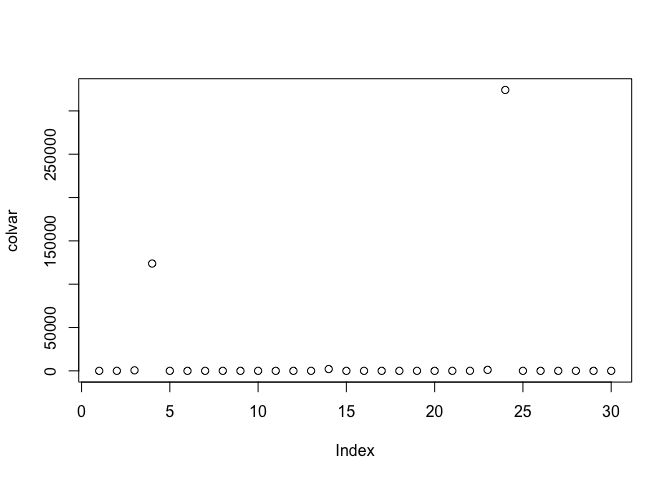
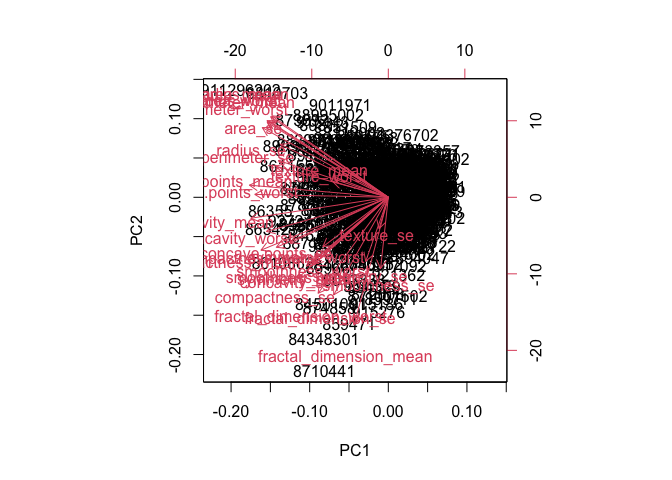
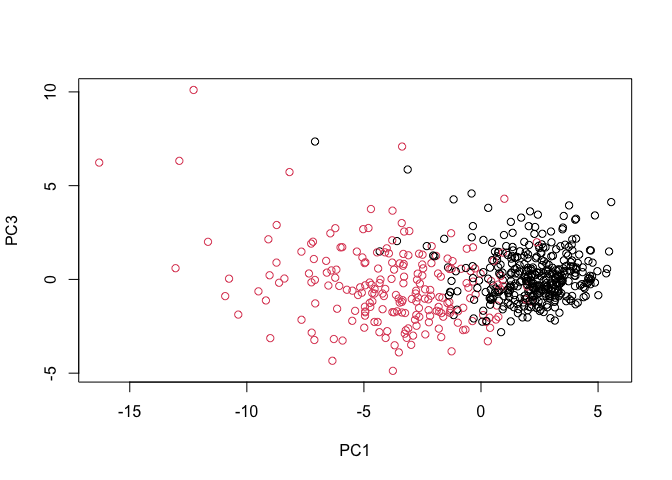
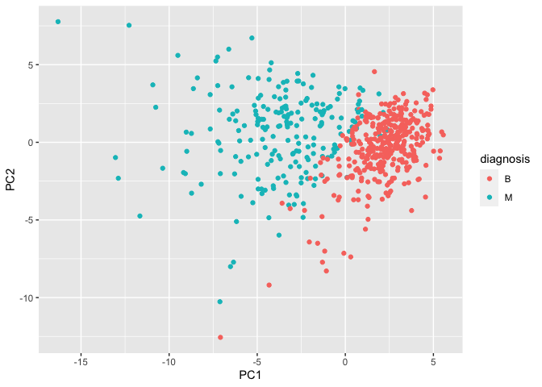
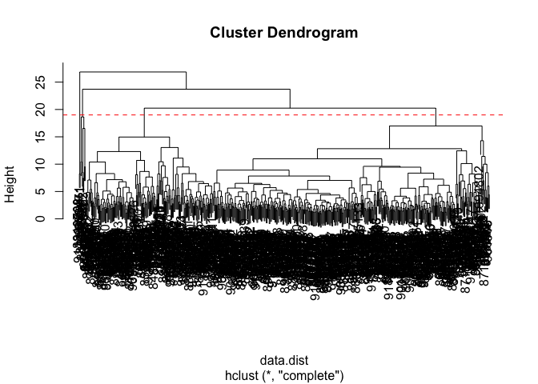
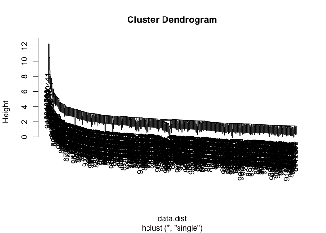
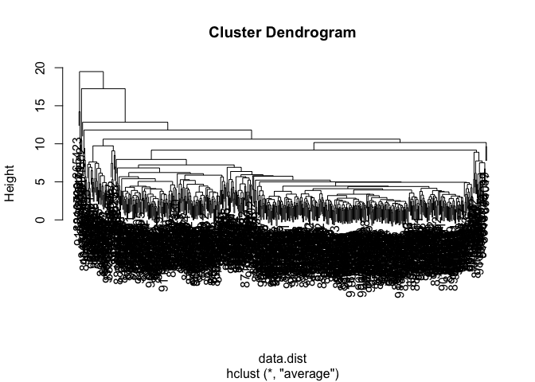
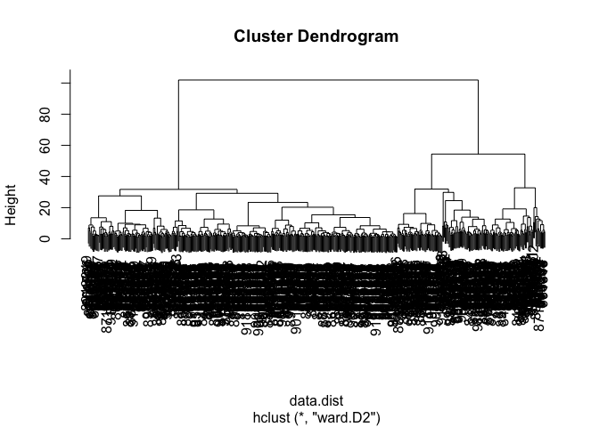
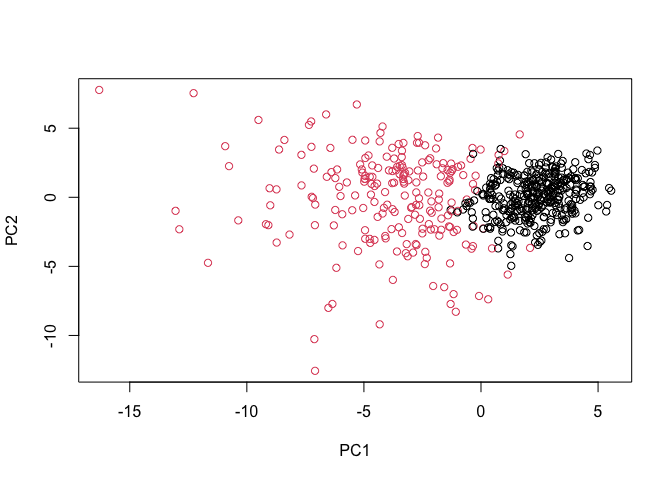
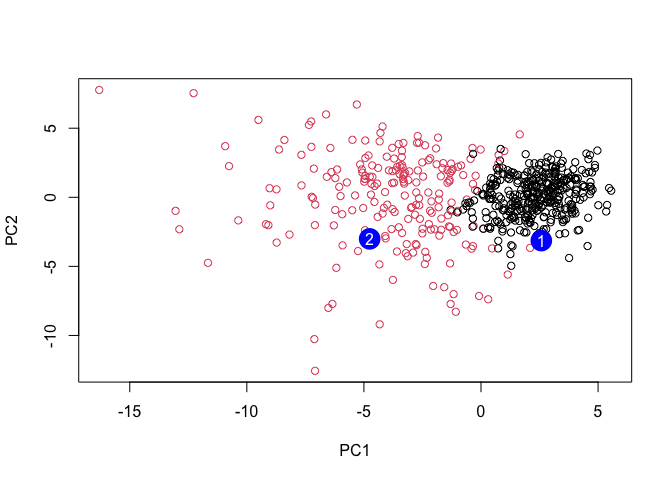

Class 09
================
Yuhan Zhang (PID: A13829264)
10/27/2021

## 1. Exploratory data analysis

### Preparing the data

Read Wisconsin Breast Cancer Diagnostic Data Set:

``` r
fna.data <- 'WisconsinCancer.csv'
wisc.df <- read.csv(fna.data, row.names=1)
head(wisc.df)
```

    ##          diagnosis radius_mean texture_mean perimeter_mean area_mean
    ## 842302           M       17.99        10.38         122.80    1001.0
    ## 842517           M       20.57        17.77         132.90    1326.0
    ## 84300903         M       19.69        21.25         130.00    1203.0
    ## 84348301         M       11.42        20.38          77.58     386.1
    ## 84358402         M       20.29        14.34         135.10    1297.0
    ## 843786           M       12.45        15.70          82.57     477.1
    ##          smoothness_mean compactness_mean concavity_mean concave.points_mean
    ## 842302           0.11840          0.27760         0.3001             0.14710
    ## 842517           0.08474          0.07864         0.0869             0.07017
    ## 84300903         0.10960          0.15990         0.1974             0.12790
    ## 84348301         0.14250          0.28390         0.2414             0.10520
    ## 84358402         0.10030          0.13280         0.1980             0.10430
    ## 843786           0.12780          0.17000         0.1578             0.08089
    ##          symmetry_mean fractal_dimension_mean radius_se texture_se perimeter_se
    ## 842302          0.2419                0.07871    1.0950     0.9053        8.589
    ## 842517          0.1812                0.05667    0.5435     0.7339        3.398
    ## 84300903        0.2069                0.05999    0.7456     0.7869        4.585
    ## 84348301        0.2597                0.09744    0.4956     1.1560        3.445
    ## 84358402        0.1809                0.05883    0.7572     0.7813        5.438
    ## 843786          0.2087                0.07613    0.3345     0.8902        2.217
    ##          area_se smoothness_se compactness_se concavity_se concave.points_se
    ## 842302    153.40      0.006399        0.04904      0.05373           0.01587
    ## 842517     74.08      0.005225        0.01308      0.01860           0.01340
    ## 84300903   94.03      0.006150        0.04006      0.03832           0.02058
    ## 84348301   27.23      0.009110        0.07458      0.05661           0.01867
    ## 84358402   94.44      0.011490        0.02461      0.05688           0.01885
    ## 843786     27.19      0.007510        0.03345      0.03672           0.01137
    ##          symmetry_se fractal_dimension_se radius_worst texture_worst
    ## 842302       0.03003             0.006193        25.38         17.33
    ## 842517       0.01389             0.003532        24.99         23.41
    ## 84300903     0.02250             0.004571        23.57         25.53
    ## 84348301     0.05963             0.009208        14.91         26.50
    ## 84358402     0.01756             0.005115        22.54         16.67
    ## 843786       0.02165             0.005082        15.47         23.75
    ##          perimeter_worst area_worst smoothness_worst compactness_worst
    ## 842302            184.60     2019.0           0.1622            0.6656
    ## 842517            158.80     1956.0           0.1238            0.1866
    ## 84300903          152.50     1709.0           0.1444            0.4245
    ## 84348301           98.87      567.7           0.2098            0.8663
    ## 84358402          152.20     1575.0           0.1374            0.2050
    ## 843786            103.40      741.6           0.1791            0.5249
    ##          concavity_worst concave.points_worst symmetry_worst
    ## 842302            0.7119               0.2654         0.4601
    ## 842517            0.2416               0.1860         0.2750
    ## 84300903          0.4504               0.2430         0.3613
    ## 84348301          0.6869               0.2575         0.6638
    ## 84358402          0.4000               0.1625         0.2364
    ## 843786            0.5355               0.1741         0.3985
    ##          fractal_dimension_worst
    ## 842302                   0.11890
    ## 842517                   0.08902
    ## 84300903                 0.08758
    ## 84348301                 0.17300
    ## 84358402                 0.07678
    ## 843786                   0.12440

Drop diagnosis in data and save diagnosis for plot:

``` r
wisc.data <- wisc.df[,-1]
diagnosis <- factor(wisc.df[, 1])

head(wisc.data)
```

    ##          radius_mean texture_mean perimeter_mean area_mean smoothness_mean
    ## 842302         17.99        10.38         122.80    1001.0         0.11840
    ## 842517         20.57        17.77         132.90    1326.0         0.08474
    ## 84300903       19.69        21.25         130.00    1203.0         0.10960
    ## 84348301       11.42        20.38          77.58     386.1         0.14250
    ## 84358402       20.29        14.34         135.10    1297.0         0.10030
    ## 843786         12.45        15.70          82.57     477.1         0.12780
    ##          compactness_mean concavity_mean concave.points_mean symmetry_mean
    ## 842302            0.27760         0.3001             0.14710        0.2419
    ## 842517            0.07864         0.0869             0.07017        0.1812
    ## 84300903          0.15990         0.1974             0.12790        0.2069
    ## 84348301          0.28390         0.2414             0.10520        0.2597
    ## 84358402          0.13280         0.1980             0.10430        0.1809
    ## 843786            0.17000         0.1578             0.08089        0.2087
    ##          fractal_dimension_mean radius_se texture_se perimeter_se area_se
    ## 842302                  0.07871    1.0950     0.9053        8.589  153.40
    ## 842517                  0.05667    0.5435     0.7339        3.398   74.08
    ## 84300903                0.05999    0.7456     0.7869        4.585   94.03
    ## 84348301                0.09744    0.4956     1.1560        3.445   27.23
    ## 84358402                0.05883    0.7572     0.7813        5.438   94.44
    ## 843786                  0.07613    0.3345     0.8902        2.217   27.19
    ##          smoothness_se compactness_se concavity_se concave.points_se
    ## 842302        0.006399        0.04904      0.05373           0.01587
    ## 842517        0.005225        0.01308      0.01860           0.01340
    ## 84300903      0.006150        0.04006      0.03832           0.02058
    ## 84348301      0.009110        0.07458      0.05661           0.01867
    ## 84358402      0.011490        0.02461      0.05688           0.01885
    ## 843786        0.007510        0.03345      0.03672           0.01137
    ##          symmetry_se fractal_dimension_se radius_worst texture_worst
    ## 842302       0.03003             0.006193        25.38         17.33
    ## 842517       0.01389             0.003532        24.99         23.41
    ## 84300903     0.02250             0.004571        23.57         25.53
    ## 84348301     0.05963             0.009208        14.91         26.50
    ## 84358402     0.01756             0.005115        22.54         16.67
    ## 843786       0.02165             0.005082        15.47         23.75
    ##          perimeter_worst area_worst smoothness_worst compactness_worst
    ## 842302            184.60     2019.0           0.1622            0.6656
    ## 842517            158.80     1956.0           0.1238            0.1866
    ## 84300903          152.50     1709.0           0.1444            0.4245
    ## 84348301           98.87      567.7           0.2098            0.8663
    ## 84358402          152.20     1575.0           0.1374            0.2050
    ## 843786            103.40      741.6           0.1791            0.5249
    ##          concavity_worst concave.points_worst symmetry_worst
    ## 842302            0.7119               0.2654         0.4601
    ## 842517            0.2416               0.1860         0.2750
    ## 84300903          0.4504               0.2430         0.3613
    ## 84348301          0.6869               0.2575         0.6638
    ## 84358402          0.4000               0.1625         0.2364
    ## 843786            0.5355               0.1741         0.3985
    ##          fractal_dimension_worst
    ## 842302                   0.11890
    ## 842517                   0.08902
    ## 84300903                 0.08758
    ## 84348301                 0.17300
    ## 84358402                 0.07678
    ## 843786                   0.12440

``` r
head(diagnosis)
```

    ## [1] M M M M M M
    ## Levels: B M

### Exploratory data analysis

Answer the following quesiton:

> Q1. How many observations are in this dataset?

``` r
q1ans <- nrow(wisc.data)
q1ans
```

    ## [1] 569

> Q2. How many of the observations have a malignant diagnosis?

``` r
q2ans <- sum(diagnosis == 'M')
q2ans
```

    ## [1] 212

> Q3. How many variables/features in the data are suffixed with \_mean?

``` r
varsName <- colnames(wisc.data)
varsName[grep('_mean', x = varsName)]
```

    ##  [1] "radius_mean"            "texture_mean"           "perimeter_mean"        
    ##  [4] "area_mean"              "smoothness_mean"        "compactness_mean"      
    ##  [7] "concavity_mean"         "concave.points_mean"    "symmetry_mean"         
    ## [10] "fractal_dimension_mean"

``` r
q3ans <- sum(grepl('_mean', x = varsName))
q3ans
```

    ## [1] 10

## 2. Principal Component Analysis

### Performing PCA

Check column mean and standard deviation for dataset:

``` r
colmean <- colMeans(wisc.data)
colsd <- apply(wisc.data,2,sd)
colmean
```

    ##             radius_mean            texture_mean          perimeter_mean 
    ##            1.412729e+01            1.928965e+01            9.196903e+01 
    ##               area_mean         smoothness_mean        compactness_mean 
    ##            6.548891e+02            9.636028e-02            1.043410e-01 
    ##          concavity_mean     concave.points_mean           symmetry_mean 
    ##            8.879932e-02            4.891915e-02            1.811619e-01 
    ##  fractal_dimension_mean               radius_se              texture_se 
    ##            6.279761e-02            4.051721e-01            1.216853e+00 
    ##            perimeter_se                 area_se           smoothness_se 
    ##            2.866059e+00            4.033708e+01            7.040979e-03 
    ##          compactness_se            concavity_se       concave.points_se 
    ##            2.547814e-02            3.189372e-02            1.179614e-02 
    ##             symmetry_se    fractal_dimension_se            radius_worst 
    ##            2.054230e-02            3.794904e-03            1.626919e+01 
    ##           texture_worst         perimeter_worst              area_worst 
    ##            2.567722e+01            1.072612e+02            8.805831e+02 
    ##        smoothness_worst       compactness_worst         concavity_worst 
    ##            1.323686e-01            2.542650e-01            2.721885e-01 
    ##    concave.points_worst          symmetry_worst fractal_dimension_worst 
    ##            1.146062e-01            2.900756e-01            8.394582e-02

``` r
colsd
```

    ##             radius_mean            texture_mean          perimeter_mean 
    ##            3.524049e+00            4.301036e+00            2.429898e+01 
    ##               area_mean         smoothness_mean        compactness_mean 
    ##            3.519141e+02            1.406413e-02            5.281276e-02 
    ##          concavity_mean     concave.points_mean           symmetry_mean 
    ##            7.971981e-02            3.880284e-02            2.741428e-02 
    ##  fractal_dimension_mean               radius_se              texture_se 
    ##            7.060363e-03            2.773127e-01            5.516484e-01 
    ##            perimeter_se                 area_se           smoothness_se 
    ##            2.021855e+00            4.549101e+01            3.002518e-03 
    ##          compactness_se            concavity_se       concave.points_se 
    ##            1.790818e-02            3.018606e-02            6.170285e-03 
    ##             symmetry_se    fractal_dimension_se            radius_worst 
    ##            8.266372e-03            2.646071e-03            4.833242e+00 
    ##           texture_worst         perimeter_worst              area_worst 
    ##            6.146258e+00            3.360254e+01            5.693570e+02 
    ##        smoothness_worst       compactness_worst         concavity_worst 
    ##            2.283243e-02            1.573365e-01            2.086243e-01 
    ##    concave.points_worst          symmetry_worst fractal_dimension_worst 
    ##            6.573234e-02            6.186747e-02            1.806127e-02

Inspect variance:

``` r
colvar <- colsd * colsd
colvar
```

    ##             radius_mean            texture_mean          perimeter_mean 
    ##            1.241892e+01            1.849891e+01            5.904405e+02 
    ##               area_mean         smoothness_mean        compactness_mean 
    ##            1.238436e+05            1.977997e-04            2.789187e-03 
    ##          concavity_mean     concave.points_mean           symmetry_mean 
    ##            6.355248e-03            1.505661e-03            7.515428e-04 
    ##  fractal_dimension_mean               radius_se              texture_se 
    ##            4.984872e-05            7.690235e-02            3.043159e-01 
    ##            perimeter_se                 area_se           smoothness_se 
    ##            4.087896e+00            2.069432e+03            9.015114e-06 
    ##          compactness_se            concavity_se       concave.points_se 
    ##            3.207029e-04            9.111982e-04            3.807242e-05 
    ##             symmetry_se    fractal_dimension_se            radius_worst 
    ##            6.833290e-05            7.001692e-06            2.336022e+01 
    ##           texture_worst         perimeter_worst              area_worst 
    ##            3.777648e+01            1.129131e+03            3.241674e+05 
    ##        smoothness_worst       compactness_worst         concavity_worst 
    ##            5.213198e-04            2.475477e-02            4.352409e-02 
    ##    concave.points_worst          symmetry_worst fractal_dimension_worst 
    ##            4.320741e-03            3.827584e-03            3.262094e-04

``` r
plot(colvar)
```

<!-- -->

Now perform the PCA on data set:

``` r
# Perform PCA on wisc.data by completing the following code
wisc.pr <- prcomp(x = wisc.data, scale. = TRUE)
```

Look at the summary of PCA:

``` r
# Look at summary of results
summary(wisc.pr)
```

    ## Importance of components:
    ##                           PC1    PC2     PC3     PC4     PC5     PC6     PC7
    ## Standard deviation     3.6444 2.3857 1.67867 1.40735 1.28403 1.09880 0.82172
    ## Proportion of Variance 0.4427 0.1897 0.09393 0.06602 0.05496 0.04025 0.02251
    ## Cumulative Proportion  0.4427 0.6324 0.72636 0.79239 0.84734 0.88759 0.91010
    ##                            PC8    PC9    PC10   PC11    PC12    PC13    PC14
    ## Standard deviation     0.69037 0.6457 0.59219 0.5421 0.51104 0.49128 0.39624
    ## Proportion of Variance 0.01589 0.0139 0.01169 0.0098 0.00871 0.00805 0.00523
    ## Cumulative Proportion  0.92598 0.9399 0.95157 0.9614 0.97007 0.97812 0.98335
    ##                           PC15    PC16    PC17    PC18    PC19    PC20   PC21
    ## Standard deviation     0.30681 0.28260 0.24372 0.22939 0.22244 0.17652 0.1731
    ## Proportion of Variance 0.00314 0.00266 0.00198 0.00175 0.00165 0.00104 0.0010
    ## Cumulative Proportion  0.98649 0.98915 0.99113 0.99288 0.99453 0.99557 0.9966
    ##                           PC22    PC23   PC24    PC25    PC26    PC27    PC28
    ## Standard deviation     0.16565 0.15602 0.1344 0.12442 0.09043 0.08307 0.03987
    ## Proportion of Variance 0.00091 0.00081 0.0006 0.00052 0.00027 0.00023 0.00005
    ## Cumulative Proportion  0.99749 0.99830 0.9989 0.99942 0.99969 0.99992 0.99997
    ##                           PC29    PC30
    ## Standard deviation     0.02736 0.01153
    ## Proportion of Variance 0.00002 0.00000
    ## Cumulative Proportion  1.00000 1.00000

Answer the following questions:

> Q4. From your results, what proportion of the original variance is
> captured by the first principal components (PC1)?

0.4427

> Q5. How many principal components (PCs) are required to describe at
> least 70% of the original variance in the data?

3 (PC1-3)

> Q6. How many principal components (PCs) are required to describe at
> least 90% of the original variance in the data?

7 (PC1-7)

### Interpreting PCA results

Look at result using `biplot()`:

``` r
biplot(wisc.pr)
```

<!-- -->

> Q7. What stands out to you about this plot? Is it easy or difficult to
> understand? Why?

It is difficult to understand because all dimensions and patients are
squeezed in two PC.

Look at first two PC using `plot()`:

``` r
# Scatter plot observations by components 1 and 2
plot(wisc.pr$x[, 1], wisc.pr$x[, 2], col = diagnosis, 
     xlab = "PC1", ylab = "PC2")
```

<!-- -->

> Q8. Generate a similar plot for principal components 1 and 3. What do
> you notice about these plots?

``` r
# Repeat for components 1 and 3
plot(wisc.pr$x[, 1], wisc.pr$x[, 3], col = diagnosis, 
     xlab = "PC1", ylab = "PC3")
```

<!-- -->

Two groups overlap more than PC1 and PC2.

Using `ggplot()` to plot the result:

``` r
# Create a data.frame for ggplot
df <- as.data.frame(wisc.pr$x)
df$diagnosis <- diagnosis

# Load the ggplot2 package
library(ggplot2)

# Make a scatter plot colored by diagnosis
ggplot(df) + 
  aes(PC1, PC2, col=diagnosis) + 
  geom_point()
```

<!-- -->

### Variance explained

Examine the variance explained by each PC:

``` r
# Calculate variance of each component
pr.var <- wisc.pr$sdev^2
head(pr.var)
```

    ## [1] 13.281608  5.691355  2.817949  1.980640  1.648731  1.207357

``` r
# Variance explained by each principal component: pve
pve <- pr.var / sum(pr.var)

# Plot variance explained for each principal component
plot(pve, xlab = "Principal Component", 
     ylab = "Proportion of Variance Explained", 
     ylim = c(0, 1), type = "o")
```

<!-- -->

``` r
# Alternative scree plot of the same data, note data driven y-axis
barplot(pve, ylab = "Precent of Variance Explained",
     names.arg=paste0("PC",1:length(pve)), las=2, axes = FALSE)
axis(2, at=pve, labels=round(pve,2)*100 )
```

<!-- -->

### Communicating PCA results

Answering following questions:

> Q9. For the first principal component, what is the component of the
> loading vector (i.e. wisc.pr$rotation\[,1\]) for the feature
> concave.points_mean?

``` r
wisc.pr$rotation['concave.points_mean', 1]
```

    ## [1] -0.2608538

> Q10. What is the minimum number of principal components required to
> explain 80% of the variance of the data?

``` r
cumsum(pve)
```

    ##  [1] 0.4427203 0.6324321 0.7263637 0.7923851 0.8473427 0.8875880 0.9100953
    ##  [8] 0.9259825 0.9398790 0.9515688 0.9613660 0.9700714 0.9781166 0.9833503
    ## [15] 0.9864881 0.9891502 0.9911302 0.9928841 0.9945334 0.9955720 0.9965711
    ## [22] 0.9974858 0.9982971 0.9988990 0.9994150 0.9996876 0.9999176 0.9999706
    ## [29] 0.9999956 1.0000000

``` r
q10ans <- length(pve) - sum(cumsum(pve) >= 0.8) + 1
```

Scale the data using `scale()`:

``` r
# Scale the wisc.data data using the "scale()" function
data.scaled <- scale(wisc.data)
head(data.scaled)
```

    ##          radius_mean texture_mean perimeter_mean  area_mean smoothness_mean
    ## 842302     1.0960995   -2.0715123      1.2688173  0.9835095       1.5670875
    ## 842517     1.8282120   -0.3533215      1.6844726  1.9070303      -0.8262354
    ## 84300903   1.5784992    0.4557859      1.5651260  1.5575132       0.9413821
    ## 84348301  -0.7682333    0.2535091     -0.5921661 -0.7637917       3.2806668
    ## 84358402   1.7487579   -1.1508038      1.7750113  1.8246238       0.2801253
    ## 843786    -0.4759559   -0.8346009     -0.3868077 -0.5052059       2.2354545
    ##          compactness_mean concavity_mean concave.points_mean symmetry_mean
    ## 842302          3.2806281     2.65054179           2.5302489   2.215565542
    ## 842517         -0.4866435    -0.02382489           0.5476623   0.001391139
    ## 84300903        1.0519999     1.36227979           2.0354398   0.938858720
    ## 84348301        3.3999174     1.91421287           1.4504311   2.864862154
    ## 84358402        0.5388663     1.36980615           1.4272370  -0.009552062
    ## 843786          1.2432416     0.86554001           0.8239307   1.004517928
    ##          fractal_dimension_mean  radius_se texture_se perimeter_se    area_se
    ## 842302                2.2537638  2.4875451 -0.5647681    2.8305403  2.4853907
    ## 842517               -0.8678888  0.4988157 -0.8754733    0.2630955  0.7417493
    ## 84300903             -0.3976580  1.2275958 -0.7793976    0.8501802  1.1802975
    ## 84348301              4.9066020  0.3260865 -0.1103120    0.2863415 -0.2881246
    ## 84358402             -0.5619555  1.2694258 -0.7895490    1.2720701  1.1893103
    ## 843786                1.8883435 -0.2548461 -0.5921406   -0.3210217 -0.2890039
    ##          smoothness_se compactness_se concavity_se concave.points_se
    ## 842302      -0.2138135     1.31570389    0.7233897        0.66023900
    ## 842517      -0.6048187    -0.69231710   -0.4403926        0.25993335
    ## 84300903    -0.2967439     0.81425704    0.2128891        1.42357487
    ## 84348301     0.6890953     2.74186785    0.8187979        1.11402678
    ## 84358402     1.4817634    -0.04847723    0.8277425        1.14319885
    ## 843786       0.1562093     0.44515196    0.1598845       -0.06906279
    ##          symmetry_se fractal_dimension_se radius_worst texture_worst
    ## 842302     1.1477468           0.90628565    1.8850310   -1.35809849
    ## 842517    -0.8047423          -0.09935632    1.8043398   -0.36887865
    ## 84300903   0.2368272           0.29330133    1.5105411   -0.02395331
    ## 84348301   4.7285198           2.04571087   -0.2812170    0.13386631
    ## 84358402  -0.3607748           0.49888916    1.2974336   -1.46548091
    ## 843786     0.1340009           0.48641784   -0.1653528   -0.31356043
    ##          perimeter_worst area_worst smoothness_worst compactness_worst
    ## 842302         2.3015755  1.9994782        1.3065367         2.6143647
    ## 842517         1.5337764  1.8888270       -0.3752817        -0.4300658
    ## 84300903       1.3462906  1.4550043        0.5269438         1.0819801
    ## 84348301      -0.2497196 -0.5495377        3.3912907         3.8899747
    ## 84358402       1.3373627  1.2196511        0.2203623        -0.3131190
    ## 843786        -0.1149083 -0.2441054        2.0467119         1.7201029
    ##          concavity_worst concave.points_worst symmetry_worst
    ## 842302         2.1076718            2.2940576      2.7482041
    ## 842517        -0.1466200            1.0861286     -0.2436753
    ## 84300903       0.8542223            1.9532817      1.1512420
    ## 84348301       1.9878392            2.1738732      6.0407261
    ## 84358402       0.6126397            0.7286181     -0.8675896
    ## 843786         1.2621327            0.9050914      1.7525273
    ##          fractal_dimension_worst
    ## 842302                 1.9353117
    ## 842517                 0.2809428
    ## 84300903               0.2012142
    ## 84348301               4.9306719
    ## 84358402              -0.3967505
    ## 843786                 2.2398308

## 3. Hierarchical clustering

Calculate the (Euclidean) distances between all pairs of observations in
the new scaled dataset and assign the result to data.dist.

``` r
data.dist <- dist(data.scaled)
head(data.dist)
```

    ## [1] 10.309426  6.771675 10.463467  8.663413  8.402233  9.843286

Create a hierarchical clustering model using complete linkage. Manually
specify the method argument to `hclust()` and assign the results to
wisc.hclust.

``` r
wisc.hclust <- hclust(data.dist, method = "complete")
```

### Results of hierarchical clustering

> Q11. Using the plot() and abline() functions, what is the height at
> which the clustering model has 4 clusters?

``` r
plot(wisc.hclust)
abline(a = 19, b = 0, col="red", lty=2)
```

<!-- -->

The height is 19.

### Selecting number of clusters

Cut the tree sp that it has 4 clusters:

``` r
wisc.hclust.clusters <- cutree(wisc.hclust, k = 4)
table(wisc.hclust.clusters, diagnosis)
```

    ##                     diagnosis
    ## wisc.hclust.clusters   B   M
    ##                    1  12 165
    ##                    2   2   5
    ##                    3 343  40
    ##                    4   0   2

> Q12. Can you find a better cluster vs diagnoses match by cutting into
> a different number of clusters between 2 and 10?

``` r
desireNumClst <-  (2:10)
for (i in desireNumClst) {
  wisc.hclust.clusters <- cutree(wisc.hclust, k = i)
  tbl <- table(wisc.hclust.clusters, diagnosis)
  print(tbl)
}
```

    ##                     diagnosis
    ## wisc.hclust.clusters   B   M
    ##                    1 357 210
    ##                    2   0   2
    ##                     diagnosis
    ## wisc.hclust.clusters   B   M
    ##                    1 355 205
    ##                    2   2   5
    ##                    3   0   2
    ##                     diagnosis
    ## wisc.hclust.clusters   B   M
    ##                    1  12 165
    ##                    2   2   5
    ##                    3 343  40
    ##                    4   0   2
    ##                     diagnosis
    ## wisc.hclust.clusters   B   M
    ##                    1  12 165
    ##                    2   0   5
    ##                    3 343  40
    ##                    4   2   0
    ##                    5   0   2
    ##                     diagnosis
    ## wisc.hclust.clusters   B   M
    ##                    1  12 165
    ##                    2   0   5
    ##                    3 331  39
    ##                    4   2   0
    ##                    5  12   1
    ##                    6   0   2
    ##                     diagnosis
    ## wisc.hclust.clusters   B   M
    ##                    1  12 165
    ##                    2   0   3
    ##                    3 331  39
    ##                    4   2   0
    ##                    5  12   1
    ##                    6   0   2
    ##                    7   0   2
    ##                     diagnosis
    ## wisc.hclust.clusters   B   M
    ##                    1  12  86
    ##                    2   0  79
    ##                    3   0   3
    ##                    4 331  39
    ##                    5   2   0
    ##                    6  12   1
    ##                    7   0   2
    ##                    8   0   2
    ##                     diagnosis
    ## wisc.hclust.clusters   B   M
    ##                    1  12  86
    ##                    2   0  79
    ##                    3   0   3
    ##                    4 331  39
    ##                    5   2   0
    ##                    6  12   0
    ##                    7   0   2
    ##                    8   0   2
    ##                    9   0   1
    ##                     diagnosis
    ## wisc.hclust.clusters   B   M
    ##                   1   12  86
    ##                   2    0  59
    ##                   3    0   3
    ##                   4  331  39
    ##                   5    0  20
    ##                   6    2   0
    ##                   7   12   0
    ##                   8    0   2
    ##                   9    0   2
    ##                   10   0   1

4 and 5 clusters give a better results than the others since 1-3 does
not separate data well and cluster above 5 gives too many extra clusters
with few datapoint.

### Using different methods

We can use different method to cluster data.

> Q13. Which method gives your favorite results for the same data.dist
> dataset? Explain your reasoning.

``` r
methodV = c("single", "complete", "average", "ward.D2")
for (i in methodV) {
  wisc.hclust <- hclust(data.dist, method = i)
  plot(wisc.hclust)
}
```



“ward.D2” is better because it creates the balanced clusters compare to
the other methods.

## 4. OPTIONAL: K-means clustering

### K-means clustering and comparing results

Create a k-means model on wisc.data:

``` r
wisc.km <- kmeans(scale(wisc.data), centers = 2, nstart = 20)
summary(wisc.km)
```

    ##              Length Class  Mode   
    ## cluster      569    -none- numeric
    ## centers       60    -none- numeric
    ## totss          1    -none- numeric
    ## withinss       2    -none- numeric
    ## tot.withinss   1    -none- numeric
    ## betweenss      1    -none- numeric
    ## size           2    -none- numeric
    ## iter           1    -none- numeric
    ## ifault         1    -none- numeric

Use the `table()` function to compare the cluster membership of the
k-means model (wisc.km$cluster) to the actual diagnoses contained in the
diagnosis vector.

``` r
table(wisc.km$cluster, diagnosis)
```

    ##    diagnosis
    ##       B   M
    ##   1 343  37
    ##   2  14 175

> Q14. How well does k-means separate the two diagnoses? How does it
> compare to your hclust results?

The k-means separate the diagnosis effectively with less number of
clusters than hclust.

## 5. Combining methods

### Clustering on PCA results

Using the minimum number of principal components required to describe at
least 90% of the variability in the data, create a hierarchical
clustering model with the linkage method=“ward.D2”.

``` r
  wisc.pr.hclust <- hclust(dist(wisc.pr$x[, 1:7]), method = 'ward.D2')
  plot(wisc.pr.hclust)
```

<!-- -->

Cut into two clusters:

``` r
grps <- cutree(wisc.pr.hclust, k=2)
table(grps)
```

    ## grps
    ##   1   2 
    ## 216 353

``` r
table(grps, diagnosis)
```

    ##     diagnosis
    ## grps   B   M
    ##    1  28 188
    ##    2 329  24

> Q15. How well does the newly created model with four clusters separate
> out the two diagnoses?

The model clearly separate benign and malignant into two clusters with
small set of data being overlaped (less false positive and false
negative).

> Q16. How well do the k-means and hierarchical clustering models you
> created in previous sections (i.e. before PCA) do in terms of
> separating the diagnoses? Again, use the table() function to compare
> the output of each model (wisc.km$cluster and wisc.hclust.clusters)
> with the vector containing the actual diagnoses.

``` r
table(wisc.km$cluster, diagnosis)
```

    ##    diagnosis
    ##       B   M
    ##   1 343  37
    ##   2  14 175

``` r
wisc.hclust <- hclust(data.dist, method = "complete")
wisc.hclust.clusters <- cutree(wisc.hclust, k = 4)
table(wisc.hclust.clusters, diagnosis)
```

    ##                     diagnosis
    ## wisc.hclust.clusters   B   M
    ##                    1  12 165
    ##                    2   2   5
    ##                    3 343  40
    ##                    4   0   2

The k-mean gives a clear separation of cluster than hclust because
hclust gives extra clusters contain small sets of data.

``` r
g <- as.factor(grps)
levels(g)
```

    ## [1] "1" "2"

``` r
g <- relevel(g,2)
levels(g)
```

    ## [1] "2" "1"

``` r
plot(wisc.pr$x[,1:2], col=g)
```

<!-- -->

``` r
plot(wisc.pr$x[,1:2], col=diagnosis)
```

<!-- -->

> Q17. Which of your analysis procedures resulted in a clustering model
> with the best specificity? How about sensitivity?

``` r
wisc.pr.hclust.ss <- c(188 / (188 + 24), 329 / (329 + 24))
wisc.km.ss <- c(175 / (175 + 37), 343 / (343 + 37))
wisc.hclust.ss <- c(165 / (165 + 40), 343 / (343 + 40))

ss.df <- data.frame(wisc.pr.hclust.ss, wisc.km.ss, wisc.hclust.ss, 
                    row.names = c("Sensitivity", "Specificity"))
ss.df
```

    ##             wisc.pr.hclust.ss wisc.km.ss wisc.hclust.ss
    ## Sensitivity         0.8867925  0.8254717      0.8048780
    ## Specificity         0.9320113  0.9026316      0.8955614

PCR hclust produce for both sensitivity and specificity.

## 7. Prediction

We will use the `predict()` function that will take our PCA model from
before and new cancer cell data and project that data onto our PCA
space.

``` r
url <- "https://tinyurl.com/new-samples-CSV"
new <- read.csv(url)
npc <- predict(wisc.pr, newdata=new)
npc
```

    ##            PC1       PC2        PC3        PC4       PC5        PC6        PC7
    ## [1,]  2.576616 -3.135913  1.3990492 -0.7631950  2.781648 -0.8150185 -0.3959098
    ## [2,] -4.754928 -3.009033 -0.1660946 -0.6052952 -1.140698 -1.2189945  0.8193031
    ##             PC8       PC9       PC10      PC11      PC12      PC13     PC14
    ## [1,] -0.2307350 0.1029569 -0.9272861 0.3411457  0.375921 0.1610764 1.187882
    ## [2,] -0.3307423 0.5281896 -0.4855301 0.7173233 -1.185917 0.5893856 0.303029
    ##           PC15       PC16        PC17        PC18        PC19       PC20
    ## [1,] 0.3216974 -0.1743616 -0.07875393 -0.11207028 -0.08802955 -0.2495216
    ## [2,] 0.1299153  0.1448061 -0.40509706  0.06565549  0.25591230 -0.4289500
    ##            PC21       PC22       PC23       PC24        PC25         PC26
    ## [1,]  0.1228233 0.09358453 0.08347651  0.1223396  0.02124121  0.078884581
    ## [2,] -0.1224776 0.01732146 0.06316631 -0.2338618 -0.20755948 -0.009833238
    ##              PC27        PC28         PC29         PC30
    ## [1,]  0.220199544 -0.02946023 -0.015620933  0.005269029
    ## [2,] -0.001134152  0.09638361  0.002795349 -0.019015820

``` r
plot(wisc.pr$x[,1:2], col=g)
points(npc[,1], npc[,2], col="blue", pch=16, cex=3)
text(npc[,1], npc[,2], c(1,2), col="white")
```

<!-- -->

> Q18. Which of these new patients should we prioritize for follow up
> based on your results?

Patient 2 should be prioritize because the patient fall in tha
maglignant cluster.
