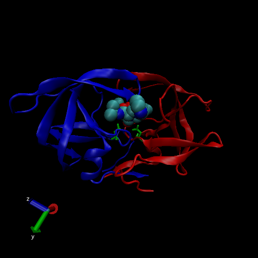

# The PBD database

## 1: Introduction to the RCSB Protein Data Bank (PDB)

Import CSV files from PDB site:

```{r}
pdbstats <- read.csv("Data Export Summary.csv", 
                     header = TRUE, row.names = "Molecular.Type")
pdbstats
```

Answer the following questions:

> Q1: What percentage of structures in the PDB are solved by X-Ray and Electron Microscopy.

```{r}
xray.frac <- (sum(pdbstats$X.ray) / sum(pdbstats$Total)) * 100
xray.frac

em.frac <- (sum(pdbstats$EM) / sum(pdbstats$Total)) * 100
em.frac
```

How about doing this over every method:

```{r}
(colSums(pdbstats) / sum(pdbstats$Total)) * 100
```

> Q2: What proportion of structures in the PDB are protein?

```{r}
protein.frac <- (sum(pdbstats$Total[1]) / sum(pdbstats$Total)) * 100
protein.frac
```

> Q3: Type HIV in the PDB website search box on the home page and determine how many HIV-1 protease structures are in the current PDB?

Search "hiv protease" and filter to "human immunodeficiency virus" and "protein" and there are 1817 entries

## 2. Visualizing the HIV-1 protease structure



### Using Atom Selections

Water molecules have the residue name HOH. Select and display all water molecules as red spheres. If you think the spheres are too big, how would you reduce their size?

> Q4: Water molecules normally have 3 atoms. Why do we see just one atom per water molecule in this structure?

> Q5: There is a conserved water molecule in the binding site. Can you identify this water molecule? What residue number does this water molecule have (see note below)?

HOH308: O

```{r}
library(bio3d)

pdb <- read.pdb("1hel")
pdb
```

```{r}
pdb$atom
```
Do a Normal Mode Analysis (NMA) a prediction of the conformational variability and intrinsic dynamics of this protein
```{r}
m <- nma(pdb)
plot(m)
```

Make a little movie (trajectory) for viewing in VMD.
```{r}
mktrj(m, file="nma.pdb")
```


