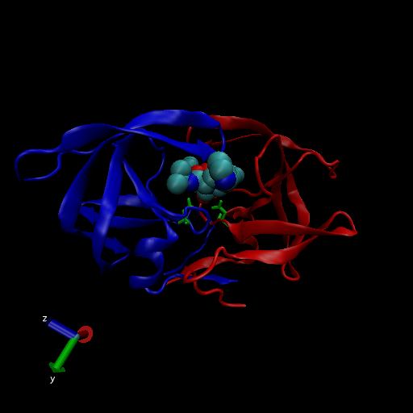

class11
================

# The PBD database

## 1: Introduction to the RCSB Protein Data Bank (PDB)

Import CSV files from PDB site:

``` r
pdbstats <- read.csv("Data Export Summary.csv", 
                     header = TRUE, row.names = "Molecular.Type")
pdbstats
```

    ##                          X.ray   NMR   EM Multiple.methods Neutron Other  Total
    ## Protein (only)          142419 11807 6038              177      70    32 160543
    ## Protein/Oligosaccharide   8426    31  991                5       0     0   9453
    ## Protein/NA                7498   274 2000                3       0     0   9775
    ## Nucleic acid (only)       2368  1378   60                8       2     1   3817
    ## Other                      149    31    3                0       0     0    183
    ## Oligosaccharide (only)      11     6    0                1       0     4     22

Answer the following questions:

> Q1: What percentage of structures in the PDB are solved by X-Ray and
> Electron Microscopy.

``` r
xray.frac <- (sum(pdbstats$X.ray) / sum(pdbstats$Total)) * 100
xray.frac
```

    ## [1] 87.52836

``` r
em.frac <- (sum(pdbstats$EM) / sum(pdbstats$Total)) * 100
em.frac
```

    ## [1] 4.94687

How about doing this over every method:

``` r
(colSums(pdbstats) / sum(pdbstats$Total)) * 100
```

    ##            X.ray              NMR               EM Multiple.methods 
    ##      87.52836071       7.35991033       4.94686958       0.10555353 
    ##          Neutron            Other            Total 
    ##       0.03917451       0.02013134     100.00000000

> Q2: What proportion of structures in the PDB are protein?

``` r
protein.frac <- (sum(pdbstats$Total[1]) / sum(pdbstats$Total)) * 100
protein.frac
```

    ## [1] 87.3499

> Q3: Type HIV in the PDB website search box on the home page and
> determine how many HIV-1 protease structures are in the current PDB?

Search “hiv protease” and filter to “human immunodeficiency virus” and
“protein” and there are 1817 entries

## 2. Visualizing the HIV-1 protease structure



### Using Atom Selections


