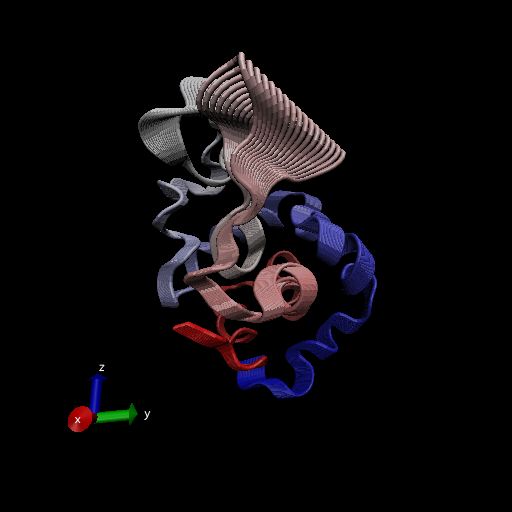

# Working with bio3d

```{r}
library(bio3d)

pdb <- read.pdb("1hel")
pdb
```

```{r}
head(pdb$atom)
```

Let's do a quick bioinformatics prediction of protein dynamics (flexibility). We use the `nma()` function, which does Normal Mode Analysis.

```{r}
modes <-nma(pdb)
plot(modes)
```

Make a trajectory of this prediction with the `mktrj()`.

```{r}
mktrj(modes, file="nma.pdb")
```

And the image from VMD



## 4. Comparative structure analysis of Adenylate Kinase

Start by getting a sequence of interest.

```{r}
aa <- get.seq("1AKE_A")
aa
```

I want to search the PDB database (the main db for exp structures) for sequences like my aa sequences.

```{r}
blast <- blast.pdb(aa)
```

```{r}
hits <- plot(blast)
```

Now I have my top hits from the search of the PDB
```{r}
hits$pdb.id
```

Here we download all these similar structures in the PDB and store them on our computer.

```{r}
# Download releated PDB files
files <- get.pdb(hits$pdb.id, path="pdbs", split=TRUE, gzip=TRUE)
```

Now we want to align all these structures. We will use the function `pdbaln()`

```{r}
# Align related PDBs
pdbs <- pdbaln(files, fit = TRUE)#, exefile="msa")
```

Let's have a look
```{r}
pdbs
```


```{r}
# Vector containing PDB codes for figure axis
ids <- basename.pdb(pdbs$id)

# Draw schematic alignment
plot(pdbs, labels=ids)
```

## Principal Component Analysis (PCA)

Here we will do PCA on the xyz coordinate data of all these structures with the `pca()` function in bio3d.

```{r}
pc <- pca(pdbs)
plot(pc)
```

Let's visualize the displacements(i.e. movements of the structure) that are captured by PC1

```{r}
mktrj(pc, pc = 1, file = "pca.pdb")
```

Let's save our important results

```{r}
#save(blast, hits, pca, file = "myresults.RData")
load("myresults.RData")
```


