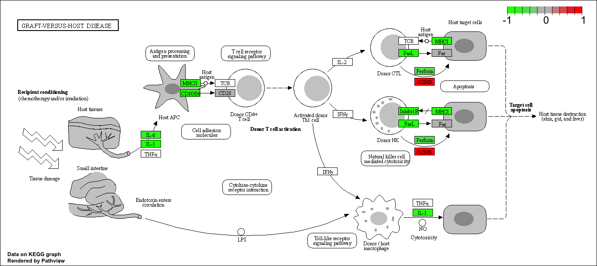
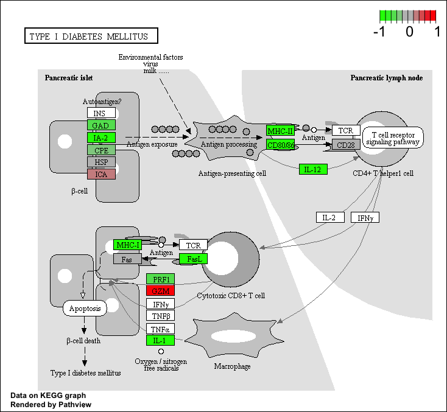

```{r}
counts <- read.csv("airway_scaledcounts.csv", row.names=1)
metadata <-  read.csv("airway_metadata.csv")
```

Take a look:

```{r}
head(counts)
```

```{r}
head(metadata)
```

> Q1. How many genes are in this dataset? 

```{r}
nrow(counts)
```

> Q2. How many ‘control’ cell lines do we have?

```{r}
sum(metadata$dex == "control")
```

Lets perform some exploratory differential gene expression analysis.  

Note that the control samples are SRR1039508, SRR1039512, SRR1039516, and SRR1039520. This bit of code will first find the sample id for those labeled control. Then calculate the mean counts per gene across these samples:

```{r}
control <- metadata[metadata[,"dex"]=="control",]
control.counts <- counts[ ,control$id]
control.mean <- rowSums( control.counts )/4 
head(control.mean)
```

> Q3. How would you make the above code in either approach more robust?

Calculate number of control group:
```{r}
control.mean <- rowSums( control.counts )/sum(metadata[,"dex"]=="control")
```

> Q4. Follow the same procedure for the treated samples (i.e. calculate the mean per gene across drug treated samples and assign to a labeled vector called `treated.mean`)

```{r}
treated <- metadata[metadata[,"dex"]=="treated",]
treated.counts <- counts[ ,treated$id]
treated.mean <- rowSums( treated.counts )/sum(metadata[,"dex"]=="treated")
head(treated.mean)
```

```{r}
meancounts <- data.frame(control.mean, treated.mean)
```

Directly comparing the raw counts is going to be problematic if we just happened to sequence one group at a higher depth than another. Later on we’ll do this analysis properly, normalizing by sequencing depth per sample using a better approach. But for now, `colSums()` the data to show the sum of the mean counts across all genes for each group.

```{r}
colSums(meancounts)
```

> Q5 (a). Create a scatter plot showing the mean of the treated samples against the mean of the control samples.

```{r}
plot(meancounts$control.mean, meancounts$treated.mean, 
     xlab = "control", ylab = "treated")
```

> Q5 (b).You could also use the ggplot2 package to make this figure producing the plot below. What geom_?() function would you use for this plot? 

```{r}
library(ggplot2)
ggplot(meancounts) + aes(x = control.mean, y = treated.mean) + 
  geom_point()
```

> Q6. Try plotting both axes on a log scale. What is the argument to plot() that allows you to do this? 

```{r}
plot(meancounts$control.mean, meancounts$treated.mean, 
     xlab = "control", ylab = "treated", log = "xy")
```

> If you are using ggplot have a look at the function scale_x_continuous(trans="log2") and of course do the same for the y axis.

```{r}
library(ggplot2)
ggplot(meancounts) + aes(x = control.mean, y = treated.mean) + 
  geom_point() + scale_x_continuous(trans = "log2") + 
  scale_y_continuous(trans = "log2")
```

We can find candidate differentially expressed genes by looking for genes with a large change between control and dex-treated samples. We usually look at the log2 of the fold change, because this has better mathematical properties.

Here we calculate log2foldchange, add it to our meancounts data.frame and inspect the results either with the `head()` or the `View()` function for example.

```{r}
meancounts$log2fc <- 
  log2(meancounts[,"treated.mean"]/meancounts[,"control.mean"])
head(meancounts)
```

There are a couple of “weird” results. Namely, the NaN (“not a number”) and -Inf (negative infinity) results.

The NaN is returned when you divide by zero and try to take the log. The -Inf is returned when you try to take the log of zero. It turns out that there are a lot of genes with zero expression. Let’s filter our data to remove these genes. Again inspect your result (and the intermediate steps) to see if things make sense to you

```{r}
zero.vals <- which(meancounts[,1:2]==0, arr.ind=TRUE)

to.rm <- unique(zero.vals[,1])
mycounts <- meancounts[-to.rm,]
head(mycounts)
```

> Q7. What is the purpose of the arr.ind argument in the `which()` function call above? Why would we then take the first column of the output and need to call the `unique()` function?

arr.ind is used to return the index using column and row to represent data, `unique()` to get rid of repeted row numbers because control mena and treated mean can be zero for the same gene

A common threshold used for calling something differentially expressed is a log2(FoldChange) of greater than 2 or less than -2. Let’s filter the dataset both ways to see how many genes are up or down-regulated.

```{r}
up.ind <- mycounts$log2fc > 2
down.ind <- mycounts$log2fc < (-2)
```

> Q8. Using the up.ind vector above can you determine how many up regulated genes we have at the greater than 2 fc level?

```{r}
sum(up.ind)
```

```{r}
sum(down.ind)
```

> What percentage is it?

```{r}
round((sum(up.ind) / nrow(mycounts)) * 100, 2)
```

```{r}
round((sum(down.ind) / nrow(mycounts)) * 100, 2)
```


> Q10. Do you trust these results? Why or why not?

No, because we do not know if a 2-fold change is statistically significant compare to all genes changes

## DESeq2 analysis

```{r}
library(DESeq2)
citation("DESeq2")
```

The DESeqDataSet is a single object that contains input values, intermediate calculations like how things are normalized, and all results of a differential expression analysis.

You can construct a DESeqDataSet from (1) a count matrix, (2) a metadata file, and (3) a formula indicating the design of the experiment.

We have talked about (1) and (2) previously. The third needed item that has to be specified at the beginning of the analysis is a design formula. This tells DESeq2 which columns in the sample information table (`colData`) specify the experimental design (i.e. which groups the samples belong to) and how these factors should be used in the analysis. Essentially, this formula expresses how the counts for each gene depend on the variables in colData.

Take a look at `metadata` again. The thing we’re interested in is the `dex` column, which tells us which samples are treated with dexamethasone versus which samples are untreated controls. We’ll specify the design with a tilde, like this: `design=~dex`.

We will use the **DESeqDataSetFromMatrix()** function to build the required *DESeqDataSet* object and call it `dds`, short for our DESeqDataSet. If you get a warning about “some variables in design formula are characters, converting to factors” don’t worry about it. Take a look at the `dds` object once you create it.

```{r}
dds <- DESeqDataSetFromMatrix(countData=counts, 
                              colData=metadata, 
                              design=~dex)
dds
```

### DESeq analysis

Next, let’s run the DESeq analysis pipeline on the dataset, and reassign the resulting object back to the same variable. Note that before we start, `dds` is a bare-bones DESeqDataSet. The `DESeq()` function takes a DESeqDataSet and returns a DESeqDataSet, but with additional information filled in (including the differential expression results we are after). Notice how if we try to access these results before running the analysis, nothing exists.

```{r}
#results(dds)

#Error in results(dds) : 
#couldn't find results. you should first run DESeq()
```

Here, we’re running the DESeq pipeline on the dds object, and reassigning the whole thing back to dds, which will now be a DESeqDataSet populated with all those values. Get some help on `?DESeq` (notice, no “2” on the end). This function calls a number of other functions within the package to essentially run the entire pipeline (normalizing by library size by estimating the “size factors,” estimating dispersion for the negative binomial model, and fitting models and getting statistics for each gene for the design specified when you imported the data).

```{r}
dds <- DESeq(dds)
```

### Getting results

```{r}
res <- results(dds)
res
```

```{r}
res.df <- as.data.frame(res)
head(res.df)
```

```{r}
summary(res)
```

The results function contains a number of arguments to customize the results table. By default the argument `alpha` is set to 0.1. If the adjusted p value cutoff will be a value other than 0.1, alpha should be set to that value:

```{r}
res05 <- results(dds, alpha=0.05)
summary(res05)
```

## Adding annotation data

Our result table so far only contains the Ensembl gene IDs. However, alternative gene names and extra annotation are usually required for informative interpretation of our results. In this section we will add this necessary annotation data to our results.

load **AnnotationDbi** package and the annotation data package for humans **org.Hs.eg.db**.

```{r}
library("AnnotationDbi")
library("org.Hs.eg.db")
```

The later of these is is the organism annotation package (“org”) for Homo sapiens (“Hs”), organized as an AnnotationDbi database package (“db”), using Entrez Gene IDs (“eg”) as primary key. To get a list of all available key types that we can use to map between, use the `columns()` function:

```{r}
columns(org.Hs.eg.db)
```

We can use the **mapIds()** function to add individual columns to our results table. We provide the row names of our results table as a key, and specify that `keytype=ENSEMBL`. The `column` argument tells the `mapIds()` function which information we want, and the `multiVals` argument tells the function what to do if there are multiple possible values for a single input value. Here we ask to just give us back the first one that occurs in the database.

```{r}
res$symbol <- mapIds(org.Hs.eg.db,
                     keys=row.names(res),      # Our genenames
                     keytype="ENSEMBL",        # The format of our genenames
                     column="SYMBOL",          # The new format we want to add
                     multiVals="first")
```

```{r}
head(res$symbol)
```


```{r}
head(res)
```

> Q11. Run the **mapIds()** function two more times to add the Entrez ID and UniProt accession and GENENAME as new columns called `res$entrez`, `res$uniprot` and `res$genename`.

```{r}
res$entrez <- mapIds(org.Hs.eg.db,
                     keys=row.names(res),      
                     keytype="ENSEMBL",
                     column="ENTREZID",
                     multiVals="first")

res$uniprot <- mapIds(org.Hs.eg.db,
                     keys=row.names(res),      
                     keytype="ENSEMBL",
                     column="UNIPROT",
                     multiVals="first")

res$genename <- mapIds(org.Hs.eg.db,
                     keys=row.names(res),      
                     keytype="ENSEMBL",
                     column="GENENAME",
                     multiVals="first")

head(res)
```

You can arrange and view the results by the adjusted p-value

```{r}
ord <- order( res$padj )
head(res[ord,])
```

Finally, let’s write out the ordered significant results with annotations. See the help for ?write.csv if you are unsure here.

```{r}
write.csv(res[ord,], "deseq_results.csv")
```

## Data Visualization

### Volcano plots

```{r}
plot( res$log2FoldChange,  -log(res$padj), 
      xlab="Log2(FoldChange)",
      ylab="-Log(P-value)")
```

To make this more useful we can add some guidelines (with the `abline()` function) and color (with a custom color vector) highlighting genes that have padj<0.05 and the absolute log2FoldChange>2.

```{r}
plot( res$log2FoldChange,  -log(res$padj), 
 ylab="-Log(P-value)", xlab="Log2(FoldChange)")

# Add some cut-off lines
abline(v=c(-2,2), col="darkgray", lty=2)
abline(h=-log(0.05), col="darkgray", lty=2)
```

To color the points we will setup a custom color vector indicating transcripts with large fold change and significant differences between conditions:

```{r}
# Setup our custom point color vector 
mycols <- rep("gray", nrow(res))
mycols[ abs(res$log2FoldChange) > 2 ]  <- "red" 

inds <- (res$padj < 0.01) & (abs(res$log2FoldChange) > 2 )
mycols[ inds ] <- "blue"

# Volcano plot with custom colors 
plot( res$log2FoldChange,  -log(res$padj), 
 col=mycols, ylab="-Log(P-value)", xlab="Log2(FoldChange)" )

# Cut-off lines
abline(v=c(-2,2), col="gray", lty=2)
abline(h=-log(0.1), col="gray", lty=2)
```

For even more customization you might find the **EnhancedVolcano** bioconductor package useful (Note. It uses ggplot under the hood):

```{r, fig.height=8, fig.width=10}
library(EnhancedVolcano)

x <- as.data.frame(res)

EnhancedVolcano(x,
    lab = x$symbol,
    x = 'log2FoldChange',
    y = 'pvalue')
```

## Pathway analysis

Pathway analysis (also known as gene set analysis or over-representation analysis), aims to reduce the complexity of interpreting gene lists via mapping the listed genes to known (i.e. annotated) biological pathways, processes and functions.

### Patway analysis with R and Bioconductor

Here we play with just one, the [**GAGE** package](https://bioconductor.org/packages/release/bioc/html/gage.html) (which stands for Generally Applicable Gene set Enrichment), to do KEGG pathway enrichment analysis on our RNA-seq based differential expression results.

The [KEGG pathway database](https://www.genome.jp/kegg/pathway.html), unlike GO for example, provides functional annotation as well as information about gene products that interact with each other in a given pathway, how they interact (e.g., activation, inhibition, etc.), and where they interact (e.g., cytoplasm, nucleus, etc.). Hence KEGG has the potential to provide extra insight beyond annotation lists of simple molecular function, process etc. from GO terms.

```{r message=FALSE}
library(pathview)
library(gage)
library(gageData)
```

```{r}
data(kegg.sets.hs)

# Examine the first 2 pathways in this kegg set for humans
head(kegg.sets.hs, 2)
```

The main **gage()** function requires a named vector of fold changes, where the names of the values are the Entrez gene IDs.

```{r}
foldchanges <- res$log2FoldChange
names(foldchanges) <- res$entrez
head(foldchanges)
```

```{r}
# Get the results
keggres <- gage(foldchanges, gsets=kegg.sets.hs)
```

We can look at the `attributes()` of this:

```{r}
attributes(keggres)
```

Lets look at the first few down (less) pathway results:

```{r}
head(keggres$less)
```

Now, let’s try out the **pathview()** function from the pathview package to make a pathway plot with our RNA-Seq expression results shown in color.
To begin with lets manually supply a `pathway.id` (namely the first part of the `"hsa05310 Asthma"`) that we could see from the print out above.

```{r}
pathview(gene.data=foldchanges, pathway.id="hsa05310")
```


> Q12. Can you do the same procedure as above to plot the pathview figures for the top 2 down-reguled pathways?

```{r}
pathview(gene.data=foldchanges, pathway.id="hsa05332")
```



```{r}
pathview(gene.data=foldchanges, pathway.id="hsa04940")
```



### OPTIONAL: Plotting counts for genes of interest

```{r}
i <- grep("CRISPLD2", res$symbol)
res[i,]
```

```{r}
rownames(res[i,])
```

Now, with that gene ID in hand let’s plot the counts, where our `intgroup`, or “interesting group” variable is the “dex” column.

```{r}
plotCounts(dds, gene="ENSG00000103196", intgroup="dex")
```

We could have actually returned the data instead of plotting.We could then pipe this to ggplot and make our own figure. Let’s make a boxplot.

```{r}
# Return the data
d <- plotCounts(dds, gene="ENSG00000103196", intgroup="dex", returnData=TRUE)
head(d)

boxplot(count ~ dex , data=d)
```

```{r}
library(ggplot2)
ggplot(d, aes(dex, count, fill=dex)) + 
  geom_boxplot() + 
  scale_y_log10() + 
  ggtitle("CRISPLD2")
```

