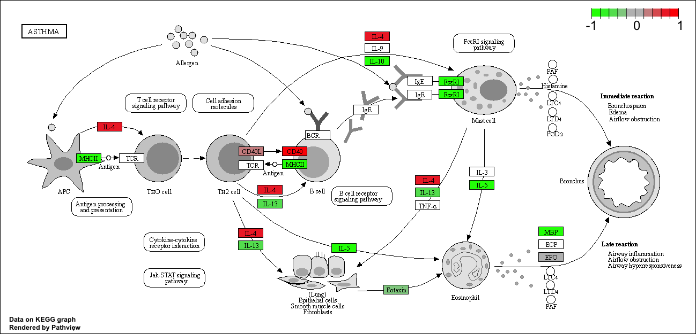
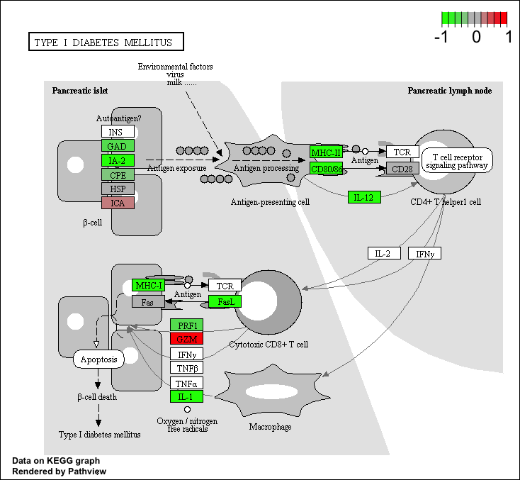

Class15: Transcriptomics and RNA-seq data
================
Yuhan Zhang (PID: A13829264)
11/17/2021

``` r
counts <- read.csv("airway_scaledcounts.csv", row.names=1)
metadata <-  read.csv("airway_metadata.csv")
```

Take a look:

``` r
head(counts)
```

    ##                 SRR1039508 SRR1039509 SRR1039512 SRR1039513 SRR1039516
    ## ENSG00000000003        723        486        904        445       1170
    ## ENSG00000000005          0          0          0          0          0
    ## ENSG00000000419        467        523        616        371        582
    ## ENSG00000000457        347        258        364        237        318
    ## ENSG00000000460         96         81         73         66        118
    ## ENSG00000000938          0          0          1          0          2
    ##                 SRR1039517 SRR1039520 SRR1039521
    ## ENSG00000000003       1097        806        604
    ## ENSG00000000005          0          0          0
    ## ENSG00000000419        781        417        509
    ## ENSG00000000457        447        330        324
    ## ENSG00000000460         94        102         74
    ## ENSG00000000938          0          0          0

``` r
head(metadata)
```

    ##           id     dex celltype     geo_id
    ## 1 SRR1039508 control   N61311 GSM1275862
    ## 2 SRR1039509 treated   N61311 GSM1275863
    ## 3 SRR1039512 control  N052611 GSM1275866
    ## 4 SRR1039513 treated  N052611 GSM1275867
    ## 5 SRR1039516 control  N080611 GSM1275870
    ## 6 SRR1039517 treated  N080611 GSM1275871

> Q1. How many genes are in this dataset?

``` r
nrow(counts)
```

    ## [1] 38694

> Q2. How many ‘control’ cell lines do we have?

``` r
sum(metadata$dex == "control")
```

    ## [1] 4

Lets perform some exploratory differential gene expression analysis.

Note that the control samples are SRR1039508, SRR1039512, SRR1039516,
and SRR1039520. This bit of code will first find the sample id for those
labeled control. Then calculate the mean counts per gene across these
samples:

``` r
control <- metadata[metadata[,"dex"]=="control",]
control.counts <- counts[ ,control$id]
control.mean <- rowSums( control.counts )/4 
head(control.mean)
```

    ## ENSG00000000003 ENSG00000000005 ENSG00000000419 ENSG00000000457 ENSG00000000460 
    ##          900.75            0.00          520.50          339.75           97.25 
    ## ENSG00000000938 
    ##            0.75

> Q3. How would you make the above code in either approach more robust?

Calculate number of control group:

``` r
control.mean <- rowSums( control.counts )/sum(metadata[,"dex"]=="control")
```

> Q4. Follow the same procedure for the treated samples (i.e. calculate
> the mean per gene across drug treated samples and assign to a labeled
> vector called `treated.mean`)

``` r
treated <- metadata[metadata[,"dex"]=="treated",]
treated.counts <- counts[ ,treated$id]
treated.mean <- rowSums( treated.counts )/sum(metadata[,"dex"]=="treated")
head(treated.mean)
```

    ## ENSG00000000003 ENSG00000000005 ENSG00000000419 ENSG00000000457 ENSG00000000460 
    ##          658.00            0.00          546.00          316.50           78.75 
    ## ENSG00000000938 
    ##            0.00

``` r
meancounts <- data.frame(control.mean, treated.mean)
```

Directly comparing the raw counts is going to be problematic if we just
happened to sequence one group at a higher depth than another. Later on
we’ll do this analysis properly, normalizing by sequencing depth per
sample using a better approach. But for now, `colSums()` the data to
show the sum of the mean counts across all genes for each group.

``` r
colSums(meancounts)
```

    ## control.mean treated.mean 
    ##     23005324     22196524

> Q5 (a). Create a scatter plot showing the mean of the treated samples
> against the mean of the control samples.

``` r
plot(meancounts$control.mean, meancounts$treated.mean, 
     xlab = "control", ylab = "treated")
```

<!-- -->

> Q5 (b).You could also use the ggplot2 package to make this figure
> producing the plot below. What geom\_?() function would you use for
> this plot?

``` r
library(ggplot2)
ggplot(meancounts) + aes(x = control.mean, y = treated.mean) + 
  geom_point()
```

<!-- -->

> Q6. Try plotting both axes on a log scale. What is the argument to
> plot() that allows you to do this?

``` r
plot(meancounts$control.mean, meancounts$treated.mean, 
     xlab = "control", ylab = "treated", log = "xy")
```

    ## Warning in xy.coords(x, y, xlabel, ylabel, log): 15032 x values <= 0 omitted
    ## from logarithmic plot

    ## Warning in xy.coords(x, y, xlabel, ylabel, log): 15281 y values <= 0 omitted
    ## from logarithmic plot

<!-- -->

> If you are using ggplot have a look at the function
> scale_x\_continuous(trans=“log2”) and of course do the same for the y
> axis.

``` r
library(ggplot2)
ggplot(meancounts) + aes(x = control.mean, y = treated.mean) + 
  geom_point() + scale_x_continuous(trans = "log2") + 
  scale_y_continuous(trans = "log2")
```

    ## Warning: Transformation introduced infinite values in continuous x-axis

    ## Warning: Transformation introduced infinite values in continuous y-axis

<!-- -->

We can find candidate differentially expressed genes by looking for
genes with a large change between control and dex-treated samples. We
usually look at the log2 of the fold change, because this has better
mathematical properties.

Here we calculate log2foldchange, add it to our meancounts data.frame
and inspect the results either with the `head()` or the `View()`
function for example.

``` r
meancounts$log2fc <- 
  log2(meancounts[,"treated.mean"]/meancounts[,"control.mean"])
head(meancounts)
```

    ##                 control.mean treated.mean      log2fc
    ## ENSG00000000003       900.75       658.00 -0.45303916
    ## ENSG00000000005         0.00         0.00         NaN
    ## ENSG00000000419       520.50       546.00  0.06900279
    ## ENSG00000000457       339.75       316.50 -0.10226805
    ## ENSG00000000460        97.25        78.75 -0.30441833
    ## ENSG00000000938         0.75         0.00        -Inf

There are a couple of “weird” results. Namely, the NaN (“not a number”)
and -Inf (negative infinity) results.

The NaN is returned when you divide by zero and try to take the log. The
-Inf is returned when you try to take the log of zero. It turns out that
there are a lot of genes with zero expression. Let’s filter our data to
remove these genes. Again inspect your result (and the intermediate
steps) to see if things make sense to you

``` r
zero.vals <- which(meancounts[,1:2]==0, arr.ind=TRUE)

to.rm <- unique(zero.vals[,1])
mycounts <- meancounts[-to.rm,]
head(mycounts)
```

    ##                 control.mean treated.mean      log2fc
    ## ENSG00000000003       900.75       658.00 -0.45303916
    ## ENSG00000000419       520.50       546.00  0.06900279
    ## ENSG00000000457       339.75       316.50 -0.10226805
    ## ENSG00000000460        97.25        78.75 -0.30441833
    ## ENSG00000000971      5219.00      6687.50  0.35769358
    ## ENSG00000001036      2327.00      1785.75 -0.38194109

> Q7. What is the purpose of the arr.ind argument in the `which()`
> function call above? Why would we then take the first column of the
> output and need to call the `unique()` function?

arr.ind is used to return the index using column and row to represent
data, `unique()` to get rid of repeted row numbers because control mena
and treated mean can be zero for the same gene

A common threshold used for calling something differentially expressed
is a log2(FoldChange) of greater than 2 or less than -2. Let’s filter
the dataset both ways to see how many genes are up or down-regulated.

``` r
up.ind <- mycounts$log2fc > 2
down.ind <- mycounts$log2fc < (-2)
```

> Q8. Using the up.ind vector above can you determine how many up
> regulated genes we have at the greater than 2 fc level?

``` r
sum(up.ind)
```

    ## [1] 250

``` r
sum(down.ind)
```

    ## [1] 367

> What percentage is it?

``` r
round((sum(up.ind) / nrow(mycounts)) * 100, 2)
```

    ## [1] 1.15

``` r
round((sum(down.ind) / nrow(mycounts)) * 100, 2)
```

    ## [1] 1.68

> Q10. Do you trust these results? Why or why not?

No, because we do not know if a 2-fold change is statistically
significant compare to all genes changes

## DESeq2 analysis

``` r
library(DESeq2)
```

    ## Loading required package: S4Vectors

    ## Loading required package: stats4

    ## Loading required package: BiocGenerics

    ## 
    ## Attaching package: 'BiocGenerics'

    ## The following objects are masked from 'package:stats':
    ## 
    ##     IQR, mad, sd, var, xtabs

    ## The following objects are masked from 'package:base':
    ## 
    ##     anyDuplicated, append, as.data.frame, basename, cbind, colnames,
    ##     dirname, do.call, duplicated, eval, evalq, Filter, Find, get, grep,
    ##     grepl, intersect, is.unsorted, lapply, Map, mapply, match, mget,
    ##     order, paste, pmax, pmax.int, pmin, pmin.int, Position, rank,
    ##     rbind, Reduce, rownames, sapply, setdiff, sort, table, tapply,
    ##     union, unique, unsplit, which.max, which.min

    ## 
    ## Attaching package: 'S4Vectors'

    ## The following objects are masked from 'package:base':
    ## 
    ##     expand.grid, I, unname

    ## Loading required package: IRanges

    ## Loading required package: GenomicRanges

    ## Loading required package: GenomeInfoDb

    ## Loading required package: SummarizedExperiment

    ## Loading required package: MatrixGenerics

    ## Loading required package: matrixStats

    ## 
    ## Attaching package: 'MatrixGenerics'

    ## The following objects are masked from 'package:matrixStats':
    ## 
    ##     colAlls, colAnyNAs, colAnys, colAvgsPerRowSet, colCollapse,
    ##     colCounts, colCummaxs, colCummins, colCumprods, colCumsums,
    ##     colDiffs, colIQRDiffs, colIQRs, colLogSumExps, colMadDiffs,
    ##     colMads, colMaxs, colMeans2, colMedians, colMins, colOrderStats,
    ##     colProds, colQuantiles, colRanges, colRanks, colSdDiffs, colSds,
    ##     colSums2, colTabulates, colVarDiffs, colVars, colWeightedMads,
    ##     colWeightedMeans, colWeightedMedians, colWeightedSds,
    ##     colWeightedVars, rowAlls, rowAnyNAs, rowAnys, rowAvgsPerColSet,
    ##     rowCollapse, rowCounts, rowCummaxs, rowCummins, rowCumprods,
    ##     rowCumsums, rowDiffs, rowIQRDiffs, rowIQRs, rowLogSumExps,
    ##     rowMadDiffs, rowMads, rowMaxs, rowMeans2, rowMedians, rowMins,
    ##     rowOrderStats, rowProds, rowQuantiles, rowRanges, rowRanks,
    ##     rowSdDiffs, rowSds, rowSums2, rowTabulates, rowVarDiffs, rowVars,
    ##     rowWeightedMads, rowWeightedMeans, rowWeightedMedians,
    ##     rowWeightedSds, rowWeightedVars

    ## Loading required package: Biobase

    ## Welcome to Bioconductor
    ## 
    ##     Vignettes contain introductory material; view with
    ##     'browseVignettes()'. To cite Bioconductor, see
    ##     'citation("Biobase")', and for packages 'citation("pkgname")'.

    ## 
    ## Attaching package: 'Biobase'

    ## The following object is masked from 'package:MatrixGenerics':
    ## 
    ##     rowMedians

    ## The following objects are masked from 'package:matrixStats':
    ## 
    ##     anyMissing, rowMedians

``` r
citation("DESeq2")
```

    ## 
    ##   Love, M.I., Huber, W., Anders, S. Moderated estimation of fold change
    ##   and dispersion for RNA-seq data with DESeq2 Genome Biology 15(12):550
    ##   (2014)
    ## 
    ## A BibTeX entry for LaTeX users is
    ## 
    ##   @Article{,
    ##     title = {Moderated estimation of fold change and dispersion for RNA-seq data with DESeq2},
    ##     author = {Michael I. Love and Wolfgang Huber and Simon Anders},
    ##     year = {2014},
    ##     journal = {Genome Biology},
    ##     doi = {10.1186/s13059-014-0550-8},
    ##     volume = {15},
    ##     issue = {12},
    ##     pages = {550},
    ##   }

The DESeqDataSet is a single object that contains input values,
intermediate calculations like how things are normalized, and all
results of a differential expression analysis.

You can construct a DESeqDataSet from (1) a count matrix, (2) a metadata
file, and (3) a formula indicating the design of the experiment.

We have talked about (1) and (2) previously. The third needed item that
has to be specified at the beginning of the analysis is a design
formula. This tells DESeq2 which columns in the sample information table
(`colData`) specify the experimental design (i.e. which groups the
samples belong to) and how these factors should be used in the analysis.
Essentially, this formula expresses how the counts for each gene depend
on the variables in colData.

Take a look at `metadata` again. The thing we’re interested in is the
`dex` column, which tells us which samples are treated with
dexamethasone versus which samples are untreated controls. We’ll specify
the design with a tilde, like this: `design=~dex`.

We will use the **DESeqDataSetFromMatrix()** function to build the
required *DESeqDataSet* object and call it `dds`, short for our
DESeqDataSet. If you get a warning about “some variables in design
formula are characters, converting to factors” don’t worry about it.
Take a look at the `dds` object once you create it.

``` r
dds <- DESeqDataSetFromMatrix(countData=counts, 
                              colData=metadata, 
                              design=~dex)
```

    ## converting counts to integer mode

    ## Warning in DESeqDataSet(se, design = design, ignoreRank): some variables in
    ## design formula are characters, converting to factors

``` r
dds
```

    ## class: DESeqDataSet 
    ## dim: 38694 8 
    ## metadata(1): version
    ## assays(1): counts
    ## rownames(38694): ENSG00000000003 ENSG00000000005 ... ENSG00000283120
    ##   ENSG00000283123
    ## rowData names(0):
    ## colnames(8): SRR1039508 SRR1039509 ... SRR1039520 SRR1039521
    ## colData names(4): id dex celltype geo_id

### DESeq analysis

Next, let’s run the DESeq analysis pipeline on the dataset, and reassign
the resulting object back to the same variable. Note that before we
start, `dds` is a bare-bones DESeqDataSet. The `DESeq()` function takes
a DESeqDataSet and returns a DESeqDataSet, but with additional
information filled in (including the differential expression results we
are after). Notice how if we try to access these results before running
the analysis, nothing exists.

``` r
#results(dds)

#Error in results(dds) : 
#couldn't find results. you should first run DESeq()
```

Here, we’re running the DESeq pipeline on the dds object, and
reassigning the whole thing back to dds, which will now be a
DESeqDataSet populated with all those values. Get some help on `?DESeq`
(notice, no “2” on the end). This function calls a number of other
functions within the package to essentially run the entire pipeline
(normalizing by library size by estimating the “size factors,”
estimating dispersion for the negative binomial model, and fitting
models and getting statistics for each gene for the design specified
when you imported the data).

``` r
dds <- DESeq(dds)
```

    ## estimating size factors

    ## estimating dispersions

    ## gene-wise dispersion estimates

    ## mean-dispersion relationship

    ## final dispersion estimates

    ## fitting model and testing

### Getting results

``` r
res <- results(dds)
res
```

    ## log2 fold change (MLE): dex treated vs control 
    ## Wald test p-value: dex treated vs control 
    ## DataFrame with 38694 rows and 6 columns
    ##                  baseMean log2FoldChange     lfcSE      stat    pvalue
    ##                 <numeric>      <numeric> <numeric> <numeric> <numeric>
    ## ENSG00000000003  747.1942     -0.3507030  0.168246 -2.084470 0.0371175
    ## ENSG00000000005    0.0000             NA        NA        NA        NA
    ## ENSG00000000419  520.1342      0.2061078  0.101059  2.039475 0.0414026
    ## ENSG00000000457  322.6648      0.0245269  0.145145  0.168982 0.8658106
    ## ENSG00000000460   87.6826     -0.1471420  0.257007 -0.572521 0.5669691
    ## ...                   ...            ...       ...       ...       ...
    ## ENSG00000283115  0.000000             NA        NA        NA        NA
    ## ENSG00000283116  0.000000             NA        NA        NA        NA
    ## ENSG00000283119  0.000000             NA        NA        NA        NA
    ## ENSG00000283120  0.974916      -0.668258   1.69456 -0.394354  0.693319
    ## ENSG00000283123  0.000000             NA        NA        NA        NA
    ##                      padj
    ##                 <numeric>
    ## ENSG00000000003  0.163035
    ## ENSG00000000005        NA
    ## ENSG00000000419  0.176032
    ## ENSG00000000457  0.961694
    ## ENSG00000000460  0.815849
    ## ...                   ...
    ## ENSG00000283115        NA
    ## ENSG00000283116        NA
    ## ENSG00000283119        NA
    ## ENSG00000283120        NA
    ## ENSG00000283123        NA

``` r
res.df <- as.data.frame(res)
head(res.df)
```

    ##                    baseMean log2FoldChange     lfcSE       stat     pvalue
    ## ENSG00000000003 747.1941954    -0.35070302 0.1682457 -2.0844697 0.03711747
    ## ENSG00000000005   0.0000000             NA        NA         NA         NA
    ## ENSG00000000419 520.1341601     0.20610777 0.1010592  2.0394752 0.04140263
    ## ENSG00000000457 322.6648439     0.02452695 0.1451451  0.1689823 0.86581056
    ## ENSG00000000460  87.6826252    -0.14714205 0.2570073 -0.5725210 0.56696907
    ## ENSG00000000938   0.3191666    -1.73228897 3.4936010 -0.4958463 0.62000288
    ##                      padj
    ## ENSG00000000003 0.1630348
    ## ENSG00000000005        NA
    ## ENSG00000000419 0.1760317
    ## ENSG00000000457 0.9616942
    ## ENSG00000000460 0.8158486
    ## ENSG00000000938        NA

``` r
summary(res)
```

    ## 
    ## out of 25258 with nonzero total read count
    ## adjusted p-value < 0.1
    ## LFC > 0 (up)       : 1563, 6.2%
    ## LFC < 0 (down)     : 1188, 4.7%
    ## outliers [1]       : 142, 0.56%
    ## low counts [2]     : 9971, 39%
    ## (mean count < 10)
    ## [1] see 'cooksCutoff' argument of ?results
    ## [2] see 'independentFiltering' argument of ?results

The results function contains a number of arguments to customize the
results table. By default the argument `alpha` is set to 0.1. If the
adjusted p value cutoff will be a value other than 0.1, alpha should be
set to that value:

``` r
res05 <- results(dds, alpha=0.05)
summary(res05)
```

    ## 
    ## out of 25258 with nonzero total read count
    ## adjusted p-value < 0.05
    ## LFC > 0 (up)       : 1236, 4.9%
    ## LFC < 0 (down)     : 933, 3.7%
    ## outliers [1]       : 142, 0.56%
    ## low counts [2]     : 9033, 36%
    ## (mean count < 6)
    ## [1] see 'cooksCutoff' argument of ?results
    ## [2] see 'independentFiltering' argument of ?results

## Adding annotation data

Our result table so far only contains the Ensembl gene IDs. However,
alternative gene names and extra annotation are usually required for
informative interpretation of our results. In this section we will add
this necessary annotation data to our results.

load **AnnotationDbi** package and the annotation data package for
humans **org.Hs.eg.db**.

``` r
library("AnnotationDbi")
```

    ## Warning: package 'AnnotationDbi' was built under R version 4.1.2

``` r
library("org.Hs.eg.db")
```

    ## 

The later of these is is the organism annotation package (“org”) for
Homo sapiens (“Hs”), organized as an AnnotationDbi database package
(“db”), using Entrez Gene IDs (“eg”) as primary key. To get a list of
all available key types that we can use to map between, use the
`columns()` function:

``` r
columns(org.Hs.eg.db)
```

    ##  [1] "ACCNUM"       "ALIAS"        "ENSEMBL"      "ENSEMBLPROT"  "ENSEMBLTRANS"
    ##  [6] "ENTREZID"     "ENZYME"       "EVIDENCE"     "EVIDENCEALL"  "GENENAME"    
    ## [11] "GENETYPE"     "GO"           "GOALL"        "IPI"          "MAP"         
    ## [16] "OMIM"         "ONTOLOGY"     "ONTOLOGYALL"  "PATH"         "PFAM"        
    ## [21] "PMID"         "PROSITE"      "REFSEQ"       "SYMBOL"       "UCSCKG"      
    ## [26] "UNIPROT"

We can use the **mapIds()** function to add individual columns to our
results table. We provide the row names of our results table as a key,
and specify that `keytype=ENSEMBL`. The `column` argument tells the
`mapIds()` function which information we want, and the `multiVals`
argument tells the function what to do if there are multiple possible
values for a single input value. Here we ask to just give us back the
first one that occurs in the database.

``` r
res$symbol <- mapIds(org.Hs.eg.db,
                     keys=row.names(res),      # Our genenames
                     keytype="ENSEMBL",        # The format of our genenames
                     column="SYMBOL",          # The new format we want to add
                     multiVals="first")
```

    ## 'select()' returned 1:many mapping between keys and columns

``` r
head(res$symbol)
```

    ## ENSG00000000003 ENSG00000000005 ENSG00000000419 ENSG00000000457 ENSG00000000460 
    ##        "TSPAN6"          "TNMD"          "DPM1"         "SCYL3"      "C1orf112" 
    ## ENSG00000000938 
    ##           "FGR"

``` r
head(res)
```

    ## log2 fold change (MLE): dex treated vs control 
    ## Wald test p-value: dex treated vs control 
    ## DataFrame with 6 rows and 7 columns
    ##                   baseMean log2FoldChange     lfcSE      stat    pvalue
    ##                  <numeric>      <numeric> <numeric> <numeric> <numeric>
    ## ENSG00000000003 747.194195     -0.3507030  0.168246 -2.084470 0.0371175
    ## ENSG00000000005   0.000000             NA        NA        NA        NA
    ## ENSG00000000419 520.134160      0.2061078  0.101059  2.039475 0.0414026
    ## ENSG00000000457 322.664844      0.0245269  0.145145  0.168982 0.8658106
    ## ENSG00000000460  87.682625     -0.1471420  0.257007 -0.572521 0.5669691
    ## ENSG00000000938   0.319167     -1.7322890  3.493601 -0.495846 0.6200029
    ##                      padj      symbol
    ##                 <numeric> <character>
    ## ENSG00000000003  0.163035      TSPAN6
    ## ENSG00000000005        NA        TNMD
    ## ENSG00000000419  0.176032        DPM1
    ## ENSG00000000457  0.961694       SCYL3
    ## ENSG00000000460  0.815849    C1orf112
    ## ENSG00000000938        NA         FGR

> Q11. Run the **mapIds()** function two more times to add the Entrez ID
> and UniProt accession and GENENAME as new columns called `res$entrez`,
> `res$uniprot` and `res$genename`.

``` r
res$entrez <- mapIds(org.Hs.eg.db,
                     keys=row.names(res),      
                     keytype="ENSEMBL",
                     column="ENTREZID",
                     multiVals="first")
```

    ## 'select()' returned 1:many mapping between keys and columns

``` r
res$uniprot <- mapIds(org.Hs.eg.db,
                     keys=row.names(res),      
                     keytype="ENSEMBL",
                     column="UNIPROT",
                     multiVals="first")
```

    ## 'select()' returned 1:many mapping between keys and columns

``` r
res$genename <- mapIds(org.Hs.eg.db,
                     keys=row.names(res),      
                     keytype="ENSEMBL",
                     column="GENENAME",
                     multiVals="first")
```

    ## 'select()' returned 1:many mapping between keys and columns

``` r
head(res)
```

    ## log2 fold change (MLE): dex treated vs control 
    ## Wald test p-value: dex treated vs control 
    ## DataFrame with 6 rows and 10 columns
    ##                   baseMean log2FoldChange     lfcSE      stat    pvalue
    ##                  <numeric>      <numeric> <numeric> <numeric> <numeric>
    ## ENSG00000000003 747.194195     -0.3507030  0.168246 -2.084470 0.0371175
    ## ENSG00000000005   0.000000             NA        NA        NA        NA
    ## ENSG00000000419 520.134160      0.2061078  0.101059  2.039475 0.0414026
    ## ENSG00000000457 322.664844      0.0245269  0.145145  0.168982 0.8658106
    ## ENSG00000000460  87.682625     -0.1471420  0.257007 -0.572521 0.5669691
    ## ENSG00000000938   0.319167     -1.7322890  3.493601 -0.495846 0.6200029
    ##                      padj      symbol      entrez     uniprot
    ##                 <numeric> <character> <character> <character>
    ## ENSG00000000003  0.163035      TSPAN6        7105  A0A024RCI0
    ## ENSG00000000005        NA        TNMD       64102      Q9H2S6
    ## ENSG00000000419  0.176032        DPM1        8813      O60762
    ## ENSG00000000457  0.961694       SCYL3       57147      Q8IZE3
    ## ENSG00000000460  0.815849    C1orf112       55732  A0A024R922
    ## ENSG00000000938        NA         FGR        2268      P09769
    ##                               genename
    ##                            <character>
    ## ENSG00000000003          tetraspanin 6
    ## ENSG00000000005            tenomodulin
    ## ENSG00000000419 dolichyl-phosphate m..
    ## ENSG00000000457 SCY1 like pseudokina..
    ## ENSG00000000460 chromosome 1 open re..
    ## ENSG00000000938 FGR proto-oncogene, ..

You can arrange and view the results by the adjusted p-value

``` r
ord <- order( res$padj )
head(res[ord,])
```

    ## log2 fold change (MLE): dex treated vs control 
    ## Wald test p-value: dex treated vs control 
    ## DataFrame with 6 rows and 10 columns
    ##                  baseMean log2FoldChange     lfcSE      stat      pvalue
    ##                 <numeric>      <numeric> <numeric> <numeric>   <numeric>
    ## ENSG00000152583   954.771        4.36836 0.2371268   18.4220 8.74490e-76
    ## ENSG00000179094   743.253        2.86389 0.1755693   16.3120 8.10784e-60
    ## ENSG00000116584  2277.913       -1.03470 0.0650984  -15.8944 6.92855e-57
    ## ENSG00000189221  2383.754        3.34154 0.2124058   15.7319 9.14433e-56
    ## ENSG00000120129  3440.704        2.96521 0.2036951   14.5571 5.26424e-48
    ## ENSG00000148175 13493.920        1.42717 0.1003890   14.2164 7.25128e-46
    ##                        padj      symbol      entrez     uniprot
    ##                   <numeric> <character> <character> <character>
    ## ENSG00000152583 1.32441e-71     SPARCL1        8404  A0A024RDE1
    ## ENSG00000179094 6.13966e-56        PER1        5187      O15534
    ## ENSG00000116584 3.49776e-53     ARHGEF2        9181      Q92974
    ## ENSG00000189221 3.46227e-52        MAOA        4128      P21397
    ## ENSG00000120129 1.59454e-44       DUSP1        1843      B4DU40
    ## ENSG00000148175 1.83034e-42        STOM        2040      F8VSL7
    ##                               genename
    ##                            <character>
    ## ENSG00000152583           SPARC like 1
    ## ENSG00000179094 period circadian reg..
    ## ENSG00000116584 Rho/Rac guanine nucl..
    ## ENSG00000189221    monoamine oxidase A
    ## ENSG00000120129 dual specificity pho..
    ## ENSG00000148175               stomatin

Finally, let’s write out the ordered significant results with
annotations. See the help for ?write.csv if you are unsure here.

``` r
write.csv(res[ord,], "deseq_results.csv")
```

## Data Visualization

### Volcano plots

``` r
plot( res$log2FoldChange,  -log(res$padj), 
      xlab="Log2(FoldChange)",
      ylab="-Log(P-value)")
```

<!-- -->

To make this more useful we can add some guidelines (with the `abline()`
function) and color (with a custom color vector) highlighting genes that
have padj\<0.05 and the absolute log2FoldChange>2.

``` r
plot( res$log2FoldChange,  -log(res$padj), 
 ylab="-Log(P-value)", xlab="Log2(FoldChange)")

# Add some cut-off lines
abline(v=c(-2,2), col="darkgray", lty=2)
abline(h=-log(0.05), col="darkgray", lty=2)
```

<!-- -->

To color the points we will setup a custom color vector indicating
transcripts with large fold change and significant differences between
conditions:

``` r
# Setup our custom point color vector 
mycols <- rep("gray", nrow(res))
mycols[ abs(res$log2FoldChange) > 2 ]  <- "red" 

inds <- (res$padj < 0.01) & (abs(res$log2FoldChange) > 2 )
mycols[ inds ] <- "blue"

# Volcano plot with custom colors 
plot( res$log2FoldChange,  -log(res$padj), 
 col=mycols, ylab="-Log(P-value)", xlab="Log2(FoldChange)" )

# Cut-off lines
abline(v=c(-2,2), col="gray", lty=2)
abline(h=-log(0.1), col="gray", lty=2)
```

<!-- -->

For even more customization you might find the **EnhancedVolcano**
bioconductor package useful (Note. It uses ggplot under the hood):

``` r
library(EnhancedVolcano)
```

    ## Loading required package: ggrepel

    ## Registered S3 methods overwritten by 'ggalt':
    ##   method                  from   
    ##   grid.draw.absoluteGrob  ggplot2
    ##   grobHeight.absoluteGrob ggplot2
    ##   grobWidth.absoluteGrob  ggplot2
    ##   grobX.absoluteGrob      ggplot2
    ##   grobY.absoluteGrob      ggplot2

``` r
x <- as.data.frame(res)

EnhancedVolcano(x,
    lab = x$symbol,
    x = 'log2FoldChange',
    y = 'pvalue')
```

<!-- -->

## Pathway analysis

Pathway analysis (also known as gene set analysis or over-representation
analysis), aims to reduce the complexity of interpreting gene lists via
mapping the listed genes to known (i.e. annotated) biological pathways,
processes and functions.

### Patway analysis with R and Bioconductor

Here we play with just one, the [**GAGE**
package](https://bioconductor.org/packages/release/bioc/html/gage.html)
(which stands for Generally Applicable Gene set Enrichment), to do KEGG
pathway enrichment analysis on our RNA-seq based differential expression
results.

The [KEGG pathway database](https://www.genome.jp/kegg/pathway.html),
unlike GO for example, provides functional annotation as well as
information about gene products that interact with each other in a given
pathway, how they interact (e.g., activation, inhibition, etc.), and
where they interact (e.g., cytoplasm, nucleus, etc.). Hence KEGG has the
potential to provide extra insight beyond annotation lists of simple
molecular function, process etc. from GO terms.

``` r
library(pathview)
library(gage)
library(gageData)
```

``` r
data(kegg.sets.hs)

# Examine the first 2 pathways in this kegg set for humans
head(kegg.sets.hs, 2)
```

    ## $`hsa00232 Caffeine metabolism`
    ## [1] "10"   "1544" "1548" "1549" "1553" "7498" "9"   
    ## 
    ## $`hsa00983 Drug metabolism - other enzymes`
    ##  [1] "10"     "1066"   "10720"  "10941"  "151531" "1548"   "1549"   "1551"  
    ##  [9] "1553"   "1576"   "1577"   "1806"   "1807"   "1890"   "221223" "2990"  
    ## [17] "3251"   "3614"   "3615"   "3704"   "51733"  "54490"  "54575"  "54576" 
    ## [25] "54577"  "54578"  "54579"  "54600"  "54657"  "54658"  "54659"  "54963" 
    ## [33] "574537" "64816"  "7083"   "7084"   "7172"   "7363"   "7364"   "7365"  
    ## [41] "7366"   "7367"   "7371"   "7372"   "7378"   "7498"   "79799"  "83549" 
    ## [49] "8824"   "8833"   "9"      "978"

The main **gage()** function requires a named vector of fold changes,
where the names of the values are the Entrez gene IDs.

``` r
foldchanges <- res$log2FoldChange
names(foldchanges) <- res$entrez
head(foldchanges)
```

    ##        7105       64102        8813       57147       55732        2268 
    ## -0.35070302          NA  0.20610777  0.02452695 -0.14714205 -1.73228897

``` r
# Get the results
keggres <- gage(foldchanges, gsets=kegg.sets.hs)
```

We can look at the `attributes()` of this:

``` r
attributes(keggres)
```

    ## $names
    ## [1] "greater" "less"    "stats"

Lets look at the first few down (less) pathway results:

``` r
head(keggres$less)
```

    ##                                                          p.geomean stat.mean
    ## hsa05332 Graft-versus-host disease                    0.0004250461 -3.473346
    ## hsa04940 Type I diabetes mellitus                     0.0017820293 -3.002352
    ## hsa05310 Asthma                                       0.0020045888 -3.009050
    ## hsa04672 Intestinal immune network for IgA production 0.0060434515 -2.560547
    ## hsa05330 Allograft rejection                          0.0073678825 -2.501419
    ## hsa04340 Hedgehog signaling pathway                   0.0133239547 -2.248547
    ##                                                              p.val      q.val
    ## hsa05332 Graft-versus-host disease                    0.0004250461 0.09053483
    ## hsa04940 Type I diabetes mellitus                     0.0017820293 0.14232581
    ## hsa05310 Asthma                                       0.0020045888 0.14232581
    ## hsa04672 Intestinal immune network for IgA production 0.0060434515 0.31387180
    ## hsa05330 Allograft rejection                          0.0073678825 0.31387180
    ## hsa04340 Hedgehog signaling pathway                   0.0133239547 0.47300039
    ##                                                       set.size         exp1
    ## hsa05332 Graft-versus-host disease                          40 0.0004250461
    ## hsa04940 Type I diabetes mellitus                           42 0.0017820293
    ## hsa05310 Asthma                                             29 0.0020045888
    ## hsa04672 Intestinal immune network for IgA production       47 0.0060434515
    ## hsa05330 Allograft rejection                                36 0.0073678825
    ## hsa04340 Hedgehog signaling pathway                         56 0.0133239547

Now, let’s try out the **pathview()** function from the pathview package
to make a pathway plot with our RNA-Seq expression results shown in
color. To begin with lets manually supply a `pathway.id` (namely the
first part of the `"hsa05310 Asthma"`) that we could see from the print
out above.

``` r
pathview(gene.data=foldchanges, pathway.id="hsa05310")
```

    ## 'select()' returned 1:1 mapping between keys and columns

    ## Info: Working in directory /Users/deka/Dropbox/My Mac (ciaiqinmachudeMacBook-Pro.local)/Documents/BGGN213_R/bggn213/class15

    ## Info: Writing image file hsa05310.pathview.png



> Q12. Can you do the same procedure as above to plot the pathview
> figures for the top 2 down-reguled pathways?

``` r
pathview(gene.data=foldchanges, pathway.id="hsa05332")
```

    ## 'select()' returned 1:1 mapping between keys and columns

    ## Info: Working in directory /Users/deka/Dropbox/My Mac (ciaiqinmachudeMacBook-Pro.local)/Documents/BGGN213_R/bggn213/class15

    ## Info: Writing image file hsa05332.pathview.png


``` r
pathview(gene.data=foldchanges, pathway.id="hsa04940")
```

    ## 'select()' returned 1:1 mapping between keys and columns

    ## Info: Working in directory /Users/deka/Dropbox/My Mac (ciaiqinmachudeMacBook-Pro.local)/Documents/BGGN213_R/bggn213/class15

    ## Info: Writing image file hsa04940.pathview.png



### OPTIONAL: Plotting counts for genes of interest

``` r
i <- grep("CRISPLD2", res$symbol)
res[i,]
```

    ## log2 fold change (MLE): dex treated vs control 
    ## Wald test p-value: dex treated vs control 
    ## DataFrame with 1 row and 10 columns
    ##                  baseMean log2FoldChange     lfcSE      stat      pvalue
    ##                 <numeric>      <numeric> <numeric> <numeric>   <numeric>
    ## ENSG00000103196   3096.16        2.62603  0.267444   9.81899 9.32747e-23
    ##                        padj      symbol      entrez     uniprot
    ##                   <numeric> <character> <character> <character>
    ## ENSG00000103196 3.36344e-20    CRISPLD2       83716  A0A140VK80
    ##                               genename
    ##                            <character>
    ## ENSG00000103196 cysteine rich secret..

``` r
rownames(res[i,])
```

    ## [1] "ENSG00000103196"

Now, with that gene ID in hand let’s plot the counts, where our
`intgroup`, or “interesting group” variable is the “dex” column.

``` r
plotCounts(dds, gene="ENSG00000103196", intgroup="dex")
```

<!-- -->

We could have actually returned the data instead of plotting.We could
then pipe this to ggplot and make our own figure. Let’s make a boxplot.

``` r
# Return the data
d <- plotCounts(dds, gene="ENSG00000103196", intgroup="dex", returnData=TRUE)
head(d)
```

    ##                count     dex
    ## SRR1039508  774.5002 control
    ## SRR1039509 6258.7915 treated
    ## SRR1039512 1100.2741 control
    ## SRR1039513 6093.0324 treated
    ## SRR1039516  736.9483 control
    ## SRR1039517 2742.1908 treated

``` r
boxplot(count ~ dex , data=d)
```

<!-- -->

``` r
library(ggplot2)
ggplot(d, aes(dex, count, fill=dex)) + 
  geom_boxplot() + 
  scale_y_log10() + 
  ggtitle("CRISPLD2")
```

<!-- -->
