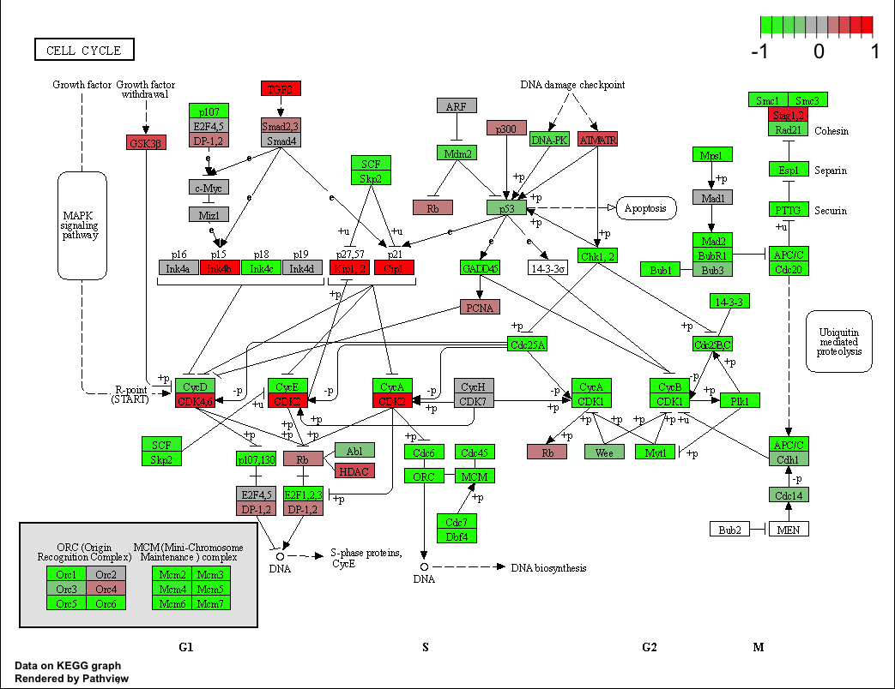
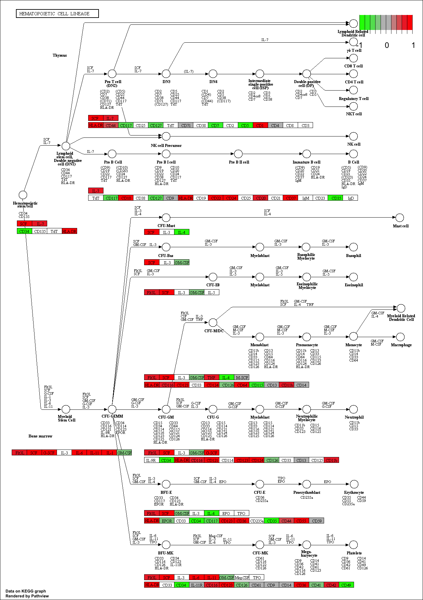
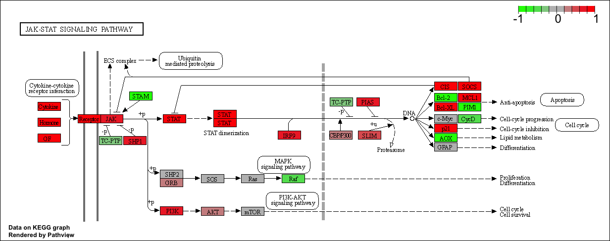
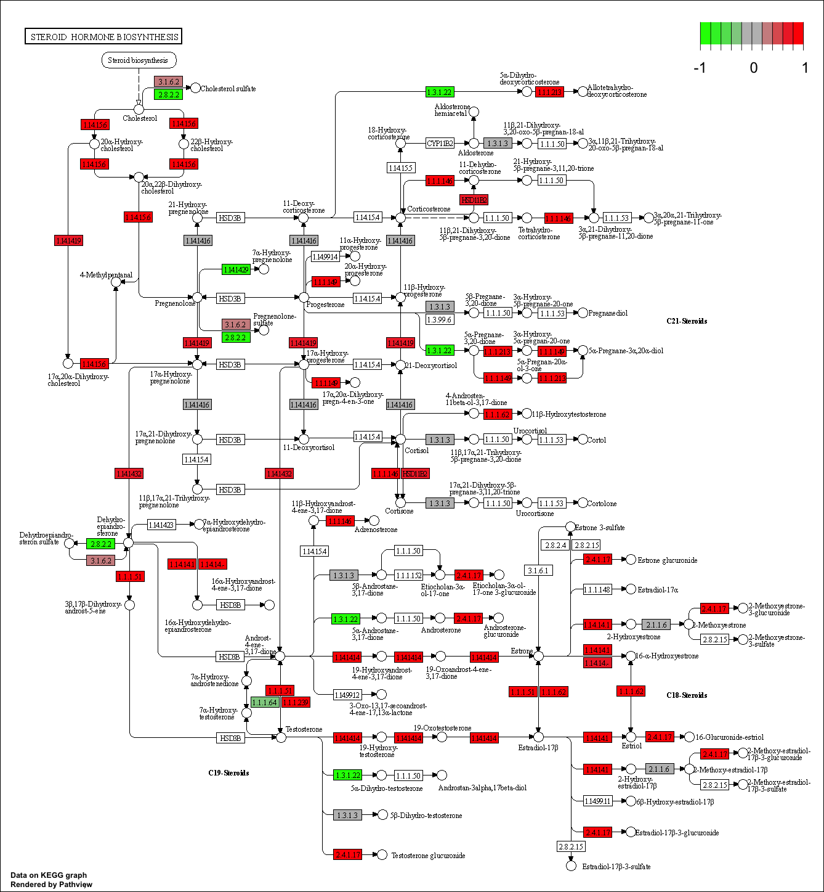
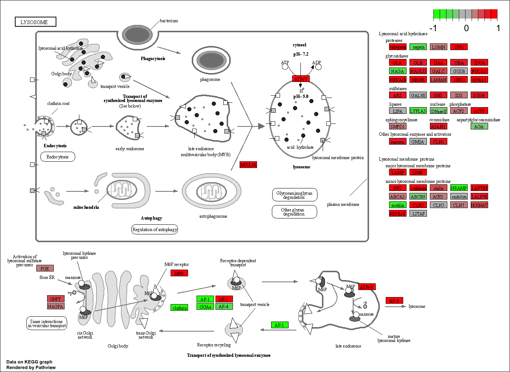
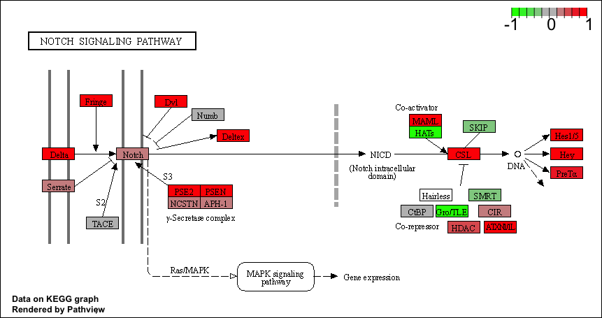

```{r message=FALSE}
library(DESeq2)
```

# 1. Data Import

Load data:

```{r}
metaFile <- "GSE37704_metadata.csv"
countFile <- "GSE37704_featurecounts.csv"
```

```{r}
colData <- read.csv(metaFile, row.names = 1)
head(colData)
```

```{r}
countData <- read.csv(countFile, row.names = 1)
head(countData)
```

We need to remove the first column (i.e. `countData$length`) to match with metadata:

```{r}
countData <- as.matrix(countData[, -1])
head(countData)
```

We also need to remove entries that has no reading (0 across all columns)
```{r}
row.rm = rowSums(countData) != 0
countData <- countData[row.rm,]
head(countData)
```

```{r}
nrow(countData)
```

# 2. PCA for Quality Control

```{r}
pca <- prcomp(t(countData))
summary(pca)
```

Plot first and second:
```{r}
plot(pca$x)
```

```{r}
plot(pca$x[, 1:2], pch = 16, col = as.factor(colData$condition))
text(pca$x[, 1:2], labels = colData$condition)
```

ggplot version:
```{r}
library(ggplot2)

x <- as.data.frame(pca$x)
x$condition <- colData$condition

ggplot(x, aes(PC1, PC2, col=condition)) + 
  geom_point()
```

# 3. Running DESeq2

```{r}
dds <- DESeqDataSetFromMatrix(countData = countData, 
                             colData = colData, 
                             design = ~condition)
dds <- DESeq(dds)
```

```{r}
dds
```

Get result from our DESeq data:
```{r}
res <-  results(dds)
```

```{r}
summary(res)
```

# 4. Volcano Plot

Let's do the classic log2-FoldChange vs p-value volcano plot

```{r}
plot(res$log2FoldChange, -log(res$padj))
```

Add color

```{r}
mycol <- rep("gray", nrow(res))
mycol[abs(res$log2FoldChange) > 2] <- "blue"
mycol[res$padj > 0.05 & abs(res$log2FoldChange) > 2] <- "red"

plot(res$log2FoldChange, -log(res$padj), col = mycol, xlab = "log2(FoldChange)", 
     ylab = "-log(p-value")
```

# 5. Annotation

```{r message=FALSE}
library("AnnotationDbi")
library("org.Hs.eg.db")
```

```{r}
columns(org.Hs.eg.db)
```


```{r}

res$symbol = mapIds(org.Hs.eg.db,
                    keys=row.names(res), 
                    keytype="ENSEMBL",
                    column="SYMBOL",
                    multiVals="first")

res$entrez = mapIds(org.Hs.eg.db,
                    keys=row.names(res),
                    keytype="ENSEMBL",
                    column="ENTREZID",
                    multiVals="first")

res$name =   mapIds(org.Hs.eg.db,
                    keys=row.names(res),
                    keytype="ENSEMBL",
                    column="GENENAME",
                    multiVals="first")

head(res, 10)
```

# 6. Pathway Analysis

Use KEGG pathways:
```{r message=FALSE}
library(pathview)
library(gage)
library(gageData)
```

```{r}
data(kegg.sets.hs)
data(sigmet.idx.hs)

# Focus on signaling and metabolic pathways only
kegg.sets.hs = kegg.sets.hs[sigmet.idx.hs]

# Examine the first 3 pathways
head(kegg.sets.hs, 3)
```

Make the input foldchange vector for KEGG and GO:
```{r}
foldchanges = res$log2FoldChange
names(foldchanges) = res$entrez
head(foldchanges)
```

```{r}
# Get the results
keggres = gage(foldchanges, gsets=kegg.sets.hs)
```

Look at the object return from `gage()`
```{r}
attributes(keggres)
```

Downregulated pathway:
```{r}
# Look at the first few down (less) pathways
head(keggres$less)
```

Let's look at the first downregulated pathway:
```{r}
pathview(gene.data=foldchanges, pathway.id="hsa04110")
```



We can automatically pull up 5 upregulated pathway by doing so
```{r}
keggrespathways <- rownames(keggres$greater)[1:5]

keggresids = substr(keggrespathways, start=1, stop=8)
keggresids
```

```{r message=FALSE}
pathview(gene.data=foldchanges, pathway.id=keggresids, species="hsa")
```







We can also do similar thing using gene ontology. Focus on biological process:

```{r}
data(go.sets.hs)
data(go.subs.hs)

# Focus on Biological Process subset of GO
gobpsets = go.sets.hs[go.subs.hs$BP]

gobpres = gage(foldchanges, gsets=gobpsets, same.dir=TRUE)

lapply(gobpres, head)
```

