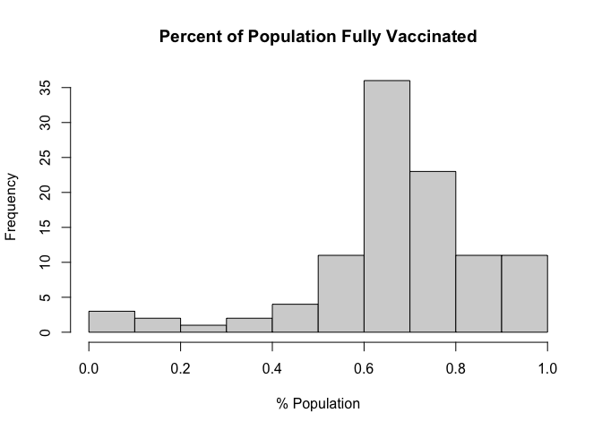
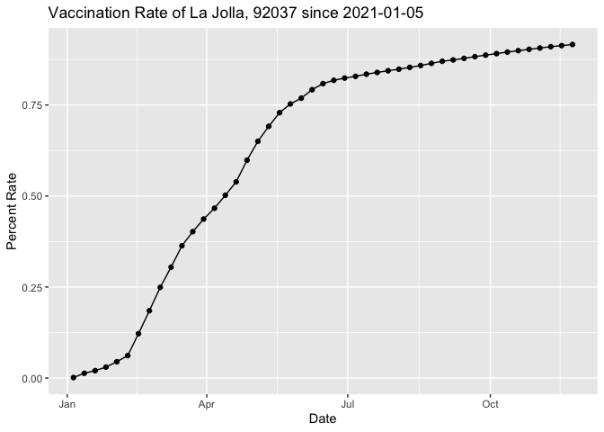
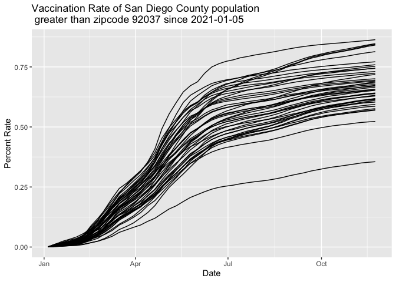

Class17: COVID-19 Vaccination Rates
================
Yuhan Zhang (PID: A13829264)
11/24/2021

# Background

Import the data:

``` r
vax <- read.csv("covid19vaccinesbyzipcode_test.csv", header = TRUE)
head(vax)
```

    ##   as_of_date zip_code_tabulation_area local_health_jurisdiction         county
    ## 1 2021-01-05                    92395            San Bernardino San Bernardino
    ## 2 2021-01-05                    93206                      Kern           Kern
    ## 3 2021-01-05                    91006               Los Angeles    Los Angeles
    ## 4 2021-01-05                    91901                 San Diego      San Diego
    ## 5 2021-01-05                    92230                 Riverside      Riverside
    ## 6 2021-01-05                    92662                    Orange         Orange
    ##   vaccine_equity_metric_quartile                 vem_source
    ## 1                              1 Healthy Places Index Score
    ## 2                              1 Healthy Places Index Score
    ## 3                              3 Healthy Places Index Score
    ## 4                              3 Healthy Places Index Score
    ## 5                              1 Healthy Places Index Score
    ## 6                              4 Healthy Places Index Score
    ##   age12_plus_population age5_plus_population persons_fully_vaccinated
    ## 1               35915.3                40888                       NA
    ## 2                1237.5                 1521                       NA
    ## 3               28742.7                31347                       19
    ## 4               15549.8                16905                       12
    ## 5                2320.2                 2526                       NA
    ## 6                2349.5                 2397                       NA
    ##   persons_partially_vaccinated percent_of_population_fully_vaccinated
    ## 1                           NA                                     NA
    ## 2                           NA                                     NA
    ## 3                          873                               0.000606
    ## 4                          271                               0.000710
    ## 5                           NA                                     NA
    ## 6                           NA                                     NA
    ##   percent_of_population_partially_vaccinated
    ## 1                                         NA
    ## 2                                         NA
    ## 3                                   0.027850
    ## 4                                   0.016031
    ## 5                                         NA
    ## 6                                         NA
    ##   percent_of_population_with_1_plus_dose
    ## 1                                     NA
    ## 2                                     NA
    ## 3                               0.028456
    ## 4                               0.016741
    ## 5                                     NA
    ## 6                                     NA
    ##                                                                redacted
    ## 1 Information redacted in accordance with CA state privacy requirements
    ## 2 Information redacted in accordance with CA state privacy requirements
    ## 3                                                                    No
    ## 4                                                                    No
    ## 5 Information redacted in accordance with CA state privacy requirements
    ## 6 Information redacted in accordance with CA state privacy requirements

> Q. How many entries do we have?

``` r
nrow(vax)
```

    ## [1] 82908

We can use the **skimr** package and the `skim()` function to get a
quick overview of structure of this dataset.

``` r
skimr::skim(vax)
```

|                                                  |       |
|:-------------------------------------------------|:------|
| Name                                             | vax   |
| Number of rows                                   | 82908 |
| Number of columns                                | 14    |
| \_\_\_\_\_\_\_\_\_\_\_\_\_\_\_\_\_\_\_\_\_\_\_   |       |
| Column type frequency:                           |       |
| character                                        | 5     |
| numeric                                          | 9     |
| \_\_\_\_\_\_\_\_\_\_\_\_\_\_\_\_\_\_\_\_\_\_\_\_ |       |
| Group variables                                  | None  |

Data summary

**Variable type: character**

| skim_variable             | n_missing | complete_rate | min | max | empty | n_unique | whitespace |
|:--------------------------|----------:|--------------:|----:|----:|------:|---------:|-----------:|
| as_of_date                |         0 |             1 |  10 |  10 |     0 |       47 |          0 |
| local_health_jurisdiction |         0 |             1 |   0 |  15 |   235 |       62 |          0 |
| county                    |         0 |             1 |   0 |  15 |   235 |       59 |          0 |
| vem_source                |         0 |             1 |  15 |  26 |     0 |        3 |          0 |
| redacted                  |         0 |             1 |   2 |  69 |     0 |        2 |          0 |

**Variable type: numeric**

| skim_variable                              | n_missing | complete_rate |     mean |       sd |    p0 |      p25 |      p50 |      p75 |     p100 | hist  |
|:-------------------------------------------|----------:|--------------:|---------:|---------:|------:|---------:|---------:|---------:|---------:|:------|
| zip_code_tabulation_area                   |         0 |          1.00 | 93665.11 |  1817.39 | 90001 | 92257.75 | 93658.50 | 95380.50 |  97635.0 | ▃▅▅▇▁ |
| vaccine_equity_metric_quartile             |      4089 |          0.95 |     2.44 |     1.11 |     1 |     1.00 |     2.00 |     3.00 |      4.0 | ▇▇▁▇▇ |
| age12_plus_population                      |         0 |          1.00 | 18895.04 | 18993.94 |     0 |  1346.95 | 13685.10 | 31756.12 |  88556.7 | ▇▃▂▁▁ |
| age5_plus_population                       |         0 |          1.00 | 20875.24 | 21106.04 |     0 |  1460.50 | 15364.00 | 34877.00 | 101902.0 | ▇▃▂▁▁ |
| persons_fully_vaccinated                   |      8355 |          0.90 |  9585.35 | 11609.12 |    11 |   516.00 |  4210.00 | 16095.00 |  71219.0 | ▇▂▁▁▁ |
| persons_partially_vaccinated               |      8355 |          0.90 |  1894.87 |  2105.55 |    11 |   198.00 |  1269.00 |  2880.00 |  20159.0 | ▇▁▁▁▁ |
| percent_of_population_fully_vaccinated     |      8355 |          0.90 |     0.43 |     0.27 |     0 |     0.20 |     0.44 |     0.63 |      1.0 | ▇▆▇▆▂ |
| percent_of_population_partially_vaccinated |      8355 |          0.90 |     0.10 |     0.10 |     0 |     0.06 |     0.07 |     0.11 |      1.0 | ▇▁▁▁▁ |
| percent_of_population_with_1\_plus_dose    |      8355 |          0.90 |     0.51 |     0.26 |     0 |     0.31 |     0.53 |     0.71 |      1.0 | ▅▅▇▇▃ |

Notice that one of these columns is a date column. Working with time and
dates get’s annoying quickly. we can use the **lubridate** package to
make this easy…

``` r
library(lubridate)
```

    ## 
    ## Attaching package: 'lubridate'

    ## The following objects are masked from 'package:base':
    ## 
    ##     date, intersect, setdiff, union

``` r
today()
```

    ## [1] "2021-12-03"

> Q. How many days since the first entry in the dataset?

``` r
vax$as_of_date[1]
```

    ## [1] "2021-01-05"

This will not work because our data column was read as character

``` r
# today() - vax$as_of_date[1]
```

``` r
d <- ymd(vax$as_of_date)
```

``` r
today() - d[1]
```

    ## Time difference of 332 days

I will make the `as_of_date` column Date format…

``` r
vax$as_of_date <- ymd(vax$as_of_date)
```

> Q. When was the data last updated? What it is the last date in this
> dataset? How many days since the last update?

``` r
today() - vax$as_of_date[nrow(vax)]
```

    ## Time difference of 10 days

> Q. How many days does the dataset span?

``` r
vax$as_of_date[nrow(vax)] - vax$as_of_date[1]
```

    ## Time difference of 322 days

> Q. How many different ZIP code areas are in this dataset?

``` r
length(unique(vax$zip_code_tabulation_area))
```

    ## [1] 1764

To work with ZIP codes we can use the **zipcodeR**

``` r
library(zipcodeR)
```

``` r
geocode_zip('92037')
```

    ## # A tibble: 1 × 3
    ##   zipcode   lat   lng
    ##   <chr>   <dbl> <dbl>
    ## 1 92037    32.8 -117.

Calculate distance:

``` r
zip_distance('92037','92109')
```

    ##   zipcode_a zipcode_b distance
    ## 1     92037     92109     2.33

Pull census data from zipcode:

``` r
reverse_zipcode(c('92037', "92109") )
```

    ## # A tibble: 2 × 24
    ##   zipcode zipcode_type major_city post_office_city common_city_list county state
    ##   <chr>   <chr>        <chr>      <chr>                      <blob> <chr>  <chr>
    ## 1 92037   Standard     La Jolla   La Jolla, CA           <raw 20 B> San D… CA   
    ## 2 92109   Standard     San Diego  San Diego, CA          <raw 21 B> San D… CA   
    ## # … with 17 more variables: lat <dbl>, lng <dbl>, timezone <chr>,
    ## #   radius_in_miles <dbl>, area_code_list <blob>, population <int>,
    ## #   population_density <dbl>, land_area_in_sqmi <dbl>,
    ## #   water_area_in_sqmi <dbl>, housing_units <int>,
    ## #   occupied_housing_units <int>, median_home_value <int>,
    ## #   median_household_income <int>, bounds_west <dbl>, bounds_east <dbl>,
    ## #   bounds_north <dbl>, bounds_south <dbl>

## Focus on San Diego County

We want to subset the full CA `vax` data down to just San Diego County

We could do this with base R

``` r
inds <- vax$county == "San Diego"
nrow(vax[inds,])
```

    ## [1] 5029

Subsetting can get tedious and complicated quickly when you have
multiple things we want to subset by.

``` r
library(dplyr)
```

We will use the `filter()` function to do our subsetting from now on.

We want to focus on San Diego County

``` r
sd <- filter(vax, county == "San Diego")
nrow(sd)
```

    ## [1] 5029

More complicated subsetting…

``` r
sd.20 <- filter(vax, county == "San Diego", 
       age5_plus_population > 20000)
nrow(sd.20)
```

    ## [1] 3055

> Q. What is the average vaccination rate of San Diego count as of
> yesterday?

``` r
sd.now <- filter(vax, county == "San Diego", as_of_date == "2021-11-23")
head(sd.now)
```

    ##   as_of_date zip_code_tabulation_area local_health_jurisdiction    county
    ## 1 2021-11-23                    92120                 San Diego San Diego
    ## 2 2021-11-23                    91962                 San Diego San Diego
    ## 3 2021-11-23                    92155                 San Diego San Diego
    ## 4 2021-11-23                    92147                 San Diego San Diego
    ## 5 2021-11-23                    91913                 San Diego San Diego
    ## 6 2021-11-23                    92114                 San Diego San Diego
    ##   vaccine_equity_metric_quartile                 vem_source
    ## 1                              4 Healthy Places Index Score
    ## 2                              3 Healthy Places Index Score
    ## 3                             NA            No VEM Assigned
    ## 4                             NA            No VEM Assigned
    ## 5                              3 Healthy Places Index Score
    ## 6                              2 Healthy Places Index Score
    ##   age12_plus_population age5_plus_population persons_fully_vaccinated
    ## 1               26372.9                28414                    21234
    ## 2                1758.7                 2020                      948
    ## 3                 456.0                  456                       70
    ## 4                 518.0                  518                       NA
    ## 5               43514.7                50461                    37974
    ## 6               59050.7                64945                    43708
    ##   persons_partially_vaccinated percent_of_population_fully_vaccinated
    ## 1                         3198                               0.747308
    ## 2                          126                               0.469307
    ## 3                           20                               0.153509
    ## 4                           NA                                     NA
    ## 5                         6690                               0.752542
    ## 6                         6261                               0.673000
    ##   percent_of_population_partially_vaccinated
    ## 1                                   0.112550
    ## 2                                   0.062376
    ## 3                                   0.043860
    ## 4                                         NA
    ## 5                                   0.132578
    ## 6                                   0.096405
    ##   percent_of_population_with_1_plus_dose
    ## 1                               0.859858
    ## 2                               0.531683
    ## 3                               0.197369
    ## 4                                     NA
    ## 5                               0.885120
    ## 6                               0.769405
    ##                                                                redacted
    ## 1                                                                    No
    ## 2                                                                    No
    ## 3                                                                    No
    ## 4 Information redacted in accordance with CA state privacy requirements
    ## 5                                                                    No
    ## 6                                                                    No

``` r
summary(sd.now$percent_of_population_fully_vaccinated)
```

    ##    Min. 1st Qu.  Median    Mean 3rd Qu.    Max.    NA's 
    ## 0.01017 0.61301 0.67965 0.67400 0.76932 1.00000       3

> Q. Make a histogram of these values.

``` r
hist(sd.now$percent_of_population_fully_vaccinated, 
     xlab = "% Population", main = "Percent of Population Fully Vaccinated")
```

<!-- -->

This is going to be susceptible to being skewed by ZIP code areas with
small populations. These will have big effects for just a small number
of unvax-ed folks…

> Q. What is the population of the 92037 ZIP code area?

``` r
lj <- filter(sd.now, zip_code_tabulation_area == 92037)
lj$age5_plus_population
```

    ## [1] 36144

> Q. What is the average vaccination value for this UCSD/La Jolla ZIP
> code area?

``` r
lj$percent_of_population_fully_vaccinated
```

    ## [1] 0.916196

``` r
lj2 <- filter(sd.now, zip_code_tabulation_area == 92122)
lj2$age5_plus_population
```

    ## [1] 45951

``` r
lj2$percent_of_population_fully_vaccinated
```

    ## [1] 0.771474

``` r
filter(sd.now, zip_code_tabulation_area == 92124)
```

    ##   as_of_date zip_code_tabulation_area local_health_jurisdiction    county
    ## 1 2021-11-23                    92124                 San Diego San Diego
    ##   vaccine_equity_metric_quartile                 vem_source
    ## 1                              3 Healthy Places Index Score
    ##   age12_plus_population age5_plus_population persons_fully_vaccinated
    ## 1               25422.4                29040                    16245
    ##   persons_partially_vaccinated percent_of_population_fully_vaccinated
    ## 1                         2677                               0.559401
    ##   percent_of_population_partially_vaccinated
    ## 1                                   0.092183
    ##   percent_of_population_with_1_plus_dose redacted
    ## 1                               0.651584       No

------------------------------------------------------------------------

Time series of vaccination rate for a given ZIP code area. Start with
92037.

``` r
ucsd <- filter(vax, zip_code_tabulation_area == 92037)
head(ucsd)
```

    ##   as_of_date zip_code_tabulation_area local_health_jurisdiction    county
    ## 1 2021-01-05                    92037                 San Diego San Diego
    ## 2 2021-01-12                    92037                 San Diego San Diego
    ## 3 2021-01-19                    92037                 San Diego San Diego
    ## 4 2021-01-26                    92037                 San Diego San Diego
    ## 5 2021-02-02                    92037                 San Diego San Diego
    ## 6 2021-02-09                    92037                 San Diego San Diego
    ##   vaccine_equity_metric_quartile                 vem_source
    ## 1                              4 Healthy Places Index Score
    ## 2                              4 Healthy Places Index Score
    ## 3                              4 Healthy Places Index Score
    ## 4                              4 Healthy Places Index Score
    ## 5                              4 Healthy Places Index Score
    ## 6                              4 Healthy Places Index Score
    ##   age12_plus_population age5_plus_population persons_fully_vaccinated
    ## 1               33675.6                36144                       46
    ## 2               33675.6                36144                      473
    ## 3               33675.6                36144                      733
    ## 4               33675.6                36144                     1081
    ## 5               33675.6                36144                     1617
    ## 6               33675.6                36144                     2227
    ##   persons_partially_vaccinated percent_of_population_fully_vaccinated
    ## 1                         1268                               0.001273
    ## 2                         1569                               0.013087
    ## 3                         3512                               0.020280
    ## 4                         6212                               0.029908
    ## 5                         8408                               0.044738
    ## 6                         9655                               0.061615
    ##   percent_of_population_partially_vaccinated
    ## 1                                   0.035082
    ## 2                                   0.043410
    ## 3                                   0.097167
    ## 4                                   0.171868
    ## 5                                   0.232625
    ## 6                                   0.267126
    ##   percent_of_population_with_1_plus_dose redacted
    ## 1                               0.036355       No
    ## 2                               0.056497       No
    ## 3                               0.117447       No
    ## 4                               0.201776       No
    ## 5                               0.277363       No
    ## 6                               0.328741       No

``` r
library(ggplot2)

ggplot(ucsd) + 
  aes(as_of_date, percent_of_population_fully_vaccinated) + 
  geom_line(group = 1) + 
  geom_point() + 
  labs(title = paste0("Vaccination Rate of La Jolla, 92037 since ", 
                      ucsd$as_of_date[1]),
       x = "Date", y = "Percent Rate")
```

<!-- -->

Let’s make this plot for all San Diego Count ZIP code areas that have a
population as least as large as 92037.

``` r
sd.36 <- filter(vax, county == "San Diego", 
             age5_plus_population > 36144)
head(sd.36)
```

    ##   as_of_date zip_code_tabulation_area local_health_jurisdiction    county
    ## 1 2021-01-05                    92058                 San Diego San Diego
    ## 2 2021-01-05                    92078                 San Diego San Diego
    ## 3 2021-01-05                    92019                 San Diego San Diego
    ## 4 2021-01-05                    92117                 San Diego San Diego
    ## 5 2021-01-05                    92057                 San Diego San Diego
    ## 6 2021-01-05                    91913                 San Diego San Diego
    ##   vaccine_equity_metric_quartile                 vem_source
    ## 1                              1 Healthy Places Index Score
    ## 2                              3 Healthy Places Index Score
    ## 3                              3 Healthy Places Index Score
    ## 4                              3 Healthy Places Index Score
    ## 5                              2 Healthy Places Index Score
    ## 6                              3 Healthy Places Index Score
    ##   age12_plus_population age5_plus_population persons_fully_vaccinated
    ## 1               34956.0                39695                       NA
    ## 2               41789.5                47476                       37
    ## 3               37439.4                40464                       25
    ## 4               50041.6                53839                       42
    ## 5               51927.0                56906                       22
    ## 6               43514.7                50461                       37
    ##   persons_partially_vaccinated percent_of_population_fully_vaccinated
    ## 1                           NA                                     NA
    ## 2                          688                               0.000779
    ## 3                          610                               0.000618
    ## 4                         1143                               0.000780
    ## 5                          691                               0.000387
    ## 6                         1993                               0.000733
    ##   percent_of_population_partially_vaccinated
    ## 1                                         NA
    ## 2                                   0.014492
    ## 3                                   0.015075
    ## 4                                   0.021230
    ## 5                                   0.012143
    ## 6                                   0.039496
    ##   percent_of_population_with_1_plus_dose
    ## 1                                     NA
    ## 2                               0.015271
    ## 3                               0.015693
    ## 4                               0.022010
    ## 5                               0.012530
    ## 6                               0.040229
    ##                                                                redacted
    ## 1 Information redacted in accordance with CA state privacy requirements
    ## 2                                                                    No
    ## 3                                                                    No
    ## 4                                                                    No
    ## 5                                                                    No
    ## 6                                                                    No

> How many ZIP code areas in San Diego County have a population larger
> than 92037?

``` r
length(unique(sd.36$zip_code_tabulation_area))
```

    ## [1] 43

``` r
ggplot(sd.36) + 
  aes(as_of_date, percent_of_population_fully_vaccinated, 
      group = zip_code_tabulation_area) + 
  geom_line() + 
  labs(title = 
         paste0(
           "Vaccination Rate of San Diego County population \n greater than zipcode 92037 since ", 
           ucsd$as_of_date[1]),
       x = "Date", y = "Percent Rate")
```

    ## Warning: Removed 1 row(s) containing missing values (geom_path).

<!-- -->

> Q. Make a plot like this for the all ZIP code areas in the State with
> a population at least as large as La Jolla.

``` r
ca <- filter(vax, age5_plus_population > 36144)
```

``` r
length(unique(ca$zip_code_tabulation_area))
```

    ## [1] 411

``` r
ggplot(ca) + 
  aes(as_of_date, percent_of_population_fully_vaccinated, 
      group = zip_code_tabulation_area) + 
  geom_line(alpha = 0.3) + 
  labs(title = 
         paste0(
           "Vaccination Rate of San Diego County population \n greater than zipcode 92037 since ", 
           ucsd$as_of_date[1]),
       x = "Date", y = "Percent Rate") + 
  geom_hline(yintercept = 0.67, col = "red")
```

    ## Warning: Removed 176 row(s) containing missing values (geom_path).

<!-- -->

> Q. What is the mean across the state for these 36k + population areas?

``` r
ca.now <- filter(ca, as_of_date == "2021-11-23")
summary(ca.now$percent_of_population_fully_vaccinated)
```

    ##    Min. 1st Qu.  Median    Mean 3rd Qu.    Max. 
    ##  0.3552  0.5939  0.6696  0.6672  0.7338  1.0000
