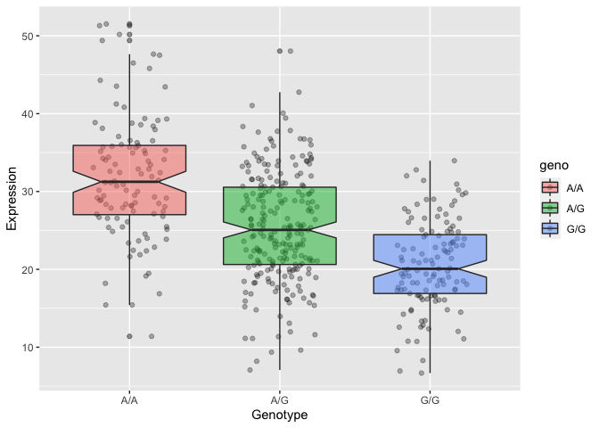

Class19: Genomic Analysis
================
Yuhan Zhang (PID: A13829264)
12/2/2021

> Q13: Read this file into R and determine the sample size for each
> genotype and their corresponding median expression levels for each of
> these genotypes. **Hint**: The `read.table()`, `summary()` and
> `boxplot()` functions will likely be useful here. There is an example
> R script online to be used ONLY if you are struggling in vein. Note
> that you can find the medium value from saving the output of the
> `boxplot()` function to an R object and examining this object. There
> is also the `medium()` and `summary()` function that you can use to
> check your understanding.

``` r
# read files
genome <- read.csv("rs8067378_ENSG00000172057.6.txt", sep = " ", 
                   row.names = 1, header = TRUE)
```

``` r
library(dplyr)
```

    ## 
    ## Attaching package: 'dplyr'

    ## The following objects are masked from 'package:stats':
    ## 
    ##     filter, lag

    ## The following objects are masked from 'package:base':
    ## 
    ##     intersect, setdiff, setequal, union

``` r
genome %>% 
  group_by(geno)%>%
  summarize(med = median(exp))
```

    ## # A tibble: 3 × 2
    ##   geno    med
    ##   <chr> <dbl>
    ## 1 A/A    31.2
    ## 2 A/G    25.1
    ## 3 G/G    20.1

The median expression level for A/A is 31.25, A/G is 25.06, G/G is
20.07.

> Q14: Generate a boxplot with a box per genotype, what could you infer
> from the relative expression value between A/A and G/G displayed in
> this plot? Does the SNP effect the expression of ORMDL3?

``` r
library(ggplot2)
p <- ggplot(genome) + aes(geno, exp, fill = geno) + 
  geom_jitter(width = 0.25, alpha = 0.3) +
  geom_boxplot(notch = TRUE, alpha = 0.5) + 
  labs(x = "Genotype", y = "Expression")
p
```

<!-- -->

The expression level with A/A SNP increase compare G/G. Thus SNP does
effect the expression level of ORMDL3.
